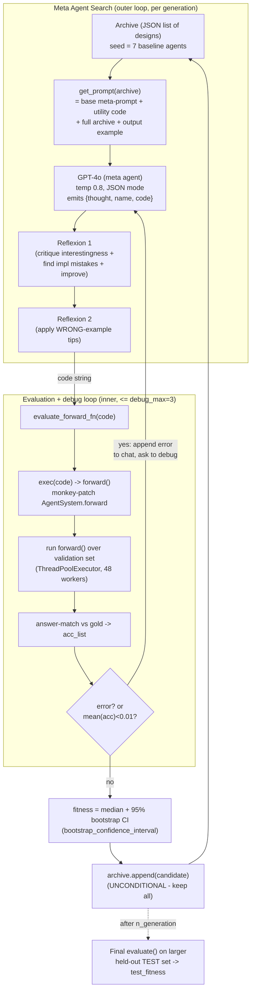
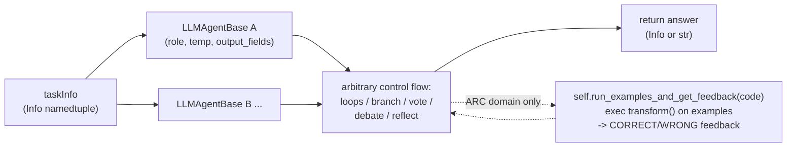

# ADAS — Automated Design of Agentic Systems (Meta Agent Search)

> Findings doc for the KB Seed AI project. Reporter, not architect. All nontrivial claims cited to the
> paper, author statements, code (`repo@SHA:path`), or independent critiques.

---

## 1. Identity

- **Name:** Automated Design of Agentic Systems (**ADAS**); the proposed algorithm is **Meta Agent Search**.
- **What it is:** A research-area framing + a concrete algorithm in which a **"meta" agent writes new
  agents as executable Python code**, iteratively, accumulating an **archive** of discovered agent
  designs. The meta agent reads the growing archive, proposes a new agent (as a `forward()` function),
  the new agent is run on a benchmark, scored, and appended to the archive. Repeat.
- **Authors / org:** Shengran Hu, Cong Lu, Jeff Clune — University of British Columbia / Vector Institute
  (Clune's lab; lineage of open-endedness / AI-generating-algorithms research). Cong Lu also at Vector.
- **Dates:** arXiv v1 16 Aug 2024 (arXiv:2408.08435). **ICLR 2025** accepted. **Outstanding Paper**,
  NeurIPS 2024 Open-World Agents workshop.
- **Primary links:**
  - Paper: https://arxiv.org/abs/2408.08435
  - Project site: https://www.shengranhu.com/ADAS/
  - Code: https://github.com/ShengranHu/ADAS
  - Author thread: https://twitter.com/shengranhu/status/1825555341922480322
- **Code repo + commit inspected:** `github.com/ShengranHu/ADAS@2702bee8fefda42255efc5be9f60e3bd3db96ae4`
  (branch `main`, commit dated 2025-01-28, "fix role description typo"). Inspected from the `main`
  tarball (`codeload.github.com/.../tar.gz/refs/heads/main`); SHA confirmed against the GitHub commits
  API. Code is Apache-2.0.

---

## 2. TL;DR

- **The core idea is "agents in code-space."** Instead of optimizing prompts or a fixed graph, the
  meta agent's search space is *arbitrary Python programs* over a small agent library. A candidate
  agent is literally the source of a `forward(self, taskInfo)` function; ADAS runs it with
  `exec()` and measures benchmark accuracy. This is the load-bearing bet: code is Turing-complete, so
  in principle any agentic system (any prompt, tool use, control flow, memory) is reachable.
- **The search engine is an LLM + an archive, not a GA.** There is no mutation/crossover operator over
  ASTs. The "evolution" is: feed the entire archive of prior designs (with their fitness) into a meta
  prompt, ask GPT-4o to invent the next *interesting* design, run it, append it. The archive is the
  memory and the stepping-stone store; the LLM is the variation operator.
- **Promotion is unconditional + accumulate-all, not "keep if better."** Unlike a hill-climber, every
  successfully-evaluated candidate is appended to the archive regardless of fitness (open-ended
  accumulation). Selection pressure is *implicit* — the meta agent is told to maximize fitness and sees
  all fitness values, but the code does not prune low performers.
- **It is a real, working, but narrow demonstration.** Domains are closed-form QA benchmarks
  (ARC, MMLU, DROP, MGSM, GSM8K). "Fitness" = median + 95% bootstrap CI of correct-rate on a small
  validation set (e.g. 128 questions). It is NOT building software, NOT long-horizon, NOT
  self-improving-the-meta-agent (the meta agent itself is fixed). Relevance to us is conceptual.
- **For a seed AI:** the genuinely transferable ideas are (a) representing candidates as *code* and
  exec-ing them, (b) an *append-only archive of prior designs fed back as context* as the variation
  substrate, (c) a built-in **debug/repair loop** that feeds runtime errors back to the LLM, and
  (d) explicit **"WRONG implementation examples"** in the meta prompt to suppress recurring failure
  modes. The fitness/verification side is weak (small val set, gameable) and is the part we'd need to
  replace for software.

---

## 3. What it does & how it works (mechanism-level)

### 3.1 Vocabulary

- **Agentic system / agent:** a Python function `forward(self, taskInfo) -> answer`. It may instantiate
  any number of LLM sub-agents, set their roles/temperatures, define arbitrary control flow
  (loops, branching, voting, debate, reflection), and return a final answer.
- **Building block / utility code:** a fixed mini-framework given to the meta agent: an `LLMAgentBase`
  class (wraps one GPT call, parses JSON into `Info` named-tuples), an `Info` namedtuple
  `(name, author, content, iteration_idx)`, and helper functions. The meta agent composes *these* into
  new agents but does not rewrite them.
- **Archive:** an ordered JSON list of designs. Each entry = `{thought, name, code, fitness,
  generation, ...}`. Seeded with 7 hand-written baseline agents.
- **Meta agent:** GPT-4o (`gpt-4o-2024-05-13`) prompted with the whole archive; emits the next design
  as JSON `{thought, name, code}`.
- **Fitness:** median and 95% bootstrap confidence interval of the correct-rate on a held-out
  *validation* set (separate from the final *test* set used in `evaluate()`).

### 3.2 The Meta Agent Search loop (the actual algorithm)

From `_mmlu/search.py:146-241` (`search()`), which is representative of all five domains:

1. **Init archive.** Load `get_init_archive()` (7 baseline agents) or resume from a saved
   `*_run_archive.json`. Evaluate any archive entry lacking a `fitness` field.
2. **For each generation `n` in `range(start, n_generation)`** (default `n_generation=30`):
   a. **Build meta prompt** from the *entire current archive*: `system_prompt, prompt = get_prompt(archive)`.
   b. **Generate** a candidate: `next_solution = get_json_response_from_gpt_reflect(msg_list, model)`
      (GPT-4o, temperature 0.8, JSON mode). Output keys: `thought`, `name`, `code`.
   c. **Reflexion ×2** (self-critique on the *just-proposed* design, in the same chat):
      - Append assistant msg + `Reflexion_prompt_1` (critique interestingness, find implementation
        mistakes, propose improvement) → regenerate.
      - Append + `Reflexion_prompt_2` (apply "WRONG implementation examples" tips) → regenerate.
   d. **Evaluate with a debug loop** (`for _ in range(args.debug_max)`, default 3):
      - `acc_list = evaluate_forward_fn(args, next_solution["code"])`.
      - If `mean(acc_list) < 0.01` while searching → raise "All 0 accuracy" (treated as failure).
      - On *any* exception, append the error text to the chat with an instruction to debug
        (repeat the `thought`, add a `debug_thought`), regenerate, retry — up to `debug_max` times.
   e. **Score & append.** `fitness_str = bootstrap_confidence_interval(acc_list)`; set
      `next_solution['fitness']`, `['generation'] = n+1`; strip `debug_thought`/`reflection`;
      `archive.append(next_solution)`; dump archive to disk.
   f. On generation-level failure (LLM error, or empty `acc_list` after retries): `n -= 1; continue`
      (i.e., retry the generation rather than advancing).
3. **Final evaluation** (`evaluate()`, `SEARCHING_MODE=False`): re-run every archived design on a larger
   held-out **test** set, recording `test_fitness`. This is the number reported in the paper.

Crucially: **there is no explicit selection/pruning step.** Every candidate that evaluates without a
fatal error is kept. The only "filters" are: it must parse, must run within `debug_max` tries, and must
not score ~0 during search. Selection pressure is entirely *in the prompt* ("maximize fitness", and the
meta agent sees all fitness values) plus the implicit bias of the LLM toward building on what looks good.

### 3.3 How a candidate agent is represented, executed, and scored

- **Representation = a code string.** The meta agent returns `code`: the text of a `forward()` function.
- **Execution via `exec`** (`_mmlu/search.py:279-290`, `evaluate_forward_fn`):
  ```python
  namespace = {}
  exec(forward_str, globals(), namespace)
  names = list(namespace.keys())
  if len(names) != 1:
      raise AssertionError(f"{len(names)} things in namespace. Please only provide 1")
  func = namespace[names[0]]
  if not callable(func):
      raise AssertionError(f"{func} is not callable")
  setattr(AgentSystem, "forward", func)
  ```
  The generated function is **monkey-patched onto `AgentSystem.forward`**, then run over every task in
  the validation/test set (parallelized with a `ThreadPoolExecutor`, up to 48 workers).
- **Scoring** is domain-specific answer-matching (e.g. for MMLU, map the returned letter/`Info.content`
  to an index and compare to gold), aggregated by `bootstrap_confidence_interval(acc_list)`.

### 3.4 Architecture diagram




*(A candidate agent IS the body of `forward(self, taskInfo)`. Each `LLMAgentBase` call = one
GPT-3.5/4 chat whose JSON is parsed into `list[Info]`. The meta agent composes these primitives; it does
not rewrite `LLMAgentBase`. In the ARC domain the agent can also write a `transform()` function and test
it on the few-shot examples via the harness method `run_examples_and_get_feedback`.)*

---

## 4. Evidence from the code

Inspected `ADAS@2702bee`. The repo has **no shared library**: each domain folder (`_arc`, `_drop`,
`_gpqa`, `_mgsm`, `_mmlu`) is self-contained with three files — `search.py` (the loop + harness),
`{domain}_prompt.py` (meta prompt + seed archive + reflexion prompts), `utils.py` (data + fitness).
`_transfer_math/` holds transfer-evaluation scripts (run a discovered design on GSM8K/SVAMP/Asdiv/etc.).

Files inspected (paths relative to repo root):
- `_mmlu/search.py` — canonical loop (the README's customization pointers reference this file).
- `_mmlu/mmlu_prompt.py` — the full meta prompt, seed archive, reflexion prompts.
- `_mmlu/utils.py` — `bootstrap_confidence_interval`, `format_multichoice_question`, `random_id`.
- `_arc/search.py`, `_arc/arc_prompt.py`, `_arc/utils.py` — the code-generation domain (richer; agents
  can write+test a `transform()` function on the few-shot examples).
- Confirmed the generation loop is structurally identical across `_mmlu/_drop/_gpqa/_mgsm/_arc`
  (same `for n in range(start, n_generation)` body, same `Reflexion_prompt_1/2`, `debug_max=3`,
  `All 0 accuracy` guard). Domains differ only in the prompt file and the answer-matcher. `_arc` uses
  `n_generation=25` (others 30) and is the only domain with an execution timeout.

### 4.1 The meta-agent prompt (verbatim core)

`repo@2702bee:_mmlu/mmlu_prompt.py:226-495` (`base`). The system prompt is just
`"You are a helpful assistant. Make sure to return in a WELL-FORMED JSON object."` The user prompt
opens:

> ```
> # Overview
> You are an expert machine learning researcher testing various agentic systems. Your objective is to
> design building blocks such as prompts and control flows within these systems to solve complex tasks.
> Your aim is to design an optimal agent performing well on the MMLU (Massive Multitask Language
> Understanding) benchmark ...
> ```

It then embeds **the full utility code** (the `LLMAgentBase`/`Info`/`get_json_response_from_gpt`
framework, ~190 lines, verbatim, so the meta agent knows the exact interface it must target), then:

> ```
> # Discovered architecture archive
> Here is the archive of the discovered architectures:
> [ARCHIVE]
> The fitness value is the median and 95% Bootstrap Confidence Interval of the correct rate on a
> validation question set. Your GOAL is to maximize the "fitness".
> ```

Output contract (`:423-434`):

> ```
> The first key should be ("thought") ... The second key ("name") ... Finally, the last key ("code")
> corresponds to the exact "forward()" function in Python code ... You must write a COMPLETE CODE in
> "code": Your code will be part of the entire project, so please implement complete, reliable,
> reusable code snippets.
> ... You must use the exact function interface used above.
> ```

And the closing "task" framing (`:489-495`) — this is the open-endedness instruction:

> ```
> # Your task
> You are deeply familiar with LLM prompting techniques and LLM agent works from the literature. Your
> goal is to maximize "fitness" by proposing interestingly new agents.
> Observe the discovered architectures carefully and think about what insights, lessons, or stepping
> stones can be learned from them.
> Be creative to think about the next interesting architecture to try. You are encouraged to draw
> inspiration from related LLM agent papers or academic papers from other research areas.
> Using the knowledge learned from the archive and the inspiration from academic literature to give
> the next interesting architecture.
> THINK OUTSIDE THE BOX.
> ```

### 4.2 The "WRONG implementation examples" block (a key reliability mechanism)

`repo@2702bee:_mmlu/mmlu_prompt.py:436-487`. The meta prompt hard-codes four concrete *anti-patterns*
the meta agent keeps making, each shown as wrong code + an explanation. Highlights (verbatim):

> ```
> 2. This is WRONG: ... feedback_info = verifier_agent([taskInfo, Info('feedback', 'Critic Agent',
>    thinking, 0)], ...) ... Second, you should never return an error message. You should always return
>    the best answer you can get. Third, you should never print anything in the code. Lastly, again, DO
>    NOT CREATE Info object by yourself.
> ```

This is essentially a *manually-curated lesson store* baked into the prompt, encoding the failure modes
observed during development. It is static (not learned online), but it is the main thing keeping the
generated code on-interface.

### 4.3 The Reflexion prompts (self-critique of the just-proposed design)

`repo@2702bee:_mmlu/mmlu_prompt.py:497-528`. Two messages, applied in sequence within the same chat:

- **Reflexion 1** asks the meta agent to assess **Interestingness** ("Assess whether your proposed
  architecture is interesting or innovative compared to existing methods in the archive ... Compare the
  proposal and the architectures in the archive CAREFULLY, including their actual differences in the
  implementation ... USE CRITICAL THINKING!"), **Implementation Mistakes** ("Review the code carefully,
  debug any issues ... REMEMBER checking '## WRONG Implementation examples'"), and **Improvement**, then
  re-emit `reflection`/`thought`/`name`/`code`. Note the explicit anti-naming rule: *"Don't put words
  like 'new' or 'improved' in the name."*
- **Reflexion 2** ("Using the tips in '## WRONG Implementation examples' section, revise the code
  further...") forces a second code revision pass.

So **every candidate is critiqued and revised twice before it is ever run** — a generate→self-critique
×2 pipeline, independent of the runtime-error debug loop.

### 4.4 The seed archive (the stepping stones)

`get_init_archive()` returns 7 hand-written baseline agents (`:531-532`):
**Chain-of-Thought, Self-Consistency w/ CoT (majority vote, N=5), Self-Refine (Reflexion, critic loop
N_max=5), LLM-Debate (4 expert roles × 2 rounds + final-decision agent), Step-back Abstraction,
Quality-Diversity (generate diverse solutions then aggregate), Dynamic Role Assignment (router →
expert)**. Each is a complete `forward()` plus a `thought` explaining the technique. These both
*bootstrap* the search and *teach the format* by example. In `_arc` the seeds are code-writing variants
that call `self.run_examples_and_get_feedback`.

### 4.5 Candidate execution + the fitness function (verbatim)

`evaluate_forward_fn` (`repo@2702bee:_mmlu/search.py:279-359`) exec's the code string, asserts exactly
one top-level object is defined, binds it to `AgentSystem.forward`, runs it across the question set with
a `ThreadPoolExecutor(max_workers=48)`, then answer-matches. The exec/bind core:

```python
namespace = {}
exec(forward_str, globals(), namespace)
names = list(namespace.keys())
if len(names) != 1:
    raise AssertionError(f"{len(names)} things in namespace. Please only provide 1")
func = namespace[names[0]]
if not callable(func):
    raise AssertionError(f"{func} is not callable")
setattr(AgentSystem, "forward", func)
```

Fitness (`repo@2702bee:_mmlu/utils.py:31-76`): 100,000 bootstrap resamples of the 0/1 accuracy list →
`"95% Bootstrap Confidence Interval: (lo%, hi%), Median: m%"`. This *string* is what gets stored as
`fitness` and fed back to the meta agent.

### 4.6 The ARC domain — a nested code-write/test/refine loop (most relevant to us)

In `_arc`, `AgentSystem` is constructed with the task's few-shot `examples` and `test_input`
(`repo@2702bee:_arc/search.py:156-159`), and exposes two methods to the generated agent:
- `run_examples_and_get_feedback(code)` (`:161-206`): `exec`'s the agent-written `transform` function,
  runs it on each training example, and returns **structured natural-language feedback** ("Your
  transform function generates a WRONG answer in Example 0! Expect: ... You got: ... Observe ...
  CORRECT answer in Example 1! ...") plus the lists of correct/wrong examples.
- `get_test_output_from_code(code)` (`:208-234`): `exec`'s `transform`, runs it on the held-out test
  input, returns the output.

So in ARC the *discovered agents themselves* can do "write code → run it on examples → read feedback →
refine" — i.e., a verifier-in-the-loop coding agent. The seed `Reflexion` design's `thought` explicitly
nudges this: *"It is very good practice to use `self.run_examples_and_get_feedback` to get feedback. One
should consider trying to use this feedback in future agent design."*
(`repo@2702bee:_arc/arc_prompt.py:65`). The grading harness `eval_algo`
(`repo@2702bee:_arc/utils.py:77-101`) runs the final `solve_fn` with a **30-second timeout** per test
case — the only execution-time safeguard in the whole repo.

### 4.7 The debug / repair loop (verbatim)

`repo@2702bee:_mmlu/search.py:205-226`. After generation, up to `debug_max=3` attempts:

```python
acc_list = []
for _ in range(args.debug_max):
    try:
        acc_list = evaluate_forward_fn(args, next_solution["code"])
        if np.mean(acc_list) < 0.01 and SEARCHING_MODE:
            raise Exception("All 0 accuracy")
        break
    except Exception as e:
        print("During evaluation:")
        print(e)
        msg_list.append({"role": "assistant", "content": str(next_solution)})
        msg_list.append({"role": "user", "content": f"Error during evaluation:\n{e}\nCarefully consider where you went wrong in your latest implementation. Using insights from previous attempts, try to debug the current code to implement the same thought. Repeat your previous thought in 'thought', and put your thinking for debugging in 'debug_thought'"})
        try:
            next_solution = get_json_response_from_gpt_reflect(msg_list, args.model)
        except Exception as e:
            print("During LLM generate new solution:")
            print(e)
            continue
        continue
```

The runtime exception text is fed straight back to the meta agent as the next user message. Two implicit
filters double as gentle "validity gates": (1) the `< 0.01` mean-accuracy check rejects degenerate
agents while searching; (2) `LLMAgentBase.query` raises `"The context is too long. Please try to design
the agent to have shorter context."` on context-overflow (`_mmlu/search.py:119-120`), pushing the meta
agent toward leaner designs.

### 4.8 No safety sandboxing

A repo-wide search for `sandbox|subprocess|docker|restrict|os.system|malicious|safe_` returns **nothing**
in the execution path. Untrusted, model-generated code is run with bare `exec(code, globals(), namespace)`
in the host Python process (`_mmlu/search.py:283`; `_arc/search.py:177,221`). The only mitigation is the
ARC 30-second `future.result(timeout=30)` (`_arc/utils.py:90`). The README ships an explicit
`Safety Consideration` WARNING acknowledging this (executing untrusted model-generated code "may still
act destructively due to limitations in model capability or alignment"). For our purposes this is a
cautionary data point, not a usable safety design.

---

## 5. What's genuinely smart

1. **Search space = code, not prompts or fixed graphs.** This is the central, genuinely important idea.
   By making a candidate *an arbitrary Python `forward()` over a small agent library*, the search space
   is Turing-complete: any prompt, any number of agents, any control flow, any tool call, any
   memory/aggregation scheme is reachable in one representation. The paper argues this *subsumes* prior
   work that hand-fixes one axis (prompt optimization, fixed multi-agent topologies). For a seed AI this
   reframes "agent design" as "program synthesis," which is the right level of generality.
2. **The archive is both memory and variation substrate.** The entire history of prior designs (code +
   `thought` + fitness) is fed back into the meta prompt every generation. The LLM is the variation
   operator; the archive is what it varies *from*. This is a clean realization of the open-endedness /
   "stepping stones" idea (Clune's AI-GAs agenda; Stanley's novelty/QD lineage): keep everything, let
   later designs recombine and build on earlier ones. No bespoke mutation/crossover operators needed.
3. **Generate → self-critique ×2 → run → debug ×3.** The pipeline separates *idea generation* from
   *implementation correctness*. Reflexion-1/2 pressure the design to be *interesting and correctly
   implemented* before any compute is spent running it; the post-hoc debug loop repairs runtime errors
   by feeding the traceback back. A pragmatic recipe for getting LLM-written code to actually run,
   reusable independent of the rest of ADAS.
4. **Failure modes encoded as in-context "lessons."** The "WRONG implementation examples" block is a
   manually-distilled lesson store: concrete wrong code + why it's wrong, kept in the prompt. It is the
   main thing that keeps generated agents on the (idiosyncratic) `Info`/`LLMAgentBase` interface. The
   general lesson — *encode recurring failure modes as concrete negative examples in the proposer's
   context* — transfers to any code-generating loop.
5. **Fitness as an interval, not a point.** Reporting median + 95% bootstrap CI (rather than a single
   accuracy number) communicates *uncertainty* to the meta agent and the experimenter. With small
   validation sets this matters; it's a cheap, honest way to avoid over-trusting a single noisy score.
   (It does not, however, gate promotion — see §6.)
6. **A verifier-in-the-loop coding sub-capability (ARC).** The ARC harness lets discovered agents write
   a `transform()` function, execute it on examples, and get structured pass/fail feedback. That is a
   miniature of exactly the propose→test→refine loop a software-building seed AI needs — and the search
   *discovered* agents that exploit it.
7. **Transfer / generality probing.** `_transfer_math/` evaluates a design discovered on one benchmark
   against others (GSM8K, GSM-Hard, SVAMP, Asdiv, etc.), testing whether discovered agents generalize
   rather than overfit the search benchmark — a discipline worth copying.

---

## 6. Claims vs. reality / limitations / critiques

**(A) What the authors claim.** ADAS/Meta Agent Search discovers agent designs that *substantially
outperform* state-of-the-art hand-designed baselines, and the discovered designs *transfer* across
models and domains (a design found on one benchmark helps on others, and survives swapping the
underlying LLM). They frame it as evidence that "agents can invent novel and powerful agent designs"
and as the seed of a new research area (ADAS).

**Headline numbers (ICLR'25 camera-ready).** Discovered agents beat SOTA hand-designed baselines by
**+13.6 F1 on reading comprehension (DROP)** and **+14.4% accuracy on math (MGSM)**; gains on
Multi-task (MMLU) and Science (GPQA) are *smaller* — the authors hypothesize FM knowledge, not scaffold,
is the bottleneck there. Transfer: a design found on one domain beats baselines on held-out domains
(e.g. **+25.9% on GSM8K, +13.2% on GSM-Hard**) and survives swapping the model (GPT-3.5 → Claude-Sonnet),
though a transferred agent still underperforms an agent searched natively for that domain. A reported
qualitative finding: the best GPT-3.5 agent used a *complex* feedback mechanism, but on stronger models a
*simpler feedback + more refinement* design won — i.e., optimal scaffold complexity tracks model
capability. (Source: `proceedings.iclr.cc/.../36b7acf6...-Paper-Conference.pdf`.)

**(B) What the code/experiments actually demonstrate.** A working meta-loop on **five closed-form QA
benchmarks** (ARC, MMLU, DROP, MGSM, + math transfer). "Performance" = answer-matching accuracy on a
**small validation set** (e.g. `valid_size=128` for MMLU) during search, then a larger held-out test set
for the reported numbers. The meta agent is **GPT-4o** (`gpt-4o-2024-05-13`); sub-agents default to
**GPT-3.5** (`gpt-3.5-turbo-0125`). So the demonstration is real but **narrow**: short-horizon,
single-turn QA with automatically-checkable answers; no software engineering, no long-horizon tasks, no
tool ecosystems.

**(C) Limitations & critiques (with the failure-mode lens our project cares about):**

- **Not "keep if verifiably better" — it keeps everything.** The archive is append-only with **no
  promotion gate**; selection pressure is only the prompt instruction "maximize fitness." There is no
  guarantee fitness monotonically improves, and the best design may appear early and never be revisited.
  This differs from a strict hill-climb / "keep iff better" loop.
- **The meta agent is fixed — this is NOT self-improving in the recursive sense.** ADAS designs
  *object-level* agents; the *meta* agent (its prompt, its loop, its library) does not change. It is one
  level of "agents designing agents," not a recursively self-improving system. (The same authors' later
  **Darwin Gödel Machine** is the work that closes that loop; ADAS is the precursor.)
- **Weak, gameable verifier.** Fitness is accuracy on ~128 validation questions matched by brittle
  string rules (`'A)' in res`, letter-index maps). On such small sets the search can **overfit the
  validation split**, and the answer-matcher can be gamed (an agent that games the output format can
  score without solving the task). The paper's transfer experiments are the main hedge against this, but
  reported search-set gains should be read with the overfitting caveat.
- **Reproducibility / cost concerns.** Each generation = many GPT-4o calls (generate + 2 reflexions +
  up to 3 debug retries) plus running the candidate over the validation set (dozens of GPT-3.5 calls ×
  128 questions × workers). Runs are stochastic (temp 0.8, random shuffles); the repo ships result
  archives but a clean re-run is expensive and noisy.
- **Idiosyncratic, leaky interface.** The whole thing hinges on the `Info`/`LLMAgentBase` mini-API; a
  large fraction of the meta prompt (the "WRONG examples", the format scolding) exists purely to stop
  the LLM from misusing that API. Much of the engineering is interface-babysitting, not search.
- **Safety — and a claim/code discrepancy.** The **ICLR camera-ready claims** "containerized execution
  of all generated code in secure, isolated environments, thorough manual inspections ... and clear
  warnings." But the **public repo at `2702bee` has no containerization** — generated code runs via bare
  `exec(code, globals(), namespace)` in-process (§4.8); the only runtime guard is ARC's 30s timeout, and
  the only "warning" is the README note. So the sandboxing described in the paper is *not* in the shipped
  code (it may have lived in the authors' private harness). Treat the repo as unsafe-by-default; do not
  copy its execution model for an autonomous agent.

**(D) The strongest independent critique — "Inefficiencies of Meta Agents for Agent Design"**
(arXiv:2510.06711 / EMNLP 2025 Findings, `aclanthology.org/2025.findings-emnlp.1135.pdf`). This paper
directly stress-tests ADAS-style meta-agents and lands three findings that matter for us:
1. **ADAS's central mechanism — feeding the *entire* archive back as context — does not help, and can
   hurt.** "Cumulative context curation does not outperform parallel context curation, suggesting that
   ADAS-style meta-agents derive limited benefits from prior agent designs and perform worse than
   ignoring prior designs entirely." A simple **evolutionary** strategy (condition generation on the
   *best-performing parents* only) beats it (+up to 10% on MGSM). This is a serious challenge to the
   load-bearing "archive-as-context" idea: dumping all history in-context is *worse* than either
   ignoring it or selecting good parents.
2. **Low behavioral diversity.** Discovered agents tend to succeed/fail on the *same* questions; the
   archive does not yield complementary specialists (and evolutionary selection makes diversity worse).
3. **Often not economically viable.** Counting design + inference cost, the meta-designed agent only
   beats the cost-per-correct-answer of human-designed agents after **~15,000 examples** (MMLU, DROP);
   for other datasets the gains never justify the cost. They also reiterate the stochasticity problem
   (≥5 sources of randomness; needs multiple trajectory runs) and the safety concern of "unchecked
   generation and execution of complex systems."

Other secondary commentary (LessWrong linkpost, bdtechtalks) is largely descriptive and echoes the
authors' framing; the FM-knowledge-ceiling caveat is acknowledged by the authors themselves.

---

## 7. Relevance to a self-improving, evolutionary, software-building agent

This is conceptually one of the most on-point sources in the canon: it is *literally* "an agent that
writes agents as code, in an open-ended loop, kept in an archive." But it operates on QA benchmarks, not
software, and the verification + archive mechanisms are exactly the parts that don't transfer cleanly.
Mapped to our design problem:

- **Candidate-as-code + exec-and-measure (HIGH relevance, to the "propose" + "represent" steps).** The
  core representation — a candidate is *source code* you `exec` and run — is the right primitive for a
  software-building seed AI. ADAS validates that an LLM can reliably emit runnable agent code against a
  fixed library and that a tight generate/run/measure loop closes. Our analogue: candidate = a code
  change / program; "run" = build + test.
- **Archive-as-memory / stepping stones (MEDIUM, with a strong caveat).** The idea of accumulating prior
  attempts and conditioning new proposals on them is directly relevant to long-horizon, open-ended
  improvement. **But** the EMNLP critique (§6D) shows ADAS's specific implementation — *feed the whole
  archive in-context* — is ineffective; **parent-selection / evolutionary sampling** (as in the authors'
  own later DGM) is the better realization. Lesson for us: keep an archive, but *select* what to condition
  on (best parents, diverse stepping stones), don't naively concatenate everything.
- **The runtime-error debug loop (HIGH, to the "make it run" sub-problem).** Feeding the exception text
  back to the proposer for up to N retries is a simple, reusable reliability mechanism for any
  code-generating agent — exactly what a seed AI needs to turn "plausible code" into "code that runs."
- **Generate → self-critique-for-novelty → revise, *before* spending eval compute (MEDIUM).** Separating
  "is this idea new/sound?" from "does it run?" front-loads cheap filtering. For us: cheap static/LLM
  review gates before expensive build+test cycles.
- **Failure modes as negative examples in the proposer prompt (MEDIUM).** The "WRONG implementation
  examples" block is a concrete, cheap form of accumulated procedural memory — encode recurring mistakes
  as in-context negative exemplars. Relevant to a memory/lessons system.
- **Fitness as an interval + a held-out test pass (MEDIUM, but our verifier must be far stronger).** The
  median+95%-CI fitness and the separate search-vs-test split are good hygiene against noise and
  overfitting. The cautionary lesson: ADAS's verifier (128 Qs, string-match) is too weak and gameable;
  for software we need real, hard-to-game verification (test suites, type/compile checks, multiple held-out
  problem sets) — this is the part to *not* copy and to invest in heavily.
- **Verifier-in-the-loop coding (HIGH, via the ARC harness).** ARC's `run_examples_and_get_feedback`
  (write `transform()` → run on examples → structured pass/fail feedback → refine) is a clean miniature
  of the propose→test→keep loop we want, and ADAS shows the *search* can discover agents that exploit it.
- **What does NOT transfer:** the unconditional keep-everything promotion (we want "keep if verifiably
  better"); the in-process `exec` with no sandbox (we need isolation); single-objective fitness (we'll
  likely need cost/latency/robustness too); the assumption that a tiny validation set is a trustworthy
  signal. And ADAS does **not** demonstrate the recursive/self-improving step — the meta agent is fixed.
  For "improving its own agent design," the relevant successor is **DGM** (§8), not ADAS itself.

---

## 8. Reusable assets (collected as evidence; not assembled into a design)

All paths are `repo@2702bee` unless noted.

**A. The meta-agent prompt scaffold** (`_mmlu/mmlu_prompt.py:226-495`). Reusable *shape*: (Overview /
goal) + (verbatim utility-code/API the proposer must target) + (`[ARCHIVE]` of prior designs with
fitness) + (strict JSON output contract: `thought`/`name`/`code`) + (output example) + ("WRONG
implementation examples") + (open-ended "THINK OUTSIDE THE BOX / build on stepping stones" task framing).
The closing task framing verbatim:
> "Observe the discovered architectures carefully and think about what insights, lessons, or stepping
> stones can be learned from them. Be creative ... You are encouraged to draw inspiration from related
> LLM agent papers or academic papers from other research areas. ... THINK OUTSIDE THE BOX."

**B. The two Reflexion prompts** (`_mmlu/mmlu_prompt.py:497-528`) — verbatim, reusable as a
"self-critique a proposed code change for novelty + correctness before running it" step. Includes the
nice anti-pattern rule: *"Don't put words like 'new' or 'improved' in the name."*

**C. The "WRONG implementation examples" block** (`_mmlu/mmlu_prompt.py:436-487`) — template for an
in-context "lessons / known failure modes" list. Key reusable instructions: *"you should never return an
error message. You should always return the best answer you can get"*, *"you should never print anything
in the code."*

**D. The runtime-error debug loop** (`_mmlu/search.py:205-226`, quoted verbatim in §4.7) — copy-able
control structure: try eval → on exception, append the traceback to the chat with a "repeat your thought,
put debugging in `debug_thought`" instruction → regenerate → retry up to `debug_max`.

**E. The exec/bind/evaluate harness** (`_mmlu/search.py:279-290`, quoted in §4.5) — pattern for safely-ish
turning a code string into a runnable function (`exec` into a fresh namespace, assert exactly one callable,
bind it). NOTE: add real sandboxing before reuse.

**F. The fitness function** (`_mmlu/utils.py:31-76`) — `bootstrap_confidence_interval(data, n=100000)`
returning median + 95% CI as a formatted string; reusable for reporting noisy eval scores as intervals.

**G. The ARC code-test-feedback methods** (`_arc/search.py:161-234`; harness `_arc/utils.py:77-101`) —
`run_examples_and_get_feedback(code)` (structured per-example CORRECT/WRONG NL feedback) and
`get_test_output_from_code(code)`, with a 30s `future.result(timeout=30)` execution guard. A reusable
pattern for "agent writes code, we run it on examples and hand back structured feedback."

**H. The archive data schema** — JSON list of
`{"thought": str, "name": str, "code": str, "fitness": str, "generation": int|"initial",
"test_fitness": str?}`. Minimal, human-readable, append-only, resumable (the loop reloads
`*_run_archive.json` and continues from the last `generation`).

**I. The seed-archive baselines** (`_mmlu/mmlu_prompt.py:12-222`) — 7 complete, commented `forward()`
implementations of CoT, CoT-SC, Reflexion, LLM-Debate, Step-back, Quality-Diversity, Dynamic-Role; usable
as ready-made reference scaffolds and as format-teaching examples for a proposer.

---

## 9. Signal assessment

- **Overall value: HIGH (conceptual / framing), MEDIUM (directly reusable mechanism).** ADAS is the
  canonical statement of "agents designing agents in code space, accumulated in an archive," which is
  squarely our problem framing, and it ships real, readable code for the loop. That makes it high-signal
  as a reference point and a source of concrete, copy-able sub-mechanisms (debug loop, self-critique,
  WRONG-examples lessons, exec harness, ARC code-test feedback). It is only *medium* as a blueprint
  because its two most load-bearing pieces for *us* — the verifier and the archive-conditioning — are
  weak/ineffective as implemented (small gameable val set; whole-archive-in-context shown to underperform
  parent-selection), and it does not demonstrate recursive self-improvement at all.
- **Confidence: HIGH on mechanism.** I read the actual loop, prompts, fitness, exec path, and ARC
  feedback methods at a known commit (`2702bee`) and cross-checked the algorithm against the ICLR
  camera-ready's Figure-1 description; they agree. Confidence HIGH on the existence and direction of the
  independent critique (peer-reviewed EMNLP 2025 Findings + arXiv).
- **What I could NOT verify:**
  - The paper's quantitative results — I did not re-run the search (expensive, stochastic, needs OpenAI
    keys); numbers are taken from the camera-ready, not reproduced. The EMNLP critique's stochasticity
    analysis suggests single runs are unreliable.
  - The **sandboxing claim**: I could confirm the paper *claims* containerized execution but could **not**
    find any containerization in the public repo at `2702bee`; I could not determine what the authors'
    private experimental harness actually did.
  - I inspected the `main` tarball (SHA confirmed via GitHub API) rather than a live `git clone` (the
    sandbox proxy blocked `github.com` clone with HTTP 407; the `codeload.github.com` tarball succeeded).
  - I did not exhaustively read the `_drop`/`_gpqa`/`_mgsm` prompt files (only confirmed their search
    loops are structurally identical to `_mmlu` and skimmed the ARC prompt); domain-specific prompt
    wording may vary in minor ways.

---

## 10. References

**Primary — paper / authors**
- Hu, Lu, Clune, *Automated Design of Agentic Systems*, arXiv:2408.08435 (v1 Aug 2024), ICLR 2025.
  Abstract page: https://arxiv.org/abs/2408.08435
- ICLR 2025 camera-ready (full text, used for headline numbers + Fig-1 algorithm + safety claim):
  https://proceedings.iclr.cc/paper_files/paper/2025/file/36b7acf6f6010652b3f2a433774a66fe-Paper-Conference.pdf
- OpenReview (ICLR'25): https://openreview.net/pdf?id=Y15VNMYaoC
- Project site: https://www.shengranhu.com/ADAS/
- Author thread (announcement): https://twitter.com/shengranhu/status/1825555341922480322

**Primary — code (inspected)**
- Repo: https://github.com/ShengranHu/ADAS — inspected at
  `ShengranHu/ADAS@2702bee8fefda42255efc5be9f60e3bd3db96ae4` (branch `main`, 2025-01-28). Apache-2.0.
  - `repo@2702bee:_mmlu/search.py` — meta-search loop, exec harness, debug loop, eval/test split.
  - `repo@2702bee:_mmlu/mmlu_prompt.py` — meta prompt (`base`), seed archive, Reflexion prompts, WRONG-examples.
  - `repo@2702bee:_mmlu/utils.py` — `bootstrap_confidence_interval`, answer formatting.
  - `repo@2702bee:_arc/search.py`, `_arc/arc_prompt.py`, `_arc/utils.py` — code-gen domain, `run_examples_and_get_feedback`, 30s timeout.
  - `repo@2702bee:README.md` — Safety Consideration warning; setup; customization pointers.

**Primary — successor work (for the recursive-self-improvement step ADAS does NOT do)**
- Zhang, Hu, Lu, Lange, Clune, *Darwin Gödel Machine: Open-Ended Evolution of Self-Improving Agents*,
  arXiv:2505.22954 (May 2025). https://arxiv.org/abs/2505.22954 ; code https://github.com/jennyzzt/dgm ;
  OpenReview https://openreview.net/forum?id=pUpzQZTvGY . DGM self-modifies its *own* coding-agent code,
  samples *parents* from an archive (not whole-archive-in-context), validates on SWE-bench (20.0%→50.0%)
  and Polyglot (14.2%→30.7%), with **sandboxing + human oversight**. (Referenced only to delimit what ADAS
  does/does not do; full coverage belongs to the DGM source's own findings doc.)

**Secondary — independent critique**
- *Inefficiencies of Meta Agents for Agent Design*, arXiv:2510.06711 / EMNLP 2025 Findings.
  https://arxiv.org/html/2510.06711 ; https://aclanthology.org/2025.findings-emnlp.1135.pdf
  (cumulative-context underperforms; low diversity; ~15k-example economic break-even).

**Secondary — commentary**
- LessWrong linkpost (Aug 19 2024): https://www.lesswrong.com/posts/KK9fgv4QyvikX7Ytb/linkpost-automated-design-of-agentic-systems
- B. Dickson, "How LLMs can automatically design agentic systems," TechTalks (Sep 9 2024):
  https://bdtechtalks.com/2024/09/09/adas-automated-agent-design/