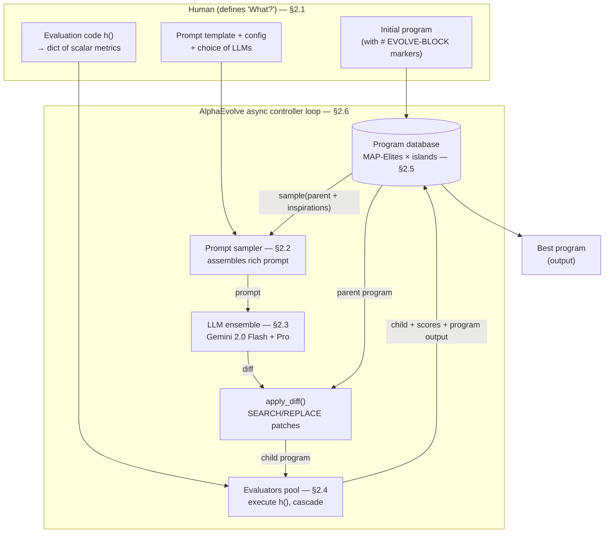
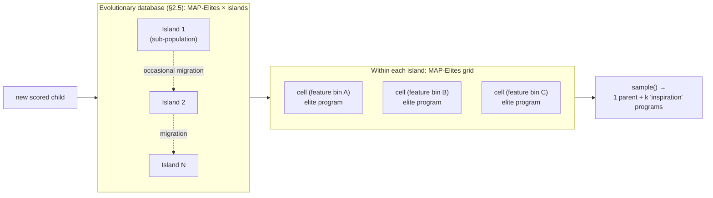
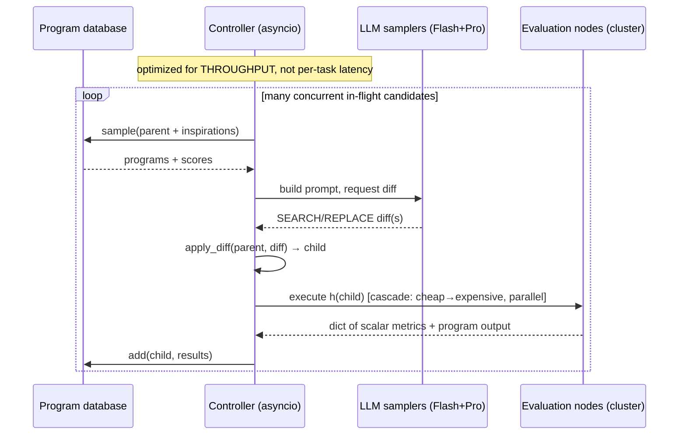

# Findings: AlphaEvolve (Google DeepMind)

> Per-source research findings doc. Reporter, not architect. Cited throughout.
> Primary source is the white paper PDF (read in full via `pdftotext -layout`). The
> official repo is **results/verification only — it does NOT contain the system's
> source code** (stated verbatim in its README). Where I needed real, inspectable
> code for the loop, I corroborated against the OpenEvolve open-source reimplementation.

---

## 1. Identity

- **Name:** AlphaEvolve — "a coding agent for scientific and algorithmic discovery" (subtitle of the white paper). Marketed by the DeepMind blog as "a Gemini-powered coding agent for designing advanced algorithms."
- **What it is:** An **evolutionary coding agent**: an autonomous, asynchronous pipeline that uses an ensemble of frontier LLMs (Gemini 2.0 Flash + Pro) to repeatedly propose **code diffs** to a user-supplied program, scores each candidate with a **user-supplied automated `evaluate` function**, stores scored programs in an **evolutionary program database** (MAP-Elites + island model), and resamples from that database to build the next prompt — iterating until the score stops improving. It is the direct successor to **FunSearch** (Romera-Paredes et al., 2023), generalized from "evolve one Python function for one scalar objective" to "evolve an entire multi-file codebase under multiple objectives."
- **Authors / org:** Google DeepMind. 19 authors; equal-contribution leads: Alexander Novikov, Ngân Vũ, Marvin Eisenberger, Emilien Dupont, Po-Sen Huang, Adam Zsolt Wagner, Sergey Shirobokov, Borislav Kozlovskii, Matej Balog. Corresponding authors: Matej Balog, Alexander Novikov, Pushmeet Kohli. Per the contributions note, "A.N. and M.B. designed and implemented the initial version of AlphaEvolve."
- **Dates:** Announced **2025-05-14** (DeepMind blog). White paper "© 2025 Google DeepMind." arXiv version **2506.13131** (June 2025, per the results-repo citation block).
- **Primary links:**
  - White paper PDF: https://storage.googleapis.com/deepmind-media/DeepMind.com/Blog/alphaevolve-a-gemini-powered-coding-agent-for-designing-advanced-algorithms/AlphaEvolve.pdf
  - Blog: https://deepmind.google/blog/alphaevolve-a-gemini-powered-coding-agent-for-designing-advanced-algorithms/
  - arXiv: https://arxiv.org/abs/2506.13131
  - Results repo: https://github.com/google-deepmind/alphaevolve_results
- **Code repo + commit inspected:** `github.com/google-deepmind/alphaevolve_results` — **branch `main`, tarball provenance** (codeload `tar.gz/refs/heads/main`; tarball file mtime `2025-01-05`; downloaded 2026-06-04). **I could not record an exact commit SHA**: the sandbox proxy returns HTTP 407 on `git clone`/`git ls-remote` to github.com, and the codeload tarball carries no `.git`. The repo contains exactly: `README.md`, `mathematical_results.ipynb` (128 cells), `CONTRIBUTING.md`, `LICENSE`, `.gitignore`. **The README states explicitly: "This repository does *not* contain the code to run AlphaEvolve."** So there is **no public source code for the AlphaEvolve system itself** — the method below is reconstructed from the paper, with the loop corroborated by the OpenEvolve reimplementation.

---

## 2. TL;DR

- **The whole system is one tight loop, and the paper hands you the loop verbatim** (Figure 2): `parent, inspirations = database.sample()` → `prompt = prompt_sampler.build(parent, inspirations)` → `diff = llm.generate(prompt)` → `child = apply_diff(parent, diff)` → `results = evaluator.execute(child)` → `database.add(child, results)`. Six lines. Everything else is engineering around those six lines.
- **The load-bearing trio:** (1) **diff-based mutation** in a `SEARCH/REPLACE` format so an LLM edits a large codebase with surgical, appliable patches rather than rewriting it; (2) a **user-written automated evaluator `h`** returning a dict of scalars — this is the fitness function *and* the anti-hallucination grounding ("avoids any incorrect suggestions from the base LLM"); (3) an **evolutionary database** (MAP-Elites × island model) that resurfaces past programs to balance exploration/exploitation. Ablations show **each of these is individually load-bearing** (removing evolution, context, meta-prompts, full-file evolution, or the big model each significantly hurts).
- **It is not a "self-improving AI" in the recursive sense.** It improved *components of its own stack* — a matmul tiling heuristic giving an **average 23% kernel speedup → ~1% reduction in Gemini's overall training time** (§3.3.2), plus a TPU circuit simplification — but the authors are explicit that "the feedback loops for improving the next version of AlphaEvolve are on the order of months," human-mediated. There is **no online weight update** in the core system (one cited related work, Surina et al., adds RL finetuning; AlphaEvolve itself does not).
- **Hard scope limit, stated by the authors:** it only works where you can write an **automated evaluator**. "Tasks that require manual experimentation [are] out of our scope." This is the single most important caveat for anyone copying the design.
- **The headline results are real but narrower than the hype.** The 4×4 complex-matrix 48-multiplication result is a genuine 56-year first — but an independent analysis (Uchoa/Inria) argues persuasively that these are **optimization wins, not acts of mathematical creativity**: AlphaEvolve finds well-defined objects/heuristics by hill-climbing a metric, and the evolved code "make[s] relatively small changes by including existing algorithmic elements... and/or fine-tuning parameters." Useful framing for calibrating expectations.
- **Relevance to us: HIGH.** This is the closest public description of the exact propose→test→keep-if-verifiably-better loop we want, at production scale, with concrete, copyable specifics on diff format, prompt assembly, evaluation cascades, multi-objective fitness, MAP-Elites/island database design, and async-throughput orchestration. The biggest gap for our purposes — *software* whose "evaluator" is fuzzy — is exactly the gap the authors flag as unsolved.

---

## 3. What it does & how it works (mechanism-level)

AlphaEvolve is "an evolutionary algorithm that gradually develops programs that improve the score on the automated evaluation metrics associated with the task" (§2). The human defines **"What?"** (problem + evaluator + initial program); AlphaEvolve figures out **"How?"** (Figure 1 caption).

### 3.1 The core loop (verbatim controller pseudocode, Figure 2)

The paper prints the entire control loop as pseudocode inside the "Distributed Controller Loop" box:

```
parent_program, inspirations = database.sample()
prompt = prompt_sampler.build(parent_program, inspirations)
diff = llm.generate(prompt)
child_program = apply_diff(parent_program, diff)
results = evaluator.execute(child_program)
database.add(child_program, results)
```

The five subsystems referenced (Prompt sampler, LLMs ensemble, Evaluators pool, Program database, plus the Distributed Controller) map 1:1 to §§2.2–2.6.



### 3.2 Task specification (§2.1) — the contract the human must satisfy

Two required inputs, one optional:

1. **An automated evaluator `h`.** "The user must provide a mechanism for automatically assessing generated solutions. This mechanism takes the form of a function `h` mapping a solution to a set of scalar evaluation metrics. By convention, these metrics are maximized." In their setup `h` "is typically implemented as a Python function, called `evaluate`, with a fixed input/output signature, returning a dictionary of scalars." Cost ranges from "seconds on a single device" to "spawn[ing] extensive computations" (up to ~100 compute-hours per candidate, §2.4).
2. **An initial program with evolution blocks.** Code is annotated with `# EVOLVE-BLOCK-START` / `# EVOLVE-BLOCK-END` comment markers. "Any user-provided code inside such evolution blocks serves as the initial solution to be improved... and the rest of the code forms a skeleton that ties the evolved pieces together, so that they can be invoked from `evaluate`. While this initial implementation must be complete, it can be rudimentary—for instance, consisting of single-line functions that return constants."
3. **(Optional) prompt template, config, choice of LLMs.**

**Flexibility of abstraction** is a key conceptual point: for the same problem you can evolve (a) the solution directly as a raw string, (b) a *constructor function* that builds the solution, (c) a *bespoke search algorithm* that finds the solution within a compute budget, or (d) co-evolve intermediate solutions and tailored search algorithms together. "We hypothesize that for problems with highly symmetric solutions it is advantageous to evolve constructor functions... whereas for problems with non-symmetric solutions it works better to evolve customized search algorithms."

### 3.3 Prompt sampling (§2.2) — building a rich, evolving context

The primary evolution prompt "comprises multiple previously discovered solutions sampled from the program database, as well as system instructions on how to propose changes." Optional ingredients:

- **Explicit context:** fixed human-written instructions, equations, code snippets, relevant literature (even PDFs).
- **Stochastic formatting:** template placeholders with human-provided alternatives, "instantiated using probability distributions provided in a separate config file" — i.e. deliberately randomized prompts for diversity.
- **Rendered evaluation results:** the program, its execution output, and the scores `evaluate` assigned.
- **Meta prompt evolution:** "instructions and context suggested by the LLM itself in an additional prompt-generation step, **co-evolved in a separate database analogous to the solution programs**." (So there are *two* evolutionary databases: one for solutions, one for prompts.)

### 3.4 Creative generation (§2.3) — diffs, not rewrites

The LLMs' "principal role is to digest information about previously developed solutions and propose new, diverse ways to improve the solutions." Output format is a **`SEARCH/REPLACE` diff**:

```
<<<<<<< SEARCH
  # Original code block to be found and replaced
=======
  # New code block to replace the original
>>>>>>> REPLACE
```

"The code between `<<<<<<< SEARCH` and `=======` is the exact segment to match in the current program version. The code between `=======` and `>>>>>>> REPLACE` is the new segment that will replace the original one." For very short code or when a full rewrite is better, AlphaEvolve "can be configured to instruct the LLM to output the entire code block directly." Each LLM response may contain a *sequence* of diff blocks.

**Models:** an ensemble of **Gemini 2.0 Flash** (low latency → high candidate throughput, "more ideas per unit time") and **Gemini 2.0 Pro** ("occasional, higher-quality suggestions that can significantly advance the search"). The system is model-agnostic, and ablations show it "performs increasingly better as the underlying LLM improves."

### 3.5 Evaluation (§2.4) — fitness, cascaded and parallel

Base case: just run `h` on the child. Optional mechanisms:

- **Evaluation cascade (hypothesis testing):** "ensembles of test cases of increasing difficulty, such that new solutions are evaluated on the next stage only if they achieve sufficiently promising results in all earlier stages." Cheap small-scale tests first "to filter out faulty programs early." This prunes the obviously-bad fast.
- **LLM-generated feedback (LLM-as-judge):** for properties "difficult to capture precisely in the user-provided evaluation function `h`; for example, simplicity of the discovered program. These properties can be graded using separate LLM calls and added to the dictionary of scores to steer evolution, or used to discard solutions."
- **Parallelized evaluation:** evaluations up to ~100 compute-hours are feasible because they're "embarrassingly parallel" and distributed across an evaluation cluster via async calls.

**Multiple scores (multi-objective):** AlphaEvolve optimizes a dict of metrics, not a scalar. Crucially: "even if one metric is of particular interest, optimizing for multiple metrics often improves results for the single target metric." The hypothesized reason — diverse high-performers under different criteria "possess distinct structures," and feeding these diverse exemplars into prompts "stimulate[s] the generation of more varied candidate solutions."

### 3.6 Evolution / the database (§2.5) — the memory

Scored programs (with their outputs) are stored in an **evolutionary database** whose "primary goal... is to optimally resurface previously explored ideas in future generations." The central challenge is "balancing exploration and exploitation." The implemented algorithm "is inspired by a combination of the **MAP-Elites algorithm** [Mouret & Clune] and **island-based population models** [FunSearch; Tanese]." (The paper gives no further internal detail — see §6 on what's unverifiable. OpenEvolve's open implementation, §4.3, fills in a plausible concrete version.)



### 3.7 Distributed pipeline (§2.6) — throughput over latency

"Implemented as an asynchronous computational pipeline (using the `asyncio` Python library) in which many computations are run concurrently, with each computation blocking (waiting) whenever its next step relies on... another, yet unfinished computation." Comprises **a controller, LLM samplers, and evaluation nodes**. "The entire pipeline is optimized for **throughput** (rather than the speed of any one particular computation), in order to maximize the number of ideas that can be proposed and evaluated within a specific overall computation budget."



---

## 4. Evidence from the code

### 4.1 The crucial caveat: the system's source code is NOT public

`alphaevolve_results-main/README.md` (inspected verbatim):

> "Specifically, the repository contains a Google Colab notebook with the mathematical discoveries of AlphaEvolve outlined in Section 3 of the paper, as well as the corresponding **code for verifying their correctness**... **This repository does *not* contain the code to run AlphaEvolve.**"

So the repo is a **results + verification artifact**, not an implementation. The directory is just:
`README.md`, `mathematical_results.ipynb` (128 cells: 92 code, 36 markdown), `CONTRIBUTING.md`, `LICENSE`, `.gitignore`. The notebook is organized one section per math problem (tensor decompositions ⟨2,4,5⟩…⟨5,5,5⟩; then B.1 autocorrelation inequalities, B.5 Erdős minimum overlap, B.7 hexagon packing, B.11 kissing number in dim 11, B.12/B.13 circle packings, etc.), and it "contains only the instances where the results from AlphaEvolve outperform the state-of-the-art."

### 4.2 What the verification code *does* reveal (independent ground-truth checking)

The single most relevant code in the repo is the **verifier** — an independent, deterministic checker that confirms an AlphaEvolve output is actually correct. From the notebook's "Verification function" cell (`alphaevolve_results@main:mathematical_results.ipynb`, code cell #4):

```python
import numpy as np

def verify_tensor_decomposition(decomposition, n, m, p, rank):
  """Verifies the correctness of the tensor decomposition.
     ... Raises AssertionError: If the decomposition does not have the
     correct rank, or if the decomposition does not construct the 3D
     tensor which corresponds to multiplying an n x m matrix by an
     m x p matrix."""
  factor_matrix_1, factor_matrix_2, factor_matrix_3 = decomposition
  assert factor_matrix_1.shape == (n * m, rank), ...
  assert factor_matrix_2.shape == (m * p, rank), ...
  # (then reconstructs the matmul tensor from the outer products of the
  #  factor columns and asserts equality with the true tensor)
```

This is the pattern that matters for us: **the discovery and its verification are separate.** AlphaEvolve hill-climbs an `evaluate` score during search; the *published* claims are then re-checked by a standalone, human-trusted verifier (`assert`-based, exact arithmetic). The factor matrices in the notebook are concrete numpy arrays of `0, ±0.5, ±1` entries — consistent with the paper's "round to nearest integer or half-integer" exactness trick (§4.4 below / paper §3.1).

### 4.3 Corroborating the loop with real code: OpenEvolve

Because AlphaEvolve's own code is closed, the best *inspectable* evidence for the architecture is **OpenEvolve** (`github.com/codelion/openevolve`, now `algorithmicsuperintelligence/openevolve`), an open-source reimplementation. Its author describes the same four components in identical terms (HuggingFace writeup, 2025-05-20):

> "OpenEvolve follows an evolutionary approach with four key components: 1. **Prompt Sampler**... 2. **LLM Ensemble**... 3. **Evaluator Pool**... 4. **Program Database**... The controller orchestrates interactions... in an asynchronous pipeline, maximizing throughput."

OpenEvolve concretizes the §2.5 database as "**MAP-Elites with LLMs** — Quality-Diversity evolution across feature dimensions [+] **Island-based multi-population setup to avoid premature convergence**." It **independently replicated** two paper results: circle packing (26 circles in unit square, sum of radii **2.634** vs the paper's 2.635, "within 0.04%") and function minimization (evolving random search → **simulated annealing**). Its LLM findings echo the paper: "Best combination: Gemini-Flash-2.0-lite + Gemini-Flash-2.0... for evolutionary code optimization, you need a balance of speed and quality." This is third-party evidence that the paper's described mechanism actually works as described.

### 4.4 The actual prompt + diff (verbatim, from Figure 3)

The paper's Figure 3 shows a real assembled prompt and LLM output for evolving an image-classification pipeline. The **prompt** (panel b) is structured as:

```
Act as an expert software developer. Your task is to iteratively
improve the provided codebase. [...]

- Prior programs
Previously we found that the following programs performed well on the
task at hand:
top_1_acc: 0.796; neg_eval_log_loss: 0.230; average_score: 0.513
"""Image classification experiment in jaxline.""" [...]

- Current program
Here is the current program we are trying to improve (you will need to
propose a modification to it below).
top_1_acc: 0.862; neg_eval_log_loss: 0.387; average_score: 0.624
"""Image classification experiment in jaxline.""" [...]

SEARCH/REPLACE block rules: [...]
Make sure that the changes you propose are consistent with each other.
For example, if you refer to a new config variable somewhere, you
should also propose a change to add that variable.
Example: [...]

Task
Suggest a new idea to improve the code that is inspired by your expert
knowledge of optimization and machine learning.
Describe each change with a SEARCH/REPLACE block.
```

The **LLM output** (panel c) begins with a natural-language rationale, then emits diffs:

```
The current model uses a simple ResNet architecture with only three
ResNet blocks. We can improve its performance by increasing the model
capacity and adding regularization. [...] AdamW is generally a better
choice than Adam, especially with weight decay.

<<<<<<< SEARCH
    self._block1 = ResNetBlock(num_channels)
    self._block2 = ResNetBlock(num_channels * 2, stride=2)
    self._block3 = ResNetBlock(num_channels * 4, stride=2)
=======
    self._block1 = ResNetBlock(num_channels)
    self._block2 = ResNetBlock(num_channels, stride=1)
    self._block3 = ResNetBlock(num_channels * 2, stride=2)
    self._block4 = ResNetBlock(num_channels * 2, stride=1)
    self._block5 = ResNetBlock(num_channels * 4, stride=2)
    self._block6 = ResNetBlock(num_channels * 4, stride=1)
>>>>>>> REPLACE
<<<<<<< SEARCH
  def optimizer(self, learning_rate):
    return optax.adam(learning_rate)
=======
  def optimizer(self, learning_rate):
    return optax.adamw(learning_rate, weight_decay=1e-4)
>>>>>>> REPLACE
```

Note the prompt **renders the prior and current programs together with their numeric scores** (`top_1_acc`, `neg_eval_log_loss`, `average_score`) — the model literally sees what scored well before. And the explicit consistency instruction ("if you refer to a new config variable... also propose a change to add that variable") is a concrete guardrail against half-applied diffs.

### 4.5 The evaluator-side anti-cheating detail (matmul, paper §3.1)

For tensor decomposition the evaluator computes "the best (lowest) rank achieved on each target **as well as the fraction of seeds that achieved this rank**, providing a signal for AlphaEvolve to hill-climb." And the exactness guard:

> "To ensure the exactness of the decomposition and avoid any potential numerical error, when evaluating, **we round each element to the nearest integer or the nearest half-integer**; and, to encourage the algorithm to generate near-integral solutions, **we include this request in natural language in the LLM's prompt**."

This is a clean example of co-designing the evaluator and the prompt so a *floating-point* search can't "cheat" by reporting a spuriously-low rank from numerical mush.

---

## 5. What's genuinely smart (the heart)

1. **Diff-based mutation in `SEARCH/REPLACE` form.** This is the key enabler over FunSearch. Asking a frontier LLM to emit a *patch* (exact-match old block → new block) rather than rewriting a file means you can evolve **large, multi-file, multi-language codebases** while keeping mutations local, reviewable, and mechanically appliable. It turns "LLM creativity" into a well-typed genetic operator. The accompanying rationale text the model writes is, in effect, a self-documented mutation.

2. **The evaluator is both the fitness function and the truth serum.** Grounding every candidate in code execution + an automated metric means the base LLM's confident-but-wrong suggestions simply score badly and die. The paper frames this precisely: the evaluation mechanism "allows AlphaEvolve to avoid any incorrect suggestions from the base LLM." For a software-building agent this is the whole game — **the LLM proposes, the evaluator disposes.**

3. **"Don't search for the solution — evolve an algorithm that finds it."** The abstraction-flexibility insight (§2.1, §6) is subtle and powerful: often it's far more effective to evolve a *constructor* or a *search procedure* than to evolve the answer directly. They even **co-evolve a solution and a search algorithm tailored to improve that specific solution.** This indirection is a recurring "surprisingly effective strategy."

4. **Evaluation cascades.** Cheap, small, fast tests gate access to expensive, large, slow ones — candidates only "earn" costly evaluation by surviving early stages. This is straightforward but exactly the right way to spend a fixed compute budget when most mutations are duds.

5. **Multi-objective optimization as a diversity engine.** The non-obvious empirical claim — optimizing several metrics *improves the single metric you care about* — because diverse "definitions of good" inject structurally different exemplars into prompts, widening the search. This reframes multi-objective from "a feature" to "a search-diversification trick."

6. **MAP-Elites × islands for the memory.** The database isn't a leaderboard; it's a **quality-diversity** structure. MAP-Elites keeps the best program *in each region of a feature space* (preventing collapse onto one local optimum), and islands maintain semi-isolated sub-populations with occasional migration (preventing premature convergence). The prompt sampler then draws a parent **plus "inspirations,"** so crossover-like recombination of ideas happens *in-context*.

7. **Throughput-first async orchestration.** By optimizing total ideas-evaluated-per-budget rather than any single candidate's latency — and by tolerating ~100-compute-hour evaluations via parallelism — they make the evolutionary loop's *sample rate* the thing that matters. The Flash/Pro ensemble is the same idea applied to generation: mostly-cheap with occasional-expensive.

8. **Meta-prompt evolution.** The prompts themselves are evolved in a second database. The system can therefore "surpass the performance one can obtain using a human prompter" — the scaffold tunes its own instructions.

9. **Co-designed evaluator + prompt to prevent self-fooling** (the integer/half-integer rounding for matmul). Smart because it closes a specific cheat channel (numerical error masquerading as a better rank) on *both* sides — the metric rounds, and the prompt asks for near-integral solutions.

---

## 6. Claims vs. reality / limitations / critiques

**(A) What the authors claim:** novel provably-correct algorithms beating SOTA on a "spectrum" of math/CS problems; the first improvement on Strassen for 4×4 in 56 years (rank 48, complex-valued); SOTA on 14 matmul targets (Table 2); matched best-known on ~75% and beat SOTA on ~20% of 50+ math problems; real production wins (Borg scheduling recovers **0.7% of Google's fleet-wide compute** on average; a Pallas/JAX matmul-tiling kernel heuristic giving **average 23% kernel speedup and ~1% reduction in Gemini's overall training time**, correct by construction since only the tiling strategy is tuned; a TPU arithmetic-circuit simplification; faster Transformer attention).

**(B) What's actually demonstrated / how grounded:** The math results are independently checkable and the repo ships the verifiers (§4.2) — this is strong. The Borg result is "correct by construction" because the heuristic only re-ranks machines Borg *already* deemed valid ("the resulting scheduling decisions are effectively correct by construction"), measured on an **unseen test set** and then confirmed post-deployment fleet-wide. These are credible. **But the system code is closed and not reproducible** — there is no way to independently run AlphaEvolve. OpenEvolve reproduces the *method* and two specific results (§4.3), which is reassuring about the mechanism but is a different codebase.

**(C) Independent critiques:**
- **Eduardo Uchoa (UFF / Inria International Chair), "AlphaEvolve: the hype and the wonder"** (talk, May 19 2025; PDF). The sharpest substantive critique. Core arguments, paraphrased with quotes: the 4×4 result's "**practical impact... is marginal**" (standard n³ is often faster than Strassen for n<1000 on GPUs; asymptotically-better algorithms are impractical); and more importantly the discoveries "**lack true originality and 'mathematical creativity'**" — "all those new 'theorems' and 'algorithms' are **improving solutions to some well-known but difficult optimization problems**," and the evolved code "make[s] relatively small changes by including existing algorithmic elements from its 'library' and/or fine-tuning parameters." His balanced conclusion: it is *not* a creativity engine and will *not* trigger a "singularity," **but** "an automatic proving/optimization system that works well in many different contexts... even if no mathematical breakthrough was obtained, is impressive," and will yield "thousands of minor advances" + serve as a mathematician's "sidekick." This is the right calibration: **AlphaEvolve is a superb automated optimizer of machine-checkable objectives, not an autonomous mathematician.** (https://project.inria.fr/inriabrasil/files/2026/01/Eduardo-Uchoa-AlphaEvolve-Analysis.pdf)

**(D) Limitations the authors themselves state:**
- **The hard boundary:** "The main limitation of AlphaEvolve is that it handles problems for which it is possible to devise an automated evaluator." Domains needing manual/physical experimentation are out of scope. LLM-as-judge evaluation is supported but "not a setting we have optimized for."
- **Self-improvement is slow and human-mediated:** gains on its own infrastructure are "moderate" and "the feedback loops for improving the next version of AlphaEvolve are on the order of months." No online learning/weight updates in the core system.

**(E) Failure modes / reward-hacking surface (inferred + paper-acknowledged):** Any metric-maximizer can game its metric. The paper's defenses are concrete but ad hoc per task: integer/half-integer **rounding** to kill numerical-error exploits (§4.5); **"correct by construction"** problem framing for Borg; **held-out/unseen test sets** for generalization; **LLM-as-judge** to penalize undesired properties (e.g. complexity) the scalar metric misses; and **fraction-of-seeds** metrics so a single lucky seed doesn't win. The honest read: **reward-hacking is a real and ever-present risk, and the mitigations are evaluator-engineering choices the human must get right**, not a general guarantee from the framework.

**(F) Reproducibility:** Method described in detail; **no system source; no exact SHA obtainable here** (proxy blocked git; tarball had no `.git`); compute scale, exact database parameters (MAP-Elites bin definitions, island count/migration policy, sampling temperatures), and prompt-sampler internals are **not disclosed**. OpenEvolve is the practical reproduction path.

**What I could not verify:** the database's exact algorithm/hyperparameters; the meta-prompt-evolution mechanism's details; the Gemini-training speedup magnitude (described qualitatively); the precise async controller implementation; an exact commit SHA for the results repo.

---

## 7. Relevance to a self-improving, evolutionary software-building agent

This is the closest public analogue to the loop the KB Seed AI project wants. High relevance, with specifics:

- **The six-line loop is directly adoptable** as our core: `sample → build_prompt → generate_diff → apply → evaluate → store`. It is exactly "propose → test → keep only if verifiably better," at scale. (→ our control loop)
- **Diff-based editing (`SEARCH/REPLACE`) is the right mutation operator** for evolving a real codebase rather than toy single functions — surgical, appliable, reviewable, and it scales to multi-file/multi-language. (→ how the agent edits software)
- **The evaluator-as-ground-truth is the linchpin and our hardest open problem.** AlphaEvolve works *because* it only operates where `evaluate()` is automatable; for general software development the "is this verifiably better?" function is exactly what's fuzzy (correctness, UX, maintainability). The paper's own stated limitation maps precisely onto our central design risk. (→ verification / fitness design — adopt the discipline, inherit the open problem)
- **Evaluation cascades** = a budget-aware verification ladder (lint/typecheck → unit tests → integration → expensive E2E/benchmarks), promoting candidates only as they survive cheaper gates. (→ verification + cost control over long horizons)
- **Quality-diversity memory (MAP-Elites + islands)** is a concrete, battle-tested answer to "how does the agent remember and recombine past attempts without collapsing to one local optimum?" — directly relevant to a long-horizon agent's memory/experiment database. (→ memory + exploration)
- **Multi-objective fitness as a diversity driver** suggests our evaluator should return a *vector* (tests-passed, perf, size/simplicity, lint, LLM-judged quality) — and that doing so may *help* the primary objective, not just decorate it. (→ fitness design)
- **LLM-as-judge as a supplementary score** for fuzzy properties (simplicity, readability) the hard metric can't express — added to the score dict or used as a hard filter. (→ verification of soft criteria; also a reward-hacking vector to watch)
- **Throughput-first async orchestration** (controller + sampler pool + evaluation cluster, optimize ideas/budget) is the scaling pattern for "tokens unlimited, run forever." (→ orchestration / long-horizon running)
- **Flash+Pro ensemble** = mostly-cheap-model breadth with occasional-strong-model depth — a concrete cost/quality lever for unlimited-token operation. (→ decision-making about which model to spend on)
- **Meta-prompt evolution** = the scaffold improving its *own* prompts via a second database — a tractable, bounded form of self-improvement that doesn't require weight updates. (→ self-improvement, the safe kind)
- **Co-designing evaluator + prompt to block cheats** (the rounding trick) is a transferable anti-reward-hacking pattern: identify the cheat channel, close it on both the scoring and generation sides. (→ "avoid fooling itself")
- **Separation of search-metric from published-verifier** (§4.2): hill-climb a fast proxy during search, but gate any "kept" result behind an independent, trusted checker. Directly relevant to not fooling ourselves. (→ verification integrity)

Where it does **not** help us: it offers nothing on physically- or human-judgment-bound tasks, nothing on online weight self-modification (explicitly out of scope), and its "self-improvement" is months-long and human-in-the-loop — so it is a model for an *evolutionary optimizer over verifiable software changes*, not for open-ended recursive self-improvement.

---

## 8. Reusable assets (collect; do not assemble into a design)

1. **The controller loop (verbatim, paper Fig. 2):**
   ```
   parent_program, inspirations = database.sample()
   prompt = prompt_sampler.build(parent_program, inspirations)
   diff = llm.generate(prompt)
   child_program = apply_diff(parent_program, diff)
   results = evaluator.execute(child_program)
   database.add(child_program, results)
   ```

2. **The `SEARCH/REPLACE` diff format (verbatim, paper §2.3):**
   ```
   <<<<<<< SEARCH
     # Original code block to be found and replaced
   =======
     # New code block to replace the original
   >>>>>>> REPLACE
   ```
   With the rule: *"if you refer to a new config variable somewhere, you should also propose a change to add that variable."* And the fallback: for very short code or full rewrites, emit the whole block instead.

3. **The evolution-block API (verbatim markers):** `# EVOLVE-BLOCK-START` … `# EVOLVE-BLOCK-END` around the to-be-evolved region; the rest is a fixed "skeleton" that wires evolved pieces into `evaluate`. Initial impl "must be complete, [but] can be rudimentary."

4. **The evaluator contract:** a Python function `evaluate(...) -> dict[str, float]`, metrics maximized by convention. Returns a dict of scalars (multi-objective).

5. **The assembled-prompt skeleton (verbatim structure, paper Fig. 3b):**
   ```
   Act as an expert software developer. Your task is to iteratively
   improve the provided codebase. [...]
   - Prior programs
   Previously we found that the following programs performed well ...
   <scores>  <program>
   - Current program
   Here is the current program we are trying to improve ...
   <scores>  <program>
   SEARCH/REPLACE block rules: [...]
   Task
   Suggest a new idea to improve the code that is inspired by your
   expert knowledge ... Describe each change with a SEARCH/REPLACE block.
   ```

6. **Evaluation-cascade pattern:** stages of increasing difficulty; a candidate advances only if it clears all earlier stages; cheap small-scale screen first to drop crashers.

7. **Anti-numerical-cheat pattern (verbatim, §3.1):** round outputs to nearest integer/half-integer in the evaluator *and* request near-integral solutions in the prompt; score on **fraction of random seeds achieving the best result**, not a single seed.

8. **Independent verifier pattern (code, results repo):** `verify_tensor_decomposition(decomposition, n, m, p, rank)` — exact-arithmetic, `assert`-based reconstruction check, separate from the search metric. `alphaevolve_results@main:mathematical_results.ipynb` (code cell #4).

9. **Database design reference:** MAP-Elites (Mouret & Clune) × island model (Tanese; FunSearch). For a concrete, runnable instantiation, see OpenEvolve (`github.com/codelion/openevolve`), which implements exactly this and replicated paper results within 0.04%.

10. **Ensemble pattern:** fast model (Gemini 2.0 Flash) for breadth + strong model (Gemini 2.0 Pro) for occasional depth; throughput-optimized `asyncio` controller + sampler pool + evaluation cluster.

---

## 9. Signal assessment

- **Overall value: HIGH.** This is the most directly on-target public source for the project's exact loop (propose → automatically test → keep-if-verifiably-better → evolve), demonstrated at production scale with concrete, copyable mechanism: diff format, prompt structure, evaluation cascades, multi-objective fitness, quality-diversity memory, and throughput-first orchestration. It also crisply names the project's central open problem (no automatable evaluator ⇒ out of scope) and several reward-hacking mitigations.
- **Confidence: High on the method and the loop** (the paper is unusually explicit and the loop is corroborated by an independent reimplementation that reproduced results). **Medium on internals** (database hyperparameters, meta-prompt mechanism, controller code are undisclosed). **Medium-low on reproducibility of the system itself** (closed source; OpenEvolve is the practical proxy).
- **Could not verify:** exact database algorithm/parameters; meta-prompt-evolution details; magnitude of the Gemini-training speedup; the async controller implementation; and an exact commit SHA for the results repo (git blocked by proxy; tarball carried no `.git`).

---

## 10. References

**Primary**
- Novikov, Vũ, Eisenberger, Dupont, Huang, Wagner, Shirobokov, Kozlovskii, Ruiz, Mehrabian, Kumar, See, Chaudhuri, Holland, Davies, Nowozin, Kohli, Balog. *AlphaEvolve: A coding agent for scientific and algorithmic discovery.* Google DeepMind technical report / white paper, 2025. PDF: https://storage.googleapis.com/deepmind-media/DeepMind.com/Blog/alphaevolve-a-gemini-powered-coding-agent-for-designing-advanced-algorithms/AlphaEvolve.pdf — arXiv: https://arxiv.org/abs/2506.13131 — *(read in full; all §2 quotes verbatim via `pdftotext -layout`)*
- Google DeepMind blog. *AlphaEvolve: A Gemini-powered coding agent for designing advanced algorithms.* 2025-05-14. https://deepmind.google/blog/alphaevolve-a-gemini-powered-coding-agent-for-designing-advanced-algorithms/ *(primary, secondary-framing)*
- AlphaEvolve results repository (verification notebook + results ONLY — **not the system code**). `github.com/google-deepmind/alphaevolve_results`, branch `main` (tarball, mtime 2025-01-05; **no SHA obtainable**, proxy blocked git). Key file: `mathematical_results.ipynb` (verifier in code cell #4). https://github.com/google-deepmind/alphaevolve_results *(primary code, but verification-only)*

**Secondary — independent critique**
- Eduardo Uchoa (UFF, Brazil; Inria International Chair 2022–2026). *AlphaEvolve: the hype and the wonder.* Talk, 2025-05-19. https://project.inria.fr/inriabrasil/files/2026/01/Eduardo-Uchoa-AlphaEvolve-Analysis.pdf *(secondary; substantive technical critique — "optimization, not creativity"; marginal practical impact of the 4×4 result)*

**Secondary — independent reimplementation (corroborates the architecture in runnable code)**
- Asankhaya Sharma (codelion). *OpenEvolve: An Open Source Implementation of Google DeepMind's AlphaEvolve.* HuggingFace blog, 2025-05-20. https://huggingface.co/blog/codelion/openevolve — repo: https://github.com/codelion/openevolve (now `github.com/algorithmicsuperintelligence/openevolve`) *(secondary; reproduces 4-component architecture, MAP-Elites + islands, and two paper results within 0.04%)*

**Secondary — other analyses (lower weight; used for cross-checking framing)**
- Andrey Lukyanenko, *Paper Review: AlphaEvolve.* https://andlukyane.com/blog/paper-review-alphaevolve
- Grigory Sapunov (Gonzo ML), *AlphaEvolve.* https://gonzoml.substack.com/p/alphaevolve
- *AlphaEvolve* (ArXivIQ). https://arxiviq.substack.com/p/alphaevolve

**Cited within the paper (context)**
- Romera-Paredes et al., *FunSearch* (2023) — the direct predecessor AlphaEvolve generalizes.
- Mouret & Clune — MAP-Elites; Tanese — distributed/island genetic algorithms (the database's two inspirations).
- Fawzi et al. — *AlphaTensor* (the prior specialized matmul approach AlphaEvolve outperforms).
