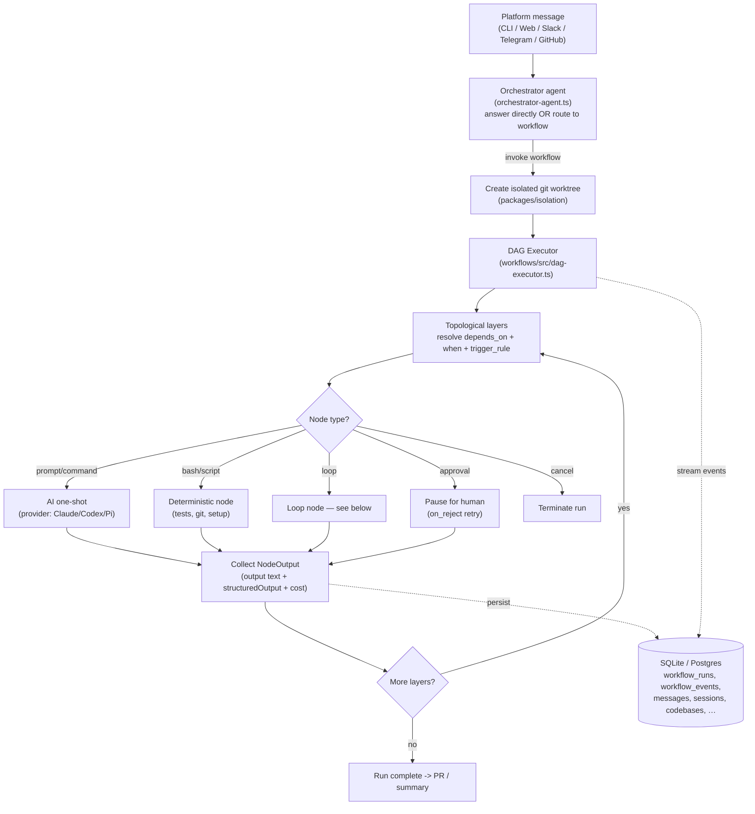
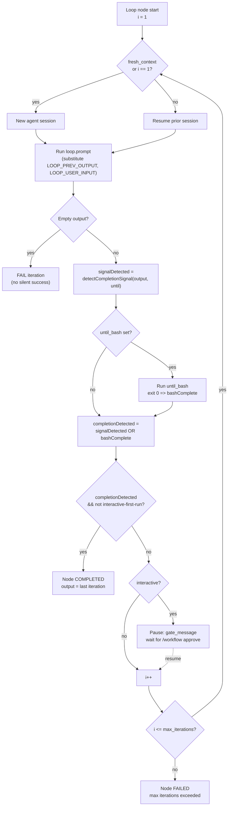
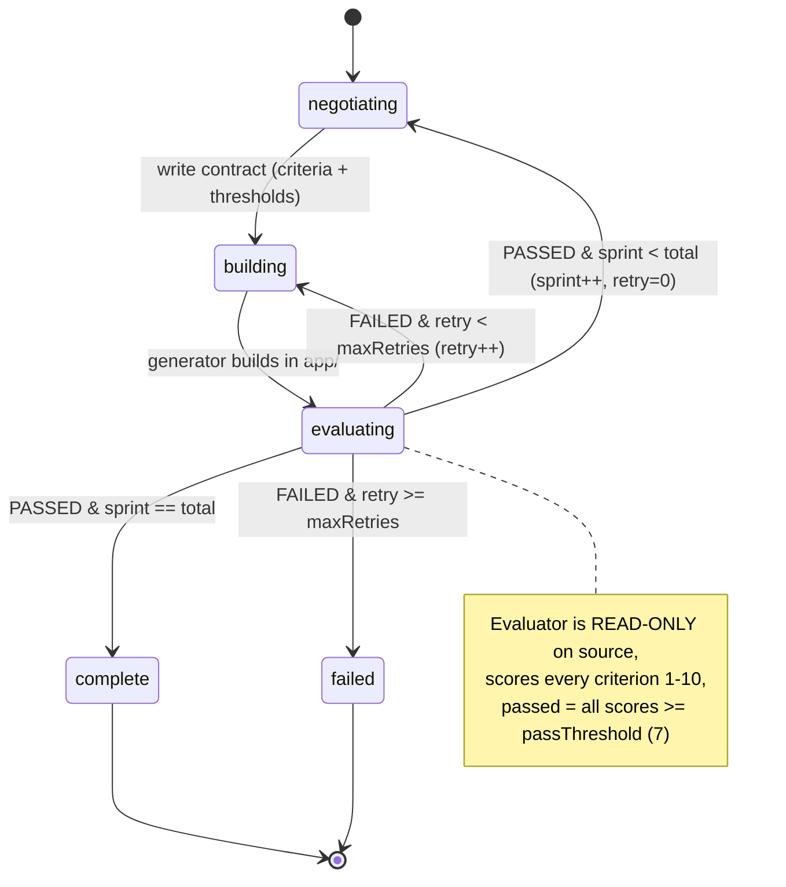

# Archon (coleam00 / Cole Medin) — Findings

> Research doc — one source, deep & honest. Relevance test applied throughout:
> *would this help build a self-improving, evolutionary, software-building agent?*

---

## 1. Identity

- **Name:** Archon
- **What it is (current, v0.4.x):** "**The first open-source harness builder for AI coding. Make AI coding deterministic and repeatable.**" In its own words: *"a workflow engine for AI coding agents. Define your development processes as YAML workflows — planning, implementation, validation, code review, PR creation — and run them reliably across all your projects."* Tagline: *"Like what Dockerfiles did for infrastructure and GitHub Actions did for CI/CD — Archon does for AI coding workflows. Think n8n, but for software development."* (`README.md`)
- **IMPORTANT — the project has pivoted.** The brief anticipated a *"command center / knowledge + task management backbone (MCP server) with RAG."* That description matches **Archon V1** (the original Python project), which is now **archived** on branch [`archive/v1-task-management-rag`](https://github.com/coleam00/Archon/tree/archive/v1-task-management-rag). The **current** Archon is a TypeScript/Bun **workflow/harness engine** — a different system. This doc covers the current system (primary) and notes V1 where useful.
- **Author / org:** Cole Medin (GitHub `coleam00`). Cole Medin is a well-known AI/agent educator on YouTube. Repo full name: `coleam00/Archon`.
- **Dates:** Repo created **2025-02-07**; the v2 "harness builder" rewrite landed in early-mid 2026. At inspection the repo had **~22,187 stars**; license **MIT**.
- **Primary links:**
  - Repo: https://github.com/coleam00/Archon
  - Docs: https://archon.diy (a.k.a. "The Book of Archon")
  - V1 archive branch: https://github.com/coleam00/Archon/tree/archive/v1-task-management-rag
- **Code repo + commit inspected:**
  - **Primary:** `coleam00/Archon` **`dev`** branch @ commit **`42dfefb64891b06abe7cca79426bc31eebabc23a`** (default branch; dated 2026-06-05). Obtained via codeload tarball (`git clone` blocked by sandbox proxy 407; tarball fallback used per brief).
  - **Cross-check:** `main` branch @ **`e248e58fef83d2d4da05c6a93be527c310eadaed`** (v0.4.1, dated 2026-05-28). Package layout identical to `dev`.
  - References below use `Archon@42dfefb:path` for dev (or `@e248e58` for main where I read the main copy).

---

## 2. TL;DR

- **Archon is NOT (anymore) a RAG/knowledge MCP server.** It is a **deterministic workflow engine** that wraps autonomous coding agents (Claude Code, Codex, "Pi") in **YAML-defined DAG workflows** with **AI nodes, deterministic bash nodes, and loop nodes**. The point is to make AI coding *repeatable* by owning the control structure instead of leaving it to the model's "mood."
- **The single most relevant mechanism for us: the `loop` node.** A workflow node can iterate an AI step *"until a condition is met"* (e.g. `until: ALL_TASKS_COMPLETE`, `until: APPROVED`), optionally with **`fresh_context: true`** (a brand-new agent session each iteration) — i.e. a structured, bounded **propose → act → check → repeat** loop with verifiable exit conditions. This is the same skeleton as an evolutionary improvement loop, minus the "keep only if better" selection.
- **Verification is first-class but human/test-defined, not learned.** Workflows interleave **deterministic validation gates** (`bash: "bun run validate"`, type-checks, tests) between AI nodes; the AI loop only exits when the *deterministic* check passes. Archon does NOT do reward-modeling, fitness-based selection, or self-modification of its own harness — it executes a process *you* author.
- **Strong, production-grade harness/orchestration engineering:** git **worktree isolation** per run (parallel, conflict-free), a typed workflow schema with DAG dependency resolution, fresh-context session management, multi-platform adapters (CLI/Web/Slack/Telegram/GitHub), and a persistence layer (SQLite/Postgres, ~7 tables). This is exactly the "run agents reliably over long horizons" layer.
- **Self-improvement is absent by design.** Archon makes a *fixed* process reliable; it does not evolve the process. The workflows are the unit of reuse (committed to your repo), not learned artifacts. For us it is a **reference harness/orchestration design**, not a seed-AI loop.
- **Signal: MEDIUM** (see §9). Very high-quality engineering of the *control/verification scaffold*; low on the *self-improvement / evolutionary selection* axis that is our core. The loop-node + validation-gate + worktree-isolation patterns are the borrowable parts.

---

## 3. What it does & how it works

### 3.1 The product, accurately

Archon (v0.4.x) is a **TypeScript/Bun monorepo** that runs a coding agent (default **Claude Code** via the Claude Agent SDK; also **Codex** and **"Pi"/Copilot** providers) inside a **deterministic workflow engine**. The user authors a **workflow** as a YAML **DAG** of nodes; Archon executes the DAG, calling the AI only at "AI nodes" and running shell/scripts at "deterministic nodes," with **loop nodes** that iterate an AI step until a verifiable completion condition. Each run executes in an isolated **git worktree** so multiple runs are parallel and conflict-free. Workflows can be triggered from CLI, Web UI, Slack, Telegram, Discord, or GitHub webhooks; an **orchestrator agent** routes a free-text message either to a direct answer or to the right workflow.

The mental model the project itself pushes: *"Like Dockerfiles for infra and GitHub Actions for CI/CD — Archon does for AI coding workflows. Think n8n, but for software development."* The thesis (README "Why Archon"): a bare agent's behavior "depends on the model's mood … Every run is different." Archon makes the **process** deterministic and owned by you while the AI "fills in the intelligence at each step."

### 3.2 The seven node types (the workflow vocabulary)

From `Archon@42dfefb:packages/workflows/src/schemas/dag-node.ts` and `loop.ts`, a workflow is `nodes: [...]` where each node is exactly one of:

| Node | Field | Runs | Role |
|------|-------|------|------|
| **Prompt** | `prompt:` | AI (one shot) | Inline prompt to the agent |
| **Command** | `command:` | AI (one shot) | Runs a named markdown command from `.archon/commands/` |
| **Bash** | `bash:` | deterministic | Shell — tests, git ops, setup. **No AI.** |
| **Script** | `script:` + `runtime: bun\|uv` | deterministic | TS or Python script |
| **Loop** | `loop:` | AI (iterated) | Repeat a prompt **until** a completion condition or `max_iterations` |
| **Approval** | `approval:` | human gate | Pause for human review (with `on_reject` retry) |
| **Cancel** | `cancel:` | control | Terminate the run with a reason |

Shared node fields make the harness expressive: `depends_on` (DAG edges), `when:` (conditional, a small DSL over upstream outputs), `trigger_rule` (`all_success` / `one_success` / `none_failed_min_one_success` / `all_done`), `context: fresh|shared`, per-node `model`/`provider`/`effort`/`thinking`, `allowed_tools`/`denied_tools`, `mcp`, `skills`, inline sub-`agents` (Claude SDK AgentDefinition), `sandbox` (OS-level FS/network restrictions), `retry`, `hooks`, `idle_timeout`, `maxBudgetUsd`, `output_type` (writes a typed sidecar artifact `nodes/<id>.md` + `<id>.meta.json`), and `persist_session` (resume a provider session across runs).

### 3.3 The core loop (the most relevant mechanism)

The **loop node** is Archon's iterate-until-done primitive. Config (`loop.ts`):

```
loop:
  prompt: <run each iteration>
  until:  <completion-signal string, e.g. COMPLETE / APPROVED>
  max_iterations: <positive int — hard budget>
  fresh_context: <bool, default false — new agent session each iteration>
  until_bash: <optional shell; exit 0 == complete>     # deterministic verifier
  interactive: <bool>                                   # pause for human each iter
  gate_message: <shown when paused>
```

The loop executes iteration `i = 1 … max_iterations`. Each iteration: build the prompt (substituting `$LOOP_USER_INPUT`, `$LOOP_PREV_OUTPUT`, `$ARGUMENTS`, etc.), stream the AI response, then evaluate **completion** two ways and OR them:

`completionDetected = signalDetected || bashComplete` — where `signalDetected = detectCompletionSignal(output, until)` (an LLM-emitted `<promise>SIGNAL</promise>` tag) and `bashComplete` = `until_bash` exited 0 (`dag-executor.ts:2408`). If `max_iterations` is hit without completion, the node **fails** (no silent pass, `dag-executor.ts:2545`).

This is structurally a bounded **propose → act → check → repeat** loop, with the *check* being either an LLM self-report or a deterministic shell gate.





### 3.4 The orchestrator & routing layer

`packages/core/src/orchestrator/orchestrator-agent.ts` is the single entry point for all platforms. It *"knows all registered projects and workflows upfront, can answer directly or invoke workflows, and does NOT require a project to be selected."* It builds a system prompt listing available workflows (with their YAML descriptions) and exposes a `manage-run-tool` so the agent can start/resume/inspect workflow runs. Workflow **selection is itself an LLM decision** (router + orchestrator), guided by each workflow's `description:` block that encodes "Use when / Triggers / NOT for" (see the YAML headers). The deterministic part is the *execution* of the chosen workflow, not the choice.

### 3.5 Persistence & isolation

README's architecture diagram: platform adapters → orchestrator → {command handler, workflow executor, AI assistant clients} → **SQLite/PostgreSQL (7 tables)**: *Codebases, Conversations, Sessions, Workflow Runs, Isolation Environments, Messages, Workflow Events*. Confirmed by `packages/core/src/db/*` (`codebases.ts`, `conversations.ts`, `sessions.ts`, `workflows.ts`, `isolation-environments.ts`, `messages.ts`, `workflow-events.ts`). Every run is an append-only stream of **workflow_events** (`node_started`, `tool_called`, `loop_iteration_started/completed/failed`, `node_completed`, `approval_requested`, …), which powers resume (CAS-guarded), the live Web UI, and "Mission Control." Isolation = one **git worktree per run** (`packages/isolation`, `packages/git`), so N runs proceed without stepping on each other.

---

## 4. Evidence from the code

Monorepo packages (`packages/`): `core` (orchestrator, DB, config, handlers), `workflows` (the DAG engine + schemas + bundled defaults), `isolation` (worktrees), `git`, `providers` (Claude/Codex/Pi adapters), `adapters` (platform adapters), `cli`, `server`, `web` (React UI), `paths`, `docs-web`. Test coverage is heavy — most modules have a co-located `*.test.ts`.

### 4.1 Core data structures

**Loop config** — `Archon@42dfefb:packages/workflows/src/schemas/loop.ts` (verbatim, the load-bearing schema):

```ts
export const loopNodeConfigSchema = z.object({
  prompt: z.string().min(1, "loop node requires 'loop.prompt' (non-empty string)"),
  until: z.string().min(1, "loop node requires 'loop.until' (completion signal string)"),
  max_iterations: z.number().int().positive("'loop.max_iterations' must be a positive integer"),
  fresh_context: z.boolean().default(false),
  until_bash: z.string().optional(),          // exit 0 = complete
  interactive: z.boolean().optional(),
  gate_message: z.string().optional(),
})
```

**DagNode union** — `dag-node.ts`: seven mutually-exclusive node variants (`CommandNode | PromptNode | BashNode | ScriptNode | LoopNode | ApprovalNode | CancelNode`), each extending a rich `dagNodeBaseSchema` (DAG + AI control fields above). Mutual exclusivity is enforced by `superRefine` (a node may carry exactly one of `command`/`prompt`/`bash`/`loop`/`approval`/`cancel`/`script`).

**NodeOutput** (the per-node result the DAG threads forward) carries `output` text, optional `structuredOutput` (when `output_format` is declared), `state` (`completed`/`failed`/`skipped`), `error`, `sessionId`, and `costUsd` — see uses across `dag-executor.ts`.

### 4.2 The verifier / completion detection (heart of the loop)

`Archon@42dfefb:packages/workflows/src/executor-shared.ts:523-561` — completion-signal detection. Note the deliberate anti-false-positive design (recommend `<promise>SIGNAL</promise>`; backreferenced matching tags; plain signal only at end-of-output / own line):

```ts
export function detectCompletionSignal(output: string, signal: string): boolean {
  // <tag>SIGNAL</tag> with matching open/close names (backreference \1)
  const xmlWrappedPattern = new RegExp(
    `<([a-zA-Z][\\w-]*)[^>]*>\\s*${escapeRegExp(signal)}\\s*</\\1>`, 'i');
  if (xmlWrappedPattern.test(output)) return true;
  // Plain signal — restrictive: end of output or its own line (avoids "not COMPLETE yet")
  const endPattern = new RegExp(`${escapeRegExp(signal)}[\\s.,;:!?]*$`);
  const ownLinePattern = new RegExp(`^\\s*${escapeRegExp(signal)}\\s*$`, 'm');
  return endPattern.test(output) || ownLinePattern.test(output);
}
```

`Archon@42dfefb:packages/workflows/src/dag-executor.ts` — the combine + exit logic:

```ts
// (~2342) LLM completion signal
const signalDetected = detectCompletionSignal(fullOutput, loop.until);
// (~2344-2405) deterministic bash gate
let bashComplete = false;
if (loop.until_bash) {
  try { await execFileAsync('bash', ['-c', substitutedBash], { cwd, timeout: ... });
        bashComplete = true; }            // exit 0 = complete
  catch { bashComplete = false; }         // non-zero exit = not complete
}
// (~2408)
const completionDetected = signalDetected || bashComplete;
```

And the failure-on-exhaustion (no test-gaming via silent pass), `dag-executor.ts:2545-2557`:

```ts
// Max iterations exceeded
const errorMsg = `Loop node '${node.id}' exceeded max iterations (${loop.max_iterations}) without completion signal '${loop.until}'`;
return { state: 'failed', output: lastIterationOutput, error: errorMsg, costUsd: loopTotalCostUsd };
```

Two further integrity guards worth noting: an **empty AI output is a hard iteration failure** (`dag-executor.ts:2293`, *"left unchecked, an interactive loop would … burn the full max_iterations budget producing nothing"*), and **SDK error results throw** instead of silently continuing (`dag-executor.ts:2156-2172`, with a documented carve-out for the Claude SDK's `subtype: 'success'` stop-sequence marker).

### 4.3 The conditional DSL (`when:`)

`Archon@42dfefb:packages/workflows/src/condition-evaluator.ts` implements a tiny, fail-closed expression language used to skip/run nodes based on upstream outputs: `"$classify.output.type == 'BUG'"`, numeric ops, `&&`/`||` (AND binds tighter; no parens). Two error modes by design: a malformed *expression* fails-closed (skip the node), but a reference to a *declared-but-missing* output field **throws** to fail the consuming node — an explicit "no-silent-drop" contract. This is the substrate for routing/branching workflows (e.g. `archon-ralph-dag`'s `when: "$detect-input.output.input_type != 'ready'"`).

### 4.4 Flagship workflows (real prompts + state)

**`archon-ralph-dag`** (`.archon/workflows/defaults/archon-ralph-dag.yaml`) — the closest thing to an evolutionary build loop. (The name is from Geoff Huntley's "Ralph Wiggum" technique: loop a fresh agent on the same prompt until done.) Structure: `detect-input` (AI, JSON `output_format`) → `generate-prd` (conditional `when`) → `validate-prd` (bash: install deps, dump PRD+progress, count stories) → **`implement` loop** (`fresh_context: true`, `max_iterations: 15`) → `verify-pr-base` (bash) → `report`. The loop's state lives on disk:

- **`prd.json`** — the *fitness ledger*: an array of `userStories`, each with `acceptanceCriteria`, `dependsOn`, `priority`, and **`passes: boolean`**. Selection rule: *"find the highest priority story where `passes` is `false` AND ALL stories in `dependsOn` have `passes: true`."*
- **`progress.txt`** — *cross-iteration memory*. The agent **prepends** discovered reusable patterns to a `## Codebase Patterns` section *"for future iterations,"* and appends per-story `Learnings`. Each fresh iteration is told to read `progress.txt` FIRST.
- **Validation gate before commit** (verbatim Golden Rule): *"If validation fails, fix it before committing. Never commit broken code. Never skip validation."* Phase 3 runs `bun run type-check && bun run lint && bun run test && bun run format:check`; only on green does it commit, flip `passes: true`, and emit a `ralph_story_completed` event.

**`archon-piv-loop`** (Plan-Implement-Validate) — the same Ralph implementation loop wrapped in **interactive human gates**: `explore` (interactive loop, `until: PLAN_READY`) → `create-plan` → `refine-plan` (interactive loop, `until: PLAN_APPROVED`) → `implement` (fresh-context Ralph loop, `until: COMPLETE`) → `code-review` → `fix-feedback` (interactive loop, `until: VALIDATED`) → `finalize`. The prompts contain very explicit anti-false-completion instructions (e.g. *"NEVER emit `<promise>PLAN_APPROVED</promise>` unless the user's latest message EXPLICITLY says 'approved' … Questions, feedback, and requests for changes are NOT approval."*).

**`archon-adversarial-dev`** (`.archon/workflows/defaults/archon-adversarial-dev.yaml`) — **GAN-inspired three-role state machine**, explicitly *"Based on Anthropic's harness design article."* `plan` (write `spec.md` with sprints) → `init-workspace` (bash: init `state.json` with `passThreshold: 7`, `maxRetries: 3`) → **`adversarial-sprint` loop** (`fresh_context: true`, `max_iterations: 60`, `until_bash: grep state.json for status complete|failed`) → `report`. Each iteration plays ONE role read from `state.json.phase`:

1. **Contract Negotiator** — proposes 5–15 *"specific, testable"* sprint criteria, then "tightens" them adversarially; writes `contracts/sprint-N.json`.
2. **Generator** — builds code in `app/`, told to *"Build defensively — the evaluator's job is to break you"*; on retry, reads prior feedback and *"REFINE"* (scores 5–6) or *"PIVOT"* (scores 1–4).
3. **Evaluator** — *"an ADVERSARIAL QA agent … You are not helpful. You are not generous. You are an attacker."* **Read-only on source code**, runs the app, scores EVERY criterion 1–10 against an explicit rubric, writes `feedback/sprint-N-round-R.json` with `passed = (all scores >= passThreshold)`. On pass → advance sprint; on fail → back to building (retry++) until `maxRetries`.

This is a genuine **propose → adversarially verify (numeric threshold) → keep-or-revise** loop with role separation enforced by `fresh_context`. It is per-sprint hill-climbing against a *negotiated* rubric — not population-based evolution, and the rubric/scores are LLM-judged (not ground-truth tests), but it is the most "evolutionary" mechanism in the repo.



### 4.5 The `.archon/` contract (commands + workflows committed to the repo)

A project using Archon commits a `.archon/` directory: `workflows/*.yaml` (DAGs) and `commands/*.md` (reusable AI command prompts, e.g. `archon-create-plan.md`, `archon-code-review-agent.md`, `archon-ralph-generate.md`). Bundled defaults live in `.archon/workflows/defaults/` and `.archon/commands/defaults/`; **same-named files in the user's repo override the defaults**. This is the unit of reuse and team-sharing — *"Commit them — your whole team runs the same process."* (README). The dev branch ships **20 default workflows** and **36 default commands** (`ls .archon/workflows/defaults/*.yaml | wc -l`).

---

## 5. What's genuinely smart

1. **Separating "the process" from "the intelligence."** The core bet — make the *control flow* deterministic and author-owned, let the model fill in only the reasoning at each node — is the right decomposition for reliability. It directly attacks the "every run is different" failure mode of bare agents. For long-horizon autonomous work this is the difference between a demo and something you can schedule on a VPS.

2. **The loop node's dual completion check (`signal || until_bash`).** Letting the *AI* self-report completion is cheap but gameable; letting a *deterministic shell command* (tests, a grep on a state file) gate completion is trustworthy. Offering both, OR'd, lets a workflow author choose how much to trust the model per loop. The `until_bash` exit-0 convention is a clean, language-agnostic verifier interface.

3. **Hard iteration budgets + fail-loud semantics.** `max_iterations` bounds every loop; exhaustion is a **failure**, not a silent success. Empty AI output fails the iteration; SDK errors throw; `idle_timeout` with zero output now fails (Unreleased changelog). These guards specifically prevent the "agent burns the whole budget producing nothing / fakes done" pathologies — exactly the integrity properties an autonomous loop needs.

4. **`fresh_context: true` for genuine role/iteration separation.** Starting a brand-new agent session each iteration (a) bounds context growth over long loops and (b) enforces *real* separation between adversarial roles (generator vs. evaluator in `adversarial-dev`) so they can't collude through shared conversation state. The pattern forces state to be **externalized to disk** (`prd.json`, `progress.txt`, `state.json`) — which doubles as durable, inspectable memory.

5. **Disk-as-memory with an explicit "learnings" channel.** The Ralph loop's `progress.txt` has a `## Codebase Patterns` section the agent **prepends** to each iteration *"for future iterations,"* plus per-story `Learnings`. This is a simple, working long-horizon memory mechanism: structured, append/prepend-only, re-read first each iteration, surviving fresh-context resets. No vector DB required.

6. **The adversarial GAN loop.** `archon-adversarial-dev` is the standout: a **negotiated rubric** (criteria authored then adversarially "tightened"), a **read-only adversarial evaluator** with an explicit 1–10 scoring rubric and a numeric `passThreshold`, and a **retry-with-feedback** mechanism that tells the generator to "REFINE" (close scores) vs "PIVOT" (low scores). This is a real propose→verify→revise hill-climb with an objective-ish fitness signal and role isolation.

7. **Git worktree isolation as the parallelism primitive.** One worktree per run means N candidate solutions can be built in parallel without interference, failures never touch main, and successes are clean diffs. This is precisely the substrate you'd want for evaluating multiple candidate programs concurrently.

8. **Append-only event log as the system of record.** Everything (`loop_iteration_*`, `tool_called`, `node_completed`, `approval_requested`) is a persisted event, enabling crash-safe **resume** (CAS-guarded), live monitoring, and full auditability of a long run. The DAG can resume mid-flight and skip already-completed nodes.

9. **Workflow `description:` as the routing contract.** Each workflow's "Use when / Triggers / NOT for" block is both human doc and the signal the orchestrator LLM uses to route. Encoding selection criteria *next to* the thing being selected is a tidy, maintainable pattern.

---

## 6. Claims vs. reality / limitations / critiques

**(A) What the authors claim.** "The first open-source harness builder for AI coding"; makes AI coding "deterministic and repeatable"; fire-and-forget issue→PR→deploy. Cole Medin's "Dark Factory" livestream claims a fully autonomous pipeline (issue triage → implement → PR validation → merge → deploy) on a VPS where *"he has not written a single line of code in the repository"* — GitHub issues are the only human input ([agentic-universe.net summary](https://www.agentic-universe.net/articles/orR_ex1JtVNuaJHqNBjHT), [YouTube](https://youtube.com/watch?v=0PgB3EQ74OM)).

**(B) What the code/demos actually demonstrate.** The engine is real, mature, and well-tested: typed schemas, a working DAG executor with loops/approvals/conditionals, worktree isolation, multi-provider support, multi-platform adapters, resume, and ~20 non-trivial bundled workflows. The integrity guards (fail-loud, budgets) are genuinely implemented, not aspirational. The "Dark Factory" target app was, by the reviewer's own account, *"a basic RAG chat interface … not yet ready for public use"* — i.e. an impressive **orchestration** demo, not evidence of high-quality autonomous engineering at scale.

**(C) Honest limitations for *our* goal.**
- **No self-improvement of the harness.** This is the big one. Archon makes a **fixed, hand-authored** process repeatable. Nothing in the system proposes, tests, and promotes changes to its *own* workflows/prompts based on outcomes. The workflows are static YAML the human edits. (There is a marketplace workflow named `piv-system-evolution` referenced in the v0.4.0 changelog, but it is not in the default set I inspected; I could not verify it implements harness self-modification.) Archon is a *substrate on which* one could build a self-improving loop, not itself one.
- **No fitness-based selection / population.** Loops are single-track hill-climbing ("keep iterating until the check passes"), not "generate K candidates, keep the best." There is no archive of past solutions scored by fitness, no selection pressure across candidates, no crossover/mutation. The closest is `adversarial-dev`'s retry-with-feedback, but it revises one lineage in place.
- **The verifier is only as good as the author's `until_bash` / rubric.** When completion relies on `detectCompletionSignal` (LLM emits `<promise>SIGNAL</promise>`), the model is judging itself — classic **reward-hacking / test-gaming** surface. The codebase mitigates *parsing* false-positives well, but cannot stop a model that decides to emit the signal prematurely; the prompts compensate with heavy "do NOT emit unless truly done" instructions (a prompt-engineering band-aid, not a guarantee). The adversarial evaluator's scores are also LLM-judged, not ground-truth.
- **Provider lock-in / cost.** Best-supported backend is Claude Code (Codex and community providers like OpenCode/Copilot exist; no native local-LLM/Ollama support per the andrew.ooo review). A single `archon-fix-github-issue` run can cost ~$1 (review); long Ralph/adversarial loops with `max_iterations: 15–60` and `model: large` can be expensive. `maxBudgetUsd` exists per node but cost control is coarse.
- **Maturity caveats.** Rapid pivot (V1 Python → V2 TS in early 2026); the changelog shows many recently-fixed sharp edges (silent-completion bugs, resume-on-worktree failures, bash-substitution corruption on large outputs, condition parse errors silently skipping branches). It is improving fast but still stabilizing.

**(D) Independent critiques.** Independent reviews are largely positive on the *engine* ([andrew.ooo](https://andrew.ooo/posts/archon-ai-coding-workflow-engine-review/): "deserves a serious look," but notes setup complexity, cost, no local-LLM); [agentconn.com](https://agentconn.com/blog/archon-open-source-harness-builder-ai-coding-deterministic-review/) frames it as a deterministic-review harness. I found no rigorous independent benchmark of *output quality* (e.g. SWE-bench-style) for Archon-orchestrated runs — claims of autonomy rest on demos, not measured pass rates. Treat the "Dark Factory zero-human-code" framing as a capability demo, not validated reliability.

---

## 7. Relevance to a self-improving, evolutionary agent

Archon is a **harness/orchestration reference**, not a seed-AI. Under the relevance test ("would this help build a self-improving, evolutionary, software-building agent?"), the relevant pieces are about *running an agent reliably over long horizons and verifying its work* — the scaffold layer of our project — not the *evolutionary selection* layer.

- **Bounded iterate-until-verified loop (HIGH relevance).** The loop node (`until` + `until_bash` + `max_iterations` + fail-loud) is a clean template for the inner "propose → test → keep-if-passes" step. The `until_bash` exit-0 convention is a directly reusable verifier interface; the OR of LLM-signal and deterministic-check is a useful pattern for graduated trust.
- **Externalized, structured memory across fresh contexts (HIGH).** `progress.txt` with a prepended `## Codebase Patterns` learnings channel + `prd.json` `passes` ledger is a concrete, working long-horizon memory design that survives context resets — relevant to "running agents reliably over long horizons" and accumulating lessons across iterations.
- **Adversarial verification with a numeric rubric (HIGH).** The generator/evaluator split with a read-only attacker, per-criterion 1–10 scores, a `passThreshold`, and REFINE-vs-PIVOT feedback is a near-drop-in pattern for a verifier/selection step — and a candidate *fitness function* if extended to compare candidates rather than revise one.
- **Worktree isolation for parallel candidates (HIGH).** Exactly the substrate needed to build and evaluate K candidate solutions concurrently without interference; failures never pollute the trunk.
- **DAG + conditionals + trigger rules (MEDIUM).** A typed way to express multi-phase pipelines with branching (`when:`) and join semantics (`trigger_rule`) — useful for orchestrating the stages of an evolutionary loop (generate → evaluate → select → integrate).
- **Append-only event log + CAS resume (MEDIUM).** For long unattended runs, the persisted-event/resume design is a good model for crash-safety and for *observing* what a long-horizon loop did.
- **Workflow-selection-by-description (LOW/MEDIUM).** The "Use when / NOT for" routing contract is a neat decision-making pattern for choosing among many procedures.
- **What does NOT transfer:** any self-improvement mechanism (there is none for the harness), population/fitness selection, or learned verifiers. Archon assumes a human author writes and edits the process. Our "self-improving HARNESS-ONLY" goal would have to be *built on top of* Archon-like primitives, treating its workflows/prompts as the artifacts to evolve.

---

## 8. Reusable assets (collected as evidence, not assembled into a design)

1. **Loop completion-detection function** (anti-false-positive signal parsing) — `Archon@42dfefb:packages/workflows/src/executor-shared.ts:523-561` (`detectCompletionSignal`, `stripCompletionTags`). Verbatim in §4.2. The `<promise>SIGNAL</promise>` convention + matching-tag backreference is a robust "model says it's done" detector.

2. **Dual completion gate** (`signalDetected || bashComplete`) and **fail-on-exhaustion** — `dag-executor.ts:2342-2408, 2545-2557`. The `until_bash` exit-0 verifier contract is the reusable bit.

3. **Loop config schema** — `packages/workflows/src/schemas/loop.ts` (verbatim §4.1). A compact spec for a bounded iterate-until-condition primitive with optional human gate.

4. **Conditional DSL** (fail-closed, no-silent-drop) — `packages/workflows/src/condition-evaluator.ts` (full read in §4.3). A tiny safe expression language over upstream node outputs for routing.

5. **Disk-as-memory schemas** — Ralph's `prd.json` (`userStories[]` with `acceptanceCriteria`, `dependsOn`, `priority`, `passes`) and `progress.txt` (`## Codebase Patterns` + per-iteration `Learnings`); `archon-ralph-dag.yaml` (verbatim schemas at lines 601-643). Adversarial's `state.json` (`phase`/`sprint`/`retry`/`maxRetries`/`passThreshold`/`completedSprints`/`status`) — `archon-adversarial-dev.yaml:92-103`.

6. **Adversarial evaluator prompt + scoring rubric** (verbatim) — `archon-adversarial-dev.yaml:223-289`. Key lines: *"You are an ADVERSARIAL QA agent … not helpful … not generous … an attacker"*; **READ-ONLY on source**; 1–10 rubric where *"A 7 means 'genuinely meets the bar'"*; `passed = all scores >= passThreshold`. And the generator retry policy (lines 201-207): *"If scores were close (5-6) and trending up: REFINE … If scores were low (1-4) or fundamentally broken: PIVOT."*

7. **Anti-false-completion prompt language** (verbatim) — `archon-piv-loop.yaml:156-164, 334-336, 645-646`: *"NEVER output `<promise>PLAN_READY</promise>` unless the user's LATEST message contains an EXPLICIT phrase like 'ready' … If you are unsure whether the user is approving → do NOT emit the signal. Ask them."* A reusable guard against premature loop exit.

8. **Ralph fresh-context iteration prompt** (verbatim, the full autonomous-implementer loop) — `archon-ralph-dag.yaml:194-655`. Notable structure: explicit Phase 0 "read state from disk, not from context"; per-phase checkpoints; "Golden Rule: never commit broken code"; validation gate `bun run type-check && lint && test && format:check` before commit; "NO_SCOPE_CREEP" success criterion.

9. **Node schema (control surface)** — `packages/workflows/src/schemas/dag-node.ts`: the set of per-node knobs (`context`, `allowed_tools`/`denied_tools`, `sandbox`, `agents`, `skills`, `mcp`, `effort`, `thinking`, `maxBudgetUsd`, `output_type`, `persist_session`, `retry`, `hooks`, `idle_timeout`) is a good checklist of controls a long-horizon harness may want to expose per step.

10. **README architecture diagram & the "n8n for coding" framing** — `README.md:268-299`. The platform-adapters → orchestrator → {commands, workflow executor, AI clients} → DB(7 tables) layering.

---

## 9. Signal assessment

- **Overall value: MEDIUM** (for *our specific* self-improving/evolutionary goal). It would be **HIGH** for "how to build a reliable long-horizon coding harness / orchestration layer," and **LOW** for "how to make an agent evolve itself" (Archon does not).
- **Why medium, not high:** the load-bearing ideas we care about (bounded verify-loop, externalized memory, adversarial verification, worktree isolation, fail-loud integrity) are genuinely useful and well-implemented references — but the **self-improvement and fitness-selection core is absent**. Archon is the *scaffold* our project would sit inside, not the *seed loop* itself.
- **Why not low:** the engineering is real, mature (v0.4.1, heavy tests), and battle-tested enough to run unattended; several patterns (`until_bash` verifier, `progress.txt` learnings channel, GAN-style adversarial eval, fail-on-exhaustion) map almost directly onto components we'd need.
- **Confidence: HIGH** on what the system *is* and *does* (read the actual schemas, executor, condition evaluator, completion detection, and three flagship workflows verbatim; cross-checked README/CHANGELOG and independent reviews; confirmed the pivot via GitHub Issues #957/#941). **MEDIUM** confidence that no hidden self-improvement exists — I inspected the default workflow set and engine but did not exhaustively read every marketplace/experimental workflow (notably `piv-system-evolution`, referenced but not in defaults).
- **Could NOT verify:** (1) any quantitative quality/benchmark of Archon-orchestrated output (no SWE-bench-style numbers found); (2) whether `piv-system-evolution` does harness self-modification; (3) the "Dark Factory" zero-human-code claim beyond the demo narrative; (4) `git clone` was blocked by the sandbox proxy (407) — I used the codeload **tarball** of `dev` (HEAD `42dfefb`, 2026-06-05) and `main` (`e248e58`, v0.4.1); the tarball carries no embedded SHA, so I took the HEAD SHAs from the GitHub commits API and matched the v0.4.1 file timestamps.

---

## 10. References

**Primary — code** (`coleam00/Archon`, dev @ `42dfefb64891b06abe7cca79426bc31eebabc23a`; main @ `e248e58fef83d2d4da05c6a93be527c310eadaed`):
- `Archon@42dfefb:packages/workflows/src/schemas/loop.ts` — loop config schema.
- `Archon@42dfefb:packages/workflows/src/schemas/dag-node.ts` — 7-node DAG union, control fields.
- `Archon@42dfefb:packages/workflows/src/schemas/workflow.ts` — workflow-level schema, worktree policy, requirements.
- `Archon@42dfefb:packages/workflows/src/condition-evaluator.ts` — `when:` DSL (fail-closed, no-silent-drop).
- `Archon@42dfefb:packages/workflows/src/executor-shared.ts:523-561` — `detectCompletionSignal`, `stripCompletionTags`.
- `Archon@42dfefb:packages/workflows/src/dag-executor.ts` — DAG execution; loop node (~1948-2558), dual completion gate (~2342-2408), fail-on-exhaustion (~2545).
- `Archon@42dfefb:packages/core/src/orchestrator/orchestrator-agent.ts` — routing entry point.
- `Archon@42dfefb:packages/core/src/db/*` — 7-table persistence (codebases, conversations, sessions, workflows, isolation-environments, messages, workflow-events).
- `Archon@42dfefb:.archon/workflows/defaults/archon-ralph-dag.yaml` — Ralph fresh-context implementation loop + `prd.json`/`progress.txt`.
- `Archon@42dfefb:.archon/workflows/defaults/archon-piv-loop.yaml` — interactive Plan-Implement-Validate loop.
- `Archon@42dfefb:.archon/workflows/defaults/archon-adversarial-dev.yaml` — GAN-style generator/evaluator state machine.

**Primary — project docs & author:**
- README — https://github.com/coleam00/Archon/blob/main/README.md (architecture, workflow YAML example, default-workflow table).
- CHANGELOG — `Archon@e248e58:CHANGELOG.md` (v0.4.0/0.4.1; Unreleased "DAG nodes no longer silently complete" fix).
- V1 (the brief's original target) — https://github.com/coleam00/Archon/tree/archive/v1-task-management-rag ("command center … MCP server … knowledge base … RAG … task management"; "Archon used to be the AI agent that builds other agents (the agenteer)").
- Rewrite tracking issues — #957 "Complete Rewrite — AI Workflow Engine for Coding Agents" (https://github.com/coleam00/Archon/issues/957); #941 "Workflows 2.0 Orchestration Engine" (https://github.com/coleam00/Archon/issues/941); #952 migrate-codebase (https://github.com/coleam00/Archon/issues/952).
- Docs — https://archon.diy (claimed; not separately crawled here).

**Secondary — independent coverage:**
- andrew.ooo, "Archon Review: AI Coding Workflow Engine (17K Stars)" — https://andrew.ooo/posts/archon-ai-coding-workflow-engine-review/ (positive on engine; flags setup complexity, cost ~$1/run, no local-LLM).
- agentconn.com, "Archon Review: Open-Source AI Coding Harness Builder" — https://agentconn.com/blog/archon-open-source-harness-builder-ai-coding-deterministic-review/.
- agentic-universe.net, "Cole Medin demos an AI 'Dark Factory'…" — https://www.agentic-universe.net/articles/orR_ex1JtVNuaJHqNBjHT (autonomous issue→deploy pipeline on a VPS; underlying YouTube demo https://youtube.com/watch?v=0PgB3EQ74OM).

**Note on terminology:** "Ralph" refers to Geoff Huntley's "Ralph Wiggum" technique (loop a fresh coding agent on the same prompt until the task is done); Archon's `archon-ralph-dag` is an implementation of that idea. The adversarial workflow cites "Anthropic's harness design article" as its basis (in-YAML attribution, `archon-adversarial-dev.yaml:13`).

