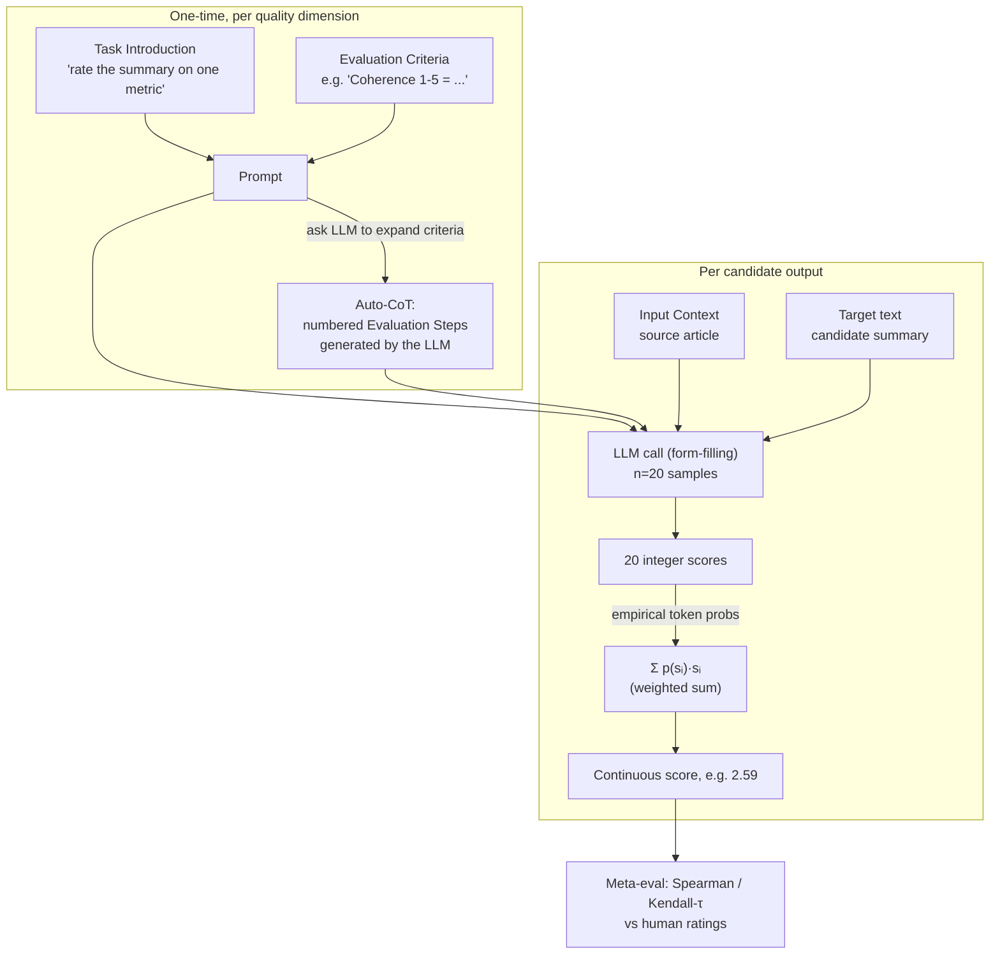
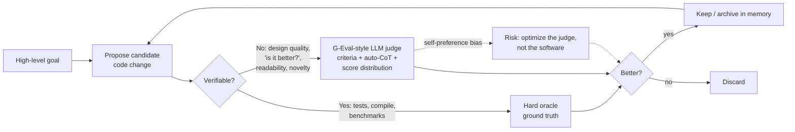

# G-Eval: NLG Evaluation using GPT-4 with Better Human Alignment (arXiv 2303.16634)

> Per-source research findings. Reporter, not architect. Primary evidence (paper + code) over secondary.

---

## 1. Identity

- **Name:** G-Eval — "NLG Evaluation using GPT-4 with Better Human Alignment."
- **What it is:** A *framework / method* (not a system or product) for using a large language model (GPT-4 / GPT-3.5) as a **reference-free automatic evaluator** of natural-language-generation (NLG) outputs. It is the canonical early "LLM-as-a-judge" paper.
- **Authors / org:** Yang Liu, Dan Iter, Yichong Xu, Shuohang Wang, Ruochen Xu, Chenguang Zhu — **Microsoft Cognitive Services Research**.
- **Dates:** First arXiv version 29 Mar 2023; v3 dated 23 May 2023 (the version inspected). Published at **EMNLP 2023** (main conference).
- **Primary links:**
  - Abstract: https://arxiv.org/abs/2303.16634
  - PDF: https://arxiv.org/pdf/2303.16634
  - Code: https://github.com/nlpyang/geval
- **Code repo + commit inspected:** `github.com/nlpyang/geval`, tarball of `main` branch fetched 2026-06-04; latest commit per GitHub API **`6f84404ce4503d2ba0cde0293c5d402ecf2976a8`** (2024-02-04, "Create LICENSE"). The repo is tiny: 2 Python files (~140 LOC total), 4 prompt `.txt` files, the SummEval data, and cached GPT-4 result JSONs. **No probability-weighting code is actually present** (see §4 and §6).

---

## 2. TL;DR

- G-Eval is the **origin point of "LLM-as-a-judge"** as a rigorous, benchmarked method: feed an LLM a *task description + evaluation criteria*, have it auto-generate **chain-of-thought (CoT) evaluation steps**, then have it **fill in a score** in a form. This beat all prior automatic NLG metrics (ROUGE, BERTScore, BARTScore, GPTScore, UniEval) on human-correlation by a large margin (Spearman 0.514 on SummEval summarization vs ~0.474 for the best prior method).
- Three load-bearing ideas, each reusable for an agent's verifier: **(1) decompose evaluation into explicit, written criteria**; **(2) let the model write its own evaluation rubric/steps (auto-CoT)**; **(3) turn discrete 1–5 ratings into a fine-grained continuous score by probability-weighting the rating tokens** (`score = Σ p(sᵢ)·sᵢ`).
- It is the paper that **first named the central danger for any self-improving loop**: LLM judges have a **self-preference / familiarity bias** — they systematically rate LLM-generated text higher than human text, "even when human judges prefer human-written summaries." The authors explicitly warn this "may lead to **self-reinforcement** of LLMs if the evaluation score is used as a **reward signal** for improving themselves" — exactly the failure mode an evolutionary, self-improving agent must guard against.
- **Aged / superseded?** The *specific 2023 implementation* is dated (GPT-3.5/GPT-4-0613, a `logprobs`-via-sampling hack now unnecessary, summarization-only tasks). But the *method and its warnings have aged extremely well*: G-Eval is one of the most-cited evaluation papers of the era and the conceptual ancestor of Agent-as-a-Judge, LLM-as-a-Verifier, and the "LLM judge as fitness function" line that directly powers evolutionary coding agents (AlphaEvolve-style systems). Later work both *builds on* it and *documents its weaknesses* (TrustJudge, CALM's 12-bias taxonomy, "Evolution without an Oracle").
- **Relevance to us: MEDIUM-HIGH but indirect.** G-Eval itself evaluates *summaries and dialogue*, not code — code has cheap ground-truth (tests), which is *better* than any LLM judge. But our loop also needs to judge things tests *cannot* score (design quality, "is this genuinely better?", non-verifiable improvements), and G-Eval is the foundational reference for how to do that, what it costs, and how it self-deceives.

---

## 3. What it does & how it works

G-Eval is a **prompt-based evaluator** with three components (paper §2):

1. **Prompt** = a natural-language *Task Introduction* + the *Evaluation Criteria* (the definition of the quality dimension being scored, e.g. "Coherence (1-5) — the collective quality of all sentences…").
2. **Auto chain-of-thought (auto-CoT)** = the LLM is asked, *once per criterion*, to generate a numbered list of **Evaluation Steps** from the criteria. These steps are then prepended to every scoring call. This is "auto" because the rubric-of-how-to-grade is model-generated, not hand-written.
3. **Scoring function** = the LLM is given (prompt + auto-CoT + input context + target text) and must output a single score in a **form-filling** format ("Evaluation Form (scores ONLY): - Coherence:"). Crucially, G-Eval does the evaluation *directly* (form-filling) rather than via the generation-probability-of-the-target trick used by the prior method GPTScore.

**The probability-weighting refinement (the clever bit).** A naive 1–5 integer score has two problems the authors identify: (a) one digit (often "3") dominates → low variance → low correlation; (b) LLMs emit only integers → many ties. Fix: read the probability the model assigns to each possible score token and take the expectation:

```
score = Σ_{i=1}^{n} p(sᵢ) × sᵢ      (Eq. 1)
```

where `S = {s₁,…,sₙ}` are the allowed scores (e.g. 1..5) and `p(sᵢ)` is the LLM's probability for that token. Because GPT-4-0613 did not expose logprobs at the time, they **approximate** `p(sᵢ)` by sampling the model `n=20` times (`temperature=1, top_p=1`) and using the empirical frequency of each score. This yields a continuous score that better tracks human ranking (higher Spearman).

**Pipeline diagram (the actual method):**



**Benchmarks & headline results.** Meta-evaluated (following Zhong et al. 2022) on **SummEval** (summarization, 4 aspects: coherence/consistency/fluency/relevance), **Topical-Chat** (dialogue, 4 aspects), and **QAGS** (hallucination/consistency). G-Eval-4 (GPT-4 backbone) results:
- SummEval avg Spearman **0.514** / Kendall-τ 0.418 — vs UniEval 0.474, GPTScore 0.417, BARTScore 0.385, BERTScore 0.225, ROUGE-1 0.192. A large margin.
- Topical-Chat avg Spearman **0.588** (G-Eval-4) — beats UniEval 0.417, USR 0.403.
- QAGS-Xsum (hard, abstractive hallucination): G-Eval-4 Spearman **0.537** vs UniEval 0.488, BARTScore 0.159 — big gain on the hardest subset.
- **Ablations:** CoT helps on all dimensions (esp. fluency); probability-normalization raises Spearman (rank correlation) though it can *lower* Kendall-τ because removing ties changes concordant/discordant counts; bigger model (GPT-4 > GPT-3.5) helps most on hard dimensions (consistency, relevance) — "consistency is sensitive to the LLM's capacity."

---

## 4. Evidence from the code

Repo `nlpyang/geval@6f84404` is minimal. Files inspected:

| Path | Role |
|---|---|
| `gpt4_eval.py` (63 LOC) | The actual scoring driver: loads a prompt, substitutes the doc/summary, calls the OpenAI ChatCompletion API, saves raw responses. |
| `meta_eval_summeval.py` (77 LOC) | Computes Pearson/Spearman/Kendall correlation of G-Eval scores vs human SummEval ratings. |
| `prompts/summeval/{coh,con,flu,rel}_detailed.txt` | The four hand-written criteria prompts (with model-generated Evaluation Steps baked in). |
| `data/summeval.json` | 1600 SummEval instances; each = `{doc_id, system_id, source, reference, system_output, scores{coherence,consistency,fluency,relevance,overall}}`. |
| `results/gpt4_*_detailed.json` | Cached GPT-4 outputs (20 samples per instance). |

### 4a. The scoring call (verbatim, `gpt4_eval.py` L29–48)
```python
_response = openai.ChatCompletion.create(
    model=args.model,            # default 'gpt-4-0613'
    messages=[{"role": "system", "content": cur_prompt}],
    temperature=2,
    max_tokens=5,
    top_p=1,
    frequency_penalty=0,
    presence_penalty=0,
    stop=None,
    # logprobs=40,
    n=20
)
...
all_responses = [_response['choices'][i]['message']['content'] for i in
                 range(len(_response['choices']))]
instance['all_responses'] = all_responses
```
Note three things the *code* reveals that the paper smooths over:
- **`logprobs=40` is commented out.** The released code never reads token probabilities. It relies entirely on sampling.
- **`temperature=2`** in the released script (the paper text says `temperature=1` for the GPT-4 sampling). Temperature 2 is very high — it maximizes diversity of the 20 samples to estimate the score distribution. This is a sampling hack to substitute for unavailable logprobs.
- **`n=20`** samples per instance → 20× API cost per score.

### 4b. The "probability weighting" is NOT in the released code
The paper's Eq. 1 (`Σ p(sᵢ)·sᵢ`) implies probability-weighting. But `meta_eval_summeval.py` L57–59 computes a **plain arithmetic mean** of the 20 parsed integer scores:
```python
all_responses = item["all_responses"]
all_scores = [parse_output(x) for x in all_responses]
score = sum(all_scores) / len(all_scores)
```
With uniform sampling weights, `mean(samples)` is an *unbiased estimator* of `Σ p(sᵢ)·sᵢ` — so it is mathematically equivalent in expectation. But the elegant "use the logprobs" story is, in the public artifact, a 20-sample Monte-Carlo average. Reproducing it costs 20 calls/score and inherits sampling noise.

The score parser (L29–38) is deliberately forgiving — it grabs the leading number and defaults to 0 on failure:
```python
def parse_output(output):
    matched = re.search("^ ?([\d\.]+)", output)
    if (matched):
        try:
            score = float(matched.group(1))
        except:
            score = 0
    else:
        score = 0
    return score
```
A score of 0 (out of a 1–5 scale) on parse failure is a quiet failure mode that can skew correlations downward.

### 4c. The actual prompts (verbatim)
These are the load-bearing artifacts. The **Consistency** prompt (`prompts/summeval/con_detailed.txt`) — note the Evaluation Steps are the model-generated auto-CoT, frozen into the prompt:
```
You will be given a news article. You will then be given one summary written for this article.

Your task is to rate the summary on one metric.

Please make sure you read and understand these instructions carefully. Please keep this document open while reviewing, and refer to it as needed.

Evaluation Criteria:

Consistency (1-5) - the factual alignment between the summary and the summarized source. A factually consistent summary contains only statements that are entailed by the source document. Annotators were also asked to penalize summaries that contained hallucinated facts.

Evaluation Steps:

1. Read the news article carefully and identify the main facts and details it presents.
2. Read the summary and compare it to the article. Check if the summary contains any factual errors that are not supported by the article.
3. Assign a score for consistency based on the Evaluation Criteria.

Example:

Source Text:

{{Document}}

Summary:

{{Summary}}

Evaluation Form (scores ONLY):

- Consistency:
```

The **Fluency** prompt uses a 1–3 scale with explicit anchor descriptions per score (a useful pattern — anchored rubrics):
```
Evaluation Criteria:

Fluency (1-3): the quality of the summary in terms of grammar, spelling, punctuation, word choice, and sentence structure.

- 1: Poor. The summary has many errors that make it hard to understand or sound unnatural.
- 2: Fair. The summary has some errors that affect the clarity or smoothness of the text, but the main points are still comprehensible.
- 3: Good. The summary has few or no errors and is easy to read and follow.
...
Evaluation Form (scores ONLY):

- Fluency (1-3):
```

The **Coherence** and **Relevance** prompts follow the identical template (Task Introduction → Evaluation Criteria → Evaluation Steps → `{{Document}}`/`{{Summary}}` slots → "Evaluation Form (scores ONLY):"). The string `(scores ONLY)` is doing real work: it suppresses explanation, forcing a parseable leading number. (Note: the paper's *dialogue-engagingness* appendix prompt *does* ask for "a brief explanation", so the form-only constraint is task-dependent.)

---

## 5. What's genuinely smart

This is the heart of the document — the ideas that transfer to a verifier in any self-improving loop.

1. **Externalize the rubric, then make the model write the steps (auto-CoT).** G-Eval separates *what* to judge (human-authored criteria) from *how* to judge it (model-generated evaluation steps). The auto-CoT step is clever because hand-writing detailed grading procedures for every dimension is expensive; the model can expand a one-line criterion into a usable checklist. The ablation shows this is not cosmetic — CoT improves correlation on every dimension. **Lesson for a verifier: a judge given an explicit, decomposed procedure is measurably more aligned than one asked to "rate this."**

2. **Form-filling > generation-probability.** The prior method (GPTScore) scored text by the model's conditional probability of *generating* the target. G-Eval instead asks the model to *perform the evaluation task* and emit a score. This is more direct, more controllable, and more accurate — and it is the paradigm essentially every modern LLM-judge uses. It also decouples evaluation from the generator's likelihood, which matters when the generator and judge are the same model family.

3. **Continuous score from discrete ratings via expectation over score tokens.** `Σ p(sᵢ)·sᵢ` is a genuinely good trick: it recovers fine-grained signal from a coarse 1–5 scale and breaks ties, which is what makes the rank-correlation jump. This idea has been carried forward and *improved* (TrustJudge's "distribution-sensitive scoring" is explicitly a refinement of it; LLM-as-a-Verifier generalizes it to `R = (1/CK)ΣΣΣ pθ(v_g)·φ(v_g)` over multiple criteria, repetitions, and granularities). **Lesson: don't take a single integer from a judge; take a distribution and reduce it.**

4. **It correctly diagnosed the self-reinforcement trap before anyone built self-improving loops.** The paper's §4 analysis (Figure 2) is the most prescient part. They show G-Eval-4 *always* scores GPT-3.5 summaries above human summaries, even on the subset where humans prefer the human text. They give two causes — (a) high-quality outputs are intrinsically hard to evaluate (inter-annotator Krippendorff's α = 0.07!), and (b) generator and evaluator "share the same concept of evaluation criteria." Then the warning, verbatim:
   > "We highlight this concern in the context that LLM-based evaluators may lead to self-reinforcement of LLMs if the evaluation score is used as a reward signal for further tuning. And this could result in the over-fitting of the LLMs to their own evaluation criteria, rather than the true evaluation criteria of the NLG tasks."

   For a project whose loop is "propose → judge → keep if better," this is the single most important sentence in the paper. If the judge is the same model lineage as the proposer, "better" can collapse into "more like what I'd generate."

5. **Honest meta-evaluation methodology.** They evaluate the *evaluator* against human ratings using rank correlation (Spearman/Kendall), report where the trick *hurts* a metric (Kendall-τ under tie-breaking), and run clean ablations (±CoT, ±probabilities, model size). This is a template for how to validate a verifier rather than assert it works.

---

## 6. Claims vs. reality / limitations / critiques

### What the code does *not* back up (claim vs. artifact)
- The paper sells "**probabilities of the output rating tokens** … to refine the final metric." The public code **never reads logprobs** (`logprobs=40` is commented out) and instead samples 20× at `temperature=2` and averages (§4a–4b). Equivalent in expectation, but the "logprob" framing oversells; reproduction needs 20 calls per score and inherits Monte-Carlo noise.
- A `temperature=2` / 20-sample protocol is **expensive and noisy**, and modern APIs that *do* expose top-k logprobs make the original sampling hack obsolete — a sign of the paper's age.

### Self-preference / familiarity bias (the authors' own finding, since heavily confirmed)
- The paper's Figure-2 finding (judge favors LLM text) has been **independently and repeatedly reproduced and generalized**:
  - *"Benchmarking LLMs as evaluators … biased evaluators"* (arXiv 2405.01724): on the *same SummEval data*, LLM judges show **familiarity bias** (prefer low-perplexity / familiar text), **skewed & round-number score distributions**, and **anchoring effects** in multi-attribute judgments; they are also **inconsistent** (low inter-sample agreement, prompt-sensitive).
  - *CALM — "Justice or Prejudice?"* (arXiv 2410.02736) catalogs **12 distinct LLM-judge biases** and gives an automated framework to quantify them without ground truth.
  - *TrustJudge* (arXiv 2509.21117): discrete ratings + ambiguous ties cause **information loss and inconsistent pairwise judgments**; proposes distribution-sensitive scoring + likelihood-aware aggregation as a fix — directly a critique-and-repair of G-Eval-style scoring.
  - *"The Silent Judge" / "The Judge Who Never Admits"* (arXiv 2509.26072, 2602.07996): document **shortcut biases** (position, verbosity, self-preference, recency, provenance/authority) and that **CoT explanations are often unfaithful** — they rationalize biased verdicts rather than cause them, undermining the very auto-CoT that G-Eval relies on.
  - *"How Design Choices Impact Evaluation Reliability"* (arXiv 2506.13639): reliability hinges on providing **both reference answers and score descriptions**; reference-free judging (G-Eval's headline selling point) is the *weaker* configuration, especially for weaker judge models.

### Other limitations
- **Tasks are narrow.** Only summarization and dialogue, English, news domain. No code, no reasoning, no long-horizon tasks. Generalization to software evaluation is *assumed*, not shown.
- **Reference-free is a double-edged sword.** It is the paper's marketing point (works on tasks lacking references) but later work finds it less reliable than reference-grounded judging when references exist. For code, *tests are the reference* — so a pure G-Eval-style reference-free judge would be strictly worse than running the tests.
- **Cost & non-determinism.** 20 samples/score at high temperature is costly and noisy; not obviously suitable for tight inner-loop verification at scale.
- **Krippendorff's α = 0.07** for humans on the hardest comparison means even the "gold" signal is barely above chance there — a caution that for genuinely high-quality candidates, *no* cheap evaluator (human or LLM) is trustworthy.

---

## 7. Relevance to a self-improving, evolutionary software-building agent

**Relevance test:** *would this help build a self-improving, evolutionary, software-building agent?* G-Eval is about **verification / fitness signal** — the "keep only if verifiably better" half of our loop. Verdict: **medium-high, but indirect and cautionary.**

Where it maps onto our loop:



Specific transferable mechanisms, each tied to what it helps with:

1. **The LLM-judge pattern itself → the soft/non-verifiable part of the fitness function.** Tests can tell us "does it pass," but not "is this architecture cleaner," "is this genuinely a better solution," or "did this refactor improve maintainability." G-Eval is the canonical recipe for *that* judgment: explicit criteria + model-generated evaluation steps + structured score. Useful wherever the agent must rank candidates on qualities no unit test captures.

2. **Auto-CoT / decomposed rubric → more reliable verification.** The finding that *written, decomposed evaluation steps beat "just rate it"* is directly actionable: an agent's verifier should give the judge an explicit checklist (ideally per-criterion), not a vague ask. Later work pushes this further — **MADE** ("Evolution without an Oracle," arXiv 2511.19489) shows that the way to *tame* a noisy LLM judge in an evolutionary loop is to judge against **decomposed, concrete, verifiable sub-requirements** ("Problem Specification") rather than a holistic score. That is G-Eval's "decompose the criteria" idea, made load-bearing for evolution.

3. **Score-distribution → fine-grained selection pressure.** `Σ p(sᵢ)·sᵢ` (and its descendants) gives a continuous, tie-broken fitness value — important for an evolutionary loop that must rank many near-equal candidates. **LLM-as-a-Verifier** (github.com/llm-as-a-verifier) generalizes G-Eval's Eq. 1 to a trajectory reward `R = (1/CK)ΣΣΣ pθ(v_g)·φ(v_g)` over multiple criteria (C), repeated verifications (K), and score-token granularities (G), and reports SOTA as a **test-time-scaling reward model** on SWE-Bench Verified (77.8%) and Terminal-Bench 2 (86.4%). This is the most direct evidence that G-Eval's scoring idea scales to *software/agent-trajectory* evaluation — but in a much-elaborated form.

4. **The self-reinforcement warning → a design constraint, not just a caveat.** This is arguably G-Eval's most relevant contribution for us. If our agent uses an LLM to judge "is this better?" and that judge shares the proposer's model lineage, the loop can drift toward **optimizing the judge's preferences instead of real software quality** — reward hacking by another name. "What Do Evolutionary Coding Agents Evolve?" (arXiv 2605.20086) confirms that a rising evaluator score in an evolutionary coding agent "can reflect … overfitting to the evaluator," not genuine improvement, and argues you must inspect the *search process*, not just the final score. Implication for us: **prefer hard oracles (tests, compilation, benchmarks) as the primary fitness signal; use LLM-judges only for what oracles can't measure; and decorrelate the judge from the proposer** (different model, held-out criteria, or human spot-checks) to avoid self-reinforcement.

5. **Agent-as-a-Judge lineage → trajectory-level verification.** G-Eval scores a *final artifact*. For a long-horizon coding agent, "Agent-as-a-Judge" (arXiv 2410.10934) extends the idea to evaluate the *whole task-solving trajectory* (intermediate steps, tool use), on a code-generation dataset (DevAI). Relevant if we want to reward *how* a candidate was built, not just the end state.

**What does NOT transfer / where it's weak for us:**
- G-Eval is **reference-free**, sold as a virtue. For code we usually *have* a better reference (the test suite). Don't replace a deterministic oracle with a noisy LLM judge where an oracle exists.
- The **20-sample, temperature-2** protocol is too costly/noisy for a tight inner verification loop; modern logprob APIs or single-pass structured scoring are better.
- It says nothing about **memory, orchestration, or long-horizon running** — it is purely an evaluation method.

---

## 8. Reusable assets (collected as evidence, not assembled into a design)

**A. The judge prompt template (verbatim skeleton, from `prompts/summeval/*.txt`).** Reusable for any "score this artifact on one criterion" judge:
```
You will be given <artifact>. Your task is to rate it on one metric.

Please make sure you read and understand these instructions carefully.
Please keep this document open while reviewing, and refer to it as needed.

Evaluation Criteria:

<Criterion name> (<low>-<high>) - <definition of the quality dimension>.

Evaluation Steps:

1. <model-generated or hand-written step>
2. ...
3. Assign a score for <criterion> based on the Evaluation Criteria.

Example:

Source Text:
{{Document}}
<Target>:
{{Summary}}

Evaluation Form (scores ONLY):

- <Criterion>:
```
Key reusable tactics inside it: the `(scores ONLY)` constraint (forces a parseable leading number); **anchored scales** (the Fluency 1–3 prompt defines each integer — "1: Poor … 2: Fair … 3: Good"), which reduce ambiguity vs an unanchored 1–5.

**B. The scoring formula (paper Eq. 1):** `score = Σ_{i=1}^{n} p(sᵢ) × sᵢ` over the allowed score tokens — i.e., take the expectation of the rating, not a single sample. (Its generalization to multi-criterion / multi-sample reward, from LLM-as-a-Verifier, is in §7.3.)

**C. The Monte-Carlo approximation when logprobs are unavailable** (`gpt4_eval.py`): sample `n=20` at high temperature, parse each leading number, average. (Equivalent in expectation to Eq. 1; only needed if the API hides logprobs — largely obsolete now.)

**D. The forgiving score parser** (`meta_eval_summeval.py` L29–38): regex `^ ?([\d\.]+)` on the response, default to 0 on failure. *Borrow the regex, but reconsider the default* — defaulting an unparseable judgment to 0 silently corrupts the signal; a self-improving loop should treat parse-failure as "abstain / re-ask," not "worst score."

**E. Meta-evaluation harness pattern** (`meta_eval_summeval.py`): to *validate a verifier*, correlate its scores against a trusted signal (here, human ratings) with Spearman/Kendall, grouped per item, skipping items with zero score-variance (L72). Directly reusable to sanity-check any LLM-judge we deploy.

**F. The self-preference experiment design** (paper §4 / Fig. 2): partition a labeled set into {human-better, LLM-better, tie} and check whether the judge tracks the human preference *within* each partition. A cheap, concrete test for whether *our* judge is self-reinforcing.

---

## 9. Signal assessment

- **Overall value: MEDIUM-HIGH** (high as foundational reference for the *verification* component; medium as something directly usable, because it's dated and code-focused on summarization rather than software).
- **Confidence: high.** I read the full 11-page paper (v3) and the entire public codebase (both Python files + all four prompts + data/results schema), and cross-checked with 8+ independent later papers.
- **Why not "high" overall for us:** G-Eval evaluates *summaries/dialogue*, reference-free, with a costly 2023-era sampling hack. Our agent's primary fitness signal for *code* should be hard oracles (tests/compile/benchmarks), which are strictly more trustworthy than any LLM judge. G-Eval matters most for the *non-verifiable* slice of judgment and as the source of the self-reinforcement warning — both real, but a supporting role, not the spine of an evolutionary coding loop.
- **Has it aged well / been superseded?** The *implementation* is dated and partly obsolete (logprob hack, GPT-4-0613, 20-sample averaging). The *ideas* are very much alive and have been **extended, not discarded**: form-filling LLM judging is now standard; the score-expectation trick was refined (TrustJudge) and generalized into SOTA software-trajectory reward models (LLM-as-a-Verifier); the self-preference warning has been confirmed many times over and is now a named hazard for exactly the evolutionary-agent setting we're building (MADE, "What Do Evolutionary Coding Agents Evolve?"). So: superseded as an *implementation*, foundational and validated as a *concept*.
- **What I could NOT verify:**
  - I could not reproduce the reported correlations (would require an OpenAI key and re-running 1600×20 GPT-4 calls). I trust the cached `results/*.json` and published tables but did not recompute them end-to-end.
  - I could not confirm whether any *private/internal* G-Eval variant used true logprobs; the public code does not.
  - The numeric results in §7 from later papers (e.g. LLM-as-a-Verifier's 77.8% SWE-Bench) come from those papers' own claims (search summaries/highlights), not independent reproduction.

---

## 10. References

**Primary — this source:**
- [P] Liu, Iter, Xu, Wang, Xu, Zhu. *G-Eval: NLG Evaluation using GPT-4 with Better Human Alignment.* arXiv:2303.16634 (v3, 23 May 2023; EMNLP 2023). https://arxiv.org/abs/2303.16634 — PDF: https://arxiv.org/pdf/2303.16634
- [P/code] `github.com/nlpyang/geval@6f84404ce4503d2ba0cde0293c5d402ecf2976a8`
  - `geval@6f84404:gpt4_eval.py` — scoring driver (temperature=2, n=20, logprobs commented out).
  - `geval@6f84404:meta_eval_summeval.py` — correlation harness; plain mean of samples (L57–59); parser (L29–38).
  - `geval@6f84404:prompts/summeval/{coh,con,flu,rel}_detailed.txt` — the four criteria prompts (verbatim in §4c).
  - `geval@6f84404:data/summeval.json` — 1600 instances, schema `{doc_id, system_id, source, reference, system_output, scores{...}}`.

**Secondary — critiques / bias analyses of G-Eval-style judging:**
- [S] *Benchmarking LLMs as evaluators: familiarity/score/anchoring bias, inconsistency* (SummEval). arXiv:2405.01724. https://arxiv.org/pdf/2405.01724
- [S] *Justice or Prejudice? Quantifying Biases in LLM-as-a-Judge* (CALM; 12 biases). arXiv:2410.02736. https://arxiv.org/html/2410.02736
- [S] *TrustJudge: Inconsistencies of LLM-as-a-Judge and How to Alleviate Them* (refines discrete scoring / Eq.1). arXiv:2509.21117. https://arxiv.org/html/2509.21117v1
- [S] *An Empirical Study of LLM-as-a-Judge: How Design Choices Impact Evaluation Reliability.* arXiv:2506.13639. https://arxiv.org/html/2506.13639v1
- [S] *The Silent Judge: Unacknowledged Shortcut Bias in LLM-as-a-Judge.* arXiv:2509.26072. https://arxiv.org/html/2509.26072v2
- [S] *The Judge Who Never Admits: Hidden Shortcuts in LLM-based Evaluation* (CoT unfaithfulness). arXiv:2602.07996. https://arxiv.org/html/2602.07996v1

**Secondary — later work extending the idea toward agents/evolution (our domain):**
- [S] *LLM-as-a-Verifier: A General-Purpose Verification Framework* (generalizes Eq.1 to trajectory reward; SOTA SWE-Bench/Terminal-Bench). https://github.com/llm-as-a-verifier/llm-as-a-verifier
- [S] *Evolution without an Oracle: Driving Effective Evolution with LLM Judges* (MADE; decomposed verifiable sub-requirements to tame judge noise). arXiv:2511.19489. https://arxiv.org/html/2511.19489
- [S] *What Do Evolutionary Coding Agents Evolve?* (EvoTrace; "overfitting to the evaluator" risk). arXiv:2605.20086. https://arxiv.org/html/2605.20086v1
- [S] *Agent-as-a-Judge: Evaluate Agents with Agents* (trajectory-level judging; DevAI code dataset). arXiv:2410.10934. https://arxiv.org/html/2410.10934v1

**Cited within the paper (context):**
- [S] Fu et al. *GPTScore.* arXiv:2302.04166 (the conditional-generation-probability baseline G-Eval beats).
- [S] Zhong et al. *UniEval / Towards a Unified Multi-Dimensional Evaluator.* arXiv:2210.07197 (strongest non-LLM baseline; meta-eval protocol followed).
- [S] Wei et al. *Chain-of-Thought Prompting.* arXiv:2201.11903 (the CoT G-Eval applies to evaluation).
- [S] Fabbri et al. *SummEval.* TACL 2021 (the summarization meta-eval benchmark).
- [S] Zhang et al. *Benchmarking LLMs for News Summarization.* arXiv:2301.13848 (source of the human-vs-GPT3.5 preference data used in the self-preference experiment; Krippendorff α = 0.07).
