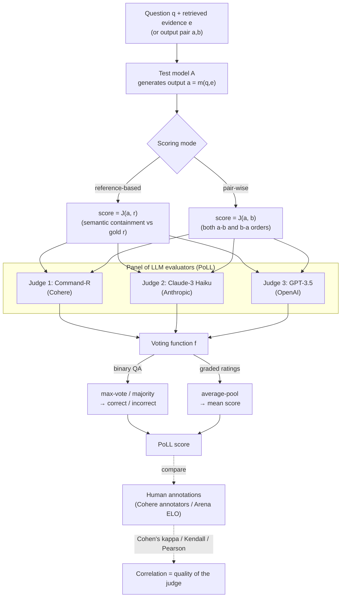
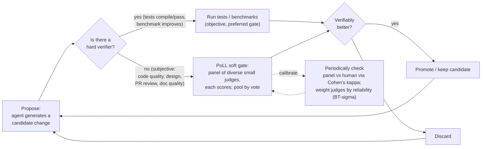

# Findings — arXiv 2404.18796 — "Replacing Judges with Juries: Evaluating LLM Generations with a Panel of Diverse Models"

> Per-source research dossier for the KB Seed AI project. Reporter, not architect.
> Relevance test applied throughout: *would this help build a self-improving,
> evolutionary, software-building agent?* (broad — includes verification,
> decision-making, orchestration, memory, long-horizon control).

---

## 1. Identity

- **Name / title:** *Replacing Judges with Juries: Evaluating LLM Generations with a Panel of Diverse Models.* Introduces the **Panel of LLM evaluators (PoLL)**.
- **What it is:** An empirical NLP-evaluation paper (not a system, not a released codebase). It argues — and measures — that a **panel of several smaller, heterogeneous LLM judges**, with their votes pooled, is a *better, cheaper, less-biased* automatic evaluator than a single large judge (GPT‑4) for scoring free-form LLM generations.
- **Authors / org:** Pat Verga; Sebastian Hofstätter, Sophia Althammer, Yixuan Su; Aleksandra Piktus, Arkady Arkhangorodsky, Minjie Xu, Naomi White; Patrick Lewis. **All Cohere.** (Patrick Lewis = RAG co-author; Aleksandra Piktus = KILT/RAG; this is a credible IR/eval team.)
- **Dates:** Submitted **29 Apr 2024**; v2 listed **1 May 2024** (the version inspected). Category cs.CL.
- **Primary links:**
  - Abstract: https://arxiv.org/abs/2404.18796
  - PDF: https://arxiv.org/pdf/2404.18796 (17 pages, inspected in full)
- **Code repo:** **No code released by the authors.** The paper reuses external code for one setting only — the `lm-sys/arena-hard` pipeline (https://github.com/lm-sys/arena-hard) of Li et al. 2024a — to regenerate/score Chatbot Arena Hard outputs. No PoLL implementation, no harness, no prompts repo is published. Verbatim prompts are given in the paper's appendix (Tables 11–14), reproduced below in §4/§8.
- **Inspected commit SHA:** N/A (no authored code). External `arena-hard` repo not pinned by the paper.

---

## 2. TL;DR

- **Core claim:** Replace the single "judge" (e.g. GPT‑4-as-evaluator) with a **"jury"** — a *Panel of LLm evaluators (PoLL)* drawn from **disjoint model families** — and aggregate their scores by a simple **voting function** (max-vote for binary QA; average-pool for graded ratings).
- **The specific PoLL tested:** 3 models from 3 families — **Command‑R (Cohere, 35B) + Claude‑3 Haiku (Anthropic) + GPT‑3.5 (OpenAI)**. Deliberately *small* models, deliberately *different vendors*.
- **Headline results:** This 3-small-model panel **correlates better with human judgements than a single GPT‑4 judge** across single-hop QA, multi-hop QA, and Chatbot Arena ranking — while being **~7–8× cheaper** and lower-latency (judges run in parallel).
- **Bias finding (the load-bearing insight):** A single judge exhibits **intra-model bias** — it scores *its own family's* outputs highest (GPT‑4 ranks a GPT‑4 variant #2 when truth is #4). A *heterogeneous* panel **cancels** this bias: PoLL had the **smallest score spread** (std 2.2) vs GPT‑3.5 alone (std 6.1).
- **Surprising sub-result:** GPT‑4 is a **weak, high-variance judge** on simple reference-matching QA — it "over-reasons," and an explicit *"don't overthink"* prompt instruction lifts its agreement substantially (κ 0.627 → 0.725 on NQ).
- **Why it matters for us:** A seed-AI's improvement loop lives or dies on its **verifier**. This paper is a clean, cheap recipe for a *more trustworthy, bias-resistant LLM-judge* (ensemble of diverse small judges + simple vote) — directly relevant when verification must be soft/subjective rather than a unit test. **Signal: medium** (idea is simple, transferable, well-evidenced; but narrow, no code, and our preferred verifier is hard tests where possible).

---

## 3. What it does & how it works (mechanism-level)

The paper is small and surgical. There is exactly **one method** — replace a single LLM judge with a panel — plus a battery of experiments measuring its behaviour. No agent, no loop, no training. The "system" is an evaluation procedure.

### 3.1 The three scoring settings it operates over

A judge model `J` scores the output `a` of a test model `A`. The paper formalises three judging modes (§2.1):

1. **Single-point scoring** — `score = J(a)`. The judge rates a lone output against an internal notion of quality (the prompt encodes what "good" means). Used for graded ratings (e.g. Chatbot Arena 1–5).
2. **Reference-based scoring** — `score = J(a, r)`. The judge is given a gold reference `r` and decides whether `a` is *correct relative to* `r`. This is the QA setting (NQ, TriviaQA, HotpotQA, Bamboogle). The judge effectively does a *semantic containment* check: "is the reference answer semantically contained in the generated answer?"
3. **Pair-wise scoring** — `score = J(a, b)`. The judge picks the better of two outputs (a 3- or 5-point scale `a>b`, `a≈b`, `a<b`). Both `a–b` and `b–a` orderings are tested to cancel position bias. This is the Chatbot Arena Hard setting.

### 3.2 PoLL: the panel + the voting function

The entire contribution (§2.2) is this substitution: instead of one judge `J`, use a **panel `P` of individual judges `j`**, have each judge score independently *exactly as in the single-judge setting*, then aggregate with a **voting function `f`**:

> **final score = `f( j(a) : j ∈ P )`** where `P` is a panel of individual judges `j` and `f` is a voting function. *(paper §2.2)*

Two voting functions are used (§3.1):
- **Max-vote (majority)** — for binary QA judgements `[correct, incorrect]`. With 3 judges this is simple majority.
- **Average-pooling** — for Chatbot Arena, because the 1–5 ratings from 3 judges "often does not produce a clear majority decision," so the mean is taken instead.

The specific panel evaluated ("our instantiation of PoLL", §3.1–3.2) is **three models from three disjoint families**:
- **Command-R** (Cohere, 35B open weights)
- **Claude-3 Haiku** (Anthropic)
- **GPT-3.5** (OpenAI)

Deliberately *small* (no GPT-4-class model is in the panel) and deliberately *cross-vendor*. **Mistral** (Large, Medium) is evaluated only as a *judged* model "to have a model 'unaffiliated' with any judges" — i.e. a control to check no panel member can self-favour it.

The design intuition is borrowed explicitly from **human annotation pooling** (Voorhees 1998): averaging across diverse annotators cancels each annotator's idiosyncratic bias and reduces variance. The panel is the LLM analogue — diverse *model families* stand in for diverse *human annotators*, and pooling their votes cancels per-model bias (esp. self-preference).



### 3.3 How "correctness of the judge" is actually measured

The paper never assumes a judge is right; it measures **agreement with humans**. Two ground-truth sources:
- **QA settings:** Cohere's internal "highly-qualified" annotators judge, per output, whether the reference answer is *semantically contained* in the generated answer (deliberately asking only about correctness, not style, to minimise annotator preference bias). Judge↔human agreement is scored with **Cohen's κ** (chance-corrected; κ>0.8 strong, κ>0.6 moderate).
- **Chatbot Arena Hard:** the crowd-sourced **ELO leaderboard** is treated as gold; each judge produces a model *ranking* and is scored by **Kendall-τ** and **Pearson** correlation against the ELO ranking. They reuse Li et al. 2024a's `arena-hard` codebase and had to *generate fresh outputs for all models except GPT-3.5/GPT-4* (the repo only shipped those two), then score them with each judge.

### 3.4 The four empirical findings (the actual results)

1. **PoLL correlates best with humans** (Table 1, single-hop QA, Cohen's κ): PoLL is top or near-top on NQ (0.763), TriviaQA (0.906), HotpotQA (0.867). **GPT-4 is among the *weakest* judges** here (NQ 0.627, vs PoLL 0.763) — worse than EM string-matching on NQ. Individual small judges (CMD-R 0.734, Haiku 0.749, GPT-3.5 0.726 on NQ) each beat GPT-4 too.
2. **PoLL best on ranking** (Table 2, Chatbot Arena): PoLL Pearson **0.917 / Kendall 0.778**, vs GPT-4 **0.817 / 0.667**. PoLL is especially better *at the top of the ranking* (Fig 2).
3. **GPT-4 is prompt-fragile** (Table 3, NQ, GPT-4 as judge): κ swings with prompt wording — Zero-shot 0.518; Few-shot standard 0.627; **+"don't overthink" instruction 0.725**. The single most effective change is *telling GPT-4 not to reason and not to worry about wider factuality* — they hypothesise GPT-4 "over-reasons" and injects outside knowledge instead of just aligning answer to reference on what is "essentially a fuzzy string matching exercise."
4. **Heterogeneous pooling cancels bias** (§4.4, Figs 3–4): deviation of each judge's accuracy from human accuracy — **PoLL has the smallest spread (std 2.2)**; GPT-3.5 alone the largest (std 6.1). And critically: *"the highest positive delta for each individual model being scored occurs when it is judged by itself"* — direct evidence of **self-preference / intra-model bias**, which the diverse panel averages out. In Fig 2 the GPT-4 judge ranks a GPT-4 variant at #2 when its true position is #4.

5. **Cost** (§4.5): the 3-model PoLL costs **$1.25/M input + $4.25/M output** vs GPT-4 Turbo's **$10/M input + $30/M output** → **~7–8× cheaper**, and lower latency since judges run in parallel.

---

## 4. Evidence (no authored code; the appendix prompts are the load-bearing artifact)

**There is no released PoLL implementation.** The only code reused is the external `lm-sys/arena-hard` pipeline (Li et al. 2024a) for the Chatbot Arena setting, used unmodified ("We do not modify the judge prompts in any way from the original implementation," §3.6). So the primary recoverable evidence is the **verbatim judge prompts** in Appendix A (Tables 11–14) and the **aggregation logic**, plus an independent open-source reproduction (distilabel, below) that shows the concrete pooling code.

### 4.1 The actual judge prompt structure (KILT QA, reference-based)

The QA judges are **few-shot, reference-based, binary** ("say exactly 'True', otherwise say 'False'"). The instruction line is the heart of it. Verbatim header of the **KILT NaturalQuestions / TriviaQA judge prompt** (Tables 11, 13):

> *"You will be given a Question and a Provided Answer. Judge whether the Provided Answer is correct by comparing it to the Reference Answer. Differently formatted dates, people with missing middle names, and alternative spellings should all be considered the same. If the Provided Answer is correct say exactly 'True', otherwise say 'False'."*

Then **8–16 few-shot exemplars**, each a `Question / Provided Answer / Reference Answer / Correct:` quadruple, ending with the live instance:

```
Question 9: "{QUESTION}"
Provided Answer: "{GEN_ANSWER}"
Reference Answer: "{GOLD_ANSWER}"
Correct:
```

Note the deliberately tricky exemplars that teach the judge to be lenient on formatting but strict on substance — e.g. a "Provided Answer" that is verbose and *adds* correct info is marked `True`; an answer that refuses ("the documents do not directly mention...") is marked `False`. This is the *containment* semantics encoded by example, not by rule.

### 4.2 The GPT-4 "optimized" prompt — the "don't overthink" fix, verbatim

The most transferable single sentence in the paper. Table 14 ("KILT NQ GPT-4 optimized Judge Prompt") puts the instruction in a **system** message and adds the explicit don't-overthink / ignore-world-factuality clause:

> **SYSTEM:** *"You are judging whether a model has generated a correct answer to a question. Study the examples the user gives you as they will be very informative for how to do the task. The Reference Answers you get will be longer, and can be considered correct if it contains the semantic content of short reference answer somewhere within it. **Don't worry about factuality with respect to the real world, just judge the example based on what you see. No need to overthink this task, it really comes down to just soft matching. Answer with only the word 'Yes' or 'No'**"*

This single instruction lifted GPT-4's κ on NQ from 0.627 (few-shot standard) to **0.725** (Table 3) — the largest prompt-driven gain in the paper. The prompt-ablation ladder (§4.3, Table 3): Zero-shot 0.518 → Few-Shot Standard 0.627 → +No Instruction Line 0.594 (removing instruction *hurts*) → +Move Instruction Line (to system) 0.637 → +Chat-Formatted Shots 0.561 → **+'don't overthink' 0.725**.

### 4.3 The aggregation logic (paper + independent reproduction)

The paper states the rule (max-vote for binary, average-pool for graded) but ships no code. An **independent, working reproduction by Alvaro Bartolome (Argilla/HuggingFace, distilabel, May 2024)** implements the exact pooling. The pooling step, verbatim (`distilabel`):

```python
@step(inputs=["poll_ratings"], outputs=["avg_poll_ratings"])
def AveragePooling(*inputs: StepInput) -> StepOutput:
    """Custom `Step` that calculates the average of the ratings for each generation."""
    for input in inputs:
        for item in input:
            item["avg_poll_ratings"] = [
                sum(col) / len(col) for col in zip(*item["poll_ratings"])
            ]
        yield input
```

The reproduction's topology is the canonical PoLL shape — generate with N models in parallel, fan out to a panel of judges (Command-R+, GPT-3.5, Haiku) running the **UltraFeedback** rating prompt, combine ratings, then average-pool:

```
load_dataset
  >> [gen_llama3, gen_gemma, gen_phi3, gen_mistral]   # candidate generation (parallel)
  >> combine_generation_columns
  >> [ultrafeedback_cmdr_plus, ultrafeedback_gpt35]    # the jury (parallel)
  >> combine_ultrafeedback_columns
  >> avg_pooling                                       # the voting function f
```

Source: https://huggingface.co/blog/alvarobartt/replacing-judges-with-juries-distilabel (2024-05-03). Notably, the author reports **Claude-3 Haiku failed to produce format-compliant UltraFeedback ratings** ("not able to generate something that's compliant with the expected formatting") — a small real-world signal that small judges are more format-fragile and that **parse-failure handling is a required part of any panel harness**.

---

## 5. What's genuinely smart

The paper has a small number of ideas, each correct and load-bearing:

1. **"Jury, not judge" — diversity as a bias-cancellation mechanism.** The deepest idea: **intra-model / self-preference bias is real and is the dominant failure of single-judge eval**, and you don't fix it with a *bigger* judge — you fix it with *disjoint model families* whose biases are (hoped to be) uncorrelated, then pool. The self-preference evidence is clean: every judged model gets its highest score from *itself*, and a heterogeneous panel has the smallest deviation from humans. This is the LLM analogue of inter-annotator pooling and it is the right framing for any *subjective* verifier.

2. **Smaller-and-many beats bigger-and-one — for evaluation.** A capability inversion that matters for cost-constrained loops: three cheap models *voting* beat one frontier model *judging*, at ~1/7 the price and with parallel latency. For a seed-AI that may run *thousands* of verification calls per improvement cycle, the judge cost is a first-order budget item; this says you can buy *better* judging for *less*.

3. **GPT-4 "over-reasons" on matching tasks — capability ≠ judging fit.** The finding that the *most capable* model is the *worst* judge on simple reference-containment, because it injects world knowledge and second-guesses the reference, is a genuinely useful and counterintuitive result. The fix — an explicit *"don't overthink, just soft-match, ignore real-world factuality"* instruction — is a concrete, copyable prompt pattern. The lesson generalises: **match the judge's reasoning depth to the judging task**; a verifier told to do too much will hallucinate disagreement.

4. **Measure the verifier against humans with chance-corrected agreement.** The methodology itself is a reusable asset: never trust a judge in the abstract — quantify judge↔human agreement with **Cohen's κ** (binary correctness) or **Kendall/Pearson** (rankings), and treat the judge with the highest human-agreement as the one to use. This is exactly the discipline a self-improving system needs to *validate its own verifier* before trusting it to gate changes.

5. **Robustness/stability as a first-class property.** PoLL wins not by being the single best on every dataset (it isn't always) but by being **consistently good** — "there is not a single 'best' judge across all settings, while PoLL performs well consistently." Lower *variance* across tasks is the selling point, which is precisely what you want from a gate that must run unattended over a long horizon.

---

## 6. Claims vs. reality / limitations / critiques

**What the paper genuinely demonstrates:** on its six datasets, the specific 3-model panel beats a single GPT-4 judge on human correlation, costs ~7× less, and has lower score variance and less self-preference bias. That much is well-supported.

**What it overstates or leaves open (the authors are mostly honest about these):**

- **Tiny scope.** Only 3 judge settings, 6 datasets, *one* panel composition (CMD-R + Haiku + GPT-3.5). No math, no code, no reasoning evaluation — exactly the domains a software-building seed-AI cares about most. The authors explicitly flag math/reasoning and **"panel selection"** (which models to pick) as unaddressed future work.
- **Self-serving panel.** The panel includes Cohere's own Command-R, and the paper is a Cohere paper showing Command models look good and that EM "unjustly penalized Command models." Reasonable, but not a neutral benchmark.
- **GPT-4 is a *2024* GPT-4.** The "frontier judge is weak" result is anchored to early-2024 GPT-4 Turbo and a *containment* task. It does not show small panels beat frontier judges on hard, subjective, or agentic-trajectory evaluation today.

**The major independent critique — correlated errors break the jury theorem.** The strongest follow-up is **"Nine Judges, Two Effective Votes: Correlated Errors Undermine LLM Evaluation Panels"** (Guneet Kohli, Apple) — https://arxiv.org/html/2605.29800v1. Its findings directly bound PoLL's premise:
  - A **9-judge, 7-family** panel on NLI (ChaosNLI, 100 human labels/item) provides only **~2.0–2.5 effective independent votes** (Kish n_eff). ~¾ of the nominal independence is lost because *different-family models make the same mistakes on the same items*.
  - The panel's accuracy falls **8–22 pp short** of what truly-independent voting (Condorcet) would give, and **the best single judge matches or beats the full panel** on all datasets tested.
  - **Neither more judges nor smarter aggregation helps** — Dawid-Skene EM and accuracy-weighted voting close ≤11% of the gap *even with oracle gold labels*. "The bottleneck is correlated judges, not the aggregation algorithm."
  - It is careful to say this *complements* rather than refutes PoLL: PoLL compares the panel to the **average** individual judge (where diversity wins by cancelling quirks); Apple compares to the **best** individual judge (where the panel can dilute the strongest signal with redundant weaker votes). **Both can be true.** The practical caveat for us: *cross-vendor ≠ independent*; modern LLMs share training paradigms and "agree on wrong answers ~60% of the time" on some benchmarks, so a diverse panel's bias-cancellation is far weaker than the jury-theorem intuition suggests.

**A second follow-up — equal-weight averaging is suboptimal.** *"Who can we trust? LLM-as-a-jury for Comparative Assessment"* (Qian, Sun, Gales, Knill) — https://arxiv.org/html/2602.16610v2 — shows PoLL's **equal-weight average pooling implicitly assumes uniform judge reliability**, which is false in practice (judges vary by task, exhibit position bias `p_ij + p_ji ≠ 1`, and produce **non-transitive / cyclic** preferences). It proposes **BT-σ**, a judge-aware Bradley-Terry model that learns a per-judge reliability/discriminator parameter *unsupervised* from pairwise comparisons alone, and beats unweighted averaging. Takeaway for us: if we pool judges, **weight them by measured reliability**, don't average blindly; and **symmetrise pairwise judgements** (`p'_ij = ½(p_ij + (1−p_ji))`) to kill position bias.

**Reproducibility:** No authored code, but the method is trivial to reimplement and *has* been independently reproduced (distilabel, above). The numerical results (κ tables) are not independently re-run in the material I found; I could not verify the exact κ values myself.

**Reward-hacking / test-gaming relevance:** Not studied in-paper, but the self-preference finding *is* a reward-hacking vector: if a seed-AI's generator and its judge share a family, the generator can be scored too leniently on its own style. A diverse panel partially mitigates this; a *single* self-judge is the dangerous configuration.

---

## 7. Relevance to a self-improving, evolutionary software-building agent

This is an **evaluation / verification** paper, and verification is the gate that makes an open-ended "propose → test → keep only if verifiably better" loop sound. Mapping its ideas onto our problem:



Where each idea would help:

- **Soft verification when no hard test exists (the core fit).** Much of building software is *not* unit-testable in the moment — "is this refactor cleaner?", "is this PR description accurate?", "is this design doc coherent?", "did the agent actually satisfy the high-level goal?". For these *subjective* gates, a **diverse small-model panel + majority/average vote** is a cheaper, lower-bias verifier than a single frontier judge. This is the most direct contribution.
- **Cost control over long horizons.** A seed-AI running unbounded loops makes a huge number of verification calls. 7–8× cheaper judging with parallel latency directly extends how long/wide the search can run on a fixed budget.
- **Bias-resistance against self-grading (anti-reward-hacking).** If the builder model also judges its own output, self-preference inflates scores → the loop "improves" by gaming its own grader. A **cross-vendor panel that excludes the generator's family** is a concrete mitigation for verifier capture.
- **Validate-the-verifier discipline.** The κ-against-humans methodology is a template for *trusting the gate*: before letting a judge gate real changes, measure its agreement with a small human-labelled set; track it over time. A self-improving system should treat its verifier as a component that itself needs evaluation.
- **"Don't overthink" prompt pattern for matching/checking tasks.** When the verifier's job is *containment / does-output-meet-spec* rather than open reasoning, instruct it to soft-match and ignore outside knowledge — prevents a strong model from hallucinating disagreement. Useful for spec-conformance and test-oracle prompts.
- **Decision-making / orchestration analogue.** The jury pattern generalises beyond grading: any place the agent makes a *consequential discrete choice* (which of N candidate plans? is this milestone done?) can use a diverse panel + vote instead of one model's call, with the same bias-cancellation rationale — *subject to the correlated-error caveat below*.

**What does NOT apply / where to be careful:**
- It teaches us **nothing about hard, objective verification** (tests, compilation, benchmark deltas), which should remain our *preferred* gate whenever available. PoLL is a fallback for the subjective slice.
- The **correlated-error ceiling** (Apple) means "add more diverse judges" has sharply diminishing returns; a 3–5 model panel is plausibly near the practical max, and the panel may not beat the single *best* judge — so for high-stakes gates, also keep a strong single judge in the loop and reconcile.
- **Equal-weight voting is naive**; if we adopt panels, prefer reliability-weighted aggregation (BT-σ) and position-bias symmetrisation for pairwise gates.
- No memory, no long-horizon control, no self-modification content here — those dimensions of the seed-AI get nothing from this source.

---

## 8. Reusable assets (verbatim, cited)

1. **The KILT QA judge prompt instruction** (reference-based, binary, few-shot) — `repo: none, paper Tables 11/13`:
   > "You will be given a Question and a Provided Answer. Judge whether the Provided Answer is correct by comparing it to the Reference Answer. Differently formatted dates, people with missing middle names, and alternative spellings should all be considered the same. If the Provided Answer is correct say exactly 'True', otherwise say 'False'."
   - Instance template: `Question: "{QUESTION}" / Provided Answer: "{GEN_ANSWER}" / Reference Answer: "{GOLD_ANSWER}" / Correct:`
   - Pattern: 8–16 few-shot quadruples including (a) ≥1 positive and (b) ≥1 negative per *generating-model family*, and (c) ≥1 case where the human *disagrees with exact-match* — to teach lenient-on-format, strict-on-substance containment (Appendix A.1.1, prompt-selection procedure sweeps `n_shots ∈ {8,10,16}`).

2. **The "don't overthink" judge system prompt** (the single highest-value snippet) — `paper Table 14`:
   > "You are judging whether a model has generated a correct answer to a question. Study the examples the user gives you as they will be very informative for how to do the task. The Reference Answers you get will be longer, and can be considered correct if it contains the semantic content of short reference answer somewhere within it. Don't worry about factuality with respect to the real world, just judge the example based on what you see. No need to overthink this task, it really comes down to just soft matching. Answer with only the word 'Yes' or 'No'"

3. **The voting/aggregation function** — paper §2.2 (`final score = f( j(a) : j ∈ P )`), with `f` = max-vote (binary) or average-pool (graded). Concrete, working implementation (independent reproduction, distilabel) for average-pool:
   ```python
   @step(inputs=["poll_ratings"], outputs=["avg_poll_ratings"])
   def AveragePooling(*inputs: StepInput) -> StepOutput:
       for input in inputs:
           for item in input:
               item["avg_poll_ratings"] = [
                   sum(col) / len(col) for col in zip(*item["poll_ratings"])
               ]
           yield input
   ```
   (https://huggingface.co/blog/alvarobartt/replacing-judges-with-juries-distilabel)

4. **The panel-composition recipe:** 3 small models from 3 *disjoint* vendor families; deliberately exclude any model in the same family as the system being scored (avoid self-preference). Use majority vote for binary verdicts, mean for graded ratings.

5. **The verifier-validation methodology:** score judge↔human agreement with **Cohen's κ** (`κ = (p_o − p_e)/(1 − p_e)`; κ>0.8 strong, >0.6 moderate) for binary correctness, and **Kendall-τ / Pearson** of judge-produced rankings vs a trusted gold ranking. Select/keep the judge (or panel) with the highest human agreement.

6. **Pairwise position-bias controls** (from method + follow-up): always test both `a–b` and `b–a` orderings; symmetrise probabilities `p'_ij = ½(p_ij + (1 − p_ji))` before aggregating (Qian et al., BT-σ).

7. **Schema implied for a judgement record:** `{question, generated_answer, reference_answer, per_judge_verdict[], pooled_verdict, judge_model_id}` — plus a parse-failure flag (small judges fail formatting; the distilabel repro had to handle Haiku `rating=None`).

---

## 9. Signal assessment

- **Overall value: MEDIUM.** A simple, well-evidenced, immediately reusable idea for the *subjective* slice of verification — diverse small-judge panels + vote, validated against humans, ~7× cheaper, less self-preference bias. It is directly relevant to building a trustworthy soft verifier and to anti-reward-hacking (don't let a model grade its own family). It is *not* high signal because: it is narrow (no hard/objective verification, no math/code/reasoning eval, no agent/loop/memory), it is partly self-serving (Cohere panel), and its central premise is materially weakened by the correlated-error follow-up (a "diverse" panel is far less independent than it looks, and may not beat the best single judge). It is not low signal because the prompt patterns, the κ-validation discipline, and the bias framing are genuinely portable.
- **Confidence: high** on what the paper says/claims and on the independent critiques (read the paper in full incl. all appendix prompts; read the two follow-up papers and a working reproduction). **Medium** on whether the headline result still holds with 2026-era frontier judges and on agentic/code-eval tasks (untested by this source).
- **Could NOT verify:** the exact κ/τ/Pearson numbers (no re-run; no authored code/data); whether the few-shot exemplar selection generalises beyond KILT; latency claims (authors did "not run explicit latency evaluations").

---

## 10. References

**Primary (this source):**
- Verga, Hofstätter, Althammer, Su, Piktus, Arkhangorodsky, Xu, White, Lewis (Cohere). *Replacing Judges with Juries: Evaluating LLM Generations with a Panel of Diverse Models.* arXiv:2404.18796v2, 1 May 2024. Abstract: https://arxiv.org/abs/2404.18796 — PDF: https://arxiv.org/pdf/2404.18796 (17 pp, read in full; key prompts in Appendix Tables 11–14). HTML: https://arxiv.org/html/2404.18796
- No authored code repo. External code reused (Chatbot Arena setting): `lm-sys/arena-hard` — https://github.com/lm-sys/arena-hard (not pinned by paper).

**Independent reproduction / engineering (secondary):**
- Alvaro Bartolome (Argilla / HuggingFace). *"Replacing Judges with Juries" using distilabel.* 2024-05-03. https://huggingface.co/blog/alvarobartt/replacing-judges-with-juries-distilabel — working PoLL pipeline + `AveragePooling` code; notes Haiku UltraFeedback format failures.

**Independent critiques / follow-ups (secondary, primary-research):**
- Guneet Kohli (Apple). *Nine Judges, Two Effective Votes: Correlated Errors Undermine LLM Evaluation Panels.* arXiv:2605.29800v1. https://arxiv.org/html/2605.29800v1 — the key skeptical result: diverse panels ≈ 2 effective independent votes; best single judge ≥ panel; aggregation can't fix correlated errors.
- Qian, Sun, Gales, Knill. *Who can we trust? LLM-as-a-jury for Comparative Assessment.* arXiv:2602.16610v2. https://arxiv.org/html/2602.16610v2 — BT-σ: reliability-weighted, unsupervised judge aggregation beats equal-weight averaging; documents position bias & cyclic inconsistency.
- Eugene Yan. *Evaluating the Effectiveness of LLM-Evaluators (aka LLM-as-Judge).* https://eugeneyan.com/writing/llm-evaluators/ — broad practitioner survey contextualising PoLL among LLM-evaluator methods.
- The Moonlight. *Literature Review: Replacing Judges with Juries.* https://www.themoonlight.io/en/review/replacing-judges-with-juries-evaluating-llm-generations-with-a-panel-of-diverse-models (secondary summary).

**Key works cited *by* the paper (for the ideas above):**
- Zheng et al. 2024 (*Judging LLM-as-a-judge with MT-Bench and Chatbot Arena*) — single-judge paradigm + self-preference.
- Panickssery et al. 2024 (*LLM evaluators recognize and favor their own generations*) — self-preference bias.
- Li et al. 2024a (*From live data to high-quality benchmarks: the arena-hard pipeline*) — Chatbot Arena Hard setup reused.
- Li et al. 2023 (*PRD: Peer rank and discussion improve LLM-based evaluations*) — prior multi-judge work (pairwise only).
- Voorhees 1998 — human annotation pooling, the conceptual ancestor of PoLL.
- Petroni et al. 2021 (KILT); Kwiatkowski et al. 2019 (NQ); Joshi et al. 2017 (TriviaQA); Yang et al. 2018 (HotpotQA); Press et al. 2023 (Bamboogle) — datasets.

*Code references: none authored (`repo: none`). Reproduction code is in the distilabel blog post above, not a pinned commit.*

