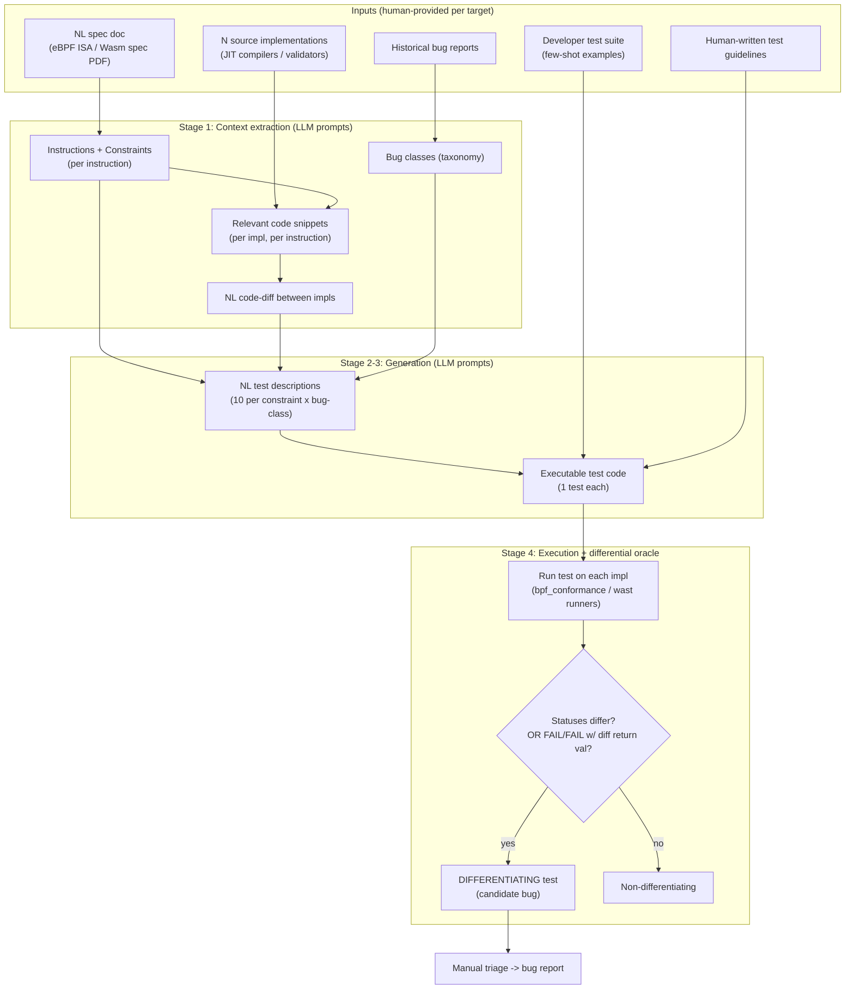

# DiffSpec — Differential testing with LLMs using Natural Language Specifications and Code Artifacts (arXiv 2410.04249)

> Per-source research findings. Reporter, not architect. Relevance test applied throughout:
> *would this help build a self-improving, evolutionary, software-building agent?*

---

## 1. Identity

- **Name:** **DiffSpec** (the paper typesets it as the LaTeX macro `\tool`; the title page and headers render it as "DiffSpec"). A framework for **LLM-driven differential test generation** guided by natural-language specifications + code artifacts.
- **What it is:** A *prompt-chaining pipeline* that ingests a system's natural-language specification, multiple source-code implementations, developer tests, and historical bug data, and uses an LLM to emit *targeted differential tests* — tests whose outcomes differ across implementations, surfacing real bugs. It is **not** an agent, not a self-improving loop, and not an evolutionary search. It is a (largely) one-shot, human-configured test-generation harness.
- **Authors / org:** Nikitha Rao, Elizabeth Gilbert, Harrison Green, Claire Le Goues (**Carnegie Mellon University**); Tahina Ramananandro, Nikhil Swamy, Sarah Fakhoury (**Microsoft Research**, Redmond).
- **Dates:** First arXiv submission **Oct 5, 2024** (2410.04249). Inspected version **v3, dated 6 May 2025** (cs.SE). Artifacts accessed-dates in the paper are 2024-09-12.
- **Primary links:**
  - Abstract: https://arxiv.org/abs/2410.04249
  - PDF (v3): https://arxiv.org/pdf/2410.04249
  - Data/artifact (Zenodo): https://doi.org/10.5281/zenodo.13756137 — "All the code for DiffSpec along with the prompts to generate the tests, the scripts to run the tests on the evaluation harness, the generated differential tests, results from additional experiments and manual analysis."
- **Code repo + commit SHA inspected:** **No public Git repo for DiffSpec itself.** Code is published only as a Zenodo artifact archive (DOI 10.5281/zenodo.13756137), not a versioned VCS repo, so there is no commit SHA. (See §4 for what could/could not be inspected.) The GitHub links in the paper are to *systems under test* (e.g. `iovisor/ubpf`, `microsoft/ebpf-for-windows`, `Alan-Jowett/bpf_conformance`, `bytecodealliance/wasm-tools`, `titzer/wizard-engine`), not to DiffSpec.

---

## 2. TL;DR

- **What it is:** DiffSpec is a **prompt-chaining harness** that turns a natural-language *specification* + multiple *source implementations* + developer *tests* + *historical bug categories* into **targeted differential tests** for spec-conforming systems (compilers, runtimes, validators). Demonstrated on **eBPF runtimes** (Linux JIT, uBPF, eBPF-for-Windows) and **Wasm validators** (spec interpreter, Wizard, Wasmtime, V8).
- **Core result:** Generated ~1901 differentiating eBPF tests and 299 differentiating Wasm tests, leading to **4 confirmed eBPF bugs** (kernel memory leak, jump inconsistency, stack-pointer UB, verifier-hanging infinite loops) and **2 confirmed/fixed Wasm bugs**. Real bugs in heavily-fuzzed software — the headline is genuine.
- **The one transferable idea for us:** the **oracle is "implementations disagree," not "matches ground truth."** DiffSpec needs *no* reference oracle: it runs the same test on N implementations and flags status/return-value divergence (PASS/FAIL/SKIP/ERROR/CRASH + mismatched return values). This is a cheap, ground-truth-free *verifier* pattern.
- **Honest relevance:** **It is NOT a self-improving or evolutionary agent, and not a long-horizon loop.** It is a *one-pass*, human-configured pipeline (no execution feedback loop — that is explicitly listed as *future work*). It is a **verification / test-generation** building block, narrowly applicable to multi-implementation, spec-defined targets. For a general software-building seed AI, most of the architecture does not transfer; the *differential-oracle concept* and the *spec→constraints→test-description→test-code prompt decomposition* are the salvageable pieces.
- **Signal: LOW–MEDIUM.** High-confidence read (full paper + full code/prompts inspected). It is a solid, narrow SE-testing paper; its value to *our* project is a couple of patterns, not a blueprint.

---

## 3. What it does & how it works

### 3.1 Problem framing
Differential testing (McKeeman 1998): run the same input on ≥2 implementations that *should* behave identically; if outputs differ, at least one is buggy. The hard part is *generating inputs that actually expose subtle divergences*. DiffSpec's thesis: the **natural-language spec, the implementations' source code, and historical bug data** are rich signals an LLM can mine to produce *targeted* divergence-seeking tests — instead of blind/grammar fuzzing.

### 3.2 The pipeline (four stages)
DiffSpec is a **directed prompt chain** (no loop, no agent, no feedback). All LLM calls are stateless single-turn `chat.completions` calls (GPT-4-32k 0613 for eBPF; GPT-4o for Wasm). The four stages:

1. **Context extraction** (per *instruction*): prompt the LLM to pull, from the spec document, the **instructions** in the language and the **constraints** for each. Then extract **relevant source snippets** per implementation, and have the LLM produce a **natural-language diff** of the two implementations. Separately, distill **historical bug reports** into a fixed taxonomy of **bug classes**.
2. **Test-description generation** (NL): combine constraints + code-diff + bug-class into a prompt that asks for *10 unique* natural-language descriptions of tests likely to diverge, each naming the constraint it targets.
3. **Test-code generation:** convert each NL description into one executable test, conditioned on **few-shot human test examples** + a **human-written guideline list** (e.g. "final result must be in r0", "default to 64-bit ops", "no inline comments").
4. **Execution & differential oracle:** run every generated test on each implementation via a conformance harness; bucket each into PASS/FAIL/SKIP/ERROR/CRASH; a test is **differentiating** if statuses differ across implementations OR (FAIL,FAIL) with mismatched return values.



### 3.3 The "best" configuration: `bug-guided-code-diff`
The paper's headline DiffSpec = the **`bug_guided_code_diff`** ablation, which uses *all* signals: instruction + constraints + relevant-section + example tests + test descriptions + guidelines + **bug classes** + **code diffs**, with the two-step (describe-then-code) generation. The driver (`main_bug_guided_code_diff.py`) loops:
`for each instruction → extract constraints → extract code per arch → diff the code → for each bug_class → for each code_diff chunk → generate 10 NL test descriptions → generate one test body each → save`.
This is a **nested cartesian-product expansion** (instructions × bug_classes × code-diff-chunks × 10), which is *why* it produces ~1900 tests — sheer multiplicative volume, not search.

### 3.4 Per-domain instantiation (the "generalizability" claim)
- **eBPF:** spec = the IETF BPF ISA doc; 34 instructions extracted; implementations = Linux kernel JIT (via libbpf plugin), uBPF, eBPF-for-Windows (bpf2c); harness = the **bpf_conformance** project's unified runner; 55 historical bug reports → 11 bug classes; 206 human tests as few-shot pool. Test format = `bpf_conformance` `.data` (asm + `-- result` hex).
- **Wasm:** spec = WebAssembly 2.0 spec (sections on control-flow + validation); 11 control-flow instructions; implementations = Wasm spec interpreter (oracle), Wizard, Wasmtime, V8; bug classes seeded by ChatGPT-3.5 then human-verified; test format = `.wast` with `assert_invalid`/`assert_malformed`. Only the spec + Wizard *code* context was given (others tested blind), to show transfer.

---

## 4. Evidence from the code

**Artifact inspected:** `DiffSpec.zip` from Zenodo (concept DOI 10.5281/zenodo.13756137; concrete record **zenodo.org/records/13836070**, v2, published 2024-09-12), md5 `e9b65d7f0d94658084751622032ca6f2`, 42.4 MB. **Not a Git repo → no commit SHA.** Extracted layout: `DiffSpec/ebpf/{code,data}` and `DiffSpec/wasm/{code,data}`. Below, paths are relative to the unzipped `DiffSpec/` root.

### 4.1 The prompt library (load-bearing) — `ebpf/code/utils/prompt_utils.py`
All prompts are plain Python f-strings; every one opens with `"You are an expert in ebpf."` and re-states the goal `"find differential tests that returns different outputs in different implementations"`. Key verbatim prompts:

**(a) Constraint extraction from spec** (`extract_manual_instruction_constraints`):
> "You are an expert in ebpf. Here is a ISA document that details the exact specifications that need to be followed for eBPF.\n\n{manual}\n\n... Can you extract the key points relevant to the {instruction} instruction from the documentation. Make sure you are extremely specific, and extract all the constraints and conditions that strictly need to be followed when implementing the {instruction} instruction. The goal is to use these constraints to generate differential tests, so make sure you include details that can be easily missed or misinterpreted so we can test for all misinterpretations and nuances."

**(b) Code-diff generation** (`generate_differences_from_code_snippets`):
> "... You are provided with the relevant code implementing the {instruction} instruction in two different implementations. Here is the code implementation for {architecture1}: {src_code1}\n\nHere is the code implementation for {architecture2}: {src_code2}\n\nIdentify differences in the two code implementations and return the output as a list of differences between the two implementations."

**(c) Bug+code-diff-guided test descriptions** (`generate_test_descriptions_from_bug_code_diff`, used by the headline config):
> "... Here is a key difference in the way {instruction} instruction was implemented in {architecture1} and {architecture2}: {code_diff}\n\nYour goal is to generate 10 unique differential tests so we can test for this difference ... Focus on {bug_class} when generating the tests. {bug_description}. Can you generate a natural language description of tests that can result in differential behaviour based on the difference in the code implementations for {instruction} instruction for {bug_class}. Make sure to reason about the specific constraint that the test is checking for and include information on how the test relates to the {bug_class}. Only provide the list of tests as output."

**(d) Test-code synthesis with guidelines** (`generate_test_body`) — the most reused prompt; the numbered guidelines are the human "valid-test" knowledge:
> "... Generate the code for the test in the same format as the example. You are required to strictly follow these instructions when generating the test.\n1. Make sure you only generate one test.\n2. Do not include comments in the same line as code.\n3. Instructions default to 64 bit operations, for example, use mov instead of mov64. mov64 is not recognised.\n4. Include valid return values in the result section of the code, do not leave comments or text there.\n5. Make sure you use valid registers.\n6. Make sure you use valid labels when using jump instructions.\n7. Make sure the final result is in the register r0.\n\nOnly generate the test code so it can be directly executed, and comment out any natural language descriptions describing what the test does."

There are also chained variants for *more* test descriptions ("Here are some tests that currently exist… generate other tests that are currently not included") — a simple **diversity/dedup-by-prompting** trick, not a search.

### 4.2 The LLM client — `ebpf/code/utils/model_utils.py`
Stateless single-turn call, wrapped in `tenacity` retry (exp backoff, up to **2000 attempts**). No temperature/seed set (defaults). Output validity is checked only superficially:
```python
def is_valid_model_output(output, k):
    if '```' in output:          # reject markdown code fences
        return False
    generations = output.split('<SEP>')
    generations = [g for g in generations if g.strip() != '']
    if len(generations) != k:    # must be exactly k tests
        return False
    return True
```

### 4.3 The differential oracle — `ebpf/code/evaluation/differential_testing.py`
This is the **verifier**, and it is deliberately simple: a pandas join of per-implementation result tables, then divergence detection. The whole oracle is essentially:
```python
joint_df = df1.join(df2, lsuffix=f'_{impl1}', rsuffix=f'_{impl2}')
# a test "differs" if statuses disagree...
diff_df = joint_df[joint_df[f'test_status_{impl1}'] != joint_df[f'test_status_{impl2}']]
# ...plus FAIL/FAIL pairs whose return values disagree (mismatched failures)
diff_fail = diff_df12[ diff_df12[f'return_value_{impl1}'] != diff_df12[f'return_value_{impl2}'] ]
```
It then enumerates **every** status-pair cell (PASS/PASS, PASS/FAIL, … CRASH/CRASH) for bookkeeping. **There is no ground-truth oracle**: correctness is *inferred* from disagreement; a human triages which side is actually wrong. `SKIP` (invalid program) divergences are explicitly *excluded* from the "no-skips" differential count.

### 4.4 Test status semantics — from `bpf_conformance` runner outputs (paper §4.1)
PASS = valid test, expected return matched; FAIL = valid test, returned ≠ expected (could be a bug *or* the LLM's expected value was wrong — mitigated by cross-impl comparison); SKIP = program not valid BPF; ERROR = invalid program the plugin can handle (e.g. bad register id); CRASH = invalid in a way that crashes the conformance plugin.

### 4.5 Execution harness — `ebpf/code/evaluation/run_tests_windows.py` (a reality-check)
Tests are run by shelling out to `bpf_conformance_runner.exe` with a **60-second timeout** per test. Notably, the script contains **hand-maintained hardcoded lists of filenames that hang the verifier**, special-cased as `"potential crash"` so the runner doesn't deadlock, e.g.:
```python
if baseline_type == 'prompt_chain' and file in ['JA_8.data', 'JGT_9.data', 'JLE_11.data', 'JLT_8.data', ...]:
    results.loc[i, 'output'] = 'potential crash'; continue
```
This is significant: the infinite-loop/verifier-hang "bug" was partly surfaced via **manual curation of crashing inputs**, not a fully automated detector. Also note a real post-processing hack: `generated_test = generated_test.replace('#', '\n#')` to force inline comments onto their own line (inline comments break the BPF assembler).

### 4.6 The bug taxonomy — `ebpf/code/bug_categorization/BPFBugCategories.json`
11 fixed classes with descriptions, e.g. *Shift Operation Bugs* ("…especially when the shift amount is zero… can hang the kernel"), *Stack Layout Errors*, *Register Handling Bugs*, *Endianness Conversion Bugs*, *Error Checking Omission*. These were distilled from 55 historical bug reports (`main_high_level_categories.py` + `context/BPFBugFixes.csv`). They function as **structured "where to look" priors** injected into the generation prompt.

### 4.7 Context inputs actually shipped
`ebpf/code/context/`: the BPF ISA as PDF + extracted `ebpf_isa_manual.txt` + JSON; six real JIT compiler source files (`linux_bpf_jit_comp_x86.c`, `ubpf_jit_x86_64.c`, `windows_bpf_code_generator.cpp`, ARM32/ARM64/x86-32 variants); `instructions_ground_truth.txt` (34 instrs); `BPFBugFixes.csv` (166 KB of historical fixes). Wasm side ships pre-computed `code_context_gpt4o.json`, `control_flow_constraints_gpt4o.json`, `test_descriptions_gpt4o.json` (the cached LLM extractions) plus the spec interpreter `.ml` and Wizard `CodeValidator.v3`. So the pipeline's intermediate artifacts are reproducible from cache.


---

## 5. What's genuinely smart

These are the load-bearing ideas, judged on their merits (independent of our project):

1. **Ground-truth-free verification via cross-implementation disagreement.** The single most valuable idea. DiffSpec never needs to *know* the correct answer. It exploits the fact that N independent implementations of one spec form a *mutual oracle*: any disagreement is a bug-in-at-least-one signal. This sidesteps the hardest problem in test generation — the oracle problem — and is robust to the LLM hallucinating a wrong "expected" value (because the verdict comes from comparing real implementations, not trusting the LLM's expected output). The code makes this concrete and cheap (a pandas join + inequality check, §4.3).

2. **Spec → constraints → NL test description → executable test as a decomposition.** Instead of "read this 100-page PDF and write tests" (which blows the context window and yields shallow tests), DiffSpec breaks generation into *typed, narrow LLM calls*: extract per-instruction constraints, describe a test in prose tied to a specific constraint, then render code. The intermediate NL layer is a human- and machine-auditable representation ("this test checks constraint X"), and the two-step (describe-then-code) measurably improved syntactic validity over one-shot (Table 2).

3. **Using *implementation diffs* as a generation prior.** Rather than testing each implementation in isolation, DiffSpec has the LLM read two implementations of the *same* instruction, articulate how they differ, and aim tests *at* those differences. This is a smart heuristic for *where divergences are likely to live* — the model concentrates effort on the seams between implementations.

4. **Historical bug reports as a structured "where-to-look" prior.** Distilling past bugs into ~11 reusable bug classes and injecting them ("Focus on {bug_class}…") turns institutional failure history into a generation signal. The ablations show **bug context is the single most impactful component** for finding divergences (bug-centric jumped differential tests from 38 → 271 on the W-vs-L/L-vs-U/W-vs-U eBPF comparison).

5. **A blunt but honest empirical finding: validity ≠ usefulness.** Their ablations show fuzzers and naive prompting produce *high-validity* tests (100% / 68–76%) but almost *no* differentiating tests (4, 14, 39). The full DiffSpec has *lower* validity (~69%) but **1901** differentiating tests. The lesson — *syntactic correctness and diversity are not enough; you need semantic guidance (spec + code-diff + bug priors) to find interesting behavior* — is a genuinely useful negative result about test generation.

---

## 6. Claims vs. reality / limitations / critiques

**Status of the work.** As of v3 (May 2025) this is an **arXiv preprint, not peer-reviewed/accepted** at a venue (confirmed: no venue on the arXiv listing, ADS, or in the PurCL CodeLLMPaper index which files it under `arXiv2024`). It is, however, a chapter of Nikitha Rao's CMU PhD thesis (CMU-S3D-25-101, April 2025), framed there as the "verify LLM-generated code" pillar. No independent reproduction or critique exists that I could find; the only third-party "review" is an auto-generated Moonlight AI summary — **and it is unreliable** (it states "359 for eBPF and 279 for Wasm," contradicting the paper's 1901 / 299; do not cite it for numbers).

**What the evidence actually supports vs. the framing:**
- **(Claim) "general approach … generalizes across systems."** **(Reality)** Demonstrated on exactly **two** domains, both of which are *language/ISA conformance* targets with (a) a formal-ish NL spec, (b) multiple independent implementations, and (c) a ready-made conformance harness + test format. That is precisely the *easy* case for differential testing. Generalization to systems *without* multiple conforming implementations, or without an existing oracle/runner, is **not shown** and is structurally hard. The Wasm "generalization" still required human-provided source context and a human-verified bug taxonomy.
- **(Claim) the pipeline is automated.** **(Reality)** Substantial **human-in-the-loop**: human-written test guidelines, human-curated few-shot examples, human-verified bug classes, and — notably — **hardcoded lists of hang-inducing test files** maintained per-ablation in `run_tests_windows.py` (§4.5). The verifier-hang "bug" is partly a manual-curation artifact. Final bug confirmation is entirely manual triage (they manually inspected a random sample of 200 of the 1901 eBPF diffs).
- **(Claim) "1901 differentiating tests … four distinct bugs."** **(Reality)** 1901 *differentiating tests* collapse to a handful of *distinct bugs* (≈4 eBPF, ≈2 Wasm). Many differentiating tests point at the same underlying issue, and "differentiating" ≠ "bug" (could be a known/intended difference, or an LLM-mis-specified expected value). The bug count is small and was reached via manual analysis of a sample, so the true bug yield is an estimate, not an exhaustive count.
- **No feedback / no iteration.** The model never sees execution results; nothing is refined based on whether a test passed, failed, or was invalid. The authors explicitly name "incorporating execution feedback to our prompt-chaining approach to refine tests" as **future work**. So there is **no loop, no learning, no self-improvement** — the thing runs once.
- **Brute-force volume.** The 1901 number is driven by a cartesian product (34 instr × 11 bug classes × code-diff chunks × 10), i.e. ~thousands of LLM calls. Cost/efficiency are not reported; ~31% of bug-guided-code-diff tests are invalid (validity 69%), so a large fraction of generation is wasted.
- **Possible oracle contamination / gaming.** Because expected return values are LLM-produced, a PASS can be a *false* PASS (LLM guessed an expected value the impl happens to match) and a FAIL can be spurious. The cross-implementation comparison mitigates but does not eliminate this; FAIL/FAIL with matching return values are treated as non-differentiating even though both could be wrong in the same way.
- **Model/version drift.** eBPF used GPT-4-32k (0613, since deprecated); Wasm used GPT-4o because the 32k endpoint was retired mid-project. Results are thus not from a single fixed model, and are not reproducible against the original eBPF model.

**Bottom line on credibility:** the *positive* core (real, confirmed bugs in heavily-tested software via a disagreement oracle) is believable and the artifact is complete enough to inspect. The *generality* and *automation* framings are oversold relative to what's demonstrated.

---

## 7. Relevance to a self-improving, evolutionary software-building agent

Applying the brief's test — *would this help build a self-improving, evolutionary, software-building agent?* — honestly:

**What is relevant (and how):**
- **Verification without ground truth (the differential oracle).** A seed AI that builds software needs cheap, trustworthy "is this better/correct?" signals. DiffSpec's pattern — *generate multiple independent solutions, then treat their disagreement as a bug signal* — is directly applicable as a **verifier** when no reference exists. For a self-improving agent that can produce *N* candidate implementations of the same spec/function, cross-checking them against each other (and flagging divergences for deeper inspection) is a usable, oracle-free correctness filter. This is the strongest connection to the "propose → test → keep only if verifiably better" loop.
- **Decomposed, typed generation prompts.** The spec→constraint→NL-description→code chain is a reusable pattern for *grounding* an LLM's output in a large reference document without context overflow, and for producing an **auditable intermediate representation** ("this artifact targets constraint X / bug-class Y"). A long-horizon agent benefits from such typed intermediate steps for traceability and for re-use of partial results (the cached `*_gpt4o.json` artifacts show the intermediates are durable).
- **History-as-prior.** Turning a corpus of *past failures* into a compact, reusable taxonomy that is injected into future generation is a lightweight **memory** mechanism. A self-improving agent could maintain an evolving "bug-class / failure-mode" memory mined from its own past mistakes and condition new attempts on it. (DiffSpec's version is static and human-verified, but the shape is reusable.)
- **The negative result (validity ≠ progress).** Useful design caution for *our* verifier/selection design: a candidate that is *valid* and *diverse* is not necessarily *better*; the selection signal must measure semantic behavior, not surface plausibility. This argues for behavioral/differential checks over syntactic ones in the keep/discard decision.

**What is NOT relevant (don't force-fit):**
- No autonomy, no agent loop, no planning, no tool use, no orchestration, no long-horizon execution, no self-modification, no search/evolution. DiffSpec is a static pipeline executed once.
- The headline domain (testing language runtimes/validators that already have multiple conforming implementations + a conformance harness) is narrow and *not* the seed-AI's general setting. A from-scratch software-building agent usually has **one** implementation and **no** sibling oracle, so the differential trick only applies in the specific sub-case where the agent deliberately produces multiple variants to cross-check.
- The "1901 tests" volume engineering, the bpf_conformance/.wast harness specifics, and the eBPF/Wasm domain knowledge are not transferable.

**Net:** one genuinely useful *concept* (disagreement-as-oracle verification) plus two minor reusable patterns (typed generation decomposition; failure-history-as-prior). Not an architecture for us.

---

## 8. Reusable assets

Concrete, quotable things we *could* borrow (collected as evidence; not assembled into a design):

1. **The differential-oracle predicate** (`ebpf/code/evaluation/differential_testing.py`): a test is a candidate bug iff `status(impl_i) != status(impl_j)` for any pair, or `(FAIL,FAIL)` with `return_value_i != return_value_j`. SKIP-divergences excluded. This is a complete, minimal, ground-truth-free verifier we could reimplement in ~20 lines for any setting where we can produce ≥2 candidate implementations.

2. **The four-stage prompt chain** (verbatim prompts in `ebpf/code/utils/prompt_utils.py`, quoted in §4.1):
   - constraint extraction from a long spec ("extract all the constraints… include details that can be easily missed or misinterpreted");
   - implementation-diff articulation ("Identify differences in the two code implementations and return … a list of differences");
   - difference/bug-targeted test-description generation ("Focus on {bug_class}… reason about the specific constraint that the test is checking for");
   - guideline-constrained code synthesis (the 7-point numbered "valid test" guideline block).

3. **The "generate more, not-already-covered" diversity prompt** (`generate_more_test_descriptions*`): "Here are some tests that currently exist.\n{existing}\nCan you generate other tests that are currently not included…" — a cheap dedup/coverage-expansion trick by feeding prior outputs back as a negative constraint.

4. **A failure-mode taxonomy schema** (`ebpf/code/bug_categorization/BPFBugCategories.json`): `[{"bug_class": str, "description": str}, …]` distilled from a historical-bug CSV — a template for a compact, prompt-injectable "what tends to go wrong" memory.

5. **Status taxonomy for execution outcomes**: PASS / FAIL / SKIP / ERROR / CRASH (with precise definitions, paper §4.1) — a clean, reusable bucketing for any "run candidate and classify outcome" verifier, including the explicit treatment of *invalid* (SKIP) vs *crashing* (CRASH) vs *wrong-answer* (FAIL).

6. **Robust LLM-call wrapper** (`model_utils.py`): `tenacity` exponential-backoff retry + a strict output-shape validator (`reject if '```' present; require exactly k '<SEP>'-separated items`) — a small but practical pattern for forcing parseable LLM output in an automated pipeline.

7. **Post-processing repair hacks** worth remembering when executing LLM-generated code: forcibly move inline comments to their own line (`output.replace('#', '\n#')`); regenerate once if a markdown fence leaks in; keep only the first test if multiple are emitted.

---

## 9. Signal assessment

- **Overall value to our project: LOW–MEDIUM (lean LOW).** As a piece of SE research it is solid and finds real bugs; as input to a *self-improving, evolutionary, software-building agent* it contributes **one** genuinely transferable concept (disagreement-as-oracle verification) and a couple of minor prompt/memory patterns. It is not an agent, not a loop, not evolutionary, and its demonstrated setting (multi-implementation conformance testing) is narrow relative to ours.
- **Confidence: HIGH.** I read the full 16-page v3 PDF and the complete code artifact (prompts, model client, the differential oracle, the execution harness, the bug taxonomy, the driver scripts, the few-shot examples, and the per-domain context inputs), with md5 verified against Zenodo.
- **What I could NOT verify:**
  - End-to-end reproduction (I did not run the pipeline; it requires OpenAI API access, plus building uBPF/eBPF-for-Windows/bpf_conformance and Wasm engines — out of scope, and the original eBPF model GPT-4-32k-0613 is deprecated).
  - The exact bug counts / confirmations beyond what the paper and the linked GitHub issues state (e.g. `Alan-Jowett/bpf_conformance` issues #292–#294, `vbpf/ebpf-verifier` #783, `WebAssembly/spec` PR #1822, two Wizard-engine commits) — I read the references but did not independently audit each issue's status.
  - Cost/compute and the precise number of LLM calls (not reported in the paper).
  - Whether any "differentiating" tests are intended/known differences rather than bugs (the paper relies on manual triage of a 200-test sample for eBPF).

---

## 10. References

**Primary**
- [P1] Rao, Gilbert, Green, Ramananandro, Swamy, Le Goues, Fakhoury. *DiffSpec: Differential Testing with LLMs using Natural Language Specifications and Code Artifacts.* arXiv:2410.04249 (v1 Oct 5 2024; v3 May 6 2025). Abstract: https://arxiv.org/abs/2410.04249 · PDF: https://arxiv.org/pdf/2410.04249 · HTML: https://arxiv.org/html/2410.04249v3
- [P2] DiffSpec artifact (code, prompts, generated tests, results). Zenodo concept DOI https://doi.org/10.5281/zenodo.13756137 ; concrete record https://zenodo.org/records/13836070 (v2, 2024-09-12); `DiffSpec.zip`, 42.4 MB, md5 `e9b65d7f0d94658084751622032ca6f2`. **Not a Git repo (no commit SHA).**
- [P3] Code references (paths within unzipped artifact `DiffSpec/`):
  - `ebpf/code/utils/prompt_utils.py` — all generation/extraction prompts (verbatim in §4.1)
  - `ebpf/code/utils/model_utils.py` — LLM client + output validator (§4.2)
  - `ebpf/code/evaluation/differential_testing.py` — the differential oracle (§4.3)
  - `ebpf/code/evaluation/run_tests_windows.py` — execution harness + hardcoded hang-lists (§4.5)
  - `ebpf/code/test_generation/main_bug_guided_code_diff.py` — headline-config driver (§3.3)
  - `ebpf/code/test_generation/main_prompt_chain_instruct.py`, `main_entire_isa_3shot_random.py` — ablation drivers
  - `ebpf/code/bug_categorization/BPFBugCategories.json` — 11-class bug taxonomy (§4.6)
  - `ebpf/code/examples/random_3shot.txt` — few-shot test examples
- [P4] Nikitha Rao. PhD thesis *Navigating Challenges with LLM-based Code Generation using Software-specific Insights*, CMU-S3D-25-101, April 2025 (DiffSpec = the "verify generated code" chapter, alongside CAT-LM and LowCoder). http://reports-archive.adm.cs.cmu.edu/anon/s3d2025/CMU-S3D-25-101.pdf
- [P5] Confirmed-bug trackers cited by the paper: `Alan-Jowett/bpf_conformance` issues #292, #293, #294; `vbpf/ebpf-verifier` issue #783; `WebAssembly/spec` PR #1822; Wizard-engine commits `4ad7eca1…` and `33b58749…`.

**Systems under test (for context; not DiffSpec code)**
- eBPF: `iovisor/ubpf`, `microsoft/ebpf-for-windows`, `Alan-Jowett/bpf_conformance` (+ libbpf plugin), Linux kernel BPF JIT.
- Wasm: `WebAssembly/spec` (reference interpreter, the oracle), `titzer/wizard-engine`, `bytecodealliance/wasmtime`, V8.

**Secondary / discovery (lower trust)**
- [S1] PurCL @ Purdue, *CodeLLMPaper* index — files DiffSpec under `differential testing` / `specification inference`, venue tag `arXiv2024`: https://github.com/PurCL/CodeLLMPaper/blob/main/data/papers/labels/differential_testing.md
- [S2] ADS bibliographic record (Bibcode 2024arXiv241004249R): https://ui.adsabs.harvard.edu/abs/2024arXiv241004249R/abstract
- [S3] Moonlight AI auto-summary — **UNRELIABLE** (mis-states bug/test counts as 359/279); listed only to flag it should not be cited: https://www.themoonlight.io/en/review/diffspec-differential-testing-with-llms-using-natural-language-specifications-and-code-artifacts

