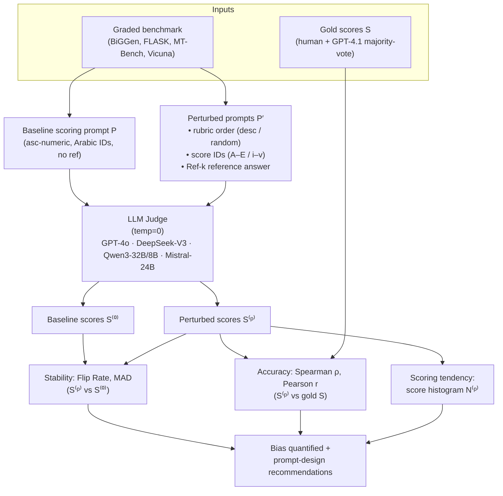
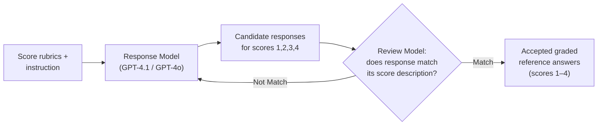

# arXiv 2506.22316 — "Evaluating Scoring Bias in LLM-as-a-Judge"

> Research findings doc. Source: arXiv:2506.22316 (DASFAA 2026). Author org: Ant Group.
> Status: IN PROGRESS — being written incrementally per brief.

---

## 1. Identity

- **Name:** *Evaluating Scoring Bias in LLM-as-a-Judge*
- **What it is:** An empirical study + evaluation framework that measures how **scoring-based** LLM judges (those that emit an absolute numeric score for one response, as opposed to pairwise/comparative judges) shift their scores when the *scoring prompt itself* is perturbed in ways that should be irrelevant. It defines three new bias types, a metric suite, and an automatic data-synthesis pipeline; it then benchmarks several LLM judges and gives prompt-design recommendations to mitigate the biases.
- **Authors:** Qingquan Li⋆†, Shaoyu Dou⋆, Kailai Shao, Chao Chen, Haixiang Hu. (⋆ = equal contribution; † = work done while at Ant Group.)
- **Org:** Ant Group, Hangzhou, China.
- **Venue / dates:** Accepted to **DASFAA 2026** (per the official repo README). arXiv 2506.22316; the link provided is HTML **v4**. arXiv ID prefix 2506 ⇒ first submitted June 2025; v4 is a later revision. Repo last commit 2026-02-03.
- **Primary links:**
  - Abstract: https://arxiv.org/abs/2506.22316
  - HTML v4 (full paper): https://arxiv.org/html/2506.22316v4
  - Official repo (dataset): https://github.com/KMdsy/scoring_bias/
- **Code repo + commit inspected:** `github.com/KMdsy/scoring_bias` @ **`4a81543889209ccad9413c0a7fedb09f6d4786c3`** (HEAD of `main`, dated 2026-02-03). **This is a DATASET-ONLY repo — there is NO runnable code.** It contains only `README.md`, `pipeline.png`, `alignment.png`. The augmented datasets themselves are gated ("available upon request" via email). So all mechanism detail below comes from the **paper** (HTML v4) plus the data schema documented in the README.

---

## 2. TL;DR

- This is an **evaluation-of-evaluators** paper, not a system/agent paper. It studies the *reliability of the verifier*, which is exactly the component a "keep only if verifiably better" seed-AI loop leans on.
- It identifies **three new scoring biases** that come from the *scoring prompt*, not the answer being judged: **(1) rubric order bias** (order in which the score-level descriptions are listed), **(2) score ID bias** (whether levels are labeled 1–5 vs A–E vs i–v, ascending vs descending), and **(3) reference-answer score bias** (whether you show the judge a reference answer, and what score that reference is purported to have).
- Its central empirical claim: even strong judges (e.g., GPT-4o, DeepSeek-V3) give **measurably different absolute scores to the *same* response** under these cosmetic prompt changes — i.e., the absolute score scale is not stable.
- Its most actionable, reusable findings for us: **(a) always anchor the judge with a full-mark (score-5) reference answer** when one exists — it most improves correlation with human gold scores without skewing tendency; **(b)** consider **descending rubric order** and **non-numeric score IDs** (letters / Roman numerals) to reduce bias.
- **Relevance: medium.** Not about building agents, but it is a precise, citable warning + mitigation recipe for the LLM-judge verifier we'd plausibly use, and the **generation→review data-synthesis pipeline** is a borrowable pattern for building graded test/eval corpora.

---

## 3. What it does & how it works

This is a **measurement study**. There is no agent, no training, no online loop. The whole apparatus is: take an existing graded-response benchmark → run an LLM "judge" over each response under a *baseline* scoring prompt and under several *perturbed* scoring prompts → measure how much the score moves (and whether it moves toward or away from a human/strong-LLM "gold" score). The contribution is the taxonomy of perturbations, the metric suite, the data-synthesis pipeline that makes the perturbations possible, and the empirical results across 5 judge models × 4 datasets.

### 3.1 Problem formulation (the key abstraction)

The judge's input prompt is decomposed (following Prometheus-2 [13]) into four components:

> P = (T, I*, [A], R)
> — **T** = task description, **I** = evaluation target (instruction+response or question+answer), **[A]** = optional reference answer(s) with associated score(s), **R** = score rubrics.
> `*` marks the component that is **held fixed** (the target instance I is never perturbed — that's the whole point: the *thing being judged* doesn't change). `[·]` marks the reference answer as optional.

Perturbing R→R′ or A→A′ (and adjusting T→T′ to stay coherent) yields a perturbed prompt P′, with score `s′ = LLM(P′)`. Each instance also has a gold score `s` (human or strong-LLM). If `s ≠ s′`, the judge has exhibited scoring bias on that sample. (Paper §3.1, Eqs. 1–2.)

### 3.2 The three perturbation types (the taxonomy)

1. **Score Rubric Order** — the order the score-level *descriptions* are listed in the prompt. Variants: **Ascending-Numeric** (score 1→5, the conventional baseline), **Descending-Numeric** (5→1), **Random-Numeric** (shuffled).
2. **Score ID** — the *labels* used for the levels. Variants: Arabic numerals `{1,2,3,4,5}` (baseline), **Letter-Grades** `{E,D,C,B,A}`, **Roman-Numerals** `{i,ii,iii,iv,v}`.
3. **Reference Answer Score** — whether a reference answer is shown, and what score `k` it is *labeled* as having (denoted **Ref-k**). Prior work [11,13] showed reference answers help; this paper asks whether the *purported score* of the reference drags the judge's output.

The **baseline / unperturbed** condition is: ascending numeric rubric, Arabic numeral IDs, **no reference answer**. Judge temperature = 0 throughout (to isolate prompt-induced variance from sampling variance).

### 3.3 The metric suite (three dimensions)

For n samples, gold set S = {s₁…sₙ}, baseline LLM scores S⁽⁰⁾, and a perturbed prompt p giving S⁽ᵖ⁾:

- **Stability** (consistency vs. *baseline*, not gold):
  - **Flip Rate (FR/FP)** = (1/n) Σ 𝕀(sᵢ⁽ᵖ⁾ ≠ sᵢ⁽⁰⁾) — fraction of samples whose score *changed at all*.
  - **Mean Absolute Deviation (MAD)** = (1/n) Σ |sᵢ⁽ᵖ⁾ − sᵢ⁽⁰⁾| — average magnitude of the change.
- **Accuracy** (agreement vs. *gold*): **Spearman's ρ** and **Pearson's r** between S⁽ᵖ⁾ and S.
- **Scoring tendency** (distributional skew): the histogram N⁽ᵖ⁾ = (N_r1…N_r5) of how many samples got each score — used to detect whether a perturbation pushes the judge toward favoring a particular score bucket.

Note the deliberate split: **stability** asks "did the score move?" (a perturbation could move scores *toward* gold, which is good); **accuracy** asks "did it move toward truth?". This separation is what lets them surface the counter-intuitive finding that some "bias" *improves* accuracy.



### 3.4 The data-synthesis pipeline (generation–review loop)

To study **reference-answer-score** bias, they need reference answers *labeled* with scores 1–4 (existing benchmarks only ship a score-5 reference). They synthesize these with a **generation→review loop** (Figure 4 in paper; `pipeline.png` in repo):

- A **Response Model** is given the instruction + rubrics and asked to generate a response that *should* merit a specific score (1, 2, 3, or 4) per that score's description.
- A **Review Model** checks whether the generated response actually matches the target score description.
- **Match → accept; No-Match → regenerate**, looping until it matches.
- GPT-4.1 and GPT-4o **alternate roles** as response and review model.



Separately, they **re-annotate the gold scores**: the benchmarks shipped GPT-4 labels (now stale), so they re-score 3× with GPT-4.1 using a score-5-reference prompt and take a **majority vote**. They verify GPT-4.1 correlates with humans better than GPT-4o or the original GPT-4 labels (Table 2: GPT-4.1 ρ=0.6048 on BiGGen vs original GPT-4 ρ=0.5741), then treat GPT-4.1 as the "golden LLM score."

---

## 4. Evidence from the code

**There is no runnable code.** The repo `KMdsy/scoring_bias@4a81543` contains exactly three files — `README.md`, `pipeline.png`, `alignment.png` — and the augmented datasets are gated behind an email request ("available upon request. Please email the authors"). So the primary evidence is (a) the **verbatim scoring prompt** in the paper, (b) the **data schema** documented in the README, and (c) the **results tables** in the paper.

### 4.1 The scoring-prompt template (verbatim, Figure 3)

This is the single most reusable artifact. Red text in the original marks the perturbed components (reference answer block, the `Score 1..5` rubric list). Verbatim from the HTML (paper §3.1):

```
### Task Description:
An instruction (might include an Input inside it), a response to evaluate, a
reference answer that gets a score of 5, and a score rubric representing a
evaluation criteria are given.
1. Write a detailed feedback that assess the quality of the response strictly
   based on the given score rubric, not evaluating in general.
2. After writing a feedback, write a score that is an integer between 1 and 5.
   You should refer to the score rubric.
3. The output format should look as follows: "Feedback: (write a feedback for
   criteria) [RESULT] (an integer number between 1 and 5)"
4. Please do not generate any other opening, closing, and explanations.
### Reference Answer (Score 5):
{orig_reference_answer}
### Score Rubrics:
[{score_criteria}]
Score 1: {score1_description}
Score 2: {score2_description}
Score 3: {score3_description}
Score 4: {score4_description}
Score 5: {score5_description}
### The instruction to evaluate:
{orig_instruction}
### Response to evaluate:
{orig_response}
### Feedback:
```

This is the **Prometheus / Prometheus-2 "absolute grading" prompt** [11,13] — a rubric-conditioned, write-feedback-then-score, `[RESULT]`-delimited template. The "feedback before score" ordering is a deliberate CoT-style scaffold; the `[RESULT] N` delimiter makes the score machine-parseable.

### 4.2 Data schema (from repo README — the candidate/experiment representation)

Each augmented instance is a JSON object. The schema is itself informative — it shows how to represent a graded eval item with multiple judges and multiple reference tiers. Key fields (BiGGen example, `README.md`):

```json
{
  "idx": "grounding_demo_vs_instruction_4",
  "response_source": "Llama-2-13b-hf",
  "orig_instruction": "...",
  "orig_response": "...",
  "reference_answer": { "score5": "...", "score1": "...", "score2": "...",
                        "score3": "...", "score4": "..." },
  "score_rubrics": {
     "criteria": "Does the response align with the provided demonstration ...",
     "score1_description": "...", "score2_description": "...",
     "score3_description": "...", "score4_description": "...",
     "score5_description": "..." },
  "merged_human_score": 1,
  "merged_gpt4_score": 1,
  "gpt4o_score": [1,1,1], "merged_gpt4o_score": 1,
  "gpt41_score": [1,3,2], "merged_gpt41_score": 2
}
```

Notable: per-judge scores are stored as **arrays of repeated trials** (`gpt41_score: [1,3,2]`) with a `merged_*` majority-vote field — i.e., the schema bakes in **repeat-and-vote** as the trust mechanism. The `merged_gpt41_score: 2` vs `merged_human_score: 1` here is a live example of the judge disagreeing with the human even after voting.

### 4.3 What the experiments actually demonstrate (results)

Setup (§4.1): 5 judges — **GPT-4o, DeepSeek-V3-671B, Qwen3-32B, Qwen3-8B, Mistral-Small-24B-Instruct** — chosen to span closed/open and large/small, and deliberately *different* from the models that generated the responses (to avoid self-enhancement bias). Temp=0. Datasets: BiGGen (2,780), FLASK (2,001), MT-Bench (320), Vicuna (320); only BiGGen & FLASK have human scores + reference answers (so **Ref-5** is only run on those two).

**Stability (Table 3) — every judge moves under cosmetic perturbation:**
- GPT-4o is the most stable: FR < 25%, MAD < 0.3 for rubric-order and ID perturbations.
- Qwen3-8B (smallest) is worst: up to **46.22% FR / 0.5296 MAD** on BiGGen under mere *descending-order* reshuffle — "nearly half of the scores are corrupted."
- **Ref-k is by far the biggest lever:** Ref-5 produces FR ≈ 36–48% and MAD up to ~0.77 across judges — much larger than rubric-order/ID effects. (E.g., GPT-4o Ref-5 on FLASK: FR 45.58%, MAD 0.7166.)

**Accuracy (Table 4) — "bias" can help *or* hurt, model-dependent:**
- For **GPT-4o**, several perturbations (Roman numerals, descending order) *raise* correlation with human gold. Roman numerals improve GPT-4o in most cases.
- For **DeepSeek-V3, Qwen3-32B, Qwen3-8B**, Roman numerals generally *hurt* accuracy.
- **Random** rubric order hurts *everyone* (chaos breaks logical coherence).
- **Letter grades** help DeepSeek-V3.

**Scoring tendency (Figure 5) — judges have idiosyncratic priors:**
- DeepSeek-V3 assigns score **5** to >half of all pairs under baseline; Mistral over-prefers **4**; GPT-4o leans **4**.
- Rubric-order/ID perturbations *shift* tendencies but don't fundamentally reshape the distribution (except tiny Qwen3-8B).
- **Reference-answer score** *substantially* reshapes the distribution: with a Ref labeled 1–4, judges get "pulled" toward that score; with **Ref-5**, behavior becomes "more rational" (highest accuracy, least distortion of preference).

---

## 5. What's genuinely smart

1. **Isolating the *prompt* as the bias source, holding the judged item fixed (I\*).** Most bias work perturbs the *thing being evaluated* (swap response order, pad length). This paper's move — freeze the target, perturb only the *scaffolding* (rubric order, label glyphs, reference framing) — cleanly attributes any score movement to the *judge harness*, not the content. For anyone *building* a judge harness, this is the right control: your scoring rig has free parameters that silently move scores.

2. **Separating "stability" from "accuracy."** By measuring movement-vs-baseline (FR/MAD) *and* movement-vs-gold (ρ/r) as orthogonal axes, they expose the non-obvious truth that **instability is not the same as inaccuracy** — a perturbation can destabilize scores *while improving* their correlation with truth. This kills the naive "just make the judge deterministic/consistent" goal: consistency to *what*? A confidently-consistent biased judge is worse than a jittery accurate one.

3. **The full-mark-reference finding.** The cleanest actionable result: among all reference framings, a **score-5 (full-mark) reference answer** gives top accuracy *and* leaves the score distribution least distorted, whereas references labeled 1–4 "pull" the judge toward that score. Their analogy to BLEU/ROUGE (which compare against a *good* reference) is apt — anchor the judge with an exemplar of *excellence*, not of mediocrity. For a verifier that grades agent outputs against a target, this says: show the judge a gold solution, labeled as gold.

4. **The generation–review synthesis loop.** A small but genuinely reusable mechanism: to manufacture responses calibrated to a *specific* quality level, have a generator aim for level k and an independent reviewer gate on "does this actually match the level-k description?", looping until match, with the two models **alternating roles**. This is a controllable way to build graded corpora / negative examples — directly relevant to building eval sets for an agent.

5. **Repeat-and-majority-vote, baked into the data.** Both the gold re-annotation (3× GPT-4.1 + vote) and the stored schema (`gpt41_score: [..]` + `merged_*`) treat a single LLM judgment as a *noisy sample* and aggregate. Cheap, obvious in hindsight, and the schema makes the noise visible.

6. **"Intentional deviation from convention" as a design knob.** The recommendation to use descending order or non-numeric IDs is counter-intuitive but grounded: conventional ascending-Arabic prompts align with human cognitive defaults but **aren't** the most accurate for several judges. The deeper point — that *cosmetic* prompt choices are tunable hyperparameters of the verifier — is the transferable lesson.

---

## 6. Claims vs. reality / limitations / critiques

**What's solid:** The core empirical claim — scoring-based judges shift their absolute scores under cosmetic prompt perturbations, with magnitude inversely related to model scale — is well-supported by Tables 3–4 across 5 models and 4 datasets. The finding is consistent with the broader literature on judge unreliability (e.g., "LLMs are not fair evaluators" [40], CALM/"Justice or Prejudice?" [47], OffsetBias [29], and the independent **TrustJudge**, arXiv 2509.21117, which finds *score↔comparison* and *transitivity* inconsistencies in the same paradigm).

**Overstated / soft spots:**
- **"First dedicated examination of scoring bias"** is a positioning claim; adjacent prior work ([47] CALM quantifies 12 biases, [39] pairwise-vs-pointwise, [43] diverse prompt templates) already touched scoring-judge fragility. The *specific* triad (rubric-order / score-ID / reference-score) is the novel slice, not the topic.
- **No mechanistic explanation.** The paper explicitly concedes (§5) it shows *that* bias exists but not *why* (token-frequency priors? position effects? training-data artifacts?). The "more rational with Ref-5" language is descriptive, not explained.
- **Gold standard is partly circular.** "Accuracy" is correlation with **GPT-4.1** scores (used as golden LLM score) on 2 of 4 datasets; the GPT-4.1 gold itself was produced with a *score-5-reference* prompt — the very condition later found to be "best." This risks a mild confound: the Ref-5 judge looks accurate partly because the gold was generated under a Ref-5-like regime. They do anchor to human scores too (BiGGen/FLASK have human labels), which mitigates but doesn't eliminate this.
- **Results are model-version-specific and not robustly actionable.** The accuracy effects of Roman numerals / letter grades *flip sign* across judges (good for GPT-4o, bad for DeepSeek/Qwen). So "use Roman numerals" is **not** a portable recommendation — it must be re-tuned per judge model. The only fairly universal claims are "avoid random order" and "use a full-mark reference."
- **Reproducibility is limited.** No code; the augmented datasets are **email-gated**, not in the repo. The exact perturbed prompt templates (T′ variants), the review-model match criterion, and the synthesis acceptance threshold are described prose-only. So independent replication requires reimplementation + a data request. (Inspected `KMdsy/scoring_bias@4a81543889209ccad9413c0a7fedb09f6d4786c3`.)
- **Scale is small for two datasets** (MT-Bench / Vicuna: 320 each, **no human scores, no reference answers**), so for those, "accuracy" is purely GPT-4.1-correlation and Ref experiments are absent.

**Failure modes / reward-hacking lens:** This paper *is* about a failure mode of the verifier (prompt-induced score drift). For a self-improving loop, the relevant risk it surfaces: if your promotion gate is an LLM judge, an agent (or just prompt drift) that nudges the *judge's* framing — e.g., supplies its own "reference answer," or reorders the rubric — can move the score without improving the artifact. The Ref-k pull (judges drift toward the *labeled* score of a provided reference) is essentially a demonstrated channel for **gaming the judge by controlling the reference**.

---

## 7. Relevance to a self-improving, evolutionary agent

Relevance is **medium** and concentrated in the *verifier* layer — exactly the "keep only if verifiably better" component of the seed-AI loop. This paper does not help with orchestration, memory, or long-horizon control. Where it does bear:

- **Verifier reliability (direct).** Our loop promotes a candidate only if a judge says it's better. This paper proves that an LLM scoring-judge's *absolute* number is unstable to cosmetic prompt changes. Implication for us: (a) **prefer hard/programmatic verifiers** (tests, compilers, benchmarks) over LLM scores wherever a ground truth exists; (b) where we must use an LLM judge, **don't trust a single absolute score** — repeat-and-vote (the schema's `merged_*` pattern), fix the rubric ordering/IDs once and never vary them, and **anchor with a full-mark reference**.
- **Guarding the promotion gate against gaming.** The Ref-k pull is a concrete attack surface: whatever supplies the reference answer can drag the score. For an autonomous loop, the verifier's inputs (rubric, reference) must be **controlled by the harness, not the candidate** — the agent under improvement should never get to author its own grading reference. This is a memory/orchestration design constraint the paper motivates.
- **Building graded eval corpora (the synthesis loop).** The generation→review→loop-until-match pattern is a reusable way to synthesize *calibrated* test cases and negative examples — e.g., to build a regression suite of "this should score X" tasks for the agent, or to generate adversarial near-misses. The role-alternation (generator ↔ reviewer) is a cheap independence trick.
- **Stability-vs-accuracy as distinct gate metrics.** When we evaluate whether a new candidate is "verifiably better," this paper reminds us to track *both* whether the judge's verdict is stable *and* whether it tracks ground truth — and that optimizing for judge-consistency alone is a trap.
- **Comparative > absolute for promotion decisions (implied).** Since absolute scores are the unstable quantity here, and our loop fundamentally asks "is candidate B better than incumbent A?", a **pairwise/comparative** verifier (or a hard metric delta) is likely a safer promotion signal than an absolute LLM score — consistent with TrustJudge's findings too. (The paper studies *only* the scoring/absolute mode; it doesn't itself endorse pairwise, but its results are the argument for it.)

If little applied, I'd say so — but the verifier is load-bearing for a "verifiably better" loop, so the warnings here are genuinely on-point, even if the paper is narrow.

---

## 8. Reusable assets

Concrete, quotable things (collected as evidence; not assembled into a design):

1. **The absolute-grading scoring prompt** (verbatim, §4.1 above) — the Prometheus-2 rubric-conditioned, feedback-then-`[RESULT]`-score template. Directly usable as an LLM-judge prompt skeleton. Source: paper Fig. 3 / `arxiv.org/html/2506.22316v4` §3.1.

2. **Graded-eval-item JSON schema** (§4.2 above) — instruction, response, **tiered reference answers `score1..score5`**, rubric with per-level descriptions, and **per-judge repeated-trial score arrays + `merged_*` majority vote**. A ready template for representing eval candidates with verifier provenance. Source: `KMdsy/scoring_bias@4a81543:README.md`.

3. **Generation–review synthesis loop** (§3.4, diagram above) — to manufacture quality-calibrated responses / negative examples: generator targets level k → independent reviewer gates on match → loop; alternate the two models' roles. Source: paper Fig. 4 / repo `pipeline.png`.

4. **Bias-metric definitions** (§3.3) — Flip Rate, MAD (stability vs. baseline) and Spearman/Pearson (accuracy vs. gold), plus the score-distribution histogram for tendency. A drop-in metric set for auditing *any* verifier we build. Source: paper §3.4, Eqs. 3–4.

5. **Prompt-hardening recommendations** (verbatim takeaways, §4.3): (a) "**a full-mark reference answer is the best choice**" when references are used; (b) "**intentional yet meaningful deviation from convention**" — descending rubric order or non-numeric IDs *may* help, but **avoid fully randomized order**; (c) **prefer larger/stronger judge models** for high-stakes gates; (d) the (unvalidated, future-work) suggestion of **score-multiple-times + majority-vote / averaging** to mitigate scoring bias. Source: paper §4.3, §5.

6. **The 4 benchmark choices** as off-the-shelf graded-response eval data: **BiGGen Bench**, **FLASK** (both with human scores + references), **MT-Bench**, **Vicuna Bench**. Source: paper §3.3 + Table 1.

---

## 9. Signal assessment

- **Overall signal: MEDIUM (leaning medium-low for *building*, medium for *verifier hygiene*).**
  - It is **not** a source for agent architecture, orchestration, memory, or self-improvement loops — zero on those.
  - It **is** a precise, citable treatment of *one* failure mode of the LLM-judge verifier we'd plausibly rely on, plus a small reusable synthesis pattern and a clean metric set. For the "verify before you keep" pillar, that's real, if narrow, value.
- **Confidence: high** in my reading of what the paper claims and shows (full HTML v4 read end-to-end; results tables, prompt, and schema captured verbatim). The paper's own claims are modest and internally consistent.
- **What I could NOT verify:**
  - **No code to inspect** — the synthesis pipeline, the perturbed-prompt T′ variants, and the review-model "match" criterion are prose-only; I could not confirm implementation details or rerun anything.
  - **The augmented datasets are email-gated**, so I could not inspect the actual generated score-1..4 references beyond the single illustrative example in the README.
  - I could not independently reproduce any number in Tables 3–4 (no code, gated data).
  - The exact arXiv submission/revision dates per version (only inferred: 2506 ⇒ June 2025 first submission; v4 a later revision; repo commit 2026-02-03; DASFAA 2026 acceptance per README) — I did not separately confirm each version date on the arXiv listing page.

---

## 10. References

**Primary**
- [P1] Li, Dou, Shao, Chen, Hu. *Evaluating Scoring Bias in LLM-as-a-Judge.* arXiv:2506.22316 (DASFAA 2026). HTML v4: https://arxiv.org/html/2506.22316v4 · Abstract: https://arxiv.org/abs/2506.22316 · PDF: https://arxiv.org/pdf/2506.22316
- [P2] Official dataset repo: `github.com/KMdsy/scoring_bias` @ commit **`4a81543889209ccad9413c0a7fedb09f6d4786c3`** (HEAD of `main`, 2026-02-03). Inspected files: `README.md` (schema + examples), `pipeline.png` (generation–review loop = paper Fig. 4), `alignment.png` (gold-alignment table = paper Table 2). **No runnable code; datasets gated ("available upon request").** https://github.com/KMdsy/scoring_bias/

**Secondary / corroborating (independent of this paper)**
- [S1] *TrustJudge: Inconsistencies of LLM-as-a-Judge and How to Alleviate Them.* arXiv:2509.21117 — independent corroboration that the LLM-judge paradigm is inconsistent (score↔comparison and transitivity), proposes continuous/distribution-sensitive scoring. https://arxiv.org/html/2509.21117

**Cited prior work load-bearing for this paper (from its reference list)**
- [13] Kim et al. *Prometheus 2.* EMNLP 2024 — source of the scoring-prompt template (paper Fig. 3). arXiv:2405.01535
- [11] Kim et al. *Prometheus.* ICLR 2024 — source of repeat-and-vote scoring and hand-crafted rubrics for MT-Bench/Vicuna.
- [12] Kim et al. *The BiGGen Bench.* arXiv:2406.05761 — dataset.
- [48] Ye et al. *FLASK.* ICLR 2024 Workshop — dataset.
- [51] Zheng et al. *Judging LLM-as-a-Judge with MT-Bench and Chatbot Arena.* NeurIPS 2023 — MT-Bench/Vicuna + self-enhancement bias.
- [47] Ye et al. *Justice or Prejudice? Quantifying Biases in LLM-as-a-Judge* (CALM). NeurIPS SafeGenAI WS 2024 — the prompt-component decomposition + 12-bias framework this paper builds on.
- [29] Park et al. *OffsetBias.* Findings of EMNLP 2024 — debiased-data tuning for evaluators.
- [40] Wang et al. *Large Language Models are not Fair Evaluators.* ACL 2024 — position-bias calibration.
- [39] Tripathi et al. *Pairwise or Pointwise? Evaluating Feedback Protocols for Bias in LLM-based Evaluation.* arXiv:2504.14716.

**Code reference:** `KMdsy/scoring_bias@4a81543889209ccad9413c0a7fedb09f6d4786c3:README.md` (schema + data examples).
