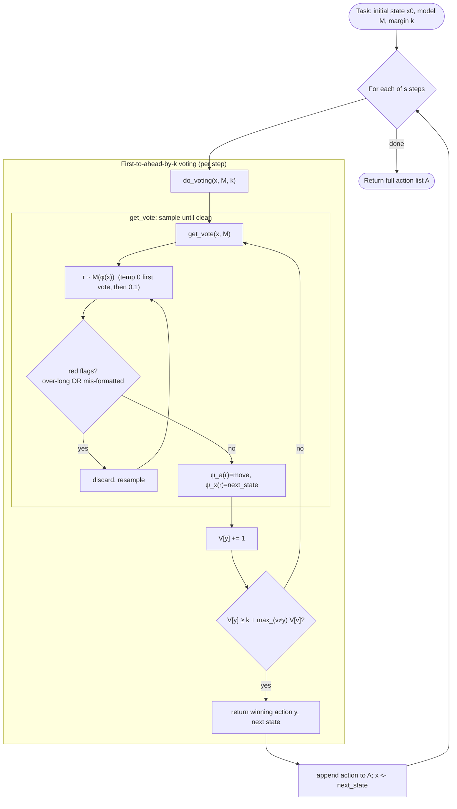
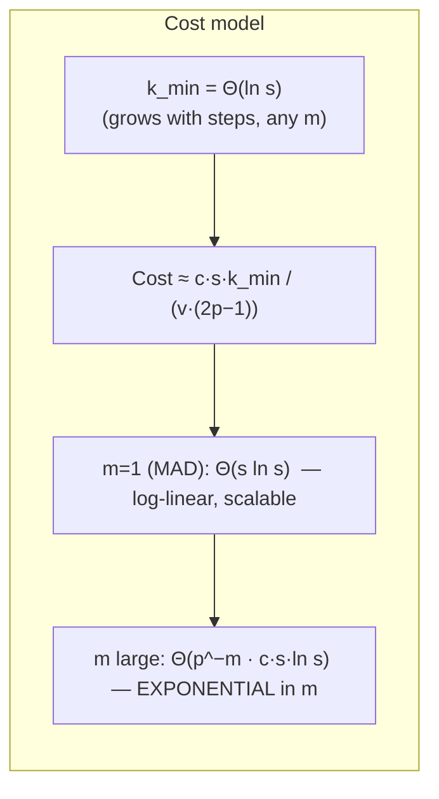

# arXiv 2511.09030 — "Solving a Million-Step LLM Task with Zero Errors" (MAKER / MDAP)

> Per-source research findings. Reporter, not architect. Primary evidence (paper + official
> code) preferred over secondary. Honest about signal and what could not be verified.

---

## 1. Identity

- **Name:** *Solving a Million-Step LLM Task with Zero Errors.* Introduces the **MDAP**
  framework (Massively Decomposed Agentic Processes) and its first implementation **MAKER**
  (**M**aximal **A**gentic decomposition, first-to-ahead-by-**K** **E**rror correction,
  **R**ed-flagging).
- **What it is:** A research paper + a small reference codebase. The thesis: an LLM's
  persistent per-step error rate makes monolithic long-horizon tasks fail after a few
  hundred steps; if you decompose a task into the *smallest possible* subtasks (one
  decision per agent call) and apply per-subtask **voting-based error correction**, you can
  drive the whole-task success probability arbitrarily high. They demonstrate it by solving
  **20-disk Towers of Hanoi = 2²⁰−1 = 1,048,575 sequential moves with zero errors**, using
  a small non-reasoning model (`gpt-4.1-mini`).
- **Authors / org:** Elliot Meyerson, Giuseppe Paolo, Roberto Dailey, Hormoz Shahrzad,
  Olivier Francon, Conor F. Hayes, Xin Qiu, Babak Hodjat, Risto Miikkulainen — **Cognizant
  AI Lab** (several also UT Austin). Correspondence: elliot.meyerson@cognizant.com.
- **Dates:** arXiv v1 submitted Nov 2025 (id 2511.09030); HTML generated Jan 26 2026.
  Cognizant blog/publication pages accompany it.
- **Primary links:**
  - Abstract: https://arxiv.org/abs/2511.09030
  - HTML: https://arxiv.org/html/2511.09030v1 · PDF: https://arxiv.org/pdf/2511.09030
  - Cognizant blog "Shattering the Illusion": https://www.cognizant.com/us/en/ai-lab/blog/maker
  - Animation of the million-step solve: https://www.youtube.com/watch?v=gLkehsQy4H4
- **Code repo + commit SHA inspected:** The paper has **no dedicated MAKER repo**, but
  Appendix F links the official Cognizant repo for the *generalized* (multiplication)
  experiments: **`github.com/cognizant-ai-lab/neuro-san-benchmarking`** (Apache-2.0).
  - Inspected snapshot: **`cognizant-ai-lab/neuro-san-benchmarking@146a1443c98337abc57f903d28012baeacb74c10`**
    (current `main` HEAD, committed 2026-03-12; tarball downloaded via codeload).
  - The repo's README also names the exact **paper-reproduction commit `a7a22f8`**
    (dated 11/20/25) for the Appendix-F numbers, and notes a Towers-of-Hanoi demo notebook
    `maker_playground/hanoi.ipyb`.
  - Crucially, `maker_playground/{prompts.py,parsers.py,toh_simulator.py}` contain the
    **verbatim Towers-of-Hanoi prompts, parsers, and verifier from Appendix C** (the arXiv
    HTML rendered those listings as empty SVG boxes — the code is only recoverable from this
    repo or the PDF).
  - The three GitHub repos named "maker-*" (`zircote/maker-rs`, `forsonny/maker-framework`,
    `Kwame0/maker-cli`) are **third-party reimplementations** created *after* the paper
    (Nov 2025–Jan 2026, 1–7 stars), **not** by the authors. Not relied upon here.

---

## 2. TL;DR

- **One sentence:** Reliability at long horizons can be *engineered* rather than waited
  for — decompose to one decision per LLM call, then apply classic ensemble/voting error
  correction *at each step*, and whole-task error rate collapses; smaller non-reasoning
  models are not just sufficient but more cost-effective.
- **The core mechanism is three simple, composable ideas:** (1) **Maximal Agentic
  Decomposition (MAD)** — m = 1 step per agent, minimal context; (2) **first-to-ahead-by-k
  voting** — resample a step until one answer leads by k votes (SPRT-optimal); (3)
  **red-flagging** — *discard* (don't repair) any response that is over-long or
  mis-formatted, because those correlate with wrong reasoning *and* with correlated errors.
- **The result that matters:** 1,048,575 dependent steps, **zero errors**, with
  `gpt-4.1-mini` at k=3 and a 750-token cutoff. They also derive **scaling laws**: k grows
  only Θ(ln s); cost grows **log-linearly** Θ(s ln s) under MAD but **exponentially in m**
  (steps-per-agent) — a quantitative argument *for* extreme decomposition.
- **Why it matters for us (a self-improving software agent):** This is the cleanest
  existing treatment of **reliability over very long horizons** — directly relevant to
  running an autonomous build/test loop for thousands of iterations without derailment. The
  decompose→sample-N→verify/vote→keep-winner loop is structurally the same shape as
  propose→test→keep. The **red-flagging** idea (cheap structural signals of unreliability →
  discard) and the **decorrelation** discussion are reusable verification hygiene.
- **Why it might *not* matter:** Towers of Hanoi tests **execution**, not **insight**. The
  strategy is hand-given and the per-step answer is *deterministic and exactly checkable*.
  Software building is the opposite: open-ended, no known-correct next step, no exact-match
  vote, expensive-to-decompose. The authors are explicit about this gap (Appendix F is a
  *preliminary* extension). **The headline ("zero errors, a million steps") is true but
  narrow.**
- **Signal: medium.** High-quality, well-formalized treatment of a problem we genuinely
  have (long-horizon reliability), with real, readable code and verbatim prompts; but the
  demonstrated domain is far from software, and the exact-match voting that makes it "zero
  error" does not transfer to open-ended generation without substantial adaptation.

---

## 3. What it does & how it works

### 3.1 The problem framing

The task is to produce an action sequence a₁,…,a_s that transforms input x into a target
output. A monolithic ("single-agent") system samples the whole sequence in one autoregressive
generation; its probability of being fully correct decays roughly exponentially with s, and
empirically Towers-of-Hanoi single agents "derail after at most a few hundred steps." The
paper's question: **how does the *granularity* of decomposition (m = steps per subtask)
affect solvability?**

Formally, a task is decomposed into s/m subtasks; a templating function φ maps a subtask's
input to a prompt for model M; extractor ψ_a parses the action(s); extractor ψ_x parses the
state to feed the next subtask. Two extremes:
- **single-agent** (m = s): one giant call.
- **MAD** (m = 1): one agent per step, each with *minimal* context (just enough to do its
  one step). Because each call is short and focused, per-call reliability rises and small
  models with small context windows suffice.

The naive objection — "m=1 creates s points of failure instead of 1" — is answered by the
fact that modularity *enables per-step error correction* that is impossible for one big call.

### 3.2 The three ingredients (the actual algorithm)



**(1) Maximal Agentic Decomposition (MAD).** Each agent does exactly one move. Its prompt
contains only: the rules, the *strategy* (a fixed heuristic, see §4), the previous move, and
the current state. It must output **both** the next `move` and the resulting `next_state`
(the state is the message passed to the next agent — there is no shared scratchpad). This
deliberately isolates *execution* from *insight*: the strategy is given, so the only question
is whether the model can carry it out.

**(2) First-to-ahead-by-k voting (the error-correction core).** For each step, draw i.i.d.
samples and tally exact-match votes for each distinct answer; **return the first answer that
leads the runner-up by k votes** (Algorithm 2). This is motivated by the Sequential
Probability Ratio Test (SPRT) optimality and analyzed as a gambler's-ruin / "first-ahead-by-k
multinomial game." If the per-step (post-flagging) success probability p > 0.5, then for the
worst case (correct answer vs. one most-likely alternative):

  p(subtask correct) = pᵏ / (pᵏ + (1−p)ᵏ) = 1 / (1 + ((1−p)/p)ᵏ)

and for the full task: **p_full = p_sub^(s/m) = (1 + ((1−p)/p)ᵏ)^(−s/m)**. Critically, you
can hit any target whole-task probability t by raising k, and the minimal k grows only
**logarithmically**: k_min = ⌈ ln(t^(−m/s) − 1) / ln((1−p)/p) ⌉ = Θ(ln s).

**(3) Red-flagging.** Before counting a sample, *discard* it if it shows a "sign of
unreliability." Two flags used: **(a) over-long responses** (past ~700 tokens the per-step
error rate jumps from ~1-in-1000 to ~10%), and **(b) mis-formatted output** (can't be parsed
under the strict grammar). Premise: "bad behaviors are correlated in LLMs" — a response that
went off the rails structurally is also more likely wrong *and* more likely to share a
specific wrong answer with other off-the-rails samples (correlated error), which is exactly
what defeats voting. So instead of *repairing* malformed output (the usual practice), they
**throw it away and resample**. This both raises p and, more importantly, **decorrelates
errors** so the vote isn't overwhelmed.

### 3.3 Scaling laws (why extreme decomposition, quantitatively)



The cost analysis (in "LLM primitive" calls, following Meyerson & Qiu 2025) yields the key
asymmetry: **expected cost grows exponentially in m** (steps per agent) because the chance
that a *sequence* of m decisions matches exactly across samples vanishes as m grows, while
under MAD (m=1) cost is **Θ(s ln s)** — log-linear, the same regime that made classical
computing scalable. Because the Θ(ln s) votes can be issued in parallel, *wall-clock* time is
only linear in s. Two practical corollaries the paper actually uses:
- **Pick the model that minimizes c/p** (cost-per-token ÷ per-step success), not the
  "smartest." This is why `gpt-4.1-mini` beats `o3-mini` and `haiku-4.5` for this task.
- **Calibrate p, v, k on a small random sample of steps before the full run** (Towers of
  Hanoi allows this because every step's correct answer is known a priori, and steps can be
  batched asynchronously).

---

## 4. Evidence from the code

**Repo:** `cognizant-ai-lab/neuro-san-benchmarking@146a1443` (Apache-2.0). Two relevant
bodies of code:
1. **`maker_playground/`** — the *exact* Towers-of-Hanoi MAKER prompts/parsers/verifier
   (Appendix C). This is the canonical artifact for the headline result.
2. **`decomposer/` + `coded_tools/experimental/mdap_decomposer/`** — the *generalized*,
   recursive MDAP system (Appendix F multiplication/sorting), built on Cognizant's
   `neuro-san` multi-agent framework.

### 4.1 The verbatim Towers-of-Hanoi prompt (`maker_playground/prompts.py`)

This is the load-bearing prompt for the million-step run. Note the embedded **deterministic
strategy** in the user template (lines 35–38) — this is what makes the task pure *execution*,
and what makes the correct next move *knowable/checkable*:

```python
# repo@146a1443:maker_playground/prompts.py
SYSTEM_PROMPT = """
You are a helpful assistant. Solve this puzzle for me.

There are three pegs and n disks of different sizes stacked on the first peg. The disks are
numbered from 1 (smallest) to n (largest). Disk moves in this puzzle should follow:
1. Only one disk can be moved at a time.
2. Each move consists of taking the upper disk from one stack and placing it on top of
another stack.
3. A larger disk may not be placed on top of a smaller disk.
The goal is to move the entire stack to the third peg.

Example: With 3 disks numbered 1 (smallest), 2, and 3 (largest), the initial state is [[3, 2, 1], [], []], and a solution might be:
moves = [[1, 0, 2], [2, 0, 1], [1, 2, 1], [3, 0, 2], [1, 1, 0], [2, 1, 2], [1, 0, 2]]
This means: Move disk 1 from peg 0 to peg 2, then move disk 2 from peg 0 to peg 1, and so on.

Requirements:
- The positions are 0-indexed (the leftmost peg is 0).
- Ensure your answer includes a single next move in this EXACT FORMAT:
```move = [disk id, from peg, to peg]```
- Ensure your answer includes the next state resulting from applying the move to the current state in this EXACT FORMAT:
```next_state = [[...], [...], [...]]```
"""

USER_TEMPLATE = """
Rules:
- Only one disk can be moved at a time.
- Only the top disk from any stack can be moved.
- A larger disk may not be placed on top of a smaller disk.

For all moves, follow the standard Tower of Hanoi procedure:
If the previous move did not move disk 1, move disk 1 clockwise one peg (0 -> 1 -> 2 -> 0).
If the previous move did move disk 1, make the only legal move that does not involve moving disk1.
Use these clear steps to find the next move given the previous move and current state.

Previous move: {previous_move}

Current State: {current_state}

Based on the previous move and current state, find the single next move that follows the procedure and the resulting next state.
"""
```

Observations: (i) the agent is **stateless across steps** — it receives only `previous_move`
and `current_state` and must emit `move` + `next_state`; the emitted `next_state` is the
inter-agent message. (ii) The strategy is the classic "cyclic" Hanoi solution (move smallest
disk one peg each odd move), which the paper says the LLMs themselves suggest when unprompted
— so the agent only *executes*. (iii) Format is rigidly specified precisely so the
red-flagging parser can reject deviations.

### 4.2 The two parsers — "repair" vs "red-flag" (`maker_playground/parsers.py`)

This file makes the §3.3 distinction concrete and is the single most reusable verification
artifact. The **repair** parser is forgiving (balanced-bracket extraction, takes the last
match); the **flag** parser is strict and *raises* on any anomaly (which the harness treats
as a red flag → discard + resample). Verbatim:

```python
# repo@146a1443:maker_playground/parsers.py  (excerpts)

# --- REPAIR parser: tolerant, tries to salvage intended answer ---
def parse_move_state_repair(response_text):
    move_matches = re.findall(r"(?i)\bmove\b\s*=\s*(\[[^\[\]]*\])", response_text)
    if not move_matches:
        raise ValueError("No 'move' found in response.")
    move = ast.literal_eval(move_matches[-1].strip())            # take LAST move
    ...
    pattern = re.compile(r"(?i)\bnext_state\b\s*=\s*(\[\s*\[)", re.DOTALL)
    start_idx = list(pattern.finditer(response_text))[-1].start(1)
    next_state_str = extract_balanced_brackets(response_text, start_idx).strip()
    next_state = ast.literal_eval(next_state_str)
    return tuple(move), tuple(tuple(peg) for peg in next_state)

# --- RED-FLAG parser: strict; ValueError == discard the sample ---
def _validate_state(state, num_disks=20):
    if not (isinstance(state, list) and len(state) == 3 and all(isinstance(t, list) for t in state)):
        raise ValueError("'next_state' must be a list of three lists.")
    flat = [x for t in state for x in t]
    if len(flat) != num_disks or set(flat) != set(range(1, num_disks + 1)):
        ... raise ValueError(...)   # state must contain disks 1..20 exactly once
    return tuple(tuple(peg) for peg in state)

def parse_move_state_flag(response_text, num_disks=20):
    move_pat  = re.compile(r"(?is)\bmove\b\s*=\s*(\[[^\[\]]*\])")
    state_pat = re.compile(r"(?is)\bnext_state\b\s*=\s*(\[\s*\[[^\[\]]*\]\s*,\s*\[[^\[\]]*\]\s*,\s*\[[^\[\]]*\]\s*\])")
    ...  # require exactly 3 inner lists; ast.literal_eval each; validate
    return _validate_move(move), _validate_state(next_state, num_disks)
```

The strict parser does a **semantic invariant check** (the 20 disks must each appear exactly
once) — not just syntax. A hallucinated/duplicated disk is a red flag. This is a small but
important point: the "format check" doubles as a cheap **state-integrity verifier**.

### 4.3 The deterministic verifier (`maker_playground/toh_simulator.py`)

The *ground-truth* checker is **plain Python, not an LLM** — a Gym-style simulator that
enforces the three rules and tracks state. This is what lets them (a) compute per-step success
rate offline, and (b) declare the million-step run "zero errors."

```python
# repo@146a1443:maker_playground/toh_simulator.py  (excerpts)
class TowerOfHanoi:
    def act(self, action):
        disk_id, from_peg, to_peg = map(int, action)
        ...
        if disk_id != src_stack[-1]:
            return ..., 0, True, {"reason": f"disk {disk_id} is not on top of peg {from_peg} ..."}
        if dst_stack and dst_stack[-1] < disk_id:
            return ..., 0, True, {"reason": "illegal move: cannot place larger disk on smaller disk"}
        src_stack.pop(); dst_stack.append(disk_id); self._move_count += 1
        return self.get_state(), 1, False, {"reason": "ok"}

    def apply_moves(self, moves):                # atomic: stops at first invalid move
        for idx, mv in enumerate(moves):
            state, ok, done, msg = self.act(mv)
            if not ok:
                return state, moves_executed, done, {"reason": f"move {idx}: {msg['reason']}"}
        return self.get_state(), len(moves), done, {"reason": "all moves valid"}

    def is_solved(self):
        return self._state['2'] == list(range(self._num_disks, 0, -1))

    def minimal_solution_length(self):
        return (1 << self._num_disks) - 1        # 2^n - 1
```

### 4.4 The generalized recursive MDAP (`coded_tools/.../neuro_san_solver.py`)

The Appendix-F system (Algorithm 4) extends MAKER to tasks with **unknown decomposition** by
adding agent *types* and applying voting at *every* stage. Core recursion (verbatim shape):

```python
# repo@146a1443:coded_tools/experimental/mdap_decomposer/neuro_san_solver.py  (excerpts)
async def solve(self, problem, depth, max_depth, path="0"):
    if depth >= max_depth:
        # sample N atomic solutions, vote, return winner
        return await self._solve_atomic_with_voting(problem) ...
    p1, p2, c, decomp_meta = await self.decompose(problem)     # sample N decompositions, vote
    if not p1 or not p2 or not c:                              # "no decomposition" is a valid vote
        return await self._solve_atomic_with_voting(problem) ...
    # solve P1 and P2 in PARALLEL (asyncio.gather), recursively
    nodes = await gather(self.solve(p1, depth+1, ...), self.solve(p2, depth+1, ...))
    comp_prompt = self._compose_prompt(c, s1, s2)              # "Solve F(P1,P2) such that F=c, P1=s1, P2=s2"
    return await self._solve_generic(comp_prompt, ...)         # sample N compositions, vote

async def decompose(self, problem):
    # CANDIDATE_COUNT parallel calls to 'decomposer' agent
    results = await gather(*[self.decomposer_caller.call_agent({"problem": problem}) for _ in range(self.candidate_count)])
    candidates = [self.parsing.extract_decomposition_text(r) for r in results if ...]
    voter = FirstToKVoter("[decompose]", "solution", "decompositions", self.solution_discriminator_caller, ...)
    votes, winner_idx = await voter.vote(problem, candidates)
    p1, p2, c = self.parsing.parse_decomposition(candidates[winner_idx])
    return p1, p2, c, metadata
```

Four agent **micro-roles** (defined in `registries/experimental/mdap_decomposer.hocon`):
**decomposer** (split P → P1, P2, F), **solution_discriminator** (vote on decompositions),
**problem_solver** (solve an atomic problem), **composition_discriminator** (vote on
solutions). All four run on `gpt-4.1-mini`. Tuning knobs (`multiagent_reasoner.py`):
`MAX_DEPTH=5`, `WINNING_VOTE_COUNT=2` (k), `CANDIDATE_COUNT = NUMBER_OF_VOTES = 2k−1 = 3`.

Key difference from the Hanoi version: voting here is **LLM-discriminator-based**, not
exact-match. `FirstToKVoter.vote()` issues N parallel discriminator calls, each returning a
preferred candidate index, tallies until one hits `winning_vote_count`, else falls back to
argmax:

```python
# repo@146a1443:coded_tools/experimental/mdap_decomposer/first_to_k_voter.py (excerpt)
results = await gather(*[self.discriminator_caller.call_agent(tool_args) for _ in range(self.number_of_votes)])
votes = [0]*len(candidates)
for vote_txt in results:
    idx = int(vote_txt) - 1
    if 0 <= idx < len(candidates):
        votes[idx] += 1
        if votes[idx] >= self.winning_vote_count:
            winner_idx = idx; break
if winner_idx is None:
    winner_idx = max(range(len(votes)), key=lambda v: votes[v])   # argmax fallback
```

### 4.5 The verbatim decomposer prompt (generalized system)

From the HOCON registry — this is what "automating the decomposition" looks like in practice.
Note the heavy emphasis on **independence** of subproblems (decorrelation by construction) and
the `'vote:' P1=[...], P2=[...], F=[...]` output contract:

```
# repo@146a1443:registries/experimental/mdap_decomposer.hocon  (decomposer instructions)
You receive a problem, 'P', and break it into two sub-problems, 'P1' and 'P2', that, if solved can be easily used to solve 'P'.
Here is how we can formalize this:
'P' = F('P1', 'P2') where F() is how we should combine the solutions to 'P1' and 'P2'.
As long as the complexity of 'P1' and 'P2' are less than 'P', we are fine.

If 'P' is obvious and simple to solve, or cannot be broken into two independent sub-problems,
return the original 'P', like this: 'vote:' P1=[P], P2=[None], F=[None]
...
Note that 'p1', and 'p2' will be passed on to another agent to solve them with no other context, and so they need to be clearly defined and self contained.
...
Remember, there should NOT be any reference to 'p1' in the definition of 'p2'.
'F' should be simple and trivial and should not need much explanation.
Note that the sub-problems are meant to be solved in parallel so they should be self-contained and independent from each other,
and the solution to one cannot depend on the solution of the other.
```

The **problem_solver** and discriminators all end with the same contract: *"Return the
solution on the last line after 'vote:' with no extra explanation or formatting."* The parser
(`solver_parsing.py`) keys on a configurable `FINAL_TOKEN` (default `"vote:"`; benchmarks
override to `>>>>` / `####`) and `P1=[...], P2=[...], F=[...]` regexes.

### 4.6 Failure instrumentation (`decomposer/multiagent_reasoner.py`)

Notable for *our* purposes: the generalized runner ships a **failure taxonomy** and logs a
full decomposition **trace tree** per problem. `_annotate_failure` walks the tree post-order
and tags nodes with error codes — `atomic_miscalc`, `non_independent_subproblems`,
`ambiguous_composition_op`, `composed_miscalc`, `malformed_final` — by *re-deriving* the
expected value (it actually recomputes `s1 op s2` for the chosen composition operator and
compares). `_find_failure_node` returns the **deepest** errored node (root-causing). This is a
concrete, simple pattern for "explain why the long process failed."

---

## 5. What's genuinely smart

These are the load-bearing ideas, in order of how much they could matter to a long-horizon
autonomous agent.

1. **Reliability is an error-correction problem, not (only) a capability problem.** The
   paper's central reframe: stop waiting for a "smart enough" model and instead *engineer*
   whole-task reliability the way classical computing, communication, storage, and quantum
   computing all did — with explicit error correction over an unreliable substrate. The
   analogy to ECC / SPRT / surface codes is not decorative; it drives the actual design
   (independent samples + a sequential decision rule). For a system meant to run thousands of
   propose→test cycles, this is the right mental model.

2. **Granularity is the control variable, and it's quantified.** The scaling-law result that
   **cost is exponential in steps-per-agent m but only Θ(s ln s) under maximal decomposition**
   is the paper's strongest intellectual contribution. It converts the vague intuition
   "smaller subtasks are better" into a sharp, derived statement, and it explains *why*: the
   probability that a *sequence* of m decisions matches exactly across independent samples
   decays geometrically in m, so voting only stays cheap when each vote is over a single
   decision. This is a genuinely useful design law.

3. **First-to-ahead-by-k voting (SPRT) instead of fixed-N majority.** Rather than always
   drawing a fixed budget and majority-voting, they draw *adaptively* until one answer leads
   by k, which is the SPRT-optimal stopping rule. Empirically this means the cost is
   dominated by the first k samples and "the rest is a rounding error" once p is high — you
   pay for hard steps and breeze through easy ones. k_min = Θ(ln s) is a clean, parallelizable
   knob for "how reliable do I need the whole run to be."

4. **Red-flagging: discard, don't repair — and discard to *decorrelate*.** This is the most
   counter-intuitive and, I think, the most transferable idea. The field's instinct is to
   *salvage* malformed LLM output (json-repair, guardrails, constrained decoding). MAKER does
   the opposite: a malformed or rambling response is *evidence the whole reasoning trajectory
   is compromised*, so it's thrown away. The subtle payoff (Fig 9b) is not the small bump in
   p — it's that **over-long/garbled samples are where correlated errors live**, and
   correlated errors are precisely what defeat voting (two independent samples agreeing on the
   *same wrong answer*). Cheap structural signals → discard → restore the i.i.d. assumption
   the whole error-correction scheme relies on. The strict parser also folds in a **semantic
   invariant check** (disks 1..20 each appear once) so "format validation" doubles as
   state-integrity verification.

5. **Choose the model by c/p, calibrated cheaply up front.** The practice of estimating
   per-step success on a small random sample, then picking the model minimizing
   cost-per-token ÷ success (not the smartest model), and only *then* launching the expensive
   run, is a disciplined, money-aware methodology. For an "unlimited tokens" project this is
   less about dollars and more about the general principle: *measure per-step reliability,
   then size your redundancy budget from a derived formula.*

6. **State-as-message, stateless agents.** Each Hanoi agent is stateless and receives only
   the minimal state it needs; it emits the next state, which becomes the next agent's input.
   This is a clean way to get long-horizon behavior without long context — context confusion
   ("lost in the middle," context-length degradation, which they cite) is sidestepped by
   construction. The microservices analogy (§5 of the paper) is apt: independent, individually
   testable, independently scalable units communicating via a typed message (here, the state).

---

## 6. Claims vs. reality / limitations / critiques

**(A) What the authors actually claim.** A *framework* (MDAP) + *one implementation* (MAKER)
+ *one demonstration* (20-disk Hanoi, zero errors) + *scaling laws*. They are careful and
repeatedly hedge: it's a "first" implementation, the formalization makes worst-case
assumptions, and Appendix F is "preliminary." They explicitly state the work is about
**execution, not insight**, and that automatic discovery of good decompositions is an
"orthogonal open question" they do not solve.

**(B) What the code/experiments actually demonstrate.**
- The million-step zero-error run is real and checkable (deterministic verifier; animation).
- But it rests on properties of Hanoi that **do not generalize**: (i) the strategy is given,
  so each step has a **unique known-correct answer**; (ii) that answer is an **exact string**,
  enabling exact-match voting and offline p-estimation; (iii) steps are **near-i.i.d. and
  uniform**, so a single p and a single k suffice; (iv) the state is tiny and verifiable.
- The generalization (Appendix F / `decomposer/`) is honest but **modest**: 5×5 multiplication
  reaches perfect solve and 6×6 reaches only the t=0.95 target — and it needs an **LLM
  discriminator** to vote (no exact match), which reintroduces exactly the unreliability the
  Hanoi setup engineered away. The README's reproduction config uses `WINNING_VOTE_COUNT=10`
  (k=10 → up to 19 candidates per step) for 5×5 multiplication — i.e., the generalized voting
  is far more expensive per step than the k=3 Hanoi run.

**(C) Independent critiques & failure modes.**
- **"It's execution, not reasoning."** The most common external take (e.g., grounded summary
  via Exa citing multiple analyses; ArXivIQ; zeroshot.it.com). Because Hanoi's optimal play is
  a known recursive algorithm and the strategy is handed to the model, MAKER shows LLMs can
  *reliably execute* a given procedure a million times — it does **not** show they can plan,
  have insight, or generalize symbolically. This is a direct response to Shojaee et al.'s
  "Illusion of Thinking" (the paper MAKER is rebutting): MAKER arguably wins on the narrow
  question "can the *process* be scaled?" while conceding the broader "can the *model* reason?"
- **Correlated errors are the Achilles' heel** (well captured by Dr. Jerry Smith's Medium
  piece "When All Your AI Agents Are Wrong Together," 2025-11-24, and acknowledged by the
  authors in §5 and Appendix D). Voting's entire power assumes errors are independent. The
  paper *found* this empirically — one pathological step (step 10241) needed **18 votes**, and
  collision counts (both first votes wrong) far exceeded the i.i.d. expectation at high token
  cutoffs. Red-flagging + low temperature mitigated it *here*, but the authors concede
  "dealing with correlated errors is an open foundational problem in ML." In an open-ended
  domain (no red-flag proxy as clean as Hanoi's), this is the failure mode most likely to bite.
- **Reward-/test-gaming:** not applicable in the usual sense — there's no learned reward and
  the verifier is a deterministic simulator, so there's nothing to hack. But the *flip side*
  is that the "zero error" guarantee is **only as good as the verifier**, which exists only
  because Hanoi is exactly specifiable. For software, the analogous verifier (tests) is itself
  fallible and gameable, so the clean guarantee does not carry over.
- **Cost realism:** the Hanoi run is cheap *because* p is high and steps are easy; the cost
  table (Fig 6b) projects ~$3.5K–$5K for the full 20-disk run with `gpt-4.1-mini`. The Θ(s)
  factor means cost still scales with the number of steps — fine at 10⁶ easy steps, but a hard
  domain with low p and m>1 sits in the exponential-in-m regime and becomes infeasible (their
  own Fig 5).

**(D) Reproducibility.** Good, with caveats. The official repo (Apache-2.0) contains the
**verbatim Hanoi prompts, parsers, and verifier**, a demo notebook (`maker_playground/hanoi.ipyb`),
the generalized recursive solver, benchmark data (5×5/10×10 multiplication, sorting), a
benchmark runner, and a named **paper-repro commit `a7a22f8`**. I could **not** find a single
script that re-runs the full million-step Hanoi experiment end-to-end (the playground is a
notebook + library, and the heavy run depended on OpenAI's async batch API and ~$5K of calls).
The `decomposer/` results depend on a live OpenAI key and the `neuro-san` framework. I did not
execute any code (no API key, and not in scope), so I verified mechanisms by **reading** the
source, not by reproducing numbers.

---

## 7. Relevance to a self-improving, evolutionary, software-building agent

Judged by the one test — *would this help build a self-improving, evolutionary,
software-building agent?* Honest verdict: **partial, on the reliability/orchestration axis,
not the open-ended-search axis.** Specifics:

- **Long-horizon reliability (HIGH relevance).** Our loop must run for thousands of
  propose→test→keep iterations without "derailing." MAKER is essentially a theory + recipe for
  *not derailing*: keep each unit of work small and context-isolated, and apply per-unit
  verification before committing. The qualitative lesson — **don't let one monolithic agent
  carry an ever-growing context across a long task; checkpoint state into messages and reset**
  — is directly applicable to keeping a build agent stable over a long campaign.

- **The propose→verify→keep loop is structurally identical (MEDIUM-HIGH).** MAKER's
  per-step loop is *sample N candidates → check/vote → keep the winner → advance state*. That
  is the same control shape as an evolutionary build loop *(propose patch → run tests → keep
  if verifiably better)*. The reusable insight is the **adaptive stopping rule**: don't sample
  a fixed budget; sample until a winner is sufficiently ahead (here exact-match leads by k; for
  us, "until a candidate passes the verifier and dominates rivals"). And size that budget from
  a measured per-attempt success rate.

- **Verification hygiene / red-flagging (MEDIUM-HIGH).** The "**discard, don't repair**"
  principle and "**cheap structural signal ⇒ likely-bad trajectory ⇒ throw away & resample**"
  map cleanly onto an agent that gets a malformed tool call, a patch that doesn't apply, a diff
  that doesn't compile, or a rambling over-long plan: treat these as *red flags that the whole
  attempt is compromised* and resample rather than nursing it. The bonus — folding a **semantic
  invariant check** into the parser (state must be valid) — is a pattern for cheap correctness
  gates between expensive steps.

- **Decorrelation as a first-class concern (MEDIUM).** If we ever ensemble/vote candidate
  patches or plans, MAKER warns that **the binding constraint is error *correlation*, not error
  *rate*** — independent agents that fail the *same way* give false confidence. Their
  mitigations (temperature, prompt paraphrase/noise, model diversity, discarding off-rails
  samples) are a concrete checklist. Directly relevant if we do best-of-N patch generation or
  multi-agent review.

- **Decomposition + recursion with typed micro-roles (MEDIUM).** The generalized system's
  four roles (decomposer / solver / two discriminators) and its recursive
  decompose→solve→compose tree, with a **trace tree + failure taxonomy + deepest-failure
  root-causing**, is a usable orchestration template for breaking a build goal into
  independently verifiable sub-goals and *localizing* where a long run went wrong.

- **What does NOT transfer (be explicit).** (i) The "zero error" guarantee depends on an
  **exact-match vote** and a **deterministic oracle** — neither exists for open-ended code
  generation, where "correct next step" is undefined and tests are partial/fallible. (ii)
  There is **no self-improvement / no learning** here — MAKER is a *fixed* inference-time
  scaffold; nothing in the system edits its own prompts, code, or policy. It is orthogonal to
  the "seed AI / self-improving" axis. (iii) The decomposition is **given** (Hanoi) or done by
  an LLM at modest depth (multiplication); MAKER does *not* solve the hard problem of
  discovering good decompositions for messy real tasks — which is most of the difficulty in
  software. Treat MAKER as a **reliability/orchestration substrate**, not as an engine of
  open-ended capability.

---

## 8. Reusable assets

Concrete, precisely-cited things we *could* borrow (collected as evidence; not assembled into
a design).

- **A1 — Hanoi prompt pair (verbatim).** `repo@146a1443:maker_playground/prompts.py`
  (`SYSTEM_PROMPT`, `USER_TEMPLATE`, `create_prompts`). Pattern worth lifting: stateless
  single-step agent that takes `(previous_action, current_state)` and must emit *both*
  `next_action` and `next_state` in a rigid format, with the strategy inlined. (Quoted in §4.1.)

- **A2 — "Repair vs. red-flag" parser pair (verbatim).**
  `repo@146a1443:maker_playground/parsers.py` (`parse_move_state_repair` vs
  `parse_move_state_flag` + `_validate_move` / `_validate_state`). The strict parser that
  **raises on any anomaly = a discard signal**, including a **semantic invariant check**.
  Directly adaptable as a "is this tool output trustworthy enough to act on?" gate. (Quoted §4.2.)

- **A3 — Deterministic state verifier.** `repo@146a1443:maker_playground/toh_simulator.py`
  (Gym-style `reset/act/apply_moves/is_solved/minimal_solution_length`). The pattern: a
  **non-LLM, rule-enforcing simulator** that gives ground truth and an atomic
  "stops-at-first-invalid-move" checker. Analogue for us: a deterministic harness that runs
  tests and reports the first failing step. (Quoted §4.3.)

- **A4 — First-to-ahead-by-k / SPRT voting algorithm.** Paper Algorithms 1–3 (`generate_solution`,
  `do_voting`, `get_vote`) and `repo@146a1443:.../first_to_k_voter.py`. Adaptive stop-when-ahead-by-k
  with argmax fallback and parallel sampling. Plus the formula **k_min = ⌈ln(t^(−m/s)−1) /
  ln((1−p)/p)⌉** for sizing redundancy from a target whole-run success probability t. (Quoted §3.2, §4.4.)

- **A5 — Recursive decompose→solve→compose loop with typed micro-roles.**
  `repo@146a1443:coded_tools/experimental/mdap_decomposer/neuro_san_solver.py` (the `solve` /
  `decompose` / `_solve_generic` recursion) and the four-agent registry
  `repo@146a1443:registries/experimental/mdap_decomposer.hocon` (decomposer,
  solution_discriminator, problem_solver, composition_discriminator — **verbatim prompts**).
  The decomposer's hard insistence on **independent, self-contained P1/P2** is a reusable
  decorrelation-by-construction prompt. (Quoted §4.4–4.5.)

- **A6 — Failure taxonomy + trace tree + deepest-failure root-cause.**
  `repo@146a1443:decomposer/multiagent_reasoner.py` (`_annotate_failure`, `_flatten_tree`,
  `_find_failure_node`, `_classify_failure`; error codes `atomic_miscalc`,
  `non_independent_subproblems`, `ambiguous_composition_op`, `composed_miscalc`,
  `malformed_final`) and `INSTRUMENTATION_GUIDE.md`. A simple, copyable pattern for explaining
  *why* a long multi-step run failed and *where*. (Described §4.6.)

- **A7 — Calibrate-then-run methodology + model selection by c/p.** Paper §4.2–4.3 and Fig 6b.
  Estimate per-step success on a small random sample, compute expected cost per model, pick
  argmin(c/p), then launch. Reusable as "measure per-attempt reliability before committing a
  long, expensive campaign; size redundancy from the measurement."

- **A8 — Benchmark harness + datasets.** `repo@146a1443:decomposer/agent_benchmark_runner.py`
  (parallel workers, per-item timeout, `--final-token`, retries, CSV/JSONL + progress output)
  and `data/` (5×5 / 10×10 multiplication, length-500 sorting). A ready-made parallel eval
  runner pattern.

---

## 9. Signal assessment

- **Overall value: MEDIUM.** High craft and a genuinely useful *reliability* lens, with real,
  readable, Apache-2.0 code containing verbatim prompts/parsers/verifier and a clean scaling
  theory. But the demonstrated domain (Towers of Hanoi) is far from software building, and the
  "zero error" guarantee is a property of an **exactly-specifiable, deterministically-verifiable,
  i.i.d.** task — exactly the conditions open-ended coding lacks. It contributes to the
  *long-horizon reliability / orchestration* part of our problem and **nothing** to the
  *self-improvement / open-ended search* part. Strong as a substrate idea; not a blueprint.
- **Confidence: HIGH on mechanism, MEDIUM on transferability.** I read the full paper and the
  load-bearing source (prompts, both parsers, the verifier, the voter, the recursive solver,
  the registry prompts, the failure instrumentation). The mechanism is unambiguous. Whether the
  reliability gains transfer to non-exact-match, non-i.i.d., expensive-to-verify software tasks
  is genuinely uncertain and the paper's own Appendix-F evidence is thin.
- **What I could NOT verify:**
  - I did **not execute** any code (no API key; out of scope) — numbers verified by reading,
    not reproduction.
  - The arXiv HTML rendered Appendix C's listings as **empty SVG boxes**; I recovered the
    "verbatim" prompts/parsers from the repo's `maker_playground/` (which the file headers
    state are "the prompts/parsers used in the paper"). I treated repo == paper for those, but
    did not diff them against the PDF figure pixels.
  - I inspected `main` HEAD `146a1443` (2026-03-12), **not** the exact paper-repro commit
    `a7a22f8` (11/20/25); minor drift between them is possible (the README explicitly
    distinguishes "current" vs "original" code, and a merge note mentions a "F= vs C= notation"
    bug fix).
  - I did not independently audit the scaling-law derivations (Appendix B) for algebraic
    correctness; I report them as stated.
  - The full million-step run's raw logs are not in the repo; I relied on the paper's figures
    (e.g., the 18-vote step, collision counts) for the empirical claims.

---

## 10. References

**Primary**
- [P1] Meyerson, Paolo, Dailey, Shahrzad, Francon, Hayes, Qiu, Hodjat, Miikkulainen (Cognizant
  AI Lab / UT Austin), *Solving a Million-Step LLM Task with Zero Errors*, arXiv:2511.09030 —
  abstract https://arxiv.org/abs/2511.09030 · HTML https://arxiv.org/html/2511.09030v1 ·
  PDF https://arxiv.org/pdf/2511.09030
- [P2] Official code (generalized experiments, Appendix F): `cognizant-ai-lab/neuro-san-benchmarking`,
  Apache-2.0 — https://github.com/cognizant-ai-lab/neuro-san-benchmarking
  - Inspected snapshot **@146a1443c98337abc57f903d28012baeacb74c10** (`main`, 2026-03-12).
  - Verbatim Hanoi assets: `repo@146a1443:maker_playground/prompts.py`,
    `repo@146a1443:maker_playground/parsers.py`, `repo@146a1443:maker_playground/toh_simulator.py`,
    notebook `repo@146a1443:maker_playground/hanoi.ipyb` (not opened).
  - Generalized MDAP: `repo@146a1443:coded_tools/experimental/mdap_decomposer/neuro_san_solver.py`,
    `.../first_to_k_voter.py`, `.../voter.py`, `.../decomposition_solver.py`,
    `.../solver_parsing.py`; `repo@146a1443:decomposer/multiagent_reasoner.py`;
    `repo@146a1443:registries/experimental/mdap_decomposer.hocon`;
    `repo@146a1443:INSTRUMENTATION_GUIDE.md`; `repo@146a1443:README.md`.
  - Paper-repro commit named in README: `a7a22f8` (11/20/25) — not inspected.
- [P3] Cognizant AI Lab blog, *Shattering the Illusion: MAKER Achieves Million-Step, Zero-Error
  LLM Reasoning* — https://www.cognizant.com/us/en/ai-lab/blog/maker
- [P4] Cognizant AI Lab publication page —
  https://www.cognizant.com/us/en/ai-lab/publications/maker-million-step-llm-task-zero-errors
- [P5] Million-step solve animation — https://www.youtube.com/watch?v=gLkehsQy4H4

**Closely related primary (cited by / rebutted by the paper)**
- [R1] Shojaee et al., *The Illusion of Thinking* (the Hanoi benchmark MAKER rebuts),
  arXiv:2506.06941.
- [R2] Sinha et al., *The Illusion of Diminishing Returns: Measuring Long Horizon Execution in
  LLMs*, arXiv (cited as [57]) — execution-vs-insight framing.
- [R3] Meyerson & Qiu, *Position: Scaling LLM Agents Requires Asymptotic Analysis with LLM
  Primitives*, ICML 2025 Position track — the AALP cost-analysis basis (cited as [37]).
- [R4] Opus & Lawsen, *The Illusion of the Illusion of Thinking*, arXiv:2506.09250 — rebuttal
  in the same debate. https://arxiv.org/html/2506.09250v1

**Secondary (independent analysis / commentary)**
- [S1] Grounded multi-source critique (via Exa Answer): the "execution, not reasoning" reading,
  citing the arXiv HTML, Cognizant pages, zeroshot.it.com, and "Illusion of Thinking" follow-ups.
- [S2] Dr. Jerry A. Smith, *When All Your AI Agents Are Wrong Together*, Medium, 2025-11-24 —
  on correlated errors as voting's failure mode.
  https://medium.com/@jsmith0475/when-all-your-ai-agents-are-wrong-together-c719ca9a7f74
- [S3] *Smashing Intelligence into a Million Pieces: MAKER and Million-Step LLM Reliability*,
  zeroshot.it.com, 2025-11-15 — explainer.
  https://zeroshot.it.com/smashing-intelligence-into-a-million-pieces-maker-and-million-step-llm-reliability/
- [S4] *Solving a Million-Step LLM Task with Zero Errors*, ArXivIQ (Substack), 2025-12-18 —
  summary/analysis. https://arxiviq.substack.com/p/solving-a-million-step-llm-task-with
- [S5] DecisionAI (Substack), *Shattering the Illusion: MAKER…*, 2025-11-13 — summary.
  https://decisionai.substack.com/p/shattering-the-illusion-maker-achieves
- [S6] LEAD: *Breaking the No-Recovery Bottleneck in Long-Horizon Reasoning*, arXiv:2603.06870 —
  a later paper engaging the same long-horizon-reliability problem (forward reference).
  https://arxiv.org/html/2603.06870v1

**Third-party reimplementations (NOT authoritative; noted for completeness)**
- `zircote/maker-rs` (Rust + MCP, 2026-01), `forsonny/maker-framework` (Claude Code plugin,
  2025-12), `Kwame0/maker-cli` (JS, 2025-11). All created after the paper; not used as evidence.
