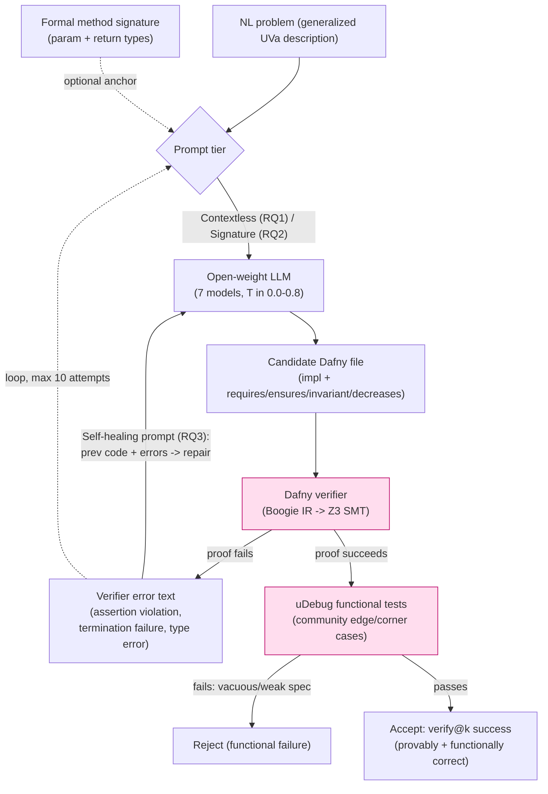

# arXiv 2604.22601 — From Natural Language to Verified Code (Dafny / NL2VC-60)

> Per-source research findings. Reporter, not architect. One source only.
> Relevance test applied throughout: *would this help build a self-improving,
> evolutionary, software-building agent?*

---

## 1. Identity

- **Name:** "From Natural Language to Verified Code: Toward AI Assisted
  Problem-to-Code Generation with Dafny-Based Formal Verification."
- **What it is:** An **empirical benchmark study + dataset paper** (NOT an agent
  system, NOT a self-improving loop). It introduces the **NL2VC-60** dataset (60
  hand-authored, formally verified Dafny programs derived from UVa Online Judge
  competitive-programming problems) and measures how well **seven open-weight
  LLMs** can synthesize *formally verified* Dafny code from natural-language (NL)
  problem descriptions, under a **tiered prompting strategy** (contextless →
  method-signature → self-healing). It is a measurement/methodology paper about
  using a formal verifier (Dafny + Z3) plus a functional oracle (uDebug) as a
  ground-truth correctness signal for LLM code generation.
- **Authors / org:** Md Erfan, Md Kamal Hossain Chowdhury, Ahmed Ryan, Md
  Rayhanur Rahman (corresponding). Department of Computer Science (and Alabama
  Water Institute), **The University of Alabama, Tuscaloosa, USA**.
- **Dates:** arXiv v1 submitted **24 Apr 2026** (`arXiv:2604.22601v1 [cs.SE]`),
  announced 27 Apr 2026. Also posted on Preprints.org (24 Apr 2026,
  doi:10.20944/preprints202604.1772.v1). 16 pages.
- **Primary links:**
  - Abstract: https://arxiv.org/abs/2604.22601
  - PDF: https://arxiv.org/pdf/2604.22601
  - Preprints.org mirror: https://www.preprints.org (doi:10.20944/preprints202604.1772.v1)
- **Code repo + commit SHA inspected:** **NO CODE.** The paper states (§VIII)
  that "research artifacts, including the NL2VC-60 dataset and our synthesis
  pipeline, are provided," but **no URL appears anywhere** in the text,
  references, or preprint mirrors. Verified by (a) grepping the full PDF text for
  github/gitlab/zenodo/huggingface/figshare/osf/anonymous.4open/"replication" —
  none found; (b) an Exa grounded-answer search which confirmed no public repo
  exists and surfaced two independent reviews (Pith, PREreview) flagging the
  missing artifact link as a reproducibility gap. **All evidence below is from
  the paper's described method, not inspected code.**

---

## 2. TL;DR

- **It's a benchmark/measurement paper, not a buildable system.** Its core
  artifact is a 60-problem Dafny dataset and a results table; there is no
  released harness, no agent, no self-improvement loop. Treat it as *evidence
  about a pattern*, not as reusable code.
- **The one load-bearing idea relevant to us: "verification-in-the-loop" as a
  ground-truth reward signal.** A formal verifier (Dafny → Boogie → Z3 SMT)
  gives a binary, deterministic, non-gameable-by-fluency oracle: the program
  either provably satisfies its spec or it doesn't. This is exactly the kind of
  *verifiable* keep/reject signal an evolutionary code agent needs.
- **The second load-bearing idea: dual-layer validation to kill reward hacking.**
  LLMs "win" the verifier by writing *trivial/vacuous specs* (`ensures true`,
  return a constant). The authors add a **functional oracle (uDebug community
  test suites)** as a second gate so a candidate must pass *both* the proof
  *and* real edge-case tests. This is a concrete, transferable anti-test-gaming
  mechanism.
- **The third idea: self-healing = feed the verifier's error text back into the
  LLM and iterate (max 10 rounds).** Plain NL prompting near-universally fails
  (5 of 7 models at 0%); a fixed method **signature** + **iterative repair from
  compiler errors** flips this to 80–91% verify@5. Structure + tool feedback,
  not model size, drives success.
- **Caveats that cap the signal:** tiny eval (11 randomly-chosen problems ×
  verify@5), no released code/test-suites, no confidence intervals, single
  algorithm-per-file scope, and a one-shot human-in-the-loop pipeline (not
  autonomous). Domain is *formal verification of small algorithmic functions*,
  far from "build arbitrary software."

---

## 3. What it does & how it works

### 3.1 Goal and framing

The paper's thesis: LLM-generated code is "syntactically plausible but
semantically incorrect" (hallucination), so instead of testing-after-the-fact,
**make the LLM synthesize the implementation *and* a formal specification, then
let a mathematical verifier prove the two agree.** They pick **Dafny** (a
verification-aware imperative language; Boogie IR + Z3 SMT solver under the
hood) because it natively supports Design-by-Contract: `requires`
(preconditions), `ensures` (postconditions), loop `invariant`s, and `decreases`
(termination/ranking) clauses.

The hard part they target is the **specification burden** / **annotation
bottleneck**: writing the `ensures`/`invariant`/`decreases` annotations is often
*more code and more cognitive load than the implementation itself* (they cite
seL4 = 11 person-years; their own NL2VC-60 took ~300 person-hours + 50 hours of
author conflict resolution). The empirical question: can open-weight LLMs
synthesize those annotations?

### 3.2 The dataset (NL2VC-60)

- 60 problems curated from **UVa Online Judge**, chosen by acceptance rate /
  submission counts (~27k–370k submissions each) as a relevance proxy.
- Each UVa problem is run through a manual **"Generalization Process"**: strip
  "presentation flavor" (input formatting, `t < 15` test-case loops, arbitrary
  contest bounds) to leave the *core computational requirement*. Avg NL length
  > 179 words (vs. < 50 for prior Dafny benchmarks like Clover/MBPP-Dafny).
- For each, the authors **hand-author a fully verified Dafny ground-truth**
  (impl + specs + invariants until Z3 proves it), plus a **formal method
  signature** and a **uDebug test suite**. They note these are the first public
  verified-Dafny implementations of these UVa problems, reducing training-data
  leakage.

### 3.3 The tiered prompting strategy (the core "method")

Three escalating tiers, mapped to research questions RQ1–RQ3:

1. **Contextless (RQ1):** give only the NL description. Baseline.
2. **Method-Signature (RQ2):** also give the formal Dafny method signature
   (param types, return types) as a structural anchor.
3. **Self-Healing (RQ3):** iterative repair — when Dafny fails, feed the
   verifier's *error messages* + the previous code back to the LLM and ask it to
   fix. Applied on top of both contextless (RQ3a) and signature (RQ3b) baselines.
   Orchestration script caps repair at **10 attempts**; failure if unverified
   after 10.

### 3.4 The dual-layer validation (the anti-reward-hacking part)

Because models can satisfy the verifier with **vacuous specs**, every candidate
must clear two independent gates:

- **Formal layer:** Dafny verifier proves impl ⟺ its formal spec.
- **Functional layer:** **uDebug** community test suites (extreme/edge inputs)
  confirm the code is *actually correct*, not just self-consistent with a weak
  spec.

This breaks the circularity of "LLM tests its own code" and is what lets them
claim the verified solutions are genuinely correct rather than solver-gaming.

### 3.5 Evaluation

- **Metric:** `verify@k` (adapted from `pass@k`) — fraction of problems with ≥1
  formally verified solution within k attempts; k ∈ {1,3,5}. A problem counts
  only if the Dafny verifier accepts it (and, qualitatively, only "strong" specs
  count — postconditions that capture the real requirement, manually reviewed).
- **Models (7, 9B–120B), all open-weight:** GPT-OSS-120B, Qwen3.6-35B-A3B (MoE),
  Gemma 4-31B, Qwen3-Coder-30B, Codestral-22B-v0.1, GPT-OSS-20B, Qwen3.5-9B.
- **Temperatures:** T ∈ {0.0, 0.2, 0.4, 0.6, 0.8}; best per (model, tier)
  reported.
- **Infra:** LM Studio 0.4.8 on 4× NVIDIA RTX 6000 Ada (192 GB VRAM total);
  Dafny 4.11.0; Python 3.14.4; 180 s response wait per call.
- **Headline results:** contextless near-universal failure (5/7 at 0%; Gemma
  4-31B 54.55%, Codestral 27.27%). Signature prompting revives all models
  (>30% peak each; Qwen3.5-9B top at 72.73%, GPT-OSS-120B 0→63.64%). Self-healing
  is strongest: **Gemma 4-31B 90.91% (contextless healing), GPT-OSS-120B 81.82%
  (signature-guided healing).**

### 3.6 Architecture / control-loop diagram (the self-healing pipeline)



The two pink nodes are the **two ground-truth oracles**. The repair edge
(verifier error → LLM) is the "verification-in-the-loop" mechanism; the uDebug
gate after a successful proof is the anti-vacuity mechanism.

---

## 4. Evidence from the code

**There is no released code or harness to inspect.** The paper claims artifacts
"are provided" (§VIII Threats to Validity) but ships no link; independent
reviewers explicitly flag this (see §6). What we *can* quote verbatim are the
three prompts, the ground-truth Dafny exemplar, and the orchestration
parameters, all printed in the paper itself (PDF text at
`arxiv.org/pdf/2604.22601`).

### 4.1 The three prompts (verbatim, §V.F)

**Contextless prompt (RQ1):**
```
You are an expert in Dafny. Output ONLY raw Dafny code.
Generate one Dafny source file for the following task.
Problem ID: <Problem_ID>
Task Description: <Generalized_Description>
```

**Method-signature prompt (RQ2):**
```
You are an expert in Dafny. Output ONLY raw Dafny code.
Generate one Dafny source file for the following task.
Problem ID: <Problem_ID>
Task Description: <Generalized_Description>
Method Signature Prompt: <Method_Signature_Prompt>
```

**Self-healing prompt (RQ3) — the key repair loop instruction:**
```
The previous Dafny code failed verification with the following errors:
<Dafny_Verifier_Output>
Please repair the code to satisfy all specifications. Output ONLY the raw fixed Dafny code.
```

The entire "verification-in-the-loop" mechanism is that last prompt:
`<Dafny_Verifier_Output>` (the SMT/Boogie error text) is spliced back in with the
prior candidate. That is the whole repair signal.

### 4.2 Ground-truth data structure: a verified Dafny "candidate" (verbatim, Listing 1, Magic Formula / UVa 11934)

This is the shape of one dataset item — note the impl is dwarfed by the formal
contract (the `ensures` clauses + `invariant` + `decreases`), which is the
annotation bottleneck the paper is about:

```dafny
function Power(x:int, n:int): int
  requires n >= 0
  decreases n
{
  if n == 0 then 1 else x * Power(x, n-1)
}

method MagicFormula(a:int, b:int, c:int, d:int, l:int) returns (result:int)
  requires d > 0 && l >= 0
  // Formal Specification: The result must match the cardinality of the set
  ensures result == |set x:int | 0 <= x <= l && (a*Power(x,2) + b*x + c) % d == 0|
  // Boundary Case: Constant functions
  ensures (a == 0 && b == 0 && c % d == 0) ==> result == l + 1
{
  var x, count := 0, 0;
  while x <= l
    invariant 0 <= x <= l + 1
    decreases l - x
  {
    var value := (a*Power(x,2) + (b * x) + c);
    if value % d == 0 { count := count + 1; }
    x := x + 1;
  }
  result := count;
}
```

The `ensures result == |set x:int | ...|` clause is the "ground truth as
mathematical set cardinality" — the spec *is* the requirement, expressed
declaratively, and Z3 must prove the imperative loop computes exactly it.

### 4.3 The verifier / evaluator (described, not code)

- **Verifier:** Dafny 4.11.0 → transpiles to **Boogie** intermediate
  verification language → encodes verification conditions in predicate calculus
  → discharges them with the **Z3 SMT solver**. Output is binary (verified / not)
  plus structured error messages (assertion violation, termination failure,
  index-out-of-bounds, type error).
- **Functional oracle:** **uDebug** community test suites run against the
  (compiled) Dafny program; pass/fail on edge cases. Used specifically to detect
  *vacuous verification* (spec satisfied but wrong behavior).
- **Orchestration:** a Python "self-healing orchestration script" caps repair at
  **10 iterations** per problem; 180 s API timeout per LM Studio call; best
  temperature per (model, tier) is reported. (These are stated in §V.J; the
  script is not released.)

### 4.4 Error taxonomy (their diagnostic data structure, §V.I / RQ4)

Failures are bucketed into three tiers — useful as a *classifier of why a
candidate was rejected*, which an evolutionary loop could log per attempt:

1. **Syntax errors** — malformed Dafny (missing semicolons, Pythonic
   indentation). Dominant in contextless settings (>80% of failures for GPT-OSS).
2. **Semantic / type errors** — compiles structurally but violates Dafny's type
   system or hallucinates non-existent predicates / unavailable modules (e.g.
   `System`). Rises sharply once syntax is fixed by signature prompting.
3. **Verification errors** — syntactically/type-correct code the SMT solver
   *cannot prove* (e.g. missing inductive loop invariant). Rises in self-healing
   rounds; the "Invariant Gap." Some models (Qwen3-Coder-30B) get stuck
   repeating the same insufficient invariant across repair iterations — a
   **repair plateau / no-progress failure mode**.

---

## 5. What's genuinely smart

The genuinely transferable ideas are *not* the dataset; they are three
mechanisms, all of which are about **getting a trustworthy keep/reject signal**
— the central problem for any "propose → test → keep only if verifiably better"
agent.

1. **A formal verifier as a non-fooled correctness oracle.** Most LLM-coding
   eval relies on unit tests, which an LLM can overfit/game. Dafny+Z3 gives a
   *deterministic mathematical proof* that the implementation matches a declared
   spec. For an evolutionary agent, this is a much stronger "is this candidate
   actually better/correct" signal than test pass-rate alone, *when a spec
   exists*. The paper frames this well: "By utilizing the Dafny verifier and the
   Z3 SMT solver as a ground-truth reward signal, we effectively mitigate the
   common LLM issue of logical hallucinations" (§VII.B).

2. **Dual-layer validation to defeat spec/reward hacking.** This is the most
   directly useful insight. The authors *observed* the failure directly: "a
   model might satisfy a postcondition by returning a trivial constant that
   happens to meet a weak mathematical constraint" (§VI.D). Their fix —
   require passing *both* an independent functional oracle (uDebug edge cases)
   *and* the proof — is a clean, generalizable pattern: **never trust a single
   self-referential success signal; gate promotion on at least one independent
   oracle the generator did not author.** This is exactly the test-gaming /
   reward-hacking risk a self-improving software agent faces.

3. **Tool-feedback-driven self-repair, and the finding that *structure beats
   scale*.** The empirical punchline is striking: identical models go from 0% →
   ~80–91% purely by (a) fixing the interface (method signature) and (b) looping
   the verifier's error text back in. "The significant success of Gemma 4-31B …
   suggests that specific pretraining data density … is more critical than raw
   model size" (§VII.B), and "LLMs should be viewed not as autonomous agents,
   but as sophisticated co-processors that thrive when provided with high-level
   formal constraints" (§VII.B). For us: a well-structured scaffold + a tight
   tool-feedback loop can extract far more than a bigger model — and a fixed
   *interface/signature* dramatically stabilizes iterative repair.

4. **`verify@k` as an honest promotion metric.** Counting a candidate as solved
   only if a *formal* check passes (and, qualitatively, only if the spec is
   "strong") is a stricter, more honest bar than `pass@k` on tests. The
   distinction between "solver-satisfying" and "genuinely correct" is one this
   paper takes seriously.

---

## 6. Claims vs. reality / limitations / critiques

### 6.1 What the authors *claim*
- Open-weight LLMs are "effective apprentices" able to synthesize formally
  verified Dafny; peak verify@5 of **90.91% (Gemma 4-31B)** and **81.82%
  (GPT-OSS-120B)**.
- A "several-thousand-fold cost reduction compared to human expert synthesis,"
  making high-assurance software "economically viable for general engineering."
- uDebug integration ensures results are "genuine functional correctness rather
  than mere logical consistency with a weak or empty specification."

### 6.2 What the evidence actually supports (B)
- The *direction* is well-supported and unsurprising: structure (signatures) +
  tool-feedback (compiler errors) >> raw NL prompting. The 0% → 80%+ swing is
  large and consistent across models.
- But the headline percentages rest on a **very small, possibly non-representative
  sample**: only **11 randomly selected problems** out of 60, scored at
  **verify@5** (5 sampling attempts). With n=11, each problem is ~9 percentage
  points, so "90.91%" = 10/11 and "81.82%" = 9/11 — single-digit differences in
  problem counts. **No confidence intervals or significance tests** are reported.
- "Several-thousand-fold cost reduction" is an **unquantified rhetorical claim**;
  no cost model, token accounting, or human-baseline timing study backs it.
- The functional-correctness claim depends entirely on uDebug suites whose
  construction/coverage is **not disclosed** (see below).

### 6.3 Independent critiques (C)
- **Pith (grok-4.3 automated review, 2026-05-08, https://pith.science/paper/2604.22601)**
  raises two "major" issues: (1) the central claim "rests on success rates from
  only 11 randomly selected problems … with no disclosed list of the problems,
  selection criteria, complexity classification, or argument that the random draw
  avoids bias toward easier cases"; (2) "the paper invokes uDebug to rule out
  vacuous specifications but provides no details on the test suites used, how they
  were constructed, or statistical significance … leaving the 'dramatic
  performance turnaround' claim only partially supported and vulnerable to
  selection bias." It also flags (minor) the **missing repository/artifact link**.
- **PREreview** page exists (https://prereview.org/preprints/doi-10.20944-preprints202604.1772.v1)
  but currently has **0 posted reviews** (no substantive external critique there
  yet, as of capture).
- The paper's own **§VIII Threats to Validity** is candid about: external validity
  (results tied to specific 2026 models + Dafny 4.11.0); **cross-lingual leakage**
  risk (models may know the underlying algorithm from C++/Python even if no Dafny
  exists); and vacuous verification (their stated mitigation = uDebug).

### 6.4 Failure modes / reward-hacking observations (directly relevant to us)
- **Vacuous verification (spec/reward hacking):** explicitly observed — models
  return a trivial constant satisfying a weak postcondition (§VI.D). This is the
  formal-methods analogue of an LLM gaming its own unit tests. Their only defense
  is the independent uDebug oracle.
- **Repair plateau / no-progress loops:** some models (Qwen3-Coder-30B) "repeat
  the same insufficient invariant across multiple self-healing iterations,
  indicating a logical plateau" (§VI.D / RQ4). I.e. naïve "resend the error"
  repair can stall without diversification.
- **Regression under repair:** Codestral-22B and Qwen3-Coder-30B sometimes
  *regress into more syntax errors* during iterative healing (§VII.A RQ4) — the
  repair loop is not monotonic; a candidate can get worse.
- **Reproducibility:** no released code, prompts-as-run, problem list, or test
  suites; only the three prompt templates + hardware/version specs. I could
  **not verify** any quantitative result or run the pipeline.

### 6.5 What I could NOT verify
- Any number in the results tables (no code/data to rerun).
- The contents, size, or edge-case coverage of the uDebug test suites used.
- Which 11 problems were sampled, or their difficulty distribution.
- The "self-healing orchestration script" behavior beyond the stated 10-attempt
  cap and 180 s timeout.
- Whether "strong specification" manual review was applied consistently.

---

## 7. Relevance to a self-improving, evolutionary software-building agent

Relevance is **medium-low and narrow**: this is a measurement paper in a niche
(formal verification of small algorithmic functions), with no agent and no
released code. But two of its mechanisms map *cleanly and importantly* onto the
core of an evolutionary "propose → test → keep only if verifiably better" loop —
specifically the **verification / promotion gate**, which is the part of our
problem most vulnerable to being gamed.

What could plausibly help, each tied to the capability it serves:

1. **Verification-in-the-loop → the keep/reject signal (verification).** Where a
   target sub-problem *can* carry a formal spec (data-structure invariants,
   parsers, numeric/algorithmic kernels, security-sensitive checks), a Dafny/Z3
   (or Lean/F*) gate gives a *proof-grade* "is this candidate correct" signal far
   stronger than test pass-rate. An evolutionary agent could keep a candidate
   only if it both compiles *and* discharges its proof obligations. (Scope
   caveat: most software has no spec; this is a high-assurance *complement*, not
   a universal oracle.)

2. **Independent dual-oracle promotion → anti-reward-hacking (verification +
   control).** The single most portable lesson: **gate promotion on at least one
   oracle the generator did not author.** The paper *empirically* shows a
   self-referential signal (the spec the model itself wrote) gets gamed via
   vacuous specs, and an *external* oracle (uDebug edge cases) catches it. For a
   self-improving agent that writes its own tests, this is the warning and the
   fix: require passing held-out / externally-sourced checks before a variant is
   kept, or a candidate will learn to satisfy its own weak success criterion.

3. **Tool-feedback self-repair loop → long-horizon iterative improvement
   (long-horizon running / decision-making).** The pattern "run the checker →
   splice its structured error text + prior artifact back into the model →
   bounded retries (cap=10)" is a minimal, concrete repair loop. Directly
   reusable as a per-candidate refinement sub-loop. The paper also surfaces *what
   goes wrong* with it (plateaus, regressions) — i.e. naïve resend-the-error
   needs (a) a step counter / budget, (b) progress detection to break repeat
   loops, and (c) diversification when stuck. These are useful design constraints
   for our repair/edit loop.

4. **Structure/interface anchoring → orchestration & decision quality.** The
   finding that a *fixed signature/interface* turns 0% into 60–90% suggests an
   evolutionary agent should **fix interfaces/contracts first and let variation
   happen inside them** — stabilizing the search space and making tool feedback
   actionable. (Echoes "freeze the API, evolve the body.")

5. **Rejection-reason taxonomy → memory / telemetry (memory, decisions).** Their
   3-tier error classification (syntax / semantic-type / verification) is a
   lightweight schema for *logging why each candidate failed*, which an
   evolutionary loop could accumulate to bias future proposals (e.g. "this branch
   keeps failing on invariants → try a different strategy").

6. **`verify@k` honest scoring → fitness definition (verification).** Counting a
   variant as "better" only under a strict, non-self-authored check (not just
   "tests pass") is the right shape for an evolutionary *fitness function* that
   resists gaming.

**What clearly does NOT apply:** the dataset itself (NL2VC-60 / UVa problems);
the specific claim that Dafny is the right vehicle; the model leaderboard;
anything about "open-weight vs proprietary." There is no agent architecture,
memory system, multi-agent topology, or self-modification logic to borrow — this
paper has none of those.

---

## 8. Reusable assets

Concrete, quotable things we *could* borrow (collected as evidence; not assembled
into a design). Note: only the prompts + the loop *parameters* + the Dafny
exemplar are available verbatim; there is no harness code to lift.

### 8.1 Prompts (verbatim — see §4.1 for full text)
- **Contextless / Signature / Self-Healing** prompt templates (§V.F). The
  self-healing one is the load-bearing artifact:
  > "The previous Dafny code failed verification with the following errors:
  > `<Dafny_Verifier_Output>` Please repair the code to satisfy all
  > specifications. Output ONLY the raw fixed Dafny code."
  Generic form for our use: `<prev_artifact> + <checker_structured_errors> →
  "repair to satisfy all checks; output only the fixed artifact."`

### 8.2 Control-loop pattern (described, §V.J)
- **Bounded tool-feedback repair loop:** generate → verify → on failure, resend
  `(prev code + verifier errors)` → **cap at 10 attempts** → record failure if
  still unverified. Per-call timeout 180 s. (Add, per §6.4: progress detection to
  avoid invariant-repeat plateaus and syntax regressions.)

### 8.3 Promotion / fitness pattern (the key one)
- **Two-gate promotion:** a candidate is "kept" only if it passes **(1)** a
  formal/structural check it must satisfy *and* **(2)** an **independent
  functional oracle the generator did not write** (their uDebug edge-case suite).
  Schema sketch:
  ```
  candidate.accepted := verifier.proves(candidate.impl, candidate.spec)
                        AND external_oracle.passes(candidate.impl)  // held-out tests
  ```
  This is the anti-vacuity / anti-reward-hacking gate.

### 8.4 Evaluation method
- **`verify@k`** (adapted from `pass@k`): "solved" = ≥1 of k sampled attempts
  passes the *formal* verifier (k ∈ {1,3,5}); plus a manual "strong
  specification" qualitative pass to exclude trivially-satisfied specs.

### 8.5 Rejection-reason schema (data structure, §V.I / Table VII)
- Per-attempt failure label ∈ {`syntax`, `semantic/type`, `verification`} with
  counts over total runs per (model, prompt-tier). Usable as a candidate-failure
  log/telemetry record.

### 8.6 Candidate representation (verbatim Dafny exemplar)
- See §4.2: a "candidate" = one source file bundling **implementation + formal
  contract** (`requires`/`ensures`/`invariant`/`decreases`). The spec travels
  with the code and *is* the fitness criterion (modulo the external oracle).

---

## 9. Signal assessment

- **Overall value: LOW–MEDIUM (lean LOW for *direct* use, MEDIUM for *one
  conceptual lesson*).**
  - As a *system to borrow from*: **LOW.** No code, no agent, no
    self-improvement loop, tiny eval, niche domain (small algorithmic Dafny
    functions). Nothing here is a scaffold we can run.
  - As *evidence for one design principle*: **MEDIUM.** It is a clean, concrete
    demonstration of (a) using a formal verifier as a non-fooled correctness
    oracle and (b) the necessity of an *independent* second oracle to defeat
    spec/reward-hacking — both squarely on the critical path of a verifiable
    evolutionary loop.
- **Confidence:** **High** in my characterization of *what the paper is and
  claims* (read the full 16-page PDF text end-to-end + abstract + 3 independent
  secondary summaries that agree). **High** that no code repo exists (grep +
  grounded search + reviewer confirmation).
- **What I could NOT verify:** any quantitative result (no artifacts to rerun),
  the uDebug suite contents/coverage, the identity/difficulty of the 11 sampled
  problems, and the orchestration script's actual behavior. See §6.5.
- **Bottom line for the project:** Do not mine this for components. Do extract
  the *principle*: **a self-improving software agent's promotion gate must lean
  on verifiable, generator-independent oracles (proofs and/or held-out tests),
  because a self-authored success signal will be gamed (vacuous specs were
  observed here directly).** Secondary takeaways: fix interfaces before evolving
  bodies; bound and progress-monitor repair loops.

---

## 10. References

**Primary**
- [P1] Md Erfan, Md Kamal Hossain Chowdhury, Ahmed Ryan, Md Rayhanur Rahman.
  "From Natural Language to Verified Code: Toward AI Assisted Problem-to-Code
  Generation with Dafny-Based Formal Verification." arXiv:2604.22601v1 [cs.SE],
  24 Apr 2026. Abstract: https://arxiv.org/abs/2604.22601 · PDF:
  https://arxiv.org/pdf/2604.22601 (full text read; all §/Listing/Table cites
  above are to this PDF text, local copy: `/agent/workspace/scratch/arxiv-2604-22601/paper.txt`).
- [P2] Preprints.org mirror of the same paper, doi:10.20944/preprints202604.1772.v1,
  posted 24 Apr 2026 (CC BY 4.0).
- [P3] ADS record: https://ui.adsabs.harvard.edu/abs/2026arXiv260422601E/abstract
- **Code repository: NONE found** (no `repo@SHA` to cite). Paper claims artifacts
  "are provided" (§VIII) but supplies no link.

**Secondary**
- [S1] Pith automated review (model grok-4.3), 2026-05-08:
  https://pith.science/paper/2604.22601 — flags small-sample selection bias,
  undisclosed uDebug suites, and missing artifact link.
- [S2] PREreview page (0 reviews as of capture):
  https://prereview.org/preprints/doi-10.20944-preprints202604.1772.v1
- [S3] Moonlight literature review (summary):
  https://www.themoonlight.io/en/review/from-natural-language-to-verified-code-toward-ai-assisted-problem-to-code-generation-with-dafny-based-formal-verification
- [S4] SciRate listing: https://scirate.com/arxiv/2604.22601

**Context (cited *by* the paper; relevant prior art, not this source)**
- [C1] DafnyBench (Loughridge et al., arXiv:2406.08467) — prior Dafny benchmark;
  has public code: https://github.com/sun-wendy/DafnyBench (the closest released
  comparator to NL2VC-60).
- [C2] Misu et al., "Towards AI-Assisted Synthesis of Verified Dafny Methods,"
  Proc. ACM SE 1(FSE), 2024 — the verify@k / verified-Dafny-synthesis lineage.
- [C3] Sun et al., "Clover: Closed-loop Verifiable Code Generation," 2024 — the
  "closed-loop verification" idea this paper operationalizes for NL→Dafny.
- [C4] Tihanyi et al., "A new era in software security: self-healing software via
  LLMs and formal verification," IEEE/ACM AST 2025 — origin of the "self-healing"
  framing.
- [C5] Dafny (Leino 2010); Boogie (Le Goues et al. 2011); Z3 (de Moura & Bjørner
  2008) — the verifier toolchain. uDebug: https://www.udebug.com/ (functional
  oracle). UVa Online Judge: https://onlinejudge.org/ (problem source).
