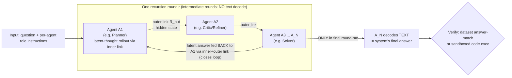
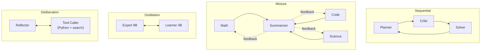
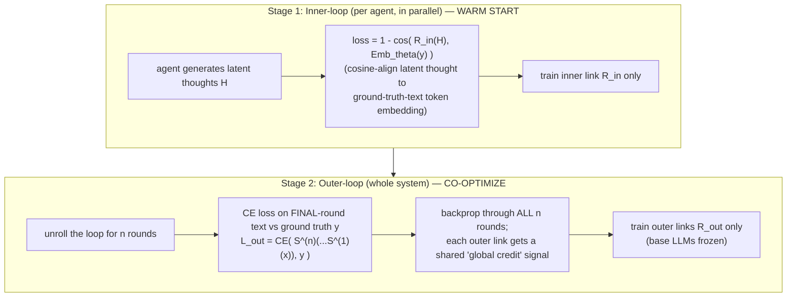

# Finding: arXiv 2604.25917 — *Recursive Multi-Agent Systems* (RecursiveMAS)

> Per-source research dossier for the KB Seed AI project. Reporter, not architect.
> Relevance test applied throughout: *would this help build a self-improving,
> evolutionary, software-building agent (memory, long-horizon running, decisions,
> orchestration, verification, control)?*

---

## 1. Identity

- **Name:** RecursiveMAS — "Recursive Multi-Agent Systems."
- **What it is:** A research paper + partial code release proposing an
  *architecture-level* method to scale LLM multi-agent collaboration by treating the
  whole system as a single **recursive latent-space computation**. Heterogeneous,
  frozen LLM agents are chained into a loop and connected by tiny trainable
  **RecursiveLink** adapter modules that pass *hidden states* (not text) between and
  within agents. Only the links (~13M params, ~0.31% of the system) are trained.
- **Authors/org:** Xiyuan Yang¹*, Jiaru Zou¹²*† , Rui Pan¹, Ruizhong Qiu¹, Pan Lu²,
  Shizhe Diao³, Jindong Jiang³, Hanghang Tong¹, Tong Zhang¹, Markus J. Buehler⁴,
  Jingrui He¹✉, James Zou²✉. (¹UIUC ²Stanford ³NVIDIA ⁴MIT). *Equal contribution,
  alphabetical; †project lead; ✉corresponding.* James Zou's group (Stanford) is also
  behind TextGrad, which the repo acknowledges.
- **Dates:** arXiv v1 submitted **28 Apr 2026** (`arXiv:2604.25917v1 [cs.AI]`). Repo
  created 2026-04-27, last push 2026-05-25. HF "Paper of the Day/Week" 2026-05-01;
  VentureBeat coverage 2026-05-24.
- **Primary links:**
  - Abstract: https://arxiv.org/abs/2604.25917
  - PDF: https://arxiv.org/pdf/2604.25917 (36 pp.)
  - HTML/ar5iv: https://arxiv.org/html/2604.25917v1
  - Project page: https://recursivemas.github.io
  - HF paper: https://huggingface.co/papers/2604.25917
- **Code repo + commit inspected:** `github.com/RecursiveMAS/RecursiveMAS`
  **@ `f95d512017fb713e9ac519248fbfd3d270dafd68`** (default branch `main`, pushed
  2026-05-25, 535 stars at inspection). Cloned via codeload tarball (git proxy blocked
  direct clone); SHA confirmed via GitHub commits API. **The release is INFERENCE-ONLY**
  — model checkpoints + RecursiveLink weights on HuggingFace, demo inference pipeline in
  the repo. The **training code, training data, and full inference pipeline are NOT
  released** (explicitly marked as unchecked TODOs in the README "Supported Features").

---

## 2. TL;DR

- **Essence:** Borrow the "recursive / looped language model" idea (apply the same
  weights repeatedly over latent states to deepen reasoning) and lift it from *one
  model* to *a multi-agent system*: each agent is treated like one "layer" of a giant
  recursive network; agents hand each other **last-layer hidden states** (latent
  thoughts) through a small residual adapter (RecursiveLink); the whole loop is unrolled
  for `n` rounds and only the **final** round decodes text.
- **The one trainable piece:** RecursiveLink — a 2-layer LayerNorm+GELU residual MLP.
  *Inner* link folds an agent's last hidden state back into its own input embedding
  space (latent autoregression); *outer* link projects one agent's hidden state into
  another agent's (possibly different-dimension) embedding space. Trained in an
  **inner-outer loop**: inner warm-start per agent (cosine-align latent thought to
  ground-truth token embedding), then system-level outer training (one cross-entropy on
  the final answer, gradients back-propagated through all `n` unrolled rounds).
- **Claimed payoff:** vs. text-mediated multi-agent baselines under matched structure:
  **+8.3% avg accuracy**, **1.2×–2.4× faster** end-to-end, **34.6%–75.6% fewer tokens**
  across 9 benchmarks (math/science/medicine/search/code), 4 collaboration patterns
  (sequential, mixture, distillation, deliberation), small (sub-1.5B) to ~9B agents.
  The speed/token wins come from skipping text decode in intermediate rounds.
- **Why it (mostly) does NOT matter for us — HARNESS vs WEIGHTS:** This is fundamentally
  a **weights-level / training** method. Its whole contribution is *trained adapters*
  passing *opaque hidden states*. Our project is **HARNESS-ONLY self-improvement, never
  weights**, and demands **verifiable** improvement. Latent state transfer is the
  opposite of verifiable (you cannot read, test, diff, or roll back a hidden vector).
  So the core mechanism is off-limits and anti-aligned with our verification mandate.
- **Why it is still worth a careful read — the orchestration scaffold is reusable:**
  Stripped of the latent trick, the released code is a clean, text-level **multi-agent
  orchestration harness** with four well-specified collaboration topologies (chain,
  mixture-of-experts→summarizer, expert→learner distillation, reflector↔tool-caller
  deliberation), explicit role prompts, a "feedback slot" recursion pattern (later
  rounds get the previous round's output as a *soft correction signal*), and a
  tool-integrated deliberation loop. Those prompts and topologies are concrete,
  borrowable assets at the harness level.
- **Signal: LOW-to-MEDIUM.** The headline mechanism is irrelevant/anti-aligned to a
  harness-only, verifiable, software-building agent. The residual value is the
  text-level orchestration patterns and prompts, which overlap heavily with what we
  already have from other multi-agent sources. Nothing here is self-improving in our
  sense; "evolution" here means latent refinement across `n` *fixed* rounds, not
  open-ended program search with a verifier.

---

## 3. What it does & how it works

### 3.1 The premise (and the analogy that makes it click)

Standard LLM multi-agent systems (MAS) pass **text** between agents: agent A decodes
its hidden state to tokens (a softmax over a ~100K-token vocabulary `|V|`), ships the
tokens, agent B re-embeds them. The paper (and independent commentary) frames the
problems with this:

1. **Information bottleneck:** decoding a rich `d_h`-dim hidden state into discrete
   tokens is lossy compression.
2. **Latency / token tax:** every hand-off pays a full vocab projection and the next
   agent must wait for text to finish.
3. **Non-differentiable boundary:** you cannot backprop gradients through the `argmax`
   that picks tokens, so you cannot co-optimize the agents end-to-end — each is trained
   in isolation and the system relies on prompt engineering "and hope" (MLLog.dev).

A widely-quoted analogy (MLLog.dev): a software team where everyone communicates only
via "lengthy written emails" vs. a shared whiteboard where everyone sketches abstract
diagrams directly — the latter is RecursiveMAS's pitch.

RecursiveMAS borrows the **Recursive / Looped Language Model (RLM)** idea — apply the
same Transformer stack repeatedly over latent states to deepen reasoning without adding
parameters (cited: LoopLM; Jolicoeur-Martineau 2025; Zhu et al. 2025; Zhang et al.
2025a) — and lifts it to the *system* level: each agent is "a layer," and the whole MAS
is one looped recursive computation.

### 3.2 The RecursiveLink module (the only trainable piece)

A 2-layer residual adapter that moves a last-layer hidden state from one embedding space
to another. Two variants (paper Eqs. 3–4; code `modeling.py`):

- **Inner link** `R_in(h) = h + W2·σ(W1·h)` (σ = GELU). Maps an agent's last-layer
  hidden state **back into its own input-embedding space**, so the agent keeps generating
  in continuous latent space without ever decoding to tokens ("latent thoughts").
- **Outer link** `R_out(h) = W3·h + W2·σ(W1·h)`. Adds a linear residual projection `W3`
  to bridge **different hidden dimensions** across heterogeneous agents (e.g.,
  Qwen→Llama). NOTE: the *released code* adds LayerNorms (`pre_ln`/`post_ln` for inner;
  `ln_source`/`ln_target`/`residual_proj` for outer) — slightly richer than the paper's
  bare equations (see §4).

Residual rationale: the skip branch preserves the source semantics, so the link only has
to learn the **distributional shift**, not the whole projection → more stable training.

### 3.3 The recursive loop (architecture)



Mechanics (paper §3.2; code `inference_mas.py::main` `ours_recursive` branch):

- **Latent thought generation inside an agent:** given input-context embeddings, the
  agent does a forward pass, takes last-layer hidden `h_t`, runs it through the inner
  link to get the next input embedding `e_{t+1}=R_in(h_t)`, and repeats for `m`
  ("latent_steps") steps → a sequence of latent thoughts `H = [h_t,...,h_{t+m}]`. (Code:
  `autoregressive_latent_rollout`, `latent_steps` default 32, sweeps {16,32,48}.)
- **Cross-agent transfer:** `H` is passed through the outer link and **spliced as
  embeddings** into the next agent's prompt at a designated slot (`<<...SLOT>>`); the
  next agent conditions on its own context PLUS the transferred latent. (Code:
  `split_prompt_ids_by_slots` finds the slot in the rendered chat text, then
  `token_ids_to_embeds(prefix) ⊕ latent_tensor ⊕ token_ids_to_embeds(suffix)`.)
- **Closing the loop:** after the last agent, its latent output is routed **back to the
  first agent** through the link as a "feedback" latent, starting round `r+1`. (Code:
  `run_solver_feedback_latent_stage` → `run_planner_feedback_latent_stage`.)
- **Only the final round decodes text:** the last agent (`A_N`) is the only one that ever
  calls `model.generate(inputs_embeds=...)` to emit tokens (Code:
  `run_solver_latent_stage`). All intermediate rounds are pure latent.

### 3.4 The four collaboration patterns (topologies)

The framework is "structure-agnostic." Four instantiations (paper §2; code
`load_from_repo.py::STYLE_SPECS`, `system_loader.py::_OUTER_LAYOUTS`):

| Pattern | Roles & models (released) | Loop edges (outer links) |
|---|---|---|
| **Sequential** (chain-of-agents) | Planner (Qwen3-1.7B), Critic (Llama3.2-1B), Solver (Qwen2.5-Math-1.5B) [light]; 4B versions [scaled] | 1→2, 2→3, 3→1 |
| **Mixture** (MoE→summarizer) | Math (DeepSeek-R1-Distill-Qwen-1.5B), Code (Qwen2.5-Coder-3B), Science (BioMistral-7B), Summarizer (Qwen3.5-2B) | each expert→summarizer (1s,2s,3s) and summarizer→each expert (s1,s2,s3) |
| **Distillation** (expert→learner) | Expert (Qwen3.5-9B), Learner (Qwen3.5-4B) | expert→learner, learner→expert |
| **Deliberation** (reflector↔tool-caller) | Reflector (Qwen3.5-4B), Tool-Caller (Qwen3.5-4B + Python/Tavily-search tools) | reflector→toolcaller, toolcaller→reflector |



### 3.5 Training: the inner-outer loop (NOT in the released code — paper-only)



- **Inner loop** (paper Eq. 5): for each agent, push the ground-truth text `y` through
  the input embedding layer to form a *target* latent distribution, then train `R_in`
  so the agent's generated latent thoughts cosine-match it. This is a per-agent,
  parallelizable warm-start.
- **Outer loop** (paper Eq. 6): unroll the whole loop `n` rounds; after the final
  round's text prediction, apply a single cross-entropy vs. `y`; backprop through the
  full recursive computation graph; each outer link gets a "shared credit signal" by its
  global contribution.
- **Only ~13.12M params (~0.31%)** trained; all base LLMs frozen. The paper likens this
  to LoRA-style cheap adaptation. **VentureBeat: released under Apache 2.0.**

### 3.6 Theory (two propositions)

- **Runtime (Prop 3.1):** text-recursive MAS costs `Θ(N(m|V|d_h + (t+m)d_h² + (t+m)²d_h))`;
  RecursiveMAS replaces the `m|V|d_h` term (per-step vocab projection) with `m·d_h²`.
  Since `d_h ≪ |V|`, this removes the decode bottleneck. (Source of the speed/token wins.)
- **Gradient stability (Thm 4.1):** under "confident token" assumptions (entropy ≤ ε),
  text-based recursive SFT suffers vanishing gradients (norm `≤ O(ε) ≪ 1`), while
  RecursiveLink keeps gradient norm near 1 across looped backprop. Motivates latent over
  text mediation for *training*.

---

## 4. Evidence from the code

**Repo:** `RecursiveMAS/RecursiveMAS@f95d512017fb713e9ac519248fbfd3d270dafd68`
(inference-only release; Apache 2.0). Scope marked in README: ✅ four patterns + demo
inference; ☑️ (NOT done) full inference pipeline, training data & implementation,
additional model families. **So all training claims rest on the paper, not the release.**

### 4.1 Files inspected (paths)

- `modeling.py` — RecursiveLink modules (`Adapter`, `CrossModelAdapter`).
- `inference_utils/inference_mas.py` (3203 lines) — the sequential/chain pipeline; the
  load-bearing control loop (`main`), latent rollout, the 4 methods, answer-retry.
- `inference_utils/inference_mas_{mixture,distill,deliberation}.py` — the other 3 patterns.
- `inference_utils/lcb_utils.py` — code-eval (LiveCodeBench/MBPP+) sandbox + extraction.
- `inference_utils/answer_utils.py` — answer extraction/comparison; `format_latent_info`.
- `inference_utils/reflector_tool_notes.py` — the deliberation tool system prompt.
- `prompts.py` — all role prompts (verbatim below).
- `system_loader.py`, `load_from_repo.py`, `hf_resolver.py`, `run.py` — loading/CLI.

### 4.2 RecursiveLink — verbatim (`modeling.py`)

The released module is richer than the paper's Eq. 3–4 (adds LayerNorms):

```python
class Adapter(nn.Module):                 # INNER link  (ln_res_adapter)
    def __init__(self, hidden_size, adapter_type):
        self.proj1 = nn.Linear(hidden_size, hidden_size)
        self.act   = nn.GELU()
        self.proj2 = nn.Linear(hidden_size, hidden_size)
        self.pre_ln  = nn.LayerNorm(hidden_size)
        self.post_ln = nn.LayerNorm(hidden_size)
    def forward(self, x):
        h = self.pre_ln(x)
        out = self.proj2(self.act(self.proj1(h)))
        out = x + out                     # residual
        return self.post_ln(out)

class CrossModelAdapter(nn.Module):       # OUTER link (outer_ln_res_adapter)
    def __init__(self, in_dim, out_dim, adapter_type):
        hidden_dim = out_dim * 2
        self.proj1 = nn.Linear(in_dim, hidden_dim)
        self.act   = nn.GELU()
        self.proj2 = nn.Linear(hidden_dim, out_dim)
        self.ln_source    = nn.LayerNorm(in_dim)
        self.ln_target    = nn.LayerNorm(out_dim)
        self.residual_proj = nn.Linear(in_dim, out_dim)
    def forward(self, x):
        h = self.ln_source(x)
        out = self.proj2(self.act(self.proj1(h)))
        out = out + self.residual_proj(x)  # linear residual handles dim change
        return self.ln_target(out)
```

These are tiny — two `Linear` layers + norms per agent/edge; consistent with the
~13M-param / 0.31% claim.

### 4.3 The latent rollout — verbatim (`inference_mas.py`)

This is the mechanism that makes communication "latent" — note: NO token decoding inside
the loop; the hidden state is fed straight back as the next input embedding.

```python
@torch.no_grad()
def autoregressive_latent_rollout(model, rollout_inner_adapter, input_embeds,
                                  attention_mask, latent_steps):
    hidden_states = []
    for _ in range(latent_steps):
        outputs = model(inputs_embeds=input_embeds, attention_mask=attention_mask,
                        output_hidden_states=True, use_cache=False, return_dict=True,
                        logits_to_keep=1)
        last_hidden = outputs.hidden_states[-1][:, -1, :]
        hidden_states.append(last_hidden.unsqueeze(1))
        next_embed = run_inner_adapter(rollout_inner_adapter, last_hidden,
                                       output_dtype=input_embeds.dtype).unsqueeze(1)
        input_embeds   = torch.cat([input_embeds, next_embed], dim=1)   # latent fed back
        attention_mask = torch.cat([attention_mask, ones], dim=1)
    return torch.cat(hidden_states, dim=1)
```

Cross-agent transfer splices the *latent tensor* into the next prompt as embeddings
(`run_refiner_latent_stage`): `seq = torch.cat([prefix_embeds, planner_embed, suffix_embeds])`.
Only the final stage emits text: `run_solver_latent_stage` calls
`model.generate(inputs_embeds=batch_embeds, ...)`. **Confirmed: the headline mechanism is
real in the released inference code, not a text fallback.**

### 4.4 The control loop has 4 selectable methods (`inference_mas.py::main`)

- `text` — plain pipeline, agents pass **text**.
- `text_recursive` — same loop run `n` rounds, passing the **previous solver's text** as a
  feedback signal into the planner (the directly-comparable baseline; see §8 for the
  reusable prompt).
- `ours` — single-pass latent.
- `ours_recursive` (default for the release) — the latent loop run `n` rounds with latent
  feedback. Recursion is a **fixed `--num_recursive_rounds` (default 3)** — there is **no
  early stop, no acceptance test, no promotion gate**: every example runs `n` rounds
  regardless of whether round 1 already had the right answer.

### 4.5 Verification = dataset answer-matching + sandboxed code exec (no learned verifier)

This is critical for our relevance test. "Correctness" here is **benchmark grading**, not
a verifier inside an improvement loop:

- **Math/QA:** `answer_utils.compare_answers` extracts `\boxed{...}` (or A/B/C/D for
  choice) and normalizes with a cascade of strategies (`intpart`, `latex_text`,
  `nospace`, `digits`; or `date`/`em`/`lower` for free-form) until one matches gold.
- **Code (LiveCodeBench v6 / MBPP+):** `lcb_utils.evaluate_generated_code` extracts a
  Python fenced block (`PYTHON_CODE_FENCE_PATTERN`), runs it in a **subprocess with `signal.alarm` timeouts**
  (`--mbppplus_timeout_s 10`, `--lcb_timeout_s 6`), against stdio or functional tests, and
  reports `all_passed / passed_tests / total_tests`. Functional tests run isolated
  (`LCB_FUNCTIONAL_ISOLATED=1`). This is a genuine, if standard, executable verifier — but
  it grades the FINAL output for *benchmark scoring*; it does not gate the recursion.
- **Answer-retry hack:** if no `\boxed{}`/code-block is found, `run_answer_retry_stage`
  appends `"Final Answer: \boxed{"` and generates ~16 more tokens to coax a parseable
  answer (format repair, not correctness improvement).

### 4.6 Latent states are opaque in logs — verbatim (`answer_utils.py`)

The system literally cannot log what was communicated; it only records tensor shape:

```python
def format_latent_info(latent: torch.Tensor) -> str:
    steps  = int(latent.size(0)) if latent.ndim >= 1 else 0
    hidden = int(latent.size(1)) if latent.ndim >= 2 else 0
    dtype  = str(latent.dtype).replace("torch.", "")
    return f"<latent_embedding steps={steps} hidden={hidden} dtype={dtype}>"
```

Agent "outputs" in the logs read like `to_agent2=<latent_embedding steps=32 hidden=2048
dtype=float32>`. **You cannot read, diff, test, or roll back the inter-agent message.**

### 4.7 The deliberation tool loop (the most "agentic" part)

`inference_mas_deliberation.py` implements real tool use: a `ToolTagStoppingCriteria`
stops generation when `</python>` or `</search>` appears; the harness then executes the
tool (Python subprocess or Tavily search), wraps the result in `<result>...</result>`,
and continues — up to `--max_tool_rounds 5`. The system prompt
(`reflector_tool_notes.py`, verbatim):

```text
You are a helpful assistant that can solve the given question step by step with the help
of the wikipedia search tool and python interpreter tool. ... During thinking, you can
invoke the wikipedia search tool to search and python interpreter tool to calculate ...
The search query and result are enclosed within <search> </search> and <result>
</result> tags respectively. ... <python> python code here </python> <result> python
interpreter result here </result>. In the last part of the answer, the final exact answer
is enclosed within \boxed{} with latex format.
```

This is a clean, conventional ReAct-style tagged tool loop — but the latent reflector↔
tool-caller hand-off rides on the same RecursiveLink machinery.

---

## 5. What's genuinely smart

1. **Reframing a MAS as one recursive computation graph.** The conceptual move — "each
   agent is a layer; loop the system's hidden stream" — is elegant and lets the authors
   import RLM machinery (shared-weight recursion, end-to-end backprop) wholesale. It
   makes "co-optimize the whole system" a well-posed, differentiable objective rather than
   per-agent prompt tinkering.

2. **The differentiable-boundary insight.** The sharpest idea: **text is a
   non-differentiable boundary** (`argmax` over vocab) that kills gradients between
   agents, so text-based MAS can only be tuned per-agent + prompt engineering. Keeping
   hand-offs in continuous space restores clean gradient flow end-to-end. Whether or not
   you ever train, this is a correct and useful diagnosis of why text-MAS optimization is
   hard.

3. **Residual links that learn only the distributional shift.** Making `R_out` a residual
   (`W3·h + MLP`) means the link doesn't relearn the projection; it learns a small
   correction. Cheap (~0.31% params), and a sensible way to bridge heterogeneous hidden
   spaces (different model families, dims) without touching base weights.

4. **Cheap, frozen-base co-adaptation + backbone sharing.** Only links are trained; bases
   frozen (LoRA-like economics). VentureBeat highlights a real systems perk: two agents on
   the *same* backbone can **share one loaded copy** and differ only by their RecursiveLink
   — meaningful GPU-memory savings for production MAS.

5. **Efficiency compounding with depth.** Because intermediate rounds skip text decode,
   the speed/token advantage *grows* with recursion depth (1.2×→2.4× speedup; 34.6%→75.6%
   token cut from r=1→r=3). The complexity argument (`m|V|d_h → m·d_h²`) is a real, clean
   account of where the savings come from.

6. **Structure-agnosticism demonstrated, not just claimed.** They actually instantiate 4
   distinct topologies (chain, MoE→summarizer, expert→learner, reflector↔tool) on 5 model
   families, and the released `STYLE_SPECS`/`_OUTER_LAYOUTS` show the loop wiring is a
   clean data structure (edges = outer links). That topology-as-config idea is tidy.

---

## 6. Claims vs. reality / limitations / critiques

**A) What the authors claim:** +8.3% avg accuracy, 1.2–2.4× speedup, 34.6–75.6% token
reduction over matched baselines (incl. `Recursive-TextMAS`, Mixture-of-Agents, TextGrad,
LoopLM, LoRA/SFT single agents) across 9 benchmarks / 4 patterns; stable gradients; cheap
training.

**B) What the code actually demonstrates:** The **inference** behavior is real (latent
rollout + cross-agent latent splice + final-round decode, all four patterns). But the
release is **inference-only**: the **training pipeline, training data, and curation are
NOT provided** (README checkboxes ☑️). So the central learning claims (inner/outer-loop
co-optimization, gradient stability, +8.3%) **cannot be reproduced from the repo** — you'd
re-implement training from the paper and trust the published HF link weights. The numbers
were not independently re-run here (no GPU; weights are large).

**C) Independent critiques (consistent across sources):**
- **Interpretability / debuggability opacity.** Latent inter-agent messages are not
  human-readable (confirmed in code: `format_latent_info` logs only shape). LinkedIn
  (Elvis Saravia / omarsar), the Academia.edu "Critical Anatomical Review," and Kurate.org
  all flag this. You "cannot causally attribute contributions across agents in recursive
  loops" (omarsar). This is the single most important strike for *our* project.
- **White-box requirement.** Needs hidden states + gradients + matching embedding layers
  → **rules out API-only models (GPT/Claude)** (MLLog.dev calls this "the real
  limitation"). A harness orchestrating proprietary frontier coding models cannot use it.
- **Supervised-data dependency.** Training needs ground-truth `(x,y)`. "Extending to
  open-ended generation or RLHF-style optimization isn't addressed" (MLLog.dev). There is
  **no open-ended evaluation** — all 9 benchmarks have checkable answers.
- **Scale unknown.** All agents <10B; behavior at 70B/frontier scale untested (MLLog.dev).
- **Hyperparameter sensitivity / no auto-selection.** Optimal latent length `m`, recursion
  depth `r`, and pattern vary by task with no automatic mechanism (MLLog.dev; and `run.py`
  literally sweeps `latent_steps ∈ {16,32,48}` and takes the **best** — a mild test-set
  selection bias unless a held-out split is used).
- **Possible "LatentMAS" overlap/conflation.** The Academia.edu review repeatedly
  describes a "training-free" sibling framework **LatentMAS** (latent thoughts + shared KV
  cache, ridge-regression alignment `W_a`); naming is muddy in secondary sources. Flag for
  the humans: there may be a closely-related/competing line of work worth disentangling.

**D) Failure modes relevant to us:** No reward-hacking analysis is needed here because
there is **no learned reward/verifier inside the loop** — recursion is fixed-`n`, ungated.
The closest "gaming" surface is the `latent_steps` best-of-sweep and the `--ans`
answer-retry format-repair, both benign but worth noting as eval hygiene caveats.

---

## 7. Relevance to a self-improving, evolutionary, software-building agent

**Bottom line: the CORE mechanism is anti-aligned with our mandate; only the surrounding
text-level scaffold is mildly relevant.** Walking the relevance dimensions:

- **Self-improvement (HARNESS vs WEIGHTS):** RecursiveMAS improves a MAS by **training
  weights** (the RecursiveLink adapters). Our project is **harness-only, never weights**.
  Direct conflict. The "co-evolution" here is gradient descent on adapters, not
  open-ended harness/program search. ❌
- **Verifiability:** Our loop keeps a change only if **verifiably** better — which requires
  a *readable, testable* artifact (code, prompt, config) you can diff and roll back.
  RecursiveMAS's inter-agent messages are **opaque latent vectors** (`format_latent_info`),
  the antithesis of verifiable. You cannot unit-test a hidden state. ❌
- **Evolutionary / "keep only if better":** Absent. Recursion runs a **fixed `n` rounds**
  with no acceptance gate, no candidate population, no selection. It's iterative latent
  refinement, not propose→test→select. ❌
- **Long-horizon running:** Nothing here addresses durable long-horizon execution,
  checkpointing, or recovery; it's a bounded `n`-round forward pass. ❌
- **Memory:** No persistent memory system; the only "state across rounds" is the latent
  feedback tensor within a single problem's solve. ❌
- **Decision-making / orchestration:** This is the ONE area with transferable value — but
  at the **text level, not the latent level.** The repo is a clean, minimal MAS harness:
  four explicit topologies as config (`STYLE_SPECS`, `_OUTER_LAYOUTS`), explicit role
  prompts (planner/critic/solver, expert/learner, reflector/tool-caller), a
  feedback-slot recursion pattern, and a tagged ReAct tool loop with a sandboxed Python
  executor + timeouts. These are conventional but well-factored. ⚠️ (mild)
- **Verification tooling (incidental):** The code-eval sandbox
  (`lcb_utils.evaluate_generated_code`: extract fenced code → subprocess w/ `signal.alarm`
  timeout → stdio/functional tests → pass counts) is a perfectly ordinary executable
  verifier we could mirror — but we surely already have equivalents from the many
  code-agent sources in the canon. ⚠️ (low novelty)

**One conceptual takeaway worth keeping (not a mechanism to adopt):** the **"text is a
non-differentiable, lossy boundary between agents"** framing is a useful lens. For a
harness-only system it actually argues the *opposite* of RecursiveMAS: since we **cannot
and must not** train, and we **require** inspectable artifacts, we should lean into
**text/structured artifacts** as the inter-agent medium and invest in making that medium
high-bandwidth and verifiable (rich structured messages, shared scratchpads/files), rather
than chasing latent channels. RecursiveMAS is a clear, well-argued example of the road we
deliberately do NOT take — which is itself informative.

---

## 8. Reusable assets (collected as evidence — NOT assembled into a design)

These are **text-level** patterns from the released code; the latent machinery is not
reusable for a harness-only, verifiable agent. All `repo@SHA:path` =
`RecursiveMAS/RecursiveMAS@f95d512:...`.

### 8.1 Role prompts — verbatim (`prompts.py`)

**Sequential chain — Planner / Refiner / Solver (math):**
```text
# Planner
You are a planner agent in a multi-agent system.
Give a plan for the question below.
Question:
{question}
Your response should be in the format of:
Step 1: ...
...
Step n: ...

# Refiner
You are a refiner agent in a multi-agent system.
The question is:
Question:
{question}
The initial plan from the planner:
Initial Plan:
{planner_output}
You should refine the initial plan and respond with pure plan only in the format of:
Step 1: ... / ... / Step n: ...

# Solver
You are a solver agent in a multi-agent system.
Here is the refined plan:
Refined Plan:
{refined_plan}
The question is:
Question:
{question}
Solve the question given information and put the final answer inside \boxed{}, for example \boxed{1}.
```

**The "feedback slot" recursion prompt** (the directly-borrowable text idea — feed the
previous round's solver output back as a SOFT correction signal):
```text
You are a planner agent in a recursive multi-agent system.
This is round 2.
Question:
{question}
Feedback signal from the previous solver round:
{FEEDBACK_SLOT}
Use the feedback as a soft correction signal to improve the plan.
If there is any conflict, prioritize the question constraints.
Output only a concise plan in the format:
Step 1: ... / ... / Step n: ...
```
(Analogous `..._with_feedback_slot` variants exist for code-planner, distill-expert,
deliberation-reflector, and mixture-experts — each says "Use the feedback as a soft
correction signal / soft guidance.")

**Mixture summarizer (aggregate expert signals):**
```text
You are the summarizer agent in a multi-agent system.
Math expert signal:
{HIE_MATH_EXPERT_SLOT}
Code expert signal:
{HIE_CODE_EXPERT_SLOT}
Science expert signal:
{HIE_SCIENCE_EXPERT_SLOT}
---
You may reference the three expert information.
Please reason step by step and solve the problem below:
{task_context}{final_instruction}
```

**Distillation expert (plan-only, withhold answer) + learner (execute plan):**
```text
# Expert
You are the expert agent in a multi-agent system.
{task_context}
Provide a concise, execution-ready plan that the learner can follow.
Do not provide the final answer.
Your response should be in the format:
Step 1: ... / ... / Step n: ...

# Learner
You are the learner executor in a multi-agent system.
Expert plan:
{expert_plan}
Use the expert plan as guidance, but prioritize the task constraints.
---
{task_context}{final_instruction}
```

**Code planner/refiner/solver** add an interface line, e.g.
`"Write a complete program that reads from stdin and prints to stdout."` or
`"Implement and return the function `{fn_name}` only."` and the solver final instruction:
`"Solve the problem and put the final code inside one markdown code block, for example ```python\n<your solution code>\n```."`

### 8.2 Tool-loop system prompt — verbatim (`reflector_tool_notes.py`)
(Full text in §4.7.) A compact ReAct-style tagged tool protocol
(`<search>…</search><result>…</result>`, `<python>…</python><result>…</result>`,
final `\boxed{}`), paired with a `</python>`/`</search>` stopping criterion and a
sandboxed executor (`--max_tool_rounds 5`, `--python_timeout 10`).

### 8.3 Executable verifier pattern (`lcb_utils.py`)
Extract a ```python fence (`PYTHON_CODE_FENCE_PATTERN`), strip `<think>…</think>`, run in
a subprocess with `signal.alarm(timeout_s)`, support both stdio and functional
(`assert fn(...)==out`) tests, run functional tests isolated, return
`{all_passed, passed_tests, total_tests, error_type}`. A clean reference for a code
verifier with timeouts (low novelty for us, but precise).

### 8.4 Topology-as-config schema (`load_from_repo.py`, `system_loader.py`)
`STYLE_SPECS[style] = {family, repos{role:ckpt}}` and
`_OUTER_LAYOUTS[family] = {edge_name:(src_role,dst_role)}` — a tidy way to express an
agent graph (nodes=roles, edges=links) as data. The *idea* (declare MAS topology as a
small edge-list config) is borrowable even though the edge payload (a trained adapter)
is not.

### 8.5 Recommended-settings table & sweep (`inference_mas.py`)
`RELEASE_RECOMMENDED_SETTINGS[(style,dataset)] = {seed,batch_size,latent_length}` plus a
`latent_steps ∈ {16,32,48}` sweep taking the best. Useful as an example of per-task
config pinning — but note the best-of-sweep eval-hygiene caveat (§6).

---

## 9. Signal assessment

- **Overall value to THIS project: LOW** (borderline low-medium).
  - The headline contribution (latent-space inter-agent communication via trained
    RecursiveLink adapters) is **weights-based and unverifiable** — doubly disqualified by
    our HARNESS-ONLY and verifiable-improvement constraints, and inapplicable to API-only
    frontier models we'd orchestrate.
  - Residual value is the **text-level orchestration scaffold** (role prompts, the
    feedback-slot recursion pattern, the tagged tool loop, topology-as-config, the code
    verifier). These are competent but largely duplicative of patterns already captured
    from other MAS/coding-agent sources in the canon. Hence low, not zero.
  - One genuinely useful *conceptual* contribution: the crisp "text is a
    non-differentiable, lossy boundary" framing — which, for us, argues for investing in
    rich/verifiable *text* artifacts, i.e., the opposite design choice.
- **Confidence: HIGH** on identity, mechanism, and the code's actual behavior (read the
  load-bearing files end-to-end; SHA recorded). **HIGH** that it is weights-based and that
  inter-agent messages are opaque. **MEDIUM-LOW** confidence in the empirical numbers
  themselves (paper-reported; training code/data not released; not re-run here).
- **Could NOT verify:** (a) the +8.3% / speedup / token numbers (no training code, no GPU
  re-run); (b) whether the HF checkpoint weights match the paper's exact training; (c) the
  Appendix proofs (Prop 3.1 / Thm 4.1) beyond their stated form; (d) the precise
  relationship to "LatentMAS" referenced by secondary reviews (possible naming
  conflation).

---

## 10. References

**Primary**
- Paper (PDF, 36pp), Yang, Zou, Pan, Qiu, Lu, Diao, Jiang, Tong, Zhang, Buehler, He, Zou,
  *Recursive Multi-Agent Systems*, `arXiv:2604.25917v1 [cs.AI]`, 28 Apr 2026 —
  https://arxiv.org/abs/2604.25917 ; https://arxiv.org/pdf/2604.25917
- arXiv HTML (ar5iv) — https://arxiv.org/html/2604.25917v1
- Project page — https://recursivemas.github.io
- Code repo (inference-only, Apache 2.0) —
  `RecursiveMAS/RecursiveMAS@f95d512017fb713e9ac519248fbfd3d270dafd68`
  (https://github.com/RecursiveMAS/RecursiveMAS); commit dated 2026-05-25; 535 stars.
  Key files: `repo@f95d512:modeling.py`,
  `repo@f95d512:inference_utils/inference_mas.py`,
  `repo@f95d512:inference_utils/lcb_utils.py`,
  `repo@f95d512:inference_utils/answer_utils.py`,
  `repo@f95d512:inference_utils/inference_mas_deliberation.py`,
  `repo@f95d512:inference_utils/reflector_tool_notes.py`,
  `repo@f95d512:prompts.py`, `repo@f95d512:system_loader.py`,
  `repo@f95d512:load_from_repo.py`, `repo@f95d512:run.py`.
- HF paper page + model checkpoints —
  https://huggingface.co/papers/2604.25917 ; https://huggingface.co/RecursiveMAS/models

**Secondary**
- VentureBeat, "How RecursiveMAS speeds up multi-agent inference by 2.4x and reduces token
  usage by 75%" (confirms Apache 2.0, LoRA comparison, backbone-sharing perk) —
  https://venturebeat.com/ai/how-recursivemas-speeds-up-multi-agent-inference-by-2-4x-and-reduces-token-usage-by-75
- MLLog.dev, "RecursiveMAS: What If Your Multi-Agent System Was Just One Big Recursive
  Neural Network?" (best technical 3rd-party walk-through; flags white-box requirement,
  no open-ended eval, hyperparameter sensitivity) —
  https://mllog.dev/en/posts/recursive-multi-agent-systems/
- LinkedIn (Elvis Saravia / omarsar), critique on interpretability opacity, robustness,
  causal attribution, real-world stability —
  https://www.linkedin.com/posts/omarsar_recursive-multi-agent-systems-great-activity-7456026944296558592-IUDX
- Kurate.org review (notes interpretability + supervised-data limitations) —
  https://kurate.org/paper/6e2f4d0c-1916-419c-a656-654fd8e5802f
- Academia.edu, "A Critical Anatomical Review of Recursive Multi-Agent Systems" (raises
  deployment generality, data curation, interpretability; references a related "LatentMAS"
  line — possible naming conflation) —
  https://www.academia.edu/166210193/

---

*Inspected: paper PDF (36pp) + ar5iv HTML; repo @ f95d512 (read modeling.py, the full
3203-line inference_mas.py control loop, lcb/answer utils, deliberation tool loop,
prompts.py, loaders); 5 independent write-ups. SHA confirmed via GitHub commits API
(direct git clone blocked by sandbox proxy; codeload tarball used per brief fallback).*
