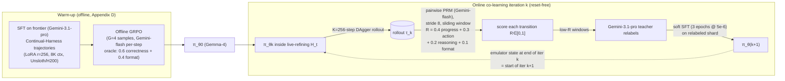

# Continual Harness: Online Adaptation for Self-Improving Foundation Agents (arXiv:2605.09998)

> Findings doc — research sub-agent for KB Seed AI. Immutable once finalized. Written incrementally.

## 1. Identity

- **Name:** *Continual Harness: Online Adaptation for Self-Improving Foundation Agents*
- **What it is:** A research paper (28 pages, 19 figures, 5 tables; cs.LG / cs.AI) proposing a **reset-free, self-improving agentic harness** for *embodied* agents. The agent acts in an environment and, every *F* steps, an LLM "Refiner" (same base model) rewrites the agent's own **system prompt, sub-agents, skill library, and memory** in place — *mid-episode, without environment resets*. It generalizes prompt-optimization (e.g., GEPA) from "rewrite the prompt across full-episode resets" to "rewrite the whole harness state from the trajectory-so-far, online." It also closes a second loop: an **online process-reward co-learning** pipeline that trains an open-source model's *weights* inside the live-refining harness.
- **Authors / org:** Seth Karten\*¹, Joel Zhang\*² (equal contribution), Tersoo Upaa Jr¹, Ruirong Feng¹, Wenzhe Li¹, Chengshuai Shi¹, Chi Jin¹, Kiran Vodrahalli³. Affiliations: ¹Princeton University, ²ARISE Foundation, ³Google DeepMind. Correspondence: sethkarten@princeton.edu.
- **Dates:** Submitted 11 May 2026 (v1). [arXiv listing shows "2026-05"]. License: CC BY-NC-SA 4.0.
- **Primary links:**
  - Abstract: https://arxiv.org/abs/2605.09998v1
  - HTML (experimental): https://arxiv.org/html/2605.09998v1
  - PDF: https://arxiv.org/pdf/2605.09998v1
  - Project website: https://sethkarten.ai/continual-harness
- **Code repo + commit SHA:** **YES, public.** `github.com/sethkarten/continual-harness` (formerly `sethkarten/pokeagent-speedrun`; GitHub auto-redirects). MIT license. Python 52.7% / C++ 26.5% / Pascal 19.5% (the C++/Pascal are the bundled Pokémon disassembly/emulator assets). I inspected the **`main` branch tarball, release `v5.0.0`, last push 2026-05-13T04:08:35Z** (downloaded via `codeload.github.com/sethkarten/continual-harness/tar.gz/refs/heads/main`; a direct `git clone` was blocked by the sandbox proxy with HTTP 407, so I used the tarball fallback — I therefore have the tree at HEAD-of-main but not a verifiable commit SHA, only the v5.0.0 release tag). The paper's main artifact is the **`continualharness` scaffold**, gated behind `--scaffold continualharness --enable-prompt-optimization`.
- **Lineage:** This is the academic write-up of the **"Gemini Plays Pokémon" (GPP)** livestream project (first AI to complete Pokémon Blue, Yellow Legacy hard mode, and Crystal). It builds on Karten et al.'s harness decomposition (the "PokeAgent Challenge" / prior work, cited as [5]) and on prompt-optimization work like **GEPA** [1].

## 2. TL;DR

- **Core idea:** Treat the *harness* (the scaffolding around a foundation model — prompt + sub-agents + skills + memory) as a **first-class, continuously-editable object**, and let an LLM Refiner rewrite it **in place, mid-run, from the trajectory so far** — no episode resets. This is "online in-context learning over the harness state."
- **Why it matters for us (high relevance):** This is *directly* a paper about self-improving agent scaffolding — the same "harness" concept that a seed-AI for software dev is. The CRUD-over-harness-components abstraction, the inner-act/outer-refine two-timescale loop, the failure-signature-triggered refinement, and the meta-tool API (`define_agent`, `run_code`, skill/memory CRUD) are all transferable scaffolding mechanisms.
- **Embodied, not coding:** The *domain* is Pokémon RPGs (embodied, partially-observable, long-horizon), NOT software engineering. So the *evaluator* is game progress / button-press cost, not test suites. The verification mechanism is the weakest part for our purposes (no verifiable correctness oracle like unit tests).
- **Two loops, one trajectory stream:** (1) inference-time harness refinement (in-context, frozen weights); (2) training-time **online co-learning** — open-source model rollouts through the refining harness are scored by a process-reward model, low-reward windows relabeled by a frontier teacher, model updated via "soft SFT." Both consume the same trajectory data → "continual model–harness co-learning."
- **Headline results:** Starting from a *minimal* interface (frames + ASCII map + buttons) with no curated knowledge, Continual Harness recovers "a majority of the gap" to a hand-engineered expert harness on Pokémon Red/Emerald, with **capability-dependent gains** (bigger models benefit more). The co-learning loop drives "sustained in-game milestone progress" for an open-source Gemma-4 model.
- **Honest caveat:** Results are on a single game franchise, "majority of the gap" is vague, and the verification signal (process reward model + frontier-teacher relabeling) is itself LLM-based and potentially gameable. Treat quantitative claims as directional pending the tables.

---

## 3. What it does & how it works

### 3.1 The core abstraction: the harness as a 4-tuple

The paper adopts a clean decomposition (from Karten et al. [5]). An **agentic harness** `H` is the scaffolding between a foundation model `M` and the environment, with four mutable components:

| Symbol | Component | What it holds |
|---|---|---|
| `p` | **System prompt** | strategic guidance injected each step |
| `G` | **Sub-agents** | specialized modules (battle, puzzle, reflection) the orchestrator can invoke |
| `K` | **Skills** | reusable routines: text heuristics *and* executable Python (pathfinders, tool wrappers). Ships with primitives like `press_buttons`, `get_game_state` |
| `M` | **Memory** | persistent store of facts/strategies/observations across the trajectory |

A fixed set of **meta-tools** (`define_agent`, `run_code`, `process_memory`, `process_skill`, `process_subagent`, `evolve_harness`, …) lets the agent (and the Refiner) edit `p,G,K,M` *in place*. Three reference points are defined: `H_min` (raw interface + generic prompt, nothing else), `H_expert` (fully hand-engineered: A* pathfinder, type chart, damage calculator, curated objectives, hand-built sub-agents), and `H_CH` (Continual Harness: starts at `H_min`, an automated **Refiner** grows it during play).

### 3.2 The two-loop architecture (the heart)

```mermaid
flowchart TB
    subgraph INNER["INNER LOOP — every step (frozen weights)"]
        direction LR
        S["state s_t = (frame o_t, ASCII map m_t)"] --> AG["Agent = M wrapped by harness H_t"]
        AG -->|action a_t| ENV["Environment (Pokémon emulator)"]
        ENV -->|next obs| S
        AG -->|append| TRAJ[("Trajectory τ (JSONL)")]
    end

    subgraph OUTER["OUTER LOOP — every F steps after warm-up W"]
        REF["Refiner = same model M"]
        TRAJ -->|reads window τ_{t-F:t}| REF
        REF -->|"detect failure signatures:\nnav loops, tool-call failures,\nstalled objectives, missed exploration"| PASS
        subgraph PASS["4 CRUD passes"]
            P1["1. rewrite prompt Δp"]
            P2["2. CRUD sub-agents ΔG"]
            P3["3. CRUD skills ΔK\n(codify successes, repair exceptions)"]
            P4["4. CRUD memory ΔM"]
        end
        PASS -->|"Δ = (Δp,ΔG,ΔK,ΔM)"| APPLY["H_{t+1} = H_t ⊕ Δ"]
    end

    APPLY -.->|enters context next step\nNO RESET| AG
    AG -.->|"agent can also self-trigger\nvia evolve_harness tool"| REF
```

- **Inner loop:** standard agent step. `M` wrapped by current harness `H_t` reads `(s_t, H_t, τ)` and emits action `a_t`. No reset.
- **Outer loop (Refiner):** every `F` steps (after warm-up `W`), the Refiner reads the **recent trajectory window** `τ_{t-F:t}`, identifies **failure signatures**, then runs **four independent passes** emitting per-component CRUD edits `Δ = (Δp, ΔG, ΔK, ΔM)`. The harness is updated in place (`H_{t+1} = H_t ⊕ Δ`) and enters the agent's context on the very next step.
- **Same model, two roles:** the Agent and Refiner are *the same base model* `M`; they differ only in *when* invoked and on *what context*. In the original GPP livestream, the Refiner was a **human** watching the stream; Continual Harness automates that human.
- **Monotonic accumulation:** "failure signatures observed earlier in the trajectory remain available to all subsequent refinement passes, so refinement quality compounds with episode length." Reset-based methods (GEPA, MIPRO) restart this accumulation each episode and *by construction cannot reach* late-game failure modes (Elite Four, multi-step puzzles). This reset-free property is the paper's central methodological claim.

### 3.3 The second loop: online model–harness co-learning (weight training)



The same trajectory data feeds both loops: the Refiner edits `H_t` *within* an iteration; SFT on relabeled trajectories updates `θ` *across* iterations. Because the harness shapes `D_θ` (the trajectory distribution) and the model's play surfaces new failures for the next refinement, the two co-adapt → "continual model–harness co-learning." It is **DAgger + PRM + frontier-teacher relabel + reset-free emulator-state propagation**. Crucially this is a **distillation** setup: a frontier teacher (Gemini-3.1-pro) trains an open-source student (Gemma-4 26B/31B); the paper admits the open models aren't strong enough to be their own teacher yet.

### 3.4 The environment & metric (why verification is weak here)

Interface: a 2×-upscaled screen buffer + an **ASCII text map** (derived from emulator RAM: `.`=walkable, `#`=wall, `N`=NPC, warps, player pos) + 8 GBA buttons. The text map "contains no walkthrough, no objective list" — it compensates for VLM spatial-reasoning weakness, not domain knowledge. Primary metric: **cumulative button presses to milestone** (a single `press_buttons([A,A,DOWN])` counts as 3). Milestones come from the PokeAgent Challenge [5] (Emerald: 31 through 3rd gym; Red: 18). There is **no correctness oracle** — "better" means "fewer button presses to reach scripted milestones," judged partly by an LLM PRM. This is the key structural difference from a software-building agent, where unit tests give a hard pass/fail verifier.

## 4. Evidence from the code

Repo: `sethkarten/continual-harness` @ `main` (release v5.0.0, pushed 2026-05-13). The load-bearing logic is small and readable.

### 4.1 The Refiner — `agents/utils/harness_evolver.py` (645 lines)

`HarnessEvolver.evolve()` runs the four passes, each **fault-isolated** (one failing pass doesn't block the others) — `continual-harness@v5.0.0:agents/utils/harness_evolver.py:115-148`:

```python
for name, fn in [
    ("prompt", lambda: self._evolve_prompt(current_step, num_trajectory_steps)),
    ("subagents", lambda: self._evolve_subagents(trajectories, current_step)),
    ("skills", lambda: self._evolve_skills(trajectories, current_step)),
    ("memory", lambda: self._evolve_memory(trajectories, current_step)),
]:
    try:
        results[name] = fn()
    except Exception as e:
        logger.error("Evolution pass '%s' failed: %s", name, e, exc_info=True)
        results[name] = {"error": str(e)}
```

**Discrepancy vs. paper (claim-vs-code):** the paper describes a fixed frequency `F`. The code uses an **adaptive schedule** that *ignores* the caller's `frequency`/`optimization_window_length` arg — `:98-109`:

```python
# Evolution frequency adapts: frequent early (every 25 steps for first 200),
# then backs off (every 100 steps) once the harness stabilizes.
MIN_WARMUP_STEPS = 25
EARLY_PHASE_CUTOFF = 200
EARLY_FREQUENCY = 25
STABLE_FREQUENCY = 100
def should_evolve(self, current_step, frequency) -> bool:
    if current_step < MIN_WARMUP_STEPS or current_step <= 0:
        return False
    effective_freq = EARLY_FREQUENCY if current_step <= EARLY_PHASE_CUTOFF else STABLE_FREQUENCY
    return current_step % effective_freq == 0   # caller's `frequency` is ignored
```

**Concrete failure-signature heuristics** (not just "ask the LLM"). The skill pass hard-codes an **antipattern detector** — if the agent ran disposable code ≥3× but saved 0 reusable skills, it injects a CRITICAL warning — `:341-357`:

```python
run_code_count = sum(1 for t in trajectories for tc in (...) if tc.get("name") == "run_code")
run_skill_count = sum(1 for t in trajectories for tc in (...) if tc.get("name") == "run_skill")
if run_code_count >= 3 and run_skill_count == 0:
    antipattern_warning = f"""## CRITICAL ANTIPATTERN DETECTED
The agent called run_code {run_code_count} times but run_skill 0 times ... You MUST
create executable skills from the patterns in these run_code calls."""
```

And a tool-failure extractor scans results for `success: false`/`error` and formats them as a `## Tool Failures Detected` block fed to every pass (`:166-196`).

**The actual Refiner prompts are in the repo verbatim.** The sub-agent pass prompt (`:210-263`) instructs the model to output ONLY JSON with `create`/`update`/`retire` arrays, each create specifying `handler_type` (`one_step`|`looping`), `max_turns`, `available_tools`, `system_instructions`, `directive`, `return_condition`. The skill pass prompt (`:359-419`) embeds the **exact skill-code API contract** (inline Python, `tools['press_buttons'](...)`, read `args`, set `result`; libraries `collections, heapq, numpy, json, re, math, random`) and asks for `add`/`update` with full-replacement `code`. The memory pass (`:481-523`) is deliberately **conservative** ("the agent itself writes memory during gameplay. You fill gaps and clean up", max 3-5 changes).

### 4.2 The prompt pass — `agents/utils/prompt_optimizer.py` (358 lines, "simplified GEPA")

The prompt pass is delegated to `PromptOptimizer.optimize_prompt()`. It loads the (immutable) system prompt as context so the optimizer "knows what tools exist," then asks the model to rewrite the **strategic-guidance base prompt** to (1) address observed failures, (2) reinforce successes, (3) add learned lessons. **It then overwrites the prompt with the LLM's output and saves it — there is NO A/B test, no acceptance gate, no rollback** (`:213-247`). Failure detection is heuristic — it flags blocked movement (coords unchanged after a move) and loops (same coords as 2 steps ago) directly in the trajectory summary (`:291-316`):

```python
if pre_coords == next_coords and movement_attempted:
    step_text += "⚠️ **Issue:** Movement attempted but coordinates unchanged (possibly blocked)\n"
if i > 1 and pre_coords == trajectories[i-2]...player_coords:
    step_text += "⚠️ **Pattern:** Same location as 2 steps ago (possible loop)\n"
```

### 4.3 Data structures — `utils/stores/*.py`

All four components persist through a generic `BaseStore` (`utils/stores/base_store.py`): JSON-backed, human-readable IDs allowed (`"move_to_coords"`), full **`mutation_history`** appended on every update (old→new diffs — i.e., the system *does* keep an audit trail), importance-weighted **tree overview** rendered into the prompt, recently-accessed subtrees floated to top. The skill schema (`utils/stores/skills.py`) is the candidate representation worth noting:

```python
@dataclass
class SkillEntry:
    id: str; path: str = "general"; name: str = ""; description: str = ""
    code: str = ""                     # optional executable Python
    effectiveness: str = "medium"      # low/medium/high — self-rated
    source: str = "orchestrator"       # "evolved" | "orchestrator"
    importance: int = 3
    mutation_history: List[dict] = field(default_factory=list)
```

Sub-agents (`utils/stores/subagents.py`) carry `handler_type`, `max_turns`, `available_tools`, `system_instructions`, `directive`, `return_condition`, `is_builtin`. Built-ins seeded for the *expert* harness include `Reflect`, `Verify`, `gym_puzzle`, `battler`, `summarize`, `plan_objectives` (`agents/subagents/*.py`) — but `H_CH` starts with an **empty** registry and grows its own.

### 4.4 Where the loop invokes evolution — `agents/PokeAgent.py`

`PokeAgent.py:2044-2049` wires the outer loop into the main step loop; the agent can also self-trigger via the `evolve_harness` tool (`PokeAgent.py:411`, registry def `agents/tools/registry.py:559-588`, scaffold-gated to `continualharness`). The agent-facing system prompt that exposes all this is `agents/prompts/pokeagent-directives/continual-harness/SYSTEM_PROMPT.md` (192 lines — full meta-tool API). The evolvable seed prompt is `.../continual-harness/BASE_ORCHESTRATOR_POLICY.md`, a short "Strategic Guidance (Seed)" stub ending with the literal line *"This block is updated over time by the evolution loop."*

### 4.5 Verification / anti-cheat — `utils/anticheat.py`

For the *competition* (not the self-improvement loop), `AntiCheatTracker` computes an MD5 **state hash** over `{player_name, money, location, coordinates, in_battle, step, party}` each step, plus behavioral fingerprints (decision-time variance, error rate, backtrack ratio, movement-vs-action consistency) and milestone detection by location-name mapping. This is the closest thing to a "verifier," and it verifies *trajectory integrity* (no save-state cheating), not solution correctness. Notably, the agent prompt also hard-forbids saving the game ("**NEVER save the game** via the START menu") — a guard against a known reward-hacking route (soft-resetting/save-scumming).

## 5. What's genuinely smart

1. **"The harness is the agent's whole nervous system" — and it can be a live, model-editable surface.** The reframing (well articulated by the independent Pickuma analysis) generalizes cleanly: a coding agent doesn't see the repo, it sees what retrieval pulled; a browser agent sees an a11y tree. Treating `p,G,K,M` as a *single typed, CRUD-able state object* the agent edits *during* a run is the durable idea. This is exactly the "scaffold the seed AI evolves" object.
2. **Reset-free, mid-episode refinement with monotonic failure accumulation.** Editing from a *partial trajectory window* (not full-episode resets) means (a) you can fix late-emerging failures, and (b) the failure record and its repair live *in the same run* ("the loop closes within a run rather than across resets"). This is the principled advance over GEPA/MIPRO/Reflexion, and it's the regime that actually matters for long-running coding/ops agents where resets are expensive.
3. **One model, two roles, one meta-tool API.** Agent and Refiner share `M` and edit through the *same* API; the only difference is invocation timing and context. This is an elegant, low-machinery way to get self-improvement — no separate "improver model" infrastructure.
4. **Concrete, codified failure signatures beat pure "reflect harder."** The `run_code`-without-`run_skill` antipattern detector, blocked-movement/loop flags, and tool-failure extraction are cheap deterministic triggers that focus the LLM Refiner. The "triage" behavior the ablations document (repair the few skills actually used, tolerate a long create-and-forget tail) is a realistic, honest picture of how this works.
5. **Skills as executable, debuggable, repairable code with a measurable oracle.** Skills carry real Python; the Refiner repairs code that raised exceptions; and §4.6 scores navigation skills against a **Dijkstra/BFS oracle** (path-cost deficit falls from ~50% to single digits) — a rare case of an *objective, end-task-independent* measure of self-improvement. The skill-debug-in-loop pattern (inspect→prototype→iterate→save→use) is directly portable.
6. **Capability-dependent gains, stated as a limit not hidden.** Pareto-dominant on Pro, high-variance on Flash, *below baseline* on Flash-Lite — there is a **capability floor** below which self-refinement actively hurts. Honest and important: self-improvement scaffolding is not free; a too-weak base model degrades when handed meta-tools.
7. **The transferable unit is the harness, not the episode** (bootstrap experiments). A harness refined in a prior run accelerates the next even after the game resets — but only while the agent keeps *using* the inherited components (Red regressed when it abandoned inherited sub-agents). This surfaces a real open problem: **reuse priors / deletion policies** for inherited scaffold.

## 6. Claims vs. reality / limitations / critiques

- **No acceptance gate / "keep if verifiably better" is NOT implemented.** This is the single most important caveat for our project. The prompt optimizer overwrites the prompt unconditionally; skill/sub-agent/memory edits are applied as the Refiner proposes them. There is `mutation_history` (audit trail) but **no automatic A/B comparison and no automatic revert on metric regression.** The independent Pickuma analysis explicitly flags this as "the central risk" and prescribes the missing discipline: *"Treat every harness edit as a commit … give it a message, a test, and a revert path … revert automatically when a change makes your feedback metric worse."* The paper *demonstrates* improvement in aggregate but does not gate individual edits.
- **Verification signal is LLM-based and soft.** The co-learning reward is a Gemini PRM (weighted progress/action/reasoning/format) and a Gemini teacher relabel — i.e., the "verifier" is itself a frontier LLM, gameable in principle and not a ground-truth oracle. Only the navigation-skill oracle (Dijkstra) and milestone flags are hard signals. For a *software*-building agent this is the gap: we'd substitute compilers/test suites, which the paper doesn't have.
- **Domain is a single game franchise.** All results are Pokémon (Red/Emerald quantitatively; Blue/Yellow/Crystal as the GPP livestream record). Emerald is capped at the 3rd gym (31 milestones); Red at 18. "Recovers a majority of the gap to expert" is real but **vague and bounded to early/mid game**; the residual gap concentrates exactly where it's hardest (dialogue-heavy gyms, multi-turn battles) — the components CH "does not yet synthesize reliably."
- **Co-learning is unsaturated and teacher-dependent.** "Sustained milestone progress" is shown but **no convergence point established**; only 5 "advancing runs" are plotted (selection?). The loop couples a *frontier teacher* to a *weaker open student* (distillation), so it does not yet demonstrate genuine *self*-improvement of a single model serving both roles. Per-iteration PRM reward is non-monotonic; advances are "bursty"; resume-checkpoints regress for 2-3 iterations (called an "artifact").
- **Documented catastrophic failure mode (Appendix B.3): the 1,003-turn Power Plant loop.** A vivid, honest case study: the agent wrote a `fly_menu_navigator` tool, hit a **schema mismatch** (passed `["Down"]` instead of `["tool"]`), and — believing its tool worked — **repeated the identical broken payload 842 times** over 3.5 hours, its "self-assessment" reasoning insisting it was making progress (confirmation bias) the entire time. Lessons the authors draw: tool generation stops after ~500 turns into a stall ("context horizon limit"), persistent-memory rules don't prevent schema errors, and the agent is blind to environmental feedback once it believes a tool works. This is a textbook illustration of why an *external* verifier (not the agent's own confidence) is mandatory.
- **Code vs. paper discrepancy.** The adaptive 25/100-step schedule in code contradicts the fixed-`F` description in the paper, and the configurable `optimization_window_length` flag is silently ignored by `should_evolve`. Minor, but a reproducibility flag.
- **Reproducibility friction.** Requires Gemini 3 API access (Pro/Flash) and game ROMs (not distributable); training needs H200s + Unsloth + frontier-teacher API calls. The inference scaffold is fully open and runnable; the training pipeline is heavier to reproduce.
- **Not yet peer-reviewed** (arXiv preprint, 11 May 2026). The GPP completion records are livestream claims; impressive but not independently audited in the paper.

## 7. Relevance to a self-improving, evolutionary software-building agent

This is one of the **most directly on-point** sources for the seed-AI project — it *is* a self-improving agent that edits its own scaffolding in an open-ended loop. Mapping its ideas to our problem:

- **The 4-component harness object (`p,G,K,M`) as the evolvable artifact.** Our seed AI needs a typed representation of "what can be improved." This paper's prompt + sub-agents + skills + memory decomposition, each with CRUD + `mutation_history` + importance + source-tagging, is a ready-made schema for *the thing the loop mutates*. → helps with: representing candidates/scaffold.
- **Reset-free, mid-task refinement from a trajectory window.** For long-horizon software builds (hours/days, "tokens unlimited"), the ability to improve scaffolding *without restarting the build* and to target failures that only appear deep in the task is exactly the regime we want. → helps with: long-horizon running, in-episode self-improvement.
- **Same-model dual role (Agent + Refiner) via one meta-tool API.** A low-infrastructure path to self-improvement: the builder agent and the improver are the same model differing only in trigger/context. → helps with: orchestration, self-modification logic.
- **Codified failure signatures as cheap improvement triggers.** The antipattern/loop/tool-failure detectors show how to *focus* an LLM improver deterministically instead of vague "reflect." For us: compiler errors, flaky tests, repeated edit-revert cycles, time-budget overruns are analogous triggers. → helps with: decision-making about *when/what* to improve.
- **Skills as executable, repairable code + an objective oracle.** The skill library *is* a self-built tool/library that gets debugged in-loop, and §4.6's Dijkstra-oracle scoring is the template for "measure a sub-capability against ground truth, independent of end task." For software: lint/type-check/unit-test a generated helper before promoting it. → helps with: verification, tool-building.
- **The harness as the transferable unit across runs (bootstrap).** Carrying an improved scaffold into the next build (with the open problem of *reuse priors / deletion policies* for inherited components) maps onto persistent agent memory/skill libraries across tasks. → helps with: cross-task memory.
- **The capability-floor finding.** Direct design warning: handing a weak model self-modification meta-tools can *degrade* it. Our seed AI should gate meta-capability on demonstrated base competence. → helps with: control/safety.
- **The missing piece is precisely our thesis.** Our loop is "propose → **test** → **keep only if verifiably better**." This paper has the propose and (soft) test but **no hard verify-and-promote gate and no auto-revert**. The Power Plant loop is the cautionary tale of what happens without an external verifier. So the source is most valuable as (a) a strong template for the *propose/scaffold-mutation* half and (b) a concrete demonstration of *why the verify-and-promote half is non-negotiable*. → helps with: confirming our core design decision.

What does NOT transfer: the embodied/partial-observability specifics (ASCII map, button-press metric, emulator state propagation), and the button-press cost objective (we have richer oracles — tests, benchmarks, perf).

## 8. Reusable assets (collected as evidence, not assembled into a design)

**A. The agent-facing meta-tool API (verbatim, `…/continual-harness/SYSTEM_PROMPT.md`).** A complete, battle-tested CRUD interface for self-modification: `process_memory` / `process_skill` / `process_subagent` (each `action: read|add|update|delete`, `entries: [...]`, `reasoning`), `run_code` (read-only Python sandbox for *developing* skills), `run_skill` (execute saved skill code), `execute_custom_subagent`, `evolve_harness` (self-trigger refinement), `process_trajectory_history` (one-shot VLM pass over a `[start,end]` window). The "How to develop executable skills" 5-step recipe (inspect → prototype → iterate → save → use) is a reusable agent instruction.

**B. The three Refiner prompts (verbatim, `agents/utils/harness_evolver.py`).** Sub-agent evolution (`:210-263`), skill evolution incl. the inline-Python skill-code API contract and antipattern injection (`:359-419`), memory curation with conservative "fill gaps, don't duplicate" framing (`:481-523`). All three force *JSON-only* output with `create/add` + `update` + `retire/delete` arrays — a clean CRUD-edit protocol.

**C. The "simplified GEPA" prompt-rewrite prompt (verbatim, `agents/utils/prompt_optimizer.py:181-211`).** Separates immutable system prompt (tools/hard constraints) from the editable strategic-guidance block, and asks for: address failures / reinforce successes / add learned lessons.

**D. Failure-signature detectors (code, portable).** `run_code≥3 ∧ run_skill==0` antipattern (`:341-357`); blocked-movement & loop flags (`prompt_optimizer.py:291-316`); `success:false`/`error` tool-failure extraction (`:166-196`).

**E. The candidate/skill data schema (`utils/stores/skills.py`, `base_store.py`).** Dataclass with `code`, `effectiveness`, `source`, `importance`, `mutation_history`; generic JSON store with human-readable IDs, mutation audit trail, importance-sorted tree overview rendered into the prompt, recency-floated subtrees.

**F. Evaluation method: oracle-relative sub-skill scoring.** §4.6 — score a self-built skill against a BFS/Dijkstra optimum, dialogue/battle presses filtered out, normalized per first-traversal segment. Template for "verify a generated component against ground truth independent of the end task."

**G. The co-learning recipe (Appendix D, for reference).** DAgger rollout (K=256) → pairwise PRM (stride 8; reward = 0.4 progress + 0.3 action + 0.2 reasoning + 0.1 format) → frontier-teacher relabel of low-reward windows → soft SFT (3 epochs @ 5e-6); reset-free emulator-state propagation across iterations; warm-up = SFT (LoRA r=256, 8K ctx) + offline GRPO (G=4; 0.6 correctness + 0.4 format).

**H. Anti-reward-hacking guards (`utils/anticheat.py` + prompt).** MD5 state-hash integrity over key game fields, behavioral fingerprinting, and the explicit "NEVER save the game" rule (blocks save-scumming).

## 9. Signal assessment

**Overall signal: HIGH.** This is a directly relevant, code-backed, recent paper on the exact problem class — an agent that autonomously improves its own scaffolding in an open-ended, reset-free loop — with the actual Refiner prompts, data structures, and control loop all open-source and readable. It is arguably the closest "embodied cousin" to a software-building seed AI in the canon, and it cleanly separates the components our project needs (prompt/sub-agents/skills/memory as a CRUD-able state).

**Confidence: High on mechanism** (I read the core source files verbatim: `harness_evolver.py`, `prompt_optimizer.py`, `base_store.py`, `skills.py`/`subagents.py`, the H_CH system prompt + seed policy, `anticheat.py`, and the loop invocation in `PokeAgent.py`). **Medium on quantitative claims** (I read the tables/figure captions in the HTML but figures are images I could not render; "majority of the gap," the Pareto numbers, and the 5 co-learning runs are taken from text/captions, not re-derived).

**Could NOT verify:** (1) exact commit SHA — proxy blocked `git clone`, so I have the v5.0.0 `main` tarball but only the release tag, not a SHA; (2) the figures themselves (loss curves, Pareto plane, milestone staircases) beyond their captions; (3) the GPP livestream completion records (Blue/Yellow/Crystal) — external claims; (4) whether any acceptance/revert logic exists in code paths I didn't open (I searched for it around the optimizer/evolver and found none — the edits appear unconditional); (5) reproduction of any result (no API keys / ROMs / GPUs).

## 10. References

**Primary — the source itself**
- [P1] Karten, Zhang, Upaa Jr, Feng, Li, Shi, Jin, Vodrahalli. *Continual Harness: Online Adaptation for Self-Improving Foundation Agents.* arXiv:2605.09998v1, 11 May 2026. Abstract: https://arxiv.org/abs/2605.09998v1 · HTML: https://arxiv.org/html/2605.09998v1 · PDF: https://arxiv.org/pdf/2605.09998v1
- [P2] Project website (demos, GPP livestream): https://sethkarten.ai/continual-harness
- [P3] Code repo: https://github.com/sethkarten/continual-harness (MIT; release v5.0.0, pushed 2026-05-13). Files cited as `continual-harness@v5.0.0:<path>`:
  - `agents/utils/harness_evolver.py` (Refiner, 4 CRUD passes, 3 verbatim prompts, antipattern detector)
  - `agents/utils/prompt_optimizer.py` ("simplified GEPA" prompt rewrite, failure-signature flags)
  - `utils/stores/base_store.py`, `utils/stores/skills.py`, `utils/stores/subagents.py` (data schemas, CRUD, mutation_history, tree overview)
  - `agents/prompts/pokeagent-directives/continual-harness/SYSTEM_PROMPT.md` (agent-facing meta-tool API)
  - `agents/prompts/pokeagent-directives/continual-harness/BASE_ORCHESTRATOR_POLICY.md` (evolvable seed prompt)
  - `agents/tools/registry.py:559-588` (`evolve_harness` tool def), `agents/PokeAgent.py:2044-2049` (loop invocation), `:411`,`:526-531` (self-trigger path)
  - `utils/anticheat.py` (state-hash integrity, behavioral fingerprinting, milestone detection)

**Primary — directly cited related work (for lineage)**
- [P4] Karten et al. *The PokeAgent Challenge: Competitive and Long-Context Learning at Scale.* arXiv:2603.15563 (ref [5]) — the benchmark, expert harness, milestone metric, and harness decomposition this paper builds on.
- [P5] Agrawal et al. *GEPA: Reflective Prompt Evolution Can Outperform RL.* arXiv:2507.19457 (ref [1]) — the reset-based prompt-optimization baseline CH generalizes.
- [P6] Lee et al. *Meta-Harness: End-to-End Optimization of Model Harnesses.* arXiv:2603.28052 (ref [10]) — concurrent harness-optimization work.
- [P7] Wang et al. *Voyager: An Open-Ended Embodied Agent with LLMs.* arXiv:2305.16291 (ref [20]) — prior self-tooling game agent (skill library lineage).
- [P8] Ross/Gordon/Bagnell, *DAgger* (ref [15]); Lightman et al. *Let's Verify Step by Step* (PRM, ref [11]); Shao et al. *DeepSeekMath/GRPO* (ref [16]); Shinn et al. *Reflexion* (ref [17]) — building blocks of the co-learning loop.

**Secondary — independent discussion / critique**
- [S1] Pickuma. *Continual Harness: The Gemini Pokémon Agent That Rewrites Its Own Loop.* https://pickuma.com/posts/continual-harness-gemini-self-improving-agent-loop/ — best independent analysis; extracts the generalizable pattern AND prescribes the missing safeguards (edit-as-commit, test, auto-revert on metric regression, fenced editable surface). Directly relevant to our verify-and-promote gap.
- [S2] The Neural Feed. *Gemini Plays Pokémon research introduces self-improving agent via 'Continual Harness'.* https://theneuralfeed.com/article/continual-harness-online-adaptation-for-self-improving-foundation-agents-r/ylcuPCVT
- [S3] Cool Papers mirror: https://papers.cool/arxiv/2605.09998
- [S4] `waylaidwanderer/gemini-plays-pokemon-public` — community repo auto-tracking GPP's live agent-definition + notepad content (independent corroboration that the live system builds its own sub-agents/skills): https://github.com/waylaidwanderer/gemini-plays-pokemon-public
