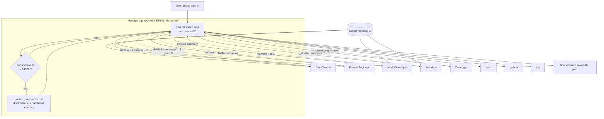
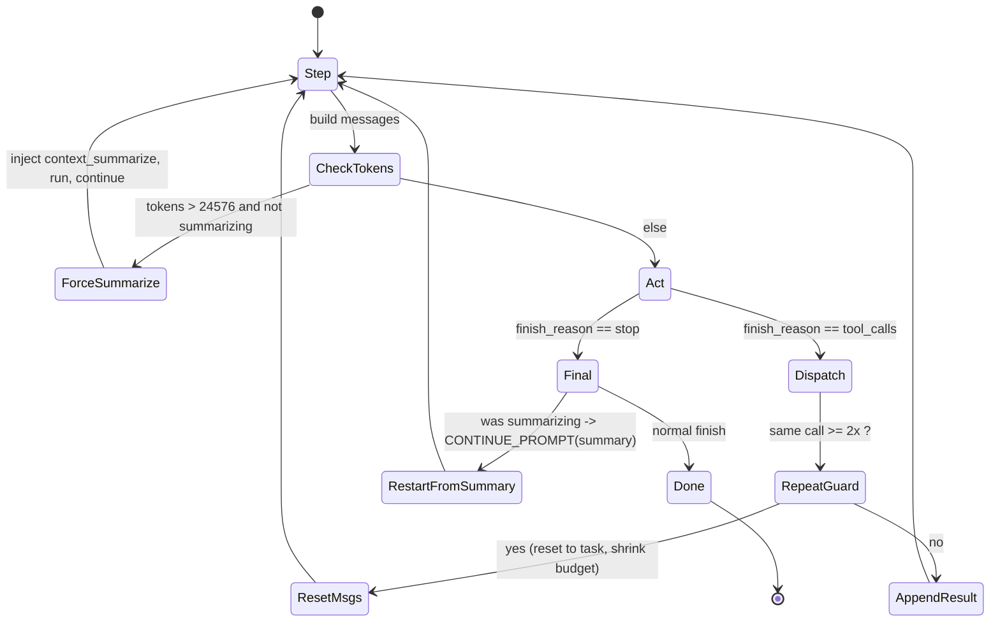
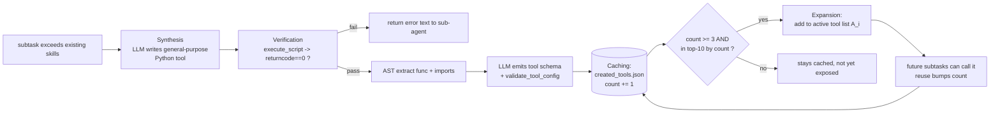
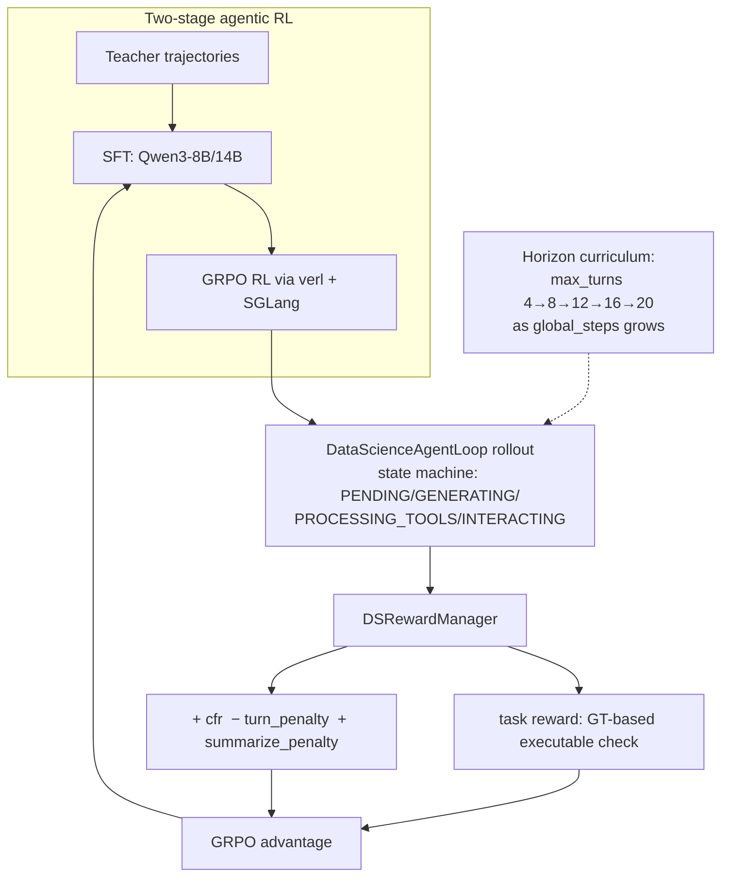

# EvoDS — Self-Evolving Autonomous Data Science Agent (arXiv 2606.03841)

> Per-source research findings. Reporter, not architect. Primary evidence (paper + code)
> over secondary. This source is a **data-science agent** paper, not a general
> software-building agent; relevance is judged strictly by transferable mechanisms.

---

## 1. Identity

- **Name:** EvoDS — *Self-Evolving Autonomous Data Science Agent with Skill Learning and Context Management*.
- **What it is:** A hierarchical **multi-agent LLM system** for end-to-end data-science tasks (load/clean → feature-eng → model → visualize → answer), trained with **agentic reinforcement learning** (SFT then GRPO) on top of **Qwen3-8B / Qwen3-14B**. Its two headline mechanisms are **Autonomous Skill Acquisition (ASA)** — the agent writes, validates by execution, caches, and (after repeated use) promotes new Python tools into its own action space — and **Adaptive Context Compression (ACC)** — a learned "when to summarize" policy plus per-subtask result distillation to survive long horizons within a bounded context window.
- **Authors / org:** Zherui Yang, Fan Liu, Yansong Ning, Hao Liu — **The Hong Kong University of Science and Technology (Guangzhou)** (USAIL lab). Corresponding: Hao Liu (`liuh@ust.hk`).
- **Venue / dates:** Accepted to **KDD '26** (32nd ACM SIGKDD, Jeju, Aug 2026). arXiv v1 listed 2026-06-02; arXiv id `2606.03841`. DOI `10.1145/3770855.3818002`.
- **Primary links:**
  - Abstract: https://arxiv.org/abs/2606.03841
  - HTML (ar5iv-style): https://arxiv.org/html/2606.03841v1
  - PDF: https://arxiv.org/pdf/2606.03841
  - Code: https://github.com/usail-hkust/EvoDS
  - Checkpoints: https://huggingface.co/yangzhr/EvoDS
- **Code inspected:** `github.com/usail-hkust/EvoDS` @ commit **`14635a4a71f81c980a8b984880214115e22b56b0`** (author date 2026-06-03, "update"; repo created 2026-05-30; 1 star at inspection). Obtained via codeload tarball of `main` (git clone was blocked by the sandbox proxy with HTTP 407; tarball SHA verified against the GitHub commits API). The repo vendors a **full copy of ByteDance's `verl`** RL framework (under `verl/`) plus EvoDS-specific agents/tools (under `agents/`, `utils/`, `benchmarks/`).

---

## 2. TL;DR

- **It is a data-science (DS) agent, not a software factory.** The "self-improvement" is *within-episode/within-dataset* tool growth plus *offline RL training* of the policy — not an open-ended, cross-run, code-rewriting loop. There is **no self-modification of the agent's own scaffold or prompts** at runtime.
- **The genuinely transferable idea is ASA: agent-authored tools that are execution-verified, usage-counted, and promoted into the action space only after being (re)used ≥3 times.** This is a concrete, simple "skill library with a promotion gate" — directly relevant to a software-building agent that accumulates reusable capabilities.
- **The other transferable idea is ACC: treat context compression as an *action the policy chooses* (a `context_summarize` tool), trained with reward shaping that penalizes summarizing too early or running out of tokens.** They report this *eliminates out-of-token failures* on long-horizon tasks — relevant to running agents reliably over long horizons.
- **Two very different "verifiers" live in this repo, and the distinction matters.** (A) The **inference-time skill "validation" is weak**: a created tool is "verified" iff its script exits with return-code 0 — i.e. "it ran without crashing," *not* "it is correct." (B) The **training-time reward is strong**: ground-truth-based executable checks (predicted CSV vs gold CSV with tolerance, MLE-Dojo leaderboard rank, GPT-4o visual judge for plots). For an *evolutionary, verifiably-better* agent, (B) is the interesting pattern; (A) is a cautionary example of a gameable gate.
- **Claimed result:** +28.9% average over open-source DS agents across 4 benchmarks, with zero out-of-token failures. This is a *trained-model* result (Qwen3-8B/14B post-SFT+RL), so it does not isolate the architecture from the training.
- **Signal for us: MEDIUM (low-to-medium).** A few clean, borrowable mechanisms (skill-promotion gate, summarize-as-action + its reward shaping, ground-truth executable rewards, horizon curriculum). The domain (tabular DS) and the heavyweight RL pipeline are not our setting; the inference-time verifier is exactly the kind of weak gate we'd want to avoid.

---

## 3. What it does & how it works

### 3.1 Problem framing

EvoDS frames autonomous data science as **sequential decision-making over an *evolving* action space under a *bounded* context budget.** Two stated limitations of prior DS agents motivate it: (1) **static action sets** (fixed tools → cannot accumulate reusable experience), and (2) **no principled long-horizon context management** (multi-stage pipelines blow the context window → "out-of-token" failures). EvoDS's answer is ASA (grow the action space) + ACC (regulate context), both folded into one RL-trained hierarchical multi-agent policy.

### 3.2 Topology: one Manager, many specialist sub-agents

A single **Manager** agent plans and dispatches; it calls **tools**, several of which are themselves **LLM sub-agents** (data cleaning, feature engineering, model development, visualization, debugging), plus raw executors (bash, python, sql) and the `context_summarize` tool. Each LLM sub-agent owns a **scope-local action space** `A_i` (its own primitive tools + its own learned skills) and runs a short internal loop (`max_steps=3`).

Memory is split: a **global memory** = the overall task objective `G` (shared, read by every sub-agent), and **local memory** = per-subtask goal + execution context. Sub-agents do **not** return raw outputs to the Manager; they return an LLM-distilled summary conditioned on `G` (`õ_t = φ(o_t | G)`): successes summarized by outcome, failures by error/cause. This both localizes long contexts and is the paper's "two-level" ACC (sub-agent-side distillation + Manager-side adaptive summarize).



### 3.3 The Manager control loop (actual code)

`agents/EvoDS.py :: generate_output` is the real loop. Per step (up to `max_steps`, default 20):

1. Estimate token count of the running `messages` via the tokenizer's chat template (`get_tokens`).
2. **Hard ACC trigger:** if `token_num > context_tokens` (default **24576**) and not already summarizing, inject a synthetic assistant `context_summarize` tool call, run it, and continue. (This is the *fallback* trigger; the *learned* trigger is the policy itself emitting the `context_summarize` tool — see ACC below.)
3. Ask the Manager LLM for an action (`manager.action` → `llm.generate(messages, tools=...)`).
4. If `finish_reason == "tool_calls"`: dispatch each call via `tool_map` (each entry wraps a sub-agent or executor and bumps `function_call_count`). Append the tool result as a `tool` message.
5. **Loop / repetition guard:** if the *same* tool call (name+args) repeats `repeat_num >= 2` times, the loop **resets `messages` to just the task** and shrinks the step budget (`update_system_prompt`), i.e. a crude anti-thrashing reset.
6. When summarization completes, the loop **restarts the conversation from a `CONTINUE_PROMPT`** seeded with the summary (treating the summary as the new authoritative state), and decrements the advertised step budget.
7. Terminate when the model emits a non-tool final message (`done=True`).



### 3.4 Autonomous Skill Acquisition (ASA) — Synthesis → Verification → Caching → Expansion

This is the paper's central "self-evolving" mechanism. Each specialist sub-agent ships with a fixed set of **primitive tools** *plus* one special **`*_tool_creation`** tool. The four ASA stages (paper's wording) map onto the code as follows:

- **Synthesis.** When a subtask exceeds existing tools, the sub-agent writes a new general-purpose Python function via `data_cleaning_tool_creation` / `feature_engineering_tool_creation` / `machine_learning_tool_creation` / visualization equivalent. The tool *description* explicitly demands "a **general-purpose, reusable**… **dataset-agnostic**" function (verbatim in §4).
- **Verification.** The created script is written to disk and **executed in a subprocess** (`utils/util.py::execute_script`, 1800 s timeout). "Success" = **`returncode == 0`**. There is **no correctness check** — only "did it run."
- **Caching.** On success, `update_tools` (in `utils/util.py`) AST-parses the code (`extract_tool_details`), asks the LLM to emit an OpenAI-style **tool schema** (`Tool_Configuration_Extraction_PROMPT`), **validates that schema structurally** (`validate_tool_config`), then stores `{code, tool_config}` keyed by function name in `utils/<dataset>/created_tools/<domain>_tools.json` and increments a usage counter in `<domain>_tool_count.json`.
- **Expansion.** The *active* action space is recomputed as the **top-K (=`add_tool_nums`, default 10) most-used created tools whose count ≥ 3**: `top_k = [k for k,_ in nlargest(num, tool_count.items(), key=count) if tool_count[k] >= 3]`. So a synthesized tool is only *exposed as a first-class tool* after it has been (re)created/used at least 3 times — a usage-frequency promotion gate. Re-using an already-promoted created tool also bumps its count (`update_tool_num`).



### 3.5 Adaptive Context Compression (ACC) — two levels

- **Sub-agent level (distillation, always on):** sub-agents return `φ(o_t | G)` — an LLM summary of their raw output conditioned on the global objective — instead of raw logs. Successes → key outcomes; failures → error patterns. This bounds the *per-call* context the Manager ingests.
- **Manager level (learned trigger):** the Manager has a dedicated `context_summarize` action `a^sum ∈ A^man`. Instead of compressing only on a length threshold (the "passive truncation" they critique), the **policy decides when** to summarize: `a^sum ~ π_θ(· | C, G)`. On invocation, the running context is replaced by a numbered-list summary (the `CONTEXT_SUMMARIZE_PROMPT`) that must preserve constraints, decisions, and intermediate results; the conversation then **restarts from `CONTINUE_PROMPT(summary)`**. At inference there is *also* the hard `>24576` fallback (§3.3). The paper ties this objective to an **information-bottleneck** rationale (keep task-relevant info, drop the rest).

### 3.6 Training: SFT then GRPO (agentic RL), with horizon curriculum and reward shaping

Two-stage scheme over **Qwen3-8B** (and a 14B variant):

1. **SFT** on **teacher trajectories** (multi-turn) — `verl/examples/sft/multiturn/run_evods_qwen3_8b.sh`. (A bigger/teacher model produces gold trajectories; EvoDS's own `gpt-4o` is used elsewhere as judge.)
2. **Online RL** with **GRPO** (`algorithm.adv_estimator=grpo`) via the vendored `verl` + SGLang async rollouts — `verl/examples/sglang_multiturn/run_evods_qwen3_8b.sh`. Notable hyper-params: `response_length=24576`, `n=16` rollouts, `kl_loss_coef=0.001`, `entropy_coeff=0.001`, lr `1e-6`, 8×H100, `total_training_steps=300`, `max_assistant_turns=20`.

The **custom multi-agent agent-loop** (`verl/verl/experimental/agent_loop/data_science_agent_loop.py`) and **custom reward manager** (`verl/verl/workers/reward_manager/datascience.py`) are where ASA/ACC are co-optimized. Two design choices stand out:

- **Horizon curriculum:** `max_assistant_turns` ramps with training step: ≤20 steps → 4 turns; ≤40 → 8; ≤60 → 12; ≤80 → 16; else 20. The agent is trained on short horizons first, then progressively longer ones.
- **Reward shaping for context behavior** (`run`, lines ~289–301): a **"context folding reward"** `cfr = 0.2 * success_turns / (assistant_turns − 1)` rewards productive sub-agent turns; a **turn penalty** `tp = 0.1 * assistant_turns / max_assistant_turns` discourages dithering; a **`summarize_penalty = −0.1`** fires if the policy summarizes too early (`<8192` response tokens) *or* fails to summarize when context is already huge (`≥16384`). Final per-turn shaping = `cfr − tp + summarize_penalty`, added on top of the task-accuracy reward.



---

## 4. Evidence from the code

Repo `usail-hkust/EvoDS @ 14635a4` (paths relative to repo root). Most load-bearing files:

| File | Role |
|---|---|
| `main.py` | Entry point; builds an `EvoDS` agent per data item; `--context_tokens 24576`, `--max_steps 20`, `--add_tool_nums 10`, `--clean_tools True`. |
| `agents/EvoDS.py` | Orchestrator + **Manager control loop** (`generate_output`); ACC hard trigger; repeat-guard reset. |
| `agents/manager.py` | Manager = `BaseAgent` with `MANAGER_SYS_PROMPT`; `update_system_prompt` shrinks advertised step budget. |
| `agents/data_cleaner.py`, `model_developer.py`, `feature_enginner.py`, `visualizer.py` | Specialist sub-agents; each loads top-K≥3 created tools and exposes a `*_tool_creation` tool. |
| `agents/debugger.py` | Execute→observe→fix→re-execute loop; success = returncode 0; truncates obs to head/tail 500 tokens. |
| `agents/context_summarizer.py` + `utils/context_summarize.py` | `context_summarize` "tool" just returns the summary *prompt*; the Manager LLM does the summarizing. |
| `utils/util.py` | **ASA core:** `execute_script` (the "verifier"), `extract_tool_details` (AST), `validate_tool_config`, `update_tools`, `update_tool_num` (the **≥3 / top-K promotion gate**). |
| `utils/data_cleaning.py` (+ `feature_engineering.py`, `model_development.py`, `visualization.py`) | Primitive tools + `*_tool_creation` tool schemas + sub-agent system prompts. |
| `utils/prompt.py` | `MANAGER_SYS_PROMPT`, `CONTINUE_PROMPT`, `Tool_Configuration_Extraction_PROMPT`, answer-reformat templates. |
| `benchmarks/*.py` | Inference-time eval harnesses (DABench numeric match, etc.). |
| `verl/verl/workers/reward_manager/datascience.py` | **Training-time verifier / reward** (GT-based, executable). |
| `verl/verl/experimental/agent_loop/data_science_agent_loop.py` | Multi-agent RL rollout + reward shaping + horizon curriculum. |

### 4.1 The inference-time "verifier" (weak: runs-without-crashing)

`utils/util.py::execute_script` — success is purely the subprocess return code:

```python
def execute_script(script_path, work_dir):
    ...
    exec_res = subprocess.run(cmd_list, ..., timeout=1800, text=True, cwd=work_dir, env=my_env)
    ...
    if exec_res.returncode != 0:
        raw = exec_res.stderr
    else:
        raw = exec_res.stdout
    ...
    return exec_res.returncode == 0, output   # <-- "verified" == exit code 0
```

And `data_cleaning_tool_creation` (in `utils/data_cleaning.py`) treats "ran" as "success":

```python
def data_cleaning_tool_creation(code, script_file_name, dataset_path, work_dir, index):
    ...
    write_program(code, os.path.join(work_dir, script_file_name))
    success, output = execute_script(script_file_name, work_dir)
    if success:
        ... return "Data cleaning task completed successfully. ..."
    else:
        return f"Data cleaning task failed. ... The reason is: {output}"
```

### 4.2 The skill-promotion gate (the actually-clever bit of ASA)

`utils/util.py::update_tools` (caches + counts) and the top-K≥3 selection that recomputes the active toolset:

```python
results = extract_tool_details(code)              # AST: imports + each FunctionDef
...
for result in results:
    messages = [{"role":"user","content": Tool_Configuration_Extraction_PROMPT.format(code=result["tool_function"])}]
    choice = await llm.generate(messages)
    ...
    tool_config = json5.loads(tool_config)
    validate_tool_config(tool_config)             # structural schema validation only
    ...
    tool_count[tool_name] = tool_count.get(tool_name, 0) + 1
    tools[tool_name] = {"code": result["tool_function"], "tool_config": tool_config}

top_k = [k for k, _ in nlargest(num, tool_count.items(), key=lambda x: x[1]) if tool_count[k] >= 3]
add_tools = [tools[tool_name]['tool_config'] for tool_name in top_k]
```

`validate_tool_config` enforces the schema is well-formed (type=="function", non-empty name/description, `parameters.type=="object"`, every property has a type+description, every required param exists) — but **says nothing about behavior**.

### 4.3 The training-time verifier (strong: ground-truth + executable)

`verl/verl/workers/reward_manager/datascience.py::DSRewardManager` dispatches per data source to **objective, ground-truth checks**:

- **SQL / DataMind** — run predicted query, compare `result.csv` vs gold CSV column-wise with `abs_tol=1e-2`, order-insensitive (`compare_pandas_table`); score ∈ {0,1}.
- **DSBench** — run the benchmark's own `{id}_eval.py`, then **normalize against a baseline and gold**: `score = max(0, (pred − baseline)/(gold − baseline))` (relative improvement over a baseline, clipped at 0).
- **MLE-Dojo** — validate then `metric.evaluate(y_true, y_pred)`, then map to a **percentile leaderboard rank**: `reward = 1 − rank/N`.
- **MatPlotBench / visualization** — **GPT-4o visual judge** comparing generated plot to ground truth, returns `[FINAL SCORE]: N`/100 (prompt verbatim in `utils/util.py::image_evaluate` and the reward manager).
- **QA (DABench-style)** — extract `@name[value]` answers and compare with relative tolerance `is_equal_relative` (`<0.1%`).

The final RL reward combines this task score with the shaping terms; sub-agent turns carry their own `turn_scores` merged into the trajectory (`sub_agent` flag), so Manager + sub-agents are co-trained.

### 4.4 Reward shaping + horizon curriculum (verbatim)

`data_science_agent_loop.py::run`:

```python
if kwargs["global_steps"] <= 20:   self.max_assistant_turns = 4
elif kwargs["global_steps"] <= 40: self.max_assistant_turns = 8
elif kwargs["global_steps"] <= 60: self.max_assistant_turns = 12
elif kwargs["global_steps"] <= 80: self.max_assistant_turns = 16
else:                              self.max_assistant_turns = 20
...
# context folding reward
cfr = 0.2 * success_turns / (agent_data.assistant_turns - 1)  # else 0
# turn penalty
tp = 0.1 * agent_data.assistant_turns / self.max_assistant_turns
agent_data.turn_scores = [cfr - tp + self.summarize_penalty]
```

`_handle_processing_tools_state`:

```python
if tool_call.name == 'context_summarize' and len(agent_data.response_mask) < 8192:
    self.summarize_penalty = -0.1          # punished for summarizing too early
if tool_call.name != 'context_summarize' and len(agent_data.response_mask) >= 16384:
    self.summarize_penalty = -0.1          # punished for NOT summarizing when context is huge
```

### 4.5 Key prompts (verbatim)

**Skill-synthesis tool description** (`utils/data_cleaning.py`) — the only place that enforces "reusable":

```
Create a **general-purpose, reusable data cleaning tool** when necessary to solve the
current task. The generated tool should be **dataset-agnostic** and applicable to a wide
range of data cleaning scenarios rather than being tailored to a specific dataset or
variable. The tool will be saved as a Python script, executed immediately, and return the
execution results... The created tool is expected to be reusable in future data cleaning
tasks within an autonomous data science pipeline.
```

**Manager system prompt** (`utils/prompt.py`, abridged) — note the explicit verify-before-finish and summarize instructions:

```
You are a data science expert... The maximum number of steps you can take is **{max_steps}**.
# NOTICE #
1. You should first understand the environment and conduct data analysis ... before handling the task.
2. ... you should check the existence of files before reading them.
...
6. For challenging tasks like ML, you may need to verify the correctness of the method by
   checking the accuracy or other metrics, and try to optimize the method.
7. Before finishing the task, ensure all instructions are met and verify the existence and
   correctness of any generated files.
9. If the interaction history becomes excessively long ... **use the `context_summarize`
   tool to compress and retain only the essential context** ...
**Important:** If multiple steps fail, **try alternative strategies** ... rather than repeating the same steps.
```

**Context-summarize prompt** (`utils/context_summarize.py`, abridged) — compress to a self-contained numbered list of decisions/constraints/intermediate results; *exclude* failed attempts unless they reveal a constraint; do not restate the problem (re-supplied via `CONTINUE_PROMPT`).

**`CONTINUE_PROMPT`** (`utils/prompt.py`) — restarts the episode treating the summary as authoritative state: *"Treat the provided summary as the authoritative representation of the prior context… Avoid revisiting or re-deriving information that has already been resolved…"*

**`Tool_Configuration_Extraction_PROMPT`** — turns a raw Python function into a strict OpenAI tool schema (name must equal function name; required = no-default params); output JSON only.

---

## 5. What's genuinely smart

1. **A skill library with a *promotion gate* keyed to demonstrated reuse (≥3 uses, top-K).** Most "agent writes its own tools" systems either expose every generated snippet (context bloat, junk tools) or never persist them. EvoDS's gate is a cheap, sensible filter: a tool only becomes a first-class action once the agent has independently found it useful several times. This keeps the action space small and *earned*. The separation of **store-everything (cache)** vs **expose-only-the-proven (active set)** is the transferable insight.

2. **Compression as a *policy action*, not a hardcoded rule — and trained as such.** Making `context_summarize` a tool the model *chooses*, then shaping the reward to punish premature summarization (`<8192` tokens) and punish *not* summarizing when the window is nearly full (`≥16384`), is a clean way to teach a long-horizon agent *when* to checkpoint its own state. The reported "zero out-of-token failures" is the kind of reliability property a long-running builder needs.

3. **Strong, ground-truth, *executable* training rewards with relative-improvement normalization.** The reward manager doesn't trust the model's prose — it runs the artifact and compares to gold (CSV tolerance), or scores against a *baseline-normalized* scale (`(pred−baseline)/(gold−baseline)`), or against a real leaderboard (`1 − rank/N`). The baseline-normalization and percentile-rank shaping give a **graded "is it verifiably better"** signal rather than pass/fail — exactly the flavor of verification an evolutionary loop wants.

4. **Horizon curriculum.** Training short-horizon first and lengthening the allowed turn budget as the policy improves is a simple, effective recipe for stabilizing long-horizon agentic RL. Transferable to any agent we'd train/fine-tune.

5. **Per-subtask result distillation conditioned on the global goal (`φ(o|G)`), with failure→error-pattern summaries.** Returning *distilled* sub-agent results (and explicitly keeping *why* something failed) instead of raw logs is good context hygiene for a manager/worker topology — and the failure-pattern retention is a (lightweight) form of error memory.

6. **Cheap anti-thrashing guard.** The "same tool call ≥2× → reset conversation to the task and shrink the budget" is a blunt but practical loop-breaker for agents that get stuck repeating an action.

---

## 6. Claims vs. reality / limitations / critiques

- **"Self-evolving" is narrower than it sounds.** The agent's *scaffold, prompts, and topology are fixed*. "Evolution" = (a) growing a per-domain tool library within a run/dataset, and (b) offline RL training of one policy. There is **no cross-run self-modification of the agent's own code/prompts**, no open-ended "propose→test→keep-if-better" over the *agent itself*. So for a "seed AI that rewrites itself," EvoDS is an analogue for the *tool/skill* layer only.
- **The inference-time skill verifier is gameable.** "Verified" == exit code 0. A synthesized "cleaning" tool that loads and re-saves the data unchanged, or silently swallows exceptions, passes. `execute_tool` (in `utils/util.py`) even wraps execution in a bare `try/except` that returns a generic "task failed. Try again." on *any* exception — so behavior is never asserted. This is a textbook weak gate; the only thing standing between a no-op tool and promotion is that it must be (re)used ≥3 times.
- **The promotion gate counts *creation/use*, not *success-attributable value*.** A tool's count increments when it's created or called, regardless of whether the *episode* ultimately succeeded. There is no credit assignment from final task reward back to "which created tool helped." So the library can accumulate popular-but-useless tools.
- **Skill library is per-dataset and reset by default.** `main.py` runs with `--clean_tools True`, which **wipes `created_tools/*.json` at the start of each dataset run** (`clean_created_tools`). So the headline "accumulate reusable experience across tasks" is, in the default eval path, accumulation *within a single benchmark run*, not a persistent cross-deployment library. (The store is on local JSON files; nothing ships a pre-populated library.)
- **Results don't isolate the architecture.** The +28.9% is for a *trained* Qwen3-8B/14B (SFT on teacher trajectories + GRPO). Gains could stem from SFT/RL on in-domain data as much as from ASA/ACC. The paper's ablations (per the abstract/intro) argue each component helps, but the public artifact is a trained checkpoint; reproducing the *training* needs 8×H100, the teacher trajectories, and four benchmark datasets that are **not included** (README: "datasets are not included… download manually").
- **Theory is suggestive, not load-bearing.** The "hierarchical design reduces tool-selection error" and "objective aligns with an information bottleneck" claims are framing for design choices (smaller per-agent action space; compress-but-keep-task-relevant-info), not tight guarantees one can port.
- **Reproducibility friction.** Vendored `verl` (large), hard-coded `your_api_key`/`<your_openai_key>` placeholders, GPT-4o as both a sub-component and the visual judge (cost + nondeterminism), benchmark datasets absent. Repo is brand-new (created 2026-05-30, 1 star).
- **Independent scrutiny: none yet.** Searches surface only the arXiv page and an auto-generated aggregator ("shipfeed"); the other hits (CoEvoSkills, EvoSkill, AutoSkill, Auto-Evolution-Agent-Skills) are *different* skill-evolution projects, not analyses of EvoDS. I could not find any third-party reproduction or critique.

---

## 7. Relevance to a self-improving, evolutionary, software-building agent

Judged by the one test ("would this help build a self-improving, evolutionary, software-building agent?"). EvoDS is in an adjacent domain (tabular DS), but several mechanisms transfer:

- **Skill/tool accumulation with a promotion gate → capability growth.** The "cache everything, expose only what's been independently useful ≥N times, cap to top-K" pattern is directly applicable to a code agent that writes helper functions/scripts and should grow a curated, non-bloated tool/skill library. *Helps with:* memory of reusable capabilities; keeping the action space tractable as it grows. **Caveat to carry:** make the gate reward-attributable, not mere use-count (see §6).
- **Compression-as-action + its reward shaping → long-horizon reliability.** Teaching the agent *when* to checkpoint/summarize its own state (and punishing both premature and too-late compression) is a concrete recipe for "running agents reliably over long horizons" without out-of-token crashes. *Helps with:* long-running loops, bounded context, durable working state. The `CONTINUE_PROMPT` "treat the summary as authoritative state" restart is a reusable state-handoff pattern.
- **Ground-truth, executable, baseline-normalized rewards → "verifiably better."** The reward manager is a clean template for the **verification core** of a keep-only-if-better loop: run the artifact, compare to a reference, and (crucially) *normalize against a baseline* so improvement is graded, not binary. The MLE-Dojo "percentile vs leaderboard" and DSBench "(pred−baseline)/(gold−baseline)" are exactly the kind of comparative metrics an evolutionary selector could use. *Helps with:* verification, selection pressure, anti-regression.
- **Two-tier verifier contrast → a design warning.** EvoDS embodies *both* a weak gate (exit-code-0 at inference) and a strong gate (GT-based at training). For an agent-validating-agents architecture, the lesson is to **route promotion decisions through the strong, behavior-asserting check**, never the "it didn't crash" check. This source is a useful negative example for that.
- **Horizon curriculum → trainable long-horizon competence.** If we ever fine-tune/RL our agent, ramping the allowed step budget with training progress is a low-cost stabilizer.
- **Manager/worker topology with goal-conditioned distillation → orchestration + decision-making.** Global-goal-in-every-worker plus distilled returns is a sane orchestration pattern; the failure→error-pattern summary is a seed of error memory.

What **doesn't** transfer: the tabular-DS primitive tools themselves; the heavyweight GRPO/verl/SGLang training stack (not our "tokens-unlimited, prompt-driven" setting); the static-scaffold assumption (we want self-modification, which EvoDS does not do).

---

## 8. Reusable assets (collected as evidence, not assembled into a design)

- **Skill-promotion gate (verbatim logic).** `top_k = [k for k,_ in nlargest(K, count.items(), key=val) if count[k] >= 3]` — store-all-in-JSON, expose top-K with count≥3. (`utils/util.py::update_tools`, `update_tool_num`.) Pair with `validate_tool_config` for structural schema validation of agent-authored tools.
- **AST tool extraction + LLM schema synthesis.** `extract_tool_details` (pulls imports + each `FunctionDef` into a standalone runnable block) → `Tool_Configuration_Extraction_PROMPT` (function → OpenAI tool schema) → `validate_tool_config`. A complete "turn agent-written code into a callable, registered tool" pipeline.
- **Compression-as-action reward shaping (verbatim).** The `summarize_penalty` rules (`<8192` early-penalty; `≥16384` not-summarizing-penalty) and `cfr − tp + summarize_penalty` per-turn shaping. (`data_science_agent_loop.py`.) A ready template for training (or even heuristically scoring) long-horizon context discipline.
- **Horizon curriculum schedule (verbatim).** The `global_steps`→`max_assistant_turns` ladder (4/8/12/16/20).
- **Ground-truth reward functions (verbatim).** `compare_pandas_table` (tolerance + order-insensitive CSV equality), DSBench baseline-normalized score, MLE-Dojo leaderboard percentile, GPT-4o `image_evaluate` visual-judge prompt, `is_equal_relative` numeric matching. (`reward_manager/datascience.py`, `utils/util.py`.)
- **Context-summarize + continue prompts (verbatim, §4.5).** `CONTEXT_SUMMARIZE_PROMPT` (compress to self-contained numbered memory; drop failed attempts unless they encode a constraint) and `CONTINUE_PROMPT` (resume treating summary as authoritative state).
- **Manager system prompt (verbatim, §4.5).** Includes explicit "verify existence and correctness of generated files before finishing" and "if steps fail, try alternative strategies rather than repeating" — useful goal-tracking / anti-thrash language.
- **Anti-thrashing guard.** Reset-conversation-on-repeated-identical-tool-call (`repeat_num >= 2`) in `agents/EvoDS.py`.
- **Sub-agent result distillation pattern.** `õ_t = φ(o_t | G)`: success→outcome summary, failure→error-pattern summary; return distilled, not raw.

---

## 9. Signal assessment

- **Overall value: MEDIUM (lean low-to-medium).** Not core to our thesis (it's a domain DS agent with a fixed scaffold and a training-heavy pipeline), but it contributes **3–4 clean, directly borrowable mechanisms**: the skill-promotion gate, compression-as-trained-action + its reward shaping, ground-truth/baseline-normalized executable rewards, and the horizon curriculum. It also serves as a crisp **negative example** of a gameable inference-time verifier.
- **Confidence: high on the mechanisms (I read the actual control loop, ASA gate, both verifiers, the reward shaping, and the prompts verbatim).** Medium on the empirical claims (the +28.9% and "zero out-of-token failures" are from a trained checkpoint; I did not run training or eval — datasets absent, needs 8×H100).
- **What I could NOT verify:** (1) the headline benchmark numbers / ablations (no training run, datasets not shipped); (2) whether the cross-task skill library helps *in practice* given the default `--clean_tools True` wipes it per benchmark run; (3) the quality/diversity of synthesized tools in real episodes (no captured `created_tools/*.json` in the tarball); (4) the SFT teacher-trajectory source (referenced but not in repo); (5) any independent reproduction (none found).

---

## 10. References

**Primary — paper**
- EvoDS abstract — https://arxiv.org/abs/2606.03841 (primary)
- EvoDS HTML v1 — https://arxiv.org/html/2606.03841v1 (primary)
- EvoDS PDF — https://arxiv.org/pdf/2606.03841 (primary; downloaded to scratch)
- KDD '26 listing — DOI 10.1145/3770855.3818002 (primary)

**Primary — code** (`usail-hkust/EvoDS` @ `14635a4a71f81c980a8b984880214115e22b56b0`)
- Repo — https://github.com/usail-hkust/EvoDS (primary)
- Commit/metadata via GitHub API — commit `14635a4…`, author date 2026-06-03, repo created 2026-05-30 (primary)
- Checkpoints — https://huggingface.co/yangzhr/EvoDS (primary)
- `repo@14635a4:agents/EvoDS.py` — Manager control loop, ACC hard trigger, repeat-guard
- `repo@14635a4:agents/manager.py`, `agents/base_agent.py`, `agents/data_cleaner.py`, `agents/model_developer.py`, `agents/debugger.py`, `agents/context_summarizer.py`
- `repo@14635a4:utils/util.py` — `execute_script` (inference verifier), `extract_tool_details`, `validate_tool_config`, `update_tools`, `update_tool_num`, `image_evaluate`
- `repo@14635a4:utils/data_cleaning.py` — primitive tools + `*_tool_creation` schema/prompt
- `repo@14635a4:utils/prompt.py`, `utils/context_summarize.py` — Manager/summarize/continue/schema-extraction prompts
- `repo@14635a4:benchmarks/dabench.py` — inference eval (numeric match + GPT-4o reformat)
- `repo@14635a4:verl/verl/workers/reward_manager/datascience.py` — training-time GT reward
- `repo@14635a4:verl/verl/experimental/agent_loop/data_science_agent_loop.py` — multi-agent rollout, reward shaping, horizon curriculum
- `repo@14635a4:verl/examples/sft/multiturn/run_evods_qwen3_8b.sh`, `verl/examples/sglang_multiturn/run_evods_qwen3_8b.sh`, `config/config.yaml`, `run.sh` — training/serving config (Qwen3-8B/14B, GRPO, 8×H100)

**Secondary**
- shipfeed aggregator entry — https://shipfeed.fyi/storyline/evods-self-evolving-autonomous-data-science-agent-launches (secondary; auto-generated, no analysis)
- (Searched for independent critiques/reproductions; none found as of 2026-06-04. Related-but-distinct skill-evolution work surfaced: CoEvoSkills arXiv 2604.01687, EvoSkill arXiv 2603.02766, ECNU-ICALK/AutoSkill — not about EvoDS.)

**Underlying frameworks (context)**
- `verl` (Volcano Engine RL, ByteDance) — vendored under `verl/`; provides GRPO/PPO, SGLang async rollouts.
- Base model: Qwen3-8B / Qwen3-14B. Judge / sub-component: GPT-4o.
