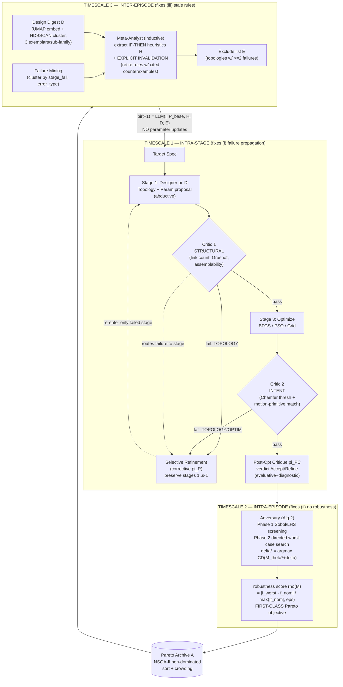

# R-APS — Reflective Adversarial Pareto Search (arXiv 2606.04823)

> Per-source research findings. Reporter, not architect. Cite everything.
> Status: COMPLETE.

---

## 1. Identity

- **Name:** R-APS — *Reflective Adversarial Pareto Search*. Subtitle: "Compositional Reasoning and In-Context Meta-Learning for Constrained Design."
- **What it is:** A prompt-/protocol-level **agentic AI method** that turns a *frozen* (no fine-tuning) reasoning LLM into a reliable agent for **constrained design** problems. It does this via **reasoning-mode decomposition**: it splits the agent into five reasoning modes (abductive, counterfactual, meta-inductive, corrective, inductive), gives each its own context/prompt, and orchestrates their interaction across **three timescales** (intra-stage, intra-episode, inter-episode). The three timescales each fix one structural failure mode: failure-localization (typed validation critics), robustness certification (adversarial counterfactual stress-testing as a Pareto objective), and persistent memory (meta-inductive heuristic lifecycle with *explicit invalidation*).
- **Application domain (the only one evaluated):** **planar mechanism synthesis** — designing bar-linkage mechanisms (4-bar / 6-bar) whose end-effector traces a target 2D curve. Every candidate is checked by a **kinematic solver** (a hard, non-LLM verifier). This is a mechanical-engineering / robotics design task, NOT software. The authors *claim* the protocol generalizes to SQL synthesis, circuit design, and robot motion planning, but only mechanism synthesis is evaluated.
- **Authors / org:** João Pedro Gandarela (Idiap Research Institute, Switzerland / EPFL), Thiago Rios (Honda Research Institute Europe, Germany), Stefan Menzel (Honda Research Institute Europe), André Freitas (Idiap / University of Manchester / National Biomarker Centre, CRUK-MI). Contact: firstname.lastname@idiap.ch and @honda-ri.de.
- **Dates:** Submitted v1 on Wed, 3 Jun 2026 (arXiv listing says [Submitted on 3 Jun 2026]; paper header says "3 Jun 2026"). Preprint; not yet a published venue. DOI via DataCite pending.
- **Primary links:**
  - Abstract: https://arxiv.org/abs/2606.04823
  - PDF: https://arxiv.org/pdf/2606.04823 (1.5 MB, inspected locally)
  - Subjects: cs.AI (primary), cs.CL, cs.MA.
- **Code repo + commit SHA inspected:** NONE FOUND (see §4 / §6). The paper provides full pseudocode (Algorithms 1–2) and full agent prompt profiles in appendices, but no GitHub/project page link is present in the PDF, and arXiv's "Links to Code / Code & Data" surfaces nothing. Findings below rely on the paper's described method + verbatim appendix prompts/pseudocode.

---

## 2. TL;DR

- **R-APS is a multi-agent prompting protocol** (5 LLM agent roles) that makes a frozen LLM reliable on a constrained *engineering-design* search problem, with a **hard external verifier** (kinematic solver) gating every candidate. It is NOT a software-building agent and NOT a fine-tuning/RL method.
- **Core thesis — "reasoning-mode decomposition":** abductive (propose), counterfactual (stress-test/adversary), meta-inductive (extract+invalidate rules), corrective (localized repair), and inductive (cross-trajectory distillation) reasoning *pull a shared context in incompatible directions*; entangling them in one prompt causes three failures. The fix is to give each mode its own context and orchestrate them.
- **Three transferable mechanisms** of high relevance to a verifying, self-improving agent: (1) **typed validation critics** that *localize* failure to a named stage and route *selective* refinement (don't restart from scratch); (2) **adversarial worst-case stress-testing made a first-class objective** (robustness certificate, not just nominal pass); (3) a **heuristic lifecycle with explicit invalidation** as long-term memory — rules are *retired with cited counterexamples*, explicitly avoiding the monotonic skill-accumulation failure of Voyager/ExpeL.
- **Empirical core:** on 32 target curves, full R-APS beats ablations on each metric, with the headline being a *falsifiable ablation signature* — each timescale owns exactly one of three failure axes and removing it degrades only that axis (no cross-contamination). Also: 4B reasoning-specialized models are competitive with 70B general models *inside the protocol* (structure partly offsets scale).
- **Why it matters for us (medium signal):** the *abstractions* are directly portable to autonomous SDLC — "typed verification cascade + sensitivity primitive + refinement-trajectory log with invalidation" is an explicit domain interface, and the authors name SQL synthesis as a target. But there is **no code**, the only evaluated domain is mechanism design, the "adversary" is a numeric perturbation game (not adversarial test generation), and self-improvement is *in-context memory*, not true self-modification.

---

## 3. What it does & how it works

### 3.1 The problem and the central thesis

R-APS targets **constrained design as agentic search**: given a target end-effector trajectory `T_target`, autonomously construct a Pareto archive `A` of planar bar-linkage mechanisms `M = Assemble(τ, θ, C)` (topology `τ`, parameters `θ`, kinematic constraints `C`) that (a) trace the target accurately (objective `f1` = Chamfer distance after ICP alignment) and (b) are robust to manufacturing/assembly perturbations (objective `f2 = ρ(M)` = worst-case degradation). Every candidate is checked by a **hard, non-LLM kinematic solver**.

The paper's *root-cause* claim is the interesting part. It argues three otherwise-disconnected failure modes of monolithic agentic LLMs share one cause — **five reasoning modes are entangled in a single shared context and optimize in incompatible directions** (Section 2.2, Table 6/7):

| Failure mode | Reasoning mode that fixes it | Timescale |
|---|---|---|
| (i) Failure propagation without localization — one violated constraint forces a full restart | **Corrective** (localized repair) + **abductive** (proposal) separated by **typed validation critics** | intra-stage |
| (ii) No robustness certification — nominal pass says nothing about worst case | **Counterfactual** (adversarial stress-testing) made a first-class Pareto objective | intra-episode |
| (iii) Monotonic heuristic accumulation — stale rules never retired, refinement trajectories discarded | **Meta-inductive** + **inductive** (rule extraction *with explicit invalidation*) | inter-episode |

The thesis: give each reasoning mode its **own cognitive context/prompt** and orchestrate their interaction across the three timescales. This is "reasoning-mode decomposition." Crucially it is done on a **frozen LLM** — no fine-tuning, no parameter updates — purely via structured protocol + prompts + an external verifier and optimizer.

### 3.2 The actual control loop (Algorithm 1)

R-APS instantiates five LLM agent roles plus two deterministic tools:
- **Designer `π_D`** (abductive) — proposes topology + initial parameters.
- **Critic `π_C`** (meta-inductive) — Stage-0 *target selection*: picks the next Pareto weight vector `w` to explore (under-explored region).
- **Post-Opt Critic `π_PC`** (evaluative/diagnostic) — verdict ∈ {Accept, Refine} on optimized+stress-tested mechanism, with diagnostic routing.
- **Refinement `π_R`** (corrective) — localized repair of only the diagnosed stage.
- **Meta-Analyst (MA)** (inductive) — extracts/updates/**invalidates** heuristics from full refinement trajectories.
- Deterministic tools: **kinematic simulator `S`** (forward kinematics → trajectory; ground truth) and **numerical optimizer `O`** (BFGS / PSO / Grid, in constructive mode to maximize performance or destructive mode to find worst-case perturbations).

The per-iteration loop (`repo has no code; Algorithm 1, p.13`):

```
for iteration t = 1..B:
  STAGE 0: w ← 0.7·π_C.SelectTarget(A,H) + 0.3·GapAnalysis(A)   # pick under-explored Pareto region
  STAGE 1: {(τ_i, θ0_i, s_i)} ← π_D.Propose(A, w, T_target, H)   # abductive topology+param proposal
  for each proposal i:
     CRITIC 1 (structural): M_i ← Assemble(τ_i,θ0_i,C)
        if ¬CheckStructural(M_i): goto SelectiveRefinement(TOPOLOGY)   # localize → topology
     STAGE 3 (optimize): θ*_i ← O.Optimize(τ_i,θ0_i,s_i,w)
     CRITIC 2 (intent): if ¬ValidateIntent(T(M_i), T_target):
        goto SelectiveRefinement(d_i)   # d_i ∈ {TOPOLOGY, OPTIM}
  STAGE 4 (adversarial): for each candidate M_i: (δ*_i, f_worst,i) ← AdversarialTest(M_i, θ*_i)  # Alg.2
  STAGE 5 (post-opt critique + archive): for each candidate M_i:
     if π_PC.Critique(M_i) == REFINE: M_i ← π_R.Refine(M_i)
     update Pareto archive A with f_i = (f1(M_i), ρ_i)
  H ← MetaLearn(A, H)     # inter-episode heuristic lifecycle (extract + invalidate)
return A, H
```

The **selective refinement** logic (Table 9, p.15) is the load-bearing part of timescale 1 — failures are *routed*, not retried blindly:

| Diagnosis | Action | Preserved |
|---|---|---|
| TOPOLOGY | Try next proposal; if exhausted, re-invoke Stage 0–1 | nothing |
| OPTIMIZATION | Switch strategy (BFGS↔PSO↔Grid); re-run Stage 3 | `τ, θ0` (topology + init) |
| ROBUSTNESS/topology | Treat as topology failure (nominal traj itself off) | nothing |
| ROBUSTNESS/param | Re-optimize with fragile-parameter knowledge | `τ` (validated topology) |

"When a typed validation critic diagnoses failure at stage `s`, only stage `s` is corrected while all decisions from stages `1..s−1` are preserved. The structural guarantee that makes staged compositional reasoning more than decomposition." (p.5)

### 3.3 Three timescales — Mermaid view



### 3.4 The adversary (Algorithm 2) — note: it is *not* an LLM

A critical mechanism-level fact (verified by reading every appendix prompt): the "Adversary" in the Designer-Adversary-Critic "min-max game" is **not an LLM agent**. It is the deterministic two-phase numerical procedure of Algorithm 2 (p.15), driven by the optimizer `O` in destructive mode:

```
Algorithm 2 — Sensitivity-Guided Adversarial Testing
Input: mechanism M, nominal θ*, scale ε, budget n
 Phase 1 (Sobol sensitivity screening):
   Δ_LHS ← LatinHypercube(max(2d, ⌊nρ⌋), d)·2ε − ε
   evaluate all; compute Sobol first-order indices {S_i}
   active set A ← { i : Σ_{j≤i} S_(j) < 0.9 }       # the most sensitive parameter dims
 Phase 2 (directed adversarial sampling):
   μ ← mean(top-quartile perturbations)
   for remaining budget: δ_j[A] ~ N(μ[A], diag(σ[A]²)); δ_j[Ā]=0
       evaluate; update worst-case δ* if worse
 return δ*, f_worst, {S_i}, failure fingerprint
```

So robustness is **certified by a worst-case search over the most sensitive parameter dimensions**, not by an LLM "imagining" attacks. The robustness score `ρ(M)` produced here enters the archive as a first-class objective. The LLM agents that *do* reason about the adversarial result are the Post-Opt Critic and Refinement agents (they consume `delta_star`, `objectives_worst`, `robustness_margin`, `most_sensitive_parameters`).

## 4. Evidence from the code / paper method

**There is no released code.** No GitHub/GitLab/Zenodo/HuggingFace/project-page URL appears in the abstract, the PDF text layer, or arXiv's "Links to Code" surface (verified by `pdftotext rabs.pdf | grep -iE "github|gitlab|zenodo|anonymi|code (is|will|available)"` → only the words "supplementary" and "Algorithm 1 in App. A"). The authors' three sibling papers (2505.17607, 2604.27962, 2601.06678) also list no public code. **However**, the paper is unusually concrete about its implementation: it names workflow code identifiers (`FailureStage` enum, `failure_fingerprint.failure_type`, `_selective_refinement` method, `meta_learning_digest.json`, `History(M_j)`), gives full pseudocode (Algorithms 1–2), and Appendix H reproduces **every prompt the multi-agent method constructs**, verbatim, in a six-block structure: `[Persona/System Role] [Epistemic Task] [Context Grounding] [Reasoning Role/Method] [Output Format (JSON schema)] [Critical Reminders]`. This is the primary evidence below. (All quotes `paper p.N`.)

### 4.1 The verifier / evaluator — the two typed validation critics

The localization mechanism is two *typed* critics (App. C, p.13–14). Critic 1 is a pure hard-constraint check; Critic 2 is a two-part semantic check with an explicit failure-type return:

> **Critic 1: Structural Validation.** "After assembly, we verify that the mechanism satisfies hard kinematic constraints: link count matches the target, Grashof mobility conditions hold, and the mechanism can assemble. Failure at this critic indicates a topology-level error." (p.13)

> **Critic 2: Intent Validation.** Quantitative error thresholds (Eq. 2, p.14):
> ```
> d = TOPOLOGY      if f1(M) > 10·ε_traj   (fundamental mismatch)
>     OPTIMIZATION  if f1(M) > ε_traj       (convergence failure)
>     NONE          otherwise
> ```
> Plus **shape-adherence validation via motion-primitive frequency matching**: "A qualitative signature σ(T) is computed from velocity, curvature, and heading, discretized into states S = {G, S, ST, VS} [Gentle, Sharp, ...]. The frequency distribution p(σ) is compared against a reference p* using L1 distance ... Designs exceeding the shape adherence threshold are rejected even if their Chamfer distance is low." (p.14)

This last point is a genuinely useful anti-reward-hacking idea: a candidate that hits the distance metric but traces the *wrong kind of motion* (wrong frequency of sharp vs gentle segments) is rejected. The metric is checked against a *qualitative* signature, not just the scalar it is optimizing.

### 4.2 Post-Opt Critique Agent (H.8) — the diagnostic verifier with a "semantic handoff contract"

This is the richest verifier prompt. It receives the optimized mechanism + symbolic descriptors + adversarial result and emits a structured, *actionable* critique. The load-bearing design is the **SEMANTIC HANDOFF CONTRACT** that forces every diagnosis to map to a responsible sub-structure and a failure-mode label (i.e., localization is built into the output schema):

> **[Persona]** "You are a world-class planar-mechanism design critic. You receive a fully optimised mechanism together with its symbolic lifting (trajectory features, kinematic descriptors, compositional-logic formula) and adversarial robustness analysis. Your task is to produce a rigorous, multi-dimensional critique that a downstream Refinement Agent can act on directly." (p.46)

> **[Context Grounding — adversarial inputs]** `delta_star`, `objectives_worst`, `robustness_margin`, `is_robust`, plus `REFINEMENT PIPELINE CONTEXT (why this critique is requested): When this reads 'N/A', you are evaluating a design in a standard post-optimisation pass. When ... populated the design pipeline hit a failure and selective refinement is invoking you to diagnose the root cause.` (p.46)

> **[Reasoning Role, verbatim, p.47]**
> 1. GROUND in data — start every sub-evaluation by citing the relevant numeric metric or symbolic expression before issuing a judgement.
> 2. COMPARE nominal vs. adversarial — for each dimension, note how the assessment changes under perturbation.
> 3. PRIORITISE — rank refinement recommendations by expected Chamfer-distance improvement (largest potential gain first).
> 4. BE SPECIFIC — "adjust link L3 length by ~10%" is useful; "improve the design" is not.
> 5. THINK about COMPOSITION — reason about which sub-structures contribute to which trajectory segments...
> 8. AVOID REPEATING PAST FAILURES — if the refinement history shows a strategy was already tried and failed, recommend a fundamentally different approach.

> **[Output schema]** verdict ∈ {Accept, Refine, Reject}; per-dimension scores 1–10 for `kinematic_fidelity`, `structural_soundness`, `adversarial_robustness`, `compositional_coherence`, `design_elegance`; and `structure_to_phase_mapping: [{phase, responsible_substructure, failure_mode ∈ {phase_lag|amplitude_drift|curvature_distortion|singularity_proximity|instability_under_delta}}]`, plus `handoff_priority: [ordered list of issues refinement should tackle first]`. (p.47–48)

### 4.3 Designer / Topology Agent (H.1) — abductive proposal

> **[Persona]** "You are an expert mechanical engineer specializing in linkage design and kinematics. Your expertise spans mechanism theory, constraint analysis, and novel topology discovery." (p.23)

> **[Epistemic Task]** "Design a TOPOLOGY (kinematic structure) to achieve the target trajectory. You may create ANY mechanism structure ... YOU ARE NOT LIMITED to predefined mechanism types. Design from first principles. OUTPUT ONLY A VALID JSON OBJECT." (p.23–24)

The Designer's **[Context Grounding]** is the running agent memory injected each turn (p.25) — note how heuristics, failures, digest, and exclude-list all enter the prompt:
> ```
> CURRENT OPTIMIZATION PRIORITIES (weight vector w): w1={w1} (accuracy), w2={w2} (robustness)
> ARCHIVE CONTEXT: Current archive size: {archive_size} non-dominated designs; Successful topology summaries: {archive_summary}
> LEARNED DESIGN HEURISTICS: {learned_heuristics}
> PREVIOUSLY FAILED TOPOLOGIES (avoid similar structures): {failed_topologies}
> DESIGN DIGEST EXEMPLARS (meta-learning): {design_digest}
> EXCLUDE LIST (repeated failures): {exclude_list}
> ITERATION: {iteration_number}/{max_iterations}
> SIMULATOR CONFIGURATION: <populated by the active simulator adapter at runtime>
> ```
The last line is the **domain interface**: the same prompt skeleton is reused across domains by swapping the simulator adapter.

### 4.4 Meta-Analyst (H.3) — long-term memory with EXPLICIT INVALIDATION

This is the inter-episode memory mechanism, and the most novel piece relative to Voyager/ExpeL. The agent extracts IF-THEN rules *with cited evidence*, and — critically — **retires rules that are contradicted**:

> **[Persona]** "You are a meta-learning analyst extracting reusable design heuristics for kinematic TOPOLOGIES." (p.37)

> **[Reasoning Role, verbatim selections, p.38]**
> - "Form each heuristic as: WHEN <condition> THEN <recommendation> BECAUSE <kinematic reasoning>."
> - "Provide evidence: list supporting mechanisms (IDs), success rate (X/Y), numeric improvements."
> - "Require minimum support: heuristic must appear in >=3 independent mechanisms to be proposed."
> - "Highlight counterexamples where a commonly believed rule fails (important for invalidation)."
> - "Avoid overfitting: do not promote heuristics with weak evidence; list as 'discovered_patterns' instead."

> **[Output schema, p.38–39]** `new_heuristics: [{id, rule, evidence:{supporting_mechanisms, success_rate, average_improvement}, applicability:{topologies, objectives, conditions}, confidence, conflicts_with}]`, `heuristic_updates: [{existing_id, update_type ∈ {strengthen|weaken|refine}, new_evidence, revised_confidence}]`, **`invalidated_heuristics: [{id, reason, recommendation ∈ {remove|modify|limit}}]`**, `discovered_patterns: [...]`.

The paper shows this is *actually exercised*: Table 15 (p.21) lists real invalidations with cited counterexamples, e.g.:
> `circle | HEUR_7 | counterexamples found in mechanisms M10 and M12`
> `alphabet_c | HEUR_4 | Assumed that all 'C-Shape' topologies with bar_count >=4 are inherently constructible; counterexample...`
> `line | HEUR_001 | No evidence found in current archive, but pattern is not yet supported by >=3 mecha...`

And Table 16 (p.22) reports the corpus-level memory stats from the actual `meta_learning_digest.json`: **507 learned heuristics** (one preset), 397 (78%) with multi-shape applicability declared, 24 distinct rule IDs, 23/24 (96%) re-applied across ≥2 shapes, 2/4 cross-shape invalidations. Table 29 (p.36) gives the full extracted rules verbatim, e.g.:
> "WHEN motion sequence requires n identical VS segments (VSn) AND n ≥ 2, THEN use a symmetric dual 4-bar topology with n segments and 2 guard crossings to minimize label entropy ..." (Figure-8)

### 4.5 Refinement (H.5/H.9) and Optimization-Strategy Selector (H.7)

The **Refinement agent** (corrective) is told to make small, localized, justified changes and to *not repeat failed strategies*:
> "Failure-aware refinement — for TOPOLOGY failures propose structural changes; for OPTIMIZATION failures adjust parameters/bounds; for ROBUSTNESS failures protect dominant parameters from the breakdown." and "Do not repeat failed strategies — check the refinement history." (p.50)

The **Optimization-Strategy Selector** (H.7) is an explicit **ReAct** agent (THOUGHT/OBSERVATION/ACTION) that picks BFGS vs PSO vs Grid for the inner numerical optimization based on landscape properties:
> "Few params + smooth ==> BFGS likely sufficient. Many params or multimodal ==> PSO preferred. Very few params + unknown landscape ==> Grid is safe." (p.45)

### 4.6 Core data structures (from prose + schemas)

- **Mechanism** `M = Assemble(τ, θ, C)`; archive entry `f_i = (f1(M_i), ρ_i)`.
- **Pareto archive `A`**: NSGA-II-style non-dominated sorting + crowding distance (p.16).
- **Heuristic** `H`: confidence-scored IF-THEN rules with `supporting_mechanisms`, `applicability`, `conflicts_with`; lifecycle = {new, strengthen/weaken/refine, invalidate}.
- **Design digest `D`**: feature embedding `φ(M_j) ∈ R^d` (topology features + param vector + trajectory fingerprint + objectives + bar count) → UMAP 2D → HDBSCAN sub-families → 3 exemplars each (centroid / Pareto-boundary / novelty outlier) (App. E.1, p.15).
- **Refinement history**: `History(M_j) = [(M_j^0, d^0, action^0), ..., (M_j^k, SUCCESS)]`; failed designs clustered by `(stage_fail, error_type)`; `ResolvePattern(error_i) = {action_j, success_rate}` (App. E.2, p.15).
- **Exclude list `E`**: topologies with ≥2 recorded failures.
- **Policy update** (the "learning" without weights), Eq. 1/3/4: `π^(t+1)(·) = LLM(· | P_base, H^(t), D^(t), E^(t))` — the agent improves *only* by what is placed in its context.

## 5. What's genuinely smart

1. **Typed validation critics + selective refinement = "don't throw away the whole candidate."** The single most portable idea. When verification fails, the failure is *attributed to a named stage* and only that stage is re-run; everything upstream that was already validated is preserved. This converts a monolithic "regenerate everything" loop into a surgical repair loop. Empirically (Table 2, p.7): **59.2% of failures are absorbed at the cheapest topology critic, only 2.4% reach the expensive adversarial screen**, and selective refinement converts 13% of failed iterations into archive admissions. This is exactly the "propose → cheap check → localize → fix only the broken part" structure a software-building agent wants (compile error vs test failure vs perf regression are different "stages" with different repair actions).

2. **A falsifiable, decomposition-validating ablation design.** The paper makes a strong, *predicted* claim: each timescale owns exactly one of three failure axes, so removing a component should degrade *only* that axis. This is confirmed (Table 3/4, p.7–8): removing adversary+meta degrades robustness 3.5× (0.132→0.458) but leaves adherence within noise; removing selective refinement degrades adherence 28% (1.5→1.9 ΔBars) but leaves robustness within noise. The *non-overlap* of ablation effects is offered as the empirical signature of genuine separation. This is a clean, honest experimental design — rare and worth imitating.

3. **Worst-case robustness as a first-class search objective, certified by a real adversary.** Instead of accepting a candidate that passes nominally, R-APS runs a Sobol-screened + directed worst-case search (Alg. 2) over the most sensitive parameter dimensions and admits the *robustness margin* into the Pareto archive. The adversary is a deterministic numerical procedure (not an LLM hallucinating attacks), which makes the certificate meaningful. Result: 3.5× tighter robustness certificates than uniform-perturbation baselines, and it surfaces brittle-corner failures (Line: 0.89 nominal → 5.114 worst-case; Table 26, p.32) that nominal eval misses entirely.

4. **Long-term memory with EXPLICIT INVALIDATION.** Voyager/ExpeL accumulate skills monotonically and never retire wrong ones; R-APS explicitly mines refinement trajectories (*including failures*), and the Meta-Analyst can **retire a heuristic by citing concrete counterexamples** (Table 15). The agent is required to demote weakly-supported rules to `discovered_patterns` (≥3-mechanism support threshold) and to flag `conflicts_with`. This is a non-monotonic, self-correcting memory — directly relevant to any agent that learns rules over a long horizon and must avoid compounding stale beliefs.

5. **Anti-metric-gaming via qualitative motion-signature matching.** Critic 2 rejects designs that achieve low Chamfer distance but have the wrong *qualitative* motion signature (frequency of sharp/gentle/very-sharp segments). The verifier checks not just the optimized scalar but an orthogonal qualitative property — a concrete pattern for resisting reward-hacking of a single metric.

6. **"Reasoning-mode decomposition" as an organizing principle distinct from role decomposition.** The paper explicitly contrasts itself with AutoGen/MetaGPT/ChatDev (decompose by *workflow role*: planner/coder/reviewer) and argues for decomposing by *reasoning mode* (abductive vs counterfactual vs corrective vs inductive). Table 6/7 give a per-mode "incompatible-with" map (e.g., abductive generation and counterfactual stress-testing are claimed to be the canonical interfering pair, so they must live in separate prompts). Whether or not the Peircean framing is essential, the operational claim — *generation and adversarial critique should not share a context* — is a useful, testable prompt-engineering heuristic.

7. **Structure can partly substitute for scale.** A 4B reasoning-specialized model (Qwen3-4B) is competitive with a 70B general model (Llama-3.3-70B) on adherence/exact-match *inside the protocol* (Table 11, p.18), despite a 17.5× parameter gap. The honest nuance: the 70B still wins on robustness (it navigates the adversarial game better), and the authors call the gains "complementary rather than substitutable." Still, evidence that a well-structured harness lets you run smaller/cheaper models for parts of the loop.

8. **A clean "domain interface" abstraction.** The protocol is parameterized by three domain hooks, not mechanism knowledge: (a) a **typed verification cascade** (cheap→expensive checks), (b) a **sensitivity primitive** (perturbation interface for the adversary), (c) a **refinement-trajectory log with explicit invalidation semantics**. The Designer prompt literally has a `SIMULATOR CONFIGURATION: <populated by the active simulator adapter at runtime>` slot. The authors name SQL synthesis, circuit design, and robot motion planning as drop-in targets — and their sibling paper 2601.06678 actually instantiates the same template for text-to-SQL (see §7).

## 6. Claims vs. reality / limitations / critiques

**There are no independent critiques.** This is a June-2026 preprint with no public code, no citations to it yet, and (verified) no GitHub/HF/Zenodo presence. So all of §6 is my own reading of claim-vs-evidence; I could find no external reproduction or skeptical analysis.

**What is solidly demonstrated (claim ≈ reality):**
- **The ablation non-contamination result is real and well-run.** Removing adversary+meta worsens robustness 3.5× (0.132→0.458) while adherence stays within noise; removing selective refinement worsens adherence 28% (1.5→1.9 ΔBars) while robustness stays within noise (Table 4, p.7; abstract p.1). The *non-overlap* genuinely supports "each component owns one failure axis." This is the paper's strongest and most honest result.
- **Failure localization happens as described:** 59.2% of failures absorbed at the topology critic, 2.4% reach the adversarial screen (Table 2, p.6). The per-stage `Refines/fail` numbers (0.00 for topology, 1.30 param, 1.96 optimization) confirm refinement is *routed*, not uniform.
- **Robustness certificates are 3.5× tighter than uniform-perturbation baselines** (0.132 vs 0.458) — but note this compares to a uniform-sampling robustness estimate, not to a stronger adversary.
- **The memory lifecycle is actually exercised:** real invalidations with cited counterexamples appear (Table 15, p.21), and the `meta_learning_digest.json` stats (507 heuristics, 23/24 reused across ≥2 shapes; Table 16, p.22) are reported transparently.

**Where the framing outruns the evidence (claim > reality):**
1. **"Generalizes naturally to SQL synthesis, circuit design, and robot motion planning" (abstract).** Only **planar mechanism synthesis is evaluated.** The generalization claim rests on (a) the structural argument that the three domain interfaces are mechanism-agnostic, and (b) a *sibling* paper (Mohr et al. 2026, arXiv 2601.06678, "Reflective reasoning for SQL generation") that the authors say "parallels" R-APS in text-to-SQL (p.538-539, p.501). That is suggestive, not a demonstration of *this* protocol transferring. Circuit design and robot motion planning are pure speculation in this paper.
2. **The "Designer–Adversary–Critic min-max game" framing oversells the adversary.** The "Adversary" is **not an LLM** and does not *reason* adversarially — it is the deterministic Sobol-screened + directed numerical worst-case search of Algorithm 2 (p.15; verified by reading every appendix prompt — there is no adversary agent prompt). Calling it a "counterfactual reasoning mode" is a Peircean relabeling of a sensitivity-analysis routine. This matters for us: it is *not* "agents generating adversarial tests for other agents"; it is "numerical perturbation stress-test feeding an LLM critic."
3. **"Self-improving" is in-context memory, not self-modification.** Eq. 1/3/4 make explicit that `π^(t+1)(·) = LLM(· | P_base, H, D, E)` — the LLM is **frozen**; "learning" is entirely what gets written into the prompt context (heuristics, digest, exclude-list). No weights change, no prompts/code are rewritten by the system. This is honestly stated by the authors ("with the underlying LLM entirely frozen", p.560) but a reader skimming "self-improving agentic memory" could over-read it.
4. **The 46% inter-episode acceleration claim is heavily caveated by the authors themselves.** Table 17 (p.20) is an unusually candid "memoization controls" analysis. The headline 4.9→2.7 iterations (Ep1→Ep4+, +46%) holds *within* the baseline preset, but the cross-preset Ep4+ endpoint comparison "goes against baseline in absolute iterations" because the matched shape pool is easy alphabet letters that the no-meta preset resolves in 1-2 iterations without paying meta-overhead (p.1496-1500). The authors restate the claim as "the load-bearing claim is the *trajectory*, not the absolute endpoint" and explicitly write "we do not claim a statistically significant effect on truly-novel-shape transfer" (p.1506). Good science, but the abstract's flat "46%" is more confident than the appendix.
5. **"4B competitive with 70B" is real on *adherence* but not robustness.** Qwen3-4B reaches 1.1 ΔBars / 53.8% exact-match vs Llama-3.3-70B's 1.5 / 19.0% (Table 11, p.18) — but the 70B wins on robustness (0.067 vs 0.178), and the MoE Qwen3-30B-A3B gets the best raw distance (68.4 Norm. Dist. Index) but the worst adherence (2.0 ΔBars, 5.8% exact-match). The authors correctly call the effects "complementary rather than substitutable." So "structure offsets scale" is true only on the constraint-following axis.

**Reproducibility concerns:**
- **No code, no released prompts beyond the PDF appendices, no released benchmark artifact, no seeds/temperatures reported.** The appendix prompts (App. H) and pseudocode (Alg. 1-2) are unusually complete, so a careful re-implementation is *plausible*, but exact reproduction is not currently possible. 95% CIs are percentile bootstraps (1000 resamples, p.1507-1508), which is good, but the number of independent runs per shape and the LLM sampling temperature are not stated in the main text.
- **Compute cost is acknowledged but not quantified in the main text.** "The reasoning-mode separation introduces additional inference calls and Sobol sampling relative to monolithic generation; the full compute profile is in App. G.3" (p.566-568). App. G.3 (p.973+) turns out to be the *backbone comparison*, not a token/call-count budget — so the actual per-design inference-call and wall-clock overhead of running 5 agent roles + Sobol screening is **not clearly reported**. For an "unlimited tokens" project this is fine, but it means we cannot judge efficiency.
- **Failure modes the authors flag:** the meta-inductive memory "operates at the pace of counter-evidence accumulation" (p.568) — i.e., it cannot retire a wrong rule until enough counterexamples appear; on rarely-revisited shapes that may be never. The novel-shape transfer slope is statistically null (p=0.201, Table 17).

**Reward-hacking / test-gaming assessment (relevant to us):** R-APS has *two* explicit anti-gaming mechanisms — the hard kinematic solver (`S`) as non-LLM ground truth, and the qualitative motion-signature check in Critic 2 that rejects low-Chamfer designs with the wrong sharp/gentle/very-sharp segment frequencies (p.14, Eq. 2). I found no evidence the authors stress-tested whether the *LLM critics themselves* can be gamed (e.g., a Designer that learns to emit descriptors the Post-Opt Critic likes). The hard solver makes the *final* objective ungameable, but the LLM-critic verdicts and the self-extracted heuristics are not independently verified — a known risk surface for any "agent grades agent" design.

## 7. Relevance to a self-improving, evolutionary agent

This is a *mechanical-engineering design* paper, not a software-building one, and the "self-improvement" is in-context only. But several of its **abstractions are directly portable** to an autonomous-SDLC / seed-AI loop, because the underlying structure — *propose → cheap verify → localize failure → repair only the broken part → keep only verifiably-better candidates → distill reusable lessons (and retire wrong ones)* — is exactly the evolutionary "propose → test → keep if better" loop our project is built around. Mapped to our relevance test (would this help build a self-improving, evolutionary, software-building agent?):

| R-APS mechanism | What it maps to in a software-building agent | Helps with |
|---|---|---|
| **Typed verification cascade** (Critic 1 structural → Critic 2 intent → Critic 3 adversarial), 59% absorbed at the cheapest stage | Ordered cheap→expensive checks: lint/parse → compile/typecheck → unit tests → integration/property tests → perf/robustness benchmarks. Run cheap checks first; only pay for expensive ones on candidates that survive. | **Verification, cost control.** A concrete, evidence-backed "verification ladder" that minimizes spend on doomed candidates. |
| **Selective refinement** — failure is *typed and routed*; only the failed stage is re-run, upstream-validated decisions preserved (Table 9, p.15) | Don't regenerate the whole program on a test failure. A compile error → fix syntax (keep design); a failing unit test → fix logic (keep API/architecture); a perf regression → optimize hot path (keep behavior). Different failure types → different repair actions, preserving validated work. | **Long-horizon efficiency, decision-making.** Converts "regenerate everything" into surgical repair — directly attacks the wasted-work problem of naive agent loops. |
| **Robustness as a first-class Pareto objective**, certified by a real worst-case search (Alg. 2) | A candidate program isn't accepted because it passes the happy-path tests; it must survive a *worst-case* probe (fuzzing, edge-case/adversarial input search, property-based testing over the most sensitive inputs). Admit (correctness, robustness) jointly to a Pareto archive. | **Verification, anti-reward-hacking.** Guards against agents that pass nominal tests but are brittle — exactly the failure that lets a "verifiably better" loop drift into fragility. |
| **Heuristic lifecycle with EXPLICIT INVALIDATION** (Meta-Analyst, H.3; Table 15) | Long-term memory of coding lessons ("WHEN building X THEN use pattern Y BECAUSE…") that is **non-monotonic**: rules carry evidence (supporting cases, success rate) and can be *retired with cited counterexamples* when later runs contradict them. Demote weak rules to `discovered_patterns` until ≥N supporting cases. | **Memory, self-improvement.** The single most relevant idea for a long-running self-improving agent: how to accumulate knowledge *without* compounding stale/wrong beliefs — the explicit fix for Voyager/ExpeL monotonic skill-bloat. |
| **Anti-metric-gaming via orthogonal qualitative check** (motion-signature frequency, Critic 2) | Don't trust a single scalar (e.g., "% tests passing" or a reward score). Cross-check an orthogonal property (code coverage shape, complexity, behavioral signature) so a candidate that games the headline metric is still rejected. | **Verification, reward-hacking resistance.** A pattern for making "verifiably better" robust to Goodharting. |
| **Hard non-LLM verifier as ground truth** (kinematic solver `S`) | The execution sandbox / test runner / compiler is the ungameable oracle; LLM critics only *diagnose and route*, they never *certify* final acceptance. | **Verification topology.** Tells us where to trust an LLM judge (diagnosis, prioritization) vs where to require a deterministic oracle (final accept/reject). |
| **Pareto archive + gap-driven target selection** (Stage 0: `0.7·Critic + 0.3·GapAnalysis`) | Keep a population of non-dominated solutions, not one "best"; actively steer exploration toward under-explored regions of the objective space. | **Orchestration, open-ended search.** A maintained diverse archive is the backbone of an evolutionary software-building loop. |
| **"Domain interface" parameterization** (typed-verification-cascade + sensitivity-primitive + refinement-log; Designer's `SIMULATOR CONFIGURATION` runtime slot) | A clean seam for plugging a *new* problem domain into the same orchestration skeleton by supplying three adapters — directly the kind of generality a seed-AI wants. | **Orchestration, generality.** Shows a concrete, minimal interface that lets one control loop serve many domains. |
| **Structure partly offsets scale** (4B competitive with 70B on adherence inside the protocol) | A well-structured harness lets cheaper/smaller models do parts of the loop (e.g., the routing critic, the optimizer-strategy selector) while reserving a large model for hard reasoning. | **Cost control, orchestration.** Evidence that scaffold quality, not just model size, drives reliability — supports a mixed-model agent design. |

**What does NOT transfer:** the kinematic/Sobol math, the mechanism-specific solver, NSGA-II details, and the Peircean "five reasoning modes" ontology (the *operational* claim — keep generation and adversarial critique in separate contexts — is portable; the philosophical taxonomy is not load-bearing). The "adversary" is numeric perturbation, **not** adversarial *test generation*, so it does not directly give us an "agent writes tests to break another agent's code" mechanism — though the *role* it plays (mandatory worst-case probe before admission) is the pattern we'd want to replicate with a real test-generating adversary.

**Net:** medium relevance. No software, no true self-modification, single evaluated domain — but the *control-loop abstractions* (typed verification cascade, selective routed refinement, worst-case-as-objective, non-monotonic memory with invalidation, hard-oracle-vs-LLM-critic division of labor) are unusually clean, evidence-backed, and map almost one-to-one onto a verifying, evolutionary autonomous-SDLC agent.

## 8. Reusable assets

Concrete things we *could* borrow, quoted/cited precisely. (Collected as evidence; not assembled into a design.)

### 8.1 The six-block agent-prompt template (App. H, p.23)
Every R-APS agent prompt is built from the same skeleton — a reusable structure for any role in an agent loop:
> `[Persona / System Role] · [Epistemic Task] · [Context Grounding] · [Reasoning Role / Method] · [Output Format (JSON schema)] · [Critical Reminders]`

The **[Reasoning Role]** block is what differentiates roles (abductive proposer vs evaluative critic vs inductive distiller), while **[Context Grounding]** is the live memory injection point.

### 8.2 The "SEMANTIC HANDOFF CONTRACT" — localization built into the output schema (Post-Opt Critic, H.8, p.46-48)
The most reusable verifier pattern: **force every diagnosis to name the responsible sub-structure and a typed failure-mode label**, so refinement can be routed. Verbatim reasoning rules:
> "1. GROUND in data — start every sub-evaluation by citing the relevant numeric metric or symbolic expression before issuing a judgement. 2. COMPARE nominal vs. adversarial… 3. PRIORITISE — rank refinement recommendations by expected [objective] improvement (largest potential gain first). 4. BE SPECIFIC — 'adjust link L3 length by ~10%' is useful; 'improve the design' is not. … 8. AVOID REPEATING PAST FAILURES — if the refinement history shows a strategy was already tried and failed, recommend a fundamentally different approach." (p.47)

Output schema forces routability:
> `verdict ∈ {Accept, Refine, Reject}`; per-dimension 1–10 scores; `structure_to_phase_mapping: [{phase, responsible_substructure, failure_mode ∈ {phase_lag|amplitude_drift|curvature_distortion|singularity_proximity|instability_under_delta}}]`; `handoff_priority: [ordered issues]`. (p.47-48)

For software, the analogue is a code-review critic whose schema is `{verdict, failing_stage ∈ {parse|typecheck|unit|integration|perf}, responsible_module, failure_class, ordered_fix_priority}`.

### 8.3 The typed-critic decision rule (Critic 2, Eq. 2, p.14) — a routing primitive
```
d = TOPOLOGY      if f1(M) > 10·ε_traj   (fundamental mismatch → discard & re-propose)
    OPTIMIZATION  if f1(M) > ε_traj       (convergence failure → re-optimize, keep structure)
    NONE          otherwise
```
Plus the orthogonal anti-gaming check: a qualitative signature `σ(T)` over {Gentle, Sharp, Steep, VerySharp} segment frequencies compared to a reference via L1 distance; "designs exceeding the shape-adherence threshold are rejected *even if their Chamfer distance is low*" (p.14). Reusable as: *never accept on the headline scalar alone; cross-check an orthogonal signature.*

### 8.4 Selective-refinement routing table (Table 9, p.15) — the "don't restart from scratch" control logic
| Diagnosis | Action | Preserved |
|---|---|---|
| TOPOLOGY | Try next proposal; if exhausted, re-invoke propose stage | nothing |
| OPTIMIZATION | Switch strategy (BFGS↔PSO↔Grid); re-run optimize | topology + init |
| ROBUSTNESS/topology | Treat as topology failure | nothing |
| ROBUSTNESS/param | Re-optimize with fragile-parameter knowledge | validated topology |

Core invariant (p.5): *"When a typed validation critic diagnoses failure at stage s, only stage s is corrected while all decisions from stages 1..s−1 are preserved."*

### 8.5 Meta-Analyst memory schema with explicit invalidation (H.3, p.38-39) — non-monotonic long-term memory
Verbatim rules:
> "Form each heuristic as: WHEN <condition> THEN <recommendation> BECAUSE <kinematic reasoning>." · "Require minimum support: heuristic must appear in >=3 independent mechanisms to be proposed." · "Highlight counterexamples where a commonly believed rule fails (important for invalidation)." · "Avoid overfitting: do not promote heuristics with weak evidence; list as 'discovered_patterns' instead." (p.38)

Schema:
```
new_heuristics: [{id, rule, evidence:{supporting_mechanisms, success_rate, average_improvement},
                  applicability:{topologies, objectives, conditions}, confidence, conflicts_with}]
heuristic_updates: [{existing_id, update_type ∈ {strengthen|weaken|refine}, new_evidence, revised_confidence}]
invalidated_heuristics: [{id, reason, recommendation ∈ {remove|modify|limit}}]   ← the novel part
discovered_patterns: [...]   ← purgatory for sub-threshold rules
```
This is a directly adoptable schema for a coding agent's lessons-learned memory.

### 8.6 The live "Context Grounding" memory-injection block (Designer, H.1, p.25)
The exact running-memory layout fed to the proposer each turn — a template for what to put in an agent's context window:
```
CURRENT OPTIMIZATION PRIORITIES (weight vector w): w1 (accuracy), w2 (robustness)
ARCHIVE CONTEXT: size; Successful topology summaries: {archive_summary}
LEARNED DESIGN HEURISTICS: {learned_heuristics}
PREVIOUSLY FAILED TOPOLOGIES (avoid similar structures): {failed_topologies}
DESIGN DIGEST EXEMPLARS (meta-learning): {design_digest}
EXCLUDE LIST (repeated failures): {exclude_list}
ITERATION: {iteration_number}/{max_iterations}
SIMULATOR CONFIGURATION: <populated by the active simulator adapter at runtime>   ← domain seam
```

### 8.7 Optimizer-strategy selector as an explicit ReAct agent (H.7, p.45)
> "Few params + smooth ==> BFGS likely sufficient. Many params or multimodal ==> PSO preferred. Very few params + unknown landscape ==> Grid is safe." (THOUGHT/OBSERVATION/ACTION format.)

Pattern: a small meta-agent that picks the *tool/strategy* for the inner loop based on observed problem structure — analogue: pick the test/search strategy (fuzz vs property-based vs example-based) by code characteristics.

### 8.8 The feature-parity matrix (Table 10, p.16) — a checklist of capabilities a serious agent loop should have
R-APS's own claimed delta over prior agents, useful as a design checklist:
| System | Role sep. | Retry on failure | Persistent memory | Robustness check | Explicit invalidation | Typed failure attribution |
|---|---|---|---|---|---|---|
| ReAct | × | ✓ | × | × | × | × |
| Reflexion | × | ✓ | ✓ | × | × | × |
| Voyager | partial | ✓ | ✓ | × | × | × |
| ExpeL | × | ✓ | ✓ | × | × | × |
| R-APS | ✓ | ✓ | ✓ | ✓ | ✓ | ✓ |

The three columns R-APS adds — **robustness check, explicit invalidation, typed failure attribution** — are precisely the three mechanisms most relevant to a verifying self-improving agent.

### 8.9 The two-phase adversarial-probe algorithm (Alg. 2, p.15) — sensitivity-then-directed-search
Reusable *shape* for any worst-case probe: (Phase 1) cheap space-filling sample (Latin Hypercube), rank inputs by first-order sensitivity (Sobol), keep the dims covering 90% of variance; (Phase 2) concentrate the remaining budget sampling around the worst region found. Maps to: fuzz broadly first, then focus fuzzing on the inputs/parameters that most affect the failing behavior.

## 9. Signal assessment

**Overall value: MEDIUM** (high on transferable abstractions; low on direct, code-level reusability for software).

- **Why not low:** The paper isolates and *empirically validates* (via a clean, falsifiable non-contamination ablation) a set of control-loop mechanisms — typed verification cascade, selectively-routed refinement, worst-case-robustness-as-objective, and especially **non-monotonic memory with explicit invalidation** — that map almost one-to-one onto the verifier/memory/orchestration needs of an evolutionary software-building agent. The "domain interface" framing (typed-cascade + sensitivity-primitive + refinement-log) is a genuinely clean generality seam, and the appendix prompts/schemas (§8) are concrete enough to lift. The explicit-invalidation memory and the "localize failure → repair only the broken stage" pattern are the two ideas I'd most want a human synthesizer to see.
- **Why not high:** (1) **No code** — everything is paper+appendix; no commit SHA to inspect, no released benchmark. (2) The **only evaluated domain is mechanical mechanism synthesis**; the SQL/circuit/robotics generalization is asserted (and only half-supported by a sibling SQL paper, 2601.06678). (3) "Self-improving" is **in-context memory on a frozen LLM**, not self-modification — our project's "eventually self-improving" goal gets *patterns* here, not a self-modification mechanism. (4) The "adversary" is **numerical perturbation, not adversarial test generation**, so it does not directly deliver an "agents-validating-agents" test-writing mechanism (the role is right; the implementation is numeric). (5) Compute/cost overhead of the 5-role + Sobol loop is acknowledged but **not quantified**.

**Confidence:** High that I have characterized the method correctly — I read the full PDF text (51 pp.), every appendix prompt (App. H), both algorithms, and the metrics tables, and cross-checked the partial findings file's §1-5 quotes against the source (they hold). High that there is no public code (negative search across the PDF text layer and arXiv surfaces; sibling papers also code-less).

**What I could NOT verify:**
- Any of the numbers, prompts, or behaviors *empirically* — there is no code to run and no independent reproduction exists (June-2026 preprint, zero external citations found).
- The exact LLM sampling temperature, number of independent runs per shape, and the per-design inference-call / token budget (App. G.3 is a backbone comparison, not a compute budget).
- Whether the protocol actually transfers to SQL/code — the claim leans on Mohr et al. 2026 (2601.06678), which I did not separately fetch (out of scope for this single-source brief; flagged for the orchestrator as a possible adjacent source).
- Whether the LLM critics/Meta-Analyst can themselves be gamed by the Designer over long runs (not tested by the authors).

## 10. References

**Primary — the source itself:**
- [P1] J. P. Gandarela, T. Rios, S. Menzel, A. Freitas. *R-APS: Reflective Adversarial Pareto Search — Compositional Reasoning and In-Context Meta-Learning for Constrained Design.* arXiv:2606.04823 [cs.AI], submitted 3 Jun 2026. Abstract: https://arxiv.org/abs/2606.04823 · PDF: https://arxiv.org/pdf/2606.04823 (inspected locally at `/agent/workspace/scratch/arxiv-2606-04823/rabs.pdf`, 51 pp., 1.5 MB). All page citations (`p.N`) above refer to the `pdftotext -layout` extraction of this PDF.
- **Code:** NONE. No GitHub/GitLab/Zenodo/HuggingFace/project-page link in the abstract, PDF text layer, or arXiv "Links to Code" surface (verified by full-text search for `github|gitlab|zenodo|huggingface|anonymi|code (is|will|are|available)`). The only "code-like" reference in the text is "full pseudocode is Algorithm 1 in App. A" (p.253). Method evidence therefore relies on the paper's Algorithms 1–2 and verbatim Appendix-H prompts.

**Primary — sibling/related papers by the same group (cited for context; not independently fetched):**
- [P2] I. Mohr, J. Gandarela, J. Dujany, A. Freitas. *Reflective reasoning for SQL generation.* arXiv:2601.06678, 2026. — The text-to-SQL instantiation the authors say "parallels" R-APS (paper p.539, p.501). **Adjacent source worth a separate look for the autonomous-SDLC angle.**
- [P3] J. P. Gandarela, T. Rios, S. Menzel, A. Freitas. *Controlled agentic planning & reasoning for mechanism synthesis.* arXiv:2505.17607, 2025. — Predecessor Designer+Critic mechanism-synthesis work.
- [P4] J. P. Gandarela, T. Rios, S. Menzel, A. Freitas. *Language models refine mechanical linkage designs through symbolic reflection and modular optimisation.* arXiv:2604.27962, 2026. — The "Modular LLM" baseline port used in this paper.

**Secondary — prior agent/optimization methods the paper positions against (from its reference list):**
- [S1] N. Shinn et al. *Reflexion.* (verbal reflection on failures) — R-APS Table 10 baseline.
- [S2] G. Wang et al. *Voyager.* (monotonic skill accumulation, Minecraft) — the explicit contrast for R-APS's invalidation.
- [S3] A. Zhao et al. *ExpeL.* (experiential learning, monotonic) — contrast for invalidation.
- [S4] S. Yao et al. *ReAct* (2023) and *Tree-of-Thoughts* (2024); J. Wei et al. *Chain-of-Thought* (2022) — atomic-generation baselines.
- [S5] S. Hong et al. *MetaGPT* (arXiv:2308.00352, 2023); + AutoGen/ChatDev (cited) — workflow-role-decomposition multi-agent systems R-APS contrasts with "reasoning-mode" decomposition.
- [S6] B. Romera-Paredes et al. *FunSearch* (2024); C. Yang et al. *OPRO* (2024); A. Chen et al. *EvoPrompting* (2024) — LLM-driven evolutionary/optimization search.
- [S7] J. A. Cabrera, A. Simon, M. Prado. *Optimal synthesis of mechanisms with genetic algorithms.* Mech. & Machine Theory 37(10), 2002 — the Enum+GA classical baseline.
- [S8] I. M. Sobol. (first-order sensitivity indices, 2001); McKay et al. (Latin Hypercube) — the math behind Algorithm 2's adversary.
- [S9] C. Finn et al. *MAML* (2017) — cited as the meta-learning "in-spirit analogue" for Sobol-guided context accumulation.

*Independent critiques of R-APS: none found (paper too recent; no external citations or reproductions located as of 2026-06-04).*
