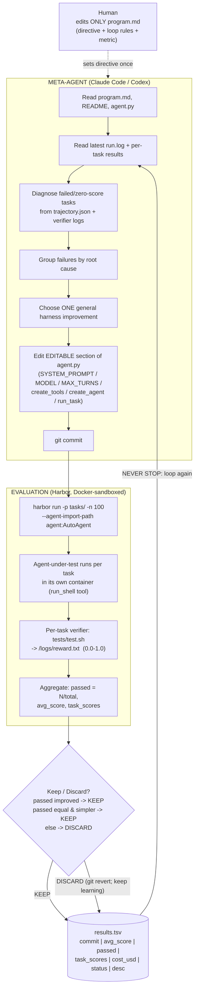

# Findings: `autoagent` (Kevin Gu / Third Layer)

> Per-source research findings doc. **Reporter, not architect.** Cited throughout.
> Code inspected from the GitHub tarball of branch `main`. The repo is tiny
> (10 files, ~480 LOC of Python) but high-visibility (4.4k stars). Be honest:
> the *idea* is more substantial than the *code*, and the headline benchmark
> numbers are unverified.

---

## 1. Identity

- **Name:** `autoagent` (GitHub repo `kevinrgu/autoagent`; GitHub description: *"autonomous harness engineering"*). The README title is **AutoAgent**, tagline *"Autonomous agent engineering."* (Note: several unrelated projects are also called "AutoAgent" — e.g. HKUDS/AutoAgent, the "Fully-Automated Zero-Code LLM Agent Framework." **This is NOT that project.** This is the Third Layer one.)
- **What it is:** A *meta-agent harness* for **autonomous agent engineering**. You give a coding agent (Claude Code / Codex) a directive in `program.md`; it then autonomously edits a single-file agent harness (`agent.py`), runs that harness against a benchmark task suite (in [Harbor](https://github.com/laude-institute/harbor) format), reads the resulting score, and **keeps the edit if the score improved / is simpler, discards it otherwise** — looping overnight without human intervention. It is the propose→test-in-isolation→keep-if-verifiably-better loop applied to *agent-harness engineering* (prompts, tools, orchestration), with the loop itself written in plain-English Markdown rather than code.
- **Explicit lineage:** Directly modeled on **Andrej Karpathy's `autoresearch`** (README opening line: *"Like autoresearch but for agent engineering."* and *"The core idea is the same"*). `autoresearch` applies the loop to *LLM-pretraining research*; `autoagent` applies the identical `program.md`-driven, score-gated, "NEVER STOP" pattern to *building an agent harness*. (See sibling findings doc `research/findings/autoresearch.md` in this canon — much of the prompt structure is near-identical.)
- **Author / org:** **Kevin Gu** (GitHub `kevinrgu`, bio: "thirdlayer.inc", 1 public repo, ~163 followers). Co-founder of **Third Layer** (`thirdlayer.inc`), a **Y Combinator W25** startup building infrastructure for "self-configuring agents"; their commercial product is reportedly *Dex*, a browser AI copilot for knowledge work. Commit is co-authored `Claude Opus 4.6 (1M context)` (i.e. the README/code were themselves written with Claude).
- **Dates:** Repo created **2026-04-02**, last code push **2026-04-03** (single-day code drop; the `updated_at: 2026-06-04` only reflects star/metadata churn, not commits). Independent coverage clustered **2026-04-05 → 2026-04-14**.
- **Primary links:**
  - Repo: https://github.com/kevinrgu/autoagent
  - Harbor (eval framework dependency): https://github.com/laude-institute/harbor
  - Karpathy `autoresearch` (the parent pattern): https://github.com/karpathy/autoresearch
  - Sign-up / org: https://www.thirdlayer.inc , recruiting at hello@thirdlayer.inc
- **Code repo + commit SHA inspected:** `github.com/kevinrgu/autoagent` @ **`eb3f185dc9faac276955b4fe5feb93c8f836b644`** (= `refs/heads/main` HEAD, confirmed via GitHub API; commit dated 2026-04-03T21:11:50Z, message *"update README with branding, structure, and Harbor docs"*). Only the `main` branch is public; the recursive tree is `truncated: false`, so the 10 files below are the **entire** public repo. The README references `tasks/`, `docs/`, and `.agent/` directories that are **gitignored / not committed** — they exist only in the author's private benchmark-specific branches.

**Complete public file list (repo@`eb3f185`):**
```
.dockerignore  .gitignore  .python-version
Dockerfile.base  pyproject.toml
README.md        (6.2 KB)
program.md       (6.9 KB)  -- the meta-agent control loop (human-edited)
agent.py         (8.6 KB, 242 LOC)  -- OpenAI Agents SDK harness, gpt-5
agent-claude.py  (9.7 KB, 234 LOC)  -- Claude Agent SDK harness, haiku
progress.png     (1.3 MB)  -- the empirical hill-climbing chart (key evidence)
```

---

## 2. TL;DR

- **The "agent" is mostly a Markdown control loop, not a framework.** The load-bearing artifact is `program.md` (~215 lines of prose): it *is* the experiment loop, the keep/discard rule, the simplicity criterion, the overfitting guard, and the "NEVER STOP" long-horizon directive. There is **no orchestration code** that drives the meta-loop — a general coding agent (Claude Code) executes the Markdown by reading it. The only Python is the *agent-under-test* harness + a fixed eval adapter.
- **Key structural move: an editable/fixed boundary inside one file.** `agent.py` is split by a literal `# FIXED ADAPTER BOUNDARY` comment. Above it (prompt, model, tools, agent construction, orchestration) is the meta-agent's edit surface; below it (Harbor integration + trajectory serialization to "ATIF") is declared immutable. This is the analog of `autoresearch`'s "edit `train.py`, never touch `prepare.py`."
- **Verification is fully externalized to Harbor task verifiers.** The meta-agent does not invent a metric. It hill-climbs on `passed` (count of tasks whose verifier wrote a passing reward) and `avg_score`, produced by per-task `tests/test.sh` → `reward.txt` in Docker-sandboxed task containers. The harness only *serializes the trajectory*; the *ground truth* lives in the benchmark.
- **It demonstrably hill-climbs (the chart is real); the headline numbers are not independently verified.** `progress.png` shows two genuine rising curves over ~32 experiments — SpreadSheetBench ~39%→~96%, TerminalBench ~27%→~55% — with kept vs. discarded points visible. But the announced **96.5% SpreadsheetBench (#1) / 55.1% TerminalBench (top GPT-5)** come from the author's X post and **did not appear on the official leaderboards** at release (official SpreadsheetBench top was then 34.89%; TerminalBench leader ~81.8%). Treat the *mechanism* as real and the *ranking claims* as unverified.
- **Two model backends shipped (a useful natural experiment).** `agent.py` (OpenAI Agents SDK, `gpt-5`, host-side) and `agent-claude.py` (Claude Agent SDK, `haiku`, run *inside* the container with `claude_code` tool preset). The author publicly noted a *model-pairing effect*: a Claude meta-agent tuning a Claude task-agent seemed to diagnose failures better than tuning a GPT one (unverified, but a concrete hypothesis).
- **Relevance to us: MEDIUM-HIGH as a reference pattern, LOW as reusable code.** It is almost exactly a "seed AI for software" loop — but for *agent harnesses*, and it does **not** self-improve the loop itself (`program.md` is human-edited; the meta-agent edits the *target* harness, not its own instructions). The reusable value is the prompt design, the editable/fixed-boundary pattern, the externalized-verifier discipline, and the explicit anti-overfitting + simplicity rules.

---

## 3. What it does & how it works (mechanism-level)

### 3.1 The three roles

There are three distinct entities, easy to conflate:

1. **The human** — edits *only* `program.md`. Sets the *directive* (what kind of agent to build), the metric definition, the rules of the loop. Never touches the Python.
2. **The meta-agent** — a general coding agent (Claude Code / Codex, "Claude Opus 4.6" per the commit). Reads `program.md`, inspects `agent.py`, runs the benchmark via Harbor, diagnoses failures from trajectories + verifier logs, **edits the editable section of `agent.py`**, commits, reruns, and decides keep/discard. This is the "harness engineer."
3. **The agent-under-test** — the harness defined by `agent.py` (or `agent-claude.py`). It receives one natural-language task instruction, runs in a Docker container with a `run_shell` tool (and whatever tools the meta-agent has added), and must produce the correct artifact/state. Its trajectory is serialized to an "ATIF" JSON; its score is set by the task's verifier.

The crucial conceptual layering: the meta-agent is *engineering an agent*, not *solving tasks*. `program.md` is emphatic: *"Your job is not to solve benchmark tasks directly. Your job is to improve the harness in `agent.py` so the agent gets better at solving tasks on its own."*

### 3.2 Architecture diagram



### 3.3 The core loop (verbatim from `program.md`)

The "Experiment Loop" section is the heart of the system. Quoted exactly (`program.md` L141–154):

> ```
> ## Experiment Loop
> Repeat this process:
> 1. Check the current branch and commit.
> 2. Read the latest `run.log` and recent task-level results.
> 3. Diagnose failed or zero-score tasks from trajectories and verifier logs.
> 4. Group failures by root cause.
> 5. Choose one general harness improvement.
> 6. Edit the harness.
> 7. Commit the change.
> 8. Rebuild and rerun the task suite.
> 9. Record the results in `results.tsv`.
> 10. Decide whether to keep or discard the change.
> ```

And the decision rule (`program.md` L156–162):

> ```
> ## Keep / Discard Rules
> Use these rules strictly:
> - If `passed` improved, keep.
> - If `passed` stayed the same and the harness is simpler, keep.
> - Otherwise, discard.
> ```

### 3.4 What the agent-under-test does (per task)

```mermaid
sequenceDiagram
    participant HB as Harbor runner (host)
    participant AD as AutoAgent adapter (fixed)
    participant SDK as Agent SDK (OpenAI / Claude)
    participant C as Task container (Docker)
    participant V as Verifier (tests/test.sh)

    HB->>AD: run(instruction, environment, context)
    AD->>C: mkdir -p /task; upload instruction.md
    AD->>SDK: Runner.run(agent, instruction, max_turns=30)
    loop up to MAX_TURNS
        SDK->>C: run_shell(command)  (exec, 120s timeout)
        C-->>SDK: stdout / stderr
    end
    SDK-->>AD: RunResult (messages, tool calls, usage)
    AD->>AD: to_atif(result)  -> trajectory.json (ATIF-v1.6)
    HB->>V: run test suite in container
    V-->>HB: reward.txt (0.0-1.0)
    HB-->>AD: aggregate score
```

The metric chain is: **task verifier → reward.txt → Harbor aggregate → `passed`/`avg_score` → meta-agent's keep/discard decision → `results.tsv`.** The harness code never computes correctness; it only runs the agent and serializes what happened.

---

## 4. Evidence from the code

Files inspected (all at `kevinrgu/autoagent@eb3f185`): `agent.py`, `agent-claude.py`, `program.md`, `README.md`, `Dockerfile.base`, `pyproject.toml`, `.gitignore`, `.dockerignore`, `progress.png`.

### 4.1 The editable / fixed boundary in `agent.py`

This is the single most important structural pattern. The OpenAI-SDK harness `agent.py` is literally split by comment banners (`repo@eb3f185:agent.py` L24–31, L76–79):

```python
# ============================================================================
# EDITABLE HARNESS — prompt, tools, agent construction
# ============================================================================

SYSTEM_PROMPT = "You are an agent that executes tasks"
MODEL = "gpt-5"
MAX_TURNS = 30
```
```python
# ============================================================================
# FIXED ADAPTER BOUNDARY: do not modify unless the human explicitly asks.
# Harbor integration and trajectory serialization live here.
# ============================================================================
```

The baseline `SYSTEM_PROMPT` is deliberately *minimal* ("You are an agent that executes tasks") — the whole point is for the meta-agent to grow it. The baseline tool set is a single `run_shell` (`agent.py` L33–50):

```python
def create_tools(environment: BaseEnvironment) -> list[FunctionTool]:
    """Create tools for the agent. Add new tools here."""
    @function_tool
    async def run_shell(command: str) -> str:
        """Run a shell command in the task environment. Returns stdout and stderr."""
        try:
            result = await environment.exec(command=command, timeout_sec=120)
            out = ""
            if result.stdout:
                out += result.stdout
            if result.stderr:
                out += f"\nSTDERR:\n{result.stderr}" if out else f"STDERR:\n{result.stderr}"
            return out or "(no output)"
        except Exception as exc:
            return f"ERROR: {exc}"
    return [run_shell]
```

`create_agent` and `run_task` are the other two editable seams (`agent.py` L53–73): the meta-agent is told it may add handoffs / sub-agents via `agent.as_tool()` and change orchestration in `run_task`. The actual agent is constructed with the OpenAI Agents SDK:

```python
def create_agent(environment: BaseEnvironment) -> Agent:
    tools = create_tools(environment)
    return Agent(name="autoagent", instructions=SYSTEM_PROMPT, tools=tools, model=MODEL)

async def run_task(environment, instruction) -> tuple[object, int]:
    agent = create_agent(environment)
    t0 = time.time()
    result = await Runner.run(agent, input=instruction, max_turns=MAX_TURNS)
    duration_ms = int((time.time() - t0) * 1000)
    return result, duration_ms
```

### 4.2 The fixed adapter = trajectory serialization to "ATIF"

Below the boundary, `to_atif(...)` (`agent.py` L81–191) converts the OpenAI Agents SDK `RunResult` into a structured trajectory dict — **"ATIF-v1.6"** (Agent Trajectory Interchange Format; a Harbor/Laude-Institute schema). It walks `result.new_items` and emits `step` records for `MessageOutputItem`, `ReasoningItem` (captured as `reasoning_content`), and tool-call/tool-output pairs, then attaches `final_metrics` with token usage. The `AutoAgent(BaseAgent)` adapter (L194–239) is what Harbor imports via `--agent-import-path agent:AutoAgent`; it uploads the instruction into `/task/instruction.md`, runs the agent host-side, writes `trajectory.json`, and reports token counts back through `AgentContext`. This is exactly the "do-not-touch boundary" the meta-agent is forbidden to edit — the analog of `autoresearch`'s frozen `evaluate_bpb`.

### 4.3 The Claude variant runs *inside* the container (`agent-claude.py`)

`agent-claude.py` is a second harness backend with a different execution model: instead of running the agent host-side and proxying shell into the container, it **execs `python agent.py` inside the task container** (`agent-claude.py` L113–131):

```python
result = await environment.exec(
    command="cd /app && python agent.py",
    env=env,
    timeout_sec=600,
)
```

Its editable config block (L22–66) exposes the full Claude Agent SDK surface as tunable knobs — and the baseline here is far richer than the gpt-5 one. Notable defaults: `MODEL = "haiku"`, `MAX_TURNS = 30`, `THINKING = {"type": "enabled", "budget_tokens": 10000}`, `TOOLS_PRESET = {"type": "preset", "preset": "claude_code"}`, `permission_mode="bypassPermissions"`, and hooks/subagents/MCP-servers all left as empty extension points (`SUBAGENTS = None`, `EXTERNAL_MCP_SERVERS = {}`). The baseline Claude `SYSTEM_PROMPT` is a full task-completion playbook (L26–46), quoted verbatim in §8.1. It serializes to `ATIF-v1.2` and writes `/logs/agent/trajectory.json` from inside the container. The presence of *two* backends (host-side OpenAI; in-container Claude) is itself evidence the author was A/B-ing model/SDK pairings.

### 4.4 The `program.md` mechanisms (verbatim, the real "code")

Beyond the loop (§3.3), `program.md` encodes several explicit control mechanisms:

**Directive (the goal), L9–20:**
> ```
> ## Directive
> Build a generally capable autonomous coding and terminal agent.
> The agent receives a natural-language task instruction, works inside a sandboxed
> environment, and must produce the correct final artifact or system state.
> Evaluation is done by task-specific verifiers.
> Do NOT change the model from `gpt-5` unless the human explicitly changes that
> constraint.
> ```

**Primary metric, L81–91:**
> ```
> ## Goal
> Maximize the number of passed tasks.
> Use `passed` as the primary metric. Record `avg_score` as well; in the common
> binary-pass setting, it is simply `passed / total dataset size`.
> - more passed tasks wins
> - if passed is equal, simpler wins
> ```

**Simplicity criterion, L92–109** (a tie-breaker that *forces* keeping simpler harnesses at equal score):
> *"If a change achieves the same `passed` result with a simpler harness, you must keep it."* — examples: fewer components, less brittle logic, simpler prompts, cleaner tool interfaces, less code.

**Overfitting rule, L188–197** (the anti-reward-hacking guard):
> ```
> ## Overfitting Rule
> Do not add task-specific hacks, benchmark-specific keyword rules, or hardcoded
> solutions.
> Use this test:
> "If this exact task disappeared, would this still be a worthwhile harness improvement?"
> If the answer is no, it is probably overfitting.
> ```

**Tool strategy (a real design insight), L52–72** — a verbatim argument for why adding specialized tools beats prompt-tuning, including a model-psychology claim:
> *"A single `run_shell` tool forces the agent to write boilerplate from scratch on every call... Specialized tools reduce failure modes by: surfacing structured data instead of raw stdout; providing clear error messages the model can act on; matching the model's name-based priors (models pattern-match tool names before reading descriptions)."* It even suggests a **verification sub-agent** via `agent.as_tool()` that "re-reads the produced output and checks it against the task requirements before the main agent finishes."

**Failure taxonomy, L174–185** — the meta-agent is told to classify failures into: misunderstanding the task, missing capability/tool, weak information gathering, bad execution strategy, missing verification, env/dependency issues, and *"silent failure where the agent thinks it succeeded but the output is wrong"* — then *"Prefer changes that fix a class of failures, not a single task."*

**"NEVER STOP" long-horizon directive, L207–215** (near-identical to `autoresearch`):
> ```
> ## NEVER STOP
> Once the experiment loop begins, do NOT stop to ask whether you should continue.
> Do NOT pause at a "good stopping point." Do NOT ask whether to run another experiment.
> Continue iterating until the human explicitly interrupts you.
> You are autonomous. Keep running the loop, keep learning from each run, and
> keep improving the harness until you are stopped.
> ```

**Discarded-run learning, L164–171:**
> *"Even when a run is discarded, it is still useful. Read the task-by-task changes: which tasks became newly solved, which regressed, which failures revealed missing capabilities... Discarded runs still provide learning signal for the next iteration."*

### 4.5 The experiment ledger schema (`results.tsv`)

The only persistent "memory" across iterations is a TSV lab notebook (`program.md` L122–139), explicitly **gitignored** (`.gitignore` lists `results.tsv`, `run.log`, `jobs/`, and crucially several `tasks*` dirs — `tasks/`, `tasks-archived/`, `tasks-archived-sheets/`, `tasks-sheets-verified/`, `tasks-sheets/`, confirming spreadsheet benchmarks were the active workload). Schema:
```
commit  avg_score  passed  task_scores  cost_usd  status  description
```
where `status ∈ {keep, discard, crash}`. Note: *"`results.tsv` is a run ledger, not necessarily a unique-commit ledger. The same commit may appear multiple times if rerun for variance."* — i.e. explicit acknowledgment of score noise and re-runs for variance.

### 4.6 The empirical evidence: `progress.png`

The repo ships one results artifact, `progress.png` (title: *"AutoAgent Progress: SpreadSheetBench and TerminalBench"*). It is a step/scatter chart, x = Experiment #, y = Score, with two series each showing a **"running best"** line plus **kept** (solid) and **discarded** (faded) points — a direct visualization of hill-climbing:

- **SpreadSheetBench (green):** baseline ≈ **39%** → running-best ≈ **96%** over ~32 experiments. Labeled kept improvements (legible from the chart): *"structured reasoning workflow + ex…"*, *"compute+verify"*, *"write scripts to file + verify f…"*, *"verify w/ data only"*, *"strengthen formula vs value + mand…"*, *"retry with exponential backoff"*, *"bonus verification phase"*, *"reasoning effort high"*, *"parallel…"*, *"duplication+exit"*, *"pre-scan the listing + 50K trunc…"*, *"NO -OUTPUT"*, *"actionable error hints in shell e…"*.
- **TerminalBench (purple):** baseline ≈ **27%** → running-best ≈ **55%**. Labeled: *"detailed prompt + reasoning high +…"*, *"prompt_cache_retention=24h"*, *"truncation+exit"*, *"structured reasoning workflow + ex…"*, *"bonus verification phase r15.7…"*, *"8M tasks, 2vcpu/8G/RGB: output tr…"*, *"added rigid file + write_file tools"*.

These labels are essentially the *changelog of what the meta-agent invented*: adding verification phases, file-writing tools, output truncation, retry/backoff, reasoning-effort tuning, prompt-cache retention. They corroborate that the loop produced *general* harness improvements (verification, tools, robustness), not task-specific hacks — consistent with the overfitting rule. **This chart is the strongest piece of evidence in the repo that the mechanism works.**

### 4.7 Dependencies / runtime

`pyproject.toml`: `openai-agents`, `harbor`, plus `pandas`, `openpyxl`, `numpy` (the latter three pre-installed for spreadsheet tasks). `Dockerfile.base` is a slim `uv` python image that installs deps and copies `agent.py` (it copies `agent.py`, not `agent-claude.py`, so the published base image targets the OpenAI backend). Tasks follow Harbor's format: `task.toml`, `instruction.md`, `tests/test.sh` + `tests/test.py` (deterministic *or* LLM-as-judge), `environment/Dockerfile` (FROM `autoagent-base`), writing a 0.0–1.0 reward.

---

## 5. What's genuinely smart

1. **Programming the *meta-agent*, not the harness — and freezing the verifier.** The human's leverage point is `program.md` (prose), and the *correctness oracle* (Harbor verifiers + the ATIF adapter) is placed behind an explicit immutable boundary. This cleanly separates "what to optimize / how to search" (human, mutable) from "how success is measured" (frozen) from "the thing being optimized" (`agent.py`, machine-mutable). It is the right factoring for any self-improvement loop: **the agent can rewrite the candidate but cannot rewrite its own grader.** This is the same insight as `autoresearch` (`train.py` editable, `evaluate_bpb` frozen), transposed to agents.

2. **Externalized, behavioral verification.** Score = "did the produced artifact/system-state pass an independent test suite," not "did the agent claim success." Combined with the failure taxonomy's call-out of *"silent failure where the agent thinks it succeeded but the output is wrong,"* and `program.md`'s rule *"Verify what the agent actually produced, not what it intended to produce,"* this is a disciplined stance against the single most common agent failure mode. The suggested *verification sub-agent* (`agent.as_tool()` re-reading output before finishing) is a concrete pattern the loop can grow into the harness.

3. **The simplicity tie-breaker as a regularizer.** "Equal `passed` → keep the simpler harness" actively fights the natural drift of self-modifying systems toward ever-more-baroque scaffolds. It is a cheap, legible Occam prior that keeps the search from accreting brittle complexity — and it's enforced as a *hard rule*, not advice.

4. **The overfitting rule with a crisp counterfactual test.** *"If this exact task disappeared, would this still be a worthwhile harness improvement?"* is a one-line, model-legible guard against the loop reward-hacking its own benchmark (the central risk of score-gated self-improvement). It pushes the meta-agent toward *class-of-failure* fixes.

5. **Discarded runs as signal, and variance-aware logging.** The loop treats rejected experiments as information ("which tasks newly solved, which regressed") and the ledger explicitly tolerates re-running the same commit for variance. Both reflect a mature understanding that score-gated search over a noisy stochastic evaluator needs noise handling, not naive greedy acceptance.

6. **The tool-design heuristics.** The argument that specialized tools beat prompt-tuning — *because* they surface structured data, give actionable errors, and exploit the model's name-based priors ("models pattern-match tool names before reading descriptions") — is a genuinely useful, transferable piece of agent-engineering craft, and the `progress.png` labels (file-writing tools, error-hint tools) show the loop actually exploited it.

7. **"NEVER STOP" as an explicit long-horizon mechanism.** The prompt directly removes the model's tendency to stop at "good stopping points" or ask permission to continue. For unattended overnight runs this is a small but load-bearing piece of long-horizon control (shared with `autoresearch`).

---

## 6. Claims vs. reality / limitations / critiques

**(A) What the author claims:** 96.5% on SpreadsheetBench (1st place overall) and 55.1% on TerminalBench (top *GPT-5* score), both achieved by an autonomously-engineered harness, "every other entry human-engineered" (per Gu's X announcement, relayed by multiple outlets).

**(B) What the code actually demonstrates:** A *working hill-climbing loop* (the `progress.png` curves are real and show kept/discarded experiments and a believable changelog of general improvements). The repo does **not** ship the task suites, the `results.tsv`, the run logs, or any leaderboard-submission artifacts — so the *absolute numbers* and *rankings* are not reproducible from the repo.

**(C) Independent critiques / reproducibility concerns:**
- **The headline numbers were not on the official leaderboards at release.** Per Awesome Agents (2026-04-05): as of that date the official SpreadsheetBench leaderboard's top verified entry was **34.89%** (Claude Opus 4.6) and AutoAgent's entry "doesn't appear there yet"; TerminalBench's leader was ForgeCode at **81.8%** and AutoAgent was unlisted. The gap "could mean the run targeted a specific task subset, a benchmark variant, or a prior snapshot... or submissions pending verification. Gu hasn't clarified." → **Treat the rankings as unverified author claims.** (link in §10)
- **Benchmark contamination / subset ambiguity.** The `.gitignore` (`tasks-sheets-verified/`, `tasks-archived-sheets/`, etc.) hints the author curated/verified custom spreadsheet task sets. Without the exact task list it's impossible to know whether "96.5%" is on the canonical SpreadsheetBench split or a subset.
- **Documentation/marketing drift.** Some secondary coverage (e.g. awesomeagents) describes a `python run.py --overnight` entrypoint and a committed `tasks/` directory — **neither exists in the repo.** The real entrypoint is "point a coding agent at the repo and prompt *Read program.md and let's kick off a new experiment!*" Secondary sources should not be trusted on mechanics; the README/code are authoritative.
- **No self-improvement of the loop itself.** Despite "self-optimizing" framing in the press, the *meta-agent's own instructions* (`program.md`) are human-authored and static; the meta-agent improves the *target* harness, not its own search policy. There is no meta-meta loop, no learned proposal distribution, no evolution of `program.md`. (Same scope limit as `autoresearch`.)
- **No cross-run memory beyond a TSV.** "Memory" = `results.tsv` + git history + whatever the coding agent holds in its context window during a session. There is no structured experience store, no embedding of past failures, no retrieval. Long runs rely on the underlying coding agent's context management.
- **Hard dependency on a clean scoring function.** As the critique notes, self-optimization only works where you can write a Harbor verifier that captures quality. For open-ended/production tasks (support, research, lead-gen) "writing a Harbor-format benchmark that actually captures production quality is non-trivial work — and it's entirely on you."
- **Model-pairing constraint (unverified but flagged).** Gu reportedly observed a Claude-meta-tuning-Claude-agent pairing diagnosed failures better than tuning a GPT agent; if real, this complicates cost optimization (can't just use the cheapest meta-agent). No data provided.
- **Maturity.** Single-author, single-day code drop, `main`-only, ~480 LOC, minimal docs beyond the README, referenced `docs/` not committed. It is a *seed/demonstration*, not a maintained framework — its 4.4k stars reflect viral interest in the *idea* (and the autoresearch lineage), not battle-tested software.

**Reward-hacking posture:** The design *anticipates* test-gaming (the overfitting rule + simplicity criterion + "verify what was produced") — but provides no automated enforcement; compliance depends entirely on the meta-agent honoring the prose rules. A sufficiently capable meta-agent under score pressure could still find subset-specific tricks; nothing structurally prevents it.

---

## 7. Relevance to a self-improving, evolutionary, software-building agent

Judged by the one test — *would this help build a self-improving, evolutionary, software-building agent?* — this is **directly on-topic** (it is literally a propose→test→keep-if-better loop that builds software, where the "software" is an agent harness). Specific transferable mechanisms:

- **Editable-candidate / frozen-oracle boundary (verification & control).** The `# FIXED ADAPTER BOUNDARY` pattern — agent may rewrite the candidate, may *not* rewrite the grader — is a clean, copyable safety/integrity invariant for any self-modifying software loop. Helps with: preventing the loop from "improving" by corrupting its own evaluation.
- **Externalized behavioral verification → numeric gate (verification).** Score from independent test suites in sandboxed containers, `passed` as the promotion signal. Helps with: trustworthy "is this candidate verifiably better?" decisions; avoiding agent self-report.
- **Keep/discard + simplicity tie-breaker + variance re-runs (decision-making).** A complete, minimal acceptance policy for a noisy evaluator, including an Occam regularizer and explicit acknowledgment of score noise. Helps with: stable hill-climbing that doesn't accrete complexity or chase noise.
- **Overfitting counterfactual guard (control / anti-reward-hacking).** *"If this task disappeared, would this still be worthwhile?"* Helps with: keeping a self-improving software agent from gaming its own benchmark.
- **Failure taxonomy + "fix a class, not a task" (decision-making / orchestration).** A structured diagnosis schema (incl. "silent success") that steers the proposal step toward generalizable changes. Helps with: higher-yield proposals per iteration.
- **"NEVER STOP" long-horizon directive (long-horizon running).** Concrete prompt language to keep an agent looping unattended overnight without permission-seeking. Helps with: reliable long-horizon autonomy.
- **`results.tsv` experiment ledger schema (memory).** A dead-simple, legible run journal (`commit | avg_score | passed | task_scores | cost_usd | status | desc`) usable as the minimal episodic memory of an evolutionary loop. Helps with: tracking the search, enabling variance re-runs, and human auditability.
- **Tool-design heuristics + verification sub-agent (orchestration).** The "specialized tools > prompt-tuning, and add a self-check sub-agent" pattern is a concrete recipe the *outer* loop can apply to the *inner* software agent. Helps with: what kinds of edits actually move the needle.

**What does NOT transfer / is absent:** no evolutionary *population* (it's single-line hill-climbing, not a DGM-style archive of multiple candidates — contrast `dgm.md`/`alphaevolve.md` in this canon); no learned/automated proposal generation; no meta-learning of the loop; no cross-run structured memory; no diversity/exploration mechanism beyond the coding agent's stochasticity. As an *evolutionary* (population-based, open-ended) system it is weak; as a *greedy verified-improvement* loop it is a clean reference.

---

## 8. Reusable assets (collected as evidence; not assembled into a design)

### 8.1 Prompts (verbatim)

**(a) The entire meta-agent control program** — `program.md` is itself the most reusable asset (the loop, keep/discard rule, simplicity criterion, overfitting rule, failure taxonomy, and "NEVER STOP" are all quoted in §3.3 and §4.4). Source: `repo@eb3f185:program.md`.

**(b) Baseline Claude task-agent system prompt** (`repo@eb3f185:agent-claude.py` L26–46) — a compact, transferable task-completion playbook:
```text
You are a highly capable task-completion agent. You solve tasks by reading instructions,
analyzing the problem, writing and executing code, and producing the required output files.

## Approach
1. Read /task/instruction.md to understand what's required.
2. Explore the working environment — check what files, tools, and libraries are available.
3. Plan your approach, then execute step by step.
4. Write output files to the exact paths specified in the instructions.
5. Verify your output before finishing.

## Key rules
- Use python3 (not python) for running scripts.
- Use Bash to run shell commands, install packages, inspect files.
- For data analysis: pandas, numpy, openpyxl are available.
- For file manipulation: use standard Python or shell tools.
- Always verify output files exist and contain valid content before finishing.
- If a task involves git repos, use git commands directly.
- If a task involves databases, use sqlite3 CLI or Python sqlite3 module.
- If a task involves images, use PIL/Pillow.
- Read error messages carefully and fix issues iteratively.
- Never give up — try multiple approaches if one fails.
```

**(c) The kickoff prompt** (README) — how a human starts the loop: *"Read program.md and let's kick off a new experiment!"*

### 8.2 Harness / scaffold patterns

- **Editable/fixed single-file harness** with literal banner comments delimiting the edit surface (`agent.py` §4.1) — and a parallel pattern in the Claude variant exposing every SDK knob (`agent-claude.py` §4.3: model, thinking budget, tools preset, MCP servers, subagents, hooks, permission mode, file checkpointing as named constants).
- **Two execution topologies** to copy: host-side agent proxying `run_shell` into a container (`agent.py`), vs. agent run *inside* the container via `python agent.py` (`agent-claude.py`).
- **Trajectory serialization to a standard schema** ("ATIF" — `to_atif` / `_trajectory_to_atif`, `agent.py` L81–191, `agent-claude.py` L149–204): converts SDK run results into step records with tool calls, observations, reasoning, and `final_metrics` (tokens, cost, duration, turns). Useful template for logging agent runs uniformly.

### 8.3 Data schemas / evaluation

- **`results.tsv` ledger:** `commit  avg_score  passed  task_scores  cost_usd  status(keep|discard|crash)  description` (`program.md` L126–135).
- **Harbor task layout** (verification methodology, from README): `task.toml` + `instruction.md` + `tests/test.sh` (writes reward) + `tests/test.py` (deterministic *or* LLM-as-judge) + `environment/Dockerfile` + `files/`; reward ∈ [0,1]. This is a concrete, reusable verifier contract.
- **Promotion rule (verbatim):** "passed improved → keep; passed equal & simpler → keep; else discard" (`program.md` L158–162).

### 8.4 Control loop
The 10-step Experiment Loop and the keep/discard rules (§3.3) are directly liftable as the spec for a verified-improvement loop.

---

## 9. Signal assessment

- **Overall value: MEDIUM-HIGH (as a reference pattern); LOW (as reusable production code).**
  - *High* for: a clean, minimal, *working* instance of the exact loop this project cares about (propose→sandboxed-test→keep-if-verifiably-better, run unattended), with several genuinely good control rules (frozen oracle, simplicity tie-breaker, overfitting counterfactual, failure taxonomy, NEVER STOP) that are quotable and transferable. The `progress.png` is concrete evidence the loop produces real, general improvements.
  - *Low* for: code reuse — it's ~480 LOC of thin SDK glue tightly coupled to Harbor + specific SDKs; no population/evolution, no learned proposals, no cross-run memory, no self-improvement of the loop. It does not advance beyond `autoresearch` conceptually; it transposes it to agents.
- **Confidence:**
  - *High* that I've read the entire public codebase and accurately captured the mechanism (only 10 files; full tree confirmed non-truncated; both harnesses and `program.md` read in full).
  - *High* on the architecture, prompts, and verification path (all from primary code).
  - *Medium-low* on the empirical claims — the chart trend is verifiable but the absolute "96.5% / 55.1% #1" figures are author-announced and were not on official leaderboards at release.
- **What I could NOT verify:**
  - The actual benchmark scores/rankings, the exact task subsets used (task suites are gitignored / in private branches), or `results.tsv`.
  - The "Claude-tunes-Claude diagnoses better" model-pairing claim (no data shipped).
  - The contents of the referenced-but-uncommitted `docs/good-harness.md`, `docs/openai-agents-sdk/tools.md`, and any `.agent/` skills.
  - Karpathy's `autoresearch` internals beyond what the sibling findings doc covers (referenced only for lineage).

---

## 10. References

**Primary (code / author):**
- Repo (all code quoted): `github.com/kevinrgu/autoagent` @ `eb3f185dc9faac276955b4fe5feb93c8f836b644` (branch `main`). https://github.com/kevinrgu/autoagent
  - `repo@eb3f185:program.md` — meta-agent control loop (human-edited).
  - `repo@eb3f185:agent.py` — OpenAI Agents SDK harness (gpt-5) + fixed Harbor/ATIF adapter.
  - `repo@eb3f185:agent-claude.py` — Claude Agent SDK harness (haiku, in-container).
  - `repo@eb3f185:README.md` — design choices, quick start, task format.
  - `repo@eb3f185:progress.png` — SpreadSheetBench/TerminalBench hill-climbing chart (empirical evidence).
  - `repo@eb3f185:Dockerfile.base`, `pyproject.toml`, `.gitignore`, `.dockerignore`.
- Author GitHub profile (bio "thirdlayer.inc", 1 public repo): https://github.com/kevinrgu
- Org / sign-up (from README): https://www.thirdlayer.inc
- Harbor eval framework (dependency / task format): https://github.com/laude-institute/harbor

**Primary (lineage):**
- Andrej Karpathy `autoresearch` (the parent pattern the README cites): https://github.com/karpathy/autoresearch — and the in-canon sibling doc `research/findings/autoresearch.md`.

**Secondary (coverage / critiques — treat mechanics claims cautiously):**
- Awesome Agents, *"AutoAgent Builds Its Own Harness, Tops Two Benchmarks"* (2026-04-05) — best critical writeup; documents the unverified-leaderboard gap (SpreadsheetBench top 34.89%; TerminalBench leader 81.8% at release), the YC-W25/ThirdLayer/Dex context, and the model-pairing observation. https://awesomeagents.ai/news/autoagent-self-optimizing-harness/
- Ry Walker Research, *"AutoAgent: Autonomous Harness Engineering"* (2026-04-14). https://rywalker.com/research/autoagent
- gof.art.blog, *"AutoAgent: first open source library for self-optimizing agents"* (2026-04-05). https://gof.art.blog/2026/04/05/autoagent-first-open-source-library-for-self-optimizing-agents/
- (Repo metadata at time of inspection: 4,472 stars / 499 forks / created 2026-04-02 / code pushed 2026-04-03 — via GitHub API.)

---

*Inspected `kevinrgu/autoagent@eb3f185` in full (10 files). Mechanism, prompts, and verification path quoted from primary code; benchmark rankings are author-announced and unverified. Reporter, not architect — no adopt/reject calls made.*
