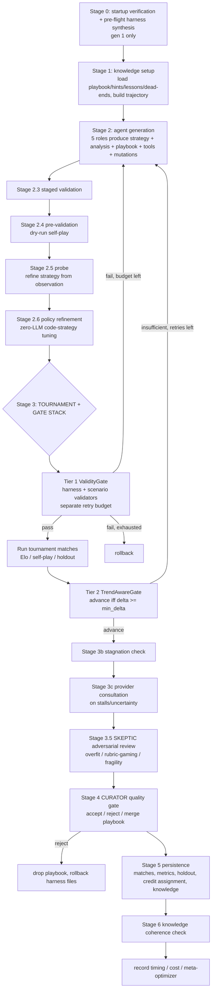

# autocontext (greyhaven-ai) — Research Findings

> Researcher note: the name "autocontext" is partly misleading. Despite the name, this is
> primarily a **recursive self-improving agent harness** (propose → validate → evaluate →
> gate → keep-if-verifiably-better, with knowledge that carries across runs). Context/memory
> management is one component, not the whole thing. Both facets are directly relevant to the
> KB Seed AI project.
> Evidence base: read the load-bearing Python control-plane modules directly at the pinned
> commit; quoted prompts, gates, and data structures verbatim. Did NOT execute the harness
> (no credentials), and found no empirical/benchmark results or independent coverage.

---

## 1. Identity

- **Name:** autocontext (PyPI: `autocontext`; CLI entrypoint: `autoctx`; npm: `autoctx` + `pi-autocontext`).
- **What it is (one line):** A polyglot (Python + TypeScript) harness that takes a plain-language goal, runs a multi-role evolutionary improvement loop against real evaluation, gates what survives, and accumulates transferable knowledge (playbooks, hints, datasets, distilled models) that future runs inherit.
- **Org / authors:** greyhaven-ai. Primary committer on the inspected HEAD: **Jay Scambler** (`jayscambler`, jayscambler@gmail.com). [Author attribution from commit metadata; see References.]
- **Dates:** Active, fast-moving. HEAD commit dated **2026-06-05**. Version line **0.5.0** (Python/npm); `pi-autocontext` at 0.2.4.
- **Primary links:** https://github.com/greyhaven-ai/autocontext ; PyPI https://pypi.org/project/autocontext/ ; npm https://www.npmjs.com/package/autoctx
- **Code repo + commit inspected:** `github.com/greyhaven-ai/autocontext@0f4034924324f386cd238a4c2cd37a5c7d68083b` (branch `main`, fetched via codeload tarball; git clone blocked by sandbox proxy 407). Inspected the Python control plane under `autocontext/src/autocontext/` (~610 `.py` files, ~111.5K LOC) plus docs.

---

## 2. TL;DR

- **It is a working, code-complete recursive self-improving agent harness**, not a context library. You give it a plain-language goal; it runs a multi-generation loop of *propose → validate → evaluate → gate → keep-if-verifiably-better*, and accumulates `knowledge/` (playbooks, hints, lessons, dead-ends, helper tools, harness validators) that the **next run inherits automatically**. This is strikingly close to the KB Seed AI premise.
- **Five cooperating LLM roles per generation**: `competitor` (proposes a strategy/artifact), `analyst` (explains what happened), `coach` (rewrites the playbook + hints), `architect` (proposes new tools *and harness mutations*), `curator` (gates what knowledge persists). A `skeptic` adversarial reviewer and a `translator` round it out.
- **The "keep only if verifiably better" core is unusually well-engineered**: a layered gate stack — binary **ValidityGate** (harness + scenario validators, separate retry budget) → **TrendAwareGate** (advance iff `delta >= min_delta`, default 0.005; plateau-relaxed) → **HoldoutVerifier** (re-eval on held-out seeds, blocks on generalization gap) → **ObjectiveGuardrail** (binds LLM-judge to oracle recall/precision; blocks when judge is over-optimistic) → LLM **curator** accept/reject/merge. Explicit anti-reward-hacking and anti-overfit design.
- **The "HARNESS-ONLY self-improvement" idea is implemented**: the architect role can emit `<!-- MUTATIONS_START -->` blocks (prompt fragments, context policies, completion checks, tool instructions) and `<!-- HARNESS_START -->` executable `validate_strategy(...)` validators that carry forward; rejected harness/playbook changes are rolled back. There is also a true outer **ReST-EM / expert-iteration** training loop (`autoctx self-improve`).
- **Context management (the name) is real but secondary**: a deterministic, structure-aware compactor (`knowledge/compaction.py`) + a token-budget trim cascade (`prompts/context_budget.py`) + an ordered `RUNTIME_CONTEXT_LAYERS` assembly contract + Pi-shaped compaction ledger entries. Useful for long-horizon runs, but uses a crude `char/4` token estimate (acknowledged in-code).
- **Maturity caveat**: large (~111K LOC Python), polished docs, real PyPI/npm releases — but a **~3-month-old project (first release 2026-03-15) by an apparently solo/small team (Jay Scambler / greyhaven-ai) with essentially zero independent coverage, no paper, and no published benchmark results.** Engineering signal is high; *evidence that the loop actually produces durable improvement on hard tasks* is unverified.

---

## 3. What it does & how it works

### 3.1 The product surface

You hand autocontext a goal in natural language and it runs a control loop. Two main entrypoints:

- `autoctx solve "<goal>" --iterations N` — generates a *Scenario* from the goal, then runs N generations.
- `autoctx run <scenario> --iterations N` — improves behavior inside a saved Scenario.

Plus `mission` (verifier-driven goal advanced step-by-step), `campaign` (groups of missions, TS-only), `simulate`, `investigate`, `train` (distill traces → local MLX/CUDA model), and `self-improve` (ReST-EM outer loop). It is exposed as a Python CLI, a TypeScript CLI (`bunx autoctx`), an MCP server (`autoctx mcp-serve`) for Claude Code / Cursor / Pi, and a "Pi" local-agent runtime. There are **11 scenario families** (game, agent_task, simulation, artifact_editing, investigation, workflow, negotiation, schema_evolution, tool_fragility, operator_loop, coordination).

Everything is persisted on disk and in SQLite: `runs/<id>/trace.jsonl`, `runs/<id>/generations/gen_k/{strategy.json,analysis.md,score.json}`, `runs/<id>/report.md`, and `knowledge/<scenario>/{playbook.md,hints.md,lessons,dead_ends,tools/,harness/}`.

### 3.2 The canonical object model

From `docs/concept-model.md`: user-facing nouns **Scenario / Task / Mission / Campaign**; runtime nouns **Run / Step / Verifier / Artifact / Knowledge / Budget / Policy**. A `Scenario`/`Task` executes as a `Run`; `Run`s emit `Artifact`s; validated artifacts become durable `Knowledge`; `Budget`/`Policy` constrain execution. (The doc candidly notes "Task" is overloaded across three meanings and is mid-refactor — an honest signal that this is a young, evolving codebase.)

### 3.3 The two nested loops

**Outer loop** (`loop/generation_runner.py :: GenerationRunner.run`): iterates generations 1..N for a scenario. It is idempotent (skips already-completed generations), hydrates prior run state, and at run start performs **cross-run knowledge inheritance** — if no `playbook.md` exists, it restores the best prior run's knowledge snapshot (`get_best_knowledge_snapshot`) and inherits existing harness files. At run end it snapshots knowledge keyed by best score for the next run to inherit. Each generation is delegated to a `GenerationPipeline`.

**Inner loop** (`loop/generation_pipeline.py :: GenerationPipeline.run_generation`): a single generation runs as an ordered, hook-instrumented, time-budgeted stage sequence:



The five roles run roughly as: competitor → translator → analyst, then coach ∥ architect in parallel (a small role DAG; `harness/orchestration` provides a `PipelineEngine` alternative). Cadence: the architect is throttled to every Nth generation (`architect_every_n_gens`); off-cadence it is told to "return minimal status + empty tools array."

### 3.4 What gets evaluated and how

A *strategy* (the competitor's output) is either a JSON parameter object matching a declared "strategy interface," or — in `code_strategies_enabled` mode — a Python function body that computes actions from game state. It is scored by running it in the scenario (subprocess in Python, V8 isolate in TS), often as a **tournament with Elo** against a live opponent pool plus self-play. Scoring backends are pluggable; agent-task families use an LLM judge, optionally bound to an objective oracle (see §5).

---

## 4. Evidence from the code

All references are to `greyhaven-ai/autocontext@0f4034924324f386cd238a4c2cd37a5c7d68083b`. The Python control plane is `autocontext/src/autocontext/`.

### 4.1 The five-role prompt bundle (the heart of the loop)

`autocontext/src/autocontext/prompts/templates.py :: build_prompt_bundle` assembles one shared `base_context` (scenario rules, strategy interface, evaluation criteria, observation, current playbook, lessons, recent analysis, score trajectory, strategy registry, dead-ends, experiment log, research protocol, session reports) and appends role-specific task suffixes. The verbatim **coach** instruction (the playbook-rewriter — this is the knowledge accumulation engine):

```text
You are the playbook coach. Produce THREE structured sections:

1. A COMPLETE replacement playbook between markers. Consolidate all prior guidance,
deduplicate, and remove stale advice. This replaces the current playbook entirely.

<!-- PLAYBOOK_START -->
(Your consolidated playbook here: Strategy Updates, Prompt Optimizations,
Next Generation Checklist)
<!-- PLAYBOOK_END -->

2. Operational lessons learned between markers. Each lesson should be a concrete,
prescriptive rule derived from what worked or failed.

<!-- LESSONS_START -->
(e.g. '- When aggression > 0.8 with defense < 0.4, scores drop.')
<!-- LESSONS_END -->

3. Concrete competitor hints between markers. Specific parameter ranges or
strategies the competitor should try next.

<!-- COMPETITOR_HINTS_START -->
(Specific parameter ranges or strategies the competitor should try next)
<!-- COMPETITOR_HINTS_END -->
```

The verbatim **architect** instruction is the key to *harness self-modification*. It can emit new tools, executable harness **validators**, and harness **mutations** that carry forward (`prompts/templates.py`):

```text
Propose infrastructure/tooling improvements in markdown with sections:
Observed Bottlenecks, Tool Proposals, Impact Hypothesis.
Then append a JSON code block with shape
{"tools":[{"name":"<snake_case>","description":"<text>","code":"<python code>"}]}.
...
Additionally, you may propose harness validators — executable Python checks
that run against each strategy BEFORE tournament matches. Each validator must
define `validate_strategy(strategy: dict, scenario) -> tuple[bool, list[str]]`.
Wrap harness specs between markers:

<!-- HARNESS_START -->
{"harness":[{"name":"<snake_case>","description":"<text>",
"code":"def validate_strategy(strategy, scenario):\n    ..."}]}
<!-- HARNESS_END -->
...
Additionally, you may propose harness mutations — lightweight prompt,
context, completion, or tool-usage adjustments that carry forward to future generations.
Wrap mutation specs between markers:

<!-- MUTATIONS_START -->
{"mutations":[{"type":"prompt_fragment","target_role":"<competitor|analyst|coach|architect>",
"content":"<text>","rationale":"<why>"},{"type":"context_policy","component":"<component>",
"content":"<policy>","rationale":"<why>"},{"type":"completion_check","content":"<check>",
"rationale":"<why>"},{"type":"tool_instruction","tool_name":"<tool_name>",
"content":"<instruction>","rationale":"<why>"}]}
<!-- MUTATIONS_END -->
```

There is an optional `constraint_mode` that appends explicit "Do NOT" lists per role (e.g. competitor: *"Do NOT repeat any strategy from the registry that resulted in rollback … Do NOT set parameters outside the valid ranges"*). Each role's call has tight token caps (`prompts/templates.py`, `agents/competitor.py`): competitor `max_tokens=800, temperature=0.2`; curator/skeptic 1200–4000 tokens at low temperature.

### 4.2 The gate stack (the "verifiably better" core)

**Quality gate** — `harness/pipeline/gate.py :: BackpressureGate`:

```python
def evaluate(self, previous_best, current_best, retry_count, max_retries):
    delta = round(current_best - previous_best, 6)
    if delta >= self.min_delta:
        return GateDecision(decision="advance", ...)   # min_delta default 0.005
    if retry_count < max_retries:
        return GateDecision(decision="retry", ...)
    return GateDecision(decision="rollback", ...)
```

`harness/pipeline/trend_gate.py :: TrendAwareGate` wraps it: if the recent score spread over `plateau_window` (default 3) is below `min_delta`, or the last 3 decisions were all `rollback`, it relaxes the threshold by `plateau_relaxation_factor` (0.5) so progress can resume on plateaus.

**Validity gate** — `harness/pipeline/validity_gate.py :: ValidityGate.check` runs harness `validate_strategy` + scenario `validate_actions`, returns binary pass/fail, and has a **retry budget independent of the quality gate** (`max_retries=5`). Wired as "Tier 1" in `loop/stages.py :: stage_tournament` (`two_tier_gating_enabled`): on failure it asks the competitor to revise, retries with backoff, and rolls back without running a tournament when exhausted.

**Holdout verifier** — `harness/pipeline/holdout.py :: holdout_check` (AC-323). After a candidate wins in-sample, re-evaluate on `holdout_seeds` (default 5, `seed_offset=10000`). Blocks advance if `holdout_mean < min_holdout_score` (0.5) OR `generalization_gap = in_sample - holdout_mean > max_generalization_gap` (0.2). Comment: *"Candidates can win the main tournament and still be blocked if holdout performance regresses."*

**Objective guardrail** — `harness/pipeline/objective_guardrail.py :: check_objective_guardrail` (AC-325). Binds an LLM judge to an objective oracle and blocks advance on judge over-optimism:

```python
# Only penalize judge optimism. Stronger objective verification should
# not count as disagreement that blocks advancement.
gap = max(0.0, rubric_score - objective_recall)
if gap > policy.max_rubric_objective_gap:   # default 0.2
    violations.append(...)
```

It also enforces `min_recall`, `min_precision`, `max_false_positive_rate`, and provides `settle_forecasts()` — Brier-score settlement for confidence-bearing claims (proper scoring rule).

### 4.3 The curator (knowledge persistence gate)

`autocontext/src/autocontext/agents/curator.py :: KnowledgeCurator.assess_playbook_quality` compares current vs proposed playbook and returns accept/reject/merge via markers (`<!-- CURATOR_DECISION: accept|reject|merge -->`, `<!-- CURATOR_SCORE: N -->`). `consolidate_lessons` dedupes semantically and hard-caps lesson count (with a deterministic truncation fallback if the LLM output doesn't parse). `loop/stages.py :: stage_curator_gate` applies it: on `reject` it drops the proposed playbook **and rolls back harness files** (`artifacts.rollback_harness`) when harness inheritance is active; on `merge` it substitutes the curator's merged playbook.

### 4.4 The skeptic (adversarial review)

`autocontext/src/autocontext/agents/skeptic.py :: SkepticAgent.review` is an explicit red-teamer:

```text
You are a skeptic / red-team reviewer. Your job is to argue AGAINST advancing this candidate.
Look for: overfit to specific opponents, rubric gaming, stale patterns carried forward,
fragile gains that won't hold, contradictions with prior lessons, and suspicious score jumps.
```

It returns `risk_level` (high/medium/low), concerns, `recommendation` (proceed/caution/block), confidence 1-10. Its review is fed into the curator's prompt (`_build_skeptic_review_section`).

### 4.5 Context management (the deterministic compactor + budget)

`autocontext/src/autocontext/knowledge/compaction.py` — a **deterministic, non-LLM, structure-aware** compactor run before the hard budget. Per-component token limits (`playbook=2800, lessons=1600, analysis=1800, trajectory=1200, experiment_log=1800, ...`). Different strategies per component type: history components keep the last 4 sections; tables keep header + last 8 rows; markdown keeps the first/last 6 sections; lessons prefer recent. Line-level extraction prioritizes structured lines and an `_IMPORTANT_KEYWORDS` set (`root cause, finding, recommendation, rollback, regression, failure, hypothesis, diagnosis, ...`). Results are cached by `(policy_version, key, sha256(text), max_tokens)` and emit "Pi-shaped" `CompactionEntry` ledger records (with `## Goal / ## Progress / ## Critical Context` resumable summaries).

`autocontext/src/autocontext/prompts/context_budget.py :: ContextBudget.apply_with_telemetry` — the hard cap. Pipeline: (1) dedupe components with identical normalized text (keep the canonically-highest-priority one), (2) per-component caps, (3) progressive **trim cascade** in `_TRIM_ORDER` (least→most critical: `session_reports → evidence_manifests → notebooks → experiment_log → research_protocol → trajectory → analysis → tools → lessons → playbook`). **`hints` and `dead_ends` are never trimmed** (`_PROTECTED`). Full `ContextBudgetTelemetry` records every dedupe/cap/trim. The token estimate is explicitly `len(text)//4` with an in-code limitation note: *"uses a char/4 heuristic … not a real tokenizer."*

The canonical assembly contract is `docs/concept-model.md :: Runtime Context Assembly` — an 8-layer ordered `RUNTIME_CONTEXT_LAYERS` (system policy → repo `AGENTS.md`/`CLAUDE.md` → autocontext role instructions → Scenario/Task slice → persisted Knowledge → runtime skills → tool affordances → recent session history + compaction summaries), each with documented budget/compaction and child-task inheritance behavior.

### 4.6 The ReST-EM outer training loop

`autocontext/src/autocontext/training/autoresearch/self_improve.py :: run_self_improving_loop` (HEAD commit #1033). Each round: train on current dataset → sample `samples_per_round` constructions at positive temperature → score them in-scenario → keep top `elite_fraction` (0.25) via `select_elite_samples` → append elite as new training records → retrain on the grown dataset. A final pass trains over the full accumulated dataset. Docstring: *"the outer loop that turns one-shot distillation into PatternBoost / ReST-EM: the model generates new training data for itself, biased toward the best of what it can already produce."* Includes a `representative_context` helper so generated samples keep the seed distribution's context prefix (an explicit fix for distribution split). MLX-backed today; CUDA backend raises `NotImplementedError` for sample collection.

### 4.7 Other load-bearing modules (named, not all quoted)

- `agents/orchestrator.py :: AgentOrchestrator.run_generation` — runs the 5-role sequence; per-role model routing via `ModelRouter` (haiku/sonnet/opus tiers, harness-aware demotion) and `RoleRouter`; optional "RLM" REPL-reasoning backend (`rlm/`), and a deterministic offline provider for tests.
- `loop/stages.py` (~58KB) — all stage implementations incl. `stage_tournament`, `stage_curator_gate`, `stage_persistence`.
- `loop/stage_tree_search.py`, `loop/hypothesis_tree.py` — alternative tree-search exploration mode (MCTS-like) vs. the default linear/`rapid` modes.
- `knowledge/` — `solver.py`, `weakness.py`, `lessons.py`, `dead_end_manager.py`, `mutation_log.py`, `stagnation.py`, `export.py` (skill/Pi-package export), `research_hub.py`.
- `harness/mutations/`, `harness/meta_optimizer.py` — apply architect mutations; meta-optimize cost/model choices from recorded gate decisions.
- `session/runtime_context.py`, `session/runtime_session.py`, `session/memory_consolidation.py`, `session/context_pressure.py` — long-horizon runtime session logging, replay, and compaction triggers.
- `production_traces/` — `instrument_client(Anthropic()/OpenAI())` wraps a live client to capture JSONL traces → `build-dataset` → `train`.
- Storage: SQLite (`storage/`) for indexed run/generation/match/knowledge-snapshot metadata; filesystem for artifacts and knowledge.

---

## 5. What's genuinely smart

This is the heart of the document. The load-bearing ideas, in order of value to a self-improving software-building agent:

**1. A layered, defense-in-depth gate stack that separates *validity*, *quality*, *generalization*, and *judge-trust*.** Most "keep if better" loops use a single score delta. autocontext stacks four orthogonal checks (§4.2), each catching a different failure mode:
- *ValidityGate* (binary, separate retry budget) keeps malformed candidates from ever reaching evaluation, and crucially does **not** spend the quality-retry budget on syntax errors. Separating "is this even runnable" from "is this better" is a clean, reusable distinction.
- *TrendAwareGate* avoids permanent stalls by relaxing the threshold on detected plateaus / consecutive rollbacks — a pragmatic answer to "the loop gets stuck."
- *HoldoutVerifier* is the standout: a candidate can win the in-sample tournament and still be **blocked** if it regresses on held-out seeds or the generalization gap is too large. This is a direct, mechanical defense against overfitting to the eval — exactly the failure mode that kills naive self-improvement loops.
- *ObjectiveGuardrail* binds an LLM judge to an objective oracle and blocks advance specifically when the **judge is more optimistic than the oracle** (`gap = rubric_score - objective_recall`). This is a concrete, asymmetric anti-judge-gaming mechanism (it only penalizes optimism, not pessimism). Plus Brier-score forecast settlement for calibrated confidence claims.

**2. Knowledge as plain, inheritable, curated artifacts.** The playbook/hints/lessons/dead-ends are markdown the next run reads as context, not opaque weights. The *coach* fully **rewrites** the playbook each generation (consolidate, dedupe, drop stale) rather than appending — bounding growth at the source. The *curator* then gates persistence (accept/reject/merge) and *consolidate_lessons* hard-caps and dedupes. Cross-run inheritance restores the **best prior run's** snapshot. This is a coherent, debuggable memory system: durable, diffable, portable, and bounded.

**3. The architect's harness mutations = scoped "self-improving harness."** Rather than letting the agent rewrite arbitrary code, self-modification is constrained to four typed mutation kinds (prompt fragment, context policy, completion check, tool instruction) plus executable `validate_strategy` validators — and any change that doesn't survive the gate/curator is rolled back. This is a safer, more legible form of the "edit your own scaffold" idea than full self-rewrite (cf. Darwin-Gödel Machine / SICA): the harness evolves, but only through declared, revertible, individually-gated edits.

**4. The skeptic as a structural adversary.** A dedicated red-team role that *argues against advancing* and explicitly hunts for overfit / rubric-gaming / fragile gains / suspicious jumps, feeding the curator. Cheap (one extra LLM call) and directly targets the way evolutionary loops fool themselves.

**5. Deterministic compaction before LLM/budget fallback.** `knowledge/compaction.py` is structure-aware and deterministic (cacheable, reproducible, free) — it preserves headings/findings/recent-history and only falls back to hard truncation. The trim cascade protects the most actionable context (`hints`, `dead_ends` never trimmed) and emits full telemetry. For very long runs, "compact deterministically by structure, summarize semantically only if needed, hard-truncate last" is a sensible, auditable ordering.

**6. Phased time budgets + cost control as first-class loop citizens.** Each generation splits its time budget into `scaffolding` vs `execution` phases (`generation_pipeline.py`), rolls budget over, and emits per-phase results; a `CostTracker`/`CostPolicy` can throttle expensive optional stages (probe, consultation, policy refinement) when `cost_per_delta_point` is poor. Long-horizon autonomy needs exactly this kind of budget-aware degradation.

**7. Idempotent, resumable, observable runs.** Generations are skip-if-completed; stale runs are recovered; every prompt/tool-call/outcome is a `trace.jsonl` event; runtime-session logs support replay with parent/child lineage and compaction references. This is the operational backbone that lets a loop run unattended for a long time and be debugged after the fact.

**8. ReST-EM as the genuine outer self-improvement loop.** `self_improve.py` closes the loop from "harness improves prompts/knowledge" to "model trains on its own elite, verified outputs" — the model becomes the substrate that improves, biased toward the best of what it can already produce, with attention to keeping the training distribution coherent.

---

## 6. Claims vs. reality / limitations / critiques

**(A) What the authors claim.** README: *"a recursive self-improving harness designed to help your agents (and future iterations of those agents) succeed on any task"*; *"Repeated runs get better, not just different"*; produces *"playbooks, datasets, and (optionally) a distilled local model that the next agent inherits."* It positions itself as strictly more general than DSPy/Inspect/TextGrad ("Prompt optimization is a special case").

**(B) What the code actually demonstrates.** The *machinery* for all of the above genuinely exists and is internally coherent: the 5-role loop, the gate stack, cross-run inheritance, harness mutations, the ReST-EM loop, the compaction/budget system, MCP/CLI/Pi surfaces, 11 scenario families in two languages. The codebase is large (~111K LOC), typed, linted (ruff/mypy), and has an extensive test suite and a deterministic offline provider for CI. This is real, working engineering, not vaporware.

**(C) What is NOT demonstrated / could not be verified.**
- **No empirical evidence that "repeated runs get better."** I found no benchmark numbers, no ablation results, no learning curves, no paper, and no third-party reproduction anywhere (the only external hit is an auto-generated tool-aggregator listing). The claim of monotone cross-run improvement is *architecturally supported but empirically unproven* in anything I can see. The `min_delta` gate guarantees *recorded* best-score is non-decreasing within a run, but that is a tautology, not evidence the *approach* finds good solutions on hard tasks.
- **The scenario families are largely toy/synthetic** (grid_ctf, othello, mock-environment simulations, schema-evolution probes). Whether the loop transfers to real, open-ended software construction (the KB Seed AI goal) is untested here.
- **Token accounting is a `char/4` heuristic** (acknowledged in `context_budget.py`). Budget enforcement is therefore approximate; under a real tokenizer the trims could be materially off, and "context pressure" decisions are coarse.
- **Heavy reliance on HTML-comment-marker parsing** (`<!-- PLAYBOOK_START -->`, `<!-- CURATOR_DECISION: ... -->`, etc.) with lenient regex fallbacks that **default to permissive outcomes** — e.g., `parse_curator_playbook_decision` defaults to `accept` and score `5` when markers are missing; the skeptic defaults to `proceed`/`low`. A model that simply omits markers silently bypasses the gate it was supposed to face. This is a quiet failure mode in the "verifiable" story.
- **The curator/skeptic are themselves LLMs judging LLMs.** The objective guardrail mitigates this *only* for scenario families that have an oracle; for pure `agent_task` judge scoring, the system can still be gamed by a sufficiently persuasive competitor + optimistic judge, with the skeptic as the only (also-LLM) backstop.

**(D) Reward-hacking / test-gaming posture.** Better than most: holdout generalization-gap blocking, objective-vs-rubric gap blocking, an adversarial skeptic, and "do not repeat rolled-back strategies" constraints are all explicit defenses. But they are *opt-in* (gated behind settings like `two_tier_gating_enabled`, `harness_validators_enabled`, `coherence_check_enabled`) and, as noted, the marker-parsing defaults can leak.

**(E) Maturity / sustainability.** First PyPI release 2026-03-15; at HEAD (2026-06-05) it is ~3 months old, version 0.5.0 in-repo / **0.6.0 on PyPI** (21 releases — very rapid iteration). Commits are dominated by a single author (Jay Scambler / `jayscambler`) committing AC-numbered tickets; CHANGELOG is enormous and feature-churny. The `concept-model.md` openly documents unresolved naming collisions and partial Python/TS parity. Apache-2.0 licensed. Net: high-velocity solo/small-team project, impressive surface area, but unproven, churny, and bus-factor-fragile. There is no independent critique to cite because essentially no one outside the project has written about it yet.

**Critiques/independent analyses found:** none of substance. (Searched; results were the repo, repo mirrors, and one aggregator page — see References. "I could not verify external validation" is the honest statement.)

---

## 7. Relevance to a self-improving, evolutionary agent

This is one of the **most directly on-point sources** for the KB Seed AI project: it is an existing, code-complete implementation of almost exactly the target shape (goal → open-ended propose/test/keep-if-better loop → self-improving harness → durable memory). Mapping its mechanisms to our needs:

- **The "keep only if verifiably better" loop** → the gate stack (§4.2) is a ready-made template. Especially: *separate validity-retry budget from quality-retry budget*; *block on holdout generalization gap, not just in-sample score*; *block when an LLM judge is more optimistic than an objective check*. These are the exact safeguards a tokens-unlimited evolutionary builder needs to avoid drifting into eval-overfit.
- **Self-improving HARNESS-ONLY** → the architect's typed, revertible **harness mutations** (`prompt_fragment` / `context_policy` / `completion_check` / `tool_instruction`) + executable `validate_strategy` validators, each individually gated and rolled back on rejection. This is a concrete, safer pattern for "the agent edits its own scaffold" than full self-rewrite — directly relevant to a harness-only self-improvement constraint.
- **Context/memory management for very long runs** → the deterministic structure-aware compactor + protected-component trim cascade + 8-layer `RUNTIME_CONTEXT_LAYERS` assembly + Pi-shaped compaction ledger + runtime-session replay with parent/child lineage. A usable blueprint for keeping a multi-day run's context bounded *and* auditable.
- **Decision-making / not getting stuck** → plateau-relaxing gate, stagnation detection, dead-end tracking ("DO NOT repeat these approaches"), and provider "consultation" on stalls. All target the long-horizon "loop spins without progress" failure.
- **Orchestration** → a small role DAG (`harness/orchestration`) with a `PipelineEngine`, per-role model tiering (cheap models early/for easy roles, expensive on plateaus), and architect cadence throttling — practical cost/quality orchestration.
- **Verification** → tournament+Elo, self-play, holdout seeds, objective oracles, Brier-score forecast settlement, adversarial skeptic. A rich menu of verification surfaces beyond a single scalar reward.
- **Production-trace → dataset → distilled model → ReST-EM** → a complete path from "capture what the agent did" to "train a cheaper local model on its verified-best behavior" and iterate (expert iteration). Relevant if the seed AI is meant to *compound* into a specialized model, not just accumulate text.
- **Operational backbone** → idempotent resumable generations, SQLite-indexed run/knowledge state, `trace.jsonl`, hooks around every stage. This is the unglamorous infrastructure that makes an unattended long-horizon agent debuggable.

What is **less relevant / cautionary**: the strategy abstraction is parameter-vector / small-code-body centric (games, rubric tasks), not "build a whole software project," so the *evaluation* layer would need substantial replacement for real software construction; the marker-parsing-with-permissive-defaults pattern is an anti-pattern to avoid; and the `char/4` token accounting is too crude to adopt as-is.

---

## 8. Reusable assets

Concrete, quotable things we *could* borrow (evidence only — not a design):

**A. The two-budget gate decision** (`harness/pipeline/gate.py`, `validity_gate.py`): separate `ValidityGate` (binary pass/fail, own retry budget) from `BackpressureGate`/`TrendAwareGate` (score-delta, own retry budget). Decision schema: `GateDecision{decision: advance|retry|rollback, delta, threshold, reason, metadata}`. Plateau relaxation: relax `min_delta` by `0.5` when recent spread `< min_delta` or last 3 decisions all `rollback`.

**B. Holdout generalization-gap check** (`harness/pipeline/holdout.py`): re-evaluate on `seed_offset + i` seeds; block if `holdout_mean < 0.5` or `in_sample - holdout_mean > 0.2`. `HoldoutResult{holdout_mean_score, holdout_scores, in_sample_score, generalization_gap, passed, reason}`.

**C. Judge-vs-oracle guardrail** (`harness/pipeline/objective_guardrail.py`): block advance when `gap = max(0, rubric_score - objective_recall) > 0.2`; also enforce `min_recall/min_precision/max_false_positive_rate`. Plus `settle_forecasts()` Brier scoring for confidence-bearing claims.

**D. The five role prompts (verbatim)** — coach (playbook rewriter), architect (tools + harness validators + typed mutations), and the constraint-mode "Do NOT" suffixes — all quoted in §4.1. The architect's `MUTATIONS`/`HARNESS` marker schema is a reusable template for scoped self-modification.

**E. The skeptic prompt (verbatim, §4.4)** — a drop-in adversarial-review role: "argue AGAINST advancing … look for overfit, rubric gaming, stale patterns, fragile gains, suspicious score jumps" → `risk/concerns/recommendation/confidence`.

**F. Curator decision schema** (`agents/curator.py`): `assess_playbook_quality` → accept/reject/merge with score 1-10; `consolidate_lessons` → semantic dedupe + hard cap with deterministic fallback. (Note the permissive default — fix before reuse.)

**G. Deterministic context compactor** (`knowledge/compaction.py`): per-component token limits table; structure-aware strategies (history=last-4-sections, table=header+last-8-rows, lessons=prefer-recent); `_IMPORTANT_KEYWORDS` prioritization; content-hash cache; `CompactionEntry` resumable-summary ledger (`## Goal / ## Progress / ## Critical Context`).

**H. Context budget trim cascade** (`prompts/context_budget.py`): `_TRIM_ORDER` (least→most critical), `_PROTECTED = {hints, dead_ends}`, dedupe-equivalent-components, per-component caps, and `ContextBudgetTelemetry` for full observability of every reduction.

**I. The 8-layer runtime context assembly contract** (`docs/concept-model.md :: Runtime Context Assembly`) — an explicit ordered layer table with per-layer budget/compaction and child-task inheritance rules. A good checklist for "what goes into a long-running agent's prompt, in what order, and what's protected."

**J. ReST-EM loop skeleton** (`training/autoresearch/self_improve.py`): `select_elite_samples(fraction=0.25)` → `samples_to_records` (carry `representative_context`) → append → retrain → final full-dataset train. Clean pure helpers + MLX orchestrator.

**K. Run/knowledge on-disk schema** (README "What You Get Back"): `runs/<id>/{trace.jsonl, generations/gen_k/{strategy.json, analysis.md, score.json}, report.md, artifacts/}` and `knowledge/<scenario>/{playbook.md, hints.md, tools/}`. `trace.jsonl` event shape: `{ts, gen, role, event, score, tokens_in, tokens_out, strategy_id}`.

**L. Production-trace capture** (`production_traces/instrument_client`): wrap an Anthropic/OpenAI client to emit JSONL with content blocks + cache-aware usage → `build-dataset` → `train`.

---

## 9. Signal assessment

**Overall signal: HIGH (as an architecture/engineering reference) / LOW (as validated evidence that the approach works).**

This is the rare source whose *design* maps almost one-to-one onto the KB Seed AI goal, implemented in real, readable, well-structured code. For *how to build* the loop — gating, knowledge inheritance, scoped harness self-modification, context budgeting, long-run observability — it is a goldmine of concrete, copyable patterns (§8). The gate stack in particular (validity/quality/holdout/objective-guardrail + skeptic) is the most thorough anti-overfit / anti-judge-gaming design seen across the canon so far, and it is exactly the part a tokens-unlimited evolutionary builder most needs.

**Confidence:** High on *what the code does* (I read the load-bearing modules directly and quoted them). Medium-low on *whether it works as advertised*, because:

**What I could NOT verify:**
- Any empirical result. No benchmarks, ablations, learning curves, or "run N gets better than run N-1" data exist in the repo or anywhere public.
- That cross-run improvement compounds on non-toy tasks. Scenario families are largely synthetic.
- Real-world adoption or scrutiny. No independent write-ups, papers, talks, or critiques; downloads/stars not meaningfully assessable from inside the sandbox. The only non-GitHub hit was an auto-generated aggregator listing.
- Runtime behavior. I did not execute the harness (no API keys / sandbox constraints), so all claims about the loop are from reading code and docs, not from running it.
- Authorship beyond commit metadata (Jay Scambler / `jayscambler`, org greyhaven-ai). No personal site, paper, or bio surfaced.

**Bottom line:** Mine it aggressively for *mechanisms and prompts*; treat its effectiveness claims as unproven. The biggest open question — does this loop actually produce durable, compounding improvement on hard, open-ended software tasks? — is unanswered by anything available.

---

## 10. References

Primary — code (all at `greyhaven-ai/autocontext@0f4034924324f386cd238a4c2cd37a5c7d68083b`, branch `main`, fetched via codeload tarball; git clone blocked by sandbox proxy 407):
- `repo@0f40349:README.md` — top-level positioning, surfaces, scenario families, on-disk schema. (primary)
- `repo@0f40349:docs/concept-model.md` — canonical object model + 8-layer Runtime Context Assembly + durable runtime-session storage. (primary)
- `repo@0f40349:autocontext/src/autocontext/prompts/templates.py` — `build_prompt_bundle`, the five role prompts (verbatim), constraint suffixes. (primary)
- `repo@0f40349:autocontext/src/autocontext/agents/orchestrator.py` — `AgentOrchestrator.run_generation`, role sequence, model routing, RLM backend. (primary)
- `repo@0f40349:autocontext/src/autocontext/agents/{competitor,curator,skeptic}.py` — role runners + curator/skeptic decision schemas. (primary)
- `repo@0f40349:autocontext/src/autocontext/loop/generation_runner.py` — outer run loop, cross-run knowledge inheritance, idempotency. (primary)
- `repo@0f40349:autocontext/src/autocontext/loop/generation_pipeline.py` — single-generation staged pipeline, phased budgets, cost throttle. (primary)
- `repo@0f40349:autocontext/src/autocontext/loop/stages.py` — `stage_tournament` (two-tier gating), `stage_curator_gate`, `stage_persistence`. (primary)
- `repo@0f40349:autocontext/src/autocontext/harness/pipeline/{gate,trend_gate,validity_gate,holdout,objective_guardrail}.py` — the gate stack. (primary)
- `repo@0f40349:autocontext/src/autocontext/knowledge/compaction.py` — deterministic structure-aware context compactor + compaction ledger. (primary)
- `repo@0f40349:autocontext/src/autocontext/prompts/context_budget.py` — token-budget trim cascade + telemetry. (primary)
- `repo@0f40349:autocontext/src/autocontext/training/autoresearch/self_improve.py` — ReST-EM / expert-iteration outer loop (HEAD commit #1033). (primary)
- `repo@0f40349:CHANGELOG.md` — version history (first dated entry 0.2.0 @ 2026-03-15; 0.6.0 @ 2026-06-02). (primary)
- HEAD commit metadata via GitHub API: `https://api.github.com/repos/greyhaven-ai/autocontext/commits/main` → SHA `0f4034924324f386cd238a4c2cd37a5c7d68083b`, author Jay Scambler, date 2026-06-05, message "feat(training): self-improving loop (ReST-EM / expert iteration) (#1033)". (primary)

Primary — distribution:
- PyPI `autocontext`: https://pypi.org/project/autocontext/ — latest **0.6.0** (uploaded 2026-06-02), 0.5.0 (2026-05-01); placeholder 0.0.0 from 2024 (donated name); summary "autocontext control plane for iterative strategy evolution"; `requires_python >=3.11`. (primary)
- npm `autoctx` and `pi-autocontext`: https://www.npmjs.com/package/autoctx (referenced in README; registry JSON not retrievable from sandbox via curl — unverified beyond README claims). (primary, partially unverified)

Secondary:
- Repo home: https://github.com/greyhaven-ai/autocontext (primary mirror of the above). (secondary)
- everydev.ai listing: https://www.everydev.ai/tools/autocontext — auto-generated tool-aggregator page; no independent analysis. (secondary, low value)
- Author GitHub: https://github.com/jayscambler . (secondary)

Independent critiques/analyses: **none found** (searched; results were the repo, GitHub mirrors, and the aggregator listing above).

Inspected but not exhaustively quoted: `agents/analyst.py`, `agents/coach.py`, `agents/architect.py`, `harness/orchestration/*`, `harness/meta_optimizer.py`, `harness/mutations/*`, `session/{runtime_context,runtime_session,context_pressure,memory_consolidation}.py`, `knowledge/{solver,weakness,lessons,dead_end_manager,context_selection}.py`, `production_traces/*`, `storage/*`, `AGENTS.md`, `CLAUDE.md`, `LICENSE` (Apache-2.0).
