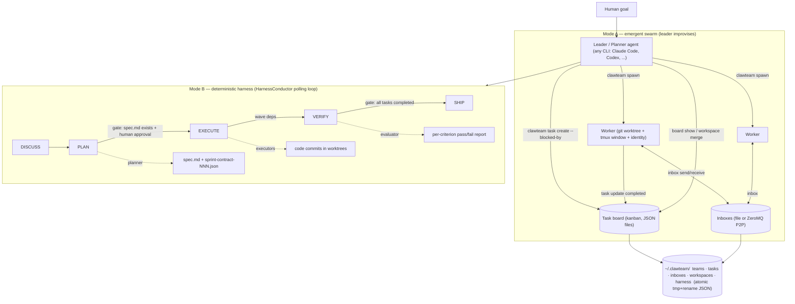
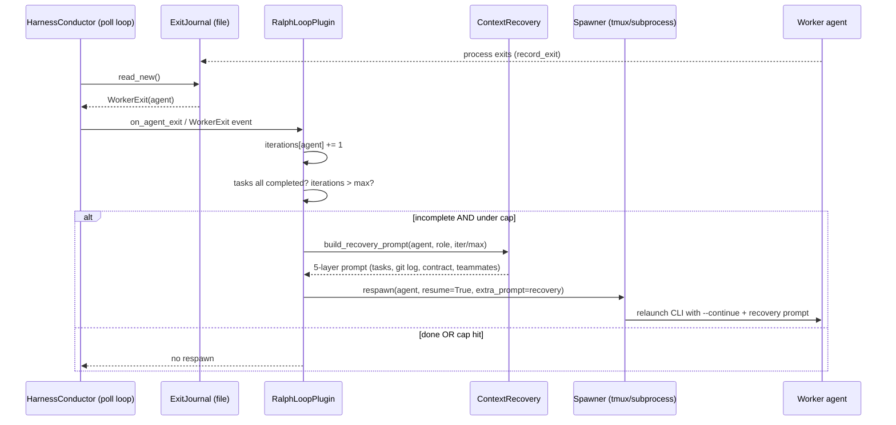

# ClawTeam (HKUDS) — Research Findings

> Status: IN PROGRESS. Written incrementally during research.
> Researcher note: judged by the brief's relevance test — "would this help build a
> self-improving, evolutionary, software-building agent?" ClawTeam is **orchestration
> infrastructure** (how to run many coding agents in parallel over a long horizon, with
> isolation, task dependencies, gates and a plan→execute→verify loop), not an
> evolutionary search engine. Relevant to the *running/orchestration/verification*
> dimensions of the test, much less to the *mutation/selection* dimension.

## 1. Identity

- **Name:** ClawTeam — "Agent Swarm Intelligence" ("One Command → Full Automation"). Tagline: *"The Evolution of AI Agents: Solo → Swarm."*
- **Org/authors:** **HKUDS** (Data Intelligence Lab @ University of Hong Kong — the same lab behind LightRAG, MiniRAG, AutoAgent, **OpenSpace** (Run 1 of this canon), and **ClawWork**). MIT-licensed.
- **What it is (precise):** A **multi-agent "swarm" orchestration framework / CLI**. A human gives a high-level goal to a *leader* agent (Claude Code, Codex, or any CLI coding agent); the leader uses `clawteam` CLI commands (exposed both as a shell CLI and as MCP tools + an installable "skill") to **spawn worker sub-agents**, each in its **own git worktree + tmux window + identity**, assign them tasks with **dependency chains**, coordinate them through **file-based (or ZeroMQ P2P) inboxes**, track them on a **kanban board**, and merge their worktrees back. It is explicitly *agent-agnostic infrastructure* — the intelligence is the underlying CLI agents; ClawTeam is the coordination substrate (filesystem + tmux, "no database, no server, no cloud").
- **Relationship to OpenSpace / ClawWork (same lab):** This is a sibling project, **not** the same system. OpenSpace = a self-evolving *skill-memory* layer that wraps a single host agent; its benchmark *baseline + LLM evaluator* was **ClawWork** (HKUDS's prior single-agent coding agent, https://github.com/HKUDS/ClawWork). ClawTeam is the lab's **multi-agent** line: the README's own framing "Solo → Swarm" positions ClawTeam as the *team/swarm* successor to the *solo* ClawWork agent. So: **ClawWork = solo coding agent (and OpenSpace's baseline); ClawTeam = the swarm orchestrator that runs many such agents.** I did not find code-level sharing between ClawTeam and ClawWork/OpenSpace in this repo (ClawTeam treats the coding agent as an opaque external CLI); the relationship is lineage/branding, not a shared codebase. (See §6 for the evidence and caveats.)
- **Dates:** Repo created **2026-03-17**; launched publicly 2026-03-18; `v0.2.0` released 2026-03-23; last push **2026-05-09**. Roadmap "current" line is v0.3.
- **Stars:** **~5,300** (GitHub API, 2026-06-05).
- **Primary links:** https://github.com/HKUDS/ClawTeam ; docs site (GitHub Pages, `docs/CNAME`) ; READMEs in EN/CN/KR.
- **Code inspected:** `HKUDS/ClawTeam@01198332ef9270c32c5460b8a178f964fc0df451` (main; latest commit as of pushed_at 2026-05-09). Obtained via codeload tarball (direct `git clone` blocked by sandbox proxy HTTP 407 — stale token in `http.proxy`; tarball + GitHub commits API used instead). Pure-Python package (`clawteam/`, ~90 `.py` modules) + a small React/Vite web board + a `skills/clawteam/` Agent-Skill + TOML team templates.

## 2. TL;DR

- **ClawTeam is multi-agent orchestration *infrastructure*, not an evolutionary/self-improving engine.** Its job is to let one "leader" CLI agent **spawn, coordinate, isolate, and monitor** many "worker" CLI agents to attack a complex goal in parallel. The cleverness is that **the agents themselves drive orchestration via plain CLI commands** (auto-injected into their prompt), so *any* CLI coding agent (Claude Code, Codex, OpenClaw, nanobot, Kimi, Cursor) can participate with **no SDK / no API integration / no framework lock-in**.
- **The substrate is deliberately boring and robust:** all state is JSON files under `~/.clawteam/` written with atomic `tmp+rename`; isolation is **real git worktrees** (`clawteam/{team}/{agent}` branches → real diffs, no merge collisions); concurrency is **tmux** windows; messaging is file inboxes (or ZeroMQ P2P with file fallback). No Redis/queue/DB required. This is a strong, debuggable answer to *"how do I run N agents over a long horizon without them clobbering each other?"*
- **Two orchestration modes coexist.** (a) **Agent-driven swarm** (the headline): leader agent calls `clawteam spawn`/`task`/`inbox` ad hoc — fully emergent, no fixed pipeline. (b) **A deterministic "harness"** (`clawteam/harness/`): a **phase state machine** `DISCUSS → PLAN → EXECUTE → VERIFY → SHIP` with **gates** between phases (artifact-required, all-tasks-complete, human-approval), **role-specialized agents** (planner/executor/evaluator), and **"sprint contracts"** carrying **testable `success_criteria` (with optional `test_command` + `verified` flags)**. This harness is the part most relevant to a verify-before-advance loop.
- **The "keep iterating until done" mechanism is the Ralph Loop plugin** (`plugins/ralph_loop_plugin.py`): on a `WorkerExit` event, if the agent's tasks aren't all `completed` and an iteration cap isn't hit, it **re-spawns the agent with `resume=True` + a freshly-built role-scoped recovery prompt**. This is the long-horizon "persistence" primitive — bounded by `max_iterations` (default 5), not by a verifier proving improvement.
- **"Self-improving / self-evolving" is mostly aspirational marketing here.** The README advertises "Self-Evolving Software," "Self-Improving Model Architectures," and an autoresearch demo (val_bpb 1.044→0.977 over 2430+ experiments). But the *self-improvement* in that demo is the **leader agent manually cross-pollinating the best configs** (read results.tsv → spawn new agents from the best commit), orchestrated by ClawTeam — it is **not** an in-framework evolutionary algorithm, fitness store, or automated promotion gate. The improvement loop lives in the *prompt to the leader*, not in ClawTeam code.
- **Net for us:** **medium** signal. The transferable gold is the **orchestration/isolation/long-horizon-running** layer: git-worktree-per-candidate isolation, the JSON-file atomic state store, the **plan→execute→verify phase machine with gates + sprint contracts + testable criteria**, the **Ralph re-spawn loop**, and the **context-recovery prompt** for resuming a crashed/exited agent. The cautionary note is that ClawTeam *names* itself "evolution/self-improving" but ships **no candidate store, no fitness selection, and no automated "keep only if verifiably better" gate** — verification is a human-approval gate plus per-contract criteria the *evaluator agent* checks, not an automated A/B promotion.

## 3. What it does & how it works

### 3.1 Two orchestration modes

ClawTeam ships **two distinct ways** to drive a swarm, and the README mostly markets the first while the most rigorous machinery lives in the second.

**Mode A — Emergent agent-driven swarm (the headline).** A human gives a goal to a *leader* CLI agent. The leader has the `clawteam` CLI/skill and decides, in-context, to `spawn-team`, `spawn` workers, `task create` (with `--blocked-by` deps), watch the `board`, and `workspace merge`. There is **no fixed pipeline** — the structure is whatever the leader LLM improvises. Each spawned worker is auto-injected with a **coordination protocol** (see §4) telling it how to pull tasks, report status, message teammates, and stay alive. This is the "agents spawn agents" story.

**Mode B — Deterministic harness (`clawteam/harness/`).** A code-defined **phase state machine** with **gates** and **role-specialized agents**. This is the part with a real plan→execute→verify loop and is the most relevant to a verify-before-keep discipline. Default phases: `DISCUSS → PLAN → EXECUTE → VERIFY → SHIP` (`harness/phases.py:22-28`), default phase→role map `discuss/plan→planner, execute→executor, verify→evaluator` (`phases.py:30-36`). A **`HarnessConductor`** (`harness/conductor.py`) runs as a **foreground polling loop** (default 5s) that: reads an **exit journal** for cross-process worker-exit events, tries to `advance()` the phase (only if its **gate** passes), spawns the right role for the new phase, and on the `execute` phase turns **sprint contracts** into a wave-dependency task graph. Gates: `ArtifactRequiredGate(["spec.md"])` blocks leaving PLAN until a spec exists; `AllTasksCompleteGate()` blocks leaving VERIFY until every task is `completed`; `HumanApprovalGate` blocks until an `approval-{phase}.json` artifact appears (`harness/phases.py:64-104`, `harness/orchestrator.py:55-61`).



### 3.2 The long-horizon "keep going" loop (Ralph)

The persistence primitive is the **Ralph Loop plugin** (`plugins/ralph_loop_plugin.py`), named after the "Ralph" technique of persistent iteration loops. It subscribes to `WorkerExit` events; when a worker exits it checks the worker's tasks, and **if any are not `completed` and `max_iterations` (default 5) is not exceeded, it re-spawns the agent with `resume=True` plus a freshly-built role-scoped recovery prompt**. The default conductor uses `NoRespawn` (let exited agents go); the Ralph plugin swaps that for persistent retry. This is the closest thing to "run until the goal is met," but the stopping condition is *task status = completed* (self-reported by the worker via `task update --status completed`) and an iteration cap — **not** an external verifier confirming the work is actually correct.



### 3.3 The verification path (Mode B)

Verification is **contract-driven**, executed by an LLM *evaluator* agent rather than by deterministic harness code:
1. The **planner** emits `spec.md` + one or more `sprint-contract-NNN.json` artifacts. Each `SprintContract` carries `success_criteria: [SuccessCriterion]`, and each criterion has `description`, an **optional** `test_command`, and `verified`/`verified_by`/`verified_at` fields (`harness/contracts.py:15-39`).
2. On EXECUTE, `ContractExecutor.create_tasks_from_contracts` (`harness/contract_executor.py`) converts contracts to `TaskStore` tasks, computing `blocked_by` from **earlier waves** so wave *N* tasks block wave *N+1* — a **wave-based parallel-then-sync** schedule. Round-robin assignment to executors.
3. EXECUTE → VERIFY is gated by `AllTasksCompleteGate` (all tasks `completed`).
4. The **evaluator** agent is told (role addon, `harness/roles.py:42-50`): *"Test the implementation against the sprint contract's success criteria… Report each criterion as passed or failed with evidence."* The actual pass/fail judgment is the LLM's; `test_command` is available but **the harness does not itself run it or parse its exit code as a hard gate** — there is no code path that executes `test_command` and flips `verified` automatically (see §4/§6). So "verification" = an LLM evaluator's structured report + the all-tasks-complete gate + an optional human-approval gate, not an automated test-runner promotion gate.

```mermaid
stateDiagram-v2
  [*] --> DISCUSS
  DISCUSS --> PLAN
  PLAN --> EXECUTE: gate = spec.md exists\n(+ HumanApprovalGate: approval-plan.json)
  EXECUTE --> VERIFY: gate = AllTasksCompleteGate\n(all task.status == completed — SELF-REPORTED)
  VERIFY --> SHIP: (evaluator LLM reports pass/fail "with evidence";\nno automated test_command execution)
  SHIP --> [*]
  note right of EXECUTE
    contracts compiled to tasks:
    wave N blocks wave N+1
    (parallel-then-synchronize)
  end note
  note right of VERIFY
    GAP: test_command field exists but is
    NEVER run; verified flag never auto-set.
    No "keep only if verifiably better" gate.
  end note
```



### 3.4 State & isolation substrate

- **All state = JSON files under `~/.clawteam/`** (`teams/`, `tasks/`, `inboxes/`, `workspaces/`, `harness/`, `plans/`). Writes are atomic `tempfile + os.replace` and serialized by an **OS advisory lock** (`fcntl.flock` / `msvcrt.locking`) — see `store/file.py:54-75,346-360`. No DB/server/queue. This is the "boring and crash-safe" design choice.
- **Isolation = real git worktrees**: each agent gets a branch `clawteam/{team}/{agent}` via `git worktree add -b` (`workspace/git.py:48-59`); merges back with `git merge --no-ff` and **abort-on-conflict** (`git.py:86-104`). Real branches → real diffs → no in-place clobbering between parallel agents.
- **Concurrency = tmux windows** (default backend) or `subprocess` (one-shot); ZeroMQ P2P transport optional with file fallback.

## 4. Evidence from the code

All references `repo@01198332ef9270c32c5460b8a178f964fc0df451`.

### 4.1 Files inspected (load-bearing)
- **Harness (Mode B):** `clawteam/harness/{orchestrator.py, conductor.py, phases.py, roles.py, contracts.py, contract_executor.py, spawner.py, prompts.py, context_recovery.py, strategies.py}`.
- **Long-horizon loop:** `clawteam/plugins/ralph_loop_plugin.py`, `clawteam/plugins/base.py`, `clawteam/events/types.py`, `clawteam/team/leader_watcher.py`, `clawteam/team/lifecycle.py`.
- **Coordination/prompts:** `clawteam/spawn/prompt.py`, `clawteam/harness/prompts.py`, `skills/clawteam/SKILL.md`.
- **State & isolation substrate:** `clawteam/store/file.py` (FileTaskStore), `clawteam/team/{tasks.py, plan.py, models.py, mailbox.py}`, `clawteam/workspace/git.py`.
- **Spawn backends:** `clawteam/spawn/{tmux_backend.py, prompt.py, registry.py, keepalive.py, adapters.py, session_locators/*}`.
- **MCP surface:** `clawteam/mcp/tools/{task.py, team.py, plan.py, mailbox.py, workspace.py, board.py}`.
- **Templates:** `clawteam/templates/{software-dev.toml, harness-default.toml, hedge-fund.toml, research-paper.toml, code-review.toml, strategy-room.toml}`.

### 4.2 The auto-injected coordination prompt (the core "any-CLI-agent-can-play" trick)
From `clawteam/spawn/prompt.py:82-107` — appended to every spawned worker. Note the explicit **anti-premature-exit** discipline and a "Worker Loop Protocol" that names a specific failure mode (start a daemon then exit):
```text
## Coordination Protocol
- Use `clawteam task list {team} --owner {agent}` to see your tasks.
- If that list is empty, check `clawteam task list {team}` and your inbox before declaring yourself idle.
- Starting a task: `clawteam task update {team} <task-id> --status in_progress`
- Before marking a task completed, commit your changes in this repository with git.
- Finishing a task: `clawteam task update {team} <task-id> --status completed`
- When you finish all tasks, send a summary to the leader: `clawteam inbox send {team} {leader} "All tasks completed. <brief summary>"`
- After finishing work, report your costs: `clawteam cost report {team} --input-tokens <N> --output-tokens <N> --cost-cents <N>`
- Do not exit after the first task unless the leader explicitly tells you to stop.

## Worker Loop Protocol
- For ongoing jobs, do not start a detached daemon/watch loop and then immediately exit.
- Keep the monitoring/reporting loop in the foreground, or keep a foreground watchdog alive ...
- After finishing your current task batch, re-check `clawteam task list {team} --owner {agent}`.
- ... If you become idle, notify the leader with `clawteam lifecycle idle {team}` and continue checking for new work.
- Repeat this loop until the leader confirms shutdown or there is truly no more work to do.
```
A second variant (`harness/prompts.py:6-38`, `build_harness_system_prompt`) is injected via `--append-system-prompt` and lists the same command vocabulary plus an 8-step protocol ("The harness manages your lifecycle — focus on the task at hand").

### 4.3 Sprint contracts — the only place "verification" is modeled (`harness/contracts.py`)
```python
class SuccessCriterion(BaseModel):
    description: str = ""
    test_command: str = ""  # optional automated verification command
    verified: bool = False
    verified_by: str = ""
    verified_at: str = ""

class SprintContract(BaseModel):
    id: str = ...
    title: str = ""
    description: str = ""
    tasks: list[str] = []           # TaskStore task IDs
    success_criteria: list[SuccessCriterion] = []
    assigned_to: list[str] = []
    wave: int = 1                   # for wave-based parallel execution
    depends_on: list[str] = []
    status: str = "pending"
```
**Critical finding (verified by grep):** `test_command` is referenced in exactly **two** places in the whole repo — its definition here, and an unrelated test named `test_command_basename_normalisation`. **No code ever executes `test_command` or sets `verified=True` automatically.** The only `subprocess.run` in `harness/` is a `git log` in context recovery (`context_recovery.py:84`). So the harness's "verification" is: the **evaluator LLM** reads the criteria and reports pass/fail "with evidence" (role prompt, `roles.py:42-50`), the `AllTasksCompleteGate` checks task *status*, and a `HumanApprovalGate` can require a human. There is **no automated test-runner promotion gate** wired in.

### 4.4 The evaluator + planner role prompts (`harness/roles.py:24-50`)
```python
PLANNER: "You are the planner. Your job is to analyze the user's goal, ask clarifying
  questions, and produce a structured specification with sprint contracts containing
  testable success criteria."
EXECUTOR: "You are an executor. Focus on implementing your assigned sprint contract in
  your isolated workspace. Commit frequently and update task status."
EVALUATOR: "You are the evaluator. Test the implementation against the sprint contract's
  success criteria. Be thorough and specific in your findings. Report each criterion as
  passed or failed with evidence."
```

### 4.5 Phase gates & the conductor loop
- Gates (`harness/phases.py:64-104`): `ArtifactRequiredGate(["spec.md"])` on PLAN; `AllTasksCompleteGate()` on VERIFY; `HumanApprovalGate` (needs `approval-{phase}.json` artifact, surfaced as `clawteam harness approve <team>`).
- `PhaseRunner.advance()` only moves forward if `can_advance()` passes all gates, appends to `phase_history`, and emits a `PhaseTransition` event (`phases.py:126-160`). `rollback(to_phase)` exists but only backwards.
- `HarnessConductor.run()` (`conductor.py:83-151`): foreground poll loop (5s); reads exit journal → routes to RespawnStrategy; `advance()`; on entering `execute`, spawns executors *then* `_prepare_execute` turns contracts into a wave-dependency task graph.

### 4.6 The Ralph re-spawn loop (`plugins/ralph_loop_plugin.py:40-100`)
On `WorkerExit`: increment `iterations[agent]`; load tasks; if the agent has tasks, none-pending check (`all(t.status.value == "completed")`); if not all done and `iterations <= max_iterations` (default **5**), build a recovery prompt and `spawner.respawn(agent, resume=True, extra_prompt=recovery)`. Resume commands are CLI-specific (`spawner.py:155-167`): `claude --continue`, `codex resume --last`, `gemini --resume latest`, etc.

### 4.7 The 5-layer context-recovery prompt (`harness/context_recovery.py`)
A re-spawned agent gets a **role-scoped** prompt assembled from: (1) iteration banner `Resume Context — Iteration N/M`; (2) task progress (own tasks for executors/planners, *all* tasks for evaluators) with status icons; (3) `git log --oneline -5 --author={agent}` of its own commits; (4) role-scoped artifact slice (executor → its own sprint contract JSON truncated to 1000 chars; evaluator → `spec.md`; planner → its spec draft); (5) one-line teammate status (`done/total tasks`) + unread inbox count. This is a compact, deliberately scoped re-hydration of state after a crash/exit.

### 4.8 FileTaskStore — concurrency-correct shared state (`store/file.py`)
- **Atomic writes:** `tempfile.mkstemp` in the same dir → `os.replace` (`_save_unlocked`, lines 346-360).
- **Cross-process locking:** `fcntl.flock(LOCK_EX)` on POSIX / `msvcrt.locking` on Windows, wrapping every mutation (`_write_lock`, lines 54-75).
- **Dependency engine:** `_validate_blocked_by_unlocked` runs a DFS **cycle check** and rejects self-blocking (lines 316-344); creating a task with `blocked_by` auto-sets status `blocked`; completing a task runs `_resolve_dependents_unlocked` to **remove itself from dependents' `blocked_by` and flip them `blocked → pending`** (lines 362-376) — i.e. automatic dependency unblocking.
- **Task locking + liveness:** `--status in_progress` acquires `locked_by=caller`; a second claimant is rejected unless `--force` *or the current holder is dead* (`is_agent_alive`); `release_stale_locks` frees locks held by dead agents (lines 241-268). Duration tracking on completion (lines 167-174).

### 4.9 Long-horizon tmux engineering (`spawn/tmux_backend.py`)
Real production-grade glue for keeping heterogeneous interactive CLIs alive headless: auto-detecting and dismissing **directory-trust** and **`--dangerously-skip-permissions`** confirmation screens by pattern-matching captured pane text (`_confirm_workspace_trust_if_prompted`, `_looks_like_*_prompt`); dismissing the Codex "update available" gate; **unsetting `CLAUDECODE`/`CLAUDE_CODE_ENTRYPOINT`/`CLAUDE_CODE_SESSION`** so a Claude leader can spawn Claude workers without nesting refusal (line 166); prompt injection via `load-buffer`/`paste-buffer` temp file to dodge shell-escaping (`_inject_prompt_via_buffer`); tmux `pane-exited`→`clawteam lifecycle on-exit` and `pane-died`→`on-crash` **hooks** (the cross-process exit-journal source, lines 206-225); pane-PID capture for liveness that survives tiling; `remain-on-exit on` for leaders.

### 4.10 LeaderWatcher — periodic nudge to keep the orchestrator engaged (`team/leader_watcher.py`)
A blocking watcher (poll or Redis pub/sub) that computes a **state signature** (completed/blocked tasks, leader inbox count, dead agents) and, on change or a heartbeat interval (default 300s), **injects a "Scheduler check" reminder directly into the leader's tmux pane** (falling back to the leader's inbox) summarizing progress and recommending the next `clawteam` commands. A lightweight mechanism to prevent a long-running leader from stalling/forgetting to poll.

### 4.11 Negative evidence — no evolutionary machinery
A repo-wide grep for `fitness|evolv|self-improv|self-evolv|promote|candidate|generation|mutat|score` in `clawteam/` returns **only false positives**: "score"/"Bollinger" in the hedge-fund *prompt* template, "candidate"/"scored" in Codex **session-file path** resolution, "generation" in a Gource **color-config** comment. There is **no candidate store, no fitness function, no selection/promotion logic, no self-modification of prompts or code** anywhere in the package. `ROADMAP.md` (the real, Chinese engineering roadmap) is entirely about transport/storage/multi-user/Web-UI — it never mentions evolution or self-improvement. (The README's "Adaptive Scheduling — reassign tasks based on agent performance" is listed as *Exploring*, not shipped.)

## 5. What's genuinely smart

1. **Orchestration as a *protocol over plain CLI commands*, not an SDK.** The single best idea: instead of a Python framework agents must be rewritten for, ClawTeam exposes `spawn / task / inbox / lifecycle / workspace` as **shell commands (and mirrored MCP tools)** and **auto-injects the command vocabulary into each agent's prompt**. Any CLI coding agent that can run a shell command can be a swarm member — Claude Code, Codex, Gemini, Kimi, nanobot, OpenClaw, even a custom script. This is a genuinely low-friction interop layer and the reason it works across the whole agent ecosystem.
2. **git-worktree-per-agent isolation.** Each agent works on its own branch in its own worktree (`clawteam/{team}/{agent}`), so N agents edit "the same repo" with **zero in-place collision**, producing **real diffs** that can be reviewed and `--no-ff` merged (with abort-on-conflict). For an evolutionary builder this is exactly the right primitive: each candidate is a branch; you can diff, test, merge, or discard it cleanly.
3. **A deliberately boring, crash-safe state substrate.** All state is JSON files under `~/.clawteam/`, every write is `tmp+os.replace` under an OS advisory lock, with cycle-checked dependency graphs and automatic unblock-on-completion. No DB/queue/server to operate. This is a strong answer to "how do I keep durable, concurrent, debuggable shared state for a long-running multi-agent run" — and it's trivially inspectable (just read the files).
4. **The plan→execute→verify phase machine with gates + sprint contracts.** Even though verification is LLM-judged (not test-runner-enforced), the *shape* is right: a planner emits a spec + contracts with **testable success criteria**, work can't leave PLAN without a spec or leave VERIFY with incomplete tasks, and an optional human-approval gate sits between phases. Contracts carry **waves** that compile into a parallel-then-synchronize dependency schedule. This is a clean, reusable scaffold for "structured autonomy with checkpoints."
5. **The Ralph re-spawn loop + 5-layer context recovery.** The long-horizon persistence primitive — "if the agent exited but its tasks aren't done, bring it back with a compact, role-scoped re-hydration of where it was" — is precisely what you need to run agents past a single context window. The recovery prompt's role-scoping (executor sees only its contract; evaluator sees the global picture) is a thoughtful token-economy decision.
6. **Production-grade headless-CLI glue.** The tmux backend's auto-dismissing of trust/permission/update prompts, nesting-env unsetting, buffer-based prompt injection, and tmux exit/crash hooks feeding a cross-process exit journal are unglamorous but exactly the things that make multi-agent runs actually survive unattended. The `LeaderWatcher`'s periodic state-diff nudge into the leader's pane is a neat trick to keep a long-running orchestrator from stalling.
7. **An event bus with veto + plugins as the extension seam.** `BeforeWorkerSpawn(veto=True)`, `WorkerExit`, `WorkerCrash`, `TaskCompleted(duration)`, `HeartbeatTimeout`, `PhaseTransition` etc. (`events/types.py`) let behaviors like Ralph be added as plugins (`plugins/base.py`) without touching the core — a clean place to bolt on selection/verification logic if one wanted to.

## 6. Claims vs. reality / limitations / critiques

### 6.1 "Self-evolving / self-improving" is marketing, not implemented
The README headlines "Self-Evolving Software," "Self-Improving Model Architectures," and "evolves strategies independently." **The codebase contains no evolution/fitness/selection/self-modification mechanism at all** (§4.11). What the autoresearch demo actually shows (README lines 268-295) is a **leader agent following a hand-written prompt**: spawn 8 GPU-scoped workers, every 30 min read each worker's `results.tsv`, pick the best config, spawn fresh workers from the best commit ("cross-pollinate"). The "evolution" is the LLM leader improvising hill-climbing *via* ClawTeam's spawn/merge primitives — it is **not** an algorithm ClawTeam implements, owns, or guarantees. Reproducibility of the val_bpb 1.044→0.977 claim depends entirely on the (external) Karpathy autoresearch harness and the model driving the leader, neither of which ClawTeam pins. Treat the headline metrics as a **demo of what a capable leader agent can do with these primitives**, not as a benchmark of ClawTeam itself. (Karpathy autoresearch: https://github.com/karpathy/autoresearch.)

### 6.2 Verification is LLM-judgment + status-flags, not enforced testing
The `SuccessCriterion.test_command` field is **never executed** (§4.3). EXECUTE→VERIFY is gated only by *task status = completed*, which workers set themselves (`task update --status completed`). Nothing in the harness independently runs tests, parses exit codes, or blocks SHIP on a failing build — the evaluator agent's pass/fail report is advisory text, and the only hard gate is the optional **human** approval. For a "keep only if verifiably better" loop this is the missing organ: ClawTeam gives you the *place* to put a verifier (the VERIFY phase, the `test_command` field, the gate abstraction) but ships **no automated verifier**.

### 6.3 Self-reported completion is trusted (premature-"done" risk)
Task completion, idle, and "all tasks completed" are all **self-reported by the worker**. The prompts try to mitigate this socially ("commit before marking completed," "do not exit after the first task"), and `AllTasksCompleteGate` trusts those flags. There is **no independent judge that the work is actually correct** before the phase advances (contrast OpenSpace's analyzer, which is explicitly told "self-reported `<COMPLETE>` is not ground truth"). A worker that declares victory prematurely will advance the harness.

### 6.4 Coordination quality is bounded by the leader LLM (Mode A)
In the emergent mode there is **no orchestration logic** — the leader LLM decides everything (how to decompose, whom to spawn, when to merge). The README sells this as a feature ("intelligence: swarm self-organizes" vs "hard-coded orchestration logic"), but it means correctness, deadlock-avoidance, and convergence all rest on the model's judgment. The comparison table's claim that competitors need "Docker, cloud APIs, Redis, message queues" while ClawTeam needs "just a filesystem and tmux" is true for the substrate but understates that **the hard part (good orchestration decisions) is simply delegated to the LLM**, not solved.

### 6.5 Single-machine by default; "swarm" is bounded
Despite "swarm intelligence" framing, the shipped reality (per the Chinese `ROADMAP.md` and README roadmap) is **single-machine, file-based**; cross-machine is "use NFS/SSHFS + `CLAWTEAM_DATA_DIR`" or experimental P2P, and Redis transport is **planned, not shipped**. Concurrency is bounded by one host's tmux/process capacity. The "8 agents × 8 H100s" demo is impressive but is a single multi-GPU box, not a distributed swarm.

### 6.6 Security / blast radius
Default config sets `skip_permissions=true` (auto-approve agent tools) and the tmux backend **auto-confirms `--dangerously-skip-permissions`** and directory-trust prompts so unattended runs don't stall (`tmux_backend.py:539-551`). Combined with worktrees that get **`--no-ff` merged back to main** on the leader's say-so, an unattended swarm has broad authority to write code and run commands with little gating. Reasonable for a research tool; risky as a "one command → full automation" default.

### 6.7 Maturity
Very young (created 2026-03-17; ~7 weeks of history to the inspected commit), `v0.2.0`, pre-1.0, MIT. There is a real test suite (~40 `tests/test_*.py` incl. `test_harness.py`, `test_task_store_locking.py`, `test_lifecycle.py`, `test_spawn_backends.py`) and a CI workflow, so the *substrate* is reasonably exercised — but the harness/Ralph/evaluator path is newer and less battle-tested than the team/task/inbox core. The project was formerly named/prefixed **"OpenHarness" / `oh`** (legacy `OH_*` env aliases, `~/.openharness/skills` install target, an `open-harness` git branch, and cached READMEs still showing `oh spawn ...`) — recently rebranded to ClawTeam, which explains some naming churn.

### 6.8 The ClawWork relationship — resolved
ClawWork (https://github.com/HKUDS/ClawWork, created **2026-02-15**, *before* both OpenSpace and ClawTeam) is HKUDS's **solo "AI coworker"** framework: it wraps a single Nanobot/OpenClaw gateway with economic accountability — tools `decide_activity("work"|"learn")`, `submit_work(...) → evaluation + payment`, `learn(topic, knowledge) → persistent memory`, and a per-response `Cost: $… | Balance: $… | Status:` footer. So the lab has a clear **three-project arc**: **ClawWork (solo, economically-scored single agent; also OpenSpace's benchmark baseline) → OpenSpace (a self-evolving *skill-memory* layer bolted onto a solo agent) → ClawTeam (the *swarm* orchestrator running many such agents).** ClawTeam's "Solo → Swarm" tagline is literally this lineage. Confirmed via the ClawWork README (Exa) and OpenSpace's own benchmark text ("4.2× more money than baseline (ClawWork) … same backbone Qwen 3.5-Plus"). **No shared code** between ClawTeam and ClawWork/OpenSpace was observed in `repo@0119833…` — ClawTeam treats the coding agent as an opaque external CLI; the link is lineage + the OpenClaw/nanobot ecosystem, not a common library.

### 6.9 Independent corroboration (secondary)
A third-party technical teardown — `repo-explainer.com/HKUDS/ClawTeam` ("The POSIX-Native AI Swarm") — independently confirms the core mechanism: tmux-spawned isolated agents, a **filesystem message bus using atomic renames + `fcntl.flock` advisory locks**, per-agent **git worktrees**, and a **`NativeCliAdapter` that injects coordination context (env vars like `CLAWTEAM_AGENT_ID`) into third-party binaries** so "the underlying agent believes it is just using another CLI tool." It frames ClawTeam as "POSIX primitives over a heavy Python runtime" and contrasts it with CrewAI (Python scripts + SQLite) and webhook/vector-DB platforms — matching my read. (MarkTechPost also ran an implementation tutorial, 2026-03-20.) These corroborate the *substrate*; none independently validate the "self-improving/evolutionary" or autoresearch claims.

## 7. Relevance to a self-improving, evolutionary agent

Judged by the brief's broad test — *would this help build a self-improving, evolutionary, software-building agent?* — ClawTeam is **medium signal, strong on the "running/orchestration/long-horizon" axis, near-zero on the "mutation/selection/verification-algorithm" axis.**

- **Long-horizon running (HIGH).** The **Ralph re-spawn loop** + **5-layer context recovery** + tmux keepalive/trust-prompt-dismissal + exit/crash hooks + `LeaderWatcher` nudges are a concrete, working answer to "keep an agent (or many) productive past one context window without a human babysitting." A seed-AI that runs open-endedly needs exactly this resilience layer; ClawTeam is a good reference implementation.
- **Candidate isolation (HIGH).** **git-worktree-per-agent** maps directly onto **candidate-per-branch** in an evolutionary builder: each proposed change lives on its own branch/worktree, yields a real diff, and can be tested, merged, or discarded cleanly with `--no-ff` + abort-on-conflict. This is the right substrate for "propose → test in isolation → keep only if better."
- **Durable, concurrent state (HIGH).** The **atomic-write + advisory-lock JSON store**, **cycle-checked dependency graph**, and **auto-unblock-on-completion** are a clean, inspectable backbone for tracking many parallel candidates/experiments and their dependencies — and for crash recovery (just re-read the files).
- **Structured autonomy with checkpoints (MEDIUM-HIGH).** The **phase machine (plan→execute→verify→ship) + gates + sprint contracts with testable criteria + waves** is a reusable scaffold for "do work in stages, don't advance until a checkpoint passes, parallelize within a wave then synchronize." Our loop wants the same shape — we'd just replace the LLM-judged gate with a real verifier.
- **Orchestration via CLI/skill, not SDK (MEDIUM-HIGH).** Exposing orchestration as **shell commands + MCP tools + an auto-injected prompt vocabulary** is a powerful, model-agnostic control surface. For a self-improving system that may swap or upgrade its underlying coding agent, decoupling "how to coordinate" from "which agent" via the terminal is valuable.
- **Control/anti-failure prompt patterns (MEDIUM).** The repeated, explicit **anti-premature-completion / polling-loop discipline** baked into the worker prompt and every template leader prompt ("do not exit after the first task," "do not synthesize until all tasks completed," "`sleep 45 && board show`; repeat until done") is a captured library of the exact control nudges a long-horizon agent needs. Cf. the "/goal"-style goal-tracking the brief flags.
- **Event-bus + plugin seam (MEDIUM).** The veto-able event bus (`BeforeWorkerSpawn`, `WorkerExit`, `TaskCompleted(duration)`, `HeartbeatTimeout`, `PhaseTransition`) is a natural insertion point to *add* the missing selection/verification logic without forking the core.
- **What is NOT here (the gap, HIGH-value-as-a-lesson).** ClawTeam has **no evolutionary algorithm, no fitness/selection, no candidate population, no automated verifier, and no self-modification** of its own prompts/code. "Self-evolving/self-improving" is branding; the actual self-improvement in the autoresearch demo is the **leader LLM manually hill-climbing** via spawn/merge primitives. So ClawTeam contributes the **body** (how to run, isolate, coordinate, persist, recover, checkpoint many coding agents over a long horizon) but **not the organ** the brief centers on (the verify-and-select-only-if-better loop). It also trusts self-reported completion — a reminder that the verifier must be external and adversarial, not the worker's own flag.

## 8. Reusable assets

All `repo@01198332ef9270c32c5460b8a178f964fc0df451`.

**A. The auto-injected coordination prompt (verbatim).** `clawteam/spawn/prompt.py:82-107` — "Coordination Protocol" + "Worker Loop Protocol" with anti-premature-exit and foreground-loop discipline. Plus the harness variant `clawteam/harness/prompts.py:6-38` (`--append-system-prompt` form). Directly liftable as long-horizon worker discipline.

**B. The 5-layer context-recovery prompt builder.** `clawteam/harness/context_recovery.py` (`build_recovery_prompt`): role-scoped re-hydration = iteration banner + own-tasks + own git log + role-scoped artifact slice + teammate one-liners. A clean template for resuming an agent past a context-window boundary or crash.

**C. The Ralph re-spawn loop.** `clawteam/plugins/ralph_loop_plugin.py` (+ `plugins/base.py`, `harness/strategies.py` `RespawnStrategy`/`SpawnStrategy`). Pattern: on exit, if tasks incomplete and under `max_iterations`, respawn with `resume=True` + recovery prompt. CLI-specific resume map in `spawner.py:155-167`.

**D. The phase state machine + gates.** `clawteam/harness/phases.py` (`PhaseState`, `PhaseRunner`, `ArtifactRequiredGate`, `AllTasksCompleteGate`, `HumanApprovalGate`) and the conductor `harness/conductor.py`. Reusable "advance only if gate passes; persist history; emit transition" scaffold. (To make it verify-before-keep, register a gate that actually runs `test_command` and checks exit codes.)

**E. The SprintContract / SuccessCriterion schema.** `clawteam/harness/contracts.py`: contract with `success_criteria[{description, test_command, verified, verified_by, verified_at}]`, `wave`, `depends_on`, `assigned_to`. A ready data model for "unit of work + testable acceptance criteria + parallel-wave deps" — note `test_command` is defined but unused, i.e. the hook is there waiting for an executor.

**F. The contracts→tasks→waves compiler.** `clawteam/harness/contract_executor.py` (`ContractExecutor.create_tasks_from_contracts`): converts contracts into a `TaskStore` graph where wave *N* blocks wave *N+1*; `RoundRobinAssigner`; `check_wave_completion`. Pattern for parallel-then-synchronize scheduling.

**G. The concurrency-correct file store.** `clawteam/store/file.py` (`FileTaskStore`): atomic `tmpfile→os.replace`, cross-platform advisory lock, DFS cycle-check on dependencies, auto-unblock-on-completion (`_resolve_dependents_unlocked`), liveness-aware task locking + `release_stale_locks`. A dependency-light, inspectable, crash-safe state store. (`clawteam/team/plan.py` adds a submit→approve/reject plan-gate; `clawteam/team/lifecycle.py` adds a request/approve/reject shutdown + idle protocol.)

**H. The headless multi-CLI tmux harness.** `clawteam/spawn/tmux_backend.py`: auto-dismiss trust/`--dangerously-skip-permissions`/Codex-update prompts via pane-text matching; unset `CLAUDECODE*` nesting vars to nest agents; `load-buffer`/`paste-buffer` prompt injection; tmux `pane-exited`/`pane-died` → `clawteam lifecycle on-exit/on-crash` hooks (cross-process exit journal); pane-PID liveness. Concrete recipes for running heterogeneous coding CLIs unattended.

**I. The LeaderWatcher state-diff nudge.** `clawteam/team/leader_watcher.py`: signature-based change detection + heartbeat interval → inject a "Scheduler check" summary (completed/blocked/inbox/dead-agents + recommended next commands) into the leader's pane (inbox fallback). A mechanism to keep a long-running orchestrator engaged.

**J. The team templates as role-prompt corpora.** `clawteam/templates/*.toml` (`software-dev`, `research-paper`, `hedge-fund`, `code-review`, `strategy-room`, `harness-default`): each leader prompt embeds an explicit **polling/anti-premature-finalization** loop and per-role responsibility prompts. Useful as worked examples of role decomposition + control discipline.

## 9. Signal assessment

- **Overall signal: MEDIUM.** ClawTeam is a well-engineered, genuinely model-agnostic **multi-agent orchestration substrate** whose isolation (git worktrees), durable concurrent state (atomic+locked JSON), long-horizon persistence (Ralph loop + context recovery + tmux glue), and checkpointed phase machine are all directly relevant to the *running/orchestration/verification-scaffolding* side of building a self-improving software agent. But it is **not** itself self-improving or evolutionary: there is no fitness, no selection, no candidate population, no automated verifier, and no self-modification in the code — those headline words are marketing, and the autoresearch "self-improvement" is the leader LLM hill-climbing by hand. Its value to us is as a **reference body** (how to run/isolate/coordinate/persist/recover many coding agents) plus a **cautionary lesson** (it trusts self-reported completion and never runs its own `test_command` — exactly the verify-before-keep organ a seed-AI must add).
- **Confidence: HIGH on mechanism.** I read the actual load-bearing code: the full harness package, the Ralph plugin, the file store, the git wrapper, the tmux backend, the prompts, the MCP task tools, the event types, and the templates; and I grep-verified the *absence* of evolution/fitness/`test_command`-execution. Commit SHA confirmed via the GitHub commits API; code obtained via codeload tarball (clone blocked by proxy 407). An independent teardown (repo-explainer.com) corroborates the substrate.
- **Could NOT verify:** (a) end-to-end runtime behavior — I did not execute ClawTeam (needs tmux + a live coding-agent CLI + provider keys); (b) the autoresearch val_bpb 1.044→0.977 result — it depends on Karpathy's external harness and an unspecified leader model, neither pinned by ClawTeam, and no third-party reproduction exists; (c) how well the emergent (Mode A) swarm actually converges / avoids deadlock at scale beyond the demo — this rests entirely on the leader LLM's judgment; (d) the P2P/ZeroMQ transport path and cross-machine behavior (read interfaces only, not exercised); (e) whether the harness (Mode B) is used in the headline demos at all, or whether those are pure Mode A — the README examples read as Mode A (leader improvising), while the harness appears to be a separate, newer, less-advertised subsystem.

## 10. References

**Primary — code (`repo@01198332ef9270c32c5460b8a178f964fc0df451`):**
- `clawteam/harness/orchestrator.py`, `conductor.py`, `phases.py`, `roles.py`, `contracts.py`, `contract_executor.py`, `spawner.py`, `prompts.py`, `context_recovery.py`, `strategies.py` — the plan→execute→verify harness (Mode B), gates, roles, sprint contracts, wave scheduling, context recovery.
- `clawteam/plugins/ralph_loop_plugin.py`, `clawteam/plugins/base.py` — the long-horizon re-spawn loop.
- `clawteam/events/types.py` — event bus types (veto, worker lifecycle, task lifecycle, phase transitions).
- `clawteam/spawn/prompt.py`, `clawteam/harness/prompts.py` — the auto-injected coordination prompts (quoted §4.2).
- `clawteam/store/file.py` — `FileTaskStore` (atomic+locked JSON, cycle-checked deps, auto-unblock, liveness locks).
- `clawteam/team/tasks.py` (shim), `team/plan.py` (plan approval), `team/lifecycle.py` (shutdown/idle), `team/leader_watcher.py` (state-diff nudge), `team/mailbox.py`, `team/models.py`.
- `clawteam/workspace/git.py` — worktree create/merge(`--no-ff`, abort-on-conflict)/diff/cleanup.
- `clawteam/spawn/tmux_backend.py` — headless multi-CLI spawning, trust-prompt dismissal, nesting-env unset, buffer prompt injection, tmux exit/crash hooks, liveness.
- `clawteam/mcp/tools/task.py` (and `team.py`, `plan.py`, `mailbox.py`, `workspace.py`, `board.py`) — MCP mirror of the CLI.
- `clawteam/templates/{software-dev,research-paper,hedge-fund,code-review,strategy-room,harness-default}.toml` — role-prompt corpora with polling/anti-premature-finalization discipline.
- `tests/test_harness.py`, `test_task_store_locking.py`, `test_lifecycle.py`, `test_spawn_backends.py`, etc. — test suite (maturity signal).
- Negative evidence: repo-wide grep for `fitness|evolv|self-improv|promote|candidate|generation|mutat|score` and `test_command` → only false positives / unused field (§4.11, §4.3).

**Primary — repo docs & metadata:**
- README: https://github.com/HKUDS/ClawTeam/blob/main/README.md (architecture diagram, autoresearch demo §6.1, "self-evolving/self-improving" claims, comparison table, English roadmap with "Adaptive Scheduling" as *Exploring*).
- `ROADMAP.md` (Chinese) — the real engineering roadmap: transport abstraction / Redis / shared state / multi-user / Web UI; no evolution/self-improvement.
- `skills/clawteam/SKILL.md` (v0.3.1) — the agent-facing coordination playbook (Worker Loop Protocol, task lifecycle, recovery, profiles).
- Repo metadata (GitHub API): created 2026-03-17, pushed 2026-05-09, ~5,300 stars, default branch `main`, description "ClawTeam: Agent Swarm Intelligence (One Command → Full Automation)".
- Sibling projects (same lab): ClawWork (solo coworker, OpenSpace's baseline) https://github.com/HKUDS/ClawWork ; OpenSpace (skill-evolution layer) https://github.com/HKUDS/OpenSpace (see canon findings `openspace.md`).
- Acknowledged inspiration: Karpathy autoresearch https://github.com/karpathy/autoresearch ; ai-hedge-fund https://github.com/virattt/ai-hedge-fund ; sister project CLI-Anything https://github.com/HKUDS/CLI-Anything.

**Secondary — independent coverage (corroborates substrate; does NOT validate self-improvement claims):**
- repo-explainer.com — "The POSIX-Native AI Swarm: Inside HKUDS/ClawTeam" (independent teardown confirming tmux orchestration, filesystem bus w/ `fcntl.flock` + atomic renames, git-worktree isolation, `NativeCliAdapter` context injection; contrasts CrewAI/SQLite & webhook/vector-DB platforms): https://repo-explainer.com/HKUDS/ClawTeam
- MarkTechPost — implementation tutorial of ClawTeam multi-agent swarm orchestration (2026-03-20): https://www.marktechpost.com/2026/03/20/a-coding-implementation-showcasing-clawteams-multi-agent-swarm-orchestration-with-openai-function-calling/

**Access note:** direct `git clone` was blocked by the sandbox proxy (HTTP 407 — a stale token in git's `http.proxy` config, distinct from the working env-var proxy token). Code obtained via the codeload tarball `https://codeload.github.com/HKUDS/ClawTeam/tar.gz/refs/heads/main`, extracted to `/agent/workspace/scratch/ClawTeam-main`. Commit SHA `01198332ef9270c32c5460b8a178f964fc0df451` confirmed via the GitHub commits API. I did NOT git add/commit/push and modified no file outside the OUTPUT_PATH (scratch excepted).
