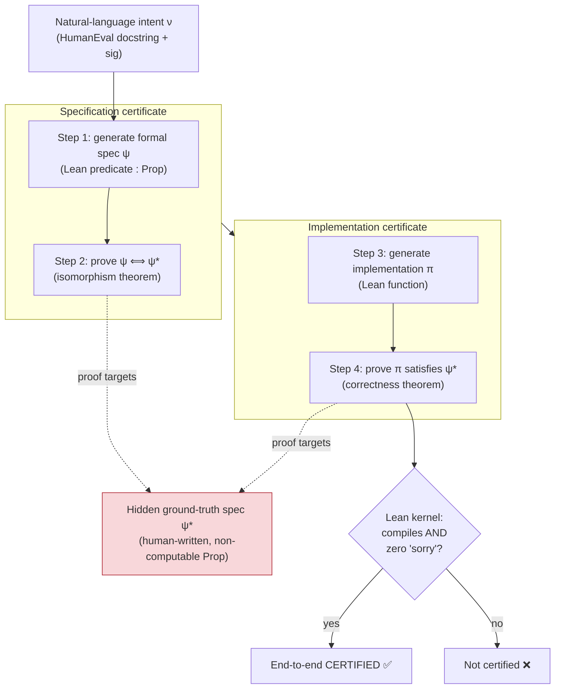
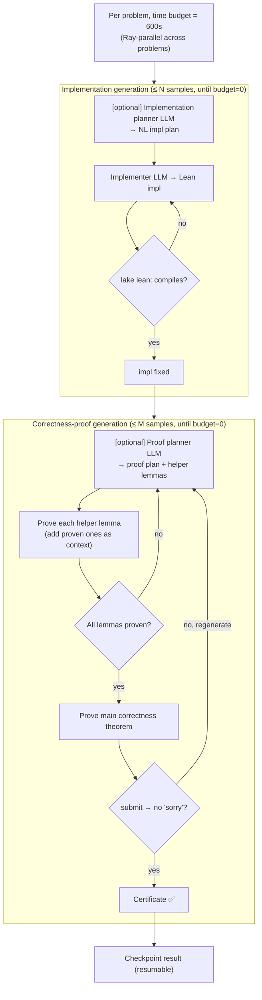

# CLEVER — Curated Lean Verified Code Generation Benchmark

> Per-source research findings. Reporter, not architect. Written incrementally.

---

## 1. Identity

- **Name:** CLEVER (Curated Lean Verified Code Generation Benchmark). Earlier README backronym: "Code Lean Evaluation for Verified End-to-end Reasoning".
- **What it is:** A **benchmark** (plus a companion baseline-prover repo) for **end-to-end, formally *verified* code generation in Lean 4**. It is *not* an agent or a training system — it is an evaluation harness that demands a model produce a formal specification, a proof that the spec is correct, a Lean implementation, and a proof that the implementation is correct — all machine-checked by Lean's kernel. 161 problems adapted from HumanEval.
- **Authors / org:** Amitayush Thakur, Jasper Lee, George Tsoukalas, Meghana Sistla, Matthew Zhao (UT Austin); Stefan Zetzsche (Amazon); Greg Durrett (UT Austin); Yisong Yue (Caltech); Swarat Chaudhuri (UT Austin). The "trishullab" GitHub org is Swarat Chaudhuri's Trishul Lab at UT Austin.
- **Dates:** arXiv v1 2025-05-20 (arXiv:2505.13938). Accepted to **NeurIPS 2025** Datasets & Benchmarks Track. `clever-bench` PyPI package version 1.6.0 ("Bump version from 1.5.0 to 1.6.0", commit 2026-04-03).
- **Primary links:**
  - Paper: https://arxiv.org/abs/2505.13938
  - OpenReview (NeurIPS 2025 D&B): https://openreview.net/forum?id=IbOacMF5qd
  - Benchmark repo: https://github.com/trishullab/clever
  - Baseline provers repo: https://github.com/trishullab/clever-prover
  - Leaderboard: https://trishullab.github.io/clever/leaderboard.html
  - HuggingFace dataset (per paper/README) and PyPI `clever-bench`.
- **Code inspected:**
  - `trishullab/clever` @ **`7d0e80f5b35383126148267c8bfbbd6fe8ff2309`** (main, version 1.6.0). Inspected via tarball (git clone blocked by sandbox proxy; tarball downloaded from codeload, SHA confirmed via GitHub API).
  - `trishullab/clever-prover` @ **`99593c2e983a233e51e6f1d3a29b8b5224050e4b`** (main). The baseline/agentic prover implementation with all the prompts and the control loop.

---

## 2. TL;DR

- **CLEVER reframes "correct code" as "code with a machine-checked proof against a hidden, human-written, non-computable formal spec."** No test cases, no LLM-judged correctness, no spec leakage — Lean's kernel is the sole, unfakeable arbiter. This is the cleanest possible instance of *verification as the ground truth signal*.
- The benchmark is **staged into 4 independently-checked subtasks**: (1) generate a formal spec, (2) prove it semantically equivalent ("isomorphic") to the held-out ground-truth spec, (3) generate an implementation, (4) prove the implementation satisfies the ground-truth spec. A run is "end-to-end" only if all proofs pass.
- The single most transferable design idea for us: **non-computable specifications** (Lean `Prop`s built from quantifiers/connectives that *cannot be evaluated*). This is a deliberate anti-reward-hacking device — the model cannot copy the spec into the implementation or trivially `decide` it, so a passing proof reflects genuine semantic reasoning, not pattern-matching.
- **The verifier is brutally simple and robust:** assemble a single `.lean` file, run `lake lean file.lean`, accept iff (a) it compiles (`returncode == 0`) AND (b) the build log contains zero `declaration uses 'sorry'` warnings. Binary, deterministic, kernel-backed.
- **Reality check on difficulty:** SOTA LLMs (GPT-4o, Claude-3.7, o4-mini, DeepSeek-R1) + a neuro-symbolic proof agent (COPRA) solve **at most 1/161 end-to-end** (only problem 53). Compilation rates are high (~76%) but *proofs* almost never pass. Verified code-gen is a wide-open frontier.
- **Relevance to a self-improving software agent: HIGH on the verification axis, LOW on the loop/orchestration axis.** CLEVER itself has no improvement loop, no memory, no evolution. But it is a near-perfect *fitness function*: a verifiable, un-gameable "is this candidate actually correct?" oracle — exactly the kind of signal a propose→test→keep-if-better loop needs. The companion `clever-prover` repo also contributes a concrete sample-and-retry control loop and a full set of reusable prompts.

---
## 3. What it does & how it works

### 3.1 The benchmark object (data model)

CLEVER adapts **161 of 164 HumanEval problems** into Lean 4. Each problem is a single `.lean` file in `src/lean4/human_eval/problem_{id}.lean` carved into named sections delimited by `-- start_def <key>` / `-- end_def <key>` comment markers (parsed by regex in `lean_parser_spec.py`). For each problem the file holds:

- `problem_details` — a YAML block with the Python `function_signature`, NL `docstring`, and `test_cases` (input/expected_output pairs). This is the *natural-language intent* (`ν`).
- `problem_spec` — the **human-written ground-truth formal spec** (`ψ*`), a Lean predicate `def problem_spec (impl : <sig>) (inputs...) : Prop`. Crucially written as a **non-computable `Prop`** (quantifiers, `∃`, `↔`, inductive relations).
- `generated_spec` (+ `generated_spec_body`) — a placeholder (`sorry`) the model fills in (`ψ`).
- `spec_isomorphism` (+ `spec_isomorphism_proof`) — the theorem `∀ impl, (∀ inputs, problem_spec impl inputs) ↔ (∀ inputs, generated_spec impl inputs)` plus the proof slot. This is the **"isomorphism" / semantic-equivalence** obligation.
- `implementation_signature` + `implementation` — the Lean function signature and the body the model writes (`π`).
- `test_cases` — Lean `#test` lines (sanity tests; *not* the correctness criterion).
- `correctness_definition` (+ `correctness_proof`) — theorem `correctness ... : problem_spec implementation inputs` plus the proof slot. This is the **implementation-correctness** obligation: the implementation must satisfy the *ground-truth* spec `ψ*` (not the model's own `ψ`).
- Optional `iso_helper_lemmas` / `correctness_helper_lemmas` — reusable lemmas (statement + proof) the model may introduce to structure a proof.
- `helper_definitions` — shared, problem-tagged definitions living in `Imports/AllImports.lean` (e.g. `fibonacci_non_computable`, `balanced_paren_non_computable`, Roman-numeral helpers). Each carries YAML metadata listing which `problems:` / `sample_problems:` it applies to, so the parser injects only the relevant ones.

In Python this maps to the `LeanProblem` dataclass (`clever_bench/lean_problem.py`) and a task-specific **`LeanProblemView`** that *hides* fields the model shouldn't see for a given subtask.

### 3.2 The four staged subtasks

The benchmark decomposes verified code-gen into four independently-checkable steps (paper Figure 1), grouped into two "certificates":

| Step | Name | Model must produce | Checked by |
|------|------|--------------------|-----------|
| 1 | Spec generation | `generated_spec` body (`ψ`) | compiles |
| 2 | Spec isomorphism proof | `spec_isomorphism_proof`: `ψ ↔ ψ*` | Lean kernel, no `sorry` |
| 3 | Implementation generation | `implementation` body (`π`) | compiles (+ `#test`) |
| 4 | Correctness proof | `correctness_proof`: `π` satisfies `ψ*` | Lean kernel, no `sorry` |

- **Spec certification = steps 1+2** (did the model understand the intent?).
- **Implementation certification = steps 3+4** (did it write provably-correct code?).
- A run is **end-to-end successful only if all four pass**. Key subtlety from the paper: the correctness proof (step 4) targets the **ground-truth** `ψ*`, *not* the model's generated `ψ` — so implementation evaluation is decoupled from the model's spec-writing ability.

> NOTE on naming: the `TaskComponent` enum in `lean_problem.py` orders them `SPEC_GENERATION (Task1)`, `IMPL_GENERATION (Task2)`, `PROOF_GENERATION (Task3)`, `SPEC_ISOMORPHISM (Task4)` — this differs from the README's Task1–4 wording. The enum is what the code keys on for field-hiding.



### 3.3 The verifier (the heart of CLEVER as a benchmark)

The entire trust model reduces to one operation in `clever_bench/task.py :: ProblemViewTask.submit_async`:

1. Take the model's filled-in `LeanProblemView`, overlay only the model-supplied fields onto a fresh ground-truth view (so the model cannot tamper with `problem_spec`/`correctness_theorem`).
2. Serialize to one `.lean` file via `format_problem_as_lean_with_line_ranges` (imports `Imports.AllImports`, then emits NL spec, generated spec, ground-truth spec, iso lemmas + theorem + proof, implementation, test cases, correctness lemmas + theorem + proof). Missing proofs default to `by sorry`.
3. Run `lake lean temp/<uuid>.lean` as a subprocess with a wall-clock timeout.
4. **Accept criteria:**
   - `compilation_ok = (returncode == 0)`.
   - Scan stdout for lines matching `"<file>:<line>:... declaration uses 'sorry'"`. If **zero** sorries → both `isomorphism_ok` and `correctness_ok` are `True` (gated on the corresponding proof being non-None). If any sorry remains → proofs are not accepted.
   - Timeout → everything `False`.

This is deliberately minimal and **un-gameable in the usual ways**: there is no test oracle to overfit, the proof must satisfy Lean's kernel, and `sorry` (the "trust me" escape hatch) is explicitly detected and rejected. The grading is binary and deterministic.

### 3.4 The companion solver loop (`clever-prover`)

`clever` is just the benchmark + verifier. The **agentic baselines** that actually try to solve it live in `trishullab/clever-prover`. Its production loop (`solver/impl_generator.py`, `solver/iso_generator.py`, driven by `main/eval.py`) is a **sample → verify → retry-within-time-budget** loop, optionally with planning and neuro-symbolic proof search:



The proof step itself uses one of two backends:
- **Few-shot prover** (`FewShotImplProverTool`): single LLM call produces a whole proof; validated by re-submitting to Lean.
- **COPRA** (`utils/copra.py` → `get_proof_via_copra`): a **stateful, single-tactic-at-a-time neuro-symbolic proof search agent** (Thakur et al., COLM 2024). It feeds the live Lean goal state, hypotheses, prior steps, *failed* steps (`[INCORRECT STEPS]`), and the last Lean error back into the model and asks for exactly **one** next tactic, backtracking on failure. `max_queries` doubles on each outer retry (`self.max_copra_queries *= 2`).


---

## 4. Evidence from the code

### 4.1 Files inspected

**`trishullab/clever` @ `7d0e80f`:**
- `src/clever_bench/lean_problem.py` (201 LOC) — `TaskComponent` enum, `LeanProblem` / `LeanProblemView` dataclasses, `format_problem_as_lean_with_line_ranges` (the file assembler).
- `src/clever_bench/task.py` (260 LOC) — `ProblemViewTask`, `ValidationResult`, `submit_async` (**the verifier**), field-hiding per task.
- `src/clever_bench/benchmark.py` (104 LOC) — loads all `.lean` problems, parses, sorts.
- `src/clever_bench/lean_parser_spec.py` (114 LOC) — `LeanSpecParser`: extracts `-- start_def/-- end_def` sections, parses YAML metadata, selects problem-tagged helper definitions.
- `src/clever_bench/setup.py` (52 LOC) — `clever-bench-install`: installs elan/Lean 4.15.0, runs `lake exe cache get && lake build`. (lakefile pins **Lean v4.24.0 / mathlib v4.24.0**; setup.py mentions 4.15.0 — minor inconsistency.)
- `src/lean4/human_eval/problem_*.lean` (161 problems), `src/lean4/Imports/AllImports.lean` (shared non-computable defs + `#test` sanity lines), `src/lean4/sample_examples/problem_{0..5}.lean` (fully-worked examples used in few-shot prompts).
- `src/scripts/score_solutions.py` — alternate scoring from a `lake build` log via regex for `declaration uses 'sorry'`.

**`trishullab/clever-prover` @ `99593c2`:**
- `src/clever_prover/solver/impl_generator.py` (552 LOC) — the impl+proof control loop.
- `src/clever_prover/solver/iso_generator.py` (551 LOC) — the spec+isomorphism-proof control loop.
- `src/clever_prover/solver/coordination_solver.py` (167 LOC) — a higher-level planner→implementer→prover chain (partly TODO/incomplete).
- `src/clever_prover/utils/copra.py` (164 LOC) — wraps the external COPRA prover.
- `src/clever_prover/main/eval.py` (437 LOC) — Ray-parallel per-problem driver with time budget + checkpointing.
- `src/clever_prover/prompts/clever_prompts/{system,examples}/*.md` — the actual prompts (Copra, Implementer, ImplementationPlanner, *ProofPlanner, Spec*).
- `src/clever_prover/main/configs/*.yaml` (28 configs) — model/strategy matrices (GPT-4o, Claude-3.7, o4-mini, DeepSeek-R1, GPT-5-mini, gpt-oss, Kimina, COPRA on/off, planner on/off).

### 4.2 The verifier, verbatim (`clever@7d0e80f:src/clever_bench/task.py`)

The sole correctness gate — run Lean, then check return code and `sorry`:

```python
proc = await asyncio.create_subprocess_exec(
    "lake", "lean", f"temp/{file_path.name}",
    cwd=str(self.lean_folder_path),
    stdout=asyncio.subprocess.PIPE,
    stderr=asyncio.subprocess.STDOUT
)
...
if proc.returncode != 0:
    return ValidationResult(..., compilation_ok=False, error_message=output, ...)
sorry_lines = self._extract_sorry_lines(output, filename)
if len(sorry_lines) == 0:
    return ValidationResult(
        isomorphism_ok=True and problem.isomorphism_proof is not None,
        correctness_ok=True and problem.correctness_proof is not None,
        compilation_ok=True, error_message="No sorries found", ...)
else:
    return ValidationResult(..., compilation_ok=True, error_message="Sorries found", ...)
```

```python
def _extract_sorry_lines(self, build_log: str, filename: str) -> list[int]:
    sorry_lines = []
    for line in build_log.splitlines():
        if f"{filename}:" in line and "declaration uses 'sorry'" in line:
            ...
            sorry_lines.append(line_no)
    return sorry_lines
```

> Implementation note / caveat: the live path treats **any** zero-`sorry` compile as both iso- and correctness-OK if the corresponding proof field is non-None. A finer-grained `_check_sorries_against_ranges` (mapping sorries to the iso vs correctness line-ranges) exists but is **commented out**. In practice the harness is used per-subtask (proofs for *other* sections are kept as the ground-truth proofs), so a leftover `sorry` in any section fails the submission.

### 4.3 Anti-leakage by construction: non-computable specs (verbatim)

Ground-truth spec for HumanEval-0 (`clever@7d0e80f:src/lean4/human_eval/problem_0.lean`) — note it is a `Prop` using `∃`/`¬`, not an executable `Bool`:

```lean
def problem_spec
(impl: List Rat → Rat → Bool)
(numbers: List Rat)
(threshold: Rat) :=
let numbers_within_threshold :=
(∃ i j, i < numbers.length ∧ j < numbers.length ∧
i ≠ j ∧ |numbers.get! i - numbers.get! j| < threshold);
let spec (res: Bool) :=
numbers.length > 1 →
if res then numbers_within_threshold else ¬numbers_within_threshold;
∃ result, impl numbers threshold = result ∧ spec result
```

Inductive *relation* used as a non-computable spec (`clever@7d0e80f:src/lean4/Imports/AllImports.lean`) — Fibonacci defined as a `Prop` relation `ℕ → ℕ → Prop`, deliberately not a computable function:

```lean
inductive fibonacci_non_computable : ℕ → ℕ → Prop
| base0 : fibonacci_non_computable 0 0
| base1 : fibonacci_non_computable 1 1
| step  : ∀ n f₁ f₂, fibonacci_non_computable n f₁ →
  fibonacci_non_computable (n + 1) f₂ →
  fibonacci_non_computable (n + 2) (f₁ + f₂)
```

The correctness theorem (problem 0) the model must prove — the implementation must satisfy `problem_spec` (the ground truth) for *all* inputs:

```lean
theorem correctness
(numbers: List Rat) (threshold: Rat)
: problem_spec implementation numbers threshold := by ...
```

The reference proof for problem 0 is **~225 lines of Lean tactics** (nested inductions, `by_cases`, `linarith`) — illustrating why this is far harder than miniF2F-style math proofs.

### 4.4 The COPRA proof-search prompt (verbatim, abridged) (`clever-prover@99593c2:.../system/Copra.md`)

The single-tactic, stateful, error-feedback proof agent — its instruction set encodes hard-won Lean tactic heuristics:

> "Start your response with `[RUN TACTIC]` followed by the tactic ... and then `[END]`. ... Do NOT finish the proof in one shot... Generate exactly ONE proof-step. ... The tactic `sorry` is NOT a valid proof step, do NOT generate it."

> "`[INCORRECT STEPS]` ... describes proof-steps which should NOT be generated ... DO NOT generate these `[INCORRECT STEPS]` again, as they are failed proof steps which have already been tried. Re-generating such proof steps will cause backtracking and early termination of your proof search."

> "`[LAST STEP]` ... If the proof-step was incorrect, then it is also followed by an error message from Lean 4 ... `[ERROR MESSAGE]` ... You can use the error message as guidance in predicting a correct proof-step."

Selected tactic heuristics it bakes in (useful, transferable Lean lore):
- "DO NOT USE the `cases`, `cases'`, `rcases`, or `by_cases` tactics multiple times in a row ... these can easily BLOW UP the number of goals."
- "the `linarith` tactic often fails to simplify subtraction ... instead of `a - b = c` ... use `a = b + c`."
- "variables created with `✝` suffix like `x✝` ... cannot be used ... use `rename_i` to rename them."
- "Do 'NOT' use `set_option maxRecDepth` or `set_option maxHeartbeats`" (prevents budget-cheating).

### 4.5 The proof state feed (verbatim) (`clever-prover@99593c2:.../examples/SpecCopra.md`)

How the live Lean goal is serialized back to the model each step (the "environment observation"):

```
[GOALS]
[GOAL] 1
(∀ (x y : ℤ), problem_spec impl x y) → ∀ (x y : ℤ), generated_spec impl x y
[HYPOTHESES] 1
[HYPOTHESIS] impl : ℤ → ℤ → Bool
[INFORMAL-THEOREM]
Given two integers x and y, your task is to find if x is a square of y. ...
[INFORMAL-PROOF]
1. Start by analyzing the generated specification. ...
[STEPS]
[STEP] intro impl
[STEP] apply Iff.intro
[LAST STEP]
unfold problem_spec
[ERROR MESSAGE]
The proof-step does NOT simplify the goal. Try stepping back with different proof-step.
[END]
```

### 4.6 The retry loop, verbatim (`clever-prover@99593c2:.../solver/impl_generator.py`)

Implementation generation = sample until it compiles or budget runs out:

```python
while not is_time_elapsed and not implementation_stable and implementation_sample_count < self.num_implementation_samples:
    problem = self.problem_view.get_view(self.problem_id)
    problem.implementation = None              # prevent leakage
    problem.correctness_helper_lemmas.clear()
    problem.correctness_proof = None
    lean_code = self._generate_impl(problem=problem, logger=logger)
    problem.implementation = lean_code
    validation_result = self._submit(problem, time_remaining_in_ms)
    implementation_stable = validation_result.compilation_ok
    ...
```

Proof generation escalates COPRA's search budget on each retry: `self.max_copra_queries = self.max_copra_queries * 2`.

The top-level driver (`main/eval.py`) wraps each problem in a `while generation_result == REGENERATE and timeout_in_secs > 0` loop, runs problems in parallel as `@ray.remote` tasks, decrements a shared 600s budget, and writes resumable checkpoints (`ExecutionInfo` per problem: `compiles`, `is_proven`, `generation_time`, `proof_time`, `attempt_count`).


---

## 5. What's genuinely smart

1. **Verification *is* the ground-truth signal — and it's un-gameable in the usual ways.** Most code-gen benchmarks grade with held-out test cases (overfittable) or LLM judges (hackable, noisy). CLEVER replaces both with Lean's kernel: a proof either type-checks or it doesn't. There is no partial credit, no fuzzy oracle, and the `sorry` escape hatch is explicitly detected and rejected. For anyone building a propose→test→keep-if-better loop, this is the gold-standard *fitness function*: a binary, deterministic, machine-checked "is this candidate actually correct against intent?" The model literally cannot fake its way past Lean.

2. **Non-computable specifications as a deliberate anti-reward-hacking device.** This is the single cleverest idea. If the ground-truth spec is an *executable* predicate (e.g. `decide`-able `Bool`), an LLM can copy the spec body verbatim into the implementation and discharge correctness with `by decide`/`rfl` — a vacuous "proof" that demonstrates no understanding. By writing specs as **non-computable `Prop`s** (existentials, `↔`, inductive relations like `fibonacci_non_computable`), the authors make the spec *unexecutable*: you cannot run it, cannot copy it as code, and cannot `decide` it. A passing correctness proof therefore *must* contain genuine semantic reasoning bridging the declarative spec and the operational implementation. The paper (Fig. 3) shows GPT-4o trivially "solving" the computable version and failing the non-computable one. **Generalizable lesson for us: when you let a model both write the test and pass it, make the test live in a representation the model cannot trivially satisfy by construction.**

3. **Spec/impl decoupling to localize failures.** The correctness proof targets the *human* ground-truth `ψ*`, never the model's own `ψ`. This means a model that writes a bad spec is not also penalized (or rewarded) on the implementation axis — the four sub-scores are independently diagnostic. For an evolutionary agent, this is the principle of *orthogonal, independently-checkable sub-objectives*, so you can tell *which* component regressed.

4. **The "isomorphism" obligation turns autoformalization into a checkable artifact.** Asking the model to *prove* its generated spec `ψ ⟺ ψ*` (rather than trusting a string match or an LLM judge) is what makes spec-generation gradeable at all. The paper notes a bonus: certified `(ν, ψ)` pairs from passing runs are **verified training data** that could bootstrap future autoformalizers — i.e. the benchmark can *mint* its own high-quality supervised data.

5. **The companion solver's control loop is a clean reference for verifier-in-the-loop generation.** `clever-prover` shows the practical pattern: (a) sample an implementation, immediately compile-check, retry until it type-checks or the budget expires; (b) optionally plan the proof, decompose it into helper lemmas, prove each lemma (carrying proven lemmas forward as context), then attempt the main theorem; (c) escalate search budget on retry (`max_copra_queries *= 2`); (d) checkpoint per-problem so runs are resumable; (e) parallelize across problems with Ray under a shared wall-clock budget. None of this is novel individually, but together it is a tidy, working harness for "generate → verify → retry."

6. **COPRA's stateful, single-step, error-fed proof search.** The COPRA prompt is a strong template for *closed-loop interaction with an external checker*: feed the live goal state + hypotheses + the *failed* steps (`[INCORRECT STEPS]`) + the last Lean error back to the model and demand exactly one next action. The explicit "do not repeat failed/last-successful steps (it causes backtracking)" instruction is a practical guard against loops — directly relevant to long-horizon agent reliability.

---

## 6. Claims vs. reality / limitations / critiques

### 6.1 What the authors claim vs. what the code shows
- **Claim:** all outputs are machine-checked by Lean; `sorry` is rejected. **Reality:** confirmed in code (`task.py`), modulo the caveat that the per-section sorry-attribution (`_check_sorries_against_ranges`) is commented out — the harness relies on submitting one subtask at a time with ground-truth proofs filling the other slots.
- **Claim:** specs are non-computable and leak-free. **Reality:** confirmed for the inspected problems (0, 3, 53, plus the inductive relations in `AllImports.lean`). This is a *manual curation* guarantee, not an automated one — so its integrity depends entirely on the authors' hand-authoring being correct (see 6.3).
- **Claim:** SOTA models solve "up to 1/161 end-to-end." **Reality:** confirmed by the leaderboard — *every* listed configuration (GPT-4o, Claude-3.7, DeepSeek-R1, GPT-OSS-20b, GPT-4o-mini, GPT-5-mini+Kimina), with or without COPRA, tops out at **1/161 end-to-end, and it is always Problem 53 ("add x y", spec `res - x - y = 0`)** — the most trivial problem in the set. Spec-certification is markedly harder than impl-certification (e.g. DeepSeek-R1: 1/161 spec vs 9/161 impl).

### 6.2 Intrinsic limitations
- **Scope is narrow & possibly contaminated.** 161 short, self-contained HumanEval functions (list/string/number algorithms). No stateful programs, no I/O, no concurrency, no real software systems. HumanEval is also heavily present in pretraining corpora.
- **Heavy dependency surface.** Requires Lean 4 (pinned v4.24.0) + the *entire* Mathlib (`import Mathlib`) + `lake exe cache get`. Builds are slow and version-fragile (setup.py even references a different Lean 4.15.0). The whole signal hinges on a correctly-built toolchain.
- **`#test` lines are sanity checks, not the metric** (and the paper says so) — but they do gate `compilation_ok` in the impl stage, so a wrong implementation that still type-checks-with-tests can pass step 3 while failing step 4.
- **Coarse live verifier.** As shipped, the live `submit_async` marks both iso- and correctness-OK on any zero-sorry compile; fine-grained attribution is disabled. Not a soundness hole in the intended per-subtask usage, but a sharp edge for anyone repurposing it.

### 6.3 The major independent critique — benchmark bugs + isomorphism-scoring is fragile
A **2026 follow-up study, "Agentic Proving for Program Verification"** (evaluating **Claude Code / Claude Opus 4.6** in a compiler-in-the-loop agentic setup on CLEVER; summarized at kurate.org and discoverable via OpenReview) reports findings that sharply revise CLEVER's "frontier" framing:
- **Near-saturation, not a frontier:** Claude generates defensible specs for **98.8%** of problems (81.3% accepted by CLEVER's isomorphism scoring on the correct subset), certifies implementations against correct ground-truth specs for **87.5%**, and hits **98.1% end-to-end** over entries with self-consistent premises. This is a *dramatic* gap vs the paper's ≤1/161 few-shot numbers — the difference is the **agentic, compiler-in-the-loop loop with a strong 2026 model** (and a much larger 3600s/attempt budget vs CLEVER's 600s).
- **~50% of ground-truth specs are buggy:** the study flags **80/161 ground-truth specifications** as having issues (a detailed error taxonomy), arguing many problems have ambiguous NL or inconsistent `ψ*`.
- **Isomorphism-based spec scoring breaks down** when the NL description is ambiguous: a "defensible" spec may not be provably isomorphic to a (possibly buggy) reference, so the iso-proof metric can reject correct specs and is not a clean autoformalization oracle.
- Caveats on *that* critique (per a reviewer summary): single-model, used a *custom fork* with formatting/test fixes (reproducibility concern), very generous timeout, and self-evaluation of "spec validity" by the authors without blinding. Independent concurrent work (e.g. the Lean/Dafny/Verus "vericoding" benchmark, OpenReview svyjoTT47M; VERINA, Ye et al. 2025) also notes spec-quality issues across such benchmarks.

**Net:** CLEVER's *design principles* (kernel-checked, non-computable, staged) are sound and influential, but (a) the headline "models can barely do this" result was an artifact of weak few-shot scaffolding + weaker-2025 models and is **already largely overturned by 2026 agentic provers**, and (b) the hand-curated ground truth has a substantial bug rate, and the isomorphism metric is not a flawless spec oracle. Treat CLEVER as a *strong idea with a noisy instantiation*.


---

## 7. Relevance to a self-improving, evolutionary agent

Relevance test: *would this help build a self-improving, evolutionary, software-building agent?* CLEVER itself is a **benchmark**, not an agent — it has no loop, no memory, no self-modification. But the project crystallizes the *verification* piece, which the brief identifies as the crux. Mapping to the components our project cares about:

- **Verification / the fitness function (HIGH).** This is the bullseye. CLEVER demonstrates the strongest possible "keep only if verifiably better" oracle: a machine-checked proof against a hidden, leak-proof formal spec. An evolutionary loop that mutates code and "keeps if it passes tests" is only as trustworthy as its tests; CLEVER shows how to make that signal *un-spoofable* (kernel-checked) and *non-gameable* (non-computable spec). The transferable principle: **whenever the agent both proposes and is judged, ensure the judge is in a representation the agent cannot trivially satisfy by mirroring** — exactly the failure mode (`return 0` passing a leaky spec; copy-the-spec-as-code) CLEVER was designed to defeat. This guards against the reward-hacking / test-gaming that an open-ended self-improving loop will otherwise discover.

- **Self-generated, verified training data (MEDIUM–HIGH).** The isomorphism mechanism mints *certified* (NL-intent, formal-spec) pairs and (spec, verified-implementation, proof) tuples. A self-improving agent could harvest its own passing runs as a growing, *guaranteed-correct* corpus to fine-tune on — a clean, hallucination-free flywheel for the "self-improving" goal.

- **Verifier-in-the-loop generation + retry (MEDIUM).** `clever-prover`'s loop (sample → compile-check → retry under a time budget; escalate search budget on retry; checkpoint for resumability; Ray-parallel across tasks) is a concrete, working template for the inner "propose → test" loop, including long-horizon reliability features (resumable checkpoints, per-attempt budgets).

- **Decision-making under an external checker (MEDIUM).** COPRA's design — observe the live checker state, propose ONE action, get error feedback, explicitly avoid repeating failed/last actions, backtrack — is a reusable pattern for any agent that operates a tool/compiler in a tight loop over a long horizon.

- **Decomposition / planning (LOW–MEDIUM).** The proof-planner → helper-lemma → main-proof decomposition mirrors subgoal decomposition useful for any long task, with a nice rule baked in: *only emit lemmas that are necessary; if the proof is simple, emit zero.*

- **Memory / orchestration / self-modification (LOW).** CLEVER contributes essentially nothing here. The "memory" is just proven helper lemmas carried forward within a single problem's proof attempt; there is no cross-task memory, no agent that rewrites itself, no population/evolutionary search. Look elsewhere (DGM, AlphaEvolve, etc.) for those.

**Honest bottom line:** CLEVER is *directly* relevant as a **verification methodology and a fitness-function design pattern**, and *somewhat* relevant via its companion solver's control loop. It is *not* a source for the evolutionary/self-improvement machinery itself. Its biggest cautionary lesson for us is double-edged: (1) formal verification gives an un-spoofable signal, but (2) the *ground truth itself can be buggy* (≈50% spec bug rate found by later auditors), so even a "formal" fitness function must be validated — a verifier is only as trustworthy as the spec it checks against.

---

## 8. Reusable assets (collected as evidence — not assembled into a design)

### 8.1 The verifier pattern (schema + accept rule)
- **`ValidationResult` schema** (`clever@7d0e80f:src/clever_bench/task.py`): `namedtuple("ValidationResult", ["problem_id","isomorphism_ok","correctness_ok","compilation_ok","error_message","lean_code"])`.
- **Accept rule:** assemble one source file → run the checker as a subprocess with a wall-clock timeout → `compilation_ok = (returncode == 0)` → scan the log for the "trust-me" escape token (`declaration uses 'sorry'`); accept only if **zero** found. (Verbatim in §4.2.)
- **Anti-tamper:** model-supplied fields are overlaid onto a fresh ground-truth view so the candidate cannot rewrite the spec/theorem it is graded against (`submit_async`, only `*_generated`, `implementation`, `*_proof`, `*_helper_lemmas` are taken from the submission).

### 8.2 Candidate / problem data schema
- **`LeanProblem` / `LeanProblemView`** dataclasses (`clever@7d0e80f:src/clever_bench/lean_problem.py`): a clean separation of *intent* (`problem_spec_nl`), *hidden ground truth* (`problem_spec_formal_ground_truth`, `correctness_theorem`), *candidate artifacts* (`problem_spec_formal_generated`, `implementation`, `correctness_proof`, helper lemmas), with a `hide_params(*names)` method to produce task-specific views that withhold information the solver shouldn't see. A good template for "one record, multiple role-scoped views."
- **Section-tagged source format**: `-- start_def <key> ... -- end_def <key>` markers parsed by regex, with per-item YAML metadata (`problems: [...]`) controlling which shared helpers are injected. Lightweight, language-agnostic way to carve structured slots out of a source file.

### 8.3 Prompts (verbatim, cite precisely)
- **COPRA single-step proof-search system prompt** — `clever-prover@99593c2:src/clever_prover/prompts/clever_prompts/system/Copra.md` (full text quoted in §4.4). Reusable for any compiler/checker-in-the-loop agent: structured observation (`[GOALS]/[HYPOTHESES]/[STEPS]`), one action per turn, explicit `[INCORRECT STEPS]` / `[LAST STEP]+[ERROR MESSAGE]/[SUCCESS]` feedback channels, anti-repeat / anti-blowup guardrails, and a curated list of Lean tactic heuristics.
- **Proof-state serialization example** — `.../examples/SpecCopra.md` (quoted §4.5): how to feed a live checker state + informal hints back to the model.
- **Implementer system prompt** — `.../system/Implementer.md` (quoted §3.4/§4): "generate a Lean def matching this signature; write it so termination is auto-verified; prefer library functions or `match`; never use `in`." A template for "generate code against a formal spec + tests + plan."
- **Implementation/Proof planner prompts** — `.../system/ImplementationPlanner.md`, `.../system/ImplProofPlanner.md` (quoted §7): decompose into *necessary-only* helper lemmas (statement first, tactics later), then a high-level NL plan; "if the proof is simple, output ZERO lemmas." Reusable subgoal-decomposition scaffold.
- 28 ready-made **experiment configs** (`.../main/configs/*.yaml`) parameterizing model × strategy × COPRA-on/off × planner-on/off × budgets — a template for running an evaluation matrix.

### 8.4 Control-loop patterns
- **Generate→verify→retry under a shared time budget**, with `num_*_samples` caps and budget decrement (`impl_generator.py`, §4.6).
- **Escalating search budget on retry** (`max_copra_queries *= 2`).
- **Lemma-by-lemma proving with proven lemmas carried forward as context** (`_generate_proof_for_all_lemmas`), assembling a "you may freely use these helper lemmas" block.
- **Ray-parallel per-task execution with resumable `ExecutionInfo` checkpoints** (`main/eval.py`, `main/checkpoint.py`): fields `problem_id, attempt_count, task_type, generation_time, proof_time, total_time, compiles, is_proven`.

### 8.5 The anti-leakage spec idioms (Lean, verbatim in §4.3)
Inductive-relation specs (`fibonacci_non_computable : ℕ → ℕ → Prop`) and `∃ result, impl x = result ∧ <Prop about result>` framing — the concrete recipe for writing specifications a generator cannot copy into code or `decide` away.

---

## 9. Signal assessment

- **Overall value: MEDIUM–HIGH (high on the verification axis; low on loop/orchestration/memory).** As a *methodology for un-gameable, intent-faithful verification* — the exact crux the project flags — it is high signal. As a *source of evolutionary/self-improvement machinery*, it is low signal (it has none). The companion `clever-prover` adds a solid, if conventional, verifier-in-the-loop control loop and a strong set of reusable prompts.
- **Confidence: HIGH on mechanism** (I read the actual benchmark code and verifier, the solver loop, and the verbatim prompts; SHAs recorded). **HIGH on the headline difficulty numbers** (corroborated by the leaderboard HTML and the paper). **MEDIUM on the critique magnitude** (the ~50% spec-bug-rate and 98% agentic-solve come from a single 2026 follow-up study read via secondary summary/abstract, with its own reproducibility caveats — credible and partially corroborated, but I did not read that paper's full text or re-run it).
- **What I could NOT verify:**
  - I did **not** build Lean/Mathlib or execute `submit_async` end-to-end (no Lean toolchain in sandbox), so the verifier behavior is read from source, not run.
  - I did not independently audit the 161 ground-truth specs for bugs; I report the follow-up study's claim.
  - The `#test` macro's exact definition lives in a dependency (Mathlib/itp-interface), not in-repo; it gates `compilation_ok` but is not the correctness metric.
  - I inspected `clever-prover` source but did not run any baseline, so per-config numbers are taken from the published leaderboard, not reproduced.
  - HuggingFace dataset contents were not separately inspected (the repo's `.lean` files are the authoritative source I read).

---

## 10. References

**Primary — paper & official:**
- [P] CLEVER paper, arXiv:2505.13938 (v1 2025-05-20; HTML v4). "CLEVER: A Curated Benchmark for Formally Verified Code Generation." Thakur, Lee, Tsoukalas, Sistla, Zhao, Zetzsche, Durrett, Yue, Chaudhuri. https://arxiv.org/abs/2505.13938
- [P] NeurIPS 2025 D&B proceedings page. https://proceedings.neurips.cc/paper_files/paper/2025/hash/a7f67788f7b4d77fa7cd6887de3dcbe7-Abstract-Datasets_and_Benchmarks_Track.html
- [P] OpenReview (NeurIPS 2025 D&B, camera-ready): https://openreview.net/forum?id=IbOacMF5qd ; earlier version https://openreview.net/forum?id=pqNFDA2TFm
- [P] CLEVER leaderboard (all configs cap at 1/161 e2e = Problem 53): https://trishullab.github.io/clever/leaderboard.html (also `clever@7d0e80f:docs/leaderboard.html`)
- [P] Lean Zulip announcement thread (authors): https://leanprover-community.github.io/archive/stream/219941-Machine-Learning-for-Theorem-Proving/topic/CLEVER.3A.20A.20Benchmark.20for.20Verified.20Code.20Generation.20in.20Lean.html

**Primary — code (inspected):**
- [P] Benchmark + verifier: `github.com/trishullab/clever` @ `7d0e80f5b35383126148267c8bfbbd6fe8ff2309` (v1.6.0). Key: `src/clever_bench/{task.py,lean_problem.py,benchmark.py,lean_parser_spec.py,setup.py}`, `src/lean4/human_eval/problem_*.lean`, `src/lean4/Imports/AllImports.lean`, `src/lean4/sample_examples/problem_{0..5}.lean`, `src/scripts/score_solutions.py`.
- [P] Baseline provers + prompts + loop: `github.com/trishullab/clever-prover` @ `99593c2e983a233e51e6f1d3a29b8b5224050e4b`. Key: `src/clever_prover/solver/{impl_generator.py,iso_generator.py,coordination_solver.py}`, `src/clever_prover/utils/copra.py`, `src/clever_prover/main/{eval.py,checkpoint.py,parse_config.py}`, `src/clever_prover/prompts/clever_prompts/{system,examples}/*.md`, `src/clever_prover/main/configs/*.yaml`.
- [S] PyPI package: https://pypi.org/project/clever-bench/

**Secondary — critiques & related benchmarks:**
- [S] "Agentic Proving for Program Verification" (2026) — Claude Code/Opus 4.6 near-saturates CLEVER (98.1% e2e on self-consistent entries); audits CLEVER and flags ~50% (80/161) ground-truth spec bugs; critiques isomorphism-based scoring. Read via Kurate summary + reviewer notes: https://kurate.org/paper/9690523c-db23-496d-ba49-ae073e0be9a2 (uses `lean4-skills` + `lean-lsp-mcp`). [NOT independently re-run.]
- [S] Vericoding benchmark (Dafny/Verus/Lean), OpenReview svyjoTT47M — situates CLEVER among spec-from-doc benchmarks; notes spec-quality / trivial-solution issues across the field; Lean vericoding success ~27% off-the-shelf. https://openreview.net/pdf?id=svyjoTT47M
- [S] COPRA proof agent (the neuro-symbolic prover used as a baseline): Thakur et al., "An In-Context Learning Agent for Formal Theorem-Proving," COLM 2024, arXiv:2310.04353. https://arxiv.org/abs/2310.04353
- [S] FVAPPS (Dougherty & Mehta, 2025, arXiv:2502.05714) and VERINA (Ye et al., 2025) — prior/parallel verified-code-gen benchmarks CLEVER contrasts itself against (leaky/auto-generated specs).
