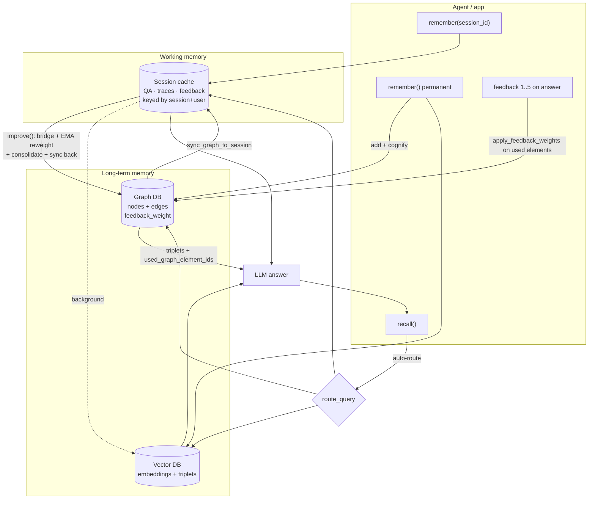
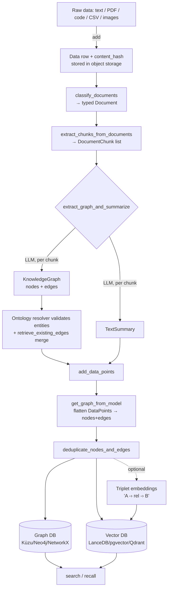
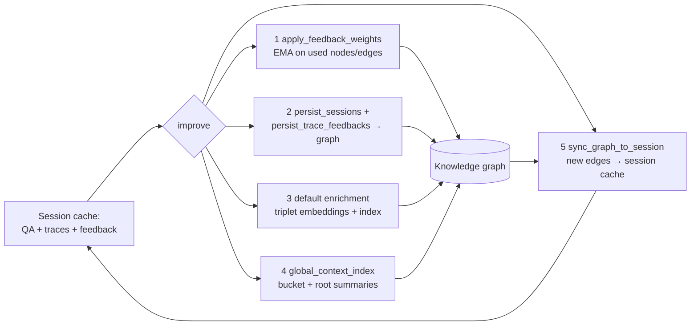

# Cognee (topoteretes) — Research Findings

> Per-source deep dive for the KB Seed AI project. Reporter, not architect.
> Relevance test applied throughout: *would this help build a self-improving,
> evolutionary, software-building agent — especially its MEMORY?*

---

## 1. Identity

- **Name:** Cognee ("The Brain behind your Agents" / "memory for AI agents").
- **What it is:** An open-source **memory layer / knowledge-graph engine for AI
  agents**. It ingests arbitrary data, runs an **ECL pipeline (Extract → Cognify
  → Load)** that turns text/docs/code into a combined **knowledge graph + vector
  index**, and exposes a **search/retrieval API** so agents can recall facts,
  relationships, and prior decisions with context. Self-describes as a "memory
  control plane."
- **Authors / org:** **topoteretes** (company behind Cognee). Lead author /
  maintainer **Vasilije Marković** (GitHub `Vasilije1990`); co-authors on the
  paper Lazar Obradović, László Hajdu, Jovan Pavlović. Backed by a hosted
  product ("Cognee Cloud") and a community (r/AIMemory, Discord).
- **Dates:** Active project; inspected release **v1.1.2**, merge commit dated
  **2026-05-30**. Research paper *"Optimizing the Interface Between Knowledge
  Graphs and LLMs for Complex Reasoning"* (arXiv:2505.24478, 2025).
- **Primary links:**
  - Repo: https://github.com/topoteretes/cognee
  - Docs: https://docs.cognee.ai/
  - Paper: https://arxiv.org/abs/2505.24478
  - Community plugins: https://github.com/topoteretes/cognee-community
- **Code repo + commit inspected:**
  `github.com/topoteretes/cognee` @ **`cfb0aa4d0b3ae0154cf9f24e5908263d565341f4`**
  (branch `main`, "Release v1.1.2 from dev to main (#2935)", 2026-05-30).
  Inspected via codeload tarball (direct git clone blocked by sandbox proxy).

---

## 2. TL;DR

- Cognee is a **production-grade, batteries-included memory engine**: it takes
  raw data, LLM-extracts an entity/relationship **knowledge graph**, stores it
  in a **graph DB + vector DB simultaneously**, and serves it back through a
  search API with ~10 search modes. This is exactly the "durable, queryable
  knowledge that accumulates" component our project calls out.
- The core abstraction is a **task pipeline (`Task` + `run_pipeline`)** with a
  clean **ECL** decomposition. Every "memory operation" (ingest, cognify,
  enrich, search) is a list of composable async tasks operating on `DataPoint`
  objects (Pydantic models that are *simultaneously* graph nodes and vector
  records).
- A **v2 "memory-oriented" API** (`remember` / `recall` / `forget` / `improve`)
  was layered on top in v1.1.x, plus **session memory** (a fast cache that syncs
  to the graph in background) and a **Claude Code plugin** that captures tool
  calls into memory via lifecycle hooks — directly relevant to long-horizon
  coding agents.
- **Memory enrichment ("memify")** is the most interesting-for-us subsystem:
  background pipelines that re-weight the graph by **feedback** and **access
  frequency**, **consolidate duplicate entity descriptions**, build **global
  context indices**, and persist **agent traces + feedback** back into the
  graph. This is a concrete, code-level pattern for memory that *improves over
  time*.
- It has **temporal-graph** support (events with timestamps, `valid_at` /
  interval edges) — a lighter cousin of bi-temporal KG systems like Graphiti/
  Zep, not as rigorous on invalidation but real and code-backed.
- Honest signal: **medium-high** for memory architecture and reusable patterns;
  the "self-improving" parts are heuristic weighting, not true learning. It is
  not an evolutionary/agentic code-builder itself.

---

## 3. What it does & how it works

### 3.1 The big picture

Cognee is a Python library + FastAPI service + CLI + local UI. The fundamental
job: **turn arbitrary data into a knowledge graph that lives in BOTH a graph DB
and a vector DB, then serve it back via a search API.** Pluggable adapters mean
the graph store can be Kùzu (embedded, default), Neo4j, NetworkX, Neptune, or a
Postgres-backed adapter; the vector store can be LanceDB (default), pgvector,
Qdrant, Weaviate, Milvus, etc.; the relational store (metadata, users, sessions)
is SQLite or Postgres.

There are **two API layers** that both compile down to the same task pipeline:

- **v1 (classic ECL):** `add()` → `cognify()` → `search()` (+ `memify()`,
  `delete()`, `prune()`).
- **v2 (memory-oriented, added in v1.1.x):** `remember()` / `recall()` /
  `forget()` / `improve()`, plus **session memory** and typed `MemoryEntry`
  objects (`QAEntry`, `TraceEntry`, `FeedbackEntry`, `SkillRunEntry`).
  `remember()` is literally `add()`+`cognify()`(+`improve()`); `recall()` wraps
  `search()` with auto-routing and session/graph merging.

The overall memory lifecycle — fast session cache, permanent graph+vector store,
background consolidation, and the retrieval→feedback loop — looks like this:



### 3.2 The ECL pipeline (Extract → Cognify → Load)

This is the load-bearing mechanism and it is explicitly labeled in the code.
From `cognee/api/v1/cognify/cognify.py::get_default_tasks`
(`repo@cfb0aa4:cognee/api/v1/cognify/cognify.py`), the default pipeline is a
list of five `Task`s:

```python
default_tasks = [
    # EXTRACT: classify raw Data items into typed Document objects
    Task(classify_documents),
    # EXTRACT: split Documents into semantic text chunks
    Task(extract_chunks_from_documents, max_chunk_size=..., chunker=chunker),
    # COGNIFY: LLM-extract entities and relationships into a knowledge graph
    # COGNIFY: LLM-summarize each chunk for retrieval
    Task(extract_graph_and_summarize, graph_model=graph_model, config=config,
         custom_prompt=custom_prompt, task_config={"batch_size": chunks_per_batch}),
    # LOAD: persist nodes, edges, and embeddings to graph/vector DBs
    Task(add_data_points, embed_triplets=embed_triplets,
         task_config={"batch_size": chunks_per_batch}),
    Task(extract_dlt_fk_edges),
]
```

- **Extract** = `add()` (ingest bytes/files/text → a relational `Data` row with
  a `content_hash`, stored in object storage) followed by `classify_documents`
  (assign a `Document` subtype: PdfDocument, TextDocument, CodeDocument,
  DltRowDocument for structured rows, etc.) and `extract_chunks_from_documents`
  (semantic chunking with token budget).
- **Cognify** = `extract_graph_and_summarize`, which runs *two* LLM tasks
  concurrently per chunk via `asyncio.gather`: (1) `extract_graph_from_data` →
  an LLM produces a structured `KnowledgeGraph` (nodes + edges) per chunk;
  (2) `summarize_text` → a `TextSummary` per chunk. Entities are validated
  against an **ontology resolver** and merged with existing edges.
- **Load** = `add_data_points`, which flattens the Pydantic `DataPoint` graph
  into nodes+edges (`get_graph_from_model`), **deduplicates**, then writes to
  the graph engine AND indexes embeddings in the vector engine (a single
  "hybrid write" if the engine supports it, otherwise two parallel writes).
  Optionally also builds **triplet embeddings** (`source -› rel -› target`
  strings) for triplet-level retrieval.



### 3.3 The `DataPoint`: a node and a vector record at once

The single most important data structure is **`DataPoint`**
(`repo@cfb0aa4:cognee/infrastructure/engine/models/DataPoint.py`), a Pydantic
`BaseModel` that every graph node subclasses (Entity, EntityType, DocumentChunk,
TextSummary, Triplet, NodeSet, etc.). Key fields:

```python
class DataPoint(BaseModel):
    id: UUID = Field(default_factory=uuid4)
    created_at: int; updated_at: int           # ms epoch timestamps
    ontology_valid: bool = False
    version: int = 1                            # bumped by update_version()
    topological_rank: int | None = 0
    metadata: MetaData = {"index_fields": []}   # which fields get embedded
    type: str                                   # = class name
    belongs_to_set: list[DataPoint] | list[str] | None
    source_pipeline: str | None                 # provenance
    source_task: str | None                     # provenance
    source_node_set: str | None
    source_user: str | None
    source_content_hash: str | None             # provenance → source data
    feedback_weight: float = 0.5                # ← learning signal
    importance_weight: float | None = 0.5       # ← learning signal
```

Three design choices matter for a memory system:

1. **Deterministic identity → dedup.** If a subclass declares
   `identity_fields` (or annotates fields with `Dedup()`), the `id` is a
   **UUID5** hashed from those field values: `uuid5(NAMESPACE_OID,
   f"{class_name}:{value1|value2}")` (values lowercased, spaces→underscores).
   So the same entity (e.g. Entity "Albert Einstein") ingested twice gets the
   **same node id** → the graph upsert naturally merges it. This is Cognee's
   primary dedup mechanism.
2. **Embeddable fields are declarative.** `Annotated[str, Embeddable()]` (or an
   explicit `metadata["index_fields"]`) tells the loader which text to send to
   the vector index. One Pydantic class drives both the graph node shape and the
   vector record.
3. **Provenance + weights are first-class.** Every node carries where it came
   from (`source_pipeline`, `source_task`, `source_content_hash`) and two
   mutable scalar weights (`feedback_weight`, `importance_weight`) used by the
   enrichment/retrieval layers (see §3.5).

### 3.4 The pipeline/task engine

`run_pipeline` executes an ordered list of `Task`s; each `Task`
(`repo@cfb0aa4:cognee/modules/pipelines/tasks/task.py`) wraps a function,
coroutine, generator, or async-generator and yields results in **batches**
(`task_config["batch_size"]`). A `Task` can be marked `enriches=True` (mutate in
place, pass input through) and tasks receive an optional `ctx` `PipelineContext`
(user, dataset, data_item). Pipelines are **incremental**: each `Data` item has a
status (`DataItemStatus`), and `cognify(incremental_loading=True)` + a pipeline
cache skip already-processed items (keyed by content hash). Execution can be
blocking, background (asyncio task), or **distributed** (Modal workers — see
`run_tasks_distributed.py` and the `distributed/` deploy scripts).

### 3.5 Memory enrichment ("memify") — the part that "improves over time"

`memify()` (`repo@cfb0aa4:cognee/modules/memify/memify.py`) is a generic
**extraction-tasks → enrichment-tasks** pipeline that operates *on the existing
graph*: "If no data is provided existing knowledge graph will be used as data"
(via `get_memory_fragment`, optionally filtered by `node_type`/`node_name`).
On top of it sit several concrete, code-backed enrichment pipelines
(`repo@cfb0aa4:cognee/memify_pipelines/`):

- **`apply_feedback_weights`** — turns session feedback (1–5 ratings on Q&A
  answers) into updated `feedback_weight` on exactly the nodes/edges that were
  *used during retrieval* for that answer (`used_graph_element_ids`). The update
  is a clipped **exponential moving average**:
  `w' = w + α·(r − w)`, `r = (score−1)/4 ∈ [0,1]`, `α∈(0,1]` (default 0.1),
  clipped to [0,1] (`tasks/memify/apply_feedback_weights.py::stream_update_weight`).
- **`apply_frequency_weights`** — boosts `importance_weight` of nodes/edges by
  how often they're accessed.
- **`consolidate_entity_descriptions`** — for each Entity, gather its
  neighborhood and ask an LLM to rewrite a single canonical description (a
  dedup/merge of redundant descriptions).
- **`persist_sessions_in_knowledge_graph`** / **`persist_agent_trace_feedbacks_in_knowledge_graph`**
  — cognify session Q&A and per-step agent tool-call traces into the permanent
  graph (node-sets `user_sessions_from_cache`, `agent_trace_feedbacks`).
- **`global_context_index`** — build hierarchical bucket+root summaries over the
  graph for fast wide retrieval.
- **`create_triplet_embeddings`** — index `A -› rel -› B` triplet strings.

`improve()` (`repo@cfb0aa4:cognee/api/v1/improve/improve.py`) orchestrates these
into a 5-stage flow when given `session_ids` (else just stage 3):



### 3.6 Session memory and the agent loop

`remember(data, session_id=...)` writes to a **session cache** (a fast
relational/Redis-style store keyed by `(session_id, user_id)`) instead of the
graph, and — if `self_improvement=True` (default) — kicks off a background
`improve()` that *bridges* that session into the permanent graph. `recall()`
with a `session_id` searches the session cache first (keyword/token overlap),
then falls through to the graph, and can also surface a distilled
`graph_context` snapshot that `improve()` previously synced back into the
session. This is the "fast working memory that consolidates into long-term
memory" pattern, and it is exactly what the **Claude Code plugin** uses:
`SessionStart` init, `PostToolUse` → `TraceEntry`, `UserPromptSubmit` → inject
recalled context, `PreCompact` preserve, `SessionEnd` → `improve()` bridge.

### 3.7 Retrieval / query

`recall()` → `route_query()` (a rule-based, no-LLM weighted classifier) picks
one of ~16 `SearchType`s, then `authorized_search` runs the matching retriever.
GRAPH_COMPLETION (the default) does **vector search → graph expansion → LLM
answer over the assembled subgraph context**. Notable retrieval knobs:
`feedback_influence` (let `feedback_weight` re-rank triplets),
`triplet_distance_penalty`, `wide_search_top_k`, and `neighborhood_depth`.

The full `SearchType` enum (`repo@cfb0aa4:cognee/modules/search/types/SearchType.py`):
`SUMMARIES, CHUNKS, RAG_COMPLETION, TRIPLET_COMPLETION, GRAPH_COMPLETION,
GRAPH_COMPLETION_DECOMPOSITION, GRAPH_SUMMARY_COMPLETION, CYPHER,
NATURAL_LANGUAGE, GRAPH_COMPLETION_COT, GRAPH_COMPLETION_CONTEXT_EXTENSION,
FEELING_LUCKY, TEMPORAL, CODING_RULES, CHUNKS_LEXICAL, AGENTIC_COMPLETION`.

**Closing the feedback loop:** When the session cache is enabled,
`GraphCompletionRetriever.get_completion_from_context` extracts the `node_ids`
and `edge_ids` of the triplets it actually used (`extract_from_edges`) and stores
them on the QA entry as `used_graph_element_ids`. Later, when feedback arrives,
`apply_feedback_weights` re-weights *exactly those* elements. This is the
mechanism that ties "this answer was good/bad" back to "these specific graph
edges deserve more/less trust."

---

## 4. Evidence from the code

Repo: `github.com/topoteretes/cognee` @ `cfb0aa4` (v1.1.2). Python package root
`cognee/`. Files inspected (paths relative to package root):

| Area | File(s) |
|---|---|
| ECL pipeline definition | `api/v1/cognify/cognify.py` |
| Extract (graph) | `tasks/graph/extract_graph_from_data.py`, `tasks/graph/extract_graph_and_summarize.py` |
| LLM graph extraction | `infrastructure/llm/extraction/knowledge_graph/extract_content_graph.py` |
| Graph-extraction prompt | `infrastructure/llm/prompts/generate_graph_prompt.txt` (+ `_simple/_strict/_guided/_oneshot` variants) |
| Core data structure | `infrastructure/engine/models/DataPoint.py` |
| Load | `tasks/storage/add_data_points.py` |
| Task engine | `modules/pipelines/tasks/task.py`, `modules/pipelines/operations/run_pipeline.py` |
| Enrichment ("memify") | `modules/memify/memify.py`, `memify_pipelines/*.py` |
| Feedback weighting | `tasks/memify/apply_feedback_weights.py` |
| Skill self-improvement | `modules/memify/skill_improvement.py` |
| v2 memory API | `api/v1/remember/remember.py`, `api/v1/recall/recall.py`, `api/v1/improve/improve.py`, `api/v1/forget/forget.py` |
| Query auto-router | `api/v1/recall/query_router.py` |
| Retrieval | `modules/retrieval/graph_completion_retriever.py` (+ ~12 sibling retrievers) |
| Temporal model | `tasks/temporal_graph/models.py`, `modules/engine/models/Timestamp.py` |

### 4.1 The knowledge-graph extraction prompt (verbatim)

`repo@cfb0aa4:cognee/infrastructure/llm/prompts/generate_graph_prompt.txt` (the
default; selectable via `llm_config.graph_prompt_path`):

```
You are a top-tier algorithm designed for extracting information in structured formats to build a knowledge graph.
**Nodes** represent entities and concepts. They're akin to Wikipedia nodes.
**Edges** represent relationships between concepts. They're akin to Wikipedia links.
Every edge should include a description when the text supports relevant
information about the endpoints. ... Do not add outside knowledge.
  - Good: Alice works at Acme as a platform engineer on the search team.
  - Bad: This edge describes an employment relationship.
...
# 1. Labeling Nodes
**Consistency**: Ensure you use basic or elementary types for node labels.
  - ... always label it as **"Person"**. Avoid ... "Mathematician" ... keep those as "profession" property.
**Node IDs**: Never utilize integers as node IDs.
  - Node IDs should be names or human-readable identifiers found in the text.
...
# 3. Coreference Resolution
  - **Maintain Entity Consistency**: ... always use the most complete identifier ...
# 4. Strict Compliance
Adhere to the rules strictly. Non-compliance will result in termination
```

The LLM call is structured-output (`LLMGateway.acreate_structured_output(content,
system_prompt, response_model)`), where `response_model` defaults to the
`KnowledgeGraph` Pydantic schema (`shared/data_models.py`) — nodes with
`id/name/type/properties` and edges with
`source_node_id/target_node_id/relationship_name`. After extraction, edges whose
endpoints aren't in the node set are dropped, entities are validated against the
ontology resolver, and existing edges are merged (`retrieve_existing_edges` +
`expand_with_nodes_and_edges`). A user-supplied `custom_prompt` fully replaces
the system prompt (and there is a `custom_prompt_generation_*` prompt that lets
the system *write* an extraction prompt for a dataset).

### 4.2 The feedback-weight update (verbatim)

`repo@cfb0aa4:cognee/tasks/memify/apply_feedback_weights.py`:

```python
def normalize_feedback_score(feedback_score: int) -> float:
    """Map feedback score 1..5 to 0..1."""
    ...
    return (feedback_score - 1) / 4

def stream_update_weight(previous_weight: float, normalized_rating: float, alpha: float) -> float:
    """Streaming update with clipping to [0, 1]."""
    updated = float(previous_weight) + alpha * (normalized_rating - float(previous_weight))
    final_score = max(0.0, min(1.0, float(updated)))
    return round(final_score, FEEDBACK_WEIGHT_DECIMALS)
```

This is a standard EMA/online-learning update toward the rating, scoped to the
graph elements that produced the rated answer. It is idempotent per QA (a
`memify_metadata` flag marks a QA as already applied).

### 4.3 The skill self-improvement loop (verbatim core)

`repo@cfb0aa4:cognee/modules/memify/skill_improvement.py::improve_skill` — a
**proposal-first** procedure-improvement loop. It (1) finds recent `SkillRun`
records that *errored or scored below `score_threshold`*, (2) asks an LLM to
rewrite the SKILL.md procedure given the failure evidence, (3) stores a
`SkillImprovementProposal(status="proposed")` in the graph, and (4) only mutates
the skill text when re-invoked with `apply=True` + the `proposal_id`:

```python
return await generate_completion(
    query=("Propose a revised skill procedure. Return proposed_procedure as a complete "
           f"SKILL.md body that starts with '# {skill.name}'. Write direct instructions "
           "for the agent to follow, not prose about what the skill should do. "
           "Do not mutate state."),
    context=context,   # skill name+desc+current procedure + failure runs
    ...
    response_model=SkillImprovementDraft,   # proposed_procedure, rationale, confidence
)
```

`_find_recent_failure_runs` selects on `run.success_score < score_threshold or
error_type/error_message`. This is the closest thing in the repo to an
evolutionary "keep only if verifiably better" loop — but the "verification" is
an LLM rationale + human apply, not an automated benchmark.

### 4.4 Temporal model

`repo@cfb0aa4:cognee/tasks/temporal_graph/models.py` — `temporal_cognify=True`
swaps the pipeline to extract `Event`s with `time_from`/`time_to` `Timestamp`s
(year required; month/day/h/m/s default) and `Interval`s, then builds a graph
from events. There is **no `valid_at`/`invalid_at` edge-level bi-temporal model**
the way Graphiti/Zep have; time is modeled as event attributes and queried via
the `TEMPORAL` retriever and `extract_query_time` prompt.

### 4.5 Deletion / "forget" (no soft-invalidation)

`repo@cfb0aa4:cognee/api/v1/forget/forget.py` — deletion is a **hard delete**
across relational+graph+vector stores, at four granularities (everything /
dataset / data-item / memory-only). `memory_only=True` deletes graph+vector but
keeps raw files and resets the cognify pipeline status so the item can be
re-cognified with new settings. There is no temporal supersession; updating a
fact means re-ingesting (UUID5 identity merges the node) or forgetting+re-adding.

---

## 5. What's genuinely smart

1. **`DataPoint` as a dual graph-node/vector-record with declarative
   embeddability and deterministic identity.** One Pydantic class defines (a) the
   node shape, (b) which fields get embedded (`Embeddable()` / `index_fields`),
   and (c) a content-addressed UUID5 id (`Dedup()` / `identity_fields`) that
   makes re-ingesting the same entity an automatic merge. This collapses a lot of
   graph+vector plumbing into the type system and gives dedup "for free."
   (`infrastructure/engine/models/DataPoint.py`)
2. **ECL as an explicit, composable task pipeline.** The `Task`/`run_pipeline`
   abstraction (batched, async, `enriches`-in-place, `ctx`-aware, incremental via
   content-hash status, optionally distributed) is a clean, reusable harness:
   *any* memory operation is "a list of tasks over DataPoints." `memify` reusing
   the same machinery to run *over the existing graph* (not just new input) is
   the elegant part.
3. **A real, code-backed "memory improves over time" subsystem (`improve` /
   `memify`).** Feedback-weighted edges (EMA), frequency weighting, LLM entity-
   description consolidation, global-context summarization, and session→graph
   bridging are all implemented, not just slideware. The **feedback loop is
   closed**: retrieval records `used_graph_element_ids`, and ratings re-weight
   exactly those elements.
4. **Session memory + permanent memory with background consolidation.** The
   working-memory-to-long-term-memory bridge (`remember(session_id=...)` →
   background `improve()` → `sync_graph_to_session`), with a per-session mutex so
   idle-watcher/SessionEnd/auto-improve don't double-process, is a thoughtful
   long-horizon design. The **Claude Code plugin** wiring it to lifecycle hooks
   (`PostToolUse`→trace, `UserPromptSubmit`→inject, `PreCompact`→preserve,
   `SessionEnd`→bridge) is a concrete pattern for giving a coding agent durable
   cross-session memory.
5. **Proposal-first skill self-improvement.** Mining failed/low-scored
   `SkillRun`s to draft an improved SKILL.md, stored as a reviewable proposal that
   must be explicitly applied, is a safe, auditable shape for self-modification
   (`modules/memify/skill_improvement.py`).
6. **Rule-based query router with override telemetry.** No-LLM weighted-regex
   classifier into 16 search strategies, with negation handling and
   `record_override` tracking misroutes — cheap, debuggable auto-routing.
7. **Provenance on every node** (`source_pipeline`/`source_task`/
   `source_content_hash`/`source_user`) and **multi-tenant scoping** (tenant/
   user/dataset/data on every upsert) — the traceability/isolation a long-running
   shared agent memory needs.
8. **Ontology grounding (optional).** An ontology resolver can validate/normalize
   extracted entities (RDF/OWL), pulling `subClassOf`/object-property edges into
   the graph — useful when a domain has a real schema.

---

## 6. Claims vs. reality / limitations / critiques

- **"Memory" vs. "graph-RAG over a corpus."** Multiple independent reviewers
  conclude Cognee is *graph-RAG / knowledge-construction infrastructure*, not a
  chat-style memory layer. MCP.Directory: "It's closer to graph-RAG than to chat
  memory." Synix's source-level analysis classifies Cognee's update semantics as
  **"Append-only graph,"** temporal model **"None,"** memory consolidation
  **"None"** (at the time of their read). The "improves over time" framing is
  real in code but is heuristic weighting + LLM re-summarization, **not learning**
  and **not automated verification**.
- **No bi-temporal invalidation.** Unlike Graphiti/Zep (4 temporal fields per
  edge: `valid_from`/`valid_to`/`invalid_at`/created), Cognee has no edge-level
  validity windows. Contradicting facts both persist unless you forget+re-ingest.
  For an agent that must track "what is true *now*," this is a real gap. Several
  comparisons (vectorize.io, mcp.directory) position Zep, not Cognee, for
  temporal correctness.
- **Benchmark numbers are inconsistent and tuning-sensitive.** The paper
  (arXiv:2505.24478) shows HotpotQA Exact Match swinging from **0.042 → 0.667**
  purely via hyperparameter tuning (chunking, graph construction, retrieval,
  prompts) — strong evidence that out-of-the-box quality is *highly* sensitive to
  configuration. Vendor marketing cites HotpotQA "0.93"; the paper's own tuned
  number is 0.667 and the topic is *how to tune graph-RAG*, not a memory
  benchmark. Cognee's own eval blog candidly admits "LLM-as-a-judge metrics are
  not reliable," "F1 ... too granular for semantic memory," and that a competitor
  (Graphiti) reported better numbers on re-test. Treat all single-number claims
  skeptically.
- **Cost / latency.** LLM entity+relationship extraction per chunk is
  token-expensive and slow vs. vector-only memory; the broader literature (Mem0's
  own paper) found graph memory often "rarely justified its cost" (≈3× slower
  search, ≈2× tokens) for thin accuracy gains on LOCOMO. Cognee inherits this
  cost profile.
- **One external critique is partly wrong on provenance.** Synix claims "no
  provenance chain from a fact back to the conversation." The code *does* carry
  `source_content_hash`/`source_pipeline`/`source_task`/`source_user` on every
  `DataPoint`, and upserts are scoped by data_id — so a provenance chain exists at
  the node level. (It may not be surfaced in their tested retrieval path.) I flag
  this as a reviewer overstatement, verified against `DataPoint.py` and
  `add_data_points.py`.
- **Surface area / churn.** This is a large, fast-moving codebase (v1.1.2; the
  release notes rename "Dataset"→"Brain", add a frontend, etc.). The v2
  `remember/recall/improve/forget` API is recent and layered over v1; some pieces
  (background global-context indexing, cross-dataset session cleanup) are
  explicitly noted as "future enhancement"/"not supported yet" in code comments.
- **Python-only OSS; graph backend is operational overhead** for the
  non-embedded adapters (Neo4j-class). Comparisons note Cognee is "open core"
  with a paid cloud; some capabilities live in the hosted product.
- **Reproducibility:** I verified mechanisms by reading code at a pinned SHA, but
  did **not** run the pipeline or reproduce any benchmark. Accuracy/latency claims
  are unverified by me.

---

## 7. Relevance to a self-improving, evolutionary, software-building agent

Cognee is squarely a **MEMORY** building block, and several mechanisms map
directly onto our needs:

- **Durable, queryable, accumulating knowledge (the core ask).** The
  graph+vector dual store with declarative `DataPoint` types, deterministic
  dedup, and provenance is a strong template for "knowledge that accumulates over
  long runs" and can be queried by both similarity and relationship. *Helps with:*
  the central memory requirement.
- **Closed feedback→weight loop.** Recording `used_graph_element_ids` at
  retrieval time and EMA-re-weighting them on feedback is a clean, cheap way to
  let a memory *learn which stored facts/edges are trustworthy* without retraining.
  *Helps with:* "keep only if verifiably better," applied to memory entries — the
  signal could come from our verifier (test pass/fail) instead of a human 1–5
  rating.
- **Proposal-first self-modification of procedures (`improve_skill`).** Mining
  failed runs → LLM-drafted revised procedure → reviewable proposal → explicit
  apply is exactly the audited self-improvement shape an open-ended agent wants.
  *Helps with:* self-improvement of the agent's own skills/playbooks, with a
  human/automated gate.
- **Working→long-term memory consolidation + lifecycle hooks.** The session
  cache → background `improve()` → graph, and the Claude-Code hook mapping
  (capture tool calls as traces, inject recalled context on each prompt, preserve
  across compaction, bridge at session end), is a ready-made pattern for running
  a coding agent reliably over long horizons. *Helps with:* long-horizon running
  and cross-session continuity.
- **Task/pipeline harness.** The batched, async, incremental, `enriches`-in-place
  `Task`/`run_pipeline` engine is a reusable scaffold for *any* "process over
  memory" job (re-embedding, consolidation, re-weighting), including running
  enrichment over the existing graph rather than only new input. *Helps with:*
  orchestration and maintenance of the memory substrate.
- **Rule-based router + override telemetry.** A no-LLM weighted classifier that
  also logs when it was overridden is a cheap, debuggable decision component and
  a model for collecting self-correction signal. *Helps with:* fast routing/
  decision-making with a built-in feedback channel.
- **CODING_RULES / code retrievers + patch-gen prompts.** The repo has
  code-specific extraction (`extract_graph_from_code`), a `CODING_RULES` search
  type, a `coding_rule_association_agent` prompt pair, and patch-generation
  prompts (`patch_gen_instructions.txt`, `patch_gen_kg_instructions.txt`) — i.e.
  it already targets "memory of coding rules/patterns to inform patches." *Helps
  with:* a software-building agent recalling proven patterns.

What does **not** transfer: there is no evolutionary search, no
population/candidate model, no automated verifier that promotes only-if-better.
Cognee assumes an *external* signal (human ratings, or your own scores) and
optimizes memory around it.

---

## 8. Reusable assets

Quoted/cited precisely; collected as evidence only.

- **Graph-extraction system prompt** — verbatim in §4.1
  (`repo@cfb0aa4:cognee/infrastructure/llm/prompts/generate_graph_prompt.txt`),
  plus variants `generate_graph_prompt_{simple,strict,guided,oneshot}.txt` and a
  `custom_prompt_generation_{system,user}.txt` that auto-writes a per-dataset
  extraction prompt.
- **`DataPoint` schema** (§3.3) — a borrowable design for a memory record that is
  simultaneously a graph node and a vector doc, with provenance + mutable trust
  weights + content-addressed identity.
  (`repo@cfb0aa4:cognee/infrastructure/engine/models/DataPoint.py`)
- **EMA feedback-weight update** (§4.2) — `w' = w + α(r−w)` clipped to [0,1],
  applied to `used_graph_element_ids`.
  (`repo@cfb0aa4:cognee/tasks/memify/apply_feedback_weights.py`)
- **Proposal-first skill-improvement prompt + flow** (§4.3) — mine failed runs →
  draft revised SKILL.md → store proposal → explicit apply.
  (`repo@cfb0aa4:cognee/modules/memify/skill_improvement.py`)
- **`improve()` 5-stage consolidation orchestration** (§3.5 diagram) — a concrete
  recipe for "consolidate session activity into long-term memory + re-weight +
  re-summarize + sync back." (`repo@cfb0aa4:cognee/api/v1/improve/improve.py`)
- **`Task` / `run_pipeline` engine** (§3.4) — batched async task harness with
  `enriches`, `ctx`, incremental content-hash skipping, and distributed mode.
  (`repo@cfb0aa4:cognee/modules/pipelines/tasks/task.py`)
- **Rule-based query router** (§3.7) — weighted-regex classifier with negation
  window and override counting.
  (`repo@cfb0aa4:cognee/api/v1/recall/query_router.py`)
- **Claude Code memory-plugin lifecycle mapping** (README + §3.6) — hook→memory
  wiring for a long-horizon coding agent.
- **Triplet-string embedding format** — `f"{src} -› {rel}-›{tgt}"` for triplet-
  level vector retrieval. (`repo@cfb0aa4:cognee/tasks/storage/add_data_points.py`)

---

## 9. Signal assessment

- **Overall value: MEDIUM-HIGH** for our MEMORY component specifically; **LOW**
  for the evolutionary/verification core (Cognee provides none of that).
  - *High-signal, directly reusable:* the `DataPoint` dual-record design + UUID5
    dedup; the closed retrieval→feedback→EMA-reweight loop; the proposal-first
    skill self-improvement pattern; the session→graph consolidation + lifecycle
    hooks; the Task/pipeline harness.
  - *Medium-signal:* ontology grounding, global-context indexing, the 16-way
    retrieval taxonomy + router.
  - *Low/negative-signal:* benchmark claims (inconsistent, tuning-sensitive),
    temporal correctness (weak vs. Graphiti), cost profile of per-chunk LLM
    extraction.
- **Confidence:** High on *how it works* (read at pinned SHA `cfb0aa4`, traced
  the real call paths and data structures; quoted actual code/prompts). Medium on
  the *competitive/critique* framing (triangulated from several independent
  reviews of varying rigor; the strongest is synix.dev's source-level analysis,
  which I partially corrected on provenance).
- **Could NOT verify:** any accuracy/latency/cost number (did not run the
  pipeline or reproduce benchmarks); behavior of the non-default graph/vector
  adapters; the exact contents of the published Claude Code plugin repo
  (described from the README + the in-repo `improve`/trace code paths it relies
  on); whether `dev` (also 49.6MB) differs materially from `main`.

---

## 10. References

**Primary — code (read at pinned commit):**
- `github.com/topoteretes/cognee` @ `cfb0aa4d0b3ae0154cf9f24e5908263d565341f4`
  (v1.1.2, 2026-05-30). Key paths cited inline in §4; notably:
  `cognee/api/v1/cognify/cognify.py`, `cognee/infrastructure/engine/models/DataPoint.py`,
  `cognee/tasks/graph/extract_graph_from_data.py`,
  `cognee/infrastructure/llm/prompts/generate_graph_prompt.txt`,
  `cognee/tasks/storage/add_data_points.py`,
  `cognee/modules/pipelines/tasks/task.py`,
  `cognee/api/v1/{remember,recall,improve,forget}/*.py`,
  `cognee/tasks/memify/apply_feedback_weights.py`,
  `cognee/modules/memify/skill_improvement.py`,
  `cognee/api/v1/recall/query_router.py`,
  `cognee/modules/retrieval/graph_completion_retriever.py`,
  `cognee/tasks/temporal_graph/models.py`.

**Primary — project sources:**
- README: https://github.com/topoteretes/cognee/blob/main/README.md
- Docs: https://docs.cognee.ai/
- Paper: Markovic, Obradović, Hajdu, Pavlović, *"Optimizing the Interface Between
  Knowledge Graphs and LLMs for Complex Reasoning,"* arXiv:2505.24478 (2025).
  https://arxiv.org/abs/2505.24478
- Vendor eval blog (self-reported, candid about metric limits):
  https://www.cognee.ai/blog/deep-dives/ai-memory-tools-evaluation
- Vendor benchmark blog: https://www.cognee.ai/blog/deep-dives/knowledge-graph-memory-benchmarks
- Community plugins / Claude Code integration:
  https://github.com/topoteretes/cognee-community ,
  https://github.com/topoteretes/cognee-integrations/tree/main/integrations/claude-code

**Secondary — independent analyses/comparisons:**
- Synix, *"Agent Memory Systems: A Source-Level Analysis of Eight Architectures"*
  (source-level, rigorous): https://synix.dev/articles/agent-memory-systems/
- Codepointer, *"Agent Memory Systems and Knowledge Graphs: Letta, Mem0,
  Graphiti, and Cognee"* (2026-05-28):
  https://codepointer.substack.com/p/agent-memory-systems-and-knowledge
- Vectorize, *"Zep (Graphiti) vs Cognee"* (2026):
  https://vectorize.io/articles/zep-vs-cognee
- MCP.Directory, *"Best AI Agent Memory 2026: Mem0 vs Letta vs Zep vs Cognee"*:
  https://mcp.directory/blog/mem0-vs-letta-vs-zep-vs-cognee-2026
- WeavAI, *"Cognee 2026 Review: GraphRAG, Ontology AI Memory Layer"*:
  https://weavai.app/blog/en/2026/05/09/cognee-2026-review-graphrag-ontology-ai-memory-layer/
- Contrast point (graph memory cost): Mem0 paper arXiv:2504.19413 (LOCOMO; graph
  variant ≈3× slower search, ≈2× tokens for thin gains) — as summarized by
  Codepointer above.
