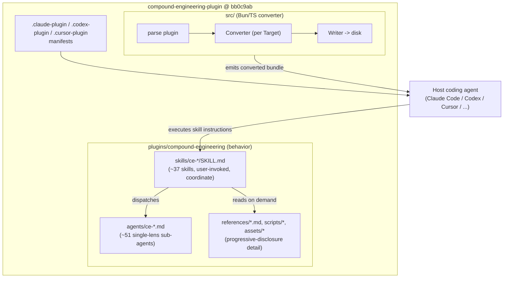
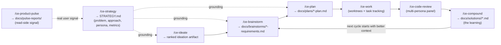
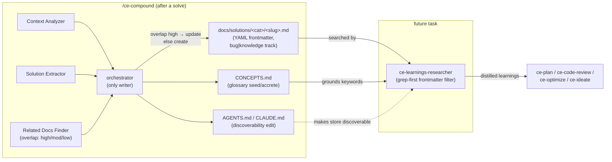

# Compound Engineering Plugin (EveryInc / Kieran Klaassen & Dan Shipper, maintained by "obra"-style single author)

> **One-source findings doc.** Researching exactly one source: the **`compound-engineering`
> plugin** by **Every Inc** — a multi-harness coding-agent plugin (Claude Code, Codex,
> Cursor, Copilot, Gemini, OpenCode, Pi, Kiro, Qwen, Droid) that operationalizes Every's
> "**compound engineering**" methodology: *each unit of engineering work should make the
> next one easier.* It is **not** an autonomous evolutionary system, but it ships a large
> library of **skills** (~37) and **sub-agents** (~51) plus two mechanisms that are very
> on-theme for us: (1) **`/ce-compound`** — a structured "capture a solved problem as a
> reusable, searchable learning doc" accumulator (the *compounding memory*), and (2)
> **`/ce-optimize`** — a metric-driven **propose→test→keep-if-verifiably-better** loop
> with git-worktree experiments, hard gates + LLM-as-judge, an append-only experiment log,
> and KEEP/REVERT promotion. That second skill is essentially a hand-written, harness-only
> version of the evolutionary builder loop our project is chasing.

---

## 1. Identity

- **Name:** `compound-engineering` (the marquee plugin; the repo also ships a small
  `coding-tutor` plugin). npm package `@every-env/compound-plugin`. Marketed simply as
  "Compound Engineering."
- **What it is:** "AI skills and agents that make each unit of engineering work easier than
  the last." (README.md). A **distributable plugin** of Skills, Agents, Commands, and Hooks
  installed into a coding-agent platform, plus a **Bun/TypeScript converter** (`src/`) that
  translates the Claude-Code-native plugin format into nine other agent platforms.
- **Author / org:** **Every Inc** (every.to) — the methodology "compound engineering" is
  associated with **Kieran Klaassen** (GM of Every's "Cora" product) and **Dan Shipper**
  (Every CEO), per Every's own essays. The repo's `About Contributions` note is written in
  the first person by a single maintainer who refuses outside PRs ("it's my name on the
  thing… I'll have Claude or Codex review submissions via `gh` and independently decide") —
  the same authorial voice and policy as Jesse Vincent's `superpowers`, but the org is
  EveryInc and the methodology branding is Every's.
- **Dates:** Actively, heavily developed. Inspected tree's files dated `2026-06-05`; the
  `docs/brainstorms/` and `docs/plans/` directories are a dense dated changelog of its own
  development from `2026-02-08` through `2026-06-04`. CHANGELOG.md is 56 KB.
- **Primary links:**
  - Repo: https://github.com/EveryInc/compound-engineering-plugin
  - Essay: "Compound Engineering: how Every codes with agents"
    https://every.to/chain-of-thought/compound-engineering-how-every-codes-with-agents
  - Essay: "My AI Had Already Fixed the Code Before I Saw It" (the story behind compounding
    engineering) https://every.to/source-code/my-ai-had-already-fixed-the-code-before-i-saw-it
  - npm: https://www.npmjs.com/package/@every-env/compound-plugin
- **Code repo + commit inspected:** `github.com/EveryInc/compound-engineering-plugin`,
  branch `main`, **HEAD `bb0c9ab4ee596d546f2965222e0ec8c2a097ae53`** (latest commit on the
  commits/main.atom feed dated **2026-06-05T07:05:03Z** at inspection). `git clone` was
  blocked by the sandbox proxy (HTTP 407); inspected via the codeload tarball
  (`codeload.github.com/EveryInc/compound-engineering-plugin/tar.gz/refs/heads/main`), which
  has no `.git` — the SHA is the atom feed's top entry, so it is the **branch HEAD at
  inspection, not byte-verified against the tarball** (tarball file mtimes are 2026-06-05
  09:05, consistent).
- **License:** MIT.

---

## 2. TL;DR

- **It is primarily a prompt/skill/agent library + a multi-harness installer, not a
  research system.** The "engine" is the host coding agent. There is no continuously-running
  daemon, no weight training, no population evolving on its own. Self-improvement is
  *human-in-the-loop and asset-accumulating*: the system gets better because it writes down
  reusable **learnings**, **plans**, **brainstorms**, **concepts**, and **skills** that
  future runs read.
- **`/ce-compound` is the load-bearing "compounding memory" mechanism.** It captures a
  *just-solved* problem into a structured, YAML-frontmattered Markdown "learning" under
  `docs/solutions/<category>/`, with explicit **overlap detection** (update vs create),
  **bug-track vs knowledge-track** schemas, a **vocabulary capture** step that grows a
  `CONCEPTS.md` glossary, and a **discoverability check** that edits `AGENTS.md`/`CLAUDE.md`
  so future agents *find* the store. This is a concrete, working design for agent memory
  that compounds.
- **`/ce-optimize` is a hand-written evolutionary loop and the single most relevant artifact
  for us.** Define a measurable goal → build a measurement harness → generate 10–30
  hypotheses → run each as a **git-worktree experiment** (or delegate to Codex) → measure →
  **degenerate hard gates** then optional **LLM-as-judge** scoring → **KEEP if it beats the
  current best by more than the noise threshold, else REVERT** → cherry-pick file-disjoint
  runners-up → write learnings → generate new hypotheses → repeat until target/plateau/
  budget. It even cites **Karpathy's autoresearch** ("writes to `results.tsv` after every
  single experiment") as the rationale for its append-only persistence discipline.
- **The methodology is "80% planning & review, 20% execution," expressed as a pipeline of
  skills:** `ce-strategy → ce-ideate → ce-brainstorm → ce-plan → ce-work → ce-code-review →
  ce-compound`, each handing a durable artifact to the next. Review is multi-persona
  (dozens of single-lens reviewer sub-agents) with **confidence-anchored scoring** and an
  **autofix-class** taxonomy (apply silently / apply-after-confirm / human-only / advisory).
- **Why it matters for us:** it is a mature, dogfooded, *harness-only* instantiation of
  exactly our thesis — compounding assets + an evolve-and-keep-only-if-better loop — built
  on commercial agents, with real schemas, prompts, scripts, and crash-safety discipline we
  can study and borrow. It is also a working example of an agent system **improving itself**
  (the repo's own `docs/plans` and `docs/solutions/skill-design/` show the plugin using its
  own skills to design its next skills).
- **Honest signal: MEDIUM-HIGH.** Unusually rich and battle-tested for prompt craft; the
  `ce-optimize` and `ce-compound` designs are directly reusable. But: zero published
  outcome metrics or benchmarks, no automated end-to-end evaluation of whether "compounding"
  actually improves throughput, and the whole thing is a thin (if elaborate) layer over
  closed host agents. The verification inside `ce-optimize` is real; the verification of the
  *methodology's overall claim* is anecdotal (Every blog posts).

---

## 3. What it does & how it works

### 3.1 Architecture: a plugin + a converter, not a runtime

The repo has two layers:

1. **The plugin content** (`plugins/compound-engineering/`): pure Markdown skills
   (`skills/<name>/SKILL.md` + `references/*.md` + `scripts/*`), Markdown sub-agent
   definitions (`agents/ce-*.md`), command shims, and per-harness manifests
   (`.claude-plugin/`, `.codex-plugin/`, `.cursor-plugin/`). This is what actually shapes
   agent behavior. **There is no compiled engine here — the host agent executes the
   instructions.**
2. **The installer/converter** (`src/`, Bun + TypeScript): parses the Claude-native plugin
   and **converts** it into other harnesses' formats (OpenCode, Codex, Gemini, Pi, Kiro,
   Copilot, Droid, Qwen), mapping tools, permissions, hooks, and model names explicitly. The
   `CONCEPTS.md` vocabulary (Plugin / Skill / Agent / Target / Converter / Writer / Bundle /
   Marketplace) is the domain model of *this installer*.

A **Skill** is user-invoked and *coordinates* (it can progressively pull in its own
`references/*.md` and dispatch sub-agents); an **Agent** is a single-purpose worker a skill
dispatches into an isolated context and reads back a result (CONCEPTS.md). This Skill→Agent
fan-out is the core execution shape.



### 3.2 The compound-engineering pipeline (the methodology)

The README states the philosophy bluntly: **"Each unit of engineering work should make
subsequent units easier — not harder. 80% is in planning and review, 20% is in execution."**
The skills chain into a loop, each emitting a durable artifact the next stage reads:



"Each cycle compounds: brainstorms sharpen plans, plans inform future plans, reviews catch
more issues, patterns get documented." (README.md). Crucially, the artifacts are **files in
the repo** (`docs/brainstorms/`, `docs/plans/`, `docs/solutions/`, `STRATEGY.md`,
`CONCEPTS.md`), so the "memory" is durable, greppable, and reviewable — not hidden in a
vector DB.

### 3.3 `/ce-optimize`: the propose → test → keep-if-better loop (most relevant to us)

This is the skill that maps almost one-to-one onto our project's thesis. It is a
**metric-driven iterative optimization loop** that an LLM orchestrator drives by hand. The
operator writes (or co-authors) a YAML **spec** declaring a measurable goal; the loop then
generates hypotheses, runs each as an isolated git-worktree experiment, measures it, keeps
it only if it **verifiably** beats the current best, and repeats. The full control flow:

```mermaid
stateDiagram-v2
  [*] --> Setup
  Setup: Phase 0 — load/author spec (YAML), branch, scratch dir
  Scaffold: Phase 1 — build measurement harness, BASELINE, parallel probe (HARD GATE: user approves)
  Hyp: Phase 2 — generate 10–30 hypotheses (categories, priority, deps)
  Setup --> Scaffold
  Scaffold --> Hyp

  Hyp --> Batch
  state "Phase 3: optimization loop (batched)" as Loop {
    Batch: 3.1 select batch (diversity + priority)
    Dispatch: 3.2 spawn each hypothesis in its own worktree / Codex sandbox
    Measure: 3.3 run measure.sh -> JSON; write result.yaml + append log IMMEDIATELY + verify
    Gates: degenerate hard gates first (cheap)
    Judge: if gates pass & type=judge -> stratified-sample + LLM-as-judge
    Eval: 3.4 rank vs current best
    Batch --> Dispatch --> Measure --> Gates
    Gates --> Judge: pass
    Gates --> Reverted: fail (degenerate)
    Judge --> Eval
    Eval --> Kept: beats best > noise/min_improvement
    Eval --> Reverted: not better
    Kept: commit experiment branch -> merge to optimize/<spec>; new baseline
    Kept --> RunnerUp: try file-disjoint runners-up (cherry-pick + re-measure)
    Eval --> Digest
    Kept --> Digest
    Reverted --> Digest
    Digest: 3.5 write strategy-digest.md; generate NEW hypotheses from learnings
  }
  Digest --> Stop
  Stop: 3.6 stop? target / max_iter / max_hours / plateau / budget / empty backlog
  Stop --> Batch: no
  Stop --> Wrap: yes
  Wrap: Phase 4 — summarize; offer /ce-code-review, /ce-compound, PR
  Wrap --> [*]
```

Key properties that make this an *evolutionary* loop rather than a single-shot agent:

- **Population + selection.** A backlog of hypotheses (the "population") is sampled in
  batches; each is mutated code in an isolated worktree; only winners are merged onto the
  `optimize/<spec>` branch (which becomes the new baseline). Non-winners are reverted.
- **A real fitness function with anti-gaming.** Fitness = a hard scalar metric *or* an
  LLM-as-judge score, gated first by cheap **degenerate gates** ("all items in 1 cluster",
  "0% coverage"). The measurement harness and eval data are placed in `scope.immutable`, and
  the worker prompt says verbatim: *"The measurement harness and evaluation data are
  immutable by design — the agent cannot game the metric by changing how it is measured."*
- **Learnings feed back into proposal.** After each batch, a `strategy-digest.md` records
  which categories worked/failed and "the exploration frontier: what categories and
  approaches remain untried," and the orchestrator reads *that digest* (not its memory, not
  the full log) to generate the next hypotheses — an explicit exploration mechanism.
- **Crash-safe long-horizon persistence.** The skill is built to run "for hours" across
  context compaction and restarts: every experiment result is appended to
  `experiment-log.yaml` and a per-worktree `result.yaml` *immediately* after measurement and
  then **read back to verify**. It explicitly cites Karpathy's autoresearch
  (`results.tsv`-after-every-experiment) as precedent (see SKILL.md step 3.3).

### 3.4 `/ce-compound`: the compounding-memory write path

`/ce-compound` is run *right after* something is solved ("while context is fresh"). It
fans out parallel research subagents (Context Analyzer, Solution Extractor, Related Docs
Finder) that **return text only** (never write files), then the orchestrator assembles ONE
learning doc into `docs/solutions/<category>/<slug>.md` with YAML frontmatter. The doc is
classified into a **bug track** or **knowledge track** (different required fields), checked
for **overlap** against existing docs (update vs create), and the run also (a) grows a
`CONCEPTS.md` glossary (vocabulary capture) and (b) edits `AGENTS.md`/`CLAUDE.md` so future
agents discover the store (discoverability check). Retrieval is the mirror skill/agent
**`ce-learnings-researcher`**, invoked by `ce-plan`, `ce-code-review`, `ce-optimize`, and
`ce-ideate` — it grep-filters `docs/solutions/` frontmatter and distills the top matches
back into the active task. That write→retrieve pair is the whole "compounding" engine.



### 3.5 Multi-persona review = the everyday verifier

`/ce-code-review` and `/ce-doc-review` dispatch a **panel of single-lens reviewer
sub-agents** (43 agents in the tree; the blog says "12 subagents in parallel" per review,
selected by the diff — e.g. `ce-security-reviewer`, `ce-correctness-reviewer`,
`ce-performance-oracle`, `ce-scope-guardian-reviewer`, `ce-maintainability-reviewer`). Each
returns JSON conforming to a strict **findings schema** with a **discrete confidence anchor
(0/25/50/75/100)** and a severity (P0–P3); synthesis suppresses low-confidence/false
positives and routes the rest by an **autofix-class** taxonomy. This is the "review" half of
the methodology's "80% planning & review" — and it is the closest thing to a *general*
verifier in the system (as opposed to `ce-optimize`'s metric-specific one).

---

## 4. Evidence from the code

All paths below are relative to `EveryInc/compound-engineering-plugin@bb0c9ab`. The plugin
content lives under `plugins/compound-engineering/`. There is **no compiled engine**; the
"code" is (a) Markdown skills/agents the host LLM executes, (b) small shell/Python scripts,
and (c) the Bun/TS converter in `src/`. Inventory at this commit: **39 skill directories,
43 agent files** (the README claims "37 skills and 51 agents"; Every's guide says "40+
agents / 35+ skills / 30+ slash entry points" — the numbers drift across the 161 releases;
`plugin.json` version is **3.11.1**).

### 4.1 Files inspected (primary)

- `README.md`, `CONCEPTS.md`, `AGENTS.md` (repo root) — methodology, domain glossary, and
  the operating rules the plugin imposes on *its own* development.
- `plugins/compound-engineering/skills/ce-optimize/SKILL.md` + `references/*.yaml,*.md` +
  `scripts/{measure.sh,experiment-worktree.sh,parallel-probe.sh}` — the evolutionary loop.
- `plugins/compound-engineering/skills/ce-compound/SKILL.md` +
  `references/{schema.yaml,concepts-vocabulary.md}` + `assets/resolution-template.md` — the
  memory write path.
- `plugins/compound-engineering/agents/ce-learnings-researcher.md` — the memory read path.
- `plugins/compound-engineering/skills/ce-code-review/references/{findings-schema.json,subagent-template.md,action-class-rubric.md}` +
  `agents/ce-security-reviewer.md` — the review verifier.

### 4.2 The fitness function & anti-gaming (ce-optimize)

The optimization spec is a **three-tier metric**: *degenerate gates* (cheap boolean
rejects), then the *primary metric* (`hard` scalar **or** `judge` LLM score), plus logged-
but-never-gated *diagnostics* (`references/optimize-spec-schema.yaml`). The decisive
anti-reward-hacking move is structural: the measurement harness and eval data go in
`scope.immutable`, and the experiment worker is told (verbatim,
`references/experiment-prompt-template.md`):

> CRITICAL: Do not modify any file outside the mutable scope. The measurement harness and
> evaluation data are immutable by design -- the agent cannot game the metric by changing
> how it is measured.

The usage guide states the hard-vs-judge rule plainly (`references/usage-guide.md`):

> - If a hard metric captures "better," optimize the hard metric.
> - If a hard metric can be gamed, add LLM-as-judge.
> Example: lowering a clustering threshold may increase cluster coverage. That sounds good
> until everything ends up in one giant cluster. Hard metrics may say "improved"; an LLM
> judge sampling real clusters can say "this is trash."

The judge prompt forces calibrated, JSON-only output with an `"ambiguous"` self-flag and
"Score based on the rubric, not on how other items in this batch scored"
(`references/judge-prompt-template.md`). A separate **singleton** judge checks
false-negatives (items that *should* have clustered) — i.e. it scores *coverage failures*,
not just precision.

### 4.3 The candidate/experiment data structure (ce-optimize)

`references/experiment-log-schema.yaml` defines the durable state. The load-bearing field is
`outcome`, an explicit state machine the loop branches on:

```
measured | kept | reverted | degenerate | error
        | deferred_needs_approval | timeout | runner_up_kept | runner_up_reverted
```

with documented transitions (verbatim from the schema's comment block):

```
gates failed        -> outcome: degenerate
measurement error   -> outcome: error
gates passed -> persist raw metrics -> outcome: measured
  -> judge evaluated (if type: judge)
    -> best in batch, improved  -> outcome: kept
    -> runner-up, file-disjoint -> cherry-pick + re-measure
      -> combined better        -> outcome: runner_up_kept
      -> combined not better    -> outcome: runner_up_reverted
    -> not improved             -> outcome: reverted
Only 'kept' and 'runner_up_kept' produce a commit on the optimization branch.
```

Promotion rule (`SKILL.md` §3.4): only **commit + merge** the winner if it beats the
current best by **more than `measurement.stability.noise_threshold`** (hard) or
`minimum_improvement` (judge, default 0.3). The merged commit on `optimize/<spec>` becomes
the new baseline. The persistence discipline is the strongest part of the design — verbatim:

> **If you produce a results table in the conversation without writing those results to disk
> first, you have a bug.** … Karpathy's autoresearch writes to `results.tsv` after every
> single experiment — this skill must do the same with the experiment log.

Isolation is real git plumbing: `experiment-worktree.sh` does
`git worktree add -b optimize-exp/<spec>/exp-<NNN> .worktrees/optimize-<spec>-exp-<NNN> <base>`,
copies `.env*` and declared `shared_files` into each worktree, and supports
`create|cleanup|cleanup-all|count`. Backends are `worktree` (default, capped at 6 parallel)
or `codex` (Codex sandboxes, with an in-sandbox guard so it won't recursively delegate, and
a "3 consecutive failures → disable Codex, fall back to subagents" cascade).

### 4.4 The learning schema (ce-compound)

`references/schema.yaml` is the canonical frontmatter contract. A **learning** carries
`module`, `date`, `problem_type` (an enum that *determines the track*), `component`,
`severity`, plus track-specific fields: **bug track** requires `symptoms`, `root_cause`
(enum: `missing_association | missing_index | wrong_api | thread_violation | async_timing |
…`), `resolution_type`; **knowledge track** uses `applies_when` and otherwise loosens the
bug fields. Categories are auto-detected directories (`performance-issues/`,
`architecture-patterns/`, `tooling-decisions/`, `conventions/`, …). The retrieval agent
`ce-learnings-researcher` reads these via a **grep-first** strategy: extract keywords →
`content-search pattern="tags:.*(<kw>)" path=docs/solutions/ files_only=true` in parallel →
read only first ~30 lines (frontmatter) of matches → full-read only strong/moderate matches
→ "Return up to 5 findings." It also includes an honesty guard worth quoting:

> When a learning's claim conflicts with what you can observe in the current code or docs,
> flag the conflict explicitly rather than echoing the claim. … Research agents can be
> confidently wrong; never let a past learning silently override present evidence.

### 4.5 The review verifier schema (ce-code-review)

`references/findings-schema.json` (JSON-Schema draft-07) requires per finding: `title`,
`severity` (`P0`–`P3`), `file`, `line`, `why_it_matters`, `autofix_class`
(`gated_auto|manual|advisory`), `owner`, `requires_verification`, `confidence`, `evidence`
(≥1 item), `pre_existing`. The `confidence` enum is the interesting bit — **only
`0,25,50,75,100`**, each with a behavioral criterion, justified verbatim as anti-gaming:

> Float values (e.g., 0.73) are not valid -- the model cannot meaningfully calibrate at
> finer granularity, and discrete anchors prevent false-precision gaming.

Thresholds: suppress below 75, **except P0 at ≥50 survives** ("critical-but-uncertain issues
must not be silently dropped"). The subagent template ships a long **false-positive
suppression catalog** (pre-existing issues, lint-catchable nitpicks, intentional code,
already-guarded inputs, "consider adding X" with no failure mode, speculative future-work),
and forces *observable-behavior-first* `why_it_matters` writing with a weak-vs-strong
example. Each reviewer is operationally read-only except for writing its own findings JSON.

---

## 5. What's genuinely smart

This is the heart. The load-bearing ideas, ordered by relevance to a self-improving builder:

1. **The compounding-memory loop is a complete, file-based design for agent memory — and it
   closes.** Most "agent memory" demos store and never retrieve, or retrieve and never
   curate. CE has all four arcs: **write** (`ce-compound`, while context is fresh),
   **structure** (YAML frontmatter + bug/knowledge tracks + category dirs),
   **retrieve** (`ce-learnings-researcher`, grep-first, invoked automatically by plan/review/
   optimize/ideate), and **curate** (overlap-detection update-vs-create; `ce-compound-refresh`
   to fix stale/contradicted docs; `CONCEPTS.md` glossary so terms stay consistent). The
   memory is *plain Markdown in the repo*, so it is greppable, diff-reviewable, versioned by
   git, and distributed to teammates "for free" (Every's phrase). No vector DB, no embedding
   drift, no opaque store.

2. **The discoverability check is the non-obvious keystone.** A memory store only compounds
   if agents *find* it. `ce-compound` ends by editing `AGENTS.md`/`CLAUDE.md` so a fresh
   agent — even one without the plugin — learns the store exists, its structure, and when to
   consult it. And it's calibrated: "Keep the tone informational, not imperative … 'relevant
   when implementing or debugging in documented areas' rather than 'check before
   implementing'" — because imperative directives cause redundant reads. This is a subtle,
   correct insight about how injected instructions interact with an agent's own judgment.

3. **`ce-optimize` is a faithful, harness-only evolutionary loop with the right guardrails.**
   It has population (hypothesis backlog), variation (isolated worktree mutations), a real
   fitness function (hard gate → judge), selection (KEEP-if-better-than-noise else REVERT),
   recombination (file-disjoint runner-up cherry-picks), and an exploration mechanism (the
   `strategy-digest.md` "exploration frontier" drives next-hypothesis generation). It is
   essentially DGM/AlphaEvolve-shaped, but built entirely from prompts + git + shell with no
   training — exactly the "self-improve the harness, never the weights" stance our project
   takes.

4. **Anti-reward-hacking is designed in, twice.** (a) In `ce-optimize`, the evaluator lives
   in `scope.immutable` so the mutating agent literally cannot touch how it's scored, and
   `degenerate_gates` + a `singleton` judge catch the classic "optimize the proxy" failure
   (giant garbage cluster scores great on coverage). (b) In `ce-code-review`, the discrete
   5-point confidence anchors exist specifically to "prevent false-precision gaming," and the
   FP-suppression catalog kills the reviewer-noise failure mode. Both are concrete answers to
   "how do you keep an agent from gaming its own test?"

5. **Crash-safe long-horizon execution via write-then-verify-to-disk.** "The experiment log
   on disk is the single source of truth. The conversation context is NOT durable storage."
   Every result is appended *and read back to confirm* before proceeding; per-worktree
   `result.yaml` markers allow recovery of measured-but-unlogged experiments after a crash;
   resume re-reads everything from disk. This is the correct discipline for any agent meant
   to run for hours through context compaction — directly applicable to our open-ended loop.

6. **Fresh-subagent-per-task + return-text-not-files orchestration.** Across skills the
   pattern is: orchestrator stays in main context and is the *only writer*; subagents run in
   isolated contexts and **return distilled text** (research) or **compact JSON** (review,
   with a detail-tier written to a file artifact and a merge-tier returned). This keeps the
   orchestrator's context lean over long runs and avoids context rot — a reusable
   long-horizon pattern. (Every separately reports running "up to 80 sub-agents" for deep
   planning and "25 agents in parallel" via tmux.)

7. **Read-side product signal feeds the loop.** `ce-product-pulse` produces time-windowed
   reports of *what users actually experienced* (usage, errors, follow-ups) into
   `docs/pulse-reports/`, which the next `ce-strategy`/`ce-brainstorm` reads. This closes a
   real-world outcome loop around the agent's work — a signal source beyond unit tests.

8. **The repo dogfoods itself, visibly.** `docs/brainstorms/`, `docs/plans/`, and
   `docs/solutions/skill-design/` are a dense, dated record of the plugin using its own
   skills (`ce-brainstorm`→`ce-plan`→`ce-compound`) to design its next skills (e.g.
   `2026-03-29-iterative-optimization-loop-requirements.md` → the `ce-optimize` plan →
   `script-first-skill-architecture.md` learning). That is itself a working, if
   human-in-the-loop, example of an agent system improving its own harness — exactly our
   thesis, observable in the git tree.

---

## 6. Claims vs. reality / limitations / critiques

**What's claimed (Every's essays):** that "compound engineering" lets single-person teams
ship like five, that "each bug, failed test, or a-ha insight gets documented and used by
future agents," that the codebase gets *easier* over time, and (Dan Shipper/Kieran
Klaassen) that this will "become the default way software is built." ~18k GitHub stars and
reported users at Google/Amazon are real adoption signals.

**What the code/repo actually demonstrates:**
- The plugin **does** implement the loop it describes — the skills, agents, schemas, and
  scripts are real and detailed, not marketing. (B) is well-supported at the *mechanism*
  level.
- There **is** automated testing, but of the *plumbing*, not the *thesis*: `tests/` (Bun)
  covers the converter, writers, frontmatter validation, `pipeline-review-contract`,
  `review-skill-contract`, `skill-shell-safety`, `skill-agent-ce-prefix`, etc. There is one
  skill-level eval harness (`skills/ce-sessions/evals/` with `evals.json` + `grader.md`).
  None of this measures whether compounding improves engineering throughput or quality.
- **No quantified outcome metrics exist anywhere** — no shipping-velocity delta, review
  catch-rate, or defect-rate numbers. Independent reviewers note this explicitly
  (FlorianBruniaux's evaluation: "No quantified metrics — no 'X% improvement' … All claims
  are qualitative"). The central claim is, to date, **anecdote + plausibility**, not
  measured.

**Failure modes & critiques (well-documented):**
1. **"CE collapses if you skip the compound step."** The most cited critique (dev.to,
   ikramar): "CE without `/ce-compound` is not compound engineering — it's just a more
   verbose Claude Code session. … I've watched myself skip it under deadline pressure on
   three consecutive cycles before I noticed the framework had quietly become decorative."
   Compounding is **manual-trigger** and discipline-dependent. Kieran himself says he keeps
   it manual on purpose: "It's really easy to automatically run something and generate a lot
   of mess. … I still want to be in control." So the self-improvement is *not* autonomous.
2. **Operational weight / ceremony.** 39 skills + 43 agents is a large surface; multiple
   reviewers (Ry Walker, WhichAITools) flag that the full loop is overkill for small tasks
   and that adoption should be selective. The plugin's value is real only on "repeatedly
   ship meaningful changes."
3. **Parallel review blows the context window.** GitHub issue #166 (opened by Kieran):
   running 6+ review agents in parallel routinely hit Claude Code's context limit
   (exacerbated by Opus), "churning through 20% of my session limit in 10 minutes," forcing
   a `--serial` workaround and auto-serial fallback. A caution for us: naive
   fan-out-many-subagents does not scale for free — it interacts badly with host context
   limits and token budgets.
4. **Named-persona reviewers encode someone else's taste and can drift.** Agents like
   `ce-dhh-rails-style` / persona reviewers bake in opinions that (a) are awkward on a team
   ("the reviewer Claude is roleplaying as DHH is not a conversation I want at standup") and
   (b) depend on the base model's training and can go stale as the real person's views
   evolve. Several short agent files "may not be more effective than a well-crafted inline
   prompt" (FlorianBruniaux).
5. **`ce-optimize` is the least-proven skill in the repo.** It is sophisticated on paper but
   evidently new (born from a 2026-03-29 brainstorm/plan), ships explicit first-run safety
   rails ("optimize for signal and safety, not maximum throughput"), and I found **no
   example experiment logs, benchmark results, or case studies** of it actually converging on
   anything. Its quality claims are unverified; treat it as a well-designed *pattern*, not a
   proven engine. The judge cost cap (`max_total_cost_usd: 5` default) also hints the loop is
   expensive to run at scale.
6. **Thin layer over closed hosts.** The "engine" is Claude Code/Codex/etc. CE inherits
   their context limits, model-quality variance, caching quirks (its own AGENTS.md documents
   that plugin agent/skill prose is cached at session start and edits don't propagate
   in-session), and pricing. It is "Claude Code first; other platforms experimental."
7. **Single-maintainer, no-external-PR governance.** Like `superpowers`, the author refuses
   to merge outside contributions ("it's my name on the thing"). High velocity, but bus-
   factor and review-by-the-author's-own-agents are real considerations for reliance.

**Reproducibility:** the artifacts are fully open (MIT) and readable, so the *mechanisms*
reproduce trivially. The *benefit* ("work compounds, velocity rises") is not reproducibly
demonstrated — there is no benchmark to rerun.

**Confidence in the above:** High for the code mechanisms (read directly at `bb0c9ab`).
Medium for adoption/critique (triangulated from Every's posts + 4 independent reviews + one
GitHub issue). I could not byte-verify the tarball against the SHA, and I did not run the
plugin.

---

## 7. Relevance to a self-improving, evolutionary agent

Judged by the brief's test — *would this help build a self-improving, evolutionary,
software-building agent?* — CE is among the more directly relevant *engineering-practice*
sources, precisely because it is a working, harness-only instantiation of the same thesis.
Concrete transferable mechanisms, each tied to what it helps with:

- **Evolutionary build loop (propose→test→keep) → our core loop.** `ce-optimize` is a ready
  reference design: spec-driven goal, hypothesis backlog as population, worktree-isolated
  variation, three-tier fitness (gate→judge→diagnostics), KEEP-if-beats-noise / REVERT
  selection, file-disjoint recombination, plateau/budget stopping, learnings→next-hypotheses
  exploration. It shows how to do this with *only* prompts + git + shell (no training), which
  is exactly our HARNESS-ONLY constraint.
- **Anti-reward-hacking → "verifiably better."** The immutable-evaluator pattern (eval lives
  in `scope.immutable`, mutating agent literally can't touch how it's scored) plus
  degenerate gates + a coverage/singleton judge is a concrete answer to test-gaming. The
  discrete confidence anchors (no floats, "prevent false-precision gaming") apply to any
  self-evaluation step.
- **Compounding memory → assets that make future tasks easier.** The write/structure/
  retrieve/curate quartet (`ce-compound` → frontmatter schema → `ce-learnings-researcher` →
  `ce-compound-refresh`) is a complete, file-based memory design we can study for our
  accumulate-reusable-assets requirement. The **discoverability check** (auto-edit the
  agent's own root instructions so it *finds* its memory) is a non-obvious, high-value idea
  for keeping a growing asset store actually used.
- **Long-horizon reliability → running for hours.** Write-then-verify-to-disk, append-only
  logs, per-unit crash-recovery markers, "the conversation is not durable storage," resume-
  by-re-reading-disk: directly applicable to an unlimited-token open-ended loop that will
  cross many context compactions.
- **Orchestration topology → context management.** Orchestrator-as-sole-writer + fresh
  subagent-per-task returning distilled text/compact JSON (merge-tier vs detail-tier) is a
  reusable pattern for long runs. The **caveat from issue #166** is itself a lesson: cap
  parallel fan-out or it blows the host context/budget — favor serial or bounded concurrency.
- **Decision-making / planning altitude → good plans.** The pipeline's front-loading
  (strategy→ideate→brainstorm→plan with "approach altitude") and the
  research-before-planning agents (`ce-repo-research-analyst`, `ce-best-practices-researcher`)
  encode that better plans shrink execution — relevant to how our agent should decompose a
  high-level goal.
- **Outcome signal beyond tests → fitness from the real world.** `ce-product-pulse` feeding
  user-experience reports back into strategy is a template for closing a real-world outcome
  loop, not just a unit-test loop.
- **Harness-engineering convergence → directly on-theme.** Kieran explicitly says he is
  "experimenting with automation, drawing inspiration from **OpenAI's harness engineering
  approach, which tracks recurring issues and promotes them to permanent rules after they
  appear multiple times**." That promotion-after-N-recurrences idea is a candidate mechanism
  for *automating* the compound step — i.e. self-improving the harness — which is precisely
  our project's center.

What does **not** transfer: there is no autonomy (compounding is manual by design), no
fitness landscape exploration beyond LLM-proposed hypotheses, and no evidence the loop
self-improves *itself* (the harness is improved by humans using the tools, not by the tools
acting alone). CE is a blueprint for the *components and discipline*, not a drop-in
autonomous engine.

---

## 8. Reusable assets (collected as evidence, not assembled into a design)

All quotes are verbatim from `EveryInc/compound-engineering-plugin@bb0c9ab`.

**A. The anti-gaming experiment-worker instruction** (`ce-optimize/references/experiment-prompt-template.md`):
> CRITICAL: Do not modify any file outside the mutable scope. The measurement harness and
> evaluation data are immutable by design -- the agent cannot game the metric by changing
> how it is measured.
And the worker contract: "Do NOT run the measurement harness (the orchestrator handles
this). Do NOT commit. … run `git diff --stat` so the orchestrator can see your changes."

**B. Hard-vs-judge fitness rule** (`ce-optimize/references/usage-guide.md`):
> - If a hard metric captures "better," optimize the hard metric.
> - If a hard metric can be gamed, add LLM-as-judge.

**C. Three-tier metric + outcome state machine** — `optimize-spec-schema.yaml`
(`metric.degenerate_gates[]` → `metric.primary{type: hard|judge}` → `diagnostics[]`;
operators `>=,<=,>,<,==,!=`; `scope.{mutable,immutable}`) and `experiment-log-schema.yaml`
(`outcome` enum + transition block in §4.3 above). A near-complete schema for representing
candidates/experiments.

**D. Persistence discipline** (`ce-optimize/SKILL.md`):
> The experiment log on disk is the single source of truth. The conversation context is NOT
> durable storage. … If you produce a results table in the conversation without writing
> those results to disk first, you have a bug.
Mandatory checkpoints CP-0..CP-5, each *write-then-read-back-to-verify*; per-worktree
`result.yaml` markers for crash recovery; resume re-reads disk.

**E. Git-worktree experiment isolation** — `experiment-worktree.sh` (verbatim API):
`create <spec> <idx> <base> [shared...]` → `git worktree add -b optimize-exp/<spec>/exp-<NNN>`,
copies `.env*` + shared files; `cleanup | cleanup-all | count`. Plus `measure.sh` (timeout
wrapper emitting JSON) and `parallel-probe.sh` (readiness probe).

**F. Judge prompt (calibrated, JSON-only, self-flagging)** —
`ce-optimize/references/judge-prompt-template.md`:
> Return ONLY a valid JSON array. … "ambiguous": true if you cannot confidently score this
> item … Score based on the rubric, not on how other items in this batch scored.
Plus a separate **singleton** judge that scores false-negatives (coverage failures).

**G. The learning frontmatter schema** — `ce-compound/references/schema.yaml`: bug vs
knowledge tracks; required `module, date, problem_type, component, severity`; bug-track
`symptoms, root_cause (enum), resolution_type (enum)`; `resolution-template.md` for the two
doc shapes; category directories. A concrete schema for a compounding-memory entry.

**H. The retrieval agent** — `ce-learnings-researcher.md`: grep-first frontmatter filtering
(`content-search pattern="tags:.*(<kw>)" files_only=true`, parallel), read-30-lines-then-
full-read, "Return up to 5 findings," and the honesty guard:
> Research agents can be confidently wrong; never let a past learning silently override
> present evidence.

**I. The review findings schema + confidence anchors** — `ce-code-review/references/findings-schema.json`:
required fields incl. `confidence` ∈ `{0,25,50,75,100}` (each with a behavioral criterion),
`severity` P0–P3, `autofix_class ∈ {gated_auto,manual,advisory}`, `evidence[]≥1`,
`pre_existing`. Threshold: suppress <75 except P0≥50. Rationale (verbatim):
> Float values (e.g., 0.73) are not valid -- the model cannot meaningfully calibrate at
> finer granularity, and discrete anchors prevent false-precision gaming.
Plus the **false-positive suppression catalog** in `subagent-template.md` (pre-existing,
lint-catchable, intentional, already-guarded, "consider adding X" with no failure mode,
speculative future-work) — a reusable reviewer-noise filter.

**J. Discoverability-check pattern** — `ce-compound/SKILL.md`: after writing memory, edit
`AGENTS.md`/`CLAUDE.md` so future agents find it; keep tone *descriptive not imperative*
("relevant when implementing or debugging in documented areas" rather than "check before
implementing") to avoid redundant reads.

**K. Scratch-space discipline** — root `AGENTS.md`: default to OS temp (`mktemp -d` for
throwaway; stable `/tmp/<tool>/<run-id>/` for cross-invocation), reserve repo `.context/`
for user-curated/branch-bound state, durable outputs go to `docs/`. A clean rule set for
where an agent's working state should live.

---

## 9. Signal assessment

**Overall value: MEDIUM-HIGH.** This is one of the most directly on-theme *practitioner*
sources for our project: a mature, dogfooded, harness-only system that already implements
both halves of our thesis — **compounding reusable assets** (`ce-compound` + retrieval +
refresh) and an **evolutionary propose→test→keep loop** (`ce-optimize`) — with real schemas,
verbatim prompts, crash-safety discipline, and explicit anti-reward-hacking. The
`ce-optimize` design alone is worth the read as a no-training instantiation of a DGM/
AlphaEvolve-shaped loop. It is not a research system and proves nothing quantitatively, but
as a *source of reusable mechanisms and hard-won discipline*, the signal is strong.

- **High confidence:** the mechanisms (read directly from source at `bb0c9ab`): the optimize
  loop, the memory schema and read/write/refresh path, the review verifier schema, the
  persistence discipline, the worktree isolation.
- **Medium confidence:** adoption scale and the critiques (triangulated from Every's essays +
  4 independent reviews + GitHub issue #166).
- **Could NOT verify:** any quantitative benefit of "compounding"; that `ce-optimize` has
  ever converged on a real problem (no example logs/benchmarks found); byte-equality of the
  inspected tarball with SHA `bb0c9ab` (proxy blocked `git clone`; SHA taken from the
  commits/main atom feed); runtime behavior (I did not execute the plugin); the exact
  per-review agent count at runtime (blog says 12–14, tree has 43 selectable).

**Maturity:** the *plugin* is very mature (161 releases, v3.11.1, broad multi-harness
support, real test suite). The two skills most relevant to us are unevenly mature:
`ce-compound`/review are battle-tested daily; `ce-optimize` is newer and unproven in the wild.

---

## 10. References

**Primary — code (all `github.com/EveryInc/compound-engineering-plugin@bb0c9ab`):**
- `README.md`, `CONCEPTS.md`, `AGENTS.md`, `plugins/compound-engineering/.claude-plugin/plugin.json` (v3.11.1) — methodology, glossary, operating rules, manifest.
- `plugins/compound-engineering/skills/ce-optimize/SKILL.md` — the evolutionary loop (Phases 0–4, persistence discipline).
- `…/skills/ce-optimize/references/optimize-spec-schema.yaml`, `…/experiment-log-schema.yaml`, `…/experiment-prompt-template.md`, `…/judge-prompt-template.md`, `…/usage-guide.md` — spec/candidate schemas + prompts.
- `…/skills/ce-optimize/scripts/{measure.sh,experiment-worktree.sh,parallel-probe.sh}` — measurement, worktree isolation.
- `…/skills/ce-compound/SKILL.md`, `…/references/{schema.yaml,concepts-vocabulary.md}`, `…/assets/resolution-template.md` — memory write path + learning schema.
- `…/skills/ce-compound-refresh/SKILL.md` — staleness/curation of learnings.
- `…/agents/ce-learnings-researcher.md` — memory retrieval (grep-first).
- `…/skills/ce-code-review/references/{findings-schema.json,subagent-template.md,action-class-rubric.md}`, `…/agents/ce-security-reviewer.md` — review verifier + confidence anchors + FP catalog.
- `tests/` (Bun suite incl. `pipeline-review-contract.test.ts`, `frontmatter-validator.test.ts`, `skill-shell-safety.test.ts`); `…/skills/ce-sessions/evals/{evals.json,grader.md}` — what is (and isn't) automatically tested.
- Commit SHA source: `https://github.com/EveryInc/compound-engineering-plugin/commits/main.atom` (top entry `bb0c9ab4ee596d546f2965222e0ec8c2a097ae53`, 2026-06-05T07:05:03Z).

**Primary — authors' writing (Every):**
- Dan Shipper & Kieran Klaassen, "Compound Engineering: How Every Codes With Agents," every.to, 2025-12-11 (updated 2026-04-06). https://every.to/chain-of-thought/compound-engineering-how-every-codes-with-agents
- "Compound Engineering" guide, every.to. https://every.to/guides/compound-engineering
- Kieran Klaassen, "Compound Engineering: The Definitive Guide," every.to, 2026-02-09. https://every.to/source-code/compound-engineering-the-definitive-guide
- "Compound Engineering Gets an Upgrade" (4→8 step loop; "sandwich" framing), every.to, 2026-05-29. https://every.to/p/compound-engineering-gets-an-upgrade
- "Compound Engineering Camp: Every Step, From Scratch" (manual-compound rationale; "OpenAI harness engineering" inspiration; up to 80 sub-agents; 25 agents via tmux), every.to, 2026-03-13. https://every.to/source-code/compound-engineering-camp-every-step-from-scratch
- "The story behind compounding engineering," every.to (plugin.json homepage). https://every.to/source-code/my-ai-had-already-fixed-the-code-before-i-saw-it

**Secondary — independent coverage & critiques:**
- ikramar, "Superpowers vs Compound Engineering: is the 'vs' even real?", dev.to, 2026-05-04 (the "skip-compound collapses CE" critique; named-persona team-scale risk). https://dev.to/ikramar/superpowers-vs-compound-engineering-is-the-vs-even-real-58gc
- Ry Walker, "Compound Engineering Plugin," rywalker.com, 2026-02-20 (token usage, overhead, Claude-first). https://rywalker.com/research/compound-engineering-plugin
- WhichAITools, "Compound Engineering: Agent Workflow Review," 2026-05-12 (externalize-to-files thesis; operational weight; selective adoption). https://whichaitools.com/guides/compound-engineering-plugin-review
- FlorianBruniaux, claude-code-ultimate-guide resource evaluation, 2026-03-04 (no quantified metrics; named-persona drift; short-agent caveat). https://github.com/FlorianBruniaux/claude-code-ultimate-guide/blob/7bda706d/docs/resource-evaluations/2026-03-04-compound-engineering-every-to.md
- GitHub issue #166, "Context limit reached in review agents" (parallel fan-out blows context; `--serial` workaround). https://github.com/EveryInc/compound-engineering-plugin/issues/166
- npm package: `@every-env/compound-plugin`. https://www.npmjs.com/package/@every-env/compound-plugin
