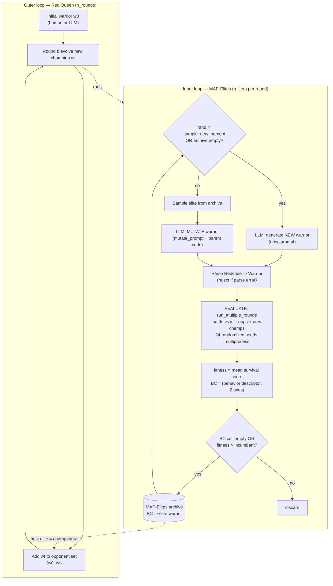

# DRQ — Digital Red Queen (Sakana AI / MIT)

> Per-source research findings. Reporter, not architect. Written incrementally while reading
> the paper, the Sakana blog, the HN thread, an independent critique fork, and the actual code.

---

## 1. Identity

- **Name:** Digital Red Queen (**DRQ**) — "Adversarial Program Evolution in Core War with LLMs."
- **What it is:** A deliberately *minimal* self-play / open-ended-evolution research framework. It uses an LLM as a **mutation/generation operator** inside a **MAP-Elites** quality-diversity loop to evolve assembly-like programs ("warriors") that battle inside **Core War**, a 1984 programming game running on a sandboxed VM called MARS (Memory Array Redcode Simulator). Each "Red Queen" round evolves a new warrior to beat *all previous round champions*.
- **It is NOT** a software-building agent, a coding agent, or a self-improving system. It evolves ~5–60-instruction Redcode programs for a game. (The acronym does **not** stand for anything code-quality/retrieval related — "Red Queen" is the evolutionary-biology hypothesis that you must keep adapting just to maintain fitness against co-evolving rivals.)
- **Authors/org:** Akarsh Kumar (MIT + Sakana AI), Ryan Bahlous-Boldi (MIT), Prafull Sharma (MIT), Phillip Isola (MIT), Sebastian Risi (Sakana AI), Yujin Tang (Sakana AI), David Ha (Sakana AI).
- **Dates:** Repo created 2025-12-23; paper arXiv 2601.03335 (listed Jan 2026); blog ~2026-01-08; last repo push 2026-01-13.
- **Primary links:**
  - Paper (arXiv abs): https://arxiv.org/abs/2601.03335 ; HTML: https://arxiv.org/html/2601.03335v1
  - Blog (web paper): https://sakana.ai/drq ; https://pub.sakana.ai/drq
  - Code repo: https://github.com/SakanaAI/drq
- **Code inspected:** `SakanaAI/drq` @ commit `6b2f4459f9dc53f3e533ed5f1263129df71067d7` (HEAD of `main`, 2026-01-13, commit msg "sync"). Obtained via codeload tarball (`refs/heads/main`) because the sandbox git proxy returned HTTP 407; SHA confirmed via the GitHub commits API. Core War simulator vendored from Rodrigo Setti's `corewar` (`corewar/corewar/*.py`).

---

## 2. TL;DR

- **Essence:** LLM-as-mutation-operator + MAP-Elites (quality-diversity) + adversarial self-play. Inner loop = evolve a population of Redcode warriors against a fixed opponent set; outer loop ("Red Queen") = each round adds the previous champion to the opponent set, so the target keeps moving.
- **Verifier is a deterministic game simulator**, not an LLM judge: warriors are scored by *actually running* multi-agent Core War battles (24 randomized rounds) and measuring survival. This is a clean example of a **grounded, non-gameable, programmatic fitness function**.
- **Headline scientific findings:** (1) training against a *growing history* of opponents produces warriors that **generalize** to held-out human warriors better than single-round optimization; (2) independent runs **converge in behavior (phenotype) but not source code (genotype)** — "convergent evolution."
- **Honest framing by the authors themselves:** "DRQ is **not** intended to be a novel algorithm." It is a minimal instantiation of known self-play + QD methods, applied to Core War as a *scientific testbed*. No reflection, no memory, no self-improvement of the generator.
- **Relevance to a self-improving software-building agent: LOW–MEDIUM.** The *domain* (a game, tiny assembly programs) is tangential. But three transferable *patterns* are directly on-point: (a) grounded executable verification as fitness, (b) MAP-Elites quality-diversity as an antidote to premature convergence / mode collapse in candidate search, and (c) the Red Queen "moving target" idea (evaluate against a growing archive of past artifacts rather than a static benchmark to avoid overfitting / "training on the test set").
- **Independent critique exists and is fair:** "little or no learning in the usual sense" — the LLM mutator is *fixed/non-adaptive* and implicitly leverages human Core War knowledge from pretraining; the paper omits comparison to standard Core War benchmarks and to existing (non-LLM) Core War evolvers.

---

## 3. What it does & how it works (mechanism-level)

### 3.1 The domain: Core War / Redcode / MARS

Core War is a 1984 game (A. K. Dewdney) where two or more programs ("warriors"), written in the **Redcode** assembly language, are loaded at random offsets into a shared circular memory ("core", default size 8000) and executed in **round-robin** (one instruction per warrior per step). **Code and data share the same address space**, so warriors routinely overwrite each other (and themselves). A warrior "dies" when its task queue empties (typically after executing a `DAT` bomb someone wrote into its code). The last warrior with live processes wins; matches that exceed a cycle cap (default 80000) are ties. It is Turing-complete and fully sandboxed — nothing escapes the simulated VM. Classic strategies: *bombers* (spray `DAT` bombs at regular strides), *imps* (`MOV 0,1` self-copy chains), *replicators/paper*, *scanners*, and *SPL-bombs* (massive multithreading via `SPL`).

### 3.2 The two-level loop

DRQ has an **outer "Red Queen" loop** over `n_rounds` and an **inner MAP-Elites evolutionary loop** of `n_iters` per round.

- **Outer (Red Queen):** Start with an initial warrior `w₀` (human or LLM-made). At round *t*, evolve a new champion `wₜ` that performs well in a *multi-agent battle against all previous champions* `{w₀,…,w_{t−1}}` (plus any fixed `initial_opps`). Because the opponent set grows each round, the fitness landscape shifts — this is the "Red Queen" pressure that the authors argue drives generality.
- **Inner (MAP-Elites quality-diversity):** Within a round, maintain an *archive* of warriors indexed by a 2-D **behavior characterization (BC)** grid. Each step either (with prob `sample_new_percent`, default 0.1) asks the LLM for a brand-new warrior, or samples an existing elite from the archive and asks the LLM to **mutate** it. The candidate is scored by running battles; it is placed in its BC cell only if its cell is empty or it beats the incumbent elite there. The round's "champion" is the highest-fitness elite in the archive.



### 3.3 The fitness / verifier (the load-bearing part)

Fitness is **purely the outcome of running the game** — no LLM judging. Implementation in `src/corewar_util.py::run_single_round`:

- A `MyMARS` simulator runs for up to `cycles` (80000) steps; at each step every warrior with a non-empty task queue executes one instruction.
- A warrior's per-step contribution to `score` is `alive_flag * (1/n_alive) / cycles`, accumulated and finally multiplied by `len(warriors)`. Intuitively: **survival share over time**, normalized so that surviving longer and being one of fewer survivors scores higher. The simulation early-exits when all warriors are dead.
- It is run over `simargs.rounds` (default 24) random seeds via a multiprocessing `Pool`, with a hard wall-clock `timeout` (900 s); results are averaged. A timeout/exception → `outputs = None` → fitness `-inf` (candidate dropped). This is the harness's robustness mechanism for runaway / pathological warriors.
- DRQ's scalar fitness = `outputs["score"].mean(...)` for the candidate (index 0). The same battle also yields auxiliary behavioral signals — `alive_score`, `total_spawned_procs` (multithreading intensity), and `memory_coverage` (how much of the core the warrior wrote to) — which feed the BC grid, **not** the fitness.

### 3.4 Behavior characterization (diversity axes)

`src/drq.py::get_bc_features` buckets two of four descriptors into a 6×6 grid:
- `tsp` = total spawned processes (thread count) — bins `[1,10,100,1000,10000,∞]`
- `mc` = memory coverage (addresses written) — bins `[10,100,500,1000,4000,∞]`
- `uo` = unique opcodes used — bins `[4,6,8,10,14,∞]`
- `pl` = program length — bins `[5,12,20,35,60,∞]`

Default `bc_axes="tsp,mc"`. MAP-Elites keeps one elite per occupied (bc1,bc2) cell, which is exactly what preserves behavioral diversity and prevents the LLM from collapsing onto one strategy mid-round.

### 3.5 Formal algorithm (verbatim from the paper)

> "DRQ begins with an initial warrior w₀ and proceeds through a sequence of T rounds, each performing an evolutionary optimization. In each round t, a new warrior wₜ is evolved to defeat the set of all previous warriors {w₀,w₁,…,w_{t−1}}. This process induces a competitive pressure that changes every round… (1) Initialization: Start with a base warrior w₀ which is either human designed or LLM-generated. (2) Adversarial Optimization: At round t…" — arXiv 2601.03335v1 §3 (DRQ Algorithm).

> "DRQ uses MAP-Elites (Mouret and Clune, 2015), a quality-diversity algorithm, to optimize warriors within each round, preventing diversity collapse during search." — §1.

> "We intentionally chose this simplistic use of LLMs to keep the focus of the study on Core War and the analysis of evolution, rather than on LLM-specific techniques… an LLM could output a diff… or it could be conditioned on the results of the simulation to provide more informative feedback (Shinn et al., 2023)." — §3 (LLMs as the Mutation Operator). **Note: DRQ does NOT do this — the mutator is blind to simulation results.**

---

## 4. Evidence from the code

Repo `SakanaAI/drq@6b2f4459f9dc53f3e533ed5f1263129df71067d7`. The whole DRQ implementation is **pure Python, ~700 LOC of original code** (the rest is the vendored Core War sim and ~587 saved warrior `.red` files). Files inspected:

| File | LOC | Role |
|---|---|---|
| `src/drq.py` | 272 | Main DRQ loop: `Args`, `MapElites`, `Main` (the orchestrator) |
| `src/llm_corewar.py` | 67 | `CorewarGPT` (new/mutate ops) + `GPTWarrior` dataclass |
| `src/llm_async.py` | 55 | Thin async OpenAI chat wrapper `GPT` |
| `src/corewar_util.py` | 108 | `SimulationArgs`, `MyMARS`, `run_single_round` (fitness), `run_multiple_rounds` |
| `src/eval_warriors.py` | 58 | Standalone 1-vs-1 evaluation of saved warriors |
| `src/prompts/*.txt` | — | system / new / mutate / crossover prompts (verbatim below) |
| `corewar/corewar/mars.py` | 490 | The MARS VM `step()` interpreter (vendored, Rodrigo Setti) |
| `corewar/corewar/redcode.py` | 377 | Redcode parser (`redcode.parse`) (vendored) |
| `human_warriors/` | 317 `.red` | Held-out human warriors used for the generality eval |

### 4.1 The core data structure — a candidate ("warrior")

`src/llm_corewar.py`:
```python
@dataclass
class GPTWarrior:
    prompt: str                       # the user prompt that produced it
    llm_response: str                 # raw LLM text (code in ``` fences)
    warrior: Warrior = None           # parsed Redcode program (None if parse failed)
    error: str = None                 # parse error message, if any
    id: str = None                    # sha256 of llm_response
    parent_id: str = None             # lineage: id of the warrior it was mutated from

    full_outputs: dict = None
    outputs: dict = None              # battle outputs: score, alive_score, tsp, mc
    fitness: float = -np.inf
    bc: tuple[int, int] | None = None # MAP-Elites cell
```
Lineage is tracked via `parent_id`; identity via a content hash. Note there is **no fitness feedback stored back into the prompt** — `outputs` is used only for placement, never shown to the LLM.

### 4.2 The MAP-Elites archive

`src/drq.py`:
```python
class MapElites:
    def __init__(self):
        self.archive = {}     # bc -> phenotype (one elite per cell)
        self.history = []
        self.coverage_history = []
        self.fitness_history = []

    def place(self, phenotype):
        place = (phenotype.bc is not None) and (phenotype.fitness is not None)
        place = place and ((phenotype.bc not in self.archive) or (phenotype.fitness > self.archive[phenotype.bc].fitness))
        if place:
            self.archive[phenotype.bc] = phenotype
        self.history.append(phenotype)
        ...
```
Elitist replacement per behavioral cell — the canonical MAP-Elites rule.

### 4.3 The selection / variation step

`src/drq.py::step` — the core "propose" decision:
```python
def step(self, i_round):
    if random.random() < self.args.sample_new_percent or len(self.all_rounds_map_elites[i_round].archive) == 0:
        gpt_warriors = asyncio.run(self.corewar_gpt.new_warrior_async(n_warriors=1, n_responses=self.args.n_mutate)).flatten()
        for w in gpt_warriors:
            self.process_warrior(i_round, w)
    else:
        gpt_warrior = self.all_rounds_map_elites[i_round].sample()                 # uniform-random elite
        gpt_warriors_mutated = asyncio.run(self.corewar_gpt.mutate_warrior_async([gpt_warrior], n_responses=self.args.n_mutate)).flatten()
        for w in gpt_warriors_mutated:
            self.process_warrior(i_round, w)
```
Parent selection is **uniform random over the archive** (`MapElites.sample` → `random.choice(list(self.archive.keys()))`) — not fitness-proportional. The only fitness pressure is in `place()`.

### 4.4 The evaluator / fitness (verbatim)

`src/corewar_util.py`:
```python
def run_single_round(simargs, warriors, seed, pbar=False):
    random.seed(seed)
    simulation = MyMARS(warriors=warriors, minimum_separation=simargs.distance, max_processes=simargs.processes, randomize=True)
    score = np.zeros(len(warriors), dtype=float)
    ...
    for t in tqdm(range(simargs.cycles), disable=not pbar):
        simulation.step()
        nprocs = np.array([len(w.task_queue) for w in simulation.warriors], dtype=int)
        alive_flags = (nprocs>0).astype(int)
        n_alive = alive_flags.sum()
        if n_alive==0:
            break
        score += (alive_flags * (1./n_alive)) / simargs.cycles      # survival share over time
        alive_score += alive_flags / simargs.cycles
        total_spawned_procs = total_spawned_procs + np.maximum(0, nprocs - prev_nprocs)
        prev_nprocs = nprocs
    memory_coverage = np.array([cov.sum() for cov in simulation.warrior_cov.values()], dtype=int)
    score = score * len(warriors)
    outputs = dict(score=score, alive_score=alive_score, total_spawned_procs=total_spawned_procs, memory_coverage=memory_coverage)
    return outputs

def run_multiple_rounds(simargs, warriors, n_processes=1, timeout=900):
    try:
        run_single_round_fn = partial(run_single_round, simargs, warriors)
        seeds = list(range(simargs.rounds))
        with Pool(processes=n_processes) as pool:
            result = pool.map_async(run_single_round_fn, seeds)
            outputs = result.get(timeout=timeout)  # Timeout in seconds
        outputs = {k: np.stack([o[k] for o in outputs], axis=-1) for k in outputs[0].keys()}
        return outputs
    except Exception as e:
        print(e)
        return None
```
Key robustness detail: the evaluator runs in subprocess pools with a hard timeout; any failure collapses to `None` and the candidate gets `-inf` fitness (`src/drq.py::process_warrior`). This is the harness defense against non-terminating / resource-hogging programs.

### 4.5 Candidate generation — parsing & robustness

`src/llm_corewar.py::parse_llm_response` strips the ``` fences with a regex, then calls the vendored `redcode.parse`. **Any exception is caught and stored as `gpt_warrior.error`; the warrior is kept but with `warrior=None`** → it later gets `-inf` fitness and is never placed. So malformed LLM output is silently filtered by the verifier, not by the prompt.

```python
def parse_llm_response(self, prompt, llm_response):
    gpt_warrior = GPTWarrior(prompt=prompt, llm_response=llm_response)
    try:
        llm_response = re.sub(r"```.*", "", llm_response)   # remove backticks + language tag
        warrior = redcode.parse(llm_response.split("\n"), self.environment)
        gpt_warrior.warrior = warrior
    except Exception as e:
        gpt_warrior.error = str(e)
    gpt_warrior.id = hashlib.sha256(gpt_warrior.llm_response.encode()).hexdigest()
    return gpt_warrior
```

### 4.6 The LLM call

`src/llm_async.py` — a *stateless* OpenAI chat call. System prompt + single user prompt, `n` completions, `temperature=1.0`, `seed=0`, retried with `backoff` on rate limits. **No conversation history, no tool use, no feedback loop, no reflection.** Default model `gpt-4.1-mini-2025-04-14`.
```python
response = await self.client.chat.completions.create(
    model=self.model,
    messages=[{"role": "system", "content": self.system_prompt},
              {"role": "user", "content": prompt}],
    temperature=self.temperature, n=n_responses, stop=None, seed=0)
```

### 4.7 The prompts (verbatim — these are the entire "intelligence" interface)

**`new_prompt_0.txt`** (generate):
```
Create a new valid Core War program in redcode. Be creative. Write only the new program (with comments explaining what it does) and nothing else. ONLY DEFINE LABELS ON THE SAME LINE AS AN INSTRUCTION. Wrap program around ``` tags.
```

**`mutate_prompt_0.txt`** (mutate — parent code is appended after this):
```
Mutate (change) the following Core War program in a way that is likely to improve its performance (survive and kill other programs). Write only the new updated program (with comments explaining what it does) and nothing else. ONLY DEFINE LABELS ON THE SAME LINE AS AN INSTRUCTION. Wrap program around ``` tags.
```

**`crossover_prompt_0.txt`** (present but **unused** — crossover is commented out in `drq.py`):
```
Crossover (combine) and mutate (change) the following Core War programs in a way that is likely to improve its performance (survive and kill other programs). Write only the new updated program (with comments explaining what it does) and nothing else. ONLY DEFINE LABELS ON THE SAME LINE AS AN INSTRUCTION. Wrap program around ``` tags.
```

**`system_prompt_0.txt`** (15 KB — the Redcode "manual"). Opening + the operative constraints block (full opcode/addressing-mode spec and 4 example warriors omitted for length):
```
You are a useful coding assistant for Core War.

----BACKGROUND----
Core War is a game in which programs compete for control of a computer called MARS (for Memory Array Redcode Simulator). Redcode is the name of the assembly language in which Core War programs, called warriors, are written.

----INSTRUCTION SET OPCODES----
DAT | MOV | ADD | SUB | MUL | DIV | MOD | JMP | JMZ | JMN | DJN | CMP | SEQ | SNE | SLT | SPL | NOP | ORG | EQU | END
... [full per-opcode + modifier + addressing-mode reference, plus 4 example warriors: IMP, Dwarf, Validate] ...

----IMPORTANT CONSTRAINTS----
The user will ask you to create and edit Core War programs. Remember the following very IMPORTANT ESSENTIAL rules.
Note that all memory addressing is relative to the current line number (or using labels handles this).
Start all programs with "ORG start" and end all programs with "END".
All labels should be lowercase.
All labels should be defined somewhere exactly once (especially the 'start' label).
All labels should only be defined on the same line as an instruction (i.e. lines with only a label are INVALID).
```
That is the *entire* prompt-engineering surface: a static spec + "be creative" / "mutate to improve." No few-shot of strong warriors beyond the textbook examples, no reflection, no chain-of-thought scaffold.

### 4.8 Real run configuration (from README)

The documented full run:
```
python drq.py --seed=0 --n_processes=20 --simargs.rounds=20 --simargs.size=8000 --simargs.cycles=80000 \
  --simargs.processes=8000 --simargs.length=100 --simargs.distance=100 --timeout=900 \
  --initial_opps "../human_warriors/imp.red" --n_rounds=20 --n_iters=250 --log_every=20 \
  --last_k_opps=20 --sample_new_percent=0.1 --bc_axes="tsp,mc" --warmup_with_init_opps=True \
  --warmup_with_past_champs=True --n_init=8 --n_mutate=1 --fitness_threshold=0.8 \
  --gpt_model="gpt-4.1-mini-2025-04-14" --temperature=1.0
```
So a canonical run = 20 rounds × 250 iters = 5000 LLM calls/run; champions saved per round as `round_NNN_champion.red`. `fitness_threshold=0.8` lets a round terminate early once an elite is "good enough."

---

## 5. What's genuinely smart

The cleverness is **not** in any single component (all are off-the-shelf); it's in the *combination* and in what the combination demonstrates. Honest assessment of the load-bearing ideas:

1. **Grounded, executable, non-gameable verification.** Fitness = *run the program in a deterministic simulator and measure survival*, averaged over 24 random initial placements. There is no LLM-as-judge, no proxy metric the generator can flatter. The randomized seeds matter: a warrior can't win by exploiting one fixed memory layout; it must be robust across placements. This is exactly the "propose → test → keep only if verifiably better" discipline, instantiated with a *cheap, fast, sandboxed* oracle. The multiprocessing + hard timeout + `None→-inf` path is a small but real lesson in **defending the harness against pathological candidates** (Core War warriors can spawn unbounded processes / never terminate).

2. **MAP-Elites as an anti-collapse mechanism for LLM search.** The paper's §4.5 ablation ("Does MAP-Elites Matter?") finds quality-diversity beats plain hill-climbing for this synthesis problem: *"These results highlight the importance of preserving diversity during search for Core War program synthesis and justifies MAP-Elites as the intra-round optimization algorithm."* The insight is general: an LLM asked to "mutate to improve" will happily converge to one local optimum; binning candidates by *behavior* (here: thread count × memory coverage) and keeping the best per niche forces continued exploration of structurally different solutions. For any evolutionary code-search loop, **behavioral diversity ≠ fitness**, and maintaining a diversity archive is a concrete defense against premature convergence / mode collapse.

3. **The Red Queen "moving target" as a route to generalization without test-set contamination.** This is the genuinely interesting scientific claim. Single-round optimization against a fixed opponent overfits: an evolved warrior beats only ~27.9% of held-out human warriors on average (brittle specialist). But optimizing against a *growing archive of past champions* produces warriors whose generality (fraction of unseen human warriors defeated/tied) *increases with rounds* — **without ever training on the human warriors**. The blog states it cleanly: *"a stable way to consistently produce more robust programs without needing to 'train on the test set.'"* The transferable principle: **evaluate candidates against a continually expanding set of your own past artifacts/adversaries to drive robustness, rather than against a static benchmark you can overfit.** This is the part most relevant to a long-horizon self-improving system.

4. **LLM as a strong structured-mutation prior (vs. random mutation).** The paper is explicit that you *could* run DRQ with random opcode/operand mutation, but in a sparse space where most random programs are invalid, a pretrained-LLM prior *"can speed up search by orders of magnitude."* An HN commenter who built GA-based Core War evolvers agrees: *"an LLM is more likely to make coherent multi-instruction modifications"* than a classical GA. The lesson: in code synthesis, the LLM's value is as a *coherence-preserving variation operator* over the search space, not as a planner.

5. **Phenotype-vs-genotype convergence is a clean diagnostic idea.** DRQ separates *behavior* (BC descriptors measured from execution) from *source code*, and finds independent runs converge in behavior but not code. Even decoupling "what a candidate does" (measured empirically) from "how it's written" (the text) is a reusable evaluation stance: cluster/diff candidates by measured behavior, not by source similarity.

6. **Minimalism as a deliberate methodology.** ~700 LOC, one stateless LLM call per candidate, no reflection/tools. By keeping the agent dumb, the authors can attribute observed dynamics to *evolution + environment* rather than to LLM cleverness. This is a useful reminder that strong emergent behavior can come from a simple loop + a good verifier + a rich environment — not necessarily from an elaborate agent.

---

## 6. Claims vs. reality / limitations / critiques

### 6.1 What the authors actually claim (and are careful about)
- They **explicitly disclaim novelty**: *"DRQ is not intended to be a novel algorithm in itself. Rather, it is a minimal instantiation of prior multi-agent and self-play approaches"* (blog). This is refreshingly honest and means one should read it as a *science paper about evolutionary dynamics*, not an engineering SOTA claim.
- Concrete quantitative claims (arXiv §4): static single-round optimization yields specialists that *collectively* defeat/tie **283 of 294** human warriors, yet **any single** warrior defeats/ties only **~27.9%** on average → brittle/overfit. Full DRQ → generality rises with rounds; behavioral variance across seeds falls. A linear probe on text embeddings predicts a warrior's generality with test **R²=0.461** (weak-to-moderate; they don't oversell it).

### 6.2 Independent critiques (sourced)
- **"Little or no learning in the usual sense"** — the most pointed critique, from Dietmar Wolz's fork `dietmarwo/drq_fast_mars` (README + `drq_analysis.md`, an AI-assisted review): *"The core mechanism is the well-established MAP-Elites optimization algorithm, paired with a fixed (non-adaptive) LLM-based mutator. That mutator is itself pretrained on human-produced data and therefore implicitly leverages human knowledge — potentially including Core War tutorials, strategy discussions, academic papers, and archives of successful warriors."* In other words: nothing in DRQ *learns*; the LLM weights are frozen and the apparent "discovery" may be recall of human Core War strategy seen in pretraining. (The fork nonetheless calls LLM-as-mutation-operator *"a strong and promising idea."*) — https://github.com/dietmarwo/drq_fast_mars
- **No comparison to standard Core War benchmarks or to existing evolvers** — multiple HN commenters (incl. a former Core War GA researcher): the paper never reports scores on the canonical Core War "hills"/benchmarks (e.g. corewar.co.uk/bench.htm), so it's impossible to say the warriors are actually *good*. A commenter scored two flagship DRQ warriors with exMars: **Ring Warrior Enhanced v9 ≈ Wilkies score 34** ("not that great"), **Spiral Bomber Optimized v22 ≈ 85** ("better, but… some Core War evolvers can match it"), noting a classical evolver (MEVO) reached **93**. Also flagged: fully computer-generated warriors already top the *nano*/*tiny* hills with much shorter programs. — https://news.ycombinator.com/item?id=46542761
- **Compute/perf:** the released MARS is a pure-Python interpreter; the same fork shows a Numba-JIT rewrite giving **~3.85× speedup**, implying the original is slow and the evaluation loop is the bottleneck (relevant if you imagine scaling this style of executable-verifier search).

### 6.3 Limitations visible directly in the code
- **The mutator is blind to results.** `llm_async.py` makes a single stateless call; `outputs`/fitness are never fed back into a prompt. So there is no Reflexion-style "you lost because X, try Y." The paper notes this could be added but deliberately isn't. This caps how "intelligent" each variation step can be — improvement comes from selection pressure over many blind samples, not from reasoning about failures.
- **Crossover is implemented but disabled** (`crossover_prob` commented out in `Args`; `crossover_prompt_0.txt` unused). So the released system is mutation-only.
- **Linear lineage, not a true ecosystem.** The paper's own Discussion: *"each new agent is optimized to defeat a fixed set of past agents, creating a linear lineage with no updating of earlier strategies."* Earlier champions are frozen; there's no co-adaptation. They flag richer parallel co-evolution as future work.
- **Parent selection is uniform random**, not fitness/novelty weighted — so within a round, search is fairly undirected beyond the per-cell elitism.
- **Tiny artifacts.** Warriors are ≤100 instructions (`MAXLENGTH=100`), typically far smaller. This is *program synthesis at toy scale*; nothing here demonstrates building or maintaining a large software artifact.
- **Reproducibility caveats:** results depend on a specific OpenAI model (`gpt-4.1-mini-2025-04-14`) and `temperature=1.0`; "Our Dataset of Discovered Warriors" is listed as *"Coming soon!"* in the README (not released at the inspected commit). Headline plots (generality-vs-rounds, convergence) were not re-run here.

### 6.4 Reward-hacking / test-gaming surface
Low but non-zero. The fitness is genuinely grounded (survive in a simulator), so it can't be gamed by flattering a judge. The realistic "hacks" are: (a) *imp-style ties* — a warrior that just survives can farm survival-share without killing anything, and the score rewards staying alive; (b) overfitting to the specific (small) opponent set within a round — which is precisely the brittleness DRQ's Red Queen loop is designed to counter. The randomized placements (24 seeds) blunt layout-specific exploits. No evidence of the LLM exploiting simulator bugs, though the vendored MARS has clamping `assert`s (`core_event`) suggesting numeric-overflow edge cases exist.

---

## 7. Relevance to a self-improving, evolutionary software-building agent

**Bottom line: the *domain* is tangential, but several *patterns* are squarely on-point.** DRQ does not build software, has no memory, no reflection, and no self-improvement of its generator. As a blueprint for "a seed AI that builds software," it offers little directly. As a clean, minimal reference implementation of *evolutionary search under a grounded verifier*, it offers a few transferable mechanisms. Mapped to the project's relevance axes:

- **Verification (HIGH relevance).** DRQ is a textbook case of "keep only if *verifiably* better," where 'verifiable' = *executed in a deterministic sandbox*, not judged. The pattern — run the candidate, measure an objective outcome, average over randomized conditions to prevent overfitting to one setup, hard-timeout pathological candidates, treat failure as `-inf` — transfers directly to a software-building loop whose oracle is a test suite / benchmark harness. The randomized-seed idea maps to "evaluate a code change across multiple inputs/configs, not one."

- **Decision-making / avoiding mode collapse (MEDIUM–HIGH).** MAP-Elites is the most reusable algorithmic idea: maintain an archive of candidates **binned by behavior** (not just fitness), keep the best per niche, and sample parents from across niches. For an agent that proposes many code variants, this is a concrete anti-premature-convergence mechanism — it keeps structurally diverse solutions alive instead of collapsing to the first local optimum the LLM likes. The "behavior descriptor" analog for software might be: test-pass profile, complexity, runtime, API surface, dependency set.

- **Long-horizon running / robustness via moving targets (MEDIUM).** The Red Queen idea — evaluate each new artifact against a *growing archive of your own past artifacts/adversaries* rather than a static benchmark — is a plausible recipe for sustained, non-overfitting improvement over a long horizon. For a self-improving agent this could mean: regression-test every new version against an accumulating suite of previously-hard cases / previously-failing scenarios, so the agent must "keep running to stay in place" and can't degrade on old capabilities.

- **Orchestration (LOW–MEDIUM).** The two-level loop (cheap inner search + outer curriculum that ratchets difficulty) is a useful template: an inner optimizer over candidates, wrapped by an outer process that escalates the objective. But DRQ's orchestration is trivial (a `for` loop), so there's little engineering to borrow.

- **Memory (LOW).** The only "memory" is the MAP-Elites archive of warriors + lineage `parent_id`. There is no episodic/semantic memory, no retrieval, no learning across runs. Not a source for memory-system design.

- **LLM-as-variation-operator (MEDIUM).** Validates that, for code-shaped artifacts in sparse spaces, an LLM mutation operator is far more sample-efficient than random mutation because it preserves syntactic/semantic coherence — relevant to how a builder agent should *propose* edits (coherent multi-line diffs over random perturbation). DRQ itself even suggests the upgrade it didn't take: diff-based edits and conditioning the mutator on execution feedback (Reflexion-style) — both directly applicable to a coding agent.

What clearly does **not** transfer: the Core War / Redcode specifics; the toy artifact scale; the absence of reflection, tools, planning, or any self-modification of the agent itself. DRQ is a study of *evolutionary dynamics*, not an agent architecture.

---

## 8. Reusable assets (collected, not assembled into a design)

Concrete, quotable things one *could* borrow. (Borrowing decisions are for the humans; this is inventory.)

1. **MAP-Elites archive + elitist placement** (`src/drq.py::MapElites`, quoted in §4.2). A ~20-line, dependency-free quality-diversity archive: `bc -> elite`, place-if-empty-or-better, plus coverage/fitness history. Directly liftable; only the behavior-descriptor function is domain-specific.

2. **Behavior-descriptor binning pattern** (`src/drq.py::get_bc_features`, §3.4). The technique of bucketing continuous behavioral measurements into a small grid via monotonic threshold lists, then using two chosen axes as the cell key. Reusable for any "diversify candidates by measured behavior" need.

3. **Grounded evaluator with multiprocessing + timeout + failure-to-`-inf`** (`src/corewar_util.py::run_single_round` / `run_multiple_rounds`, §4.4; `Main.process_warrior`, `Main.step`). The harness pattern: evaluate each candidate over N randomized seeds in a process pool, hard wall-clock timeout, collapse any exception/timeout to a sentinel that disqualifies the candidate. A good template for sandboxing untrusted generated code.

4. **The Red Queen outer loop** (`src/drq.py::process_warrior` builds `opps = self.init_opps + prev_champs`, §4). The pattern of scoring each new candidate against an accumulating set of prior champions (optionally truncated to `last_k_opps`). Liftable as "regress against a growing archive."

5. **Stateless LLM-mutation operator + parse-or-disqualify** (`src/llm_corewar.py`, §4.5/4.6). The minimal "generate / mutate" interface: system prompt = domain manual; user prompt = "create" or "mutate-to-improve" + parent artifact; strip code fences; parse; on parse failure keep candidate but mark invalid so the verifier discards it. Plus content-hash IDs and `parent_id` lineage.

6. **The prompts themselves (verbatim in §4.7).** Especially the *shape*: a long static **spec/manual** system prompt + an extremely terse task prompt (`"Mutate (change) the following … in a way that is likely to improve its performance … Write only the new program … and nothing else."`). Note the deliberate absence of feedback/reflection — useful as a *baseline* to compare against feedback-rich variants.

7. **CLI/experiment scaffolding** (`tyro`-based `Args` dataclass with nested `SimulationArgs`; `--resume` from pickled state; periodic `save()` of archive + champions + all generations; `job_timeout` to survive cluster scheduler limits). A clean pattern for resumable, long-running evolutionary jobs.

8. **Performance reference** (`dietmarwo/drq_fast_mars`): a Numba-JIT/NumPy rewrite of MARS for ~3.85× speedup, illustrating how to make an executable verifier fast enough for large-scale search (core memory as `(coresize,6)` int32 array, task queues as circular buffers, coverage tracking inside JIT). — https://github.com/dietmarwo/drq_fast_mars/blob/master/src/corewar/mars.py

---

## 9. Signal assessment

- **Overall value to *this* project: LOW–MEDIUM (lean LOW).**
  - *Why not lower:* It is a crisp, correct, end-to-end reference for the exact loop the project cares about — propose (LLM mutate) → test (grounded executable verifier) → keep-if-better (MAP-Elites) — plus one genuinely useful idea (Red Queen / growing-archive evaluation as anti-overfitting) and one well-validated one (QD as anti-mode-collapse). These are transferable *patterns*.
  - *Why not higher:* No software is built; artifacts are toy (≤100-instruction game programs); no memory, no reflection, no tools, no self-improvement of the agent; the LLM is a frozen, feedback-blind mutation operator. The authors themselves frame it as a *non-novel* science experiment about evolutionary dynamics. Most of its mechanisms (MAP-Elites, self-play, LLM-as-mutator) are better-developed in adjacent work (AlphaEvolve, FunSearch, ADAS, the Darwin-Gödel Machine) that the orchestrator is also cataloging.
- **Confidence: HIGH** on what DRQ *is* and how it works — I read the full released source (all core modules + all prompts + the vendored MARS `step()`), the paper (abstract, method §3, experiments §4), the blog, the HN author-AMA, and an independent critique fork. The code is small and unambiguous.
- **What I could NOT verify:**
  - The empirical results (generality-rises-with-rounds; phenotype convergence; R²=0.461). I did not run DRQ or reproduce the plots — would need the OpenAI model `gpt-4.1-mini-2025-04-14`, an API key, and substantial compute (≈5000 LLM calls/run × many seeds).
  - The independent Wilkies/benchmark scores (34 / 85 / MEVO 93) are from an HN commenter's "quick and dirty exMars check," not independently re-measured here.
  - The exact contents of the four-warrior examples beyond what's in the system prompt, and the un-released "dataset of discovered warriors" (README says "Coming soon!").
  - I inferred the inspected tree == commit `6b2f4459…` by matching the codeload `refs/heads/main` tarball to the GitHub API's `main` HEAD; I could not run `git rev-parse` locally because the proxy blocked `git`/`ls-remote` (HTTP 407) and the tarball carries no `.git`.

---

## 10. References

**Primary**
- [P] Kumar, Bahlous-Boldi, Sharma, Isola, Risi, Tang, Ha. *Digital Red Queen: Adversarial Program Evolution in Core War with LLMs.* arXiv 2601.03335. Abstract: https://arxiv.org/abs/2601.03335 — HTML: https://arxiv.org/html/2601.03335v1
- [P] Sakana AI blog / web paper: https://sakana.ai/drq — https://pub.sakana.ai/drq
- [P] Code: `SakanaAI/drq` @ `6b2f4459f9dc53f3e533ed5f1263129df71067d7` — https://github.com/SakanaAI/drq
  - `drq@6b2f445:src/drq.py` — main loop, `MapElites`, `Args`, `process_warrior`/`step`/`run`
  - `drq@6b2f445:src/llm_corewar.py` — `CorewarGPT`, `GPTWarrior`, new/mutate ops, parse-or-disqualify
  - `drq@6b2f445:src/llm_async.py` — stateless OpenAI chat wrapper (`temperature=1.0`, `seed=0`)
  - `drq@6b2f445:src/corewar_util.py` — `SimulationArgs`, `MyMARS`, `run_single_round` (fitness), `run_multiple_rounds` (pool+timeout)
  - `drq@6b2f445:src/eval_warriors.py` — standalone 1v1 evaluation harness
  - `drq@6b2f445:src/prompts/{system,new,mutate,crossover}_prompt_0.txt` — verbatim prompts (§4.7)
  - `drq@6b2f445:corewar/corewar/mars.py` — vendored MARS VM interpreter `step()` (Rodrigo Setti)
  - `drq@6b2f445:corewar/corewar/redcode.py` — vendored Redcode parser `redcode.parse`
  - `drq@6b2f445:human_warriors/*.red` — 317 human warrior files (held-out generality eval set)
  - `drq@6b2f445:README.md` — run command + hyperparameters (§4.8)
- [P] Upstream Core War sim: Rodrigo Setti, `rodrigosetti/corewar` — https://github.com/rodrigosetti/corewar
- [P] Sakana experimentation repo referenced by README: `SakanaAI/llm-corewar` — https://github.com/SakanaAI/llm-corewar

**Secondary / independent**
- [S] Hacker News discussion (incl. author AMA + Core War practitioners' critiques; Wilkies scores 34/85, MEVO 93, missing-benchmark critique): https://news.ycombinator.com/item?id=46542761
- [S] Dietmar Wolz, `dietmarwo/drq_fast_mars` — independent Numba-optimized MARS (~3.85×) + AI-assisted critique ("little/no learning in the usual sense"; fixed mutator leverages pretrained human knowledge): https://github.com/dietmarwo/drq_fast_mars ; review: `.../blob/master/drq_analysis.md` ; `.../blob/master/fixed_mutator.md`
- [S] Moonlight literature review: https://www.themoonlight.io/en/review/digital-red-queen-adversarial-program-evolution-in-core-war-with-llms
- [S] CreativeApplications.Net write-up: https://www.creativeapplications.net/news/digital-red-queen-adversarial-program-evolution-in-core-war-with-llms/
- [S] Core War standard benchmark (referenced in critique): https://corewar.co.uk/bench.htm

**Background / cited-within (context only)**
- MAP-Elites: Mouret & Clune, *Illuminating search spaces by mapping elites* (2015).
- Reflexion (the feedback DRQ deliberately omits): Shinn et al. (2023).
- AutoML-Zero (sparse-search-needs-a-prior argument): Real et al. (2020).
