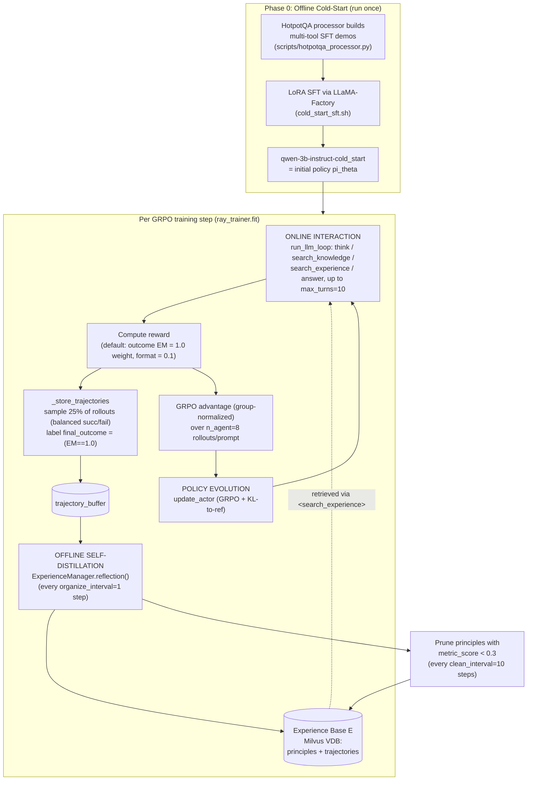
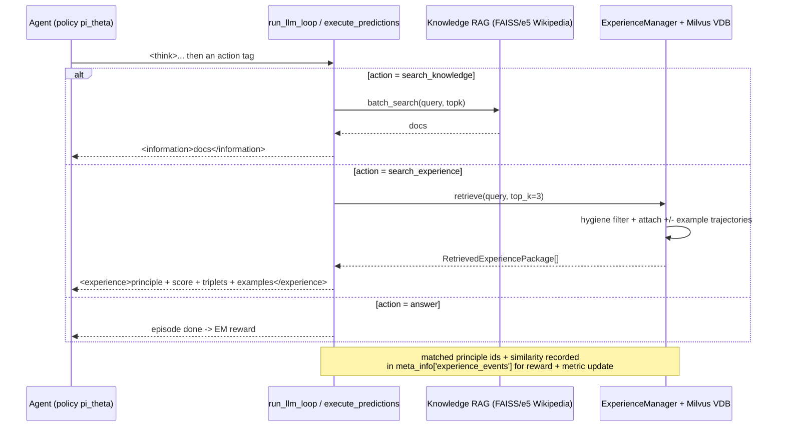

# EvolveR — Self-Evolving LLM Agents through an Experience-Driven Lifecycle

> Research findings for the KB Seed AI project. Reporter-mode: what EvolveR is, how it
> *actually* works (from the code), what's smart, where it falls short, and what (if
> anything) transfers to a self-improving, evolutionary, software-building agent.

---

## 1. Identity

- **Name:** EvolveR — *Self-Evolving LLM Agents through an Experience-Driven Lifecycle*.
- **What it is:** An RL training framework (built on Search-R1 / verl / LLaMA-Factory) that
  trains a small LLM **search agent** for multi-hop QA, augmenting GRPO with a "closed-loop
  experience lifecycle": the agent distills its own past trajectories into a library of
  abstract **strategic principles**, stores them in a vector DB, retrieves them at inference
  time to guide reasoning, and reinforces *using those principles* via a custom reward.
  **What "evolves" is (a) the agent's policy weights (via GRPO) and (b) a curated experience
  base of principles** — not source code, not the agent's own scaffold.
- **Authors / org:** Rong Wu, Xiaoman Wang (co-first), Jianbiao Mei, Pinlong Cai, Daocheng Fu,
  Cheng Yang, Licheng Wen, Xuemeng Yang, Yufan Shen, Yuxin Wang, Botian Shi. Affiliations:
  Zhejiang University, **Shanghai AI Laboratory** (lead), East China Normal University, Fudan,
  Central South University, Shanghai Innovation Institute, SJTU, USTC. Corresponding:
  wurong1159@zju.edu.cn.
- **Dates:** arXiv preprint 2025-10-21 (v1, `arXiv:2510.16079`); codebase public 2025-10-20;
  README claims **"Paper accepted at ICML 2026" (dated 2026-05-01)**.
- **Primary links:** Paper https://arxiv.org/abs/2510.16079 ; HTML https://arxiv.org/html/2510.16079v1 ;
  Official repo (per paper + README) https://github.com/Edaizi/EvolveR ;
  HF model https://huggingface.co/Edaizi/EvolveR (EvolveR-3B, Qwen2.5-3B) ;
  HF dataset https://huggingface.co/datasets/Edaizi/EvolveR-NQ-HotpotQA .
- **Brief's link** https://github.com/KnowledgeXLab/EvolveR is a **mirror/fork** of `Edaizi/EvolveR`
  — both `main` branches resolve to the **identical commit** (verified via GitHub API).
- **Code repo + commit inspected:** `github.com/Edaizi/EvolveR @ 63834b727ee6e7af3410657de36eb845814249ba`
  (commit "modify readme", 2026-05-08T02:49:39Z). Same SHA on `KnowledgeXLab/EvolveR`.
  Inspected via codeload tarball (git clone blocked by sandbox proxy 407).

---

## 2. TL;DR

- **EvolveR is an RL recipe, not a coding agent.** It is **Search-R1** (a multi-hop QA
  search agent trained with **GRPO** on top of **verl**) extended with a **self-distilled
  experience base**: the agent writes its own past trajectories into abstract "principles",
  stores them in a Milvus vector DB, and gives the agent a *second tool* —
  `<search_experience>` — to retrieve those principles mid-rollout, alongside the usual
  `<search_knowledge>` (Wikipedia RAG) tool.
- **The "evolution" is two intertwined loops:** (1) the **policy weights** evolve via GRPO
  (outcome = exact-match reward), and (2) a **curated principle library** evolves via an
  offline "reflection" step (distill → semantic-dedup → merge-or-create → metric-score →
  prune). They run **alternately every training step** (`organize_interval=1`).
- **The verifier is exact-match (EM) on QA answers.** "Better" = the rollout's extracted
  `<answer>` exactly matches a gold answer. That EM signal is *both* the GRPO reward *and*
  the success/failure label that decides whether a distilled principle is "guiding" (from a
  success) or "cautionary" (from a failure). There is no code-execution / test-suite verifier.
- **Principle quality is tracked by a Beta-mean "metric score"**:
  `metric_score = (success_count + 1) / (usage_count + 2)` (Laplace/Beta(1,1) smoothing),
  updated by counting, for each retrieved principle, how often the trajectories that used it
  succeeded. Principles below `0.3` get pruned every 10 steps. This is a genuinely reusable
  idea: a cheap, online, frequentist credit-assignment score for a memory item.
- **Honesty flags:** the two most novel-sounding rewards — the "experience reward"
  (`merit × relevance`) and the "info-gain reward" (doc-retrieval F1 vs. gold docs) — are
  **both weighted 0 in the released training script** (`outcome=1.0, format=0.1,
  info_gain=0, experience=0`). The repo also references two prompt constants
  (`*_NO_STRUCTURE_PROMPT`) that **do not exist anywhere** (dead path, only safe because the
  default config sets `structure=true`). So claim-vs-code gaps exist.
- **Relevance to us (a self-improving software-building agent): medium-low.** The *domain*
  (3B model, multi-hop QA, EM reward, RAG) is far from autonomous software construction, and
  nothing here builds/tests code or self-modifies scaffold. But several *mechanisms* port
  cleanly: the **distill-trajectories-into-reusable-principles** loop, the **semantic-dedup +
  merge + Beta-mean-merit + prune** lifecycle for a memory store, and the design pattern of
  **retrieval-of-own-experience as a first-class agent action**.

---

## 3. What it does & how it works

### 3.1 Setting and lineage
EvolveR trains a **Qwen2.5-3B-Instruct** agent to answer **multi-hop QA** (NQ + HotpotQA;
eval also on 2Wiki, Bamboogle, Musique, PopQA, TriviaQA per paper) by interleaving reasoning
with two retrieval tools. The scaffolding is forked almost verbatim from **Search-R1**
(`PeterGriffinJin/Search-R1`) and **O2-Searcher** (`KnowledgeXLab/O2-Searcher`) — both are
acknowledged in the README — running on the **verl** RLHF framework (Volcano Engine RL) with
**LLaMA-Factory** for the SFT "cold start".

The agent emits a constrained tag grammar inside its generations:
- `<think>...</think>` — chain-of-thought.
- `<search_knowledge>query</search_knowledge>` — RAG over a Wikipedia corpus (e5 + FAISS),
  returns `<information>...docs...</information>`.
- `<search_experience>query</search_experience>` — **the novelty**: retrieve top-k distilled
  principles from the agent's own experience base, returns `<experience>...principles...</experience>`.
- `<answer>...</answer>` — final answer, terminates the episode and is scored by EM.

### 3.2 The three-phase lifecycle
The paper frames EvolveR as a closed loop of three phases (paper §3, Fig. 2). In the **code**
these map to: an **offline cold-start SFT** (run once, `scripts/cold_start_sft.sh`), and then,
*inside every GRPO step*, an interleaving of **online interaction** (rollout with both tools)
and **offline self-distillation** (`ExperienceManager.reflection`) plus **policy evolution**
(the GRPO `update_actor`).



### 3.3 The reflection (offline self-distillation) sub-loop
`ExperienceManager.reflection()` (`evolver/experience/experience_manager.py:521`) is the heart
of the "experience" half. For the trajectories buffered this step it:

1. **Flushes** raw trajectories to the Milvus VDB (`add_trajectories_batch`).
2. **`_update_metric_scores()`** — for every principle that was *retrieved* by a buffered
   trajectory, increments `usage_count` (+1) and `success_count` (+1 iff that trajectory's
   `final_outcome` is success), then recomputes
   `metric_score = (success_count+1)/(usage_count+2)`. This is online credit assignment: a
   principle's score rises if rollouts that consulted it tend to get the answer right.
3. **`_distill_new_experiences()`** — the distillation pipeline:
   a. For each buffered trajectory, build a summarization prompt
      (`SUMMARIZE_SUCCESSFUL_TRAJECTORY_PROMPT` if EM-success else
      `SUMMARIZE_FAILED_TRAJECTORY_PROMPT`), truncating the log to 4096 chars; ask the
      **agent's own frozen policy** (or an optional external API model) to emit a one-sentence
      principle + a JSON list of `(subject, predicate, object)` triplets.
   b. **Parse** into a `{description, structure, type}` potential-principle
      (`type = guiding | cautionary`).
   c. **Intra-batch dedup** (`_deduplicate_potential_principles`): pairwise LLM
      "are these the same principle?" (`MATCH_PRINCIPLE_PROMPT`) only among principles from
      the *same question and same type*; build a graph of "yes" edges; keep one representative
      per connected component.
   d. **Match against existing** (`_batch_find_matching_principles`): for each surviving
      principle, vector-search the base for candidates with cosine ≥ `SIMILARITY_THRESHOLD=0.85`,
      then LLM-confirm equivalence. If a match exists → **merge** (link trajectory, bump
      counts); else → **create** a new principle (id `p_<uuid8>`, initial `metric_score=0.5`).
4. **Export** every `export_interval=50` steps; **prune** `metric_score<0.3` every
   `clean_interval=10` steps.

### 3.4 Retrieval-time behavior
When the agent emits `<search_experience>q</search_experience>` during a rollout,
`ExperienceManager.retrieve()` vector-searches the base for top-`TOP_K_PRINCIPLES=3`
principles, applies **hygiene filters** (drops principles containing the special control
tokens, drops "collapsed" principles like `!!!!!`, dedups identical descriptions — and
**deletes** offending principles from the DB), attaches up to 1 success + 1 failure example
trajectory each, and `_build_prompt_with_experience()` formats them (principle text + type +
metric score + triplet subgraph) into the `<experience>` observation injected back into the
context. So the policy literally *reads its own distilled lessons mid-task*.



---

## 4. Evidence from the code

**Repo:** `Edaizi/EvolveR @ 63834b727ee6e7af3410657de36eb845814249ba` (mirror: `KnowledgeXLab/EvolveR`,
same SHA). Layout: `evolver/` (the new code), `verl/` (vendored RLHF framework, lightly
patched), `LLaMA-Factory/` (vendored SFT), `scripts/` (entry points). The genuinely novel
code is small: `evolver/experience/` (~1.6k LOC incl. the Milvus server), `evolver/rewards/`
(~580 LOC), and patches to `verl/trainer/ppo/ray_trainer.py`.

### 4.1 Files inspected (paths)
- `evolver/experience/experience_manager.py` — lifecycle: distill, dedup, merge, metric score, retrieve.
- `evolver/experience/prompts.py` — the 3 distillation/dedup prompts (full text below).
- `evolver/experience/config.py` — all the lifecycle thresholds.
- `evolver/experience/milvusdb/{principle_client.py,models.py,routers/*}` — the VDB schema + HTTP API.
- `evolver/llm_agent/generation.py` — the Think-Act-Observe rollout loop + the two tools.
- `evolver/rewards/{__init__,reward_outcome,reward_format,reward_experience,reward_info_gain}.py` — composite reward.
- `verl/trainer/ppo/ray_trainer.py:741` (`_store_trajectories`), `:1089` (reflection trigger), `:380` (manager init).
- `verl/trainer/ppo/core_algos.py:111` (`compute_grpo_outcome_advantage`).
- `scripts/{train_grpo-3b.sh,test-3b.sh,cold_start_sft.sh,hotpotqa_processor.py}` — config + data.

### 4.2 The agent's system prompt (verbatim) — `scripts/hotpotqa_processor.py:90`
```
Answer the given question. You must conduct reasoning inside <think> and </think> first every
time you get new information or get new experience principles. After reasoning, you can search
for past experiences by <search_experience> query </search_experience> to get relevant past
experience principles (may be guiding or warning principles) and it will return the top
searched results between <experience> and </experience>. You can use these principles which
you think is helpful to help you answer the question. If you find you lack some knowledge, you
can call a search engine by <search_knowledge> query </search_knowledge> and it will return the
top searched results between <information> and </information>. You can search knowledge and
experience as many times as your want. If you find no further external knowledge needed, you
can directly provide the answer inside <answer> and </answer>, without detailed illustrations.
For example, <answer> Beijing </answer>
```

### 4.3 The distillation prompts (verbatim) — `evolver/experience/prompts.py`
The **success** distiller (`SUMMARIZE_SUCCESSFUL_TRAJECTORY_PROMPT`):
```
You are an expert in analyzing interaction logs to distill generalizable wisdom.
Analyze the following successful interaction trajectory. Your goal is to extract a "Guiding Principle" from it.

A "Guiding Principle" has two parts:
1.  A concise, one-sentence natural language description. This is the core advice.
2.  A structured representation of the key steps or logic, as a list of simple (subject, predicate, object) triplets.

[Trajectory Log]:
{trajectory_log}

Final Outcome: SUCCESS
...
[Example]:
[DESCRIPTION]:
When a file download fails with a 404 error, do not immediately retry the download; instead, verify the source URL's validity first.
[STRUCTURE]:
[
  (file download, results_in, 404 error),
  (immediate_retry, is, ineffective),
  (correct_action, is, verify URL)
]
```
(The **failure** distiller is identical except it asks for a "Cautionary Principle" / "the key
mistake to avoid and under what circumstances". Note the **copy-paste bug**: even the SUCCESS
prompt's task text says "write the one-sentence description of *the pitfall*" and "the
structured triplets describing *the failure pattern*" — the success/failure prompt bodies were
not fully differentiated.)

The **dedup / equivalence** prompt (`MATCH_PRINCIPLE_PROMPT`), used both for intra-batch dedup
and for matching new vs. existing principles:
```
You are a semantic analysis expert. Determine if two principles describe the same core idea, even if they use different words.

Principle A: "{summary}"
Principle B: "{existing_principle_description}"

Do Principle A and Principle B describe the same essential advice or warning?
Please answer with only "Yes" or "No".
```

### 4.4 The core data structures (verbatim) — `experience_manager.py:319` & `:347`
```python
@dataclass
class ExperiencePrinciple:
    principle_id: str
    type: str  # 'guiding' or 'cautionary'
    description: str  # Natural language description for semantic retrieval
    structure: List[Dict[str, str]]  # Structured triplets for precise logic
    metric_score: float = 0.5
    usage_count: int = 0
    success_count: int = 0
    successful_trajectory_ids: "deque[str]" = field(default_factory=lambda: deque(maxlen=3))
    failed_trajectory_ids:     "deque[str]" = field(default_factory=lambda: deque(maxlen=2))

@dataclass
class Trajectory:
    trajectory_id: str
    question: str
    log: List[Dict[str, Any]]
    final_outcome: bool  # True for success, False for failure
    retrieved_principles: Dict[str, float]  # {principle_id: similarity_score}
    golden_answer: str
```
The Milvus collection (`milvusdb/principle_client.py:37`) stores `description_vector`
(**bge_m3** embeddings) with an index of `index_type="FLAT", metric_type="COSINE"`; trajectory
links are stored as JSON strings in `VARCHAR` fields. A principle is thus a tiny, structured,
self-scoring memory record.

### 4.5 The verifier / "promotion" logic — `experience_manager.py:707` and `ray_trainer.py:810`
The only verifier is **exact match**. In `_store_trajectories`:
```python
final_outcome = reward_metrics['reward/outcome'][idx] == 1.0
```
and the principle merit is a Beta-mean (`_update_metric_scores`, line 707):
```python
new_metric_score = (new_success_count + 1) / (new_usage_count + 2)  # Laplace smoothing
```
"Promotion" of a principle is implicit: a principle *survives* if its `metric_score` stays
≥ `clean_low_metric_threshold=0.3`; otherwise the periodic
`clean_low_metric_principles(threshold)` deletes it (`ray_trainer.py:1104-1109`). Merge vs.
create is decided by cosine ≥ `SIMILARITY_THRESHOLD=0.85` **then** an LLM yes/no confirmation
(`_batch_find_matching_principles`, line 970).

### 4.6 The composite reward & GRPO — `evolver/rewards/__init__.py`, `core_algos.py:111`
`exp_rl_reward_fn` linearly blends up to four components, each gated by a weight and then
weight-normalized:
```python
weighted_rewards = {
  "format":     w_format     * format_reward_output.reward,
  "outcome":    w_outcome    * outcome_reward.reward,      # EM (exact match) on <answer>
  "info_gain":  w_info_gain  * info_gain_reward_output.reward,  # F1(retrieved doc titles, gold doc titles)
  "experience": w_experience * exp_reward.reward,          # max over events of scaling*merit*relevance
}
total_reward = sum(weighted) / sum(active_weights)
```
The **experience reward** (`reward_experience.py:75`) is
`current_reward = scaling_factor * merit_score * relevance_score`, i.e. it pays the agent for
*retrieving a high-merit, query-relevant principle* (relevance = embedding cosine of query vs.
principle description) — independent of whether the final answer is correct. **In the released
`scripts/train_grpo-3b.sh` the weights are `format=0.1, outcome=1.0, info_gain=0,
experience=0`** (lines 143-146) — so during the actual published run only EM + a format shaping
term drive learning; the info-gain and experience rewards are present in code but **off**.
GRPO advantage is the standard group-normalized return over the `n_agent=8` rollouts per prompt
(`scores[i] = (scores[i] - id2mean) / (id2std + eps)`), with a `kl_loss_coef=0.001`
low-variance KL to the frozen reference.

### 4.7 The cold-start is teacher-distilled (GPT-4), not self-distilled — `hotpotqa_processor.py:9`
The initial SFT data is built by a **teacher** (`gpt4_inference`) that *reverse-engineers* a
full multi-tool trajectory from the gold answer + gold docs (`prompt_teacher`: "adept at
restoring solution paths from given answers and documents in reverse … reason step-by-step as
if you do not yet know the final answer, even though it is given for supervision"). So the
agent's *initial* ability to use `<search_experience>` and emit principles is bootstrapped from
an external GPT-4 teacher; the *self*-distillation lifecycle only takes over during RL.

---

## 5. What's genuinely smart

These are the load-bearing ideas, judged on their own merits (separately from the QA domain).

1. **Retrieval-of-own-experience as a first-class agent action.** Splitting retrieval into two
   tools — `<search_knowledge>` (the world) and `<search_experience>` (the self) — is a clean
   design. The agent *decides when* to consult its own distilled lessons, and those lessons are
   injected into context exactly like external evidence. This makes "use your memory" a learned
   policy decision rather than an always-on prefix, and the choice is itself shaped by RL.

2. **Trajectories → abstract, typed, structured principles (not raw logs).** Rather than
   retrieving past raw trajectories (their "Learning by Raw Trajectories" baseline), EvolveR
   distills each into a one-sentence rule **plus** an explicit `(subject, predicate, object)`
   triplet "subgraph", and tags it `guiding` (from a success) or `cautionary` (from a failure).
   The triplets give a compact, parseable structure; the success/failure typing means the agent
   accumulates *both* "do this" and "avoid this" knowledge. The distillation is done by the
   agent's *own* policy, so the experience base co-evolves with the model's competence.

3. **A cheap, online, self-correcting merit score for memory items.**
   `metric_score = (success+1)/(usage+2)` is a Beta(1,1)-smoothed success rate — it starts
   neutral at 0.5, rewards principles that co-occur with correct answers, penalizes those that
   don't, and is updated by simple counting every step. Combined with **periodic pruning below
   0.3**, this is a self-curating memory: useless or harmful principles decay out without any
   human labeling. The smoothing is the smart part — it prevents a single lucky/unlucky use from
   saturating the score, giving new principles a fair trial.

4. **A real deduplication + merge pipeline (semantic, not string).** New principles are
   deduped *within* a batch via connected-components over pairwise LLM equivalence judgments,
   and *against* the existing base via a two-stage gate (cosine ≥ 0.85 **then** LLM yes/no).
   Matches **merge** (accumulating trajectory evidence and counts onto the canonical principle)
   rather than duplicate. This keeps the experience base from exploding under GRPO's 8×
   redundant rollouts and is a concrete, reusable recipe for maintaining a deduplicated insight
   store. The dedup is deliberately conservative — it only merges principles from the *same
   question and same type* in the intra-batch step, trading recall for safety against
   over-merging.

5. **Memory hygiene against its own pathologies.** Because principles are written by the model,
   the code defends against model failure modes: it refuses/deletes principles that contain the
   agent's own control tokens (`<answer>`, `<think>`, …) and detects "collapsed" degenerate
   principles (`^!{5,}`) and deletes them *at retrieval time*. This is an honest acknowledgment
   that self-generated memory is noisy, and a pragmatic set of guardrails.

6. **The whole lifecycle is genuinely closed-loop and runs continuously.** Distillation,
   metric update, and policy update interleave **every step** (`organize_interval=1`), with
   export every 50 and pruning every 10. The trajectories that feed distillation are themselves
   produced under guidance from previously distilled principles, so there is a real feedback
   loop: better principles → better trajectories → better principles, with the policy weights
   also moving underneath. This "experience flywheel" is the paper's core thesis and it *is*
   implemented (not just described).

---

## 6. Claims vs. reality / limitations / critiques

### 6.1 Claim–code gaps I verified
- **"Self-contained lifecycle … without relying on external teachers."** The *RL distillation*
  is indeed self (uses `pi_theta`), but the **cold-start SFT that bootstraps the whole format
  is GPT-4-teacher-generated** (`hotpotqa_processor.py:prompt_teacher`, `gpt4_inference`). The
  agent cannot use `<search_experience>` or write principles at all until taught by GPT-4. The
  "no external teacher" claim is true only of the *online* phase, not of initialization. (The
  paper's own Table 2 ablation reframes this honestly: self-distill only *beats* a strong
  external teacher at 3B+, and ties at 7B — "cognitive alignment" diminishes with scale.)
- **The headline auxiliary rewards are disabled in the release.** `experience` and `info_gain`
  reward weights are **0** in both `train_grpo-3b.sh` and `test-3b.sh`. The independent paper
  note (papernotes.org) confirms the *actual* objective is just
  `R = w_o·R_outcome(EM) + w_f·R_format`. So the elaborate `reward_experience.py` /
  `reward_info_gain.py` code is dormant in the published configuration — a reader who assumes
  "merit×relevance experience reward" is driving results would be mistaken.
- **Dead code path.** `_distill_new_experiences` references
  `SUMMARIZE_SUCCESSFUL_TRAJECTORY_NO_STRUCTURE_PROMPT` /
  `..._FAILED_..._NO_STRUCTURE_PROMPT`, which are **defined nowhere** in the repo. It would
  `NameError` if `experience.retrieve_component.structure=false`; only safe because the scripts
  hard-set `structure=true`.
- **Copy-paste bug in the success prompt.** `SUMMARIZE_SUCCESSFUL_TRAJECTORY_PROMPT` tells the
  model (in its task instructions and example) to describe "the pitfall" and "the failure
  pattern" — text clearly cloned from the failure prompt. The success/failure distillation is
  less differentiated than the paper implies; quality of "guiding" principles may suffer.
- **Trajectory `log` stored for distillation is a single decoded string**
  (`{"event":"dialogue","content": full_dialogue}`), not the structured step list the
  `Trajectory` dataclass suggests. The structured-log code in `_compact_trajectory` is mostly
  exercised via regex re-parsing of that string, adding fragility.

### 6.2 Potential reward-hacking / failure modes
- **Format reward rewards *calling both tools*.** `format_reward_fn` grants a `diversity_score`
  of 0.5 for invoking *both* `<search_experience>` and `<search_knowledge>` (and a count bonus
  up to +0.5 for more searches). The papernotes critique flags this: it "may introduce spurious
  calls" — i.e., the agent can earn shaping reward by querying its experience base even when
  useless. With format weight only 0.1 this is bounded, but it is a real incentive to over-call
  tools rather than answer efficiently.
- **The (dormant) experience reward is un-gated by correctness.**
  `experience_reward_fn = max(scaling·merit·relevance)` pays for *retrieving* a high-merit,
  query-relevant principle regardless of whether the answer is right. Had it been weighted > 0,
  it would directly incentivize principle-fishing (and could couple with self-distillation to
  inflate `metric_score` in a feedback loop). It is off in the release, so this is a latent
  rather than realized hazard — but it is exactly the kind of mis-specified auxiliary reward to
  watch for.
- **Self-distilled memory pollution.** The code's own guards (deleting principles with control
  tokens, `^!{5,}` "collapsed" principles, duplicate descriptions) are evidence that the model
  *does* emit degenerate principles. The merit-score + 0.3 prune is the main defense, but
  there is **no bounded cap on experience-base size** and no versioning/conflict detection.
- **"Better" = exact match only.** EM is brittle (rewards surface-form answer match), and the
  same EM signal both trains the policy and labels success/failure for distillation, so any EM
  bias propagates into the principle library's guiding/cautionary typing.

### 6.3 Independent critiques & reproducibility
- **Ratchet (arXiv:2605.22148)**, a critical survey/recipe on self-evolving skill libraries,
  classifies EvolveR explicitly (their citation [18], "distills trajectories into strategic
  principles") and scores it in an 8-feature governance matrix where EvolveR is marked as
  **lacking a bounded active-cap (AC = ✗)** and only partial on outcome-driven retirement. Its
  central, sobering empirical claim (citing SkillsBench): **human-curated skills give +16.2pp
  over no-skill, but LLM-self-generated skills give +0.0pp** — and the bottleneck is
  "lifecycle management … largely neglected." This is a direct, relevant caution: self-distilled
  insight stores frequently fail to beat a no-memory baseline without strong librarianship, and
  EvolveR's librarian (dedup + merit + prune) is partial by that paper's accounting.
- **Reproducibility:** the only GitHub issue (closed) is a request, in Chinese, for *how to
  reproduce the cold-start stage* — suggesting the cold-start pipeline is underspecified
  (the processor ships with placeholder `API_KEY="sk-xxxxxx"`, `BASE_URL="xxxx"`). Released
  artifacts: EvolveR-3B weights + NQ/HotpotQA data on HF, but the **distilled experience base is
  not released**, so the exact principle library behind the reported numbers can't be inspected.
  65 GitHub stars, 3 forks (low external uptake as of inspection).
- **Scope:** all experiments are multi-hop **QA** with a 3B (and a few 0.5B/7B ablation) model.
  The README itself only *aspires* to code/math ("we encourage … the community to extend …").
  There is **no evidence** EvolveR works on long-horizon agentic or code-generation tasks.

---

## 7. Relevance to a self-improving, evolutionary, software-building agent

Judged by the one test (would this help build a self-improving, evolutionary, software-building
agent?), EvolveR is **off-domain but mechanism-relevant**. It builds *no software*, runs *no
tests*, and *self-modifies nothing* (weights move via RL, but the agent does not edit its own
code/scaffold). Its verifier (EM) is the weakest possible analogue of "verifiably better."
Still, several mechanisms map onto components we'd need:

1. **Experience distillation as a memory subsystem.** The pattern "after each
   task/episode, ask the model to compress the trajectory into a reusable, typed
   (success→guiding / failure→cautionary), *structured* principle, then store it for retrieval"
   is directly applicable to a coding agent's long-horizon memory: distill "what worked / what
   to avoid" from a build-test episode into reusable lessons. The success/failure typing and the
   one-sentence + triplet format are a concrete, cheap schema.

2. **A self-curating memory lifecycle (the actual reusable gold).** dedup (semantic, two-stage:
   cosine gate → LLM confirm) + merge-evidence-onto-canonical + **Beta-mean merit score**
   `(succ+1)/(use+2)` + **threshold pruning**. This is exactly the "librarian" layer that the
   Ratchet critique says is usually missing, and EvolveR implements a working (if cap-less)
   version. For our system, a verifiable-improvement signal (test pass) could *replace EM* as
   the success counter feeding the merit score — a much stronger version of the same mechanism.

3. **Retrieval-of-own-experience as a first-class, learned action.** Making "consult my own
   past lessons" an explicit tool the agent *chooses* to call (vs. always-prepended memory) is a
   clean design for controlling context cost and is learnable. For a software agent this could
   be a `recall_lessons(query)` tool over a distilled lesson store.

4. **Closed-loop interleaving of "generate data" and "improve from it" every step.** The
   `organize_interval` / `export_interval` / `clean_interval` cadence is a tidy template for an
   improvement loop that continuously (a) acts, (b) harvests a sample of episodes, (c) updates a
   memory store, (d) periodically prunes — runnable over long horizons without human input.

5. **Defensive hygiene for self-generated artifacts.** The control-token and "collapsed
   principle" filters are a reminder that any self-writing memory/skill store needs validators
   and a delete path; useful design hygiene for self-modifying systems.

What does **not** transfer: the EM verifier (we need execution/test-based verification), the
specific QA/RAG scaffolding, the GRPO weight-update machinery (we're token-unlimited /
not necessarily training weights), and the absence of a size cap or conflict/versioning system
(a known weakness we'd want to fix, per Ratchet).

---

## 8. Reusable assets

Concrete, citable things we *could* borrow (collected as evidence; no design decisions made).

### 8.1 Prompts (verbatim, with cite)
- **Trajectory → principle distillation** (success & failure variants) —
  `Edaizi/EvolveR@63834b7:evolver/experience/prompts.py:10` and `:43`. Both ask for
  "(1) a concise one-sentence description (2) a list of `(subject, predicate, object)`
  triplets," with `[DESCRIPTION]:` / `[STRUCTURE]:` separators and a worked example. Full text
  quoted in §4.3. (Note the success-prompt copy-paste bug to fix if reused.)
- **Principle equivalence / dedup** — `prompts.py:77` (`MATCH_PRINCIPLE_PROMPT`): a minimal
  "Do Principle A and Principle B describe the same essential advice or warning? Answer only
  Yes or No." Cheap (`max_new_tokens=8`) pairwise semantic-equality judge. Quoted in §4.3.
- **Agent system prompt** defining a two-retrieval-tool Think-Act-Observe grammar —
  `scripts/hotpotqa_processor.py:90` (`prompt_multi`). Quoted in §4.2.
- **Teacher "reverse trajectory" cold-start prompt** — `hotpotqa_processor.py:9`
  (`prompt_teacher`): generate a plausible step-by-step tool-use trajectory *backwards* from a
  known answer + gold docs, for SFT bootstrapping. Quoted in §4.7. Useful pattern for
  synthesizing agent SFT demos when you have (task, answer, evidence) but no real traces.

### 8.2 Data schemas
- **Principle record** (`experience_manager.py:319`; Milvus schema `principle_client.py:37`):
  `{principle_id, type∈{guiding,cautionary}, description, structure: [(s,p,o)…],
  metric_score, usage_count, success_count, successful_trajectory_ids(≤3),
  failed_trajectory_ids(≤2)}`, embedded by **bge_m3**, **FLAT/COSINE** index. A compact,
  self-scoring, evidence-linked memory item.
- **Trajectory record** (`experience_manager.py:347`; `models.py:57`):
  `{trajectory_id, question, log, final_outcome:bool, retrieved_principles:{id→sim},
  golden_answer}`.

### 8.3 Algorithms / harness patterns
- **Beta-mean merit + prune** (`experience_manager.py:707`, `ray_trainer.py:1104`):
  `score=(succ+1)/(use+2)`; periodically delete `score<0.3`. Drop-in credit-assignment for any
  memory/skill item, with the success counter swappable for a real verifier.
- **Two-stage dedup-or-merge** (`_batch_find_matching_principles` `:970`,
  `_deduplicate_potential_principles` `:557`): cosine ≥ 0.85 candidate gate → LLM yes/no
  confirm → merge-evidence-onto-canonical else create; intra-batch dedup via connected
  components over pairwise "same?" judgments. A complete library-maintenance recipe.
- **Closed-loop cadence** (`ray_trainer.py:1089`): `organize_interval` (distill+score),
  `export_interval` (snapshot), `clean_interval` (prune) — a template for a long-horizon
  self-improvement loop.
- **Retrieval-time hygiene** (`experience_manager.py:retrieve`, `:448`): drop/delete principles
  containing control tokens, duplicate descriptions, or `^!{5,}` collapse — validators for
  self-written artifacts.
- **VDB-as-HTTP-service** (`evolver/experience/milvusdb/` FastAPI routers): the experience base
  runs as a standalone service (add/search/update/batch/clean/export endpoints), decoupled from
  the training process — a clean separation if we want a persistent, shared memory store.

---

## 9. Signal assessment

- **Overall value: MEDIUM (leaning medium-low) for our specific goal.**
  - *Why not high:* wrong domain (multi-hop QA, not software), weakest-form verifier (exact
    match, no execution/tests), no self-modification of code/scaffold, small model + RL-weight
    regime that doesn't match a token-unlimited build-and-verify agent, and the most novel
    rewards are disabled in the released config. It does not teach us how to *build or verify
    software*.
  - *Why not low:* it is a **complete, working implementation** of a self-curating experience/
    memory lifecycle — distill → typed structured principle → semantic dedup/merge →
    online frequentist merit score → prune — plus the clean idea of *retrieval-of-own-experience
    as a learned action*. Those are real, reusable mechanisms for the "memory" and
    "decision/orchestration" parts of a self-improving agent, and the code is concrete enough to
    lift patterns and prompts directly.
- **Confidence: high on the mechanism/code reading** (I read the load-bearing files end-to-end
  at a pinned SHA and cross-checked the default configs and an independent paper note);
  **medium on the empirical claims** (I did not run training or reproduce any benchmark number).
- **What I could NOT verify:**
  - Any reported benchmark score (no runs; the distilled experience base is not released).
  - That the ICML 2026 acceptance is real (README + OpenReview page exist;
    `arxiv.org/html/2510.16079v3` exists, implying active revision, but I did not confirm a
    camera-ready/proceedings entry).
  - Behavior when `experience`/`info_gain` rewards are actually weighted > 0 (off in release).
  - The exact embedding dim / whether `bge_m3` (default `model_name`) is what produced the
    paper's numbers (the config also supports an external embedding API).
  - Long-term experience-base dynamics (growth rate, drift, collapse frequency) at scale — not
    instrumented in anything I could run.

---

## 10. References

**Primary — paper & official artifacts**
- [P1] Wu, Wang, Mei, Cai, Fu, Yang, Wen, Yang, Shen, Wang, Shi. *EvolveR: Self-Evolving LLM
  Agents through an Experience-Driven Lifecycle.* arXiv:2510.16079 (v1 2025-10-21; v3 exists).
  Abstract: https://arxiv.org/abs/2510.16079 ; HTML: https://arxiv.org/html/2510.16079v1
- [P2] OpenReview record (submission `sooLoD9VSf`): https://openreview.net/forum?id=sooLoD9VSf
- [P3] Official code repo: https://github.com/Edaizi/EvolveR — inspected at commit
  `63834b727ee6e7af3410657de36eb845814249ba` (2026-05-08). Mirror with identical SHA:
  https://github.com/KnowledgeXLab/EvolveR
- [P4] Model weights (EvolveR-3B, Qwen2.5-3B): https://huggingface.co/Edaizi/EvolveR
- [P5] Dataset (NQ + HotpotQA): https://huggingface.co/datasets/Edaizi/EvolveR-NQ-HotpotQA

**Primary — code references (repo@SHA:path)** (`Edaizi/EvolveR@63834b7`)
- [C1] `evolver/experience/experience_manager.py` — lifecycle (retrieve `:436`, reflection
  `:521`, dedup `:557`, distill `:1018`, metric score `:669/:707`, merge/create `:1097/:1142`).
- [C2] `evolver/experience/prompts.py` — distillation (`:10`,`:43`) + dedup (`:77`) prompts.
- [C3] `evolver/experience/config.py` — thresholds (`SIMILARITY_THRESHOLD=0.85`,
  `TOP_K_PRINCIPLES=3`, traj caps 3/2).
- [C4] `evolver/experience/milvusdb/{principle_client.py,models.py}` — VDB schema (bge_m3,
  FLAT/COSINE) + Pydantic models.
- [C5] `evolver/llm_agent/generation.py` — Think-Act-Observe loop (`run_llm_loop:335`), two
  tools + invalid-action handling (`execute_predictions:514`), experience-prompt builder (`:57`).
- [C6] `evolver/rewards/{__init__.py:10, reward_outcome.py:98, reward_format.py:11,
  reward_experience.py:21, reward_info_gain.py:37}` — composite reward.
- [C7] `verl/trainer/ppo/ray_trainer.py` — manager init (`:380`), `_store_trajectories:741`
  (EM-success label `:810`, 25% sampling), reflection/prune trigger (`:1089`).
- [C8] `verl/trainer/ppo/core_algos.py:111` — `compute_grpo_outcome_advantage`.
- [C9] `scripts/train_grpo-3b.sh` — default RL config (weights format=0.1/outcome=1.0/
  info_gain=0/experience=0 `:143`; n_agent=8 `:123`; max_turns=10; organize=1/export=50/
  clean=10/prune=0.3). `scripts/test-3b.sh` (val_only, same weights).
- [C10] `scripts/hotpotqa_processor.py` — `prompt_teacher:9`, `prompt_multi:90`, GPT-4
  cold-start synthesis (`gpt4_inference:162`).
- [C11] `README.md` — pipeline, ICML 2026 claim (`:32`), acknowledgements to Search-R1 &
  O2-Searcher.

**Secondary — independent analyses & lineage**
- [S1] Ratchet: *A Minimal Hygiene Recipe for Self-Evolving LLM Agents.* arXiv:2605.22148 —
  critical survey scoring EvolveR (cite [18]) on lifecycle governance (no bounded active-cap);
  reports SkillsBench finding that LLM-self-generated skills give +0.0pp vs +16.2pp for
  human-curated. https://arxiv.org/html/2605.22148
- [S2] Paper note (independent walkthrough + critique, incl. reward formula, ablations,
  limitations): https://en.papernotes.org/ICML2026/llm_agent/evolver_self-evolving_llm_agents_through_an_experience-driven_lifecycle/
- [S3] Search-R1 (lineage; the agentic RAG-RL scaffold EvolveR forks):
  https://github.com/PeterGriffinJin/Search-R1
- [S4] O2-Searcher (same lab, acknowledged base): https://github.com/KnowledgeXLab/O2-Searcher
- [S5] verl (RLHF framework vendored for GRPO): https://github.com/volcengine/verl
- [S6] LLaMA-Factory (vendored for cold-start SFT): https://github.com/hiyouga/LLaMA-Factory

*Inspection note:* `git clone` was blocked by the sandbox proxy (HTTP 407); the repo was
obtained via the codeload tarball (`codeload.github.com/Edaizi/EvolveR/tar.gz/refs/heads/main`,
5.6 MB, identical bytes for the `KnowledgeXLab` mirror) and SHA confirmed via the GitHub commits
API. All line numbers are from that tree.
