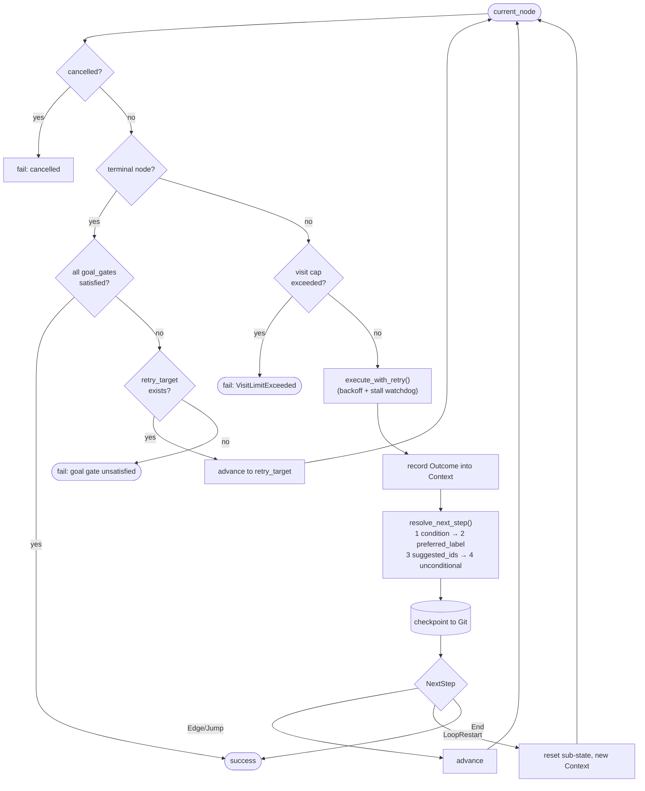
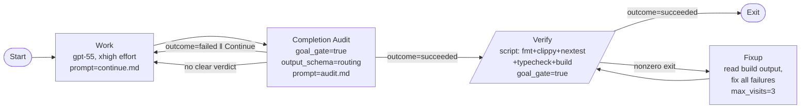

# Fabro — Findings

> Per-source research dossier for the KB Seed AI project. Reporter-mode: what Fabro is,
> how it actually works, what's smart, where it falls short, and what (if anything) it
> teaches us about building a self-improving, evolutionary, software-building agent.

---

## 1. Identity

- **Name:** Fabro (`fabro-sh/fabro`). Tagline: *"The open source dark software factory for expert engineers."*
- **What it is (one line):** An **AI coding-agent workflow orchestration engine**. You define a software process as a **Graphviz DOT graph** (nodes = stages: agent / prompt / command / conditional / human / parallel; edges = transitions with conditions/loops), and a Rust engine executes it — running multi-turn LLM coding agents in sandboxes, with deterministic verification gates, Git checkpointing, multi-model routing, and human-in-the-loop approval. It is **not** a self-improving or evolutionary system; it is a *deterministic, human-authored* orchestration layer over coding agents.
- **Authors / org:** **Qlty Software Inc.** (the company behind qlty.sh, the successor to Code Climate's quality product). Primary author / committer: **Bryan Helmkamp** (`brynary` on GitHub, `bryan@qlty.sh` / `bryan@brynary.com`), founder/CEO of Code Climate / Qlty.
- **Dates:** Repo created **2026-03-13**; actively developed (pushed 2026-06-04). Versioned aggressively: **v0.254.0** at the inspected commit (date-derived versioning via `cargo dev release`).
- **Traction (as of inspection, 2026-06-04):** ~**837 stars**, 96 forks, 31 open issues. Has a Discord, hosted docs, a marketing site (fabro.sh), a Homebrew tap, Docker images, and a Railway one-click deploy.
- **License:** MIT (Copyright Qlty Software Inc.).
- **Primary links:**
  - Repo: https://github.com/fabro-sh/fabro
  - Docs: https://docs.fabro.sh
  - Site: https://fabro.sh
- **Code inspected:** `fabro-sh/fabro@497aaba6f20c1fac052346c39f52e08fabadb179` (main, "Bump version to 0.254.0", 2026-06-04T12:51:34Z). Inspected via `main`-branch tarball from codeload (the sandbox proxy blocked `git clone`; SHA confirmed via GitHub API). Workspace = **49 Rust crates** + a React/TS web app + Astro marketing site.

---

## 2. TL;DR

- Fabro is a **"workflow-as-code" orchestrator for AI coding agents**, not an autonomous/evolutionary builder. The human writes a Graphviz DOT graph that encodes the *process* (plan → approve → implement → verify → fixup → …); agents execute the nodes; the engine handles state, retries, loops, checkpoints, sandboxes, and human gates. Marketing frame: a "dark software factory" — a factory you (mostly) walk away from, vs. babysitting an agent REPL.
- **The interesting, directly-relevant kernel for us is the bundled `goal` workflow**: a `Work → Completion-Audit → Verify → Fixup` loop where (a) an LLM **completion-audit / "goal gate"** judges whether the goal is *actually* done (with strict anti-scope-reduction prompting), (b) a **deterministic verify script** (fmt/clippy/tests/typecheck/build) is the real promotion gate, and (c) failures route back into bounded fix loops with visit caps. This is a clean, real-world instantiation of "propose → verify → keep-if-better," minus the *evolutionary/self-modifying* part.
- **Load-bearing engineering ideas worth stealing:** (1) **process-as-a-typed-graph** with explicit visit caps and loop edges to bound long-horizon runs; (2) **deterministic verifier gates** (`script` nodes) as the source of truth, with LLM judges only for routing; (3) **CSS-like model stylesheets** to route each node to a different model/provider/effort; (4) **Git-checkpoint-per-stage** for durable resume/revert/trace; (5) **anti-goal-drift prompt language** ("do not redefine success around a smaller, safer subset").
- **What it is NOT:** no candidate population, no fitness-driven selection, no self-modification of its own code, no learned/automatic workflow improvement. The "improvement loop" is entirely human-in-the-DOT-file. Self-improvement would have to be built *on top of* Fabro, not found inside it.
- **Signal for us: MEDIUM.** Low novelty on "evolutionary AI"; high practical value as a **production-grade harness/orchestration reference** for running coding agents reliably over long horizons with verification — exactly the substrate an evolutionary loop needs.

---

## 3. What it does & how it works

### The product model

Fabro reframes AI-assisted coding from **"a chat session with an agent"** to **"a process defined as code and executed by an engine."** The unit of work is a **workflow**: a Graphviz **DOT** graph stored in `.fabro/workflows/<name>/workflow.fabro`. Nodes are *stages*; edges are *transitions* with optional conditions/labels/loops. The engine walks the graph, executing each node and choosing the next edge, until a terminal node is reached and all "goal gates" pass.

Node types (by Graphviz shape / attributes), from `docs/internal/product/product-description.md` and the `handler/` modules:
- **Agent node** (default, plain box) — runs a **multi-turn LLM coding agent** with tool access (Bash/Read/Write/Edit/Grep/Glob/web) inside a sandbox. Can emit a structured **routing** JSON to steer the next edge and write to shared workflow context.
- **Prompt node** — a single LLM call, no tools (one-shot).
- **Command node** (`shape=parallelogram`, `script="…"`) — runs a deterministic shell script (build/test/lint/typecheck). **Exit code 0 = success, nonzero = failure.** This is the real verification gate.
- **Conditional node** — routes on context/outcome without an LLM.
- **Human gate** (`shape=hexagon`) — pauses for human approve/revise/steer.
- **Parallel / fan-in nodes** — fork concurrent branches and merge.
- **Sub-workflow / "stack" node** (`shape=house`, `stack.child_workflow=…`, `manager.max_cycles=N`) — runs a nested workflow engine as a managed child (recursion / hierarchical orchestration).
- **Start / Exit** (`Mdiamond` / `Msquare`) — meta nodes.

Cross-cutting machinery (all in Rust, single binary, no runtime):
- **Model stylesheets** — CSS-like rules in the graph (`* { model: claude-haiku-4-5 } .coding { model: claude-sonnet-4-5; reasoning_effort: high }`) route each node to a model/provider/effort by id, class, or shape. Providers: Anthropic, OpenAI, Gemini, and OpenAI-compatible (`fabro-llm`), plus CLI backends (Claude Code, Codex).
- **Sandboxes** (`fabro-sandbox`) — Local, Docker (default), and Daytona cloud VMs implement a uniform `Sandbox` trait; agents run isolated from the host.
- **Git checkpointing** (`fabro-checkpoint`) — every stage commits code to a *run branch* and execution metadata to a *metadata branch*; runs are resumable, forkable, rewindable, and inspectable.
- **Events / observability** (`fabro-workflow/src/event/`) — a durable event stream (`progress.jsonl`, SSE) records every prompt, tool call, edge decision, and checkpoint.

### The core control loop (the part most relevant to us)

The engine is a **graph-walking state machine** in `fabro-core/src/executor.rs` (`Executor::run`, repo@`497aaba`:`lib/crates/fabro-core/src/executor.rs:117`). Per iteration it: (1) checks cancellation; (2) if the current node is terminal, checks **goal gates** and either ends or routes to a `retry_target`; (3) increments and enforces **visit caps** (per-node `max_visits` and graph-wide `max_node_visits`); (4) runs the node via `execute_with_retry` (with backoff, racing a **stall watchdog**); (5) records the outcome into shared `Context`; (6) picks the next edge via `resolve_next_step`; (7) **checkpoints** after the edge is known; (8) advances, jumps, loop-restarts, or ends.

Edge selection priority (`fabro-workflow/src/graph/routing.rs:22`, `select_edge`):
1. **Condition match** — first edge whose `condition="…"` evaluates true against the `Outcome` + `Context` (a typed DSL: `outcome=succeeded`, `context.score > 80`, `contains`, `matches`, `&& || !`).
2. **`preferred_label`** — an LLM-suggested edge label (the agent's routing JSON), normalized (`[A] Approve` → `approve`).
3. **`suggested_next_ids`** — LLM-suggested target node ids.
4. **Unconditional** fallthrough edge.



### The bundled `goal` workflow — a concrete propose→verify→keep loop

The repo ships a `goal` workflow (`.fabro/workflows/goal/workflow.fabro`) that takes a free-text goal and drives it to completion. This is the closest thing in Fabro to an "autonomous build loop," and it is the most directly relevant artifact for the seed-AI project:



How it works, mechanism-level:
- **Work** (agent node) iterates toward the goal, sharing one conversation thread (`thread_id="goal"`, `fidelity="full"`), capped at 12 visits.
- **Completion Audit** (agent node, `goal_gate=true`, `output_schema="routing"`) is an **LLM-as-judge** that decides if the goal is *actually* done, emitting routing JSON (`{"outcome":"succeeded|failed","preferred_next_label":…,"context_updates":{…}}`). If it can't produce valid JSON, an **output-repair loop** re-prompts up to `output_retries=2`. If it says "failed," control routes back to **Work** with the failure reason carried in context.
- **Verify** (command node, `goal_gate=true`, `retry_target="fixup"`) is the **deterministic gate**: it actually runs `cargo fmt --check`, `clippy -D warnings`, `cargo nextest run`, docs checks, `bun typecheck`/`test`, and a release build. Exit 0 ⇒ proceed to Exit; nonzero ⇒ route to **Fixup**.
- **Fixup** (agent node, `max_visits=3`) reads the captured build output from context and fixes failures, then loops back to Verify.
- Graph-wide `max_node_visits=30` bounds the entire run.

The two-tier gating is the important design choice: **a cheap/uncertain LLM judge decides routing, but a deterministic script is the actual promotion criterion.** "Keep" only happens when an objective verifier is green.

---

## 4. Evidence from the code

**Inspected at** `fabro-sh/fabro@497aaba6f20c1fac052346c39f52e08fabadb179` (main, v0.254.0). Workspace: 49 Rust crates under `lib/crates/`, plus `apps/fabro-web` (React/TS) and `apps/marketing` (Astro). Inspected via main-branch tarball (proxy blocked clone; SHA from GitHub API).

### Files / modules studied

- `lib/crates/fabro-core/src/executor.rs` — the generic graph-walking executor (`Executor::run`, `execute_with_retry`, `resolve_next_step`). 2,345 lines incl. tests.
- `lib/crates/fabro-workflow/src/pipeline/execute.rs` — the workflow-specific EXECUTE phase that builds the executor, wires the stall watchdog, visit caps, lifecycle hooks, and Git state.
- `lib/crates/fabro-workflow/src/graph/routing.rs` — `select_edge`, `check_goal_gates`, `get_retry_target`, label normalization.
- `lib/crates/fabro-workflow/src/condition.rs` — the edge-condition expression evaluator (the routing DSL).
- `lib/crates/fabro-workflow/src/handler/{agent,command,prompt,structured_output,manager_loop,human,parallel}.rs` — node handlers.
- `lib/crates/fabro-workflow/src/handler/llm/preamble.rs` — the **fidelity** system (how much state is injected into each agent turn).
- `lib/crates/fabro-workflow/src/lifecycle/circuit_breaker.rs` — repeated-failure circuit breaker.
- `lib/crates/fabro-agent/src/{tools,tool_registry,loop_detection,compaction,context_window,subagent,memory,skills}.rs` — the built-in coding agent.
- `.fabro/workflows/goal/` — the goal/work/audit/verify/fixup workflow and its prompts.
- `docs/internal/product/*.md` — authoritative product positioning.

### Key mechanisms, verbatim

**Goal-gate check** (`fabro-workflow/src/graph/routing.rs:98`): a terminal node may only succeed if every node marked `goal_gate=true` finished in a Succeeded/PartiallySucceeded state; otherwise the engine routes to that node's retry target.

```rust
pub(crate) fn check_goal_gates(
    graph: &GvGraph,
    node_outcomes: &HashMap<String, Outcome>,
) -> std::result::Result<(), String> {
    for (node_id, outcome) in node_outcomes {
        if let Some(node) = graph.nodes.get(node_id) {
            if node.goal_gate()
                && outcome.status != StageOutcome::Succeeded
                && outcome.status != StageOutcome::PartiallySucceeded
            {
                return Err(node_id.clone());
            }
        }
    }
    Ok(())
}
```

**Visit caps** (`fabro-core/src/executor.rs:183`) — the engine treats unbounded looping as a first-class failure mode (`VisitLimitExceeded`), checked both per-node and graph-wide before each execution:

```rust
let visits = state.increment_visits(node.id());
if let Some(max) = node.max_visits() {
    if visits >= max {
        return Err(Error::VisitLimitExceeded {
            node_id: node.id().to_string(), visits, limit: max,
            limit_source: VisitLimitSource::Node,
        });
    }
}
if let Some(global_max) = self.options.max_node_visits { /* … graph-wide … */ }
```

**The deterministic verify gate** is just the `Verify` node's `script` attribute in `goal/workflow.fabro` (verbatim, abridged): it merges `origin/main`, then runs

```
cargo +nightly-2026-04-14 fmt --check --all && … &&
cargo +nightly-2026-04-14 clippy --workspace --all-targets -- -D warnings &&
cargo nextest run --workspace --status-level slow --profile ci &&
cargo dev docs check && bun install --frozen-lockfile &&
(cd apps/fabro-web && bun run typecheck) && (cd apps/fabro-web && bun run test) &&
cargo dev build -- -p fabro-cli --release
```

The `CommandHandler` maps the result to an outcome (`fabro-workflow/src/handler/command.rs`): `if result.exit_code == Some(0) { Outcome::success() }`, storing stdout/stderr under `keys::COMMAND_OUTPUT` so the downstream `Fixup` agent can read it.

**The routing/structured-output contract** (`fabro-workflow/src/handler/structured_output.rs:13`): an agent node with `output_schema="routing"` must emit JSON containing at least one of:

```rust
pub(crate) const ROUTING_STATUS_FIELDS: &[&str] = &[
    "preferred_next_label", "outcome", "failure_reason",
    "suggested_next_ids", "context_updates",
];
```

…with a self-correcting **repair message** when validation fails (re-prompts the model with the JSON-schema errors and "reply only with the corrected JSON object"). There's even a fallback that reads `status.json` or the last-touched file from the sandbox if the model wrote the JSON to disk instead of the transcript (`handler/agent.rs:144`, `validate_agent_output_sources`).

**The completion-audit prompt** (`.fabro/workflows/goal/prompts/audit.md`) is a notably well-engineered anti-scope-reduction / anti-reward-hacking judge prompt. Verbatim highlights:

> "Treat completion as unproven until current evidence proves it. … Preserve the original scope. Do not redefine success around work that already exists. … Match the verification scope to the requirement's scope. Do not use a narrow check to support a broad claim. Treat tests, manifests, verifiers, green checks, and search results as evidence only after confirming they cover the relevant requirement. Treat uncertain or indirect evidence as not achieved."

And its routing contract (verbatim):

```json
{ "outcome": "succeeded", "preferred_next_label": "Done",
  "context_updates": { "goal_status": "complete", "goal_remaining_work": "" } }
```
```json
{ "outcome": "failed", "preferred_next_label": "Continue",
  "failure_reason": "The most important missing requirement or weak evidence.",
  "context_updates": { "goal_status": "incomplete",
    "goal_remaining_work": "The next concrete work item for the next pass." } }
```

The matching **work/continue prompt** (`prompts/continue.md`) hardens against goal drift across loop iterations:

> "Keep the full goal intact. Do not redefine success around a smaller, safer, or easier subset. … An edit is aligned only if it makes the requested final state more true. … Do not claim the whole goal is complete unless current evidence proves it; the next audit stage will make the routing decision."

**Fidelity / context management** (`fabro-workflow/src/handler/llm/preamble.rs:24`): each agent turn gets a "preamble" summarizing workflow state at one of six levels — `Full` (shared thread, no preamble), `Truncate` (goal + run id only), `Compact`, and `SummaryLow/Medium/High` (progressively richer history of completed stages + context values, with internal keys filtered out). This is how Fabro keeps long, multi-stage runs inside a context window — a deliberate **state-compression knob** set per edge (e.g. `plan -> implement [fidelity="summary:high"]`).

### The built-in coding agent (`fabro-agent`)

Fabro is not just a CLI wrapper; it ships its own Claude-Code-style agent. Tools registered in `fabro-agent/src/tools.rs` (`register_core_tools`): `read_file`, `write_file`, `edit_file`, `shell`, `grep`, `glob`, `read_many_files`, `list_dir`, `web_search`, `web_fetch`, plus `apply_patch` and `spawn_agent` (subagent) and TODO tools. Supporting long-horizon modules:
- `loop_detection.rs` — hashes the last N assistant turns' tool-call signatures and flags repetition (`detect_loop`), to break agents stuck repeating the same call.
- `compaction.rs` / `context_window.rs` — history compaction when the context window fills.
- `tool_permissions.rs` / `tool_registry.rs` — a 3-tier permission model (read-only / read-write / full) with per-tool categories (`Read`, `Write`, `Shell`, `Subagent`, …).
- `memory.rs`, `skills.rs`, `subagent.rs`, `task_reminder.rs`, `todo_runtime.rs` — agent memory, skill loading, sub-agent spawning, and reminders.

### Reliability layer: circuit breaker + failure classification

`fabro-workflow/src/lifecycle/circuit_breaker.rs` tracks **failure signatures** across loop iterations (`loop_failure_signatures`, `restart_failure_signatures`) and trips when the *same deterministic failure* recurs beyond a limit — preventing the work↔fixup loop from grinding forever on an unfixable error. Failures are classified (e.g. `TransientInfra` vs `Deterministic`; the independent Wave analysis counts "6 failure classifications" and a circuit breaker at "3 repeated failure signatures"), and retries happen at three layers (LLM call, turn, node). Circuit-breaker state is part of the checkpoint, so it survives resume.

---

## 5. What's genuinely smart

The load-bearing ideas, in rough order of relevance to a self-improving software-building agent:

1. **Two-tier gating: LLM-judge for routing, deterministic script for promotion.** The `goal` loop never "keeps" work because a model *said* it's done — it keeps work when `cargo fmt && clippy && nextest && build` exit 0. The LLM completion-audit only chooses *which edge to take next*. This cleanly separates fuzzy steering from objective verification, exactly the structure an evolutionary "keep-if-verifiably-better" loop needs. (`goal/workflow.fabro`, `handler/command.rs`.)

2. **Process-as-a-typed-graph with explicit bounds.** Encoding the build loop as a DOT graph makes the *control structure itself* diffable, reviewable, and version-controlled — and makes long-horizon termination tractable via `max_visits` / `max_node_visits` / `manager.max_cycles` / stall watchdog. For an autonomous agent that must run unattended for a long time, "the loop is data, and the loop is bounded" is a strong pattern.

3. **A structured Outcome → Context → condition-DSL decision substrate.** Agents emit typed routing JSON (`outcome`, `preferred_next_label`, `context_updates`); those land in a shared key/value `Context`; edges are guarded by a small, well-tested boolean/numeric/regex DSL (`condition.rs`). This is a clean way to let an LLM make *bounded, inspectable* control decisions rather than free-form orchestration — with a JSON-repair loop so malformed model output self-heals.

4. **Anti-goal-drift / anti-reward-hacking prompt engineering.** `audit.md` and `continue.md` are unusually disciplined: they explicitly forbid redefining success around an easier subset, demand evidence scoped to the requirement, and treat "tests passed" as evidence only after confirming the tests cover the requirement. This is directly applicable to verifier prompts in an evolutionary loop, where reward hacking (gaming the test) is the central risk.

5. **Failure-signature circuit breaker + failure classification.** Distinguishing transient-infra failures (retry) from deterministic failures (don't loop forever) and tripping on *repeated identical failures* is a practical, reusable mechanism for keeping autonomous fix-loops from burning unbounded compute on an unsolvable step.

6. **Fidelity as an explicit context-compression knob.** Six levels of state injection per edge is a concrete, simple answer to "how do you keep a 30-step run inside the context window without losing the goal?" — set summary fidelity on most hops, full-thread on tight iterate loops.

7. **Durable, Git-backed, replayable state.** Stage-level Git checkpoints (code branch + metadata branch) plus a durable event stream give resume/fork/rewind and full traceability — the substrate you'd want for analyzing *why* a run succeeded or failed and for re-running variants.

8. **Per-node multi-model routing.** CSS-like stylesheets let cheap models do breadth and frontier models do the hard steps, with fallback chains — a cost lever that matters when a loop may run thousands of model calls.

---

## 6. Claims vs. reality / limitations / critiques

**(A) What the authors claim:** an open-source "dark software factory" that lets you "define the process as a graph, let agents execute it, and intervene only where it matters," extend "disengagement time," and "guarantee code quality" via layered verifications with automatic fix loops. (README, `fabro.sh`, `docs/internal/product/`.)

**(B) What the code actually demonstrates:** the orchestration engine is real, mature, and substantial — graph parsing, a generic executor with goal gates / visit caps / retries / stall watchdog, deterministic command gates, a structured routing contract with a repair loop, a built-in multi-provider coding agent with loop-detection and compaction, Git checkpointing, sandboxes, and a circuit breaker. The bundled `goal` workflow genuinely implements a bounded work→audit→verify→fixup loop. The project dogfoods itself (per the Wave analysis, *all* changes are built with Fabro's own workflows; no external PRs accepted as a security policy), which is meaningful evidence it works for real Rust/TS development.

**(C) Important limitations and gaps for *our* purpose:**
- **No self-improvement and nothing evolutionary.** There is no candidate population, no fitness function, no selection/mutation, and no mechanism by which Fabro improves *its own code* or *its own workflows*. The "improvement loop" the product talks about is **human-in-the-DOT-file**: a person inspects runs and edits the graph. The graph is static for a given run; the engine does not learn or rewrite workflows. To build a seed AI, Fabro would be a *substrate/harness*, not the self-improving core.
- **"Automatic retrospectives" appear to be deprecated.** Marketing (`fabro.sh`) and the third-party Wave analysis describe "automatic retrospectives [that] rate each run and surface friction points." In the inspected code, `retro.started/completed/failed` events are **retired** and explicitly deserialize as "unknown" (`fabro-types/src/run_event/mod.rs:1763`, test `retired_retro_events_deserialize_as_unknown`). The post-run `Conclusion` record is a summary of stage outcomes, not an automated learning step. So even the closest thing to a feedback-into-improvement loop has been pulled. *(I could not fully verify whether retros exist behind a flag or in the hosted product; the OSS code at this SHA treats them as retired.)*
- **Verification is only as good as the human-written script.** "Guarantee code quality" reduces to "run the gates the author specified." Reward hacking is mitigated by prompt discipline and by deterministic gates, but a weak/missing test suite means the gate passes vacuously — Fabro provides no automatic *generation* or *strengthening* of verifiers.
- **Trust / single-author / fast-moving.** Solo founder (Bryan Helmkamp / Qlty), repo ~3 months old at inspection, versioning at 0.254.0 with daily churn, model identifiers in examples are placeholders/aliases (`gpt-55`, `claude-opus-4-7`). It is pre-1.0 and evolving fast. Docker sandbox mode is "host-root-equivalent" and explicitly only for trusted single-tenant use (`AGENTS.md`).
- **No independent benchmark.** I found no SWE-bench-style numbers or third-party reproduction of end-to-end autonomous task completion; the one substantive external write-up (Wave Issue #569) is a competitor's feature comparison, not an efficacy benchmark.

---

## 7. Relevance to a self-improving, evolutionary agent

Relevance test: *would this help build a self-improving, evolutionary, software-building agent?* Fabro is **not** such an agent, but it is a strong reference for the **harness layer** any such agent needs. Specific, transferable mechanisms:

- **Bounded long-horizon execution.** The visit-cap + stall-watchdog + circuit-breaker triad is a concrete answer to "run an agent unattended without it looping forever or stalling silently." An evolutionary loop that generates and tests many candidates needs exactly this kind of termination/abort hygiene. (`executor.rs`, `circuit_breaker.rs`.)
- **Deterministic verifier as the promotion gate.** The `goal` loop's "LLM judges routing; `cargo test` decides keep" pattern maps almost 1:1 onto "propose → test → keep if verifiably better." We'd add the *better-than* comparison (fitness) on top; Fabro already gives the binary *is-it-valid* gate and the fix-loop-on-failure. (`goal/workflow.fabro`, `handler/command.rs`.)
- **Inspectable LLM decision-making.** The Outcome→Context→condition-DSL substrate, plus the JSON routing contract and self-repair, is a reusable way to let an LLM make *control* decisions that are logged, bounded, and testable — useful for the "decide what to try next" part of an open-ended search.
- **Verifier prompt discipline.** `audit.md`/`continue.md` are near-ready templates for the "did we actually improve, or did we game the metric?" judge — the highest-risk prompt in any reward-driven self-improvement loop.
- **State compression for long runs.** The fidelity levels are a simple, copyable scheme for keeping a goal and salient history in-context across many iterations without unbounded prompt growth.
- **Durable, replayable run state.** Git-checkpoint-per-stage + event stream is the kind of audit/replay substrate you'd want for analyzing which mutations helped, and for resuming/forking experiments.
- **Hierarchical orchestration.** The sub-workflow "stack" node with `manager.max_cycles` shows a bounded manager→child recursion pattern, relevant if a seed AI decomposes goals into sub-goals run by child loops.

What **does not** transfer: any notion of automated improvement, learning, population search, or self-modification — none of that exists here. Fabro is the scaffolding around the loop, not the loop's intelligence.

---

## 8. Reusable assets

Concrete, citable things we *could* borrow (collected as evidence, not assembled into a design):

1. **The whole `goal` workflow as a reference loop** — `repo@497aaba:.fabro/workflows/goal/workflow.fabro`. A 6-node bounded work→audit→verify→fixup graph with goal gates, a routing-schema judge, a deterministic verify script, and a capped fixup loop. The single most reusable artifact.

2. **Completion-audit judge prompt** (verbatim) — `repo@497aaba:.fabro/workflows/goal/prompts/audit.md`. An anti-scope-reduction, evidence-scoped LLM-as-judge prompt that emits a strict routing JSON. Directly adaptable as a "did we verifiably improve?" gate prompt.

3. **Work/continuation prompt** (verbatim) — `repo@497aaba:.fabro/workflows/goal/prompts/continue.md`. Hardens an iterative agent against goal drift across passes ("do not redefine success around a smaller, safer, or easier subset").

4. **Routing structured-output contract + repair loop** — `repo@497aaba:lib/crates/fabro-workflow/src/handler/structured_output.rs` (`ROUTING_STATUS_FIELDS`, `repair_message`) and `handler/agent.rs:validate_agent_output_sources`. Pattern: constrain the model to a small JSON schema for control decisions and auto-re-prompt with validation errors until valid.

5. **Edge-condition DSL** — `repo@497aaba:lib/crates/fabro-workflow/src/condition.rs`. A compact, well-tested boolean/numeric/`contains`/`matches` expression evaluator over an Outcome+Context — a clean schema for guarding transitions in a loop.

6. **Bounded-execution primitives** — `repo@497aaba:lib/crates/fabro-core/src/executor.rs` (visit caps + stall watchdog + retry-with-backoff) and `lib/crates/fabro-workflow/src/lifecycle/circuit_breaker.rs` (repeated-failure-signature breaker). Reusable patterns/schema for safe long-horizon autonomy.

7. **Fidelity preamble scheme** — `repo@497aaba:lib/crates/fabro-workflow/src/handler/llm/preamble.rs` (`build_preamble`, six `Fidelity` levels, `is_context_key_excluded`). A per-step context-compression knob.

8. **Built-in agent harness** — `repo@497aaba:lib/crates/fabro-agent/src/{tools.rs,loop_detection.rs,compaction.rs,tool_permissions.rs}`. Reference implementation of a tool-using coding agent with loop detection, history compaction, and tiered permissions.

9. **Model stylesheet concept** — CSS-like per-node model/provider/effort routing with fallback chains (README example; `fabro-llm`). A cost-control schema for loops that issue many model calls.

---

## 9. Signal assessment

**Overall value: MEDIUM** (for the seed-AI project specifically).

- **Low** on the project's *core* question (self-improving / evolutionary mechanism): Fabro contributes essentially nothing — no learning, no population, no self-modification, and its one feedback-ish feature (retros) is retired in-tree.
- **High** as a **production-grade orchestration/harness reference**: the parts our relevance test explicitly includes — running agents reliably over long horizons, bounded loops, deterministic verification gates, inspectable LLM decision-making, context compression, durable replayable state, multi-model routing — are all implemented cleanly, in well-tested Rust, by an experienced team that dogfoods the tool. The bundled `goal` loop is a genuinely useful template for "propose → verify → fixup."

**Confidence: High** on what the code does (I read the executor, routing, condition evaluator, command/agent/structured-output handlers, the goal workflow + prompts, the circuit breaker, and the agent tool layer at a known SHA). **Medium** on product-level claims that aren't in the OSS tree (hosted features, retros behind flags, cost-savings figures).

**What I could NOT verify:**
- Any end-to-end efficacy benchmark (e.g. autonomous task completion rate); none found.
- Whether "automatic retrospectives" exist in the hosted product or behind a feature flag — the OSS code at `497aaba` marks those events retired.
- Real-world reliability of the cloud (Daytona) sandbox path and the CLI backends (Claude Code/Codex) — inspected by code, not run.
- Star/traction figures fluctuate; I report the GitHub-API value at inspection (~837 stars, created 2026-03-13).

---

## 10. References

**Primary — code (inspected at `fabro-sh/fabro@497aaba6f20c1fac052346c39f52e08fabadb179`, v0.254.0):**
- `repo@497aaba:.fabro/workflows/goal/workflow.fabro` — the goal/work/audit/verify/fixup loop.
- `repo@497aaba:.fabro/workflows/goal/prompts/audit.md` — completion-audit (LLM-as-judge) prompt.
- `repo@497aaba:.fabro/workflows/goal/prompts/continue.md` — work/continuation prompt.
- `repo@497aaba:lib/crates/fabro-core/src/executor.rs` — generic graph-walking executor (loop, goal gates, visit caps, retries, stall).
- `repo@497aaba:lib/crates/fabro-workflow/src/pipeline/execute.rs` — EXECUTE phase wiring.
- `repo@497aaba:lib/crates/fabro-workflow/src/graph/routing.rs` — edge selection + goal-gate check.
- `repo@497aaba:lib/crates/fabro-workflow/src/condition.rs` — edge-condition DSL evaluator.
- `repo@497aaba:lib/crates/fabro-workflow/src/handler/command.rs` — deterministic command/verify gate (exit-code → outcome).
- `repo@497aaba:lib/crates/fabro-workflow/src/handler/agent.rs` — agent node handler + routing-output validation.
- `repo@497aaba:lib/crates/fabro-workflow/src/handler/structured_output.rs` — routing schema + repair loop.
- `repo@497aaba:lib/crates/fabro-workflow/src/handler/llm/preamble.rs` — fidelity / context-compression.
- `repo@497aaba:lib/crates/fabro-workflow/src/handler/manager_loop.rs` — sub-workflow ("stack") orchestration.
- `repo@497aaba:lib/crates/fabro-workflow/src/lifecycle/circuit_breaker.rs` — repeated-failure circuit breaker.
- `repo@497aaba:lib/crates/fabro-agent/src/{tools,tool_registry,loop_detection,compaction,context_window,tool_permissions}.rs` — built-in coding agent.
- `repo@497aaba:lib/crates/fabro-types/src/run_event/mod.rs:1763` — `retired_retro_events_deserialize_as_unknown` (evidence retros are retired).
- `repo@497aaba:AGENTS.md` (== `CLAUDE.md`) — architecture overview + crate map.
- `repo@497aaba:Cargo.toml` — workspace/version (0.254.0), dependency stack.
- `repo@497aaba:docs/internal/product/{product-description,business-problem}.md` — authoritative positioning.

**Primary — project/author:**
- Repo: https://github.com/fabro-sh/fabro (primary). [primary]
- Org: https://github.com/fabro-sh . [primary]
- Docs: https://docs.fabro.sh . [primary]
- Marketing site: https://fabro.sh (tagline "The Dark Software Factory"). [primary]
- License/author: MIT, "Copyright Qlty Software Inc."; author/committer Bryan Helmkamp (`bryan@qlty.sh` / `bryan@brynary.com`, GitHub `brynary`), founder/CEO of Code Climate / Qlty. (`LICENSE.md`, commit metadata.) [primary]

**Secondary — independent coverage / analysis:**
- re-cinq/wave Issue #569, "research: competitor analysis fabro" — detailed third-party feature/architecture comparison; corroborates DOT graphs, model stylesheets (7 providers), dual Git-branch state, circuit breaker (3 repeated failure signatures), 6 failure classifications, "solo founder Bryan Helmkamp / qlty.sh," and "no external PRs accepted (security policy) — all changes built with their own AI workflow." https://github.com/re-cinq/wave/issues/569 [secondary]

