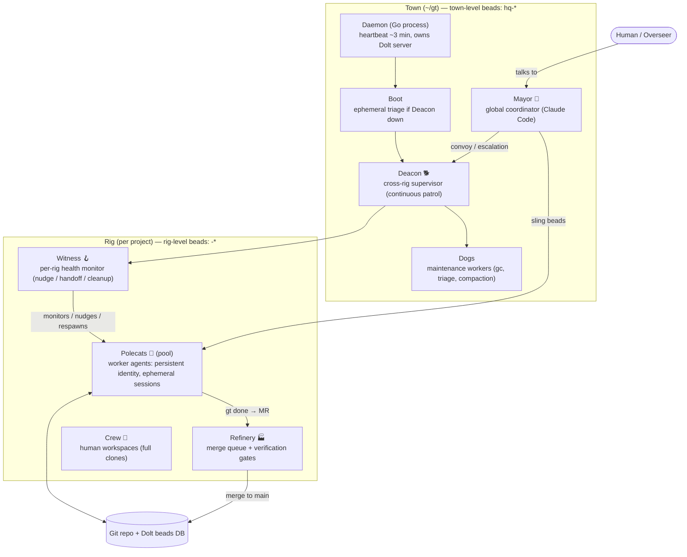
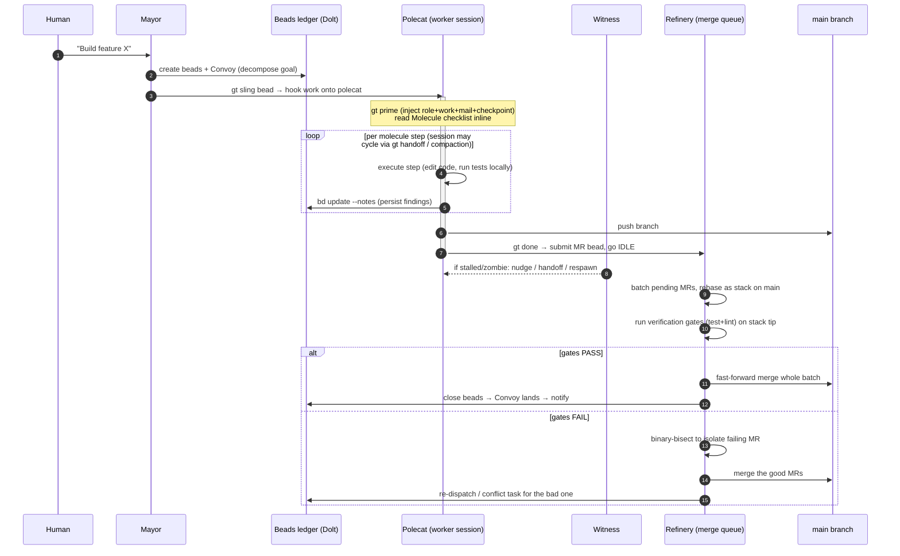
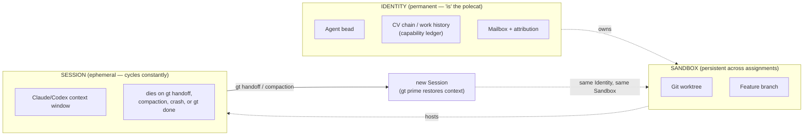

# Gas Town (gastown / gastownhall)

> Per-source research findings. Evidence read directly from `gastownhall/gastown@e7949128fc7a2205cea54d0c5d557f4f7226caba` (mirror of `steveyegge/gastown`) plus the author's primary write-up. Honest signal: **medium** (high on orchestration/harness/long-horizon reliability; ~zero on the evolutionary/self-improving core).

---

## 1. Identity

- **Name:** Gas Town (CLI: `gt`). Package/binary `gt`; Homebrew `gastown`; npm `@gastown/gt`.
- **One-line (repo description):** "Gas Town - multi-agent workspace manager." README: *"Multi-agent orchestration system for Claude Code, GitHub Copilot, and other AI agents with persistent work tracking."*
- **Author / org:** **Steve Yegge** (commit author `slit <steve.yegge@gmail.com>`). Canonical repo is `github.com/steveyegge/gastown`; `github.com/gastownhall/gastown` is the org-hosted copy I was given. Companion project **Beads** (`github.com/steveyegge/beads`, the `bd` issue-tracker) is by the same author.
- **License:** MIT.
- **Language:** Go (1.25+). ~240k lines of non-test Go across ~1,179 `.go` files (1,492 files total). Substantial, actively developed.
- **Dates:** Repo created **2025-12-16**; last push **2026-06-01**; very active (CHANGELOG is ~92 KB).
- **Popularity (GitHub API, 2026-06-04):** **15,739 stars, 1,466 forks, 240 open issues.** High community signal.
- **Code repo + commit inspected:** `gastownhall/gastown` default branch `main`, **commit `e7949128fc7a2205cea54d0c5d557f4f7226caba`** (2026-06-01), inspected via API tarball (`api.github.com/.../tarball/main`) since direct `git clone`/codeload was blocked by the sandbox proxy (407); repo identity confirmed via `api.github.com/repos/gastownhall/gastown`.

---

## 2. TL;DR

- **What it is:** Gas Town is an **orchestration / "factory" layer** that runs *many* off-the-shelf coding agents (Claude Code, Codex, Gemini, Copilot, Cursor, etc.) in parallel on real git repos, with **persistent work state in a git-backed issue ledger (Beads)** so agents survive restarts/compaction. It is **not** itself an LLM, an evolutionary search, or a self-improving agent. It is the *plumbing* — workspace management, agent lifecycle, messaging, work-tracking, and a verifying merge queue — for "20–30 agents" of coding labor. Theme: a Mad Max "Gas Town" metaphor (Mayor, Rigs, Polecats, Convoys, Refinery, Wasteland).
- **Why it matters to us (high relevance on the orchestration/control axis):** It is a serious, production-grade attempt at exactly the hard parts our brief calls out — *running agents reliably over long horizons*, persistent **memory** (Beads ledger + CV/"capability ledger"), **orchestration** of a swarm, **verification before integration** (Bors-style batch-then-bisect merge queue with pluggable gates), and **control mechanisms** (hooks, watchdog hierarchy, escalation, scheduler/rate-limit governor, "propulsion principle"). Real Go, ~240k LOC, 15.7k stars, by Steve Yegge.
- **Why it matters *less* than its size suggests:** there is **no candidate→test→keep selection loop**, **no fitness/scoring of variants**, **no self-modification of the agent or its prompts**. "Verification" = run the project's own tests/lint as merge gates; "keep if better" is absent — it keeps work if it *passes gates and merges*, not if it is *measurably better than a prior version*. So the evolutionary/seed-AI core is **not** here; the *harness around* such a core largely is.
- **The single most transferable idea:** the **three-layer decomposition of a worker** — *Identity* (permanent, with an accumulating CV/work-history "ledger"), *Sandbox* (a reusable git worktree), and *Session* (an ephemeral LLM context window that cycles via handoff/compaction *as normal operation, not failure*). This is a clean answer to "how do you run one logical agent for far longer than one context window."
- **Second idea:** treating the **git-backed issue tracker as the agent's durable memory and message bus** (work state, dependencies, notes, mail, agent identity all live as "beads" in a Dolt SQL DB), so nothing important lives only in a context window.
- **Maturity caveat:** docs describe many features as shipped, but several core pieces (batch-then-bisect MQ phases 2–3, data-plane DECAY/COMPACT/FLATTEN, the cleaner "Factory Worker API") are explicitly **in progress / blocked / design-stage**; current agent driving is admittedly a brittle pile of `tmux send-keys` + regex screen-scraping.

---

## 3. What it does & how it works

### 3.1 One-paragraph mechanism

A human runs `gt install ~/gt` to create a **Town** (workspace), then `gt rig add <name> <repo>` to register a project (**Rig**). The human talks to the **Mayor** (a long-lived Claude Code session with workspace context). The Mayor decomposes the goal into **beads** (issues in the Beads tracker), groups them into a **Convoy** (a tracking unit), and `gt sling`s beads to **Polecats** (worker agent sessions). Each polecat gets work "on its hook," runs the steps of an attached **Molecule** (a TOML-defined workflow template), and on completion runs `gt done` — which pushes its branch and submits a **Merge Request** to the **Refinery** (a per-rig merge-queue agent). The Refinery runs **verification gates** (tests/lint) and merges to `main` Bors-style (batch, and on failure binary-**bisect** to isolate the culprit MR). A watchdog hierarchy — **Daemon → Boot → Deacon → Witness** — keeps sessions alive, detects stuck/zombie agents, and routes **escalations**. All durable state (work, dependencies, notes, mail, agent identity, CVs) lives in **Beads**, stored in a per-town **Dolt SQL server**, so agents survive crashes, restarts, and context compaction.

### 3.2 Agent topology (roles)



### 3.3 The core work loop (propose → run → verify-gate → merge)

This is the closest thing Gas Town has to a "loop." Note it is a **work-completion pipeline**, not an *evolutionary selection* loop: there is no scoring of competing candidates, only "did this MR pass the gates and merge."



### 3.4 The worker's three-layer (HOP) model — how one agent outlives one context window



Key claim (verbatim, `docs/concepts/polecat-lifecycle.md`): *"Session cycling is **normal operation**, not failure. The polecat continues working—only the Claude context refreshes."* A polecat may complete one bead across three sessions (Steps 1–2 → handoff → Steps 3–4 → handoff → Step 5 → `gt done`), all the "same polecat."

### 3.5 Memory & messaging substrate (Beads + Dolt)

- **Beads** = a git-backed issue tracker (`bd` CLI; companion project) where each issue is a "bead" with id (`gt-abc12`), type, priority, status, dependencies, and free-text notes. **All durable state is beads**: project work, merge requests, agent identity/lifecycle, role definitions, mail, convoys, even "remembered" knowledge (`bd remember`, explicitly replacing `MEMORY.md`). Two-level: **town** (`hq-*`, cross-rig coordination) and **rig** (`<prefix>-*`, implementation work).
- **Storage** = a single **Dolt SQL server** per town (MySQL-protocol, git-versioned database). Agents write directly to `main` with `BEGIN`/`DOLT_COMMIT`/`COMMIT` transaction discipline for "immediate cross-agent visibility." A six-stage data-plane lifecycle (`CREATE→LIVE→CLOSE→DECAY→COMPACT→FLATTEN`) managed by "Dogs" keeps the DB from bloating (stages 4–6 still being shipped).
- **Messaging** = two channels: `gt nudge` (immediate — wakes another agent's live session) and `gt mail` (persistent — survives restarts). Agents are told *never* to communicate by printing text; only via `gt`. `gt prime` re-injects full role/work/mail/checkpoint context at session start or after compaction. `gt seance` lets an agent discover and *query its predecessor sessions* (via `.events.jsonl`) for context — a form of cross-session memory recall.

---

## 4. Evidence from the code

Repo: `gastownhall/gastown@e7949128fc7a2205cea54d0c5d557f4f7226caba` (mirror of `steveyegge/gastown`), Go module `github.com/steveyegge/gastown`, go 1.25.8. Notable deps: `github.com/steveyegge/beads v1.0.0` (the work-ledger), `go-sql-driver/mysql` (Dolt MySQL protocol), Charm `bubbletea`/`lipgloss` (TUI), `spf13/cobra` (CLI), `testcontainers-go`. ~240k LOC non-test Go; ~72 packages under `internal/`.

### 4.1 The worker prompt (the molecule that drives a polecat) — verbatim excerpts

`internal/formula/formulas/mol-polecat-work.formula.toml` (v10) is the actual prompt/checklist a worker executes (rendered inline by `gt prime`). It is a strict, gated workflow. Highlights (verbatim):

- Self-cleaning contract: *"You are a self-cleaning worker. You: 1. Receive work via your hook … 3. Complete and self-clean via `gt done` (submit + nuke yourself) 4. You are GONE - Refinery merges from MQ."* And: *"You do NOT: Push directly to main … Close your own issue … Wait for merge … Fix pre-existing failures on main (Refinery owns main health)."*
- Memory-survival rule (the load-bearing reliability idea), in the `implement` step: *"Your session can die at any time (context limit, crash, SIGKILL). Code changes survive in git, but analysis, findings, and decisions exist only in your context window. Persist them to the bead so they survive session death: `bd update {{issue}} --notes "…"` … Do this BEFORE closing molecule steps, not after."*
- Scope-as-contract: *"**Scope is a contract.** The bead description defines what you build. If you believe the issue requires work beyond what is described, mail the mayor BEFORE implementing it … Do NOT build unrequested features and present them as complete."*
- Hard gates with explicit anti-fabrication checks, e.g. `commit-changes` step: *"VERIFY commits exist (HARD GATE — do NOT close this step without passing): `git log origin/{{base_branch}}..HEAD --oneline` This MUST show at least 1 commit. If it shows NOTHING: You have NOT completed your implementation. Do NOT close this step."*
- Verification responsibility split: the polecat runs build/typecheck locally + optionally targeted tests, then in `pre-verify` rebases onto target and runs the full gate suite so the Refinery can fast-path merge: *"You run the full gate suite AFTER rebasing onto the target branch (pre-verify step). This enables the refinery to fast-path merge your MR in ~5 seconds instead of re-running gates."*

The polecat **role template** `internal/templates/polecat-CLAUDE.md` reinforces this with behavioral guardrails: a "🚨 THE IDLE POLECAT HERESY 🚨" section (must always `gt done`), "SINGLE-TASK FOCUS," directory discipline, and "Nudge, don't mail. `gt nudge` costs zero. `gt mail send` costs 1 commit forever" (Dolt-health hygiene — every mail is a permanent DB commit).

### 4.2 The verifier (Refinery merge-queue gates) — verbatim

This is the entirety of Gas Town's "verification." There is **no semantic/fitness evaluation** — it runs operator-configured shell commands and checks exit codes.

`internal/refinery/engineer.go` — the gate executor (`runGate`, around L961):
```go
cmd := exec.CommandContext(gateCtx, "sh", "-c", gate.Cmd) //nolint:gosec // G204: Gate commands are from trusted rig config
util.SetDetachedProcessGroup(cmd)
cmd.Dir = e.workDir
…
err := cmd.Run()
…
if err == nil { return GateResult{Name: name, Success: true, Elapsed: elapsed} }
```
The gate config (`GateConfig`, L74) is just `{Cmd string; Timeout; Phase}` where Phase is `pre-merge` or `post-squash`. Comment on `runGatesForPhase` (L1024): *"Any single gate failure means overall failure."* Tests run with **flaky-test retries** (`RetryFlakyTests`, default 1) — i.e., a failing test is retried before being treated as a real failure (`runTests`, L907). `TestCommand` / `Gates` come from the rig's `config.json` (operator-controlled), explicitly noted as a trust boundary.

### 4.3 The merge algorithm (batch-then-bisect) — verbatim

`internal/refinery/batch.go`. `ProcessBatch` (L199): rebase the batch as a stack on target → run gates once on the stack tip → if green, fast-forward the whole batch → if red, retry once (flaky check) → else **binary-bisect** to isolate culprits and merge the good subset. `bisectBatch` (L429):
```go
func (e *Engineer) bisectBatch(ctx context.Context, batch []*MRInfo, target string) (good []*MRInfo, culprits []*MRInfo) {
    if len(batch) <= 1 { return nil, append([]*MRInfo{}, batch...) } // single MR is the culprit
    mid := len(batch) / 2
    left  := append([]*MRInfo{}, batch[:mid]...)
    right := append([]*MRInfo{}, batch[mid:]...)
    … e.resetAndRebuildStack(left, target); leftResult := e.runBatchGates(ctx)
    if leftResult.Success { /* culprit in right half */ rightGood, rightCulprits := e.bisectRight(...) ; return append(left, rightGood...), rightCulprits }
    /* culprit in left half */ leftGood, leftCulprits := e.bisectBatch(ctx, left, target) …
}
```
This is a classic Bors-style merge queue: throughput from batching, correctness from O(log N) bisection to keep `main` green without blaming innocent MRs.

### 4.4 The "scoring" is queue priority, NOT fitness

`internal/refinery/score.go` is the only "Score" function — and it scores **merge-queue ordering**, not solution quality:
```go
// score = BaseScore
//       + ConvoyAgeWeight * hoursOld(convoy)      // Prevent convoy starvation
//       + PriorityWeight * (4 - priority)         // P0=+400, P4=+0
//       - min(RetryPenalty * retryCount, MaxRetryPenalty)  // Prevent thrashing
//       + MRAgeWeight * hoursOld(MR)              // FIFO tiebreaker
```
Notable for us as a *control* heuristic (anti-starvation + thrash-damping), but it is emphatically not selecting "better candidates."

### 4.5 Meta-evaluation of orchestration prompts (`gt-model-eval/`)

A separate **PromptFoo** harness (`gt-model-eval/`, `promptfooconfig.yaml`) evaluates the *quality of the patrol agents' decisions* (Witness/Deacon/Refinery/Dog) to decide which roles can run on cheaper models (Sonnet/Haiku) instead of Opus. 94 test cases. Each case feeds a role prompt + simulated shell output and asserts a structured JSON decision. Example (`tests/witness-stuck.yaml`): given `tmux capture-pane` output, `bd show … --json`, and a timestamp, the model must emit `{"action": "no-op|nudge|escalate|nuke|mark-zombie|create-cleanup-wisp", …}`; assertions are JavaScript (`JSON.parse(output).action === "escalate"`) plus `llm-rubric` checks (e.g., "should recognize a long-running build is in progress and NOT nudge"). "Class A" tests give a *neutral* role context (no answer hints) to measure genuine evidence-based reasoning. This is a concrete, reusable pattern for **evaluating an agent's control/judgment decisions offline**.

### 4.6 The memory substrate (Beads) — from author + code

Beads (`steveyegge/beads`, a dependency) is the durable ledger. From `internal/templates/townroot/claude.md`: *"Use `gt remember`, not MEMORY.md. Memories are stored in beads and injected at prime time. Do NOT use Claude Code's filesystem auto-memory."* Each `bd create/update`, `gt mail send` is a permanent Dolt commit (git-for-data). Steve Yegge frames Beads as *"a drop-in, generic, unopinionated memory system and knowledge graph for coding agents … Beads is the **Why** — the missing piece in your commit history,"* and notes orchestration itself is modeled as beads: *"Beads string together into 'molecules' that have deterministic steps … Every step an agent takes in a Beads-based workflow is recorded on a ledger. This acts like a save-game that you can roll back to."*

### 4.7 An interesting refinement formula (`rule-of-five`)

`internal/formula/formulas/rule-of-five.formula.toml` encodes "Jeffrey Emanuel's discovery: LLM agents produce best work through 4-5 iterative refinements." It is a fixed pipeline: `draft` (breadth over depth) → `refine-1: Correctness` → `refine-2: Clarity` → `refine-3: Edge Cases` → `refine-4: Excellence`. This is a *propose-then-iteratively-refine* template — relevant as a structured self-improvement *workflow*, though it has no automated scoring/selection between variants (the LLM judges its own progress).

---

## 5. What's genuinely smart

These are the load-bearing ideas, judged by our relevance test (would this help run a long-horizon, autonomous, software-building agent?).

1. **Separating Identity / Sandbox / Session (the HOP three-layer model).** The single best idea. A "polecat" is a *permanent identity* (with an accumulating CV/work-history), a *persistent git worktree*, and an *ephemeral LLM session* that cycles constantly. Treating context-window exhaustion/compaction/handoff as **normal operation** (not failure) — and engineering explicit handoff/resume around it — is exactly how you make one logical agent run far longer than one context window. The corollary engineering rule ("persist findings to durable storage *before* you advance a step, because the session can die at any instant") is a clean, transferable reliability discipline.

2. **A git-backed, queryable ledger as the agent's working memory AND message bus AND audit trail.** Everything durable — work items, dependencies, notes/design, mail, agent identity, role definitions, even "memories" — is a "bead" in a versioned SQL database (Dolt). This gives: survival across crashes, cross-agent visibility, a rollback-able "save-game" of the whole project's decision history, and dependency-aware "what's ready to work" queries (`bd ready`). The framing "git is the *What/Who/How*; Beads is the *Why*" is a genuinely useful articulation of what agent memory must capture for long-horizon work.

3. **A verifying integration gate that no worker can bypass (Bors-style batch-then-bisect MQ).** Workers never touch `main`; they submit MRs that must pass operator-defined gates, merged in batches with binary bisection to isolate failures. Even though the "verifier" is just `sh -c <test/lint/build>` + exit codes, the *architecture* — "candidates are quarantined until a verifier admits them, and the verifier protects a known-good baseline" — is precisely the shape a seed-AI's "keep only if it passes" gate needs. The flaky-test retry, post-squash gate phase (catch issues that only appear in the merged result), and verified-push are all hard-won production details.

4. **A watchdog hierarchy that keeps a swarm alive (Daemon → Boot → Deacon → Witness → Dogs).** Layered liveness with escalation: a dumb Go daemon guarantees a heartbeat and owns the DB server; AI agents do the *judgment* (is this polecat stuck, zombie, or just running a 4-minute test?); maintenance "Dogs" are dispatched for gc/triage. Failure-state taxonomy (Working / Idle / Stalled / Zombie) with distinct recovery paths (nudge / handoff / respawn / cleanup-wisp / nuke) is a serious answer to "how do you run 20–50 agents without constant babysitting."

5. **Control mechanisms born from real pain.** (a) The **Scheduler** is a capacity governor that batches dispatch to avoid API rate-limit exhaustion — and the daemon detects Claude usage-limit signatures and applies backoff *without* counting it against the crash-loop budget (CHANGELOG 1.2.0). (b) **Escalation** is severity-routed (`gt escalate -s CRITICAL/HIGH/MEDIUM` → Deacon → Mayor → Overseer) so a blocked agent asks for help instead of spinning or hallucinating. (c) The **Propulsion Principle** ("if it's on your hook, you RUN it; don't wait for confirmation") is a deliberate prompt-level fix for the failure mode where agents announce intent and then stall.

6. **Two structured-output evaluation harnesses.** `gt-model-eval` (PromptFoo) tests *orchestration decision quality* offline with scripted scenarios and JS/llm-rubric assertions — a model for evaluating an agent's *judgment*, not just code correctness. This matters because a seed-AI must make many control decisions whose quality is otherwise invisible.

7. **The Factory Worker API design doc** is a candid, valuable inventory of *everything that is hard and brittle* about driving a coding agent programmatically (28+ touch points: tmux send-keys chunking, prompt-prefix regex for idle detection, JSONL transcript scraping for cost, keychain token swapping). Its proposed fix — a local push-based, structured, agent-agnostic protocol (lifecycle/prompt/context/authorize/telemetry/identity/health over a Unix socket, correlated by `run_id`, fail-closed) — is essentially a spec for the harness layer any reliable autonomous-dev system needs.

---

## 6. Claims vs. reality / limitations / critiques

**(A) What's claimed.** v1.0.0 (2026-04-03); "stable for many weeks," "in maintenance mode," "non-technologists are building real software with it," 15.7k stars / hundreds of committers. A successor, **Gas City**, exposes the primitives so users can "build your own orchestrators." Beads is "an instant cognitive upgrade for any coding agent … like Adderall for your agent."

**(B) What the code/docs actually demonstrate.**
- It is unambiguously a **real, substantial, working system** (240k LOC Go, deep test suites, multi-OS release pipeline, OTEL telemetry, web dashboard). This is not vaporware.
- BUT: relative to *our* seed-AI brief, the most important parts are **absent or shallow**:
  - **No fitness function / no selection / no candidate competition.** "Better" is never measured. A change is kept iff it passes the project's own tests/lint and merges. Two competing solutions to the same bead are never compared on quality; the second just becomes "rework" if the first fails gates.
  - **No self-modification.** Agents do not edit their own prompts, role templates, formulas, or code to improve themselves. Role directives/formula overlays are **operator**-authored customization, not agent self-improvement. (The system *builds software*, and it happens to be written in itself, but there is no closed self-improvement loop on the orchestrator.)
  - **The "verifier" is exit-code-on-`sh -c`.** It inherits all the classic weaknesses: a worker can make tests pass by weakening/deleting tests, the flaky-retry can mask real intermittent failures, and gates only check what the operator configured. Nothing detects reward-hacking or test-gaming. (The worker prompt *tells* agents not to gold-plate or expand scope, but that's prompt hygiene, not enforcement.)
  - **Many "shipped" claims are partial.** `architecture.md` shows the batch-then-bisect MQ as phased (Phase 1 "in progress," Phases 2–3 "blocked"); the data-plane DECAY/COMPACT/FLATTEN stages are "being shipped"; the cleaner Factory Worker API is a **design doc**, not implemented — current reality is the brittle tmux/JSONL stack it complains about.

**(C) Failure modes & critiques (largely from the author himself — admirably candid).**
- Steve Yegge's own v1.0 post catalogs early production catastrophes: *"serial killer sprees, viciously taking out random workers mid-job (It's always the Deacon)"* and the *"22-nose Clown Show, where the Mayor scored a new clown nose every time it had massive data loss, which went on for weeks."* I.e., the watchdog layer killed healthy workers, and the memory substrate suffered repeated **total data loss** for weeks — exactly the reliability problems our system must avoid. These were the symptoms that drove the migration to Dolt (which "fixed" the bidirectional-sync/3-way-merge/tombstone-hell of the v0.x ledger).
- **Fragility is acknowledged in the binary itself**: the town-root `CLAUDE.md` warns Dolt "is fragile," with elaborate do-not-restart-blindly RCA protocols and "NEVER `rm -rf` the `.dolt-data`" warnings — operational scar tissue.
- **Cost/throughput**: patrol agents on Opus "burn through Opus budget"; the whole `gt-model-eval` effort exists to justify downgrading them. Running a 20–50-agent swarm is expensive and rate-limit-bound.
- **Theming-as-obfuscation**: the Mad Max/chemistry vocabulary (Polecats, Rigs, Convoys, Wisps, Molecules, Ice-9, Wasteland, Seance, Propulsion) is fun but raises the cost of understanding the actual mechanisms; much "documentation" is metaphor.
- **Reproducibility for us**: I verified the *code and design* directly. I could **not** verify any of the efficacy claims (non-technologists shipping production software, "just works," stability) — those are anecdotes/marketing, not benchmarks. There is no published task-success benchmark, no SWE-bench-style number, no head-to-head. Treat all capability claims as unverified.
- **Independent coverage is thin.** Beyond Yegge's own Medium posts and the GitHub repo/discussions, I found little rigorous third-party analysis in the time available (it is recent — 6 months old). The 15.7k stars indicate strong interest, not validated efficacy.

---

## 7. Relevance to a self-improving, evolutionary agent

Gas Town is **not an evolutionary or self-improving system**, so it offers *nothing* on the core seed-AI engine (no search over candidates, no fitness, no self-modification). But on the brief's explicitly-broad axes — *memory, long-horizon running, decision-making, verification, orchestration, control* — it is one of the most relevant production-grade references in the canon, because it has actually run swarms of coding agents for months and recorded what breaks.

Mapped to what each idea would help us build:

- **Long-horizon running → the Identity/Sandbox/Session split + "session cycling is normal."** Directly addresses "run an agent reliably for far longer than one context window." The discipline of persist-before-advance and `gt prime`-style context reinjection on every new session is a concrete recipe for surviving compaction/crashes during an open-ended build loop.
- **Memory → Beads (git-backed, queryable, dependency-aware ledger).** A candidate design for our agent's durable memory of *attempts, decisions, and rationale* ("the Why"), with rollback ("save-game") and "what's ready" queries. Storing orchestration state itself as ledger entries (so the loop is replayable/auditable) is directly applicable to a propose→test→keep loop that must be inspectable.
- **Verification / "keep if better" → the quarantine-then-gate architecture (Refinery MQ).** Our "keep only if verifiably better" needs exactly this shape: candidates never mutate the known-good baseline directly; an independent gate admits them; the baseline stays green via bisection. We would need to *replace* the exit-code gate with a real fitness/benchmark comparator, but the harness pattern (batch, bisect, post-squash re-verify, flaky-retry, verified-push) transfers wholesale.
- **Decision-making → offline judgment evaluation (`gt-model-eval`).** A way to *test* the agent's control decisions (when to retry, escalate, give up, branch) against scripted scenarios — useful for hardening a seed-AI's meta-decisions and for choosing the cheapest model that still decides well per role.
- **Orchestration → role topology + Convoys/Molecules + propulsion.** If our seed-AI ever fans out into parallel explorations, the Mayor/Witness/Refinery decomposition, convoy tracking of a batch of attempts, and formula/molecule templates (deterministic multi-step workflows with checkpoint recovery) are a proven scaffold.
- **Control → scheduler (rate-limit governor), escalation (severity routing), watchdog taxonomy (stalled/zombie detection + recovery), and the Factory Worker API spec.** These are the unglamorous mechanisms that keep an unattended loop from melting down on API limits, silent stalls, or zombie sessions. The Factory Worker API in particular is a blueprint for a clean control plane between an orchestrator and an agent runtime (push-based lifecycle/telemetry/authorize/health, fail-closed).
- **Refinement workflow → `rule-of-five`.** A simple, citable "draft → correctness → clarity → edge-cases → excellence" iteration template; a low-tech analog to an improvement loop (no selection, but a structured propose-and-improve cadence).

What is **not** relevant / must not be force-fit: the entire Mad-Max metaphor layer, the human-concierge "talk to the Mayor / cartoon fox" UX vision, Dolt-specific operational minutiae, and the federation/"Wasteland" reputation network (interesting but orthogonal to a single self-improving agent).

---

## 8. Reusable assets

Concrete, quotable things we *could* borrow (collected as evidence; not assembled into a design).

1. **The polecat worker prompt/checklist** — `repo@SHA:internal/formula/formulas/mol-polecat-work.formula.toml`. A battle-tested autonomous-coding workflow with hard gates and anti-fabrication checks. Especially reusable verbatim:
   - *"Your session can die at any time (context limit, crash, SIGKILL). Code changes survive in git, but analysis, findings, and decisions exist only in your context window. Persist them … BEFORE closing molecule steps, not after."*
   - *"VERIFY commits exist (HARD GATE …): `git log origin/{{base_branch}}..HEAD --oneline` This MUST show at least 1 commit. If it shows NOTHING: You have NOT completed your implementation. Do NOT close this step."*
   - *"**Scope is a contract.** … Do NOT build unrequested features and present them as complete."*
2. **Worker behavioral guardrails** — `repo@SHA:internal/templates/polecat-CLAUDE.md`: the "always finish with `gt done`," single-task focus, directory discipline, and "nudge (free) vs mail (permanent commit)" hygiene rules.
3. **The verifier + merge algorithm** — `repo@SHA:internal/refinery/engineer.go` (`runGate`/`runGatesForPhase`/`runTests`, gate phases pre-merge vs post-squash, flaky-retry) and `repo@SHA:internal/refinery/batch.go` (`ProcessBatch`, `bisectBatch`). A drop-in pattern for "quarantine candidates → gate → batch-merge → bisect on failure → keep the good subset."
4. **MR priority scoring (control heuristic)** — `repo@SHA:internal/refinery/score.go`: anti-starvation + retry-thrash damping formula. Reusable as a *scheduling* heuristic (not fitness).
5. **Offline judgment-eval harness** — `repo@SHA:gt-model-eval/` (PromptFoo config + `tests/*.yaml`). The scenario schema (`role_context`, `shell_output`, `allowed_actions`, JS + `llm-rubric` assertions, "Class A" neutral-context tests) is a reusable template for evaluating agent control decisions and for model-downgrade decisions.
6. **The Factory Worker API design** — `repo@SHA:docs/design/factory-worker-api.md`: a full inventory of agent-driving pain points + a clean push-based control-plane spec (lifecycle/prompt/context/authorize/telemetry/identity/health, Unix socket, `run_id` correlation, fail-closed). Use as a checklist for our orchestrator↔runtime boundary.
7. **The three-layer worker model + lifecycle state machine** — `repo@SHA:docs/concepts/polecat-lifecycle.md`: Identity/Sandbox/Session decomposition and the Working/Idle/Stalled/Zombie taxonomy with recovery actions.
8. **Formula/Molecule schema** — `repo@SHA:internal/formula/formulas/*.toml` (e.g. `release.formula.toml`, `rule-of-five.formula.toml`): TOML workflow templates with `id`/`needs` DAG steps, variables, and a `pour` flag for checkpoint-recoverable materialization. A clean data schema for representing a multi-step plan with resumability.
9. **Memory-substrate framing** — `repo@SHA:internal/templates/townroot/claude.md` ("use `gt remember`, not MEMORY.md") + Yegge's "git is the What/Who/How; Beads is the Why" articulation; and the `CREATE→LIVE→CLOSE→DECAY→COMPACT→FLATTEN` data-plane lifecycle (`architecture.md`) for keeping a ledger from bloating.

---

## 9. Signal assessment

- **Overall value: MEDIUM** (high on the orchestration/harness/long-horizon-reliability axis; near-zero on the evolutionary-search/self-improvement core that defines our seed-AI). It is one of the best available references for *the scaffolding around* an autonomous-dev loop, and a useful catalog of real failure modes; it teaches us almost nothing about *selection over candidates* or *self-modification*.
- **Confidence: HIGH on what it is and how it works** — I read the actual code (worker prompt, verifier, bisect, scorer, role templates, eval harness) and the primary design docs at a known SHA, corroborated by the author's own write-up. **LOW confidence on efficacy** — all capability/"it just works"/non-technologist-success claims are unbenchmarked anecdote.
- **What I could NOT verify:** (1) any quantitative task-success/quality metric (none published); (2) runtime behavior at the claimed 20–50 agent scale (no access to run it; needs Dolt/tmux/Claude Code); (3) the *current* implementation status of phased features (MQ batch-then-bisect Phases 2–3, data-plane DECAY/COMPACT/FLATTEN, Factory Worker API) beyond what docs/CHANGELOG state; (4) the companion **Beads** internals (separate repo, not cloned here) — I relied on Gas Town's usage of it + the author's description; (5) "Gas City," the closed/alpha successor, which is where active development moved (not in this repo).
- **Maturity:** Genuinely shipped and used (v1.0, large community), but explicitly in *maintenance mode* with development redirected to Gas City; expect the most interesting orchestration primitives to evolve there.

---

## 10. References

**Primary — code (all `gastownhall/gastown@e7949128fc7a2205cea54d0c5d557f4f7226caba`, mirror of `steveyegge/gastown`):**
- `repo@e794912:README.md` — overview, role taxonomy, command reference, MEOW/propulsion.
- `repo@e794912:docs/design/architecture.md` — two-level Beads, agent taxonomy, Dolt storage, batch-then-bisect MQ, data-plane lifecycle, directives/overlays.
- `repo@e794912:docs/concepts/polecat-lifecycle.md` — Identity/Sandbox/Session three-layer model; Working/Idle/Stalled/Zombie states.
- `repo@e794912:docs/concepts/propulsion-principle.md` — "if it's on your hook, you RUN it"; capability ledger.
- `repo@e794912:docs/concepts/molecules.md` — Formula→Proto→Mol/Wisp; root-only vs poured (checkpoint recovery).
- `repo@e794912:docs/concepts/convoy.md` — convoy/swarm tracking model.
- `repo@e794912:docs/design/factory-worker-api.md` — agent-driving pain inventory + proposed push-based control-plane API.
- `repo@e794912:internal/formula/formulas/mol-polecat-work.formula.toml` — the worker prompt/checklist (v10).
- `repo@e794912:internal/templates/polecat-CLAUDE.md` — polecat role template/guardrails.
- `repo@e794912:internal/templates/townroot/claude.md` — town-root identity anchor; memory + Dolt operational rules.
- `repo@e794912:internal/refinery/engineer.go` — gate executor (`runGate`/`runGatesForPhase`/`runTests`), `GateConfig`/`MergeQueueConfig`.
- `repo@e794912:internal/refinery/batch.go` — `ProcessBatch`, `bisectBatch` (Bors-style batch-then-bisect).
- `repo@e794912:internal/refinery/score.go` — MR priority scoring (queue ordering, not fitness).
- `repo@e794912:internal/formula/formulas/rule-of-five.formula.toml` — draft→refine iterative-refinement workflow.
- `repo@e794912:gt-model-eval/README.md` + `gt-model-eval/tests/witness-stuck.yaml` — PromptFoo judgment-eval harness (94 cases).
- `repo@e794912:CHANGELOG.md` — e.g. v1.2.0 quota/rate-limit-aware crash-loop handling.

**Primary — author:**
- Steve Yegge, *"Gas Town: from Clown Show to v1.0,"* Medium, 2026-04-03 — https://steve-yegge.medium.com/gas-town-from-clown-show-to-v1-0-c239d9a407ec (v1.0 narrative; candid failure modes — "serial killer sprees," "22-nose Clown Show / massive data loss"; Beads-as-memory framing; Gas City successor).
- GitHub repo (canonical): https://github.com/steveyegge/gastown ; mirror given to me: https://github.com/gastownhall/gastown (org description: "Gas Town - multi-agent workspace manager"; MIT; created 2025-12-16; 15,739★ / 1,466 forks / 240 open issues as of 2026-06-04 via GitHub API).
- Companion project (memory ledger, dependency, not separately inspected): https://github.com/steveyegge/beads .
- Referenced discussions/issues (not deeply read): `steveyegge/gastown` Discussion #1542 / Issue #1545 (model-downgrade evidence motivating `gt-model-eval`).

**Secondary:**
- pkg.go.dev module page (version metadata): https://pkg.go.dev/github.com/steveyegge/gastown .

**Could not verify / out of scope:** quantitative efficacy benchmarks (none found); live multi-agent-scale behavior (not run); Beads internals; "Gas City" successor (alpha, not in this repo).
