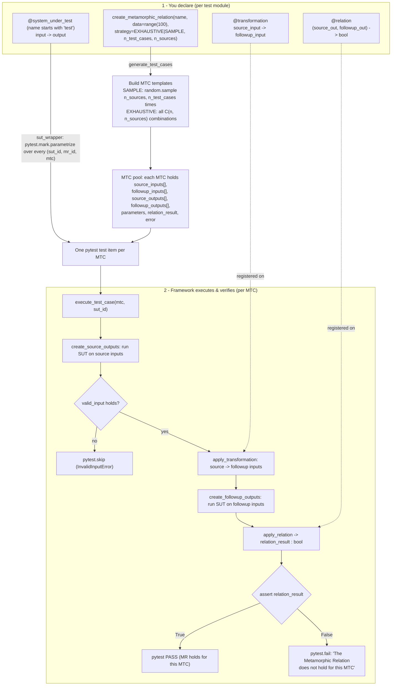
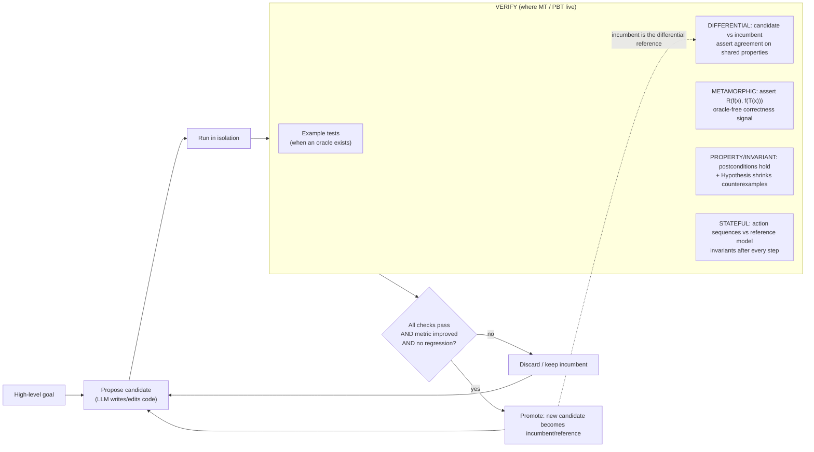

# GeMTest — General Metamorphic Testing Framework (+ property-based / differential / metamorphic testing)

> Per-source findings doc. Researcher: sub-agent. Source assigned: **gemtest** (TU Munich) plus the broader practice of property-based / stateful / differential / metamorphic testing (Hypothesis). Relevance lens: *would this help build a self-improving, evolutionary, software-building agent?* — specifically the **verification / "keep only if verifiably better"** crux.

---

## 1. Identity

- **Name:** `gemtest` ("GeMTest 💎: A General Metamorphic Testing Framework").
- **What it is:** A small Python library + **pytest plugin** for writing **metamorphic relations** (MRs) and auto-deriving/executing many concrete **metamorphic test cases** (MTCs) as a normal pytest suite. Ships an optional HTML/SQLite report + companion web app (`gemtest-webapp`).
- **Authors / org:** Simon Speth and Alexander Pretschner, **Technical University of Munich (TUM)**, chair I4 (Software & Systems Engineering). Repo org `tum-i4`. Main committer `simon.speth@tum.de`.
- **Dates:** Repo created 2025-01-27; inspected HEAD commit dated 2025-06-13 ("Version 1.0.1"). Published as a tool paper at **ICSE 2025 (ICSE-Companion / demonstrations track)**, "GeMTest: A General Metamorphic Testing Framework," pp. 1–4, Ottawa.
- **Lineage:** gemtest is a renamed, generalized successor to **`metamorphic-test`** (a.k.a. the earlier "metamorphic" pytest plugin from the same group); it grew out of TUM teaching/research on testing ML and autonomous-driving systems.
- **Primary links:**
  - Repo: <https://github.com/tum-i4/gemtest>
  - PyPI: `pip install gemtest` (package name `gemtest`).
  - Paper (ICSE 2025 tool track): Speth & Pretschner, "GeMTest: A General Metamorphic Testing Framework," ICSE-Companion 2025, pp. 1–4.
  - **Note on the brief's arXiv id `2211.12003`:** that id is *not* the GeMTest paper — it is **"Application of property-based testing tools for metamorphic testing"** (Alzahrani, Spichkova, Harland; RMIT; ENASE 2022). It is, however, directly on-point for the brief's secondary question (how MT relates to PBT/Hypothesis), so I treat it as a companion source rather than a mistake — see §3 and §10.
- **Code repo + commit SHA inspected:** `tum-i4/gemtest @ f13150ebf86ddf5e350dfba351381beb23ddb` (branch `main`, tag/message "Version 1.0.1", committed 2025-06-13T09:21:57Z). Obtained via codeload tarball (direct `git clone` blocked by sandbox proxy 407; SHA confirmed via GitHub API `repos/tum-i4/gemtest/commits/main`). Stars at inspection: ~9.

---

## 2. TL;DR

- **gemtest is a thin, well-engineered DSL for metamorphic testing on top of pytest.** You write a `transformation` (source input → follow-up input) and a `relation` (does `f(source)` relate correctly to `f(followup)`?). The framework cross-products your transformations × data × systems-under-test (SUTs) into many pytest cases. ~1.5k LOC of library code; not a research engine.
- **The load-bearing idea is the testing *technique*, not the tool: metamorphic testing solves the "oracle problem".** You can test a program *without knowing the correct output* — you only assert a **relation between two runs**. For a self-improving agent that must judge "is this new code correct?" with no golden oracle, this is the single most directly relevant pattern in the source.
- **It is a *specification* harness, not an *evolutionary* one.** There is no candidate population, no fitness, no promotion loop, no LLM, no self-modification. Relevance is entirely at the **verifier** layer: how to express checkable properties and run them at scale.
- **Closely twinned with property-based testing (Hypothesis).** gemtest = metamorphic flavor with explicit transformation/relation decorators + exhaustive/sampling over a fixed dataset. Hypothesis = generative flavor (random + shrinking + stateful machines) that also supports metamorphic and differential patterns. Both encode the same insight: **check invariants/relations, not exact values.**
- **Honest signal: MEDIUM.** Not a system to copy, but a precise, code-backed reference for the verification primitive an evolutionary coding agent needs ("verifiably better" requires *some* oracle; MT/PBT manufacture one from relations). The differential-testing pattern (compare candidate vs. reference/old version) maps almost 1:1 onto "keep only if better than the incumbent."
- **Watch-outs it teaches:** relations are only as good as you write them (weak/trivial relations pass everything → reward-hackable); a passing MR proves *consistency*, not *correctness*; flaky/stochastic SUTs need tolerance (`approximately`) and care.

---

## 3. What it does & how it works (mechanism-level)

### The core idea: metamorphic testing dissolves the oracle problem

Most tests are *example-based*: "for input `x`, assert output `f(x) == y`," where `y` is a known correct answer (the **oracle**). For many programs no cheap oracle exists — ML models, simulators, optimizers, scientific code, compilers, "does this LLM-generated function do the right thing?" These are called **non-testable** programs. The classic illustration (Chen et al.) is `sin`: it is hard to assert `sin(x)` equals a specific value, but you *know* `sin(x) == sin(x + 2π)`. That equality between **two related runs** is a **metamorphic relation (MR)**: a necessary property that links a *source* input/output to a *transformed* ("follow-up") input/output. If the MR is violated, the program is provably buggy — **without ever knowing the right answer.** (Definitions: arXiv 2211.12003 §1; ACM Computing Surveys 10.1145/3143561.)

`gemtest` operationalizes exactly this, and nothing more. It is a **pytest plugin** that lets you declare MRs with four decorators and then auto-derives & runs a swarm of concrete test cases.

The four building blocks of every gemtest MR (`README.md`):
1. **`create_metamorphic_relation(name, data, ...)`** — declares an MR and the **dataset of source inputs** to draw from.
2. **`@transformation` / `@general_transformation`** — source input → follow-up input(s). (The morphism on the *input* side.)
3. **`@system_under_test`** (SUT) — the function being tested; run on both source and follow-up inputs. (Name must start with `test`; this is the actual pytest test.)
4. **`@relation` / `@general_relation`** — the predicate that must hold between source output(s) and follow-up output(s). (The morphism on the *output* side — the **verifier**.)

Optional: `@valid_input` (precondition filter — skip MTCs whose source output isn't in a valid domain), `@randomized`/`@fixed` (parameterize the transformation), `batch_size` (vectorized SUT calls), visualizers/exporters (for the HTML report + web app).

### The flow: from one relation to N pytest cases



**Key semantics (`gemtest/metamorphic_relation.py`):**
- **Test-case generation is a cross product.** `SAMPLE` draws `number_of_test_cases` random `number_of_sources`-tuples; `EXHAUSTIVE` enumerates all `C(n, number_of_sources)` combinations of the dataset (the code literally computes `n! / (r!(n-r)!)` and refuses if you ask for more cases than exist). Each `(transformation × SUT × parameter-permutation × source-tuple)` becomes one independent pytest case.
- **The SUT is run twice** (source inputs, then follow-up inputs), optionally **batched** (`run_sut_batches` pulls items off a per-SUT `InputQueue` and calls the SUT on a list).
- **Verification = `apply_relation`** (the heart). It calls your `relation(source_output, followup_output)` (or `general_relation(mtc)`), stores a **bool** `relation_result`. The pytest test then does `assert mtc.relation_result`; a `False` becomes `pytest.fail(...)`.
- **A clever guard:** during execution it monkey-patches `pytest.skip` to a `wrong_skip_method_used` shim, forcing testers to use `gmt.skip()` (which raises `SkippedMTC`) so that "skip" is handled inside the MR lifecycle, not silently swallowed by pytest.
- **Composite relations:** `or_(rel1, rel2)` builds `rel1 OR rel2`; the README also shows building `is_less_than_or_equal = or_(equality, is_less_than)`. Relations are first-class composable functions.

### How this generalizes property-based / differential / stateful testing

The brief asks how MT relates to property-based testing (PBT) with Hypothesis. The precise relationship (arXiv 2211.12003, Alzahrani/Spichkova/Harland, RMIT, ENASE 2022): **"MT can be seen as a very specific kind of PBT."** PBT = "generate random inputs, assert a *universally-quantified property* holds, **shrink** failures to a minimal counterexample." The property can be many things; metamorphic relations are one family of them.

| Style | Property checked | Oracle source | gemtest analog |
|---|---|---|---|
| **Invariant / postcondition** PBT | `P(f(x))` holds for all `x` (e.g. `sorted(xs)` is non-decreasing; `decode(encode(x))==x`) | the invariant itself | a one-input relation (`valid_input`) |
| **Metamorphic** | `R(f(x), f(T(x)))` across two runs | a *relation*, no golden value | **the whole point** — `@transformation` + `@relation` |
| **Differential** | `f(x) == f_ref(x)` (or new-version vs old-version) | a *reference implementation* | a relation comparing two SUTs / model-vs-impl |
| **Stateful / model-based** | after any action sequence, system state agrees with a simple model; invariants hold after every step | an abstract **model** | (not built-in; Hypothesis `RuleBasedStateMachine`) |

**Differential testing** is the one most relevant to "keep only if verifiably better": run candidate and a trusted reference (or the previous version) on the same input and assert they agree. The MarkTechPost guide shows it literally: `merge_sorted(a,b)` is checked against `merge_sorted_reference = lambda a,b: sorted(a+b)`, and two independent integer parsers are checked to agree on all structured inputs.

**Stateful testing** (Hypothesis `RuleBasedStateMachine`, [hypothesis stateful docs]) goes further than gemtest: Hypothesis *generates the test itself* — sequences of `@rule`-decorated actions, with `@precondition` guards, `@initialize` setup, `Bundle`s to thread generated values between steps, and `@invariant` checks run after **every** step. The canonical example compares a real key-value database against an in-memory `dict` model and looks for any divergence — i.e. a *differential + stateful* oracle over arbitrary operation sequences.

---

## 4. Evidence from the code

Inspected `tum-i4/gemtest @ f13150ebf86ddf5e350dfba351381beb23ddb`. Library is ~2,490 LOC across `gemtest/` (incl. relations/generators/report). It is genuinely small and readable. Files that carry the load:

| File (`repo@SHA:path`) | Role |
|---|---|
| `gemtest/decorator.py` | All public decorators; `sut_wrapper` turns an SUT + MR into parametrized pytest items; defines the actual `test_mtc` body (the assert). |
| `gemtest/metamorphic_relation.py` | The engine: test-case generation, SUT execution (incl. batching), transformation, **relation evaluation (the verifier)**, error handling, execution report. |
| `gemtest/metamorphic_test_case.py` | The candidate/experiment data structure (`MetamorphicTestCase`). |
| `gemtest/register.py` | `create_metamorphic_relation()` — registration + eager `generate_test_cases()`. |
| `gemtest/relations/{simple,approximately,or_}.py` | Built-in relations: `equality`, `is_less_than`, `is_greater_than`, `approximately` (delegates to `pytest.approx`), `or_` (combinator). |
| `gemtest/generators/{randint,randfloat}.py`, `generator.py` | `MetamorphicGenerator` ABC + `RandInt`/`RandFloat` for `@randomized` transformations. |
| `gemtest/metamorphic_error.py` | Typed errors + `gmt.skip()`. |
| `gemtest/testing_strategy.py` | `EXHAUSTIVE` vs `SAMPLE`. |
| `gemtest/conftest.py`, `report/*` | pytest hooks; `--string-report`/`--html-report`; SQLite handler + visualizer for `gemtest-webapp`. |

### 4.1 The verifier (the most important code) — `metamorphic_relation.py`

The entire correctness judgment reduces to producing a single `bool` per test case. There is **no ML, no scoring, no LLM** — just your predicate:

```python
def apply_relation(self, test_case: MetamorphicTestCase):
    ...
    if self.relation:
        relation_result = self.relation(            # YOUR @relation function
            test_case.source_outputs[0],
            test_case.followup_outputs[0]
        )
        self._update_relation_result(test_case, relation_result)
    if self.general_relation:
        result = self.general_relation(test_case)   # YOUR @general_relation
        self._update_relation_result(test_case, result)
```

…and the assertion that turns it into pass/fail (`decorator.py`, inside `test_mtc`):

```python
mr.execute_test_case(mtc, sut_id)
if mtc.error and isinstance(mtc.error, (InvalidInputError, SkippedMTC)):
    pytest.skip(mtc.error.message)
try:
    assert mtc.relation_result
except AssertionError:
    pytest.fail("The Metamorphic Relation does not hold for this "
                "Metamorphic Test Case", pytrace=False)
```

The lifecycle orchestrator (`execute_test_case`) is a clean 4-step pipeline: **source outputs → follow-up outputs → relation → report**, with errors captured (not swallowed) and a report always produced in `finally`:

```python
def execute_test_case(self, mtc, sut_id):
    try:
        self.create_source_outputs(mtc, sut_id)
        self.create_followup_outputs(mtc, sut_id)
        self.apply_relation(mtc)
        if mtc.error:
            raise mtc.error from mtc.error.original_exception
    except InvalidInputError as e:
        logger.info(e)
    except MetamorphicRelationError as e:
        logger.error(e)
    finally:
        mtc.report = self.create_execution_report(mtc)
```

### 4.2 The candidate/experiment data structure — `MetamorphicTestCase`

This is how one "experiment" is represented. Note `UninitializedValue` sentinels track which SUT runs are still pending (enabling batching & lazy execution), and `relation_result` defaults to `False` (a missing verdict is a failure, not a pass — a safe default):

```python
@dataclass
class MetamorphicTestCase:
    _source_inputs: List = field(default_factory=list)
    _followup_inputs: List = field(default_factory=list)
    _source_outputs: List = field(default_factory=list)
    _followup_outputs: List = field(default_factory=list)
    _parameters: Dict = field(default_factory=dict)
    _relation_result: bool = False                # default = fail
    _report: Optional["GeneralMTCExecutionReport"] = None
    _error: Optional[MetamorphicRelationError] = None
    data_loader: Optional[Callable] = None
    validated = False
```

All accessors return `copy.deepcopy(...)` — defensive isolation so a transformation/relation cannot mutate stored inputs/outputs between runs.

### 4.3 Test-case generation — `generate_test_cases()`

```python
if self.testing_strategy is TestingStrategy.SAMPLE:
    for _ in range(self.number_of_test_cases):
        source_input = random.sample(self.data, self.number_of_sources)
        ... mtc.source_inputs = source_input; self.mtc_templates.append(mtc)
elif self.testing_strategy is TestingStrategy.EXHAUSTIVE:
    source_inputs = [list(x) for x in combinations(self.data, self.number_of_sources)]
    for source_input in source_inputs: ...
```

It validates up front that you cannot request more cases than `C(n, r)` source-tuples exist (`_calculate_possible_sources`).

### 4.4 The relations (built-in verifiers) — `relations/`

All ship as tiny pure functions, e.g.:

```python
def equality(f_x, f_xt, **_kwargs) -> bool:        # exact
    return bool(f_x == f_xt)
def approximately(f_x, f_xt, relative=None, absolute=None, **_kwargs) -> bool:
    return f_x == pytest.approx(f_xt, rel=relative, abs=absolute)   # float-tolerant
def or_(rel1, rel2, **kwargs):                     # combinator
    def or_impl(f_x, f_xt): return rel1(f_x, f_xt, **kwargs) or rel2(f_x, f_xt, **kwargs)
    or_impl.__name__ = f'{rel1.__name__} or {rel2.__name__}'
    return or_impl
```

### 4.5 A complete, real example (`README.md`) — the `sin` MR

```python
import gemtest as gmt
import math
mr_1 = gmt.create_metamorphic_relation(name='mr_1', data=range(100))

@gmt.transformation(mr_1)
def example_transformation(source_input: float) -> float:
    return source_input + 2 * math.pi          # f(x) and f(x+2π) should match

@gmt.relation(mr_1)
def example_relation(source_output: float, followup_output: float) -> bool:
    return gmt.relations.approximately(source_output, followup_output)

@gmt.system_under_test(mr_1)
def test_example_sut(input: float) -> float:
    return math.sin(input)
# `pytest test_sin_metamorphic.py` → 100 passed
```

The "general" form lets one MR use **multiple sources and multiple follow-ups**, and lets the transformation read source outputs (`tests/end2end/test_multiple_sources_followups.py`):

```python
@gmt.general_transformation(mr_1)
@gmt.randomized('n', gmt.RandInt(1, 10))
@gmt.fixed('c', 0)
def shift(mtc: gmt.MetamorphicTestCase, n: int, c: int):
    followup_input_1 = mtc.source_inputs[0] + 2 * n * math.pi + c
    followup_input_2 = mtc.source_inputs[1] - 2 * n * math.pi + c
    return followup_input_1, followup_input_2
```

### 4.6 Property-based testing analogs (companion sources, not gemtest code)

**Differential** + **metamorphic** + **stateful** with Hypothesis (MarkTechPost guide, runnable):

```python
# Differential: candidate vs trusted reference
@given(a=sorted_lists, b=sorted_lists)
def test_merge_matches_reference(a, b):
    assert merge_sorted(a, b) == merge_sorted_reference(a, b)   # sorted(a+b)

# Stateful + differential: real impl vs in-memory model (Hypothesis docs)
class DatabaseComparison(RuleBasedStateMachine):
    keys = Bundle("keys"); values = Bundle("values")
    @rule(target=keys, k=st.binary()) ...
    @rule(k=keys, v=values)
    def save(self, k, v): self.database.save(k, v); self.model.setdefault(k, set()).add(v)
    @rule(k=keys)
    def values_agree(self, k): assert set(self.database.fetch(k)) == self.model.get(k, set())
```

The `@invariant`-after-every-step, `@precondition`-guarded-rule, `Bundle`-threaded-state machinery is Hypothesis-only (gemtest has no stateful layer).

---

## 5. What's genuinely smart

The smart content is mostly in the *technique* gemtest packages, plus a few clean engineering choices in the tool itself.

1. **Manufacturing an oracle from a relation (the load-bearing idea).** The deep insight is that you do **not** need to know the correct output to detect a bug — you only need a *necessary relationship* between the outputs of two related runs. This converts "is this output correct?" (often unanswerable) into "are these two outputs *consistent*?" (often easy). For any agent that generates code/models whose correctness can't be checked against a golden answer, this is the canonical escape from the oracle problem. (arXiv 2211.12003; survey 10.1145/3143561.)

2. **The transformation/relation split is a reusable verifier schema.** Separating the *input morphism* (`@transformation`: how to perturb) from the *output predicate* (`@relation`: what must stay true) is a clean, composable contract. You can hold one fixed and vary the other; relations compose (`or_`), and the SUT is a third independent slot — so one relation set tests many implementations, and one implementation is tested by many relations. This is exactly the decoupling you want if a verifier must be *reused across an evolving population of candidate programs*.

3. **One relation → a swarm of cheap tests, automatically.** `generate_test_cases()` turns a single declared property into hundreds of concrete pytest cases by cross-producing data × sources × parameters. Combined with "tokens are unlimited / compute is cheap," this is the right shape: write the invariant once, brute-force it over a large generated input space. (gemtest does *fixed-dataset* sampling/exhaustion; Hypothesis adds *generative* search + **shrinking** to a minimal counterexample — strictly more powerful for discovery.)

4. **Differential testing as a correctness ratchet.** The PBT framing makes "compare candidate to a trusted reference / to the previous version, assert agreement" a first-class oracle. This is the single most transferable pattern for "keep only if verifiably better": the incumbent program *is* the reference; a candidate that diverges on a property that the incumbent satisfied is rejected. (MarkTechPost differential example; Hypothesis DB-vs-model example.)

5. **Safe defaults & honest failure handling (tool-level).** Small but telling: `relation_result` defaults to `False` (no verdict = fail, not pass); every accessor `deepcopy`s to prevent cross-run state leakage; `pytest.skip` is monkey-patched out so testers can't accidentally turn a real failure into a silent skip (`wrong_skip_method_used`); errors are typed (`SUTExecutionError`, `TransformationError`, `RelationError`, `InvalidInputError`) and *captured into the test case* rather than crashing the run. A self-improving agent's verifier needs precisely this discipline (fail-closed, isolate state, never silently pass).

6. **`valid_input` as a precondition gate.** Inputs whose *source output* falls outside a valid domain are skipped, not failed — distinguishing "this candidate is wrong" from "this test case doesn't apply." The PBT analog is Hypothesis `assume()` / `@precondition`. Crucial for not penalizing a candidate for inputs it was never meant to handle.

7. **Stateful/model-based testing (Hypothesis) as the high-water mark.** For systems with state (most real software), Hypothesis *generates the test program itself* — random action sequences with `@invariant` checks after every step and a simple reference **model** as oracle. This is the most powerful verification pattern in the whole source family and the one gemtest lacks.

---

## 6. Claims vs. reality / limitations / critiques

**What gemtest actually claims (modest and accurate).** The README/ICSE tool paper claim only that gemtest makes it *easy* to write MRs in Python and run them as pytest, with reporting + a web app. There is **no** empirical bug-finding study, no benchmark, no comparison in the repo — it is a *demonstration/tool* paper (ICSE-Companion, 4 pages). The claims are proportionate; I found no overstatement in the tool itself.

**(A) Claim vs (B) demonstrated.** (B) The code demonstrably does what it says: generates and runs MTCs, evaluates relations, reports. The bundled tests are *self-tests of the framework* (e.g. `assert number_of_passed_tests == 20`), using trivial SUTs like `math.sin` marked `@pytest.mark.xfail`. There is **no evidence in-repo** about effectiveness at finding real bugs; that evidence lives in the broader MT literature, not here.

**Fundamental limitations of the *technique* (these are the important critiques):**

- **A passing MR proves *consistency*, not *correctness*.** A wrong program that is *consistently* wrong can satisfy every MR. MT detects faults that *break a relation*; it cannot certify overall correctness. (Survey 10.1145/3143561; arXiv 2209.11031.) → For an evolutionary agent this is a **reward-hacking surface**: optimizing to "pass all MRs" can converge on a program that's self-consistent but incorrect.

- **The MR-quality problem (the crux).** Effectiveness depends entirely on the human-chosen relations. Documented findings: weak MRs catch almost nothing while strong MRs catch far more — e.g. in MTES (PMC6380623) the strongest MR killed **16.79%** of mutants and the weakest **0.91%**; good MRs are *semantically rich*, make follow-up executions *as different as possible* from source, and require **domain + program-structure knowledge** (purely theoretical knowledge "does not suffice") (arXiv 2209.11031; Chen et al.). A trivial relation like `True` or `len(out) >= 0` passes everything — i.e. the verifier can be silently vacuous. There is *no built-in check* in gemtest that a relation is non-trivial.

- **No a priori way to know if your MR set is any good.** "Number of bugs found" is only measurable *after* bugs are fixed. "Metamorphic Coverage" (arXiv 2508.16307) proposes a code-coverage-difference proxy (a pair is effective when source & follow-up exercise *different code paths*), but even there all ten evaluated MT methods had MC < 5%, and MC=100% can still test nothing if one input triggers no logic. Bottom line: **judging the verifier itself is an open research problem.**

- **Floating-point / stochastic flakiness → false positives.** Rounding can violate an exact MR on a correct program (PMC6380623 gives a banking example: `12240.21` vs expected `12240.22`). gemtest's mitigation is `approximately` (tolerance via `pytest.approx`) and `or_`, but choosing tolerances is itself error-prone, and a too-loose tolerance re-introduces the "passes everything" problem. The TUM drone MT report (arXiv 2209.11031) documents a real **false validation** (a 7-second recognition delay) fixed only by hand-tuning `Δt` from 3 s to 10 s — i.e. relations need babysitting on non-deterministic SUTs.

- **gemtest-specific scope limits (from the code):** `@transformation`/`@relation` are strictly 1-source/1-output (multi-source needs the `general_*` forms); each MR can have exactly one transformation and one relation; `EXHAUSTIVE` blows up combinatorially with `number_of_sources` (it builds all `C(n, r)` tuples — the code even warns about exponential growth); SUT errors call `raise SystemExit(...)`, which aborts the pytest session hard rather than failing one case; no built-in shrinking (you get the failing MTC but not a *minimized* one — a real ergonomic gap vs Hypothesis).

**Reproducibility / maturity.** Tiny project (~9 stars at inspection, v1.0.1, single primary author). Clean CI (GitLab), linting (prospector/qodana/bandit), good unit + e2e tests *of the framework*. But it is research-grade infrastructure, not a battle-tested dependency. I could not find independent third-party adoption or critique of *gemtest specifically* (the critiques above are of MT as a technique). The companion closed-source TUM DL-robustness work (arXiv 2412.01958) uses GeMTest but explicitly notes its "detailed framework and methods … are part of a closed-source development and are not currently publicly available" — so that downstream evidence is not verifiable.

**Independent skeptical note:** the flagship MT survey (10.1145/3143561) itself drew a sharply critical published review (notes it defines MT only on p.4 after using it, is "defensive," and contains "bad numerical analysis taught as incorrect to undergraduates"). Worth knowing the field's foundational survey is contested on rigor.

---

## 7. Relevance to a self-improving, evolutionary agent

The project's crux is **verification**: an open-ended loop of *propose → test in isolation → keep only if verifiably better*. gemtest/MT/PBT sit squarely on the "test" and "verifiably better" steps. Mapped concretely:



Specific, transferable mechanisms (each tied to what it helps with):

- **Oracle-free verification of generated code (MT).** When the agent writes a function with no reference answer, metamorphic relations give a *correctness signal anyway*. Helps: the central "is this candidate actually right?" question on non-testable tasks. (e.g. an LLM-written `sort` must satisfy `sort(xs) == sort(shuffle(xs))`, `len` preserved, idempotent, agrees with `sorted`.)

- **Differential testing = the promotion gate's backbone.** "Keep only if verifiably better" needs a baseline. Treat the **incumbent as the differential reference**: a candidate must (a) agree with the incumbent on all properties the incumbent satisfied (no regression) and (b) additionally satisfy new properties / improve a metric. This is the cleanest formalization of "better, not just different" I found in the source family. Helps: defining "better" without a global oracle; preventing silent regressions.

- **Property/invariant tests + shrinking (Hypothesis) for debugging the loop.** Generative search finds counterexamples the agent didn't think of; **shrinking** hands back a *minimal* failing input — which is exactly the high-signal, low-token feedback an LLM repair step wants. Helps: long-horizon reliability (catches edge cases) and efficient self-repair (minimal repro >> giant stack trace).

- **Stateful/model-based testing for agentic & stateful targets.** If the agent builds a stateful service, a Hypothesis state machine + a simple reference model verifies arbitrary operation sequences. Helps: verifying the kind of stateful software agents actually produce; also a template for testing the *agent's own* tools/memory (model the intended behavior, fuzz the implementation).

- **The "experiment" data structure as a candidate record.** `MetamorphicTestCase` (inputs, outputs, parameters, `relation_result`, captured `error`, `report`) is a tidy schema for "one isolated trial and its verdict" — directly analogous to a candidate-evaluation record an evolutionary controller would store/compare. Helps: memory of what was tried and why it passed/failed.

- **Fail-closed verifier discipline.** Default-False verdict, deep-copied state, no-silent-skip, typed errors captured per-case. Helps: trustworthy automated judging — a self-improving loop must never mistake "didn't run" or "threw" for "passed."

**The single most important *caution* for us, also from this source:** because MRs only check *consistency*, optimizing an agent to "pass all relations" is **reward-hackable** — it can breed self-consistent-but-wrong programs, and the framework cannot tell a rich relation from a vacuous one. Any evolutionary use of MT-style oracles needs (i) relations strong/diverse enough to constrain behavior (cf. Metamorphic Coverage: source vs follow-up should hit *different code paths*), (ii) ideally an *evolving* relation set, and (iii) a held-out / differential check the candidate can't see during optimization. (GAssert / "evolutionary improvement of assertion oracles," Terragni et al., is prior art on *evolving the oracles themselves* — relevant if we want the verifier to co-evolve.)

**What does NOT apply.** gemtest contributes nothing on the orchestration/loop, memory, long-horizon control, prompts, or self-modification axes — it has no LLM, no agent, no loop beyond pytest. Its relevance is narrow but deep: it is a precise reference for the **verifier primitive**, not for the system around it.

---

## 8. Reusable assets (collected as evidence; not assembled into a design)

**A. The MT contract (4-slot verifier schema)** — `repo@SHA:README.md`, `gemtest/decorator.py`:
```
create_metamorphic_relation(name, data, strategy, n_test_cases, n_sources)
@transformation         source_input -> followup_input          # input morphism
@relation               (source_out, followup_out) -> bool      # output predicate / verifier
@system_under_test      input -> output                         # candidate under test
@valid_input            input/output -> bool                    # precondition gate (skip, not fail)
```

**B. The verifier lifecycle (fail-closed)** — `repo@SHA:gemtest/metamorphic_relation.py::execute_test_case` + `decorator.py::test_mtc`. Pattern worth copying: `source_outputs → followup_outputs → relation → report`; verdict defaults False; errors typed & captured; `finally` always emits a report; assertion failure → explicit fail with no traceback noise.

**C. Built-in relations & combinator** — `repo@SHA:gemtest/relations/`:
```python
equality(a, b)                       # exact
approximately(a, b, rel=, abs=)      # float-tolerant (pytest.approx)
is_less_than(a, b); is_greater_than(a, b)
or_(rel1, rel2)                      # compose; names compose too
```

**D. Candidate/experiment record schema** — `repo@SHA:gemtest/metamorphic_test_case.py`:
`source_inputs[], followup_inputs[], source_outputs[], followup_outputs[], parameters{}, relation_result:bool=False, error, report`, with `UninitializedValue` sentinels for pending runs and `deepcopy` on every accessor.

**E. Differential oracle (PBT)** — MarkTechPost guide (verbatim core):
```python
def merge_sorted_reference(a, b): return sorted(list(a) + list(b))
@given(a=sorted_lists, b=sorted_lists)
def test_merge_matches_reference(a, b):
    assert merge_sorted(a, b) == merge_sorted_reference(a, b)
```

**F. Stateful model-based oracle (Hypothesis)** — hypothesis stateful docs: `RuleBasedStateMachine` with `Bundle`, `@rule(target=...)`, `consumes()`, `@initialize`, `@precondition`, `@invariant` (runs after every step); compare real impl to in-memory `dict` model via `values_agree`.

**G. PBT→MT automation recipe** — arXiv 2211.12003 (QuickCheck, generalizable): (1) MT-specific **generator**; (2) MT-specific **shrinker**; (3) swap in for defaults; (4) **checker** runs the MR over many generated cases; use a **precondition `valid` function** so invalid generated/shrunk inputs are filtered, not executed.

**H. Relation-quality heuristics** (for *writing strong* oracles, not vacuous ones): make follow-up execution *as different as possible* from source; prefer semantically rich, diverse relations; aim for source/follow-up to exercise *different code paths* ("Metamorphic Coverage," arXiv 2508.16307); strong-vs-weak MR mutation-kill gap (PMC6380623). Prior art on *evolving* oracles: GAssert (Terragni et al., ICSE-Companion 2021 / ESEC-FSE 2020).

---

## 9. Signal assessment

- **Overall value: MEDIUM** (high on the narrow verification axis; low on everything else).
  - **Why not high:** gemtest itself is a thin, modest pytest plugin (~2.5k LOC, ~9 stars, no empirical study). It contributes nothing to orchestration, memory, long-horizon control, prompts, or self-modification, and even within testing it lacks generative search / shrinking / stateful machines (Hypothesis is the stronger artifact).
  - **Why not low:** the *technique* it cleanly packages — metamorphic + differential + property/stateful testing — is arguably the most direct answer in the whole research canon to our hardest question: *how do you verify a candidate is correct/better when there is no oracle?* The transformation/relation split, the differential-against-incumbent pattern, and the fail-closed verifier discipline are concretely reusable. The accompanying critiques (consistency≠correctness; weak-MR reward-hacking; you can't easily tell if your oracle is any good) are themselves high-value warnings for an evolutionary loop.
- **Confidence: HIGH** on mechanism and code (I read the load-bearing source at a pinned SHA and the primary PBT/MT papers + Hypothesis docs directly).
- **What I could NOT verify:**
  - The **ICSE 2025 paper PDF** itself (only the README citation + abstract-level corroboration; I did not read the 4-page paper text).
  - **gemtest's real-world bug-finding effectiveness** — no in-repo evidence; the one downstream application (arXiv 2412.01958) is explicitly closed-source.
  - **`git clone` was blocked** by the sandbox proxy (407); I used the codeload tarball of `main` and confirmed the HEAD SHA via the GitHub API — content matches `main`, but I did not exercise a full git checkout.
  - I did not run gemtest or the Hypothesis examples (read-only review).

---

## 10. References

**Primary — code (inspected at pinned SHA):**
- `tum-i4/gemtest @ f13150ebf86ddf5e350dfba351381beb23ddb` — repo: <https://github.com/tum-i4/gemtest>. Key paths: `gemtest/decorator.py`, `gemtest/metamorphic_relation.py`, `gemtest/metamorphic_test_case.py`, `gemtest/register.py`, `gemtest/relations/{simple,approximately,or_}.py`, `gemtest/generator.py`, `gemtest/generators/randint.py`, `gemtest/metamorphic_error.py`, `gemtest/testing_strategy.py`, `gemtest/conftest.py`, `README.md`, `tests/end2end/{test_single_mr,test_multiple_sources_followups,test_one_of_multiple_mr}.py`. (SHA via GitHub API `repos/tum-i4/gemtest/commits/main`.)

**Primary — papers / docs:**
- Speth, S., & Pretschner, A. "GeMTest: A General Metamorphic Testing Framework." ICSE-Companion 2025, pp. 1–4. (Repo `README.md` citation; abstract-level only — full PDF not read.)
- Alzahrani, N., Spichkova, M., & Harland, J. "Application of property-based testing tools for metamorphic testing." ENASE 2022 / SCITEPRESS. arXiv: <https://arxiv.org/abs/2211.12003>. (The brief's arXiv id; PBT↔MT bridge, QuickCheck generator/shrinker/checker recipe.)
- Hypothesis — "Stateful tests" (RuleBasedStateMachine, Bundle, rule/precondition/invariant/initialize): <https://hypothesis.readthedocs.io/en/latest/stateful.html>.
- Segura, S., Fraser, G., Sanchez, A. B., Ruiz-Cortés, A. (and the Chen et al. survey) — "Metamorphic Testing: A Review of Challenges and Opportunities," ACM Computing Surveys, 10.1145/3143561: <https://dl.acm.org/doi/10.1145/3143561>. (Definitions, challenges; note the contested published review.)

**Primary — relation-quality / evaluation literature:**
- "Metamorphic Coverage" (a priori MR-quality metric via code-path difference): <https://arxiv.org/html/2508.16307v1>.
- MTES — "A metamorphic testing approach for event sequences" (strong-vs-weak MR mutation-kill data; floating-point false positives): <https://pmc.ncbi.nlm.nih.gov/articles/PMC6380623/>.
- TUM drone MT report (good/weak MR discussion; real false-validation example, Δt tuning): <https://arxiv.org/pdf/2209.11031>.
- "Metamorphic Relation Generation: State of the Art and Visions for Future Research": <https://arxiv.org/html/2406.05397v2>.

**Secondary:**
- MarkTechPost — "A Coding Guide for Property-Based Testing Using Hypothesis with Stateful, Differential, and Metamorphic Test Design" (2026-04-18; runnable differential/metamorphic/stateful examples): <https://www.marktechpost.com/2026/04/18/a-coding-guide-for-property-based-testing-using-hypothesis-with-stateful-differential-and-metamorphic-test-design/>.
- "Enhancing Deep Learning Model Robustness through Metamorphic Re-Training" (TUM practicum; uses GeMTest; downstream framework noted as closed-source): <https://arxiv.org/html/2412.01958v1>.
- Prior art on *evolving oracles*: Terragni, Jahangirova, Tonella, Pezzè — GAssert / "Evolutionary improvement of assertion oracles" (ESEC/FSE 2020; ICSE-Companion 2021) — cited via reference list in 2406.05397 / standard MT literature.
