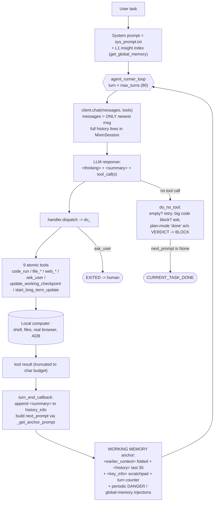
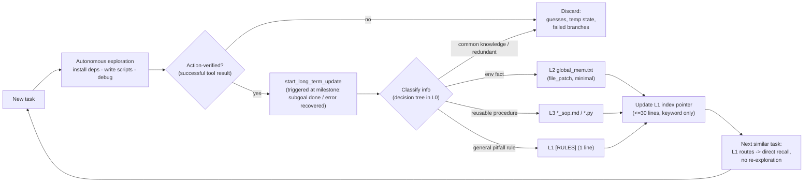

# GenericAgent (lsdefine) — Findings

> Per-source research dossier for the KB Seed AI project. Reporter, not architect:
> this records what GenericAgent *is* and *actually does*, with code citations.

---

## 1. Identity

- **Name:** GenericAgent (often abbreviated **GA**).
- **What it is:** A **minimal, self-evolving autonomous agent framework** in Python.
  It gives any LLM "system-level control over a local computer" (browser, terminal,
  filesystem, keyboard/mouse, screen vision, mobile via ADB) through **9 atomic tools**
  and a **~100-line agent loop**, and it **crystallizes each solved task into a reusable
  "Skill"** written into a layered memory store. Tagline: *"don't preload skills, evolve
  them."* It is a **general computer-use / personal-automation agent**, not a
  benchmark-only research artifact — though it has an arXiv technical report and an
  evaluation repo.
- **Authors/org:** GitHub owner **`lsdefine`** (Chinese OSS author). Strong ties to a
  **Fudan University knowledge-lab ecosystem** (`fudankw.cn`, "Sophub" skill hub) and the
  **Datawhale** community (which publishes a "Hello GenericAgent" tutorial). The
  technical report's reproduction repo is `JinyiHan99/GA-Technical-Report`. The project
  is bilingual (Chinese-first, English second); most internal prompts are in Chinese.
- **Dates:** V1.0 public release **2026-01-16**; arXiv technical report **2026-04-21**
  ("GenericAgent: A Token-Efficient Self-Evolving LLM Agent via Contextual Information
  Density Maximization", arXiv:2604.17091). Active through at least **2026-05-23** (TUI
  v3, Morphling/Goal-Hive modes added mid-May 2026). README timestamps in the inspected
  tarball are 2026-06-05.
- **Primary links:**
  - Repo: https://github.com/lsdefine/GenericAgent
  - Technical report: https://arxiv.org/abs/2604.17091
  - Reproduction code/data: https://github.com/JinyiHan99/GA-Technical-Report
  - Tutorial (Datawhale): https://datawhalechina.github.io/hello-generic-agent/
  - Skill Hub "Sophub": https://fudankw.cn/sophub
- **Code inspected:** `github.com/lsdefine/GenericAgent`, **`main` branch**, downloaded
  via codeload tarball on 2026-06-05. **Exact commit SHA could NOT be verified** — the
  sandbox blocks `git clone`/`git ls-remote` (HTTP 407 proxy), and the GitHub commits API
  was rate-limited. I inspected the `main` HEAD tarball
  (`codeload.github.com/lsdefine/GenericAgent/tar.gz/refs/heads/main`); file mtimes inside
  are 2026-06-05 17:23. References below use `GenericAgent@main:path`.

---

## 2. TL;DR

- **GA is a genuinely interesting, mature, popular** (Trendshift-listed, large community)
  **computer-use agent whose two load-bearing ideas are (a) extreme context-density
  control and (b) verification-gated self-evolution.** It is not vaporware: ~3K lines of
  real, readable Python, an arXiv report, and a separate reproduction repo.
- **Context-density trick (the real innovation):** the agent loop sends the model **only
  the newest message each turn** (`messages = [{user, tool_results}]`); the *full* raw
  conversation lives in the LLM client/session object, and a hand-built **"WORKING MEMORY"
  anchor** (last-30 one-line turn summaries + folded older context + a `key_info`
  scratchpad) is reconstructed and re-injected every turn. Claimed result: **<30K context
  window** vs 200K–1M for other agents.
- **Self-evolution = verification-gated memory crystallization, NOT weight/code
  self-modification.** When a task succeeds, the model is prompted (`start_long_term_update`)
  to distill *only action-verified* facts/SOPs into a 5-layer memory store (L0–L4). The
  governing axiom is literally **"No Execution, No Memory."** "Skills" are just `.md` SOPs
  and `.py` scripts in `memory/`, indexed by a ≤30-line L1 index.
- **Strong, explicit anti-reward-hacking discipline.** A dedicated **verifier sub-agent SOP**
  (`verify_sop.md`) and a **Plan-mode `[VERIFY]`/`VERDICT` interception** in the loop exist
  specifically to stop the model from declaring success without running tools — it names
  the failure modes ("verification avoidance", "fooled by the first 80%") and forbids
  "read code → write PASS".
- **Long-horizon running is a first-class, separate mechanism:** `reflect/goal_mode.py`
  ("keep optimizing X for N minutes, no premature delivery"), a cron-like `scheduler`,
  a multi-worker **Goal-Hive** (BBS-coordinated master/workers), and **Conductor**
  sub-agent orchestration. These map almost 1:1 onto "run an agent reliably over a long
  horizon."
- **Caveats for us:** the "evolution" loop has **no automatic numeric fitness / A-B
  promotion** — improvement is judged by the LLM following SOP prompts, not by an external
  scorer keeping only verifiable gains. Self-improvement is of the *memory/skill library*,
  explicitly **HARNESS code is not self-rewritten** (the README's "self-bootstrap" claim is
  about GA *operating git on its own repo*, not editing its own loop). Benchmarks live in a
  separate repo I did not run; some report numbers reference implausibly-future model names.

---

## 3. What it does & how it works

GA is built around **one thesis** (from the technical report's title and Sec 2.1):
*"Context information density is all a self-evolving LLM agent needs."* The performance
ceiling of an LLM agent is set not by context *length* but by how much
**decision-relevant** information sits in a finite budget. GA therefore targets a
**<30K-token active window** and spends its engineering on *compression and selective
recall* rather than context expansion. The report distills this into a claimed
**"minimal complete capability set"** of exactly three things: **(1) tool interfacing,
(2) context management, (3) memory formation** — "any additional complexity that does not
serve one of these three is actively degrading information density"
(`GenericAgent_Technical_Report.pdf`, Sec 5).

### The core agent loop (`agent_loop.py`)

The whole loop is ~100 lines (`GenericAgent@main:agent_loop.py`, fn
`agent_runner_loop`). The **single most important design decision** is on **line 104**:

```python
messages = [{"role": "user", "content": next_prompt, "tool_results": tool_results}]
# just new message, history is kept in *Session
```

Each turn the loop sends the LLM client **only the newest user message** (the next
prompt + tool results). The *full* raw conversation is held inside the LLM
client/session object (`MixinSession.backend.history`), and on top of that the handler
**rebuilds a fresh "WORKING MEMORY" anchor every turn** and injects it as the next
prompt. So the model always sees: a compact, current, high-density snapshot — never the
linearly-growing transcript. This is the mechanical realization of "density
maximization."



### The 5-layer memory & the self-evolution loop

Memory is a **stability-sorted hierarchy** (`memory/memory_management_sop.md` = the "L0
meta-SOP"):

| Layer | File(s) | Role |
|---|---|---|
| **L0** | `memory/memory_management_sop.md`, `assets/insight_fixed_structure*.txt` (the "CONSTITUTION") | Meta-rules: how to write memory; hard constraints |
| **L1** | `memory/global_mem_insight.txt` | **≤30-line** index: scenario-keyword → pointer, + RULES. Always in context (injected into system prompt) |
| **L2** | `memory/global_mem.txt` | Verified, stable **facts** (paths, configs, IDs) — loaded on demand |
| **L3** | `memory/*.md` (SOPs) and `memory/*.py` (scripts) | Reusable **skills / procedures** — loaded on demand |
| **L4** | `memory/L4_raw_sessions/` | Archived raw session traces (cron-compressed every 12h) for long-horizon recall |

Only L1 is "hot." Everything else is **on-demand** — the agent reads L2/L3 files only when
L1's index points it there. Self-evolution is the controlled promotion of *verified*
experience up this hierarchy. It is **not** automatic: raw traces sit in L4 and are
**never auto-promoted**; promotion to L2/L3 happens only through an **explicit
consolidation step** (tool `start_long_term_update`), gated by the **"No Execution, No
Memory"** axiom (`memory_management_sop.md` §0).



### Orchestration topology (sub-agents, goal mode, hive, reflect)

A striking architectural claim (report Sec 3.2): GA needs **no dedicated subsystems** for
multi-agent work, daemons, or scheduling. Because the whole agent is a **standalone CLI
program** (`agentmain.py --task ...`), these capabilities **emerge from one primitive**:

- **Sub-agent dispatch** = the parent runs a terminal command to launch another GA
  process; they communicate via a file-IO protocol in `temp/{task}/`
  (`memory/subagent.md`). Context isolation is automatic (separate process = separate
  history). Supports **map-reduce** parallelism.
- **Reflect Mode** (`agentmain.py --reflect <script>`) = an external script's `check()`
  returns a task string when a condition fires; the stable core just executes it.
  **Watchdog** and **Scheduler** (cron, `reflect/scheduler.py`) are the same mechanism
  with different trigger scripts.
- **Goal Mode** (`reflect/goal_mode.py`) = a time-budget self-driven loop (below).
- **Goal Hive** (`memory/goal_hive_sop.md`) = a master + up-to-5 workers coordinated via
  a BBS HTTP board (`assets/agent_bbs.py`), for parallel long-horizon objectives.
- **Supervisor** (`memory/supervisor_sop.md`) = a "nitpicking foreman" agent that watches
  a worker's `output.txt` and injects `_intervene` / `_keyinfo` corrections.

```mermaid
flowchart TD
    subgraph triggers["Reflect Mode (external trigger scripts)"]
      WD["Watchdog: file/error change"] -->|check string| CORE
      SCH["Scheduler: cron rules (reflect/scheduler.py)"] -->|check string| CORE
      GM["Goal Mode: time budget (goal_mode.py)"] -->|continuation prompt| CORE
    end
    CORE["GA core runtime (stable)<br/>agentmain.py + agent_loop.py"]
    PARENT["Parent GA"] -->|"agentmain.py --task (CLI)"| SUB1["Sub-agent 1 (own process+history)"]
    PARENT -->|map-reduce| SUB2["Sub-agent 2"]
    PARENT -->|"--verbose monitor"| SUPER["Supervisor watches output.txt<br/>injects _intervene/_keyinfo"]
    SUPER -.corrects.-> SUB1
    HM["Goal-Hive Master (goal_state.json)"] -->|BBS posts| BBS[(agent_bbs.py HTTP board)]
    BBS --> W1["Hive worker 1"]
    BBS --> W2["Hive worker 2..N (<=5)"]
    SUB1 -->|output.txt / [ROUND END]| PARENT
```

The long-horizon **Goal Mode** continuation prompt is the clearest "keep improving until
budget runs out" loop (`reflect/goal_mode.py`, `CONTINUATION_PROMPT`): it forbids
premature delivery, tells the agent to pick "the direction that most improves quality"
each round, and — crucially — if it has been doing similar small edits, to **"pretend you
are seeing this for the first time as a user / reviewer / attacker, find the weakest
point, and fix it."** Budget exhaustion triggers a separate wrap-up prompt.

---

## 4. Evidence from the code

Files inspected (all under `GenericAgent@main:`):

- `agent_loop.py` (133 lines) — the core loop.
- `ga.py` (595 lines) — `GenericAgentHandler` + all 9 tool implementations + working-memory anchor.
- `agentmain.py` (304 lines) — session lifecycle, slash commands, 3 run modes (CLI / `--task` / `--reflect`).
- `llmcore.py` (1063 lines) — LLM clients, `MixinSession` (multi-model failover), `trim_messages_history`, `compress_history_tags` (context compression).
- `assets/tools_schema.json` — verbatim 9-tool schema; `assets/sys_prompt_en.txt` — system prompt.
- `memory/memory_management_sop.md` (L0 meta-SOP), `memory/verify_sop.md`, `memory/plan_sop.md`, `memory/subagent.md`, `memory/goal_*_sop.md`, `memory/morphling_sop.md`, `memory/supervisor_sop.md`, `memory/autonomous_operation_sop.md`.
- `reflect/goal_mode.py`, `reflect/scheduler.py`.
- `assets/GenericAgent_Technical_Report.pdf` (arXiv:2604.17091).

### 4.1 The working-memory anchor (the density mechanism)

`GenericAgent@main:ga.py` `_get_anchor_prompt` (lines 540-550) + `_fold_earlier`
(526-538). Every turn, the next prompt is rebuilt from one-line `[Agent]`/`[USER]` turn
summaries: the last 30 verbatim, older ones folded to `"<summary text>（N turns）"`:

```python
def _get_anchor_prompt(self, skip=False):
    if skip: return "\n"
    h = self.history_info; W = 30
    earlier = f'<earlier_context>\n{self._fold_earlier(h[:-W])}\n</earlier_context>\n' if len(h) > W else ""
    h_str = "\n".join(h[-W:])
    prompt = f"\n### [WORKING MEMORY]\n{earlier}<history>\n{h_str}\n</history>"
    prompt += f"\nCurrent turn: {self.current_turn}\n"
    if self.working.get('key_info'): prompt += f"\n<key_info>{self.working.get('key_info')}</key_info>"
    ...
```

The per-turn `<summary>` is extracted from the model's own reply in `turn_end_callback`
(lines 552-564): the model is required to emit a `<summary>...</summary>`; if missing, the
loop appends `"[SYSTEM] 必须在回复文本中包含<summary>！"` and synthesizes one from the
tool call. This is how the linear transcript is compressed into a dense rolling digest.

The redundant older anchors are then stripped from the real history in
`GenericAgent@main:llmcore.py` `compress_history_tags` (lines 44-48):

```python
_hist_pat = re.compile(r'<(history|key_info|earlier_context)>[\s\S]*?</\1>')
def _trunc(text):
    text = _hist_pat.sub(lambda m: f'<{m.group(1)}>[...]</{m.group(1)}>', text)
    ...
```

i.e. because a *fresh* full anchor is injected each turn, all *previous* `<history>` /
`<key_info>` blocks in stored history collapse to `<history>[...]</history>`. The report
(Sec 2.3.4) calls this "placeholder replacement" and notes it yields prompt-cache hits on
~80% of turns.

### 4.2 Context budget / eviction (`trim_messages_history`)

`GenericAgent@main:llmcore.py` lines 95-108. Budget is in **characters** (no tokenizer):
`cap = context_win * 3` (≈3 chars/token); when over budget it compresses tags, then pops
the oldest user-anchored messages, sanitizing orphaned tool-results:

```python
def trim_messages_history(history, sess):
    cap = sess.context_win * 3
    target = int(cap * getattr(sess, 'trim_keep_rate', 0.6))
    compress_history_tags(history, interval=getattr(sess, 'cut_msg_interval', 5))
    if cost() <= cap: return
    compress_history_tags(history, keep_recent=4, force=True)
    if cost() <= target: return
    while len(history) > 9 and cost() > target:
        history.pop(0)
        while history and history[0].get('role') != 'user': history.pop(0)
        if history and history[0].get('role') == 'user': history[0] = _sanitize_leading_user_msg(history[0])
```

### 4.3 The self-evolution distillation prompt (verbatim)

`GenericAgent@main:ga.py` `do_start_long_term_update` (lines 509-524). This is the prompt
that crystallizes a skill — note the strict verification gate (translated inline):

```
### [总结提炼经验] 既然你觉得当前任务有重要信息需要记忆，请提取最近一次任务中
【事实验证成功且长期有效】的环境事实、用户偏好、重要步骤，更新记忆。
本工具是标记开启结算过程，若已在更新记忆过程或没有值得记忆的点，忽略本次调用。
**如果没有经验证的，未来能用上的信息，忽略本次调用！**
**只能提取行动验证成功的信息**：
- **环境事实**（路径/凭证/配置）→ `file_patch` 更新 L2，同步 L1
- **复杂任务经验**（关键坑点/前置条件/重要步骤）→ L3 精简 SOP（只记你被坑得多次重试的核心要点）
**禁止**：临时变量、具体推理过程、未验证信息、通用常识、你可以轻松复现的细节、只是做了但没有验证的信息
```
(EN gist: extract only *fact-verified, long-lived* env facts / user prefs / key steps;
if nothing was verified and future-useful, ignore the call; env facts → L2 via `file_patch`,
hard-won task lessons → minimal L3 SOP; forbidden: temp vars, reasoning traces, unverified
info, common knowledge, trivially reproducible detail.)

The governing **"No Execution, No Memory"** axiom (`memory/memory_management_sop.md` §0):

```
1. 行动验证原则 (Action-Verified Only)
   定义：任何写入 L1/L2/L3 的信息，必须源自成功的工具调用结果...
   禁止：严禁将模型的"固有知识"、"推理猜测"、"未执行的计划"... 作为事实写入。
   口号：No Execution, No Memory. (无行动，不记忆)
```

### 4.4 The verifier / anti-reward-hacking SOP (verbatim, translated)

`GenericAgent@main:memory/verify_sop.md` — used by an **independent verification
sub-agent**. Opening section names the two failure modes directly:

```
## 你的两个失败模式
1. 验证回避：找理由不运行——读代码、描述"会怎样"、写PASS。读代码不是验证。
2. 被前80%迷惑：看到通过的测试就想PASS，没注意一半功能是空壳。你的价值在最后20%。
调用方可能抽查重新执行你的命令——输出对不上，报告作废。
## 铁律（违反 → VERDICT 无效）
1. 必须运行。能跑的必须跑，能看的必须截图看。
2. 必须有工具证据。无工具输出的 PASS = SKIP。
3. 独立验证。实现者也是LLM——它的测试可能全是mock和happy path。测试套件是上下文，不是证据。
```
(EN gist: failure modes = "verification avoidance" and "fooled by the first 80%"; iron
rules = must actually run; no tool output → PASS counts as SKIP; verify independently
because the implementer is also an LLM whose tests may be all mocks/happy-path.)

Output is a literal verdict: `VERDICT: PASS` / `VERDICT: FAIL` / `VERDICT: PARTIAL`. There
is an adversarial-probe checklist (boundary values, idempotency, missing deps, orphan IDs)
and a per-product-type verification table (web/CLI/data/API/config/bugfix/batch).

This verifier is wired into **Plan mode**. In `GenericAgent@main:ga.py` `do_no_tool`
(lines 473-476) the loop *intercepts* a "task complete" claim that lacks verification:

```python
if self._in_plan_mode() and any(kw in content for kw in ['任务完成', '全部完成', '已完成所有', '🏁']):
    if 'VERDICT' not in content and '[VERIFY]' not in content and '验证subagent' not in content:
        return StepOutcome({}, next_prompt="⛔ [验证拦截] 检测到你在plan模式下声称完成，但未执行[VERIFY]验证步骤。...")
```

### 4.5 Loop-safety / anti-infinite-retry injections

`GenericAgent@main:ga.py` `turn_end_callback` (lines 567-575) injects escalating warnings
by turn count — a hard guard against the agent grinding forever:

```python
if turn % 75 == 0 and (not _plan):
    next_prompt += "\n\n[DANGER] 已连续执行第 {turn} 轮。必须总结情况进行ask_user，不允许继续重试。"
elif turn % 7 == 0:
    next_prompt += "\n\n[DANGER] ...禁止无效重试。若无有效进展，必须切换策略：1. 探测物理边界 2. 请求用户协助。..."
elif turn % 10 == 0: next_prompt += get_global_memory()
```

This mirrors the report's "failure escalation" ladder (Sec 2.3.3): 1st fail → read error
& small fix; 2nd → abandon approach, probe environment; 3rd → ask human.

### 4.6 The 9-tool schema (verbatim shape)

`GenericAgent@main:assets/tools_schema.json` defines exactly nine tools: `code_run`,
`file_read`, `file_patch`, `file_write`, `web_scan`, `web_execute_js`,
`update_working_checkpoint`, `ask_user`, `start_long_term_update`. Descriptions are
deliberately terse (token thrift). Notable design choices:
- `code_run` executes the **reply's code block** if no `script` arg is passed ("prefer for
  single call to avoid escaping"); restricted to **one invocation per turn** (report
  Sec 2.3.1) so each result is observed before the next.
- `file_patch` requires a **unique** `old_content` match or it errors with guidance to
  `file_read` and re-try (`ga.py` lines 203-204) — prevents silent wrong edits.
- `update_working_checkpoint` is the explicit short-term scratchpad ("<200 tokens",
  auto-injected each turn); `start_long_term_update` is the long-term distiller.

---

## 5. What's genuinely smart

1. **The "send only the new message, rebuild a dense anchor every turn" loop.** This is the
   load-bearing idea and it is genuinely clever. Instead of letting the transcript grow and
   relying on the model to attend across 200K tokens, GA keeps the *active* prompt tiny and
   re-derives a high-density working-memory snapshot (rolling one-line turn summaries +
   `key_info` scratchpad + folded older context) on every turn. It directly attacks
   "lost-in-the-middle," attention dilution, and effective-window shrinkage — and as a side
   effect gets ~80% prompt-cache hits. This is a concrete, reproducible context-engineering
   pattern, not a vibe.

2. **Verification-gated memory ("No Execution, No Memory").** The single rule that *only
   information produced by a successful tool call may be written to long-term memory*, plus
   "raw traces live in L4 and are never auto-promoted; promotion needs an explicit
   consolidation step," is a clean answer to the silent-memory-degradation problem that
   plagues RAG-memory agents. It is the closest thing GA has to a promotion gate, and it is
   exactly the right *shape* for a "keep only if verifiably true" system.

3. **A real, adversarial, independent verifier with a literal VERDICT.** `verify_sop.md`
   is one of the better verifier prompts I've seen in an OSS agent: it explicitly models the
   LLM's own laziness ("verification avoidance", "fooled by the first 80%"), forbids
   "read code → PASS", demands tool-output evidence for every claim, runs the verifier in a
   *separate process with clean context* (so it can't be contaminated by the implementer's
   rationalizations), and bakes in adversarial probes (boundary/idempotency/missing-dep).
   The loop *enforces* it via the plan-mode VERDICT interception. This is directly the
   "propose → independently test → only accept if it passes" pattern.

4. **Capabilities-as-CLI-primitive.** Making the whole agent a CLI program means
   sub-agents, map-reduce parallelism, watchdogs, and cron all fall out of "run a command"
   + "an external trigger script" — *no* bespoke orchestration subsystem, and context
   isolation between agents is free (separate process = separate history). This is an
   elegant minimalism that keeps the core stable while behavior composes around it.

5. **On-demand hierarchical memory with a hard-capped hot index.** Forcing L1 to ≤30 lines
   of keyword→pointer routing (with L2/L3 read only when pointed to) is a disciplined answer
   to "context budget is the scarcest resource." The "minimum sufficient pointer" rule
   ("upper layers keep only the shortest identifier that locates the lower layer; one extra
   word is redundancy") is a quotable design heuristic.

6. **Goal Mode's anti-premature-stop + "change your hat" instruction.** The continuation
   prompt's rule — when stuck doing small edits, *re-examine as a first-time user / reviewer
   / attacker, find the weakest point, fix it* — is a simple, effective way to keep an
   open-ended improvement loop from converging on trivial polish. Pairs naturally with a
   time/turn budget.

7. **Morphling: a project-level "match-or-beat on the same test set" loop.** `morphling_sop.md`
   says: extract a target's goal + tests, decide call/rewrite/discard per component, and
   prove "better" on *at least one measurable axis* (pass rate / perf / cost / stability /
   maintainability) on the *same test set* — "'better' cannot be subjective." This is an
   explicitly evolutionary, verification-anchored capability-absorption pattern.

---

## 6. Claims vs. reality / limitations / critiques

**(A) What the authors claim:** SOTA-or-competitive task completion at a fraction of the
tokens; <30K context; "self-evolution" that *improves* over repeated runs (not just
persists); up to **89.6% token reduction across repeated runs**; on Lifelong AgentBench
100% completion using **27.7% of Claude Code's input tokens** and **15.5% of OpenClaw's**;
a thesis that "lower token consumption corresponds to better task performance."

**(B) What the code actually demonstrates (that I verified):**
- The context-density loop, the 5-layer memory, the 9 tools, the verifier SOP, the
  plan/goal/hive/reflect orchestration, and the "No Execution, No Memory" gate **all exist
  as described** and are coherent, readable, and wired together. The *engineering* claims
  (small core, on-demand memory, per-turn anchor, char-budget eviction) are true to the
  code.
- I did **not** run the benchmarks (they live in the separate repo `JinyiHan99/GA-Technical-Report`,
  which I did not clone). So all *quantitative* performance/efficiency numbers are
  **unverified by me** and come only from the authors' own report.

**(C) Honest limitations & caveats:**
- **"Self-evolution" ≠ self-modifying harness.** GA evolves a **knowledge/skill layer**
  (SOPs + scripts in `memory/`), explicitly **separating a fixed tool layer from an evolving
  knowledge layer** (report Sec 2.3.3, "What evolves: strategy, not tools"). The
  CONSTITUTION literally says *"Ask before modifying own source code"*
  (`assets/insight_fixed_structure_en.txt` #1) and the autonomous-mode permission boundary
  says *"absolutely forbidden: ... modify core codebase"* (`autonomous_operation_sop.md`).
  For a project whose goal is *self-improving HARNESS-ONLY*, GA is the **inverse**: it is a
  strong reference for evolving the *content/policy* around a stable harness, not for a
  harness that rewrites itself.
- **The README "self-bootstrap" claim is weaker than it sounds.** "Every commit was made
  autonomously by GA" means GA *operated git on its own repo as a task* (impressive
  computer-use), **not** that GA designed or improved its own loop. It is a marketing flex,
  not evidence of recursive self-improvement.
- **No automatic numeric fitness / A-B promotion of skills.** Skill "improvement" is the
  LLM following SOP prompts and the verifier returning PASS — there is **no external scorer
  that keeps version N+1 only if a metric beat version N**. The *one* numeric feedback loop
  (report Sec 3.3) is for **autonomous-exploration scoring weights** (predicted score vs
  actual 30-day usage → ±10% weight nudge), and the authors call it **"Unverified
  Adaptation ... a preliminary design ... not yet enough long-term data to prove
  effectiveness."**
- **Manual curation persists.** The report's own Limitations: the self-improvement log
  "currently relies on manual user curation"; **skill-tree maintenance (merging redundant
  categories, deprecating tools, restructuring) is "entirely manual."** So the "skill tree
  grows itself" story has a human in the loop for hygiene.
- **30-round / budget caps force multi-session work**; cross-session continuity is "only
  through written reports and task-list annotations" (report Limitations).
- **Char-based budget heuristic is acknowledged-leaky:** `α≈3 chars/token` under-counts CJK
  (1–2 tokens/char), "risking delayed eviction and potential context overflow" (report
  Sec 2.3.4).
- **Security: no sandbox by default.** Independent review (andrew.ooo) and the design itself:
  `code_run` executes arbitrary code with the OS user's privileges — "one bad prompt away
  from `rm -rf ~`"; community advice is to run in a VM/container. GA's only guards are L0
  rules + `ask_user` + a temp-dir confinement convention (not enforced isolation).
- **Reward-hacking surface exists despite the verifier.** The verifier is a *prompt-level*
  defense; a sufficiently capable model could still write a happy-path test and a matching
  implementation. GA mitigates (independent process, adversarial probes, "implementer is an
  LLM, its tests are not evidence") but does not *structurally* prevent test-gaming.
- **Independent scrutiny is thin.** Most external coverage is positive explainer blogs
  (andrew.ooo, ezpzai, mlwires, medium); I found **no rigorous third-party reproduction or
  skeptical benchmark audit**. Treat the headline numbers accordingly.
- **Some report artifacts reference implausibly-future model names** (e.g. "Claude Opus
  4.6", "GPT-5.4", "MiniMax M2.7") and 2026 dates — consistent with the dossier's
  near-future framing, but a reason to treat exact benchmark figures as illustrative rather
  than settled.

---

## 7. Relevance to a self-improving, evolutionary software-building agent

Judged by the one test ("would this help build a self-improving, evolutionary,
software-building agent?"), GA is **medium-high relevance** — not as an evolutionary
*search* engine (it has none), but as a deep reference for the **harness, memory,
verification, long-horizon, and orchestration** machinery that such a system needs around
its search loop.

- **Long-horizon running (high).** `goal_mode.py` is a directly reusable "run for N
  minutes/turns, never deliver prematurely, pick the highest-value improvement each round,
  wrap up at budget" controller. The turn-count DANGER escalations and the failure-ladder
  (small fix → probe → ask human) are concrete anti-stall mechanisms. Reflect/Scheduler
  give cron + watchdog "keep the agent alive and triggered" patterns.
- **Verification / "keep only if verifiably better" (high).** `verify_sop.md` + the
  plan-mode VERDICT interception are a ready-made *independent adversarial verifier* with a
  literal PASS/FAIL/PARTIAL gate, explicitly engineered against LLM test-gaming. This is the
  exact role an evolutionary loop's "is candidate N+1 actually better?" judge must play.
  Morphling adds the "compare against the same test set on a measurable axis" discipline.
- **Memory that doesn't rot (high).** The L0–L4 hierarchy + "No Execution, No Memory" +
  "raw traces never auto-promote; promotion is an explicit gated step" + ≤30-line hot index
  is a strong template for an agent that must *accumulate verified capability over time*
  without polluting its own context — i.e., the "keep what's genuinely learned" half of
  self-improvement.
- **Context engineering for very long runs (high).** The per-turn working-memory anchor,
  rolling one-line summaries, tag placeholder-collapse, tool-output truncation, and
  char-budget eviction are a complete, copyable recipe for keeping an agent's per-step
  decision context dense across thousands of steps — essential for long autonomous builds.
- **Orchestration / decomposition (medium-high).** "Agent = CLI primitive" → sub-agents +
  map-reduce + supervisor + hive, with free context isolation, is a clean way to run many
  parallel candidate-builders/verifiers and a master that coordinates them — without a
  heavyweight framework. The `_intervene`/`_keyinfo` file-injection channel is a neat
  "steer a running sub-agent" control.
- **Decision-making / control features (medium).** `update_working_checkpoint` (explicit
  goal/constraint scratchpad re-injected every turn) is a lightweight "/goal"-style
  persistent-intent mechanism; the plan-mode `[ ]`→`[✓]` checklist with mandatory
  termination scan is a goal-tracking pattern.
- **What it does NOT give us (be plain):** no population/variation/selection, no fitness
  function, no automatic candidate promotion, no self-modification of the harness/loop, no
  code-diff-as-genome. If "evolutionary, self-improving" means AlphaEvolve/DGM-style search
  over programs, GA contributes the *substrate* (harness, memory, verifier, long-horizon
  control), not the *evolutionary algorithm*.

---

## 8. Reusable assets (collected as evidence; not assembled into a design)

1. **The per-turn working-memory anchor pattern** — `ga.py:_get_anchor_prompt` +
   `_fold_earlier` + `turn_end_callback` (require `<summary>` per turn) +
   `llmcore.py:compress_history_tags` (collapse stale `<history>`/`<key_info>` to
   placeholders). A complete context-density recipe. `GenericAgent@main:ga.py:526-582`,
   `llmcore.py:44-69`.

2. **Char-budget context eviction** — `llmcore.py:trim_messages_history` (lines 95-108):
   `cap = context_win*3`, compress → evict oldest user-anchored msgs → sanitize orphaned
   tool-results. Tokenizer-free, simple, portable.

3. **The self-evolution distiller prompt (verbatim)** — `ga.py:do_start_long_term_update`
   (lines 511-519). The "extract only fact-verified, future-useful info; else ignore"
   crystallization prompt.

4. **The verifier SOP (verbatim)** — `memory/verify_sop.md`: failure-mode framing, iron
   rules, per-product verification table, adversarial-probe list, literal
   `VERDICT: PASS/FAIL/PARTIAL` format. Plus the plan-mode interception
   (`ga.py:do_no_tool` lines 473-476) that *enforces* it.

5. **The memory-management meta-SOP (verbatim)** — `memory/memory_management_sop.md`: the
   "No Execution, No Memory" axiom, the L0–L4 layer charter, the "minimum sufficient
   pointer" rule, and the **information-classification decision tree** (where does this fact
   go — L2 / L1-RULES / L3 / discard).

6. **The plan→execute→verify loop** — `memory/plan_sop.md`: explore (delegated to a
   read-only sub-agent) → write `plan.md` with `[ ]`/`[D]`/`[P]`/`[?]` step tags → review
   gate → execute with mini-verify per step → **mandatory independent `[VERIFY]`
   sub-agent** → fix loop on FAIL (≤2 retries → ask human). Includes a copyable `plan.md`
   `EXECUTION PROTOCOL` header.

7. **Goal Mode controller (verbatim prompts + state schema)** — `reflect/goal_mode.py`
   (`CONTINUATION_PROMPT`, `BUDGET_LIMIT_PROMPT`, `goal_state.json` schema with
   `budget_seconds`/`max_turns`/`status`) and `memory/goal_mode_sop.md`. The
   "change-your-hat when stuck" instruction.

8. **Sub-agent file-IO protocol** — `memory/subagent.md`: `agentmain.py --task {name}
   --input ...`; comms via `output.txt` + `[ROUND END]` + `reply.txt`; live-steer via
   `_stop` / `_keyinfo` / `_intervene` files; `context.json` with absolute paths;
   map-reduce + test-mode + monitor-mode patterns.

9. **The 9-tool atomic schema (verbatim)** — `assets/tools_schema.json`. A minimal,
   token-thrifty tool surface for a general computer-use agent (note `code_run` one-per-turn
   + reply-code-block execution; `file_patch` unique-match requirement).

10. **The CONSTITUTION + seed L1 index** — `assets/insight_fixed_structure_en.txt` and
    `assets/global_mem_insight_template_en.txt`: a compact behavioral charter ("ask before
    modifying own source", "check memory before decisions", "request intervention after 3
    failures", "never assert without evidence") and the seed keyword→pointer index format.

11. **Supervisor + autonomous-idle loops** — `memory/supervisor_sop.md` (a read-only
    "foreman" agent that monitors and injects one-line corrections) and
    `memory/autonomous_operation_sop.md` (find-your-own-work value formula +
    `_done_hooks` end-of-task self-check callback).

12. **Loop-safety escalation** — `ga.py:turn_end_callback` lines 567-575 (turn%7/%10/%75
    DANGER injections) — a minimal anti-infinite-loop guard.

---

## 9. Signal assessment

- **Overall value: HIGH** for *harness / memory / verification / long-horizon / orchestration*
  patterns; **LOW** for *evolutionary search* mechanics (it has none). Net for this project:
  **HIGH** as a reference codebase — it is small, readable, coherent, battle-tested in the
  wild, and several of its mechanisms (per-turn density anchor, No-Execution-No-Memory,
  independent VERDICT verifier, Goal Mode, agent-as-CLI orchestration) are directly on-point
  for building a reliable long-horizon software-building agent.
- **Confidence: HIGH** on the mechanism/architecture claims — I read the actual loop, tools,
  prompts, memory SOPs, and context-compression code, and they match the paper. **MEDIUM-LOW**
  on the headline efficiency/performance numbers — those are author-reported and I did not run
  the benchmarks.
- **What I could NOT verify:**
  - **Exact commit SHA** — sandbox proxy blocked `git`/`ls-remote`; GitHub API rate-limited.
    Inspected the `main` HEAD tarball (mtimes 2026-06-05 17:23) but cannot pin the hash.
  - **All quantitative benchmark results** (89.6% token reduction, 27.7%/15.5% token ratios,
    100% completion, convergence bands) — in the separate repo `JinyiHan99/GA-Technical-Report`,
    not run here.
  - **Real-world self-evolution efficacy over weeks** — the longitudinal claims rest on the
    authors' 9-round LangChain study + 8-task web benchmark, which I read about but did not
    reproduce; the authors themselves flag the adaptation loop as "unverified."
  - **Frontend/IM/desktop subsystems** (`frontends/`, `TMWebDriver.py`, vision modules) — I
    skimmed file inventory but did not deeply read; they are peripheral to the relevance test.

---

## 10. References

**Primary (code) — `repo@SHA:path` (SHA unverified; `main` HEAD tarball, mtimes 2026-06-05):**
- `GenericAgent@main:agent_loop.py` — core ~100-line agent loop.
- `GenericAgent@main:ga.py` — handler + 9 tools + working-memory anchor + verifier interception + loop-safety.
- `GenericAgent@main:agentmain.py` — session lifecycle, CLI / `--task` / `--reflect` run modes.
- `GenericAgent@main:llmcore.py` — `MixinSession`, `trim_messages_history`, `compress_history_tags`.
- `GenericAgent@main:assets/tools_schema.json` — verbatim 9-tool schema.
- `GenericAgent@main:assets/sys_prompt_en.txt` — system prompt.
- `GenericAgent@main:assets/insight_fixed_structure_en.txt` — CONSTITUTION + L1 charter.
- `GenericAgent@main:assets/global_mem_insight_template_en.txt` — seed L1 index.
- `GenericAgent@main:memory/memory_management_sop.md` — L0 meta-SOP ("No Execution, No Memory").
- `GenericAgent@main:memory/verify_sop.md` — independent adversarial verifier SOP.
- `GenericAgent@main:memory/plan_sop.md` — plan→execute→verify loop.
- `GenericAgent@main:memory/subagent.md` — sub-agent file-IO protocol.
- `GenericAgent@main:memory/goal_mode_sop.md`, `memory/goal_hive_sop.md`, `memory/goal_hive_master_duty.md` — long-horizon modes.
- `GenericAgent@main:memory/morphling_sop.md` — project-level "match-or-beat on same tests" absorption.
- `GenericAgent@main:memory/supervisor_sop.md`, `memory/autonomous_operation_sop.md` — supervisor + autonomous-idle loops.
- `GenericAgent@main:reflect/goal_mode.py`, `reflect/scheduler.py` — goal controller + cron.

**Primary (paper / author):**
- Technical Report (in-repo PDF) `GenericAgent@main:assets/GenericAgent_Technical_Report.pdf`
  = arXiv:2604.17091, "GenericAgent: A Token-Efficient Self-Evolving LLM Agent via
  Contextual Information Density Maximization (V1.0)", Advantage AI Agent Lab (A3 Lab;
  Shenzhen Aquaintelling Technology + Fudan University). https://arxiv.org/abs/2604.17091
- Repo + README: https://github.com/lsdefine/GenericAgent (primary)
- Reproduction code/data: https://github.com/JinyiHan99/GA-Technical-Report (primary, not inspected)
- Tutorial (Datawhale): https://datawhalechina.github.io/hello-generic-agent/

**Secondary (independent coverage — mostly positive explainers; no rigorous audit found):**
- andrew.ooo review (notes no-sandbox risk; repeat-task-only savings): https://andrew.ooo/posts/genericagent-self-evolving-3k-line-agent-review/
- EZPZ AI: https://ezpzai.com/en/2026-05-16-lsdefine-genericagent-en/
- MLWires: https://www.mlwires.com/genericagent-a-local-self-evolving-agent/
- Medium (AgentConn / "skill trees"): https://medium.com/@computeleap/genericagent-and-evomap-how-ai-grows-its-own-skill-trees-agentconn-blog-41638c70cb87
- Jiqizhixin (机器之心) feature (cited as the Fudan attribution source): https://mp.weixin.qq.com/s/uVWpTTF5I1yzAENV_qm7yg

**Note on verification gaps:** commit SHA unverified (proxy/rate-limit); all quantitative
benchmark numbers are author-reported and not reproduced here.
