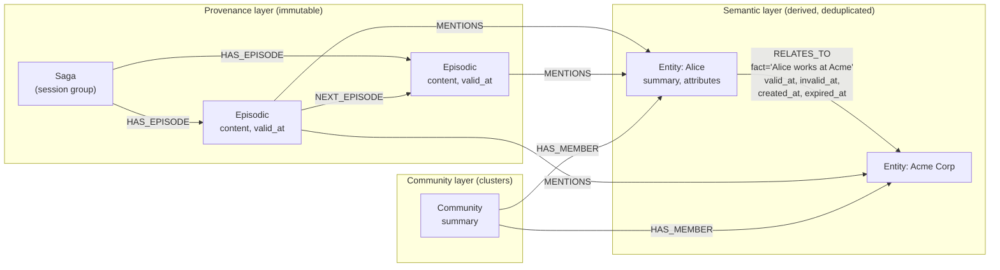
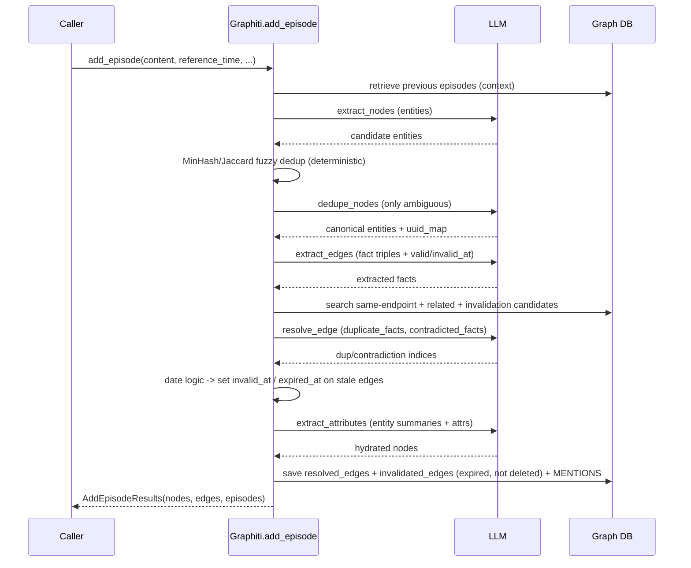
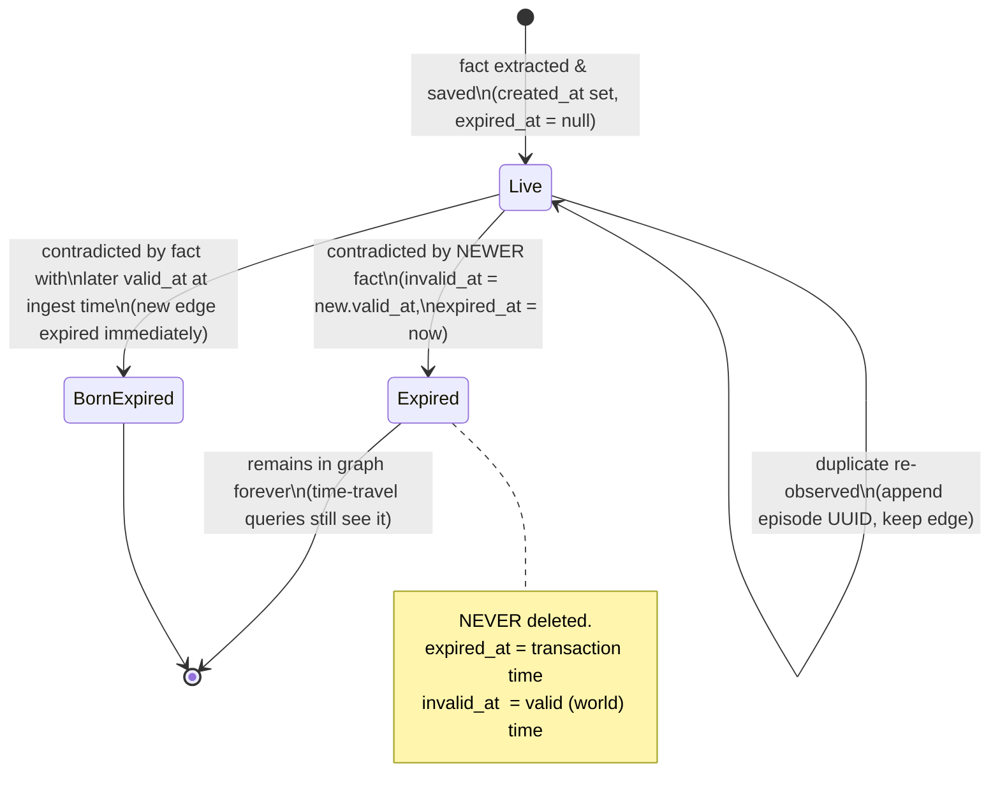
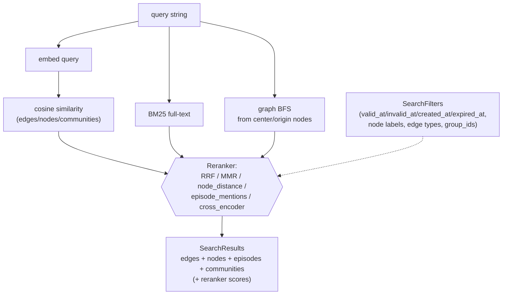

# Graphiti (getzep) — Temporal Knowledge-Graph Memory for AI Agents

> Research findings document. One source, deep + honest. Reporter, not architect.
> Relevance test applied throughout: *would this help build a self-improving, evolutionary, software-building agent — especially its MEMORY?*

---

## 1. Identity

- **Name:** Graphiti — "Build Real-Time Knowledge Graphs for AI Agents."
- **What it is:** An open-source Python framework (library + optional MCP server + REST service) that builds and continuously updates a **temporally-aware knowledge graph** from a stream of discrete "episodes" (chat messages, JSON, or text). It is the open-core engine underneath **Zep**, a commercial "agent memory" product. Its defining feature is a **bi-temporal** model: every relationship (edge) carries both *when the system learned it* and *when the fact was actually true in the world*, and facts are **invalidated (expired), never silently overwritten**, when contradicted.
- **Authors/org:** Zep Software, Inc. (getzep). Apache-2.0 licensed (`LICENSE`, copyright "2024, Zep Software, Inc.").
- **Companion paper:** *"Zep: A Temporal Knowledge Graph Architecture for Agent Memory"* (Rasmussen, Paliychuk, Beauvais, Ryan, Chalef), arXiv:2501.13956, Jan 2025. Graphiti is the engine described there ("we call the graph engine that powers Zep, Graphiti").
- **Primary links:**
  - Repo: https://github.com/getzep/graphiti
  - Docs: https://help.getzep.com/graphiti / https://www.getzep.com/
  - Paper: https://arxiv.org/abs/2501.13956
- **Code repo + commit inspected:** `getzep/graphiti` @ **`34f56e65e0fe2096132c8d16f3a1a4ac9300a5f6`** (branch `main`, committer date 2026-05-21, "Bump graphiti-core version to 0.29.1 (#1499)"). Downloaded as the `main` tarball (git clone blocked by sandbox proxy; tarball fallback used). All `repo@SHA:path` references below are against this SHA.

---

## 2. TL;DR

- Graphiti is a **memory layer**, not an agent. It ingests episodes incrementally and maintains a labelled property graph of `Episodic`, `Entity`, and `Community` nodes connected by `MENTIONS`, `RELATES_TO`, and `HAS_MEMBER` edges. Entities and the *facts* connecting them are extracted by LLM calls.
- The genuinely distinctive idea is **bi-temporality with explicit edge invalidation**. Each `RELATES_TO` (entity) edge stores four timestamps: `created_at`, `expired_at` (transaction time — when the system stopped believing it), `valid_at`, `invalid_at` (valid time — when the fact was true in the world). When a new fact contradicts an old one, the old edge is **expired, not deleted** — its history is preserved and queries can be made "as of" any time.
- Contradiction handling is done by an **LLM "resolve_edge" call** that, for each newly extracted fact, is shown candidate existing facts and asked to return `duplicate_facts` and `contradicted_facts` index lists; temporal ordering logic then sets `invalid_at`/`expired_at`. This is exactly the "explicit invalidation of stale knowledge" problem the project cares about — and it is solved with a mix of LLM judgment + deterministic date arithmetic.
- Retrieval is **hybrid**: semantic (cosine over embeddings) + BM25 full-text + direct graph traversal (BFS), fused with **Reciprocal Rank Fusion (RRF)** or **MMR**, optionally reranked by a cross-encoder / node-distance / episode-mentions. No LLM is required at query time (low latency is an explicit design goal).
- For our purposes: the **schema (bi-temporal edges)**, the **invalidation algorithm**, the **dedup/resolution prompts**, and the **hybrid-search-without-LLM** retrieval are directly relevant building blocks for a long-horizon agent that must accumulate durable, queryable, *invalidatable* knowledge. The weak spots: heavy LLM cost per episode, correctness of contradiction detection bounded by the LLM, and a schema oriented toward *factual/relational* memory (people, prefs, events) rather than *procedural/program* memory.

---

## 3. What it does & how it works

### 3.1 The data model (graph schema)

Graphiti maintains a **labelled property graph** (Neo4j / FalkorDB / Kuzu / Neptune backends). There are three primary node types and a small set of edge types. (Verified in `nodes.py`, `edges.py`, and the Cypher builders under `models/nodes/` and `models/edges/`.)

**Node types** (`repo@SHA:graphiti_core/nodes.py`):

| Node | Key fields | Role |
|------|-----------|------|
| `EpisodicNode` (`:Episodic`) | `content`, `source ∈ {message,json,text,fact_triple}`, `source_description`, `valid_at` (= when the source document was created), `entity_edges` (list of edge UUIDs it produced), `episode_metadata` | The **raw, immutable provenance unit**. Everything derived traces back to an episode. Note: only a single `valid_at` timestamp — episodes are *not* bi-temporal. |
| `EntityNode` (`:Entity` + custom labels) | `name`, `name_embedding`, `summary` (an LLM-maintained rolling summary of surrounding edges), `attributes` (schema-dependent), `labels` | A deduplicated real-world entity (person, product, concept…). Bi-temporal fields are **absent** — entities carry only `created_at`. |
| `CommunityNode` (`:Community`) | `name`, `name_embedding`, `summary` | A cluster of related entities (label-propagation communities), with a synthesized summary. Built on demand via `build_communities`. |
| `SagaNode` (`:Saga`) | `summary`, `first/last_episode_uuid`, `last_summarized_at`, `last_summarized_episode_valid_at` | A newer construct: an ordered *group* of episodes (e.g. a conversation/session) with incremental summarization. Connected to episodes by `HAS_EPISODE` and episodes chained by `NEXT_EPISODE`. |

**Edge types** (`repo@SHA:graphiti_core/edges.py`):

| Edge | Connects | Carries |
|------|----------|---------|
| `MENTIONS` (`EpisodicEdge`) | `Episodic → Entity` | provenance link; `created_at` only |
| **`RELATES_TO`** (`EntityEdge`) | `Entity → Entity` | **the FACT**: `name` (relation type, SCREAMING_SNAKE_CASE), `fact` (NL sentence), `fact_embedding`, `episodes` (source UUIDs), `attributes`, and the **four bi-temporal timestamps** |
| `HAS_MEMBER` (`CommunityEdge`) | `Community → Entity` | membership; `created_at` |
| `HAS_EPISODE` / `NEXT_EPISODE` | `Saga → Episodic` / `Episodic → Episodic` | saga structure |

The **load-bearing object is the `EntityEdge`** — the *fact* — and its bi-temporal stamp (`repo@SHA:graphiti_core/edges.py:263-285`):

```python
class EntityEdge(Edge):
    name: str          # relation name, e.g. WORKS_AT
    fact: str          # NL fact text (this is what gets embedded + BM25-indexed)
    fact_embedding: list[float] | None
    episodes: list[str]                 # provenance: which episodes produced/support it
    expired_at: datetime | None         # TRANSACTION time: when system stopped believing it
    valid_at: datetime | None           # VALID time: when the fact became true in the world
    invalid_at: datetime | None         # VALID time: when the fact stopped being true
    reference_time: datetime | None     # timestamp of the episode that produced this edge
    attributes: dict[str, Any]          # schema-dependent structured fields
    created_at: datetime                # TRANSACTION time: when the system first recorded it
```

This is a **bi-temporal model** in the classic database sense, but applied **only to facts (edges)**:

- **Transaction time** (system/ingestion timeline): `created_at` (recorded) and `expired_at` (no longer believed/superseded).
- **Valid time** (real-world / event timeline): `valid_at` (became true) and `invalid_at` (ceased to be true).

A fact is "currently live" iff `expired_at IS NULL`. A fact is "true as of time T" iff `valid_at <= T` and (`invalid_at IS NULL` or `invalid_at > T`). Both axes are independently queryable via `SearchFilters` (`repo@SHA:graphiti_core/search/search_filters.py:62-65` exposes `valid_at`, `invalid_at`, `created_at`, `expired_at` as filterable date fields with full comparison operators).



### 3.2 The ingestion loop (`add_episode`)

The core write path is `Graphiti.add_episode(...)` (`repo@SHA:graphiti_core/graphiti.py:980-1229`). It is **incremental** — each episode is processed against the existing graph; there is no batch recompute. The pipeline:

1. **Retrieve context** — fetch the last *N* previous episodes (`RELEVANT_SCHEMA_LIMIT`) for the group as conversational context.
2. **Extract entities** — `extract_nodes` LLM call pulls candidate entities from the episode (typed if `entity_types` Pydantic models supplied).
3. **Resolve / dedupe entities** — `resolve_extracted_nodes`: a deterministic MinHash/Jaccard fuzzy pre-pass (`dedup_helpers.py`) resolves obvious matches; ambiguous cases go to an LLM dedup call (`dedupe_nodes.py`). Produces a `uuid_map` collapsing duplicates onto canonical UUIDs.
4. **Extract edges (facts)** — `extract_edges` LLM call (the big `extract_edges.edge` prompt) emits fact triples `(source_entity_name, relation_type, target_entity_name, fact, valid_at?, invalid_at?, episode_indices)`.
5. **Resolve edges + detect contradictions + invalidate** — `resolve_extracted_edges` → `resolve_extracted_edge` per edge. For each new fact it gathers (a) edges with the *same endpoints* (`get_between_nodes`) and (b) semantically *related* edges (hybrid search). An LLM `resolve_edge` call returns `duplicate_facts` and `contradicted_facts`. Deterministic date logic then sets `invalid_at`/`expired_at` on the superseded edges. (Details in §3.3.)
6. **Hydrate node attributes / summaries** — `extract_attributes_from_nodes` refreshes each entity's `summary` and structured `attributes` from the new facts.
7. **Persist** — `entity_edges = resolved_edges + invalidated_edges` are saved together (`graphiti.py:1156`): invalidated edges are **re-written with their new `expired_at`/`invalid_at`, never deleted**. Episodic `MENTIONS` edges are created.
8. **(Optional) update communities.**



A lighter direct-write API also exists: `add_triplet(source_node, edge, target_node)` (`graphiti.py:1645-1763`) inserts a single fact and runs the *same* resolution/invalidation machinery — useful for importing structured facts without an episode.

### 3.3 Contradiction handling & invalidation — the core mechanism

This is the part most relevant to the project's "explicit invalidation of stale knowledge" problem. It is a **two-stage hybrid: an LLM decides *what* contradicts; deterministic date arithmetic decides *how* to stamp the timeline.** All in `repo@SHA:graphiti_core/utils/maintenance/edge_operations.py`.

**Stage A — candidate gathering** (`resolve_extracted_edges`, lines 325-535). For each newly extracted fact the system builds two candidate lists via hybrid search (`EDGE_HYBRID_SEARCH_RRF`):
- `related_edges` — edges sharing the *same source+target nodes* (duplicate candidates).
- `edge_invalidation_candidates` — *semantically similar* edges anywhere (contradiction candidates), with duplicates removed so an edge appears in only one list.

**Stage B — LLM judgment** (`resolve_extracted_edge`, lines 623-847; prompt `dedupe_edges.resolve_edge`). The two lists are concatenated with continuous indices and the LLM returns:
```python
class EdgeDuplicate(BaseModel):
    duplicate_facts: list[int]     # idx values that are DUPLICATES (EXISTING FACTS range only)
    contradicted_facts: list[int]  # idx values CONTRADICTED by the new fact (either list)
```
The prompt is explicit that a fact can be **both a duplicate and contradicted** ("semantically the same but the new fact updates/supersedes it"), and that numeric/date/qualifier differences are *not* duplicates. Verbatim from `repo@SHA:graphiti_core/prompts/dedupe_edges.py:43-99`:

> `'You are a fact deduplication assistant. NEVER mark facts with key differences as duplicates.'`
> …
> `EXISTING FACT: idx=1, "Alice works at Acme Corp as a software engineer"`
> `NEW FACT: "Alice works at Acme Corp as a senior engineer"`
> `Result: duplicate_facts=[], contradicted_facts=[1] (same relationship but updated title — contradiction, NOT a duplicate)`

**Stage C — deterministic temporal stamping.** Two pieces of date logic decide the actual invalidation:

1. *New edge may itself be stale.* In `resolve_extracted_edge` (lines 826-839): if a contradiction candidate has a **later** `valid_at` than the new edge, the **new** edge is born already-expired — its `invalid_at = candidate.valid_at`, `expired_at = now`. (i.e. you can ingest old information that doesn't override newer beliefs.)

2. *Old edges contradicted by the new edge get expired.* `resolve_edge_contradictions` (lines 538-573):
```python
# New edge invalidates edge
elif (edge_valid_at_utc is not None and resolved_edge_valid_at_utc is not None
        and edge_valid_at_utc < resolved_edge_valid_at_utc):
    edge.invalid_at = resolved_edge.valid_at        # valid-time: stopped being true then
    edge.expired_at = edge.expired_at if edge.expired_at is not None else utc_now()  # txn-time
    invalidated_edges.append(edge)
```
There is also an interval-overlap guard: if the candidate's `invalid_at` is already before the new edge's `valid_at` (or vice-versa) the candidate is skipped — non-overlapping intervals don't contradict.

**Key properties of the design:**
- **Nothing is deleted on contradiction.** The superseded edge stays in the graph with `expired_at` set (and usually `invalid_at`). History is fully preserved and time-travel queries remain possible.
- **Two independent clocks.** `expired_at` (system stopped trusting) is decoupled from `invalid_at` (real-world end). A fact can be invalid-in-world but only later expired-in-system (the "we learned about it late" case).
- **Timestamps come from the LLM but are sanity-bounded.** The extraction prompt asks the LLM for `valid_at`/`invalid_at` in ISO-8601, resolving relative expressions against `REFERENCE_TIME` (the episode's `valid_at`); a separate lightweight `extract_timestamps` call (`ModelSize.small`) backfills them if missing (`_extract_edge_timestamps`, lines 576-620). Parsing failures degrade gracefully to `None`.
- **Explicit anti-hallucination guardrails** in the prompts: *"Do not hallucinate or infer temporal bounds from unrelated events"*, *"Leave both fields null if no explicit or resolvable time is stated."*



### 3.4 Retrieval / query API

Retrieval is deliberately **LLM-free at query time** (latency is a headline goal — Zep advertises sub-200ms). Two entry points (`graphiti.py`):
- `search(query, center_node_uuid=None, ...)` — simple "give me relevant facts (edges)"; returns `list[EntityEdge]`. Uses `EDGE_HYBRID_SEARCH_RRF`, or `EDGE_HYBRID_SEARCH_NODE_DISTANCE` if a `center_node_uuid` is supplied.
- `search_(query, config=COMBINED_HYBRID_SEARCH_CROSS_ENCODER, ...)` — advanced; returns full `SearchResults` (edges, nodes, episodes, communities) with per-item reranker scores.

Each "layer" (edge / node / episode / community) is searched by up to three **search methods** and fused by a **reranker** (`search_config.py`):
- **Search methods:** `cosine_similarity` (over embeddings), `bm25` (full-text), `bfs` (breadth-first graph traversal from origin/center nodes).
- **Rerankers:** `rrf` (Reciprocal Rank Fusion), `mmr` (Maximal Marginal Relevance — diversity), `node_distance` (rerank by graph hops from a center node — personalization), `episode_mentions` (rerank by how often the entity is mentioned — frequency/recency proxy), `cross_encoder` (a reranker model, e.g. BGE / OpenAI / Gemini).

The fusion primitives are tiny and worth quoting (`repo@SHA:graphiti_core/search/search_utils.py`):
```python
def rrf(results: list[list[str]], rank_const=1, min_score=0):
    scores = defaultdict(float)
    for result in results:
        for i, uuid in enumerate(result):
            scores[uuid] += 1 / (i + rank_const)   # classic RRF
    ...
# MMR: mmr = λ·(query·doc) + (λ-1)·max_sim_to_already_selected
```

Temporal queries are expressed through `SearchFilters`, which compile to Cypher `WHERE` clauses over `e.valid_at` / `e.invalid_at` / `e.created_at` / `e.expired_at` with AND-of-ORs of `DateFilter(comparison_operator, date)` (`search_filters.py:140-230`). So "what did the graph believe was true on 2025-01-01" is a filter, not a separate code path.



> **Note on `expired_at` and retrieval:** retrieval does **not** auto-exclude expired edges. Confirmed in `search_utils.py`: `e.expired_at` / `e.invalid_at` appear only in `RETURN` clauses (lines 253, 398, 540, 1474, …), never in an implicit `WHERE expired_at IS NULL`. By default a hybrid search returns both live and expired facts; if you only want "currently believed" facts you must add an explicit `SearchFilters` date predicate yourself or interpret the timestamps downstream. This is a deliberate choice (you can ask historical questions) but a footgun if you assume the graph only surfaces live facts.

---

## 4. Evidence from the code (files inspected)

All paths are `repo@34f56e65e0fe2096132c8d16f3a1a4ac9300a5f6:...`.

| Concern | File(s) | What's there |
|---------|---------|--------------|
| Data model | `graphiti_core/nodes.py`, `graphiti_core/edges.py` | `EpisodicNode` / `EntityNode` / `CommunityNode` / `SagaNode`; `EpisodicEdge` / `EntityEdge` (bi-temporal) / `CommunityEdge` / `HasEpisodeEdge` / `NextEpisodeEdge`. |
| Ingestion loop | `graphiti_core/graphiti.py:980-1229` (`add_episode`), `:1230-1490` (`add_episode_bulk`), `:1645-1763` (`add_triplet`) | The full propose→resolve→invalidate→persist pipeline; bulk variant for batch import. |
| **Invalidation / contradiction** | `graphiti_core/utils/maintenance/edge_operations.py` (`resolve_extracted_edges`, `resolve_extracted_edge`, `resolve_edge_contradictions`, `_extract_edge_timestamps`) | The heart of stale-fact handling (see §3.3). |
| Entity dedup (deterministic) | `graphiti_core/utils/maintenance/dedup_helpers.py` | MinHash (32 perms, band size 4), 3-gram shingles, Jaccard ≥ 0.9, Shannon-entropy gate (`_NAME_ENTROPY_THRESHOLD = 1.5`) to skip fuzzy matching on low-information names and defer to the LLM. |
| Entity/edge resolution (LLM) | `graphiti_core/utils/maintenance/node_operations.py`, `.../edge_operations.py` | Orchestrate LLM dedup + attribute extraction. |
| **Prompts** | `graphiti_core/prompts/extract_nodes.py`, `extract_edges.py`, `dedupe_nodes.py`, `dedupe_edges.py`, `summarize_nodes.py`, `eval.py` | All verbatim LLM instructions (quoted in §3 and §8). |
| Retrieval | `graphiti_core/search/search.py`, `search_utils.py` (73 KB), `search_config.py`, `search_config_recipes.py`, `search_filters.py` | Hybrid search, RRF/MMR/node-distance/episode-mentions/cross-encoder rerankers, temporal filters. |
| Backends | `graphiti_core/driver/{neo4j,falkordb,kuzu,neptune}_driver.py` + per-provider `operations/` | Pluggable graph stores; Kuzu reifies edges as `RelatesToNode_` nodes (it lacks rich edge properties). |
| Surface area | `mcp_server/` (MCP server exposing `add_memory`/`search` to Claude/Cursor), `server/` + `spec/` (REST), `examples/` (quickstart, langgraph-agent, podcast, ecommerce) | How it's meant to be consumed as agent memory. |

**The single most important data structure** is `EntityEdge` (§3.1). **The single most important algorithm** is `resolve_extracted_edge` + `resolve_edge_contradictions` (§3.3). **The single most important prompt** for our concern is `dedupe_edges.resolve_edge` (quoted verbatim in §3.3 and §8).

Code metrics (informational): `graphiti_core` is ~157 Python files; `graphiti.py` is 71 KB; `search_utils.py` is 74 KB. `graphiti-core` version **0.29.1**, `requires-python >=3.10,<4`, hard deps `neo4j>=5.26`, `openai>=1.91`. There **is** real, substantial, tested code (CI: lint, unit tests, mypy; `tests/` directory present) — this is not vaporware.

---

## 5. What's genuinely smart

1. **Bi-temporality applied to *facts*, with invalidation instead of deletion.** This is the central, genuinely valuable idea. Most "agent memory" systems either (a) overwrite/delete on update (losing history) or (b) append everything (and let retrieval drown in stale duplicates). Graphiti keeps a *fact* as an edge with two clocks — `(created_at, expired_at)` transaction time and `(valid_at, invalid_at)` valid time — and on contradiction it **expires** the old edge rather than removing it. You get: "what is true now," "what was true at time T," and "what did we *believe* at ingestion time T" all from the same store, as filters. For a long-horizon agent this is exactly the durable + queryable + **invalidatable** property the project wants.

2. **Contradiction as an explicit, two-stage operation.** It cleanly separates *semantic judgment* ("does this new fact contradict that old one?" — an LLM call returning index lists) from *temporal bookkeeping* ("therefore set `invalid_at = new.valid_at`, `expired_at = now`" — deterministic date arithmetic). This is a sane division of labor: the LLM does the fuzzy part it's good at; the dates are handled by code that can't hallucinate. The prompt is sharply engineered to *avoid* the classic failure (treating an updated value as a duplicate) — e.g. "software engineer → senior engineer" is forced to be a contradiction, not a dedup.

3. **Provenance is first-class and immutable.** Every derived fact links back via `episodes` to the raw `Episodic` nodes that produced it. You can always answer "*why* does the system believe this?" and `remove_episode` can retract only the facts an episode created. This lineage is essential for trust, debugging, and selective forgetting — all relevant to a self-improving agent that must reason about the reliability of its own memory.

4. **Deterministic-first dedup.** Entity resolution doesn't blindly call the LLM. A MinHash + Jaccard (≥0.9) fuzzy pass resolves the obvious cases, gated by a Shannon-entropy check that *declines* to fuzzy-match short/low-information names ("Sam", "v2") and defers those to the LLM. This is a thoughtful cost/accuracy trade — cheap deterministic logic where it's reliable, expensive LLM judgment only where needed.

5. **LLM-free retrieval with composable rerankers.** Query time uses embeddings + BM25 + graph BFS fused by RRF/MMR, with optional cross-encoder. No LLM in the hot path → low latency, and the reranker is a swappable strategy (`node_distance` for personalization around a "center" entity, `episode_mentions` for frequency, `mmr` for diversity). The graph structure itself becomes a retrieval signal, not just the embeddings.

6. **Pluggable ontology via Pydantic.** Entity and edge *types* are user-supplied Pydantic models whose `__doc__` and fields are injected into the extraction/attribute prompts. You can run schema-free ("learned" ontology) or impose a strict schema ("prescribed"), and structured `attributes` are extracted into typed fields. This is a clean way to make the same engine serve very different domains.

7. **Engineering maturity.** Multiple graph backends behind a driver interface, OpenTelemetry tracing, bulk ingestion path, an MCP server and REST service, semaphore-bounded concurrency, graceful degradation on parse failures. It is built to run in production, not just to demo.

---

## 6. Claims vs. reality / limitations / critiques

**What the authors claim** (README + arXiv:2501.13956, "Zep: A Temporal Knowledge Graph Architecture for Agent Memory", Rasmussen et al., Jan 2025):
- Zep (powered by Graphiti) **beats MemGPT on the DMR benchmark: 94.8% vs 93.4%**.
- On **LongMemEval**, "up to **18.5% accuracy improvement** with **90% lower latency**" vs baselines.
- Facts are invalidated, not deleted; full temporal history; sub-200ms retrieval at scale (Zep, the managed product).

**What the code actually demonstrates (B):**
- The **mechanisms are real and as described**: bi-temporal edges, LLM-driven contradiction detection, deterministic invalidation stamping, hybrid retrieval, provenance. I verified each in source (§3–§4). The architecture genuinely does what the README says about *temporal fact management*.
- **The benchmark numbers are not reproducible from this repo.** `graphiti` contains the engine, not the DMR/LongMemEval evaluation harness or results. The numbers live in the paper and the separate `getzep/zep-papers` repo. So (A) "it works as a temporal KG" is strongly supported by code; (B) "it's SOTA agent memory by X%" is a paper claim, not something this repo lets you re-run.

**Independent critiques (C):**
- **Benchmark validity is actively contested.** Mem0's CTO (Deshraj Yadav) opened `getzep/zep-papers#5` ("Revisiting Zep's 84% LoCoMo Claim: Corrected Evaluation & 58.44% Accuracy", May 2025), arguing Zep's reported LoCoMo accuracy was substantially overstated; Zep in turn published a rebuttal ("Is Mem0 Really SOTA in Agent Memory?") and *itself issued a correction* revising its LoCoMo score (an earlier figure was miscalculated; corrected to ~75.14% ± 0.17 by their own account). The episode shows both vendors disputing each other's harnesses, category-exclusion protocols, and metric definitions. Net: **treat all of these head-to-head accuracy numbers as marketing-adjacent and lightly evidenced.**
- **Lack of statistical rigor.** Third-party reviews (e.g. Pith, Argmin AI summaries of the paper) flag single-run point estimates, missing standard deviations / significance tests, and partial open-sourcing of evaluation artifacts. "Reproducibility: partial."
- **The "every benchmark tests the same thing" critique** (Pith): all the popular agent-memory benchmarks (DMR, LongMemEval, LoCoMo) primarily measure *retrieval accuracy* — none directly measure *whether what was retrieved is still true*, which is precisely Graphiti's headline feature. So the benchmarks under-test the one thing Graphiti is built to do well, and over-test plain retrieval.

**Real limitations / failure modes (from reading the code):**
- **Cost & latency at write time.** Each `add_episode` can fire many LLM calls: extract_nodes, dedupe_nodes (per ambiguous node or batched), extract_edges, one `resolve_edge` per extracted fact, per-edge `extract_attributes` + `extract_timestamps`, and node summary refresh. For high-volume ingestion this is expensive and slow; the README itself recommends running it on a queue and warns episodes must be added **sequentially per group** (concurrent adds to the same group can race the dedup/invalidation logic).
- **Contradiction correctness is bounded by the LLM.** `resolve_edge` decides duplicates/contradictions; its mistakes propagate directly into wrong invalidations or missed ones. The deterministic date logic only kicks in *after* the LLM names the contradiction. A missed contradiction = a stale fact that stays live; a false contradiction = a true fact wrongly expired.
- **Invalidation needs timestamps to act.** `resolve_edge_contradictions` and the "new edge is stale" check are **gated on `valid_at` being present on both edges** (the comparisons short-circuit when a `valid_at` is `None`). Facts with no resolvable time can be flagged as contradictory by the LLM but won't get the clean temporal stamping — invalidation quality degrades for time-less facts.
- **Retrieval surfaces expired facts by default** (verified, §3.4 note) — a correctness footgun for naive callers.
- **Schema is tuned for conversational/relational memory** (people, places, preferences, org facts) — the extraction prompts are full of person/possession examples and explicitly *forbid* extracting abstract concepts, actions, and feelings. It is **not** designed to store *procedural* memory (how to do a task), *program artifacts*, *test results*, or *evolutionary lineage of candidate solutions* — the kinds of memory a software-building seed AI most needs. Adapting it would require new node/edge types and rewritten extraction prompts.
- **Single-writer assumption per partition.** `group_id` partitions the graph, but within a partition the dedup/invalidation pipeline assumes serialized writes; there is an override-cache hint for "recently resolved edges not yet visible in indexes" (`existing_edges_override`) that betrays the eventual-consistency hazards of parallel ingestion.

---

## 7. Relevance to a self-improving, evolutionary software-building agent

Graphiti is a **memory subsystem**, and that is exactly one of the project's named pillars ("how the system accumulates durable, queryable, and INVALIDATABLE knowledge over very long runs"). It does not help with the *evolutionary loop* (propose→test→keep) or *self-modification* — it has no evaluator, no candidate/program representation, no control loop over code. Its relevance is narrow but deep, concentrated entirely in the memory layer.

**Directly relevant ideas (tied to what they'd help build):**

- **Bi-temporal facts + invalidate-don't-delete** → the cleanest known answer to the "explicit invalidation of stale knowledge" requirement. For a years-long run, this lets the agent record beliefs ("library X's API Y works like Z", "approach A beats approach B on benchmark C as of run N"), then *supersede* them when a later run contradicts them — **without losing the history of why it once believed otherwise.** The `(valid_at, invalid_at, created_at, expired_at)` quad is a reusable schema idea even if we never use Graphiti's code.
- **Contradiction = LLM-judgment + deterministic stamping** → a transferable pattern for *any* belief store: let the model say *what* conflicts; let code decide *how* to record the supersession. Avoids trusting the LLM with bookkeeping it does poorly.
- **Provenance edges (`episodes`) + `remove_episode`** → "why do I believe this?" and *selective forgetting*. A self-improving agent needs to retract knowledge derived from a discredited source/run; episode-scoped provenance makes that a graph operation, not a guess.
- **Deterministic-first dedup with an entropy gate** → a cheap pattern for keeping a long-running memory from accumulating near-duplicate entries, calling the LLM only when string heuristics are unreliable. Reduces cost on long horizons.
- **LLM-free hybrid retrieval with swappable rerankers** → keeps memory lookups fast and cheap in the agent's hot loop; `node_distance`/`episode_mentions` rerankers show how *graph structure and usage frequency* can be retrieval signals beyond embeddings.
- **Pluggable Pydantic ontology** → the mechanism (inject typed schemas into extraction prompts) is reusable for a domain we'd actually care about — e.g. node types `Module`, `Test`, `Benchmark`, `Candidate`; edge types `IMPROVES_ON`, `REGRESSES`, `PASSES`, `DEPENDS_ON` — even though Graphiti's *shipped* ontology is conversational.

**What does NOT transfer:** the evolutionary/verification machinery (absent), procedural/program memory (the schema and prompts are about relational facts, not code or task procedures), and the benchmark claims (contested, non-reproducible here). If the project's memory need is "remember and invalidate *facts/beliefs*," Graphiti is a strong reference design. If it's "remember *how to build/fix software* and the lineage of attempts," Graphiti supplies the *temporal-invalidation pattern* but not the content model.

> **Bonus find — an internal "candidate is worse" judge.** Graphiti ships an LLM-as-judge prompt (`prompts/eval.py:127`, `eval_add_episode_results`) that compares a **BASELINE** graph-extraction against a **CANDIDATE** extraction of the same messages and returns `candidate_is_worse: bool`. This is used to evaluate/regression-test their own extraction quality, but the *shape* — "given the same input, is the new output better than the old, with reasoning" — is exactly the propose→evaluate→keep-if-better primitive the project's loop is built on. It's a tiny, domain-specific instance, but a concrete reusable template (quoted in §8).

---

## 8. Reusable assets (verbatim, precisely cited)

### 8.1 The bi-temporal fact schema (data schema)
`repo@SHA:graphiti_core/edges.py:263-285` — the four-timestamp model is the most reusable single idea:
```python
class EntityEdge(Edge):
    name: str; fact: str; fact_embedding: list[float] | None
    episodes: list[str]                 # provenance
    created_at: datetime                # txn time: recorded
    expired_at: datetime | None         # txn time: no longer believed
    valid_at: datetime | None           # valid time: became true
    invalid_at: datetime | None         # valid time: ceased to be true
    reference_time: datetime | None     # time of the producing episode
    attributes: dict[str, Any]
```

### 8.2 Contradiction/dedup resolution prompt (LLM verifier for stale facts)
`repo@SHA:graphiti_core/prompts/dedupe_edges.py:43-99` — verbatim:
```
System: You are a fact deduplication assistant. NEVER mark facts with key differences as duplicates.

User:
NEVER mark facts as duplicates if they have key differences, particularly around numeric values, dates, or key qualifiers.
IMPORTANT constraints:
- duplicate_facts: ONLY idx values from EXISTING FACTS (NEVER include FACT INVALIDATION CANDIDATES)
- contradicted_facts: idx values from EITHER list (EXISTING FACTS or FACT INVALIDATION CANDIDATES)
- The idx values are continuous across both lists (INVALIDATION CANDIDATES start where EXISTING FACTS end)
<EXISTING FACTS>{...}</EXISTING FACTS>
<FACT INVALIDATION CANDIDATES>{...}</FACT INVALIDATION CANDIDATES>
<NEW FACT>{...}</NEW FACT>
1. DUPLICATE DETECTION: ... return those idx values in duplicate_facts ...
2. CONTRADICTION DETECTION: ... A fact ... can be both a duplicate AND contradicted ... Return all contradicted idx values ...
<EXAMPLE>
EXISTING FACT: idx=1, "Alice works at Acme Corp as a software engineer"
NEW FACT: "Alice works at Acme Corp as a senior engineer"
Result: duplicate_facts=[], contradicted_facts=[1] (same relationship but updated title — contradiction, NOT a duplicate)
EXISTING FACT: idx=2, "Bob ran 5 miles on Tuesday"
NEW FACT: "Bob ran 3 miles on Wednesday"
Result: duplicate_facts=[], contradicted_facts=[] (different events on different days — neither duplicate nor contradiction)
</EXAMPLE>
```
Response schema: `EdgeDuplicate{duplicate_facts: list[int], contradicted_facts: list[int]}`.

### 8.3 The deterministic invalidation routine (control logic)
`repo@SHA:graphiti_core/utils/maintenance/edge_operations.py:538-573` (`resolve_edge_contradictions`) and `:820-844` (new-edge-born-stale check). The transferable pattern: *LLM names the contradiction → code stamps `invalid_at = winner.valid_at`, `expired_at = now`, append to `invalidated_edges`, never delete.* Interval-overlap guard prevents non-overlapping validity windows from being treated as contradictions.

### 8.4 Temporal timestamp-extraction prompt (anti-hallucination)
`repo@SHA:graphiti_core/prompts/extract_edges.py:242-271` — verbatim:
```
System: You extract temporal bounds from facts. NEVER hallucinate dates.
User: Given a FACT and its REFERENCE TIME, determine when the fact became true (valid_at) and when it stopped being true (invalid_at).
Rules:
- Resolve relative expressions ("last week", "2 years ago", "yesterday") using REFERENCE TIME.
- If the fact is ongoing (present tense), set valid_at to REFERENCE TIME.
- If a change or end is expressed, set invalid_at to the relevant time.
- Leave both null if no time is stated or resolvable.
- If only a date is mentioned (no time), assume 00:00:00.
- Use ISO 8601 with Z suffix (e.g., 2025-04-30T00:00:00Z).
- Do NOT hallucinate or infer dates from unrelated events.
```

### 8.5 Fact-extraction prompt (typed triple extraction with detail preservation)
`repo@SHA:graphiti_core/prompts/extract_edges.py:94-176`. Notable rules worth borrowing: **preserve every concrete noun/number/descriptor into the `fact`** ("NEVER generalize 'Gamecube' to 'gaming console'"), forbid self-edges, forbid hallucinated temporal bounds, derive `relation_type` in SCREAMING_SNAKE_CASE when no typed match. Response: `ExtractedEdges{edges: list[Edge]}` where `Edge` carries `source_entity_name, target_entity_name, relation_type, fact, valid_at?, invalid_at?, episode_indices`.

### 8.6 Entity-extraction prompt (what NOT to store)
`repo@SHA:graphiti_core/prompts/extract_nodes.py:83-210`. The aggressive *exclusion* list (no pronouns, no abstract concepts/feelings, no bare generic nouns, qualify relational terms with possessor) is a reusable recipe for keeping a memory graph from filling with noise. If we build a *software* memory we'd invert the examples (keep modules/tests/errors; drop chit-chat) but reuse the structure.

### 8.7 Entity dedup heuristics (deterministic pre-filter)
`repo@SHA:graphiti_core/utils/maintenance/dedup_helpers.py:31-90`: MinHash (`_MINHASH_PERMUTATIONS=32`, `_MINHASH_BAND_SIZE=4`), 3-gram shingles, `_FUZZY_JACCARD_THRESHOLD=0.9`, and a Shannon-entropy gate (`_NAME_ENTROPY_THRESHOLD=1.5`, `_MIN_NAME_LENGTH=6`) that *declines* fuzzy matching on unreliable short names. Reusable as a cheap "is this the same thing I already know?" pre-pass before any LLM call.

### 8.8 "Candidate vs baseline" extraction judge (verifier template)
`repo@SHA:graphiti_core/prompts/eval.py:127-156` — verbatim:
```
System: You are a judge that determines whether a baseline graph building result from a list of messages is better
        than a candidate graph building result based on the same messages.
User: Given the following PREVIOUS MESSAGES and MESSAGE, determine if the BASELINE graph data extracted from the
      conversation is higher quality than the CANDIDATE graph data ...
      Return False if the BASELINE extraction is better, and True otherwise. If ... nearly identical in quality, return True.
<PREVIOUS MESSAGES>{...}</PREVIOUS MESSAGES> <MESSAGE>{...}</MESSAGE>
<BASELINE>{...}</BASELINE> <CANDIDATE>{...}</CANDIDATE>
```
Response: `EvalAddEpisodeResults{candidate_is_worse: bool, reasoning: str}`.

### 8.9 Retrieval fusion primitives
`repo@SHA:graphiti_core/search/search_utils.py:1780-1939`: `rrf` (`scores[uuid] += 1/(i+rank_const)`), `maximal_marginal_relevance` (`λ·sim(q,d) + (λ-1)·max_sim_to_selected`), `node_distance_reranker`, `episode_mentions_reranker`. Compact, dependency-light, copy-pasteable. Search recipes (e.g. `EDGE_HYBRID_SEARCH_RRF`, `COMBINED_HYBRID_SEARCH_CROSS_ENCODER`) in `search/search_config_recipes.py` show how to compose method+reranker per layer.

---

## 9. Signal assessment

- **Overall value: MEDIUM-HIGH** *for the memory pillar specifically; LOW for the rest of the project.*
  - **High** as a *reference design and source of reusable patterns* for the exact problem the project flags as key: durable, queryable, **invalidatable** long-horizon knowledge. The bi-temporal-fact + invalidate-don't-delete + provenance + LLM-judgment/deterministic-stamping design is the most directly on-point thing I've seen for "explicit invalidation of stale facts," and it's real, tested, production-grade code with verbatim-quotable prompts.
  - **Low** for the evolutionary/self-improvement core (no loop, no verifier of *software*, no candidate/program model) and for *procedural/program* memory (the ontology and prompts are conversational/relational). It is a memory layer, not an agent.
- **Confidence: High** on the mechanism-level claims — I read the actual `nodes.py`, `edges.py`, `edge_operations.py`, the prompts, and the search layer at a pinned SHA, and the invalidation logic is unambiguous in code.
- **What I could NOT verify:**
  - The **benchmark numbers** (DMR 94.8%, LongMemEval +18.5%/−90% latency). They are not reproducible from this repo (no eval harness/results here) and are *contested* by third parties (Mem0 dispute; Zep's own LoCoMo correction). I read summaries/citations, not a re-run.
  - **Real-world quality of contradiction detection at scale** — i.e., how often `resolve_edge` mislabels duplicates/contradictions in practice. The repo has unit tests but I did not execute the pipeline against a corpus.
  - **Latency/cost in production** — Zep's "sub-200ms" is about the managed product, not the OSS library; I did not benchmark.
  - I inspected `graphiti_core`, the prompts, and the search layer thoroughly; I did **not** exhaustively read all four DB drivers, the MCP server, or the REST service internals (skimmed only).

---

## 10. References

**Primary — code** (all `getzep/graphiti @ 34f56e65e0fe2096132c8d16f3a1a4ac9300a5f6`, graphiti-core 0.29.1):
- `graphiti_core/edges.py` — `EntityEdge` bi-temporal schema (L263-285), invalidation-relevant save/return.
- `graphiti_core/nodes.py` — `EpisodicNode`/`EntityNode`/`CommunityNode`/`SagaNode`.
- `graphiti_core/utils/maintenance/edge_operations.py` — `resolve_extracted_edges`, `resolve_extracted_edge`, `resolve_edge_contradictions`, `_extract_edge_timestamps` (the invalidation core).
- `graphiti_core/utils/maintenance/dedup_helpers.py` — MinHash/Jaccard/entropy entity-dedup heuristics.
- `graphiti_core/prompts/{extract_nodes,extract_edges,dedupe_nodes,dedupe_edges,eval}.py` — all LLM prompts quoted above.
- `graphiti_core/graphiti.py` — `add_episode` (L980-1229), `add_episode_bulk`, `add_triplet`, `search`/`search_`.
- `graphiti_core/search/{search.py,search_utils.py,search_config.py,search_config_recipes.py,search_filters.py}` — hybrid retrieval, rerankers, temporal filters.

**Primary — docs/paper:**
- README: https://github.com/getzep/graphiti/blob/main/README.md (primary)
- Paper: "Zep: A Temporal Knowledge Graph Architecture for Agent Memory", Rasmussen, Paliychuk, Beauvais, Ryan, Chalef, arXiv:2501.13956, Jan 2025 — https://arxiv.org/abs/2501.13956 (primary)
- Blog (announcement): https://blog.getzep.com/zep-a-temporal-knowledge-graph-architecture-for-agent-memory/ (primary, vendor)
- Docs: https://help.getzep.com/graphiti , https://www.getzep.com/ (primary, vendor)

**Secondary — critiques / independent coverage:**
- Mem0 vs Zep benchmark dispute: `getzep/zep-papers` Issue #5, "Revisiting Zep's 84% LoCoMo Claim: Corrected Evaluation & 58.44% Accuracy" (Deshraj Yadav / Mem0), May 2025 — https://github.com/getzep/zep-papers/issues/5 (secondary)
- Zep rebuttal + self-correction: "Is Mem0 Really SOTA in Agent Memory?" — https://blog.getzep.com/lies-damn-lies-statistics-is-mem0-really-sota-in-agent-memory/ (secondary, vendor)
- Pith review of the paper — https://pith.science/paper/2501.13956 (secondary)
- Pith blog, "49% to 95%: Every Agent Memory Benchmark Tests the Same Thing" — https://pith.run/blog/every-benchmark-tests-the-same-thing (secondary; the "benchmarks don't test staleness" critique)
- Argmin AI dashboard summary (reproducibility "partial") — https://app.argminai.com/arxiv-dashboard/papers/2501.13956v1 (secondary)
- EmergentMind paper page — https://www.emergentmind.com/papers/2501.13956 (secondary)

---

*Findings written incrementally to `/agent/workspace/scaffold/research/findings/graphiti.md`. Inspected commit `34f56e65e0fe2096132c8d16f3a1a4ac9300a5f6`.*


