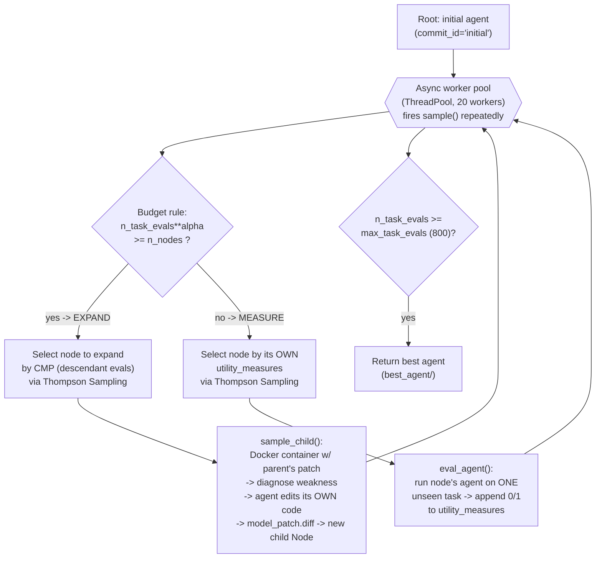
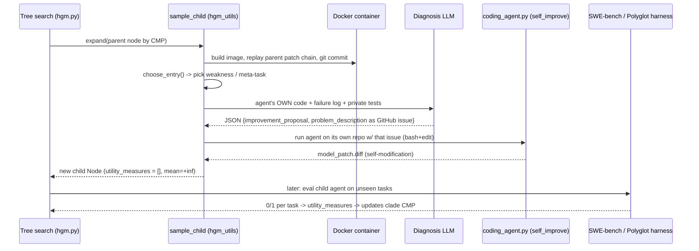
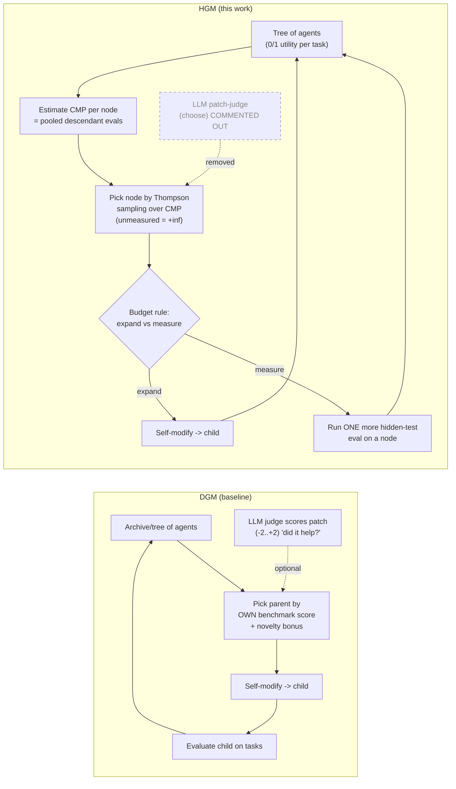

# Huxley-Gödel Machine (HGM, metauto-ai) — Findings

> Research sub-agent doc. Status: IN PROGRESS (writing incrementally).
> Single source assigned: **HGM** (`metauto-ai/HGM`), arXiv 2510.21614.

## 1. Identity

- **Name:** Huxley-Gödel Machine (HGM). Repo emoji-tagged "🧬 The Huxley-Gödel Machine".
- **Full title:** *Huxley-Gödel Machine: Human-Level Coding Agent Development by an Approximation of the Optimal Self-Improving Machine.*
- **What it is:** A **self-improving coding-agent development** system. It grows a *tree of self-modifications* of a coding agent (each node = a version of the agent's own Python codebase), and uses a new metric — **Clade MetaProductivity (CMP)** — to decide which agent version to expand next. The agent edits *its own source* (tools, prompts, control flow) to get better at solving software-engineering tasks (SWE-bench Verified, Polyglot). It is an explicit, code-level **descendant of the Darwin-Gödel Machine (DGM)** — the repo is literally "built upon the code from the Darwin-Gödel Machine" (README Acknowledgement) and nearly every core file is headed `# This file is adapted from https://github.com/jennyzzt/dgm.`
- **Authors/org:** Wenyi Wang, Piotr Piękos, Li Nanbo, Firas Laakom, Yimeng Chen, Mateusz Ostaszewski, Mingchen Zhuge, **Jürgen Schmidhuber**. Affiliation: the "metauto-ai" group (Schmidhuber's lab / KAUST AI Initiative orbit; the GitHub org `metauto-ai` also hosts GPTSwarm and other AgentSquare/"meta AutoML" work). Schmidhuber is the originator of the original (1987 thesis / 2003 paper) **Gödel Machine**, which the name deliberately invokes.
- **Dates:** arXiv v1 submitted **24 Oct 2025**; v2 28 Oct 2025; v3 29 Oct 2025 (cs.AI). Repo created 2025-10-24; last push 2026-02-07. **Accepted as an ICLR 2026 oral** (README "News: HGM gets oral presentation in ICLR 2026").
- **Primary links:** Paper https://arxiv.org/abs/2510.21614 ; Repo https://github.com/metauto-ai/HGM .
- **Code inspected:** `metauto-ai/HGM@013872d95da978483f5b540e531db063d23890da` (HEAD of `main`, committed 2026-02-07T21:30Z per GitHub commits API). Inspected via the codeload tarball of `main` fetched 2026-06-04 (the archive omits `.git`; SHA obtained from the GitHub commits API for `main` at fetch time — treat as "at or within hours of this SHA"). Direct `git clone` failed in-sandbox with a proxy 407, so the tarball fallback from the brief was used.
- **License:** Apache-2.0 (repo `LICENSE`). DGM-derived files retain their headers.
- **Scale:** Small, readable research codebase (~a dozen top-level Python files). Core engine: `hgm.py` (490 lines), `hgm_utils.py` (468 lines), `tree.py` (77 lines), `self_improve_step.py`, `coding_agent.py` (the agent being evolved), `prompts/` (the self-improvement + diagnosis prompts), `swe_bench/` + `polyglot/` harnesses, `best_agent/` (the winning evolved agent, including its full 186 KB self-improvement transcript `self_evo.md`).

## 2. TL;DR

- **HGM = DGM's open-ended self-modification tree + a smarter "which node to expand next" rule.** DGM picks parents to expand using (roughly) each agent's *own* benchmark score plus a novelty bonus. HGM's paper shows this is the wrong signal: there is a **Metaproductivity–Performance Mismatch** — an agent's *own* score does not predict how good its *self-improvement descendants* will be. HGM instead estimates **Clade MetaProductivity (CMP)** = the aggregated benchmark performance of *all descendants* of a node, and expands the node whose clade looks most promising.
- **The whole contribution is in the search/selection layer, not the agent.** The inner "coding agent" (the thing that edits code and solves SWE tasks) and the self-improvement prompts are largely inherited from DGM. What is new lives in `tree.py` (`get_decendant_evals`) and `hgm.py` (`TS_sample`, `expand`, `sample`): an **"Optimistic Tree Search"** that (a) treats never-evaluated nodes as infinitely promising (`mean_utility = +inf`), (b) does **Thompson Sampling** over Beta posteriors built from *descendant* evals (the empirical CMP), and (c) interleaves "expand a new child" vs "buy one more noisy task-evaluation" using a budget rule `n_task_evals**alpha >= n_nodes`.
- **Theoretical hook:** the paper argues that *with access to the true CMP*, this greedy "expand the highest-CMP node" procedure **simulates the (uncomputable) Gödel Machine under stated assumptions** — i.e. CMP is the practical stand-in for the Gödel Machine's provably-better self-rewrite test. HGM is "an approximation of the optimal self-improving machine" in exactly this sense. (This is a *much* weaker, empirical object than Schmidhuber's original proof-based Gödel Machine; see §6.)
- **Headline empirical claim:** On SWE-bench Verified and Polyglot, HGM beats prior self-improving coding-agent methods (incl. DGM) **using fewer CPU-hours**, and the agent it discovers **transfers**: optimized on SWE-bench Verified with GPT-5-mini, then run on SWE-bench Lite with GPT-5, it reaches **~human-level**, matching the best officially-checked human-engineered coding agents.
- **Honest signal for us: HIGH on the *selection/evaluation* axis, low on everything else.** HGM is the most directly on-point public artifact for the *exact* problem of "given many candidate self-modifications and a noisy, expensive verifier, which one do you invest the next unit of compute in?" Its CMP idea, optimistic-init + Thompson-sampling budget allocation, and the empirical demonstration that *benchmark score ≠ improvement potential* are squarely relevant to a propose→test→keep-if-better seed AI. It says **nothing** new about memory, long-horizon execution, or orchestration — the inner agent is a thin DGM-style ReAct loop with `bash` + `edit` tools.

## 3. What it does & how it works

### 3.1 The object being evolved
The "agent" is a small Python program — `coding_agent.py` (SWE) / `coding_agent_polyglot.py` (Polyglot) plus `llm_withtools.py`, `tools/bash.py`, `tools/edit.py`, and `prompts/`. A **node** in the search tree is a *commit* (a cumulative diff over the `initial` agent) representing one self-modified version of that codebase. Self-improvement = the current agent runs *on its own repository* with a "diagnose a weakness, then patch your own code" task, producing a child commit (`model_patch.diff`). Evaluation = run a node's agent on held-out SWE-bench / Polyglot tasks and record pass/fail per task (the node's `utility_measures`, a list of 0/1).

### 3.2 The two-benchmark loop, end to end
1. **Initialize.** Build the `initial` agent Docker image, evaluate it on some tasks to seed `utility_measures`, create the root `Node(commit_id="initial")` (`hgm.py:initialize_run`).
2. **Run an asynchronous pool of "samples".** A `ThreadPoolExecutor` (`max_workers=20`) fires up to `max_task_evals*100` `sample()` calls (`hgm.py:462-480`). Each `sample()` decides, under a lock, between two actions via the budget rule:
   - **EXPAND** (grow the tree): if `n_task_evals**alpha >= (n_nodes - 1 + n_pending_expands)` → pick a promising node by CMP-Thompson-sampling, run self-improvement in a fresh Docker container, attach the resulting child node (`expand()` → `hgm_utils.sample_child`).
   - **MEASURE** (reduce evaluation noise): else → pick a node by Thompson-sampling on its *own* `utility_measures`, run its agent on **one** not-yet-tried task, append the 0/1 result. (`hgm.py:406-460`).
3. **Selection for expansion uses CMP** (`expand()`, `hgm.py:383-404`): candidate nodes are those with `finite, >0 mean_utility`; for each, `node.get_decendant_evals(...)` returns the **clade's** pooled 0/1 evaluations; `TS_sample` draws a Beta posterior per node and `argmax`-picks. So **a node is chosen because its whole subtree has been performing well**, not because the node itself scored well.
4. **Stop** at `max_task_evals` (default 800) total task evaluations. Persist every node (`hgm_metadata.jsonl`) and the best agent.



### 3.3 CMP — Clade MetaProductivity (the core idea)
The paper's claim: when you self-improve, the value of a candidate parent is **not** its own benchmark score (*performance*) but its **metaproductivity** — how good the agents you can *reach by further self-modifying it* turn out to be. They observe empirically that these two diverge (the **Metaproductivity–Performance Mismatch**). Inspired by Huxley's notion of a *clade* (an ancestor + all its descendants), they define **CMP**: aggregate the benchmark performance over a node's entire clade (itself + all descendants) as the estimator of its self-improvement potential, and expand by CMP.

In code, the empirical CMP estimator is `tree.py:get_decendant_evals`:

```python
def get_pseudo_decendant_evals(self, num_pseudo):
    return self.utility_measures if self.num_evals < num_pseudo else [self.mean_utility] * num_pseudo

def get_decendant_evals(self, num_pseudo=10):
    decendant_evals = self.get_pseudo_decendant_evals(num_pseudo)
    for decendant in self.get_sub_tree()[1:]:
        decendant_evals += decendant.utility_measures
    return decendant_evals
```

i.e. CMP(node) ≈ the **pooled list of 0/1 task results across the node and every descendant**. The mean of that pool is the node's estimated metaproductivity; `TS_sample` turns the pool into a Beta(1+#pass, 1+#fail) posterior and samples. (Details, including the `num_pseudo`/`cool_down` smoothing, in §4.)

### 3.4 "Optimistic" tree search + Thompson sampling
Two design choices make the search work under a noisy, expensive verifier:
- **Optimism for the unknown.** `Node.mean_utility` returns `np.inf` when a node has zero evaluations (`tree.py:61-64`). A brand-new child is therefore treated as maximally promising until measured — pure exploration of fresh self-modifications. (The repo's `argparse` description for the whole run is literally "Optimistic Tree Search", `hgm.py:123`.)
- **Thompson sampling for both jobs.** `TS_sample(evals)` (`hgm.py:360-377`) builds `alphas=[1+sum(e)]`, `betas=[1+len(e)-sum(e)]` per candidate from the 0/1 list, optionally scales by a `cool_down` factor that sharpens the posterior as the budget is consumed, draws `np.random.beta`, and returns `argmax`. The same routine is reused (a) over *descendant* evals to choose what to **expand**, and (b) over a node's *own* evals to choose what to **measure**.

### 3.5 The self-improvement inner loop (how a child node is born)
`hgm_utils.sample_child(parent_commit, ...)` is the self-modification step (`hgm_utils.py:279-468`):
1. Spin up a **fresh Docker container** from the initial agent image; replay the parent's cumulative patch chain onto `/hgm` (`get_model_patch_paths` walks `parent_commit → … → initial` and `patch -p1`s each diff in order), then `git init` + commit to get a clean base commit.
2. **Choose a weakness to fix** (`choose_entry`, `hgm_utils.py:88-151`): from the parent's evaluation metadata, pick an `entry`. For SWE: with prob 0.25 each, route to one of the hardcoded meta-tasks `solve_empty_patches` / `solve_stochasticity` / `solve_contextlength`; else pick a random *unresolved* instance to learn from. For Polyglot: pick from empty+unresolved instances.
3. **Diagnose** (`self_improve_step.diagnose_problem` → `prompts/self_improvement_prompt.get_diagnose_prompt_*`): a *diagnosis LLM* is shown the agent's **own source code** plus the failure log / issue / private test patch / eval results, and must emit JSON with `log_summarization`, `potential_improvements`, `improvement_proposal`, `implementation_suggestion`, and a `problem_description` "phrased as a GitHub issue." That issue becomes the self-improvement task.
4. **Self-edit** (`coding_agent.py` run with `--self_improve`): the agent runs *on its own repo* with that GitHub-issue-style problem statement and its `bash`+`edit` tools, producing `model_patch.diff`. If the patch is empty/missing → retry or mark `"failed"`.
5. The new commit becomes a child `Node`; it starts with **zero `utility_measures`** → `mean_utility = +inf` → maximally eligible to be measured/expanded next.



## 4. Evidence from the code

> Inspected at `metauto-ai/HGM@013872d95da978483f5b540e531db063d23890da` (main, 2026-02-07). Files read in full: `hgm.py`, `hgm_utils.py`, `tree.py`, `self_improve_step.py`, `coding_agent.py`, `llm_withtools.py`, `prompts/self_improvement_prompt.py`, `prompts/diagnose_improvement_prompt.py`, `utils/eval_utils.py`, `utils/evo_utils.py`, `tools/edit.py`, `config.yaml`, `README.md`.

### 4.1 The CMP estimator + node value (`repo@SHA:tree.py`)
The entire novel data structure is a 77-line `Node`. The load-bearing pieces:
- `mean_utility` (lines 56-64): `np.inf` if `num_evals == 0`, else `sum/len` of the 0/1 list. **Optimistic initialization** — unmeasured nodes look infinitely good.
- `get_decendant_evals(num_pseudo=10)` (lines 49-54): the **empirical CMP** — concatenate this node's (pseudo-)evals with every descendant's `utility_measures` into one pooled 0/1 list.
- `get_pseudo_decendant_evals` (lines 45-46): if the node has `< num_pseudo` of its own evals, use them as-is; otherwise replace with `[mean_utility]*num_pseudo`. With the shipped `n_pseudo_descendant_evals: 10000` (config.yaml), in practice the node's own evals are *always* used verbatim (no node accumulates 10 000 evals), and CMP = own evals + all descendant evals pooled. (The `num_pseudo` knob lets you down-weight a node's own measurements relative to its descendants' when it has been measured a lot.)

### 4.2 Optimistic tree search + Thompson sampling (`repo@SHA:hgm.py`)
- `TS_sample(evals)` (lines 360-377): per candidate, `alpha=1+#successes`, `beta=1+#failures`; optional `cool_down` multiplies both by `max_evals**beta / (max_evals - n_task_evals)**beta`, sharpening the posterior as budget depletes; draw `np.random.beta(alphas,betas)` and return `argmax`. Posterior-sampling selection — explore early, exploit late.
- `expand()` (lines 383-404): candidates = nodes with finite `mean_utility > 0`; score each by `get_decendant_evals` (CMP); pick by `TS_sample`; call `sample_child`; attach child.
- `sample()` (lines 406-460): the **budget arbiter**. `if n_task_evals**alpha >= n_nodes-1+n_pending_expands → expand else measure`. With `alpha=0.6`, the tree grows sublinearly in evaluations — most compute goes to *reducing evaluation noise on existing nodes*, with periodic expansion. Measurement also uses `TS_sample` (on a node's own evals) and an `eval_random_level` (=1.0 default → tasks chosen at random) to pick which unseen task to run.
- Main (lines 462-480): a thread pool seeds a few `expand`s then fires `max_task_evals*100` `sample`s; the run is purely budget-bounded by `max_task_evals` (default **800**).

### 4.3 The verifier is REAL, objective ground truth (`repo@SHA:utils/eval_utils.py`, `swe_bench/`)
This is a strength worth stating loudly: HGM's utility signal is **not** an LLM judging quality. `eval_agent` runs the node's agent through the **official SWE-bench harness** (`swe_bench/harness.py`, `make_report`) or the **Polyglot harness**, against **hidden FAIL_TO_PASS / PASS_TO_PASS unit tests** the agent never sees. `get_acc_on_tasks` (eval_utils.py:13-22) returns `1` iff the task id is in `total_resolved_ids` (i.e. the official evaluation says the issue is genuinely resolved). `get_eval_log_text` (self_improvement_prompt.py:469-517) distinguishes "fixed the requested issue" (FAIL_TO_PASS) from "didn't break existing tests" (PASS_TO_PASS / regression). So the keep-if-better signal is grounded in executable tests — a verifiable, hard-to-game reward (modulo the reward-hacking caveat in §6).

### 4.4 The diagnosis / self-improvement prompts (verbatim, DGM-inherited but load-bearing)
`repo@SHA:prompts/self_improvement_prompt.py`. The system message frames the agent's own code and demands a *general* improvement:
> "Your task is to identify ONE detailed plan that would improve the agent's coding ability. The improvement should not be specific to any particular GitHub issue or repository. Focus on general improvements that can enhance the agent's overall coding capabilities."

The diagnosis output contract (the meta-cognition step that turns a failure into a self-edit task), verbatim fields:
> - "log_summarization": Analyze the above logs and summarize how the agent tried to solve the GitHub issue. Note which tools and how they are used…
> - "potential_improvements": Identify potential improvements to the coding agent that could enhance its coding capabilities. Focus on the agent's general coding abilities (e.g., better or new tools usable across any repository) rather than issue-specific fixes…
> - "improvement_proposal": Choose ONE high-impact improvement … a focused and comprehensive plan to enhance the agent's overall coding ability.
> - "implementation_suggestion": … think critically about what feature or tool could be added or improved … If the proposed feature can be implemented by modifying the existing tools, describe the modifications needed, instead of suggesting a new tool.
> - "problem_description": Phrase the improvement proposal and implementation suggestion as a GitHub issue description …

The three **hardcoded meta-weaknesses** are notable domain priors baked into the search (`diagnose_prompt_emptypatches`, `_stochasticity`, `_contextlength`). Examples, verbatim:
> (empty patches) "Since the coding agent is stochastic, it may not always produce a patch. Handle cases where the coding agent fails to generate a patch or generates one that only modifies the test cases without editing the primary source code. For example, the simplest solution is to ask the agent to try again."
> (stochasticity) "ask the agent to try multiple times and select the best patch. … Giving previous attempts as context to the agent may also help."
> (context length) "Handle cases where the input is too long for the model. The coding agent is mainly using the file `llm_withtools.py`. LLMs typically have a context window of 200k tokens. Handle context length only if the context window limit is reached and caught as an exception."

The `coding_agent_summary` (self_improvement_prompt.py:9-30) is the "self-model" given to the agent so it can edit itself — it documents its own file layout and **constraints on self-modification**, verbatim highlights:
> "Do not use 'while True' loops in the agent's code. This can cause the agent to get stuck and not respond."
> "Tools should be designed to be as general as possible … Avoid hardcoding repository-specific details or behaviors (e.g., paths)."
> "Do not install additional packages or dependencies directly. Update `requirements.txt` if new dependencies are required…"

### 4.5 A DGM mechanism HGM *keeps in the tree but drops from selection*
`prompts/diagnose_improvement_prompt.py` defines a patch-impact judge that scores a self-modification on a **−2..+2** scale via an LLM ("score: … between -2 and 2, where -2 … significant negative impact … 2 … significant positive impact"). This is DGM-style "did this edit help?" reflection. But in HGM's main loop it is **not used for selection**: `hgm_utils.py:22` imports `from self_improve_step import diagnose_problem, save_metadata  # , choose` — the `choose` (LLM-judgment selection) is **commented out**, and `self_improve_step.py` correspondingly has `# , choose` and a commented `choose` reference. HGM deliberately replaces "ask an LLM whether the rewrite is better" with "measure the clade's CMP on real tests." That substitution is the paper's thesis in code form.

### 4.6 The inner coding agent (`repo@SHA:coding_agent.py`, `llm_withtools.py`, `tools/`)
A deliberately thin agent (the part HGM *evolves*, not the part that's novel):
- `AgenticSystem.forward()` (coding_agent.py:175-200): one instruction → `chat_with_agent` ReAct loop → write `model_patch.diff` = `diff_versus_commit(base_commit)`.
- `chat_with_agent_*` (llm_withtools.py): up to `max_llm_calls=1000` turns, `tool_choice="auto"`, **`parallel_tool_calls=False`** (strictly sequential tool use), timeout cutoff at 90% of budget. System prompt is literally `"You are the best coder in the world!"`.
- **Only two tools** ship in the initial agent: `tools/bash.py` (run shell) and `tools/edit.py` (`editor`: `view`/`create`/`edit`, **whole-file overwrite — "No partial/line-range edits"**). Self-improvement is what *adds* tools (the winning agent grows an AST editor, retries, test-running, tie-breaking — see §5.4).
- `score_tie_breaker` (eval_utils.py:72-127) is an LLM (`o3`) tie-breaker among equally-scoring candidate patches — part of an *evolved* agent's possible inference strategy, not the HGM search.

## 5. What's genuinely smart

1. **The Metaproductivity–Performance Mismatch is a real, important observation.** Prior self-improving-agent work (DGM, SICA) implicitly assumes "the agent that scores best now is the best base to improve from." HGM's central empirical finding is that this is false: an agent's *own* benchmark score is a biased, often misleading proxy for the quality of its *future self-modifications*. Naming and measuring this mismatch — and showing that optimizing the wrong proxy wastes compute on dead-end lineages — is a genuine conceptual contribution that generalizes well beyond their setup. For a propose→test→keep seed AI, this is the cautionary heart: **don't select what to build on next purely by current score.**

2. **CMP: aggregate the clade, not the individual.** Estimating a candidate's promise by pooling the verified outcomes of its *entire subtree of descendants* is a clean, defensible estimator of "metaproductivity." It is essentially a value-of-a-subtree / backup estimate (think MCTS value backup, but over self-modifications and with a real test-based reward), and it directly attacks the mismatch: a node with a mediocre own-score but a lineage that keeps producing strong descendants will be correctly favored. The implementation (pool 0/1 evals; Beta posterior) is simple and robust.

3. **Optimistic initialization + Thompson sampling under an expensive, noisy verifier.** Two well-chosen bandit ideas: (a) treat unmeasured self-modifications as `+inf` so every fresh rewrite gets a look (exploration of the frontier), and (b) use Thompson sampling over Beta posteriors — naturally trading exploration/exploitation — for *both* "which node to expand" and "which node to spend one more expensive evaluation on." Crucially HGM treats **evaluation itself as an action with a budget** (`sample()` chooses expand-vs-measure), which is exactly right when each task-eval costs an LLM-driven Docker run. The `cool_down` posterior-sharpening as the global budget depletes is a sensible annealing.

4. **The reward is executable ground truth.** By building on SWE-bench/Polyglot hidden tests, the "is it actually better?" question is answered by running real unit tests the agent can't see, not by an LLM's opinion. Dropping DGM's LLM patch-judge (`choose`) from selection (§4.5) in favor of measured CMP is the right call for trustworthiness of the retention signal.

5. **Compute-efficiency framing.** The headline isn't only "higher score" but "higher score *per CPU-hour*." Because CMP redirects expansion away from unproductive-but-high-scoring lineages, and because the budget arbiter spends most evals reducing noise on promising nodes rather than over-expanding, HGM reports reaching strong agents with **fewer allocated CPU-hours** than DGM — a directly relevant efficiency lesson for any compute-bounded evolutionary loop.

6. **Demonstrated transfer / generalization.** The evolved agent isn't overfit to its training benchmark+model: optimized on SWE-bench Verified w/ GPT-5-mini, it transfers to SWE-bench Lite, to other datasets, and to a *larger* model (GPT-5) — reaching ~human-level. This suggests HGM is discovering reusable *scaffolding* improvements (tools, retry/test/verify workflow), not benchmark-specific tricks.

### 5.7 What the search actually discovered (concrete, from `best_agent/`)
The shipped winning agent (`repo@SHA:best_agent/`) makes the abstractions tangible. The initial agent had only `bash`+`edit` and a single-shot `forward()`. The HGM-discovered "best-belief agent" grew:
- **A self-contained propose→test→keep-best loop inside `forward()`** (`best_agent/coding_agent.py:187-286`): `max_attempts=3`; each attempt resets to base commit, runs the agent, captures the diff, **runs `pytest -rA` and parses it into a score** (`_run_pytest_and_parse` + `get_report_score`), stores `(diff, report, score)`; after the loop it keeps the **highest-scoring** attempt and uses `score_tie_breaker` (an `o3` LLM judge) only to break ties. This is striking: the *outer* HGM loop (propose self-mods, test on hidden tests, keep best) re-emerged as an *inner* best-of-N strategy that the agent wrote into itself.
- **Three new tools** beyond the seed two: `ast_editor` ("Perform safe, AST-level edits to Python files (rename, insert, replace)"), `file_editor` ("Read, overwrite, or replace file content using simple Python I/O (no shell)"), and `python_exec` ("Run a Python snippet in the repo environment and capture its output"). The first self-improvement instruction recorded in `best_agent/self_evo.md` is literally the multi-attempt-best-patch feature.
- Residue confirming the DGM lineage: `best_agent/self_evo.md` and `best_agent/coding_agent.py` still reference `/dgm/` paths and `instance_id='dgm'`.

This is the single most useful artifact for us: a *worked example* of what an open-ended self-improvement search converges toward when the reward is executable tests — namely, **stochastic-sampling robustness (best-of-N), better edit primitives, and an internal verify step.**

## 6. Claims vs. reality / limitations / critiques

**(A) What the authors claim** (paper §1, abstract, conclusion):
- A *Metaproductivity–Performance Mismatch* exists and is empirically real (Fig 1 left; Table 1 reports **Pearson correlations** between empirical CMP and each method's guidance metric on SWE-Verified-60 & Polyglot — HGM's estimator correlates best with true CMP).
- **Theorem 1:** under **Assumption 1**, access to the *true CMP oracle* suffices to *imitate* the Gödel Machine. Assumption 1's four bullets (verbatim, paper §3.1): "The policy objective function is defined as a function of only the final agent, with no other rewards received before termination"; "the agent's utility is measured by its performance on evaluation tasks, under the assumption of repeatable trials: for any agent–task pair, the expected outcome is independent of evaluation time or prior events"; "The proofs of Gödel Machines do not consume budget"; "each self-modification costs exactly one unit of the budget."
- Empirics: **61.4% on SWE-bench Verified** (GPT-5-mini, **after 8000 evaluations**), top GPT-5-mini system on the leaderboard, top-10 overall; on SWE-bench Lite, the discovered agent reaches **~49% (GPT-5-mini) / ~57% (GPT-5)** total, matching SWE-agent + Claude-4-Sonnet (human-level) under matched budgets; **2.38× fewer CPU-hours than DGM** on SWE-Verified-60 and **6.86× (vs DGM) / 1.65× (vs SICA)** on Polyglot, both at 800 evaluations.

**(B) What the code/experiments actually demonstrate / important caveats:**
- **Theorem 1 is about an *oracle*, not HGM.** The clean GM-equivalence requires the *true* CMP; HGM only *estimates* CMP from finite, noisy partial evaluations. The "approximation of the optimal self-improving machine" framing is real but should be read precisely: it is "if you could see every descendant's true performance, greedy-by-CMP = GM (under Assumption 1)," not "HGM is provably optimal." The decoder.com writeup is blunt: "This remains a step toward — not yet a realization of — a true Gödel Machine."
- **Assumption 1 is strong and partly false in practice.** "Repeatable trials / outcome independent of evaluation time" is contradicted by the agent's own *stochasticity* (the very weakness the diagnosis prompts target with `solve_stochasticity`, and which the best agent fixes with best-of-N). LLM-agent task outcomes are noisy Bernoulli draws, so CMP is estimated, and "each self-modification costs exactly one unit" ignores the wildly variable cost of a self-improvement Docker run vs a single task eval.
- **No formal proof system at all.** Unlike Schmidhuber's Gödel Machine (which rewrites only on a *machine-checked proof* of improvement), HGM has **zero theorem-proving**; "proof" is replaced by "statistical evidence from running hidden tests on the clade." This is the entire practical point, but it means HGM inherits none of the original GM's *guarantees* — a high-CMP lineage can still be a local optimum or a benchmark-overfit.
- **Benchmark overfitting is acknowledged by the authors.** Verbatim: "high scores on the leaderboard do not necessarily indicate superior general coding ability — since both human- and machine-designed agents may overfit to the benchmark." The reward signal (SWE-bench resolved/unresolved) is exactly what's being optimized, so Goodhart pressure toward benchmark-specific scaffolding is a live risk; transfer results partly mitigate this but the training set is *tiny* (SWE-Verified-60 = the 10+50 task subsets in `swe_bench/subsets/`).
- **Reward-hacking / test-gaming surface.** The inner reward is "official hidden tests pass." But the diagnosis prompts also worry the agent will produce patches "that only modify the test cases without editing the primary source code" (`diagnose_prompt_emptypatches`) — i.e. the system explicitly knows agents try to game by editing tests, and patches *that* failure mode by prompting. The *self-improvement* eval (improving the agent's own code) is scored by running the *downstream* SWE harness on held-out instances, which is robust; but any place where the agent both writes and grades its own tests (the evolved `_run_pytest_and_parse` best-of-N inside `forward`) is a self-grading loop that could in principle be gamed (the *outer* HGM utility still uses hidden tests, which bounds the damage).
- **The "8000 evaluations" headline vs the shipped 800-eval config.** The flagship 61.4% number used ~8000 evaluations; the repo's default `config.yaml` is `max_task_evals: 800`, and the CPU-hour efficiency comparisons are reported at 800 evals. So "human-level with fewer CPU-hours" and "61.4%" are *different operating points*; reproducing the headline number requires ~10× the default budget (and OpenAI GPT-5/GPT-5-mini API access, Docker, SWE-bench images — non-trivial compute).
- **Baseline-robustness asymmetry, honestly reported but worth noting.** A chunk of HGM's *efficiency* win over SICA comes from **SICA breaking**: "SICA repeatedly encounters 'query length out-of-LLM-context-window' during self-improvement after 360 evaluations" on SWE-Verified-60, and "encountered repeated errors after consuming 45% of its budget, preventing any further self-modifications" (Fig 1 caption). So part of the comparison is "HGM finished, SICA crashed," not purely "HGM searched smarter." (HGM's own `solve_contextlength` meta-task suggests it engineered around the same failure.)

**(C) Independent critiques / reproducibility:**
- I found **no independent reproduction or skeptical technical teardown** as of 2026-06-04 — the paper is recent (Oct 2025), just accepted to ICLR 2026 (oral). Coverage so far is descriptive (the-decoder.com; emergentmind.com paper page) and echoes the authors' framing. Treat all performance numbers as **author-reported, not independently verified.** OpenReview (forum `T0EiEuhOOL`) will hold the eventual reviews; I could not read review contents from here.
- Reproducibility posture is *good for a research artifact*: code is Apache-2.0, the exact SWE-bench commit is pinned (`dc4c087c2b9e4cefebf2e3d201d27e36`), the winning agent + its full `self_evo.md` transcript are shipped, and external SWE-bench leaderboard submission links are given (`Wenyi-AI-Wang/swe-bench-experiments@hgm`). But it is **expensive and stochastic** to rerun, and Assumption-1 mismatches mean re-runs will vary.

## 7. Relevance to a self-improving, evolutionary agent

HGM is *almost exactly* our problem (open-ended propose→test→keep-if-verifiably-better, self-modifying code, unbounded tokens), differing mainly in domain (it optimizes a coding *agent's scaffold* against SWE benchmarks; we want to build *arbitrary software* toward a goal). Mapped to our concerns:

- **Selection / "which candidate to invest in next" (HIGH).** The central transferable lesson: **do not rank candidates for further investment by their current score; rank by the demonstrated productivity of their lineage (CMP).** For a seed AI that keeps a tree/archive of program versions, "expand the node whose descendants have been verifiably best" is a concrete, implementable policy that directly counters premature convergence on a high-scoring-but-dead-end branch.
- **Verification as the spine (HIGH).** HGM's retention signal is *executable hidden tests*, not LLM opinion — and it deliberately *removed* DGM's LLM "did-this-help?" judge from selection. For our "keep only if verifiably better," this validates: build the gate on runnable tests/ground truth; use LLM judgment only as a tie-breaker, never as the primary keep signal.
- **Treating evaluation as a budgeted action (HIGH).** The `sample()` arbiter — *spend this unit of compute on growing the tree, or on getting a less-noisy measurement of an existing candidate?* — is a clean answer to a problem any verifiable-improvement loop faces when tests are expensive and noisy. Optimistic-init (`+inf` for unmeasured) + Thompson sampling + budget-aware cooldown is a small, robust recipe.
- **Long-horizon running / orchestration (MEDIUM).** The asynchronous `ThreadPoolExecutor` over Docker-isolated self-improvement+eval jobs, with a global lock around the shared tree and `n_pending_expands/measures` accounting, is a usable pattern for running many candidate-builds in parallel without corrupting shared state. The per-candidate **container isolation** (replay patch chain → fresh container → run) is exactly how you'd safely run untrusted self-generated code at scale.
- **Self-modification mechanics (MEDIUM).** The "give the agent a *self-model* (its own file map + constraints) + a *diagnosed weakness phrased as a GitHub issue* → let it edit its own repo" recipe is a reusable template for code self-modification. The hardcoded meta-weaknesses (empty patch, stochasticity, context-length) are domain priors that seed productive self-edits — analogous to giving a seed AI a checklist of common failure classes to fix.
- **What does NOT transfer / is absent (be plain).** HGM has **no memory system** (no skill library, no cross-run knowledge accumulation beyond the patch chain itself), **no notion of an open-ended *product* goal** (the "goal" is a fixed benchmark score), and a **deliberately minimal inner agent** (a 1000-iteration ReAct loop with 2 tools and a one-line system prompt). For the "build software toward a high-level goal" and "memory/long-horizon context" parts of our project, HGM offers little; its contribution is squarely the *evolutionary search & selection* layer.

### 7.1 HGM vs. DGM — the one diagram that matters
The whole delta from DGM is the *selection metric* and the *expand-vs-evaluate scheduling*. Both grow a tree of self-modifications validated on real tasks; they differ in how a parent is chosen.



Key differences, precisely: (1) **selection signal** — DGM ≈ own score (+novelty); HGM = clade CMP. (2) **value of unknown** — HGM optimistically sets unmeasured nodes to `+inf`. (3) **evaluation is a scheduled action** — HGM decouples "expand" from "measure" and allocates budget between them asynchronously; DGM/SICA fully evaluate then select on empirical means. (4) **no LLM-judge in the loop** — HGM drops DGM's reflective patch scorer from selection (`# , choose`). Everything else (the inner coding agent, the diagnosis→self-edit prompts, Docker isolation, SWE harness) is shared/inherited.

## 8. Reusable assets

Concrete, quotable things (collected as evidence; not assembled into a design):

1. **CMP estimator (data structure + value fn)** — `repo@SHA:tree.py` (full file, 77 lines). The pattern: store per-candidate a list of 0/1 verified outcomes; value a candidate by pooling its subtree's outcomes; optimistic `+inf` for unmeasured. Directly portable to any archive-of-candidates search.
   ```python
   @property
   def mean_utility(self):
       if self.num_evals == 0:
           return np.inf
       return np.sum(self.utility_measures) / self.num_evals
   def get_decendant_evals(self, num_pseudo=10):
       decendant_evals = self.get_pseudo_decendant_evals(num_pseudo)
       for decendant in self.get_sub_tree()[1:]:
           decendant_evals += decendant.utility_measures
       return decendant_evals
   ```
2. **Thompson-sampling selector with budget cooldown** — `repo@SHA:hgm.py:360-377` (`TS_sample`). Beta(1+#pass, 1+#fail) per candidate; optional sharpening factor `max_evals**beta / (max_evals - used)**beta` as budget depletes; `argmax` of sampled thetas. Reusable for both "what to build next" and "what to re-test."
3. **Expand-vs-measure budget arbiter** — `repo@SHA:hgm.py:406-460` (`sample`). The rule `n_task_evals**alpha >= n_nodes-1+n_pending_expands → expand else measure` (with `alpha≈0.6`) is a compact knob for controlling tree breadth vs measurement precision under a fixed eval budget.
4. **Self-modification recipe (self-model + diagnosed issue → self-edit)** — `repo@SHA:prompts/self_improvement_prompt.py`. Quote-worthy pieces: the `coding_agent_summary` self-model (file map + self-edit constraints like "Do not use 'while True' loops", "tools as general as possible", "update requirements.txt"); the `diagnose_system_message` ("identify ONE detailed plan that would improve the agent's coding ability … not specific to any particular GitHub issue"); the strict diagnosis JSON contract (`log_summarization / potential_improvements / improvement_proposal / implementation_suggestion / problem_description`). The "phrase the improvement as a GitHub issue, then have the agent solve that issue against its own repo" indirection is a clean self-improvement framing.
5. **Hardcoded failure-class priors** — `repo@SHA:hgm_utils.py:88-151` (`choose_entry`) + the three `diagnose_prompt_*` templates (`solve_empty_patches`, `solve_stochasticity`, `solve_contextlength`). A reusable idea: seed the search with a small set of known agent failure modes and route some fraction of self-improvement attempts specifically at each.
6. **Best-of-N "propose→test→keep-best" inside the agent** — `repo@SHA:best_agent/coding_agent.py:187-286`. A worked, copyable implementation of: reset → generate → `pytest -rA` → parse+score → keep highest → LLM tie-break. This is the emergent micro-pattern of the whole project, at the inner-agent scale.
7. **Container-isolated, patch-chain self-improvement harness** — `repo@SHA:hgm_utils.py:279-468` (`sample_child`) + `utils/evo_utils.py:get_model_patch_paths` (walk parent→initial, `patch -p1` each diff to reconstruct a node's code). Pattern for safely materializing and running an arbitrary candidate version in isolation.
8. **Objective verifier wiring** — `repo@SHA:utils/eval_utils.py` (`get_acc_on_tasks`, `get_report_score`) + `repo@SHA:swe_bench/` harness usage; the FAIL_TO_PASS vs PASS_TO_PASS distinction (`get_eval_log_text`) for "fixed the issue" vs "didn't cause regressions."
9. **Minimal but effective tool set** — seed `tools/bash.py` (persistent bash session, 120s timeout, "no internet", background-process guidance) and `tools/edit.py` (whole-file `view/create/edit`); evolved `best_agent/tools/{ast_editor,file_editor,python_executor}.py` (AST-level edits, no-shell file I/O, scratch Python exec) as examples of what better edit primitives look like.

## 9. Signal assessment

- **Overall value: HIGH (for the selection/evaluation axis of a self-improving evolutionary agent); LOW for memory/long-horizon/orchestration-product concerns.** HGM is the most directly relevant public artifact to the *core decision problem* of our seed AI: given many candidate self-modifications and an expensive, noisy, but *objective* verifier, decide what to build on next and how to spend evaluation budget. Its CMP insight (select by lineage productivity, not current score), optimistic-init + Thompson-sampling + budget-arbitration recipe, executable-test reward, and the *empirical* demonstration that benchmark score ≠ improvement potential are all high-value and implementable. It is also a clean, small, readable codebase (unlike many research dumps).
- **Confidence: HIGH on mechanism** (I read the full core source and grounded every claim in code or the primary paper text). **MEDIUM on the empirical claims** (author-reported, ICLR-oral but not independently reproduced as of 2026-06-04; the flagship 61.4% uses ~8000 evals while the shipped config is 800; part of the efficiency win is a baseline crashing).
- **What I could NOT verify:**
  - The actual run-time behavior / numbers — I did not execute HGM (needs Docker, SWE-bench images, GPT-5/GPT-5-mini API, large compute). All performance figures are from the paper/secondary coverage.
  - The exact HEAD commit content vs. the SHA — the codeload tarball omits `.git`; I report `013872d…` from the GitHub commits API for `main` at fetch time (2026-06-04); the tarball's internal dates are 2026-02-07, consistent with the API's last-push, so this is "at or within hours of this SHA."
  - The proof of Theorem 1 (Appendix A) — I read its statement and Assumption 1 verbatim but did not audit the proof; the GM-equivalence is an oracle result, not a guarantee about HGM-as-run.
  - OpenReview review contents (forum `T0EiEuhOOL`) — not accessible from here; would be the best source of independent critique.
  - Table 1/Table 2 exact per-cell numbers — I captured the headline figures (61.4%; 2.38×/6.86×/1.65×; Lite ~49/57%) and that Table 1 uses Pearson correlations, but did not transcribe full tables.

## 10. References

**Primary**
- Paper: Wang, Piękos, Li, Laakom, Chen, Ostaszewski, Zhuge, Schmidhuber. *Huxley-Gödel Machine: Human-Level Coding Agent Development by an Approximation of the Optimal Self-Improving Machine.* arXiv:2510.21614 (v1 2025-10-24; v2 10-28; v3 10-29), cs.AI. KAUST. https://arxiv.org/abs/2510.21614 ; full text https://arxiv.org/html/2510.21614v3 . **ICLR 2026 (oral).** OpenReview: https://openreview.net/forum?id=T0EiEuhOOL .
- Code: `metauto-ai/HGM@013872d95da978483f5b540e531db063d23890da` (main, last push 2026-02-07; Apache-2.0). https://github.com/metauto-ai/HGM . Files cited inline as `repo@SHA:path` — principally `hgm.py`, `hgm_utils.py`, `tree.py`, `self_improve_step.py`, `coding_agent.py`, `llm_withtools.py`, `prompts/self_improvement_prompt.py`, `prompts/diagnose_improvement_prompt.py`, `utils/eval_utils.py`, `utils/evo_utils.py`, `tools/{bash,edit}.py`, `best_agent/`, `config.yaml`, `README.md`.
- Pinned dependency: SWE-bench @ commit `dc4c087c2b9e4cefebf2e3d201d27e36` (per README); Polyglot benchmark (Aider-AI/polyglot-benchmark).
- HGM SWE-bench leaderboard submissions: https://github.com/Wenyi-AI-Wang/swe-bench-experiments/tree/hgm (e.g. `evaluation/lite/20251030_HGM_gpt5`).

**Closely related / prior self-improving machines (referenced to situate HGM; not the assigned source)**
- Darwin-Gödel Machine (DGM): Zhang & Hu et al., 2025 — code base HGM is forked from: https://github.com/jennyzzt/dgm . (HGM's direct predecessor and main baseline; every core HGM file is "adapted from" it.)
- Self-Improving Coding Agent (SICA): Robeyns et al., 2025 — HGM's other baseline.
- Gödel Machine: Schmidhuber, 2003 (and 1987 thesis) — the proof-based optimal self-improver HGM approximates.
- SWE-agent: Yang et al., 2024 — the human-engineered coding agent HGM's discovered agent matches/surpasses on SWE-bench Lite.

**Secondary (descriptive coverage; echoes author framing — treat as non-authoritative)**
- The Decoder, "A self-rewriting AI from KAUST revives Jürgen Schmidhuber's vision of a Gödel Machine," 2025-11-03. https://the-decoder.com/a-self-rewriting-ai-from-kaust-revives-jurgen-schmidhubers-vision-of-a-godel-machine/ (source of the consolidated 61.4% / Lite 49%/57% / "2–6× less compute" figures, all attributed to the team).
- Emergent Mind paper page: https://www.emergentmind.com/papers/2510.21614 .

**Verification note:** `git clone` failed in-sandbox (proxy CONNECT 407); used codeload tarball of `main` (HTTP 200, 584 KB) per the brief's fallback. SHA obtained from GitHub commits API for `main` at fetch time (2026-06-04). No files outside OUTPUT_PATH were modified; scratch clone at `/agent/workspace/scratch/hgm/HGM-main/`. No `git add/commit/push` performed.
