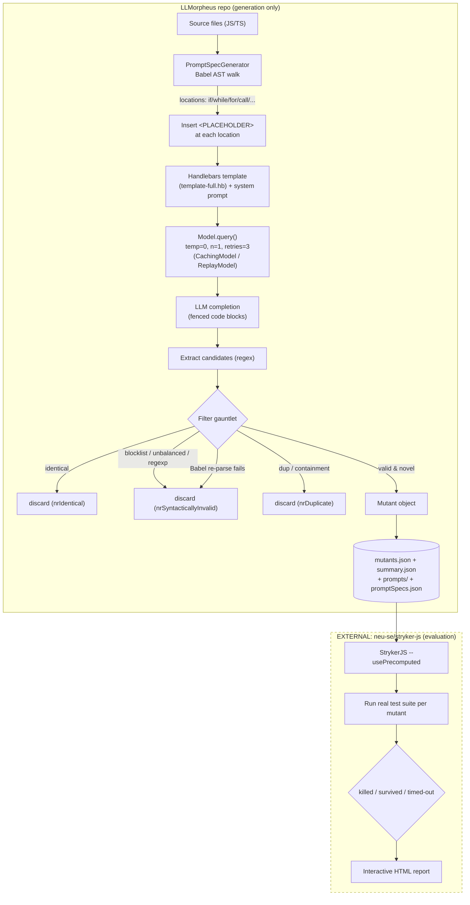
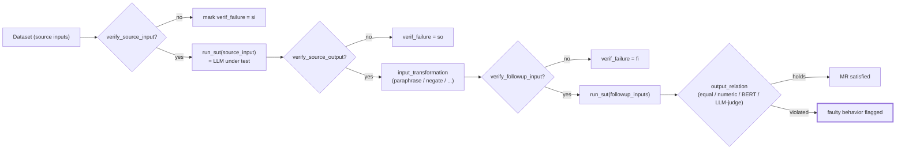

# LLMorpheus + llmorph — LLM-driven test-oracle research

> Per-source research findings. One source slot, **two repositories**. The orchestrator's
> brief framed these as "two related repos … both as facets of LLM-based mutation testing."
> **That framing is wrong and I am flagging it up front.** They share the "morph" stem and
> a common high-level theme (using LLMs around software/ML testing oracles), but they are
> **different projects by different authors doing different things**:
>
> - **LLMorpheus** (`githubnext/llmorpheus`) = **LLM-based mutation testing of *code*** —
>   inject plausible bugs into JS/TS source, then check whether the project's test suite
>   catches them. This is "testing the tests." Directly on-topic for the KB-Seed crux.
> - **llmorph / LLMORPH** (`steven-b-cho/llmorph`) = **metamorphic testing of *LLMs*** on
>   NLP tasks. It tests whether an *LLM under test* behaves consistently under
>   semantics-preserving (or semantics-changing) input transformations. It is **not**
>   mutation testing and does not mutate code. Tangential to the KB-Seed crux, but it
>   contributes one genuinely transferable idea: a *test-case validity filter* (verifying
>   that a generated test is well-formed before trusting its verdict).
>
> I cover both honestly as their own things and relate them where it helps.

---

## 1. Identity

### LLMorpheus (primary, on-topic)
- **Name:** LLMorpheus (npm package name `llm-mutationtesting`).
- **What it is:** A mutation-testing tool for JavaScript/TypeScript npm packages that uses
  an LLM to *generate the mutants* (the injected bugs), rather than a fixed set of
  hand-coded mutation operators. The resulting mutants are run against the package's test
  suite by a customized **StrykerJS** to determine kill/survive/timeout.
- **Authors / org:** Frank Tip (Northeastern), Jonathan Bell (Northeastern), Max Schäfer
  (GitHub Next at the time of the repo; affiliation "XBOW" in the latest arXiv version).
  Repo published under **GitHub Next** (`githubnext`).
- **Dates:** arXiv v1 April 2024 (2404.09952); repo last commit on `main` Feb 2025. The
  README states **this version is archived**; active development moved to
  `https://github.com/neu-se/llmorpheus/` (Northeastern Software Engineering group).
- **Primary links:**
  - Paper: https://arxiv.org/abs/2404.09952 ("LLMorpheus: Mutation Testing using Large Language Models")
  - Repo (archived): https://github.com/githubnext/llmorpheus
  - Active fork: https://github.com/neu-se/llmorpheus
  - Modified StrykerJS: https://github.com/neu-se/stryker-js (referenced as `franktip/stryker-js` in README)
  - Recorded-execution data: https://github.com/neu-se/mutation-testing-data
- **Code repo + commit inspected:** `githubnext/llmorpheus@1f8adb8cac17f7c1d967c9146cb98c9c09449488`
  (`main`, latest at time of inspection; source files themselves dated Feb 3 2025).
  Inspected via the codeload tarball of `main` (git clone over the sandbox proxy returned
  HTTP 407; the GitHub API confirmed the `main` HEAD SHA above).

### llmorph / LLMORPH (secondary, tangential)
- **Name:** LLMorph (capitalized **LLMORPH** in the paper). Repo description: "Metamorphic
  Testing of Large Language Models."
- **What it is:** An automated **metamorphic testing (MT)** framework for evaluating LLMs
  on NLP tasks without labeled data. It implements 36 of 191 cataloged Metamorphic
  Relations (MRs), generates source/follow-up input pairs, runs them through an LLM
  "system under test" (SUT), and checks whether an output relation holds.
- **Authors / org:** Steven (Byungjun) Cho and collaborators incl. Valerio Terragni
  (University of Auckland). Artifact for the **ICSME'25** paper "Metamorphic Testing of
  Large Language Models for Natural Language Processing."
- **Dates:** Repo last commit July 2025; ICSME 2025 paper. Zenodo DOI 10.5281/zenodo.16442703.
- **Primary links:**
  - Paper PDF: https://valerio-terragni.github.io/assets/pdf/cho-icsme-2025.pdf
  - Repo: https://github.com/steven-b-cho/llmorph
  - MR catalog site: https://mt4nlp.github.io/
  - Experimental data: https://doi.org/10.5281/zenodo.16526643
  - Video demo: https://youtu.be/sHmqdieCfw4
- **Code repo + commit inspected:** `steven-b-cho/llmorph@cb7f0e5af0d9d8e5542ad041cd067c4313735726`
  (`main`, latest at time of inspection; files dated Jul 26 2025). Inspected via codeload
  tarball of `main`.

---

## 2. TL;DR

- **LLMorpheus generalizes mutation testing**: instead of a fixed operator set ("+"→"-"),
  it inserts a `PLACEHOLDER` at AST-chosen locations and asks an LLM "what buggy code could
  go here?" This produces mutants resembling *real* bugs (e.g. calling the wrong method)
  that operator-based tools like StrykerJS structurally cannot produce.
- **The scoring is NOT done by the LLM** and not in this repo. LLMorpheus only *generates
  and filters* candidate mutants (syntactic validity, identity, duplicate checks) and emits
  `mutants.json`. The actual kill/survive verdict is delivered by a **modified StrykerJS**
  running the real test suite. This separation — *LLM proposes, deterministic harness
  judges* — is the single most relevant pattern for KB-Seed's "verify, don't trust" crux.
- **LLMorpheus treats non-determinism as a first-class measurement.** Because the LLM
  output varies run-to-run, the repo ships a `computeVariability` harness that quantifies
  how many mutants are common vs. distinct across 5 repeated runs. This is exactly the kind
  of honesty an evolutionary loop needs about its own stochastic proposer.
- **Mutant generation is cheap, deterministic-ish, and replayable**: temperature defaults
  to 0.0, results are content-hash cached, and a `--replay` mode reconstructs an entire run
  from saved prompts/completions. Good harness hygiene for reproducible experiments.
- **llmorph is a different beast** — it tests *LLMs*, not test suites, via metamorphic
  relations. Its one transferable idea is a **pipeline of "verify" predicates** that discard
  malformed/invalid test cases *before* their pass/fail verdict is trusted — a guard against
  the verifier itself being garbage-in/garbage-out.
- **Overall signal: LLMorpheus = medium-high** (clean, real "LLM-proposes/harness-verifies"
  exemplar + variability measurement; but it is a research prototype, not a self-improving
  loop). **llmorph = low-medium** (mostly off-topic; one useful guard-rail idea).

---

## 3. What it does & how it works

### 3A. LLMorpheus — mechanism

LLMorpheus is a **mutant *generator*** that delegates **mutant *evaluation*** to a separate,
modified copy of StrykerJS. The full mutation-testing loop has three components (the paper's
Figure 5): a **prompt generator**, a **mutant generator**, and **StrykerJS (modified)**.

**Step 1 — Choose mutation locations from the AST (deterministic).**
`PromptSpecGenerator` parses each source file with `@babel/parser` and walks the AST. It
does **not** mutate everywhere; it emits a `PromptSpec` only at a fixed catalog of syntactic
locations (`repo@1f8adb8:src/generator/PromptSpecGenerator.ts`):
- `if` / `while` / `do-while` **test** conditions; `switch` **discriminant**;
- `for` loop **init / test / update / header**; `for-in` and `for-of` **left / right / header**;
- function **call** **callee**, each **argN**, and the entire **allArgs** list
  (calls restricted to a single line; `require` and `super` calls are skipped).

Each chosen code fragment is replaced by the literal token `<PLACEHOLDER>` to form
"code-with-placeholder."

**Step 2 — Build a prompt per location (deterministic).**
`createPrompts()` instantiates a Handlebars template (default `template-full.hb`) with
`{{{code}}}` = code-with-placeholder and `{{{orig}}}` = the original fragment. If the file
exceeds 200 lines, it windows ±100 lines around the placeholder. A system prompt frames the
LLM as a "mutation testing expert."

**Step 3 — Query the LLM (stochastic).**
`Model.query()` POSTs `{system, user}` messages to an OpenAI-style chat endpoint. Defaults:
`temperature 0`, `max_tokens 250`, `top_p 1`, `nrAttempts 3` (retry on failure), one
completion per call. Responses are content-hash **cached** on disk (`CachingModel`), and a
`ReplayModel` can reconstruct completions from a prior run's saved files.

**Step 4 — Extract, filter, and validate candidate mutants (deterministic).**
`MutantGenerator.generateMutantsFromPrompt()` scans the completion for fenced code blocks
via regex, then runs each candidate substitution through a gauntlet:
- discard if **identical** to the original fragment (`nrIdentical`);
- discard a large set of **heuristically invalid** substitutions (unbalanced parens, octal
  object literals, regexp issues, and a blocklist of tokens like `yield`, `delete`,
  `process`, `require`, `async`, `await`, `let`, `//`, declaration keywords, etc.);
- re-parse the **candidate mutant** with Babel to confirm **syntactic validity** (expression
  vs. statement vs. "incomplete fragment" that must be expanded to its parent node);
- discard **duplicates** (exact location+replacement match, or containment).
Survivors become `Mutant` objects and are written to `mutants.json`, alongside
`promptSpecs.json`, `summary.json` (token counts, counts of valid/invalid/identical/dup),
and every prompt+completion file.

**Step 5 — Score with modified StrykerJS (deterministic, EXTERNAL).**
A separately-cloned, modified StrykerJS is run with `--usePrecomputed` so it reads
`mutants.json` instead of applying its own operators. It executes the real test suite once
per mutant and classifies each as **killed / survived / timed-out**, then emits an
interactive HTML report. **This step is not in the `githubnext/llmorpheus` repo** — it is
the actual verifier and lives in `neu-se/stryker-js`.



Key conceptual point for KB-Seed: **the LLM is the *mutation source*, never the *judge*.**
"Better test suite" = "kills more mutants," and that is decided by actually running tests,
not by asking a model. A *surviving* mutant is the actionable signal: it marks a behavior
the tests fail to detect — a concrete, ground-truthed weakness in the test suite.

### 3B. llmorph — mechanism (the tangential one)

llmorph tests an **LLM** (the SUT) on an NLP task using a **Metamorphic Relation (MR)**:
`R_input(x1, x2) ⇒ R_output(f(x1), f(x2))`. If you transform input `x1` into a related
input `x2` such that the input relation holds, then the SUT's outputs should satisfy a
known output relation; a violation flags a (probable) fault — **without any labeled gold
answer** (it side-steps the oracle problem).

The pipeline (`repo@cb7f0e5:src/mt_run.py`) is, per data point:
1. **get source input** (`FuncDB.get_dataset`), 2. **verify source input** is valid
(`verify_source_input`), 3. **run SUT on source input** → source output (`FuncSUT.run_sut`,
an LLM call), 4. **verify source output** is valid, 5. **transform** source→follow-up
inputs (`FuncIT.input_transformation`, e.g. paraphrase, synonym swap, negate, back-translate
— some implemented as LLM calls, some as deterministic string ops / nlpaug), 6. **verify
follow-up input** is valid, 7. **run SUT on follow-up inputs** → follow-up outputs,
8. **check the output relation** (`FuncOR.output_relation`, e.g. equality after
normalization, numeric tolerance, BERT cosine-similarity threshold, or an LLM judge).
Every stage is cached and checkpointed.



The transferable nugget is the trio of `verify_*` predicates (step 2/4/6): a metamorphic
test is only *trusted* if its inputs/outputs are well-formed (e.g. MR 19 "randomise sentence
order" requires `VerifyMultipleSentences` — at least 2 sentences — or the transformation is
meaningless). Garbage test cases are dropped, not scored.

---

## 4. Evidence from the code

### 4A. LLMorpheus — files inspected & verbatim evidence

Files studied (all `githubnext/llmorpheus@1f8adb8`):
- `src/generator/PromptSpecGenerator.ts` — AST walk; chooses mutation locations.
- `src/generator/MutantGenerator.ts` — control loop, candidate extraction, validity filter, stats.
- `src/generator/Mutant.ts` — the mutant data structure.
- `src/generator/MetaInfo.ts` — run configuration schema.
- `src/model/Model.ts`, `IModel.ts`, `CachingModel.ts`, `ReplayModel.ts`, `MockModel.ts` — LLM abstraction, caching, replay.
- `src/prompt/{Prompt,PromptSpec,Completion}.ts` — prompt/spec/completion objects.
- `templates/*.hb`, `templates/SystemPrompt-*.txt` — the prompts (below).
- `benchmark/{createMutants,generateReport,computeVariability,compareLLMs,compareTemplates,compareTemperatures}.ts` — harness.
- `benchmark/input/{rules.json,instructions.txt}` — an alternative rule-driven prompting mode.

**The mutation-generation prompt (default template `template-full.hb`), verbatim:**

```handlebars
Your task is to apply mutation testing to the following code:
```
{{{code}}}
```

by replacing the PLACEHOLDER with a buggy code fragment that has different
behavior than the original code fragment, which was:
```
{{{orig}}}
```
Please consider changes such as using different operators, changing constants,
referring to different variables, object properties, functions, or methods.

Provide three answers as fenced code blocks containing a single line of code,
using the following template:

Option 1: The PLACEHOLDER can be replaced with:
```
<code fragment>
```
This would result in different behavior because <brief explanation>.

Option 2: ...
Option 3: ...

Please conclude your response with "DONE."
```

**The system prompt (`SystemPrompt-MutationTestingExpert.txt`), verbatim:**

```
You are an expert in mutation testing. Your job is to make small changes to a project's code in order to find weaknesses in its test suite. If none of the tests fail after you make a change, that indicates that the tests may not be as effective as the developers might have hoped, and provide them with a starting point for improving their test suite.
```

There are **seven** template variants used in the paper's ablations, differing only in how
much scaffolding they give the LLM:
- `template-basic.hb` — minimal: "provide a code fragment that PLACEHOLDER can be replaced with" (no "buggy", no `{{{orig}}}`, no instructions).
- `template-onemutation.hb` — like full but asks for **one** mutation.
- `template-noexplanation.hb` — full, but no "different behavior because…" rationale.
- `template-noinstructions.hb` — full, but drops the "consider changes such as…" hint line.
- `template-test.hb` — full, prefixed with a paragraph explaining what mutation testing is.
- `template-full.hb` — the default (three options + rationale + instructions).

There is also a **separate rule-driven prompting mode** (`benchmark/input/rules.json` +
`instructions.txt`) that is closer to classic operator mutation: the LLM is given an
explicit rewrite rule (e.g. `"<Expr> + <Expr> -> <Expr> - <Expr>"` with description,
note, example, and *counterExample*) and asked to apply it line-by-line. This is the
hybrid between "fixed operators" and "free-form LLM mutation."

**The validity gauntlet (the closest thing to an internal "verifier"), verbatim core**
(`src/generator/MutantGenerator.ts`, `isInvalidSubstitution`):

```ts
private isInvalidSubstitution(prompt: Prompt, substitution: string): boolean {
    return (
      hasUnbalancedParens(substitution) ||
      this.isObjectLiteralContainingOctalLiteral(substitution) ||
      this.isInvalidRegExpLiteral(substitution) ||
      this.isReplaceNonRegExpWithRegExp(prompt.getOrig(), substitution) ||
      this.isAssignToArguments(substitution) ||
      substitution.includes("yield") ||
      substitution.includes("delete") ||
      substitution.includes("process") ||
      substitution.includes("require") ||
      substitution.includes("setImmediate") ||
      substitution.includes("setTimeout") ||
      substitution.includes("static") || /* ...public/private/protected/default... */
      substitution.includes("async") ||
      substitution.includes("await") ||
      substitution.includes("let") ||
      substitution.includes("//") ||
      prompt.getOrig().includes("...") ||
      /* ...context-sensitive rules for allArgs / for-of / call-callee... */
    );
}
```

And the actual **syntactic-validity check** is a real re-parse with Babel (per mutant kind),
e.g. for statements (`handleStatement`):

```ts
parser.parse(candidateMutant, {
  sourceType: "module",
  plugins: ["typescript", "jsx"],
});
// ...if parse throws -> this.mutationStats.nrSyntacticallyInvalid++ (discard)
```

**Duplicate detection** also handles the *containment* case (a mutant whose location and
replacement are subsumed by another), `isDuplicate`:

```ts
if ( m.startLine <= mutant.startLine && m.endLine >= mutant.endLine &&
     m.startColumn <= mutant.startColumn && m.endColumn >= mutant.endColumn &&
     m.file === mutant.file && m.replacement.includes(mutant.replacement) ) {
  return true; // contained -> duplicate
}
```

**The `Mutant` data structure** (`src/generator/Mutant.ts`) — note it records full
provenance (which prompt + which completion + the AST `reason` like `"if/test"`):

```ts
export class Mutant {
  constructor(
    public file: string,
    public startLine: number, public startColumn: number,
    public endLine: number, public endColumn: number,
    public originalCode: string,
    public replacement: string,
    public readonly promptId: number,
    public readonly completionId: number,
    public readonly reason: string   // e.g. "for-of/left", "call/callee"
  ) {}
}
```

**Run configuration schema** (`src/generator/MetaInfo.ts`) — the full set of knobs that get
serialized into every `summary.json` (reproducibility metadata):

```ts
export interface MetaInfo {
  modelName: string; template: string; systemPrompt: string;
  temperature: number; maxTokens: number; maxNrPrompts: number;
  nrAttempts: number; rateLimit: number;
  mutate: string; ignore: string; benchmark: boolean;
}
```

**LLM defaults** (`src/model/IModel.ts`): `max_tokens: 250, temperature: 0, top_p: 1`. CLI
default model in the archived repo is `codellama-34b-instruct`; supported models are all
open-weights (codellama-13b/34b, mistral-7b, mixtral-8x7b/8x22b, llama-2-13b/70b). The
endpoint is OpenAI-style chat and configured via env vars `LLMORPHEUS_LLM_API_ENDPOINT` and
`LLMORPHEUS_LLM_AUTH_HEADERS`.

**Caching = determinism aid** (`src/model/CachingModel.ts`): the cache key is
`sha256(JSON.stringify({modelName, prompt, options}))`; a hit returns the stored completion
with zero token cost. **Replay** (`src/model/ReplayModel.ts`): rebuilds a prompt→completion
map from a previous run's `prompts/promptN.txt` + `promptN_completion_M.txt` files, so an
entire experiment can be re-derived offline from saved artifacts (`--replay <dir>`).

**Variability harness** (`benchmark/computeVariability.ts`): across N runs of the same
config it computes, per project, `#min / #max / #distinct / #common` mutants and the
**percentage of mutants common to all runs** — a direct measurement of the proposer's
non-determinism. The 13 benchmark projects are hard-coded: `Complex.js`,
`countries-and-timezones`, `crawler-url-parser`, `delta`, `image-downloader`,
`node-dirty`, `node-geo-point`, `node-jsonfile`, `plural`, `pull-stream`, `q`,
`spacl-core`, `zip-a-folder`.

### 4B. llmorph — files inspected & verbatim evidence

Files studied (all `steven-b-cho/llmorph@cb7f0e5`):
- `src/mt_run.py` — the MT pipeline (source/follow-up generation, verification, relation check, caching, checkpoints).
- `src/relations/mt_mr_main.py` — the `Relation` class binding DB/IT/SUT/OR/verify functions.
- `src/relations/func_verify.py` — the **verify** predicates (the transferable bit).
- `src/relations/func_or.py` — output relations (equality, numeric, BERT-similarity, LLM-judge).
- `src/relations/func_it.py` — input transformations (the metamorphic "mutations" of inputs).
- `src/config/list_relations.json` — the 36 implemented MRs, mapping IT→OR (+ optional verify).
- `src/config/templates/{sut,it,or,verify}_prompt_templates.json` — task & relation prompts.
- `src/llm_runner.py` / `src/llm_handler.py` — OpenAI-style SUT calls with retry & content-filter handling.

**The verification predicates** (`src/relations/func_verify.py`) — these gate whether a
metamorphic test case is trustworthy. A representative sample:

```python
class VerifyMultipleSentences(FuncVerify):
    def __init__(self, min_sentences: int = 2):
        self.min_sentences = min_sentences
    def verify(self, input: str):
        sentence_count = len(sent_tokenize(input))
        return sentence_count >= self.min_sentences   # e.g. needed by MR 19 (shuffle sentences)

class VerifyGPT(VerifyDiscreteBase, FuncVerify):
    def __init__(self, prompt_template: str, examples: list=[]):
        self.prompt_template = prompt_template
        self.examples = examples
    def verify(self, input):
        res = run_template_gpt(input, self.prompt_template, self.examples)
        return self.clean_text(res) == "true"  # an LLM acts as a validity judge
```

**The per-input pipeline with verification short-circuits** (`src/mt_run.py`,
`process_single_input`) — note `verif_failure` is recorded with a code (`si/so/fi/sfoe`)
identifying *which* gate failed, and an invalid test produces **no** pass/fail verdict:

```python
# verify source input
if not source_input_verification:
    d["verif_failure"] = "si"; return d
# get + verify source output
if d["source_output"] is None: d["source_output"] = run_sut(d["source_input"])
if not source_output_verification:
    d["verif_failure"] = "so"; return d
# get + verify follow-up inputs
if d["followup_inputs"] is None: d["followup_inputs"] = input_transformation(d["source_input"])
if not followup_input_verification:
    d["verif_failure"] = "fi"; return d
# get follow-up outputs and finally check the metamorphic relation
d["followup_outputs"] = [run_sut(input) for input in d["followup_inputs"]]
d["relations"] = [output_relation(d["source_output"], output) for output in d["followup_outputs"]]
```

**Output relations** range from cheap-deterministic to LLM-judged
(`src/relations/func_or.py`): `OREquivalence` (normalized string equality), `ORDifference`,
`OREquivalenceNumeric` (tolerance), `ORStronger` (monotonic toward an extreme),
`ORBERTSimilarity` (cosine ≥ threshold OR substring containment), and `ORGPT` (an LLM
returns "true"/"false"). This is a spectrum of oracle strength that mirrors the
verification-cost/verification-confidence tradeoff a seed AI must navigate.

**Input transformations** (`src/relations/func_it.py`) include deterministic string
perturbations (character swap/delete/leetspeak/keyboard-noise via `nlpaug`) and LLM-driven
ones (`ITGPT` paraphrase / misspell / tense-change / passive↔active). The MR table
(`list_relations.json`) wires each transformation to its expected output relation, e.g.
`{"func_it": "ITNegate", "func_or": "ORDifference"}` (negating the input should change a
sentiment label) or `{"func_it": "ITReplaceKeywordSynonym", "func_or": "OREquivalence"}`
(synonym swap should preserve it).

---

## 5. What's genuinely smart

**LLMorpheus (the load-bearing ideas):**

1. **Decouple "propose a change" from "judge the change," and make the judge a real
   test run — not the model.** LLMorpheus's entire design rests on this. The LLM is a
   *diversity engine* for plausible faults; the verdict (killed/survived/timed-out) comes
   from executing the actual test suite via StrykerJS. The LLM never grades its own work.
   For a self-improving software agent, this is the canonical safe shape: *the generator
   can be stochastic, creative, and even wrong, because the verifier is deterministic and
   grounded in execution.*

2. **Constrain the LLM to small, localized, type-shaped edits via a PLACEHOLDER.** Rather
   than "rewrite this function," LLMorpheus picks a single AST sub-node (a condition, a
   loop header, a call argument), blanks it, and asks for a replacement *for that slot*.
   This keeps mutants (a) syntactically constrained, (b) cheap to validate, (c) localized
   enough to attribute a surviving mutant to a specific test-suite gap. It is a clean
   answer to "how do you get an LLM to make a *minimal* change you can verify."

3. **A multi-stage, mostly-deterministic validity gauntlet around a stochastic core.** The
   LLM output is treated as untrusted: regex-extract → identity check → heuristic blocklist
   → real Babel re-parse → duplicate/containment check. Only survivors are emitted. This is
   a concrete template for "sanitize and verify the model's proposal before it costs you a
   full evaluation cycle." The Babel re-parse in particular is a free, exact correctness
   gate before the expensive test-execution gate.

4. **Provenance on every artifact.** Each `Mutant` records `promptId`, `completionId`, and
   a `reason` (the AST feature/component it came from); every prompt and completion is
   written to disk; `summary.json` embeds the full `MetaInfo`. You can always trace a result
   back to the exact input that produced it — essential for debugging an autonomous loop.

5. **Non-determinism is measured, not hidden.** `computeVariability` explicitly reports
   `#min/#max/#distinct/#common` mutants across repeated runs. The authors *quantify* how
   unreliable their stochastic generator is rather than pretending it's reproducible. Paired
   with content-hash caching and `--replay`, this gives a credible reproducibility story for
   an inherently random component — a discipline KB-Seed needs for its own proposer.

6. **The rule-driven mode shows a clean spectrum** from "fixed operator" to "free-form LLM
   mutation." `rules.json` carries `rule`, `description`, `note`, `example`, **and
   `counterExample`** per operator — a nice few-shot schema that constrains the LLM toward a
   precise, checkable transformation while still letting it find instances the rule applies to.

**llmorph (the one transferable idea):**

7. **Verify the *test case* before you trust the *test verdict*.** llmorph's `verify_*`
   gates (and the `verif_failure` codes `si/so/fi/sfoe`) embody the principle that an oracle
   is only as good as the validity of the case it judges. A metamorphic test whose input
   transformation produced a malformed/degenerate input yields *no* verdict — it is dropped,
   not counted as pass or fail. This is precisely "testing the tests" applied to test-case
   construction, and it generalizes to any agent that auto-generates its own checks.

8. **A graded oracle hierarchy.** `func_or.py` ranges from exact normalized equality →
   numeric tolerance → BERT-similarity threshold → LLM-as-judge. When a cheap exact oracle
   exists, use it; only escalate to a fuzzy/LLM oracle when necessary. This mirrors the
   verification-cost vs. confidence tradeoff a seed AI must manage when deciding how hard to
   verify a candidate.

---

## 6. Claims vs. reality / limitations / critiques

**LLMorpheus**

- **Claim (authors):** LLMorpheus produces mutants that *resemble real bugs* StrykerJS
  cannot generate (e.g. "wrong method call"), without project-specific training; and it is
  *practical* in time/cost/mutant-count. Evaluated on **13** JS packages, several prompt
  templates, several open-weight LLMs. (arXiv 2404.09952 abstract.)
- **Reality (what the code demonstrates):** The repo demonstrably *generates and filters*
  such mutants and records detailed stats. It does **not**, by itself, demonstrate the
  kill/survive results — that requires the separate modified StrykerJS
  (`neu-se/stryker-js`), which is **not in this repository**. So the headline "find
  weaknesses in your test suite" claim is only realized when you wire in the external
  verifier. A reader inspecting only `githubnext/llmorpheus` sees the proposer, not the judge.
- **Equivalent-mutant / redundancy problem (inherent to mutation testing) persists.** LLMs
  can emit mutants that are *behaviorally equivalent* to the original (uncatchable by any
  test, polluting the score) — and the abstract explicitly counts `nrIdentical` and
  duplicates but cannot detect semantic equivalence. The validity gauntlet catches syntactic
  junk, not semantic no-ops.
- **Reward-hacking / gaming surface (relevant to KB-Seed):** mutation score is gameable from
  both sides. If an agent could *choose its own mutants*, it could propose only trivially-killed
  ones to inflate "test quality." LLMorpheus avoids this only because the mutant set is
  generated by an independent model with a fixed prompt and then *all* survivors are scored;
  the agent being evaluated doesn't get to curate them. The lesson: **the entity whose tests
  are being judged must not control the mutants.**
- **Non-determinism is real and admitted.** The README states results are non-deterministic
  run-to-run; reproducibility relies on caching/replay of saved completions, not on the model
  being stable. Even at `temperature 0`, provider-side variation means the variability
  harness exists precisely because runs differ.
- **Archived / moved.** The inspected `githubnext` repo is archived; the maintained version
  is `neu-se/llmorpheus`. Findings here reflect the archived snapshot; the active fork may
  differ (e.g. multi-completion `n`, newer models). The archived `Model.query` returns only
  `choices[0]` (a single completion), despite `defaultOpenAIPostoptions` defining `n: 5`.
- **Scope:** JS/TS only; mutation sites limited to the enumerated AST constructs (no
  statement deletion, no arbitrary-location mutation); calls restricted to single lines.
- **Independent critiques:** I did **not** find substantive third-party reproductions or
  skeptical analyses specific to LLMorpheus in the time available (the broader literature on
  LLM mutation testing — e.g. μBERT, LEAM, and Google's industrial mutation work — provides
  context but is out of scope for this source). *Could not verify* independent replication of
  the "resembles real bugs" claim beyond the authors' own qualitative examples.

**llmorph**

- **Claim (authors, ICSME'25):** Most comprehensive MT-for-LLMs study to date: 1,024 papers
  reviewed → 191 MRs cataloged across 24 NLP tasks → 36 implemented → **561,267** test
  executions on GPT-4, LLaMA3, Hermes-2 over 4 datasets. Findings: avg **18%** failure rate;
  MT finds **11%** of failures missed by traditional label-based testing; manual analysis of
  937 oracle violations → **~60%** true-positive rate (i.e. ~40% false positives, attributed
  to intrinsic MT-for-NLP limits, not LLM-specific issues); some MRs (9, 142, 154)
  consistently high-yield/low-FP; LLM flakiness "not a major concern."
- **Reality / limitations:** This is solidly executed *empirical software engineering*, but
  it tests **LLMs**, not test suites or code — **not mutation testing**. The ~40% false-positive
  rate is a serious caveat for using metamorphic violations as a hard oracle. The whole
  approach is for *NLP-task* LLMs; it does not touch code generation or self-improvement.
  Relevance to KB-Seed is indirect.
- **Could not verify:** the 561K-execution results independently (artifact + Zenodo data
  exist but were not re-run here).

---

## 7. Relevance to a self-improving, evolutionary agent

Judged by the brief's test — *would this help build a self-improving, evolutionary,
software-building agent?* — here is the honest mapping.

**LLMorpheus — directly relevant (this is the on-topic repo):**

- **Verification / "testing the tests" (the KB-Seed crux):** LLMorpheus *is* a worked example
  of automatically assessing test-suite adequacy. A seed AI that writes software must answer
  "are my tests actually any good, or are they passing vacuously?" Mutation testing answers
  exactly that, and a **surviving mutant is a concrete, ground-truthed TODO**: "here is a
  behavior your tests don't pin down." This could be a promotion gate ("a candidate is only
  'verifiably better' if it doesn't *lower* mutation score / if it kills previously-surviving
  mutants") and a test-improvement signal (generate tests until surviving mutants are killed).
- **The propose/verify split as a safety pattern for an autonomous loop:** stochastic LLM
  proposer + deterministic, execution-grounded verifier, with the proposer never grading
  itself. This is the architecture that makes "keep only if verifiably better" trustworthy.
- **Minimal, localized, slot-constrained edits:** the PLACEHOLDER technique is a reusable way
  to get an LLM to make a single verifiable change attributable to one location — applicable
  to candidate generation, not just mutation.
- **Reproducibility discipline for a stochastic component:** content-hash caching, full
  prompt/completion logging, `--replay`, and an explicit variability measurement. A
  long-horizon self-improving loop needs all of these to debug regressions and to honestly
  report how reliable its own proposer is.
- **Provenance schema:** every artifact traces to the prompt+completion+AST-site that made
  it — a template for an experiment ledger.
- **Anti-gaming insight:** the agent under evaluation must not control the mutant set; an
  independent fault injector + scoring of *all* survivors resists reward-hacking of a
  test-quality metric.

**llmorph — mostly tangential, one borrowable guard-rail:**

- **Validate auto-generated test cases before trusting their verdicts** (`verify_*` gates +
  typed `verif_failure` codes). If KB-Seed auto-generates its own checks/oracles, this is the
  pattern that stops a malformed check from silently passing/failing and corrupting the
  "verifiably better" signal.
- **Graded oracle hierarchy** (exact → numeric → embedding → LLM-judge): a model for choosing
  how expensively to verify based on what cheap oracle is available.
- Everything else in llmorph (NLP-task MR catalog, BERT similarity, LLM-as-judge for NLP
  outputs) is **not** relevant to building a code-writing seed AI and should not be force-fit.

---

## 8. Reusable assets

> Collected as evidence, precisely cited. Not assembled into a design.

**From LLMorpheus (`githubnext/llmorpheus@1f8adb8`):**

- **Mutation-generation prompt** (verbatim above) — `templates/template-full.hb`; six
  template ablations (`template-basic/onemutation/noexplanation/noinstructions/test`) for
  studying prompt sensitivity.
- **System prompt** "You are an expert in mutation testing…" — `templates/SystemPrompt-MutationTestingExpert.txt`
  (plus a generic one `SystemPrompt-Generic.txt`).
- **Rule-driven operator schema** with `rule / description / note / example / counterExample`
  — `benchmark/input/rules.json` + line-by-line `instructions.txt`. A clean few-shot pattern
  for constraining an LLM to a precise, checkable transformation.
- **The validity gauntlet** — `src/generator/MutantGenerator.ts::isInvalidSubstitution` +
  `handleExpression/handleStatement/handleIncompleteFragment` (Babel re-parse) +
  `isDuplicate` (with containment). Reusable "sanitize an LLM code edit before evaluating it."
- **AST-slot enumeration for minimal edits** — `src/generator/PromptSpecGenerator.ts`
  (which constructs get a PLACEHOLDER, and how loop headers without init/update are located
  by scanning for `;`/`)`).
- **Provenance data schema** — `src/generator/Mutant.ts` (location + orig + replacement +
  promptId + completionId + reason); run-config schema `src/generator/MetaInfo.ts`; output
  files `mutants.json / promptSpecs.json / summary.json` (README §Benchmarking).
- **Caching + replay harness** — `src/model/CachingModel.ts` (sha256 cache key over
  `{modelName, prompt, options}`), `src/model/ReplayModel.ts` (rebuild run from saved files),
  CLI `--replay` (`benchmark/createMutants.ts`).
- **Variability measurement** — `benchmark/computeVariability.ts` (`#min/#max/#distinct/#common`
  across N runs; emits a LaTeX table). Reusable method for reporting proposer non-determinism.
- **Comparison harnesses** — `benchmark/compareLLMs.ts`, `compareTemplates.ts`,
  `compareTemperatures.ts` (ablation scaffolds).

**From llmorph (`steven-b-cho/llmorph@cb7f0e5`):**

- **Test-case validity predicates** — `src/relations/func_verify.py`
  (`VerifyMultipleSentences`, `VerifyGPT`, numeric/range/equivalence verifiers) and the
  short-circuit pipeline with typed `verif_failure` codes — `src/mt_run.py::process_single_input`.
- **Graded output-relation hierarchy** — `src/relations/func_or.py` (exact / numeric /
  BERT-similarity / LLM-judge oracles behind a common `output_relation(t1,t2)` interface).
- **Checkpoint/resume + caching of every pipeline stage** — `src/mt_run.py`
  (`save_checkpoint`, per-stage `cache_*` flags) — a pattern for long-running generate-then-verify jobs.

---

## 9. Signal assessment

- **LLMorpheus: MEDIUM-HIGH signal.** It is a clean, real, citable exemplar of the exact
  pattern KB-Seed's crux needs — *LLM proposes plausible faults; an independent,
  execution-grounded harness judges; the judged entity doesn't control the proposals* — plus
  genuinely good engineering hygiene around a stochastic component (caching, replay,
  provenance, explicit variability measurement). It is **not** a self-improving loop and
  scores nothing by itself (the verifier is an external repo), so it's a *building-block
  exemplar*, not a system to emulate wholesale. Mutation score as a verifiable "are my tests
  good?" gate, and surviving-mutants as actionable test-gap signals, are the highest-value
  transferable ideas.
- **llmorph: LOW-MEDIUM signal.** Mostly off-topic (it tests NLP-LLMs, not code or test
  suites, and is not mutation testing). Its one durable contribution to KB-Seed is the
  *verify-the-test-case-before-trusting-its-verdict* guard-rail and the graded-oracle idea.
  The ~40% false-positive rate on metamorphic oracles is itself a cautionary data point about
  trusting fuzzy oracles as hard gates.
- **Confidence:** High on what each system *does* and how (read the actual code, prompts,
  data structures, and both papers' abstracts/method sections). Medium on empirical claims
  (did not re-run either system; relied on the papers + the archived code, which omits
  LLMorpheus's StrykerJS verifier).
- **Could not verify:** (a) LLMorpheus kill/survive results and the "resembles real bugs"
  claim independently (verifier is in `neu-se/stryker-js`, not inspected; no third-party
  replication found); (b) whether the maintained `neu-se/llmorpheus` differs materially from
  the archived snapshot; (c) llmorph's 561K-execution numbers (artifact exists, not re-run).

---

## 10. References

**Primary — LLMorpheus**
- Paper: Tip, Bell, Schäfer. "LLMorpheus: Mutation Testing using Large Language Models."
  arXiv:2404.09952. https://arxiv.org/abs/2404.09952 (abstract + method read in full).
- Code (inspected): `githubnext/llmorpheus@1f8adb8cac17f7c1d967c9146cb98c9c09449488`.
  https://github.com/githubnext/llmorpheus
  - `repo@1f8adb8:templates/template-full.hb` (and 6 sibling templates)
  - `repo@1f8adb8:templates/SystemPrompt-MutationTestingExpert.txt`, `:SystemPrompt-Generic.txt`
  - `repo@1f8adb8:src/generator/PromptSpecGenerator.ts`
  - `repo@1f8adb8:src/generator/MutantGenerator.ts`
  - `repo@1f8adb8:src/generator/Mutant.ts`, `:MetaInfo.ts`
  - `repo@1f8adb8:src/model/{Model,IModel,CachingModel,ReplayModel}.ts`
  - `repo@1f8adb8:benchmark/{createMutants,generateReport,computeVariability}.ts`
  - `repo@1f8adb8:benchmark/input/{rules.json,instructions.txt}`
  - `repo@1f8adb8:README.md`
- Related/active code (not inspected): `neu-se/llmorpheus`, `neu-se/stryker-js` (the actual
  scorer), `neu-se/mutation-testing-data` (recorded executions).

**Primary — llmorph**
- Paper: Cho, Terragni, et al. "Metamorphic Testing of Large Language Models for Natural
  Language Processing." ICSME 2025.
  https://valerio-terragni.github.io/assets/pdf/cho-icsme-2025.pdf (abstract + method read).
- Code (inspected): `steven-b-cho/llmorph@cb7f0e5af0d9d8e5542ad041cd067c4313735726`.
  https://github.com/steven-b-cho/llmorph
  - `repo@cb7f0e5:src/mt_run.py`
  - `repo@cb7f0e5:src/relations/{mt_mr_main,func_verify,func_or,func_it}.py`
  - `repo@cb7f0e5:src/config/list_relations.json`
  - `repo@cb7f0e5:src/config/templates/{sut,it,or,verify}_prompt_templates.json`
  - `repo@cb7f0e5:src/llm_runner.py`
  - `repo@cb7f0e5:README.md`
- MR catalog: https://mt4nlp.github.io/ ; Data: https://doi.org/10.5281/zenodo.16526643 ;
  Artifact DOI: https://doi.org/10.5281/zenodo.16442703 ; Demo: https://youtu.be/sHmqdieCfw4

**Secondary / context**
- StrykerJS (upstream mutation-testing tool LLMorpheus modifies): https://github.com/stryker-mutator/stryker-js
- Hyun et al., METAL (prior MT-for-LLMs framework, 13 MRs) — cited by llmorph as the only
  prior MT-for-LLMs-on-NLP work; not independently inspected.

---

### Appendix: how the two repos relate (correcting the brief)

| | LLMorpheus (`githubnext`) | llmorph (`steven-b-cho`) |
|---|---|---|
| **Tests what?** | A project's **test suite** (via injected code bugs) | An **LLM's** behavior on NLP tasks |
| **Technique** | LLM-based **mutation testing of code** | **Metamorphic testing** of an LLM |
| **"Mutation"?** | Yes — buggy code substitutions at AST slots | No — *input transformations* (paraphrase, negate…) |
| **Who judges?** | Modified **StrykerJS** runs the real tests (external repo) | An **output relation** (exact/numeric/BERT/LLM-judge) |
| **Authors** | Tip, Bell, Schäfer (NEU / GitHub Next / XBOW) | Cho, Terragni et al. (Auckland) |
| **Venue/date** | arXiv 2404.09952, 2024 | ICSME 2025 |
| **Language/domain** | JS/TS software | NLP-task LLMs |
| **KB-Seed relevance** | **Direct** (testing the tests; propose/verify split) | **Tangential** (test-case validity guard-rail) |
| **Common ground** | Only the "morph" stem + "LLM around a software-testing oracle" theme. **No shared authorship, codebase, or method.** | |
