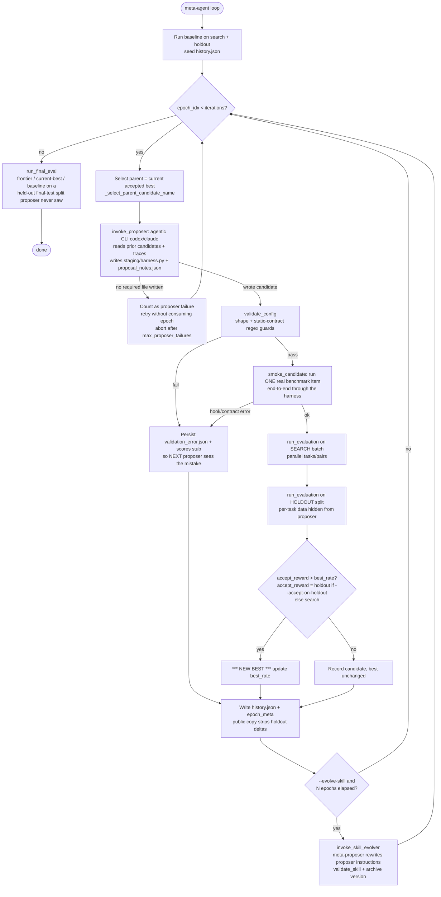
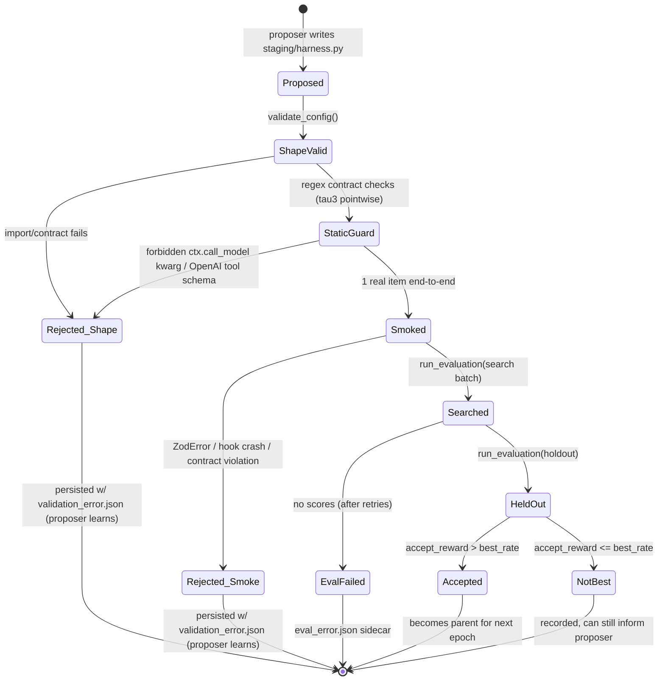

# meta-agent (canvas-org / Canvas Labs) — Findings

> Status: COMPLETE. Source: one assigned source, `meta-agent`.
> Inspected from tarball `https://codeload.github.com/canvas-org/meta-agent/tar.gz/refs/heads/main`
> (the proxy blocked `git clone` / `git ls-remote` with HTTP 407, so an exact commit SHA
> could not be retrieved; see §1). Local extract: `/agent/workspace/scratch/meta-agent/meta-agent-main`.
> Findings file path: `/agent/workspace/scaffold/research/findings/meta-agent.md`.

---

## 1. Identity

- **Name:** `meta-agent`.
- **What it is (verbatim tagline):** "Recursive self-improvement for agents, starting with the harness." / "an open-source framework for automatic harness optimization." (`README.md`)
- **Org / authors:** **Canvas Labs** ("an open-source project from **Canvas Labs**"), badged "Backed by Y Combinator" in the README. Repo namespace `canvas-org/meta-agent`.
- **License:** MIT (`LICENSE`).
- **Language / runtime:** Python 3.11+ (`pyproject.toml`, README badge).
- **Primary links:**
  - Repo: https://github.com/canvas-org/meta-agent (primary)
  - In-repo docs: `meta_agent/proposer_instructions/program_harness.md`, `meta_agent/cloud/MODAL.md`
- **Code repo + commit SHA inspected:** `github.com/canvas-org/meta-agent`, branch `main`.
  Files inside the tarball carry mtime `2025-05-14`. **Exact commit SHA: NOT VERIFIED** —
  the sandbox proxy refused `git clone` and `git ls-remote` (HTTP 407 CONNECT tunnel), and
  the GitHub codeload tarball does not embed a `.git` directory. The `master` branch tarball
  returned `404: Not Found`; only `main` exists. All `repo@SHA:path` references below should
  be read as `canvas-org/meta-agent@main(tar,~2025-05-14):path`.
- **Dates:** Live GitHub metadata (crawled 2026-06) reports **created 2026-04-06, last push
  2026-05-14**. The distributed tarball's file mtimes read `2025-05-14` — almost certainly a
  year-off tar normalization artifact of the real `2026-05-14` push (day/month match), so the
  project is a **2026** artifact. Model-name strings in defaults ("gpt-5.4", "Opus 4.6",
  "Haiku 4.5", "gpt-5.3-codex") are consistent with a 2026 date; treat them as configuration
  placeholders regardless.

---

## 2. TL;DR

- meta-agent is a **harness optimizer**: it treats an agent's *scaffold* — system prompt, tools,
  hooks, stop conditions, sub-agents, control flow — as the editable surface, and uses an LLM
  "proposer" to rewrite it from execution traces. **The model weights are frozen; only the harness
  changes.** This is exactly the HARNESS-ONLY self-improvement stance of our project.
- The loop is **propose → validate → smoke-test → evaluate on a search split → keep only if a
  held-out split improves → repeat**. Acceptance can be gated on **holdout** reward, and the
  per-task holdout data is deliberately **hidden** from the proposer (only the aggregate leaks),
  which is a concrete anti-overfitting / anti-reward-hacking mechanism.
- Headline result (author claim): on **tau-bench v3 airline**, a frozen Haiku 4.5 agent went from
  **67% → 87% holdout in 4–10 iterations**, with Opus as proposer — "No fine-tuning, no model
  changes, no benchmark changes."
- It is a **real, non-trivial engineering codebase** (CLI, resumable runs, Modal cloud fanout,
  multi-candidate epochs `k>1`, experience store, reproducibility manifests, transient-error retry),
  not a toy. The orchestration/verification plumbing is the high-value part for us.
- It supports two harness "targets": a **Codex/Claude-SDK agent harness** (the primary, agentic case)
  and a single-file **program harness** / **research harness** (simpler, fully-owned `run(ctx)` file).
  It also has an **optional "skill co-evolution"** mode where a meta-proposer rewrites the proposer's
  *own* instruction file every N epochs — a second, slower self-improvement layer.

---

## 3. What it does & how it works

meta-agent optimizes an **agent harness** against a benchmark, keeping the model frozen. The
unit of evolution is a *candidate harness*; the engine is an LLM **proposer** (an agentic
CLI — `codex` or `claude`) that reads prior candidates' code + execution traces and writes a
new candidate. Each candidate is shape-validated, smoke-tested, evaluated on a search split,
and (optionally) evaluated on a hidden holdout split; it is accepted as the new "best" only if
its reward improves. The loop repeats for a fixed number of iterations.

### Two layers of self-improvement

1. **Inner loop (per epoch):** propose harness → validate → smoke → evaluate(search) →
   evaluate(holdout) → keep-if-improves. (`meta_agent/loop/epoch.py::_run_one_epoch`.)
2. **Outer / meta loop (optional, every N epochs):** a *skill evolver* reads the proposer's
   own traces and rewrites the **proposer's instruction file** (the "skill") that tells it how
   to reason. Bounded to ≤3 edits/step, process-only, version-archived.
   (`meta_agent/loop/skill_evolver.py`.) This is a self-improvement-of-the-improver layer.

### The harness as "editable surface"

Two broad harness families (see `meta_agent/core/targets.py`):

- **File-based agent harnesses** (`codex`, `claude_code`): the harness *is* a set of files —
  `AGENTS.md` / `CLAUDE.md` (system instructions), `.codex/hooks.json` + `.codex/hooks/*.sh`
  (lifecycle hooks), `.codex/config.toml`, `.codex/skills/*.md`, `.codex/agents/*.md`
  (sub-agents). These map 1:1 to the **surface-lock** slots (`agents`, `hooks`, `config`,
  `skills`, `subagents`) so you can restrict the proposer to ablate one surface at a time.
- **Module harnesses** (`claude_agent_sdk`, `program_harness`, `research_single_file`,
  `harbor_agent`): the harness is a single `harness.py`. For `claude_agent_sdk` it exports
  `build_options(ctx) -> ClaudeAgentOptions`; for `program_harness` it exports
  `async def run(ctx)`. The proposer-editable levers for the SDK target are spelled out
  verbatim in `claude_agent_sdk.md` (see §4): `system_prompt`, `allowed_tools`/`disallowed_tools`,
  `mcp_servers` + custom MCP tools, `hooks` (`PreToolUse`/`PostToolUse`/`Stop`/`UserPromptSubmit`),
  `agents` (sub-agents), `permission_mode`, `max_turns`, `thinking`.

The key architectural invariant (`harness_contracts/claude_agent_sdk.py`): **the harness
describes the agent's *behavior*; the benchmark describes the *exit contract*.** The benchmark
adapter *composes on top of* the proposer's options — it injects its own MCP server
(`submit_verdict`), prepends a system-prompt prefix, appends terminal hooks, and sets a default
turn ceiling — and **benchmark-owned servers/hooks win** over proposer ones at the same key.
This prevents the proposer from disabling the scorer or removing the required submission tool.

### The core loop (Mermaid)



### Candidate lifecycle / verification gauntlet (Mermaid)



Notable mechanics worth calling out (all verified in code, cited in §4):

- **Resumability & cost-control:** runs are named, lock-filed, and resumable
  (`--resume`, `--resume-from-proposal`, proposal checkpoints in `_internal/`). Proposer
  subprocesses have a **stall timeout** (kill if no stdout for 600s) and a hard 3600s wall clock.
- **Multi-candidate epochs (`k>1`):** one proposer call can emit a *portfolio* of N candidates
  (e.g. "two champion mutations, two evidence-backed recombinations, one radical") written to
  `staging/<name>/harness.py`, evaluated in parallel via a `ThreadPoolExecutor`.
- **Transient-error resilience:** eval retries on a hardcoded allowlist of transient exception
  *class names* (Bedrock throttling, HTTP 5xx, connection resets) with exponential backoff.
- **Cloud scale:** Modal runner for long searches, with an isolated-Codex-proposer mode that
  mounts only the experience volume (`/work/experience`) so the proposer can't read source.

### Provenance: this is an implementation of the "Meta-Harness" paper

The code repeatedly and explicitly attributes its design to a specific academic paper it calls
"paper 1" / "Meta-Harness (Lee et al. 2026)". Verified citations in the source:

- `smoke_gate.py:3` — *"Meta-Harness (Lee et al. 2026) Algorithm 1 step 11 prescribes an
  `interface validation` step between proposer output and the expensive EVALUATE call. Appendix D
  spells this out concretely…"*
- `cli.py:105` & `epoch.py:890` — the `--accept-on-holdout` gate *"Matches paper 1's 'keep only
  if it improves holdout accuracy' policy"*.
- `codex_wrapper.py:3`, `proposer_session_log.py:4`, `proposer.py:779` — *"mirrors the Stanford
  meta-harness's `claude_wrapper.py`"*, *"Stanford Meta-Harness-style navigation layer"*,
  *"meta-harness pattern: small wrapper prompt, explicit artifact contract"*.
- `final_eval.py:22` — *"Match the Stanford text-classification reference default: baselines plus
  validation frontier are tested after search."*

The paper is **"Meta-Harness: End-to-End Optimization of Model Harnesses"** — Yoonho Lee,
Roshen Nair, Qizheng Zhang (Stanford), Kangwook Lee (KRAFTON), Omar Khattab (MIT), Chelsea Finn
(Stanford); arXiv 2603.28052; ref code `stanford-iris-lab/meta-harness` (~1019★). Its thesis:
LLM-system performance depends on the *harness* (the code that decides what to store/retrieve/
present to the model), and an **agentic coding-agent proposer with filesystem access to all
prior candidates' code + execution traces** can out-search hand-engineered harnesses and
compressed-feedback text optimizers — *"a single evaluation can produce up to 10,000,000 tokens
of diagnostic information."* It validates on online text classification, RAG math (200 IMO-level
problems, generalizes across 5 held-out models), and **agentic coding (TerminalBench-2, ranks #1
among Haiku 4.5 agents)**. So **`meta-agent` ≈ an independent OSS reimplementation + extension of
Meta-Harness by Canvas Labs**, hardened for production (resumability, Modal, holdout firewall,
smoke-gate, surface-locks, multi-candidate epochs, tau-bench/Plan-RewardBench adapters).

---

## 4. Evidence from the code

Files inspected (paths relative to repo root, `@main(tar,~2025-05-14)`):

| File | What it establishes |
| --- | --- |
| `README.md`, `LICENSE`, `pyproject.toml` | Identity, MIT/`Copyright (c) 2026 Canvas`, Canvas Labs/YC, deps (incl. `claude-agent-sdk`, `codex-app-server-sdk`, `boto3`, `tinker`). Console script `meta-agent`. |
| `meta_agent/loop/cli.py` | The full `meta-agent loop` flag surface + the outer driver `run(args)` (epoch loop, baseline, final eval, proposer-failure budget). |
| `meta_agent/loop/epoch.py` | `_run_one_epoch` (the core propose→validate→smoke→eval→holdout→record body), the holdout firewall (`_write_epoch_meta`, `_HOLDOUT_EPOCH_META_KEYS`), `_record_epoch_success` acceptance logic, transient-retry `run_evaluation`, `k>1` parallel evals. |
| `meta_agent/loop/proposer.py` | `invoke_proposer` (verbatim proposer prompts), `_run_proposer_cli` (codex/claude subprocess + stream-json + stall timeout), surface-lock enforcement via file-signature diffing, isolated-Codex-on-Modal mode. |
| `meta_agent/loop/validate.py` | Shape validation per target + the **static-contract regex guard** for tau3 pointwise harnesses (forbidden `ctx.call_model` kwargs, forbidden OpenAI tool schema, required scaffold tokens) + `validate_skill` size bound. |
| `meta_agent/loop/smoke_gate.py` | Runtime smoke gate — runs ONE real benchmark item end-to-end, rejects on hook/contract errors (`ZodError`, missing `record_score` tool, free-text instead of forced tool). Cites the paper's Algorithm 1 / Appendix D. |
| `meta_agent/loop/skill_evolver.py` | The meta-proposer that rewrites the proposer's own instruction file; `SKILL_EVOLVER_PROMPT_TEMPLATE` (verbatim below), ≤3 edits/step, version archive. |
| `meta_agent/loop/state.py` | `LoopState`, `_select_parent_candidate_name` (greedy best = parent), `_build_frontier` (Pareto reward×cost), `accept_reward_from_row`, the **dual public/internal `history.json` write** (holdout firewall), DataLoader-style `_pop_batch`, lockfile, reproducibility manifest (git SHA / versions / seed / argv). |
| `meta_agent/loop/final_eval.py` | Third-split "final-test" eval on baseline + Pareto frontier + current-best, *which the proposer never sees during search*. |
| `meta_agent/core/targets.py` | `AgentTarget` registry (codex / claude_agent_sdk / claude_code / program_harness / research_single_file / harbor_agent), surface-lock slot map, source-grep target detection. |
| `meta_agent/harness_contracts/claude_agent_sdk.py` | The "harness=behavior, benchmark=exit-contract" invariant; benchmark-composition helpers (`merge_mcp_server`, `append_hooks`, `prepend_system_prompt`, `set_default_max_turns`) where **benchmark-owned servers/hooks win** over proposer ones. |
| `meta_agent/harness_contracts/program.py` | `HarnessContext` — the safe `ctx` API given to a candidate (`call_model`, `run_command`, `log_event`, `finish`); explicitly *"must not expose labels or scorer internals."* |
| `meta_agent/core/experience.py` | The on-disk candidate layout + per-task artifact persistence (traces, judge feedback, screenshots), score aggregation, proposer-cost folding. |
| `meta_agent/proposer_instructions/{shared,claude_agent_sdk,codex,program_harness}.md` | The actual prompts/contracts the proposer reads (levers, anti-Goodhart rules, evidence contract). |
| `benchmarks/tau3/benchmark.yaml` + `proposer_context.md` | The headline benchmark: search=35 airline tasks, holdout=15 disjoint tasks; many experiment splits (judge-as-reward, pointwise-judge-reward, RL actor families). Anti-Goodhart contract. |

### Verbatim — the proposer prompt (claude path, k=1), `proposer.py:1059`

```text
You are in /repo. Read `<shared/target skill>.md` first, then follow its instructions.
<benchmark proposer_context hint> You are optimizing for the '<bench>' benchmark.
The experience store for this benchmark is at '<exp>/'. <navigation: meta-agent
list/show/failures/diff> Only inspect candidates in THIS benchmark's experience
store — do not list or read other benchmarks. Inspect source code and execution
traces across multiple prior candidates — including ones that regressed. Comparing
siblings is how you isolate confounded edits and avoid anchoring on a noisy champion.
Decide whether to start from scratch, copy-and-modify a prior candidate, or fuse
ideas from several. Then <write improved harness to staging>.
```

### Verbatim — the shared proposer contract, `proposer_instructions/shared.md`

```text
You improve an agent harness to maximize evaluation scores. You do not solve
tasks directly. You improve the harness so the same model produces better results.
...
## Shared Rules
- Diagnose low scores from traces and per-task results before writing code.
- Do not hardcode task-specific identifiers, split membership, or dataset-specific branches.
- Do not read or write any `_internal/` path.
- Do not change benchmark adapters, scorers, labels, split manifests, Modal runtime files,
  or hidden-holdout plumbing.
- Do not run `meta-agent eval` yourself. The outer loop evaluates your staged candidate...
- Keep changes interpretable. Larger edits are allowed when evidence supports them, but
  proposal notes must make the mechanism and risks clear.
```

### Verbatim — the Claude Agent SDK editable levers, `claude_agent_sdk.md`

```text
| Lever | What it controls |
| system_prompt | Role, priorities, rubric, bias controls. |
| allowed_tools / disallowed_tools | Which tools the agent can call. Extend required tools; do not exclude them. |
| mcp_servers + custom MCP tools | New capabilities via @tool(...) and create_sdk_mcp_server(...). |
| hooks | Lifecycle callbacks at PreToolUse, PostToolUse, Stop, UserPromptSubmit. |
| agents | Subagent definitions for narrow delegated roles. |
| permission_mode | Usually "bypassPermissions" for unattended eval runs. |
| max_turns | Turn budget per task. |
| thinking | Adaptive or fixed-budget extended thinking. |
...
Weak candidates are only prompt rephrasings. If the only diff from the parent is inside a
string literal, redesign around a structural lever.
```

### Verbatim — the skill-evolver (meta-proposer) prompt, `skill_evolver.py`

```text
You are improving the skill document ({skill_name}) that guides a harness optimization proposer.
...
Your job: analyze how the proposer actually behaved over the last {n_iters} iterations
({iter_names}), compare that to the outcomes (did pass rate improve?), and make targeted
edits to {skill_name} that correct bad patterns or reinforce good ones.
## What to look for
- REPEATED FAILURES ... → Add a warning or constraint ...
- MISSED SIGNALS ... → Add a process step reminding it.
- BUNDLED CHANGES ... → Strengthen the constraint with a concrete example ...
- SUCCESSFUL PATTERNS ... → Add a positive heuristic ...
- STAGNATION ... → Add guidance to try a fundamentally different lever.
## Rules
- Make TARGETED edits ... Do NOT rewrite it from scratch.
- Add at most 3 new observations or refinements per evolution step.
- Do NOT add task-specific guidance (no "for task X, try Y").
- Focus on PROCESS guidance ... not CONTENT guidance ...
- If the proposer is improving consistently, make minimal or no changes.
```

### Verbatim — the anti-Goodhart / anti-reward-hacking contract, `benchmarks/tau3/proposer_context.md`

```text
## Anti-Goodhart Rules
Do not add customer-facing text whose main purpose is to persuade the reward evaluator,
such as "I followed all policies" or "all constraints are satisfied."
Do not fabricate summaries of tool results. Do not claim a database change happened unless
the tool result confirms it.
Do not branch on `task_id`, split membership, known reservation IDs, known user IDs, hidden
scenarios, reward values, judge model names, or evaluator harness details.
Do not inspect or modify benchmark adapters, reward models, split manifests, official graders,
hidden holdout plumbing, or `_internal` files.
```

### Verbatim — the verifier's static-contract guard, `validate.py::_validate_tau3_pointwise_program_contract`

```python
forbidden_call = re.search(
    r"ctx\.call_model\s*\([^)]*\b(prompt|tools|tool_choice|output_mode|max_output_tokens)\s*=",
    source, flags=re.DOTALL,
)
if forbidden_call:
    return ("pointwise program harness must not pass "
            f"{forbidden_call.group(1)!r} directly to ctx.call_model; "
            "use system/messages/max_tokens/temperature/extra_body only")
if re.search(r"['\"]type['\"]\s*:\s*['\"]function['\"]", source):
    return ("pointwise program harness must not use OpenAI-style function tool schemas; "
            "use {'name': SCORE_TOOL_NAME, 'input_schema': {...}}")
required_snippets = [ ("extra_body=FORCED_SCORE_TOOL", ...), ("parse_tool_record", ...),
    ("model_raw=", ...), ("model_text=", ...) ]   # candidate rejected if any missing
```

### The holdout firewall (defense-in-depth), `state.py::write_history` + `epoch.py::_write_epoch_meta`

Three independent layers keep the proposer from seeing per-task holdout signal:
1. `write_history()` writes a **public** `history.json` (holdout fields stripped via
   `_strip_holdout_fields`) that the proposer may read, and a **full** `_internal/history.json`
   (orchestrator-only).
2. `_write_epoch_meta()` writes a public `epoch_meta.json` (drops `holdout_delta`,
   `holdout_is_winner`) and an internal one with everything.
3. Per-task holdout results live in a **separate namespaced experience dir**
   `experience/<run>__<holdout-bench>-<split>/` that the proposer's prompt never names.
   Only the *aggregate* holdout reward is exposed (in `candidate_index.json`) so the proposer can
   steer against train-overfitting without seeing which val items it got right.

---

## 5. What's genuinely smart

These are the load-bearing ideas, in rough order of value to a self-improving software agent.

1. **Harness-as-optimization-target with a clean behavior/exit-contract split.**
   The single sharpest idea: define the *editable surface* precisely (system prompt, tools,
   hooks, sub-agents, control flow, turn budget, thinking), and architecturally separate it from
   the *benchmark exit contract* (the scorer, the required `submit_verdict` tool, the turn ceiling).
   The benchmark *composes on top of* the candidate's options and **wins on conflicts**
   (`merge_mcp_server`, `append_hooks`, `prepend_system_prompt`). This means the proposer can
   rewrite almost anything *except* the parts that would let it cheat the verifier. This is the
   structural reason harness-only self-improvement can be safe.

2. **A graduated, cheap-first verification gauntlet.** Shape-validation (import + contract) →
   **static-source regex guards** (catch API drift / forbidden tool schemas without running) →
   **runtime smoke** (one real item, catch hook crashes for ~$0 instead of ~$25 on a full eval) →
   full search eval → holdout eval. The smoke gate's own docstring quantifies the motivation: a
   malformed hook "would throw on every pair … wasting ~$25 per broken candidate." Failure at any
   stage is **persisted as a candidate with `validation_error.json`** so the *next* proposer reads
   the mistake and learns — failures are training signal, not discarded.

3. **The holdout firewall is real engineering, not a comment.** Acceptance can be gated on a
   *held-out* split, and the per-task holdout signal is hidden behind three independent mechanisms
   (dual public/internal `history.json` + `epoch_meta.json`, plus a separately-named experience
   dir). Plus a **third "final-test" split** the proposer never touches during search. This is
   textbook ML hygiene (search/val/test) applied to *prompt/harness search*, and it is the
   concrete defense against the proposer overfitting or reward-hacking the evaluator.

4. **Explicit, multi-layer anti-Goodhart contract.** The tau3 `proposer_context.md` names the
   specific cheats to avoid ("Do not add customer-facing text whose main purpose is to persuade
   the reward evaluator"; "Do not claim a database change happened unless the tool result confirms
   it"; "Do not branch on task_id / split membership / judge model names"). This is paired with the
   *structural* guard (#1) and the *statistical* guard (#3) — three different defenses against the
   same failure mode.

5. **Two-level self-improvement.** The inner loop improves the harness; the outer **skill evolver**
   improves *the proposer's own instructions* from the proposer's own traces — bounded (≤3 edits,
   process-not-content, size-capped, version-archived, validated). This is a careful, conservative
   take on "the optimizer improves the optimizer," with guardrails against runaway self-rewrite.

6. **Trace-grounded, evidence-first proposing.** The proposer is forced to *diagnose before
   editing*: read `candidate_index.json`, inspect the champion harness + 1–2 regressions, read
   traces for 3–5 low-scoring tasks, then answer an **evidence contract** ("which traces? what
   recurring failure? what single hypothesis? why different from recent candidates?"). It is told
   to compare *siblings* to isolate confounded edits and avoid "anchoring on a noisy champion."

7. **Cost is a first-class, Pareto-tracked metric.** Every candidate folds in *both* eval cost and
   proposer cost (`total_cost_with_proposer_usd`); `frontier.json` is a Pareto frontier over
   (reward, cost). Self-improvement that ignores cost is not useful; this treats cost as a real axis.

8. **Production-grade long-horizon plumbing.** Named/lock-filed/resumable runs, proposal
   checkpoints, stall + wall-clock timeouts on the proposer subprocess, transient-error retry with
   backoff, seeded DataLoader batching, a per-epoch reproducibility manifest (git SHA, tool
   versions, seed, argv), and Modal fanout. This is the unglamorous machinery that makes an
   open-ended loop actually survive overnight.

9. **Surface-lock ablation.** `--surface-lock {agents,hooks,config,skills,subagents}` restricts the
   proposer to one surface and *verifies via file-signature diffing* that it changed only that
   surface (and actually changed it). A clean way to attribute which lever drives a gain.

---

## 6. Claims vs. reality / limitations / critiques

**(A) What the authors claim.** README: a frozen Haiku 4.5 agent on tau-bench v3 airline improves
**67% → 87% holdout in 4–10 iterations**, "No fine-tuning, no model changes, no benchmark changes"
(50 tasks, Opus 4.6 proposer). The underlying Meta-Harness paper claims SOTA-beating harnesses on
text classification (+7.7 pts at 4× fewer tokens vs ACE), RAG math (+4.7 pts on 200 IMO problems,
generalizing across 5 held-out models), and **#1 among Haiku 4.5 agents on TerminalBench-2**.

**(B) What the code actually demonstrates.** The *machinery* to produce that result is fully present
and credible: the tau3 benchmark has a real disjoint 35-task search / 15-task holdout split
(`benchmark.yaml`), the holdout firewall is implemented, the acceptance gate exists, and a reference
baseline harness (`harnesses/agents/tau3_airline`) is shipped. **What I could NOT verify from the
tarball:** the actual run logs / `history.json` / evolved champion harness behind the 67→87 number
are not in the repo (no `experience/` artifacts, no `WRITEUP.md`, `docs/internal/` is git-excluded).
So the *number* rests on author assertion + a reproducible recipe, not on in-repo evidence. The
67→87 is also a **single benchmark, single domain (airline), n=50 tasks** (15 in holdout) — small,
and the README itself only reports this one cell.

**(C) Maturity / signal caveats (honest read).**
- **Very early, effectively single-author.** Live GitHub metadata (crawled 2026-06): **59 stars, 6
  forks, 1 contributor** (`essamsleiman`; `LICENSE` says "Canvas", commits also reference Canvas
  Labs). Created 2026-04-06, last push 2026-05-14. This is a young research-grade OSS project, not a
  battle-tested framework.
- **No tests in the tarball.** `find` for `test_*`/`tests/` returns nothing (pyproject configures
  pytest but ships no test suite in the distributed tree). For a system whose whole pitch is
  "verifiable improvement," the absence of its *own* test suite is notable.
- **README/identity drift.** A cached web index showed an *earlier* README ("Automatic harness
  optimization … 67% → 87% on tau-bench with no labels. See WRITEUP.md", 46★, a `results_graph.png`).
  The current `main` (= my tarball) has a different, more conservative README and **no WRITEUP.md /
  images in the tree**. Treat marketing copy as in-flux.
- **Exact commit SHA unverified** (proxy blocked git; tarball carries no `.git`). I inspected
  `main` at tarball mtime 2025-05-14, which matches the live repo's "last push 2026-05-14" — i.e.
  this *is* current `main`, but I cannot pin the 40-char SHA.
- **"No weights" is true of the framework, but the repo is weight-curious.** `pyproject.toml`
  depends on `tinker` + `tinker-cookbook` (Thinking Machines' fine-tuning stack), and
  `benchmarks/tau3/benchmark.yaml` defines RL-style splits (`pointwise_judge_reward`,
  `judge_as_reward`, Qwen/Kimi/Haiku "stratified" actor families). The *headline* result is
  harness-only, and the Meta-Harness paper explicitly lists weight co-evolution as **future work** —
  but the scaffolding for RL experiments is present, so "we never train weights" is a property of
  *this result*, not an architectural impossibility in the codebase.

**(D) Failure modes I can see in the design itself.**
- **Greedy hill-climbing parent selection.** `_select_parent_candidate_name` always seeds from the
  single best-so-far candidate. There is a Pareto `frontier.json` and multi-candidate epochs, but
  the *evolutionary* aspect is weak: no population, no explicit diversity/novelty pressure beyond
  the `k>1` "portfolio" prompt nudge; the loop can plateau on a local optimum (the skill-evolver
  prompt even has a dedicated "STAGNATION → try a fundamentally different lever" branch, implicitly
  acknowledging this).
- **Small holdout → noisy gate.** With a 15-task holdout, a 1-task flip is ~6.7%; "new best" on
  holdout can be within noise. The code mitigates with `--accept-on-holdout` and final-test, but
  small-n acceptance gating is inherently noisy and could promote lucky candidates.
- **Reward-hacking is *mitigated, not eliminated.*** The three guards (structural / statistical /
  instructional) are strong, but the LLM judge reward paths (`judge_as_reward`,
  `pointwise_judge_reward`) are themselves harnesses being optimized in *other* runs — optimizing a
  judge harness to agree with labels, then using that judge as the actor's reward, risks
  co-adapted blind spots. The repo is aware (it keeps an official-grader "final-test" split out of
  the loop), but the closed-loop "Stage-3" experiments are exactly where Goodharting would surface.
- **Independent third-party critiques: none found.** I found no external blog/critique of
  `canvas-org/meta-agent` specifically (it is too new/small). Critiques of the *underlying approach*
  would attach to the Meta-Harness paper (out of scope for this source); the paper itself concedes
  its TerminalBench-2 result does search-and-eval **on the same 89 tasks** (no held-out split there),
  relying on "manual inspection and regex audits for task-specific string leakage" — a known soft
  spot of benchmark-specific harness search.

---

## 7. Relevance to a self-improving, evolutionary software-building agent

This source is **directly on-point** — it *is* a harness-only self-improving agent optimizer, and
its parent paper validates the approach on agentic coding (TerminalBench-2). Mechanism-by-mechanism:

- **"Propose → test → keep only if verifiably better" — fully realized.** The inner loop is exactly
  our stated loop, with a concrete, defensible definition of "verifiably better" (held-out reward,
  with the proposer firewalled from per-task holdout signal). If we want a principled acceptance
  gate, this is a reference implementation.
- **Harness-only self-improvement — this is the thesis.** The clean enumeration of editable surfaces
  (`claude_agent_sdk.md` lever table; the codex file-set: AGENTS.md / hooks / config / skills /
  sub-agents) is a ready-made taxonomy for *what* a self-improving software agent is allowed to
  rewrite about itself, and the behavior/exit-contract split shows *how to keep it from cheating*.
- **Verification & reward-hacking defense — high relevance.** The graduated gauntlet (shape →
  static-regex → smoke → eval → holdout → final-test) and the triple anti-Goodhart defense
  (structural composition, statistical firewall, instructional rules) are exactly the controls an
  open-ended, unlimited-token loop needs to avoid optimizing a broken or gamed objective.
- **Long-horizon reliability — high relevance.** Resumable named runs, proposal checkpoints, stall +
  wall-clock proposer timeouts, transient-retry, per-epoch reproducibility manifests, Modal detach.
  These are precisely the "run an agent reliably over long horizons" mechanisms in the relevance test.
- **Self-improvement-of-the-improver — relevant, with guardrails.** The skill-evolver is a concrete,
  conservative pattern for letting the system edit its *own* orchestration prompts from its own
  traces, bounded so it can't run away.
- **Decision-making / experience reuse — relevant.** The proposer's "read all prior candidates' code
  + traces via the filesystem, diagnose, form one hypothesis, compare siblings" workflow is a strong
  template for trace-grounded decision-making, and the Meta-Harness insight ("richer access to prior
  diagnostic experience" beats compressed scalar feedback; up to ~10M tokens/eval) is a memory-system
  design principle: *keep raw traces, let the agent selectively inspect them*, don't pre-summarize.
- **Where it's *less* helpful for us:** the **evolutionary search itself is thin** (greedy
  hill-climbing, no real population/novelty/lineage). If our project wants a genuinely *evolutionary*
  algorithm (archives, diversity, multi-parent recombination), meta-agent's loop is a baseline to
  improve on, not a finished design. (The `k>1` "portfolio" nudge and `frontier.json` are seeds, not
  a full evolutionary engine.)

---

## 8. Reusable assets (quoted/cited; collected as evidence, NOT assembled into a design)

> Provenance note: the prompts/contracts below are MIT-licensed (`repo@main:LICENSE`). Many
> reflect the Meta-Harness paper's method; cite both if reused.

1. **The acceptance gate + holdout-firewall pattern** — `state.py::write_history` (dual
   public/internal history), `epoch.py::_write_epoch_meta` (`_HOLDOUT_EPOCH_META_KEYS`), namespaced
   holdout dir, and `final_eval.py` (third split). A complete, copyable recipe for "keep only if a
   *hidden* held-out metric improves."

2. **The graduated verifier** — `validate.py` (shape + static-regex contract guard) +
   `smoke_gate.py` (one-item runtime gate that rejects on `ZodError`/hook crash/contract violation)
   + the "persist failures as candidates with `validation_error.json` so the next proposer learns"
   convention (`epoch.py::_run_one_epoch`). Quotable regex guard reproduced verbatim in §4.

3. **The proposer contract prompts (verbatim, §4):** `shared.md` (Shared Rules + Workflow +
   `proposal_notes.json` schema), `claude_agent_sdk.md` (lever table + "weak candidates are only
   prompt rephrasings"), `codex.md` (the **Evidence contract**: which traces / what failure / what
   single hypothesis / why different), `program_harness.md` + tau3 `proposer_context.md` (the
   **Anti-Goodhart Rules**). These are directly adaptable system prompts for a self-improving
   software agent's "proposer" role.

4. **`proposal_notes.json` schema** (forces falsifiable hypotheses):
   ```json
   { "hypothesis": "...", "lever": "...", "inspected_tasks": ["..."],
     "rationale": "...", "risks": "..." }
   ```
   and the richer tau3 variant adding `mechanism`, `control_moved_to_code`, `expected_gains`,
   `expected_regressions`, `anti_goodhart_check`.

5. **The skill-evolver prompt + policy** (verbatim, §4) — a template for "rewrite the optimizer's
   own instructions from its traces," with the crucial guardrails (≤3 edits/step, process-not-
   content, size-cap via `validate_skill`, version archive in `experience/skills/`).

6. **The candidate experience-store schema** — `core/experience.py` + `shared.md` layout:
   `candidates/<name>/{harness.py, scores.json, summary.md, category_scores.json,
   proposal_notes.json, per_task/{task}.json, {task}_trace.jsonl, {task}_events.jsonl,
   {task}_agent_result.json, {task}_judge_feedback.md}` plus run-root `candidate_index.json`
   (proposer-visible leaderboard: names, paths, search rewards, *aggregate* holdout, pass rates,
   cost, current best) and `frontier.json` (Pareto reward×cost). A ready schema for candidate/
   experiment representation and a memory layout that keeps raw traces inspectable.

7. **The harness/benchmark composition helpers** — `harness_contracts/claude_agent_sdk.py`
   (`merge_mcp_server`, `append_hooks`, `prepend_system_prompt`, `set_default_max_turns`,
   `extend_allowed_tools`) showing how to let an agent self-edit while a host injects
   non-negotiable, conflict-winning constraints (the verifier-protection pattern).

8. **The `AgentTarget` registry + surface-lock map** — `core/targets.py`: a clean enumeration of
   self-editable surfaces per agent type and an ablation lever (`--surface-lock`) with
   file-signature-diff verification.

9. **Operational control loop** — `loop/cli.py` (`run(args)`): proposer-failure budget that does
   *not* consume an epoch; `loop/proposer.py` (`_run_proposer_cli`): stall-timeout + wall-clock kill
   of a streaming agent subprocess while preserving partial on-disk work. Practical patterns for
   running an agent reliably over long horizons.

10. **Reproducibility manifest** — `state.py::_build_reproducibility_manifest`: captures git SHA,
    python/codex/claude versions, seed, batch size, and full CLI argv per epoch. A copyable schema
    for making an open-ended loop auditable.

---

## 9. Signal assessment

- **Overall value: HIGH (with maturity caveats).** This is one of the most *directly relevant*
  sources possible for the project: a working, readable, harness-only, propose→verify→keep
  self-improvement loop, with serious verification and anti-reward-hacking engineering, and a
  validated academic pedigree (Meta-Harness) that includes agentic *coding*. The value is less in
  any single number and more in the **mechanism design**: the verification gauntlet, the holdout
  firewall, the editable-surface taxonomy, the proposer/skill-evolver prompts, and the long-horizon
  plumbing are all reusable reference patterns.
- **Confidence: HIGH on mechanism** (read directly from source, quoted verbatim). **MEDIUM on
  results** (the 67→87 figure is author-asserted with a reproducible recipe but no in-repo run
  artifacts). **HIGH on provenance** (the code itself cites the Meta-Harness paper repeatedly;
  authorship/dates confirmed via live GitHub + LICENSE + the YC listing for Canvas).
- **What I could NOT verify:**
  1. Exact commit SHA (proxy blocked git/ls-remote; tarball has no `.git`).
  2. The actual 67→87 run logs, evolved champion harness, or `WRITEUP.md`/`results_graph.png`
     (not in the distributed tree; `docs/internal/` is git-excluded).
  3. Any results beyond the single tau3-airline cell, or any TerminalBench-2 reproduction in *this*
     repo (that result lives in the Meta-Harness artifact repo, a different source).
  4. Whether the closed-loop judge-as-reward experiments (Stage-2/3) hold up against Goodharting —
     the infrastructure exists but no results are shipped.
  5. The full Exa keyword search payload (259 KB) was only partially parsed (I extracted the 8 top
     results' titles/URLs/snippets); I did not read every byte of that auxiliary search dump.

---

## 10. References

**Primary — the code (this source):**
- `canvas-org/meta-agent` @ `main` (inspected via codeload tarball, file mtime 2025-05-14; exact
  SHA unverified). Repo: https://github.com/canvas-org/meta-agent — live metadata at crawl:
  59★/6 forks/1 contributor (`essamsleiman`), created 2026-04-06, last push 2026-05-14, MIT.
- Key files (all `repo@main:<path>`): `README.md`, `LICENSE`, `pyproject.toml`,
  `meta_agent/loop/{cli,epoch,proposer,validate,smoke_gate,skill_evolver,state,final_eval}.py`,
  `meta_agent/core/{targets,experience}.py`,
  `meta_agent/harness_contracts/{claude_agent_sdk,program,research}.py`,
  `meta_agent/proposer_instructions/{shared,claude_agent_sdk,codex,program_harness,research_single_file}.md`,
  `meta_agent/cloud/MODAL.md`, `benchmarks/tau3/{benchmark.yaml,proposer_context.md}`,
  `harnesses/starter/program_harness/harness.py`.

**Primary — the underlying paper (the design this code implements; cited *by* the code):**
- Yoonho Lee, Roshen Nair, Qizheng Zhang, Kangwook Lee, Omar Khattab, Chelsea Finn.
  **"Meta-Harness: End-to-End Optimization of Model Harnesses."** Preprint, 2026.
  - PDF: https://yoonholee.com/meta-harness/paper.pdf — arXiv: https://arxiv.org/pdf/2603.28052
  - Project page (interactive demo): https://yoonholee.com/meta-harness/
  - Reference code: https://github.com/stanford-iris-lab/meta-harness (~1019★)
  - TerminalBench-2 optimized-harness artifact: https://github.com/stanford-iris-lab/meta-harness-tbench2-artifact
  - In-code attributions: `smoke_gate.py:3-28` ("Lee et al. 2026 Algorithm 1 step 11 … Appendix D"),
    `cli.py:105` & `epoch.py:890` ("paper 1's 'keep only if it improves holdout accuracy'"),
    `final_eval.py:22`, `codex_wrapper.py:3`, `proposer_session_log.py:4`, `proposer.py:779`.

**Secondary — org / provenance:**
- Canvas Labs (YC F24) — "Founding Software Engineer" listing describing Canvas AI as a YC-backed
  "AI Operating System for B2B Sales": https://jobsearcher.com/jobs/f0f561d8f94c7861432120d73090f32ba8394d5d26a9ed456b9c5eccc0c6e52d
  (used only to confirm org identity / YC backing / dates; meta-agent is Canvas's open-source side project).

**Related (NOT this source; surfaced during search, listed for context only — do not conflate):**
- `stanford-iris-lab/meta-harness` (the paper's own code — a distinct potential source).
- `facebookresearch/HyperAgents`, `context-labs/HALO`, `abhid1234/meta-agent-improver` — other
  self-improving/agent-loop-optimizer repos that appeared in the same search; not investigated here.
