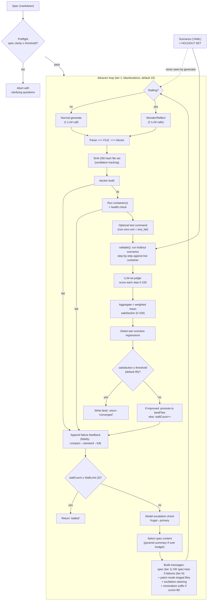
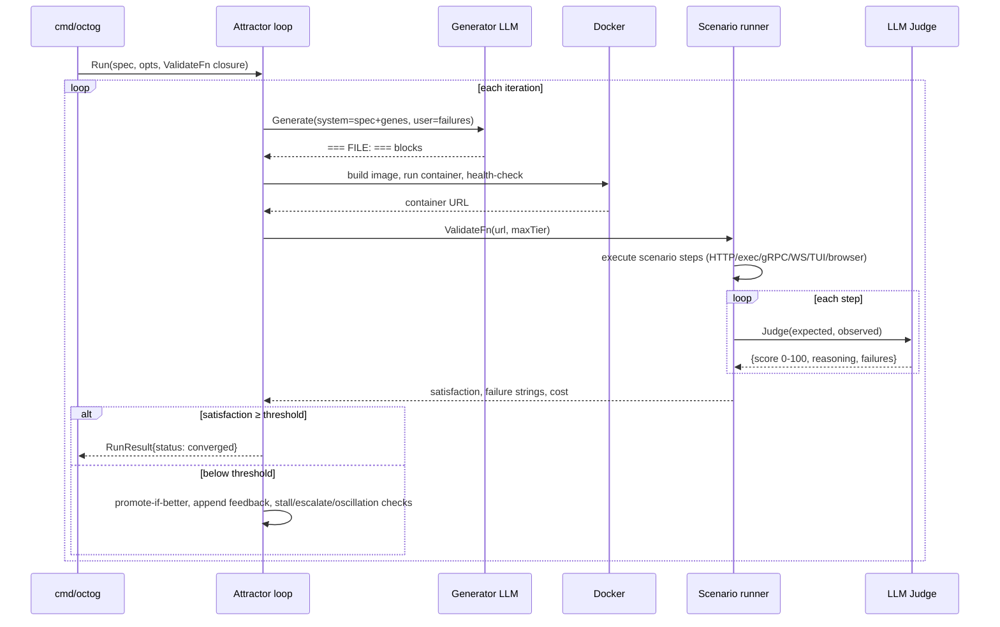

# octopusgarden (foundatron) + Simon Willison on "the software factory"

> Research findings for the KB Seed AI project. One source, two related artifacts:
> (a) **octopusgarden** — an open-source Go "software dark factory" by foundatron, and
> (b) **Simon Willison's 2026-02-07 post**, which actually describes **StrongDM's** software
> factory (Attractor + cxdb + Digital Twin Universe). octopusgarden is an open-source
> implementation of the pattern Willison describes; StrongDM is the prior art both cite.

---

## 1. Identity

**Artifact A — octopusgarden**
- **Name:** OctopusGarden (binary: `octog`). Module: `github.com/foundatron/octopusgarden`.
- **What it is:** An open-source "autonomous software development system" / "software dark
  factory." You write a **spec** (markdown) + **scenarios** (YAML holdout tests); it
  orchestrates LLM coding agents that generate → build (Docker) → validate (holdout scenarios,
  LLM-as-judge satisfaction score) → feed failures back → iterate until satisfaction crosses a
  threshold (default 95%), with **zero human code review**.
- **Author/org:** **foundatron** (Ryan Small, ryan@foundatron.com). Substantially co-written by
  Claude (commits carry `Co-authored-by: Claude Sonnet 4.6`).
- **Language/stack:** Go 1.24+; Anthropic + OpenAI/Ollama backends; Docker; SQLite (pure-Go);
  OpenTelemetry. ~17.9k lines non-test Go, ~45.4k incl. tests; 69 `_test.go` files. MIT license.
- **Primary links:** repo `https://github.com/foundatron/octopusgarden`.
- **Commit inspected:** `1414be0be9b9dfd1af80cd1a80f056255b91695c` (main, 2026-03-18,
  commit "refactor: small cleanups … (#309)"). Tarball of `refs/heads/main` (git clone blocked
  by sandbox proxy 407; codeload tarball succeeded). 309 PRs deep — actively developed.

**Artifact B — Simon Willison's post (2026-02-07)**
- **Title:** "How StrongDM's AI team build serious software without even looking at the code"
  (URL slug `/software-factory/`).
- **What it is:** Willison's analysis of **StrongDM's** publicly-shared "Software Factory" /
  "Dark Factory" practice — *not* his own system. He summarizes StrongDM's writeup and reacts to
  it. The post is the canonical popular explainer of the pattern octopusgarden implements.
- **Author:** Simon Willison. **Subject:** StrongDM AI team (Justin McCarthy, Jay Taylor, Navan
  Chauhan), founded July 2025.
- **Primary link:** `https://simonwillison.net/2026/Feb/7/software-factory/`.
- **Relation:** octopusgarden's README explicitly lists StrongDM's factory, Dan Shapiro's "Five
  Levels," Willison's post, and `Ouroboros` as prior art. octopusgarden = a from-scratch OSS
  re-implementation of the StrongDM pattern that Willison popularized.

**Relevance to the KB Seed AI project: HIGH.** This is the closest public match to the project's
own framing ("give a high-level goal → agent autonomously builds software via propose→test→keep
loop"). It is a *whole-lifecycle software factory* with a real, readable verification mechanism.

---

## 2. TL;DR

- **octopusgarden is a working, single-path "evolutionary-ish" code factory**: an *attractor
  loop* repeatedly regenerates a whole program from a spec, builds it in Docker, runs holdout
  scenarios through an **LLM-as-judge** that returns a probabilistic *satisfaction* score
  (0–100), and feeds failures back until satisfaction ≥ threshold. No human reviews code.
- **The single load-bearing idea is the holdout set**: the code-generating agent *never sees the
  scenarios*. This is enforced as a hard architectural invariant (the `attractor` package is
  forbidden from importing `scenario`). It is the project's answer to "if the agent writes both
  code and tests, how do you stop it cheating with `assert true`?" — the StrongDM question
  Willison foregrounds.
- **It is iterative refinement, not population search.** There is no population of candidates, no
  crossover, no selection across a gene pool. It keeps one "best files" set and regenerates.
  "Gene Transfusion" sounds evolutionary but is just one-shot pattern extraction from an exemplar
  repo into the prompt. So it is *closer to hill-climbing with an LLM judge* than to AlphaEvolve/
  DGM-style evolution. Honest signal: strong on **verification + orchestration + long-horizon
  control**, weak on **open-ended search / self-modification**.
- **Many small, reusable control mechanisms are genuinely good and directly transplantable:**
  probabilistic LLM-judge scoring, oscillation detection (SHA-256 A-B-A-B), wonder/reflect stall
  recovery (hi-temp diagnose → lo-temp fix), cost-aware model escalation (frugal↔primary),
  feedback-fidelity tiers, stratified-by-difficulty validation, regression tracking, preflight
  spec/scenario quality gating, pyramid spec summaries, file triage to control token cost.
- **Willison's post adds the conceptual frame and one sharp idea we should not miss:** the
  *Digital Twin Universe* (agent-built behavioral clones of third-party SaaS APIs so you can run
  thousands of scenario tests/hour with no rate limits or cost) — octopusgarden does **not**
  implement this, but it's a strong reusable concept for long-horizon verifiable agents.
- **Caveats:** no head-to-head benchmark, no published reproducibility data, judge variance is
  explicitly "uncharacterized," cost is high ("$1,000/engineer/day on tokens" per StrongDM), and
  the whole approach assumes the LLM is good enough to one-shot whole small programs.

---

## 3. What it does & how it works

OctopusGarden is a CLI (`octog`) that turns a **spec** (markdown) + a directory of **scenarios**
(YAML) into a built, verified application — without a human ever reading the generated code. The
binary has subcommands `interview` (draft a spec conversationally), `extract` (extract "genes"
from an exemplar repo), `preflight`/`lint` (quality-gate spec & scenarios), `run` (the factory),
`validate` (run scenarios against an already-running service), `status`, `models`, `configure`.

The central engine is the **attractor loop** in `internal/attractor/attractor.go`. It is a
*single-path iterative-refinement* loop (not a population search), structured as:



**Crucial details that define the system's behavior:**

1. **Holdout isolation is a hard architectural invariant, not just a convention.** The `attractor`
   package *never* imports `internal/scenario`. The generator only ever receives: the spec string,
   and textual *failure feedback* (scenario IDs, scores, and observed-vs-expected descriptions).
   It never sees the scenario YAML or the `expect:` strings directly. This is enforced by an actual
   test, `internal/attractor/isolation_test.go`, which scans the import graph and fails the build
   if `attractor` ever depends on `scenario`. This is the project's structural answer to the
   StrongDM/Willison question: *if the agent writes both code and tests, how do you stop it
   gaming the tests?* — Answer: the agent doesn't write the tests, and can't see them.

2. **"Satisfaction" is a probabilistic LLM-judged score, not boolean pass/fail.** Each scenario is
   a sequence of steps run against the live container; each step's *observed behavior* is scored
   0–100 by an LLM judge against the step's natural-language `expect:`. Per-scenario score = mean
   of step scores; overall satisfaction = weighted mean across scenarios. Convergence = overall
   ≥ threshold (default **95**, not 100). This deliberately tolerates minor deviations and
   gives a smooth gradient for the loop to climb.

3. **The loop keeps exactly one "best" candidate** (`bestFiles` / `bestSatisfaction`) and
   regenerates from scratch (or patches) each iteration. There is no population, no crossover, no
   archive of diverse solutions. A new iteration is *promoted to best only if it strictly
   improves* satisfaction; otherwise `stallCount` increments. This is hill-climbing with an LLM
   proposal distribution, guided by failure feedback. (Contrast: AlphaEvolve/DGM keep populations
   and select among many lineages — octopusgarden does not.)

4. **Two generation modes.** Default ("file-format") = a single `Generate` call; the LLM emits the
   whole program as `=== FILE: path === … === END FILE ===` blocks, parsed by `fileparse.go`.
   `--agentic` = an `AgentLoop` with `write_file`/`read_file`/`list_files` tools (Anthropic only),
   letting the model iterate within one turn budget (default 50 turns). Wonder/reflect is *skipped*
   in agentic mode because the tool loop already self-corrects.

5. **`--patch` mode** carries forward the previous best file set. Before sending it back, an LLM
   **triage** step (`triage.go`) narrows the file set to only failure-relevant files plus entry
   points (Dockerfile, main.go, …), to control token cost. New output is merged over the carried
   files.

The orchestration around the loop (container/build/validate wiring) is owned by `cmd/octog`, which
constructs the `ValidateFn` closure and hands it to the attractor — preserving the isolation
boundary. The control/feedback flow looks like this:




## 4. Evidence from the code

**Repo snapshot:** `foundatron/octopusgarden@1414be0be9b9dfd1af80cd1a80f056255b91695c` (main,
2026-03-18). ~17.9k non-test Go lines, 69 test files. The architecture doc (`docs/architecture.md`,
1364 lines) is explicitly written "for AI agents" and is unusually faithful to the code.

### 4.1 Files / modules inspected (paths)
- `internal/attractor/attractor.go` (1757 lines) — the loop, `runState`, generation paths,
  container wiring, convergence/promotion logic, composed convergence.
- `internal/attractor/prompts.go` (891 lines) — system prompt builder, feedback fidelity tiers,
  steering/minimalism suffixes, build-log noise stripping.
- `internal/attractor/diagnosis.go` (126 lines) — wonder/reflect prompts + `Diagnosis` struct.
- `internal/attractor/escalation.go` (106 lines) — frugal↔primary model tier state machine.
- `internal/attractor/oscillation.go` (47 lines) — SHA-256 file-set hashing + A-B-A-B detection.
- `internal/attractor/tools.go` (202 lines) — agentic `write_file`/`read_file`/`list_files` tools.
- `internal/scenario/judge.go` (164 lines) — the LLM-as-judge verifier + aggregation.
- `internal/scenario/types.go` — the `Scenario`/`Step` data model (HTTP/exec/browser/gRPC/WS/TUI).
- `internal/llm/prompt.go` — the judge system/user prompts.
- `internal/attractor/isolation_test.go` — enforces the holdout boundary in CI.
- `examples/hello-api/{spec.md,scenarios/*.yaml}` — concrete spec + holdout scenarios.

### 4.2 The verifier (the most load-bearing piece) — verbatim

The judge prompt (`internal/llm/prompt.go`, quoted in `docs/architecture.md`):

```text
[SatisfactionJudgeSystem]
You are a QA evaluator. Score how well this software behavior matches the expected behavior.

Respond with JSON only:
{"score": <0-100>, "reasoning": "<brief explanation>", "failures": ["<specific failure>"]}

Scoring guide:
- 100: Perfect match to expected behavior
- 80-99: Works correctly with minor deviations
- 50-79: Partially correct
- 1-49: Mostly broken but shows some correct behavior
- 0: Complete failure or error
```
```text
[SatisfactionJudgeUser]
Scenario: {scenario_description}
Step: {step_description}

Expected behavior: {expected}

Actual observed behavior:
{observed}
```

The scoring/aggregation logic (`internal/scenario/judge.go`): execution failures score 0 *without*
an LLM call (cost optimization); otherwise each step is judged independently. Per-scenario score =
arithmetic mean of step scores; overall = weight-weighted mean (`Aggregate()`). Note this means a
scenario passes "partially" — there is no all-or-nothing gate at the scenario level either.

```go
// ScoreScenario: per-step, with exec failures shortcut to 0
if stepResult.Err != nil {
    score = StepScore{Score: 0, Reasoning: fmt.Sprintf("step execution failed: %v", stepResult.Err)}
} else {
    score, err = j.Score(ctx, scenario, step, stepResult.Observed)
}
// ...
avg = totalScore / float64(len(scored))   // per-scenario = mean of step scores
// Aggregate(): satisfaction = weightedSum / totalWeight  // overall = weighted mean
```

### 4.3 The generator system prompt — verbatim (`internal/attractor/prompts.go`)

```text
You are a code generation agent. Your task is to generate a complete, working application based on the following specification.

SPECIFICATION:
<spec content, cached via cache_control: ephemeral>
```
followed (conditionally) by the gene section:
```text
PROVEN PATTERNS (extracted from a working exemplar — synthesize equivalent behavior
adapted to the specification above. Preserve the structural approach and invariants.
The SPECIFICATION always takes precedence over these patterns on any conflict):
```
then capability-specific INSTRUCTIONS (e.g. for plain HTTP):
```text
- Generate ALL files needed for a working application
- Include a Dockerfile that builds and runs the application on port 8080
- Output each file in this exact format:

=== FILE: path/to/file ===
file content here
=== END FILE ===
- Generate ONLY the file blocks, minimize explanatory text
```
and generic dependency rules:
```text
DEPENDENCY RULES:
- ALWAYS prefer standard library over third-party dependencies
- NEVER generate lock files or checksum files (go.sum, package-lock.json, yarn.lock, Cargo.lock, etc.) — you cannot compute valid hashes; the build will fail
- Let the package manager resolve and verify dependencies at build time
```

The **iteration feedback** message (`buildMessages`) when there is history:
```text
The previous attempt did not fully satisfy the specification. Here is the feedback:

<optional STALL NOTICE steering>
VALIDATION FAILURES (iteration N):
Satisfaction score: 72.0/100
Scenario results:
✗ crud (60/100)
  ✗ Delete the item  Observed: <truncated>
...

Please generate a corrected version of the application. Output ALL files using the === FILE: path === format.
```

### 4.4 Wonder/Reflect (stall recovery) — verbatim (`internal/attractor/diagnosis.go`)

Two-phase. **Wonder** (judge model, temp **0.8**) is asked to *diagnose*:
```text
You are a debugging expert. Analyze why the following code generation attempts are failing.

SCORE HISTORY:
  Iteration 1: 60.0/100
  ...
OSCILLATION DETECTED: The generator is alternating between two implementations without progress. ...
RECENT FAILURES:
<last 3 feedback entries, full fidelity>
BEST GENERATED CODE SO FAR:
=== FILE: ... ===  (each file truncated to 4096 bytes)

Respond with a JSON object containing your diagnosis:
{ "hypotheses": [...], "root_causes": [...], "suggested_approach": "<concrete description of a fundamentally different implementation approach to try>" }

The suggested_approach must be specific and actionable — describe the new architecture or algorithm to use, not just "try something different".
```
**Reflect** (primary model, temp **0.4**) consumes that diagnosis and regenerates the whole app:
```text
Based on the following diagnosis of why previous attempts failed, generate a new implementation.

DIAGNOSIS:
Hypotheses: ...
Root causes: ...
Suggested approach: <from wonder>

[optional] MINIMALISM REQUIREMENT: The current solution is already scoring above 80%. Implement the SMALLEST possible change ... Do not refactor working parts.

Generate the complete corrected application. Output ALL files using the === FILE: path === format.
```
If either phase errors (non-cancellation), it falls back to normal generation. Only
`suggested_approach` is required from the diagnosis JSON.

### 4.5 Oscillation detection — verbatim (`internal/attractor/oscillation.go`)

```go
func hashFiles(files map[string]string) string { /* sorted paths, sha256(path \x00 content \x01 ...) */ }

func detectOscillation(hashes []string) bool {
    n := len(hashes)
    if n < 4 { return false }
    return hashes[n-1] == hashes[n-3] && hashes[n-2] == hashes[n-4]  // A→B→A→B (or A==A==A==A)
}
```
When detected, `oscillationSteeringText` ("…you are stuck in a local loop … try a fundamentally
different approach … Do NOT revert to a previous implementation") is appended to the next prompt
and fed into the wonder phase.

### 4.6 Cost-aware model escalation — verbatim (`internal/attractor/escalation.go`)

A 2-tier state machine: start at `tierFrugal` (`--frugal-model`); **escalate** to `tierPrimary`
(`--model`) after `escalateAfterFailures = 2` consecutive non-improving iterations; **downgrade**
after `downgradeAfterImprovements = 5` consecutive improving iterations. "Improved" = strictly beat
prior best satisfaction. (With default `StallLimit=3`, escalation buys exactly one extra attempt at
the strong model before the run is declared stalled — documented as intentional.)

### 4.7 Holdout isolation, enforced in CI — `internal/attractor/isolation_test.go`

```go
if strings.Contains(line, "internal/scenario") {
    t.Fatalf("attractor package must not depend on internal/scenario, found dependency: %s", line)
}
```
The generator literally cannot be compiled with access to scenario internals. The CLI passes a
`ValidateFn` closure (`func(ctx, url, restart, maxTier) (satisfaction, failures, cost, err)`).

### 4.8 Core data structures

- `RunOptions` (config: Model, FrugalModel, JudgeModel, Threshold=95, MaxIterations=10,
  StallLimit=3, BudgetUSD, PatchMode, BlockOnRegression, ContextBudget, Genes, Agentic, Stratified,
  GeneComponents, ComponentValidators).
- `runState` (mutable loop state: `bestFiles map[string]string`, `bestSatisfaction`, `stallCount`,
  `history []iterationFeedback`, `scoreHistory []float64`, `codeHashes []string`, `escalation`,
  `scenarioScores`, `activeTier`).
- `Scenario`/`Step` (YAML): a `Step` is exactly one of `request|exec|browser|grpc|ws|tui`, plus
  `expect` (natural language, judged) and `capture` (variable extraction via dot-notation
  JSONPath). `Setup` steps are fatal; judged steps are non-fatal. `Weight`, `Component` (composed
  convergence), `Tier` (1-3 difficulty, auto-inferred).
- `Gene` (extracted patterns JSON): `{Guide string, Components []Component}` where a `Component`
  has `{Name, Interface, Patterns, DependsOn []string}`.
- SQLite `runs`/`iterations` tables persist run history and per-iteration token/cost/failures.

A concrete holdout scenario (`examples/hello-api/scenarios/crud.yaml`) shows the model: a `setup`
POST captures `item_id` via `jsonpath: $.id`, then steps GET/PUT/GET/DELETE/GET assert outcomes via
natural-language `expect:` strings the judge scores — e.g. `expect: "Status 204. Response body
should be empty or absent."`

## 5. What's genuinely smart

This section is the heart. The individual ideas matter more than the whole.

1. **Holdout scenarios as the anti-reward-hacking mechanism, enforced structurally.** The single
   most important idea. Because the generator can write tests that cheat, octopusgarden simply
   *doesn't let it write or see the tests*. The verifier is a separate, sealed artifact. The
   architectural enforcement (a build-breaking import test) is what turns a "good intention" into
   a guarantee. For any propose→verify→keep system, *the verifier must be outside the proposer's
   reach* — this is the cleanest expression of that principle I've seen in OSS.

2. **Probabilistic "satisfaction" instead of boolean green/red.** Scoring each step 0–100 via an
   LLM judge against a natural-language expectation does two things: (a) it gives the loop a
   *gradient* to climb (72 → 84 → 93) rather than a flat fail signal, and (b) it lets the holdout
   be written in plain English ("returns the item with a valid ID") rather than brittle exact
   assertions. The default threshold of **95, not 100**, is a deliberate acknowledgment that LLM
   judging is noisy and that "perfect" is the wrong bar. This is the same move StrongDM describes
   ("fraction of trajectories that likely satisfy the user").

3. **Wonder/Reflect: temperature-split diagnosis vs. generation.** When stuck, *diagnose* at high
   temperature (0.8, diverse hypotheses) using the cheaper/judge model, then *generate* at low
   temperature (0.4, focused) using the strong model, conditioned on the diagnosis. Separating
   "figure out what's wrong" from "write the fix," with different temperatures and even different
   models, is a genuinely good pattern for escaping local minima — and it's cheap to copy.

4. **Oscillation detection via content hashing.** Hashing the file set each iteration and detecting
   A→B→A→B is a simple, robust signal that the agent is thrashing between two solutions — a
   failure mode that pure score-trend analysis misses (scores can look "stable" while the code
   flip-flops). When detected, it injects explicit "don't revert, build forward" steering.

5. **Cost-aware model escalation with hysteresis.** Start cheap, escalate to the strong model only
   when progress stalls, downgrade after sustained improvement. The asymmetry (escalate after 2,
   downgrade after 5) is sensible hysteresis. This is exactly the "spend tokens where they matter"
   discipline a long-horizon, budget-bounded agent needs.

6. **Feedback fidelity tiers.** Early iterations get *compact* feedback (4 KB, scenario summaries
   only); later/stalling iterations get *standard* (12 KB) then *full* (24 KB, all step detail).
   Plus build-log noise stripping (`stripBuildNoise` removes apt/apk/pip chatter but always keeps
   the last 50 lines where errors cluster). This is thoughtful context-budget management: don't
   pay for verbose feedback until you need the signal.

7. **File triage in patch mode.** Before re-sending the whole codebase, an LLM picks only the
   files relevant to current failures (+ always-include entry points). Skips triage when ≤5 files
   or no failures. Directly attacks the token-cost problem of full-program regeneration.

8. **Pyramid spec summaries with failure-aware expansion.** For large specs, `spec/summary.go`
   builds multi-level summaries (full → section summaries → outline → abstract → truncated) and
   `SelectContent` picks the richest representation that fits the budget, *expanding the sections
   most relevant to current failures*. (Willison's post independently calls out StrongDM's
   "Pyramid Summaries" by the same name — octopusgarden built one.)

9. **Stratified-by-difficulty validation.** `--stratified` validates tier 1 scenarios first,
   converges them, then admits tier 2, then tier 3 — so easy scenarios can't mask hard failures
   and the agent isn't overwhelmed by every failure at once. Tier is auto-inferred from step
   complexity. A nice curriculum-style decomposition of a hard verification target.

10. **Preflight quality-gating of the spec AND the scenarios.** Before burning tokens on the loop,
    an LLM scores spec clarity (goal/constraint/success) and scenario quality
    (coverage/feasibility/isolation/chains), aborting with clarifying questions if too low. The
    "two-implementer test" and "recreatability test" used by the interview scorer are good,
    concrete rubrics for "is this spec precise enough to build from?"

11. **Capability-driven container topology.** The system inspects which step types the scenarios
    use (HTTP/exec/gRPC/WS/TUI/browser) and provisions the right container shape (session container
    for exec/TUI via `docker exec`, multi-port for gRPC with reflection, health-checked HTTP). The
    verification harness adapts to the artifact type — not hard-coded to web APIs.

12. **The whole thing is observable and resumable-by-record.** Every LLM call logs tokens + cost;
    runs and iterations persist to SQLite; OpenTelemetry spans wrap LLM/container/loop. For a
    long-horizon autonomous system, this kind of accounting is table stakes and it's actually here.


## 6. Claims vs. reality / limitations / critiques

**(A) What the author claims.** OctopusGarden's README/CLAUDE.md claim it produces "genuinely
correct software" with "zero human code review," that holdout scenarios "prevent reward hacking,"
and that satisfaction scoring is more robust than boolean tests. The author is refreshingly honest
on Hacker News (Show HN, 2026-03-04, `news.ycombinator.com/item?id=47226107`): he built it "over
the weekend after reading about StrongDM's software factory," calls it "an open-source
implementation of the pattern StrongDM described," and frames the attractor loop as "closer to
gradient descent than to an agent conversation," with "generated code … treated as opaque weights."
He explicitly admits "commercial setting … stuff is where it would need the most work before anyone
used it."

**(B) What the code actually demonstrates.** The code demonstrates a *working harness*: it really
does generate→build→validate→iterate, the holdout boundary is real and CI-enforced, the
verification machinery (LLM judge, scenario executors for 6 transport types, container topologies)
is genuinely implemented and tested (69 test files). What it does **not** demonstrate is any
*efficacy benchmark*: there is no published data on success rate, convergence rate, how often it
hits threshold vs. stalls, on what class/size of program, at what cost, or how stable the
satisfaction score is across runs. The examples (hello-api, todo-app, kanban, tui-timers, etc.) are
small, self-contained apps. The whole thing is plausibly only as good as the frontier LLM's ability
to one-shot a small program from a spec — the harness adds control, not capability.

**(C) Independent critiques.**
- **Stanford Law CodeX, "Built by Agents, Tested by Agents, Trusted by Whom?" (2026-02-08,
  `law.stanford.edu/2026/02/08/built-by-agents-tested-by-agents-trusted-by-whom/`)** is the sharpest
  critique of the *pattern* (aimed at StrongDM, applies equally to octopusgarden). Core argument:
  the agents optimize "pass the tests," not "build good software" (Goodhart's Law, 1975; Stuart
  Russell alignment framing). Holdout scenarios mitigate but do not eliminate this: *"nobody asks
  whether the vendor's coding agents share blind spots with the vendor's testing agents."* Since the
  generator and the judge are typically the **same model family**, correlated failure modes can pass
  both. It also raises the deeper risk: "when it fails, nobody will know why … the institutional
  knowledge required to understand the failure will have atrophied."
- This **shared-model-blind-spot** concern is the most important technical critique for our purposes
  and octopusgarden does nothing to address it: the default config uses Claude for generation *and*
  Claude (Haiku) for judging. A bug both the generator and judge misunderstand the same way sails
  through.

**(D) Concrete limitations observed in the code (from `docs/architecture.md` "Known Gaps" + my read):**
- **It's hill-climbing, not search.** Single candidate, no population, no beam/MCTS, no archive.
  Prone to local optima that only oscillation-steering + wonder/reflect heuristically escape.
- **Judge variance is uncharacterized.** No calibration set, no multi-judge consensus, no
  reference-based scoring. The architecture doc itself flags "Score variance across runs is
  uncharacterized." A 0–100 LLM score is noisy; threshold 95 may be met by luck or missed by noise.
- **Whole-file regeneration** (default mode) is token-expensive and risks clobbering working code;
  patch mode + triage mitigate but the default is full rewrite.
- **Oscillation detection only catches period-2** exact-hash cycles. Period-3+ or
  semantically-equivalent-but-different-bytes thrashing is invisible.
- **Convergence is a flat threshold** with no estimate of iterations-remaining or convergence
  probability; budget can be spent with no early stop signal.
- **No automatic rollback of regressive changes**; regressions are only surfaced as feedback (or
  block convergence with `--block-on-regression`).
- **Cost.** The whole paradigm (per StrongDM's own mantra, quoted by Willison) targets ">$1,000/day
  on tokens per engineer." Willison himself flags this as the key economic caveat.
- **Self-improvement is *not* a feature.** OctopusGarden builds *other* software; it does not
  improve *itself* via the loop. (Notably, the repo is partly self-hosted: `scripts/autoissue.py`
  is an 8-phase Claude pipeline — plan→review→implement→simplify→review→fix→docs→CI-retry — that
  resolves the project's own GitHub issues, and most commits are Claude co-authored. But that is a
  separate, human-triggered issue-solver, not the attractor loop closing on its own source.)

## 7. Relevance to a self-improving, evolutionary agent

Judged by the brief's test — *would this help build a self-improving, evolutionary,
software-building agent?* — this source is **highly relevant, but as a source of verification &
control mechanisms, not as an evolutionary engine.** Specifics:

- **Verification you can trust without reading the code (the central problem).** The
  holdout-scenario + probabilistic-LLM-judge + structural-isolation pattern is *directly* the
  "verifiably better" half of the project's propose→test→keep loop. For an evolutionary
  software-builder, the fitness function is everything; octopusgarden is a concrete, working fitness
  function for whole programs with a real anti-gaming design. **Caveat to carry forward:** isolate
  the verifier from the proposer (octopusgarden does), and additionally consider *de-correlating*
  the judge from the generator (octopusgarden does not — the Stanford critique's key gap).
- **Long-horizon control mechanisms.** Stall detection, wonder/reflect re-diagnosis, oscillation
  breaking, feedback-fidelity tiers, model escalation with hysteresis, budget accounting, regression
  tracking — these are exactly the "run an agent reliably over a long horizon and make good
  decisions about when to change strategy / spend more" mechanisms the brief calls out. They are
  small, well-isolated, and transplantable.
- **Decision-making about effort & cost.** The frugal↔primary escalation and the
  spend-tokens-where-they-matter discipline are a clean template for cost-aware autonomy.
- **Candidate representation / promotion.** The `bestFiles` + strict-improvement promotion + write
  to `best/` is a minimal but correct "keep if verifiably better" implementation. To make it
  *evolutionary* you'd add a population/archive and selection — which octopusgarden lacks, but its
  promotion gate is a reusable building block.
- **Curriculum.** Stratified-by-difficulty validation is a usable curriculum mechanism for ramping
  a builder from easy to hard targets.
- **Spec as durable goal + preflight gating.** The "spec is the source of truth, fix the spec not
  the code" stance, plus preflight clarity scoring, maps onto "give it a high-level goal" — and
  guards against under-specified goals before burning compute.
- **From Willison/StrongDM (not in octopusgarden's code): the Digital Twin Universe.** For any agent
  that must verify behavior against external services over a long horizon, having the agent *build
  behavioral clones of those services* (so it can run thousands of verifications cheaply, hit
  failure modes safely, with no rate limits) is a powerful, reusable idea. Also "Gene Transfusion"
  (pattern reuse), "Semports" (cross-language porting), "Pyramid Summaries" (multi-resolution
  context) — octopusgarden implements the first and third; all three are reusable concepts.

**Where it does NOT help:** open-ended *search* (no population/diversity/novelty), and *self*-
improvement (the loop never targets its own code). If the project wants evolution in the
AlphaEvolve/DGM sense, octopusgarden supplies the verifier and the control loop, not the
evolutionary search itself.

## 8. Reusable assets

Concrete, precisely-cited things we *could* borrow (collected as evidence; not assembled into a
design). All `repo@SHA` = `foundatron/octopusgarden@1414be0`.

1. **The LLM-as-judge prompt pair** (`repo@1414be0:internal/llm/prompt.go`, quoted §4.2) —
   `SatisfactionJudgeSystem` ("You are a QA evaluator. Score how well this software behavior matches
   the expected behavior. … {"score": 0-100, "reasoning", "failures"} … Scoring guide: 100 / 80-99 /
   50-79 / 1-49 / 0") + `SatisfactionJudgeUser` (Scenario/Step/Expected/Observed). A ready-made,
   gradient-producing fitness scorer for behavioral verification.

2. **Holdout isolation as a CI invariant** (`repo@1414be0:internal/attractor/isolation_test.go`) —
   a test that fails the build if the proposer package can import the verifier package. A cheap way
   to *guarantee* the proposer can't see/game the tests.

3. **Wonder/Reflect stall-recovery prompts** (`repo@1414be0:internal/attractor/diagnosis.go`,
   quoted §4.4) — high-temp (0.8) JSON diagnosis {hypotheses, root_causes, suggested_approach}
   followed by low-temp (0.4) regeneration conditioned on the diagnosis. Plus the rule "Only
   suggested_approach is required; … must be specific and actionable … not just 'try something
   different'."

4. **Oscillation detection + steering** (`repo@1414be0:internal/attractor/oscillation.go`, quoted
   §4.5) — `hashFiles` (sorted-path SHA-256 with `\x00`/`\x01` separators) + `detectOscillation`
   (A→B→A→B over last 4) + `oscillationSteeringText` ("…you are stuck in a local loop … Do NOT
   revert to a previous implementation").

5. **Cost-aware model escalation state machine** (`repo@1414be0:internal/attractor/escalation.go`)
   — frugal↔primary, escalate after 2 non-improving, downgrade after 5 improving; "improved" =
   strict satisfaction increase.

6. **Feedback fidelity tiers + build-noise stripping** (`repo@1414be0:internal/attractor/prompts.go`)
   — `determineFidelity` (compact ≤2 / standard ≤4 / full 5+; +1 on stall≥2), byte caps
   4K/12K/24K, and `stripBuildNoise` (drop apt/apk/pip chatter, always keep last 50 lines).

7. **Patch-mode file triage** (`repo@1414be0:internal/attractor/triage.go`) — LLM picks
   failure-relevant files; always include entry points (Dockerfile/main.*/go.mod/package.json/…);
   skip if ≤5 files or no failures; append "(N other files not relevant … not shown)".

8. **Minimalism suffix** (`repo@1414be0:internal/attractor/prompts.go`) — when last score > 80,
   inject "MINIMALISM REQUIREMENT: … Implement the SMALLEST possible change … Do not refactor
   working parts." A guard against over-engineering near convergence.

9. **The generator system-prompt scaffold** (`repo@1414be0:internal/attractor/prompts.go`, §4.3) —
   spec-first (cacheable via `cache_control: ephemeral` for ~90% input-cost reduction across
   iterations), then "PROVEN PATTERNS (… SPECIFICATION always takes precedence …)", then
   capability-specific instructions, then DEPENDENCY RULES ("NEVER generate lock files … the build
   will fail"), and the `=== FILE: path === … === END FILE ===` output contract.

10. **Scenario YAML schema** (`repo@1414be0:internal/scenario/types.go`, `schemas/scenario.json`) —
    a portable spec for behavioral holdout tests: steps of type request/exec/browser/grpc/ws/tui,
    natural-language `expect:` (LLM-judged), `capture` (dot-JSONPath) with `{var}` substitution,
    `setup` (fatal) vs steps (non-fatal), `weight`, `tier`, `component`, `retry`, `delay`.

11. **SQLite run/iteration schema** (`repo@1414be0:internal/store/`, §"SQLite Schema") — minimal
    durable record of each run (spec hash, model, threshold, status) and each iteration
    (satisfaction, tokens, cost, failures JSON). A lightweight audit trail / loss curve.

12. **Spec-completeness rubric** (`repo@1414be0:internal/interview/scoring.go`, §"Spec-Completeness")
    — 5 weighted dimensions (behavioral_completeness .25, interface_precision .25,
    defaults_and_boundaries .20, acceptance_criteria .20, economy .10) judged via the "two-implementer
    test" and "recreatability test."

13. **Concept (from Willison/StrongDM, `factory.strongdm.ai`):** the **Digital Twin Universe** —
    agent-built, self-contained Go clones of third-party SaaS APIs (built by dumping the public API
    docs into the harness, targeting "100% compatibility with the top reference SDK client
    libraries") to enable high-volume, rate-limit-free, failure-mode-inclusive verification.

## 9. Signal assessment

**Overall signal: HIGH** (for our purposes), with the important qualifier that the value is in the
**verification + long-horizon-control mechanisms**, not in any evolutionary-search or
self-improvement capability (it has neither).

- **Why high:** It is the closest *working, readable, OSS* embodiment of the project's own core loop
  ("goal in → autonomously build → keep if verifiably better → no human review"). The verifier
  design (sealed holdout + probabilistic LLM-judge + CI-enforced isolation) is exactly the hard part
  of a propose→test→keep system, and it's implemented and tested here. The dozen small control
  mechanisms (§5, §8) are individually transplantable and well-isolated.
- **Confidence:** **High** on *what the code is and how it works* — I read the actual loop, prompts,
  judge, escalation, oscillation, and isolation test at a known SHA, and cross-checked against an
  unusually faithful architecture doc and the author's own HN statements. **Medium-low** confidence
  on *how well it works in practice.*
- **What I could NOT verify:** (a) any efficacy/benchmark data — no success rate, convergence rate,
  cost-per-success, or program-complexity ceiling is published or in-repo; (b) judge score
  stability/variance (the project itself says it's uncharacterized); (c) whether it handles anything
  beyond small, self-contained apps; (d) I could not `git clone` (sandbox proxy 407) so I inspected
  the `refs/heads/main` tarball — SHA confirmed via GitHub API as `1414be0`, but I did not exercise
  `git log` history beyond the latest commit; (e) I did not run the system (no Docker/API key in
  scope), so all behavioral claims are from reading code + docs, not execution.

## 10. References

**Primary — code (inspected at `foundatron/octopusgarden@1414be0be9b9dfd1af80cd1a80f056255b91695c`, main, 2026-03-18):**
- `repo@1414be0:README.md`, `:CLAUDE.md` — project overview, design invariants, key concepts.
- `repo@1414be0:docs/architecture.md` (1364 lines) — full mechanism-level design (LLM-oriented).
- `repo@1414be0:docs/gene-transfusion.md` — gene extraction pipeline.
- `repo@1414be0:internal/attractor/attractor.go` — the convergence loop, promotion, composed convergence.
- `repo@1414be0:internal/attractor/prompts.go` — system prompt, fidelity tiers, steering/minimalism.
- `repo@1414be0:internal/attractor/diagnosis.go` — wonder/reflect prompts + Diagnosis struct.
- `repo@1414be0:internal/attractor/escalation.go` — model tier state machine.
- `repo@1414be0:internal/attractor/oscillation.go` — file-set hashing + A-B-A-B detection.
- `repo@1414be0:internal/attractor/tools.go` — agentic write_file/read_file/list_files tools.
- `repo@1414be0:internal/attractor/isolation_test.go` — holdout isolation CI guard.
- `repo@1414be0:internal/scenario/judge.go`, `:types.go` — LLM-as-judge + scenario/step model.
- `repo@1414be0:internal/llm/prompt.go` — SatisfactionJudge prompts.
- `repo@1414be0:internal/interview/scoring.go` — spec-completeness rubric.
- `repo@1414be0:examples/hello-api/{spec.md,scenarios/*.yaml}` — concrete spec + holdout scenarios.
- `repo@1414be0:scripts/autoissue.py` — the project's own 8-phase self-hosting issue-solver.

**Primary — author statements & related artifacts:**
- Show HN: "OctopusGarden – An autonomous software factory (specs in, code out)" (2026-03-04) —
  `https://news.ycombinator.com/item?id=47226107` (author = foundatron; "built over the weekend …",
  "attractor loop closer to gradient descent", "code is opaque weights").
- foundatron (Ryan Small) GitHub profile — `https://github.com/foundatron` (octopusgarden = "A Dark
  Software factory", Go, ~30 stars; related: `tentacle` "Research scout service for OctopusGarden").

**Primary — the Willison post and its sources (Artifact B):**
- Simon Willison, "How StrongDM's AI team build serious software without even looking at the code"
  (2026-02-07) — `https://simonwillison.net/2026/Feb/7/software-factory/` (the assigned post; about
  StrongDM, introduces "Dark Factory", scenarios-as-holdout, satisfaction, Digital Twin Universe,
  Gene Transfusion, Semports, Pyramid Summaries; flags the cost caveat).
- StrongDM AI, "Software Factory" manifesto — `https://factory.strongdm.ai/` (the prior art:
  "scenarios", "satisfaction", DTU, "Code must not be written/reviewed by humans", "$1,000/day
  tokens"; also released `github.com/strongdm/attractor` (spec-only repo) and `github.com/strongdm/cxdb`).
- Dan Shapiro, "The Five Levels: from Spicy Autocomplete to the Dark Factory" (2026-01-23) —
  `https://www.danshapiro.com/blog/2026/01/the-five-levels-from-spicy-autocomplete-to-the-software-factory/`
  (Level 5 = Dark Factory; the taxonomy octopusgarden says it targets).

**Secondary — independent critique & related projects:**
- Stanford Law CodeX, "Built by Agents, Tested by Agents, Trusted by Whom?" (2026-02-08) —
  `https://law.stanford.edu/2026/02/08/built-by-agents-tested-by-agents-trusted-by-whom/` (Goodhart's
  Law / alignment critique; "coding agents share blind spots with the vendor's testing agents";
  accountability gaps).
- Related "dark factory" OSS (context, not the assigned source): `github.com/peter-stratton/dark-factory`
  (godarkfactory.com; 3-agent implement/review/merge, human-defined architecture);
  `github.com/DUBSOpenHub/dark-factory` (Copilot CLI, "sealed-envelope testing" = same holdout idea).
- Listing: `https://www.libhunt.com/r/octopusgarden` (MIT, Go).

**Inspiration cited by octopusgarden (not independently reviewed here):**
- `Ouroboros` — `https://github.com/Q00/ouroboros` (spec-first Socratic questioning; cited as
  inspiration for octopusgarden's preflight and wonder/reflect patterns).
