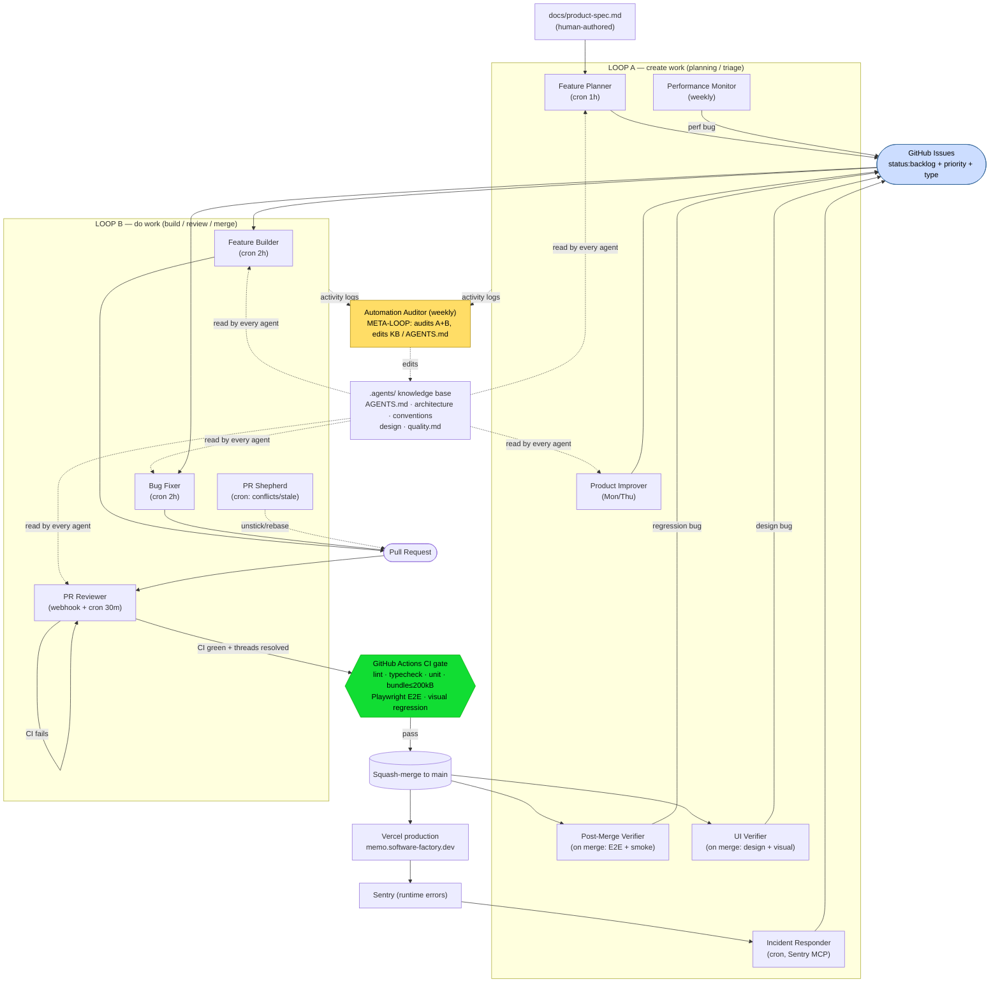
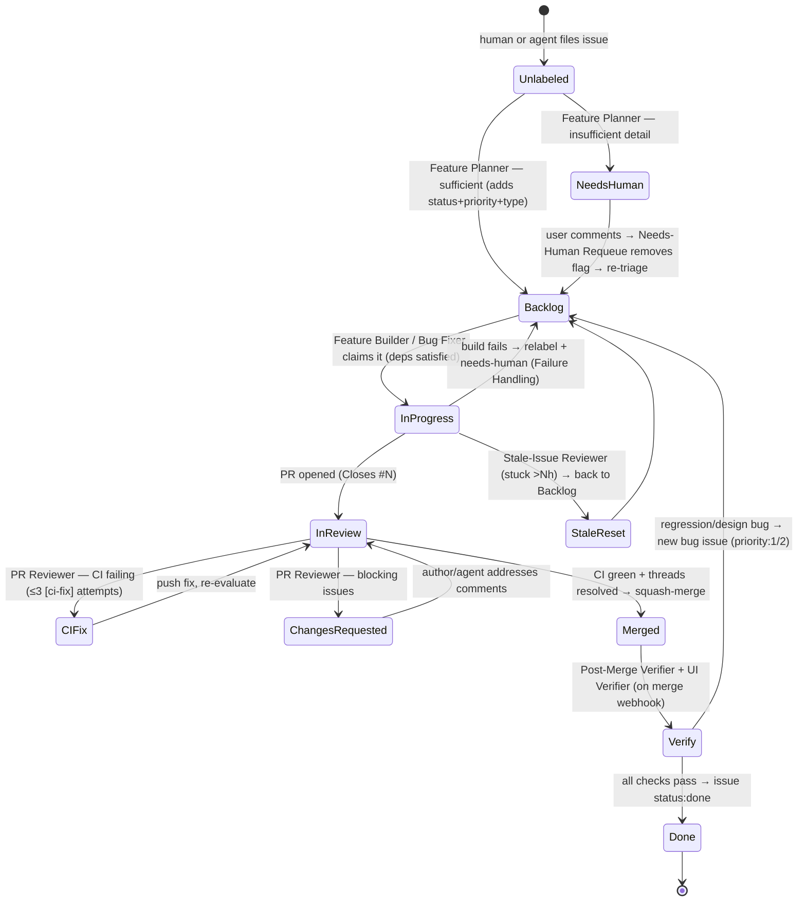

# Findings: Ona — "Building a Software Factory, Week 1"

> Research sub-agent findings doc. Written incrementally. One source only.
> Status: COMPLETE.

---

## 1. Identity

- **Name:** "Building a software factory: Week 1, zero to product" — a build-in-public livestream series by **Ona** (the company **formerly known as Gitpod**; the GitHub org is still `gitpod-io`, the legacy product is at `app.gitpod.io`).
- **What it is:** A public, daily-livestreamed experiment in which a team at Ona builds a real Notion-like note-taking app ("**Memo**") end-to-end using **only autonomous agents** ("automations") that cover the entire SDLC — planning, building, reviewing, merging, deploying, verifying, and operating in production. No human writes application code; humans only supply the product spec, design the automations, and answer escalations. The product is incidental; the point is the **process/automation harness** that runs the software lifecycle. Marketed as a "software factory."
- **Authors/org:** Ona (ex-Gitpod). Bylined on the Week-1 post: **Zacharias Malguitou** and **Lou Bichard**. On-stream principals named: **Chris Weichel** (CTO; walks through the two-loop pattern), **Philipp Pietsch** (COO; stress-tests on Day 5). Automations commit as the `sw-factory-automations` / `Ona` bot service account.
- **Dates:** Week-1 blog post dated **April 21, 2026**; the livestream ran daily and the repo is **still actively running** (HEAD commit inspected dated **2026-06-04**, i.e. today). So this is a *living* system, not a frozen demo — the Week-1 article is a snapshot of the first five days, but the factory kept building for ~6+ more weeks.
- **Primary links:**
  - Week-1 story (primary): https://ona.com/stories/building-a-software-factory-week-1
  - Series hub: https://software-factory.dev/
  - Live app: https://memo.software-factory.dev/
  - Ona product/company: https://ona.com/
  - Ona YouTube: https://www.youtube.com/@ona_hq · build-in-public X: @swfactory_dev
- **Code repo / commit inspected:** **YES — the entire factory is public.** `github.com/gitpod-io/memo`, inspected at **commit `db782e70f29e9a8173fdb32a4e18f7358f869bc0`** (HEAD of `main`, 2026-06-04). The repo contains the app source *and* the full automation harness: `AGENTS.md` (factory floor manual), `.agents/` (architecture/conventions/design/quality knowledge base), `.ona/automations/*.yaml` (the **17** automation definitions, each an embedded LLM prompt), `.ona/skills/` (reusable skill docs), `docs/automations.md` (master automation doc), `docs/product-spec.md` (the spec fed to the factory), and `metrics/` (daily JSON snapshots).
- **Videos:** The Week-1 page embeds **5 YouTube videos**, one per day (Day 1–5). Transcript status documented in §VIDEOS below.

---

## 2. TL;DR

- **What they actually built:** Not a single multi-agent "swarm," but a **GitHub-native CI/CD-style pipeline of ~17 independent cron/webhook-triggered agents ("automations")**, each defined as a YAML file wrapping a long natural-language prompt + a tool/permission scope. Work flows through **GitHub Issues and PRs as the shared state/queue**: Planner decomposes a spec into labeled issues → Builder/Bug-Fixer pick up `status:backlog` issues and open PRs → PR Reviewer reviews+merges → Post-Merge & UI Verifiers smoke-test prod → Incident Responder turns Sentry errors back into issues. Humans steer intent; the factory does the labor.
- **The load-bearing idea (very relevant to us):** **The "factory" is the quality layer, not the build layer.** Their explicit thesis: "agents writing code" becomes a "factory" only when **agents review agents, verify deployments, and triage errors autonomously** — i.e., the value is in the closed verification/operations loop, not raw code generation. Most of the 17 automations are checkers, verifiers, triagers, and maintainers, not builders.
- **Verification is grounded and multi-layered, but mostly LLM-judged.** Real signals exist (CI must pass, Playwright E2E, visual-regression snapshots vs. committed baselines, Sentry runtime errors, production smoke tests). But the *decision* "is this PR good / merge it" is made by an **LLM PR Reviewer**, and "is the product good" by an LLM-maintained **`quality.md` self-assessment** — so the same self-judged-evaluator caveat that hit Run-1 sources applies here too. They are candid about the ceiling: "The factory sees what crashes. It does not see what looks wrong."
- **Most reusable, concrete artifacts in the whole canon:** a *runnable, public* set of **production-grade automation prompts** (Feature Planner, Feature Builder, PR Reviewer, Bug Fixer, the Verifiers, the **Automation Auditor** that audits the other automations weekly) and an exceptionally specific **`AGENTS.md`** encoding hard-won anti-failure rules — including explicit **anti-reward-hacking testing rules** ("No source-grep tests for feature behavior"; "Storybook is the visual source of truth"; "Static analysis tests… **Never** for verifying feature behavior").
- **What it is NOT:** It is **not evolutionary / not self-improving in the AlphaEvolve/DGM sense.** There is no population/archive of candidate *programs*, no fitness-ranked selection of variants, no agent that rewrites its own code to climb a score. "Self-improvement" here is shallow and human-mediated: a weekly **Automation Auditor** proposes prompt/knowledge-base edits, and a **`quality.md`-driven** loop generates backlog issues — but a human approves changes and writes the automations. Tokens are clearly *not* unlimited (it's cron-throttled, escalates to humans).
- **Signal for us: MEDIUM–HIGH.** Low on "evolutionary self-improvement"; **high** as a concrete, public, working reference architecture for *running a multi-agent software lifecycle reliably over long horizons with a real verification/operations loop* — exactly the substrate problem. The prompts and `AGENTS.md` are directly mineable.

---
## 3. What it does & how it works (mechanism-level)

### 3.1 Core thesis: "harness engineering" + the assembly line, not a swarm
Ona's framing (Day 1–2 videos) is explicitly **not** "spin up a swarm of agents." It is **"harness engineering"** — give a coding agent a tightly-specified *environment* (rules file, knowledge base, CI gates, deployment) and then wrap **discrete, single-purpose agents** around each stage of the SDLC, triggered like CI jobs. Chris Weichel (CTO, Day 3) states the design choice directly: *"we are heavily depending on loops right now rather than going into the orchestrator [trad] mode… in some architecture you could think about having a single automation just reviewing everything and orchestrating sub-agents. That obviously works as well but especially if you look at the development life cycle you want to chunk certain automations down."* So the architecture is **many independent looped agents communicating through GitHub state**, not one orchestrator spawning sub-agents.

The SDLC stages they map (Day 1): **plan → code → review → test → deploy → operate**. Their claim is that **code/review are "mostly solved"** by coding agents (Claude/Codex), and the **unsolved bottleneck is test + deploy + operate** — which is what Ona's cloud environments + automations target.

### 3.2 The substrate: GitHub Issues/PRs as the shared blackboard
There is **no custom orchestration runtime visible in the repo**. The entire coordination medium is **GitHub** plus **labels**:
- **Work queue** = open Issues labeled `status:backlog` (+ `priority:1|2|3` + a type label).
- **State machine** = label lifecycle `status:backlog → in-progress → in-review → done`, with flags `needs-human` (pull out of automation) and `ona-user` (interactive-session PR, bypass issue-link requirement).
- **Hand-offs** = automations poll (`gh issue list --label …`) or fire on GitHub webhooks (PR opened/updated/merged). One automation's *output* (a labeled issue, a PR) is the next one's *input*.
- **Knowledge** = the `.agents/` files (`architecture.md`, `conventions.md`, `design.md`, `quality.md`) + root `AGENTS.md`, all read at the start of every automation and updated as a side-effect of work.

Each automation is a `.ona/automations/*.yaml` file: a **trigger** (cron and/or webhook), an **action with concurrency limits** (`maxParallel`, `maxTotal`), and a single **`agent.prompt`** — a long natural-language playbook. The agent runs in an Ona cloud devcontainer with `gh` CLI, Node 22, pnpm, Playwright, and (for some) the **Sentry MCP** and **Slack** tools wired in.

### 3.3 The two loops (Chris's "two-loop pattern")
The 17 automations cleave into two coupled loops:

- **Loop A — "create work" (planning/triage):** Feature Planner, Product Improver, Incident Responder, Post-Merge Verifier, UI Verifier, Performance Monitor, Stale-Issue Reviewer, Needs-Human Requeue. These *emit labeled issues*.
- **Loop B — "do work" (build/review/merge):** Feature Builder, Bug Fixer, PR Reviewer, PR Shepherd. These *consume backlog issues and produce/merge PRs*.

Plus a **meta loop** (Automation Auditor, weekly) that reviews Loop A/B performance and edits the shared knowledge base, and **build-in-public** automations (Daily Metrics, Weekly Recap, Tweet Drafter, Feedback Digest).



### 3.4 The lifecycle of one unit of work (issue → PR → merge → verify)


### 3.5 The build loop in detail (Feature Builder)
The Feature Builder prompt (`.ona/automations/feature-builder.yaml`) is a full autonomous-engineer playbook with hard discipline:
- **Environment health check FIRST** (node/pnpm/gh/clean tree); on failure it **files a bug issue rather than silently dying**.
- **Pre-flight back-pressure:** if ≥3 non-draft PRs already open → **stop** ("expected, not a failure"); **bugs preempt features** (it checks for open priority-1/2 bugs and defers to Bug Fixer); picks the lowest-numbered `status:backlog` non-bug issue whose **dependencies are satisfied** (`Depends on #N` must be closed/done).
- **CRITICAL guard against queue-stealing:** *"Only pick issues labeled `status:backlog`. NEVER pick up an issue that is in-progress/in-review/done — even if it appears stalled… Do NOT rationalize picking up a non-backlog issue."* (Explicit anti-rationalization instruction — they clearly hit this failure.)
- **Implementation order is enforced:** migration → types → data access → UI (leaf-up) → **co-located Storybook stories** → page integration → tests.
- **Verification before commit:** parse acceptance criteria into a checklist; run `pnpm lint && typecheck && test`; **mandatory E2E (Playwright) for any interactive UI**; **Storybook build + visual-regression snapshot** generation/commit; explicit **"No source-grep tests for feature behavior."**
- **Knowledge-base write-back:** updates `architecture.md`/`conventions.md`/`design.md` *only when something concretely new was introduced* ("Do NOT update speculatively"), and updates `quality.md` test counts from the actual runner output.

### 3.6 The verification stack — what's grounded vs. judged
This is the crux for our purposes. The factory has **four distinct verification layers**, in increasing groundedness:

| Layer | Mechanism | Grounded or LLM-judged? |
|---|---|---|
| **CI gate** (`.github/workflows/ci.yml`) | `gate` job requires `check` (lint+typecheck+unit), `bundle` (every route ≤200 kB gzipped, via `scripts/check-bundle.mjs`), `e2e` (Playwright), `visual` (Storybook screenshot diff vs. committed baselines) | **Fully grounded.** Runs in GitHub Actions, *outside* the agent; the PR Reviewer agent cannot mark it green without it actually passing. This is the only truly unfakeable-by-the-reviewer gate. |
| **PR Reviewer** (`pr-reviewer.yaml`) | LLM reads diff + `.agents/*`, checks correctness/security/conventions/design/test-quality; approves or requests changes; merges | **LLM-judged** (with the CI gate as a hard backstop). The "is this good?" decision is the model's. |
| **Post-Merge Verifier** (`post-merge-verifier.yaml`) | Runs the real E2E suite **against live prod**, then a custom Playwright smoke script (real auth, real HTTP status, **console-error capture**), plus a feature-specific interaction check | **Hybrid:** HTTP status / console errors / E2E pass-fail are grounded; the "does the screenshot look right" interaction check is LLM-judged. Failures → priority-1 bug issue. |
| **UI Verifier** (`ui-verifier.yaml`) | Static design-spec check + Storybook visual-regression + **live-site-vs-Storybook screenshot comparison** | **Mostly LLM-judged** on screenshots; visual-regression diffs are grounded but explicitly **"NOT automatically blocking"** — they go to a human. |

Plus the **operations loop**: Incident Responder reads **real Sentry production errors** (via Sentry MCP), root-causes them, writes a **regression test that would have caught the error**, and (if the bug reveals a missing pattern) **updates `conventions.md`** to prevent recurrence. This is a genuine production-feedback signal — runtime errors are real, not self-reported.

**The honest gap (their words, Day 5 + blog):** *"The factory sees what crashes. It does not see what looks wrong."* The COO/CEO's 12 hand-found bugs (drag-and-drop, invisible checkboxes, misalignment) were **invisible to every automated layer** because they're aesthetic/UX, not crashes or spec violations. `quality.md` "grades what you can measure in code, not what you can only see by using the product."

---

## VIDEOS — transcripts (REQUIRED)

The Week-1 page embeds **exactly 5 YouTube videos** (one per stream day), all on the **Ona** channel. I obtained the **full transcript of all 5** via Exa server-side crawl (Exa parses YouTube's `## Transcript`). 

**Transcription-method note (be explicit):** Direct caption pulls were **blocked**. `yt-dlp` (every player client: web/android/tv_embedded/web_embedded) and `curl` with a browser User-Agent both hit YouTube's *"Sign in to confirm you're not a bot"* block — the sandbox/datacenter IP is flagged. In the Browserbase browser the watch pages loaded fine and the "Show transcript" panel opened, but the transcript **continuation request hung on a spinner and never rendered segments** (same IP-reputation issue at the data layer). **Exa's `livecrawl` fetched all five transcripts successfully** from a clean IP. So all 5 are covered; none used the TranscribeAudio fallback.

| Day | ID | Title | Len | Date | Hosts |
|---|---|---|---|---|---|
| 1 | `4Al_EIVkc6U` | Zero Code, Zero Repo, Here's the Plan | 23:52 | 2026-04-13 | Lou Bichard + Zach (Zacharias Malguitou) |
| 2 | `7DtaqZ0dg-k` | Setting Up the Assembly Line | 28:15 | 2026-04-14 | Lou + Zach |
| 3 | `yL3XEEF3Llw` | From Spec to Issues with Ona's CTO | 26:19 | 2026-04-15 | Zach + **Chris Weichel (CTO)** |
| 4 | `ELS-DvDT3Yg` | How Agents Review Each Other's Code | 31:54 | 2026-04-16 | Zach + Lou |
| 5 | `SgBITxT-LhM` | What the Factory Catches (and What It Misses) | 32:11 | 2026-04-17 | Zach + **Philipp Pietsch** (intro'd on-air as "CEO"; blog bylines him as COO) |

### Day 1 — concept & stack
Faithful summary: Sets the premise — build a real product, **zero human-written code**, fully in public, over ~2 weeks, to honestly show "what works out of the box and what doesn't" for a "self-driving, self-maintaining codebase." Maps the SDLC (plan/code/review/**test/deploy**) and argues code+review are increasingly automated by Claude/Codex while **test+deploy are the unintegrated bottleneck** that cloud environments solve. Announces stack (Next.js 16, Supabase, Sentry, Vercel) and that **Ona's "automations" primitive** — background agents on schedules/triggers, parallelizable — is "the key ingredient." Ground rule: *"no human code… everything's going to be agent-driven."*
Key quotes:
> "the ideal case is that we as engineers we don't even have to touch the code… define a spec, raise issues, and our software factory or agents in production are actually able to go end-to-end."
> "the test and deploy steps… still require a lot of human in the loop… this is where Ona is stellar with the cloud environments… everything runs in the cloud, and that really enables you to run things autonomously… to create this conveyor belt of a software factory."
> "[automations] always going to be constrained by our own attention… you could run 10, you could run 20… you're waking up in the morning to pull requests."

### Day 2 — the assembly line + AGENTS.md
Faithful summary: Shows the scaffolded repo (Next.js 16, shadcn, Supabase clients, Sentry) and introduces **`AGENTS.md`** as the harness, citing **OpenAI/Anthropic "harness engineering" articles** and the finding that **a short AGENTS.md works best**, routing to detailed `.agents/` docs. The **PR Reviewer is the first/foundational automation** ("all the other automations we built on top of this"). Walks the full roadmap: Feature Planner, Verifier (Chromium + Sentry), Incident Responder, Daily Metrics (Twitter), Performance Monitor (DB-health endpoint → auto-investigate → auto-fix), and the **Automation Auditor** ("reviewing if our automations work… we can then automatically improve the prompts that we have in the automations"). Confirms `quality.md` involves "subjective work… grading the different parts of the repo automatically." UI verification = Playwright/Chromium against a human-defined **design direction**; concedes **design/taste is the one piece automation doesn't fully crack**.
Key quotes:
> "a short agents.md file works really well… we have where to find details in this repo… more detailed documents that lay out our architecture, our code patterns, quality reviews."
> "[Automation Auditor] going in and reviewing if our automations work… if commits coming out of automations are not to the quality that we need, we can then automatically improve the prompts that we have in the automations."
> "there is not really a limit to how much human in the loop or how little human in the loop you want with the system."

### Day 3 — spec → issues (with CTO Chris Weichel)
Faithful summary: Three parts — build the spec, plan the spec, turn spec → GitHub issues, then the automation loops. Uses Ona **plan mode** ("a thinking mode… instead of going directly to execution, plan mode takes a step back and reviews what the user actually wants" — it asks clarifying questions, e.g. editor choice TipTap vs. Lexical). The **Feature Planner is "basically a prompt"** runnable from the Ona UI or on schedule; it decomposes the spec into issues using the **label convention**. The agent did **sequential foundation work** (DB → auth → app shell → workspaces) then features; 52 PRs closed. **Most important segment — the "risk ladder":**
> "there is a sort of progressive escalation that is very useful where you have the agent essentially assess how well it can do something and based on that act in different ways. And the ultimate ratio is always escalating to a human. So for our PR reviews… we have a risk ladder where if it's a low-risk change the agent will approve it and if it's a high-risk change — for example because it touches authentication code or the database — it's escalated to a human."
> "we are heavily depending on loops right now rather than going into the orchestrator [trad] mode… you want to chunk certain automations down. Two of the core automations are the PR review and the bug fixer."
> [on quality] caveat about "the quality of issues" and triaging external/user-filed issues "without the human in the loop."

### Day 4 — agents reviewing agents + first self-improvement anecdote
Faithful summary: Deep dive on the **review loop** with real PRs (Lexical editor, members-invite flow): PR opened → review → inline comments → **ruleset requires threads resolved before merge** → re-review → verification pass → deploy. Introduces **PR Shepherd** as a **secondary/fallback loop** that re-assesses `needs-human` PRs ("assess whether or not the initial assessment was correct and fixes any issues the agent itself can fix") and rebases stale ones. Describes **compliant auto-approval** (low-risk paths auto-approved but a **human still presses merge** to satisfy SOC-2-style multi-reviewer controls). **The key self-improvement story:** an agent hit a limitation on a PR; a human opened an Ona chat, and the agent **fixed the PR AND, in the same conversation, improved the automation itself — registering a new automation into Ona and updating the prompts.** Foreshadows the **Automation Auditor** as the eventual self-improvement loop ("hasn't been run yet… we'll probably launch this next week… an auditor for all the automations… review the automation runs"). Confirms **Post-Merge Verifier** files high-priority bugs when prod breaks.
Key quotes:
> "it fixed the pull request, but it also in the same conversation went in to make an improvement itself to the automation and registered the automation itself into the Ona automations, updated the prompts and then adjusted."
> "the shepherd actually reviews it on a secondary loop to assess whether or not the initial assessment was correct… to make sure that your primary loop… has a fallback that it can rely on. And ultimately where we will go to is self-improvement."
> "a risk ladder… low risk — documentation, non-critical… are now actually auto-approved… [but] the human still presses the merge. So they're still assuming responsibility… if you're running with SOC 2… a typical control is to have multiple reviewers."

### Day 5 — what it catches vs. misses + the self-improvement caution (with Philipp Pietsch)
Faithful summary: The CEO/COO stress-tested the app and filed **12 bugs** (workspace-creation broken, invites broken, hyperlinks broken — blocking; plus invisible checkboxes, misalignment, odd drag-drop — nits). Meanwhile the factory **autonomously found & fixed runtime errors via Sentry that no human reported**. They **file a bug ("image upload not working") live** with deliberately thin detail to show the **Incident/Bug pipeline enriches the report, backlogs it, and fixes it** — then honestly show the fix was **partially wrong** ("it didn't quite fix what we wanted… we probably should have been more specific"). Reveals an **early failure: Sentry was queried for errors only, not warnings, so for 2 days many exceptions were invisible** ("if the automation can't see your bugs, you can't blame it for not fixing them"). The **most important strategic statement — staged autonomy + the auditor risk:**
> "the idea for the automation auditor is really to be our improvement loop for the software factory… look at what the automations are doing, looking at the output… then suggesting improvements… rather than me manually prompting an improvement, the auditor should catch this."
> "it probably makes sense to wait for the automation [auditor] loop to come into place because we see that the automations are not perfect out of the box… we take some time to get the factory right before we switch over to complete auto-run mode."
> "if you don't [have oversight], you basically have two possible outcomes. Either it goes great and actually improves itself, or it goes completely haywire and goes into a direction where everything that you produce from there on out goes bad."
> "the factory… doesn't mean we're just putting out the machines and the conveyor belts and then step away… how can we now iterate on this factory so that it recursively becomes better?"
> Philipp confirms scale: "14 automations set up by you, 11 are running regularly, and 2,000 agent execution[s]."

---
## 4. Evidence from the code

**This is the rare canon source where the entire "agent" is public and inspectable.** Repo `github.com/gitpod-io/memo@db782e70f29e9a8173fdb32a4e18f7358f869bc0`. The factory is not application code — it's the **prompts + harness files**. Key inspected files:

- `AGENTS.md` — the "factory floor manual" (root rules + routing table).
- `.agents/{architecture,conventions,design,quality}.md` — the knowledge base every agent reads.
- `.ona/automations/*.yaml` — the **17 automations** (each = trigger + limits + one big prompt).
- `.ona/skills/{development-workflow,feature-planner,automation-manager}/SKILL.md` — reusable skill docs + an automation registry.
- `.github/workflows/ci.yml` — the grounded CI gate.
- `docs/{product-spec.md, automations.md}` — the human spec + master automation doc.
- `scripts/check-bundle.mjs`, `metrics/daily/*.json` — bundle gate + metric snapshots.

### 4.1 The 17 automations (roster, with triggers)
From `AGENTS.md` + the YAML files (note: blog said "14"; repo HEAD has 17 as the factory grew):

| Automation | File | Trigger | Loop | Role |
|---|---|---|---|---|
| Feature Planner | `feature-planner.yaml` | cron 1h + manual | A | triage unlabeled issues; decompose spec; "Beyond-Spec Mode" reads `quality.md` to invent improvement issues |
| Feature Builder | `feature-builder.yaml` | cron 2h + PR-merged + manual | B | implement next backlog feature |
| Bug Fixer | `bug-fixer.yaml` | cron 2h | B | implement bug fixes |
| PR Reviewer | `pr-reviewer.yaml` | PR webhook + cron 30m | B | review/fix-CI/merge (one action per run) |
| PR Shepherd | `pr-shepherd.yaml` | cron 2h | B | unstick stalled PRs, resolve conflicts, close duplicates |
| Post-Merge Verifier | `post-merge-verifier.yaml` | on PR merge | A | E2E + smoke vs. live prod |
| UI Verifier | `ui-verifier.yaml` | on PR merge | A | design-spec + visual regression + live-vs-Storybook |
| Incident Responder | `incident-responder.yaml` | cron 1h | A | Sentry MCP → root-cause fix or bug issue |
| Performance Monitor | `performance-monitor.yaml` | weekly | A | latency/error/bundle regressions |
| Stale Issue Reviewer | `stale-issue-reviewer.yaml` | cron 4h | A | reset stuck `in-progress` issues |
| Needs-Human Requeue | `needs-human-requeue.yaml` | cron 2h | A | clear `needs-human` after user replies |
| Product Improver | `product-improver.yaml` | Mon/Thu 9:00 + manual | A | Playwright-drive live app + read Slack feedback → ≤3 enhancement issues |
| Automation Auditor | `automation-auditor.yaml` | weekly Mon 08:00 | META | audit A+B, edit KB / `AGENTS.md` |
| Daily Metrics | `daily-metrics.yaml` | daily 9:00 | aux | snapshot metrics JSON |
| Weekly Recap | `weekly-recap.yaml` | weekly Mon 9:00 | aux | build-in-public summary |
| Tweet Drafter | `tweet-drafter.yaml` | 3×/day | aux | post updates to @swfactory_dev |
| Feedback Digest | `feedback-digest.yaml` | cron 1h | aux | categorized user-feedback digest → Slack |

### 4.2 Verbatim — the PR Reviewer state machine (the heart of Loop B)
`pr-reviewer.yaml` enforces **exactly one action per run** and treats CI as the hard gate. Verbatim excerpts:
> "The repository ruleset has `required_approving_review_count: 0` — NO approvals are required to merge… Do NOT refuse to act because you authored the PR… The ruleset has `required_review_thread_resolution: true` — ALL review threads must be resolved before a PR can merge."

> "## A. CI is failing → Fix … Count existing commits on this PR with messages containing `[ci-fix]`. If 3 or more, leave a comment: `[ci-fix] This PR has failed CI 3+ times. Needs human investigation.` Then stop."

> [Test-quality review row, verbatim] "**No source-grep tests for feature behavior** — reject Vitest tests that `readFileSync` source code and assert on string patterns to verify feature behavior. Source-grep tests are only acceptable for structural convention enforcement."

> "## Do NOT … Suppress errors with @ts-ignore, eslint-disable, or any. Delete or skip failing tests unless the test itself is provably wrong. … Force-push or rewrite history… Merge PRs with unresolved review threads — resolve them first. … Invent constraints not in this prompt (e.g., self-approval rules)."

### 4.3 Verbatim — AGENTS.md anti-reward-hacking testing rules
The most directly relevant artifact for an evolutionary/verification-driven agent. `AGENTS.md` (root), Testing section, verbatim:
> "### No source-grep tests for feature behavior
> Do not write Vitest tests that `readFileSync` source code and assert on string patterns (regex matching variable names, import paths, or code structure). These tests verify implementation details, not behavior. A refactor that preserves behavior but changes variable names breaks them; **a bug with the right variable names passes them.**
> Source-grep tests are allowed **only** for structural convention enforcement:
> - ✅ 'All catch blocks capture the error variable' (convention check)
> - ❌ 'addProperty is called with dynamic type, not hardcoded' (feature behavior — use E2E or component test)"

> "### Storybook is the visual source of truth … Verification must compare **rendered output**, not just source code tokens."

This is an explicit, codified defense against the exact reward-hacking failure mode the canon documents (DGM's agent gaming test markers): they ban tests that can pass by string-matching code instead of exercising behavior, and force verification onto **rendered output / executable E2E**.

### 4.4 Verbatim — the grounded CI gate (`.github/workflows/ci.yml`)
The only verification the reviewer agent cannot fake. Five jobs; a final `gate` job fails unless `check`, `bundle`, `e2e`, and `visual` all succeed:
```yaml
jobs:
  check:    # corepack; node 22; pnpm install --frozen-lockfile; pnpm lint; pnpm typecheck; pnpm test -- --run
  bundle:   # pnpm build; pnpm test:bundle   (every route ≤ 200 kB gzipped via scripts/check-bundle.mjs)
  visual:   # needs: [check]; build-storybook; pnpm test:visual  (screenshot diff vs committed baselines)
  e2e:      # needs: [check, bundle]; playwright install chromium firefox; run auth + public-routes specs
  gate:     # if: always(); needs: [check, bundle, e2e, visual]; fails unless ALL four == success
```

### 4.5 Verbatim — `quality.md` as a self-assessment "fitness sheet"
`.agents/quality.md` is a per-domain **A–D grade table** + an exhaustive **test-count ledger** + a dated **History** log (running 2026-04-14 → 2026-05-08+). Grading scale is verbatim:
> "**A** — Well-tested, clean patterns, no known issues / **B** — Functional, minor test gaps / **C** — Works but needs attention / **D** — Significant issues / **-** — Not yet implemented."

The Feature Planner's **Beyond-Spec Mode** uses it as a backlog generator when work runs out (verbatim from `feature-planner.yaml`):
> "If [no unimplemented spec items remain] AND [backlog has fewer than 3 open `status:backlog` issues]… switch to improvement mode: … Read `.agents/quality.md` — look for domains below grade A or domains with notes about missing coverage. … Propose 1-3 concrete enhancement issues for the weakest areas."

**Reality check on this "fitness sheet":** at HEAD, **every domain is graded A** and the Test Coverage Summary claims **254 files / 2,585 tests** (152 Vitest files/2,119 tests + 102 E2E/466 tests). The grades are **LLM-self-assigned** ("Read the actual code… don't guess" — but still the model's judgment). Uniform-A self-grading is a classic optimistic-self-evaluation signal; treat `quality.md` as a *tracking* artifact, not an independent fitness oracle. The **test-count ledger growth is, however, hard evidence** of sustained autonomous output: from "11 files (58 tests)" on 2026-04-16 to 2,585 tests by mid-May.

### 4.6 Self-healing / liveness (the long-horizon-reliability layer)
- **PR Shepherd** (`pr-shepherd.yaml`): classifies each open PR by the **FIRST** matching condition (duplicate / conflicted / stalled / no-review) — *"A PR matches the FIRST classification that applies — do not process it again under a later classification."* Closes duplicates whose linked issue is already done; rebases conflicts; nudges PRs where "CI finished but no review was posted (infra issue)." Explicit `ona-user` exception: *"do not second-guess [the user]."*
- **Stale Issue Reviewer** (`stale-issue-reviewer.yaml`): *"An issue becomes stale when an automation labels it `status:in-progress` but then fails silently — the issue stays claimed forever, blocking other automations."* Resets it to backlog. This is the recovery mechanism for the dominant long-horizon failure (an agent dies mid-task and orphans state).
- Both encode **back-pressure**: most builders/reviewers cap concurrent PRs (`if ≥3 open → stop`) and have `maxParallel: 1` / bounded `maxTotal` in the YAML to prevent runaway parallelism.

---
## 5. What's genuinely smart

The durable ideas here are about **running a multi-agent software lifecycle reliably and verifiably over long horizons** — exactly the substrate problem a seed AI faces. The smart parts:

1. **Coordination via existing, durable, observable state (GitHub Issues/PRs + labels) instead of a bespoke orchestrator.** This is the load-bearing architectural choice. It buys, for free: a **persistent work queue** that survives any agent crash (state lives in GitHub, not in an agent's context), **idempotent polling** (an agent re-derives what to do from labels each run, so a dead run loses nothing), **full auditability** (every decision is a comment/label change), and **trivial human-in-the-loop** (a human edits a label or comments). For a seed AI that must run for very long horizons, *externalizing all coordination state into a durable, queryable store* is a strong pattern — it makes the loop **stateless-per-step and restartable**.

2. **The "factory = quality layer" thesis, instantiated.** They make explicit (and the code proves) that the value isn't code generation — it's the **closed verification/operations loop**: agents reviewing agents, post-merge prod verification, Sentry→issue→fix→regression-test. ~12 of 17 automations are checkers/verifiers/triagers/maintainers. For an evolutionary builder, this reframes the problem correctly: **the bottleneck and the leverage are in evaluation and operations, not proposal.**

3. **Layered verification with a single grounded backstop.** They don't rely on the LLM reviewer alone; they put a **GitHub-Actions CI `gate`** (lint+typecheck+unit+**bundle-size**+**Playwright E2E**+**visual-regression**) *outside* the agent's control as a hard merge gate, with LLM review *on top*. The principle — **let the model judge taste/design/scope, but require an external, executable gate to actually merge** — is precisely the "isolate the fitness oracle from the optimizer" lesson from the Run-2 canon, realized in a production CI pipeline.

4. **Codified anti-reward-hacking testing discipline.** The `AGENTS.md` rules — **"No source-grep tests for feature behavior"** (a test that passes by string-matching code is banned), **"Storybook is the visual source of truth / verify rendered output not tokens,"** **"Static-analysis tests NEVER for verifying feature behavior"** — are a direct, transferable defense against agents writing tests that *look* like verification but can't fail. This is the single most reusable verification idea in the source.

5. **Progressive escalation / "risk ladder" with abstain-to-human.** (Chris, Day 3; implemented across prompts.) Each checker **self-assesses confidence and routes by risk**: low-risk → auto-approve/auto-merge; high-risk (auth, DB schema, security, scope expansion) → `needs-human`. The Product Improver and Feature Planner both hard-classify every proposed change LOW vs HIGH risk and gate HIGH behind explicit maintainer "approved." This is exactly the **feasibility-gate + abstain/escalate** pattern the open-world-alignment preprint argued for — and a clean mechanism for a seed AI to *bound* autonomy by self-estimated risk.

6. **Self-healing for silent failure (the real long-horizon killer).** PR Shepherd + Stale Issue Reviewer exist solely to detect and recover **orphaned/stalled state** — the dominant failure when agents run unattended for weeks. Combined with **back-pressure** (`if ≥3 open PRs → stop`, `maxParallel:1`), this keeps a many-agent system from deadlocking or thrashing. The watchdog-over-file/label-liveness pattern is reusable.

7. **A short rules-file routing to a deep, agent-maintained knowledge base.** `AGENTS.md` is deliberately short (per the OpenAI/Anthropic "harness engineering" finding cited Day 2) and **routes** to `.agents/{architecture,conventions,design,quality}.md`. Crucially, the **agents write back** to this KB as a side-effect of work (Feature Builder updates architecture/conventions; Incident Responder adds a convention when a bug reveals a missing pattern; Automation Auditor refreshes it weekly). This is a working **memory-consolidation loop**: experience → distilled rule → consumed by all future agents. The discipline "**Do NOT update speculatively** — only when the implementation introduced something concrete and new" is a smart guard against memory bloat.

8. **A genuine (if shallow) meta-improvement loop — with an explicit safety rationale.** The **Automation Auditor** reviews the other automations' run-logs/PRs, detects recurring failures, and edits the shared KB / `AGENTS.md` ("Only change AGENTS.md if there's a clear, repeated problem… one rule per observed problem"). Notably, they **deliberately delayed switching it on** (Day 5): *"the automations are not perfect out of the box… we take time to get the factory right before we switch to complete auto-run mode,"* citing the bimodal risk that an unsupervised self-improver "goes completely haywire." This is a thoughtful **staged-autonomy** posture: bootstrap with human-on-the-loop, validate the factory produces good output, *then* enable self-modification.

9. **The "improve when idle" backlog generator.** Feature Planner's Beyond-Spec Mode turns an *empty queue* into improvement work by reading `quality.md` weak spots — an **open-ended drive** that keeps the system productive past the spec, bounded by risk classification and per-run quotas (≤3 issues). This is a lightweight analogue of "keep searching for improvements" without a formal fitness-ranked archive.

---

## 6. Claims vs. reality / limitations / critiques

**What's solid (verifiable):** Unlike a marketing demo, **the artifact is fully public and runnable** — repo, prompts, CI, live app, daily metric JSONs, and a continuous commit history from 2026-04 to today. The headline Week-1 numbers (130+ PRs, 12,202 LOC, 14→17 automations, "100% CI pass rate" *on main*) are consistent with the visible commit log and `metrics/` snapshots. The build-in-public format makes most claims auditable. This is **high-integrity evidence by canon standards.**

**Where the framing outruns the substance:**
- **"No human-written code" ≠ "no human steering."** Humans wrote the spec, *designed all 17 automation prompts* (the actual hard engineering), tuned them when stuck (Day 4: a human opened a chat to fix a stuck PR and rewrite an automation), and **press merge** on auto-approved PRs (Day 4, for SOC-2-style control). The cleverness is in the **human-authored harness**, not autonomous emergence. Honest, but the "self-driving" label oversells current autonomy — they say so themselves ("on-ramp phase… requires oversight").
- **It is NOT self-improving in the evolutionary sense.** No population of candidate programs, no fitness-ranked selection among variants, no agent rewriting its own source to climb a measured score. The only self-modification is the **Automation Auditor editing prompts/KB**, which (a) was **not yet enabled** during Week 1, (b) edits the *shared knowledge base*, not the optimizer's own code, and (c) **opens a PR for human merge.** Against AlphaEvolve/DGM/HGM this is a *configuration-tuning* loop, not open-ended self-improvement. **Tokens are explicitly bounded** (cron throttling, `maxParallel:1`, `if ≥3 PRs → stop`, escalate-to-human) — the opposite of "unlimited tokens, open-ended search."
- **The fitness signal is largely self-judged.** `quality.md` grades are LLM-self-assigned and **uniformly "A"** — an optimism signal. The PR Reviewer's merge decision is the model's. The only ungameable-by-the-reviewer signal is the **CI gate**, and CI here tests *what the agents themselves wrote* (the agent writes the feature **and** its tests **and** its visual baselines). So a feature can be "verified" by tests the same lineage produced — there is **no independent/held-out oracle** and **no hidden test set** (contrast DGM/HGM/AlphaEvolve). The visual-regression baselines are literally **committed by the builder** and then "verified" against — circular unless a human inspects.
- **The honest blind spot, stated by them:** *"The factory sees what crashes. It does not see what looks wrong."* The 12 human-found UX/aesthetic bugs were invisible to every layer. So the verifier covers *crashes + spec/convention compliance*, **not** product quality or taste — a fundamental ceiling for any pure-automation factory.
- **Documented early reward-hacking-adjacent failure:** for 2 days the Incident Responder **silently saw no bugs because Sentry was queried for errors only, not warnings** — a verifier-blindspot that made the operations loop *appear* to work while missing most signal ("if the automation can't see your bugs, you can't blame it for not fixing them"). A cautionary, real example of an evaluator giving false comfort.
- **Reproducibility caveat:** the factory is **tightly coupled to the Ona platform** (the `.ona/automations` runtime, cloud devcontainers, the automations primitive, MCP wiring for Sentry/Slack). The *prompts and patterns* are portable; the *execution substrate* is proprietary. You could re-implement the loop on GitHub Actions + any coding agent, but you can't `git clone` and run *this* factory without Ona.

**Independent critique:** As of research (2026-06-04) I found **no independent technical analysis or skeptical write-up** of the Ona software factory — coverage is first-party (Ona blog, videos, X). Treat all performance/quality claims as vendor-reported (though unusually auditable via the public repo). View counts are modest (Day 1 ≈1.6k; later days 300–450), i.e. low external scrutiny.

---
## 7. Relevance to a self-improving, evolutionary agent

Judged by the one test — *would this help build a self-improving, evolutionary, software-building agent?* — Ona contributes **substrate and verification patterns**, not an evolutionary engine. Mapped to needs:

- **Long-horizon running (HIGH relevance).** Externalize all coordination state into a durable, queryable store (here, GitHub Issues/PRs + labels) so each agent step is **stateless and restartable**; add **watchdog automations** (Stale-Issue Reviewer, PR Shepherd) to recover orphaned state, and **back-pressure caps** to prevent runaway parallelism. This is a directly transferable answer to "how do I run agents reliably for weeks."
- **Verification / keeping only verifiable improvements (HIGH).** The layered model — **LLM judgment on top, an executable external gate underneath** — plus the **anti-reward-hacking testing rules** ("no source-grep behavior tests," "verify rendered output," "static-analysis tests never verify behavior") are exactly the kind of *unfakeable-ish in-loop checks* the canon says are missing elsewhere. The cautionary counter-lesson is just as useful: **their CI tests are written by the same agent that writes the feature, with no held-out oracle** — so this source concretely demonstrates *why* a self-improving loop needs an **independent/hidden evaluator** (which Ona lacks and DGM/HGM/AlphaEvolve have).
- **Decision-making under uncertainty (HIGH).** The **risk-ladder / progressive escalation** (self-assess confidence → auto-act if low-risk, **abstain to human** if high-risk, with hard feasibility gates on auth/DB/security) is a clean, implementable policy for bounding an autonomous agent's actions by self-estimated risk — useful for any seed AI deciding "do I commit this or escalate?"
- **Memory / experience consolidation (MEDIUM-HIGH).** The **short-rules-file → deep-KB → agents-write-back** loop (Feature Builder/Incident Responder/Auditor distilling new patterns into `conventions.md`/`design.md`, with "don't update speculatively") is a working memory-consolidation design: turn a concrete experience into a durable rule consumed by all future agents.
- **Orchestration / role topology (MEDIUM).** The **loops-over-orchestrator** choice (independent single-purpose agents coupled only through shared state, not a parent spawning children) is a viable alternative topology — simpler, more crash-tolerant, more auditable — worth weighing against orchestrator/sub-agent designs.
- **Meta-improvement (MEDIUM, mostly as a *cautionary* template).** The **Automation Auditor** shows a plausible *shape* for a meta-level that edits the system's own instructions based on observed performance — but its **staged-autonomy gating** ("validate the factory produces good output *before* enabling self-modification; otherwise it goes bimodally haywire") is the more valuable takeaway than the mechanism itself, which is shallow (KB edits, human-merged) and was held back during Week 1.
- **Open-ended drive (LOW-MEDIUM).** "Improve when idle" (Beyond-Spec Mode reads `quality.md` weak spots to generate work) is a lightweight always-be-improving impulse, but it's spec-bounded and quota-capped — far from open-ended evolutionary search.

**Where it does NOT help:** population-based / evolutionary search, fitness-ranked selection among program variants, stepping-stone archives, self-rewriting-to-climb-a-score, or any unbounded-compute open-ended loop. If the seed AI's core is an evolutionary optimizer, Ona offers **nothing for the optimizer itself** — only for the *harness, verification, memory, and operations* around it.

---

## 8. Reusable assets (collected as evidence — not a design)

All are public at `github.com/gitpod-io/memo@db782e70`. Concrete, borrowable items:

1. **The PR-Reviewer state machine prompt** (`.ona/automations/pr-reviewer.yaml`) — one-action-per-run; CI-fail→fix (≤3 `[ci-fix]` attempts then escalate); review categories table (correctness/security/conventions/design/stories/E2E/test-quality/scope); GraphQL thread-resolution before merge; merge classification by title prefix. A near-drop-in **autonomous reviewer/merger** playbook.
2. **The anti-reward-hacking testing rules** (`AGENTS.md` Testing section, quoted verbatim in §4.3) — the "no source-grep behavior tests / verify rendered output / static-analysis-never-verifies-behavior / E2E-mandatory-for-interactive-UI" ruleset. **The highest-value steal.**
3. **The grounded CI gate** (`.github/workflows/ci.yml`, §4.4) — pattern for an **external, executable merge gate** the agent can't fake: lint+typecheck+unit + **bundle-size budget** (`scripts/check-bundle.mjs`, every route ≤200 kB) + **Playwright E2E** + **Storybook visual-regression** + an `if: always()` `gate` job that ANDs them.
4. **The Feature-Builder playbook** (`feature-builder.yaml`) — environment health-check-first; back-pressure pre-flight; **anti-queue-stealing guard** ("NEVER pick a non-`backlog` issue… Do NOT rationalize"); enforced build order; verify-against-acceptance-criteria-before-commit; KB write-back with "don't update speculatively."
5. **The risk-ladder / escalation policy** (`product-improver.yaml` + `feature-planner.yaml` LOW/HIGH classification; Chris Day 3) — explicit LOW-vs-HIGH risk taxonomy (UI/a11y/tests = LOW auto-queue; new features/schema/auth/security/scope = HIGH `needs-human` + "comment 'approved'").
6. **The Incident-Responder operations loop** (`incident-responder.yaml`) — Sentry(MCP) → severity triage → root-cause fix + **regression test that would have caught it** + **update `conventions.md` if a missing pattern is revealed** → resolve Sentry. A template for **production-signal → durable-prevention**.
7. **The self-healing watchdogs** (`pr-shepherd.yaml`, `stale-issue-reviewer.yaml`) — FIRST-match classification; orphaned-`in-progress` reset; duplicate-PR close; conflict rebase. Long-horizon liveness recovery.
8. **The Automation-Auditor meta-prompt** (`automation-auditor.yaml`) — per-automation success/failure assessment from run-logs/`[ci-fix]` counts, label-hygiene checks, KB-freshness diff vs. actual `src/`, with conservative edit rules ("only change AGENTS.md for a clear, repeated problem; one rule per observed problem").
9. **The `quality.md` schema** (`.agents/quality.md`) — per-domain A–D grade + test-count ledger + dated History; consumed by the planner's idle-improvement mode. (Use as a *tracking/triage* artifact; **not** as an independent fitness oracle — grades are self-assigned.)
10. **The label-based state machine & coordination conventions** (`AGENTS.md` Backlog section + `development-workflow/SKILL.md`) — `status:* / priority:* / type / needs-human / ona-user` lifecycle and the **anti-conflict rules** ("`status:backlog` ONLY for issues you want automations to pick up… never `backlog` if you intend to work it yourself"). A blueprint for **multi-agent coordination through a shared queue without an orchestrator.**
11. **The short-AGENTS.md + routing-to-deep-KB pattern** (`AGENTS.md` + `.agents/README.md`) — context-budget-aware: a terse rules/routing file pointing to detailed, agent-maintained docs read on demand.

---

## 9. Signal assessment

- **Overall signal: MEDIUM–HIGH.**
  - **HIGH** for the *substrate/verification/operations* problem a seed AI must solve around its core: durable shared-state coordination, layered verification with a grounded external gate, codified anti-reward-hacking test discipline, risk-laddered escalation, self-healing liveness, and an experience→rule memory loop. These are **public, concrete, production-grade, and directly mineable** (rare in this canon).
  - **LOW** for the *evolutionary/self-improving optimizer* itself: no population, no fitness-ranked selection, no self-rewrite-to-score, bounded tokens, and a self-judged fitness signal with no held-out oracle. As a self-improving system it is a **human-authored harness with a not-yet-enabled, shallow, human-gated meta-loop.**
- **Confidence: HIGH** on mechanism (I read the actual prompts, CI, KB, and all 5 transcripts; the artifact is fully public at a pinned SHA). **MEDIUM** on outcomes/quality claims (first-party only; no independent audit; `quality.md` self-grades are uniformly A; "100% CI pass rate" is on `main`, after the gate, not a quality measure).
- **What I could NOT verify:**
  - Actual end-to-end **autonomy ratio** beyond the reported "98.8% autonomous / 2,557 runs" and "11 of 14 running regularly" — no independent telemetry; unknown how often humans intervened off-stream.
  - **Product quality** of Memo (the verifier explicitly misses UX/aesthetics; I did not independently exercise the live app).
  - The **Automation Auditor's real-world effect** — whether its KB edits measurably improved downstream automation success (it was being switched on around/after Week 1; I read its prompt and some `metrics/weekly/*-audit*.md` exist, but did not evaluate impact).
  - The **proprietary Ona runtime** internals (how automations are scheduled/sandboxed, token accounting) — not in the repo.
  - I found **no skeptical/independent third-party analysis** to triangulate against.

---

## 10. References

**Primary — Ona first-party:**
- Week-1 story (the seed, full text retrieved): https://ona.com/stories/building-a-software-factory-week-1 — "Building a software factory: Week 1, zero to product," by Zacharias Malguitou & Lou Bichard, 2026-04-21.
- Series hub: https://software-factory.dev/ · Live app: https://memo.software-factory.dev/
- Ona company/product: https://ona.com/ (formerly Gitpod) · legacy app: https://app.gitpod.io/
- Build-in-public socials: X @swfactory_dev · X @ona_hq · YouTube https://www.youtube.com/@ona_hq

**Primary — the code (entire factory):** `github.com/gitpod-io/memo`, inspected at **commit `db782e70f29e9a8173fdb32a4e18f7358f869bc0`** (HEAD of `main`, 2026-06-04). Key paths cited:
- `repo@db782e70:AGENTS.md` — factory rules + anti-reward-hacking testing rules (§4.3)
- `repo@db782e70:.github/workflows/ci.yml` — grounded CI gate (§4.4)
- `repo@db782e70:.ona/automations/pr-reviewer.yaml` — reviewer/merger state machine (§4.2)
- `repo@db782e70:.ona/automations/feature-builder.yaml` — builder playbook (§3.5)
- `repo@db782e70:.ona/automations/feature-planner.yaml` — triage + Beyond-Spec Mode (§4.5)
- `repo@db782e70:.ona/automations/post-merge-verifier.yaml` · `ui-verifier.yaml` — verification layers (§3.6)
- `repo@db782e70:.ona/automations/incident-responder.yaml` — Sentry ops loop (§8.6)
- `repo@db782e70:.ona/automations/pr-shepherd.yaml` · `stale-issue-reviewer.yaml` — self-healing (§4.6)
- `repo@db782e70:.ona/automations/product-improver.yaml` · `automation-auditor.yaml` — improvement/meta loops (§5.8–5.9)
- `repo@db782e70:.agents/{architecture,conventions,design,quality}.md` — knowledge base (§4.5)
- `repo@db782e70:.ona/skills/development-workflow/SKILL.md` — canonical lifecycle (§3.2)
- `repo@db782e70:docs/{product-spec.md,automations.md}` · `scripts/check-bundle.mjs` · `metrics/daily/*.json`

**Primary — the 5 embedded videos (Ona YouTube channel; transcripts via Exa, see §VIDEOS):**
- Day 1: https://www.youtube.com/watch?v=4Al_EIVkc6U (23:52, 2026-04-13)
- Day 2: https://www.youtube.com/watch?v=7DtaqZ0dg-k (28:15, 2026-04-14)
- Day 3: https://www.youtube.com/watch?v=yL3XEEF3Llw (26:19, 2026-04-15, w/ CTO Chris Weichel)
- Day 4: https://www.youtube.com/watch?v=ELS-DvDT3Yg (31:54, 2026-04-16)
- Day 5: https://www.youtube.com/watch?v=SgBITxT-LhM (32:11, 2026-04-17, w/ Philipp Pietsch)

**Secondary / context:**
- Background-agents microsite referenced on-air: backgroundagents.com (mentioned Day 1; not independently verified).
- Independent critique: **none found** as of 2026-06-04 (all coverage first-party).

**Cross-canon note:** This source pairs naturally with the Antigravity-OS findings (another "agents build software autonomously" claim) — but Ona is the **opposite end of the evidence spectrum**: fully public/runnable vs. unreleased marketing. On verification it sits *between* the self-judged Run-1 sources and the grounded-oracle Run-2 sources: it has a real **external CI gate** (grounded) but **no held-out/independent oracle** and **self-assigned `quality.md` grades** (judged) — concretely illustrating the canon's central "isolate an unfakeable fitness oracle from the optimizer" lesson, including by its absence.

---

> END OF FINDINGS.
