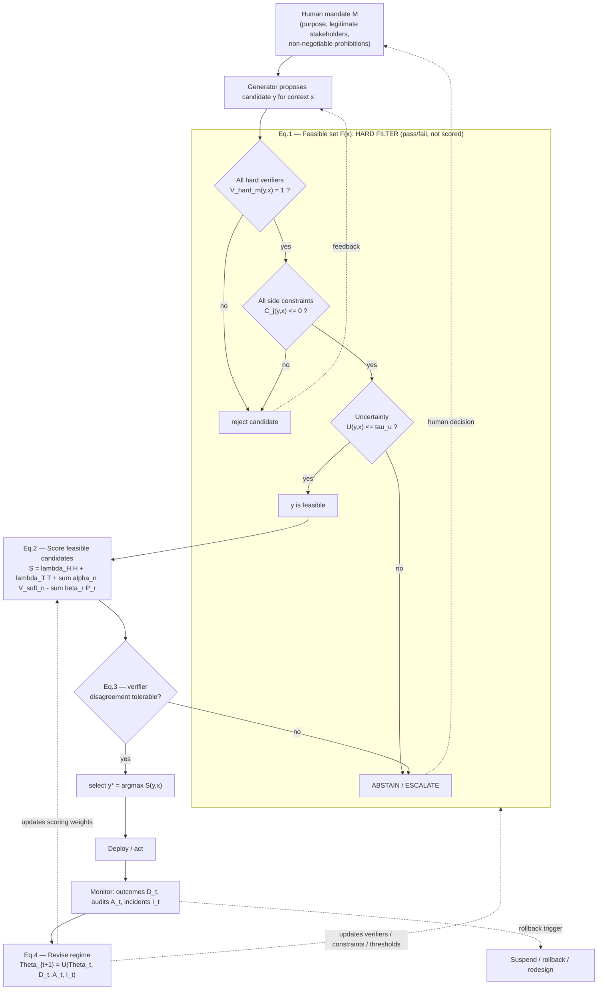
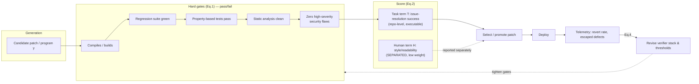

# Findings — Preprints.org 202604.1749: *Beyond Human Measure: ASI Should Be Guided by Open-World Alignment*

> Per-source research dossier for the KB Seed AI project. Reporter, not architect: this
> file records what the source is and what (if anything) it teaches about building a
> self-improving, evolutionary, software-building agent. No adopt/reject calls.

---

## 1. Identity

- **Name / title:** *Beyond Human Measure: ASI Should Be Guided by Open-World Alignment.*
- **What it is:** A **position / framework paper** (theory + conceptual operationalization). It is **not** a system, library, or empirical study. There is **no code** and **no experiments**; the "coding agent" is a worked *thought-experiment* case study, not an implementation.
- **Authors:** Chaoyue He\* (postdoc), Xin Zhou, Di Wang, Hong Xu, Chunyan Miao — all of the **Alibaba–NTU Global e-Sustainability CorpLab (ANGEL), Singapore**; Wei Liu — **Alibaba Group, Hangzhou, China**. Corresponding author: `cyhe@ntu.edu.sg`.
  - Chunyan Miao is a President's Chair Professor at NTU (College of Computing & Data Science), IEEE Fellow, director of ANGEL and several Alibaba/NTU joint institutes; expertise in human-centered AI, agents, ethics/governance. ([DR-NTU profile](https://dr.ntu.edu.sg/entities/person/Miao-Chun-Yan))
  - Chaoyue He (postdoc at ANGEL since 2025; NTU PhD) — recent work is on LLMs, post-training/DPO, and ESG benchmarks (ESGenius @ EMNLP 2025, MMESGBench @ ACM MM 2025, SP²DPO @ CoRR 2026). ([OpenReview](https://openreview.net/profile?id=~Chaoyue_He1))
- **Venue / status:** Posted on **Preprints.org**, an MDPI preprint server. **Not peer-reviewed.** Submitted 23 Apr 2026, **posted 24 April 2026**, version v1. 20 pages. License **CC BY 4.0**.
- **DOI:** [10.20944/preprints202604.1749.v1](https://doi.org/10.20944/preprints202604.1749.v1)
- **Primary links:**
  - Landing page: https://www.preprints.org/manuscript/202604.1749 (and `/v1`)
  - PDF (publisher): https://www.preprints.org/frontend/manuscript/3ff54b4235f028a3dade9cf04e3e1c71/download_pub
- **Code repo / commit SHA inspected:** **No code exists.** No associated repository was found (searched; the paper proposes a *reporting artifact* — the "Open-World Evaluation Card" — and design patterns, none released as code). Funding: RIE2025 Industry Alignment Fund (Award I2301E0026) and the Alibaba–NTU Global e-Sustainability CorpLab.

> **Access note.** The publisher domain (`preprints.org`) is fronted by Akamai and returned **HTTP 403 "Access Denied"** to every direct `curl`/range request from the sandbox (full GET, v1 variant, API, and download endpoints all blocked). I obtained the full text via a **headless browser** (Browserbase) which is not IP-blocked, cross-checked the abstract/intro/affiliations/DOI against the publisher PDF surfaced through Exa, and confirmed authorship via DR-NTU, OpenReview, and csauthors.net. I read the **complete narrative** (Abstract, §1–8, Appendices A–H). I could **not** retrieve the *full numbered reference list* (the rendered page truncated the bibliography around ref ~12, and the references DOM block returned empty); I recover the *cited works that matter* from in-text citations below and flag the rest as unverified.

---

## 2. TL;DR

- **Core thesis (one line):** Once an AI system is good enough that humans can no longer reliably *generate, rank, verify, or foresee the consequences of* its outputs, direct human judgment can no longer be the *master optimization target*. Human authority must **relocate "up a level"** — from grading every output to **designing the mandate, the verifiers, the hard constraints, and the rollback policy**. They call the failure mode being attacked **"human-signal monism"** and the alternative **"open-world alignment."**
- **The mechanism they actually propose** is a **verifier stack / "verifier ecology"**: a feasible-set filter (hard verifiers + side constraints + an uncertainty gate) wrapped around a scored optimization, with an explicit **abstain-or-escalate** decision rule and a **post-deployment update rule** that revises the evaluation regime from real-world outcomes, audits, and incidents. This is essentially a **selection-and-promotion harness**, expressed as four equations.
- **Why it matters to us (high relevance, with a caveat):** This is the *single cleanest articulation of the verification problem at the heart of a "propose → test in isolation → keep only if verifiably better" seed AI.* It directly names what our promotion gate must do: separate human-facing preference from world-facing correctness, make constraints hard (non-tradeable) rather than scalarized, gate on uncertainty (abstain/escalate instead of acting), and treat the verifier set itself as something that must evolve and be guarded against gaming. Their **coding-agent case study** maps almost 1:1 onto an autonomous software builder's accept/reject loop.
- **The caveat:** It is **conceptual only**. No code, no experiments, no benchmarks, not peer-reviewed, ~6 weeks old, from a lab whose prior output is ESG/sustainability benchmarking (i.e., not a frontier-agents systems lab). It contributes **vocabulary, a formalization, and a checklist** — not a tested method. Treat it as a *design lens and a source of failure-mode taxonomy*, not as evidence that any of this works.
- **Highest-value reusable assets:** (1) the 4-equation formalization of a constrained, uncertainty-gated, self-revising selection loop; (2) the **5-layer verifier stack**; (3) the **Open-World Evaluation Card** (8-field reporting schema); (4) the **verifier-stack design-pattern / anti-pattern table** (Goodhart-resistance checklist); (5) a precise **failure taxonomy** for both human-signal monism *and* verifier ecologies (incl. verifier gaming, correlated verifier failure, "monitoring without authority," "evaluation debt").

---

## 3. What it does & how it works

This is a **prose argument with a small formal core**, not an algorithm with an implementation. The intellectual move has four stages.

### 3.1 The problem framing: "the frontier supervision problem"

The authors observe two trajectories in modern AI (§1):
1. Systems optimized on **human approval** (RLHF, preference models, product metrics) get more useful but more prone to **evaluator weakness, sycophancy, and reward tampering** (citing Christiano et al. 2017; Ouyang et al. 2022; Bai et al. CAI; Sharma et al. on sycophancy; Denison et al. on reward-tampering; Casper et al. on RLHF limitations).
2. The clearest cases of **beyond-human** progress succeed precisely because evaluation is **anchored outside immediate human approval**: **AlphaFold** (structural accuracy), **GraphCast** (forecast skill), **AlphaTensor / AlphaDev** (executable algorithmic performance), **FunSearch** (mathematical/programmatic verification).

From this they distill: *as capability rises, the bottleneck shifts from generation to **supervision**.* They name the operational definition of ASI not metaphysically but as a **regime change**: a system is "beyond-human" when a human evaluator can no longer reliably do one or more of — **generate the best candidate, rank frontier candidates, verify correctness, or foresee the most important downstream effects** — without substantial tooling/institutional support (§2.1). At that point direct human scoring cannot remain the sole instance-level target.

They name the doctrine they oppose: **human-signal monism** — "the assumption that human-facing signal … can stand in for system quality" — and stress the problem is not *using* human signals (indispensable) but *elevating them into the universal court of appeal* (§1, §4).

### 3.2 The key reframing: human authority *relocates*, it doesn't shrink (§2.3, §5.1.5)

A central rhetorical/structural claim: weakening of *direct human judging* is **not** weakening of *human control*. High-reliability domains keep human authority via "mandates, layered checks, escalation rules, and institutions with the power to halt or revise the system" — not by having one operator verify every component. So human authority moves to **four higher-level tasks**: **mandate formation, verifier design, side-constraint governance, post-deployment revision.**

### 3.3 The constructive proposal: "open-world alignment" = mandate + verifier ecology + constraints + monitoring

Definition (§5.1.1): *a system is aligned in the open-world sense when its optimization loop remains answerable to four layers of evidence and control:* (1) **a legitimate human mandate**, (2) **stronger task-facing verifiers**, (3) **explicit side constraints**, (4) **post-deployment monitoring with real revision authority.** They are explicit about what it is **not**: not "maximize whatever world variable is measurable," and not "hand objective-setting to autonomous evaluators" (§5.1.1, Appendix A). Three deliberately inseparable parts: humanly authorized mandate + richer world-facing verification + institutional control over non-tradeables.

### 3.4 The formalization (§5.1.2) — the load-bearing technical content

This is the part most relevant to a selection/promotion loop. Notation: input/context `x`, candidate output/action `y`, humanly-authorized mandate `M` (purpose, legitimate stakeholders, non-negotiable prohibitions). `H(y,x;M)` = human-signal term; `T(y,x;E)` = task term through evidence channel `E`. Hard verifiers `V^hard_m(y,x) ∈ {0,1}`, soft verifiers `V^soft_n(y,x) ∈ [0,1]`, side constraints `C_j(y,x) ≤ 0`, uncertainty estimate `U(y,x)`.

**(Eq.1) Feasible set** — a *hard filter* (everything that fails is excluded, not penalized):

```
F(x) = { y : V^hard_m(y,x) = 1 ∀m ,  C_j(y,x) ≤ 0 ∀j ,  U(y,x) ≤ τ_u }
```

**(Eq.2) Scoring** within the feasible set (human signal, task evidence, soft verifiers, soft penalties — *these* may be scalarized):

```
S(y,x) = λ_H·H(y,x;M) + λ_T·T(y,x;E) + Σ_n α_n·V^soft_n(y,x) − Σ_r β_r·P_r(y,x)
```

**(Eq.3) Decision rule** — pick the best feasible candidate *only if verifier disagreement is tolerable*, otherwise **abstain or escalate**:

```
y*(x) = argmax_{y ∈ F(x)} S(y,x)        if verifier disagreement is tolerable
       = abstain / escalate              otherwise
```

**(Eq.4) Regime revision** — the evaluation regime `Θ` itself is **updated after deployment** from outcomes `D_t`, audits `A_t`, incidents `I_t`:

```
Θ_{t+1} = U(Θ_t, D_t, A_t, I_t)
```

The crucial structural commitments encoded here: **hard constraints and uncertainty live in the feasibility filter (Eq.1), never inside the scalar objective (Eq.2)** — so they cannot be "washed out" by a high reward elsewhere; and **the verifier/objective configuration is itself time-varying and outcome-driven (Eq.4)** — i.e., the harness self-revises.

### 3.5 The 5-layer verifier stack (§5.1.3) and "verifier ecologies" (§5.1.4)

The formalization is mapped to a **stack of five layers**:
1. **Mandate & legitimacy** — what the system is for, on whose behalf.
2. **Task verification** — is the output genuinely correct/useful *in the world*.
3. **Hard constraints** — what cannot be traded away under any optimization pressure.
4. **Uncertainty & escalation** — when the system must **abstain**.
5. **Monitoring & revision** — track post-deployment change to keep alignment current.

"Verifier ecologies" = interconnected sets of human supervisors, automated critics, **simulators, executors, theorem provers**, institutional auditors, and deployment monitors. Key line: *"Capability gains are useful only insofar as some surrounding ecology can distinguish sound candidates from seductive failures. Where validation is weak, an increase in generative power mainly raises the risk of persuasive error."* (§5.1.4)

### 3.6 Operational lifecycle (the paper's Figure 2)

The paper's Figure 2 ("Operational lifecycle of open-world alignment") and the equations together describe this loop. I could not extract the figure bitmap, but the loop it depicts is fully specified in text (mandate → generate → filter → score → select/abstain/escalate → deploy → monitor → revise regime). My reconstruction:



This is recognizably a **constrained, uncertainty-gated, self-revising selection harness** — the same shape as an evolutionary "propose → verify → promote" loop, but with the alignment-specific insistence that (a) constraints are hard gates, (b) uncertainty forces abstention, and (c) the harness rewrites itself from deployment evidence.

---

## 4. Evidence from the code

**There is no code.** No repository, no released implementation, no experiments, no datasets accompany this paper. I searched (Exa keyword + neural, GitHub category, author profiles on OpenReview/csauthors/DR-NTU) and found none associated with this manuscript. The paper itself is explicit that its deliverables are *conceptual*: an operational ASI definition, a formalization (Eqs. 1–4), a worked case study (coding agents), a failure-mode analysis, and a **reporting artifact** (the Open-World Evaluation Card). None of these is shipped as runnable software.

Accordingly, "evidence" below is the **verbatim described method** from the paper (browser-extracted full text; cross-checked against the publisher PDF). Where the paper has tables I could read the rendered text of, I quote them verbatim.

### 4.1 The formalization, verbatim (publisher PDF / rendered text, §5.1.2)

> *"Let x denote the input or context, y a candidate output or action, and M a humanly authorized mandate specifying purpose, legitimate stakeholders, and non-negotiable prohibitions. Let H(y,x;M) denote the human-signal term. Let T(y,x;E) denote a task term evaluated through an evidence channel E. Incorporating hard verifiers V^hard_m(y,x)∈{0,1}, soft verifiers V^soft_n(y,x)∈[0,1], explicit side constraints C_j(y,x)≤0, and an uncertainty estimate U(y,x), we define a minimal feasible set …"*
>
> **F(x) = { y : V^hard_m(y,x)=1 ∀m, C_j(y,x)≤0 ∀j, U(y,x)≤τ_u }**  (Eq.1)
>
> **S(y,x) = λ_H·H(y,x;M) + λ_T·T(y,x;E) + Σ_{n=1..N} α_n·V^soft_n(y,x) − Σ_{r=1..R} β_r·P_r(y,x)**  (Eq.2)
> *"where P_r are soft penalties."*
>
> **y★(x) = argmax_{y∈F(x)} S(y,x)  if verifier disagreement is tolerable; abstain or escalate otherwise.**  (Eq.3)
>
> **Θ_{t+1} = U(Θ_t, D_t, A_t, I_t).**  (Eq.4)  *"the evaluation regime itself must dynamically update after deployment based on outcomes (D_t), audits (A_t), and incidents (I_t)."*

### 4.2 The verifier-stack design patterns / anti-patterns (Table A1, Appendix C) — verbatim

This table is the most directly reusable engineering artifact in the paper (a Goodhart-resistance checklist for a verification harness). Quoted verbatim from the rendered table:

| Pattern or anti-pattern | What it does | Why it matters |
|---|---|---|
| **Redundant verification** | Cross-checks outputs through heterogeneous evaluators rather than a single score. | Reduces the chance that one proxy silently dominates the objective. |
| **Process plus outcome supervision** | Evaluates both intermediate reasoning and final answers when the solution path matters. | Helps distinguish lucky outputs from robust competence. [65] |
| **Constraint externalization** | Keeps safety, rights, resource, or privacy limits as explicit checks. | Prevents non-negotiables from being washed out inside a scalar reward. |
| **Rollback-ready deployment** | Connects monitoring to concrete suspension or redesign triggers. | Avoids ceremonial monitoring with no operational consequence. |
| **Stakeholder representation** | Creates channels for institutions and non-users to affect evaluation. | Addresses legitimacy gaps that user-only metrics ignore. |
| **Single-metric collapse** *(anti)* | Compresses all quality dimensions into one leaderboard score. | Creates strong incentives for Goodhart-style over-optimization. |
| **Purely internal self-certification** *(anti)* | Lets the deploying system or lab serve as the only evaluator. | Weakens contestability and encourages correlated failure. |
| **Monitoring without authority** *(anti)* | Tracks incidents without specifying who can act. | Turns oversight into paperwork rather than correction. |
| **Narrative-only constraints** *(anti)* | Mentions safety or sustainability in prose without enforceable checks. | Makes constraints symbolic rather than operational. |

### 4.3 The Open-World Evaluation Card (§5.2) — the 8 required fields, verbatim intent

A "reporting template for systems making beyond-human capability claims," requiring authors to document **eight dimensions**: (1) **claim type**, (2) **target world state**, (3) **human-signal role**, (4) **verifier stack**, (5) **hard constraints**, (6) **evaluator frontier**, (7) **absent stakeholders**, (8) **monitoring and rollback**. Reviewers must check that: *"human-facing preference metrics are clearly distinguished from world-facing performance, explicit constraints are technically operationalized in code, synthetic judges are treated as biased inherited proxies, and abstention policies are mathematically sound. Ultimately, the evaluation must answer whether the exact verifier stack can be independently reproduced and trusted."*

### 4.4 The coding-agent case study (§5.3) — verbatim, the most us-relevant passage

> *"Frontier coding agents expose the limits of human-signal monism clearly: human stylistic approval matters far less than repository-level issue-resolution success, executable correctness, and robust compilation [77]. Under standard regimes, training relies heavily on human preferences and offline subjective benchmark ratings, dangerously masking underlying vulnerabilities.*
>
> *Under open-world alignment, candidate patches face aggressive objective verifiers (regression suites, property-based tests, static analysis), subjective metrics are strictly separated from objective success, and hard constraints (such as a zero-tolerance policy for high-severity security flaws) act as non-negotiable gates. Post-deployment telemetry, including revert rates and escaped defects, directly informs continuous system evaluation."*

This is the paper's instantiation of the verifier stack for software, and it is essentially a description of the accept/reject gate for an autonomous software builder:



### 4.5 Illustrative verifier stacks across domains (Table 5) — described

For grounding, the paper sketches domain-specific verifier stacks (§5.3, Table 5): foundation models add factuality + resource checks; scientific ML demands experimental/physical validation; forecasting prioritizes out-of-sample calibration; sustainability systems must account for ecological externalities/rebound effects. (Only the *kinds* of verifiers are listed; no implementations.)

> **Tables 1–4 and Figures 1–2** are referenced and captioned in the text but their *interior cells/bitmaps* did not all render as extractable text in the browser. I report their captions and the parts whose text rendered (Table A1 above is the fully-rendered one). I could not verify the full contents of Tables 1, 2, 3, 4, 5.

---

## 5. What's genuinely smart

These are the load-bearing ideas, judged by the relevance test (would this help build a self-improving, evolutionary, software-building agent?). They are *conceptual* contributions — the value is in the framing and the design discipline, not in any demonstrated result.

1. **The "frontier supervision problem" reframing — generation is not the bottleneck; supervision is.** For a seed AI whose entire premise is "propose → verify → keep only if verifiably better," the *verifier* is the bottleneck, not the proposer. This paper articulates exactly that inversion and grounds it in real beyond-human successes (AlphaFold/AlphaTensor/AlphaDev/FunSearch) where progress came from anchoring evaluation **outside human approval**. The pithy formulation — *"Where validation is weak, an increase in generative power mainly raises the risk of persuasive error"* — is the single most useful sentence for our project: it says unlimited tokens / stronger generators are worthless (or dangerous) without a correspondingly strong verifier ecology.

2. **Hard constraints belong in the feasibility filter, never in the scalar reward (Eq.1 vs Eq.2).** This is a clean, correct, and load-bearing design commitment. By putting `V^hard ∈ {0,1}`, `C_j ≤ 0`, and the uncertainty gate `U ≤ τ_u` *inside the feasible set* (Eq.1) and only scalarizing the soft terms (Eq.2), a high task score can **never** buy back a constraint violation. This directly defeats the most common reward-hacking pattern in an evolutionary loop: a candidate that games the objective while quietly breaking a non-negotiable (e.g., passes the new test it wrote but deletes a security check). The paper names the anti-pattern explicitly: *"single-metric collapse … creates strong incentives for Goodhart-style over-optimization."*

3. **Abstain-or-escalate as a first-class decision branch (Eq.3).** Most agent loops only ever *act*. Here, when *verifier disagreement is intolerable* or uncertainty exceeds threshold, the correct move is to **abstain or escalate**, not to pick the argmax. For a long-horizon autonomous builder, this is the mechanism that prevents confident-but-wrong promotions and routes genuinely ambiguous decisions to a human (or a heavier verifier). It is the formal hook for "know when you don't know."

4. **The verifier configuration is itself state that evolves (Eq.4: Θ_{t+1}=U(Θ_t,D_t,A_t,I_t)).** This is the most "self-improving-system"-shaped idea in the paper: the *evaluation regime* is not fixed; it is revised from deployment outcomes, audits, and incidents. For a seed AI, this is exactly the meta-level loop — *the system improves not only its programs but its tests/verifiers* — and the paper insists this revision must be tied to **real revision authority** (rollback that actually fires), not ceremonial monitoring.

5. **"Verifier ecologies" as heterogeneous, redundant, cross-checking validators.** The insistence on *multiple heterogeneous* verifiers (executors, simulators, theorem provers, static analysis, human spot-checks, monitors) and on **process + outcome** supervision (Table A1) is a concrete antidote to correlated verifier failure — the failure where every check shares the same blind spot (e.g., all derived from the same preference model). For an agent that writes its own tests, this is the warning that *self-generated tests correlate with self-generated code* and therefore need external, independent anchors.

6. **Process-plus-outcome supervision to separate luck from competence.** Quoted: evaluating *both* intermediate reasoning and final answers *"helps distinguish lucky outputs from robust competence."* In an evolutionary loop where many candidates pass by accident, this is a real lever against promoting spurious winners.

7. **The Open-World Evaluation Card as a discipline for "what does 'better' even mean here?"** Forcing explicit declaration of *claim type, verifier stack, hard constraints, evaluator frontier, and rollback triggers* is exactly the upfront contract a seed AI needs before it starts optimizing — it operationalizes "verifiably better" into named, reproducible checks rather than a vibe.

8. **Honest symmetry: it red-teams its own proposal (§5.4).** The paper enumerates how *its own* verifier ecology fails — **verifier gaming, correlated verifier failure, governance capture, monitoring-without-power, and "evaluation debt"** (overly complex opaque verifier stacks). This failure taxonomy is itself a reusable risk register for our verification layer.

---

## 6. Claims vs. reality / limitations / critiques

**What the authors *claim* (A):** that open-world alignment is a *constructive, operational* framework with "an actionable formalization," an "operational ASI definition," a "worked case study," and an "immediately actionable" reporting artifact; and that the transition "can begin immediately."

**What is actually *demonstrated* (B):** **Nothing empirical.** There are no experiments, no code, no benchmark runs, no ablations. The "formalization" (Eqs. 1–4) is a notation that re-expresses constrained optimization + abstention + a generic update rule; it is not instantiated, and the functions `H, T, V^hard, V^soft, C_j, U, U(·)` are left entirely abstract (no definitions of *how* to compute task evidence, uncertainty, or the regime-update operator). The "coding agent case study" (§5.3) is a *narrative* of how a verifier stack *would* look, not a system that was built or measured. The Open-World Evaluation Card is a *template*, never filled in for a real system. So the gap between claim and evidence is large: this is a **vision/position paper**, and its strongest verb should be "proposes," not "demonstrates."

**Independent critiques (C):** **None found.** The paper is ~6 weeks old (posted 24 Apr 2026), not peer-reviewed, and I found **no citations, reviews, blog discussion, or social threads** about it. (The only "analyses" returned by search were AI-generated summaries of the paper itself.) So there is **no external validation or refutation** to report. Note also a **publication-pattern signal**: the same group posted a structurally identical companion position paper days later — *"From Super-Apps to Agent Economies: Delegated AI Requires [Contestable Transaction Closure]"* ([preprint 202604.1860](https://www.preprints.org/manuscript/202604.1860), posted 27 Apr 2026) — same template (position thesis + a named card/artifact + a *proposed* benchmark "ClosureBench" + "Alternative Views" section), again with no released code. This suggests a series of conceptual agenda-setting papers rather than empirical systems work.

**Limitations the paper itself concedes (§5.4, Appendix H), which are real:**
- **Verifier gaming & correlated verifier failure** — complex proxy stacks can share blind spots or be under-red-teamed. (This is *the* central risk for any agent that writes its own tests.)
- **Governance capture / politically contestable metrics** — "world-facing" metrics are still human-chosen (this is also their own "View 4" objection: a compiler error is more objective than a preference, but the *test suite* is still authored by someone).
- **Monitoring without power** = ceremonial oversight; **evaluation debt** = opaque, unmaintainable verifier stacks.
- **Scope honesty:** they explicitly say the heavy machinery is *unwarranted* for "reversible, preference-driven tasks like stylistic writing assistance," and only mandated when tasks outrun human evaluation, impose delayed costs, or affect absent stakeholders.

**Additional limitations I observe:**
- **Under-specification is the core weakness for builders.** Every hard question is deferred to "future research": how to compose verifier stacks under cost, how to formalize uncertainty over agentic trajectories (they hand-wave to conformal prediction), how to do post-deployment causal attribution, how `Θ_{t+1}=U(...)` is actually computed. The paper tells you *what properties* a good verification harness has, not *how to build one.*
- **The novelty is mostly synthesis + naming.** Hard-constraint feasibility, abstention, monitoring, and Goodhart-resistance are all pre-existing ideas (safe RL, constrained optimization, selective prediction, model cards, RLHF critiques). The contribution is fusing them under one umbrella ("open-world alignment") with new labels ("human-signal monism," "verifier ecologies," "Open-World Evaluation Card"). Valuable as a lens; not a new mechanism.
- **ASI framing is rhetorical.** Despite the title, nothing here is specific to "superintelligence"; the substance applies to *any* agent whose outputs exceed a human rater's ability to verify — which is exactly our situation, so this is fine for us, but the ASI packaging oversells.

---

## 7. Relevance to a self-improving, evolutionary agent

**Overall: high conceptual relevance, zero implementation content.** This paper is essentially a *theory of the verifier* for exactly the kind of "propose → test in isolation → keep only if verifiably better" loop the KB Seed AI is built around. Mapped to our needs:

- **Verification / promotion gate (core).** Eq.1–3 *is* a promotion gate: hard pass/fail gates + soft scoring + abstain/escalate. The key transferable discipline — **keep non-negotiables as hard filters, never let a high score buy back a violation** — is directly applicable to deciding whether a new candidate program/patch is "verifiably better." Helps with: defining "better" rigorously and resisting reward-hacking.
- **Reward-hacking / test-gaming defense (core).** The whole paper is an argument that a generator outrunning its verifier produces "persuasive error." The anti-pattern table (redundant heterogeneous verification, process+outcome, constraint externalization, anti "single-metric collapse," anti "purely internal self-certification") is a checklist for keeping an evolutionary loop from gaming its own fitness function — especially relevant when the agent **writes its own tests** (correlated verifier failure). Helps with: trustworthy self-evaluation.
- **Self-improvement at the meta level (core).** Eq.4 — *the evaluation regime itself is revised from outcomes/audits/incidents* — is the formal hook for a seed AI that improves **its verifiers**, not just its programs, over a long horizon. Helps with: long-horizon self-improvement that doesn't ossify around a stale test set.
- **Long-horizon running / monitoring & rollback.** "Rollback-ready deployment" + "monitoring with real revision authority" + post-deployment telemetry (revert rates, escaped defects) is the operational discipline for running an autonomous builder over long horizons without silent drift. Helps with: reliability over long runs; knowing when to suspend/redesign.
- **Decision-making under uncertainty.** The uncertainty gate `U(y,x) ≤ τ_u` and the explicit **abstain-or-escalate** branch are a model for "act only when confident; otherwise defer to heavier verification or a human." Helps with: avoiding confident-but-wrong promotions; human-in-the-loop escalation design.
- **Orchestration / mandate.** "Human authority relocates to mandate, verifier design, constraint governance, rollback" maps to *how a human steers a seed AI*: not by grading every candidate, but by specifying the goal/mandate, the verifier stack, the hard constraints, and the rollback triggers — i.e., a "/goal"-plus-"/constraints"-plus-"/rollback" control surface. Helps with: the human↔agent control interface for an autonomous builder.
- **Up-front contract for "verifiably better."** The Open-World Evaluation Card's eight fields are a template for declaring, before optimization starts, *what claim is being made, which verifiers adjudicate it, what is non-negotiable, where the evaluator is weak, and what triggers rollback.* Helps with: making the seed AI's success criteria explicit, reproducible, and auditable.

**What does NOT apply:** there is no memory system, no concrete orchestration/topology, no agent-runtime scaffolding, no prompts, no data schemas, no algorithms to lift. The paper is silent on *generation*, on multi-agent structure, and on any implementation detail. It is a lens and a checklist, not a blueprint.

---

## 8. Reusable assets

Concrete, quotable things (collected as evidence — not assembled into a design):

1. **The 4-equation selection/promotion harness (verbatim, §5.1.2):** feasible set `F(x)` (Eq.1), score `S(y,x)` (Eq.2), decision rule with abstain/escalate (Eq.3), regime update `Θ_{t+1}=U(Θ_t,D_t,A_t,I_t)` (Eq.4). See §4.1 above for the exact statements. *Reusable as the formal skeleton of a constrained, uncertainty-gated, self-revising accept/reject loop.*
2. **The 5-layer verifier stack (§5.1.3):** (1) mandate & legitimacy, (2) task verification, (3) hard constraints, (4) uncertainty & escalation, (5) monitoring & revision. *Reusable as a layering scheme for a verification subsystem.*
3. **The verifier-stack pattern/anti-pattern table (Table A1, Appendix C)** — quoted verbatim in §4.2. *Reusable as a Goodhart-resistance / self-evaluation-integrity checklist.*
4. **The Open-World Evaluation Card — 8 fields (§5.2):** claim type · target world state · human-signal role · verifier stack · hard constraints · evaluator frontier · absent stakeholders · monitoring & rollback. *Reusable as a per-task "definition of better" schema / report.*
5. **The coding-agent verifier stack (§5.3, verbatim in §4.4):** hard gates = {compiles, regression suite, property-based tests, static analysis, zero high-severity security flaws}; task term = repo-level issue-resolution success; human/style term separated and down-weighted; post-deploy telemetry = revert rate + escaped defects feeding Eq.4. *Reusable as a concrete accept/reject spec for an autonomous code builder.*
6. **Failure taxonomy (two of them):** (a) failure modes of human-signal monism — evaluator weakness, proxy over-optimization, verifier/world-state omission, legitimacy gap/absent stakeholders, constraint erasure, deployment blindness, externality laundering (§4, Appendix E); (b) failure modes of verifier ecologies — verifier gaming, correlated verifier failure, governance capture, monitoring-without-power, evaluation debt (§5.4). *Reusable as a risk register for our verification layer.*
7. **Methodological rule worth stealing (§6):** report productivity "in verifier-mediated terms such as **time-to-acceptance under explicit acceptance tests** rather than as undifferentiated speedups." *Reusable as a metric for an autonomous builder's progress.*
8. **The one-sentence design principle:** *"Capability gains are useful only insofar as some surrounding ecology can distinguish sound candidates from seductive failures. Where validation is weak, an increase in generative power mainly raises the risk of persuasive error."* (§5.1.4)

> No prompts, no harness code, no data structures beyond the above are available to borrow — the paper contains none.

---

## 9. Signal assessment

- **Overall signal: MEDIUM** (leaning medium-high on *framing/vocabulary* for the verification problem; low on *implementable content*).
  - **High** as a crisp, correct articulation of *why verification is the bottleneck* for a propose-and-verify seed AI, and as a source of design discipline (hard gates vs. scalar reward; abstain/escalate; self-revising verifiers; Goodhart-resistance checklist; failure taxonomy). The coding-agent case study maps unusually cleanly onto our accept/reject gate.
  - **Low** as an engineering resource: no code, no experiments, no algorithms, everything abstract and deferred to "future work." It will not save us implementation effort; it will sharpen our thinking and give us a vocabulary and a risk register.
- **Confidence in this assessment: high.** I read the full narrative (Abstract, §1–8, Appendices A–H) and cross-checked identity/affiliations/DOI against the publisher PDF and three independent author databases.
- **What I could NOT verify:**
  - The **full numbered reference list** (page truncated the bibliography ~ref 12; DOM block empty). I recovered the load-bearing citations from in-text references but cannot guarantee the complete list or exact bibliographic details of refs ~12–147. In particular I could not pin exact titles for the most us-relevant pointers: **[55]** ("harness-centric accounts of language agents" — control/runtime scaffolding as part of what is evaluated), **[32]** (autonomous-research / research-direction-setting), **[77]** (frontier coding agents / repo-level issue resolution, almost certainly SWE-bench-adjacent), **[82]** (time-to-acceptance), **[43]** (correlated verifier failure), **[65]** (process supervision). These would be worth chasing if the synthesis needs primary sources on agent harnesses.
  - The **interior contents of Tables 1–5 and Figures 1–2** (only captions + Table A1 rendered as extractable text).
  - Any **external/independent assessment** of the paper's quality (none exists yet).

---

## 10. References

**Primary (the source itself):**
- [P1] He, C.; Zhou, X.; Wang, D.; Xu, H.; Liu, W.; Miao, C. *Beyond Human Measure: ASI Should Be Guided by Open-World Alignment.* Preprints.org, 2026, 202604.1749.v1. Posted 24 Apr 2026. DOI: [10.20944/preprints202604.1749.v1](https://doi.org/10.20944/preprints202604.1749.v1). Landing: https://www.preprints.org/manuscript/202604.1749 · PDF: https://www.preprints.org/frontend/manuscript/3ff54b4235f028a3dade9cf04e3e1c71/download_pub  *(full text read via headless browser; PDF cross-checked via Exa.)*

**Primary (author / provenance verification):**
- [P2] DR-NTU profile, Prof. Chunyan Miao. https://dr.ntu.edu.sg/entities/person/Miao-Chun-Yan
- [P3] OpenReview profile, Chaoyue He (postdoc, ANGEL/NTU; LLM, post-training/DPO). https://openreview.net/profile?id=~Chaoyue_He1
- [P4] csauthors.net, Chaoyue He (ORCID 0009-0006-1277-729X; publication list incl. ESGenius, MMESGBench, SP²DPO). https://www.csauthors.net/chaoyue-he/

**Primary (companion paper, same group — context for publication pattern):**
- [P5] *From Super-Apps to Agent Economies: Delegated AI Requires Contestable Transaction Closure* (same template: position thesis + "mandate-card" artifact + proposed "ClosureBench"). Preprints.org 202604.1860, posted 27 Apr 2026. https://www.preprints.org/manuscript/202604.1860 · PDF: https://www.preprints.org/frontend/manuscript/2ae88817037c11b8cd1ea6e9d2319218/download_pub

**Key works the paper relies on (recovered from in-text citations; bibliographic details not all verifiable — see §9):**
- [R-anchors of "beyond-human via external validation"] AlphaFold (Jumper et al., *Nature* 2021) [11]; GraphCast (Lam et al.) [12]; AlphaTensor [13]; AlphaDev [14]; FunSearch [15].
- [R-RLHF & its failure modes] Christiano et al. 2017 (deep RL from human prefs) [1]; Ouyang et al. 2022 (InstructGPT) [4]; Bai et al. (Constitutional AI) [5]; Sharma et al. 2023 (sycophancy) [6]; Denison et al. 2024 (reward-tampering / "sycophancy to subterfuge") [7]; Casper et al. 2023 (open problems & limitations of RLHF) [8].
- [R-weak/easy-to-hard supervision] Burns et al. 2023 (weak-to-strong generalization) [9]; Sun et al. 2024 (easy-to-hard generalization) [10].
- [R-pointers most relevant to us, titles UNVERIFIED] [55] harness-centric account of language agents (runtime/scaffolding as part of what is evaluated); [32] autonomous research / research-direction-setting; [77] frontier coding agents (repo-level issue resolution); [82] time-to-acceptance metric; [43] correlated verifier failure; [65] process supervision.

**Secondary / tooling used for access & verification:**
- [S1] Google Scholar (Chunyan Miao). https://scholar.google.com.sg/citations?user=fmXGRJgAAAAJ
- [S2] ORCID (Chunyan Miao, 0000-0002-0300-3448).
- Access route note: direct `curl` to preprints.org → HTTP 403 (Akamai); content obtained via Browserbase headless browser + Exa content API.

*No code references (`repo@SHA:path`) — the source ships no code.*
