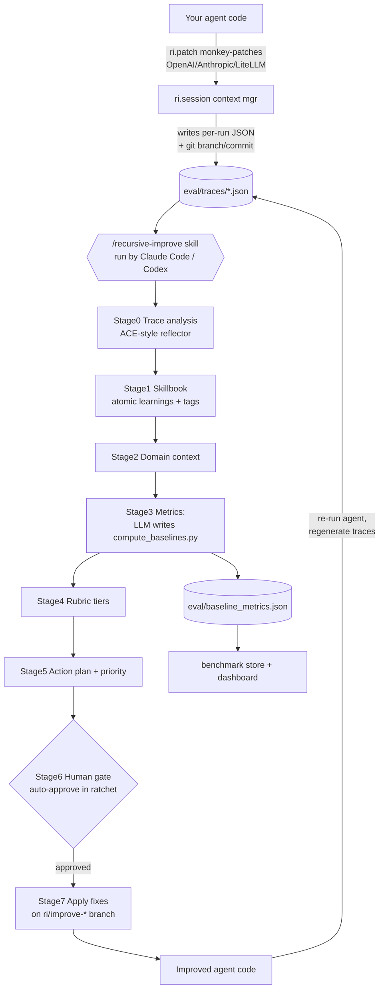

# recursive-improve (kayba-ai)

> Per-source research findings. Reporter, not architect. Written incrementally.

---

## 1. Identity

- **Name:** `recursive-improve` ("Make your agents recursively self-improve"; the loop is also branded "Closing the Loop").
- **What it is:** An open-source Python tool + Claude Code / Codex **skill bundle** that captures an LLM agent's execution traces, then drives a *coding agent* (Claude Code / Codex) through a structured pipeline that analyzes those traces, proposes prompt/code fixes to the **target agent**, applies them on a git branch, benchmarks before/after, and (optionally, via `/ratchet`) runs an autonomous keep-or-revert loop. **The thing being improved is the user's own agent (its prompts + code), not model weights, and the "improver" is an off-the-shelf coding agent following the bundled skill instructions.**
- **Authors/org:** Kayba (kayba.ai). Contributors per GitHub: `halluton`, `Lanzelot1` (2 contributors). Discord + @kaybaai on X. Kayba pitches a paid "managed recursive agent improvement at scale" offering.
- **Dates:** Repo created 2026-03-28; last push 2026-03-31 (inspected `main` at that head). Young (days old at inspection) and small (~6.9k LOC incl. tests).
- **Primary links:**
  - Repo: https://github.com/kayba-ai/recursive-improve
  - Homepage: https://kayba.ai/
  - Discord: https://discord.gg/mqCqH7sTyK
- **Code repo + commit SHA inspected:** `github.com/kayba-ai/recursive-improve` @ **`9cf4b85ef6ef66d37ea3c452f49114ff7db1b1a3`** (branch `main`, committed 2026-03-31T23:03:57Z). Apache-2.0. ~180 stars at inspection.

---

## 2. TL;DR

- **What it is:** trace-driven, *harness-only* self-improvement. It instruments your agent (`ri.patch()` monkey-patches OpenAI/Anthropic/LiteLLM; `ri.session()` writes trace JSON), then a coding agent reads the traces via a long, well-engineered **`SKILL.md`** (a 7-stage pipeline) and edits your agent's prompts/code on a dedicated git branch.
- **The loop has two modes:** (1) **human-in-the-loop** `/recursive-improve` — analyze → plan → *you approve* → fix; (2) **autonomous** `/ratchet` — improve → run agent → eval → **keep if composite score went up, else `git checkout -- . && git clean -fd`** → repeat overnight.
- **The verifier is the crux — and it is weak.** "Better" = a weighted **composite of self-defined, heuristic metrics** computed by detectors. The built-in detectors are regexes (loops, give-up phrases, "error" substrings, recovery, clean-success). Crucially `clean_success` keys off `trace["success"]`, which is **whatever the user's own code reported** in `run.finish(success=...)`. Domain metrics are written *by the LLM itself* in Stage 3 (`compute_baselines.py`). There is **no held-out task suite, no ground-truth oracle, no train/test split** in the loop — so the gate is gameable and noisy (re-running the agent yields fresh, stochastic traces each iteration).
- **Strongest signal = the prompt engineering, not the code.** `SKILL.md` / `RATCHET_SKILL.md` / `EVOLVE_SKILL.md` are unusually disciplined: atomicity-scored "atomic learnings," a skillbook with helpful/harmful tagging and quality gates, a verification pass that separates *what the agent claimed* from *what the tool data showed* (catches "confident but wrong"), a code-vs-prompt triage table, and a priority formula. These are directly reusable prompts/process for a trace-analysis sub-agent.
- **Maturity:** early, thin test coverage of the *loop's* validity, two contributors, vendor-flavored README ("90% of Claude's code is written by Claude… do the same for your agents"). Treat as a **well-designed skeleton + excellent prompt assets**, not a validated self-improvement system. No benchmark results are shipped proving the loop actually improves agents.

---

## 3. What it does & how it works

### 3.1 Components (from README + code)

| Layer | Module(s) | Role |
|---|---|---|
| **Capture** | `recursive_improve/capture/{patcher,session,normalize,git}.py` | `ri.patch()` monkey-patches OpenAI/Anthropic/LiteLLM SDKs; `ri.session()` context manager records every call + result + git state into `eval/traces/*.json`. |
| **Skills (the "brain")** | `recursive_improve/data/{SKILL,RATCHET_SKILL,EVOLVE_SKILL,BENCHMARK_SKILL}.md` | Markdown skill files installed into the user's project for Claude Code / Codex. `SKILL.md` is the 7-stage improvement pipeline. |
| **Eval (built-in verifier)** | `recursive_improve/eval/{detectors,runner,compare}.py` | Generic regex/heuristic detectors → aggregated rate metrics with confidence flags; compare two runs. |
| **Ratchet (autonomous loop)** | `recursive_improve/ratchet/{engine,scorer,git_ops,config,log}.py` | eval → composite score → `git commit` (keep) or `git checkout -- . / git clean -fd` (revert); JSONL log + markdown summary. |
| **Evolve (experimental)** | `recursive_improve/evolve/{engine,island,status}.py` | Island-model evolutionary variant orchestration (skeletal). |
| **Benchmark / Store / Dashboard** | `benchmark.py`, `store/*`, `dashboard/app.py` | Snapshot metrics as labeled "runs", store in JSON/SQLite, web dashboard to compare branches. |
| **CLI** | `cli.py` | `recursive-improve init / eval / benchmark / ratchet ... / dashboard`. |

### 3.2 The improvement pipeline (`SKILL.md`, 8 stages)

The `/recursive-improve` skill marches a coding agent through:

- **Stage 0 — Trace Analysis** (6 phases: Discover → Derive eval criteria → Survey all/sampled traces → Categorize → Deep-dive (verification + root-cause) → Synthesize "atomic learnings"). Explicitly *"adapts ACE's recursive reflector methodology."*
- **Stage 1 — Skill Management:** turn learnings into a **skillbook** (`eval/skillbook.json`) of imperative commands, with atomicity quality gates, dedup, ADD/UPDATE/TAG-helpful/TAG-harmful/REMOVE operations, rejection filters.
- **Stage 2 — Domain Context:** detect trace framework (tau2-bench / LangChain / LlamaIndex / raw OpenAI / OTel), single vs multi-agent, find system prompt, extract tools, catalog behavior patterns.
- **Stage 3 — Metrics:** run built-in eval, then **write `eval/compute_baselines.py`** with domain-specific detectors (the LLM authors the metrics), compute baselines.
- **Stage 4 — Rubric:** redundancy-check + tier metrics into LEADING / LAGGING / QUALITY, set directions, map insights→metrics.
- **Stage 5 — Action Plan:** triage each insight discard/code-fix/prompt-fix; priority `= Impact × Confidence × TierBonus ÷ RiskFactor`.
- **Stage 6 — Human gate:** present plan, do NOT auto-approve (except in ratchet mode), explain branch workflow.
- **Stage 7 — Fix Implementation:** on branch `ri/improve-<ts>`, apply minimal targeted changes, log each to `eval/changes_log.md`.

### 3.3 Architecture diagram



### 3.4 The autonomous verifier loop (`/ratchet`)

```mermaid
stateDiagram-v2
    [*] --> Configure: ask user objective,<br/>run cmd, metrics+weights,<br/>stopping conditions (program.md)
    Configure --> Branch: recursive-improve ratchet branch<br/>(ri/ratchet-<ts>)
    Branch --> Baseline: ratchet eval -> composite_score
    Baseline --> Improve: run /recursive-improve<br/>(auto-approve, no sub-branch)
    Improve --> RunAgent: rm traces; run agent cmd<br/>-> fresh traces
    RunAgent --> Eval: ratchet eval -> new_score
    Eval --> Decide
    state Decide <<choice>>
    Decide --> Keep: new_score > baseline
    Decide --> Revert: new_score <= baseline
    Keep --> Log: git commit; baseline = new_score
    Revert --> Log: git checkout -- . ; git clean -fd<br/>plateau++ 
    Log --> Stop
    state Stop <<choice>>
    Stop --> Improve: not done
    Stop --> [*]: iters>=max OR time>max OR plateau>=patience
```

---

## 4. Evidence from the code

Inspected `recursive-improve@9cf4b85:` (all paths below are relative to repo root).

### 4.1 Capture layer (how traces are made)

- **`recursive_improve/__init__.py`** — public API is tiny: `patch()`, `session(traces_dir, session_id, metadata)`, `TracedAgent(fn, ...)`. Version `0.1.0`.
- **`capture/patcher.py`** — `apply_patches()` monkey-patches three SDKs in place, using a `contextvars` flag so capture is zero-cost when no session is active, and suppresses nested OpenAI/Anthropic calls triggered by LiteLLM to avoid double-logging:
  ```python
  mod.Completions.create = _wrap_sync(mod.Completions.create, "openai")
  mod.AsyncCompletions.create = _wrap_async(mod.AsyncCompletions.create, "openai")
  # ... anthropic.resources.messages.Messages.create, litellm.completion/acompletion
  ```
- **`capture/session.py`** — `Session.__exit__` infers success from the absence of an exception unless the user called `finish(success=...)`. The trace JSON shape is the contract everything downstream reads:
  ```python
  trace = {"session_id", "timestamp", "duration_s", "success", "error",
           "output", "feedback", "git_branch", "git_commit", "metadata", "messages"}
  ```
  Note `git_branch`/`git_commit` are captured per run (enables branch comparison). **`success` is whatever the user reports** — there is no independent correctness check at capture time. Input messages are de-duplicated by a hash of `(role, content[:200], tool_call_id)`.

### 4.2 Built-in verifier = generic heuristics (`eval/detectors.py`, `eval/runner.py`)

Six detectors, all regex/heuristic, returning `numerator/denominator/value`:
- `detect_loops` — fires if a tool name repeats `>= 3` times consecutively.
- `detect_give_up` — regex over assistant text: `r"I'm unable to"`, `r"I cannot (complete|fulfill|process|help with)"`, `r"beyond my (ability|capabilities)"`, etc.
- `detect_errors` — substring regex on tool responses: `r"(error|exception|traceback|failed|...|forbidden|internal server error)"`.
- `detect_recovery` — error tool response followed by a non-error one.
- `detect_clean_success` — **`if not trace.get("success", False): return ...denominator=1` (no fire)**; else fires only if no other detector fired. So "clean success" is gated on the user's self-reported `success` flag.
- `detect_duration_outlier`, `detect_token_usage` — efficiency proxies.

`runner.run_eval` aggregates per-detector numerators/denominators across all traces, computes rates, and tags confidence: `"full" if denominator >= 5 else "directional-only"`. **There is no ground-truth oracle here** — these are universal failure smells, not task-correctness checks.

### 4.3 The keep/revert gate (`ratchet/scorer.py`, `ratchet/engine.py`, `ratchet/git_ops.py`)

The entire "is it actually better?" decision reduces to this scalar:

```python
# ratchet/scorer.py  — composite_score
for name, spec in config.metrics.items():
    if name not in metrics: continue
    value = metrics[name]["value"]
    if spec.direction == "minimize":
        value = 1.0 - value
    score += value * spec.weight
    total_weight += spec.weight
return round(score / total_weight, 4) if total_weight else 0.0
```

`ratchet_eval` (engine.py) runs the built-in detectors AND, if present, executes the **LLM-authored `eval/compute_baselines.py`** as a subprocess (600s timeout) and merges its `{name: {"value": ...}}` metrics. Keep/revert (from `RATCHET_SKILL.md` §4d):
- `new_score > baseline` → `recursive-improve ratchet commit` → `git add -A && git commit`; baseline updated.
- `new_score <= baseline` → `recursive-improve ratchet revert` → **`git checkout -- . ; git clean -fd`** (discards the iteration's edits + untracked files); plateau counter incremented.

So selection is **strict improvement on a self-defined weighted metric, with full revert on tie-or-worse.** Ties revert (conservative). Stopping: `iters>=max_iterations OR elapsed>max_duration_hours OR plateau>=plateau_patience` (`ratchet_status`).

### 4.4 The "brain" is the prompt, not the Python (`data/SKILL.md`, 746 lines)

The actual intelligence lives in the markdown skill that a coding agent (Claude Code/Codex) executes. The default invocation is hard-coded in `ratchet/config.py`:

```python
improve_command = (
    'claude -p "Run /recursive-improve in ratchet mode. '
    "Auto-approve all fixes (choose [A]). "
    "Apply changes directly to the working tree, do not create an improvement branch. "
    'Read eval/ratchet_log.jsonl for context on past iterations." '
    "--allowedTools Edit,Write,Bash,Read,Glob,Grep"
)
```

`SKILL.md` Stage 0 states verbatim: *"This stage adapts ACE's recursive reflector methodology — a structured 6-phase strategy…"* and Stage 5 carries the priority formula `Priority Score = Impact × Confidence × Tier Bonus ÷ Risk Factor`. The skillbook schema (Stage 1) is ACE's "bullet" with helpful/harmful counters:
```json
{"id":"section-00001","section":"error_handling",
 "content":"Verify customer identity before making account changes",
 "evidence":"...trace_003.json (msg 12)","helpful":0,"harmful":0,"status":"active"}
```

### 4.5 The planted demo trace reveals the verifier's blind spot (`examples/`)

`examples/technova_agent.py`'s `SYSTEM_PROMPT` is the **already-hardened** prompt ("Always verify the customer's identity using `get_user` before… Do not fabricate refund timelines… Do not offer returns…"). But the shipped sample trace `examples/sample-traces/cancel_shipped_order.json` embeds the **weaker** prompt and shows the agent (a) calling `get_order_by_id` with no prior `get_user` identity check and (b) inventing a "returns department" process its tools don't support — yet the trace is recorded `"success": true`. This is the canonical before/after pair the pipeline is built to detect. **Critically, the built-in detectors would NOT flag either failure** (no loop, no give-up phrase, no "error" string, self-reported success). Only a Stage-3 LLM-authored "ground-truth comparison / ordering" detector could — which means the verifier's ability to catch correctness regressions is exactly as good as the metrics the LLM chooses to write.

### 4.6 A real verifier IS reachable — if the user wires a benchmark

`examples/harbor_compute_baselines.py` ("Copy this to `eval/compute_baselines.py`…") parses a **terminal-bench / Harbor** job dir and reads `result["verifier_result"]["rewards"]["reward"]` — i.e. an actual task pass/reward from a benchmark harness, turned into a `pass_rate` metric. And `terminal_bench_split.json` ships a **30/70 train/test split (seed 42) over 89 terminal-bench@2.0 tasks** (27 test / 62 train). So the *intended serious* configuration grounds the composite score in real, externally-judged task success on a held-out split. The default out-of-the-box path (regex detectors over self-reported `success`) is the weak fallback.

### 4.7 Evolutionary variant (`evolve/*`, `data/EVOLVE_SKILL.md`)

`/evolve` cites **"Mind Evolution."** `evolve_init` creates N `git worktree` islands (`.ri-islands/island-{i}`, branch `ri/evolve-<ts>-island-{i}` off the base ref). The skill drives each island through `/recursive-improve` (auto-approve), scores it with the *same* `ratchet eval` composite, then `evolve_update` records `island_scores`. Cross-pollination (gen > 1): each island reads all other islands' diffs but is told to deeply reference the **best** island (exploit) plus **one random** island (explore); one island per generation (`island_id == generation % n_islands`) skips cross-pollination to **preserve diversity**. `converged = generation >= n_generations`; finalize promotes the best island to `ri/evolve-<ts>-result`. The Python is pure bookkeeping — the genetic operators (mutation = run the pipeline; recombination = read-and-merge-diffs) are entirely prompt-driven by the LLM.

### 4.8 Tests — what is actually validated

`tests/test_eval.py`, `test_capture.py`, `test_compare.py`, `test_store.py`, `test_git_reader.py`, `test_cli.py` validate **plumbing only**: detectors fire on hand-crafted fixtures, the runner aggregates, trace-loading skips bad JSON, the store/compare/CLI work. **No test exercises the end-to-end improvement loop, and none tests whether the verifier correlates with real task success or resists gaming.** There are zero shipped benchmark results in the repo proving the loop improves an agent.

---

## 5. What's genuinely smart

1. **Harness-only self-improvement framed as "closing the loop" on a stateless agent.** The core thesis — your agent is stateless, every run starts from scratch, so capture traces and let a coding agent edit prompts/code so improvements *compound* — is exactly the seed-AI loop, restricted to the safe surface (prompts + code, never weights). The git-branch-per-cycle design makes every improvement auditable, reviewable (`git diff main...ri/improve-<ts>`), and trivially discardable.
2. **Trace capture is genuinely frictionless and well-built.** `ri.patch()` + `with ri.session():` is two lines, provider-agnostic (OpenAI/Anthropic/LiteLLM), `contextvars`-gated for zero overhead when idle, with nested-call de-duplication and per-run git metadata. This is a clean, copyable instrumentation pattern.
3. **The trace-analysis prompt (`SKILL.md` Stage 0) is unusually disciplined and is the real asset.** It forces *discover → derive criteria → survey → categorize → deep-dive → synthesize*, processes traces in batches of ~3 to manage context, mandates **re-reading the FULL raw trace** for deep-dives (not summaries of summaries), and runs a **verification pass that separates what the agent *claimed* from what the tool data actually *showed*** to catch "confident but wrong" errors that behavioral analysis misses. These are transferable techniques for any long-horizon trace/log analysis sub-agent.
4. **Atomicity-scored "atomic learnings" + a skillbook with helpful/harmful counters (from ACE).** Each insight gets an atomicity score (1.0 minus deductions for "and/also", vague terms, length), must be rewritten as an **imperative command** (not an observation), is deduplicated against an existing skillbook by semantic overlap, and is tagged helpful/harmful with a rule that a skill tagged harmful 3+ times is removed. This is a concrete, gameable-resistant recipe for accumulating durable lessons without context collapse.
5. **Insight → metric → fix traceability with explicit triage and risk.** Every fix traces to a specific insight linked to a specific metric; a code-vs-prompt decision table assigns fix type by root cause ("agent has the info but reasons wrong" → prompt; "agent ignores the instruction" → code guardrail); risk tiers (None/Low/Medium/High) gate the priority formula. This is good engineering hygiene for *automated* edits.
6. **The ratchet is a clean, conservative keep-or-revert harness.** Strict-improvement gate, full `git clean -fd` revert on regression, plateau/iteration/time stopping, and a "read the prior iterations' log before improving, avoid repeating reverted approaches" rule. The pattern (a cheap composite score driving an automated git keep/revert loop overnight) is directly reusable as scaffolding — *its quality depends entirely on the score you plug in.*
7. **It separates "what to optimize" into a declarative `program.md`.** Objective + agent run command + weighted metrics (minimize/maximize) + stopping conditions live in one parsed file, so the same loop generalizes across agents/domains.

---

## 6. Claims vs. reality / limitations / critiques

**The headline number is the author's, for the commercial product, not this repo.** Kayba's announcement/changelog claims *"First test on tau2-bench: 34.3% improvement after a single cycle auto-accepting all changes"* (kayba-ai/agentic-context-engine Discussion #105; kayba.ai/changelog). That figure is attributed to the Kayba CLI / ACE pipeline, **not** demonstrated by `recursive-improve@9cf4b85` — the OSS repo ships **no** benchmark results, and its tests cover only plumbing. Treat 34.3% as an unverified marketing claim.

**The default verifier is weak and gameable — the central limitation for our purposes.**
- "Better" = higher weighted average of **metrics the system itself defines** (Stage 3 `compute_baselines.py` is written by the LLM) plus generic regex detectors. With no held-out ground truth, the loop can improve the *score* without improving the *agent* — e.g. by writing lenient detectors, or by the agent learning to avoid give-up phrases / "error" strings rather than actually succeeding. The skill even instructs the fixer not to re-run `compute_baselines.py` after fixes (baselines reflect old traces), so within a cycle the metric definitions are fixed, but across cycles the LLM re-authors them.
- `clean_success_rate` is gated on **self-reported `success`** (`run.finish(success=...)`), which the planted demo shows can be `true` on a policy-violating, fabricating run. So the strongest "success" signal is only as honest as the user's harness.
- **Re-running the agent each iteration produces fresh, stochastic traces.** The composite is computed over a new sample every time, so score deltas conflate real improvement with sampling noise — and there is no significance test, only `new > baseline`. Small trace counts (the example ships 5) make this acute; the confidence flag (`>=5` denom) is informational only and does not gate the keep decision.
- The keep/revert math lives in `RATCHET_SKILL.md` prose executed by an LLM, not in deterministic code (the Python only *computes* the score and *performs* the git ops). An LLM driving the loop can deviate from the rules.

**The real intelligence is outsourced and unbenchmarked.** All analysis, metric design, and fixes are produced by an external coding agent following markdown. Quality, cost, and reproducibility therefore depend on that agent and model; the repo provides no eval of how good the produced fixes are, nor guardrails against the fixer introducing regressions outside the measured metrics.

**Maturity / provenance.** Days-old at inspection, 2 contributors, `v0.1.0`, vendor-flavored README ("90% of Claude's code is written by Claude… do the same for your agents") with a CTA to the paid Kayba product. It is the OSS spin-off of Kayba's larger `agentic-context-engine` (ACE, ~2K stars) and hosted product. The genuinely novel research it leans on (ACE's evolving-playbook / Reflector / helpful-harmful bullets) is **Stanford/SambaNova/Berkeley's**, arXiv:2510.04618 — recursive-improve operationalizes ACE as Claude Code skills, it does not originate the method.

**Could not verify:** that the loop produces net improvement on any task; the 34.3% tau2-bench figure; whether `/evolve` has ever been run end-to-end (it is the most skeletal subsystem); any reward-hacking incidence (no logs/results shipped).

---

## 7. Relevance to a self-improving, evolutionary software-building agent

Directly on-theme; it is a working (if early) instantiation of the propose→test→keep loop, restricted to harness edits. What transfers:

- **Frictionless trace/observability capture** (`ri.patch()` + `ri.session()`): for any long-horizon agent you want to self-improve, you first need cheap, structured capture of every model call + outcome + git state. The contextvars-gated monkey-patch + JSON-per-run schema is a clean template. → *helps with: the data substrate for self-improvement; long-horizon observability.*
- **The disciplined trace-analysis pipeline (Stage 0–1)**: discover→criteria→survey→deep-dive→synthesize, batch processing for context limits, full-raw-trace re-reading for deep-dives, and the **claim-vs-data verification pass** that catches "confident but wrong." → *helps with: turning execution history into reliable, evidence-cited lessons; decision-making quality.*
- **ACE-style skillbook with helpful/harmful counters and atomicity gates**: a concrete memory format for accumulating durable, imperative lessons that resists context collapse and prunes harmful entries. → *helps with: long-term agent memory / self-curated playbooks.*
- **Insight→metric→fix traceability + code-vs-prompt triage + risk-weighted priority**: a structured way to decide *which* harness change to make and *how risky* it is, with an audit trail. → *helps with: making good, attributable self-edit decisions; orchestration of an improvement step.*
- **The ratchet keep-or-revert scaffold**: a reusable autonomous loop (baseline → improve → re-run → eval → strict-improve-keep-else-`git clean` → plateau/stop) with a JSONL log read back as context to avoid repeating failures. → *helps with: long-horizon autonomous running with a safety net; the "keep only if verifiably better" control structure.* **Caveat:** the structure is sound but the supplied verifier is weak — the lesson for us is that the gate must be a real held-out test, which the Harbor example shows is pluggable.
- **`git worktree` islands + exploit-best/explore-random cross-pollination + a diversity island**: a lightweight evolutionary search topology over agent variants that doesn't need any special infra beyond git. → *helps with: population-based / evolutionary harness search.*
- **A real verifier is reachable**: the terminal-bench train/test split + Harbor reward-parsing example is a concrete pattern for grounding "better" in externally-judged task success on a held-out split — exactly the verifier rigor the default path lacks. → *helps with: the verifier/selection rule done properly.*

What does NOT transfer / cautionary: the default heuristic-metric verifier (would let a software-building agent game its own score); the unproven claim that the loop nets improvement; the LLM-in-prose control flow (we'd want deterministic gating).

---

## 8. Reusable assets (collected as evidence; not assembled into a design)

**A. Two-line frictionless capture** — `repo@9cf4b85:recursive_improve/__init__.py` + `capture/session.py`:
```python
import recursive_improve as ri
ri.patch()                       # contextvars-gated monkey-patch of openai/anthropic/litellm
with ri.session("./eval/traces") as run:
    result = my_agent("...")
    run.finish(output=result, success=True)
```
Trace JSON schema (the downstream contract): `{session_id, timestamp, duration_s, success, error, output, feedback, git_branch, git_commit, metadata, messages[]}`.

**B. The keep/revert gate** — `repo@9cf4b85:recursive_improve/ratchet/scorer.py` (composite, minimize→`1-value`, weighted mean) and `ratchet/git_ops.py` (`git checkout -b ri/ratchet-<ts>`; keep=`git add -A && git commit`; revert=`git checkout -- . ; git clean -fd`). The loop spec is `data/RATCHET_SKILL.md` §4.

**C. `program.md` declarative optimization config** — `repo@9cf4b85:recursive_improve/ratchet/config.py` parses sections: Objective / Agent Run Command / Traces Directory / Metrics (`- name: minimize|maximize (weight: w)`) / Stopping Conditions (`max_iterations`, `max_duration_hours`, `plateau_patience`) / Time Budget / Evolution (`n_islands`, `n_generations`).

**D. Default self-improve invocation (verbatim)** — `repo@9cf4b85:recursive_improve/ratchet/config.py`:
> `claude -p "Run /recursive-improve in ratchet mode. Auto-approve all fixes (choose [A]). Apply changes directly to the working tree, do not create an improvement branch. Read eval/ratchet_log.jsonl for context on past iterations." --allowedTools Edit,Write,Bash,Read,Glob,Grep`

**E. The Stage 0 trace-analysis methodology and the atomicity rubric (verbatim)** — `repo@9cf4b85:recursive_improve/data/SKILL.md`:
- Atomicity score: *"base 1.0, deduct 0.15 per 'and/also/plus', 0.20 per vague term, 0.05 per word over 15."*
- Verification pass (Stage 0 Phase 5): separate *what the agent claimed* from *what the tool response shows*; list incorrect claims (claim / data / impact). *"This catches 'confident but wrong' errors… that behavioral analysis alone misses."*
- Imperative-command rule: *"BAD: 'The agent accurately answers factual questions' (observation) / GOOD: 'Answer factual questions directly and concisely' (imperative)."*

**F. Code-vs-prompt triage table + priority formula (verbatim)** — `repo@9cf4b85:recursive_improve/data/SKILL.md` Stage 5: signals→fix-type table (info-but-wrong→PROMPT; ignores-instruction→CODE guardrail; lacks-tool→CODE; …) and `Priority Score = Impact × Confidence × Tier Bonus ÷ Risk Factor` with `Confidence: n≥20→1.0, 10-19→0.8, 5-9→0.6, <5→0.3`; `Tier Bonus: leading 1.5x`; `Risk Factor: None/Low 1.0, Medium 1.5, High 2.0`.

**G. ACE-style skillbook schema** — `repo@9cf4b85:recursive_improve/data/SKILL.md` Stage 1: `{id, section, content (imperative), evidence, justification, helpful, harmful, status}`; ops ADD/UPDATE/TAG-helpful/TAG-harmful/REMOVE; *"Skill tagged harmful 3+ times → REMOVE."*

**H. Generic trace detectors (regex bank)** — `repo@9cf4b85:recursive_improve/eval/detectors.py`: loop (`>=3` consecutive same tool), give-up phrase regex, error-substring regex, recovery, clean-success (gated on `success`), duration outlier, token usage. Confidence flag `full if denom>=5 else directional-only` (`eval/runner.py`).

**I. Real held-out verifier pattern** — `repo@9cf4b85:examples/harbor_compute_baselines.py` (parse `verifier_result.rewards.reward` from a terminal-bench/Harbor job into a `pass_rate` metric) + `terminal_bench_split.json` (seeded 30/70 train/test over 89 tasks).

**J. `git worktree` island evolution** — `repo@9cf4b85:recursive_improve/evolve/island.py` (`git worktree add ... -b ri/evolve-<ts>-island-{i} <base_ref>`) + `data/EVOLVE_SKILL.md` cross-pollination rule (deeply reference best + one random; diversity island skips when `island_id == generation % n_islands`).

---

## 9. Signal assessment

- **Overall value: MEDIUM** (medium-high specifically for *prompt/scaffold assets and the loop topology*; low for *evidence that it works*).
- **Why medium, not high:** the architecture and especially the `SKILL.md` prompts are directly on-theme, concrete, and copyable, and the harness-only git keep/revert loop is exactly our control structure. But the load-bearing piece for a *trustworthy* self-improving agent — the verifier — is, by default, a self-defined heuristic that is gameable and noisy, and the repo ships **no** evidence the loop nets improvement. The genuine research underneath (ACE) is someone else's.
- **Why not low:** it is a clean, real implementation of the propose→test→keep loop on the safe (harness) surface, with unusually disciplined trace-analysis and memory-curation prompts, and it explicitly demonstrates (via the Harbor example + train/test split) how to ground the gate in a real benchmark — i.e. it shows both the weak default and the path to a strong verifier.
- **Confidence:** high on *what the code/prompts do* (read directly at a pinned SHA); high on the verifier being weak-by-default; medium on the provenance/commercial framing (corroborated by Kayba's own posts); low on any efficacy claim.
- **Could not verify:** net improvement on any benchmark; the 34.3% tau2-bench claim; that `/evolve` runs end-to-end; reward-hacking frequency.

---

## 10. References

**Primary — code (inspected at pinned SHA `9cf4b85ef6ef66d37ea3c452f49114ff7db1b1a3`, branch `main`):**
- `recursive-improve@9cf4b85:README.md` — thesis, architecture diagram, install/usage.
- `recursive-improve@9cf4b85:recursive_improve/__init__.py` — public API (`patch`, `session`, `TracedAgent`).
- `recursive-improve@9cf4b85:recursive_improve/capture/{patcher,session,normalize,git}.py` — trace capture.
- `recursive-improve@9cf4b85:recursive_improve/data/SKILL.md` — the 8-stage improvement pipeline (the core asset).
- `recursive-improve@9cf4b85:recursive_improve/data/{RATCHET_SKILL,EVOLVE_SKILL,BENCHMARK_SKILL}.md` — autonomous loop, evolution, benchmark skills.
- `recursive-improve@9cf4b85:recursive_improve/eval/{detectors,runner,compare}.py` — built-in heuristic verifier.
- `recursive-improve@9cf4b85:recursive_improve/ratchet/{engine,scorer,git_ops,config,log}.py` — keep/revert gate + composite score.
- `recursive-improve@9cf4b85:recursive_improve/evolve/{engine,island,status}.py` — git-worktree island model.
- `recursive-improve@9cf4b85:recursive_improve/{benchmark,cli}.py`, `store/*`, `dashboard/app.py` — benchmarking, storage, dashboard.
- `recursive-improve@9cf4b85:examples/technova_agent.py` + `examples/sample-traces/cancel_shipped_order.json` — planted before/after demo.
- `recursive-improve@9cf4b85:examples/harbor_compute_baselines.py` + `terminal_bench_split.json` — real (Harbor/terminal-bench) verifier + train/test split.
- `recursive-improve@9cf4b85:tests/test_eval.py` (+ other tests) — plumbing-only coverage.

**Primary — author/vendor statements:**
- Repo home (stars, topics, description): https://github.com/kayba-ai/recursive-improve — *primary.*
- "Introducing the Kayba CLI…" announcement (34.3% tau2-bench claim): https://github.com/kayba-ai/agentic-context-engine/discussions/105 — *primary (author claim).*
- Kayba changelog (same claim + ACE/Recursive-Reflector release notes): https://kayba.ai/changelog — *primary (vendor).*
- Kayba product site (commercial verifier framing: confidence scores, regression checks): https://kayba.ai/ — *primary (vendor, marketing).*
- ACE releases v0.8.8 / v0.9.0 (Recursive Reflector, 7-stage pipeline, `.claude/skills`): https://github.com/kayba-ai/agentic-context-engine/releases — *primary.*

**Secondary — the research it operationalizes (someone else's method):**
- ACE: "Agentic Context Engineering: Evolving Contexts for Self-Improving Language Models," Zhang, Hu et al. (Stanford / SambaNova / UC Berkeley), arXiv:2510.04618 — https://arxiv.org/abs/2510.04618 ; project: https://ace-agent.github.io/ ; code: https://github.com/ace-agent/ace — *primary for the playbook/Reflector/helpful-harmful-bullet method that SKILL.md adapts.*
- Dynamic Cheatsheet (Suzgun et al., 2025) — cited by ACE as the basis for evolving memory bullets — *secondary, upstream.*
- "Mind Evolution" — named in `EVOLVE_SKILL.md` as inspiration for the island/cross-pollination search — *secondary, upstream (not independently verified here).*
