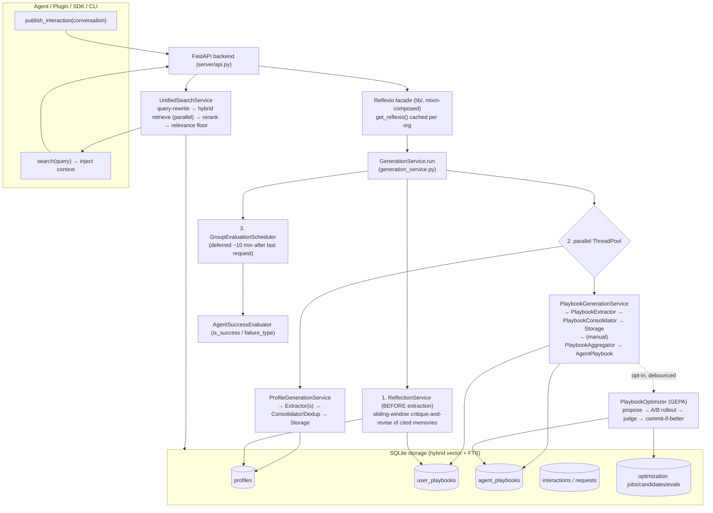
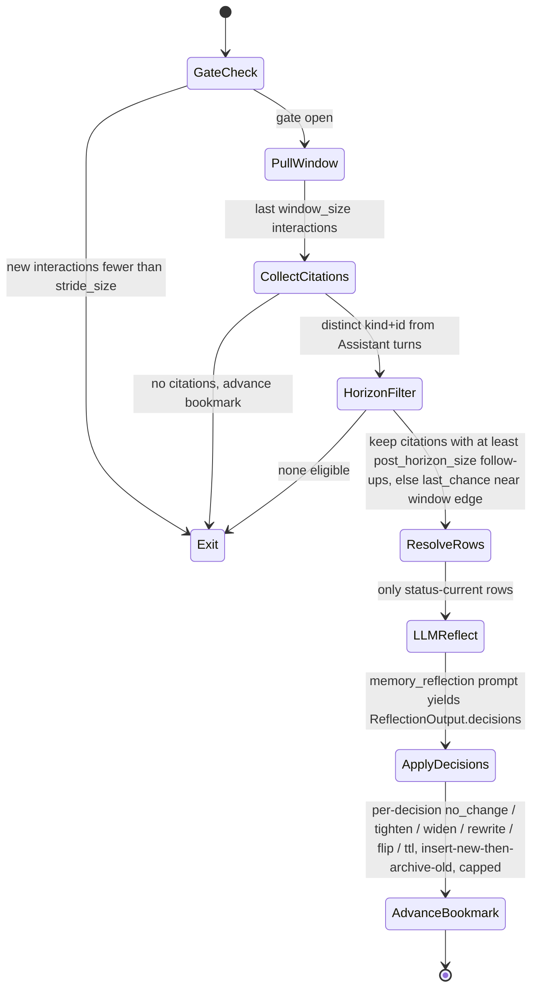

# Reflexio (ReflexioAI) — Research Findings

> Research conducted 2026-06-05. Single source: the `ReflexioAI/reflexio` repository.
> This file is written incrementally as the code is read.

---

## 1. Identity

- **Name:** Reflexio (org/PyPI: `reflexio-ai`; client package `reflexio-client`).
- **What it is (per the repo's own words):** an *"AI agent self-improvement harness that enables your AI agents to continuously learn from real user interactions. It turns user corrections into persisted behavioral improvements for agents and capturing successful execution paths for reuse."* (`README.md` L48–56). The server `OVERVIEW.md` tagline: *"Enable AI agent to self-improve through user interactions."*
- **IMPORTANT — it is NOT the academic "Reflexion" (Shinn et al., 2023).** Despite the name, this is not a verbal-RL inner-loop reasoning agent. Reflexio is an **external memory/learning service**: a FastAPI backend + SQLite store + Python SDK + Claude-Code/OpenClaw plugins that ingest an agent's conversations and *distill* them into two reusable artifact types — **user profiles** (facts/preferences about a user) and **agent playbooks** (trigger→instruction→pitfall SOPs). It then serves those back at retrieval time to steer future runs. (Relationship to academic Reflexion discussed in §6; there is one internal `memory_reflection` prompt family that is closer in spirit, see §4.)
- **Author/org:** Primary author **Yi Lu** (GitHub `yilu331`, `yyiilluu331@gmail.com`; commits authored from "Yis-MacBook-Pro"). Org **ReflexioAI** on GitHub. Project website cited as `https://www.reflexio.ai/docs`. License **Apache-2.0**.
- **Maturity / activity:** Actively developed. Latest release **v0.2.24** at inspection. Large codebase (Python server + Next.js docs/site + TS plugins), **~2,933 unit/integration tests** passing per the most recent merged PR (#128). CodeRabbit + `/check-and-test` CI workflow referenced. Uses `uv` packaging, Python ≥ 3.12, LiteLLM for multi-provider LLM access.
- **Primary links:**
  - Repo: https://github.com/ReflexioAI/reflexio (PRIMARY)
  - Docs site: https://www.reflexio.ai/docs (PRIMARY, not fetched — see §9 limitations)
  - PyPI: `reflexio-ai`, `reflexio-client`
  - Sister project: https://github.com/ReflexioAI/claude-smart (Claude Code plugin, the successor to the removed `claude-code` hook integration)
- **Code inspected:** `ReflexioAI/reflexio@9cfb1be38316c8eee62d7e9aa07500b82c78d7fa` (branch `main`, "Release v0.2.24", committed 2026-06-05 by Yi Lu). Inspected via codeload tarball (the sandbox proxy blocked `git clone`; `.git` not present, so SHA obtained from the GitHub API for `main`).

---

## 2. TL;DR

- Reflexio is a **standalone self-improvement *harness*** (a service + SDK + agent plugins), **not** a reasoning agent and **not** academic Reflexion. Its job: turn an agent's conversation logs (especially *user corrections* and *expert ideal answers*) into durable, retrievable **playbooks** and **profiles**, so the agent "never repeats the same mistake."
- The load-bearing loop is **extract → cluster/aggregate → consolidate → (optionally) optimize against a judge → retrieve**. Every stage is an LLM call driven by a **versioned prompt bank** (`reflexio/server/prompt/prompt_bank/`), which is itself the most reusable asset here.
- There is a genuine **verifier/selection mechanism**: `playbook_optimizer/` runs candidate playbook-instruction variants through **rollouts** scored by an **LLM judge** (a GEPA-style optimizer, `gepa_adapter.py`), and only promotes a candidate if it wins — i.e. *propose → test → keep only if better*, exactly the pattern this project cares about, applied to **prompts/playbooks** rather than to code.
- **Memory of past reflections** is concrete: a separate `reflection/` service distills cross-session "lessons" with a 7-times-iterated `memory_reflection` prompt; playbooks carry version lineage (current→pending→archived) with approve/reject human gates; storage is hybrid vector + FTS SQLite with ~57 ms p50 search.
- **Relevance to us: medium-high.** It is *not* an evolutionary software-builder, and its headline benchmark is narrow (4/5 GDPVal tasks, one model, warm-baseline comparison). But its memory schema, its playbook-as-SOP data structure, its GEPA-judge promotion loop, and its very large bank of battle-tested extraction/evaluation/reflection prompts are directly mineable for a self-improving harness.

---

## 3. What it does & how it works

### 3.1 The product shape

Reflexio is a **sidecar service** an agent talks to over HTTP. The agent keeps doing its job; Reflexio sits beside it and does two things:

1. **Write path (learning):** the agent (or a plugin hook) `publish`es completed conversations. Reflexio mines them into durable artifacts: **UserProfiles** (facts/preferences about one user) and **Playbooks** (reusable task SOPs). Playbooks come in two scopes: per-user `UserPlaybook` rows, and cross-user `AgentPlaybook` rows aggregated from many users' playbooks. It also runs **success evaluation** on sessions.
2. **Read path (steering):** before the agent answers, it `search`es Reflexio; matching profiles/playbooks are injected into the prompt as context. The agent marks which injected items actually shaped its reply via **Citations**, which later feed reflection.

Everything runs locally by default: a FastAPI backend on :8081, SQLite storage under `~/.reflexio`, multi-provider LLM access via LiteLLM, embeddings via a local provider or service.

### 3.2 Architecture



### 3.3 The core write-path loop (one `publish`)

`GenerationService.run` (repo@9cfb1be:`reflexio/server/services/generation_service.py` L131–387) executes, per published conversation:

1. Best-effort **retention cleanup** of capped tables.
2. Store the `Request` + `Interaction` rows (bulk insert with batched embeddings).
3. **Learning-stall guard**: if a prior provider auth/billing failure set a stall flag, store raw interactions but skip extraction (return a warning) unless `override_learning_stall=True`.
4. **`_maybe_run_reflection`** — the sliding-window critique-and-revise pass — runs *before* extraction so extractors see post-reflection state. Wrapped in try/except so a reflection bug never breaks publish.
5. **Parallel** `ProfileGenerationService.run` + `PlaybookGenerationService.run` in a 2-worker `ThreadPoolExecutor` (600 s timeout; each failure logged but isolated).
6. **Schedule deferred group evaluation** if a `session_id` is present (the `GroupEvaluationScheduler` fires ~10 min after the last request in the session).

### 3.4 The reflection loop (closest thing to academic "Reflexion")



The key idea: a memory row is only re-judged **after the agent has actually used it and we can see what happened next** (post-citation horizon ≥ 3 turns, default). The LLM then decides — with a strong `no_change` default and a minimal-edit principle — whether to tighten, widen, rewrite, flip a rule's orientation, or change a profile's TTL. Revisions are versioned (insert new "current" row, archive the cited row).

### 3.5 The verifier/promotion loop (PlaybookOptimizer, GEPA)

This is the part that most directly matches "propose → test → keep only if verifiably better." It is **opt-in** (`enabled=False` by default) and needs an external assistant backend (webhook or local script) to replay against.

```mermaid
sequenceDiagram
    participant S as Scheduler debounce+jitter+cooldown
    participant O as PlaybookOptimizer
    participant G as GEPA external lib
    participant A as Adapter paired rollouts
    participant R as Assistant backend webhook/script
    participant J as PairwiseJudge LLM
    participant DB as Storage

    S->>O: optimize target playbook
    O->>O: load incumbent; resolve source windows; split train/val
    O->>G: gepa.optimize seed=incumbent.content, train, val, adapter
    loop GEPA search: max_metric_calls, pareto frontier, merge
        G->>A: evaluate candidate_content over window batch
        A->>R: rollout SAME user turns with INCUMBENT playbook
        A->>R: rollout SAME user turns with CANDIDATE playbook
        A->>J: judge incumbent_rollout vs candidate_rollout
        J-->>A: verdict + score + likert + ASI failure_modes, recommended_mutation
        A->>DB: persist candidate + evaluation rows
        A-->>G: scores, cache hits reused
        G->>A: make_reflective_dataset feedback drives reflective mutation
    end
    G-->>O: best_candidate, val_aggregate_scores
    O->>O: commit thresholds? score at least 0.75 AND at least min_commit_windows val windows verdict=candidate, likert at least 4, no aborts
    alt passes
        O->>DB: archive incumbent, insert successor playbook PENDING
    else fails
        O->>DB: persist winner only no commit, or fail on abort
    end
```

The **isolation that makes the verdict meaningful**: the *user turns are replayed verbatim*; only the injected playbook changes between the two rollouts (`rollout.py` L9–35). The judge is pairwise (candidate vs incumbent) and emits structured "actionable side information" (ASI) — including a `recommended_mutation` that GEPA's reflective step consumes. A successor is committed **only** if it clears score/Likert/per-window thresholds on the held-out validation windows; otherwise the winner is persisted for inspection but not adopted.

---

## 4. Evidence from the code

All references are `repo@9cfb1be38316c8eee62d7e9aa07500b82c78d7fa:path`.

### 4.1 Files / modules inspected

| Area | Path | What it holds |
|---|---|---|
| Orchestrator facade | `reflexio/lib/reflexio_lib.py` (+ `_*.py` mixins) | `Reflexio` assembled from 10 domain mixins (interactions, profiles, playbooks, generation, reflection, search, …). |
| Write-path orchestration | `reflexio/server/services/generation_service.py` | `GenerationService.run` — the per-publish loop (reflection → parallel extraction → deferred eval). |
| Reflection | `reflexio/server/services/reflection/reflection_service.py`, `reflection_extractor.py` | Sliding-window critique-and-revise of cited memories. |
| Reflection prompt | `reflexio/server/prompt/prompt_bank/memory_reflection/v1.6.0.prompt.md` (7 versions present) | The verbatim critique-and-revise instructions. |
| Playbook extraction | `reflexio/server/services/playbook/playbook_extractor.py`, `playbook_generation_service.py` | Resumable extraction (tools: `ask_human`, `finish_extraction`). |
| Extraction prompts | `playbook_extraction_context/v4.2.0`, `playbook_extraction_main/v1.2.0`, `_expert` variants | Correction-SOP + Success-Path-Recipe mining. |
| Consolidation | `reflexio/server/services/playbook/playbook_consolidator.py` + `playbook_consolidation/v2.3.0.prompt.md` | Per-pair unify/reject/differentiate/independent with MDL re-synthesis. |
| Aggregation (cross-user) | `reflexio/server/services/playbook/playbook_aggregator.py` (1388 LoC) + `playbook_aggregation/v2.2.0` | HDBSCAN→Agglomerative clustering of user playbooks → `AgentPlaybook`. |
| Optimizer (verifier) | `reflexio/server/services/playbook_optimizer/{optimizer,gepa_adapter,judge,rollout,scheduler,models,assistant_webhook}.py` | GEPA propose→A/B-rollout→judge→commit-if-better. |
| Judge prompt | `reflexio/server/prompt/prompt_bank/playbook_optimizer_judge/v1.2.0.prompt.md` | Pairwise rollout judge. |
| Success eval | `reflexio/server/services/agent_success_evaluation/*` + `agent_success_evaluation/v1.0.0.prompt.md` | Deferred per-session success/failure classification. |
| Read path | `reflexio/server/services/unified_search_service.py`, `pre_retrieval/`, `llm/rerank/`, `retrieval/relevance_floor.py` | Query-rewrite → hybrid retrieve → rerank → relevance floor. |
| Data model | `reflexio/models/api_schema/domain/entities.py`, `enums.py`, `config_schema.py` | Pydantic schemas for every artifact + config thresholds. |
| Benchmark | `benchmark/gdpval/RESULTS.md` + `reflexio/benchmarks/retrieval_latency/` | GDPVal self-improvement study; retrieval-latency micro-bench. |

There IS real, substantial code — this is not a paper or a stub. ~2,933 unit tests pass per PR #128.

### 4.2 The reflection loop (verbatim mechanism)

`reflection_service.py` L100–166 — gate, window, citation collection, post-horizon filter:

```python
window_size = config.window_size if config else 10
stride_size = config.stride_size if config else 5
...
new_count = sum(len(m.interactions) for m in new_models)
if new_count < stride_size:
    return result            # gate closed
...
citations = _collect_citations(window_interactions)   # distinct (kind,id) on Assistant turns
...
post_horizon_size = (reflection_config.post_horizon_size if reflection_config else 3)
eligible = _filter_citations_by_horizon(citations=citations, window=window_interactions,
                                        post_horizon_size=post_horizon_size, stride_size=stride_size)
```

`_filter_citations_by_horizon` (L742–803) is the load-bearing idea — only reflect on a memory once you can see what happened *after* the agent used it:

```python
after_count = len(window) - position - 1
if post_horizon_size <= 0 or after_count >= post_horizon_size:
    out.append(_EligibleCitation(citation=cite, position=position, has_full_horizon=True))
elif position < stride_size:   # about to fall out of window → last chance, weaker evidence
    out.append(_EligibleCitation(citation=cite, position=position, has_full_horizon=False))
# else: deferred — not included
```

Revisions are versioned via **insert-new-then-archive-old** (`_replace_playbook` L524–582; same for profiles), so a crash never loses data:

```python
storage.save_user_playbooks([new_playbook])
try:
    archived = storage.archive_user_playbook_by_id(user_id=owning_user_id, user_playbook_id=cited.user_playbook_id)
```

The `memory_reflection` v1.6.0 prompt frames the whole task (verbatim opener):

> "You are reviewing how the agent applied a small set of remembered facts and rules across a recent slice of conversation, **with the benefit of seeing what happened *after* the agent used them**. Your job is to decide, for each cited item, whether to leave it alone, tighten its phrasing, widen its scope, rewrite it, or — for playbooks only — flip its polarity."

…with a hard `no_change` default, a "minimal-edit principle," and an "over-specialization guard." `ReflectionConfig` defaults (`config_schema.py` L530–550): `window_size=10`, `stride_size=5`, `post_horizon_size=3`, `max_revisions_per_pass=8`.

### 4.3 The playbook data structure (`entities.py`)

```python
class Citation(BaseModel):                  # L128 — drives reflection
    kind: Literal["playbook", "profile"]
    real_id: str                            # stable storage id
    tag: str = ""                           # injection-time rank tag (debug)
    title: str = ""

class UserPlaybook(BaseModel):              # L247
    user_playbook_id: int = 0
    content: str = ""                       # the SOP body (grouped do/avoid rules)
    trigger: str | None = None              # the situation that fires it (search key)
    rationale: str | None = None            # why this is a rule
    status: Status | None = None            # None=current, PENDING=rerun, ARCHIVED=old
    source_interaction_ids: list[int]       # provenance → replayable windows

class AgentPlaybook(BaseModel):             # L280 — cross-user rollup
    content: str
    trigger: str | None
    playbook_status: PlaybookStatus = PENDING   # human approve/reject gate
```

Note `entities.py` L522–527: `ClearUserDataRequest` is documented for "paired-protocol harnesses (e.g. SWE-bench) to isolate per-task data," and states **"agent_playbooks … are the cross-project rollup of skills."** So the authors explicitly think of agent playbooks as a *skill library*.

### 4.4 The verifier (optimizer) — verbatim

GEPA invocation (`optimizer.py` L274–306):

```python
from gepa.api import optimize as gepa_optimize
from gepa.utils.stop_condition import ScoreThresholdStopper
return gepa_optimize(
    seed_candidate={PLAYBOOK_CONTENT_COMPONENT: seed_content},
    trainset=train_windows, valset=... validation_windows,
    adapter=adapter, reflection_lm=reflection_lm,
    candidate_selection_strategy="pareto", frontier_type="instance",
    batch_sampler="epoch_shuffled",
    reflection_minibatch_size=config.reflection_minibatch_size,
    use_merge=config.use_merge, max_merge_invocations=config.max_merge_invocations,
    max_metric_calls=config.max_metric_calls,
    stop_callbacks=[ScoreThresholdStopper(config.early_stop_score)],
    raise_on_exception=False, cache_evaluation=True,
    callbacks=cast(Any, [_GEPAStorageCallback(self.storage, adapter.job_id)]))
```

Paired rollout isolation (`rollout.py` L23–35) — only the playbook differs:

```python
for user_turn in window.user_turns[:max_turns]:
    history.append(user_turn)
    assistant_content = self.assistant(history, [playbook])   # incumbent OR candidate
    history.append(ChatMessage(role="assistant", content=assistant_content))
```

Commit gate (`optimizer.py` `_passes_commit_thresholds` L378–406): adopt a successor only if `best_score >= min_commit_score` (0.75) AND at least `min_commit_windows` (2) validation windows have `verdict == "candidate"` with `score >= 0.75` and `likert >= 4`. Aborted backend evaluations (`_has_aborted_evaluations`) fail the whole run. Defaults (`config_schema.py` L572–599): `enabled=False`, `max_metric_calls=20`, `max_turns=4`, `early_stop_score=0.9`, `max_validation_windows=2`, `min_commit_windows=2`, `min_commit_score=0.75`, `min_commit_likert=4`.

The judge prompt (`playbook_optimizer_judge/v1.2.0`) is short and explicit about the controlled comparison:

> "Use the source window as the ground-truth scenario context. Compare the incumbent rollout and candidate rollout. **The user turns were held constant; only the injected playbook content changed.**" → returns `verdict ∈ {candidate, incumbent, tie}`, `score`, `likert (1-5)`, `rationale`, and `asi` (failure_modes, regressions, winning_behaviors, missing_instruction, **recommended_mutation**).

`gepa_adapter.make_reflective_dataset` (L171–208) packs that judge feedback (score/verdict/likert/rationale/asi) back into GEPA's reflective-mutation dataset — so failed candidates' diagnosed weaknesses steer the next proposal. This is "learning from failure" wired into the search.

### 4.5 Memory hygiene prompts (consolidation / aggregation)

The `playbook_consolidation/v2.3.0` prompt reconciles each NEW vs EXISTING playbook with four decision kinds (`unify` / `reject_new` / `differentiate` / `independent`) and notably **asymmetric compression**:

> "Produce the **fewest, most general rules that still cover all the inputs**… **Preserve every distinct avoidance/failure detail with high fidelity.** This is asymmetric: compress and generalize the success guidance, but keep each specific failure intact. Never collapse a named pitfall … into a vague platitude."

plus a "no-self-contradiction guard" (never let one skill hold opposite advice for the same trigger). `PlaybookAggregator` clusters user playbooks with **HDBSCAN, falling back to Agglomerative** on embeddings, then LLM-aggregates each cluster into an `AgentPlaybook`, writing a `PlaybookAggregationChangeLog` (before/after snapshot) each run.

### 4.6 Read path

`UnifiedSearchService` runs LLM query-reformulation (`pre_retrieval/_query_reformulator.py`) and optional document expansion, then **hybrid retrieval** (vector + SQLite FTS) across profiles, user playbooks, and agent playbooks **in parallel**, then a reranker (`llm/rerank/` has both an `llm_reranker` and a `cross_encoder_reranker`), then a **relevance floor** (`retrieval/relevance_floor.py`; raw ms-marco-MiniLM cross-encoder logits, default cutoff −5) to drop junk. The OpenClaw plugin rule (`integrations/openclaw/plugin/rules/reflexio.md`) injects results via a `before_prompt_build` hook and instructs the agent to "follow every instruction… Never mention Reflexio to the user."

---

## 5. What's genuinely smart

These are the load-bearing ideas, ranked by how transferable they are to a self-improving software-building agent.

1. **Verifiable promotion via held-out A/B rollouts + an LLM judge (the optimizer).** This is the cleanest instance in the codebase of "propose → test → keep only if better." A candidate playbook is adopted *only* if, on **held-out validation windows it was not optimized on**, it beats the incumbent on a pairwise judge with score and Likert floors and a minimum number of winning windows. The comparison is properly controlled: the *user turns are replayed verbatim* and only the injected artifact changes, so the verdict isolates the artifact's effect. Aborted backend runs are treated as fatal (no silent commit on partial evidence). This is exactly the discipline an evolutionary harness needs to avoid promoting regressions.

2. **Reflection gated on a *post-citation horizon*.** Most "self-reflection" systems reflect immediately after an action, before the consequences are visible. Reflexio's reflection deliberately **waits until ≥3 interactions have happened after a memory was used**, so the critique can be grounded in what actually followed (pushback, self-correction, an external check, the user disliking the outcome). Combined with the explicit "`has_full_horizon=false` → bias even harder toward no_change" rule, this is a thoughtful, calibration-aware approach to learning-from-failure that resists premature, noisy edits.

3. **Citations as the causal link between memory and behavior.** The agent records *which* injected items materially shaped each reply (`Citation` rows). Reflection then only re-judges items that were actually cited and used — not the whole store. This gives a cheap, local credit-assignment signal ("did this remembered rule help or hurt when it was actually applied?") without any gradient or RL machinery.

4. **Memory hygiene as a first-class, LLM-driven process with MDL bias.** The consolidator and aggregator don't just append. They re-synthesize to the *fewest, most general rules that still cover the inputs*, while **asymmetrically preserving every distinct failure/avoidance detail verbatim** (compress what works, never soften a named pitfall), and enforce a no-self-contradiction guard (never let one skill hold opposite advice for the same trigger). This directly addresses the failure mode where a long-running agent's memory bloats into a contradictory, unsearchable pile.

5. **Two complementary artifact types with the right framing.** *Correction SOPs* (learn from being wrong) and *Success Path Recipes* (lock in the optimized straight-line path with detours removed) map cleanly onto the two halves of self-improvement. The extraction prompt's insistence that a recipe must "change a future agent's first actions" and must name "the detour to skip" is a sharp, useful definition of what is worth remembering — and the explicit "clean first-try success → emit nothing" rule prevents padding the store with obvious recaps.

6. **Versioned, crash-safe artifact lifecycle.** Every revision is *insert-new-current-row-then-archive-old-row*, with `status ∈ {None=current, PENDING, ARCHIVED}` and an approve/reject gate for cross-user `AgentPlaybook`s. Nothing is mutated in place; nothing is lost on a mid-operation crash; provenance (`source_interaction_ids`) lets any artifact be re-derived or re-validated. This is the kind of durable lineage an evolutionary system needs to roll back a bad "mutation."

7. **Operational maturity around the loop.** Sliding-window bookmarks (`OperationStateManager`) so work isn't redone; a debounced/jittered/cooldown scheduler so optimization doesn't thrash; a "learning-stall" guard that keeps storing raw data but stops burning LLM calls when a provider is failing; per-decision failure isolation everywhere; an on-disk SHA256 LLM cache to make re-extraction deterministic for fair benchmarking. None of this is novel research, but it's the difference between a loop that runs for 5 minutes and one that runs reliably for weeks.

8. **Honest, mechanism-revealing benchmark.** The GDPVal writeup measures the *marginal* contribution on top of an already-self-improving warm baseline (the hard, honest comparison), and openly documents the three cases where it fails and why. That intellectual honesty is itself a model for how to evaluate a self-improving system.

---

## 6. Claims vs. reality / limitations / critiques

**(A) What the authors claim.** "Make your agents improve themselves"; "never repeat the same mistake"; "−81% planning steps / −72% tokens on real GDPVal knowledge-work tasks, on top of a SOTA self-improving Hermes agent."

**(B) What the code/benchmark actually demonstrate.**
- The pipeline is real, substantial, and tested (~2,933 unit tests). The mechanisms described above are all present and coherent.
- **The headline number is the rosier of two figures in the same repo.** The README banner says "−81% steps / −72% tokens"; the detailed `benchmark/gdpval/RESULTS.md` reports **median −50% steps / −57% tokens** (mean −58% / −56%) over the **4 of 5** qualifying tasks, "7 measurements total across four tasks." The −81%/−72% appears to be a different (likely best-host or a re-tuned) slice; the RESULTS.md is the defensible figure. Treat the banner as marketing.
- **Tiny n.** Four qualifying tasks (down-selected from GDPVal's 50 because most tasks the base agent couldn't even complete), one task-agent model (`minimax/MiniMax-M2.7`), pipeline on `gpt-5-mini`. No variance/CI reported; "median over 7 measurements" is a very small sample.
- **The benchmark exercises a *different* extraction path than the main pipeline.** RESULTS.md repeatedly says "the **Solution Archivist** prompt that drives the extractor" and points to `benchmark/gdpval/memory/reflexio_bridge.py` with a `GDPVAL_PLAYBOOK_EXTRACTOR_PROMPT`. So the marquee numbers come from a benchmark-specific bridge/prompt, not necessarily the stock `playbook_extraction_*` prompts a user gets out of the box. Generalization of the numbers to the default product is unverified.
- **The optimizer (the strongest "verifiable improvement" mechanism) is off by default and unbenchmarked here.** `PlaybookOptimizerConfig.enabled=False`; it needs an external assistant webhook/script; the GDPVal study does not use it. So the most rigorous part of the system has no published evidence of end-to-end value — only unit tests.

**(C) Failure modes & risks (several self-documented).**
- **No-headroom / context-overhead failures.** When the warm baseline already saturates the step budget, or is so short that a multi-thousand-character injected recipe costs more tokens than it saves, Reflexio hurts (the Police task: +57% tokens on one host, budget-overflow truncation on the other). The benefit is conditional on the task having reusable static structure *and* the agent having slack to absorb injected context.
- **Reward-hacking / test-gaming surface in the optimizer.** The "verifier" is an LLM judge over LLM-generated rollouts against *replayed* user turns. There is no ground-truth oracle (no unit tests, no execution). A candidate playbook can win by producing rollouts the judge *prefers* without being genuinely better, and the user side is fixed so it cannot capture how a real user would react differently. The Likert/score/per-window floors mitigate but do not eliminate judge gaming; the system inherits all known LLM-judge biases (verbosity, self-preference). For a *software* agent this matters: the analogous trap is optimizing for "looks better to a judge" rather than "passes more tests."
- **Memory poisoning / drift.** Learning is driven by user corrections and by an LLM deciding what's "correct." A confidently-wrong user, or an LLM mis-reading a correction, writes a durable bad playbook that then steers every future user ("transfer learning across users" cuts both ways). The approve/reject gate on `AgentPlaybook`s is the only human checkpoint, and it's optional.
- **Skill-evolution can break the baseline (host-side).** The Lawyer-COPPA case shows a host agent's own skill cache capturing a "shortcut skill" that *degrades* quality (0.9 → 0.2). This is about the host, not Reflexio, but it's a cautionary tale for any "lock in what works" mechanism: a cached shortcut that drops required steps can quietly tank quality while looking faster.

**(D) Independent critiques / reproducibility.** I found **no independent third-party analysis, academic citation, or critical review** of Reflexio (only the project's own GitHub/PyPI/docs surfaced via search; ~125–271 GitHub stars across snapshots). So there is no external reproduction of the GDPVal claims. The repo is reproducible in principle (commands + task IDs + determinism cache are provided), but I did not execute it. Confidence in the *mechanisms* is high (I read the code); confidence in the *quantitative claims* is low (single-source, tiny n, benchmark-specific prompt path).

**Relationship to prior work.** Despite the name, this is **not** academic *Reflexion* (Shinn et al., 2023), which is an in-context verbal-RL loop where one agent reflects on its own episodic failure and retries within a task. Reflexio is an *external, cross-session, multi-user memory service*; its `memory_reflection` step shares the spirit (critique-then-revise from feedback) but operates on a persistent store, post-hoc, across sessions. The optimizer is built directly on **GEPA** (`gepa>=0.1.1`, the published reflective-prompt-evolution library) — so the "evolve the prompt/playbook by reflecting on judged rollouts" idea is GEPA's, applied here to playbook content with a paired-rollout adapter.

---

## 7. Relevance to a self-improving, evolutionary agent

Judged by the one test — *would this help build a self-improving, evolutionary, software-building agent?* — here is what transfers and to what.

| Mechanism in Reflexio | What it helps with in our setting |
|---|---|
| **Paired-rollout + pairwise-judge + commit-thresholds promotion** (`playbook_optimizer/`) | The promotion gate of an evolutionary loop: only keep a candidate if it beats the incumbent on held-out cases. **Caveat:** swap the LLM judge for a *real verifier* (test suite / execution / benchmark delta) for software — the architecture (incumbent vs candidate, train/val split, commit floors, abort-is-fatal) is reusable as-is. |
| **Post-citation-horizon reflection** (`reflection_service.py`) | Learning-from-failure *after consequences are observable* — directly applicable to "reflect on a build/test run once you can see whether the change held up." The horizon gate + no_change default is a good template for not over-editing on noisy single signals. |
| **Citations as credit assignment** | Track *which* remembered lesson/skill influenced an action, so you can later reward/penalize exactly those. A cheap alternative to gradient-based credit assignment for a token-unlimited harness. |
| **Correction-SOP vs Success-Path-Recipe taxonomy + extraction prompts** | A concrete schema for "lessons from failure" vs "locked-in winning paths" — the two things a self-improving builder must accumulate. The "must change first actions / name the detour to skip / emit nothing on clean first-try" rules are a sharp filter for what's worth persisting. |
| **MDL consolidation + asymmetric fidelity + no-self-contradiction** (`playbook_consolidation`) | Keeping a long-horizon agent's knowledge store compact, non-contradictory, and search-relevant instead of letting it bloat. Directly relevant to a HARNESS that accumulates skills/lessons over a long run. |
| **Versioned artifact lifecycle (current/pending/archived, insert-then-archive, provenance)** | Safe self-modification with rollback and lineage — the substrate for "keep only if verifiably better, else revert." `AgentPlaybook` PENDING + approve/reject is a model for a human-gated self-edit. |
| **Sliding-window bookmark + debounce/jitter/cooldown scheduler + learning-stall guard** | Running the improvement loop *reliably over long horizons*: don't redo work, don't thrash, degrade gracefully when a dependency fails. Practical control-plane patterns. |
| **Hybrid retrieval → rerank → relevance floor** (`unified_search_service`) | Surfacing the right past lesson/skill at decision time without dumping irrelevant context — the read path of any memory-augmented agent. The relevance-floor (drop below a cross-encoder cutoff) is a nice guard against context pollution. |
| **Deterministic LLM cache for fair before/after measurement** | Honest self-improvement measurement: hold the stochastic parts fixed so a measured delta is attributable to the change, not to sampling noise. |
| **"The recipe IS the skill — don't look elsewhere" injection wrapper** (GDPVal finding) | A subtle but real lesson: how you *frame* injected memory changes whether an agent uses it or wastes steps re-deriving it. Relevant to how a harness feeds its own learned skills back to itself. |

**What does NOT transfer / is out of scope:** Reflexio does not build or modify *code*; it does not self-modify its *own* harness (it improves *playbooks*, not its extractor/judge code — contrast with a true seed-AI that edits its scaffold); its "verifier" is an LLM judge with no execution/ground-truth (the single biggest gap for software). It is a *memory/learning layer to bolt onto* an agent, not an autonomous builder.

---

## 8. Reusable assets

Concrete, quotable things (collected as evidence — not assembled into a design).

**8.1 Prompts (verbatim, versioned, in `reflexio/server/prompt/prompt_bank/`).** The whole prompt bank is the single highest-value asset — dozens of battle-tested, version-changelogged prompts. Most relevant:
- `memory_reflection/v1.6.0` — critique-and-revise with post-horizon awareness, minimal-edit principle, over-specialization guard, flip/tighten/widen/rewrite/ttl modes. (Quoted in §4.2.)
- `playbook_extraction_context/v4.2.0` + `playbook_extraction_main/v1.2.0` — Correction-SOP + Success-Path-Recipe mining, grounded-and-generalized joint requirement, tautology check, resumable `ask_human`/`finish_extraction` tool protocol. (Quoted in §3.3 / §4.)
- `playbook_consolidation/v2.3.0` — unify/reject/differentiate/independent with MDL re-synthesis + asymmetric failure-detail fidelity + no-self-contradiction guard. (Quoted in §4.5.)
- `playbook_optimizer_judge/v1.2.0` — pairwise rollout judge emitting verdict/score/likert/ASI(failure_modes, regressions, winning_behaviors, missing_instruction, recommended_mutation). (Quoted in §4.4.)
- `agent_success_evaluation/v1.0.0` — session success/failure classification with a 4-way failure taxonomy (`missing_tool`/`wrong_tool`/`insufficient_info_from_tool`/`wrong_answer`) and a "mid-session errors don't count, judge the final outcome" rule. (Quoted in §3 area.)
- `playbook_extraction_main_expert/v1.2.0` — learn-from-expert-diff (compare agent vs expert ideal response → SOP).
- Other notable IDs present: `playbook_aggregation`, `query_reformulation`, `document_expansion`, `rerank_relevance`, `shadow_comparison`, `profile_update_main`, `profile_deduplication`, `compress_session_for_query`, `answer_synthesis`.

**8.2 Control-loop / harness patterns.**
- The propose→A/B-rollout→judge→commit-if-better loop (`optimizer.py` + `gepa_adapter.py` + `rollout.py` + `judge.py`) — a complete, copyable template for verifiable promotion. Commit-threshold logic in `_passes_commit_thresholds`.
- The post-horizon sliding-window reflection loop (`reflection_service.py`), including `_filter_citations_by_horizon`.
- Insert-then-archive versioned replacement (`_replace_playbook`/`_replace_profile`).
- Debounce/jitter/cooldown singleton scheduler (`playbook_optimizer/scheduler.py`).
- `OperationStateManager` bookmark pattern for "advance only over work you actually processed."

**8.3 Data schemas (`reflexio/models/api_schema/domain/entities.py`, `config_schema.py`).**
- `Citation{kind, real_id, tag, title}` — the memory→behavior credit-assignment link.
- `UserPlaybook` / `AgentPlaybook{content, trigger, rationale, status/playbook_status, source_interaction_ids}` — the SOP-as-record schema with provenance.
- `PlaybookOptimizationJob / Candidate / Evaluation{verdict, score, likert, asi_json, incumbent_rollout_json, candidate_rollout_json}` — full audit trail of an optimization run (every candidate + both rollouts persisted for offline inspection).
- `ReflectionConfig{window_size=10, stride_size=5, post_horizon_size=3, max_revisions_per_pass=8}` and `PlaybookOptimizerConfig{max_metric_calls=20, max_turns=4, early_stop_score=0.9, min_commit_windows=2, min_commit_score=0.75, min_commit_likert=4}` — sensible default knobs for the two loops.

**8.4 Evaluation methods.**
- The **warm-baseline marginal-contribution** protocol (Cold / Warm / Warm+layer) from `benchmark/gdpval/RESULTS.md` — the honest way to measure a self-improvement layer "on top of" an already-improving agent.
- Deterministic SHA256-keyed LLM response cache (`REFLEXIO_LLM_CACHE_DIR`) for reproducible before/after prompt-tuning.
- Retrieval-latency micro-benchmark harness (`reflexio/benchmarks/retrieval_latency/`).

---

## 9. Signal assessment

- **Overall value: MEDIUM (leaning medium-high for ideas/assets; low for transferable quantitative evidence).**
- **Why not high:** it does not build software, does not self-modify its own harness, and its only ground-truth-free verifier (LLM judge) is precisely the weak spot a software seed-AI must fix. The headline benchmark is single-source with tiny n and uses a benchmark-specific extraction path; the most rigorous mechanism (the GEPA optimizer) ships disabled and unbenchmarked.
- **Why not low:** the codebase is real, mature, and unusually well-engineered, and it contains several mechanisms that map *directly* onto an evolutionary harness — most importantly the **held-out paired-rollout commit-if-better promotion loop** and the **post-consequence (horizon-gated) reflection with citation-based credit assignment**, plus a large, battle-tested prompt bank and clean versioned data schemas. These are mineable today.
- **Confidence:** High on *what the code does and how* (I read the load-bearing modules and prompts at a pinned SHA). Medium on the *design intent* (inferred from docstrings/READMEs, which are thorough). Low on the *quantitative impact claims*.
- **Could NOT verify:** (1) the README's −81%/−72% vs RESULTS.md's −50%/−57% discrepancy beyond noting it; (2) any end-to-end value of the GEPA optimizer (no benchmark, did not run it); (3) the live docs site `reflexio.ai/docs` (not fetched); (4) the `benchmark/gdpval/memory/reflexio_bridge.py` "Solution Archivist" prompt contents (referenced in RESULTS.md, not opened); (5) the `playbook_aggregator.py` clustering internals beyond the README description; (6) real-world memory-poisoning behavior; (7) anything about adoption/users — no independent coverage exists.

---

## 10. References

**Primary — code (all `ReflexioAI/reflexio@9cfb1be38316c8eee62d7e9aa07500b82c78d7fa`, branch `main`, "Release v0.2.24", 2026-06-05):**
- `repo@9cfb1be:reflexio/server/services/generation_service.py` — write-path orchestration loop.
- `repo@9cfb1be:reflexio/server/services/reflection/reflection_service.py`, `reflection_extractor.py` — horizon-gated reflection.
- `repo@9cfb1be:reflexio/server/services/playbook_optimizer/{optimizer,gepa_adapter,judge,rollout,scheduler,models,assistant_webhook}.py` — GEPA verifier/promotion.
- `repo@9cfb1be:reflexio/server/services/playbook/{playbook_generation_service,playbook_consolidator,playbook_aggregator,playbook_extractor}.py` + `README.md` — extraction/consolidation/aggregation.
- `repo@9cfb1be:reflexio/server/prompt/prompt_bank/{memory_reflection/v1.6.0, playbook_extraction_context/v4.2.0, playbook_extraction_main/v1.2.0, playbook_extraction_main_expert/v1.2.0, playbook_consolidation/v2.3.0, playbook_optimizer_judge/v1.2.0, agent_success_evaluation/v1.0.0}.prompt.md` — verbatim prompts.
- `repo@9cfb1be:reflexio/models/api_schema/domain/entities.py`, `enums.py`, `reflexio/models/config_schema.py` — data schemas + config defaults.
- `repo@9cfb1be:reflexio/lib/reflexio_lib.py` — orchestrator facade.
- `repo@9cfb1be:reflexio/server/OVERVIEW.md`, `reflexio/server/services/playbook/README.md`, `reflexio/integrations/openclaw/plugin/rules/reflexio.md` — architecture/integration docs.
- `repo@9cfb1be:pyproject.toml` / `uv.lock` — dependency proof (`gepa>=0.1.1,<0.2`, `litellm`, `hdbscan`, `chromadb`, `sentence-transformers`, `sqlite-vec`).

**Primary — project docs / artifacts:**
- README — https://github.com/ReflexioAI/reflexio (commit SHA via GitHub API `repos/ReflexioAI/reflexio/branches/main`).
- `repo@9cfb1be:benchmark/gdpval/RESULTS.md` — GDPVal self-improvement study (the defensible −50%/−57% median figure + documented failure modes + reproduction commands).
- PyPI: https://pypi.org/project/reflexio-ai/ , https://pypi.org/project/reflexio-client/
- Docs site (not fetched): https://www.reflexio.ai/docs

**Secondary / context:**
- Exa search across GitHub/PyPI snapshots (Jun 2026) — confirms self-description and ~125–271 GitHub stars; **no independent critical analysis found**.
- Sister project: https://github.com/ReflexioAI/claude-smart (Claude Code plugin successor to the removed `claude-code` hook).

**Related prior work (named for lineage; not independently re-reviewed here):**
- GEPA — `gepa` PyPI library (the reflective-prompt-evolution method the optimizer is built on). Reflexio depends on `gepa>=0.1.1,<0.2`.
- "Reflexion" (Shinn et al., 2023) — the *academic* verbal-RL self-reflection method this project is **named after but is architecturally distinct from** (see §6).

---

*End of findings. Scratch clone: `/agent/workspace/scratch/reflexio/reflexio-main` (tarball `reflexio_main.tgz`). No files modified outside this OUTPUT_PATH.*
