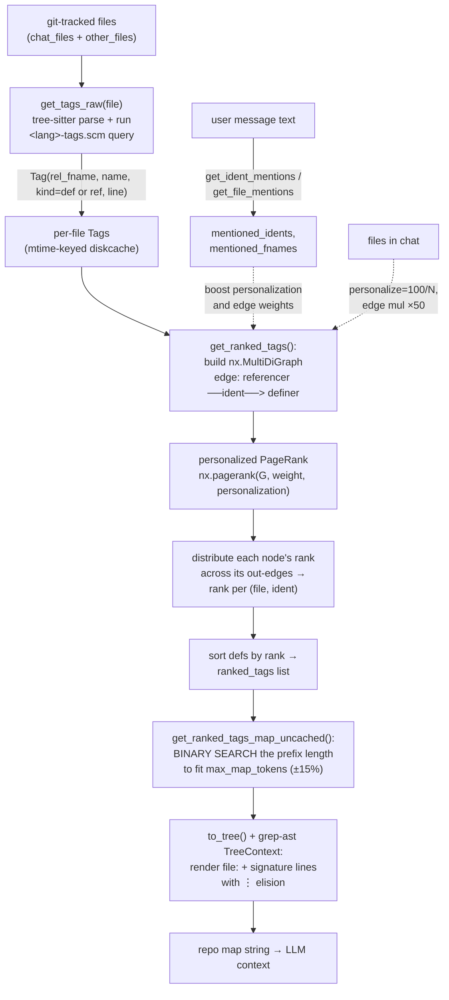
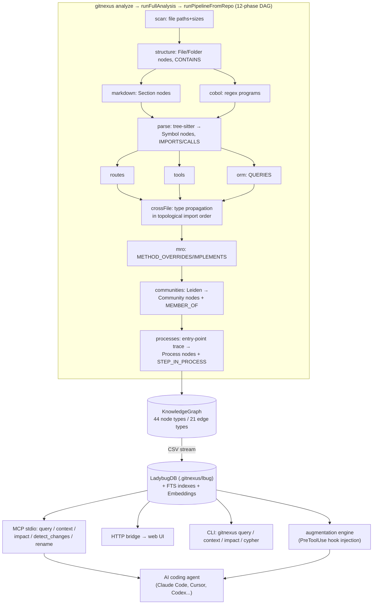

# Repo mapping for agents — Aider repo-map + GitNexus

> **One source, two artifacts.** This document covers a single topic — *giving a coding
> agent a structural map of a codebase* — through two concrete implementations that bracket
> the design space:
> - **(a) Aider's "repo map"** — a *lightweight, token-budgeted, ephemeral* ranked outline
>   built from tree-sitter tags + a PageRank-style graph, regenerated every turn.
> - **(b) GitNexus** — a *heavyweight, persistent code knowledge graph* (tree-sitter →
>   16-language unified graph in an embedded DB) exposed to agents via MCP tools
>   (`impact`, `context`, `query`) and context-injection hooks.
>
> They solve the same problem (the agent can't read the whole repo; what do you put in the
> prompt?) at opposite ends of the cost/fidelity curve. Read them as facets, not rivals.

---

## 1. Identity

### (a) Aider repo-map
- **Name:** Aider "repository map" (`RepoMap`).
- **What it is:** A module inside **Aider** (an open-source terminal AI pair-programming
  tool) that produces a compact, ranked, token-budget-bounded textual map of an entire git
  repo — file paths plus the most important definitions (function/class signatures) and
  the lines that reference them — to put into the LLM's context so it understands code it
  hasn't been shown.
- **Author/org:** Paul Gauthier / Aider-AI. (Aider is MIT-licensed.)
- **Dates:** Repo-map shipped ~2023; the ranking algorithm and graph approach are described
  in Gauthier's blog post "Building a better repository map with tree sitter" (2023, updated
  since). Inspected tree at `__version__ = "0.86.3.dev"`.
- **Primary links:**
  - Docs: https://aider.chat/docs/repomap.html
  - Blog (the canonical write-up): https://aider.chat/2023/10/22/repomap.html
  - Ranking blog: https://aider.chat/docs/repomap.html links to the tree-sitter post.
- **Code repo + commit:** `github.com/Aider-AI/aider` @ `5dc9490bb35f9729ef2c95d00a19ccd30c26339c`
  (main, 2026-05-22). Core file: `aider/repomap.py` (867 lines).

### (b) GitNexus
- **Name:** GitNexus (npm package `gitnexus`; monorepo `gitnexus-monorepo`).
- **What it is:** A tool that "indexes any codebase into a knowledge graph — every
  dependency, call chain, cluster, and execution flow — then exposes it through smart tools
  so AI agents never miss code." Tagline: *"Building [the] nervous system for agent
  context."* CLI + MCP server + optional web UI.
- **Author/org:** Abhigyan Patwari (GitHub `abhigyanpatwari`); commercialized via Akon Labs
  (akonlabs.com). License: **PolyForm Noncommercial 1.0.0** (OSS is non-commercial-use only).
- **Dates:** Active in 2026 (AGENTS.md changelog runs 2026-03 → 2026-05). Trendshift-listed.
- **Primary links:**
  - Repo/README: https://github.com/abhigyanpatwari/GitNexus
  - Hosted web UI: https://gitnexus.vercel.app
- **Code repo + commit:** `github.com/abhigyanpatwari/GitNexus` @
  `3b195ec10054dc998c23c9f0329500e87691724a` (main, 2026-06-04). Core: `gitnexus/src/core/`
  (~124k LOC of TypeScript across ingestion, scope-resolution, graph, embeddings, search,
  wiki).

> *Naming note:* GitNexus README opens with a warning that it has **no** cryptocurrency/token
> despite scam coins using its name. Mentioned only so the reader isn't confused by it.

---

## 2. TL;DR

- **The shared insight:** an agent's bottleneck is *context selection*, not raw context size.
  Both tools build a graph of code symbols (defs/refs/calls), **rank** the graph, and surface
  only the highest-value slice to the model. Tree-sitter is the common front end.
- **Aider = ephemeral + cheap + dependency-free-ish.** ~870 LOC. Per-file tree-sitter tag
  extraction → a `MultiDiGraph` of `references → definitions` → **personalized PageRank** to
  rank definitions → binary-search the ranked list to fit a **token budget** → render with
  `grep-ast` `TreeContext`. Regenerated each turn; cached on file mtime. **This is the part
  worth stealing for a builder agent**: a self-contained, model-agnostic "what matters in this
  repo right now, in N tokens" function with a clean personalization knob.
- **GitNexus = persistent + high-fidelity + heavy.** A 12-phase ingestion DAG turns 16
  languages into a unified graph (44 node types, 21 edge types) in an embedded graph DB
  (LadybugDB/Kuzu-like), adds Leiden community detection, embeddings, BM25, and exposes it as
  **MCP tools** (`impact`, `context`, `query`, `detect_changes`, `rename`). It also writes an
  `AGENTS.md`/`CLAUDE.md` policy block telling the agent "MUST run impact analysis before
  editing any symbol."
- **Why it matters for a self-improving builder:** a long-horizon agent that edits a growing
  codebase needs (1) cheap per-turn orientation (Aider) and (2) reliable *blast-radius /
  verification* signals before and after a change (GitNexus `impact` + `detect_changes`).
  Both are mechanisms for *not breaking things you can't see* — directly relevant to a
  "keep-if-verifiably-better" loop operating on its own code.
- **Caveats:** Aider's ranking is a bag of hand-tuned heuristics (magic multipliers) with no
  evaluation harness for the *map* itself. GitNexus is large, non-commercially licensed, and
  its accuracy depends on per-language scope-resolution that is explicitly "best effort" with
  documented known-limitations. Neither self-improves; neither verifies code correctness.

---

## 3. What it does & how it works

### 3a. Aider repo-map — the algorithm (the part worth understanding)

The whole thing lives in one file, `aider/repomap.py`. The public entry is
`RepoMap.get_repo_map(chat_files, other_files, mentioned_fnames, mentioned_idents)`.
It returns a single string that Aider injects into the chat as a *user* message (followed
by a canned assistant ack — see §4). The pipeline is five stages:



**Stage 1 — tag extraction (`get_tags_raw`).** For each file, pick the tree-sitter language
(`filename_to_lang`), parse to an AST, and run a packaged query file
(`queries/<pack>/<lang>-tags.scm`). The query captures nodes tagged
`name.definition.*` → emitted as `kind="def"`, and `name.reference.*` → `kind="ref"`. Each
hit becomes a `Tag = namedtuple("Tag", "rel_fname fname line name kind")`. If a language's
`.scm` only yields defs (e.g. C++), Aider **backfills refs with a Pygments lexer**
(every `Token.Name` becomes a ref). Tags are cached in a `diskcache.Cache` at
`.aider.tags.cache.v{N}`, keyed by absolute path and invalidated by mtime.

**Stage 2 — graph construction (`get_ranked_tags`).** Build a `networkx.MultiDiGraph`.
`defines[name] = {files defining it}`, `references[name] = [files referencing it]`. For
every identifier present in BOTH defines and references, add edges
`referencer → definer` with a weight. **The weight is a stack of hand-tuned heuristics**
(verbatim in §4): mentioned idents ×10; long snake/kebab/camel-case names ×10; leading-`_`
×0.1; identifiers defined in >5 files ×0.1 (penalize ubiquitous names); references *from a
chat file* ×50; and `num_refs` is `sqrt`-damped so spammy references don't dominate.

**Stage 3 — personalized PageRank.** `personalization` is a per-file dict: files in the
chat, files mentioned by name, and files whose path components match a mentioned identifier
all get `100/len(fnames)`; everything else defaults to 0 (NetworkX then treats them as
`1/N`). `nx.pagerank(G, weight="weight", personalization=..., dangling=...)`. This is the
single conceptual core: **importance is the stationary distribution of a random walk that
teleports preferentially toward the files you're working on.**

**Stage 4 — rank distribution to (file, ident) pairs.** PageRank scores *nodes* (files), but
the map needs to rank *definitions*. So for each source node, its rank is split across its
out-edges in proportion to edge weight, and accumulated as `ranked_definitions[(dst_file,
ident)] += rank_share`. Sort descending. This yields the ordered list of "show this
definition next."

**Stage 5 — token-budget fitting (`get_ranked_tags_map_uncached`).** Aider does a
**binary search over the prefix length** of the ranked-tags list: render the top-`middle`
tags to a tree, count tokens, and converge on the largest prefix whose rendered size is
within 15% of `max_map_tokens` (default 1024; multiplied by `map_mul_no_files=8` when no
files are in the chat, capped at `context_window - 4096`). Rendering uses `grep-ast`'s
`TreeContext` to print just the signature line(s) for each definition, with `⋮...` marking
elided code. Token counting is sped up by sampling every Nth line for long texts.

**Refresh policy.** `refresh="auto"` caches the rendered map and only recomputes when the
last computation took >1s; `files`/`always`/`manual` give other tradeoffs. The map is
regenerated as the conversation evolves because `mentioned_idents/fnames` change each turn.

### 3b. GitNexus — the architecture (persistent knowledge graph + agent tools)

GitNexus is a different beast: instead of an ephemeral per-turn string, it **builds a
persistent code knowledge graph once** (`gitnexus analyze`), stores it in an embedded graph
DB under `.gitnexus/`, and serves it to agents through **MCP tools and resources**. The
indexer itself calls **no LLM** (per `AGENTS.md`: "The GitNexus CLI indexer does not call an
LLM") — it is pure static analysis. The build is a 12-phase DAG:



**Front end (parse phase).** Same starting point as Aider — tree-sitter per file — but
GitNexus runs richer per-language S-expression queries that emit **unified capture tags**
(`@definition.class`, `@definition.function`, `@call.name`, `@import.source`,
`@reference.inherits`) so 16 languages collapse into one schema with no downstream language
branching. Parsing runs in a worker pool over ~20 MB byte-budget chunks.

**Scope resolution (the hard part).** Unlike Aider — which treats every identifier named
`fetchRequest` as the same symbol — GitNexus runs a real **scope-resolution pipeline**
(RFC #909) with a 3-tier import resolver (same-file 0.95 → import-scoped 0.9 → global 0.5
fallback), per-language MRO (`c3` for Python, `first-wins` for Java/C#/TS, `ruby-mixin` for
Ruby), arity-and-type-hashed node IDs to disambiguate overloads
(`Method:file:Class.method#1` vs `#2`), and confidence-scored edges. This is thousands of
lines per language under `ingestion/languages/<lang>/` and `scope-resolution/`.

**Graph enrichment.** After edges exist: **Leiden community detection** (via vendored
`graphology-communities-leiden`, seeded RNG for determinism) groups symbols into functional
"communities" with a `cohesion` score and `heuristicLabel`; **process detection** traces
execution flows from scored entry points to terminals (`Process` nodes +
`STEP_IN_PROCESS` edges with a `step` index); **embeddings** (Snowflake arctic-embed-xs,
384D) are computed for File/Function/Class/Method/Interface; and **BM25/FTS** indexes are
built. Search is hybrid BM25 + vector merged by **Reciprocal Rank Fusion (K=60)**.

**Serving to agents.** Three coequal interfaces (MCP stdio, HTTP, CLI) read the same DB. The
flagship agent-facing tools are `impact` (blast radius, risk LOW/MEDIUM/HIGH/CRITICAL,
affected processes/modules grouped by traversal depth d=1/2/3), `context` (callers/callees/
process membership for one symbol), `query` (RRF hybrid search returning *execution flows*),
`detect_changes` (git diff → affected symbols), and `rename` (call-graph-aware multi-file
rename with `dry_run`). Crucially, `gitnexus analyze` also **writes an `AGENTS.md`/`CLAUDE.md`
policy block** into the repo that *instructs the agent* to call these tools (see §5/§8).

---

## 4. Evidence from the code

### 4a. Aider — files & verbatim excerpts

**File inspected:** `aider/repomap.py` (867 lines) @ `Aider-AI/aider@5dc9490`; tag queries
under `aider/queries/tree-sitter-language-pack/*-tags.scm`; wiring in
`aider/coders/base_coder.py`; prompt text in `aider/coders/base_prompts.py`.

**The core data structure** (`repomap.py:29`):
```python
Tag = namedtuple("Tag", "rel_fname fname line name kind".split())
```
That's the entire candidate representation — there is no richer IR. Everything downstream is
sets/dicts of these.

**The tree-sitter tag query** (`aider/queries/tree-sitter-language-pack/python-tags.scm`,
verbatim — note the `name.definition.*` / `name.reference.*` capture convention that the
whole system keys on):
```scheme
(class_definition   name: (identifier) @name.definition.class) @definition.class
(function_definition name: (identifier) @name.definition.function) @definition.function
(call function: [
      (identifier) @name.reference.call
      (attribute attribute: (identifier) @name.reference.call)
  ]) @reference.call
```

**The def/ref classification** (`repomap.py:318-336`) — the only semantics extracted:
```python
for node, tag in all_nodes:
    if tag.startswith("name.definition."):
        kind = "def"
    elif tag.startswith("name.reference."):
        kind = "ref"
    else:
        continue
    ...
    result = Tag(rel_fname=rel_fname, fname=fname,
                 name=node.text.decode("utf-8"), kind=kind,
                 line=node.start_point[0])
    yield result
```

**The ranking heuristics — the load-bearing magic numbers** (`repomap.py:487-514`,
verbatim). This block *is* the "smart" of the repo map, and also its biggest weakness
(unjustified constants):
```python
mul = 1.0
is_snake = ("_" in ident) and any(c.isalpha() for c in ident)
is_kebab = ("-" in ident) and any(c.isalpha() for c in ident)
is_camel = any(c.isupper() for c in ident) and any(c.islower() for c in ident)
if ident in mentioned_idents:
    mul *= 10
if (is_snake or is_kebab or is_camel) and len(ident) >= 8:
    mul *= 10
if ident.startswith("_"):
    mul *= 0.1
if len(defines[ident]) > 5:
    mul *= 0.1
for referencer, num_refs in Counter(references[ident]).items():
    for definer in definers:
        use_mul = mul
        if referencer in chat_rel_fnames:
            use_mul *= 50
        # scale down so high freq (low value) mentions don't dominate
        num_refs = math.sqrt(num_refs)
        G.add_edge(referencer, definer, weight=use_mul * num_refs, ident=ident)
```

**Personalized PageRank + rank distribution** (`repomap.py:519-545`):
```python
if personalization:
    pers_args = dict(personalization=personalization, dangling=personalization)
else:
    pers_args = dict()
try:
    ranked = nx.pagerank(G, weight="weight", **pers_args)
except ZeroDivisionError:
    ...
# distribute the rank from each source node, across all of its out edges
for src in G.nodes:
    src_rank = ranked[src]
    total_weight = sum(data["weight"] for _src, _dst, data in G.out_edges(src, data=True))
    for _src, dst, data in G.out_edges(src, data=True):
        data["rank"] = src_rank * data["weight"] / total_weight
        ident = data["ident"]
        ranked_definitions[(dst, ident)] += data["rank"]
```

**The token-budget binary search** (`repomap.py:677-703`):
```python
middle = min(int(max_map_tokens // 25), num_tags)
while lower_bound <= upper_bound:
    tree = self.to_tree(ranked_tags[:middle], chat_rel_fnames)
    num_tokens = self.token_count(tree)
    pct_err = abs(num_tokens - max_map_tokens) / max_map_tokens
    ok_err = 0.15
    if (num_tokens <= max_map_tokens and num_tokens > best_tree_tokens) or pct_err < ok_err:
        best_tree = tree
        best_tree_tokens = num_tokens
        if pct_err < ok_err:
            break
    if num_tokens < max_map_tokens:
        lower_bound = middle + 1
    else:
        upper_bound = middle - 1
    middle = int((lower_bound + upper_bound) // 2)
```

**How the map reaches the model** (`base_coder.py:750-761`). It is *not* a system prompt —
it's an injected user/assistant turn pair, with a read-only instruction:
```python
def get_repo_messages(self):
    repo_messages = []
    repo_content = self.get_repo_map()
    if repo_content:
        repo_messages += [
            dict(role="user", content=repo_content),
            dict(role="assistant",
                 content="Ok, I won't try and edit those files without asking first."),
        ]
    return repo_messages
```

**The prompt prefix** (`aider/coders/base_prompts.py:45`, verbatim):
```
Here are summaries of some files present in my git repository.
Do not propose changes to these files, treat them as *read-only*.
If you need to edit any of these files, ask me to *add them to the chat* first.
```

**Personalization inputs** (`base_coder.py:709-717`, `709`-context): `mentioned_idents`
is literally every word in the current user message (`re.split(r"\W+", text)`), and
`mentioned_fnames` are file mentions; both feed PageRank's teleport vector. This is how the
map becomes *query-aware* without any embedding model.

**Sample rendered output** (from Aider docs — the on-the-wire format the LLM sees):
```
aider/coders/base_coder.py:
⋮...
│class Coder:
│    abs_fnames = None
⋮...
│    @classmethod
│    def create(
│        self,
│        main_model,
│        edit_format,
...
```

### 4b. GitNexus — files & verbatim excerpts

**Files inspected:** `gitnexus/ARCHITECTURE.md`; `gitnexus/AGENTS.md`;
`gitnexus/src/core/ingestion/tree-sitter-queries.ts` (1649 lines);
`gitnexus/src/core/ingestion/entry-point-scoring.ts`;
`gitnexus/src/core/ingestion/pipeline-phases/communities.ts`;
`gitnexus/src/core/ingestion/community-processor.ts`;
`gitnexus/src/core/augmentation/engine.ts`;
`gitnexus/src/mcp/tools.ts` (27k chars); `gitnexus-shared/src/graph/types.ts`.

**The graph node/edge schema — the persistent IR** (`gitnexus-shared/src/graph/types.ts`):
```typescript
export interface GraphNode { id: string; label: NodeLabel; properties: NodeProperties; }
export interface GraphRelationship {
  id: string; sourceId: string; targetId: string;
  type: RelationshipType; confidence: number; reason: string; step?: number;
}
// NodeLabel ∈ {File, Folder, Class, Function, Method, Interface, Struct, Enum, Trait,
//   Impl, Namespace, Community, Process, Route, Tool, ...}  (44 labels)
// RelationshipType ∈ {CONTAINS, CALLS, IMPORTS, EXTENDS, IMPLEMENTS, HAS_METHOD,
//   ACCESSES, METHOD_OVERRIDES, MEMBER_OF, STEP_IN_PROCESS, HANDLES_ROUTE, ...} (21 types)
```
Note `confidence` and `reason` on **every edge** — GitNexus tracks *why* an edge exists and
how sure it is. This is the single biggest structural difference from Aider's binary def/ref.

**Unified tree-sitter capture tags** (`tree-sitter-queries.ts`, TypeScript query, verbatim
excerpt). Different grammars, identical semantic tags — so downstream code never branches on
language:
```scheme
(class_declaration   name: (type_identifier) @name) @definition.class
(interface_declaration name: (type_identifier) @name) @definition.interface
(function_declaration name: (identifier) @name) @definition.function
(method_definition   name: (property_identifier) @name) @definition.method
(pair key: (property_identifier) @name value: (arrow_function)) @definition.function
```

**Entry-point scoring — GitNexus's analog to PageRank ranking** (`entry-point-scoring.ts:100-160`).
Where Aider uses graph centrality, GitNexus uses an explicit hand-scored heuristic to find
*process roots*:
```typescript
// Must have outgoing calls to be an entry point (we need to trace forward)
if (calleeCount === 0) return { score: 0, reasons: ['no-outgoing-calls'] };
const baseScore = calleeCount / (callerCount + 1);     // calls many, called by few
const exportMultiplier = isExported ? 2.0 : 1.0;
let nameMultiplier = 1.0;
if (UTILITY_PATTERNS.some((p) => p.test(name))) nameMultiplier = 0.3;       // get/set/format...
else if (allPatterns?.some((p) => p.test(name))) nameMultiplier = 1.5;      // handle*/on*/*Controller
const finalScore = baseScore * exportMultiplier * nameMultiplier * frameworkMultiplier;
```
(Compare to Aider's `mul *= 10 / *= 0.1` block — both are taste-based multiplier stacks.)

**Leiden community detection, made deterministic** (`community-processor.ts`). Notable
because reproducibility is a real engineering concern they solved:
```typescript
// Vendored Leiden defaults rng: Math.random, which makes community assignment
// non-deterministic across runs. Passing a seeded RNG gives us reproducible
// community/modularity output, required for the incremental-indexing equivalence test.
const LEIDEN_SEED = 0xc0de;
function createSeededRng(seed: number): () => number { /* mulberry32 */ }
```

**The `impact` tool contract — the agent-facing verifier** (`mcp/tools.ts`, verbatim
description the model sees). This is the mechanism most relevant to a build-and-verify loop:
```
Analyze the blast radius of changing a code symbol.
Returns affected symbols grouped by depth, plus risk assessment, affected execution flows...
WHEN TO USE: Before making code changes — especially refactoring, renaming, or modifying
shared code. Shows what would break.
- risk: LOW / MEDIUM / HIGH / CRITICAL
- d=1: WILL BREAK (direct callers/importers)
- d=2: LIKELY AFFECTED (indirect)
- d=3: MAY NEED TESTING (transitive)
```

**The context-injection hook** (`augmentation/engine.ts`) — when an agent runs grep/read,
a PreToolUse hook calls `augment(pattern, cwd)`, which does a BM25 lookup and returns a
compact relationship block (callers/callees/process flows) appended to the tool result:
```typescript
// Performance target: <500ms cold start, <200ms warm.
// Uses only BM25 search (no semantic/embedding) for speed
// Clusters used internally for ranking, NEVER in output
// Graceful failure: any error → return empty string
...
const lines = [`[GitNexus] ${enriched.length} related symbols found:`, ''];
for (const item of enriched) {
  lines.push(`${item.name} (${item.filePath})`);
  if (item.callers.length) lines.push(`  Called by: ${item.callers.join(', ')}`);
  if (item.callees.length) lines.push(`  Calls: ${item.callees.join(', ')}`);
  if (item.processes.length) lines.push(`  Flows: ${item.processes.join(', ')}`);
}
```

**The agent policy block GitNexus writes into the indexed repo** (`AGENTS.md`,
`gitnexus:start` block, verbatim — this is a control mechanism, not documentation):
```
## Always Do
- MUST run impact analysis before editing any symbol. Before modifying a function, class,
  or method, run gitnexus_impact({target: "symbolName", direction: "upstream"}) and report
  the blast radius (direct callers, affected processes, risk level) to the user.
- MUST run gitnexus_detect_changes() before committing to verify your changes only affect
  expected symbols and execution flows.
## Never Do
- NEVER edit a function, class, or method without first running gitnexus_impact on it.
- NEVER rename symbols with find-and-replace — use gitnexus_rename which understands the call graph.
```
`analyze` also auto-generates per-cluster `SKILL.md` files (e.g. "Work in the Ingestion area
(239 symbols) → .claude/skills/generated/ingestion/SKILL.md"), turning detected communities
into routable agent skills.

---

## 5. What's genuinely smart

This is the heart of the document. The ideas worth understanding, explained correctly.

### Shared (both systems)

1. **The map IS the context-selection policy.** Both reject "stuff the whole repo into the
   prompt" and "embed everything + top-k retrieve." Instead they build a *graph of code
   structure* and let graph topology decide importance. The insight: in code, importance is
   relational (who calls/imports/inherits what), so a graph centrality signal beats both raw
   frequency (BM25) and surface similarity (embeddings) for the question "what does the
   agent need to know to not break this?" Aider's docs state this explicitly: a function
   referenced by 20 files outranks a helper called once, *and* that property propagates
   transitively — which BM25/recency lack.

2. **Tree-sitter as a universal, dependency-light parser front end.** Both use tree-sitter
   tag/capture queries (`.scm` S-expressions) to extract symbols without a full compiler or
   LSP per language. Aider's `name.definition.*`/`name.reference.*` convention and GitNexus's
   `@definition.class`/`@call.name` unified tags are the same trick: **normalize many
   grammars to a small set of semantic capture tags so downstream code is language-agnostic.**
   This is the cheapest viable path to multi-language structural understanding.

### Aider-specific (the elegant minimalism)

3. **Personalized PageRank with a query-driven teleport vector.** The genuinely clever move:
   the *same* PageRank that finds globally-important code is biased toward the current task
   by seeding the personalization vector with files-in-chat, mentioned filenames, and
   path-components matching identifiers the user just typed. No embeddings, no LLM call — the
   user's literal words (`re.split(r"\W+", msg)`) steer a random walk. It's query-aware
   retrieval implemented in ~10 lines of graph setup.

4. **Binary-search-to-a-token-budget.** Rather than guessing how many symbols fit, Aider
   renders candidate prefixes and binary-searches the cut point to land within 15% of
   `max_map_tokens`. This makes the map a clean function `(repo, budget) → string` that
   degrades gracefully: small budget → only the architectural spine; large budget (or no
   files in chat) → expands up to 8×. The "fit to budget" abstraction is reusable anywhere
   you must pack ranked context into a window.

5. **Rank-on-nodes → distribute-to-edges.** A subtle correctness detail: PageRank scores
   files, but the map must rank *definitions*. Aider splits each file's rank across its
   outgoing reference edges weighted by edge weight, so a definition's score reflects *how
   much important code points at it*, not just its file's score. (`repomap.py:534-545`.)

6. **Stateless + mtime-cached = always-fresh, cheap.** Because it's recomputed from the live
   filesystem (with per-file mtime caching of tags), the map can never go stale relative to
   disk. There is no index to invalidate. For an agent editing files every turn, this is a
   real advantage over a persistent index.

### GitNexus-specific (the depth)

7. **Confidence- and reason-tagged edges.** Every relationship carries `confidence: number`
   and `reason: string`. The 3-tier import resolver assigns 0.95 / 0.9 / 0.5 by how it
   resolved a symbol; METHOD_IMPLEMENTS gets 1.0/0.7 by match quality. This lets downstream
   tools (and agents) reason about *uncertainty* — e.g. `impact` can filter by
   `minConfidence`. A self-improving agent that must decide "is this edge real enough to act
   on?" needs exactly this kind of calibrated signal.

8. **Symbol identity that survives overloading.** GitNexus assigns node IDs with arity and
   type-hash suffixes (`Method:file:Class.method#1`, `#2`, `~int,string`, `$const` for C++
   const-qualified). This directly fixes the #1 documented failure of Aider's approach (all
   `fetchRequest` symbols treated as one). Getting symbol identity right is what separates a
   "rough map" from a "navigable graph."

9. **Communities → routable skills; processes → execution traces.** Leiden community
   detection isn't just clustering — GitNexus turns each community into a generated
   `SKILL.md` and a `heuristicLabel`, and traces `Process` execution flows
   (entry-point → terminal, with ordered `step` indices). So the agent can ask "show me the
   *UserLogin* flow" and get an ordered call chain, not a pile of files. This is a
   higher-order structural abstraction than Aider's flat ranked list.

10. **The repo tells the agent how to use the map (policy-as-output).** `gitnexus analyze`
    writes an `AGENTS.md`/`CLAUDE.md` block with hard rules ("MUST run impact analysis
    before editing any symbol... NEVER rename with find-and-replace"). Rather than hoping the
    model uses the tools, GitNexus injects an *operating procedure* into the agent's
    always-on context. This is a control-mechanism idea independent of the graph itself.

11. **A real evaluation harness.** Unlike Aider's repo map (no isolated eval), GitNexus ships
    `eval/` — a SWE-bench evaluation harness (`run_eval.py`, agents, environments, configs)
    to benchmark tool usage, plus a `DoD.md` whose bar is explicitly *"a net improvement to
    the codebase — not merely 'the code compiles and a test passes.'"*

---

## 6. Claims vs. reality / limitations / critiques

### Aider repo-map

- **(A) Claims (Gauthier/docs):** the map gives the LLM enough cross-file context to use
  APIs it can't see, and to decide which files to request; graph ranking + token budget
  keep it cheap. These are *mechanism* claims, and the code backs them up.
- **(B) What the code actually demonstrates:** a working, ~870-LOC ranked structural outline.
  But the ranking is **a stack of unjustified magic multipliers** (`×10`, `×0.1`, `×50`,
  `len(ident) >= 8`, `>5 files`). There is **no ablation or eval of the map in isolation** —
  Aider's headline SWE-bench Lite result (then-SOTA 26.3% resolve, 70.3% correct file
  identification) reflects the *whole* Aider stack; the agentpatterns.ai analysis explicitly
  notes "the SWE-bench post credits the repo map but does not isolate its contribution in an
  ablation." So the *quantitative* value of the ranking specifically is unverified.
- **(C) Independent critiques (with links):**
  - **meetsmore engineering blog** (2024-12,
    https://engineering.meetsmore.com/entry/2024/12/24/042333): on a large monorepo the repo
    map "mostly being our feature flag methods, or really general symbols like `name()`."
    Three named flaws: (1) **assumes all symbols are unique** — 10 different `fetchRequest`s
    are merged; (2) **doesn't model relevance to the target files** you intend to change;
    (3) **conflates frequency with relevance.** They forked Aider to add an `ImportFlood`
    strategy (follow imports from the target file, prioritize those defs) — evidence the
    default ranking is insufficient for big repos.
  - **agentpatterns.ai** (https://agentpatterns.ai/context-engineering/repository-map-pattern/):
    fails on **heavy metaprogramming** (Rails `method_missing`, Python metaclasses, macro-heavy
    Rust — AST symbols don't reflect runtime structure); **recomputed per session, not per
    edit**, so in a high-velocity monorepo the AST can be stale within minutes (argues
    Claude-Code-style live agentic search is better there); **adds nothing for <~20-file
    repos**; and risks needless truncation when the context window is already huge.
  - **Reproducibility:** fully reproducible — MIT, single file, deterministic given inputs.
    (PageRank can throw `ZeroDivisionError` on degenerate graphs; handled with fallbacks at
    `repomap.py:524-531`.)
- **Reward-hacking / gaming:** N/A — the repo map is read-only context, not a reward signal.
  The relevant failure mode is *misdirection*: a poorly-ranked map can point the agent at the
  wrong files (the monorepo "feature-flag soup" case).

### GitNexus

- **(A) Claims (README):** indexes "every dependency, call chain, cluster, and execution
  flow" so "AI agents never miss code," letting "even smaller models … compete with Goliath
  models." The "never miss code" / "every relationship" framing is **marketing overreach** —
  see (B).
- **(B) What the code actually demonstrates:** a genuinely deep, 16-language static-analysis
  engine — but accuracy is explicitly *best-effort and confidence-tiered*, not total. The
  ARCHITECTURE.md "Known limitations" section documents real gaps: overloaded-method
  resolution edge cases, type-hash ID instability (IDs change when overloads are added),
  variadic matching at confidence 0.7, and `fieldFallbackOnMethodLookup` heuristics that
  "over-connect" for statically-typed languages (turned off there). The global-tier import
  resolver is a 0.5-confidence fallback. So "never miss code" really means "broad coverage
  with calibrated uncertainty and documented blind spots" — which is more honest than the
  tagline.
- **(C) Independent critiques:** I could **not** find substantial third-party technical
  audits or skeptical analyses of GitNexus's accuracy (it is newer and commercially backed).
  This is a verification gap — claims rest largely on the project's own code, docs, and its
  internal `eval/` harness, whose results I did not run.
- **Practical constraints:** **PolyForm Noncommercial license** (cannot be used commercially
  without a separate license from Akon Labs) — a hard adoption blocker for many. Heavy:
  ~124k LOC core, an embedded graph DB, a worker pool, optional embeddings (auto-skipped
  >50k nodes). Index **staleness is a first-class concern** (`staleness.ts`, `meta.json`
  `lastCommit` vs `HEAD`) — unlike Aider, the graph CAN go stale and must be re-`analyze`d.
- **Reward-hacking:** N/A for the indexer (no LLM, no reward). The `impact`/`detect_changes`
  tools are advisory; an agent could ignore the `AGENTS.md` "MUST" rules (they are prompt
  policy, not enforced gates) — though PreToolUse hooks *can* be configured to block commits.

---

## 7. Relevance to a self-improving, evolutionary agent

Relevance test: *would this help build a self-improving, evolutionary, software-building
agent?* For codebase comprehension / long-horizon building, both score **high** — but for
different sub-capabilities. A self-improving builder edits a codebase that *grows over time*
(including, eventually, its own), so "orient cheaply" and "don't break what you can't see"
are core, recurring needs.

| Capability the seed-AI needs | Aider repo-map | GitNexus |
|---|---|---|
| **Cheap per-turn orientation** ("what matters here, in N tokens?") | ★★★ stateless, mtime-cached, `(repo,budget)→string` | ★ (heavy; not per-turn) |
| **Always-fresh view of self-modified code** | ★★★ recomputed from disk, no index to invalidate | ★ must re-`analyze`; staleness tracked |
| **Query/goal-aware context selection** | ★★ personalization vector from user words | ★★★ RRF hybrid search + `task_context`/`goal` params |
| **Pre-edit blast-radius / risk (verification)** | ✗ | ★★★ `impact` (d=1/2/3, risk tiers, affected processes) |
| **Post-edit change verification** | ✗ | ★★★ `detect_changes` (diff → affected symbols/flows) |
| **Calibrated uncertainty on relationships** | ✗ (binary def/ref) | ★★★ `confidence`+`reason` on every edge |
| **Safe structural refactor (rename)** | ✗ | ★★★ `rename` (call-graph-aware, `dry_run`) |
| **Higher-order structure (flows, functional areas)** | ✗ (flat list) | ★★★ Process traces + Leiden communities |
| **Self-contained, easy to embed** | ★★★ ~870 LOC, MIT | ✗ 124k LOC, noncommercial |

**Specific mechanisms tied to what they'd help with:**

- **Personalized-PageRank ranking (Aider) → the agent's "where do I look first" prior.** A
  builder agent decomposing a goal can seed the teleport vector with the symbols/files named
  in the current subgoal and get a ranked structural slice for free — a cheap, deterministic
  alternative to an embedding retrieve, and a natural fit for a `/goal`-style focus mechanism.
- **Binary-search-to-budget (Aider) → context packing under a token cap.** Directly reusable
  any time the agent must fit ranked evidence (candidates, diffs, prior attempts) into a
  fixed window with graceful degradation.
- **`impact` + risk tiers (GitNexus) → the *verifier's* structural half.** In a
  propose→test→keep loop, before running tests you can gate "is this change safe to attempt
  and how wide is the blast radius?" `impact(direction: upstream)` returns exactly the d=1
  "WILL BREAK" set. This is a cheap pre-filter that complements (not replaces) actually
  running the test suite.
- **`detect_changes` (GitNexus) → "did I change only what I meant to?"** A self-modifying
  agent can diff its own edit against the graph to catch unintended blast radius before
  committing — a structural sanity check on top of behavioral tests.
- **Confidence/`reason` edges (GitNexus) → decision-making under uncertainty.** A
  keep-if-verifiably-better loop benefits from knowing which structural facts are 0.95 vs 0.5
  certain, so it can weight evidence and avoid acting on a fuzzy global-fallback edge.
- **Policy-as-output `AGENTS.md` (GitNexus) → durable long-horizon control.** The pattern of
  *the tool writing hard operating rules into the agent's always-on context* ("MUST run
  impact before editing") is a reusable orchestration/control technique for keeping a
  long-running agent on-protocol — analogous to goal-tracking/"/goal" features in production
  coding agents. Note it's advisory unless backed by PreToolUse gates.
- **Generated per-cluster `SKILL.md` (GitNexus) → self-organizing memory/skills.** Turning
  detected communities into routable skill files is a concrete example of an agent
  *deriving its own navigation aids from structure* — adjacent to the "self-improving"
  ambition (the codebase's structure bootstraps the agent's skill index).
- **Deterministic Leiden (seeded RNG) → reproducible self-evaluation.** If the agent's loop
  compares "graph before vs after my change," non-determinism would create phantom diffs;
  GitNexus's seeded RNG for incremental≡full-rebuild equivalence is the right instinct for
  any evolutionary loop that diffs its own artifacts.

**Honest boundary:** *neither system self-improves, learns, or verifies code correctness.*
They are **context/verification substrates**, not agents and not reward functions. Aider's
ranking weights are static hand-tuned constants (a candidate target for an agent to *tune*,
but Aider itself never tunes them). GitNexus's graph is recomputed deterministically, never
learned. Their contribution to a seed-AI is as *tools the loop calls*, not as a model of the
loop itself.

---

## 8. Reusable assets

Concrete things that could be borrowed (collected as evidence; **not** assembled into a
design — that's the humans' job).

### Prompts / policy text (verbatim)

- **Aider repo-map prefix** (`Aider-AI/aider@5dc9490:aider/coders/base_prompts.py:45`):
  > Here are summaries of some files present in my git repository.
  > Do not propose changes to these files, treat them as *read-only*.
  > If you need to edit any of these files, ask me to *add them to the chat* first.
- **Aider's repo-map-as-turn-pair** (`base_coder.py:750-761`): inject the map as a `user`
  message + a fixed `assistant` ack ("Ok, I won't try and edit those files without asking
  first.") — a lightweight way to land large context without a giant system prompt.
- **GitNexus agent operating procedure** (`AGENTS.md` `gitnexus:start` block, verbatim in
  §4b): the "Always Do / Never Do" MUST-rules for impact-before-edit and
  detect-changes-before-commit. Reusable as a template for *any* graph/verification tool's
  agent contract.
- **GitNexus tool descriptions** (`mcp/tools.ts`): the `impact`/`query`/`context` tool
  descriptions are unusually well-written agent-facing specs (WHEN TO USE / AFTER THIS /
  depth semantics / pagination tips). Good models for writing tool docs an LLM will use
  correctly.

### Harness / scaffold patterns

- **Stateless map function** `get_repo_map(chat_files, other_files, mentioned_fnames,
  mentioned_idents, force_refresh) -> str` — a clean signature for "ranked structural
  context, budget-bounded, query-personalized."
- **Binary-search-to-token-budget** (`repomap.py:677-703`) — reusable packing loop.
- **Personalization-vector-from-message** (`base_coder.py:get_ident_mentions` =
  `set(re.split(r"\W+", text))`, plus path-component matching) — zero-cost query awareness.
- **mtime-keyed diskcache of per-file analysis** (`repomap.py:233-264`) — incremental
  freshness without an index server.
- **12-phase typed DAG with single mutable graph accumulator** (GitNexus
  `pipeline-phases/` + `runner.ts`): Kahn topo-sort validation, declared-deps-only filtering
  to prevent hidden coupling, per-phase timing, skippable phases. A clean blueprint for a
  multi-stage analysis/build pipeline.
- **PreToolUse augmentation hook** (`augmentation/engine.ts`): `<500ms`, BM25-only, graceful
  empty-string failure, "enrich the agent's grep/read results with graph context" — a pattern
  for transparently injecting memory into existing tool calls.
- **Policy-as-output**: a build step that *writes the agent's rules into the repo it just
  indexed* (`AGENTS.md`/`CLAUDE.md` + generated `SKILL.md` per community).

### Data schemas

- **Aider `Tag`**: `namedtuple("Tag", "rel_fname fname line name kind")` (kind ∈ def/ref).
- **GitNexus `GraphNode` / `GraphRelationship`** (`gitnexus-shared/src/graph/types.ts`):
  edges carry `{type, confidence: number, reason: string, step?: number}` — the
  confidence+reason fields are the reusable idea (calibrated, auditable relationships).
- **GitNexus node-ID scheme for overloads**: `Method:file:Class.method#<arity>~<typehash>$const`
  — a recipe for stable-ish symbol identity under overloading.

### Evaluation methods

- **GitNexus `eval/`** — a SWE-bench harness (`run_eval.py`, `agents/`, `environments/`,
  `configs/`, `prompts/`) for benchmarking whether the tools actually improve agent task
  success. (Results not independently run here.)
- **GitNexus `DoD.md`** — a "Definition of Done" whose bar is *"a net improvement to the
  codebase — not merely 'the code compiles and a test passes'"* — a useful articulation of a
  verification bar for a keep-if-better loop.

---

## 9. Signal assessment

- **Overall signal: HIGH** — for the specific capability "give a long-horizon builder agent a
  structural map of a codebase," this source (both artifacts) is directly on-target and
  mechanism-rich. The two artifacts are complementary: Aider supplies a battle-tested,
  minimal, reusable *ranking+packing* core; GitNexus supplies the *verification/blast-radius*
  and *calibrated-graph* half plus an agent-control pattern.
- **Highest-value, well-verified takeaways:** (1) personalized-PageRank + binary-search-to-
  budget as a cheap, deterministic, query-aware context selector (Aider, fully read in
  source); (2) `impact`/`detect_changes` as a structural pre/post-edit verifier with risk
  tiers (GitNexus, read in tool contracts + architecture); (3) confidence+reason on every
  edge for decision-making under uncertainty; (4) policy-as-output (`AGENTS.md` MUST-rules)
  as a long-horizon control mechanism.
- **Confidence:** **High** on Aider's algorithm — I read the entire `repomap.py` and the
  wiring; the magic-number critique is corroborated by two independent sources. **Medium-high**
  on GitNexus's *architecture and contracts* — I read ARCHITECTURE.md, the schema, the
  tree-sitter queries, entry-point scoring, community detection, the augmentation engine, and
  the MCP tool definitions; the design is clearly real and substantial.
- **What I could NOT verify:**
  - I did **not run** either system, so I cannot independently confirm map quality or
    `impact` accuracy on a live repo.
  - GitNexus's actual **scope-resolution accuracy** per language (I read the contracts and
    documented known-limitations, not a correctness benchmark); I did not run `eval/`.
  - The **quantitative contribution of Aider's repo map** specifically (no public ablation;
    SWE-bench numbers are whole-stack).
  - I found **no independent third-party audit of GitNexus** — its claims rest on its own
    code/docs and internal eval. Treat "never miss code" as marketing.
  - I read the TypeScript query for one language in depth (TS) and sampled others; I did not
    exhaustively verify all 16 language providers.
  - Inspected source via GitHub **tarball** (`codeload.github.com`, branch `main`) because
    `git clone` over the sandbox proxy returned HTTP 407; commit SHAs were obtained from the
    GitHub API and correspond to `main` HEAD at inspection time.

---

## 10. References

**Primary — Aider (code & author docs):**
- `repo: github.com/Aider-AI/aider @ 5dc9490bb35f9729ef2c95d00a19ccd30c26339c`
  - `aider/repomap.py` (the full algorithm) — `repomap.py:29` (Tag), `:279-363` (tag
    extraction + Pygments backfill), `:365-574` (graph + PageRank + rank distribution),
    `:487-514` (ranking heuristics), `:629-706` (token-budget binary search), `:710-784`
    (TreeContext rendering).
  - `aider/coders/base_coder.py:709-761` (repo-map wiring, personalization inputs,
    turn-pair injection).
  - `aider/coders/base_prompts.py:45` (repo_content_prefix).
  - `aider/queries/tree-sitter-language-pack/python-tags.scm` (sample tag query).
- Docs: https://aider.chat/docs/repomap.html (primary)
- Blog: https://aider.chat/2023/10/22/repomap.html — "Building a better repository map with
  tree sitter," Paul Gauthier (primary, author).

**Primary — GitNexus (code & project docs):**
- `repo: github.com/abhigyanpatwari/GitNexus @ 3b195ec10054dc998c23c9f0329500e87691724a`
  - `ARCHITECTURE.md` (12-phase DAG, schema, scope-resolution pipeline, known limitations).
  - `AGENTS.md` (agent operating procedure / `gitnexus:start` MUST-rules; changelog).
  - `gitnexus-shared/src/graph/types.ts` (GraphNode/GraphRelationship, 44 NodeLabels,
    21 RelationshipTypes).
  - `gitnexus/src/core/ingestion/tree-sitter-queries.ts:17-120` (unified TS capture tags).
  - `gitnexus/src/core/ingestion/entry-point-scoring.ts:25-160` (entry-point heuristics).
  - `gitnexus/src/core/ingestion/community-processor.ts` (Leiden + seeded RNG).
  - `gitnexus/src/core/ingestion/pipeline-phases/communities.ts` (Community nodes/MEMBER_OF).
  - `gitnexus/src/core/augmentation/engine.ts` (PreToolUse context-injection hook).
  - `gitnexus/src/mcp/tools.ts` (`query`/`cypher`/`impact` tool contracts, verbatim).
  - `gitnexus/eval/` (SWE-bench harness — `run_eval.py`); `gitnexus/DoD.md` (Definition of Done).
- README/repo: https://github.com/abhigyanpatwari/GitNexus (primary, project)
- Hosted UI: https://gitnexus.vercel.app (primary, project)
- Enterprise/commercial: https://akonlabs.com (primary, vendor)

**Secondary — independent analyses & critiques:**
- meetsmore engineering, "Improving aider's repo map to do large, simple refactors
  automatically" (2024-12-24):
  https://engineering.meetsmore.com/entry/2024/12/24/042333 — concrete monorepo failure modes
  + `ImportFloodStrategy` fork. (secondary)
- AgentPatterns.ai, "Repository Map Pattern: AST + PageRank for Dynamic Code":
  https://agentpatterns.ai/context-engineering/repository-map-pattern/ — limitations
  (metaprogramming, freshness, small repos), SWE-bench ablation caveat, comparison to agentic
  search & embeddings. (secondary)
- Charles Chen wiki, "aider repository map with pagerank for code search":
  https://wiki.charleschen.ai/Review/Research/aider-repository-map-with-pagerank-for-code-search
  — precise breakdown of edge-weight multipliers and binary-search budgeting. (secondary)

**Tooling note:** clones were obtained as tarballs from
`https://codeload.github.com/<owner>/<repo>/tar.gz/refs/heads/main` (git proxy returned 407);
extracted under `/agent/workspace/scratch/repo-map/{aider-main, GitNexus-main}`. SHAs from the
GitHub commits API.
