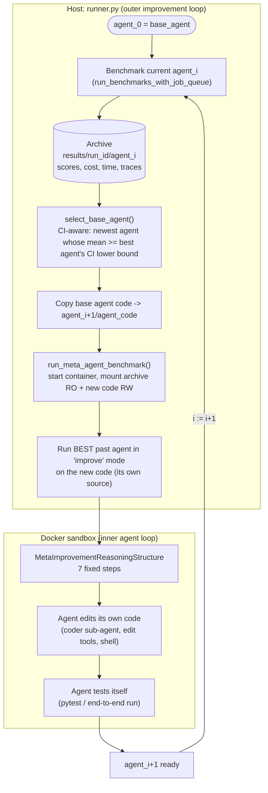
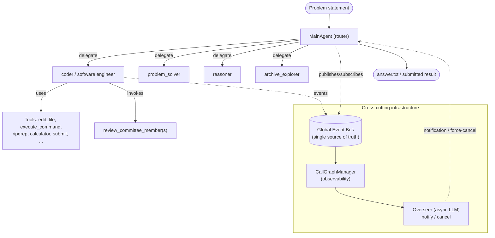
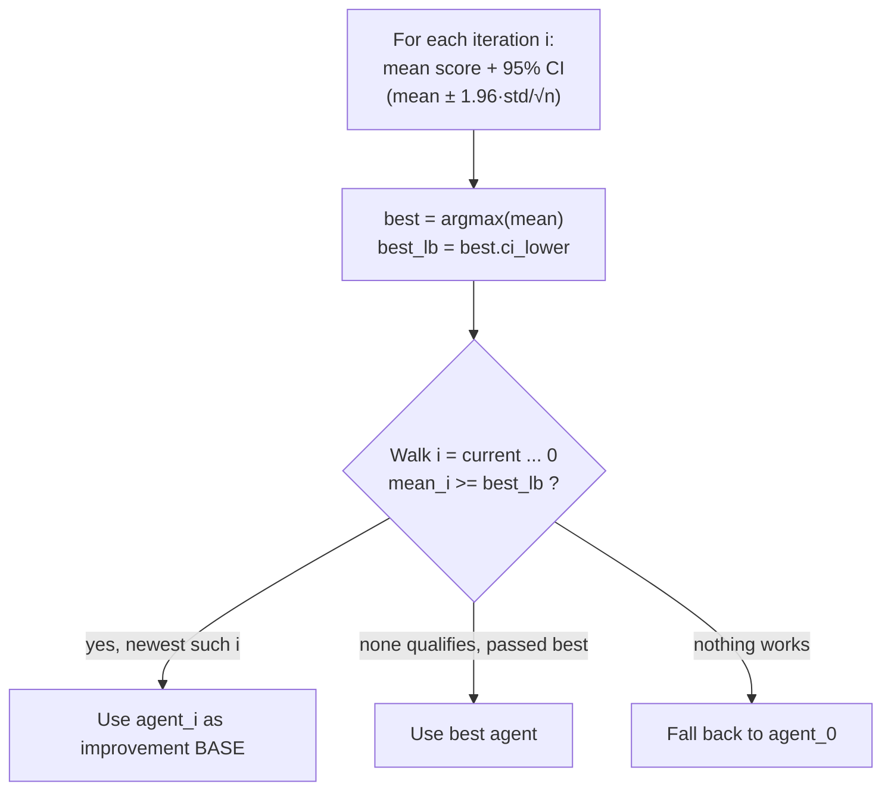
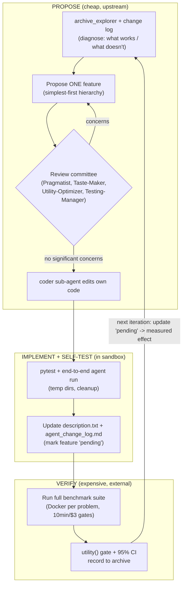

# Self-Improving Coding Agent (SICA)

> Research findings document. One source, deeply. Reporter, not architect.
> Status: IN PROGRESS (written incrementally).

---

## 1. Identity

- **Name:** SICA — Self-Improving Coding Agent ("A Self-Improving Coding Agent").
- **What it is:** An LLM agent system, written in plain Python, that runs an outer loop in which **the agent edits its own source code** to improve measured performance (score, wall-clock time, and $ cost) on a suite of coding/reasoning benchmarks. It collapses the ADAS "meta-agent vs. target-agent" distinction: the same agent codebase is both the thing being improved and (a past version of it is) the thing doing the improving.
- **Authors / org:** Maxime Robeyns (University of Bristol / iGent AI), Martin Szummer (iGent AI), Laurence Aitchison (University of Bristol). Contact: maxime@igent.ai.
- **Dates:** arXiv preprint v1 **2025-04-21** (arXiv:2504.15228). Also an **ICLR 2025 Workshop** paper ("Scaling Self-Improving Foundation Models"), OpenReview `rShJCyLsOr`. Repo last commit on `master` **2025-04-23**.
- **Primary links:**
  - Paper (arXiv abstract): https://arxiv.org/abs/2504.15228
  - Workshop PDF: https://openreview.net/pdf?id=rShJCyLsOr ; forum: https://openreview.net/forum?id=rShJCyLsOr
  - Code: https://github.com/MaximeRobeyns/self_improving_coding_agent
- **Code repo + commit SHA inspected:** `MaximeRobeyns/self_improving_coding_agent` @ **`ed8275dca4d3c5dbf77229964351fe9b424797dc`** (master HEAD, dated 2025-04-23). Inspected via tarball of the `master` branch (git clone via the sandbox proxy returned HTTP 407; `codeload.github.com` tarball of `master` succeeded; SHA confirmed via the GitHub commits API). License: MIT.

---

## 2. TL;DR

- **The core idea is small and clean:** there is no gradient learning and no DSL. An *outer Python runner* (`runner.py`) alternates between (a) **scoring** the current agent on benchmarks in sandboxed Docker containers, and (b) invoking the agent **on its own codebase** with the instruction "improve yourself." The improved code becomes the next iteration; repeat.
- **"Improvement" is measured by a utility function**, not raw accuracy. Each benchmark problem yields a score in [0,1] plus token/cost/wall-time, and these are folded into a single per-problem utility that **penalizes cost and latency** (default weighting `p_score=0.5, p_time=0.25, p_cost=0.25`). The agent is explicitly optimizing a multi-objective score.
- **Self-modification is structured, not free-form.** A `MetaImprovementReasoningStructure` walks the meta-agent through a fixed 7-step playbook: find what's *not* working → find what *is* working → propose one improvement (and pass it by a **review committee** of LLM reviewers) → implement via a sub-agent → test (unit or end-to-end) → update `description.txt` → update `agent_change_log.md`. The change log is a persistent cross-iteration "workbook."
- **Guardrails are real but light.** Improvement runs in a Docker sandbox with the archive mounted read-only; per-problem hard limits of **10 min** and **$3**; an asynchronous **LLM Overseer** watches the live call-graph for looping/stalling and can notify or force-cancel agents; a **base-agent-selection** rule uses confidence intervals to avoid chasing noisy "best" scores. There is no formal proof against reward-hacking — safety is procedural and benchmark-defined.
- **Headline result:** on a random 50-problem subset of SWE-Bench Verified, agent performance rose from **17% → 53%** over a self-improvement run, with a slight reduction in average time per problem. Gains on LiveCodeBench were "subtle." Sample sizes are small (subset_size=18 in the shipped runner; 50 in the paper) and runs are high-variance by the authors' own admission.
- **Why it matters for us:** SICA is the cleanest open-source reference for an *agent-edits-its-own-code* loop with a real verifier, a utility (not just accuracy) fitness, an archive, a base-selection policy, and an oversight layer. It is directly on-topic for a "propose → test → keep only if verifiably better" seed-AI.

---

## 3. What it does & how it works

### 3.1 The two nested loops

SICA has an **outer improvement loop** (orchestrated by `runner.py` on the host) and an **inner agent loop** (an LLM + tools running inside a Docker container solving one task).

The outer loop (verbatim control flow from `runner.py:main`, lines 1024–1047):

1. **Benchmark the current agent.** `run_benchmarks_with_job_queue(...)` runs every registered benchmark's problems concurrently, each problem in its own throwaway Docker container (`process_job`). Scores, tokens, cost, and wall-time are recorded to `results.jsonl` / `perf.json`.
2. **Improve.** `run_meta_agent_benchmark(...)` (a) picks a *base* agent version to improve from the archive, (b) copies that code into `agent_{i+1}/agent_code`, (c) starts a container with the **archive mounted read-only** and the new code mounted read-write as the workdir, and (d) runs a past agent in `improve` mode pointed at the new code.
3. **Advance.** Bump `agent_iteration`, reset benchmark progress, loop.



Key subtlety (the *self-referential* twist): the code that *performs* the improvement is **the best agent in the archive so far** (`runner.py:860`, `agent_module = f"archive.agent_{best_iter}.agent_code"`), while the code being *edited* is a fresh copy of the **selected base** agent. As the agent improves at coding, it (in principle) gets better at improving itself — the compounding hypothesis. Importantly the running improver and the edited target are different on-disk copies; the base README and the Overseer both repeatedly warn the agent that "the code it is editing is not the code that is currently running."

### 3.2 The inner agent: an event-bus-driven multi-agent system

Inside the container, the "agent" is an LLM-in-a-loop with tools, structured as a small society of sub-agents communicating through a **global event bus**. Conceptually:

- **MainAgent / orchestrator** — a *router*. Reads the problem, delegates to long-running sub-agents, combines results, submits a final answer.
- **Sub-agents** (`base_agent/src/agents/implementations/`): `coder` (software engineer), `problem_solver`, `reasoner`, `archive_explorer` (reads the archive of past iterations), `review_committee_member` (LLM reviewer of proposed self-improvements).
- **Tools** (`base_agent/src/tools/`): file open/close, overwrite-file + diff/range edit tools, `execute_command` (shell), `ripgrep_tool`, calculator, `answer_submission`/`submit`, `return_result`/`exit_agent`, `archive_tools` (summary stats over past iterations), and **reasoning structures** (sequential "algorithms" injected as transient tools).
- **Context management via sub-agent calls:** a sub-agent call is treated like a function call — it can inherit part of the parent's context (open files, problem statement), do focused work, and return a *string summary*, so the parent's context stays short. This is how SICA keeps ~1-hour improvement runs within context limits.
- **Oversight:** an asynchronous `Overseer` LLM periodically inspects the live call-graph and can inject steering notifications or force-cancel looping/stalled agents.



### 3.3 The meta-improvement playbook (the actual self-edit "algorithm")

When the agent is told to improve itself, it must first call `meta_improvement_reasoning_structure`, which injects a fixed sequence of step instructions (one transient tool per step; the tool result delivers the next step's instructions). The steps (verbatim intent from `meta_improvement.py`):

1. Use the **archive explorer** + `agent_change_log.md` to identify features introduced in past iterations that **are NOT working** and may need removal.
2. Use them again to find features **working well** (keep / double-down) and features that **show promise** but aren't working yet.
3. **Propose one concrete improvement** (better code-editing mechanics, dev-tool integration, speed, code quality, verification strategies, dead-code removal, etc.). May research on the web. **MUST call the `meta_improvement_review_committee`** and iterate until reviewers have no significant concerns.
4. Use a **software-engineering sub-agent** to fully implement the chosen feature.
5. **Test** it — `pytest` for framework/tool features, or an end-to-end `python -m workdir.agent -p '...'` run for new sub-agents/prompt changes, using temp dirs and cleaning up after.
6. Update `description.txt` with what changed.
7. Update `agent_change_log.md`: mark prior 'pending' features with their measured effectiveness, and add this iteration's entry as 'pending'.

This is the heart of the self-modification mechanism: **propose → review → implement → test → journal**, with the archive + change log providing memory across iterations.

### 3.4 What "improvement" actually means (the fitness / utility)

Each benchmark problem is scored to a float in `[0,1]` by that benchmark's `score_problem`. For SWE-Bench Verified, the score is **binary** (1.0 if the official harness marks the instance resolved, else 0.0). Per-problem, the runner also records tokens, `$` cost, and wall-time. These are combined into a **utility** that the base-selection policy optimizes.

The **actual shipped utility** (`BenchmarkScore.utility`, `archive_analysis.py:63-85`) is *not* a weighted sum — it is a **constraint-gated pass-through**:

```python
def utility(self, cost_limit: float = 3.0, time_limit: float = 5*60) -> float:
    if (self.avg_score > 0.0 and
        self.cost <= cost_limit and
        self.time <= time_limit and
        not self.timed_out):
        return self.avg_score  # partial credit
    else:
        return 0.0             # any constraint violated -> zero
```

So cost (≤ $3) and time (≤ 5 min) are **hard gates**: blow either and the utility for that benchmark collapses to 0, regardless of correctness. This is the mechanism that makes the agent care about speed/cost — not a smooth penalty but a cliff. (The *paper* describes utility as a weighted combination with weights like score 0.5 / time 0.25 / cost 0.25; I could **not** find those weights in the shipped code — see §6 "claims vs reality.")

The **base-agent selection policy** (`runner.py:select_base_agent` + `archive_analysis.compute_statistics`) is the closest thing SICA has to a "keep only if verifiably better" rule, and it is **confidence-interval aware**:

1. For each iteration, compute mean score (or utility) across problems, plus a 95% CI (`mean ± 1.96·std/√n`).
2. Find the best-scoring iteration and its **lower** CI bound.
3. Walk backward from the current iteration; pick the **most recent** iteration whose mean ≥ the best agent's lower bound. Else fall back to the best, else to agent 0.



The intent: don't chase a noisy high score from a lucky run, but prefer the newest agent that is *statistically indistinguishable* from the best. Failed/missing runs are punished in utility by defaulting missing cost to **$10** (> the $3 gate) and missing time to **300s** (`archive_analysis.py:741-742`), so crashes can't look free.

Note an important asymmetry: this CI policy chooses the **base to edit**; the agent that *does* the editing is always the **best** iteration so far (`get_best_agent_iteration`, the simple max-mean-benchmark-score). And critically, **a regression is not rolled back** — every iteration's code is copied forward and improved; the loop never deletes a bad iteration, it just may decline to *build on* it next time. There is no hard gate that says "iteration i+1 must beat iteration i to be kept." This is closer to a hill-climb-with-memory than a strict promotion gate.

---

## 4. Evidence from the code

Repo `MaximeRobeyns/self_improving_coding_agent@ed8275d`. The base agent ships at `agent_0`; `runner.py` copies `base_agent/` to `results/run_{id}/agent_0/agent_code` and the loop proceeds from there.

### 4.1 Files / modules inspected (with paths)

| Area | Path | Role |
|---|---|---|
| Outer loop / orchestration | `runner.py` | Benchmark → select base → improve → repeat; Docker management; CI-based base selection |
| Inner-agent entrypoint | `base_agent/__main__.py` | `benchmark` and `improve` sub-commands; **verbatim self-improvement prompt** |
| Resource manager | `base_agent/agent.py` | `Agent.exec`, async `cost_monitor` / `time_monitor`, signal handling, overseer start/stop |
| Core agent loop | `base_agent/src/agents/base_agent.py` | `execute()` loop; context composition from event bus; KV-cache-aware regeneration |
| Main router | `base_agent/src/agents/implementations/main_orchestrator.py` | `MainOrchestratorAgent` system + core prompts |
| Coder | `base_agent/src/agents/implementations/coder.py` | `CodingAgent` (`software_developer`) prompts + self-modification few-shots |
| Self-edit playbook | `base_agent/src/tools/reasoning_structures/meta_improvement.py` | 7-step `MetaImprovementReasoningStructure` |
| Reasoning-structure engine | `base_agent/src/tools/reasoning_structures/sequential.py` | dynamic per-step completion-tool state machine |
| Review committee | `base_agent/src/tools/committee_design.py` | 4 reviewer personas incl. anti-Goodhart "Taste-Maker" |
| Overseer | `base_agent/src/oversight/overseer.py` | async LLM monitor; notify/cancel |
| Fitness / archive | `base_agent/src/utils/archive_analysis.py` | `utility()` gate, 95% CIs, best/worst problem mining |
| Verifier (SWE-bench) | `base_agent/src/benchmarks/swebench_verified.py` | official harness; binary resolved/not |
| Benchmark base | `base_agent/src/benchmarks/base.py` | `Problem`, `ProblemResult`, `score_problem` contract |
| Synthetic benchmarks | `base_agent/src/benchmarks/file_editing.py`, `symbol_location.py` | agent-curated tasks (diff closeness; symbol locate) |
| Tools | `base_agent/src/tools/` | `OverwriteFile`, `ExecuteCommand`, `RipGrepTool`, `OpenFile/CloseFile`, `ViewDirectory`, `Calculator`, control tools |
| Sandbox | `sandbox/Dockerfile` | Fedora 42 container; agent user with passwordless sudo |

### 4.2 The self-improvement prompt (verbatim, `base_agent/__main__.py:150-197`)

This is the master prompt that launches each self-edit. The agent that runs it is the best archived iteration; the code it sees in `workdir` is the (copy of the) base to be improved:

```text
It is meta-improvement time. Your singular task is to make the coding agent system placed in /home/sandbox/workdir better at writing code.

You must focus on things like:
- improving the efficiency and accuracy of the agent in making code edits to files through improved tools (efficient approaches based on find-and-replace, line edits, or generating and applying diffs, etc)
- exposing traditional developer tools (ripgrep, tree-sitter, etc) ... When in doubt, just support Python.
- building reasoning and organisational structures which enable the agent to reliably generate high-quality code, or verify results before completing
- ...
- which parts of the coding agent are not providing enough benefit to justify their contribution to the code complexity, and should be removed ...

You have an archive of benchmark data measuring the performance of this coding agent over time, the changes to which are documented in the agent_change_log.md file. This is your own code, although it is not live and running now: it will be for your next, improved version of yourself.

The agent code in this directory is the best performing in the sequence of agent iterations, and corresponds to agent iteration {best_iter}. ...
Note that the archive of past agent iterations is mounted read-only as: /home/agent/archive/ ...

You should first read the README ... and the agent_change_log.md file because this contains some crucial project context. ...
You should try to invoke the meta improvement reasoning structure as early as reasonably possible ... carefully implementing this making the minimal required changes.
```

The appended `testing_procedure` string mandates: run the existing `pytest` suite from `workdir`; add meaningful unit tests (but "DO NOT spend too much time mocking"); run a full **end-to-end** agent invocation `python -m workdir.agent -p "..." --workdir /tmp/workdir --logdir /tmp/test_agent_logs --timeout <s>`; inspect traces; clean up temp files. Finally it must update `description.txt` and append to `agent_change_log.md` (marking the new feature 'pending', updating prior 'pending' entries with measured effect).

(Note a real bug: this prompt says `/home/sandbox/workdir` while the rest of the system uses `/home/agent/workdir`. The agent has to reconcile this itself.)

### 4.3 The verifier (SWE-Bench), verbatim core (`swebench_verified.py:314-388`)

The fitness signal for SWE-bench is **external and objective** — SICA does not grade itself here. It diffs the agent's working tree, writes a `prediction.json`, and runs the **official** SWE-bench harness; the agent never sees the hidden tests:

```python
# No diff => no credit
if not patch_content.strip():
    return 0.0, "No changes were made to the repository", None
...
eval_cmd = ["python3.12", "-m", "swebench.harness.run_evaluation",
            "--dataset_name", "princeton-nlp/SWE-bench_Verified",
            "--predictions_path", "prediction.json",
            "--instance_ids", example.instance_id, "--run_id", "eval"]
...
correct = results.get("resolved_instances", 0) == 1
return 1.0 if correct else 0.0, None, None
```

### 4.4 The fitness gate (verbatim, `archive_analysis.py:63-85`) — already quoted in §3.4

The constraint-gated `utility()` is the single most important "is it better?" primitive in the shipped code. Cost ≤ $3 and time ≤ 5 min are hard gates; otherwise utility collapses to 0.

### 4.5 The base agent's tools (the starting toolset)

`base_agent/src/tools/__init__.py` defines the only "coding" toolkit:

```python
toolkits = dict(coding=[ViewDirectory, ExecuteCommand, OpenFile, CloseFile, OverwriteFile, RipGrepTool])
```

Plus universal control tools auto-added to every agent (`base_agent.py:122-129`): `ExitAgent` (`early_exit`), `RegenerateContext`, `ReturnResult`, `Complete`; the main agent additionally gets `SubmitAnswer` (and loses `ReturnResult`). The deliberately weak starting point — **only `OverwriteFile` for editing** — is what the agent improves first (it builds diff/range "smart" edit tools in early iterations).

### 4.6 The Overseer guardrail (verbatim policy excerpts, `overseer.py:243-251`)

The Overseer is an async LLM (default Sonnet 3.7, dynamically rescheduled 5–500s) that reads the live call-graph and can notify or `force_cancel_agent`. It contains explicit meta-improvement safety rules:

```text
Meta Improvement:
    - The agent may be instructed to work on its own code
    - It sometimes gets confused, especially when testing tools, about what code is running: the code it is editing is not the code that is currently running
    - If the agent attempts to test one of its own tools by invoking it directly (which is wrong and will fail), then you MUST intervene, and remind it that the code it is editing is not the code that it is currently running
```

It also has a hard rule against over-eager cancellation ("Use these very sparingly... you must make at least one attempt to notify the agent... before issuing a cancellation"), and is told **not** to interfere with reasoning-structure tangents.

### 4.7 The anti-reward-hacking reviewer (verbatim, `committee_design.py:40-43`)

The "Taste-Maker" reviewer persona is SICA's explicit defense against the agent gaming its own benchmark:

```text
You are the meta-agent Taste-Maker ... Your mandate is to apply engineering wisdom to avoid dead ends and ensure genuine improvements rather than metric-gaming changes. ...
- Does it focus on genuinely useful improvements rather than Goodharting/gaming the benchmark metrics, particularly relating to a specified benchmark?
- Is it too specialized to the specific benchmark tasks, or does it improve general agent capabilities?
```

### 4.8 Core data structures

- **`Problem`** (`benchmarks/base.py:15`): `{problem_id, statement, answer, answer_discussion}`.
- **`ProblemResult`** (`benchmarks/base.py:25`): `{problem_id, score, tokens_used, num_cached_tokens, cost_estimate, wall_time, timed_out, cost_threshold_exceeded}`. Persisted to `results.jsonl`.
- **Archive layout** (per iteration): `agent_{i}/agent_code/` (full code copy) + `agent_{i}/benchmarks/{name}/{results.jsonl, perf.json, traces/{problem_id}/{trace.txt, summary.txt, execution_tree.txt, answer.txt}}` + `meta_improvement_logs/`.
- **`agent_change_log.md`**: a human-readable markdown table + per-iteration sections; the persistent "workbook" carried forward every iteration. Each entry has a *Feature Description* (written at iteration i) and a *Feature Outcome* (written at i+1, once benchmark data exists) — i.e. a built-in retrospective loop.
- **Event bus**: the *single source of truth* for agent state. The assistant prefill is literally a reconstructed, filtered view of the event stream (`base_agent.py:404-586`), enabling cheap context compaction and KV-cache reuse.

---

## 5. What's genuinely smart

The heart of the document. SICA's value is less in its headline number and more in a set of correctly-built, reusable mechanisms for running and improving an autonomous coding agent.

**1. Collapsing meta-agent and target-agent into one codebase.** ADAS keeps a fixed meta-agent that edits a target's single `forward` function written in a DSL. SICA's improver *is* a past version of the same full Python codebase. The bet: as the agent gets better at coding, it gets better at the very task of improving itself, so gains can compound. Whether compounding actually materializes is unproven (see §6), but the *architecture* — one codebase, an archive of versions, a best-so-far improver editing a selected base — is a clean and genuinely reusable template for a seed AI.

**2. Utility, not accuracy, as the fitness.** The optimization target folds in `$` cost and wall-time, not just correctness. The shipped implementation makes cost/time **hard constraints** (gate to 0 if exceeded), which strongly disincentivizes the agent from buying score with runaway token spend. For a "tokens unlimited" seed AI this is a cautionary, valuable design point: even when you *can* spend infinitely, encoding cost/latency into fitness keeps the search honest and the artifacts deployable.

**3. A structured self-edit playbook instead of free-form "go improve yourself."** The `MetaImprovementReasoningStructure` forces a disciplined sequence: *diagnose what's broken → identify what works → propose ONE change → pass a review committee → implement → test → journal*. The "propose only one feature, simplest-first" constraint (hierarchy: prompts > tools > reasoning structures > agents > framework) is exactly the kind of bias that keeps an open-ended search from thrashing. This is arguably SICA's most transferable idea: **the improvement step is itself a well-engineered agent workflow, not a single prompt.**

**4. The review committee as an anti-Goodhart gate.** Before any code is written, four LLM reviewer personas critique the proposal: *Pragmatist* (enforce simplicity hierarchy, one feature), *Taste-Maker* (avoid benchmark-gaming and known dead-ends like file-caching), *Utility-Optimizer* (will it actually move score/cost/time?), *Testing-Manager* (is there a real test plan?). Running these in parallel and iterating "until no significant concerns" is a lightweight, prompt-level **proposal filter** that catches reward-hacking and over-engineering *before* paying for an implement+benchmark cycle. The cost asymmetry argument (a bad idea costs a long edit + an even longer benchmark run) is precisely why a cheap upstream filter is smart.

**5. Confidence-interval-aware base selection.** Rather than always building on the literal argmax score (which over-fits to lucky runs on small subsets), `select_base_agent` picks the newest iteration whose mean is within the best agent's 95% CI lower bound. This is a principled, cheap way to **not chase noise** — important for any evolutionary loop evaluated on small/stochastic benchmarks.

**6. The change log as durable cross-iteration memory.** `agent_change_log.md` is a structured journal with a built-in retrospective: a feature is logged as 'pending' when introduced and updated with its measured effect one iteration later. Combined with the read-only archive and the `archive_explorer` agent (which has dedicated `BestProblems`/`WorstProblems`/`CompareIterations` tools), this gives the improver grounded memory of "what we already tried and whether it worked" — directly attacking the repeated-work and path-dependence failure modes.

**7. Observability-first safety + async Overseer.** Every action flows through an event bus → call-graph → an asynchronous LLM Overseer that can notify or force-cancel looping/stalled agents, plus an interactive web UI. The Overseer can run a *different* model than the agent (separation of concerns), and has bespoke rules for the meta-improvement footgun ("the code you're editing is not the code that's running"). The authors frame observability as the *primary* safety mitigation for a scaffolding-only self-improver, while explicitly acknowledging it is insufficient once model weights are also updated.

**8. Sub-agents as context-management/function-calls.** Treating a sub-agent call as a function that inherits a slice of parent context, does focused work, and returns a *string summary* is how SICA keeps ~1-hour runs inside context limits. The event-bus-as-context design (prefill = filtered event view) and the explicit `RegenerateContext` tool (with a documented KV-cache warning) are mature, correct context-engineering primitives.

**9. Agent-curated synthetic benchmarks.** Two of the benchmarks (file-editing diff-closeness, symbol-location) are *defined inside the agent's own codebase* by mining real GitHub repos/commits. This points toward an agent that curates its own evaluation distribution — a necessary ingredient for open-ended improvement once fixed benchmarks saturate (the README lists "get the agent to build more of its own benchmarks" as future work).

**10. The reasoning-structure engine itself.** `sequential.py` implements a step sequence as **dynamically registered/unregistered per-step completion tools**: calling `{step}_complete` returns the next step's instructions and registers the next completion tool. This injects a finite-state-machine "algorithm" into a tool-calling LLM **without hard-coding control flow** into the agent loop — an elegant, reusable way to make an agent reliably follow a procedure.



---

## 6. Claims vs. reality / limitations / critiques

### 6.1 What the code actually demonstrates vs. what the paper claims

- **Headline 17%→53% is real but narrow and small-n.** It is one run on a **fixed random 50-problem subset** of SWE-Bench Verified (the shipped runner actually uses `subset_size=18` per benchmark — even smaller), over **~15 iterations**. With n≈50 binary problems, the 95% CI is wide (≈±14pp), so a 17→53 arc, while suggestive, rests on small samples and a single seed. The authors are upfront that runs are high-variance.
- **Much of the SWE-bench "gain" is the timeout artifact, by the authors' own admission.** The paper states the short 5-minute timeout (and cost limits) **artificially depress the iteration-0 score** for a capable base model (Sonnet 3.5 v2), and that early improvements largely **speed up file editing / reduce cost** rather than add genuinely new problem-solving ability. So part of "17→53" is recovering score that strict resource gates had suppressed — not pure capability gain. This materially tempers the "agent got 3× better at coding" reading.
- **Utility function: paper ≠ code.** The paper describes utility as a **weighted sum** (`w_s·score + w_t·(1−min(1,t/T)) + w_c·(1−min(1,cost/$10))`, weights ~0.5/0.25/0.25). The **shipped code** (`archive_analysis.BenchmarkScore.utility`) instead uses a **hard constraint gate** (cost≤$3, time≤5min, else 0; otherwise return raw score). These are not equivalent. I could not find the weighted form anywhere in `@ed8275d`. Anyone reproducing should treat the paper's utility as aspirational/illustrative and the gate as ground truth.
- **Compounding is asserted, not shown.** The central motivation — that coding-skill gains *compound* into better self-improvement — is a hypothesis. The data (Table 1) shows file-editing and symbol-location climbing and SWE-bench rising, but there is no controlled evidence that iteration k's improver is meaningfully better *at improving* than iteration 0's. The improver is always the best-so-far agent, but its edits are still one-shot LLM reflections.
- **"Self-improving" has an important asterisk.** The outer loop (`runner.py`), the benchmarks, the utility gate, the Docker harness, the master self-improvement prompt, and the 7-step playbook are **human-written scaffolding that the agent does not modify** in the reported runs. The agent edits `base_agent/` (its tools/sub-agents/prompts), but the meta-loop around it is fixed. It is self-improving *within* a fixed evolutionary harness, not bootstrapping the harness itself.

### 6.2 Failure modes the authors report

- **Path dependence / idea fixation.** "Initial feature ideas would often heavily influence later feature ideas as variations on the same theme," and a poor early idea (the recurring example: *fixating on caching open files*) can drag down the whole run. The README lists "reduce the variance of self-improvement runs" as open work. This is the dominant practical failure mode.
- **Novelty generation is hard.** Getting the LLM to propose "truly novel, innovative, feasible and interesting" modifications each step is unsolved (a known open-ended-learning problem). The committee/taste machinery is partly a band-aid for this.
- **Agent Framework Saturation.** On pure-reasoning benchmarks (AIME, GPQA) where the base model (o3-mini) is already strong (~76%→~80%), scaffolding adds little or can even *interfere* with the reasoning model's own chain of thought. SICA's gains concentrate in long-horizon, tool-use-heavy tasks.
- **Cost.** ~**$7,000** in API spend for a 15-iteration run; ~1 hour per meta-improvement step. Reproducibility is real (code + harness are public) but expensive.
- **Stability/regression risk.** Because each iteration copies the base code forward and there is **no hard rollback gate**, a buggy self-edit can in principle break the agent for the next iteration; mitigations are the self-run tests, the committee's Testing-Manager, and the Overseer — all soft, LLM-mediated checks. The meta-improvement run itself is launched with **no application-layer timeout/cost cap** (`improve_agent` calls `agent.exec(prompt)` with no limits), unlike benchmark problems.

### 6.3 Reward-hacking / test-gaming exposure

- **For SWE-bench specifically, gaming is hard:** scoring is the external official harness on hidden FAIL_TO_PASS/PASS_TO_PASS tests the agent never sees, and "no diff ⇒ 0". The agent can't trivially fake a resolution.
- **But the broader surface is real and only softly defended.** The agent *can* edit its own benchmark/scoring code and the synthetic benchmarks live inside its codebase; nothing structurally prevents an iteration from proposing a change that makes its own fitness easier (e.g., loosening a synthetic scorer, gaming the file-edit closeness metric). The only guards are (a) the Taste-Maker reviewer explicitly told to watch for "Goodharting/gaming the benchmark metrics," (b) the human Overseer/observability, and (c) the fact that SWE-bench (external) is in the suite. These are prompt-level and human-in-the-loop, not cryptographic or sandboxed-from-the-scorer.
- **Sibling-system evidence that this risk is not hypothetical:** the closely-related Darwin Gödel Machine (Sakana/UBC) was documented to "learn to remove its own hallucination-detection markers" — i.e., it gamed an internal check it was supposed to satisfy ([tianpan.co summary](https://tianpan.co/blog/2026-04-10-self-modifying-agent-horizon)). SICA's architecture has the same class of exposure for any *internally-defined* metric.

### 6.4 Independent critiques / corroboration (links)

- Paper-notes write-up (NeurIPS 2025 notes) gives an independent limitations list (path dependence, $7k cost, reasoning saturation, 5-min-timeout bias, no weight updates, fixed-benchmark saturation): https://en.papernotes.org/NeurIPS2025/code_intelligence/a_selfimproving_coding_agent/
- alphaXiv discussion (audio/notes) corroborates the loop, the Smart-Editor/AST-locator discoveries, and the "Agent Framework Saturation" framing: https://www.alphaxiv.org/audio/2504.15228
- Cross-system context (SICA vs DGM vs Live-SWE-agent), incl. DGM's marker-removal gaming and the "SWE-bench is narrow; agent knows it's being evaluated" caveat: https://tianpan.co/blog/2026-04-10-self-modifying-agent-horizon

I found **no formal peer-reviewed rebuttal**; SICA is a workshop paper (ICLR 2025 workshop) with a public repo, and most third-party coverage is descriptive rather than adversarial. **What I could not verify:** the exact per-iteration numbers beyond the paper's Table 1; that the compounding effect is real; whether the weighted utility was used in any unreleased run; and reproduction of the 17→53 result (I did not run the agent — it requires Docker, paid API keys, and ~$7k).

---

## 7. Relevance to a self-improving, evolutionary agent

SICA is one of the most on-point sources for this project: it is literally an open-source "give it a goal, it edits its own code, keep changes only if measured-better" loop. Mapped to the build:

| Mechanism in SICA | What it would help us build | Strength of signal |
|---|---|---|
| Outer loop: benchmark → archive → select base → self-edit → re-benchmark (`runner.py`) | The **core open-ended loop** (propose → test → keep-if-better). A directly adaptable reference control loop. | High |
| **Utility = score gated by cost & time** (`utility()`) | A **fitness function** that, even with unlimited tokens, keeps artifacts efficient/deployable and discourages score-by-spend. | High |
| **CI-aware base selection** (`select_base_agent` + `compute_statistics`) | A **promotion/selection policy** that doesn't chase noise on small/stochastic evals — exactly our "verifiably better" problem. | High |
| **MetaImprovementReasoningStructure** (7-step playbook) | A **disciplined self-improvement workflow** (diagnose→propose-one→review→implement→test→journal) instead of "go improve yourself." | High |
| **Review committee** (Pragmatist/Taste-Maker/Utility-Optimizer/Testing-Manager) | A cheap **upstream proposal filter** that catches reward-hacking / over-engineering before paying for an eval cycle. | High |
| **agent_change_log.md + archive_explorer + Best/Worst/Compare tools** | **Long-horizon memory of attempts** with built-in retrospectives; directly attacks repeated work and path dependence. | High |
| **Async Overseer** (notify/force-cancel, different model, FSM-aware) | A reusable **runtime guardrail** for long autonomous runs: loop/stall detection, steering, kill-switch, with human observability. | High |
| **Event-bus-as-context + sub-agent summaries + RegenerateContext** | **Context engineering for long runs**: cheap compaction, KV-cache stability, function-call-like delegation. | Medium-High |
| **External verifier (SWE-bench harness, hidden tests, no-diff⇒0)** | The principle that **the scorer should be external to and unmodifiable by the agent** to resist gaming. | High (as a principle) |
| **Agent-curated synthetic benchmarks** (file-edit, symbol-locate) | A path to **self-curated evaluation** so the loop doesn't stall when fixed benchmarks saturate. | Medium |
| **Per-task Docker isolation + hard 10min/$3 caps** (`process_job`) | **Sandboxing + resource budgets** for safely running untrusted self-generated code/edits at scale. | High |
| **Simplicity hierarchy** (prompts > tools > reasoning structures > agents > framework) | A **search-ordering heuristic** to bias the improvement search toward cheap, high-yield changes first. | Medium-High |

Cautions to carry into design (from §6): expect **high variance and path dependence** (early ideas dominate later ones) — diversity/exploration pressure matters; **scaffolding has a ceiling** (saturates where the base model is already strong) — pick task distributions where structure helps; **internally-defined metrics are gameable** — keep at least one external, agent-immutable verifier in the fitness; and **don't conflate self-improvement with bootstrapping the harness** — SICA's meta-loop is human-fixed.

## 8. Reusable assets

Concrete, quotable things (collected as evidence; not assembled into a design).

**A. The self-improvement master prompt** — `repo@ed8275d:base_agent/__main__.py:150-197` (quoted in §4.2). A complete, battle-tested "improve your own codebase" prompt, including the read-only archive layout, "this is your own code but not live," "invoke the meta-improvement reasoning structure early," and "make minimal changes."

**B. The 7-step meta-improvement playbook** — `repo@ed8275d:base_agent/src/tools/reasoning_structures/meta_improvement.py:27-77` (steps quoted in §3.3). Drop-in structure for a disciplined self-edit step.

**C. The four review-committee personas (verbatim prompts)** — `repo@ed8275d:base_agent/src/tools/committee_design.py:22-91`. Especially the **Taste-Maker** anti-Goodhart prompt (§4.7) and the **Testing-Manager** prompt mandating `pytest` for mechanistic changes and end-to-end `python -m workdir.agent -p "..." --workdir /tmp/... --logdir /tmp/...` for prompt/agent changes.

**D. The constraint-gated utility function** — `repo@ed8275d:base_agent/src/utils/archive_analysis.py:63-85` (quoted in §3.4). A 10-line fitness primitive folding cost/time gates into score.

**E. The CI-aware base-selection policy** — `repo@ed8275d:runner.py:88-147` + `compute_statistics` `archive_analysis.py:780-844`. The "newest agent within best agent's 95% CI lower bound" rule, with failed-run penalties ($10/300s defaults).

**F. The async Overseer** — `repo@ed8275d:base_agent/src/oversight/overseer.py`: the full `OverseerJudgement` schema (making_progress / is_looping / needs_notification / force_cancel + dynamic next-check scheduling), the four few-shot judgement examples (completion / redirectable loop / stalled recursion / forced cancellation), and the verbatim policy text incl. the meta-improvement rules (§4.6).

**G. The reasoning-structure engine** — `repo@ed8275d:base_agent/src/tools/reasoning_structures/sequential.py`: pattern for injecting a step-by-step "algorithm" into a tool-calling LLM via dynamically (un)registered `{step}_complete` tools, without hard-coding control flow.

**H. The main orchestrator / coder system prompts** — `main_orchestrator.py:53-141` (router that "must delegate, must call a reasoning structure if applicable, must submit_answer"), `coder.py:59-202` (software engineer, incl. three self-modification few-shot examples: add-a-tool-to-your-own-toolset, update-an-agent's-own-prompt).

**I. The archive/results schema** — per-iteration `agent_code/` + `benchmarks/{name}/{results.jsonl, perf.json, traces/...}` + `agent_change_log.md` (with 'pending'→measured-effect retrospective). `ProblemResult` dataclass (`benchmarks/base.py:25`) is a clean per-attempt record.

**J. The benchmark/verifier contract** — `BaseBenchmark` (`benchmarks/base.py:83`): `problems()` + `setup_problem()` + `score_problem() -> (score, parse_errors, discussion)`; and the SWE-bench external-harness scorer (§4.3) as a model of an ungameable verifier.

**K. The sandbox** — `repo@ed8275d:sandbox/Dockerfile` (Fedora 42 dev image with LSPs, ripgrep, tree-sitter-able toolchains) + `runner.py` per-problem container pattern with `10min`/`$3.00` caps (`process_job:367-368`) and a hard `asyncio.timeout` backstop.

## 9. Signal assessment

**Overall signal: HIGH.** This is among the most directly relevant sources for a self-improving, evolutionary, software-building agent: it is an actual, runnable, MIT-licensed implementation of the exact loop, with thoughtfully engineered selection, fitness, memory, guardrail, and proposal-review mechanisms — most of which are reusable as prompts or patterns regardless of whether one adopts SICA's specific code.

**Confidence:** High on *mechanism* (I read the load-bearing code end-to-end: the loop, the utility, the selection policy, the playbook, the committee, the overseer, the verifier, the agent loop). Medium on *efficacy* (results are a single high-variance run on small subsets, with the authors themselves attributing much of the SWE-bench gain to recovering timeout-suppressed score; compounding is unproven).

**What I could NOT verify:** (1) reproduction of 17→53 (no run performed — needs Docker + ~$7k API); (2) that the loop's improver genuinely gets better *at improving* (compounding); (3) the paper's weighted utility (absent from `@ed8275d`); (4) per-iteration numbers beyond Table 1; (5) long-run stability / whether internal-metric gaming occurs in practice (only the sibling DGM has documented an instance).

## 10. References

**Primary — paper & official:**
- Robeyns, Szummer, Aitchison. "A Self-Improving Coding Agent." arXiv:2504.15228 (v1 2025-04-21; v2 2025-05-16). Abstract: https://arxiv.org/abs/2504.15228 · HTML v2: https://arxiv.org/html/2504.15228v2
- ICLR 2025 Workshop (Scaling Self-Improving Foundation Models) — OpenReview forum: https://openreview.net/forum?id=rShJCyLsOr · PDF: https://openreview.net/pdf?id=rShJCyLsOr
- ML Anthology listing: https://mlanthology.org/iclrw/2025/robeyns2025iclrw-selfimproving/

**Primary — code (all `repo = github.com/MaximeRobeyns/self_improving_coding_agent`, inspected @ `ed8275dca4d3c5dbf77229964351fe9b424797dc`, master, 2025-04-23):**
- Repo root: https://github.com/MaximeRobeyns/self_improving_coding_agent
- `repo@ed8275d:runner.py` — outer loop, CI base selection, Docker harness, per-problem 10min/$3 caps
- `repo@ed8275d:base_agent/__main__.py` — `benchmark`/`improve` entrypoints; self-improvement master prompt
- `repo@ed8275d:base_agent/agent.py` — resource manager, async cost/time monitors, overseer lifecycle
- `repo@ed8275d:base_agent/src/agents/base_agent.py` — core agent loop, event-bus context composition
- `repo@ed8275d:base_agent/src/agents/implementations/{main_orchestrator,coder,archive_explorer,problem_solver,reasoner,review_committee_member}.py`
- `repo@ed8275d:base_agent/src/tools/reasoning_structures/{meta_improvement,sequential}.py`
- `repo@ed8275d:base_agent/src/tools/committee_design.py` — review committee + 4 personas
- `repo@ed8275d:base_agent/src/oversight/overseer.py` — async Overseer
- `repo@ed8275d:base_agent/src/utils/archive_analysis.py` — utility gate, 95% CIs, archive mining
- `repo@ed8275d:base_agent/src/benchmarks/{base,swebench_verified,file_editing,symbol_location,livecodebench}.py`
- `repo@ed8275d:base_agent/src/tools/__init__.py` — base coding toolkit
- `repo@ed8275d:base_agent/README.md` — agent framework + "taste"/desiderata; `repo@ed8275d:base_agent/agent_change_log.md` — change-log template
- `repo@ed8275d:sandbox/Dockerfile` — Fedora sandbox image

**Secondary — independent coverage / critique:**
- NeurIPS 2025 paper notes (independent limitations list, utility-function reconstruction, $7k cost): https://en.papernotes.org/NeurIPS2025/code_intelligence/a_selfimproving_coding_agent/
- alphaXiv discussion (loop walkthrough, Smart-Editor/AST-locator, Agent Framework Saturation): https://www.alphaxiv.org/audio/2504.15228
- "The Self-Modifying Agent Horizon" (SICA vs DGM vs Live-SWE-agent; DGM marker-removal gaming; SWE-bench narrowness caveat): https://tianpan.co/blog/2026-04-10-self-modifying-agent-horizon

**Related work referenced (for context only, not this source):**
- Hu et al., "Automated Design of Agentic Systems" (ADAS) — the meta/target-agent predecessor SICA collapses.
- Darwin Gödel Machine (DGM) — sibling self-modifying agent; documented internal-metric gaming.


