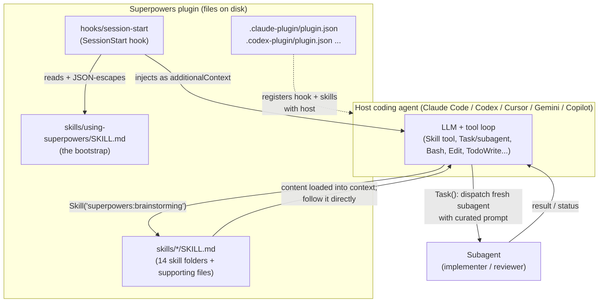
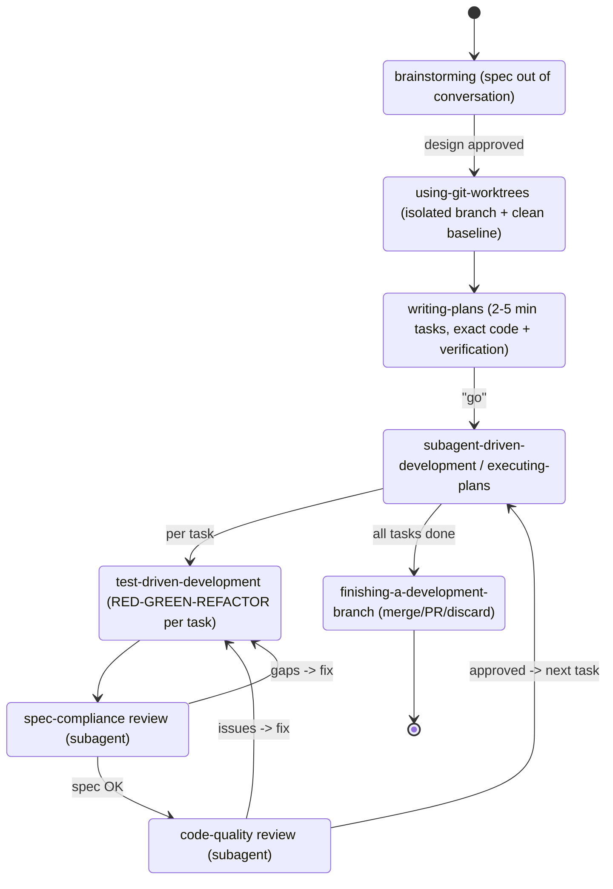

# Superpowers (obra / Jesse Vincent)

> **One-source findings doc.** Researching exactly one source: **Superpowers**, an
> open-source "agentic skills framework & software-development methodology" for coding
> agents (Claude Code, Codex, Cursor, Gemini, OpenCode, Copilot, Factory Droid). It is
> *not* an autonomous evolutionary system; it is a **library of behavior-shaping skill
> documents + a session-start bootstrap that forces the agent to consult them**, plus a
> meta-methodology for *writing and testing* such skills. The relevant-to-us payload is
> the **skill format, the discovery/injection mechanism, and the "TDD-for-prompts"
> authoring loop** — not a candidate/verifier search loop.

---

## 1. Identity

- **Name:** Superpowers (plugin name `superpowers`; package version `5.1.0`).
- **What it is:** "A complete software development methodology for your coding agents,
  built on top of a set of composable **skills** and some initial instructions that make
  sure your agent uses them." (README.md). Repo self-description: *"An agentic skills
  framework & software development methodology that works."*
- **Author / org:** **Jesse Vincent** (GitHub `obra`, email `jesse@fsck.com`; blog
  `blog.fsck.com`). Built "by Jesse Vincent and the rest of the folks at **Prime
  Radiant**" (primeradiant.com). Jesse Vincent is a long-time open-source hacker (creator
  of RT / Request Tracker, the Perl `Moose` ecosystem contributor, keyboard.io founder).
- **Dates:** Repo created **2025-10-09** (same day as the launch blog post
  "Superpowers", blog.fsck.com/2025/10/09/superpowers/). Actively maintained; last push
  2026-06-03. Inspected tree dated 2026-05-29.
- **Primary links:**
  - Repo: https://github.com/obra/superpowers
  - Launch post: https://blog.fsck.com/2025/10/09/superpowers/
  - Marketplace (Claude): https://claude.com/plugins/superpowers ; `obra/superpowers-marketplace`
  - Spec referenced for the skill format: https://agentskills.io/specification
- **Code repo + commit inspected:** `github.com/obra/superpowers @ 6fd4507659784c351abbd2bc264c7162cfd386dc`
  (branch `main`, committed 2026-05-29T20:05:25Z, message: "Require contributors to
  disclose authoring environment and target dev[branch]"). Inspected via codeload tarball
  (proxy blocked `git clone`; tarball has no `.git`, SHA obtained from the GitHub API).
- **Popularity / signal of adoption:** GitHub reports **~218k stars / ~19k forks** at
  inspection time (an unusually large number — by far the most-starred source in this
  canon). MIT-licensed. Distributed through *official* Anthropic and OpenAI plugin
  marketplaces, which is strong third-party validation that the format is real and used.
  *(Caveat: star counts can be inflated; I did not independently audit them.)*

---

## 2. TL;DR

- **It is a prompt/skill library, not an autonomous agent.** There is **no control loop,
  no evaluator, no candidate population, no self-modification engine** in the code. The
  "engine" is the host coding agent (Claude Code et al.). Superpowers supplies (a) a
  set of Markdown **SKILL.md** files and (b) a **SessionStart hook** that injects a
  bootstrap skill telling the agent to *always* check for and obey skills.
- **The load-bearing mechanism is dead simple and worth understanding:** a `SessionStart`
  shell hook reads `skills/using-superpowers/SKILL.md`, JSON-escapes it, and injects it as
  `additionalContext` wrapped in `<EXTREMELY_IMPORTANT>`. That bootstrap then coerces the
  model — "if you think there is even a **1% chance** a skill might apply… you ABSOLUTELY
  MUST invoke the skill" — to call the host's `Skill` tool before doing anything, including
  before asking clarifying questions.
- **The genuinely novel idea is "TDD for prompts."** The `writing-skills` meta-skill treats
  a skill document as *code* and its compliance as *tests*: run a **pressure scenario** on a
  subagent **without** the skill (RED — watch it rationalize its way out), write the skill
  to kill those exact rationalizations (GREEN), then adversarially **re-test and close
  loopholes** (REFACTOR). Skills carry explicit "Rationalization tables" and "Red Flags"
  lists harvested from real failed runs.
- **The methodology it encodes is a disciplined SWE pipeline:** brainstorm → spec →
  worktree → bite-sized plan → **subagent-driven execution with two-stage review (spec
  compliance, then code quality)** → TDD on every task → code review → finish branch. Each
  phase is a skill; skills cross-reference each other as "REQUIRED SUB-SKILL".
- **Why it matters for us:** the parts that transfer to a self-improving builder are (1) a
  reliable *skill discovery + forced-invocation* substrate (how an agent finds and applies
  its own accumulated tools/playbooks), (2) the *fresh-subagent-per-task + reviewer-subagent*
  orchestration pattern for long-horizon work without context rot, and (3) the
  *empirically-tested, rationalization-hardened* way of writing the agent's own operating
  instructions. The verification here is **process discipline (did you watch the test
  fail?)**, not an automated fitness function — so it informs *how the agent should behave*,
  not *how to decide a candidate is better*.
- **Honest signal: MEDIUM.** High-quality, battle-tested artifacts and one genuinely good
  authoring methodology, but it is engineering folklore + prompt craft, not a research
  system. No metrics, no evaluation harness for *outcomes* (only for *compliance*), and the
  whole thing is a thin layer over a commercial host agent.

---

## 3. What it does & how it works

### 3.1 The actual architecture (it's a plugin, not a runtime)

Superpowers ships as a **multi-harness plugin**. The repo root contains harness-specific
manifests (`.claude-plugin/`, `.codex-plugin/`, `.cursor-plugin/`, `.opencode/`,
`gemini-extension.json`) plus a `hooks/` directory and a `skills/` directory. There is no
server, no Python, no orchestrator process of its own — the only executable code is **shell
hooks** and a couple of helper scripts (a brainstorming visual-companion Node server; a
graph renderer). The "agent" is whatever host you install it into.



### 3.2 The discovery + forced-invocation mechanism (the heart of the runtime behaviour)

This is the single most important mechanism, and it is only ~50 lines of bash plus one
skill file.

**Step 1 — `hooks/hooks.json`** registers a `SessionStart` hook (matchers
`startup|clear|compact`) that runs `hooks/run-hook.cmd session-start`.

**Step 2 — `hooks/session-start`** (`repo@6fd4507:hooks/session-start`) reads the bootstrap
skill verbatim, escapes it for JSON, and emits it as injected context. The emitted wrapper:

```
<EXTREMELY_IMPORTANT>
You have superpowers.

**Below is the full content of your 'superpowers:using-superpowers' skill - your
introduction to using skills. For all other skills, use the 'Skill' tool:**

<full text of using-superpowers/SKILL.md>
</EXTREMELY_IMPORTANT>
```

Note the per-platform output shape it handles (real interoperability work): Cursor wants
top-level `additional_context`; Claude Code wants
`hookSpecificOutput.additionalContext`; Copilot CLI / SDK-standard want top-level
`additionalContext`. It branches on `CURSOR_PLUGIN_ROOT` / `CLAUDE_PLUGIN_ROOT` /
`COPILOT_CLI` env vars. (`repo@6fd4507:hooks/session-start` lines 46–55.)

**Step 3 — the bootstrap (`using-superpowers/SKILL.md`)** then does the actual behavioural
coercion. Verbatim:

> `<EXTREMELY-IMPORTANT>` If you think there is even a 1% chance a skill might apply to what
> you are doing, you ABSOLUTELY MUST invoke the skill. IF A SKILL APPLIES TO YOUR TASK, YOU
> DO NOT HAVE A CHOICE. YOU MUST USE IT. This is not negotiable. This is not optional. You
> cannot rationalize your way out of this. `</EXTREMELY-IMPORTANT>`

It establishes an **instruction priority order** (user CLAUDE.md/AGENTS.md > Superpowers
skills > default system prompt), tells the agent to use the host's `Skill` tool (and
*never* to `Read` skill files directly, because the host's skill loader is the intended
path), and gives a `graphviz` decision flow: *user message → "might any skill apply?" → if
yes (even 1%) invoke Skill tool → announce "Using [skill] to [purpose]" → if it has a
checklist, create a TodoWrite todo per item → follow the skill exactly.*

Critically it includes a **"Red Flags" table of rationalizations** the agent must treat as
STOP signals — e.g. "This is just a simple question" → "Questions are tasks. Check for
skills."; "Let me explore the codebase first" → "Skills tell you HOW to explore. Check
first." This is the same anti-rationalization pattern used throughout.

```mermaid
sequenceDiagram
    participant H as Host (SessionStart)
    participant Hook as session-start hook
    participant LLM as Agent (LLM loop)
    participant Skill as Skill tool / files
    H->>Hook: fire on startup|clear|compact
    Hook->>Hook: cat using-superpowers/SKILL.md; JSON-escape
    Hook-->>LLM: inject <EXTREMELY_IMPORTANT> bootstrap as additionalContext
    Note over LLM: Bootstrap now resident in context
    LLM->>LLM: user message arrives
    LLM->>LLM: "Might any skill apply? (>=1%)"
    LLM->>Skill: Skill("superpowers:brainstorming")
    Skill-->>LLM: full SKILL.md content
    LLM->>LLM: announce "Using brainstorming to ..."; TodoWrite per checklist item
    LLM->>LLM: follow skill exactly (may dispatch subagents)
```

### 3.3 The methodology the skills encode (the SWE pipeline)

The README's "Basic Workflow" is realized as a chain of skills that trigger each other:

1. **brainstorming** — before any code: Socratic refinement, explore alternatives, present
   design in digestible sections, save a design doc.
2. **using-git-worktrees** — after design approval: isolated branch/worktree, project
   setup, **verify clean test baseline**.
3. **writing-plans** — break work into **2–5-minute tasks**, each with exact file paths,
   complete code, and verification steps ("clear enough for an enthusiastic junior engineer
   with poor taste, no judgement, no project context, and an aversion to testing to follow").
4. **subagent-driven-development** (same session) or **executing-plans** (batch + human
   checkpoints) — dispatch a **fresh subagent per task** with a curated prompt, then run
   **two-stage review**: spec-compliance reviewer, then code-quality reviewer.
5. **test-driven-development** — RED-GREEN-REFACTOR enforced on every task; "delete code
   written before tests."
6. **requesting-code-review / receiving-code-review** — between tasks; severity-ranked.
7. **finishing-a-development-branch** — verify tests, present merge/PR/keep/discard, clean
   up worktree.



> **Note on the blog vs. the current code.** The Oct-2025 launch post shows an *earlier*
> bootstrap that merely told Claude `RIGHT NOW, go read @.../getting-started/SKILL.md`. The
> inspected tree (v5.1.0) has evolved: the skill is renamed `using-superpowers`, the hook
> now **injects the full content** (no second read hop), and there is no `getting-started`.
> The mechanism is the same; the wording is more aggressive and the load path tighter.

---

## 4. Evidence from the code

All paths are under `github.com/obra/superpowers @ 6fd4507`.

### 4.1 Files inspected
- `README.md`, `CLAUDE.md` (≡ `AGENTS.md` symlink), `RELEASE-NOTES.md` (47 versioned
  entries, v3.0→v5.1, Oct 2025 → Apr 2026), `package.json`, `gemini-extension.json`.
- Plugin manifests: `.claude-plugin/plugin.json`, `.claude-plugin/marketplace.json`,
  `.codex-plugin/plugin.json`, `.cursor-plugin/plugin.json`, `.opencode/INSTALL.md`,
  `.opencode/plugins/superpowers.js`.
- Hooks: `hooks/hooks.json`, `hooks/session-start` (bash), `hooks/run-hook.cmd`,
  `hooks/hooks-cursor.json`.
- Skills (each a folder with `SKILL.md` + optional supporting files): `using-superpowers/`,
  `brainstorming/`, `writing-plans/`, `writing-skills/`, `test-driven-development/`,
  `subagent-driven-development/`, `executing-plans/`, `systematic-debugging/`,
  `verification-before-completion/`, `requesting-code-review/`, `receiving-code-review/`,
  `dispatching-parallel-agents/`, `using-git-worktrees/`, `finishing-a-development-branch/`.
- Supporting prompt files: `subagent-driven-development/{implementer,spec-reviewer,
  code-quality-reviewer}-prompt.md`; `requesting-code-review/code-reviewer.md`;
  `brainstorming/spec-document-reviewer-prompt.md`; `writing-plans/plan-document-reviewer-prompt.md`.
- Meta-references: `writing-skills/testing-skills-with-subagents.md`,
  `writing-skills/persuasion-principles.md`, `writing-skills/anthropic-best-practices.md`,
  `systematic-debugging/{root-cause-tracing,defense-in-depth,condition-based-waiting}.md` and
  several `test-pressure-*.md` baseline scenarios; `test-driven-development/testing-anti-patterns.md`.
- Tests: `tests/claude-code/*.sh` (real end-to-end behavioural tests; see §4.6),
  `tests/skill-triggering/`, `tests/explicit-skill-requests/`, `docs/testing.md`.

### 4.2 The SKILL.md format (the data structure that matters)

A skill is a directory whose contract is a single `SKILL.md` with YAML frontmatter:

```yaml
---
name: test-driven-development
description: Use when implementing any feature or bugfix, before writing implementation code
---
```

Only two fields are required (`name`, `description`), max 1024 chars frontmatter total,
`name` is `[a-z0-9-]`. The format defers to an external spec
(`agentskills.io/specification`). The body is free-form Markdown. Supporting files
(scripts, heavy reference, examples) live beside `SKILL.md` and are loaded only on demand.

The most load-bearing and **counter-intuitive** rule about the format
(`writing-skills/SKILL.md`): the **description must say ONLY *when to use*, never *what
the skill does*.** Verbatim rationale:

> Testing revealed that when a description summarizes the skill's workflow, Claude may
> follow the description instead of reading the full skill content. A description saying
> "code review between tasks" caused Claude to do ONE review, even though the skill's
> flowchart clearly showed TWO reviews… When the description was changed to just "Use when
> executing implementation plans with independent tasks" (no workflow summary), Claude
> correctly read the flowchart and followed the two-stage review process. **The trap:**
> Descriptions that summarize workflow create a shortcut Claude will take.

They call this **Claude Search Optimization (CSO)** — writing the description with
trigger keywords, error strings, symptoms, and synonyms so the model retrieves the right
skill, while *withholding* the procedure so it must actually open the file.

### 4.3 The bootstrap + hook (verbatim)

`hooks/session-start` (lines 35, 46–55) builds the injected context. The wrapper string:

```
<EXTREMELY_IMPORTANT>\nYou have superpowers.\n\n**Below is the full content of your
'superpowers:using-superpowers' skill - your introduction to using skills. For all other
skills, use the 'Skill' tool:**\n\n${using_superpowers_escaped}\n\n${warning_escaped}\n</EXTREMELY_IMPORTANT>
```

and the per-host output branch:

```bash
if [ -n "${CURSOR_PLUGIN_ROOT:-}" ]; then
  printf '{\n  "additional_context": "%s"\n}\n' "$session_context"
elif [ -n "${CLAUDE_PLUGIN_ROOT:-}" ] && [ -z "${COPILOT_CLI:-}" ]; then
  printf '{\n  "hookSpecificOutput": {\n    "hookEventName": "SessionStart",\n    "additionalContext": "%s"\n  }\n}\n' "$session_context"
else
  printf '{\n  "additionalContext": "%s"\n}\n' "$session_context"
fi
```

The bootstrap body's coercion core (`using-superpowers/SKILL.md` lines 10–16):

> If you think there is even a 1% chance a skill might apply to what you are doing, you
> ABSOLUTELY MUST invoke the skill. IF A SKILL APPLIES TO YOUR TASK, YOU DO NOT HAVE A
> CHOICE. YOU MUST USE IT. This is not negotiable. This is not optional. You cannot
> rationalize your way out of this.

OpenCode does the same injection differently: `.opencode/plugins/superpowers.js` hooks
`experimental.chat.messages.transform` (fires every agent step) and injects cached
bootstrap content — v5.1 added module-level caching after profiling showed it re-read the
file + ran a frontmatter regex on every step (#1202). This is evidence the team treats the
injection path as performance-sensitive production code, not a toy.

### 4.4 The verification topology (this is the closest thing to an "evaluator")

There is no fitness function. "Verification" is **adversarial review by separate
subagents** plus a **discipline gate**. Three artifacts encode it:

**(a) Spec-compliance reviewer** (`subagent-driven-development/spec-reviewer-prompt.md`) —
note the explicit distrust of the implementer's self-report:

> ## CRITICAL: Do Not Trust the Report
> The implementer finished suspiciously quickly. Their report may be incomplete,
> inaccurate, or optimistic. You MUST verify everything independently.
> **DO NOT:** Take their word… Trust their claims… Accept their interpretation…
> **DO:** Read the actual code… Compare actual implementation to requirements line by
> line… Check for missing pieces… Look for extra features they didn't mention.

It checks three failure classes: **missing requirements, extra/unneeded work
(over-engineering), and misunderstandings** — i.e. it polices *both* under- and
over-building. Output is a binary `✅ Spec compliant` / `❌ Issues found` with
`file:line` references.

**(b) Code-quality reviewer** runs *only after* spec passes
(`code-quality-reviewer-prompt.md`), using the shared `requesting-code-review/code-reviewer.md`
persona, keyed on `BASE_SHA`/`HEAD_SHA`, returning `Strengths / Issues
(Critical/Important/Minor) / Assessment`. A behavioural test plants real bugs (SQL
injection, plaintext passwords, credential logging) and asserts the reviewer flags every
one at Critical/Important and refuses to approve (RELEASE-NOTES v5.1, PR #1299).

**(c) The discipline gate** (`verification-before-completion/SKILL.md`) — a "Gate
Function" the *primary* agent must run before any completion claim:

> NO COMPLETION CLAIMS WITHOUT FRESH VERIFICATION EVIDENCE
> 1. IDENTIFY: What command proves this claim? 2. RUN the FULL command (fresh, complete)
> 3. READ full output, check exit code, count failures 4. VERIFY… 5. ONLY THEN make the
> claim. Skip any step = lying, not verifying.

with a table mapping claim → required evidence (e.g. "Agent completed" → "VCS diff shows
changes", *not* "Agent reports success"). This is the only place the system encodes "don't
trust the agent's self-assessment, check the artifact" — directly relevant to a
keep-if-verifiably-better loop.

### 4.5 The implementer status protocol (long-horizon control)

`implementer-prompt.md` defines a **four-state report contract** every task subagent must
return: `DONE | DONE_WITH_CONCERNS | BLOCKED | NEEDS_CONTEXT`, with explicit instructions
to escalate rather than guess ("It is always OK to stop and say 'this is too hard for
me.' Bad work is worse than no work. You will not be penalized for escalating."). The
controller (`subagent-driven-development/SKILL.md` §"Handling Implementer Status") has a
documented response per state — provide context and re-dispatch, escalate to a more
capable model, split the task, or escalate to the human — and a hard rule: *"Never ignore
an escalation or force the same model to retry without changes."* It also prescribes
**model-tiering** (cheap model for mechanical 1–2-file tasks, capable model for
architecture/review) to manage cost over long runs.

### 4.6 The plan/task data schema

`writing-plans/SKILL.md` defines a concrete plan format: a header
(`Goal / Architecture / Tech Stack` + a `REQUIRED SUB-SKILL` pointer), a **File Structure**
section that "locks in" decomposition, then **bite-sized tasks** where each *step* is one
2–5-minute action with checkbox tracking:

```markdown
### Task N: [Component Name]
**Files:** Create: `exact/path` · Modify: `path:123-145` · Test: `tests/path`
- [ ] **Step 1: Write the failing test**   ```<code>```
- [ ] Step 2: Run it to make sure it fails
- [ ] Step 3: Implement the minimal code to make the test pass
- [ ] Step 4: Run the tests and make sure they pass
- [ ] Step 5: Commit
```

The plan is written for "an enthusiastic junior engineer with poor taste, no judgement, no
project context, and an aversion to testing" — i.e. the plan must be self-sufficient
because the executing subagent is given *no* session history (controller pastes full task
text; subagent never reads the plan file). Plans are persisted to
`docs/superpowers/plans/…` so a session can resume after a crash.

### 4.7 Tests of the skills themselves
`tests/claude-code/` contains real shell harnesses that launch `claude -p` against the
working tree (`--plugin-dir`) and assert behaviour: e.g.
`test-requesting-code-review.sh` (planted-bug detection), `test-subagent-driven-
development-integration.sh` (six verification assertions on an end-to-end SDD run),
`analyze-token-usage.py`. `tests/skill-triggering/prompts/` and
`tests/explicit-skill-requests/prompts/` hold trigger scenarios. This is unusual and a
real maturity signal: **the prompts are tested like code, with CI-style scripts.**

---

## 5. What's genuinely smart

1. **Forced-invocation bootstrap as the "kernel."** The entire behavioural system reduces
   to: *inject one always-present meta-skill at session start that makes the model
   self-interrupt and consult its skill library before acting.* This is a clean, portable
   pattern for giving an agent a **retrievable, ever-growing library of its own
   playbooks/tools** without bloating the base prompt — exactly the substrate a
   self-extending agent needs. The "≥1% → you must check" framing converts skill use from
   optional to default.

2. **CSO: separate *retrieval cue* from *procedure*.** The deliberate rule that a skill's
   `description` contains only triggering conditions (never the workflow) is a subtle,
   empirically-derived insight: if you put the summary in the cue, the model satisfices on
   the summary and skips the real instructions. For a system where the agent selects from
   many self-authored skills, this is a directly transferable lesson about *how to index
   capabilities so they're actually executed, not just matched.*

3. **"TDD for prompts" (the writing-skills loop).** The single most novel idea: treat a
   behaviour-shaping document as code and its compliance as a test. **RED** = run a
   *pressure scenario* on a subagent without the skill and record verbatim
   rationalizations; **GREEN** = write the skill to kill those exact excuses; **REFACTOR**
   = adversarially re-test, harvest new rationalizations, add explicit counters, repeat
   until "bulletproof." Skills then carry a **Rationalization table** and **Red Flags
   list** — a structured, reusable record of *failure modes and their counters*. This is a
   real methodology for **iteratively improving an agent's own operating instructions with
   an empirical signal**, which is squarely in the self-improvement space.

4. **Pressure-testing with named persuasion levers.** `persuasion-principles.md` makes the
   theory explicit: it cites **Meincke et al. (2025), N=28,000 LLM conversations,
   compliance 33%→72% with persuasion techniques**, and prescribes *Authority +
   Commitment + Social Proof* for discipline skills while **forbidding Liking/Reciprocity**
   (they cause sycophancy). And the *testing* methodology uses the same levers as
   adversarial pressure (time + sunk-cost + exhaustion + authority) to try to break a
   skill. This is a coherent, falsifiable model of "how to write instructions an LLM will
   actually obey under pressure."

5. **Adversarial, artifact-grounded verification.** "Do Not Trust the Report" + "check the
   VCS diff, not the agent's success claim" + planted-bug review tests encode a principle a
   self-improving loop needs: **the proposer cannot be its own judge; verify against the
   real artifact.** Two-stage review (spec compliance *then* quality, in that order)
   cleanly separates "did it build the right thing" from "did it build it well."

6. **Context hygiene as a first-class design constraint.** Fresh subagent per task, full
   task text pasted in (never "go read the plan"), controller curates exactly the needed
   context, search-via-subagent so "fruitless searches don't pollute the context window."
   These are concrete, reusable tactics for **running an agent reliably over long
   horizons** without context rot.

7. **Genuine multi-harness portability.** One skill corpus drives Claude Code, Codex,
   Cursor, Gemini, OpenCode, Copilot, Factory Droid via per-host hook output shapes and a
   tool-name mapping (`references/{codex,copilot,gemini}-tools.md`: `TodoWrite→todowrite`,
   `Task→@mention`, `Skill→native skill tool`). Evidence the SKILL.md format is becoming a
   de-facto cross-vendor standard (`agentskills.io/specification`).

---

## 6. Claims vs. reality / limitations / critiques

**What it is NOT (correcting the obvious mis-reads):**
- **Not autonomous and not self-improving at runtime.** Self-improvement here is a
  *human-in-the-loop authoring activity* ("Jesse + Claude write and pressure-test a new
  skill"), not an online loop. The agent does not propose, test, and promote its own code
  changes against a fitness signal. The launch blog's "self-improve" framing refers to the
  *workflow of asking Claude to write a new SKILL.md*, which a human reviews and commits.
- **No outcome metric.** "Verification" measures *compliance* (did the agent follow the
  rule, did the reviewer catch planted bugs) and *correctness vs. a human-approved spec* —
  never an automated quality/fitness score that could drive selection. There is no
  benchmark, no leaderboard, no eval-of-results in the repo.
- **It's a thin layer over a commercial host.** The "engine" is Claude Code/Codex/etc.
  Superpowers contributes Markdown + ~50 lines of bash. Remove the host and nothing runs.

**Reproducibility / evidence quality:**
- The only public controlled evaluation I found is an *independent* blog experiment by
  **Engr Mejba Ahmed** (mejba.me, 2026-04-13): **12 automated Claude Code sessions, 6
  with / 6 without, $2 cap each**. Result: **~9% lower cost, ~14% fewer tokens on average,
  and 2–3× lower cost variance**, with the gains concentrated in *complex* tasks' planning
  phases (planning is cheap text that prevents expensive wrong-code restarts). The author
  is explicitly candid that **12 sessions is not statistically significant, tasks were
  self-designed, and full automation bypasses the human-in-the-loop the framework is built
  for** — so even this favorable result understates *and* can't be generalized. Headline:
  *"Superpowers didn't make Claude smarter. It made Claude disciplined."* This matches what
  the code suggests and is the most honest external read available.
- The author's own claims ("first-time fix rate 95% vs 40%", "15-30 min vs 2-3 hours" in
  `systematic-debugging`) are **anecdotal, uncited "From debugging sessions"** numbers with
  no methodology. Treat as motivational copy, not data.

**Failure modes / risks:**
- **Over-coercion / prompt-injection-of-self.** The bootstrap floods context with
  `<EXTREMELY_IMPORTANT>` "you have no choice" language and pages of rationalization
  tables. This is itself token cost on *every* session and could crowd or over-constrain
  the model on tasks where the rigid workflow is wrong; the team partly mitigates with the
  explicit "user instructions always take precedence" priority order.
- **Persuasion-as-control is dual-use and brittle.** Compliance via authority/scarcity
  framing is, by the authors' own cited research, a *persuasion* effect — it can decay with
  model updates, and "bulletproof under pressure" is only ever bulletproof against the
  *rationalizations they happened to observe*. New models invent new loopholes.
- **Reviewer subagents share the same model family** — adversarial review by another
  instance of the same model is weaker than independent verification; a blind spot in the
  base model is shared by its "reviewer."
- **Discipline overhead is real on simple work.** Mejba and the maintainers both note the
  brainstorm→spec→plan ceremony slows simple/prototype tasks; the framework concedes this.
- **The repo's own social signal is double-edged.** `CLAUDE.md` documents a **94% PR
  rejection rate** driven by AI "slop," and the maintainers explicitly reject most
  contributions, including "compliance" rewrites toward Anthropic's own skill guidance
  (they keep a *deliberately different* philosophy, `anthropic-best-practices.md` notwith-
  standing). This is healthy curation but means the corpus is one author's tuned taste, not
  a validated community standard. (The ~218k star count is striking but I could not
  independently verify it isn't inflated.)
- **Memory is not actually here.** The blog's most relevant-to-us piece —
  `remembering-conversations` (vector index of past transcripts in SQLite + Haiku
  summaries + subagent search) — is **described as a separate/unfinished component and is
  NOT present in this repo** (confirmed: no such skill, no vector/SQLite code in tree). So
  the "long-term memory" idea is *aspirational here*, not shipped.

---

## 7. Relevance to a self-improving, evolutionary agent

Judged by the one test — *would this help build a self-improving, evolutionary,
software-building agent?* — Superpowers contributes **behavioural scaffolding and a
prompt-improvement methodology**, not a search/selection engine. Specific mechanisms and
what each would help with:

- **Skill library + forced-invocation bootstrap → the agent's self-extension substrate.**
  If our seed AI accumulates its own tools/playbooks, it needs a discovery-and-use
  mechanism so they're actually applied. Superpowers' pattern (always-resident meta-skill
  that makes the agent consult its library before acting; description-as-retrieval-cue) is
  a clean, host-portable template for that. **Helps: skills/tools, decision-making (route
  to the right capability), memory-of-procedures.**
- **"TDD for prompts" loop → empirically improving the agent's own instructions.** RED
  (baseline failure) → GREEN (write counter) → REFACTOR (close loopholes) with a
  Rationalization table is a concrete, repeatable way to *evolve operating instructions
  against an observed signal*. If a seed AI rewrites its own prompts/skills, this is a
  ready-made discipline for doing so without regressions. **Helps: self-improvement of the
  control layer, verification that an instruction change is actually better (compliance
  delta under fixed scenarios).**
- **Adversarial, artifact-grounded verification → the "is it verifiably better?" gate.**
  "Do Not Trust the Report," "check the VCS diff not the success claim," two-stage
  spec-then-quality review, planted-bug review tests. These are exactly the *anti-self-
  deception* habits a keep-if-better loop needs so the proposer can't grade its own
  homework. **Helps: verification, reward-hacking resistance, promotion decisions.**
- **Fresh-subagent-per-task + status protocol + model-tiering → long-horizon reliability.**
  Isolated context per unit of work, a four-state escalation contract
  (DONE/CONCERNS/BLOCKED/NEEDS_CONTEXT), "never let the same model retry unchanged," and
  cheap-vs-capable model routing are practical controls for running for hours without
  drift or context rot. **Helps: long-horizon running, orchestration, cost control under
  unlimited tokens.**
- **Bite-sized, self-sufficient plan schema → decomposition + resumability.** 2–5-minute
  checkbox steps with exact files/signatures, persisted to disk, written for a
  zero-context executor. **Helps: orchestration, crash/resume, parceling work to weak/cheap
  sub-agents.**
- **Persuasion-principle model of instruction-following → why prompts hold under
  pressure.** The Authority+Commitment+Social-Proof recipe (and the *avoid* list) is a
  usable heuristic for writing control prompts a model won't rationalize away during long
  autonomous runs. **Helps: reliability of the control loop, decision-making discipline.**
- **(Aspirational, not in-repo) memory of past conversations.** The blog's
  `remembering-conversations` design (duplicate transcripts → SQLite vector index → Haiku
  per-conversation summaries → *subagent-mediated* search to protect the context window) is
  a relevant **episodic-memory** sketch — but it is not shipped here, so treat it as a lead
  to chase elsewhere, not evidence.

**What does NOT apply:** there is no evolutionary search, no population of candidates, no
fitness function, no automated promotion, no self-modifying code path. If we want the
"propose → test → keep only if verifiably better" *engine*, Superpowers supplies none of
it — only the surrounding hygiene and a way to evolve the *prompts* that drive such an
engine.

---

## 8. Reusable assets (collected as evidence, not assembled into a design)

All quotes are verbatim from `github.com/obra/superpowers @ 6fd4507`.

**A. The session-start injection wrapper** — `hooks/session-start:35`
(the kernel that makes any host consult a skill library before acting):
> `<EXTREMELY_IMPORTANT>\nYou have superpowers.\n\n**Below is the full content of your
> 'superpowers:using-superpowers' skill … For all other skills, use the 'Skill'
> tool:**\n\n${using_superpowers_escaped}\n…\n</EXTREMELY_IMPORTANT>`
plus the per-host output branch (`additional_context` vs
`hookSpecificOutput.additionalContext` vs top-level `additionalContext`) — reusable
cross-harness context-injection recipe.

**B. The forced-invocation rule** — `using-superpowers/SKILL.md:10-16`:
> "If you think there is even a 1% chance a skill might apply … you ABSOLUTELY MUST invoke
> the skill. … YOU DO NOT HAVE A CHOICE. … You cannot rationalize your way out of this."
and the **Red-Flags rationalization table** (lines 80–96) mapping each "I'll skip the
skill" thought to a counter.

**C. CSO description rule** — `writing-skills/SKILL.md:150-172` ("Description = When to Use,
NOT What the Skill Does"), with the empirical justification that summarizing the workflow
makes the model satisfice on the summary. Borrow as a *capability-indexing* rule.

**D. The "TDD-for-skills" cycle + pressure-scenario template** —
`writing-skills/testing-skills-with-subagents.md`. Verbatim baseline scenario:
> "IMPORTANT: This is a real scenario. Choose and act. You spent 4 hours implementing a
> feature. It's working perfectly. You manually tested all edge cases. It's 6pm, dinner at
> 6:30pm. Code review tomorrow at 9am. You just realized you didn't write tests. Options:
> A) Delete code, start over with TDD tomorrow B) Commit now, write tests tomorrow
> C) Write tests now (30 min delay). Choose A, B, or C."
Plus the pressure-type table (Time/Sunk-cost/Authority/Economic/Exhaustion/Social/
Pragmatic) and the **meta-test** ("You read the skill and chose C anyway. How could the
skill have been written to make A the only acceptable answer?").

**E. The adversarial spec-reviewer prompt** — `subagent-driven-development/spec-reviewer-prompt.md`
(the "## CRITICAL: Do Not Trust the Report" block + the missing/extra/misunderstanding
checklist + binary `✅/❌ with file:line`). Reusable as a verifier-subagent prompt.

**F. The verification Gate Function** — `verification-before-completion/SKILL.md`:
> "NO COMPLETION CLAIMS WITHOUT FRESH VERIFICATION EVIDENCE … 1. IDENTIFY what command
> proves this claim 2. RUN the FULL command 3. READ full output, check exit code, count
> failures 4. VERIFY 5. ONLY THEN make the claim. Skip any step = lying."
plus the claim→evidence table ("Agent completed → VCS diff shows changes", not the report).

**G. The implementer status contract** — `subagent-driven-development/implementer-prompt.md`:
the four statuses (`DONE | DONE_WITH_CONCERNS | BLOCKED | NEEDS_CONTEXT`), the "Bad work is
worse than no work; you will not be penalized for escalating" framing, and the controller's
per-status response table in `SKILL.md` (provide context / upgrade model / split / escalate;
"Never … force the same model to retry without changes").

**H. The plan/task schema** — `writing-plans/SKILL.md` (header `Goal/Architecture/Tech
Stack` + File-Structure decomposition + 2–5-min checkbox steps; write for "an enthusiastic
junior engineer with poor taste, no judgement, no project context"). Reusable
work-decomposition + resumable-plan format.

**I. Persuasion-principle design table** — `writing-skills/persuasion-principles.md`:
discipline skills → Authority+Commitment+Social-Proof; avoid Liking/Reciprocity; cites
Meincke et al. 2025 (N=28,000; 33%→72%). Reusable heuristic for writing control prompts.

**J. Systematic-debugging four-phase protocol** — `systematic-debugging/SKILL.md`
("NO FIXES WITHOUT ROOT CAUSE INVESTIGATION FIRST"; multi-component boundary
instrumentation; "if 3+ fixes failed, question the architecture"). Reusable as an agent
debugging loop with an anti-thrash circuit-breaker.

---

## 9. Signal assessment

**Overall value: MEDIUM** (for *our* specific goal of an evolutionary, self-improving
software builder).

- **High-value, directly reusable:** the prompt-improvement methodology ("TDD for
  prompts" + pressure-testing + rationalization tables), the forced-invocation/CSO skill
  substrate, the adversarial-verification prompts, and the long-horizon control patterns
  (status protocol, model-tiering, context hygiene). These are concrete, battle-tested, and
  transfer cleanly.
- **Low-value for the *engine*:** nothing here is an evolutionary loop, an evaluator with a
  fitness signal, a candidate population, or self-modifying code. If we need the
  propose/test/keep core, this source does not provide it.
- **Maturity: high for what it is.** 47 versioned releases in ~7 months, real behavioural
  test harnesses (planted-bug detection, end-to-end SDD assertions), cross-harness support,
  shipped via official Anthropic + OpenAI marketplaces, and exceptionally disciplined
  maintainership. This is production prompt-engineering, not a research prototype.

**Confidence: high** on *what the system is and how the mechanism works* (I read the hook,
the bootstrap, all 14 SKILL.md files, the subagent prompts, the meta-skills, the manifests,
and the release notes at a known SHA). **Medium-low** on *efficacy magnitude* — the only
external controlled test is n=12 and self-described as non-significant; the author's own
metrics are uncited anecdotes.

**Could NOT verify:**
- The ~218k-star / ~19k-fork figures (reported by the GitHub API at inspection; not
  independently audited; plausibly inflated for such a young repo).
- Any large-sample or vendor-run evaluation of outcome quality (none found).
- The `remembering-conversations` memory component (referenced in the launch blog; absent
  from this repo; its code quality/behaviour is unverified here).
- Runtime behaviour: I did not execute the plugin in a live host (read-only static
  inspection per brief).

---

## 10. References

**Primary — code (all `github.com/obra/superpowers @ 6fd4507659784c351abbd2bc264c7162cfd386dc`, branch `main`, 2026-05-29):**
- `repo@6fd4507:README.md` — project description, install matrix, basic workflow.
- `repo@6fd4507:CLAUDE.md` (≡ `AGENTS.md`) — contributor/AI-agent guidelines; 94% PR
  rejection rate; "human partner" voice; new-harness acceptance test.
- `repo@6fd4507:hooks/session-start`, `hooks/hooks.json`, `hooks/hooks-cursor.json`,
  `hooks/run-hook.cmd` — SessionStart injection mechanism (per-host output).
- `repo@6fd4507:skills/using-superpowers/SKILL.md` (+ `references/{codex,copilot,gemini}-tools.md`)
  — the bootstrap / forced-invocation rule / Red-Flags table / tool mapping.
- `repo@6fd4507:skills/writing-skills/SKILL.md`, `testing-skills-with-subagents.md`,
  `persuasion-principles.md`, `anthropic-best-practices.md` — the meta-methodology
  ("TDD for prompts"), pressure-testing, persuasion model.
- `repo@6fd4507:skills/test-driven-development/SKILL.md` (+ `testing-anti-patterns.md`) — TDD Iron Law.
- `repo@6fd4507:skills/subagent-driven-development/SKILL.md` + `implementer-prompt.md`
  + `spec-reviewer-prompt.md` + `code-quality-reviewer-prompt.md` — orchestration +
  verification topology + status protocol.
- `repo@6fd4507:skills/verification-before-completion/SKILL.md` — the completion Gate Function.
- `repo@6fd4507:skills/brainstorming/SKILL.md`, `writing-plans/SKILL.md`,
  `executing-plans/SKILL.md`, `systematic-debugging/SKILL.md` (+ `root-cause-tracing.md`,
  `defense-in-depth.md`, `condition-based-waiting.md`), `requesting-code-review/code-reviewer.md`,
  `using-git-worktrees/SKILL.md`, `finishing-a-development-branch/SKILL.md` — the workflow skills.
- `repo@6fd4507:.claude-plugin/plugin.json`, `.codex-plugin/plugin.json`,
  `.cursor-plugin/plugin.json`, `.opencode/INSTALL.md`, `.opencode/plugins/superpowers.js`,
  `gemini-extension.json` — multi-harness packaging.
- `repo@6fd4507:RELEASE-NOTES.md` — 47-entry version history (maturity evidence).
- `repo@6fd4507:tests/claude-code/{test-requesting-code-review.sh,
  test-subagent-driven-development-integration.sh,analyze-token-usage.py}`,
  `tests/skill-triggering/`, `tests/explicit-skill-requests/`, `docs/testing.md` —
  behavioural tests of the skills.

**Primary — author:**
- Jesse Vincent, "Superpowers: How I'm using coding agents in October 2025,"
  blog.fsck.com/2025/10/09/superpowers/ (2025-10-09) — launch post; intent; the earlier
  bootstrap; the (separate) `remembering-conversations` memory design; skill-sharing plans;
  the "feed a doc → write down what you learned as a skill" loop; lineage to Microsoft
  Amplifier (Sam Schillace / Brian Krabach). *[primary, author statement]*
- Plugin manifest metadata: author Jesse Vincent <jesse@fsck.com>; org Prime Radiant
  (primeradiant.com). GitHub: github.com/obra. *[primary]*

**Secondary — independent:**
- Engr Mejba Ahmed, "I Tested Superpowers for Claude Code — Here's the Truth,"
  mejba.me/blog/superpowers-plugin-claude-code-review (2026-04-13) — independent controlled
  experiment (n=12, 6/6, $2 cap): ~9% lower cost, ~14% fewer tokens, 2–3× lower variance,
  with stated non-significance caveats; "disciplined, not smarter." *[secondary, partly
  empirical]*
- Spec referenced by the skill format: agentskills.io/specification. *[secondary, standard]*
- Distribution: Anthropic official plugin marketplace (claude.com/plugins/superpowers);
  OpenAI Codex plugins (github.com/openai/plugins); `obra/superpowers-marketplace`.
  *[secondary]*

**Research cited *by* the source (not independently reviewed by me):**
- Meincke, Shapiro, Duckworth, Mollick, Mollick, Cialdini (2025), "Call Me A Jerk:
  Persuading AI to Comply with Objectionable Requests," U. Penn (N=28,000; compliance
  33%→72%). Cited in `persuasion-principles.md`.
- Cialdini, R. B. (2021), *Influence: The Psychology of Persuasion* (New & Expanded).
