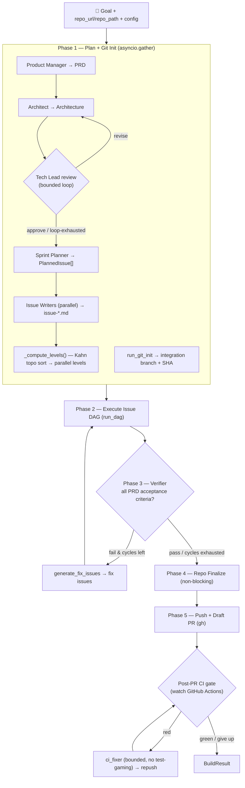
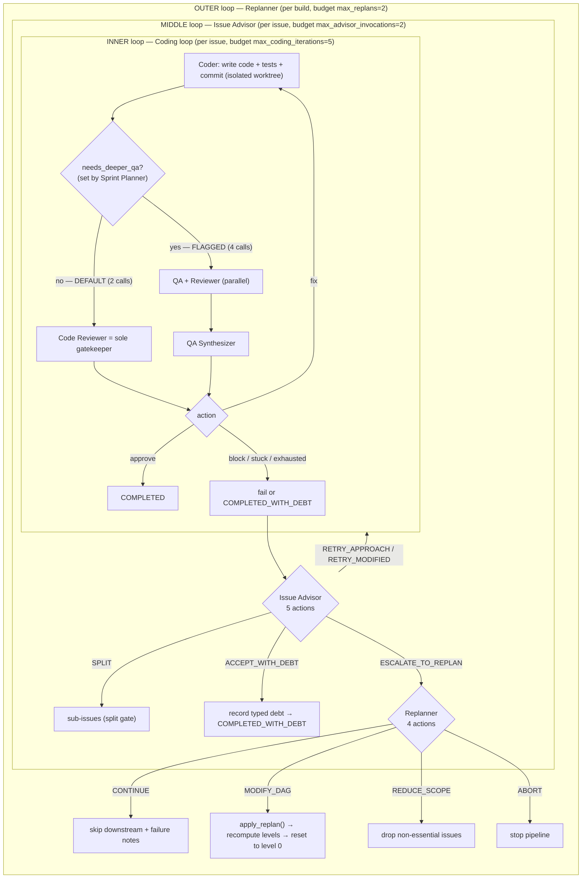

# SWE-AF (Agent-Field) — Research Findings

> Per-source deep-dive for the KB Seed AI project. Reporter, not architect: this
> document records what SWE-AF *is* and how it *actually works*, with verbatim code
> and honest signal assessment. It does **not** propose our system.

---

## 1. Identity

- **Name:** SWE-AF (pronounced "swee-AF"). Tagline: *"Autonomous Engineering Team
  Runtime Built on AgentField"* / *"One API call → full engineering team → shipped code."*
- **What it is:** A multi-agent **autonomous software-engineering pipeline** that takes a
  natural-language goal + a repo and runs a full plan→execute→verify→PR loop with ~16–22
  specialized agent roles (PM, architect, tech lead, sprint planner, coder, QA, reviewer,
  merger, integration tester, verifier, advisor, replanner, …). It is explicitly framed as
  "a first step toward **autonomous software engineering factories**." It is an
  **application node** built on the **AgentField** agent-orchestration framework (the `af`
  control plane). It is *not* an evolutionary / population-based optimizer.
- **Authors / org:** **Agent-Field** (org behind AgentField, SEC-AF, Contract-AF). Primary
  committer on `main`: **Abir Abbas** (GitHub `@AbirAbbas`, abirabbas1998@gmail.com).
  AgentField / "Atomic Unit of Intelligence" writing is by **Santosh Kumar Radha**
  (santoshkumarradha.com). Many commits are co-authored by "Claude Opus 4.8 (1M context)" —
  i.e. the repo is itself partly built by an AI coding agent.
- **Dates:** v0.1.0 initial public release **2026-02-16**; repo status "public beta".
  Inspected commit dated **2026-06-01**.
- **License:** Apache-2.0.
- **Primary links:**
  - Repo: https://github.com/Agent-Field/SWE-AF
  - Framework: https://github.com/Agent-Field/agentfield
  - Sibling apps: https://github.com/Agent-Field/sec-af , https://github.com/Agent-Field/contract-af
  - Concept essay: https://www.santoshkumarradha.com/writing/atomic-unit-of-intelligence
  - "AI backend / guided autonomy": https://www.agentfield.ai/blog/posts/ai-backend
  - Example PR built by SWE-AF: https://github.com/Agent-Field/agentfield/pull/179
- **Code repo + commit inspected:** `Agent-Field/SWE-AF@ebf00a35e6af11cd085ce4928e589a5b983b2e13`
  (branch `main`, 2026-06-01). Obtained via codeload tarball (git clone blocked by sandbox
  proxy 407); SHA confirmed via GitHub API. ~16K LOC of Python across `swe_af/`.

---

## 2. TL;DR

- **What it is:** A production-flavored **multi-agent "software factory"** — a deterministic
  Python orchestrator that fans work out to LLM coding agents (Claude Code / OpenCode /
  Codex), organized as a **dependency DAG of issues** executed level-by-level in **isolated
  git worktrees**, with three **nested control loops** (coder-retry → issue-advisor →
  replanner) and a final **verify→fix** loop against PRD acceptance criteria.
- **Why it matters for us (partial):** It is the closest thing in our canon to a *real,
  runnable* "give it a goal, it ships software" system, and its **control-loop taxonomy** and
  **graceful-degradation / typed-debt** mechanisms are directly relevant to running a coding
  agent reliably over long horizons. The orchestration is **deterministic code**, not a
  prompt — the "intelligence" is in the harness, which matches the project's stated thesis.
- **Why it's only partially relevant:** It is **NOT self-improving and NOT evolutionary.**
  There is no population of candidates, no fitness-ranked archive, no mutation/selection, no
  self-modification of the agent or its prompts. The "keep if verifiably better" notion is
  present only weakly: success = passing tests + acceptance criteria; there is no kept
  *score* that a child must beat. Its "learning" is a per-build key-value scratchpad, not
  cross-run learning.
- **Strongest borrowable ideas:** (1) the **3-loop hierarchical escalation** with explicit
  per-loop budgets and a "last-chance" advisor prompt; (2) **typed/severity-rated technical
  debt** as a first-class, propagated data type (graceful degradation instead of halt);
  (3) **risk-proportional QA routing** (cheap 2-call path vs. deep 4-call path chosen at plan
  time); (4) **durable checkpointed DAG state** enabling `resume_build`; (5) a large library
  of **battle-tested role prompts** and **anti-reward-hacking** verifier/CI rules.
- **Signal: MEDIUM** for our goal. High signal as an engineering reference for *orchestration,
  verification, and long-horizon reliability*; low signal for the *evolutionary / self-
  improving* core, which it does not attempt.

---

## 3. What it does & how it works

SWE-AF is a **deterministic Python orchestrator** (registered as the AgentField node
`swe-planner`) that calls LLM coding agents to ship software from a goal. The "intelligence"
lives in the *harness* (the control loops, gates, schemas, prompts), not in a single
agent prompt. Every role is a `@router.reasoner()` endpoint invoked via `router.harness(...)`
(structured-output LLM call with a Pydantic `schema=`, a tool allow-list, and a `cwd`).

### Top-level build pipeline

`build()` (in `swe_af/app.py`) drives five phases with an embedded verify→fix loop:



Key facts (verified in code):
- **Planning chain** (`reasoners/pipeline.py`): PM → Architect → Tech-Lead-review-loop →
  Sprint Planner → parallel Issue Writers. There is also an optional `run_environment_scout`
  between PM and Architect that negotiates scoped third-party credentials with the human via
  a Hax form (HITL). The Tech-Lead loop **auto-approves the last revision if it exhausts** —
  "the system never blocks on infinite review cycles."
- **DAG, not agent graph.** The plan output is a dependency graph of *work items*
  (`PlannedIssue`), topologically sorted into parallel **levels** via Kahn's algorithm
  (`_compute_levels`, `reasoners/pipeline.py:52`). Cycles are a hard failure.
- **Verify→fix loop.** A strict pass/fail `Verifier` checks every PRD acceptance criterion;
  failures spawn targeted fix issues that re-enter the executor (up to `max_verify_fix_cycles+1`).
- **CI gate.** After opening the PR, it watches GitHub Actions and runs a bounded
  fix-and-repush loop with a hard anti-test-gaming contract (see §4/§5).

### The execution engine: three nested control loops

This is the heart (`execution/dag_executor.py` + `execution/coding_loop.py`). For each
dependency level: setup isolated git **worktrees** → run all issues in the level concurrently
(`asyncio.gather`) → classify outcomes → **merge gate** → **integration-test gate** → **debt
gate** → **split gate** → **replan gate** → checkpoint → advance. Within each issue, three
concentric loops escalate on failure:



- **Inner loop** (`run_coding_loop`, `coding_loop.py:516`): iterates up to
  `max_coding_iterations`. The **Sprint Planner's `needs_deeper_qa` flag** routes the issue to
  the cheap **default path** (Coder → Reviewer, 2 LLM calls) or the **flagged path** (Coder →
  QA + Reviewer in parallel → Synthesizer, 4 LLM calls). The reviewer (default) or synthesizer
  (flagged) returns `approve` / `fix` / `block`. On `fix`, rich feedback (specific test
  failures + blocking review items) is fed back to the coder. **Stuck detection**
  (`_detect_stuck_loop`, window of 3 non-blocking "fix" cycles, *or* the synthesizer's `stuck`
  flag) breaks the loop early: if non-blocking with code present → `COMPLETED_WITH_DEBT`, else
  `FAILED_UNRECOVERABLE`. **Exhaustion is lenient**: if the reviewer was never *blocking* and
  code exists, the issue is `COMPLETED_WITH_DEBT` rather than failed.
- **Middle loop** (Issue Advisor): fires when the inner loop fails. Five actions ordered
  least→most disruptive: `RETRY_APPROACH`, `RETRY_MODIFIED` (relax ACs → debt), `SPLIT`
  (depth-guarded), `ACCEPT_WITH_DEBT`, `ESCALATE_TO_REPLAN`. Budget-aware: on the last
  invocation the prompt biases toward `ACCEPT_WITH_DEBT`. Can pause the whole build to ask
  the human (`ask_user_form`).
- **Outer loop** (Replanner): fires when a level produces `FAILED_UNRECOVERABLE`/
  `FAILED_ESCALATED`. Four actions: `CONTINUE` (skip downstream + enrich with failure notes),
  `MODIFY_DAG` (`apply_replan` filters/removes/skips/updates/adds issues, then
  `recompute_levels` and **resets `current_level=0`**), `REDUCE_SCOPE`, `ABORT`. On replanner
  *crash* it defaults to `CONTINUE`, never `ABORT`. There is also a **level-failure-abort
  threshold**: if most issues in a level fail, the whole DAG aborts to avoid cascading the same
  root cause.
- **Durable state**: full `DAGState` is checkpointed to
  `.artifacts/execution/checkpoint.json` at every boundary; per-issue iteration state is also
  checkpointed, so `resume_build()` continues from the exact failure point.

### "Fast" mode

`swe_af/fast/` is a leaner single-pass pipeline: `fast_plan_tasks` (one LLM call → flat task
list, fallback to one generic task) → executor → `fast_verify` (**exactly one verification
pass, no fix cycles**). This is the closest thing to a bare propose→verify loop in the repo,
deliberately stripped of the adaptive control stack.

### Continual "learning" (per build only)

With `enable_learning=true`, `run_dag` creates an **in-process dict** `_shared_memory` and a
`memory_fn` closure (`dag_executor.py:1450`). It is a **key-value scratchpad scoped to a single
build** (not persisted across runs, not a vector DB): `codebase_conventions` (from first
successful coder), `failure_patterns` (last 10), `bug_patterns` (last 20 with frequency),
`interfaces/{issue}` (exports for dependents), `build_health`. It is injected into every coder
prompt. Cross-*run* learning / self-improvement does **not** exist.

---

## 4. Evidence from the code

Inspected at `Agent-Field/SWE-AF@ebf00a35`. Files I actually read (paths relative to repo root):

- `README.md`, `docs/ARCHITECTURE.md` (the 8-pattern design doc), `CHANGELOG.md`,
  `pyproject.toml`, `requirements.txt`, `.env.example`.
- `swe_af/reasoners/pipeline.py` (549 LOC) — planning chain + `_compute_levels` (Kahn),
  `_validate_file_conflicts`, `_assign_sequence_numbers`.
- `swe_af/execution/dag_executor.py` (1801 LOC) — `run_dag` main loop, worktree setup,
  merge/integration/debt/split/replan gates, checkpointing.
- `swe_af/execution/coding_loop.py` (895 LOC) — inner loop, default/flagged paths,
  stuck detection, memory read/write.
- `swe_af/execution/schemas.py` (1112 LOC) — all enums + Pydantic data structures.
- Prompts: `verifier.py`, `coder.py`, `issue_advisor.py`, `replanner.py`,
  `qa_synthesizer.py`, `ci_fixer.py`, `sprint_planner.py`.
- `swe_af/fast/{planner,verifier}.py` — the single-pass variant.

### Core data structures (`execution/schemas.py`)

The control vocabulary is encoded as enums — this is *the* "what happens on failure" theory:

```python
class AdvisorAction(str, Enum):                 # MIDDLE loop
    RETRY_MODIFIED = "retry_modified"           # Relax ACs, retry coding loop
    RETRY_APPROACH = "retry_approach"           # Keep ACs, different strategy
    SPLIT = "split"                             # Break into sub-issues
    ACCEPT_WITH_DEBT = "accept_with_debt"       # Close enough, record gaps
    ESCALATE_TO_REPLAN = "escalate_to_replan"   # Flag for outer loop

class IssueOutcome(str, Enum):
    COMPLETED = "completed"
    COMPLETED_WITH_DEBT = "completed_with_debt" # Accepted via ACCEPT_WITH_DEBT
    FAILED_RETRYABLE = "failed_retryable"
    FAILED_UNRECOVERABLE = "failed_unrecoverable"
    FAILED_NEEDS_SPLIT = "failed_needs_split"
    FAILED_ESCALATED = "failed_escalated"

class ReplanAction(str, Enum):                  # OUTER loop
    CONTINUE = "continue"
    MODIFY_DAG = "modify_dag"
    REDUCE_SCOPE = "reduce_scope"
    ABORT = "abort"
```

`DAGState` (`schemas.py:276`) is the single serialized object that makes the build resumable —
it carries `all_issues`, `levels`, `completed/failed/skipped/in_flight_issues`, `current_level`,
`replan_count`/`replan_history`, git branch tracking, `merge_results`,
`integration_test_results`, `accumulated_debt`, `adaptation_history`, and the multi-repo
`workspace_manifest`.

### The inner loop's "keep / fail / accept-with-debt" decision (`coding_loop.py`)

The closest analogue to "propose → test → keep if better" is the gatekeeping + lenient
exhaustion. There is **no kept score that a child must beat** — the gate is binary
approve/fix/block plus debt-tolerant exits. Verbatim exhaustion logic:

```python
# Loop exhausted without approval — check if we can accept with debt
last_review = review_result if 'review_result' in dir() else None
last_blocking = (last_review.get("blocking", False) if last_review else False)
if not last_blocking and files_changed:
    # Reviewer was never blocking and coder produced changes — accept with debt
    # rather than failing entirely.  This prevents trivial tasks from stalling
    # the whole DAG when the reviewer keeps requesting minor polish.
    return IssueResult(..., outcome=IssueOutcome.COMPLETED_WITH_DEBT, ...)
```

Stuck detection (`coding_loop.py:266`):

```python
def _detect_stuck_loop(iteration_history: list[dict], window: int = 3) -> bool:
    if len(iteration_history) < window:
        return False
    recent = iteration_history[-window:]
    return all(
        entry.get("action") == "fix" and not entry.get("review_blocking", False)
        for entry in recent
    )
```

### Verifier system prompt (`prompts/verifier.py`) — strict but efficiency-biased

```text
You are a QA architect running final acceptance testing on the output of an
autonomous agent team. ...
## Judgment Standards
- **PASS**: The criterion is demonstrably satisfied ... Code exists, compiles/parses,
  and behaves as specified.
- **FAIL**: The criterion is missing, incomplete, or broken. ...
- There is NO partial. Either it works or it doesn't.
## Build Health Context
... You do NOT need to recompile everything or rerun the full test suite. Instead:
- Read build_health for modules_passing, modules_failing, known_risks
- Do ONE build check (compile/lint) to confirm overall health
- Spot-check acceptance criteria with targeted inspection
```
**Important caveat:** the verifier *trusts the coding loop's own test results* via
`build_health` and is told to do **one** build check + spot-checks, not a full independent
re-run. This is an efficiency/cost choice that weakens the verifier as an *independent* oracle
(see §6).

### CI fixer system prompt (`prompts/ci_fixer.py`) — explicit anti-reward-hacking contract

This is the single most relevant artifact for "verifiably better" — an exhaustive list of
test-gaming behaviors the fixer is **forbidden** from using:

```text
## ABSOLUTELY FORBIDDEN — these are workarounds, not fixes
- Skip the failing test (@pytest.mark.skip, pytest.skip(...), it.skip, t.Skip(), #[ignore]).
- Mark it as expected-to-fail (@pytest.mark.xfail, @unittest.expectedFailure, ...).
- Comment out the failing test or its assertions.
- Delete the failing test or the file containing it.
- Loosen an assertion to make it tautological (e.g. `assert result is not None`
  instead of `assert result == expected`).
- Wrap the failing code in try/except: pass ... that hides the failure from CI.
- Change the assertion's expected value to whatever the buggy code currently
  produces ("snapshot the bug").
- Disable the failing CI job in the workflow file (continue-on-error: true, ...).
- Edit the test runner config ... to deselect the failing test.
- Hardcode the failing input in a fixture so the bug can't be hit.
- Mock or stub out the unit under test so the failing path is never exercised.
- Push a commit whose only purpose is to retry CI hoping the failure was flaky.
```
It also requires an audit trail: `rejected_workarounds` (a list of gaming tactics considered
and rejected) and a self-check ("would the originally-failing test now pass for the RIGHT
reason?"). Narrow test edits are allowed only with PRD-referenced justification.

### Issue Advisor system prompt (`prompts/issue_advisor.py`) — long-horizon "always make progress"

```text
## Design Principle
**Never skip, never abort.** Always find a way forward — modify acceptance criteria,
change approach, split issues, accept with tracked debt. Every compromise is recorded.
The final output is a completed repo + debt register.
## Scarcity Awareness
You have a limited budget of advisor invocations per issue. Consider how many remain —
if this is the last invocation, prefer ACCEPT_WITH_DEBT over RETRY to avoid an
unrecoverable failure.
```
The task prompt injects budget state verbatim ("**This is your LAST invocation.**") and a
"Previous Adaptations (DO NOT REPEAT)" block — explicit anti-loop memory.

### Coder system prompt (`prompts/coder.py`) — anti-over-engineering + proportional tests

```text
1. **Simplicity first** — write the smallest change that satisfies every acceptance
   criterion. No over-engineering, no speculative features.
2. **One-pass completeness** — every file ... complete and syntactically valid. Do not
   leave TODOs or placeholders.
3. **Tests are proportional** — follow the sprint planner's testing guidance exactly...
   a trivial config change needs a build check, not 50 unit tests.
```
It reports `codebase_learnings` and `agent_retro` back into shared memory.

### Sprint Planner "atomicity" heuristic (`prompts/sprint_planner.py`)

```text
## Atomicity: "One Session of Work"
Think about each issue in terms of: "Can a fresh Claude Code instance ... pick up this
issue and complete it in a single focused session?" ... It is about cognitive coherence:
does the issue have a single clear goal, a bounded scope, and a way to verify completion?
```
It also sets per-issue `IssueGuidance` (the routing decision) with `needs_deeper_qa`,
`estimated_scope`, `testing_guidance`, `review_focus`, `risk_rationale`.

---

## 5. What's genuinely smart

These are the load-bearing ideas, judged on their own merits:

1. **Failure-recovery as a typed, budgeted hierarchy.** The three concentric loops with
   distinct *action enums* (`AdvisorAction`, `ReplanAction`) and explicit per-loop budgets are
   a clean, reusable theory of "what happens next when an agent fails." Crucially each level
   has *different* blast radius and a *different* recovery vocabulary (retry → adapt-AC →
   split → accept-debt → escalate → restructure-DAG → abort). This is materially better than
   the common "retry N times then give up." The budget-aware "last invocation → bias to
   accept-with-debt" and "DO NOT REPEAT previous adaptations" are concrete anti-thrash
   mechanisms.

2. **Graceful degradation via first-class, typed, propagated debt.** Instead of halting on an
   unsolvable subtask, gaps become structured `accumulated_debt` items
   (`{type, criterion, issue_name, severity, justification}`) that are (a) propagated to
   downstream issues as `debt_notes`/`failure_notes` so later coders don't build on false
   assumptions, and (b) surfaced in the final PR body. "Ship what works, document what
   doesn't" is encoded in data, not vibes. This is directly relevant to running an autonomous
   builder over long horizons without a single failure killing the run.

3. **Risk-proportional verification routing.** The Sprint Planner decides *at plan time*
   whether each issue gets the cheap 2-call path or the deep 4-call (QA+review+synth) path via
   `needs_deeper_qa`, with an auditable `risk_rationale`. This is an explicit cost/quality
   allocation knob — spend scrutiny where risk is, not uniformly.

4. **The anti-reward-hacking CI contract.** The `ci_fixer` prompt is an unusually complete
   enumeration of *exactly* how an LLM games a test-based reward (skip/xfail/comment-out/
   tautological assertion/snapshot-the-bug/disable-job/mock-the-unit/retry-for-flake), plus a
   required `rejected_workarounds` audit trail and a "pass for the RIGHT reason" self-check.
   For any system whose selection signal is "tests pass," this is the threat model spelled out.

5. **Isolation + semantic merge.** Each parallel issue runs in its own git **worktree** on its
   own branch (no lock contention during coding); an LLM **Merger** then integrates branches
   using PRD/architecture context and the planner's file-conflict annotations, rather than a
   mechanical `git merge`. Structured concurrency with explicit level **barriers + gates**
   (merge → integration-test → debt → split → replan → checkpoint) keeps each wave on a clean,
   tested, checkpointed foundation.

6. **Durable, resumable execution.** Serializing the *entire* `DAGState` (plus per-issue
   iteration state) at every boundary so `resume_build` continues from the exact failure point
   is the right reliability primitive for multi-hour autonomous runs — and a precondition for
   any "unlimited tokens, long horizon" loop.

7. **Runtime plan mutation.** `apply_replan` can add/remove/skip/update issues mid-build and
   re-run Kahn's algorithm (`recompute_levels`), then reset to level 0 — treating the plan as a
   mutable runtime artifact with preserved invariants (no cycles, completed work treated as
   satisfied deps, replan history fed back to prevent repeats).

8. **The architecture *is* the strategy.** Per the project's thesis ("Atomic Unit of
   Intelligence" / "guided autonomy"), the engineering judgment is encoded in the deterministic
   harness (loops, gates, schemas, role decomposition), and the LLM is the swappable unit of
   work. The strong benchmark result with *haiku-class / MiniMax* models (95/100 vs Claude Code
   sonnet 73) is the empirical argument that scaffolding > raw model for structured SWE tasks.

---

## 6. Claims vs. reality / limitations / critiques

**What is claimed (README/docs):**
- "One API call → full engineering team → shipped code"; 400–500+ (up to thousands) agent
  invocations per build; 22 specialized roles.
- Benchmark: **95/100** with haiku and with MiniMax M2.5, beating Claude Code sonnet (73),
  Codex o3 (62), Claude Code haiku (59) on a Node.js todo-CLI prompt; MiniMax run ~$6.
- A real merged PR (`agentfield#179`, Go SDK DID/VC): 10/10 issues, 217 tests, 34/34
  acceptance criteria, 79 invocations, $19.23, haiku.
- A RustPython compiler built autonomously with "88.3x–602.3x" speedups, "175 tracked agents."

**What the code actually demonstrates (B):**
- The orchestration, loops, gates, checkpointing, worktree isolation, and prompts **are all
  real and implemented** (not vaporware) — I read them. The `examples/` tree contains genuine
  per-agent JSONL logs (architect, coder×N, qa, reviewer, synthesizer, merger, issue_writer,
  replanner) from real runs, which corroborates that the multi-agent flow executes as
  described.
- The test suite (`tests/`, ~50 files) covers planner/DAG/coding-loop/CI-gate/multi-repo
  wiring — it tests the *harness*, not the *quality of generated software*.

**Limitations & failure modes (honest read):**
- **NOT self-improving and NOT evolutionary.** No population, no fitness ranking, no
  archive/selection, no mutation operators, no self-modification of prompts/agent. The "evo"
  branch (`benchmark/swe-evo`) is a *benchmark example* (PyRust), confirmed via the GitHub tree
  API — not an evolutionary algorithm. "Learning" is a per-build in-memory dict, discarded at
  the end. So on the specific axis our project cares about most (open-ended self-improvement),
  SWE-AF contributes patterns but **no mechanism**.
- **The verifier is not a strong independent oracle.** It is explicitly told to trust the
  coding loop's `build_health` and do *one* build check + spot-checks rather than a full
  independent re-run. Combined with the **lenient `COMPLETED_WITH_DEBT` exits** (non-blocking +
  any code present → "done"), the system is biased toward *declaring success and recording
  debt* over hard-failing. A "verifiably better" loop built naively on this gate could drift:
  acceptance criteria get relaxed (`RETRY_MODIFIED`) and gaps get absorbed as debt, so "passing"
  can mean "passing a weakened bar." The debt register makes this visible, but the selection
  signal itself is soft.
- **Reward-hacking surface.** The whole quality signal is "tests/criteria pass," and the agents
  both *write* the tests (coder/QA) and are *graded* by them. The `ci_fixer` forbids gaming, but
  nothing structurally prevents the *coder/QA* from writing weak tests in the first place; the
  reviewer/verifier are the only checks, and the verifier is efficiency-biased as above.
- **Cost/latency & determinism.** Hundreds–thousands of LLM calls per build; runs take 30–45+
  min for a todo app. Outcomes are inherently stochastic; the benchmark is a single prompt with
  no variance/CI reported. Independent third-party reproduction: **none found** (see below).
- **Self-reported, single-vendor benchmarks.** All quality numbers are authored by Agent-Field
  and favor their own scaffold; the comparison harness lives in their repo. No neutral
  benchmark (e.g. SWE-bench) score is reported. Treat the "95 vs 73" as suggestive, not
  established.
- **Maturity:** v0.1.0, "public beta," ~3.5 months old at inspection, primarily one author,
  fast-moving (the model-config contract had a breaking V2 change in `[Unreleased]`). The repo
  is itself partly AI-authored (Claude Opus co-author trailers on commits).

**Independent critiques / coverage:** I could not find independent analyses, third-party
benchmarks, or skeptical write-ups of SWE-AF specifically (Exa search returned no usable
external coverage; the live crawl of the GitHub page timed out). All evidence is the primary
repo + Agent-Field's own writing. **I could not verify** any of the headline benchmark numbers
independently.

---

## 7. Relevance to a self-improving, evolutionary agent

Judged by the brief's test ("would this help build a self-improving, evolutionary,
software-building agent?"). SWE-AF is **not** such a system, but several mechanisms transfer to
the *harness* around one:

- **Long-horizon reliability (high relevance).** Durable `DAGState` checkpointing +
  per-iteration checkpoints + `resume_build` is exactly the substrate an "unlimited tokens, runs
  for hours/days" loop needs. Borrow the *pattern* of serializing complete state at every
  boundary.
- **Structured failure recovery (high).** The 3-loop, typed-action, budgeted escalation is a
  ready-made answer to "what does the controller do when a candidate fails to build/verify?" —
  retry locally → change strategy → split → accept-with-debt → restructure the plan → abort.
- **Verification & anti-gaming (high, with caveats).** The `ci_fixer` forbidden-list is a
  near-complete threat model for test-based selection signals — essential reading if our
  "verifiably better" gate is test/criteria-based. *But* SWE-AF's own verifier is too soft to
  copy as-is for a selection oracle; we'd want a stronger, independent, re-run-from-scratch
  evaluator and to prevent the proposer from also authoring the bench.
- **Decision-making under scarcity (medium).** Budget-aware prompts ("last invocation → accept
  debt"), "DO NOT REPEAT" history blocks, and risk-proportional path routing are concrete
  control features for keeping a long autonomous loop from thrashing or over-spending.
- **Cross-agent knowledge propagation (medium).** The per-build shared-memory schema
  (conventions, failure/bug patterns, interface registry, build_health) is a simple, reliable
  alternative to a vector DB for in-run memory; the *idea* of propagating "failure patterns"
  and "interfaces" forward is reusable. (For *self-improvement* we'd need this to persist and
  feed across runs, which SWE-AF does not do.)
- **Decomposition + parallelism (medium).** Goal → PRD → architecture → issue-DAG (Kahn levels)
  → isolated worktrees → semantic merge is a solid template for turning one high-level goal into
  parallel, independently-verifiable units — and for *generating* the candidate work items that
  an evolutionary loop might then vary.
- **Plan-as-mutable-artifact (medium).** `apply_replan` + `recompute_levels` shows how to mutate
  a work graph mid-run without losing completed work — relevant if the "genome" is a plan/DAG
  rather than a single program.

**What it does NOT teach us:** how to define/keep a fitness score, how to maintain a population
or archive of candidates, how to do selection/mutation/crossover, or how an agent rewrites
*itself*. For those, this source is silent.

---

## 8. Reusable assets (collected as evidence; not assembled into a design)

Concrete, quotable things, each cited to `repo@SHA:path`:

1. **Control-action enums** — a turnkey failure-recovery vocabulary.
   `SWE-AF@ebf00a35:swe_af/execution/schemas.py:139` (`AdvisorAction`, `IssueOutcome`,
   `ReplanAction`). See verbatim block in §4.

2. **Typed-debt schema (graceful degradation).** From `docs/ARCHITECTURE.md`:
   ```
   {"type": "dropped_acceptance_criterion" | "missing_functionality" |
            "unmet_acceptance_criterion",
    "criterion": "...", "issue_name": "auth-middleware",
    "severity": "high" | "medium" | "low", "justification": "..."}
   ```
   Stored in `DAGState.accumulated_debt`; propagated to dependents as `debt_notes`.

3. **Anti-reward-hacking CI prompt (verbatim, §4).**
   `SWE-AF@ebf00a35:swe_af/prompts/ci_fixer.py` — the FORBIDDEN list + `rejected_workarounds`
   audit field + "pass for the RIGHT reason" self-check. Directly usable as a guardrail for a
   test-based selection gate.

4. **Issue Advisor "never skip, never abort" + scarcity prompt (verbatim, §4).**
   `SWE-AF@ebf00a35:swe_af/prompts/issue_advisor.py`.

5. **Replanner 4-action prompt + "DO NOT REPEAT" context block.**
   `SWE-AF@ebf00a35:swe_af/prompts/replanner.py` (full system prompt quoted in research notes;
   key blocks: "What You CAN Do / CANNOT Do", "Decision Framework", `ask_user_form` HITL gate).

6. **Stuck-loop detector (verbatim, §4).**
   `SWE-AF@ebf00a35:swe_af/execution/coding_loop.py:266` (`_detect_stuck_loop`).

7. **Kahn-levels + file-conflict detection (control-loop scaffolding).**
   `SWE-AF@ebf00a35:swe_af/reasoners/pipeline.py:52` (`_compute_levels`),
   `:93` (`_validate_file_conflicts`).

8. **Per-build shared-memory schema (in-run memory).**
   `SWE-AF@ebf00a35:swe_af/execution/coding_loop.py:113` (`_read_memory_context`) and
   `:144`/`:204` (write-on-approve / write-on-failure). Keys: `codebase_conventions`,
   `failure_patterns` (last 10), `bug_patterns` (last 20 w/ frequency),
   `interfaces/{issue}`, `build_health`.

9. **Coder system prompt (simplicity-first + proportional testing + self-validation, §4).**
   `SWE-AF@ebf00a35:swe_af/prompts/coder.py`.

10. **Sprint-Planner "One Session of Work" atomicity + risk routing (§4).**
    `SWE-AF@ebf00a35:swe_af/prompts/sprint_planner.py` + `IssueGuidance` block documented in
    `docs/ARCHITECTURE.md`.

11. **Verifier system prompt (strict pass/fail, build_health-focused, §4).**
    `SWE-AF@ebf00a35:swe_af/prompts/verifier.py` — useful as a *starting point* for an
    acceptance oracle, but harden it to re-run independently (see §6).

12. **Single-pass propose→verify reference (no fix cycles).**
    `SWE-AF@ebf00a35:swe_af/fast/{planner.py,verifier.py}` — minimal loop for comparison.

13. **`BuildConfig` knobs (control budgets).** `max_coding_iterations=5`,
    `max_advisor_invocations=2`, `max_replans=2`, `enable_issue_advisor`, `enable_replanning`,
    `enable_learning`, `agent_timeout_seconds=2700`, `agent_max_turns=150`,
    `level_failure_abort_threshold`, CI-gate caps (`max_ci_fix_cycles=2`,
    `ci_wait_seconds=1500`). `README.md` Configuration table + `swe_af/execution/schemas.py`.

---

## 9. Signal assessment

- **Overall value: MEDIUM** for the KB Seed AI project.
  - **High** as an engineering reference for the *harness* around a long-horizon, autonomous
    software builder: failure-recovery hierarchy, typed-debt graceful degradation, durable
    checkpointing/resume, isolated-worktree parallelism + semantic merge, risk-proportional QA,
    and — most pointedly — an explicit anti-test-gaming contract for a test-based reward.
  - **Low** on the project's defining axis: it is **not** self-improving or evolutionary and
    offers **no** population/fitness/selection/self-modification mechanism. The "keep if
    verifiably better" notion is present only as soft approve/fix/block + accept-with-debt, on
    top of an efficiency-biased verifier.
- **Confidence:** **High** on *what the code does* (I read the core ~6K LOC of orchestration +
  the key prompts at a known SHA). **Low** on *external validity* of the benchmark/PR claims.
- **What I could NOT verify:** (1) any headline benchmark number (95/100, RustPython 600x, PR
  #179 stats) — all self-reported, no independent reproduction found; (2) behavior of the
  AgentField control plane / DID-VC governance (separate repo, not inspected); (3) real-world
  robustness across diverse repos (examples are curated); (4) the exact `app.py build()`
  verify→fix cycle count semantics beyond what `docs/ARCHITECTURE.md` states (I read the
  pipeline/executor in depth but skimmed `app.py` orchestration glue). Exa web search and live
  crawl of the repo page failed/timed out, so external coverage is effectively absent.

---

## 10. References

**Primary — code (all at `Agent-Field/SWE-AF@ebf00a35e6af11cd085ce4928e589a5b983b2e13`, branch `main`, 2026-06-01):**
- `repo@ebf00a35:README.md`
- `repo@ebf00a35:docs/ARCHITECTURE.md` (8-pattern design doc; agent catalog; governance)
- `repo@ebf00a35:swe_af/reasoners/pipeline.py` (planning chain, Kahn levels)
- `repo@ebf00a35:swe_af/execution/dag_executor.py` (`run_dag` main loop + gates)
- `repo@ebf00a35:swe_af/execution/coding_loop.py` (inner loop, stuck detection, memory)
- `repo@ebf00a35:swe_af/execution/schemas.py` (enums + `DAGState` + configs)
- `repo@ebf00a35:swe_af/prompts/{verifier,coder,issue_advisor,replanner,qa_synthesizer,ci_fixer,sprint_planner}.py`
- `repo@ebf00a35:swe_af/fast/{planner,verifier}.py`
- `repo@ebf00a35:CHANGELOG.md`, `pyproject.toml`, `.env.example`
- Commit metadata via GitHub API: `GET /repos/Agent-Field/SWE-AF/commits/main` (author Abir
  Abbas / `@AbirAbbas`; Claude Opus 4.8 co-author trailers).
- Branch tree check via GitHub API: `GET /repos/Agent-Field/SWE-AF/git/trees/<swe-evo SHA>?recursive=1`
  (confirmed `benchmark/swe-evo` is a PyRust benchmark example, not an evolutionary algo).

**Primary — project writing:**
- SWE-AF repo landing: https://github.com/Agent-Field/SWE-AF  (primary)
- AgentField framework: https://github.com/Agent-Field/agentfield  (primary)
- Example PR built by SWE-AF: https://github.com/Agent-Field/agentfield/pull/179  (primary, self-reported)
- Concept essay "The Atomic Unit of Intelligence" (Santosh Kumar Radha):
  https://www.santoshkumarradha.com/writing/atomic-unit-of-intelligence  (primary, author)
- "AI backend / guided autonomy" blog: https://www.agentfield.ai/blog/posts/ai-backend  (primary, vendor)

**Secondary / sibling (context only):**
- SEC-AF (same architecture for security audit): https://github.com/Agent-Field/sec-af
- Contract-AF: https://github.com/Agent-Field/contract-af
- Agent-Field org: https://github.com/Agent-Field

**Independent coverage:** none found (Exa search + live crawl returned no usable third-party
analysis as of 2026-06-04). All non-code claims are vendor-authored.

