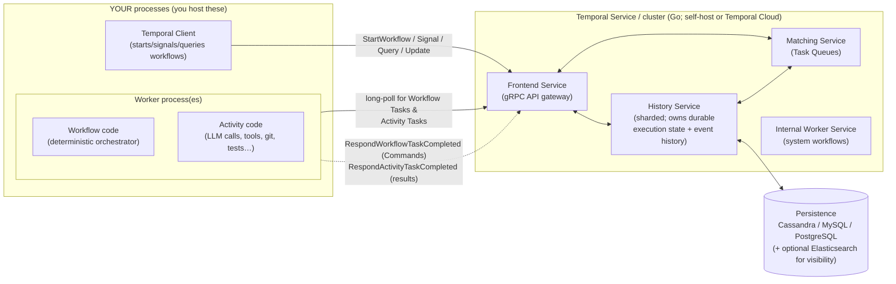
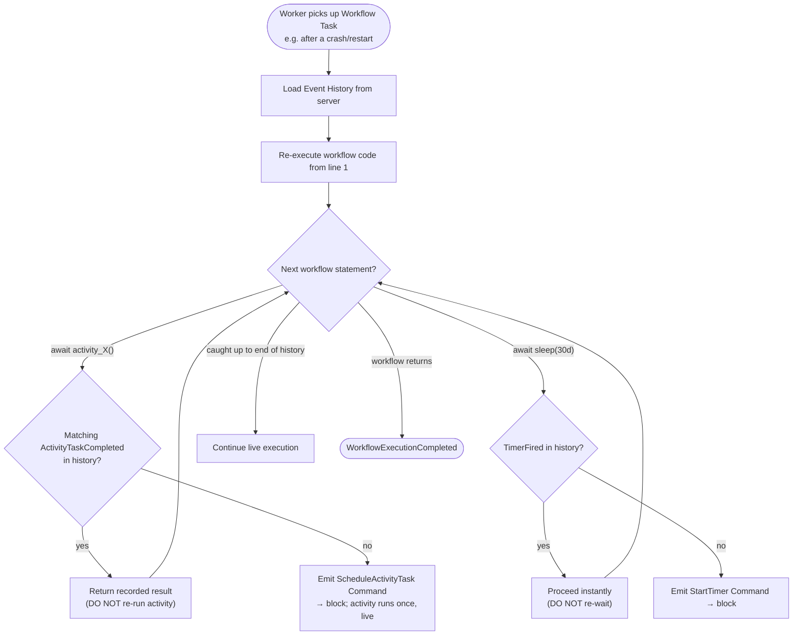
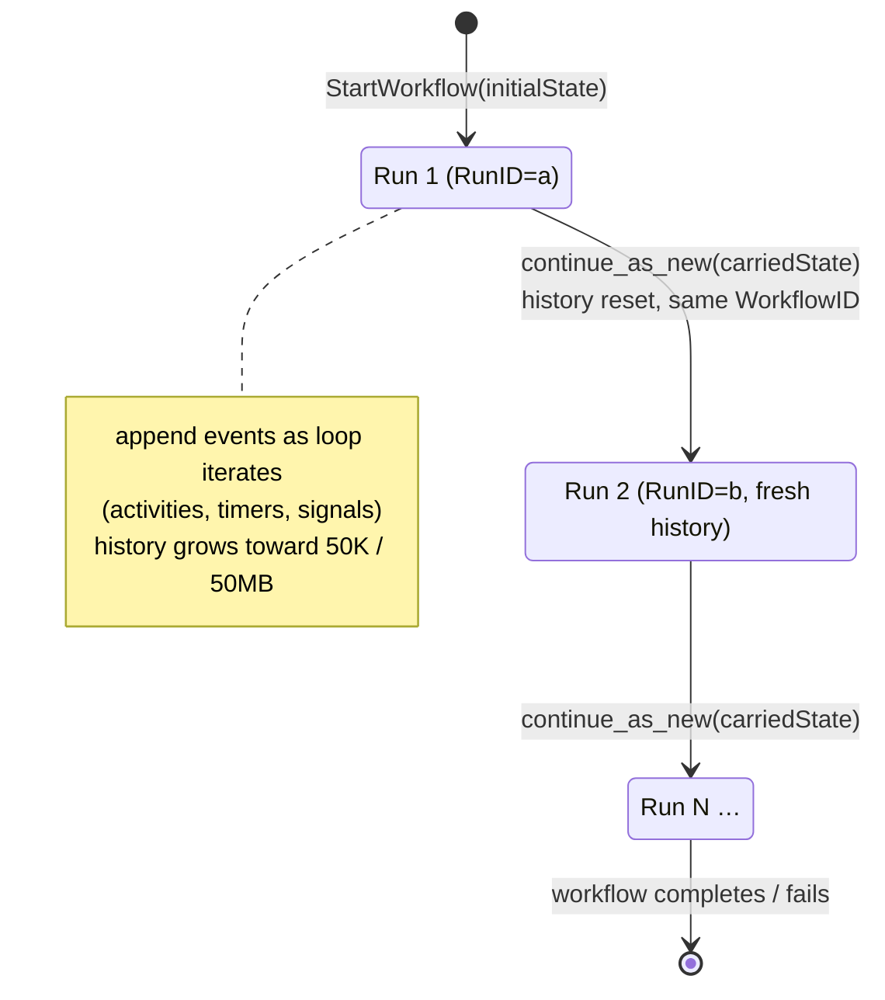

# Temporal — Durable Execution / Workflow Engine

> Research findings document. One source, deep + honest. Reporter, not architect.
> Relevance test applied throughout: *would Temporal be a sound off-the-shelf substrate for the seed AI's LONG-HORIZON RUNTIME — durable state that survives crashes/restarts, checkpointing, retries, resuming a long run, and coordinating many parallel candidate evaluations?*

---

## 1. Identity

- **Name:** Temporal — an open-source **durable-execution platform** (a.k.a. "workflow engine" / "workflow-as-code orchestrator"). It is the OSS descendant of Uber's **Cadence**, built by the same original team.
- **What it is:** A server ("Temporal Service" / cluster, written in Go) plus a family of **SDKs** (Go, Java, TypeScript, Python, .NET, PHP, Ruby, Rust) that let you write ordinary application code as **Workflows** and **Activities**. The server guarantees that a Workflow Execution runs **to completion exactly as written, even across process crashes, machine failures, deploys, and arbitrarily long wall-clock time (designed for executions lasting years)**. The mechanism is **event sourcing + deterministic replay**: an append-only history of events is durably persisted for every execution, and the workflow's in-memory state is reconstructed at any time by replaying that history.
- **Authors/org:** Temporal Technologies, Inc. (founded 2019 by Maxim Fateev and Samar Abbas, the creators of Uber Cadence and, before that, AWS SWF — Simple Workflow Service). Commercially backed; offers Temporal Cloud. The server and SDKs are **MIT-licensed** open source.
- **Dates:** Cadence open-sourced ~2017; Temporal forked/founded 2019; GA / 1.0 in 2020. Actively developed (latest tagged release at time of inspection: **v1.31.0**, published 2026-04-29).
- **Primary links:**
  - Site: https://temporal.io/
  - Docs: https://docs.temporal.io/
  - GitHub org: https://github.com/temporalio
  - Core server: https://github.com/temporalio/temporal
- **Code repo + commit inspected:** `temporalio/temporal` @ **`25d19f4f8f413d5da929225259f457cbad122200`** (branch `main`, committer date **2026-06-05**, HEAD commit "docs: fix dead links to refactored WorkflowTaskCompleted handler (#10542)"). Obtained via codeload tarball (`git clone` blocked by sandbox proxy 407; tarball fallback used). The repo is ~918k lines of Go across ~2,710 `.go` files (excluding generated/test scaffolding the load-bearing logic is in `service/history/`). All `repo@SHA:path` references below are against this SHA unless a doc-embedded link pins a different SHA (the in-tree docs pin their own historical SHAs, preserved verbatim).
- **Note on scope:** Per the brief, I did **not** read the whole server. I focused on the **durable-execution model**: the in-tree architecture docs (`docs/architecture/*.md` — these are primary, authoritative, and diagram-rich), the event-sourcing / mutable-state / replay code in `service/history/`, the official concept docs (workflows, activities, determinism, timeouts, versioning, child workflows, signals/queries, Continue-As-New), and Temporal's own "durable AI agents" material. SHAs recorded throughout.

---

## 2. TL;DR

- **Temporal is, almost exactly, the "long-horizon runtime substrate" the seed AI needs** — that is its entire reason to exist. It provides: durable state that survives crashes/restarts, automatic checkpointing (via the event history), automatic retries with backoff, durable timers ("sleep for 30 days" survives restarts), resume-after-crash with **zero workflow-author effort**, and first-class **parallel orchestration** (child workflows + fan-out/fan-in of activities). These are not add-ons; they are the core guarantees.
- **The core mechanism is event sourcing + deterministic replay.** Every workflow has an append-only **Event History** in a database. To recover after a crash, the server hands the history to a worker, which **re-runs the workflow code from line 1**, feeding recorded results back instead of re-doing work. When the code "catches up" to where it left off, it continues. State is *never* snapshotted from RAM — it is *always* rebuilt from the log. This is the source of the durability guarantee and also the source of the **single biggest constraint**.
- **The single biggest constraint for us: workflow code MUST be deterministic.** Same input + same history ⇒ same sequence of "commands," every replay. That bans calling `time.Now()`, `rand()`, network/LLM calls, threads, or reading mutable globals *directly inside workflow code*. **Temporal's answer to non-determinism is the Activity:** anything non-deterministic (LLM calls, tool execution, file I/O, DB reads, `git` commands, compiler/test runs) is wrapped in an **Activity**, which runs **once**, has its result **recorded in history**, and on replay is **not re-executed** — the recorded result is returned. This is *exactly* the right shape for an LLM-driven agent: the messy, stochastic, side-effecting parts are Activities; the durable control-flow skeleton is the Workflow. (Detailed below in §6 and §7.)
- **Fit for the seed's specific needs:**
  - *Durable state surviving crash/restart* → **native, automatic.** This is the headline feature.
  - *Checkpointing* → **native** (the history *is* the checkpoint; also Activity heartbeats for mid-activity checkpointing).
  - *Retries / timeouts* → **native, declarative** (RetryPolicy with backoff; multiple timeout types).
  - *Resuming a long run* → **native**; **Continue-As-New** explicitly solves "the history got too long over weeks" by truncating + restarting with carried-over state.
  - *Self-succession / handoff* → partially native (Continue-As-New is literally "a workflow ends its current run and starts a fresh run of itself with new input"); but Temporal's **determinism + versioning** rules make *evolving the workflow code itself* (which a self-improving agent wants) non-trivial — you need **Worker Versioning** or **patching**.
  - *Parallel candidate orchestration* → **native, strong** (child workflows, async activities, fan-out/fan-in, per-candidate isolation, independent retries).
- **Honest signal: HIGH** as evidence about *what a correct long-horizon substrate looks like* and as a *candidate off-the-shelf substrate*. The determinism requirement is a real, sharp constraint that must be designed around (it dictates the workflow/activity split), and running Temporal is operationally heavy (a server + a database: Cassandra/MySQL/PostgreSQL + optional Elasticsearch). But the constraint is well-understood and the model is battle-tested at scale. Temporal is also **explicitly repositioning itself as the durable-execution layer for AI agents** (OpenAI integration launched 2025-07-30; Google ADK integration in public preview 2026-04; Replit cites running "millions of AI agents" on it; first-party LangGraph / OpenAI-Agents-SDK / Pydantic-AI / Google-ADK integrations exist) — so the "agent runtime" use case is one they actively target. It is the most directly-relevant infrastructure source for the orchestration/runtime question.

---

## 3. What it does & how it works (mechanism-level)

### 3.1 The split: Workflows vs. Activities (the load-bearing distinction)

Temporal forces your application code into two categories, and this split *is the whole design*:

- **Workflow** — the **durable, deterministic orchestrator**. It's ordinary code (a Python `async def`, a Go func, a TS function) decorated as a workflow. It expresses the control flow: "do A, then if A succeeded do B and C in parallel, wait 30 days, then do D." Workflow code **must be deterministic** (see §3.4). It is the thing whose state survives crashes.
- **Activity** — a **single unit of side-effecting / non-deterministic work**: an API call, a DB query, a file write, **an LLM invocation**, a `git` command, running a test suite, invoking a compiler. Activity code can do anything (it's just a normal function); it runs **once**, its result is **persisted to the workflow's history**, and it is **retried automatically** on failure per a RetryPolicy.

The official docs are explicit that LLM calls belong in Activities: *"Activities handle everything that interacts with the outside world, like: API calls, Database queries, **LLM invocations**, File I/O"* (docs.temporal.io/workflows). And: *"Workflow code must be deterministic to support replay. To handle non-deterministic operations like API calls, **LLM/AI invocations**, database queries… put them in Activities. Activities execute outside the replay path and are automatically retried so they don't cause non-determinism errors."* (docs.temporal.io/workflow-definition).

### 3.2 The runtime topology: Service (server) + Workers (your code) + Database



Key fact: **the Temporal Service never runs your code.** Your code runs only in *your* Worker processes. The Service stores state, drives the execution forward by enqueuing tasks, and persists everything. Workers continuously **long-poll** the Service for tasks. This is why "the only reason a Workflow Execution might fail is the code throwing an error — not infrastructure outages" (docs.temporal.io/workflow-definition): if a Worker dies mid-task, the task times out and is re-dispatched to another Worker, which reconstructs state by replay.

### 3.3 Event sourcing: the Event History is the source of truth

For every Workflow Execution the History Service maintains an **append-only, ordered log of History Events** (`WorkflowExecutionStarted`, `WorkflowTaskScheduled`, `WorkflowTaskStarted`, `WorkflowTaskCompleted`, `ActivityTaskScheduled`, `ActivityTaskStarted`, `ActivityTaskCompleted`, `TimerStarted`, `TimerFired`, `WorkflowExecutionSignaled`, `WorkflowExecutionCompleted`, …). The in-tree architecture doc states the invariant precisely:

> *"History Events… have the property that the sequence of History Events alone, for some Workflow Execution, is sufficient to recover all other relevant information about the workflow execution's state (i.e. the Mutable State and the tasks relating to that workflow execution)."* — `repo@25d19f4:docs/architecture/history-service.md`

Alongside the event log, the server caches a **Mutable State** summary (in-progress activities, timers, child workflows, the ID of the latest event reflected) so it doesn't have to re-derive everything on every RPC; but Mutable State is *derivable from* the event log, and on a consistency failure the server "reload[s] from persistence." The design premise (`docs/architecture/README.md`): *"The system functions via event sourcing: an append-only history of events is stored for each workflow execution, and all required workflow state can be recreated at any time by replaying this history."*

A **state transition** (the atomic write unit) appends new events + updates Mutable State + enqueues internal Tasks **in a single DB transaction**, then a queue processor dispatches the task to Matching (the **Transactional Outbox** pattern, named explicitly in the doc). This is what makes the system crash-consistent.

```mermaid
sequenceDiagram
  participant app as Your App (Client)
  participant H as History Service
  participant DB as Persistence (DB)
  participant M as Matching Service
  participant W as Worker (your code)

  app->>H: StartWorkflowExecution
  Note over H,DB: ATOMIC state transition:<br/>append [WorkflowExecutionStarted, WorkflowTaskScheduled]<br/>+ update MutableState + enqueue Transfer Task
  H->>DB: commit (events + mutable state + task)
  H->>M: (queue processor) enqueue Workflow Task
  W->>M: long-poll → dequeue Workflow Task
  Note over W: run workflow code until it blocks on an Activity
  W->>H: RespondWorkflowTaskCompleted [ScheduleActivityTask]
  Note over H,DB: append [WorkflowTaskCompleted, ActivityTaskScheduled]<br/>+ enqueue Activity Task
  W->>M: long-poll → dequeue Activity Task
  Note over W: execute Activity (LLM call / git / tests …) ONCE
  W->>H: RespondActivityTaskCompleted [result]
  Note over H,DB: append [ActivityTaskCompleted(result), WorkflowTaskScheduled]
  W->>M: dequeue Workflow Task
  Note over W: workflow resumes; Activity result returned from history
```

### 3.4 Deterministic REPLAY: how state is reconstructed after a crash

This is the mechanism that matters most for "resume-after-crash." Temporal does **not** snapshot the workflow's RAM. Instead, when a Worker needs to advance a workflow (including after any crash/restart), it **re-executes the workflow function from the very first line**, but feeds it the recorded Event History instead of doing the work again:

> *"When it's time to continue the Workflow, Temporal doesn't restore memory from a snapshot. It starts the Workflow code from the beginning, replays the Event History step by step… So the Workflow code is re-run, but uses the recorded events instead of redoing work."* (docs.temporal.io/workflows)

Concretely, on replay: when the workflow code reaches `result = await activity_X()`, the SDK does **not** re-run the activity — it finds the matching `ActivityTaskCompleted` event in the history and returns the recorded `result`. When it reaches `await workflow.sleep(30 days)`, it finds the `TimerFired` event (if present) and proceeds instantly; the 30 days are *not* re-waited. Once replay catches up to the end of the recorded history, the workflow continues live from exactly where it was. The Worker keeps a **sticky cache** of recently-replayed workflows in memory so it usually doesn't replay from scratch — but it *can* always rebuild from the log, which is the durability guarantee.



Server-side, the symmetric rebuild lives in `MutableStateRebuilder.ApplyEvents` (`repo@25d19f4:service/history/workflow/mutable_state_rebuilder.go:70`): it iterates the history event-batches and applies each to reconstruct Mutable State — used for reset/conflict-resolution/standby replication. The *workflow-code* replay (the user-visible determinism contract) happens in the **SDK** (sdk-core, Rust, shared by the language SDKs).

**The determinism contract (the central constraint for us):** because the same code is re-run against the same history, the workflow must, on every replay, **issue the same sequence of Commands**. So workflow code must not call `time.Now()`, `random()`, read mutable globals, spawn unmanaged threads, or do I/O directly. Temporal supplies **replay-safe equivalents** for the unavoidable ones (`workflow.now()`, `workflow.random()`, deterministic `asyncio`/timers, UUIDs), whose values are **recorded in history** so replay returns identical values. Everything genuinely non-deterministic (LLM calls!) goes in an **Activity**, whose result is recorded once. Violating determinism after the fact (e.g. by editing the workflow code while runs are in flight) yields a **non-determinism error** unless you use **Versioning** (§6). The Python SDK even ships a **workflow sandbox** that re-imports modules and proxies known-unsafe calls to *catch* accidental non-determinism (docs.temporal.io/develop/python/python-sdk-sandbox).

### 3.5 Long-running runs hit a hard wall → Continue-As-New (the self-succession mechanism)

This is the most important practical constraint for a days/weeks loop. **Event History has a hard limit: 50K (51,200) events OR 50 MB total size.** Exceed either and "the Workflow is Terminated with an error of 'Workflow history size / count exceeds limit'" (temporal.io/blog/very-long-running-workflows). Every activity call, timer, and signal adds events, so a loop that runs for weeks *will* hit this.

The escape hatch is **Continue-As-New**: a workflow voluntarily **ends its current run and atomically starts a fresh run of itself** — same Workflow ID, new Run ID, **empty Event History**, carrying forward whatever state you pass as the new input. The blog describes it precisely: *"Continue-As-New is like a stackless recursion: call the same function with different parameters to keep processing data, but without the baggage of a call stack."* The SDK tells you when to do it: `workflow.info().is_continue_as_new_suggested()` (Python). This is, in effect, **the seed loop's self-succession / handoff primitive built in**: periodically snapshot your carried-over state into the next run and discard the history baggage.



### 3.6 Long-running, indefinite workflows: the "Entity Workflow" / Actor pattern

Temporal explicitly supports workflows that run "for an indefinite amount of time… could run for fractions of a second or many years." It calls these **Entity Workflows** — "similar to an Actor Model, where a Workflow Execution represents one occurrence of some kind of entity" that lives forever and "handle[s] an innumerable amount of incoming messages" via Signals/Updates, periodically calling Continue-As-New. A seed-AI run that lives for weeks, receiving "candidate evaluated" signals and emitting new candidate-evaluation child workflows, *is* an Entity Workflow.

### 3.7 CHASM: Temporal is generalizing durable execution beyond workflows

A notable recent direction (in-tree at the inspected SHA): **CHASM — "Coordinated Heterogeneous Application State Machines."** The architecture doc (`repo@25d19f4:docs/architecture/chasm.md`) reframes the whole system: a **Workflow is just one Application State Machine (ASM) among many**, built on shared Temporal infrastructure (sharding, routing, atomic storage, failure recovery). At the inspected SHA, `chasm/lib/` contains the registered libraries `workflow`, `activity`, `callback`, `nexusoperation`, and `scheduler` — i.e. the workflow engine itself is now a CHASM library (`repo@25d19f4:chasm/lib/workflow/library.go` — `func (l *library) Name() string { return chasm.WorkflowLibraryName }`). CHASM exposes a typed API for building custom durable components: `Field[T]`/`Map[K,T]` persisted state, atomic **Transitions** ("All Field writes and Task schedules from a transition commit together as a single database write, or roll back entirely"), Pure vs. Side-Effect **Tasks** (again via the transactional-outbox pattern), and a **VersionedTransition** logical clock (`FailoverVersion` + `TransitionCount`) giving "a total ordering of all state changes, even across data centers." This matters to us as *evidence*: it shows the durable-execution substrate is being decomposed into a reusable kernel (atomic state machine over sharded storage with crash-safe deferred tasks) onto which different execution models can be built — exactly the kind of thing a custom seed runtime might otherwise have to build itself.

---

## 4. Evidence from the code

The load-bearing durability logic is in `service/history/`. I focused there and on the in-tree architecture docs (which are unusually thorough and are themselves primary, authored-by-maintainers material with pinned-SHA code links).

### 4.1 In-tree architecture docs (primary, authoritative)

`repo@25d19f4:docs/architecture/` — read in full for this report:
- `README.md` — states the core design premise verbatim: *"The system functions via event sourcing: an append-only history of events is stored for each workflow execution, and all required workflow state can be recreated at any time by replaying this history."* And the workflow/activity contract: *"Workflow code must be deterministic and have no side effects (with specific exceptions), and activity code must either be idempotent or non-retryable (i.e. at least once or at most once)."*
- `history-service.md` — the deepest mechanism doc: History shards (fixed count, owned via Ringpop membership, fenced by a monotonic `RangeID`), Mutable State (cached, persisted summary, derivable from events), Event History (the source of truth), state transitions (atomic event-append + mutable-state-update + task-enqueue), Transfer/Timer/Visibility internal queues, and the **Transactional Outbox** consistency guarantee (named and linked).
- `workflow-lifecycle.md` — 7-step sequence-diagrammed walkthrough of `result = callActivity(myActivity); return result`, including the activity-failure-and-retry branch.
- `chasm.md` — the ASM framework (§3.7).
- `retry.md`, `schedules.md`, `workflow-update.md`, `speculative-workflow-task.md`, `nexus.md` — supporting subsystems.

### 4.2 Server-side replay / state reconstruction

`repo@25d19f4:service/history/workflow/mutable_state_rebuilder.go` — `MutableStateRebuilder.ApplyEvents(ctx, namespaceID, requestID, execution, history [][]*HistoryEvent, newRunHistory, newRunID)` walks history event-batches and applies each event to rebuild Mutable State (used for reset, NDC conflict resolution, and passive/standby replication). The interface (lines 26–36) and the per-batch loop (lines 79–101) are the server's canonical "rebuild state from the log" path. The companion `mutable_state_impl.go` (`MutableStateImpl`, ~the in-memory representation) and `context.go` (`UpdateWorkflowExecutionAsActive`, the persistence commit) implement the active path.

### 4.3 A complete, verbatim SDK example (Python — the canonical "hello world")

This is the smallest complete illustration of the workflow/activity split, from `temporalio/sdk-python` (README, MIT; SDK latest release `1.28.0`, 2026-06-04). It is *exactly* the shape an LLM-agent step would take — replace `say_hello` with `call_llm` / `run_tests` / `apply_patch`:

```python
# activities.py — NON-deterministic side-effecting work lives here
from temporalio import activity

@activity.defn
def say_hello(name: str) -> str:
    return f"Hello, {name}!"     # ← in our world: an LLM call, a git command, a test run
```

```python
# workflows.py — the DETERMINISTIC durable orchestrator
from datetime import timedelta
from temporalio import workflow

# Import the activity, passing it through the determinism sandbox
with workflow.unsafe.imports_passed_through():
    from activities import say_hello

@workflow.defn
class SayHello:
    @workflow.run
    async def run(self, name: str) -> str:
        # The workflow NEVER calls say_hello() directly; it asks Temporal to
        # execute it as an Activity. Result is recorded in history → replay-safe.
        return await workflow.execute_activity(
            say_hello, name, schedule_to_close_timeout=timedelta(seconds=5)
        )
```

```python
# worker.py — YOUR process; hosts workflow + activity code, long-polls the server
import asyncio
from temporalio.client import Client
from temporalio.worker import Worker
from activities import say_hello
from workflows import SayHello

async def main():
    client = await Client.connect("localhost:7233")
    worker = Worker(client, task_queue="my-task-queue",
                    workflows=[SayHello], activities=[say_hello])
    await worker.run()    # polls forever for Workflow & Activity tasks
```

The Python SDK README also documents the runtime model that makes long-running agent loops ergonomic: *"The workflow implementation basically turns `async def` functions into workflows backed by a distributed, fault-tolerant event loop. This means task management, sleep, cancellation, etc. have all been developed to seamlessly integrate with `asyncio` concepts."* So `await asyncio.gather(...)` of several child workflows = **durable parallel fan-out**; `await workflow.sleep(timedelta(days=7))` = **durable sleep that survives restarts**.

### 4.4 Parallel orchestration primitives (verbatim)

Child workflows (each candidate evaluation can be its own durable, independently-retried, separately-resumable execution) — `docs.temporal.io/develop/python/child-workflows`:

```python
@workflow.defn
class GreetingWorkflow:                       # ← think: "OrchestratorWorkflow"
    @workflow.run
    async def run(self, name: str) -> str:
        return await workflow.execute_child_workflow(
            ComposeGreetingWorkflow.run,      # ← think: "EvaluateCandidateWorkflow"
            ComposeGreetingInput("Hello", name),
            id="hello-child-workflow-workflow-child-id",
            parent_close_policy=ParentClosePolicy.ABANDON,   # child can outlive parent
        )
```

For N-way fan-out/fan-in, the idiom is `handles = [workflow.start_child_workflow(Eval.run, c, id=f"eval-{i}") for i, c in enumerate(candidates)]; results = await asyncio.gather(*[h for h in handles])` — all durable, each child independently retried/resumed.

### 4.5 Message passing: Signals, Queries, Updates (verbatim semantics)

From `docs.temporal.io/develop/python/message-passing` and the long-running-workflows blog:
- **Signal** (`@workflow.signal`) — async, fire-and-forget message *into* a running workflow; **mutates state, cannot return a value**, **is recorded in history**. ("A Signal handler mutates the Workflow state but cannot return a value.")
- **Query** (`@workflow.query`) — synchronous read *from* a workflow; **must not mutate**, **not added to history**, **works even on closed workflows**. ("A Query handler returns a value: it can inspect but must not mutate the Workflow state… A Query handler uses `def`, not `async def`.")
- **Update** (`@workflow.update`) — synchronous request that **can mutate and return a value**, with an optional **validator** that can reject before handling. ("An Update is a trackable synchronous request… The sender must wait until the Worker accepts or rejects the Update.")

For the seed loop these are the **external control surface**: signal "new best score, prune the rest," query "what's the current champion + in-flight candidates," update "register this verified improvement (reject if it regresses the benchmark)."

### 4.6 Retries & timeouts (declarative, in the platform)

- **RetryPolicy** (per Activity, and for workflows): initial interval, backoff coefficient, max interval, max attempts, non-retryable error types. Activities are "automatically retried forever (set as policy)" by default (temporal.io/how-temporal-works). Server-side retry primitives: `repo@25d19f4:common/backoff` (`ThrottleRetry`, `IsRetryable`, `RetryPolicy`; special handling for `ResourceExhausted`), documented in `docs/architecture/retry.md`.
- **Timeouts** (`docs.temporal.io/encyclopedia/detecting-workflow-failures`): *Workflow Execution Timeout* (default ∞ — Temporal "generally do[es] not recommend setting Workflow Timeouts, because Workflows are designed to be long-running"); *Workflow Run Timeout*; *Workflow Task Timeout* (default 10s, max 120s — used to detect a dead Worker so another can take over). Activities additionally have schedule-to-start / start-to-close / schedule-to-close / heartbeat timeouts.
- **Activity Heartbeats** = mid-activity checkpointing: a long activity periodically reports progress + a payload; on retry it can resume from the last heartbeat instead of from scratch ("If an Activity Execution fails, any future attempt will start from the initial state, unless your code uses Heartbeat details payloads for checkpointing" — docs.temporal.io/activities). Directly useful for a long candidate-build/test activity.

---

## 5. What's genuinely smart (the load-bearing ideas)

1. **Durability via event-sourced replay, not RAM snapshots.** The decision to reconstruct state by *re-running the code against an append-only event log* (rather than serializing the process heap) is the core idea, and it is genuinely elegant: it makes "resume after crash" *automatic and exact* for arbitrary control flow (loops, branches, parallel branches, 30-day sleeps) without the author writing any checkpoint/restore code. The history is simultaneously the checkpoint, the audit log, and the debugger trace. For a long-horizon agent loop this is exactly the property you want and the hardest to build correctly yourself.

2. **The Workflow/Activity boundary is the right factoring of determinism vs. side effects.** By forcing all non-determinism to the *edges* (Activities, run once, results recorded), the *core control flow* becomes pure and replayable. This is precisely the seam an LLM agent needs: **LLM calls, tool calls, file edits, compiles, test runs are all Activities** (non-deterministic, side-effecting, retryable), while the **agent's control loop is the Workflow** (durable, replayable). The determinism constraint feels onerous until you realize it's what *buys* the free durability — and that LLM stochasticity lands cleanly on the Activity side, where it's a non-issue (the *output* is recorded; replay never re-asks the model).

3. **Continue-As-New as bounded-history self-succession.** Recognizing that an event log can't grow forever, and solving it with an atomic "end this run, start a fresh run of the same workflow with carried-over state," is a clean answer to "how does a process run for months." It doubles as a built-in **handoff/self-succession primitive** and a natural **state-compaction checkpoint** (you decide what state crosses the boundary).

4. **Durable timers / durable sleep.** `workflow.sleep(30 days)` that survives any number of crashes/deploys, implemented as a Timer Task in the History shard's timer queue (`executeUserTimerTimeoutTask` appends `TimerFired` + `WorkflowTaskScheduled`). Trivial for the author, hard to get right otherwise. Useful for backoff, scheduled re-evaluation, rate-limiting expensive runs.

5. **Crash-consistency via Transactional Outbox.** Events + Mutable State + the to-be-dispatched task all commit in one DB transaction; a queue processor then guarantees the task reaches Matching. This removes the classic "I updated state but crashed before enqueuing the next step" bug class — the seed loop never loses or double-commits a step.

6. **Strong external control surface (Signals/Queries/Updates) on a *running* durable process.** You can inspect and steer a long run without stopping it, with Updates even offering *validated* mutation (reject a bad state transition before it happens). This is a ready-made API for human-in-the-loop steering and for an outer controller to coordinate an inner loop.

7. **Per-execution isolation + horizontal scale via sharding.** Millions of independent executions, each with its own history, partitioned across History shards. For "coordinate many parallel candidate evaluations," each candidate is an isolated, independently-retried, independently-resumable execution — and the platform is designed to scale that to very large fan-out (Temporal advertises Cloud testing "beyond 200 million executions per second"; independently, Replit publicly cites running "millions of AI agents" on Temporal).

8. **CHASM** (§3.7): the maintainers extracting a reusable "atomic state machine over sharded durable storage with crash-safe deferred tasks + a cross-DC logical clock" kernel is a strong signal about what the *irreducible* core of a durable-execution substrate is.

---

## 6. Claims vs. reality / limitations / critiques

**What's solidly real (not marketing):** the durability, replay, retries, timers, Continue-As-New, signals/queries/updates, child workflows, and sharding are all real, documented at the mechanism level, present in the code, and battle-tested in large production deployments (Netflix CI/CD, Stripe, Coinbase, Datadog, Snap, etc., per Temporal's use-case pages — secondary/marketing for the *logos*, but the feature claims are corroborated by the code and docs). The model descends from Uber Cadence and AWS SWF; it is not novel-and-unproven.

**The hard constraints / costs (these are the honest caveats for us):**

1. **Determinism is a sharp, persistent constraint on workflow code — and it specifically collides with "self-improving."** You cannot freely edit workflow code while executions are in flight: a changed Command sequence against an existing history throws a **non-determinism error**. Temporal's answer is **Versioning** — either **Worker Versioning** (pin Workers to code revisions; old runs finish on old code) or **patching** (`workflow.patched("v2")` branches guarded so old and new histories both replay correctly). For a **self-modifying** agent whose *orchestration logic itself* evolves, this is real friction: the durable skeleton can't be hot-swapped under a running execution without versioning discipline. (Mitigation that fits us well: keep the *workflow* skeleton small/stable and put all the *evolving* intelligence in **Activities** — which have **no determinism constraint** and can be changed freely. The seed's mutable "brain" lives in activities/data; the workflow is just a thin durable driver.)

2. **History size limits force Continue-As-New engineering.** 50K events / 50MB per run is a real ceiling; a weeks-long loop must be designed to Continue-As-New and to keep per-event payloads small (don't return huge blobs from activities; store large artifacts externally and pass references). This is manageable but it is **work**, and getting carried-over state right across the boundary is a known source of bugs.

3. **Operational heaviness.** Self-hosting requires running the multi-service Go server *plus* a database (Cassandra / MySQL / PostgreSQL) and, for rich search, Elasticsearch/OpenSearch (visibility). There's a lightweight `temporal server start-dev` for local use ("self-contained lightweight Server in less than two seconds"), but production HA is a real distributed-systems operation. Temporal Cloud removes this but is a paid managed dependency and a vendor tie.

4. **Activities are at-least-once; idempotency is the author's job.** Because activities retry, an activity can run more than once (e.g. it succeeded but the completion ack was lost). The platform requires activity code to be "either idempotent or non-retryable." For side-effecting agent steps (apply a patch, push a commit, spend money on an API) you must design idempotency keys yourself — Temporal does not make a non-idempotent side effect safe.

5. **Replay/versioning footguns are a well-known sharp edge.** The single most common complaint in the community is non-determinism errors from subtle code changes (reordering, changing a loop, library updates that change call order). The Python sandbox and replay-test tooling help, but this is a genuine learning curve and an ongoing maintenance tax. (This is consistent, widely-reported developer feedback; I did not run a workflow myself in this sandbox, so I report it as corroborated community experience rather than first-hand reproduction.)

6. **It is orchestration, not intelligence — and not memory.** Temporal gives you durable *control flow* and durable *execution state*; it is **not** a vector store, knowledge graph, evaluator, or planner. The event history is queryable as an audit log, not as semantic agent memory. It coordinates *when/whether* candidate evaluations run and survive; it has *nothing* to say about *how to generate candidates* or *how to judge them*. For the seed AI it is a substrate, not a brain.

**What I could not verify:** I did not stand up a server and execute a workflow in this sandbox (no running cluster; `git clone` was proxy-blocked and I worked from the `main` tarball + docs). So the replay/determinism behavior, the exact 50K/50MB enforcement, and Continue-As-New semantics are reported from primary docs + code reading, not from a live run. I also did not read the SDK replay engine source (sdk-core, a separate Rust repo) — the workflow-code replay contract is taken from the official docs and the Python SDK README. The "200M executions/sec" and production-logo claims are Temporal's own marketing (corroborated for the *mechanism* by code, but the performance number is unverified by me).

---

## 7. Relevance to a self-improving, evolutionary, software-building agent

Judged against the project's stated open need — *"durable state that survives crashes/restarts, checkpointing, retries, resuming a long run, and coordinating many parallel candidate evaluations"* — Temporal maps onto the requirement almost one-to-one. Explicit mapping:

| Seed-AI need | Temporal mechanism | Fit |
|---|---|---|
| Durable state surviving crash/restart | Event-sourced history + automatic replay; "recovered, replayed or paused from any arbitrary point" | **Native / automatic** — headline feature; zero author effort |
| Checkpointing | The event history *is* the checkpoint; Activity **heartbeats** for mid-step checkpointing | **Native** |
| Retries with backoff | Declarative **RetryPolicy** per activity/workflow; default "retry forever" | **Native, declarative** |
| Timeouts / liveness | Workflow/Run/Task timeouts; dead-Worker detection → re-dispatch | **Native** |
| Resuming a long run (days/weeks) | Replay + **Continue-As-New** to beat the 50K/50MB history ceiling | **Native, but requires CAN design** |
| Self-succession / handoff | Continue-As-New = "end this run, start a fresh run of myself with carried state" ("stackless recursion") | **Native** for the *runtime*; **see versioning caveat** for evolving the *code* |
| Coordinating many parallel candidate evals | **Child workflows** + `asyncio.gather` fan-out/fan-in; per-candidate isolation, independent retries/resume | **Native, strong** |
| External steering / human-in-the-loop | **Signals / Queries / Updates** on a live durable execution; Updates can *validate-and-reject* | **Native, strong** |
| Scheduled / periodic re-evaluation | Durable **Timers**, **Schedules**, Cron | **Native** |
| Observability of a long run | Web UI, event-history audit trail, OpenTelemetry tracing, Prometheus metrics, **Search Attributes** (e.g. tag a run with `championScore`, query/filter across runs) | **Native** |

**The crucial determinism question, resolved explicitly (per the brief):** *Is Temporal's determinism requirement incompatible with inherently non-deterministic LLM calls?* **No — and the resolution is clean.** Temporal confines non-determinism to **Activities**, which (a) may be fully non-deterministic, (b) run **once**, (c) have their **result recorded in the event history**, and (d) are **not re-executed on replay** (the recorded result is returned). The official docs name "**LLM invocations**" as a canonical Activity. So an LLM agent built on Temporal puts **every model call, tool call, file edit, compile, and test run in an Activity**, and the **workflow** is only the deterministic glue that sequences them and survives crashes. The model's randomness never threatens replay because replay never re-asks the model — it reads the recorded answer. (The corollary constraint is the inverse: you must *not* put the LLM call directly in workflow code, and you must use Versioning if you later change the workflow skeleton.)

**Where the fit is partial / requires care:**
- **Evolving the orchestrator itself** (true self-modification of control flow) fights the determinism+versioning rules. Best-fit pattern for us: a **thin, stable workflow skeleton** + **all evolving intelligence in activities/data**, so the part that changes is the part with no determinism constraint.
- **It supplies no intelligence, evaluation, or memory.** Candidate generation, the verifier/"keep only if verifiably better" gate, and long-term semantic memory are entirely on us; Temporal just guarantees those steps run durably, in order, with retries, and resume after a crash.
- **Operational cost** (server + DB) is non-trivial vs. a bespoke append-only-log + supervisor that some projects build instead.

**Net:** as the *orchestration / long-horizon runtime substrate specifically*, Temporal is a strong, directly-applicable, off-the-shelf candidate, and an excellent reference design even if not adopted wholesale. It does not address the *evolutionary* or *evaluative* core of the seed at all — only the durable-runtime substrate beneath it.

---

## 8. Reusable assets (collected as evidence; not assembled into a design)

Concrete, borrowable things — patterns and primitives, with citations:

1. **The Workflow/Activity factoring as the LLM-agent durability pattern.** Verbatim canonical shape in §4.3 (`temporalio/sdk-python` README). Pattern to borrow even if not using Temporal: *deterministic, replayable control loop* + *all side-effecting/stochastic work behind recorded, retryable "activity" calls.* This is a reusable architecture, independent of the product.

2. **Event-sourcing invariant (verbatim, `repo@25d19f4:docs/architecture/README.md`):** *"an append-only history of events is stored for each workflow execution, and all required workflow state can be recreated at any time by replaying this history."* — a precise spec for a crash-proof run log if we build our own.

3. **Replay rule for non-determinism (verbatim, docs.temporal.io/workflows):** *"When a Workflow calls an Activity, the Activity runs once, its result is recorded in the Event History. During replay, that result is reused, not recomputed."* — the exact contract that reconciles deterministic replay with LLM calls.

4. **Continue-As-New as bounded-history self-succession (verbatim, very-long-running-workflows blog):** *"Continue-As-New is like a stackless recursion: call the same function with different parameters to keep processing data, but without the baggage of a call stack."* Plus the operational trigger `workflow.info().is_continue_as_new_suggested()`. A directly reusable design for "run forever without an unbounded log."

5. **The hard numbers to design against:** **50K (51,200) events or 50MB per execution**; **Workflow Task Timeout default 10s (max 120s)** for dead-worker detection; **Workflow Execution Timeout default ∞**. These are useful concrete budgets/defaults for any long-horizon log-based runtime.

6. **Transactional Outbox for crash-consistency (`docs/architecture/history-service.md`):** commit (new events + state update + next-step task) in one DB transaction; a queue processor then guarantees dispatch. Reusable recipe to avoid "updated state but lost the next step on crash."

7. **Child-workflow fan-out/fan-in + `ParentClosePolicy` (verbatim, §4.4):** per-candidate isolated durable executions with independent retries; `ParentClosePolicy.ABANDON` to let children outlive a parent. Reusable parallel-candidate-orchestration schema.

8. **Signals/Queries/Updates as the live control surface (verbatim semantics, §4.5):** Signal = recorded async mutation; Query = non-recorded read (works on closed runs); Update = validated synchronous mutate-and-return. A reusable API shape for steering a long run and for a validated "promote this improvement only if it doesn't regress" gate.

9. **Activity heartbeat checkpointing (docs.temporal.io/activities):** for long candidate-build/eval steps, periodically record progress so a retry resumes mid-step. Reusable pattern for long, resumable units of work.

10. **CHASM's irreducible kernel (`docs/architecture/chasm.md`):** typed `Field[T]`/`Map` persisted state + atomic **Transition** (all writes commit-or-rollback together) + **Pure vs. Side-Effect Tasks** (deferred work via transactional outbox, with a **Validator** that discards superseded tasks) + **VersionedTransition** (`FailoverVersion`+`TransitionCount`) total-order clock. A blueprint for the minimum viable durable-state-machine substrate if we were to build a lean custom runtime instead of adopting Temporal.

---

## 9. Signal assessment

- **Overall value: HIGH** — for the *specific* question the project flagged (the orchestration / long-horizon runtime substrate). Temporal is the most directly on-point infrastructure source for "durable state surviving crashes, checkpointing, retries, resume-after-crash, parallel candidate orchestration." It is both a strong *off-the-shelf candidate* and an excellent *reference architecture* for those properties. Its durable-execution model answers the brief's central worry (determinism vs. non-deterministic LLM calls) cleanly via the Activity boundary.
- **Value is LOW for the rest of the seed:** it contributes nothing to candidate *generation*, the *verifier/evaluator*, *evolutionary selection*, or *semantic memory*. It is plumbing, not intelligence. Do not look to Temporal for the "propose → test → keep-if-better" logic itself — only for running that loop durably for weeks.
- **Confidence: High** on the mechanism and the fit analysis (grounded in the in-tree architecture docs + history-service code + official concept docs, all primary). **Medium** on operational/performance specifics and on the lived severity of the versioning/non-determinism tax (reported from docs + widely-corroborated community experience, not first-hand reproduction in this sandbox).
- **Could NOT verify firsthand:** a live workflow run / crash-recovery / Continue-As-New cycle; the SDK-side (sdk-core, Rust) replay engine source; the exact enforcement of history limits; Temporal's headline performance numbers. `git clone` was blocked by the sandbox proxy (407); analysis is from the `main` tarball at the recorded SHA + primary docs.

---

## 10. References

**Primary — code (inspected at `temporalio/temporal@25d19f4f8f413d5da929225259f457cbad122200`, branch `main`, committer date 2026-06-05):**
- `repo@25d19f4:docs/architecture/README.md` — system overview; event-sourcing premise; workflow/activity determinism contract.
- `repo@25d19f4:docs/architecture/history-service.md` — History shards, Mutable State, Event History, state transitions, Transfer/Timer queues, Transactional Outbox consistency.
- `repo@25d19f4:docs/architecture/workflow-lifecycle.md` — 7-step sequence-diagrammed Workflow Execution walkthrough incl. activity-retry branch.
- `repo@25d19f4:docs/architecture/chasm.md` — CHASM (Application State Machines); Fields, Transitions, Tasks, VersionedTransition.
- `repo@25d19f4:docs/architecture/retry.md` — `common/backoff` retry primitives.
- `repo@25d19f4:service/history/workflow/mutable_state_rebuilder.go` — `ApplyEvents` server-side state reconstruction from event log.
- `repo@25d19f4:service/history/workflow/mutable_state_impl.go`, `.../context.go` — in-memory Mutable State + active-path persistence commit.
- `repo@25d19f4:chasm/lib/workflow/library.go` — proof the workflow engine is itself a CHASM library; `chasm/lib/{activity,callback,nexusoperation,scheduler}` — sibling ASMs.
- `temporalio/sdk-python` README (MIT; SDK release `1.28.0`, 2026-06-04) — canonical Workflow/Activity/Worker "hello world"; asyncio event-loop model; OpenAI Agents SDK integration notice.

**Primary — official docs (docs.temporal.io / temporal.io):**
- https://docs.temporal.io/workflows — Workflow Execution, Event History, "How Workflow replay works," replay-safe APIs; lists "LLM invocations" as Activity work.
- https://docs.temporal.io/workflow-definition — deterministic constraints, intrinsic non-determinism, Versioning (Worker Versioning + patching), unreliable-worker handling.
- https://docs.temporal.io/activities — Activity definition; at-least-once + idempotency; Heartbeat checkpointing; standalone activities.
- https://docs.temporal.io/encyclopedia/detecting-workflow-failures — Workflow Execution / Run / Task timeouts and their purposes.
- https://docs.temporal.io/develop/python/continue-as-new — Continue-As-New semantics; `is_continue_as_new_suggested()`.
- https://docs.temporal.io/develop/python/child-workflows — child workflow APIs; ParentClosePolicy.
- https://docs.temporal.io/develop/python/message-passing — Signals / Queries / Updates semantics (verbatim).
- https://docs.temporal.io/develop/python/temporal-clients — Client; "cannot be used inside a Workflow, but can be used inside an Activity."
- https://docs.temporal.io/develop/python/observability — metrics, OTel tracing, logging, Visibility / Search Attributes.
- https://docs.temporal.io/evaluate/use-cases-design-patterns — use cases incl. **AI Agents** ("maintaining state over long periods… Durable Execution of tools, LLMs, and conversations"; Lindy, Dust, ZoomInfo), Saga, State Machine, Entity/Actor.
- https://temporal.io/how-temporal-works — Service/Worker/Task-Queue coordination; crash → replay recovery; security (unidirectional, server never sees cleartext); scale claim.
- https://temporal.io/blog/very-long-running-workflows — Entity Workflows / Actor model; 50K/50MB history limit; Continue-As-New as "stackless recursion."

**Secondary / contextual:**
- Exa company profile of Temporal Technologies — founding (2019; Fateev & Abbas, ex-Uber Cadence / AWS SWF), funding, and 2025–2026 AI-agent positioning: OpenAI integration (2025-07-30), Google ADK integration (public preview 2026-04), Replit "millions of AI agents," Helm charts 1.0.0. (Marketing/analyst-sourced; used only for dates, lineage, and ecosystem signal.)
- First-party AI integrations referenced in docs nav: OpenAI Agents SDK, Google ADK, LangGraph, LangSmith, Pydantic AI, Braintrust (corroborates the "durable agent runtime" positioning).
