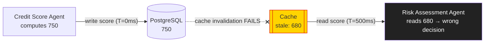
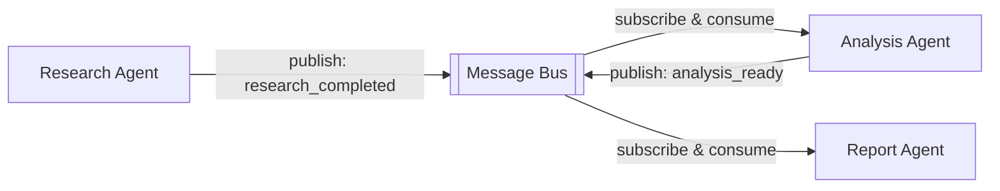
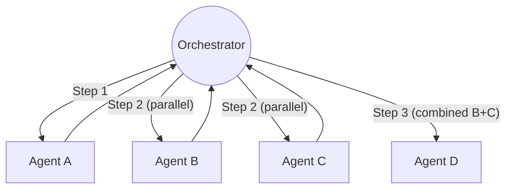
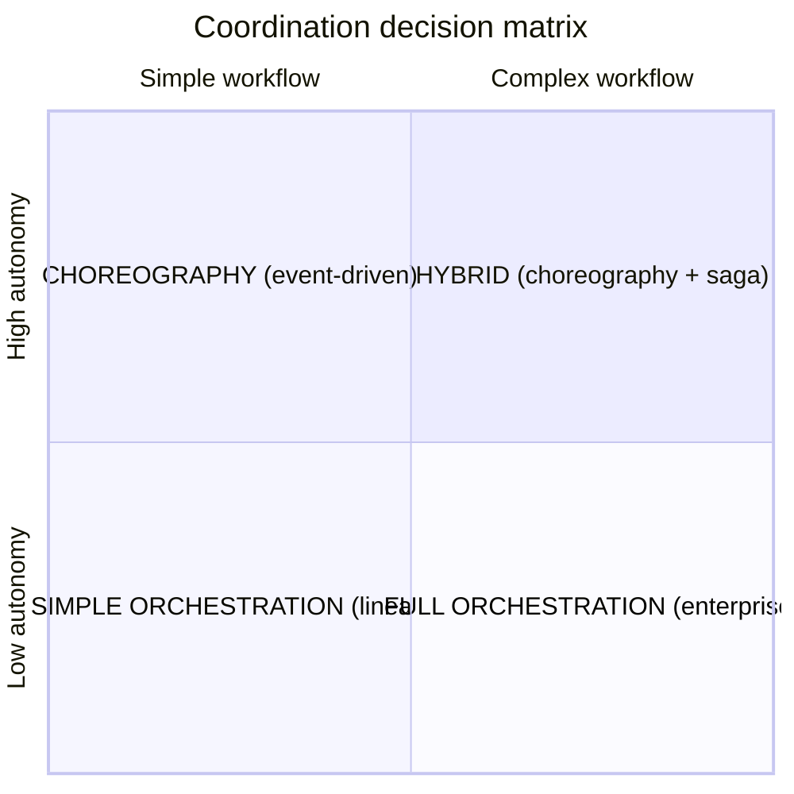
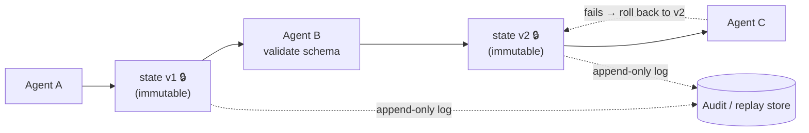
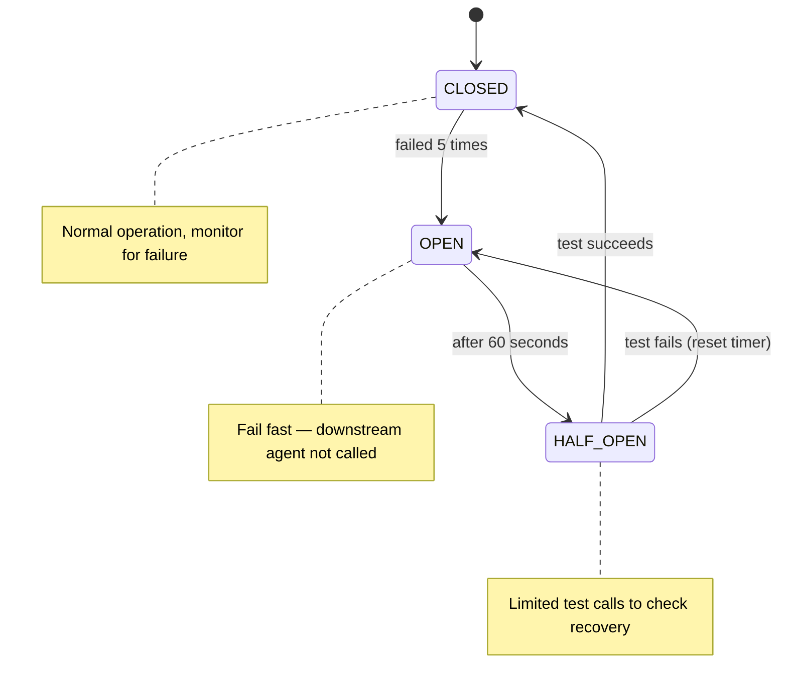
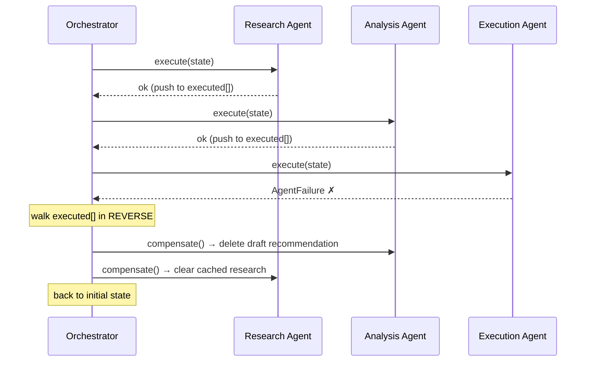
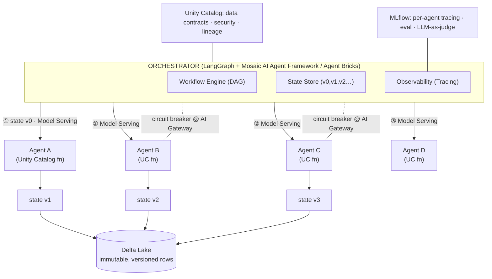

# Findings: "From Chaos to Choreography: Multi-Agent Orchestration Patterns That Actually Work" (Sandipan Bhaumik, Databricks) — YouTube `2czYyrTzILg`

> **Research status:** COMPLETE. **Transcript: FULL verbatim transcript obtained** — the YouTube watch-page transcript (Exa livecrawl) was truncated mid-talk, so I also pulled the complete timestamped auto-caption transcript via you-tldr.com and cross-checked it against StartupHub.ai's independent write-up; the three agree. **yt-dlp was fully bot-walled** ("Sign in to confirm you're not a bot") — confirmed against the tv/web/safari player APIs — so I could NOT download subtitles or the video file directly. **Vision: YES, but from slides, not video frames.** The in-sandbox YouTube player is bot-walled, so I could NOT screen-capture the video; instead I downloaded the speaker's **own slide deck** (28-page PDF linked in the description, first-party) and read **every slide via vision**, including all three code snippets and every architecture diagram. This substitution is stated honestly throughout. **No companion code repository exists** — this is a conceptual/patterns talk plus a Databricks reference architecture, not an open-source release.

---

## 1. Identity

- **Title:** *From Chaos to Choreography: Multi-Agent Orchestration Patterns That Actually Work.*
- **Speaker:** **Sandipan Bhaumik** — "Data & AI Tech Lead, Databricks" (slide 1; LinkedIn bio: "Tech Leader - Data & AI | Community Founder | Speaker | Podcast Host," Milton Keynes, England). He runs a personal brand **agentbuild.ai** ("Weekly insights on pragmatic, actionable Agentic AI") — newsletter + YouTube + Spotify/Apple podcast (slide 28). 18 years in distributed data systems (NHS, Tier-1 banks, AWS, now Databricks).
- **Org / sponsor framing:** Databricks (the demo uses Databricks/Mosaic AI Agent Framework, LangGraph, Unity Catalog, Delta Lake, MLflow).
- **Venue / channel:** **AI Engineer** YouTube channel (an AI Engineer conference talk). Category "Science & Technology."
- **Length:** **26:28** (a short conference talk, no workshop/Q&A).
- **Published:** **2026-04-08** (YouTube metadata via Exa). Slide deck dated **April 2026**.
- **Reach (at crawl, 2026-06-05):** ~**40.7K views**, ~**1.1K likes**.
- **Primary video link:** https://www.youtube.com/watch?v=2czYyrTzILg
- **Slides (primary, obtained):** "Multi-agent Orchestration Patterns.pdf" — Google Drive `18LqVzhfVS3iULYuy2EshWoMLmQt3rdpT` (28 slides; downloaded and read in full for this report).
- **Code repo:** **None.** No GitHub repository is referenced in the video, description, or slides. Code appears only as ~3 short illustrative snippets *inside* the slides (transcribed verbatim in §4). The talk is conceptual + a Databricks reference architecture, not a software release.

> **Relevance caveat up front.** This is **not** a self-improving / evolutionary agent, and not even an agent *framework*. It is a **distributed-systems-patterns talk**: how to make a *fixed* set of cooperating agents reliable in production (coordination topology, state discipline, failure recovery). Under the brief's broad test it is relevant as a **catalog of orchestration + reliability + state-management primitives** for the layer that would *run* an evolutionary loop's many agents/experiments over long horizons — not for the propose→test→keep mechanism itself. Several patterns (immutable versioned state, data contracts as gate, saga rollback, circuit breaker) map cleanly onto "run many candidate-builds reliably and roll back the bad ones."

## 2. TL;DR

- **Thesis (one line):** *"One agent is a feature. Five agents is a distributed-systems problem."* When you scale from a single agent to a handful of cooperating agents, the failures you hit are **not AI failures** — they are classic distributed-systems failures (race conditions, stale reads, lost updates, cascading failures), and you must apply 20-year-old distributed-systems patterns to survive production.
- **The war story that frames everything:** a five-agent **credit-decisioning** system in financial services. The credit-score agent wrote `750` to PostgreSQL; the risk agent read `680` from a **stale cache** 500 ms later (cache invalidation failed) → ~**20% of decisions had incorrect risk ratings**, 2 days to diagnose. *"The race condition wasn't in the database, it was in the architecture… we built a distributed system without distributed-system thinking."*
- **The two coordination topologies:** **Choreography** (agents react to events on a message bus; decentralized, autonomous, scales, but undebuggable without bulletproof observability) vs. **Orchestration** (a central orchestrator calls "dumb" agents, owns state/retries/rollback/logging; debuggable, but a bottleneck). Choice mapped on a 2×2 (workflow complexity × autonomy), with a **Hybrid** quadrant (choreography + saga).
- **Three reliability primitives — each with verbatim code:** (1) **Immutable, versioned state snapshots** (`@dataclass(frozen=True)` + append-only log + schema-validated handoff) to kill race conditions and give replay/lineage; (2) **Data contracts** enforced *at the handoff boundary* (`confidence > 0.7`, `sources.length > 0`, schema match) so bad data is caught immediately, not three agents downstream; (3) **Failure recovery** via **Circuit Breaker** (CLOSED→OPEN→HALF_OPEN, fail-fast at 5 failures, retry after 60 s) and the **Saga / compensation pattern** (every agent has `execute()` + `compensate()`; on failure the orchestrator walks the executed list in reverse and undoes each).
- **Why it matters (or not) for us:** This is a **reliability/operations playbook for running many agents**, not a self-improving loop. Its high-value transfer is the **state + verification + rollback substrate**: immutable versioned state with replay/binary-search debugging, contract-gated handoffs, and saga rollback are *exactly* the controls a long-horizon evolutionary build-loop needs to run many candidate experiments, gate promotions, and undo regressions safely. The "choreography vs. orchestration" framing also bears directly on how to wire a multi-sub-agent factory.
- **Signal: MEDIUM (leaning medium-low for the core thesis, medium for borrowable patterns).** Nothing here is novel — it is a faithful re-skin of well-known distributed-systems patterns (Newman's *Building Microservices*, the Saga paper, Nygard's circuit breaker) onto LLM agents, plus a Databricks reference architecture. No code repo, no benchmarks, single anecdotal war story. But the patterns are *correct, concretely coded, and directly applicable* to the harness layer that would run an evolutionary agent.

## 3. What it does & how it works

This is a **26-minute conference talk**, so "how it works" means *the conceptual framework and the reference architecture it teaches*, not a running system. The talk has four movements: **(0) Problem/war story → (1) Coordination patterns → (2) State management → (3) Failure recovery →** culminating in **a production reference architecture on Databricks**. I reconstruct each from the verbatim transcript and the 28-slide deck (both obtained in full).

### 3.0 The framing: agents ARE a distributed system

The load-bearing claim: a single agent is "Input → [agent] → Output," a *feature*. Five agents is a graph of dependencies — "Agent A produces data Agent B needs; Agent C waits on A and B; Agent D updated shared state B was reading; Agent E crashed and took down the workflow." The slide "FIVE AGENTS ARE CHAOS" draws a 6-node graph (A–F) with edges; the "COMPLEXITY CURVE" slide claims **5 agents = 25× complex** (the transcript's reasoning: 1 agent = 0 coordination problems, 2 = 1 connection, 5 = "at least 10 potential connections," each connection a failure point — i.e. O(n²) pairwise coordination). *"This is no longer an AI problem. This is a distributed-system problem. And most of you didn't sign up to be distributed-systems engineers."*

**The war story (verbatim, the emotional core):** a credit-decisioning system. Agent 1 (credit-score calc) ran 2 weeks in production, zero issues. Then four more agents added (income verification, risk assessment, fraud detection, final approval). Within 3 days, ~20% of decisions had wrong risk ratings; customers who should have been flagged were approved. Root cause (2 days to find): a **customer-record cache** between agents and PostgreSQL. The score-agent's write to Postgres succeeded but **the cache was not invalidated**; the risk agent read the stale `680` instead of the fresh `750`. *"The race condition wasn't in the database, it was in the architecture… bad architecture, not bad AI, kills multi-agent projects."*



### 3.1 Coordination: Choreography vs. Orchestration

The talk's central dichotomy. The slide uses the metaphor: **Choreography = dancers** ("Decentralized. Event-driven. Autonomous"); **Orchestration = a conductor + orchestra** ("Centralized. Coordinated. Controlled").

**Choreography (event-driven).** Agents publish/subscribe on a **Message Bus**. The worked example: Research Agent publishes `research_completed` → Analysis Agent (subscribed) consumes it, does analysis, publishes `analysis_ready` → Report Agent consumes that. *No central coordinator; each agent is autonomous.* Pros (slide): loosely coupled, easy to add agents, high autonomy, scales. Cons: **debugging is "playing detective with no clue"** — which agent failed to publish? was the event consumed? consumed twice? — and so it *requires* bulletproof observability and strong delivery guarantees. Bhaumik's warning: *"teams choose choreography because it feels more agentic… then spend months firefighting because they can't debug distributed event flows."*



**Orchestration (centralized).** A **workflow orchestrator** calls each agent directly, waits, collects results, runs B and C in parallel, then calls D with B+C's combined results. *"Agents never call each other. The orchestrator is the single source of truth — it knows the entire execution graph, manages state, handles retries, logs every step. Agents are dumb."* Databricks implementation suggestion: **LangGraph wired into the Mosaic AI Agent Framework** as orchestrator ("any workflow engine giving you DAGs + proper retries fits"). In financial services they "use orchestration almost exclusively" because debuggability and rollback matter more than autonomy.



**The decision framework (2×2).** Axes: *Workflow complexity* (simple↔complex) × *Autonomy* (low↔high).
- High autonomy + simple → **Choreography** ("Event-driven microservices")
- High autonomy + complex → **Hybrid** ("Distributed transactions" — choreography + saga)
- Low autonomy + simple → **Simple Orchestration** ("Linear workflows")
- Low autonomy + complex → **Full Orchestration** ("Enterprise workflows")



### 3.2 State management: immutable, versioned snapshots

The anti-pattern (slide "ANTI-PATTERN: SHARED MUTABLE STATE"): six agents all writing the same DB record → **lost updates** ("both read 680; A writes 750, B writes 720; last-write-wins; A's update disappears"). Bhaumik concedes DBs have row locks / serializable isolation / `SELECT … FOR UPDATE` — *"but you have to use them correctly, and many teams don't; they use default isolation and ship race conditions to production. We did that mistake."*

The correct pattern (slide "CORRECT PATTERN: IMMUTABLE STATE SNAPSHOTS"): Agent A → `state v1` (sealed/locked) → Agent B → `state v2` (sealed) → Agent C. State is an **append-only log** (inserts, never updates). Each handoff: **schema validation + version increment + immutability**. On failure of Agent C, roll back to v2; to debug, *"replay state evolution from version 1 through version N… you can **binary-search** through your state history to find where things went wrong."* (Snapshots may be logged to append-only storage for audit/replay "but never shared for read/write.")



### 3.3 Data contracts (verification at the boundary)

State discipline is "half the battle; data contracts are the other half." The producer declares an output schema; the consumer declares required inputs *and validation rules*, and **rejects the handoff if the rules aren't satisfied**. Worked example (slide "DATA CONTRACTS"): Research Agent outputs `{findings, confidence, sources}`; the contract gate checks **`confidence > 0.7`, `sources.length > 0`, schema matches**, and *"rejects handoff if rules don't satisfy."* *"You find out immediately, not three agents downstream when it produces a report in garbage."* Production mechanism: register input/output schemas in **Unity Catalog**, so "every agent's contract is versioned and governed in one place."

### 3.4 Failure recovery: circuit breaker + saga

**Circuit breaker** (Nygard's pattern, applied to agent-to-agent calls). States: **CLOSED** (normal, monitor) → on **5 consecutive failures** → **OPEN** (all calls fail fast immediately; the downstream agent is *not* called → "system protected from overload") → after **60 s** → **HALF_OPEN** (send a limited number of test calls) → on success → CLOSED; on failure → OPEN (reset timer). Purpose: prevent cascading failure; *"one agent going down doesn't bring your entire workflow down — you gracefully degrade (skip the agent, use cached results, alert a human)."* Enforced on Databricks "at the serving layer through Model Serving / AI Gateway," with every OPEN/CLOSED transition logged to MLflow.



**Saga / compensation pattern.** Every agent implements **`execute()`** and **`compensate()`** (the latter undoes the former — "every operation must be reversible"). The orchestrator keeps a list of successfully-executed agents; on a mid-workflow failure it **walks the list in reverse and calls `compensate()` on each**. Worked example: Research (gathers market data) → Analysis (writes investment recommendation) → Execution (places trade) **FAILS** → Execution has "nothing to undo," Analysis "deletes the draft recommendation," Research "clears cached research data" → back to initial state, "no partial transactions, no stuck workflows."



### 3.5 The production reference architecture (Databricks)

The capstone slide ("PRODUCTION — DATABRICKS"). The **Orchestrator** (LangGraph + Mosaic AI Agent Framework; "Agent Bricks" as the higher-level packaging) holds three responsibilities: **Workflow Engine (DAG)**, **State Store (v0, v1, v2…)**, **Observability (Tracing)**. Each **agent = a Unity Catalog function** (SQL/Python or a registered model), exposed via **Databricks Model Serving / Function Serving** (where circuit-breaker-style retries/timeouts/rate-limits are enforced via AI Gateway). **Delta Lake** stores everything — state versions are "just rows in a Delta table, never updated in place" — and each agent run is tied to a state version via **MLflow Traces**. **Unity Catalog** governs access/lineage/audit for data *and* agents; **MLflow** gives per-agent tracing + evaluation ("out-of-the-box LLM-as-judge metrics on every call"). The recap loop: *LangGraph calls Agent A (UC function) → writes v1 to Delta → calls Agent B with v1 → writes v2 → … MLflow traces every call; circuit breaker guards each; if Agent C fails, LangGraph triggers compensation and walks backward.*



## 4. Evidence from the code

**There is no repository.** The only "code" is **three illustrative snippets rendered as slide images** (transcribed verbatim below from the slide PDF; I read every slide). They are pedagogical sketches, not a runnable system — `validate_schema`, `next_agent`, `_should_test`, `_on_success`, `_on_failure`, `AgentFailure`, `rollback_result` are referenced but undefined. Still, they are the most concrete artifacts and worth quoting exactly.

**(a) Immutable, versioned state + schema-validated handoff** (slide "STATE HANDOFF"):

```python
@dataclass(frozen=True)        # ← Immutable
class AgentState:
    version: int
    data: Dict
    created_by: str

def handoff(state: AgentState) -> AgentState:
    validated = validate_schema(state)      # ← Contract

    next_state = AgentState(
        version=state.version + 1,          # ← Versioned
        data=validated.data,
        created_by=next_agent.name
    )

    return next_agent.execute(next_state)
```

The three load-bearing moves (per transcript): "First, validate the schema — this is the contract enforcement… Second, increment version — create a *new* immutable state object with version N+1… Third, execute the next agent with that immutable state. The agent can't modify the input state. It can only produce a new state."

**(b) Data contract rules** (slide "DATA CONTRACTS" — expressed as bullet rules, not full code): producer emits `{findings, confidence, sources}`; consumer (Analysis Agent) enforces:
```
RULES:
  • confidence > 0.7
  • sources.length > 0
  • schema matches
→ Reject handoff if rules don't satisfy
```

**(c) Circuit breaker** (slide "CIRCUIT BREAKER — IMPLEMENTATION"):

```python
class CircuitBreaker:
    def __init__(self, failure_threshold=5, timeout=60):
        self.failure_count = 0
        self.state = "CLOSED"     # CLOSED | OPEN | HALF_OPEN

    def call(self, agent_fn):
        if self.state == "OPEN":
            if self._should_test():
                self.state = "HALF_OPEN"
            else:
                raise CircuitOpenError()

        try:
            result = agent_fn()
            self._on_success()    # Reset to CLOSED
            return result
        except Exception:
            self._on_failure()    # Increment, maybe OPEN
            raise
```

**(d) Saga / compensation** (slide "COMPENSATION (SAGA) PATTERN — IMPLEMENTATION"):

```python
class CompensatingAgent:
    def execute(self, state):
        # Normal operation
        return result

    def compensate(self, state):
        # Undo the operation
        return rollback_result

# Orchestrator tracks what executed
executed_agents = []
try:
    for agent in workflow:
        result = agent.execute(state)
        executed_agents.append((agent, result))
except AgentFailure:
    # Compensate in reverse order
    for agent, result in reversed(executed_agents):
        agent.compensate(result)
```

**Production wiring (described, not coded):** agents = **Unity Catalog functions**; orchestrator = **LangGraph + Mosaic AI Agent Framework**; state = **Delta Lake** rows ("never updated in place"); tracing/eval = **MLflow** (with LLM-as-judge); circuit-breaker policies (retries/timeouts/rate-limits) enforced at **Databricks Model Serving / AI Gateway**; contracts/lineage/access in **Unity Catalog**. This maps 1:1 onto the official Databricks doc *"Agent system design patterns"* (docs.databricks.com), which independently describes the same continuum (LLM+prompt → deterministic chain → single-agent → multi-agent with supervisor/router) and the same production guidance (MLflow Tracing/Evaluation, Unity Catalog sandboxed functions, prompt versioning via MLflow Prompt Registry, version-pinning + regression tests).

## 5. What's genuinely smart

The talk's intellectual content is *applied*, not novel — but several framings are crisp and correct, and matter for anyone building a long-horizon, multi-agent system.

1. **"Multi-agent reliability is a distributed-systems problem, not an AI problem."** This is the single most valuable reframe. The failures that actually kill multi-agent systems in production are race conditions, stale reads, lost updates, partial failures, and cascading failures — none of which are addressed by better prompts or models. Naming this explicitly, with a concrete war story (stale-cache → wrong credit decisions), is genuinely useful inoculation against the common mistake of treating an N-agent system like "N features."

2. **Immutable, versioned, append-only state as the antidote to coordination bugs.** This is the strongest transferable idea. Making each handoff produce a *new sealed version* (never mutating shared state) simultaneously buys: (a) **no race conditions / lost updates** by construction; (b) **perfect lineage** ("who created which version, from what input"); (c) **cheap rollback** (revert to vN−1); and (d) **replay + binary-search debugging** over state history ("version 7 was bad → look at version 6 that went in → version 5…"). This is event-sourcing / immutable-log thinking applied to agent handoffs, and it is exactly right for systems that must be auditable and recoverable.

3. **Contracts enforced at the boundary, with a *quality* threshold, not just a schema.** The data-contract gate checks not only schema match but a **semantic quality bar** (`confidence > 0.7`, `sources.length > 0`) and **rejects the handoff** if unmet. The insight — *"you find out immediately, not three agents downstream when it produces garbage"* — is the agent-equivalent of fail-fast validation, and the choice to gate on *confidence* makes it a lightweight verifier between stages rather than a passive type check.

4. **Circuit breaker for agent-to-agent calls.** Correctly applied: a flaky/timing-out LLM-backed agent, if hammered, produces cascading failure and cost blow-ups. Fail-fast + half-open probing + graceful degradation (skip / cache / alert human) is the right production answer, and tying every state transition to a metric (MLflow) makes "when did this agent start flaking?" observable.

5. **Saga/compensation for partial-failure rollback.** Forcing every agent to define a `compensate()` (reverse of `execute()`) and having the orchestrator unwind in reverse order is the standard distributed-transaction answer, and it is the *correct* one for irreversible side effects (placed a trade, sent an email, wrote a record). The "every operation must be reversible" contract is a strong design discipline.

6. **The 2×2 decision matrix (autonomy × complexity).** A clean, honest decision aid that resists the "choreography feels more agentic, so use it" trap. The explicit warning — choreography without bulletproof observability "will destroy you" — is hard-won and correct.

7. **Governance/observability as first-class, not afterthought.** Putting tracing (MLflow), lineage/contracts (Unity Catalog), and per-call LLM-as-judge evaluation into the *reference architecture itself* reflects real production experience: you cannot operate or debug a multi-agent system you cannot trace.

The throughline — *"build systems, not demos… circuit breakers aren't sexy but they're why systems don't fail at 2 a.m."* — is the right cultural message for moving agents from demo to production.

## 6. Claims vs. reality / limitations / critiques

**(A) What the speaker claims.** That these five patterns (choreography/orchestration choice, immutable versioned state, data contracts, circuit breaker, saga) are what make multi-agent systems work in production; that they're battle-tested across "billions of transactions, 24/7" in regulated finance; that the Databricks stack (LangGraph/Mosaic AI, Unity Catalog, Delta Lake, MLflow, Agent Bricks) packages them.

**(B) What is actually demonstrated.** Essentially **nothing is empirically demonstrated** in the talk. There is **no live demo, no repo, no benchmark, no A/B, no metrics** beyond the single anecdotal war story ("20% wrong risk ratings," "2 days to diagnose," "billions of transactions"). The code is **slide-ware**: incomplete snippets with undefined helpers (`validate_schema`, `_should_test`, `_on_success`, `AgentFailure`, `next_agent`). So this is a **claim-and-illustrate** talk: the patterns are presented as authoritative because they are well-established in distributed systems (which they are), not because this talk proves them for agents.

**(C) Limitations and caveats — honest assessment:**

- **Zero novelty.** Every pattern is a textbook distributed-systems pattern transplanted onto agents: choreography vs. orchestration (SOA/microservices; Sam Newman, *Building Microservices*), immutable versioned append-only state (event sourcing; Greg Young / Martin Fowler), circuit breaker (**Michael Nygard, *Release It!*** — including the exact CLOSED/OPEN/HALF-OPEN tri-state), saga/compensation (**Garcia-Molina & Salem, 1987**), data contracts (data-engineering practice). The contribution is *curation + agent re-framing*, not invention. The talk is honest about this ("these come from multiple years of distributed-systems work… I directly apply them on multi-agent AI").
- **Agent-specific reality is glossed.** The hardest parts of *agentic* coordination are barely touched: non-determinism of LLM outputs (re-running `execute()` may not reproduce the same result, complicating saga replay), partial/garbage tool outputs, prompt-injection across handoffs, semantic (not just schema) drift between stages, and cost. The `confidence > 0.7` gate assumes agents emit a calibrated confidence — they usually don't. `compensate()` assumes side effects are cleanly reversible — many agent actions (emails sent, code merged, money moved) are not.
- **Orchestration's downsides are under-weighted.** "Agents are dumb; the orchestrator does all the smart coordination" trades away exactly the emergent autonomy that motivates multi-agent setups, and centralizes a bottleneck/SPOF. The talk acknowledges this in the 2×2 but the production architecture is unambiguously orchestration-first (appropriate for regulated finance; less so for open-ended/agentic exploration).
- **Vendor-shaped.** The production half is a Databricks reference architecture (LangGraph + Mosaic AI Agent Framework + Unity Catalog + Delta Lake + MLflow + Agent Bricks). The patterns are tool-agnostic, but the "how to build it" is a Databricks pitch. (Speaker is a Databricks Data & AI Tech Lead; also founder of the **agentbuild.ai** community/newsletter — a personal-brand vehicle.)
- **No reproducibility / independent validation.** I found **no independent critique or replication** of this specific talk — only neutral re-summaries (StartupHub.ai, you-tldr, frontiermodels.cc, AIssential, BigGo Finance) that restate the content without scrutiny. The *underlying patterns*, however, are independently corroborated by the official **Databricks "Agent system design patterns"** doc and decades of distributed-systems literature.

**(D) Reward-hacking / test-gaming relevance:** Not applicable — this talk has no learned component, no evaluator being optimized against, hence no reward-hacking surface. The one verification-adjacent mechanism (the `confidence > 0.7` data-contract gate) could itself be "gamed" by an agent that emits an inflated confidence, which is a generic caution for any confidence-gated handoff.

## 7. Relevance to a self-improving, evolutionary agent

**Honest verdict: tangential to the *core* loop, directly useful for the *substrate* that runs it.** This talk says nothing about propose→test→keep-if-better, candidate generation, fitness, or harness self-modification. But our brief's broad test — *running agents reliably over long horizons, good decisions, orchestration, verification, control* — is exactly the layer this talk addresses. Mapped concretely:

1. **Immutable, versioned, append-only state → the candidate/experiment ledger.** An evolutionary build-loop generates a sequence of *candidate harness states / programs / experiments*. Representing each as a **sealed, versioned, append-only snapshot** (never mutate the prior best) gives us, for free: (a) the ability to **keep only verifiably-better** candidates by comparing versions; (b) **rollback** to the last-good version when a candidate regresses; (c) **full lineage** of what produced what; and (d) **replay / binary-search debugging** to localize *which* mutation caused a regression. This is precisely the data-discipline an "keep only if better" loop needs, and it's the single most reusable idea here. (Compare DGM/AlphaEvolve-style archives in our other findings — this is the production-engineering version of the same instinct.)

2. **Data contracts with a quality threshold → cheap inter-stage verification / promotion gate.** A contract that rejects a handoff unless `confidence/score > threshold AND schema matches` is a lightweight **verifier between pipeline stages** — exactly the kind of gate that fails fast before a bad artifact propagates. For our loop, the analog is: a candidate must clear a contract (tests pass, metric ≥ baseline, schema/interface intact) before it is allowed to become the new parent. *"Find out immediately, not three agents downstream."*

3. **Saga / compensation → safe rollback of side-effecting build steps.** A long-horizon agent that edits files, runs migrations, opens PRs, or deploys must be able to **undo a partially-applied change** when a later step fails. The `execute()`/`compensate()` discipline + reverse-order unwind is a clean model for transactional, reversible build actions — important for keeping the workspace/repo in a consistent state across many speculative attempts.

4. **Circuit breaker → long-horizon reliability + cost control.** Over thousands of autonomous iterations, sub-agents/tools/model endpoints *will* flake (timeouts, rate limits, repeated identical failures). Fail-fast + half-open probing prevents a single flaky component from cascading, burning tokens, or wedging the loop, and gives graceful degradation (skip / cache / escalate to human). Directly relevant to "running agents reliably over long horizons."

5. **Choreography vs. orchestration → topology choice for a sub-agent factory.** Our system orchestrates many sub-agents (research, code, test, evaluate). This talk's framing argues for **orchestration when you need rollback, central state, and debuggability** (which an evolutionary loop with a verifier/promotion gate strongly does), reserving **choreography** for loosely-coupled, autonomy-heavy stages *only if* observability is bulletproof. The orchestrator-owns-state-and-retries model fits a central improvement loop better than pure event-driven choreography.

6. **Observability/eval as first-class (MLflow-style tracing + LLM-as-judge per call) → the measurement spine.** A self-improving system must *measure* every candidate to decide what to keep. Per-step tracing (inputs/outputs/latency/tokens) and an evaluation hook on every call are the instrumentation a fitness function consumes. This is infrastructure our loop needs regardless of domain.

**What does NOT transfer:** the actual self-improvement mechanism, candidate generation/mutation, search strategy, fitness design, and any notion of the harness editing itself — none of that is here. This is the "make the factory floor reliable" half, not the "invent better products" half.

## 8. Reusable assets

Concrete, quotable things we *could* borrow (collected as evidence; not assembled into a design). All code is verbatim from the slide deck.

**(1) Immutable versioned state + validated handoff** — adopt as the candidate/experiment record shape:
```python
@dataclass(frozen=True)        # immutable
class AgentState:
    version: int
    data: Dict
    created_by: str

def handoff(state: AgentState) -> AgentState:
    validated = validate_schema(state)        # contract gate
    next_state = AgentState(
        version=state.version + 1,            # versioned, append-only
        data=validated.data,
        created_by=next_agent.name
    )
    return next_agent.execute(next_state)     # input state never mutated
```
*Pattern, not the snippet:* sealed snapshot per step + append-only log + "binary-search through state history to find where things went wrong." (Source: slide "STATE HANDOFF"; transcript §3.2.)

**(2) Boundary contract with quality threshold** — a promotion/handoff gate:
```
contract(Research → Analysis):
  require: schema matches AND confidence > 0.7 AND sources.length > 0
  else: reject handoff (fail fast at the boundary)
```
Production note: "register input/output schemas in Unity Catalog so every agent's contract is versioned and governed in one place." (Slide "DATA CONTRACTS"; transcript §3.3.)

**(3) Circuit breaker (tri-state)** — wrap every sub-agent/tool/model call:
```python
class CircuitBreaker:
    def __init__(self, failure_threshold=5, timeout=60):
        self.failure_count = 0
        self.state = "CLOSED"     # CLOSED | OPEN | HALF_OPEN
    def call(self, agent_fn):
        if self.state == "OPEN":
            if self._should_test(): self.state = "HALF_OPEN"
            else: raise CircuitOpenError()
        try:
            result = agent_fn(); self._on_success(); return result   # reset to CLOSED
        except Exception:
            self._on_failure(); raise                                # increment, maybe OPEN
```
Degradation menu when OPEN: "skip that agent and continue with reduced functionality / use cached results / alert a human — but don't crash the workflow." Log every transition to a metric. (Slide "CIRCUIT BREAKER"; transcript §3.4.)

**(4) Saga / compensation (reverse-order rollback)** — for reversible build side effects:
```python
class CompensatingAgent:
    def execute(self, state):   return result        # do work
    def compensate(self, state): return rollback_result  # undo work

executed_agents = []
try:
    for agent in workflow:
        result = agent.execute(state)
        executed_agents.append((agent, result))
except AgentFailure:
    for agent, result in reversed(executed_agents):   # unwind in reverse
        agent.compensate(result)
```
Design contract: "every operation must be reversible." (Slide "COMPENSATION (SAGA) PATTERN"; transcript §3.4.)

**(5) The 2×2 coordination decision matrix** (verbatim mapping) — a topology-selection heuristic:
| | Simple workflow | Complex workflow |
|---|---|---|
| **High autonomy** | Choreography (event-driven microservices) | Hybrid (choreography + saga; distributed transactions) |
| **Low autonomy** | Simple orchestration (linear) | Full orchestration (enterprise) |
Rule of thumb (verbatim): *"Simple workflow + high autonomy → choreography. Complex workflow + low autonomy tolerance → orchestration."* Caveat: choreography is viable *only* with bulletproof observability. (Slide "DECISION MATRIX"; transcript §3.1.)

**(6) Production reference-architecture pattern (tool-agnostic distillation):** central **Orchestrator = {DAG workflow engine + versioned state store + tracing}**; each agent behind a serving layer that enforces retries/timeouts/rate-limits (circuit-breaker policy); immutable versioned state in an append-only store; per-call tracing + LLM-as-judge evaluation; contracts/lineage/access in a governance catalog. (Slides "PRODUCTION" / "PRODUCTION — DATABRICKS"; transcript §3.5.) Databricks instantiation: LangGraph + Mosaic AI Agent Framework, Unity Catalog functions, Delta Lake, MLflow, AI Gateway, Agent Bricks.

**(7) Cultural framing (quotable):** *"Build systems, not demos."* / *"Agent chaos is inevitable; choreography is a choice."* / *"You won't get applause for implementing a circuit breaker, but you make your systems more reliable — they don't fail at 2 a.m."*

## 9. Signal assessment

- **Overall signal: MEDIUM.** (Medium-low for *originality / the core thesis*; medium for *borrowable, correctly-coded reliability patterns* that map onto our harness's run/verify/rollback substrate.)
- **Why not high:** zero novelty (all patterns are textbook distributed-systems patterns re-skinned for agents); no repo, no benchmark, no demo, single anecdotal war story; vendor-shaped production half; says nothing about self-improvement / evolutionary search / candidate generation / fitness — the heart of our project.
- **Why not low:** the patterns are *correct, concrete (with verbatim code), and directly applicable* to the parts of our brief about long-horizon reliability, verification gates, rollback, orchestration topology, and observability. Immutable versioned append-only state + contract-gated promotion + saga rollback is a genuinely good model for an experiment ledger in a propose→test→keep loop.
- **Confidence: HIGH** on *what the source contains* — I obtained the **complete verbatim transcript** (via Exa-livecrawled you-tldr.com timestamped transcript, cross-checked against the YouTube-page transcript and StartupHub.ai's independent write-up) and the **full 28-slide deck** (downloaded the source PDF and read every slide via vision, including all three code snippets and every architecture diagram).
- **What I could NOT verify:** (a) any of the production claims (the "billions of transactions," the "20% wrong risk ratings" war story) — unsourced and unverifiable; (b) video frames *directly from the player* — the YouTube player is bot-walled in-sandbox (yt-dlp returned "Sign in to confirm you're not a bot" against the tv/web/safari player APIs), so I sourced all visual/demo content from the **speaker's own slide deck** linked in the description (a first-party artifact) rather than screen-captures; this is faithful but not a frame grab. (c) `agentbuild.ai` site contents — the site returned 503/503 on crawl; details are from the speaker's LinkedIn (cached) and slide 28.

## 10. References

**Primary (obtained & read in full):**
- Talk video — Sandipan Bhaumik, *From Chaos to Choreography: Multi-Agent Orchestration Patterns That Actually Work*, **AI Engineer** YouTube, published 2026-04-08, 26:28. https://www.youtube.com/watch?v=2czYyrTzILg
- **Slide deck (first-party):** *Multi-agent Orchestration Patterns.pdf*, 28 slides, dated April 2026 — Google Drive `18LqVzhfVS3iULYuy2EshWoMLmQt3rdpT`. https://drive.google.com/file/d/18LqVzhfVS3iULYuy2EshWoMLmQt3rdpT/view (downloaded; read all 28 pages via vision). Local copy: `/agent/workspace/scratch/yt-2czyyrtzilg/slides.pdf`.
- **Full transcript (verbatim):** YouTube auto-captions surfaced via you-tldr.com (timestamped). https://you-tldr.com/transcript/2czYyrTzILg — local clean copy: `/agent/workspace/scratch/yt-2czyyrtzilg/transcript_clean.txt`.
- Speaker profile — **Sandipan Bhaumik**, LinkedIn (Data & AI Tech Lead, Databricks; Founder, AgentBuild). https://www.linkedin.com/in/sandipanbhaumik

**Primary (corroborating, same author's employer):**
- Databricks docs — *Agent system design patterns* (last updated 2026-05-21): the LLM→deterministic-chain→single-agent→multi-agent continuum + MLflow Tracing/Evaluation, Unity Catalog sandboxed functions, MLflow Prompt Registry, version-pinning. https://docs.databricks.com/aws/en/generative-ai/guide/agent-system-design-patterns

**Secondary (neutral re-summaries; no independent critique found):**
- StartupHub.ai — *Multi-Agent Orchestration Patterns* (detailed write-up incl. war-story specifics, 2×2, Delta Lake). https://startuphub.ai/ai-news/ai-video/2026/multi-agent-orchestration-patterns/
- Frontier Models, AIssential, Ut0pia, BigGo Finance — additional re-summaries/indexes of the same talk (titles surfaced via Exa; restate content without scrutiny).

**Background literature the patterns derive from (not cited in the talk, added for "claim vs. reality"):**
- M. Nygard, *Release It!* — circuit breaker (CLOSED/OPEN/HALF-OPEN). 
- H. Garcia-Molina & K. Salem, *Sagas* (SIGMOD 1987) — compensation pattern.
- S. Newman, *Building Microservices* — choreography vs. orchestration.
- G. Young / M. Fowler — event sourcing / immutable append-only log.

**Could not access:** `agentbuild.ai` (HTTP 503 on crawl, 2026-06-05); direct video frames (YouTube player bot-walled in-sandbox).

> **Note on code references:** there is no source repository, so no `repo@SHA:path` references exist. All code is quoted verbatim from the slide deck images (see §4/§8), with slide titles given as the locator.
