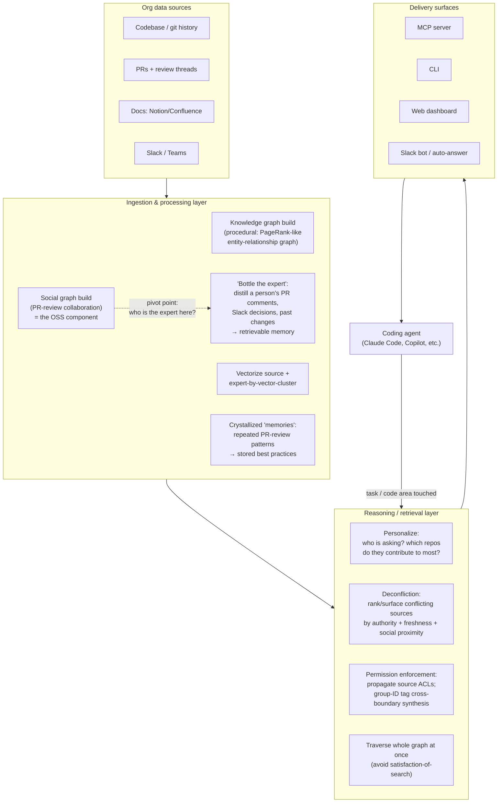
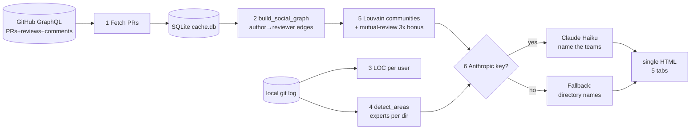

# Findings: "Mergeable by default: Building the context engine to save time and tokens" (Peter Werry, Unblocked) — YouTube `5ID22ACI7IM`

> **Research status:** COMPLETE. Transcript obtained via Exa livecrawl of the YouTube page (substantial, but the YouTube-supplied transcript on that page is truncated mid-talk; I supplemented with two independent timestamped write-ups and three first-party companion blog posts). **The open-source companion code was located and read in full** (`unblocked/engineering-social-graph`). **Vision:** the video player itself is IP-blocked in-sandbox (YouTube "Sign in to confirm you're not a bot" wall blocks BOTH `yt-dlp` and the headless browser), so I could **not** capture frames from the video. I instead viewed the *actual* tool artifacts (the same visualization demoed at ~44:22) directly from first-party PNGs on the company blog and describe them below. This is stated honestly throughout.

---

## 1. Identity

- **Title:** *Mergeable by default: Building the context engine to save time and tokens.*
- **Speaker:** **Peter Werry** (co-founder, Unblocked), with colleague **Brandon** (Brandon Waselnuk, also Unblocked; author of the companion blog posts). Werry's GitHub handle is `pwerry`.
- **Org:** **Unblocked** — getunblocked.com — a commercial "context engine" product for engineering organizations.
- **Venue / channel:** **AI Engineer** YouTube channel; recorded at an AI Engineer conference (the "AIE EU 2026" track per a third-party index). Talk + hands-on **workshop**.
- **Format & length:** ~**1h41m** (01:41:24). First ~25 min is a structured talk (three myths, six requirements, three production mistakes); the remainder is Q&A + a live coding workshop building a "social graph builder."
- **Published:** 2026-05-03 (YouTube metadata via Exa).
- **Reach (at crawl):** ~14.7K views, ~290 likes.
- **Primary video link:** https://www.youtube.com/watch?v=5ID22ACI7IM
- **Code repo (companion, read in full):** `github.com/unblocked/engineering-social-graph` — MIT, Python 3.11+, created 2026-04-04, last push 2026-04-12. **Inspected from the `main` branch tarball** (codeload, downloaded 2026-06-05; `git clone` and `yt-dlp` were both blocked by the sandbox proxy / YouTube bot-wall respectively). Top contributors: `pwerry`, `kasbuunk`, `AchilleasDrakou`, `yltw27`, `gcandeli`, `jsholmes`. *(Note: the repo had no fetchable commit SHA in the offline tarball; references below use `engineering-social-graph@main:path`.)*

> **Relevance caveat up front.** This is **not** a self-improving / evolutionary agent. It is **context infrastructure** ("a context engine") whose job is to feed the *right* organizational context into a coding agent so the agent's first attempt is mergeable. It is relevant to our project under the brief's broad test (memory systems, long-horizon reliability, decision-making, orchestration), specifically as a **memory/retrieval substrate** and as a **library of hard-won production lessons about feeding agents context**. It contributes nothing on the *propose→test→keep-if-better* loop or on harness self-modification.

---

## 2. TL;DR

- **The thesis:** the bottleneck for coding agents has shifted from *model intelligence* to *context quality*. "Four years ago, **you** were the context engine" — a human assembled the ticket, files, and tribal knowledge by hand. That doesn't scale to background/parallel agents, so the assembly job must be productized. (Talk + companion post *"Stop Babysitting Your Agents."*)
- **Three myths it attacks:** (1) naive RAG over docs is a context engine — no, vector search triggers *"satisfaction of search"* (stop at first plausible hit); (2) wiring up MCP servers = understanding — no, *access ≠ knowing why*; (3) a bigger context window fixes it — no, large orgs already exceed 1M tokens of context and recall degrades as the window fills.
- **The killer number (claimed, ~22:13):** same coding task, **2.5 hours + 21M tokens without** the context engine vs **25 minutes + 10M tokens with** it. Self-reported, single task, vendor benchmark — treat as illustrative, not rigorous.
- **The reusable mechanism:** a **procedural-then-LLM** pipeline that builds a **developer "social graph"** from GitHub PR-review history (who reviews whom), detects teams via community detection, ranks per-area experts from `git log`, and uses that graph as a **retrieval *pivot*** — when an agent touches a code area, the engine loads a distillation of that area's domain expert ("**bottling the expert**": their PR comments, Slack decisions, past changes). This component is **open-sourced** and **read in full** for this report.
- **The three production *mistakes* they admit (the most valuable part for us):** (1) optimized for *access not understanding* (more connectors, flat quality); (2) *hid conflicts* with naive heuristics instead of surfacing them — which **discarded a learning signal**; (3) *cached answers* — code/decisions change, so cached context goes stale and "confidently wrong." These are directly transferable cautions for any agent-memory system.
- **Signal for us: MEDIUM.** High-quality, production-grounded thinking on context/memory and several borrowable patterns (deconfliction, "bottle the expert," personalized retrieval, the caching caution). But it's a retrieval/memory layer, not an evolutionary loop, and the only open code is a *visualization/analytics* tool, not the engine itself.

---

## 3. What it does & how it works

There are **two distinct artifacts** in this source, and it's important not to conflate them:

1. **Unblocked's "Context Engine"** — the closed commercial product. Described in the talk and on the marketing/engineering blogs. No source available. It ingests codebase + docs + conversations (Slack, PRs, issues), builds a "living graph," resolves/ surfaces conflicts, enforces permissions, and serves context to agents over **MCP, CLI, web dashboard, and Slack**.
2. **`engineering-social-graph` ("Social Graph Builder")** — an **open-source CLI** that builds *one component's worth* of signal (the developer collaboration/expertise graph) from GitHub PR history. **This is the only code we can read**, and §4 dissects it.

### 3.1 The Context Engine (product) — described architecture

From the talk + `getunblocked.com/context-engine` + the "Three Hard Lessons" post, the engine's stated responsibilities are: **conflict resolution / deconfliction, permission enforcement, freshness, relevance/personalization, and cost optimization.** Two design commitments stand out:

- **Graph traversal over sequential source-search.** "Agents are subject to a well-documented bias called *satisfaction of search*… Unblocked… traverses your entire knowledge graph at once, rather than sequentially, and then hands off the best answer." (Marketing page; echoed in talk.)
- **Just-in-time computation, *not* caching.** After being burned (see §6), they moved to computing context per-request, caching only on *immutable* inputs.



### 3.2 Where the value lands (claimed)

The talk ranks use-cases by payoff (companion index timestamps in parens):
- **Planning-phase injection (biggest gain, 25:47+):** connect the engine *at planning time* so the agent starts with org norms loaded and **skips the exploratory codebase crawl entirely**.
- **Ticket enrichment:** give an agent a new issue ID → it fills dependencies, related PRs, past failures.
- **Triage / incident management:** drop a prod issue in → surfaces past incidents + Slack threads in seconds (wired to Sentry/Datadog).
- **Auto-answering engineering support channels** (Slack).

### 3.3 The "social graph" as a *retrieval pivot* (the conceptual core)

This is the idea Werry says he "may not have explained effectively" the first time, then re-emphasized. The social graph isn't an end in itself; it's a **routing/pivot mechanism**:

> "Understanding who the experts are in a particular code area acts as a **jump point**… another part of a context engine… is **distilling** … we call it **bottling the expert** … what that individual has worked on in the past, where they sit in the hierarchy, the decisions they've made based on Slack conversations, their PR comments… And getting that expert's learnings into context is a really powerful mechanism. It helps drive the rest of the retrieval **in an agentic loop**. It helps the agent **directionally, where to go next**." (Transcript, Exa livecrawl.)

Three retrieval layers are stacked (per the timestamped write-up + talk): **(1) vector search**, **(2) pre-built "memories"** (crystallized repeated patterns), and **(3) "bottling the expert."**

```mermaid
sequenceDiagram
    participant A as Coding Agent
    participant E as Context Engine
    participant SG as Social/Expertise Graph
    participant B as Expert "bottle" (distillation)
    A->>E: Task touches code area X
    E->>SG: Who is the domain expert for area X (for THIS user)?
    SG-->>E: Expert = person P (review history + git expertise + social proximity to asker)
    E->>B: Unbottle P's distilled knowledge for area X
    B-->>E: P's past decisions, PR-comment patterns, Slack rationale
    E->>E: Layer 1 vector search + Layer 2 memories + Layer 3 expert bottle
    E->>E: Deconflict sources (authority/freshness/proximity); enforce ACLs
    E-->>A: Prioritized, conflict-aware context (not raw docs)
    A->>A: Produce "mergeable-by-default" code
```

---

## 4. Evidence from the code (`engineering-social-graph@main`)

**This is the load-bearing primary evidence.** The repo is the open-sourced *Social Graph Builder* — "a component in our context engine" (blog). It is a clean, well-documented, **academically-grounded** Python CLI. Module map (`engineering-social-graph@main:src/social_graph/`):

```
cli.py                 Click CLI entry (run/build/viz/auth/experts/export/reset/label-teams)
builder.py             6-step build pipeline orchestrator
config.py              Settings; DEFAULT_MODEL="claude-haiku-4-5-20251001"; DEFAULT_MIN_PR_RATE=7.0
models.py              Dataclasses: User, Interaction, PullRequest, SocialEdge, ExpertRanking
decay.py               Gaussian time decay
scoring.py             Interaction weights + log dampening + normalization
fetcher/github.py      GitHub GraphQL client (single nested query)
fetcher/cache.py       SQLite storage (~/.social-graph/cache.db)
graph/social.py        Social graph construction (author→reviewer weighted digraph)
graph/expertise.py     Path/repo/domain expertise from git log; + LLM domain-map prompt
graph/code_expertise.py Area expert scoring + bus factor (research-backed weights)
output/visualization.py Community detection (Louvain) + LOC + sigma.js graph JSON
output/grid.py         HTML render (5 tabs) + LLM team-labeling prompt
```

### 4.1 The build pipeline (`builder.py`) — 6 deterministic steps, 1 optional LLM step

`engineering-social-graph@main:src/social_graph/builder.py` docstring:
```
Steps:
1. Fetch PRs from GitHub (GraphQL)
2. Build social graph edges
3. Compute LOC per user (git log)
4. Detect code area expertise (git log per directory)
5. Community detection (Louvain)
6. Team labels (Anthropic Haiku)   <-- the ONLY LLM call in the whole pipeline
```
Key design choice: **the AI is almost entirely absent.** The graph, teams, and experts are computed **procedurally**; an LLM only *names* the already-detected clusters. Werry in the talk: *"the only AI step in this is to label the teams. You don't have to run the AI step if you don't want to."*



### 4.2 Interaction scoring + log dampening (`scoring.py`) — verbatim

The sublinear weighting that keeps "loud" reviewers from dominating:
```python
# engineering-social-graph@main:src/social_graph/scoring.py
INTERACTION_WEIGHTS: dict[InteractionType, float] = {
    InteractionType.REVIEW: 1.0,
    InteractionType.REVIEW_COMMENT: 0.7,
    InteractionType.ISSUE_COMMENT: 0.4,
}
MINIMUM_SOCIAL_WEIGHT: float = 0.1   # edges below this are discarded

def logarithmic_weight(count: int) -> float:
    """- logarithmic_weight(1)==1.0  - (10)==2.0  - (100)==3.0"""
    return 1.0 + math.log10(count)
```
Per-PR each reviewer's score = `logarithmic_weight(#interactions) * avg(interaction_weight)`, **normalized so the top reviewer on that PR = 1.0**. Bots and self-reviews are filtered (`User.is_bot_or_service`, a hardcoded `BOT_LOGINS` frozenset + `[bot]` substring check).

### 4.3 Gaussian time decay (`decay.py`) — verbatim

```python
# engineering-social-graph@main:src/social_graph/decay.py
DECAY_CONSTANT_DAYS: int = 7 * 16          # 112  (16-week constant)
THREE_SIGMA_DAYS: int = DECAY_CONSTANT_DAYS * 3   # 336 (cutoff: decay ~0.01%)

def exponential_time_decay(delta_days: int) -> float:
    """Gaussian decay: exp(-(t^2)/(C^2)) where C = 112 days."""
    return math.exp(-(delta_days**2) / (DECAY_CONSTANT_DAYS**2))
```
The blog explains the design intent: a **Gaussian** (not exponential) deliberately keeps a **flat plateau for the recent ~quarter** before dropping — "You stay strongly connected to last quarter's collaborators, not just last week's."

### 4.4 Social graph construction (`graph/social.py`) — the accumulation algorithm

Docstring states the algorithm precisely (`engineering-social-graph@main:src/social_graph/graph/social.py`):
```
1. For each author, iterate their closed PRs within the lookback window
2. Per PR: score reviewers (log dampening * avg weight, normalize within PR)
3. Multiply by Gaussian time decay based on PR's updated_at
4. Accumulate per reviewer across all PRs
5. Final normalization per author, discard edges < 0.1
6. Filter out low-activity contributors by PR rate (PRs/month since first PR)
```
Low-activity filter: a contributor is kept only if `authored_count / months_active >= min_pr_rate` (default **7.0 PRs/month** — aggressive; tunable down for smaller repos). Output is a list of `SocialEdge(author, reviewer, weight)`, then converted to a `networkx.DiGraph`.

### 4.5 Community detection with a mutual-review bonus (`output/visualization.py`) — verbatim

The clever bit that separates real teammates from one-way reviewers:
```python
# engineering-social-graph@main:src/social_graph/output/visualization.py : detect_communities()
w_ar = edge_lookup.get((a, r), 0)
w_ra = edge_lookup.get((r, a), 0)
if w_ar > 0 and w_ra > 0:
    # Geometric mean rewards balanced mutual relationships — strong same-team signal.
    # Two people who equally review each other (0.5/0.5) score higher than
    # an imbalanced pair (1.0/0.1) despite similar raw sums.
    combined = math.sqrt(w_ar * w_ra) * 3.0
else:
    combined = (w_ar + w_ra) * 0.5    # one-way = weaker team signal
g.add_edge(a, r, weight=combined)
resolution = _adaptive_resolution(g)
communities = list(louvain_communities(g, weight="weight", resolution=resolution, seed=42))
```
And the **resolution-limit fix** (cites the literature in-code):
```python
def _adaptive_resolution(g, target_community_size: float = 4.0) -> float:
    """Standard modularity (gamma=1) can't detect communities smaller than
    ~sqrt(2m) edges (Fortunato & Barthelemy, 2007). Scale gamma to graph size."""
    n = g.number_of_nodes()
    if n <= 2: return 1.0
    return max(1.0, n / (target_community_size * 2.5))
```

### 4.6 Area expertise scoring + bus factor (`graph/code_expertise.py`) — verbatim, research-backed

```python
# engineering-social-graph@main:src/social_graph/graph/code_expertise.py
# Informed by Cury et al. (ESEM 2022): recency has the highest correlation
# with expertise; commit count was NOT selected in their final DOE model.
WEIGHT_RECENCY = 0.35
WEIGHT_LINES   = 0.30
WEIGHT_BREADTH = 0.20
WEIGHT_COMMITS = 0.15
BUS_FACTOR_COVERAGE_THRESHOLD = 0.50   # Avelino et al., 2016
BUS_FACTOR_AUTHOR_THRESHOLD   = 0.50   # a dev "owns" an area if score >= 50% of top
```
Bus factor = count of contributors scoring ≥ 50% of the top contributor for the area; rendered as a badge (single owner / at risk / shared / well covered). **Important discrepancy:** the *blog* states weights "lines 40% / commits 30% / breadth 20% / recency 10%" and "bus factor = 20% of top," which **contradicts the shipped code** (recency 35% dominant; threshold 50%). The code is the source of truth; the blog is simplified/stale. (See §6.)

### 4.7 The two LLM prompts (verbatim) — the *only* model usage

**(a) Team-labeling prompt** (`output/grid.py:_llm_team_labels`, model `claude-haiku-4-5`, `max_tokens=256`):
```python
prompt = (
    "Given these software teams and the code areas they work on most, "
    "give each team a short, descriptive name (2-4 words) that captures what they do. "
    "Return ONLY a JSON object mapping team number to name, like: "
    '{"1": "Backend Platform", "2": "Frontend UI"}\n\n'
    + "\n".join(team_descriptions)   # per-team: members + top distinctive areas w/ % distinctiveness
)
```
Note the **distinctiveness** pre-computation feeding the prompt: for each team, area score is `team_score / (team_score + other_teams_score)`, with generic dir names (`projects, libs, services, src, models, common`) skipped — so the LLM is handed *discriminative* areas, not raw paths.

**(b) Domain-map prompt** (`graph/expertise.py:auto_generate_domain_map`, "a single cheap call", **directory names only, no file contents**):
```python
"Given this repository directory structure, identify the main domain areas "
"and map each domain to the relevant directory paths. Return ONLY valid JSON "
'in this format: {"domain_name": ["path/to/dir1", "path/to/dir2"]}\n\n'
"Directory tree:\n" + tree
```
Both prompts are **deliberately minimal, cheap, JSON-constrained, and fallback-guarded** (on any exception they revert to procedural directory-name labels). This is a notable engineering posture: *the LLM is a thin garnish on a deterministic core.*

### 4.8 Data model (`models.py`) — the candidate/state schema

```python
@dataclass(frozen=True)
class User: id; login; name; is_bot; avatar_url; html_url; company; location
    BOT_LOGINS = frozenset({"dependabot","renovate","github-actions","codecov", ...})
@dataclass(frozen=True)
class Interaction: user; type(REVIEW|REVIEW_COMMENT|ISSUE_COMMENT); created_at
@dataclass
class PullRequest: number; repo; author; state; created_at; updated_at; merged_at;
                   additions; deletions; interactions: list[Interaction]
@dataclass(frozen=True)
class SocialEdge: author; reviewer; weight
@dataclass(frozen=True)
class ExpertRanking: user; score; domain
```

### 4.9 Tests confirm intentional, validated tuning (`tests/test_algorithm_improvements.py`)

The test suite is explicit that the weights are **research-backed and verified**, e.g.:
```python
def test_recency_is_highest_weight(self):
    """Recency should be the dominant factor per Cury et al."""
    assert WEIGHT_RECENCY > WEIGHT_LINES > ...
def test_recent_contributor_outranks_prolific_old_one(self):
    # a recent dev with 5 commits beats an old dev with 50 (heavily decayed)
def test_author_threshold_is_fifty_percent(self):
    assert BUS_FACTOR_AUTHOR_THRESHOLD == 0.50
```
This is evidence of **disciplined, citation-driven iteration on the scoring function** — the closest thing here to "verifiable improvement," though it is human-driven, not autonomous.

### 4.10 GitHub fetcher (`fetcher/github.py`)
Single nested GraphQL query: `pullRequests(first: pageSize) { reviews(first:20), reviewThreads(first:30){comments(first:10)}, comments(first:20) }`, ~5 rate-limit points/page, cached to SQLite with an incremental sync cursor (`last_synced`). Pragmatic and cheap.

### 4.11 Vision pass — what the actual tool output looks like (first-party PNGs, not video frames)

I could not load the video, but I **directly viewed the genuine artifact** (the same HTML viz Werry demos at ~44:22) via Unblocked's blog PNGs:
- **Interactive graph** (`...d5dd61e2...png`): a force-directed graph; **nodes = contributors sized by commit volume (sqrt scale)**, **node color = detected team/community** (10-color palette), **edges = PR-review relationships** with bidirectional merge + balance tint, labeled cluster bounding circles. Matches `_build_graph_data()` exactly.
- **Experts view** (`...28ef446f...png`): per-code-area cards, each listing **ranked contributors with score bars** and a **bus-factor badge** (single owner / at risk / shared / well covered). Matches `code_expertise.py` + `grid.py:_build_experts`.
- Also present: heat-map grid (reviewer×author matrix), peer tables (per-person breakdown w/ strength bars), team cards (auto-detected membership + optional Haiku label).

*(I attempted to save these as thread assets; the asset-save step errored repeatedly, but I confirmed the images visually. The frames are first-party product screenshots, so they faithfully represent the demo content even though they did not come from the video stream.)*

---

## 5. What's genuinely smart

1. **"Bottle the expert" as a retrieval pivot.** The strongest idea. Instead of retrieving documents by similarity, **route through *who knows this code area* and load a distillation of that person's accumulated decisions/rationale**. This converts diffuse tribal knowledge into a targeted, person-anchored memory and gives the agent **directional guidance** ("where to go next") rather than a flat dump. For an agent that must operate over a large unfamiliar codebase, expert-anchored retrieval is a genuinely useful routing primitive.
2. **Procedural-first, LLM-as-garnish.** The whole graph/team/expert computation is deterministic, cheap, reproducible (`seed=42`), and offline-capable; the LLM only labels and only with JSON-constrained, fallback-guarded calls. This is a sane, **cost-disciplined** architecture and a good template for *any* analysis the agent needs to do repeatedly and trust.
3. **Geometric-mean mutual-review bonus** for team detection. `sqrt(w_ar*w_ra)*3` elegantly encodes "real teammates review each other *reciprocally*" and downweights one-directional (lead→junior) relationships — a clean, defensible heuristic, and it's *unit-tested*.
4. **Research-grounded scoring with adaptive resolution.** Citing Cury et al. (recency-dominant expertise), Avelino et al. (bus factor / DOA), and fixing the Fortunato-Barthelemy modularity resolution limit — this is unusually rigorous for a vendor side-project, and the choices are *tested*.
5. **Personalized retrieval (who is asking?).** Track which repos a dev contributes to most (by PR count) → **deep retrieval on their focus repos, shallow elsewhere, biased toward focus.** "Context relevance isn't just about the task, it's about who's doing the task." A concrete, implementable relevance signal.
6. **Deconfliction over single-source-of-truth.** Treat conflicting sources (docs vs code vs Slack) as a first-class problem: rank by authority + freshness + social proximity, and **surface disagreement with provenance** rather than silently picking one. (See §6 — they learned this the hard way.)
7. **The reframe itself** — "you are the context engine; name that work and productize it" — is a clarifying way to think about the *pre-prompt synthesis* burden, independent of Unblocked's product.

---

## 6. Claims vs. reality / limitations / critiques

**A. What's claimed vs. demonstrated.**
- **The 2.5h/21M → 25min/10M benchmark** (the headline) is **self-reported, a single task, vendor-run**, on "vanilla Claude + all MCP servers" vs "Claude + Unblocked only." No methodology, repo, task spec, variance, or n>1. Directionally plausible, **not** evidence. Treat as marketing.
- The concrete failure-mode anecdote (agent **deleted legacy code depending on an older Anthropic thinking-token-budget API**; with the engine it preserved backwards-compat) is a *nice* illustration of "context the agent can't see," but is again a single uncontrolled vignette (BuzzRAG write-up).

**B. Blog-vs-code discrepancy (verified by me).** The OSS announcement blog states expertise weights **40/30/20/10 (lines-dominant)** and **bus factor 20%**; the **shipped code** uses **35/30/20/15 (recency-dominant)** and **50%** threshold, with tests asserting the code values. Documentation lags implementation — a small but real reliability flag for anyone trusting the prose.

**C. The open code is the *analytics* tool, not the engine.** Everything genuinely novel about the *product* — the live knowledge graph, deconfliction, "bottling," permission propagation, just-in-time computation — is **closed and unverifiable**. We can read only the collaboration-graph component. So the most interesting claims rest on the talk, not on inspectable code.

**D. Self-admitted failure modes (the "Three Hard Lessons" post — unusually candid, and the most useful critique *because it's first-party*):**
- **Lesson 1 — optimized for access, not understanding.** More MCP/connectors → "access went up, output quality plateaued… more documents and worse answers." Cites Anthropic: *"as the number of tokens in the context window increases, the model's ability to accurately recall… decreases."*
- **Lesson 2 — hid conflicts.** v1 picked one source as ground truth and discarded the rest; output looked clean but was unreliable. Crucially: **discarding the conflict threw away a learning signal.** Fix: surface disagreements + provenance ("decision-grade context").
- **Lesson 3 — cached answers.** Aggressive caching → stale, "confidently wrong" answers as code/decisions changed. Fix: **just-in-time computation, cache only on immutable inputs** (higher token cost, far better reliability). *(This is a direct rebuttal to naive "cache the agent's context/memory" designs.)*

**E. Inherent limits of the social-graph signal.**
- **SCM-only.** The algorithm is "purely SCM-based"; Werry concedes Slack/Teams need *entirely different* algorithms (no review points → channel activity + summarization + vectorization). The graph says nothing about non-PR work.
- **Bus-factor-1 / departed experts.** When the only expert left the company, "bottling" must reconstruct from stale review history — degraded by construction.
- **Reward-hacking surface (latent).** Expertise scored from `git log` lines/commits/recency is **gameable** (churn, rename commits, trivial high-LOC edits). Not an issue for a passive analytics tool, but if such a score ever *gated* an agent's decisions or rewards, it would be a classic metric-gaming vector. (No evidence they use it that way.)
- **Hard to evaluate / demo.** Werry himself: *"the challenge with context engines is that it's really hard to demonstrate the value to someone without actually wiring it up."* Implicit admission that ROI is diffuse and hard to measure (consistent with their own "measure-AI-coding-ROI" post).

**F. Independent framing.** A third-party essay (Patrick Elmore, *"Composing the Context: Agent Failures as Composition Bugs"*) and an arXiv preprint on *Transitive Expert Error / routing* independently argue the same structure: agent failures are often **context-composition / routing failures**, and **authority rules** (which source wins) must be explicit. This corroborates Werry's deconfliction emphasis and also names a risk **directly applicable to "bottle the expert"**: routing to the *wrong* expert by surface similarity ("transitive expert error").

---

## 7. Relevance to a self-improving, evolutionary software-building agent

Honest framing: **this is a context/memory layer, not a self-improving loop.** It offers nothing on propose→test→keep-if-better, candidate populations, or harness self-modification. But under the brief's broad test, several mechanisms map onto **memory, long-horizon reliability, and decision/routing** for *our* harness:

- **Expert-anchored retrieval routing ("bottle the expert") → memory + decision-making.** A pattern for our agent's memory: index accumulated knowledge **by code-area "owner/authority"** and load a distilled rationale when the agent enters that area, to bias *where it looks next*. Could become a sub-agent that, before editing module X, retrieves "the decisions/conventions that govern X."
- **The three "hard lessons" → direct cautions for our memory/skills store.**
  - *Don't equate access with understanding* — bigger memory ≠ better; curate, don't accumulate. (Bears on how we let the agent grow its own skills/memory.)
  - ***Surface conflicts; don't auto-resolve them — the conflict is a learning signal.*** This is the most evolutionary-relevant insight: when two pieces of stored knowledge disagree, that disagreement is *signal* the self-improving loop should exploit (a candidate experiment), not hide.
  - *Don't cache stale context* — recompute on change; cache only on immutable inputs. Critical for any long-running agent whose codebase mutates under it.
- **Personalized/targeted retrieval → relevance for long-horizon runs.** "Deep on focus areas, shallow elsewhere" is a concrete retrieval-budget policy our orchestrator could adopt to keep context small and on-task over long horizons (echoes the token-recall degradation point).
- **Deconfliction with provenance (authority + freshness + proximity) → decision-making/verification.** A ranking policy for choosing among contradictory evidence; pairs with the brief's "make good decisions" goal.
- **Procedural-first, LLM-as-garnish, fallback-guarded → reliability/cost.** A template for any repeated analysis in our harness: compute deterministically, use the LLM only for the irreducibly fuzzy step, always have a non-LLM fallback. Reduces nondeterminism in the loop.
- **Research-grounded, *unit-tested* scoring functions → verification discipline.** Their `test_algorithm_improvements.py` is a small model of "encode your quality criteria as tests and assert the tuning holds" — transferable to how we'd verify harness changes.
- **"Transitive expert error" (independent source) → a known failure mode to guard.** If we adopt expert/skill routing, we must add **boundary detection + abstention** so the agent doesn't confidently route to the wrong specialist on surface similarity.

What **doesn't** apply: the product's closed knowledge-graph/permission machinery; the SCM-only social graph as a *capability* (it's org analytics, not agent self-improvement); the headline benchmark.

---

## 8. Reusable assets (collected as evidence, not assembled into a design)

**Prompts (verbatim, `engineering-social-graph@main`):**
- *Team-labeling* (`src/social_graph/output/grid.py`): see §4.7(a). Pattern worth borrowing: pre-compute **distinctiveness** and hand the model only discriminative inputs + strict JSON + exception fallback.
- *Domain-mapping* (`src/social_graph/graph/expertise.py`): see §4.7(b). Pattern: **directory names only, single cheap call**, JSON-only, markdown-fence-stripping parser.

**Algorithms / formulas (verbatim):**
- Log dampening `1 + log10(n)` with interaction weights `REVIEW 1.0 / REVIEW_COMMENT 0.7 / ISSUE_COMMENT 0.4`; per-PR normalize-to-top; drop edges < 0.1.
- Gaussian recency decay `exp(-t²/112²)`, 3σ cutoff at 336 days (flat-plateau-then-drop rationale).
- Team detection: undirected Louvain with **mutual-review geometric-mean ×3 bonus**, one-way ×0.5; **adaptive resolution** `gamma = max(1, n/(target_size*2.5))` (Fortunato-Barthelemy fix); `seed=42`.
- Expertise composite (recency .35 / lines .30 / breadth .20 / commits .15, all time-decayed); bus factor = #contributors ≥ 50% of top.
- Personalized retrieval policy: rank a dev's repos by PR count → deep on top, shallow elsewhere, bias to top.

**Schemas (verbatim, `models.py`):** `User / Interaction / PullRequest / SocialEdge / ExpertRanking` (§4.8) — a compact, frozen-dataclass schema for representing collaboration/expertise state; `User.BOT_LOGINS` bot-filter list.

**Pipeline pattern (`builder.py`):** deterministic N-step build, single optional LLM step, SQLite cache with incremental sync cursor, `build`/`viz` split (recompute vs render-only).

**Production *principles* (first-party, citeable):**
- *"Three Hard Lessons"* (getunblocked.com/blog/three-hard-lessons-context-scale): access≠understanding; surface-don't-hide conflicts (conflict = learning signal); JIT-compute don't cache-stale.
- *"Stop Babysitting Your Agents"* (getunblocked.com/blog/stop-babysitting-your-agents): "you are the context engine"; "satisfaction of search"; CLAUDE.md/rules-file rot as a "second doom loop."
- Talk structure: **3 myths / 6 requirements / 3 mistakes** — a reusable checklist for evaluating any context/memory subsystem.

**Verification pattern:** `tests/test_algorithm_improvements.py` — assert research-backed tuning (recency dominant, threshold = 0.50, recent-beats-prolific-old) as executable spec.

---

## 9. Signal assessment

- **Overall signal: MEDIUM.** High-quality, production-seasoned thinking about **context and memory for coding agents**, with several concretely borrowable patterns and an unusually candid first-party post-mortem. Downgraded from "high" because (a) it's a *retrieval/memory* layer, not a self-improving/evolutionary loop; (b) the genuinely novel product mechanisms are closed and unverifiable; (c) the only open code is an *analytics* tool, not the engine; (d) the headline benchmark is vendor marketing.
- **Highest-value items for us:** the three hard lessons (esp. *"surface conflicts — the conflict is a learning signal"* and *"don't cache stale context"*); "bottle the expert" as expert-anchored retrieval routing; procedural-first/LLM-as-garnish discipline; personalized retrieval budget.
- **Confidence:** **High** on the open code and the first-party blog principles (read directly, quoted verbatim). **Medium** on the talk specifics (transcript was partially truncated; I triangulated with two independent timestamped write-ups). **Low** on the quantitative claims (unverifiable).
- **What I could NOT verify:** (1) the video's own frames/demo (YouTube bot-wall blocked both yt-dlp and the in-sandbox browser player — stated honestly); (2) the full uninterrupted transcript (the YouTube-page transcript truncates mid-talk; I have ~60–70% plus dense topic/quote coverage from secondaries); (3) any of the Context Engine *product* internals (closed source); (4) the 2.5h/25min benchmark; (5) a commit SHA for the repo (read from an offline `main` tarball, no SHA recorded by codeload).

---

## 10. References

**Primary — the video and its companion code/posts (first-party):**
- [Primary] Video: *Mergeable by default: Building the context engine to save time and tokens — Peter Werry, Unblocked*, AI Engineer channel, pub. 2026-05-03. https://www.youtube.com/watch?v=5ID22ACI7IM (transcript + metadata via Exa livecrawl, retrieved 2026-06-05; video player itself IP-blocked in-sandbox).
- [Primary/code] `unblocked/engineering-social-graph` (MIT, Python), read from `main` tarball 2026-06-05. https://github.com/unblocked/engineering-social-graph — files cited as `engineering-social-graph@main:src/social_graph/{scoring,decay,builder,models,config}.py`, `.../graph/{social,expertise,code_expertise}.py`, `.../output/{visualization,grid}.py`, `.../fetcher/github.py`, `tests/test_algorithm_improvements.py`.
- [Primary] Blog: *OSS Social Graph Builder…* (Brandon Waselnuk, 2026-04-17). https://getunblocked.com/blog/oss-social-graph-builder/ (incl. first-party tool screenshots: heat-map, peer tables, teams, experts, interactive graph).
- [Primary] Blog: *Three Hard Lessons from Building Context at Scale* (2026-05-01). https://getunblocked.com/blog/three-hard-lessons-context-scale/ — the written "three production mistakes."
- [Primary] Blog: *Stop Babysitting Your Agents* (2026-04-16). https://getunblocked.com/blog/stop-babysitting-your-agents
- [Primary] Product page: *Context Engine | Unblocked*. https://getunblocked.com/context-engine/

**Secondary — independent write-ups / corroboration:**
- [Secondary] TalksIntel AI talk summary w/ timestamps (22:13 benchmark, 32:06 Q&A, 36:19 permissions, 44:22 social-graph demo). https://talksintel.ai/ai-ml/conferences/aie-eu-2026/mergeable-by-default-building-the-context-engine/
- [Secondary] BuzzRAG: *The Context Problem AI Agents Can't Solve Alone* (Yuki Okonkwo, 2026-05-08) — incl. the legacy-Anthropic-API deletion anecdote. https://buzzrag.com/article/context-problem-ai-agents-context-engine
- [Secondary] Patrick Elmore: *Composing the Context: Agent Failures as Composition Bugs* (2026-04-28) — source routing / self-containment / authority. https://patrickelmore.com/posts/composing-the-context-agent-failures/
- [Secondary] arXiv preprint: *Transitive Expert Error and Routing Problems in Complex AI Systems* (2601.04416) — names the wrong-expert-routing risk relevant to "bottle the expert." https://arxiv.org/pdf/2601.04416

**Academic references cited *inside the OSS code* (primary to the algorithm):**
- Cury et al., *Identifying Source Code File Experts*, ESEM 2022, arXiv:2208.07501 (expertise weights).
- Avelino et al., 2016 (bus factor / Degree-of-Authorship threshold).
- S. Fortunato & M. Barthelemy, *Resolution limit in community detection*, PNAS 104(1) 2007, arXiv:physics/0607100 (adaptive Louvain resolution).
