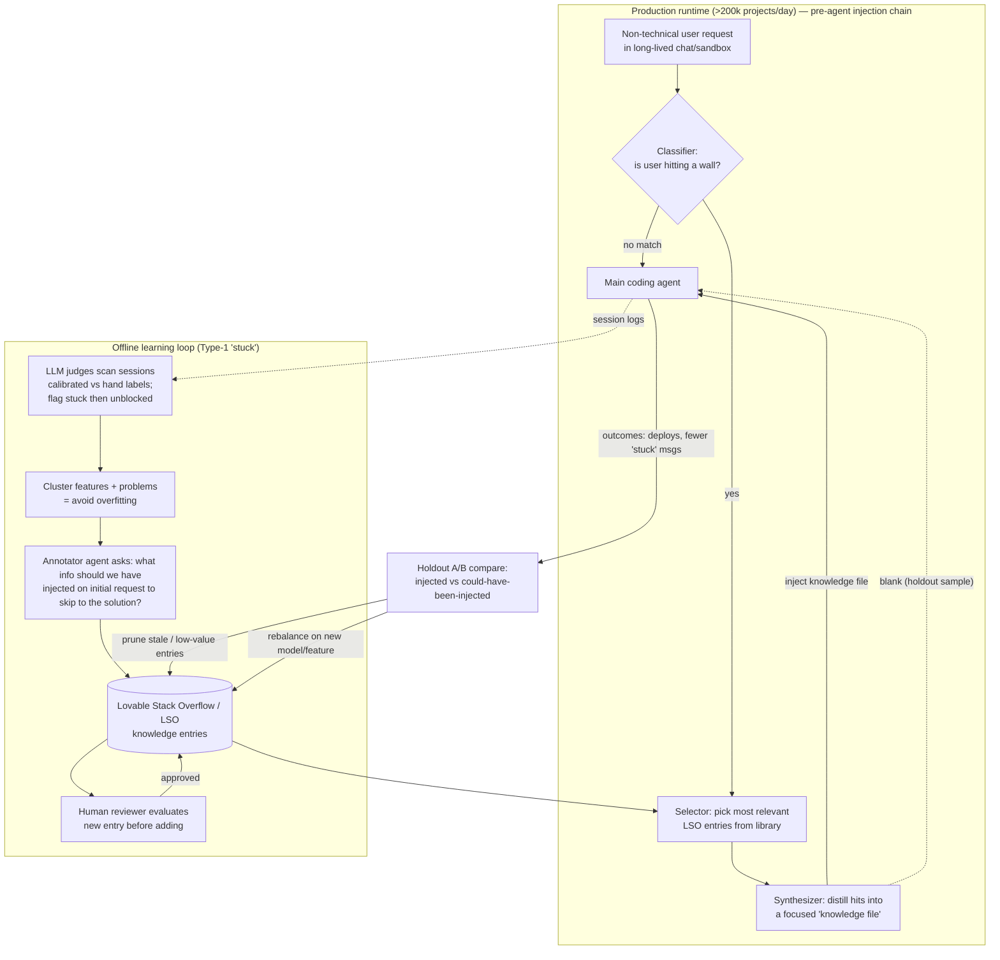
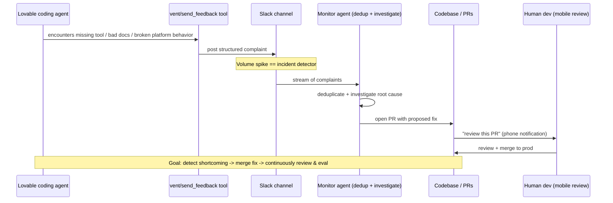

# Findings — YouTube: "How Lovable self-improves every hour" (Benjamin Verbeek, Lovable)

> Source video ID: `KA5kPbdkK2E` · Channel: **AI Engineer** · Length **19:04** · Published **2026-06-02**
> Research status: **transcript obtained** (full prose, via Exa crawl of the YouTube page — no native timestamps; yt-dlp and direct timedtext were blocked by YouTube bot-detection). **Vision NOT feasible** in-sandbox (YouTube served a "Sign in to confirm you're not a bot" wall on two attempts; player would not load → no frame capture). I compensated by recovering the **official Lovable blog post that is the written adaptation of this exact talk** ("This blog post is an adaptation of a talk held at the AI.engineer Europe conference"), which carries the same content plus harder numbers, and by cross-checking an independent deep-dive that described the on-screen slides. All slide descriptions below are sourced, not invented.

---

## 1. Identity

- **Name / title:** "How Lovable self-improves every hour — Benjamin Verbeek, Lovable"
- **What it is:** A ~19-minute conference talk (AI Engineer World's Fair / AI Engineer channel) describing how **Lovable** (the "vibe-coding" app builder) runs **two continuous, machine-assisted self-improvement loops** in production to make its coding agent learn from mistakes "every hour."
- **Speaker:** **Benjamin Verbeek** — Member of Technical Staff at Lovable. Background: satellites, particle physics, fusion reactors (physics background). LinkedIn: https://se.linkedin.com/in/benjamin-verbeek · X/Twitter: https://x.com/benjaminvrbk/
- **Org:** **Lovable** (lovable.dev) — Stockholm-based AI app builder; claims to have "coined the term vibe coding."
- **Date:** Published 2026-06-02 on the AI Engineer YouTube channel (talk likely recorded at an AI Engineer event shortly prior).
- **Primary link:** https://www.youtube.com/watch?v=KA5kPbdkK2E
- **Code repo:** **None.** Closed-source commercial product; no repo, no slides link in the description. (CODE_REPO = none known.)
- **Companion primary text:** **"We Gave Our Agent a Vent Tool," Lovable blog, Benjamin Verbeek, 2026-05-21** — https://lovable.dev/blog/we-gave-our-agent-a-vent-tool — explicitly "an adaptation of a talk held at the AI.engineer Europe conference," i.e. the written version of THIS talk. It is more precise and quantitative than the spoken transcript, so I treat it as primary corroborating evidence throughout.

**Vision note (honest):** Frame capture was **not feasible** — YouTube blocked playback in the sandbox browser with a "Sign in to confirm you're not a bot" wall (confirmed twice via `BrowserObserve` / `BrowserGetContent`; the `<yt-player-error-message-renderer>` showed exactly that text). So I could not screenshot architecture diagrams/demos directly. From the official blog and an independent deep-dive (StartupHub.ai) I can faithfully describe the slides that were shown: (i) a **"technical vs non-technical persona" user-journey** diagram (technical users persevere/loop back to speed; non-technical users hit a wall and leave); (ii) the **two-loop architecture** (Type-1 LSO injection loop; Type-2 vent loop); (iii) a **"vent calls over time"** time-series whose **spikes coincide with platform incidents**; (iv) a screenshot of the **`#agent-vents` Slack channel**; (v) an early **"stuck messages down / deploys up"** metrics chart (speaker called it "very early data").

---

## 2. TL;DR

- Lovable runs **two parallel feedback loops** that continuously improve its production coding agent at scale (grown from "a few thousand users" to **>200,000 projects/day**): (1) a **"stuck-user" learning loop** and (2) a **"vent" loop** where the agent complains about its own tooling/platform.
- **Loop 1 ("Stack Overflow for Lovable"):** An LLM judge scans sessions for users who got **stuck then unblocked**, asks *"what should we have injected at the start of this query to jump straight to the solution?"*, **clusters** similar issues to avoid overfitting, writes a knowledge entry, has an **agent reviewer run a quick eval**, then at runtime a **lightweight model injects** that context into the main agent when relevant.
- **Causal measurement via holdout:** For a small fraction of cases where injection *would* fire, they **inject a blank** instead — creating a control group — and compare downstream project success (deployments, fewer "stuck" messages). This gives **high-signal A/B evidence** that an entry actually helps in production.
- **Staleness management is emphasized as critical:** the knowledge set "gets stale incredibly quickly" whenever a new model or feature ships, so they must **constantly rebalance and discard** entries. (Self-improving memory needs active pruning, not just accumulation.)
- **Loop 2 ("vent" tool):** They gave the agent a tool to **complain directly to Slack (`#agent-vents`)** when tooling/docs/platform block it. First hour: **~20 reports** of a real, log-invisible bug (file copy silently failing on filenames with spaces / non-breaking spaces). A **debug agent** now root-causes vents and **auto-opens PRs**: **~20% of vents are actionable, ~50% auto-PR false-positive rate, ~10 merged fixes/day with no human writing code** (humans only review/merge, often from their phone). **Vent-volume spikes are a reliable — sometimes faster-than-existing — incident detector.**
- **Important caveat:** the loop is **explicitly not closed** — *"every auto-PR still passes through a human; every LSO entry still passes through review."* It's **machine-assisted continual improvement with a human merge gate**, not autonomous self-modification (yet). Stuck users matter because *"users who get stuck early are 4x more likely to leave."*
- **Why it matters for us:** one of the few *production-scale, in-the-wild* self-improving software-agent loops, with a **causal verification gate (calibrated judge + agent/human eval + production holdout A/B)** and **explicit memory-staleness pruning** — directly relevant to our propose→test→keep loop, agent-authored feedback as an improvement-target signal, and long-horizon memory hygiene.

---

## 3. What it does & how it works

Lovable is a "vibe coding" product: a chat interface + live sandbox preview where **non-technical users** ("the 99% who can't code") describe an app and ship it without reading code. Two properties of the product shape the learning system:
1. **Long-lived single-project sessions** — "this chat can go on forever"; a user nurtures one artifact over a long time, so Lovable can "get to know the user in quite detail" (contrast with short throwaway chat sessions).
2. **Non-technical users must never hit a dead end** — *"We can never get stuck to a point where a non-technical user cannot get past it."* The blog gives the business stakes precisely: **"users who get stuck early on in their projects are 4x more likely to leave the platform ... even a single stuck moment can mean losing a user."** Minimizing unrecoverable "stuck" states is THE core objective.

The talk frames the goal as **"continuous learning at scale ... maybe the holy grail of AI engineering right now"**: *"We want to have a mistake happen once and then never again"* — blog phrasing: a vision where **"any issue is experienced only once."**

**The "stuck" taxonomy (3 buckets, from the blog — the transcript collapses these):**
- **Type 1 — solvable with current tools but hard:** a tricky bug needing hard prompting / many iterations, but once the core issue is found the agent *can* resolve it. → handled by Loop 1 (LSO).
- **Type 2a — easy in principle, blocked by tooling/permissions:** e.g. "a config needs to be changed but the agent does not have permissions." Trivial conceptually, impossible with current tools. → handled by Loop 2 (vent → fix the tool/permission).
- **Type 2b — fundamentally unsupported by the stack:** adding it is "a significant lift." → can't auto-fix; vents here are used to **inform the user of limitations** and **prioritize human eng/roadmap**.
- **Detection ("LLM judges"):** external reviewer LLMs flag "not making meaningful progress." Tell-tale signs: *"several messages in a row asking for the same thing, complaints about implementation, or a user giving up on a session they would otherwise not have."* Crucially, **judges are calibrated against a hand-labelled set and re-validated whenever the prompt or model changes** — "agreement with human labels is high enough that the downstream metrics ... are dominated by real signal."

### Loop 1 — The "stuck-user" learning loop ("Stack Overflow for Lovable")

Mechanism, step by step (from narration):

1. **Define & detect "stuck."** *"First of all, we want to define what does it mean to be stuck? We probably want to find those cases and then learn from them."* An **LLM judge** scans sessions and flags *"Hey, I think this user is stuck."* They **split "stuck" into two kinds**:
   - **(a) Solvable with current setup** — the agent *should* have been able to do it → feeds Loop 1.
   - **(b) Not solvable with current setup** (e.g., a real product bug) — *"it should be easy in principle"* but isn't → motivates Loop 2.
2. **Find stuck→unblocked transitions and extract the fix.** *"We basically learn from whenever someone is stuck and has an issue, we try to figure out the solution and give that to the agent."* The key question: **"what should we have injected at the start of this query to jump straight into the solution so the next user does not experience this friction?"**
3. **Cluster to avoid overfitting.** *"We actually do some clustering at this step where we look for similar issues ... so that's not overfitting to the specific issue. We don't want a million Stack Overflow pages that all talk about 'if you get this exact prompt then do this exact thing.' It's not very helpful."* → produces a generalized **"Lovable Stack Overflow knowledge entry."**
4. **Agent-reviewed eval gate.** *"We have an external reviewer, generally an agent and then maybe in some cases a human if we are uncertain, but in most cases it's actually just an agent that generates and runs a quick eval on this and sees if this did resolve the specific examples that we had in the set."*
5. **Runtime injection by a lightweight model — a 3-stage pre-agent chain (blog detail).** *"Whenever a user sends a request, a lightweight model considers if it already has a solution to that specific problem. If yes, it injects it into the context."* The chain that runs **before** the main agent loop is: **(a) a classifier** that looks at the recent conversation to decide if the user is hitting a wall; **(b) a selector** that finds the most relevant entries from the curated library; **(c) a synthesizer** that distills the hits into a focused solution **injected as a knowledge file.** *"If nothing matches, the step is skipped entirely — no overhead."* The knowledge base "holds common config issues, database auth patterns, circular dependencies to avoid, and more."
6. **Holdout / blank-injection causal test.** *"Sometimes it detects that I should inject this, but we inject a blank — so we don't actually send anything for a small sample of use cases ... This allows us to with very high signal review whether this solution was actually useful in production. We compare the group of projects where it was injected and where it could have been injected but wasn't, and we say which of these projects were actually more successful overall."*
7. **Continuous rebalancing / pruning (emphasized as the most important step).** *"This loop is incredibly important ... Because things are moving around this set of knowledge all the time. It gets stale whenever a new model is released. It gets stale whenever we change features. It gets stale incredibly quickly. So very often we have to rebalance this, but we also have to throw away a lot of this context."*
8. **Outcome metrics.** *"The number of messages with [fixing] intent or people being stuck is dropping significantly. And we have a significant number of people that deploy more — this is one of our key metrics."* (He notes the shown data is "very early" and they're "doing quite a lot better now.")

### Loop 2 — The "vent" loop (agent-authored feedback → auto-PRs)

The provocation: *"What if we could let the Lovable agent give direct feedback to its creators? This sounds very scary ... like an absolute insane idea."* They gave the agent a **`vent` / send-feedback tool**.

- **Tool description (verbatim, quoted in talk):** *"It's a vent / send feedback tool. You should use this when tooling, docs or platform behavior [is poor] so it degrades your work. For example: missing or unsuitable tools, unclear tool names, parameters or schemas that are not matching what you were expecting, confusing or conflicting docs or instructions, broken or unexpected platform behavior, repeated failed attempts caused by environment limitations."* — i.e. "a list of all the things we think it should be able to solve and that we hope is not an issue, but if it is, please tell us."
- **Routing:** *"It actually gets sent directly to our Slack."*
- **First win = a real, log-invisible bug:** within the first hour, **~20 complaints** that the **copy tool silently failed on filenames with spaces**. The tool "worked fine" on inspection; the agent had caught a bug that "never surfaced in logs." Fix attempt: replace spaces with underscores — *but reports kept coming*, because screenshots from WhatsApp/Mac inject a **non-breaking space**; it kept surfacing other special-character cases "until we did solve it properly. And now this issue never happens again."
- **Hard numbers (from the blog, more precise than the talk):** *"approximately 20% of [vent] messages warranted a mergeable PR — meaning the debug agent could trace the vent to a clear root cause, either by reading the codebase, by analyzing the vent's full trajectory, or by using other debugging tools."* A **debug agent** monitors `#agent-vents`; if a vent is actionable it **opens an auto-PR**, otherwise it **tags the vent for cluster analysis**. The auto-PRs are imperfect — *"false-positive rate hovers around 50% ... but they're cheap to triage, so we cherry-pick the obvious wins."* **Net result: "roughly 10 merged fixes a day, with no human writing any of the code — just reviewing and merging."**
- **On-task safety check:** a worry was that the tool would hurt **cost / latency / quality**. *"The tool ended up being used sparingly by the agent ... We still ran a test and noticed no impact on cost, latency, or quality. Manual study of a few examples showed that the agent generally tended to explain its limitations better, and was less likely to get stuck in a long loop of futile re-attempts."* (So the vent tool may *improve* behavior, not just observe it.)
- **Dev-feature feedback split:** the agent often vented about recently-added / in-development features, so *"we route development vents to a separate channel,"* which became useful for testing new features.
- **Emergent use = incident detection:** *"the agent doesn't always feel great when the platform goes down: it was reporting incidents! In some cases it did so before our other automated systems triggered an alert ... it often provided useful early insight into the root cause."* → **vent-volume spike = incident signal**, sometimes *faster* than existing alerting, reducing incident-resolution time. (Talk version: "the agent is very upset ... it was complaining about the right things.")
- **A self-referential auto-fix:** the agent vented about being able to spam vents; *"that vent led to a merged auto-PR limiting the agent to one vent per message."* (The loop fixed its own feedback channel.)
- **Closing the loop (now / future):** devs still review/merge — *"I just get review requests on my phone ... review this PR that was completely automated. I look through it quickly and we can merge it."* Blog: *"the loop isn't closed yet. Every auto-PR still passes through a human; every LSO entry still passes through review. To close it, we need to do even more: **automated evals gating merges, progressive rollouts with confidence intervals, reports the agent itself can trust.**"* He ends recruiting people to *"fully automate continual improvements."*

---

## 4. Evidence from the code

**There is no source code, repo, or published slides.** Lovable is closed-source. Evidence = the talk's spoken narration + the **official companion blog post** (the written adaptation of this talk) + on-screen slides described by secondary coverage. The load-bearing verbatim artifacts:

1. **The `vent` / `send_feedback` tool description** (the closest thing to an exposed prompt) — talk version verbatim:
   > *"It's a vent / send feedback tool. You should use this when tooling, docs or platform behavior [is poor] so it degrades your work. For example: missing or unsuitable tools, unclear tool names, parameters or schemas that are not matching what you were expecting, confusing or conflicting docs or instructions, broken or unexpected platform behavior, repeated failed attempts caused by environment limitations."*

   This is the single most reusable concrete artifact: a tool whose *purpose* is to let the agent emit free-text structured signal about its own environment's deficiencies, routed to Slack `#agent-vents`. Constraint added later (itself via auto-PR): **one vent per message.**
2. **The Loop-1 lesson-distillation prompt** — blog version verbatim (annotator agent):
   > *"What information should we have injected on initial request to skip straight to the solution?"*
   (Talk phrasing: *"what should we have injected at the start of this query to jump straight into the solution so the next user does not experience this friction?"*)
3. **LSO runtime chain (data/agent structure):** pre-agent pipeline = **classifier → selector → synthesizer → inject as "knowledge file"**; skipped entirely on no match. KB entry contents: "common config issues, database auth patterns, circular dependencies to avoid, and more."
4. **The holdout mechanism:** for a small sample of eligible cases, **inject a blank** instead of the entry → A/B compare downstream project success (deploys, fewer stuck-messages) of *injected* vs *could-have-been-injected*.
5. **Debug-agent pipeline (Loop 2):** monitor `#agent-vents` → if actionable, root-cause (read codebase / analyze vent trajectory / debugging tools) and **open auto-PR**; else **tag for cluster analysis**. Measured rates: ~20% of vents → mergeable PR; ~50% auto-PR false-positive; ~10 merged fixes/day, zero human-written code.

No actual source, prompts beyond the above, or eval/holdout statistics are published; on-screen charts are described (not screenshotted — vision blocked, see §1).

---

## 5. What's genuinely smart

1. **Agent-authored feedback as a first-class telemetry stream ("vent").** Most observability watches *outputs/logs*; logs missed the file-copy bug entirely. Letting the **agent itself** report "my tools/docs/environment are blocking me" surfaces a class of failures (silent failures, schema mismatches, confusing docs) that are otherwise invisible. The fact that the *first hour* yielded a genuine production bug — and that vent volume doubles as an **incident detector** — is strong evidence the signal is real, not noise.
2. **Lesson distillation framed as prompt-injection, not fine-tuning.** Instead of retraining, they ask "what context, injected at the start, would have avoided this?" and store it as a retrievable entry. This is cheap, fast ("every hour"), reversible, and inspectable — well suited to a world where the base model changes underneath you.
3. **Clustering to fight overfitting of memory.** Explicitly refusing to store one entry per incident ("a million Stack Overflow pages") — generalizing across similar stuck-cases — is a real memory-quality discipline most "agent memory" systems lack.
4. **A verifiable promotion gate.** An entry isn't trusted because an LLM wrote it; an **agent reviewer generates and runs a quick eval** against the originating examples, and only then does it enter the pool. This is a (lightweight) analogue of "keep only if verifiably better."
5. **Causal, in-production verification via holdout/blank injection.** This is the standout idea: they deliberately *withhold* the help for a sample of eligible cases to measure true lift on real outcomes (deploys, fewer stuck-messages). It converts "we think this prompt helps" into measured causal evidence — and it's how they decide what to keep vs. prune.
6. **Memory hygiene / staleness as a first-class concern.** The most-emphasized point in the whole talk: knowledge "gets stale incredibly quickly" on every model/feature change, so they aggressively **rebalance and discard**. For any self-improving system, this is the often-ignored failure mode (accumulating stale lessons that later *hurt*).

---

## 6. Claims vs. reality / limitations / critiques

- **Claim vs. evidence:** Everything is the company's own framing (conference talk + company blog); **no code, no shared dashboards, no third-party reproduction.** The "stuck-messages down / deploys up" chart is self-reported and explicitly "very early data." The metric-credibility argument rests on judge–human label agreement being "high enough" — a number they assert but don't publish.
- **"Self-improves every hour" is partly aspirational — the loop is explicitly NOT closed.** Blog, verbatim: *"the loop isn't closed yet. Every auto-PR still passes through a human; every LSO entry still passes through review."* So today it is **human-in-the-loop continual improvement**, not autonomous self-modification. The honest framing is "machine-assisted improvement at scale with a human merge gate," and they name the missing pieces (automated eval gates, progressive rollout w/ confidence intervals, self-trustable reports).
- **The auto-fix quality is genuinely noisy:** **~50% false-positive rate on auto-PRs**, and only **~20% of vents** are even actionable. It works because triage is cheap and humans cherry-pick — not because the agent reliably writes correct fixes. A fully-closed loop would have to solve exactly this reliability gap.
- **Reward-hacking / gaming surface (not addressed):** An agent whose vents draw eng attention could over-report (they *did* have to cap it to one vent/message — a real instance of runaway feedback, fixed reactively). An injection memory optimized on "downstream success" (deploys) could overfit to a **proxy metric** rather than genuine user value; the holdout measures lift on that same proxy. No discussion of adversarial dynamics, vent-spam beyond the cap, or what happens when an injected LSO entry is *wrong* (false-positive injection harming a session) — the holdout detects *average* lift, not per-case harm.
- **Generality caveat:** leans hard on Lovable-specific structure — **long-lived single-project sessions** + a **bounded non-technical task distribution** — which make "stuck/unblocked" easy to detect, cluster, and judge. Less directly applicable where tasks are short, diverse, or expert-driven (though the *mechanisms* transfer).
- **Staleness is a real, admitted failure mode**, not just a feature: entries "get stale incredibly quickly" and must be discarded on every model/feature change — implying that without constant pruning the memory would actively degrade performance.

---

## 7. Relevance to a self-improving, evolutionary, software-building agent

Highly relevant — this is a rare **production** datapoint for our core loop. Specific transferable mechanisms:

- **Propose→test→keep, instantiated as memory:** their pipeline (distill lesson → eval gate → holdout A/B → keep/prune) is exactly a propose-test-keep loop applied to *agent memory/context* rather than code. The **holdout/blank-injection** trick is a clean way to get *verifiable* "is this actually better?" signal in the wild, not just on a fixed benchmark.
- **Agent-authored feedback as an improvement signal:** a "vent"-style tool gives our seed AI a channel to flag its own scaffold/tool/env deficiencies — a source of *self-improvement targets* that pure output-evals miss. Doubling as an **incident/regression detector** is a bonus for long-horizon reliability.
- **Memory staleness / pruning discipline:** the explicit "throw away a lot of this context whenever the model changes" is a direct lesson for any long-running self-improving agent that accumulates lessons — accumulation without pruning degrades.
- **Clustering to generalize lessons** instead of storing per-incident hacks — relevant to how our agent should consolidate what it learns.
- **Two-tier model topology** (cheap injector/router + main agent; cheap monitor/dedup agent + main coding agent) — a practical orchestration pattern for running such loops affordably at scale.

---

## 8. Reusable assets

_(verbatim collected; not assembled into a design)_

- **`vent` / `send_feedback` tool description (verbatim):** see §4 item 1. Template for an "environment-deficiency feedback" tool given to a coding agent. Note the **one-emit-per-message** rate-cap and the **route-development-feedback-to-a-separate-channel** refinement.
- **Lesson-distillation prompt (verbatim, blog):** *"What information should we have injected on initial request to skip straight to the solution?"* — run by an "annotator agent" over a detected stuck→resolved transition.
- **LSO runtime injection chain (architecture pattern):** **classifier** (is the user hitting a wall?) → **selector** (top-k from curated library) → **synthesizer** (distill to a focused knowledge file) → inject into the main agent's context; **skip entirely on no-match (zero overhead).**
- **Cluster-before-store discipline:** cluster features+problems and store a *generalized* entry, explicitly to avoid "a million Stack Overflow pages" overfit to exact prompts.
- **Holdout / blank-injection causal eval (the standout pattern):** for a small random sample of cases where a stored lesson *would* fire, inject **nothing**; compare downstream success (deploys, fewer stuck-messages) of *injected* vs *could-have-been-injected* populations to measure **causal lift in production**; prune entries that don't show lift; rebalance on every model/feature change.
- **Calibrated LLM-judge gate:** detect "stuck" via judge LLMs **calibrated against a hand-labelled set** and **re-validated whenever the prompt or model changes** (so downstream metrics stay "dominated by real signal").
- **Reviewer eval gate before admission:** a separate reviewer (agent, or human if uncertain) evaluates a new entry before it enters the KB.
- **Debug-agent → auto-PR pipeline (Loop 2):** monitor feedback channel → root-cause via (read codebase / analyze full agent trajectory / debugging tools) → open auto-PR if actionable, else tag for cluster analysis. Operating point to expect: ~20% actionable, ~50% auto-PR FP, ~10 merges/day with human review only.
- **Incident detector from feedback volume:** alert on spikes in agent-vent volume as a platform-incident signal (sometimes earlier than existing alerting, with root-cause hints).
- **Named "to-close-the-loop" checklist (their own roadmap, reusable as our acceptance criteria):** *automated evals gating merges · progressive rollouts with confidence intervals · reports the agent itself can trust.*

---

## 9. Signal assessment

- **Overall signal: MEDIUM–HIGH.** No source code and self-reported results cap it below "high," but the **ideas are concrete, production-validated at real scale (>200k projects/day), and map almost 1:1 onto our propose→test→keep + memory-hygiene concerns.** Two mechanisms are genuinely valuable and reusable: (1) the **holdout / blank-injection causal eval** for verifying that a stored "lesson" actually helps in production (a clean answer to "keep only if verifiably better" for *memory/context*, not just code), and (2) the **agent-authored "vent" feedback channel** as a self-improvement-target generator + incident detector. The **calibrated-judge** and **cluster-before-store** disciplines, and the explicit **staleness-pruning** insight, are also high-value.
- **Confidence:** High on *what they describe and how the loops are structured* — two independent primary artifacts agree (the talk transcript and the official blog adaptation), plus an independent deep-dive. Low on *quantitative impact* (only "very early," self-reported charts; the headline ~20% / ~50% / ~10-merges-a-day figures are theirs, unaudited).
- **Could NOT verify (honest):** (a) **vision** — no frame capture possible (YouTube bot-wall in sandbox); slide content is sourced from the blog + secondary write-up, not seen directly; (b) any **source code or full prompts** beyond the quoted tool description / distillation question; (c) the **real eval/holdout statistics**, judge–human agreement number, or injection false-positive (harm) rate; (d) precise **timestamps** (transcript came as continuous prose); (e) how metric-gaming/over-venting is prevented beyond the one-vent-per-message cap and dedup.

---

## 10. References

- **[PRIMARY — the video]** "How Lovable self-improves every hour — Benjamin Verbeek, Lovable," AI Engineer channel, 19:04, published 2026-06-02. https://www.youtube.com/watch?v=KA5kPbdkK2E — full transcript + description obtained via Exa crawl of this page (yt-dlp/timedtext blocked; playback bot-walled → no vision).
- **[PRIMARY — written adaptation of this talk]** Benjamin Verbeek, "We Gave Our Agent a Vent Tool," Lovable blog, 2026-05-21. https://lovable.dev/blog/we-gave-our-agent-a-vent-tool — states it "is an adaptation of a talk held at the AI.engineer Europe conference"; source of the 3-way stuck taxonomy, the LSO classifier→selector→synthesizer chain, the 4x-churn / 20% / 50% / ~10-merges-a-day numbers, and the "loop isn't closed yet" roadmap. (Thai mirror: https://lovable.dev/th/blog/we-gave-our-agent-a-vent-tool)
- **[PRIMARY — speaker]** Benjamin Verbeek — LinkedIn https://se.linkedin.com/in/benjamin-verbeek · X https://x.com/benjaminvrbk/
- **[SECONDARY]** "Lovable's AI Self-Improvement: A Deep Dive," StartupHub.ai, 2026-06-02. https://www.startuphub.ai/ai-news/artificial-intelligence/2026/lovable-s-ai-self-improvement-a-deep-dive — independent write-up; corroborates on-screen slides (technical-vs-non-technical persona journey; vent-calls-over-time with incident-correlated spikes).
- **[SECONDARY]** "Lovable's Agent Now Vents About Its Own Bugs and Files Incident Reports," CreateWith, 2026-05-21. https://www.createwith.com/tool/loveable/updates/lovables-agent-now-vents-about-its-own-bugs-and-files-incident-reports
- **[SECONDARY]** "Lovable's AI Agent Caught 20 Hidden Failures...," BigGo Finance, 2026-06-02. https://finance.biggo.com/news/f155fc223e768032
- **[CONTEXT]** Lovable product — https://lovable.dev ("vibe coding," non-technical users, >200k projects/day).

