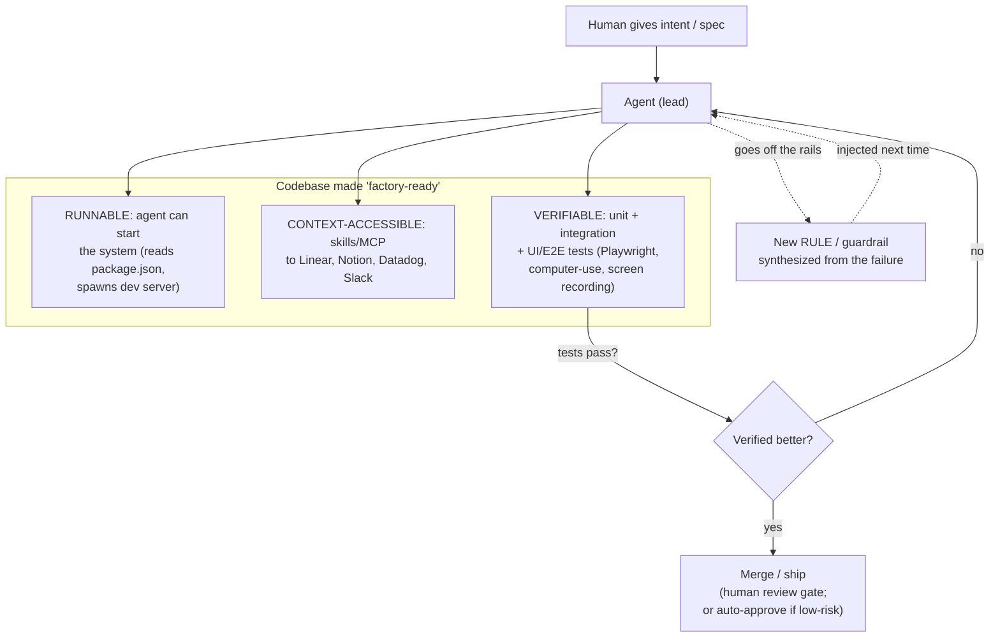
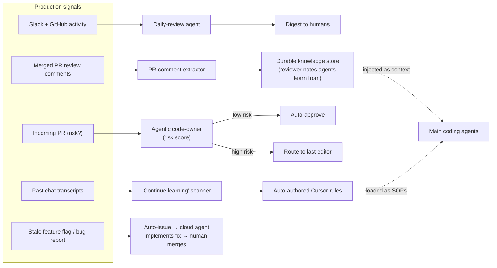
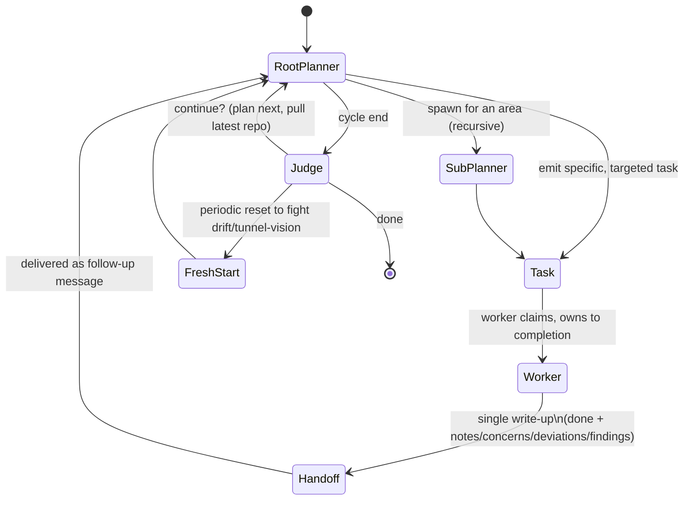

# Findings — YouTube: "Building your own software factory" (Eric Zakariasson, Cursor)

> Source video ID: `rnDm57Py54A` · Channel: **AI Engineer** · Length **01:23:36** (83 min) · Published **2026-04-28** · Views ~25.8K · A workshop recorded at **AI Engineer World's Fair / AIE Europe 2026** (Day 1, St. James track).
>
> **Research status:** **Transcript: PARTIAL-but-substantial.** The native YouTube transcript and yt-dlp were both **IP-blocked** in the sandbox ("Sign in to confirm you're not a bot"). I recovered (a) the **full video description + chapter list** and (b) a **large portion of the spoken transcript** via Exa livecrawl of the YouTube page, and (c) **two independent timestamped deep-dives that transcribe/summarize the same talk** (TalksIntel.ai and a ZenML LLMOps-database writeup) which fill in the parts Exa truncated, especially the Q&A and the four production automations. I quote the spoken words where I have them verbatim and clearly mark where I am relying on a secondary summary.
>
> **Vision status:** see the explicit note at the end of §1. (Filled in after browser attempt.)

---

## 1. Identity

- **Name / title:** "Building your own software factory — Eric Zakariasson, Cursor"
- **What it is:** An ~83-minute conference **workshop** (talk + live demos + long Q&A) on the **AI Engineer** YouTube channel. Thesis: how to go **from pair-programming with one agent to running many agents as a "software factory"** — the infrastructure, guardrails, the manager mindset, and the scheduled automations/feedback loops that "keep the factory improving without manual intervention."
- **Speaker:** **Eric Zakariasson** — engineer at **Cursor** (Anysphere), working on **developer experience and product**. X/Twitter: https://x.com/ericzakariasson · LinkedIn: https://www.linkedin.com/in/ericzakariasson/ · GitHub: https://github.com/ericzakariasson
- **Org:** **Cursor** (Anysphere) — the AI code editor / agentic coding harness.
- **Date:** Published **2026-04-28** on the AI Engineer channel (recorded at the AIE Europe 2026 conference shortly prior).
- **Primary link:** https://www.youtube.com/watch?v=rnDm57Py54A
- **Code repo:** **None released.** This is a workshop with live demos of an internal "music creation tool" toy project and of Cursor's own internal automations; no repo, slides, or gist is linked in the description. (CODE_REPO = none known.) The speaker's GitHub (above) was checked as a seed — see §10.
- **Companion / corroborating texts (secondary, but timestamped):**
  - **TalksIntel.ai deep-dive** of this exact talk — https://talksintel.ai/ai-ml/conferences/aie-eu-2026/building-your-own-software-factory/ — gives section timestamps and a precise account of the four automations + Q&A.
  - **ZenML LLMOps Database entry** — https://www.zenml.io/llmops-database/building-a-software-factory-with-ai-agents-at-scale — independent structured writeup.
  - **AI Red Team index page** — https://www.ai-redteam.com/insights/building-your-own-software-factory-eric-zakariasson-cursor/ (thin; just the description).
  - **Cursor's own blog** on the same themes (long-running agents, scaling agents, self-driving codebases) — see §10. These are by Cursor the company, contemporaneous with the talk.

**Vision note (honest):** **Frame capture was NOT feasible.** YouTube served the "Sign in to confirm you're not a bot" wall in the sandbox browser — confirmed via `BrowserObserve`, which returned the `<yt-player-error-message-renderer>` "sign in to confirm you're not a bot" element and a sign-in-wall link. The player would not load, so I could not screenshot the live demos or slides. This is a **demo-heavy** workshop, so the loss is real. I compensate by sourcing the on-screen content from the TalksIntel deep-dive, which timestamps and describes the key demo moments precisely: the **music-agent dev-server demo (~13:10)** where the agent reads `package.json` and starts the server unprompted; the **agent self-testing video (~16:50)** where a cloud agent on an isolated VM drives a browser and returns a screen recording as proof; the **Cursor 3 agent-first interface** walkthrough (~10:47); and the **cloud-agents / dedicated-VM** segment (~15:26). All on-screen descriptions below are sourced, not invented.

---

## 2. TL;DR

- **What it is:** a practitioner workshop from inside **Cursor** on how to industrialize agentic coding — moving from "one agent pair-programming" to a **"software factory"** of many agents you *manage*. It is **engineering-of-the-harness** advice, not a paper and not a released system. Framed on **Dan Shapiro's 6-level autonomy ladder** ("spicy autocomplete" → "dark factory"); Cursor self-rates **between L3 and L4**, with sub-parts of the company "fairly autonomous" but the full factory **not yet reached**.
- **The load-bearing recipe (three primitives):** make the codebase **(1) Runnable** (an agent can start everything it needs), **(2) Context-accessible** (agent can reach Linear/Notion/Datadog/Slack to get intent), and **(3) Verifiable** (agent can run unit/integration/**UI** tests to *check its own work*). Verifiability is repeatedly called the **most important and most under-invested** pillar.
- **Guardrails should EMERGE from observed failures, not be pre-installed.** Cursor's strongest stated lesson: don't bulk-install rules from a directory; **when an agent goes off the rails, that event signals the need for a new rule.** Rules act as SOPs; as models get better at instruction-following, they fire less. This is an **error-driven, self-curating control layer** — the closest thing in the talk to a "self-improvement" mechanism.
- **Continual learning loops (the four scheduled automations):** (1) **daily-review** agent digests Slack+GitHub; (2) **merged-PR-comments** agent scans every merged PR, extracts high-signal reviewer notes, and **stores them as durable knowledge agents can learn from**; (3) **agentic code-owner** scores PR risk → auto-approves low-risk, routes high-risk to the last editor; (4) **"continue learning"** scans past **chat transcripts** and turns **repeated correction patterns into Cursor rules automatically.** All four share one logic: *find a repetitive human-in-the-loop step and replace it with a system.*
- **Manager mindset + frontloading:** worker→manager shift; **sync→async**; **frontload context** (full spec up front) rather than interrupting mid-task; never put two agents on the same file (merge-conflict throughput killer); organizations of agents recurse like human orgs (managers of managers).
- **Companion Cursor research (primary-company, same author/themes) is the harder evidence:** Cursor's **planner → worker → judge** multi-agent harness ran **~1,000 commits/hour across ~10M tool calls for one week** building a web browser (>1M LOC, 1,000 files), **no human intervention once started**. Key reported truths: **flat self-coordination via a shared lock file failed** (lock contention, risk-aversion, churn); **roles + a judge that decides "continue?" + periodic fresh starts to fight drift** is what worked; **"the prompts matter more"** than the harness; **model choice is role-specific** (GPT-5.2 better planner; Opus 4.5 "stops earlier and takes shortcuts"); design for **anti-fragility** and **throughput over per-step correctness** (accept a small error rate + a final reconciliation pass).
- **Why it matters for us:** This is a **production-grade, dogfooded** account of the exact loop we care about (propose → verify → keep) and of **harness-only self-improvement** (rules/skills/memory/orchestration, never weights). The most directly transplantable ideas: **error-driven rule synthesis**, **transcript/PR-mining into durable memory**, the **runnable/context/verifiable checklist as a gate**, the **judge-decides-continue control loop with fresh-start anti-drift**, and the empirical warnings (flat coordination fails; throughput needs a reconciliation pass; prompts > harness).
- **Why it's only partly relevant:** much of the talk is **org-process and product roadmap** (Cursor 3 UI, Linear/Slack plumbing), and the "factory" is **explicitly not autonomous** — humans still gate merges and the verifier is conventional CI/E2E tests, not a novel evaluator. There is **no open candidate/experiment data structure, no selection algorithm, no fitness function** beyond "tests pass + human review."

---

## 3. What it does & how it works

This is a **conceptual + demo** talk, so "how it works" means (a) the **mental model** Cursor uses to industrialize agents, and (b) the **concrete mechanisms** they have actually shipped internally. I separate the two and corroborate the mechanisms with Cursor's own engineering blogs (same author, same period).

### 3.1 The autonomy ladder (the talk's spine)

Eric frames everything on **Dan Shapiro's six-rung ladder** ("The Five Levels: from Spicy Autocomplete to the Dark Factory," 2026-01-23 — zero-indexed, so six rungs), modeled on NHTSA driving levels. Paraphrased from Shapiro + the talk:

| Level | Human role | Unit of work |
|---|---|---|
| 0 — Spicy autocomplete | author every keystroke | lines |
| 1 — Coding intern | delegate boilerplate, review all | functions/snippets |
| 2 — Junior dev (pair) | reviewer of every diff | multi-file change |
| 3 — Developer | concurrent reviewer of many agents | whole feature |
| 4 — Engineering team | **spec author + harness designer**, reviews plans/tests not code | spec + test suite |
| 5 — Dark factory | designs the factory, **never reads code**; tests are the contract | goal in English |

Cursor self-locates **between L3 and L4**: "sub-parts of the product and sub-parts of the company are running fairly autonomously," but "building a software factory takes a lot of work." The key insight echoed by the independent **env.dev** synthesis: the **L3→L4 jump is not a model upgrade, it's harness engineering** (hooks, evaluators, sandboxes, durable memory). That is exactly the territory of a self-improving harness.

**Three motivations** Cursor gives for a factory (per ZenML writeup): **throughput** (agents don't sleep), **consistency** (assembly-line repeatability — *if* guardrailed against being "too probabilistic"), and **leveraging human taste/creativity** (humans do high-level decisions, agents execute).

### 3.2 The three primitives that make a codebase "factory-ready"

This is the practical heart of the workshop. To let agents work autonomously, the **codebase/environment** must satisfy a checklist (Eric's own framing, per ZenML + TalksIntel):

1. **Runnable** — "Is the system runnable? Can agents start everything they need?" Demo (~13:10): the music-app agent **read `package.json` and started the dev server without being told**. Structure matters: **modular, co-located code** so an agent can `ls` a folder and find everything without grepping the whole repo.
2. **Context-accessible** — "Can agents interface with Linear, Notion, Datadog, Slack… to understand broader intent and requirements?" Enabled via **skills and MCPs**. The manager's job includes **automating the human-in-the-loop data-shuttling** moments (copy Datadog logs into the repo for analysis; pull Twitter feedback into internal systems; export Notion specs to markdown).
3. **Verifiable** — *the most emphasized and most under-invested pillar.* "Agents must verify their own work." Backend: unit + integration tests against clear contracts (easy). **Web/UI: hard** — needs real DOM interaction, reproducing end-user behavior "including details like loading spinners on buttons." Demo (~16:50): a **cloud agent on an isolated VM drove a browser (Playwright / computer-use) and returned a screen recording as proof** of its own change.

### 3.3 Guardrails & rules — the error-driven control layer

Two kinds of boundary:
- **Guardrails (hard):** **hooks** that *prevent* agents from touching sensitive code — encryption, **authentication, payments** — "areas where mistakes would be costly."
- **Rules (soft, SOP-like):** the more interesting lesson. Cursor shipped **"Cursor rules"**; a community **Cursor Directory** sprang up collecting rules per tech stack. Users assumed they should **install every applicable rule** — Cursor found that's **wrong**. Rules should **emerge dynamically from observed agent behavior**: *"When agents go off the rails, that signals a need for a new rule."* Examples of off-track events that should each mint a rule: agent **creates DB schemas ignoring naming conventions** → add a rule; agent **produces ugly UI** → it lacks design-system awareness → add context/rule. As models improve at instruction-following, agents "rarely deviate anymore."

This is the closest thing in the talk to **self-improvement**: a **flywheel** where *each failure mode becomes an artifact that hardens the factory.* It is **harness-only** (rules/context/skills), never weight updates.

### 3.4 The four scheduled automations (the continual-learning loops)

Eric runs four production automations at Cursor; **all follow the same template: find a repetitive human step and build a system to replace it** (sourced from TalksIntel + ZenML, timestamps ~25:05 "Scaling with Automations and Feedback Loops"):

1. **Daily review** — an agent reads **Slack + GitHub** and sends a **digest**.
2. **Merged-PR-comment extraction** — an agent scans **every merged PR**, extracts **high-signal reviewer notes**, and **stores them so agents can learn from human feedback.** (Human review comments → durable agent-readable knowledge.)
3. **Agentic code-owner** — a bot **scores incoming PR risk**, **auto-approves low-risk** changes, and **routes high-risk** ones to the engineers who **last touched that code**.
4. **"Continue learning"** — scans **previous chat transcripts** and **turns repeated correction patterns into Cursor rules automatically.** (Transcript mining → auto-authored rules. The mechanized version of §3.3.)

A concrete worked example of automation eliminating a human loop (from the talk's Linear/Slack segment ~1:10:06): a **stale feature flag** (rolled out at 100% for two weeks) → system signals it's safe to remove → **auto-creates a Linear issue** → Linear is wired to Cursor → **spawns a cloud agent that removes the flag** → human just clicks merge. Similarly, a Slack message → triaged by a Slack/Cursor agent → dedup-checked → if "easy," an agent **starts implementing a fix immediately.**

### 3.5 Running & scaling — the manager mindset

- **Worker → manager:** "you're going to look way less at code… from worker to manager." Engineers oversee fleets rather than type.
- **Sync → async:** most work runs in the background; you "tap in" to inspect, but as fleets grow, per-agent inspection becomes impractical → you **aggregate status upward** (a "project view" of what everyone's doing + "here's what you need to review").
- **Recursion like human orgs:** small team → add people → add a manager → manager of managers; "the same pattern applies to agents… you keep going up the levels of abstraction." Cursor 3's UI is being built around **nested agent orchestration** ("open this one up and you'll have 10 agents in here").
- **Frontload context, don't interrupt:** "write a full spec, send the agent, let it finish." Interrupting mid-task is worse than a good up-front spec. Over time you **learn each model's strengths/weaknesses** and **align** your prompting to it.
- **Throughput constraint:** **never assign two agents to the same file** (merge conflicts kill the parallelism gain).
- **Set the factory spec in-repo:** keep a **folder of markdown/rules** describing how things should work, plus a **"council" to decide what goes into the factory** and what's missing. "As long as it's something the agent can read — which is files."

### 3.6 The actual multi-agent harness (from Cursor's companion research)

The talk gestures at orchestration; **Cursor's own blogs document the real system**, by the same author ("started as a personal side project of mine") — this is the most mechanism-level evidence and the most relevant to a self-improving builder. Architecture that *worked* after flat coordination *failed*:

- **Root planner** — owns the **entire scope** of the user's instructions; understands current state; emits **specific, targeted tasks**; **does no coding**; is **unaware of who picks tasks up**. Can **spawn sub-planners** for sub-areas (planning is itself **parallel and recursive**).
- **Workers** — pick up tasks, **solely responsible** for driving them to done; **unaware of the larger system**; **don't talk to other workers/planners**; work on **their own copy of the repo**; on completion write a **single handoff** (what was done + "important notes, concerns, deviations, findings, thoughts, and feedback").
- **Judge** — runs **after the executor/cycle** to decide **whether the work is complete and whether another iteration should run**. "For continued movement and accountability."
- **Handoff-as-message + continuous motion:** the planner receives each handoff as a follow-up message; "even if a planner is 'done,' it continues to receive updates, pulls in the latest repo, and can continue to plan." Information **propagates up the chain to owners with increasingly global views, without global synchronization or cross-talk.**
- **Fresh starts to fight drift:** "at the end of each cycle… the next iteration would start fresh," and "we still need periodic fresh starts to combat drift and tunnel vision."

Reported scale/behavior (Cursor blog): **~1,000 commits/hour peak, ~10M tool calls, one continuous week, >1M LOC across 1,000 files (a web browser), zero intervention once started.** Other runs: **Solid→React in-place migration of Cursor's own codebase (~3 weeks, +266K/−193K, passing CI), 25× faster video rendering via a Rust rewrite.** Design principles stated: **anti-fragility** (tolerate individual agent failure), **design explicitly for throughput** (accept a small stable error rate + a **final reconciliation pass** rather than insist on 100% correct code), **one big VM per run** (avoid distributed-systems complexity), **heavy observability** (log all messages/actions/outputs with timestamps; replay sessions; pipe logs back into Cursor to find patterns), and the headline: **"the prompts matter more"** than harness/models, and **use the model best-suited per role** (GPT-5.2 a better planner than the coding-specialized GPT-5.1-Codex; **Opus 4.5 "tends to stop earlier and take shortcuts when convenient"**).

---

## 4. Evidence from the "code" (talk + companion engineering blogs)

**There is no released repo for the talk.** So "evidence" here is (A) **verbatim spoken transcript** where I captured it, (B) **timestamped descriptions of the live demos**, and (C) **verbatim excerpts from Cursor's own engineering blogs**, which are the same author's documented system and the closest thing to ground-truth mechanism. I flag each source.

### 4.1 Verbatim from the talk (Exa livecrawl of the YouTube transcript)

On verification via self-testing (E2E with Playwright), the toy "music creation tool" demo:
> "what I wanted to accomplish with this project is essentially like building a factory around this idea of building like a online music … creation tool. … I forced myself never to write any code myself … and just try to figure out what is the systems and the structures I need around this. … immediately it became pretty clear that we need a way to start the project … a way for the agent to verify its own work. So the agent created this end-to-end tests using a Playwright so it can just spawn browsers, go to root etc, click around and get my test ID … making sure for every different change I make, for example, the play button still works or I can add notes to this project here, without anything breaking." — *(YouTube transcript, ~10–13 min)*

On cloud agents + dedicated VM + computer-use self-testing returning a video:
> "we launched updated cloud agents … where we gave each agent their separate VM and you can have them create this very reproducible environment in the cloud and this essentially allows you to scale like infinitely. … we also gave the agent a tool to test its own work by controlling the computer. … what we got back here is just a video of the agent actually testing its own work." — *(YouTube transcript, ~15–17 min)*

On the worker→manager / sync→async shift and frontloading:
> "you are going to look way less at code. So you are going to go from worker to manager … this also means going from sync to async because most of the work is going to happen in the background … the more agents you spawn over time, the harder time you're going to have to understand what's going on in each of them. So then you need a way to aggregate these changes upwards … it's the same as in human organization … you need a manager to oversee things and then you add more managers and then you need a manager of the manager." — *(YouTube transcript, ~30 min)*

> "when you're going from sync to async, you are going to need to trust the agents a lot more … you need to get more context up front. So you frontload the context to the agents either through a plan or a long spec and then you send them off … once you start doing this regularly, you're going to start to feel the agents … see these are the weaknesses, these are the strengths … create this alignment with the models … as the models keep getting better, you have to give them shorter or less and less prompts … but you still got to provide the intent." — *(YouTube transcript, ~30–31 min)*

On finding flywheels and codifying them:
> "build tools and systems, try to find these flywheels and codify them and get them in your systems and let the agent have access to them." — *(YouTube transcript)*

On the factory spec living in the repo + a "council":
> "to set the spec for the factory, I would probably have a folder in your codebase where you outline how certain things should work … maybe that's just markdown files … maybe it's rules … and establishing some kind of council to decide what goes into the factory and what doesn't and what are we lacking to improve the factory. As long as it's something that the agent can understand and read, which is files." — *(YouTube transcript, ~31 min)*

On the Linear/Slack automation (stale flag → auto-issue → cloud agent → human merge):
> "for every ticket that's getting created in Linear we spawn a cloud agent … if we have a feature flag … rolled out for two weeks with 100% … the system signals us hey it's a stale feature flag, you can remove it. So then we create an automatic issue in Linear and since that is hooked up with Cursor it triggers a cloud agent to remove the feature flag … once you post something in Slack, we either have a Slack agent look at it or a Cursor automation to triage it and look for duplicates, or if it's determined to be easy, start to implement a fix for it immediately." — *(YouTube transcript, ~1:10)*

### 4.2 Timestamped demo/slide descriptions (TalksIntel deep-dive, since vision was blocked)

- **~2:26** "Levels of Agent Autonomy" — Shapiro ladder slide; Eric self-rates L4 personally, most devs L2–L3.
- **~6:02 / building the factory** — primitives (structure/co-location), guardrails (block auth & payments), "rules should emerge from observed failures, not copied from generic templates."
- **~13:10** music-agent dev-server demo — agent reads `package.json`, starts server unprompted.
- **~16:50** agent self-testing video — cloud agent on isolated VM controls the browser, returns a **screen recording as proof**.
- **~17:55 / running the factory** — "manager mindset"; multiple-thousand agent sessions/day; two agents on one file = merge conflicts; frontload context.
- **~25:05 / scaling with automations** — the four automations (§3.4).
- **~34:41 (Q&A)** — completion-bias mitigation (point agents at reference implementations; use a **separate refactoring agent** to generalize after the fact). See §6.

### 4.3 Verbatim from Cursor's companion engineering blogs (primary-company, same author)

The **planner / worker / judge** roles (`cursor.com/blog/self-driving-codebases`):
> "A planner would first lay out the exact approach and deliverables … handed to an executor, who became the sole lead agent responsible for ensuring the plan was achieved completely. The executor could spawn tasks for workers, which provided linear scaling and throughput. … an independent **judge** ran after the executor finished to determine whether it completed and whether another iteration should run."

The final roles, verbatim:
> "A **root planner** owns the entire scope of the user's instructions. … It does no coding itself. It's not aware of whether its tasks are being picked up or by whom. … **Workers** pick up tasks and are solely responsible for driving them to completion. They're unaware of the larger system. They don't communicate with any other planners or workers. They work on their own copy of the repo, and when done, they write up a single **handoff** … The handoff contains not just what was done, but important notes, concerns, deviations, findings, thoughts, and feedback."

Why flat self-coordination failed (`cursor.com/blog/scaling-agents`):
> "Our initial approach gave agents equal status and let them self-coordinate through a shared file … To prevent two agents from grabbing the same task, we used a locking mechanism. This failed in interesting ways: Agents would hold locks for too long, or forget to release them entirely … Twenty agents would slow down to the effective throughput of two or three … With no hierarchy, agents became risk-averse. They avoided difficult tasks and made small, safe changes … This led to work churning for long periods of time without progress."

Prompts > harness; model-per-role; drift:
> "A surprising amount of the system's behavior comes down to how we prompt the agents. … The harness and models matter, but **the prompts matter more**."
> "GPT-5.2 models are much better at extended autonomous work … **Opus 4.5 tends to stop earlier and take shortcuts when convenient** … different models excel at different roles. GPT-5.2 is a better planner than GPT-5.1-Codex …"
> "We still need **periodic fresh starts** to combat drift and tunnel vision."

System-design learnings (anti-fragility, throughput-first):
> "The system should be **anti-fragile**. As we scale the number of agents … we also increase the probability of failure. Our system needs to withstand individual agents failing …"
> "**Design for throughput explicitly.** This meant trading off other aspects of coding, like accepting a small but stable rate of errors that requires a final reconciliation pass, instead of perfectly working code 100% of the time that would dramatically slow down the system."

**Note on a key inconsistency I could not reconcile (good to flag):** the `self-driving-codebases` post says they **switched the harness to OpenAI/GPT-5.x models** ("GPT-5.1 (and later GPT-5.2) began showing better results … so we updated our harness to use OpenAI models"), and that the **browser project started by prompting Opus 4.5**. These are model-version claims from the blog timeline (early–mid 2026) and I report them as stated; I did not independently verify the benchmarks behind "GPT-5.2 > Opus 4.5 for long-horizon."

### 4.4 What's missing as evidence (be explicit)
- **No prompt text.** Neither the talk nor the public blogs publish the **actual planner/worker/judge prompts** (and Eric stresses "the prompts matter more"). This is the single most valuable artifact and it is **not available**.
- **No data schema** for tasks/handoffs/rules beyond prose descriptions.
- **No selection/fitness algorithm.** "Verified better" = tests pass + (often) human review. There is **no population, no scoring function, no keep/discard tournament** in the evolutionary sense.
- **The browser source** is said to be on GitHub ("You can explore the source code on GitHub") but the **harness itself is not open-sourced**; I did not locate a public harness repo (see §10).

---

## 5. What's genuinely smart

The durable ideas, explained at mechanism level. These are the parts worth a self-improving-agent builder's attention.

1. **Verifiability as the gating primitive — and "the agent writes its own E2E tests."** The whole factory rests on agents being able to **check their own work** before a human looks. The smart, non-obvious part is the explicit acknowledgment that **UI verification is the hard frontier** (you must reproduce real end-user behavior — DOM clicks, loading spinners) and that the answer is **computer-use / Playwright with a screen-recording artifact** as proof. For any propose→verify→keep loop, *the verifier is the bottleneck*, and this talk is unusually honest that backend verification is easy and UI verification is where the work is.

2. **Error-driven, self-curating rules (guardrails that EMERGE).** The counter-intuitive lesson — *don't pre-install rules; let each off-track event mint one* — is a genuine self-improvement primitive: the system's **failures are the training signal for its own control layer**, and the artifacts are **files (rules/SOPs)**, i.e. harness-only, inspectable, reversible. The "continue learning" automation **mechanizes** this: transcript mining → repeated-correction-pattern detection → auto-authored rule. That is a concrete pipeline from *experience* to *durable behavior change without touching weights.*

3. **Human feedback → durable agent memory (PR-comment mining).** Scanning **every merged PR** for high-signal reviewer notes and **storing them where agents can read them** turns the most valuable, normally-ephemeral signal in a codebase (senior-reviewer judgment) into **reusable memory**. This is a clean, cheap memory-construction loop with a built-in quality filter (only *merged* PRs, only *high-signal* comments).

4. **The planner/worker/judge topology, and *why flat coordination fails*.** The blog's failure narrative is the smart part: **equal-status agents + shared lock file → lock contention, risk-aversion, churn.** The fix is **hierarchy + a single owner per task + an independent judge that decides "continue?"**, plus **handoffs that propagate findings upward without global sync or cross-talk.** This is a well-reasoned answer to multi-agent coordination that explicitly trades away peer communication for **convergence and accountability**.

5. **Fresh starts as an anti-drift mechanism.** Periodically **discarding context and restarting** a cycle to combat "drift and tunnel vision" is a simple, powerful long-horizon control. Most long-running-agent failures are context-rot/goal-drift; "fresh start each cycle, carry forward only the handoff + latest repo" is a concrete mitigation.

6. **Throughput-first design with a reconciliation pass.** Deliberately **accepting a small, stable error rate and fixing it with a final reconciliation pass** — instead of insisting every step is correct — is the right systems instinct for an open-ended builder: it keeps the loop *moving* (which is where value compounds) and concentrates correctness effort at a checkpoint. Paired with **anti-fragility** (tolerate single-agent failure), this is a mature stance on reliability at scale.

7. **"The prompts matter more than the harness."** From a team that built a serious harness and ran 10M tool calls, this is a strong, credible prior: for a self-improving system, the **highest-leverage mutable surface is the prompt/instruction layer**, not the orchestration plumbing. It validates a harness-only self-improvement strategy that focuses mutation on prompts/skills/rules.

8. **Model-per-role + observed model "personalities."** Empirically choosing **different models for planner vs. worker** and characterizing them ("Opus 4.5 stops early / takes shortcuts," "GPT-5.2 follows instructions over long horizons") is a practical decision-making input. For an agent that picks its own sub-models, *role-conditioned model selection* is a real lever.

9. **Automation template: "find a repetitive human-in-the-loop step → replace it with a system."** This is the meta-rule behind all four automations and the stale-flag pipeline. It's a simple, recursive **self-improvement heuristic**: the system improves by **continuously identifying and removing its own human dependencies**, which is exactly the trajectory of a seed AI climbing the autonomy ladder.

10. **Observability as substrate for self-improvement.** Logging **all** agent messages/actions/outputs with timestamps, enabling **replay**, and **piping the logs back into Cursor to find patterns** is the unglamorous prerequisite that makes loops 2–4 possible. You can't mine transcripts/PRs for rules if you don't capture them well.

---

## 6. Claims vs. reality / limitations / critiques

**A) What's claim vs. what's demonstrated.**
- *Claim:* a "software factory." *Reality (their own words):* **they have not reached it** — "I don't think we're really there yet," only "sub-parts" are "fairly autonomous." Cursor self-rates **L3–L4**, not L5. The talk is **aspirational + practitioner advice**, not a shipped end-to-end autonomous system.
- *Claim:* agents "verify their own work." *Reality:* demonstrated for a **toy music app** (agent-written Playwright tests) and one **computer-use screen-recording** demo. The hard case (broad UI verification across a real product) is named as **unsolved/hard**, not shown working at scale.
- *Claim (companion blog):* "~1,000 commits/hour, 10M tool calls, one week, no intervention, >1M LOC browser." *Reality caveats from Cursor itself:* the browser "**was not intended to be used externally and we expected the code to have imperfections**"; the Solid→React migration "**still needs careful review**." So **"runnable" ≠ "correct/production-grade."** Commit-rate and LOC are **activity** metrics, not **quality** metrics — a classic vanity-metric risk.

**B) Failure modes & gaming risks (named in the material).**
- **Completion bias / shortcutting:** in Q&A (~34:41) Eric concedes agents have a **"completion bias"** — they declare done and invent new patterns rather than follow existing ones. Mitigation: **point them at reference implementations** and run a **separate refactoring agent** to generalize afterward. (This is an admission that agents *game the "done" signal.*)
- **Opus 4.5 "takes shortcuts when convenient"** and "stops earlier" — i.e. **reward/effort-hacking** of the stopping criterion, mitigated only by model choice + prompting.
- **Architectural decay at volume:** the central Q&A worry — *"when agents ship tons of code you can barely review, how do you keep it extensible and architecturally sound?"* — has **no strong answer**; "reference implementations + a refactor agent" is a patch, not a guarantee. The ZenML writeup lists **observability, orchestration, and preventing agents from going off-track** as **still-open problems**.
- **Flat self-coordination is a documented failure** (lock contention, risk-aversion, churn) — useful negative result, but also a reminder that naive multi-agent designs *do not work*.
- **Drift/tunnel-vision** is acknowledged as **not solved** ("we still need periodic fresh starts"; "agents occasionally run for far too long"; "we're nowhere near optimal").

**C) The verifier is conventional, and the "keep" gate is humans.** The improvement signal is **CI / unit / integration / E2E tests + human review/merge** — there is **no novel evaluator, no learned reward model, no automatic fitness function.** For an *evolutionary* agent this is the key limitation: the talk has the **propose** and (weak) **verify** halves, but **no population, no selection pressure, no automatic keep-only-if-better tournament.** "Better" is implicitly "passes tests and a human merges it."

**D) Reproducibility / verifiability of the source itself.**
- **No prompts, no harness code, no schemas released** — the highest-value artifacts are absent.
- The **model-comparison claims (GPT-5.2 > Opus 4.5 for long-horizon)** are **un-benchmarked** assertions on a blog; treat as directional, not established.
- Much is **Cursor-product-specific** (Cursor rules, Cursor Directory, cloud agents, Cursor 3 UI, Linear first-party integration) and **may not transfer** outside that ecosystem.
- I could **not obtain the full verbatim transcript** (YouTube bot-wall) or **any vision frames**; Q&A specifics and automation details rely on **two secondary deep-dives** (TalksIntel, ZenML) that I judge reliable but are not the primary recording.

**E) Independent framing/critique.** The Shapiro ladder it's built on is itself a **directional model, not a benchmark** — env.dev notes Shapiro's "90% of devs at L2" is "a directional read on a Glowforge survey rather than a public benchmark," and that **most claimed L5 ("dark factory") stories "collapse on inspection into Level 3 with extra automation."** Simon Willison's writeup similarly notes the only credible near-L5 example he'd seen was a single stealth team (later revealed as StrongDM). So the *aspirational ceiling* the talk gestures at is, in 2026, **largely unrealized industry-wide** — Cursor's honesty about being L3–L4 is consistent with that.

---

## 7. Relevance to a self-improving, evolutionary software-building agent

Judged by the one test — *would this help build a self-improving, evolutionary, software-building agent?* — this source is **medium-high on harness/loop design and on honest negative results, but low on the "evolutionary" core** (no population/selection/fitness). Mapped to our concerns:

- **Propose → test → keep loop (our core):** The talk supplies the **propose** (agents implement) and a **test/verify** half (agent-written E2E + CI), and the companion blog supplies a **keep/continue gate** via the **judge** ("did it complete? run another iteration?"). What's *missing* for us is the **selection pressure** — there is no "keep only if *verifiably better* than the incumbent," only "passes tests + human merges." **Lesson to carry:** the verifier is the bottleneck; invest there first; UI/behavioral verification (computer-use + recorded proof) is the hard part.

- **Harness-only self-improvement (our explicit constraint — never weights):** This is the single best fit. **Every** improvement mechanism here is **prompt/rule/skill/memory/orchestration**, never a weight update: error-driven rules, transcript-mined rules, PR-comment memory, model-per-role selection, the factory-spec-in-repo. And the strong prior **"the prompts matter more than the harness"** directly endorses concentrating self-modification on the **instruction layer.**

- **Memory systems:** Two concrete, cheap memory-construction loops to steal: **(1) PR-comment mining** (merged-PR reviewer notes → durable agent-readable store) and **(2) transcript mining** ("continue learning" → repeated-correction patterns → auto-authored rules). Both have **built-in quality filters** (only merged PRs; only repeated patterns), which is exactly the discipline a self-improving memory needs to avoid accumulating junk.

- **Error-driven self-curation (closest thing to self-improvement):** "**When an agent goes off the rails, that signals a new rule**," mechanized by the "continue learning" job. This is a clean blueprint for **turning failures into durable, inspectable, reversible behavior changes** — and it's the right granularity for an evolutionary harness (rules as the mutable, version-controllable unit).

- **Long-horizon running / anti-drift:** **Periodic fresh starts each cycle**, **handoffs that propagate findings upward without global sync**, **anti-fragility** (tolerate single-agent failure), and **throughput-first + final reconciliation pass** are all directly applicable controls for running our builder over very long horizons (days/weeks) without context-rot or stalling.

- **Orchestration / multi-agent topology:** The **planner → worker → judge** pattern, the **documented failure of flat self-coordination** (lock contention, risk-aversion, churn), the **single-owner-per-task** rule, and **recursive sub-planners** are a battle-tested template. The **"never two agents on the same file"** constraint is a concrete throughput rule. The **judge-decides-continue** loop is reusable as our promotion/iteration controller.

- **Decision-making inputs:** **Role-conditioned model selection** with observed "model personalities" (e.g., a model that "stops early / takes shortcuts" is bad for long-horizon execution) is a practical signal if our agent ever chooses its own sub-models.

- **Control features (production coding-agent patterns):** **Guardrail hooks** that hard-block sensitive areas (auth/payments), **agentic code-owner risk-scoring with auto-approve-low/route-high**, and the **runnable/context/verifiable checklist** are concrete, transplantable safety/quality controls.

- **The meta-heuristic for climbing autonomy:** *"find a repetitive human-in-the-loop step → replace it with a system."* This is essentially a **self-improvement objective function for a seed AI**: improve by continuously removing your own human dependencies. Pairs naturally with the Shapiro ladder as a **progress metric** (which human-gate did we just remove?).

**Where it does NOT help us:** no evolutionary algorithm, no candidate/experiment data structures, no automatic fitness function or tournament, no learned evaluator. Large portions are Cursor-product/roadmap-specific (Cursor 3 UI, Linear plumbing) and org-process advice that don't transfer to an autonomous agent. Treat the talk as **harness/loop engineering wisdom + honest war stories**, not as an evolutionary-search design.

---

## 8. Reusable assets (collected as evidence; NOT assembled into a design)

Concrete, citable things we *could* borrow. (No prompts were published — the most-wanted asset is unavailable; noted below.)

**A) The "factory-ready" gate (checklist as a precondition for autonomy).** Use as an admission test before letting an agent run unattended on a repo:
1. **Runnable** — can the agent start everything it needs (read manifest, spawn services)?
2. **Context-accessible** — can it reach the systems holding intent (issues/docs/logs/chat) via skills/MCP?
3. **Verifiable** — can it run unit + integration + **UI/E2E** tests to check its own work?
*(Source: talk via ZenML/TalksIntel.)*

**B) Error-driven rule synthesis (pipeline).** "Off-the-rails event → mint a rule (SOP file)." Mechanized as the **"continue learning"** automation: *scan past chat transcripts → detect repeated correction patterns → auto-author a rule.* Keep rules as **version-controlled files** the agent reads. *(Source: talk; ZenML; TalksIntel.)*

**C) Human-feedback-to-memory loop.** *Scan every merged PR → extract high-signal reviewer comments → store in an agent-readable knowledge base.* Quality filter = merged-only + high-signal-only. *(Source: TalksIntel/ZenML.)*

**D) The four-automation template.** Generic recipe: *identify a recurring human-in-the-loop step → build an automation to replace it.* Instantiations to copy: **daily Slack+GitHub digest**, **PR-comment extractor**, **agentic code-owner (risk-score → auto-approve-low / route-high-to-last-editor)**, **transcript→rules learner**, and the **stale-flag → auto-Linear-issue → cloud-agent-fix → human-merge** pipeline. *(Source: talk; TalksIntel.)*

**E) Planner / worker / judge orchestration pattern (verbatim role contracts).** Reusable role definitions (quoted in §4.3):
- *Root planner:* owns full scope; emits specific targeted tasks; **does no coding**; **unaware who picks up tasks**; can spawn sub-planners (recursive).
- *Worker:* owns one task end-to-end; **no cross-talk**; own repo copy; emits **one handoff** = "what was done + notes, concerns, deviations, findings, thoughts, feedback."
- *Judge:* runs after a cycle; decides **complete? + run another iteration?**
- *System rules:* **handoff propagates upward as a message** (no global sync); **periodic fresh starts** to fight drift; **one agent per file**; **anti-fragile** to single-agent failure; **throughput-first + final reconciliation pass.**
*(Source: cursor.com/blog/self-driving-codebases & /scaling-agents — primary-company.)*

**F) Guardrail hooks.** Hard-block agents from sensitive code (encryption, **authentication, payments**) via hooks; let *soft* rules emerge from failures. *(Source: ZenML.)*

**G) Observability substrate.** Log **all** agent messages/actions/command outputs with **timestamps**; support **replay**; **pipe logs back into the agent** to mine patterns — the prerequisite for loops B–D. *(Source: cursor.com/blog/self-driving-codebases.)*

**H) Empirical priors to bank (cheap to adopt, dear to relearn):**
- **Flat peer self-coordination via shared lock file FAILS** (lock contention, risk-aversion, churn) → use hierarchy + single ownership.
- **"The prompts matter more than the harness."**
- **Model-per-role**; beware models that "stop early / take shortcuts" for long-horizon work.
- **Throughput > per-step perfection**, reconciled at a checkpoint.
- **Frontload a full spec; don't interrupt mid-task.**
*(Sources: cursor.com blogs.)*

**I) Progress framing.** **Dan Shapiro's 6-level autonomy ladder** as a coarse **self-progress metric** for a seed AI ("which human gate did we remove?"), with the caveat (env.dev) that L5 claims usually overstate. *(Source: danshapiro.com 2026-01-23; env.dev; Simon Willison.)*

**Missing asset (explicit):** the **actual planner/worker/judge prompts** and any **rule/handoff schemas** are **not published** anywhere I could find — and the author says these matter most. If we want them, we'd have to reconstruct from behavior, not copy.

---

## 9. Signal assessment

- **Overall signal: MEDIUM-HIGH.** As a *practitioner's account of harness engineering and continual-learning loops for production coding agents*, it's rich, candid, and unusually honest about failure modes — and it's reinforced by **primary-company engineering blogs** that give real numbers and verbatim role contracts. As an *evolutionary / self-improving-search* source it's **low** (no population, selection, fitness, or learned evaluator; humans gate the "keep").
- **Highest-value, well-supported takeaways:** (1) **verifiability is the gating primitive**, UI/behavioral verification is the hard frontier (computer-use + recorded proof); (2) **error-driven, self-curating rules** + **transcript/PR mining into durable memory** = concrete harness-only self-improvement; (3) **planner/worker/judge with fresh-start anti-drift**, and the documented **failure of flat coordination**; (4) **"prompts matter more than the harness"** + **throughput-first with reconciliation** + **anti-fragility**.
- **Confidence:** **High** on the conceptual content and the blog mechanisms/quotes (corroborated across the YouTube transcript fragment + two independent deep-dives + Cursor's own posts). **Medium** on exact Q&A wording and the precise automation internals (relied on secondary deep-dives because of the YouTube bot-wall). **Low/unverified** on the model-comparison benchmark claims (GPT-5.2 vs Opus 4.5).
- **What I could NOT verify / capture:**
  - **No vision frames** — YouTube bot-wall blocked the player; demo/slide content sourced from TalksIntel timestamps, not seen directly.
  - **No full verbatim transcript** — Exa livecrawl truncated at ~the L2 sentence; Q&A and the four-automation details come from secondary deep-dives.
  - **No prompts / no harness code / no data schemas** — not published; the single most valuable artifact is absent.
  - **No independent reproduction** of the "~1,000 commits/hour / 1-week / >1M-LOC browser" run (Cursor's own claim; the browser source is said to be on GitHub but I did not locate/inspect the **harness**).
  - Eric's GitHub has only **tangential** public repos (e.g., `cursor-ralph-wiggum`, a 1-day Shell repo applying the "loop-the-agent" technique to Cursor's CLI; various MCP servers) — **no public software-factory harness.**

---

## 10. References

**Primary — the source itself**
- [P] YouTube — "Building your own software factory — Eric Zakariasson, Cursor," AI Engineer channel, 01:23:36, published 2026-04-28: https://www.youtube.com/watch?v=rnDm57Py54A (transcript fragment + description + chapters obtained via Exa livecrawl; player blocked by YouTube bot-wall → no vision).
- [P] Speaker: Eric Zakariasson — X: https://x.com/ericzakariasson · LinkedIn: https://www.linkedin.com/in/ericzakariasson/ · GitHub: https://github.com/ericzakariasson (profile shows @anysphere; contributes to cursor/cursor, cursor/plugins, cursor/cookbook).
  - [P] `github.com/ericzakariasson/cursor-ralph-wiggum` — 1-day Shell repo, "Ralph Wiggum in Cursor" (loop-the-agent technique), created 2026-01-12 (author context only; not the talk's system).

**Primary-company (same author/org, same themes — strongest mechanism evidence)**
- [P] Cursor blog — "Towards self-driving codebases": https://cursor.com/blog/self-driving-codebases (root planner / workers / judge; handoffs; ~1,000 commits/hr, ~10M tool calls, 1 week; anti-fragility; throughput-first; observability; "prompts matter more"; model-per-role).
- [P] Cursor blog — "Scaling long-running autonomous coding": https://cursor.com/blog/scaling-agents (flat self-coordination failure; planners/workers/judge; >1M LOC browser; Solid→React migration; GPT-5.2 vs Opus 4.5; periodic fresh starts).
- [S] Cursor blog index (related): https://cursor.com/blog/long-running-agents · https://cursor.com/blog/third-era (not individually quoted; thematic).

**Secondary — independent deep-dives / transcripts of this talk**
- [S] TalksIntel.ai — "Building your own software factory": https://talksintel.ai/ai-ml/conferences/aie-eu-2026/building-your-own-software-factory/ (section timestamps; the four automations; Q&A on completion bias + refactor agent).
- [S] ZenML LLMOps Database — "Cursor: Building a Software Factory with AI Agents at Scale": https://www.zenml.io/llmops-database/building-a-software-factory-with-ai-agents-at-scale (structured account of motivations, primitives, guardrails/rules, verifiability, enablers, runnable/context/verifiable checklist, off-track flywheel).
- [S] AI Red Team index page: https://www.ai-redteam.com/insights/building-your-own-software-factory-eric-zakariasson-cursor/ (thin; description only).

**Secondary — the autonomy-ladder framework the talk is built on**
- [P] Dan Shapiro — "The Five Levels: from Spicy Autocomplete to the Dark Factory," 2026-01-23: https://www.danshapiro.com/blog/2026/01/the-five-levels-from-spicy-autocomplete-to-the-software-factory/
- [S] Simon Willison — link/commentary, 2026-01-28: https://simonwillison.net/2026/Jan/28/the-five-levels/ (amplified "Dark Factory"; StrongDM as near-L5 example).
- [S] env.dev — "Agentic Coding Levels (Shapiro Five Levels)": https://env.dev/ai/agentic-coding-levels (level table; "L3→L4 is harness engineering"; "most L5 claims collapse to L3").

**Code references inspected:** none from the talk (no released repo). Companion harness **not open-sourced**; the "web browser" research output is said to be on GitHub but the **harness** was not located/inspected — so no `repo@SHA:path` citations are possible for the system described.

_Tags: [P] = primary, [S] = secondary._
